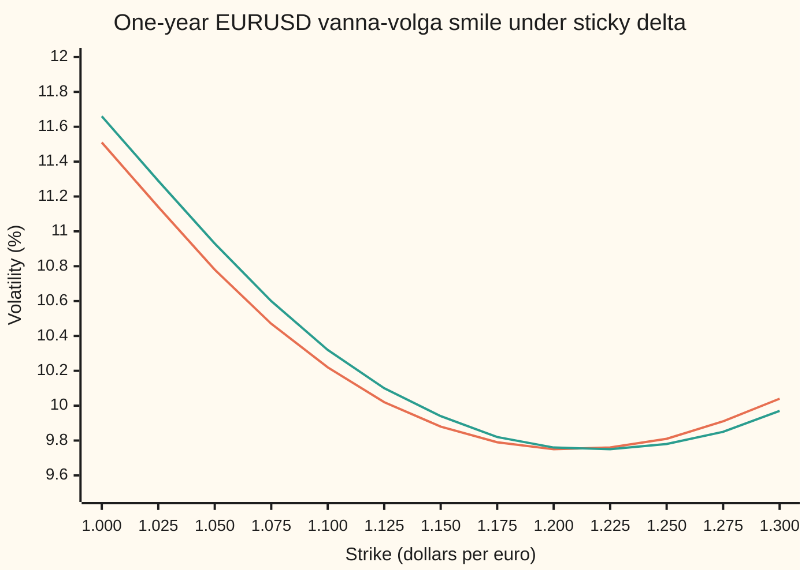
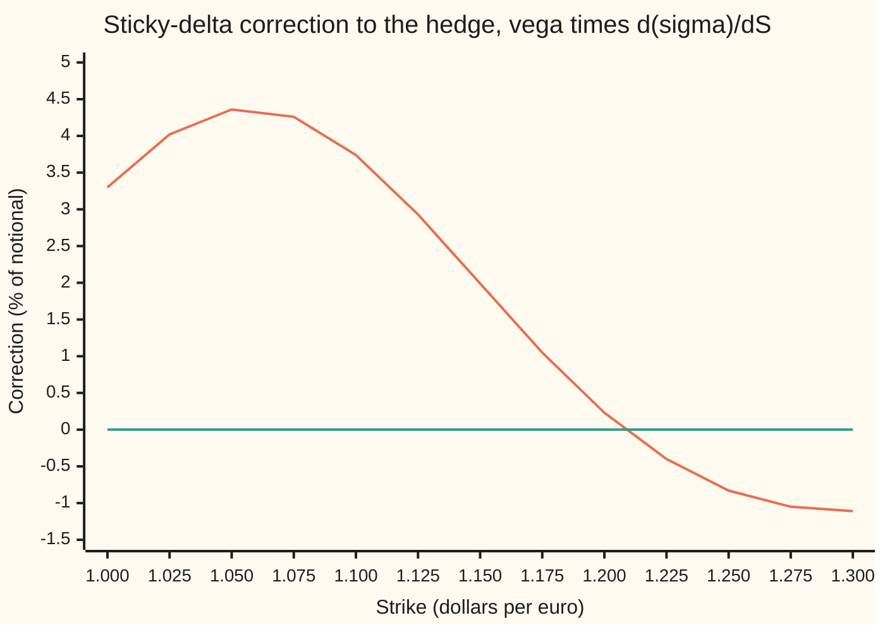

# Hedging with the smile: sticky delta in FX, and the vega term that corrects the delta

[Syllabus](../../../SYLLABUS.md) → [Financial mathematics](../../../SYLLABUS.md#w12) → [The FX smile - risk reversals, butterflies and vanna-volga](../../../SYLLABUS.md#w12-s22) → Hedging with the smile

---

## General Overview

The euro trades at 1.10 dollars. A desk owns a one-year option to buy EUR 10,000,000 at 1.201425 dollars each. That strike is the house market's 25-delta call: the strike where the option's spot delta, its hedge in euros per euro of notional, is exactly 0.25 at the quoted volatility of 9.75%. So the desk sells EUR 2,500,000 against it. A small rise in the euro now gains on the option what it loses on the euros sold.

The euro rises 1%, to 1.111. The option gains USD 29,719.28. After the loss on the euros sold, USD 2,219.28 is left over. Most of that is gamma, the gain from the hedge ratio itself changing as the rate moves, which any delta hedge leaves behind. The rest came from somewhere else: the option's volatility changed, from 9.75% to 9.7613%, although nobody requoted anything.

Currency dealers quote volatility by delta: at the money, 25-delta put, 25-delta call. When the rate moves and the quotes stay the same, the smile moves with the rate. That market habit is called **sticky delta**, and the term is used from here on. Under it the volatility at a fixed strike changes whenever spot moves, so the option's price has a second route to spot. The hedge must count it. The corrected hedge is 0.251910 euros per euro, 0.19% of notional more than the Black-Scholes answer. On the 25-delta put the correction is 4.37% of notional. Ignoring it swings the hedged result by USD 4,810.38 over the same 1% move: a gain if the euro rises, a loss if it falls.

**Under sticky delta the smile rides with spot, so the vol at a fixed strike moves by minus strike over spot times the smile's slope in strike per unit of spot; the hedge is the Black-Scholes delta plus vega times that slope, and dropping the second term leaves a directional bet the size of vega times the vol move.**

**What kind of fact this is:** a model. The correction formula is the chain rule, and the slope identity is a theorem about the vanna-volga curve, both proved in Why it works; whether the market really moves sticky delta is an assumption no theorem supplies.

### The picture: the same smile, before and after a 1% move



Orange: the smile with spot at 1.100. Green: the same three quotes rebuilt with spot at 1.111. The green curve is the orange one slid 1% to the right. Read either at one fixed strike and the vol has changed: up from 10.78% to 10.93% at 1.05, up slightly at 1.20, down at 1.30. Under the other habit, **sticky strike**, each strike keeps its vol and the orange curve would not move at all.

---

## The formula

Notation first, in words. Write $\sigma(K; S)$ for the smile's volatility at strike $K$ when the spot rate is $S$; the semicolon separates the strike being read from the market state. A curly $\partial$ marks a slope with every other input frozen. The plain $d\sigma/dS$ is the change in one strike's vol per unit of spot, with the smile moving by the chosen rule.

$$\Delta_{\text{smile}} \;=\; \Delta_{BS} \;+\; \mathcal{V}\,\frac{d\sigma}{dS}, \qquad \text{sticky delta:}\quad \frac{d\sigma}{dS} \;=\; -\,\frac{K}{S}\,\frac{\partial \sigma}{\partial K}$$

**Read it aloud:** hold the Black-Scholes euros, plus vega times the vol change one unit of spot brings; under sticky delta that vol change is the smile's slope in strike, turned round and scaled by strike over spot.

| Symbol | Plain meaning | In our example | Push it up and the answer… |
| --- | --- | --- | --- |
| $S$, $\lambda$ | spot rate: dollars per euro today; $\lambda$ a scaling factor, used in the proof | 1.10, then 1.111 | the whole smile slides right with it |
| $K$, $K_1$, $K_3$ | strike of the option being hedged; the 25-delta put and call pillar strikes | $K_3$ = 1.201425, $K_1$ = 1.052466 | moves along the smile |
| $\sigma$, $\sigma_i$, $\sigma_3$ | volatility; $\sigma(K; S)$ the smile's vol at strike $K$ with spot at $S$, read off the vanna-volga curve; $\sigma_i$ the pillar quotes, $\sigma_3$ the call pillar's | 9.75% at $K_3$, 10.75% at $K_1$ | $\Delta_{BS}$ drifts toward 0.5 |
| $\partial\sigma/\partial K$, $g$ | the smile's slope in strike, spot frozen, vol per unit of strike (decimals); $g$ the smile as a function of $K/S$ alone | −0.005074 at $K_3$, −0.132631 at $K_1$ | the correction shrinks or changes sign |
| $d\sigma/dS$ | the vol change at a fixed strike per unit of spot, by the chosen rule | +0.005542 at $K_3$, +0.126900 at $K_1$ | the hedge rises one for one with vega |
| $\Delta_{BS}$, $a$ | Black-Scholes (Garman-Kohlhagen) spot delta: the option's exposure in euros per euro of notional, vol frozen; the hedge is the opposite position. $a$: the $d_1$ that gives spot delta 0.25 | +0.25 call, −0.25 put | — |
| $\Delta_{\text{smile}}$, $h$ | the smile-adjusted delta: the delta that counts the vol move; $h$ any hedge ratio a desk might choose | +0.251910 call, −0.206269 put | — |
| $\mathcal{V}$, $x_i$ | vega: price change per 1.00 of volatility, dollars per euro of notional; $x_i$ the vanna-volga weights | 0.344608 at both pillars | the correction grows in proportion |
| $\Gamma$, $\delta$ | gamma: the change in delta per unit of spot; $\delta$ in front of a symbol: its change over one move | — | the unhedgeable leftover grows |
| $F$, $r_d$, $r_f$, $T$ | forward rate $S\,e^{(r_d - r_f)T}$; dollar and euro interest rates, continuously compounded; years to expiry | 1.122221; 5%, 3%, 1 | the pillar strikes move with $F$ |
| $d_1$, $d_2$, $N$, $\varphi$ | the Black-Scholes distances to strike, $d_2 = d_1 - \sigma\sqrt{T}$; bell-curve area to the left; bell-curve height | equal and opposite at the two pillars | — |

The helpers are the ones on [Four deltas for one option](../21-FX%20vanilla%20options%20-%20Garman-Kohlhagen%20and%20the%20desk%20conventions/04-fx-delta-conventions.md): $\Delta_{BS} = e^{-r_fT}N(d_1)$ for a call and $-e^{-r_fT}N(-d_1)$ for a put, $\mathcal{V} = S\,e^{-r_fT}\varphi(d_1)\sqrt{T}$, with $d_1 = [\ln(S/K) + (r_d - r_f + \tfrac12\sigma^2)T]/(\sigma\sqrt{T})$ taken at the strike's own smile vol. The two 25-delta pillars have the same vega because their $d_1$ values are equal and opposite, and $\varphi$ is symmetric.

Under **sticky strike**, $d\sigma/dS = 0$ and the hedge is the Black-Scholes delta.

Conventions verified 27 Sep 2026 against the house cards and Reiswich and Wystup (2012): one-year EURUSD pillars on unadjusted spot delta, premium in dollars, at the money as the delta-neutral straddle. A premium-adjusted pair such as USDJPY puts the pillars at other strikes, and every number here moves with them.

### When it holds

- **The quotes stay put when spot moves.** That is the sticky-delta assumption. In a calm market FX smiles behave roughly this way. In a sharp sell-off the risk reversal itself moves, and no rule for sliding a fixed smile captures that; it is a separate risk, carried by the option's sensitivity to the quotes ([Vanna and volga](03-vanna-and-volga-on-the-smile.md)).
- **Interest rates are fixed over the move.** The smile is pinned to the forward, not to spot. With rates fixed the two move together; a rate change slides the smile without spot moving.
- **The move is small next to the smile's curvature.** The correction is a first slope. For the 25-delta call, near the curve's lowest point, a 1% move changes the vol by 0.0113 points where the slope predicts 0.0061.
- **The curve is right between the pillars.** The slope comes from the vanna-volga curve. Past the outer pillars that curve is a parabola's opinion ([The vanna-volga smile](05-vanna-volga-smile-curve.md)), and so is its slope.

---

## Why it works

### Step 0: the option's mark depends on spot twice

The desk marks the option at Garman-Kohlhagen with the smile's vol for its strike. The mark is $V(S, \sigma(K; S))$. Spot enters once directly and once through the vol the smile assigns. The chain rule for two inputs adds the two routes:

$$\frac{dV}{dS} = \frac{\partial V}{\partial S} + \frac{\partial V}{\partial \sigma}\,\frac{d\sigma}{dS} = \Delta_{BS} + \mathcal{V}\,\frac{d\sigma}{dS}.$$

That is the first formula. The general case, with three rules for the smile's motion and the minimum-variance version, is proved on [Smile-adjusted delta](../12-The%20smile%20and%20the%20surface/05-smile-adjusted-delta.md). Everything on this card is about $d\sigma/dS$ for a smile built the way currency desks build it.

### Step 1: sticky delta pins every pillar strike to the forward

A 25-delta call pillar is the strike where $e^{-r_fT}N(d_1) = 0.25$. Call the $d_1$ that does it $a$; it depends only on $r_f$ and $T$. Solving $d_1 = a$ for the strike gives

$$K_3 = F\,\exp\!\big(-a\,\sigma_3\sqrt{T} + \tfrac12\sigma_3^2T\big),$$

and the same shape for the put pillar and the at-the-money pillar ([Four deltas for one option](../21-FX%20vanilla%20options%20-%20Garman-Kohlhagen%20and%20the%20desk%20conventions/04-fx-delta-conventions.md)). Here $\sigma_3$ = 9.75% is the call pillar's quoted vol. The bracket holds quotes and time only. So if the quotes stay put, each pillar strike is the forward times a fixed number. Move spot 1% and every pillar moves 1%. Checked: with spot at 1.111 the 25-delta call strike is 1.213439, 1.010000 times the old one, and its vol is still 9.75%.

### Step 2: the whole vanna-volga curve rides with the pillars

The vanna-volga curve fills in the other strikes from the three pillars ([Vanna-volga pricing](04-vanna-volga-pricing.md)). Scale spot and every strike by the same factor and each piece of it scales cleanly: prices scale by the factor, weights do not change, implied vols do not change. So the vol at strike $K$ with spot $S$ depends only on the ratio $K/S$:

$$\sigma(K; S) = g(K/S)$$

for one fixed function $g$. Differentiate both sides once in $S$ and once in $K$:

$$\frac{d\sigma}{dS} = -\frac{K}{S^2}\,g'(K/S), \qquad \frac{\partial\sigma}{\partial K} = \frac{1}{S}\,g'(K/S), \qquad\text{so}\qquad \frac{d\sigma}{dS} = -\frac{K}{S}\,\frac{\partial\sigma}{\partial K}.$$

A falling smile in strike means a rising vol at a fixed strike when spot rises. The fixed strike has become, relative to spot, a lower strike, and the smile is higher there.

<details>
<summary>Detailed proof: why the vanna-volga curve depends only on strike over spot</summary>

Fix the rates and the expiry and let $\lambda > 0$. Garman-Kohlhagen's $d_1$ and $d_2$ depend on $S$ and $K$ only through $S/K$, so $C(\lambda S, \lambda K, \sigma) = \lambda\,C(S, K, \sigma)$: the price has degree 1. Differentiating in $\sigma$ and in $S$ gives vega of degree 1, vanna ($\partial\mathcal{V}/\partial S$) of degree 0 and volga ($\partial\mathcal{V}/\partial\sigma$) of degree 1.

By Step 1 the pillar strikes at spot $\lambda S$ are $\lambda K_i$, with unchanged vols $\sigma_i$. The vanna-volga weights $x_i$ solve three equations: the pillars' vega, vanna and volga, weighted, equal the target's. At $(\lambda S, \lambda K)$ each equation's two sides both scale by the same power of $\lambda$ (1, 0, 1), so the same $x_i$ solve it. The vanna-volga price is the flat-vol price plus $\sum_i x_i$ times each pillar's market-minus-flat price; every term has degree 1. So the price at $(\lambda S, \lambda K)$ is $\lambda$ times the price at $(S, K)$.

The smile vol is the $\sigma$ that makes $C(S, K, \sigma)$ equal that price. It exists when that price lies between the call's no-arbitrage bounds, as it does at every strike on this card. Since $C(\lambda S, \lambda K, \sigma) = \lambda\,C(S, K, \sigma)$ for every $\sigma$, the same $\sigma$ solves both, and it is unique because a call's price rises strictly with $\sigma$. Hence $\sigma(\lambda K; \lambda S) = \sigma(K; S)$. Set $\lambda = 1/S$: $\sigma(K; S) = \sigma(K/S; 1) = g(K/S)$.

Literal sticky delta, "each delta keeps its vol", follows. The option's delta depends on $K/S$ and $\sigma$ only; with $\sigma = g(K/S)$ it depends on $K/S$ alone. So a given delta sits at a given $K/S$ and carries the same vol whatever spot is. For this curve, sticky delta and sticky moneyness are one rule.

</details>

### Step 3: the slope, read off the curve

At the call pillar the smile falls 0.005074 per unit of strike. Step 2 turns that into $d\sigma/dS = -(1.201425/1.10) \times (-0.005074) = +0.005542$ per unit of spot. At the put pillar the smile is much steeper, −0.132631, and the vol rises 0.126900 per unit of spot.

There is a closed-form route too. The first-order vanna-volga curve is the parabola in $\ln K$ through the three pillars. Its slope in $\ln K$ is a short formula in the pillar log-strikes, and $d\sigma/dS$ is minus that slope divided by $S$. It gives +0.006073 at the call pillar and +0.131280 at the put. Close, not equal: the full curve bends away from the parabola, most near its lowest point, which sits just past the call pillar.

### Step 4: the hedge

Put the numbers in. At the call pillar, $\mathcal{V}\,d\sigma/dS = 0.344608 \times 0.005542 = 0.001910$, so the smile-adjusted delta is 0.251910. At the put pillar the same vega times 0.126900 is 0.043731, and the hedge is −0.25 + 0.043731 = −0.206269.

The correction has the same sign for the call and the put: vega is positive for both, and at both strikes the vol rises with spot. For the put it shrinks the delta's size: the put loses less than Black-Scholes says as the euro rises, because its vol rises, so fewer euros are needed against it.

### Step 5: what the Black-Scholes hedge leaves behind

Over a move $\delta S$, with $\delta\sigma$ the vol change it brings, the option's value changes by about $\Delta_{BS}\,\delta S + \tfrac12\Gamma\,\delta S^2 + \mathcal{V}\,\delta\sigma$ ([The Greeks together](../09-The%20Greeks%2C%20one%20each/09-greeks-together-taylor-pnl.md)). A hedge of $h$ euros leaves the value change minus $h\,\delta S$.

- With $h = \Delta_{BS}$ the leftover is $\tfrac12\Gamma\,\delta S^2 + \mathcal{V}\,\delta\sigma$. The gamma term is the same on an up move and a down move; the vega term flips sign with the move. So the Black-Scholes hedge carries a directional bet.
- With $h = \Delta_{\text{smile}}$ the vega term is cancelled to first order, since $\delta\sigma \approx (d\sigma/dS)\,\delta S$. What remains is gamma plus the curvature of the vol move.

Sticky strike and sticky delta disagree only through $\delta\sigma$.

A different route asks the market instead of a rule: fit the typical vol move per unit of spot from history and use it in place of $d\sigma/dS$. That is the minimum-variance delta of [Smile-adjusted delta](../12-The%20smile%20and%20the%20surface/05-smile-adjusted-delta.md).

---

## Worked numbers, by hand

House market: spot 1.10, dollar rate 5%, euro rate 3%, one year; ATM 10.00%, 25-delta risk reversal −1.00%, butterfly +0.25%. Pillars 1.052466, 1.127847, 1.201425. Notional EUR 10,000,000. Hedge the 25-delta call.

| Step | Arithmetic | Value |
| --- | --- | --- |
| strike and vol | the 25-delta call pillar | 1.201425 at 9.75% |
| Black-Scholes spot delta | $e^{-0.03}N(d_1)$ at 9.75% | 0.25 |
| vega | $1.10 \times e^{-0.03}\,\varphi(d_1) \times 1$ | 0.344608 |
| smile slope in strike | slope of the vanna-volga curve at 1.201425 | −0.005074 |
| slope in spot | $-(1.201425 / 1.10) \times (-0.005074)$ | +0.005542 |
| correction | $0.344608 \times 0.005542$ | 0.001910 |
| **smile-adjusted delta** | $0.25 + 0.001910$ | **0.251910** |
| extra euros to sell | $10{,}000{,}000 \times 0.001910$ | EUR 19,098 (0.19% of notional) |
| effect of skipping it over a 1% move | $19{,}098 \times 0.011$ | USD 210.08 |

The desk should sell EUR 19,098 more than the Black-Scholes EUR 2,500,000. Skip them and a 1% rise in the euro pays the desk USD 210.08 more than it should, and a 1% fall costs it about the same. For the put pillar the same arithmetic gives a correction of 0.043731: EUR 437,307, or 4.37% of notional, worth USD 4,810.38 over the same move.

### What breaks if you drop a piece

| Mistake | Comes out at | What went wrong |
| --- | --- | --- |
| Hedge the put at Black-Scholes delta in a sticky-delta market, euro up 1% | USD 6,212.85 left over (smile hedge: 1,402.48) | The put's vol rose 0.1420 points; the hedge ignored it |
| The same, euro down 1% | USD −3,283.88 (smile hedge: +1,526.49) | The same vega bet, now losing: a long option, hedged, lost money |
| Drop the minus sign in $-(K/S)\,\partial\sigma/\partial K$ | call hedge 0.248090 (right: 0.251910) | A falling smile in strike means a rising vol at a fixed strike as spot rises |
| Slope in vol points times vega per 1.00 | call hedge 0.440979 (right: 0.251910) | Vega per 1.00 of vol needs the slope as a decimal |
| Trust the slope over a 1% move at the call pillar | 0.0061 vol points (actual: 0.0113) | Near the smile's lowest point the slope itself changes fast |

---

## One 1% move, traced

The mystery: the desk hedged, the quotes never changed, and the hedge still leaked. Both options below are owned by the desk on EUR 10,000,000 each, hedged, and the euro rises from 1.10 to 1.111.

| | 25-delta call, 1.201425 | 25-delta put, 1.052466 |
| --- | --- | --- |
| vol before | 9.7500% | 10.7500% |
| vol after, sticky delta | 9.7613% | 10.8920% |
| vol change: slope × move, and actual | +0.0061, +0.0113 points | +0.1396, +0.1420 points |
| value change, sticky delta | USD 29,719.28 | USD −21,287.15 |
| value change if strikes kept their vols (sticky strike) | USD 29,299.45 | USD −25,935.21 |
| gamma part, $\tfrac12\Gamma\,\delta S^2$ | USD 1,767.22 | USD 1,602.83 |
| vega part, $\mathcal{V}\,\delta\sigma$ | USD 419.75 | USD 4,633.76 |

The two options have the same vega and nearly the same gamma. What separates them is the slope of the smile at their strikes. The call sits near the smile's floor, where it is almost flat. The put sits on the steep downside wing.

### Force one: the leftover with each hedge, euro up 1%

```
USD left over after the hedge, EUR 10,000,000 notional (one █ = USD 250)
call, Black-Scholes hedge   █████████                  USD 2,219.28
call, smile hedge           ████████                   USD 2,009.20
call, gamma alone           ███████                    USD 1,767.22
put,  Black-Scholes hedge   █████████████████████████  USD 6,212.85
put,  smile hedge           ██████                     USD 1,402.48
put,  gamma alone           ██████                     USD 1,602.83
```

On the put the smile hedge removes USD 4,810.38 and leaves roughly the gamma gain any hedged long option earns on a move. On the call it removes only USD 210.08 of the USD 419.75 vega part: the vol moved about twice as far as its slope predicted, because the curve bends there.

### Force two: the same move, downward

With the euro down 1% instead, the call's Black-Scholes hedge leaves USD 1,710.33 and its smile hedge USD 1,920.40: at the smile's floor the first slope helps one way and hurts slightly the other. The put's Black-Scholes hedge leaves USD −3,283.88, a loss on a long option that was supposed to be neutral; the smile hedge leaves USD 1,526.49. The sign flip is the signature of an unhedged vega bet.

### The correction across strikes



Orange: the correction, in percent of notional, for an option at each strike, spot 1.10. Green: zero, the sticky-strike correction. It is largest on the steep put wing, 4.36% at 1.05, crosses zero near the smile's lowest point, and turns negative above it, where the smile rises with strike and a fixed strike's vol falls as spot rises. It is the same for a call and a put at one strike, since they share a vega.

---

## Code, from first principles, and it actually runs

The scripts build the house pillars from the three quotes, price any strike by the full vanna-volga method (weights by Gaussian elimination, the vol by halving), and read the smile. They reach $d\sigma/dS$ by three roads: the strike-slope identity of Step 2, spot bumped with the pillars rebuilt, and the first-order parabola's closed-form slope. They reach the hedge by two: the formula, and a full reprice of the vanna-volga price with spot bumped. Then they trace the 1% move under both rules, split the leftover into gamma and vega parts, and print every number and chart point on this card. The bell-curve area is summed from its series in both languages.

### Python

```python
# Hedging with the smile -- the check behind the card.  Standard library only.
# House FX market: EURUSD spot 1.10, USD rate 5%, EUR rate 3%, one year; ATM 10%,
# 25-delta risk reversal -1%, 25-delta butterfly +0.25%, pillars on spot delta.
# The smile is the vanna-volga curve.  Sticky delta: the quotes stay put when spot
# moves, so the pillars are rebuilt at the new spot.  Normal CDF from its series,
# strikes and vols by bisection, vanna-volga weights by Gaussian elimination.
from math import log, sqrt, exp, pi

S0, RD, RF, T = 1.10, 0.05, 0.03, 1.0
ATM, RR, BF, NOTIONAL = 0.10, -0.01, 0.0025, 10_000_000

def phi(x): return exp(-0.5 * x * x) / sqrt(2 * pi)            # bell-curve height
def N(x):                                                        # bell-curve area, by series
    if abs(x) > 8: return 0.0 if x < 0 else 1.0
    term = s = x; n = 0
    while abs(term) > 1e-17:
        n += 1; term *= x * x / (2 * n + 1); s += term
    return 0.5 + phi(x) * s
def bisect(f, target, lo, hi):                                   # f increasing
    for _ in range(200):
        mid = 0.5 * (lo + hi)
        lo, hi = (mid, hi) if f(mid) < target else (lo, mid)
    return 0.5 * (lo + hi)

def d1(s, K, v): return (log(s / K) + (RD - RF + 0.5 * v * v) * T) / (v * sqrt(T))
def call(s, K, v):                                               # Garman-Kohlhagen, USD per EUR
    a = d1(s, K, v); return s * exp(-RF * T) * N(a) - K * exp(-RD * T) * N(a - v * sqrt(T))
def put(s, K, v): return call(s, K, v) - s * exp(-RF * T) + K * exp(-RD * T)
def delta(s, K, v): return exp(-RF * T) * N(d1(s, K, v))         # spot delta of the call
def vega(s, K, v): return s * exp(-RF * T) * phi(d1(s, K, v)) * sqrt(T)
def vanna(s, K, v): a = d1(s, K, v); return -exp(-RF * T) * phi(a) * (a - v * sqrt(T)) / v
def volga(s, K, v): a = d1(s, K, v); return vega(s, K, v) * a * (a - v * sqrt(T)) / v

def pillars(s):                                                  # quotes -> strikes at spot s
    F = s * exp((RD - RF) * T); vols = [ATM + BF - RR / 2, ATM, ATM + BF + RR / 2]
    x = bisect(N, 0.25 * exp(RF * T), -10, 10)                   # N(d1) = 0.25 e^{rf T}
    ks = [F * exp(x * vols[0] * sqrt(T) + 0.5 * vols[0] ** 2 * T), F * exp(0.5 * ATM * ATM * T),
          F * exp(-x * vols[2] * sqrt(T) + 0.5 * vols[2] ** 2 * T)]
    return ks, vols
def gauss(A, b):                                                 # Gaussian elimination, partial pivots
    M = [A[i][:] + [b[i]] for i in range(3)]
    for c in range(3):
        p = max(range(c, 3), key=lambda r: abs(M[r][c])); M[c], M[p] = M[p], M[c]
        for r in range(c + 1, 3):
            f = M[r][c] / M[c][c]; M[r] = [M[r][j] - f * M[c][j] for j in range(4)]
    x = [0.0] * 3
    for r in (2, 1, 0): x[r] = (M[r][3] - sum(M[r][j] * x[j] for j in range(r + 1, 3))) / M[r][r]
    return x
def vv(s, K):                                                    # vanna-volga call price at spot s
    ks, vols = pillars(s); gs = (vega, vanna, volga)
    x = gauss([[g(s, k, ATM) for k in ks] for g in gs], [g(s, K, ATM) for g in gs])
    return call(s, K, ATM) + sum(xi * (call(s, k, v) - call(s, k, ATM)) for xi, k, v in zip(x, ks, vols))
def smile(s, K): return bisect(lambda v: call(s, K, v), vv(s, K), 0.001, 1.0)
def first_order_slope(s, K):                                     # d(sigma)/d(ln K), quadratic in ln K
    ks, vols = pillars(s); z, L = log(K), [log(k) for k in ks]
    return sum(v * (2 * z - L[j] - L[k]) / ((L[i] - L[j]) * (L[i] - L[k]))
               for v, (i, j, k) in zip(vols, ((0, 1, 2), (1, 0, 2), (2, 0, 1))))

def study(K, sign):                                              # sign +1 call, -1 put
    h, s1 = 1e-4, S0 * 1.01
    v0, v1 = smile(S0, K), smile(s1, K)
    slope = lambda s: (smile(s + h, K) - smile(s - h, K)) / (2 * h)       # rebuild at moved spot
    sk = (smile(S0, K + h) - smile(S0, K - h)) / (2 * h)                   # smile's slope in strike
    road1 = -(K / S0) * sk
    road2, road3 = slope(S0), -first_order_slope(S0, K) / S0              # first-order smile
    bs = delta(S0, K, v0) - (exp(-RF * T) if sign < 0 else 0)
    sa = bs + vega(S0, K, v0) * road2
    pr = lambda s: vv(s, K) - (0 if sign > 0 else s * exp(-RF * T) - K * exp(-RD * T))
    rep = (pr(S0 + h) - pr(S0 - h)) / (2 * h)                              # full reprice, sticky delta
    price = call if sign > 0 else put
    gam = exp(-RF * T) * phi(d1(S0, K, v0)) / (S0 * v0 * sqrt(T))
    return dict(K=K, sk=sk, v0=v0, v1=v1, r1=road1, r2=road2, r3=road3, bs=bs, sa=sa, rep=rep, move=s1 - S0,
                vg=vega(S0, K, v0), dsd=pr(s1) - pr(S0), dss=price(s1, K, v0) - price(S0, K, v0),
                gterm=0.5 * gam * (s1 - S0) ** 2, vterm=vega(s1, K, v0) * (v1 - v0),
                trap=0.5 * (road2 + slope(s1)) * (s1 - S0), dn=pr(S0 * 0.99) - pr(S0), mvd=-0.01 * S0)

ks, vols = pillars(S0)
c, p = study(ks[2], +1), study(ks[0], -1)
s1 = S0 * 1.01
k1 = bisect(lambda k: -delta(s1, k, smile(s1, k)), -0.25, 1.10, 1.40)  # new 25-delta strike
print(f"forward {S0 * exp((RD - RF) * T):.6f}   pillars " + " ".join(f"{k:.6f}" for k in ks))
for nm, r in (("call", c), ("put ", p)):
    print(f"{nm} strike                 {r['K']:.6f}   vol {r['v0']*100:.4f}%")
    print(f"{nm} BS spot delta          {r['bs']:+.6f}")
    print(f"{nm} vega, per 1.00 of vol  {r['vg']:.6f}")
    print(f"{nm} dvol/dK, smile slope   {r['sk']:+.6f}")
    print(f"{nm} dvol/dS, strike slope  {r['r1']:+.6f}")
    print(f"{nm} dvol/dS, rebuilt smile {r['r2']:+.6f}")
    print(f"{nm} dvol/dS, first order   {r['r3']:+.6f}")
    print(f"{nm} vega x dvol/dS         {r['sa']-r['bs']:+.6f}")
    print(f"{nm} smile delta, formula   {r['sa']:+.6f}")
    print(f"{nm} smile delta, reprice   {r['rep']:+.6f}")
    print(f"{nm} vol after 1% move      {r['v1']*100:.4f}%   sticky strike {r['v0']*100:.4f}%")
    print(f"{nm} vol change, points     slope x move {r['r2']*r['move']*100:+.4f}   actual {(r['v1']-r['v0'])*100:+.4f}")
    print(f"{nm} value change, USD      sticky delta {r['dsd']*NOTIONAL:,.2f}   sticky strike {r['dss']*NOTIONAL:,.2f}")
    print(f"{nm} left after hedge, USD  BS {(r['dsd']-r['bs']*r['move'])*NOTIONAL:,.2f}   smile {(r['dsd']-r['sa']*r['move'])*NOTIONAL:,.2f}")
    print(f"{nm} half gamma x move^2    {r['gterm']*NOTIONAL:,.2f}   vega x vol change {r['vterm']*NOTIONAL:,.2f}")
    print(f"{nm} 1% down, left, USD     BS {(r['dn']-r['bs']*r['mvd'])*NOTIONAL:,.2f}   smile {(r['dn']-r['sa']*r['mvd'])*NOTIONAL:,.2f}")
    print(f"{nm} hedge gap, EUR         {(r['sa']-r['bs'])*NOTIONAL:,.0f}   % of notional {(r['sa']-r['bs'])*100:.2f}   x move, USD {(r['sa']-r['bs'])*r['move']*NOTIONAL:,.2f}")
print(f"25-delta strike at 1.111    {k1:.6f}   vol {smile(s1, k1)*100:.4f}%   ratio {k1/ks[2]:.6f}")
print(f"wrong: sign of strike slope {c['bs'] - c['vg']*c['r2']:+.6f}")
print(f"wrong: slope in vol points  {c['bs'] + c['vg']*c['r2']*100:+.6f}")
grid = [1.00 + 0.025 * i for i in range(13)]
print("chart strike      " + " ".join(f"{k:6.3f}" for k in grid))
print("chart vol % 1.100 " + " ".join(f"{smile(S0, k)*100:6.2f}" for k in grid))
print("chart vol % 1.111 " + " ".join(f"{smile(s1, k)*100:6.2f}" for k in grid))
corr = [vega(S0, k, smile(S0, k)) * (smile(S0 + 1e-4, k) - smile(S0 - 1e-4, k)) / 2e-4 for k in grid]
print("chart correction %" + " ".join(f"{x*100:6.2f}" for x in corr))

assert abs(c['bs'] - 0.25) < 1e-12, "call pillar sits at 25 delta"
assert abs(p['bs'] + 0.25) < 1e-12, "put pillar sits at -25 delta"
for r in (c, p):
    assert abs(r['r1'] - r['r2']) < 1e-7, "strike slope and rebuilt smile agree (sticky delta = sticky moneyness)"
    assert abs(r['sa'] - r['rep']) < 1e-6, "formula and full reprice agree"
    assert abs(r['r3'] - r['r2']) < 0.1 * abs(r['r2']), "first-order smile within 10% of the exact slope"
    assert abs(r['trap'] / (r['v1'] - r['v0']) - 1) < 0.03, "vol change = average slope x move"
    assert abs(r['dss'] - r['bs'] * r['move'] - r['gterm']) < 0.03 * r['gterm'], "sticky-strike residual is gamma"
    assert abs(r['dsd'] - r['dss'] - r['vterm']) < 0.03 * abs(r['vterm']), "the smile adds vega x vol change"
assert abs(k1 / ks[2] - 1.01) < 1e-9, "25-delta strike rides with spot"
assert abs(smile(s1, k1) - vols[2]) < 1e-9, "25-delta vol unchanged"
print("ALL CHECKS PASS")
```

**Ran 2026-09-27 on macOS, Python 3.14.6, standard library only. All checks passed. Output, pasted from the run:**

```
forward 1.122221   pillars 1.052466 1.127847 1.201425
call strike                 1.201425   vol 9.7500%
call BS spot delta          +0.250000
call vega, per 1.00 of vol  0.344608
call dvol/dK, smile slope   -0.005074
call dvol/dS, strike slope  +0.005542
call dvol/dS, rebuilt smile +0.005542
call dvol/dS, first order   +0.006073
call vega x dvol/dS         +0.001910
call smile delta, formula   +0.251910
call smile delta, reprice   +0.251910
call vol after 1% move      9.7613%   sticky strike 9.7500%
call vol change, points     slope x move +0.0061   actual +0.0113
call value change, USD      sticky delta 29,719.28   sticky strike 29,299.45
call left after hedge, USD  BS 2,219.28   smile 2,009.20
call half gamma x move^2    1,767.22   vega x vol change 419.75
call 1% down, left, USD     BS 1,710.33   smile 1,920.40
call hedge gap, EUR         19,098   % of notional 0.19   x move, USD 210.08
put  strike                 1.052466   vol 10.7500%
put  BS spot delta          -0.250000
put  vega, per 1.00 of vol  0.344608
put  dvol/dK, smile slope   -0.132631
put  dvol/dS, strike slope  +0.126900
put  dvol/dS, rebuilt smile +0.126900
put  dvol/dS, first order   +0.131280
put  vega x dvol/dS         +0.043731
put  smile delta, formula   -0.206269
put  smile delta, reprice   -0.206269
put  vol after 1% move      10.8920%   sticky strike 10.7500%
put  vol change, points     slope x move +0.1396   actual +0.1420
put  value change, USD      sticky delta -21,287.15   sticky strike -25,935.21
put  left after hedge, USD  BS 6,212.85   smile 1,402.48
put  half gamma x move^2    1,602.83   vega x vol change 4,633.76
put  1% down, left, USD     BS -3,283.88   smile 1,526.49
put  hedge gap, EUR         437,307   % of notional 4.37   x move, USD 4,810.38
25-delta strike at 1.111    1.213439   vol 9.7500%   ratio 1.010000
wrong: sign of strike slope +0.248090
wrong: slope in vol points  +0.440979
chart strike       1.000  1.025  1.050  1.075  1.100  1.125  1.150  1.175  1.200  1.225  1.250  1.275  1.300
chart vol % 1.100  11.51  11.14  10.78  10.47  10.22  10.02   9.88   9.79   9.75   9.76   9.81   9.91  10.04
chart vol % 1.111  11.66  11.29  10.93  10.60  10.32  10.10   9.94   9.82   9.76   9.75   9.78   9.85   9.97
chart correction %  3.30   4.02   4.36   4.26   3.74   2.93   1.99   1.05   0.23  -0.40  -0.83  -1.05  -1.11
ALL CHECKS PASS
```

### Rust

```rust
// Hedging with the smile -- the check behind the card.  Rust std only.
// House FX market: EURUSD spot 1.10, USD rate 5%, EUR rate 3%, one year; ATM 10%,
// 25-delta risk reversal -1%, 25-delta butterfly +0.25%, pillars on spot delta.
// The smile is the vanna-volga curve.  Sticky delta: the quotes stay put when spot
// moves, so the pillars are rebuilt at the new spot.  Normal CDF from its series,
// strikes and vols by bisection, vanna-volga weights by Gaussian elimination.
const S0: f64 = 1.10; const RD: f64 = 0.05; const RF: f64 = 0.03; const T: f64 = 1.0;
const ATM: f64 = 0.10; const RR: f64 = -0.01; const BF: f64 = 0.0025; const NOTIONAL: f64 = 10_000_000.0;

fn phi(x: f64) -> f64 { (-0.5 * x * x).exp() / (2.0 * std::f64::consts::PI).sqrt() }
fn n(x: f64) -> f64 {
    if x.abs() > 8.0 { return if x < 0.0 { 0.0 } else { 1.0 }; }
    let (mut term, mut s, mut k) = (x, x, 0.0);
    while term.abs() > 1e-17 { k += 1.0; term *= x * x / (2.0 * k + 1.0); s += term; }
    0.5 + phi(x) * s
}
fn bisect(f: &dyn Fn(f64) -> f64, target: f64, mut lo: f64, mut hi: f64) -> f64 {
    for _ in 0..200 { let mid = 0.5 * (lo + hi); if f(mid) < target { lo = mid } else { hi = mid } }
    0.5 * (lo + hi)
}
fn d1(s: f64, k: f64, v: f64) -> f64 { ((s / k).ln() + (RD - RF + 0.5 * v * v) * T) / (v * T.sqrt()) }
fn call(s: f64, k: f64, v: f64) -> f64 {
    let a = d1(s, k, v); s * (-RF * T).exp() * n(a) - k * (-RD * T).exp() * n(a - v * T.sqrt())
}
fn put(s: f64, k: f64, v: f64) -> f64 { call(s, k, v) - s * (-RF * T).exp() + k * (-RD * T).exp() }
fn delta(s: f64, k: f64, v: f64) -> f64 { (-RF * T).exp() * n(d1(s, k, v)) }
fn vega(s: f64, k: f64, v: f64) -> f64 { s * (-RF * T).exp() * phi(d1(s, k, v)) * T.sqrt() }
fn vanna(s: f64, k: f64, v: f64) -> f64 { let a = d1(s, k, v); -(-RF * T).exp() * phi(a) * (a - v * T.sqrt()) / v }
fn volga(s: f64, k: f64, v: f64) -> f64 { let a = d1(s, k, v); vega(s, k, v) * a * (a - v * T.sqrt()) / v }

fn pillars(s: f64) -> ([f64; 3], [f64; 3]) {
    let f = s * ((RD - RF) * T).exp();
    let vols = [ATM + BF - RR / 2.0, ATM, ATM + BF + RR / 2.0];
    let x = bisect(&n, 0.25 * (RF * T).exp(), -10.0, 10.0);
    let ks = [f * (x * vols[0] * T.sqrt() + 0.5 * vols[0] * vols[0] * T).exp(), f * (0.5 * ATM * ATM * T).exp(),
              f * (-x * vols[2] * T.sqrt() + 0.5 * vols[2] * vols[2] * T).exp()];
    (ks, vols)
}
fn gauss(a: [[f64; 3]; 3], b: [f64; 3]) -> [f64; 3] {
    let mut m = [[0.0; 4]; 3];
    for i in 0..3 { for j in 0..3 { m[i][j] = a[i][j]; } m[i][3] = b[i]; }
    for c in 0..3 {
        let mut p = c;
        for r in c..3 { if m[r][c].abs() > m[p][c].abs() { p = r; } }
        m.swap(c, p);
        for r in c + 1..3 { let f = m[r][c] / m[c][c]; for j in 0..4 { m[r][j] -= f * m[c][j]; } }
    }
    let mut x = [0.0; 3];
    for r in (0..3).rev() {
        let mut s = m[r][3];
        for j in r + 1..3 { s -= m[r][j] * x[j]; }
        x[r] = s / m[r][r];
    }
    x
}
fn vv(s: f64, k: f64) -> f64 {
    let (ks, vols) = pillars(s);
    let gs: [fn(f64, f64, f64) -> f64; 3] = [vega, vanna, volga];
    let mut a = [[0.0; 3]; 3]; let mut b = [0.0; 3];
    for r in 0..3 { for c in 0..3 { a[r][c] = gs[r](s, ks[c], ATM); } b[r] = gs[r](s, k, ATM); }
    let x = gauss(a, b);
    let mut p = call(s, k, ATM);
    for i in 0..3 { p += x[i] * (call(s, ks[i], vols[i]) - call(s, ks[i], ATM)); }
    p
}
fn smile(s: f64, k: f64) -> f64 { let p = vv(s, k); bisect(&|v| call(s, k, v), p, 0.001, 1.0) }
fn first_order_slope(s: f64, k: f64) -> f64 {
    let (ks, vols) = pillars(s);
    let z = k.ln(); let l = [ks[0].ln(), ks[1].ln(), ks[2].ln()];
    let idx = [(0, 1, 2), (1, 0, 2), (2, 0, 1)];
    let mut t = 0.0;
    for (m, &(i, j, q)) in idx.iter().enumerate() { t += vols[m] * (2.0 * z - l[j] - l[q]) / ((l[i] - l[j]) * (l[i] - l[q])); }
    t
}
fn comma(x: f64, dp: usize) -> String {
    let s = format!("{:.*}", dp, x.abs());
    let (int, frac) = match s.find('.') { Some(i) => (&s[..i], &s[i..]), None => (&s[..], "") };
    let mut out = String::new();
    for (i, ch) in int.chars().enumerate() { if i > 0 && (int.len() - i) % 3 == 0 { out.push(','); } out.push(ch); }
    format!("{}{}{}", if x < 0.0 { "-" } else { "" }, out, frac)
}
struct R { k: f64, sk: f64, v0: f64, v1: f64, r1: f64, r2: f64, r3: f64, bs: f64, sa: f64, rep: f64, mv: f64,
           vg: f64, dsd: f64, dss: f64, gterm: f64, vterm: f64, trap: f64, dn: f64, mvd: f64 }
fn study(k: f64, sign: f64) -> R {
    let (h, s1) = (1e-4, S0 * 1.01);
    let (v0, v1) = (smile(S0, k), smile(s1, k));
    let slope = |s: f64| (smile(s + h, k) - smile(s - h, k)) / (2.0 * h);
    let sk = (smile(S0, k + h) - smile(S0, k - h)) / (2.0 * h);
    let r1 = -(k / S0) * sk;
    let (r2, r3) = (slope(S0), -first_order_slope(S0, k) / S0);
    let bs = delta(S0, k, v0) - if sign < 0.0 { (-RF * T).exp() } else { 0.0 };
    let sa = bs + vega(S0, k, v0) * r2;
    let pr = |s: f64| vv(s, k) - if sign > 0.0 { 0.0 } else { s * (-RF * T).exp() - k * (-RD * T).exp() };
    let rep = (pr(S0 + h) - pr(S0 - h)) / (2.0 * h);
    let price: fn(f64, f64, f64) -> f64 = if sign > 0.0 { call } else { put };
    let gam = (-RF * T).exp() * phi(d1(S0, k, v0)) / (S0 * v0 * T.sqrt());
    R { k, sk, v0, v1, r1, r2, r3, bs, sa, rep, mv: s1 - S0, vg: vega(S0, k, v0), dsd: pr(s1) - pr(S0),
        dss: price(s1, k, v0) - price(S0, k, v0), gterm: 0.5 * gam * (s1 - S0).powi(2),
        vterm: vega(s1, k, v0) * (v1 - v0), trap: 0.5 * (r2 + slope(s1)) * (s1 - S0),
        dn: pr(S0 * 0.99) - pr(S0), mvd: -0.01 * S0 }
}

fn main() {
    let (ks, vols) = pillars(S0);
    let (c, p) = (study(ks[2], 1.0), study(ks[0], -1.0));
    let s1 = S0 * 1.01;
    let k1 = bisect(&|k| -delta(s1, k, smile(s1, k)), -0.25, 1.10, 1.40);
    println!("forward {:.6}   pillars {:.6} {:.6} {:.6}", S0 * ((RD - RF) * T).exp(), ks[0], ks[1], ks[2]);
    for (nm, r) in [("call", &c), ("put ", &p)] {
        println!("{} strike                 {:.6}   vol {:.4}%", nm, r.k, r.v0 * 100.0);
        println!("{} BS spot delta          {:+.6}", nm, r.bs);
        println!("{} vega, per 1.00 of vol  {:.6}", nm, r.vg);
        println!("{} dvol/dK, smile slope   {:+.6}", nm, r.sk);
        println!("{} dvol/dS, strike slope  {:+.6}", nm, r.r1);
        println!("{} dvol/dS, rebuilt smile {:+.6}", nm, r.r2);
        println!("{} dvol/dS, first order   {:+.6}", nm, r.r3);
        println!("{} vega x dvol/dS         {:+.6}", nm, r.sa - r.bs);
        println!("{} smile delta, formula   {:+.6}", nm, r.sa);
        println!("{} smile delta, reprice   {:+.6}", nm, r.rep);
        println!("{} vol after 1% move      {:.4}%   sticky strike {:.4}%", nm, r.v1 * 100.0, r.v0 * 100.0);
        println!("{} vol change, points     slope x move {:+.4}   actual {:+.4}", nm, r.r2 * r.mv * 100.0, (r.v1 - r.v0) * 100.0);
        println!("{} value change, USD      sticky delta {}   sticky strike {}", nm, comma(r.dsd * NOTIONAL, 2), comma(r.dss * NOTIONAL, 2));
        println!("{} left after hedge, USD  BS {}   smile {}", nm, comma((r.dsd - r.bs * r.mv) * NOTIONAL, 2), comma((r.dsd - r.sa * r.mv) * NOTIONAL, 2));
        println!("{} half gamma x move^2    {}   vega x vol change {}", nm, comma(r.gterm * NOTIONAL, 2), comma(r.vterm * NOTIONAL, 2));
        println!("{} 1% down, left, USD     BS {}   smile {}", nm, comma((r.dn - r.bs * r.mvd) * NOTIONAL, 2), comma((r.dn - r.sa * r.mvd) * NOTIONAL, 2));
        println!("{} hedge gap, EUR         {}   % of notional {:.2}   x move, USD {}", nm, comma((r.sa - r.bs) * NOTIONAL, 0), (r.sa - r.bs) * 100.0, comma((r.sa - r.bs) * r.mv * NOTIONAL, 2));
    }
    println!("25-delta strike at 1.111    {:.6}   vol {:.4}%   ratio {:.6}", k1, smile(s1, k1) * 100.0, k1 / ks[2]);
    println!("wrong: sign of strike slope {:+.6}", c.bs - c.vg * c.r2);
    println!("wrong: slope in vol points  {:+.6}", c.bs + c.vg * c.r2 * 100.0);
    let grid: Vec<f64> = (0..13).map(|i| 1.00 + 0.025 * i as f64).collect();
    let row = |f: &dyn Fn(f64) -> f64| grid.iter().map(|&k| format!("{:6.2}", f(k))).collect::<Vec<_>>().join(" ");
    println!("chart strike      {}", grid.iter().map(|k| format!("{:6.3}", k)).collect::<Vec<_>>().join(" "));
    println!("chart vol % 1.100 {}", row(&|k| smile(S0, k) * 100.0));
    println!("chart vol % 1.111 {}", row(&|k| smile(s1, k) * 100.0));
    println!("chart correction %{}", row(&|k| vega(S0, k, smile(S0, k)) * (smile(S0 + 1e-4, k) - smile(S0 - 1e-4, k)) / 2e-4 * 100.0));

    assert!((c.bs - 0.25).abs() < 1e-12, "call pillar sits at 25 delta");
    assert!((p.bs + 0.25).abs() < 1e-12, "put pillar sits at -25 delta");
    for r in [&c, &p] {
        assert!((r.r1 - r.r2).abs() < 1e-7, "strike slope and rebuilt smile agree");
        assert!((r.sa - r.rep).abs() < 1e-6, "formula and full reprice agree");
        assert!((r.r3 - r.r2).abs() < 0.1 * r.r2.abs(), "first-order smile within 10% of the exact slope");
        assert!((r.trap / (r.v1 - r.v0) - 1.0).abs() < 0.03, "vol change = average slope x move");
        assert!((r.dss - r.bs * r.mv - r.gterm).abs() < 0.03 * r.gterm, "sticky-strike residual is gamma");
        assert!((r.dsd - r.dss - r.vterm).abs() < 0.03 * r.vterm.abs(), "the smile adds vega x vol change");
    }
    assert!((k1 / ks[2] - 1.01).abs() < 1e-9, "25-delta strike rides with spot");
    assert!((smile(s1, k1) - vols[2]).abs() < 1e-9, "25-delta vol unchanged");
    println!("ALL CHECKS PASS");
}
```

**Ran 2026-09-27 on macOS, rustc 1.98.1, no crates. All checks passed. Output, pasted from the run:**

```
forward 1.122221   pillars 1.052466 1.127847 1.201425
call strike                 1.201425   vol 9.7500%
call BS spot delta          +0.250000
call vega, per 1.00 of vol  0.344608
call dvol/dK, smile slope   -0.005074
call dvol/dS, strike slope  +0.005542
call dvol/dS, rebuilt smile +0.005542
call dvol/dS, first order   +0.006073
call vega x dvol/dS         +0.001910
call smile delta, formula   +0.251910
call smile delta, reprice   +0.251910
call vol after 1% move      9.7613%   sticky strike 9.7500%
call vol change, points     slope x move +0.0061   actual +0.0113
call value change, USD      sticky delta 29,719.28   sticky strike 29,299.45
call left after hedge, USD  BS 2,219.28   smile 2,009.20
call half gamma x move^2    1,767.22   vega x vol change 419.75
call 1% down, left, USD     BS 1,710.33   smile 1,920.40
call hedge gap, EUR         19,098   % of notional 0.19   x move, USD 210.08
put  strike                 1.052466   vol 10.7500%
put  BS spot delta          -0.250000
put  vega, per 1.00 of vol  0.344608
put  dvol/dK, smile slope   -0.132631
put  dvol/dS, strike slope  +0.126900
put  dvol/dS, rebuilt smile +0.126900
put  dvol/dS, first order   +0.131280
put  vega x dvol/dS         +0.043731
put  smile delta, formula   -0.206269
put  smile delta, reprice   -0.206269
put  vol after 1% move      10.8920%   sticky strike 10.7500%
put  vol change, points     slope x move +0.1396   actual +0.1420
put  value change, USD      sticky delta -21,287.15   sticky strike -25,935.21
put  left after hedge, USD  BS 6,212.85   smile 1,402.48
put  half gamma x move^2    1,602.83   vega x vol change 4,633.76
put  1% down, left, USD     BS -3,283.88   smile 1,526.49
put  hedge gap, EUR         437,307   % of notional 4.37   x move, USD 4,810.38
25-delta strike at 1.111    1.213439   vol 9.7500%   ratio 1.010000
wrong: sign of strike slope +0.248090
wrong: slope in vol points  +0.440979
chart strike       1.000  1.025  1.050  1.075  1.100  1.125  1.150  1.175  1.200  1.225  1.250  1.275  1.300
chart vol % 1.100  11.51  11.14  10.78  10.47  10.22  10.02   9.88   9.79   9.75   9.76   9.81   9.91  10.04
chart vol % 1.111  11.66  11.29  10.93  10.60  10.32  10.10   9.94   9.82   9.76   9.75   9.78   9.85   9.97
chart correction %  3.30   4.02   4.36   4.26   3.74   2.93   1.99   1.05   0.23  -0.40  -0.83  -1.05  -1.11
ALL CHECKS PASS
```

The two outputs agree line for line.

> [!TIP]
> **Try changing**
> Guess the direction first. Then run it.
> - **Steepen the risk reversal to −2%** (`RR = -0.02`). Guess: the whole smile tilts, so both pillars sit on steeper ground. The call's correction jumps from 0.19% to over 3% of notional and the put's grows past 5%. All asserts still pass.
> - **Flip the risk reversal to +1%**, euro calls dearer than puts. Guess: the call now sits on a rising wing, so its correction turns negative and large. It does; the first-order-slope assert fails, because the put pillar now sits near the flat bottom, where the parabola's slope and the curve's differ by more than 10%.
> - **Move spot down 1% instead of up** (both `S0 * 1.01` to `S0 * 0.99`). The put's leftovers swap sign as in the table above. The trapezoid assert fails for the call: near the smile's floor its vol barely moves on the way down, so the average-slope rule breaks.
> - **Stop rebuilding the pillars**, so `pillars(s)` always uses 1.10. That is sticky strike. Every $d\sigma/dS$ becomes zero, the smile delta equals the Black-Scholes delta, and the assert that the strike slope and the rebuilt smile agree fails.

---

## The usual mistake

> [!warning]
> **Reading the smile's slope in strike as the vol's move with spot.** Today's smile says how vol changes across strikes with spot frozen. The hedge needs how one strike's vol changes as spot moves. Under sticky delta the two are linked by $-K/S$: opposite sign. On a downward-sloping FX smile, a fixed strike's vol **rises** when the euro rises. Get the sign wrong and the call hedge is 0.248090 instead of 0.251910; on the put the error is twice the whole 0.043731 correction.
>
> Smaller traps:
> - **Assuming sticky delta means "delta does not change".** It means each delta keeps its **vol**. The strike at 25 delta moves, 1.201425 to 1.213439, and every fixed option's delta moves with gamma as usual.
> - **Using the at-the-money vol's move as the option's.** The at-the-money quote does not move at all under sticky delta. The option's own strike does, relative to spot.
> - **Trusting a first slope on a big move near the smile's floor.** At the call pillar a 1% move changes the vol by 0.0113 points against 0.0061 predicted; half the vega leftover survives the smile hedge.
> - **Mixing units.** Vega per 1.00 of vol times a slope quoted in vol points overstates the correction a hundredfold: 0.440979 for the call hedge.

---

## Where you meet it in real life

- **FX option desks.** Risk systems report delta two ways, sticky strike and sticky delta, and the gap between them is exactly the vega term of this card. For options on the steep wing it is several percent of notional.
- **Risk-reversal books.** A position long the 25-delta put and short the 25-delta call, equal notionals, has a smile-adjusted delta 0.043731 − 0.001910 = 0.041821 per euro above its Black-Scholes delta. Desks hedge it in spot accordingly ([Risk reversal and butterfly](01-risk-reversal-and-butterfly.md)).
- **Equity desks, for contrast.** Index smiles are often hedged under sticky strike or the local-volatility rule, which give a zero or opposite correction ([Smile-adjusted delta](../12-The%20smile%20and%20the%20surface/05-smile-adjusted-delta.md)). The formula is shared; the rule is not.

> **Say it back**
> Currency dealers quote volatility by delta, and sticky delta says those quotes stay put when spot moves, so the whole smile slides with the forward. A fixed strike's vol then changes with spot at minus strike over spot times the smile's slope in strike. The hedge is the Black-Scholes delta plus vega times that change. For the house 25-delta call it adds 0.19% of notional, for the 25-delta put 4.37%. Skip it and a hedged long option turns into a vega bet on the direction of the next move.

---

## What this builds on

- [The vanna-volga smile](05-vanna-volga-smile-curve.md): the curve whose slope in strike this card reads, and whose pillars it rebuilds.
- [Four deltas for one option](../21-FX%20vanilla%20options%20-%20Garman-Kohlhagen%20and%20the%20desk%20conventions/04-fx-delta-conventions.md): the spot delta that labels the pillars and that the hedge starts from.
- [Smile-adjusted delta](../12-The%20smile%20and%20the%20surface/05-smile-adjusted-delta.md): the chain rule behind the correction, the three rules for how a smile moves, and the minimum-variance delta.

## Where this goes next

- [Currency digitals](../23-FX%20exotics%20as%20desks%20use%20them%20-%20digitals%2C%20touches%20and%20barriers/01-fx-digitals.md): a digital's price depends on the smile's slope at its strike, and its hedge on how that slope moves with spot.
- [Barriers on a smile](../23-FX%20exotics%20as%20desks%20use%20them%20-%20digitals%2C%20touches%20and%20barriers/07-barriers-with-the-smile.md): a barrier's value depends on the smile along the whole path, where the rule for its motion matters again.

This card hedges a vanilla option on a smile that slides with spot; the open question is what a sliding smile does to options whose payoff depends on the smile's shape and on where spot travels, which is the business of an FX exotics desk.

---

## Sources

Verified 27 Sep 2026: every link below resolves to the publisher's or author's page and names the work.

- Derman, Emanuel. "Regimes of Volatility." *Risk*, April 1999. [Author's page](https://emanuelderman.com/regimes-of-volatility-risk-april-1999/). The sticky-strike and sticky-delta rules and which way each moves the hedge.
- Reiswich, Dimitri, and Uwe Wystup. "FX Volatility Smile Construction." *Wilmott* 2012, no. 60: 58–69. [doi:10.1002/wilm.10132](https://doi.org/10.1002/wilm.10132). The delta conventions and pillar strikes that make an FX smile a function of delta.
- Castagna, Antonio, and Fabio Mercurio. "Consistent Pricing of FX Options." Working paper, 2006. [doi:10.2139/ssrn.873788](https://doi.org/10.2139/ssrn.873788). The vanna-volga curve whose slope this card differentiates.
- Hull, John, and Alan White. "Optimal Delta Hedging for Options." *Journal of Banking & Finance* 82 (2017): 180–190. [doi:10.1016/j.jbankfin.2017.05.006](https://doi.org/10.1016/j.jbankfin.2017.05.006). The hedge as Black-Scholes delta plus vega times the expected vol move per unit of spot.
- Clark, Iain J. *Foreign Exchange Option Pricing: A Practitioner's Guide*. Wiley, 2011. [Publisher page](https://www.wiley.com/en-us/Foreign+Exchange+Option+Pricing%3A+A+Practitioner%27s+Guide-p-9780470683682). Smile dynamics and hedging conventions on FX desks.
