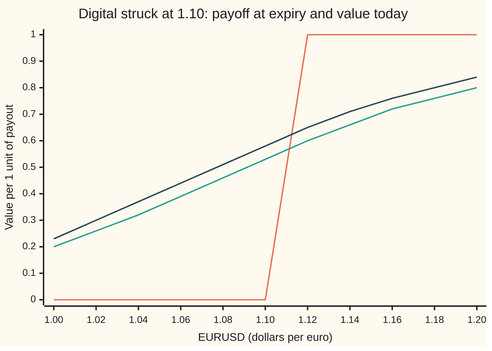
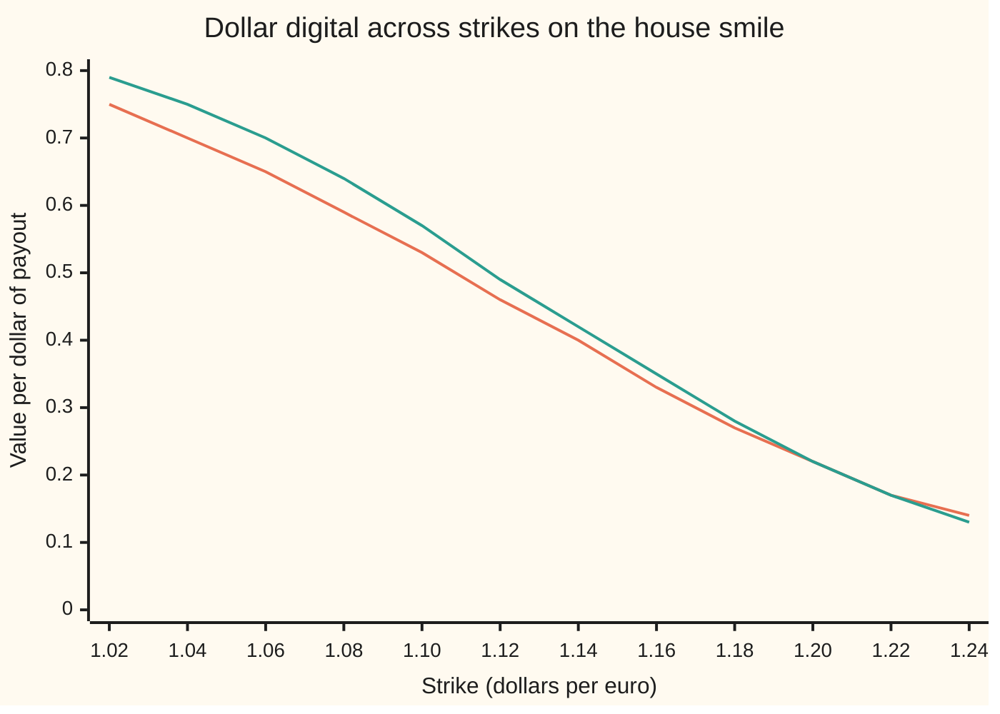

# Currency digitals: a fixed payout in dollars or in euros, priced as a discounted probability and corrected for the smile's slope

Financial mathematics → FX exotics as desks use them - digitals, touches and barriers → All-or-nothing bets on an exchange rate → Currency digitals

---

## General Overview

The euro trades at 1.10 dollars. A company that earns in euros and pays its bills in dollars asks a bank for a one-year contract: *if the euro is above 1.10 a year from today, the bank pays USD 1 million; if not, nothing.* No sliding scale. The euro finishing at 1.1001 pays the full million; 1.0999 pays nothing.

A second client asks for the same bet paid in euros: EUR 1 million if the euro finishes above 1.10.

Both contracts are **digitals**, also called binaries: options that pay a fixed amount or nothing. The event is the same in both. The currency of the payout is not, and it changes the price. In the house currency market the dollar digital costs USD 532,325 per million of payout. The euro digital costs EUR 581,012 per million. Neither number is the plain chance of the euro finishing above 1.10.

This card does three things. It prices each digital as a probability discounted in the currency it pays. It builds each one out of ordinary options, which is how a bank actually covers the risk. And it corrects the price for the **smile**, the fact that the market quotes a different volatility (jumpiness) at every strike: the correction is the option's sensitivity to volatility times the smile's slope.

**A digital is the slope of the ordinary option price against the strike: in a flat market that slope is a probability, discounted in the paying currency, and on a smile it picks up one more term, minus vega times the smile's slope.**

**What kind of fact this is:** a model, Garman-Kohlhagen's lognormal exchange rate with one constant volatility, an assumption that fits well enough and is not a law; inside it, a theorem proved on this card in Why it works. The skew correction is an exact identity that holds for any smile.

### The picture: what each digital pays, and what it is worth today



The step is the payoff on expiry day, the same for both contracts in their own currency: nothing at or below 1.10, one unit above it. The lower smooth curve is the dollar digital's value today, in dollars, against today's rate. The upper smooth curve is the euro digital's value today, in euros. Both are steps smoothed by a year of uncertainty. The euro curve sits higher everywhere, and Why it works says exactly why.

---

## The formula

Notation first. The rate $S$ is quoted in dollars per euro, so the euro is the **foreign** currency (the one being priced) and the dollar the **domestic** one (the currency prices are counted in). $r_d$ is the dollar interest rate and $r_f$ the euro rate, both continuously compounded. Everything else is the Garman-Kohlhagen notation of [garman-kohlhagen-greeks](../21-FX%20vanilla%20options%20-%20Garman-Kohlhagen%20and%20the%20desk%20conventions/03-garman-kohlhagen-greeks.md); $N(x)$ is the area under the standard bell curve to the left of $x$.

The dollar digital pays one dollar if $S_T > K$. The euro digital pays one euro if $S_T > K$ and is valued here in euros:

$$D_d = e^{-r_d T}\,N(d_2), \qquad D_f = e^{-r_f T}\,N(d_1)$$

**Read it aloud: "the dollar bet is the chance counted in dollars, discounted at the dollar rate; the euro bet is the chance counted in euros, discounted at the euro rate."**

On a smile, the volatility $\sigma$ depends on the strike, and each digital gains one term built from vega $\nu$ (the call's change per unit of volatility) and the smile's slope $\beta$ (change in volatility per unit of strike):

$$D_d^{\text{smile}} = e^{-r_d T}N(d_2) - \nu\,\beta, \qquad D_f^{\text{smile}} = e^{-r_f T}N(d_1) - \frac{K}{S}\,\nu\,\beta$$

**Read it aloud: "on a smile, take the flat price at the strike's own volatility, then subtract vega times the smile's slope."**

| Symbol | Plain meaning | In our example | Push it up and the dollar digital… |
| --- | --- | --- | --- |
| $S$, $S_T$ | today's rate, dollars per euro; $S_T$ is the rate on expiry day | 1.10 | rises: the euro starts nearer the payout zone |
| $K$, $w$ | the strike, the level the euro must finish above; $w$ is a call spread's width | 1.10 | falls: a higher bar |
| $T$ | time to expiry, in years | 1 | depends: more time to drift up, more discounting |
| $r_d$, $r_f$ | dollar and euro interest rates, continuously compounded | 5%, 3% | $r_d$ up: rises in chance, falls in discount; $r_f$ up: falls |
| $\sigma$ | volatility, the yearly jumpiness of the log of the rate | 10% | here falls: more spread pulls the chance toward a coin flip |
| $F$ | the forward, $S e^{(r_d - r_f)T}$, the rate fixed today for delivery at $T$ | 1.122221 | |
| $d_1$, $d_2$ | distance from strike to forward in units of $\sigma\sqrt{T}$; $d_1 = d_2 + \sigma\sqrt{T}$ | 0.25, 0.15 | |
| $N$, $\phi$ | bell-curve area to the left, and bell-curve height | 0.598706, 0.559618 | |
| $D_d$ | dollar digital, dollars per dollar of payout | 0.532325 | |
| $D_f$ | euro digital, euros per euro of payout | 0.581012 | |
| $\nu$ | vega, $S e^{-r_f T}\phi(d_1)\sqrt{T}$: the call's change per unit of volatility | 0.344608 at 1.201425 | |
| $\beta$ | the smile's slope, change in volatility per unit of strike | −0.005031 at 1.201425 | |

The helper:

$$d_1 = \frac{\ln(S/K) + (r_d - r_f + \tfrac12\sigma^2)T}{\sigma\sqrt{T}}, \qquad d_2 = d_1 - \sigma\sqrt{T}$$

In words: $d_2$ is how many wiggle units, $\sigma\sqrt{T}$ each, the euro has to spare above the strike in the dollar pricing world; $d_1$ is one wiggle unit more.

### When it holds

- **A lognormal rate with one volatility.** The flat formulas assume it. On a smile, the flat price at the strike's own volatility misses exactly the $-\nu\beta$ term: at 1.10 on the house smile, 0.530331 flat against 0.567758 on the smile.
- **Known, constant interest rates in both currencies.** If rates move, both discount factors and the forward move; the digital carries two rate risks, one per currency.
- **One look, on expiry day.** A payout that fires the first time the rate touches a level is a different contract with a different price: [fx-one-touch-and-no-touch](04-fx-one-touch-and-no-touch.md).
- **Ordinary options at every strike, traded without cost.** The replication in Why it works needs calls a hair apart. Real call spreads have a finite width, so desks charge the spread's price, which sits above the formula.

---

## Why it works

### Step 0: a digital is the slope of the call price in the strike

Buy calls struck at $K$ and sell calls struck at $K + w$, a small width $w$ higher, on $1/w$ euros each. Below $K$ both are worthless. Above $K + w$ the pair pays exactly $w \times (1/w) = 1$ dollar. In between, the payout ramps from 0 to 1. Shrink $w$ and the ramp becomes a step: the dollar digital.

The pair costs $\big(C(K) - C(K+w)\big)/w$ today, where $C(K)$ is the call price at strike $K$. As $w$ shrinks, that ratio becomes minus the slope of the call price against the strike. So

$$D_d = -\frac{\partial C}{\partial K}.$$

Everything below works out that slope: in a flat market, in the other currency, and on a smile.

### Step 1: in a flat market the slope is a discounted probability

Garman-Kohlhagen prices the call as $C = S e^{-r_f T} N(d_1) - K e^{-r_d T} N(d_2)$. Differentiating in $K$ gives three pieces. $K$ appears directly in the cash half, giving $-e^{-r_d T}N(d_2)$. $K$ also sits inside $d_1$ and $d_2$, giving two terms with bell-curve heights, $S e^{-r_f T}\phi(d_1)$ and $K e^{-r_d T}\phi(d_2)$. Those two heights are equal, so the two terms cancel. What survives:

$$-\frac{\partial C}{\partial K} = e^{-r_d T} N(d_2).$$

The same answer comes from the pricing world directly. In the dollar pricing world the log of the rate is bell-shaped, centred at $\ln S + (r_d - r_f - \tfrac12\sigma^2)T$ with spread $\sigma\sqrt{T}$. The chance of finishing above $K$ is $N(d_2)$. A dollar paid at $T$ is worth $e^{-r_d T}$ today. Chance times discount: $e^{-r_d T}N(d_2)$, as on [cash-or-nothing-digital](../10-Digitals%20and%20the%20implied%20density/01-cash-or-nothing-digital.md), with the euro rate in place of the dividend yield.

A digital put pays one dollar when $S_T \le K$. Call and put together pay one dollar for sure, so together they cost $e^{-r_d T}$: $0.532325 + 0.418905 = 0.951229$.

<details>
<summary>Detailed proof: the two bell-curve heights are equal</summary>

Write $\phi(d_1) = \phi(d_2 + \sigma\sqrt{T}) = \phi(d_2)\,e^{-d_2\sigma\sqrt{T} - \frac12\sigma^2 T}$, from expanding the square in $e^{-x^2/2}$.
Substitute $d_2\sigma\sqrt{T} = \ln(S/K) + (r_d - r_f - \tfrac12\sigma^2)T$. The exponent becomes $-\ln(S/K) - (r_d - r_f)T$, so $\phi(d_1) = \phi(d_2)\,\frac{K}{S}\,e^{-(r_d - r_f)T}$.
Multiply by $S e^{-r_f T}$: $S e^{-r_f T}\phi(d_1) = K e^{-r_d T}\phi(d_2)$.
In $\partial C/\partial K$ the first height multiplies $\partial d_1/\partial K = -1/(K\sigma\sqrt{T})$ and the second multiplies the same $\partial d_2/\partial K$. The two terms are equal and opposite, and cancel. Only $-e^{-r_d T}N(d_2)$ is left.

</details>

### Step 2: the euro digital is the share half, counted in euros

One euro paid when $S_T > K$ is worth $S_T$ dollars at that moment. So in dollars the euro digital pays $S_T$ if $S_T > K$: an asset-or-nothing payoff, the "share half" of the call ([asset-or-nothing-digital](../10-Digitals%20and%20the%20implied%20density/02-asset-or-nothing-digital.md)). Its dollar value is $S e^{-r_f T} N(d_1)$. Divide by today's rate to state it in euros:

$$D_f = e^{-r_f T} N(d_1).$$

Two things changed from the dollar digital. The discount is the euro rate, because the payout is a euro. The chance is $N(d_1)$, not $N(d_2)$, because counting in euros weights the futures where the euro is strong, and those are exactly the futures that pay. That shift is one wiggle unit, $\sigma\sqrt{T}$, the same slide that separates the two halves of the Black-Scholes call.

A second route gives the same number without a new formula. A call is the asset-or-nothing minus $K$ dollar digitals. Rearranged: asset-or-nothing $= C + K D_d$. So $D_f = (C + K D_d)/S$.

### Step 3: from the euro side, the euro digital is a plain digital on the inverted quote

A euro-based bank quotes the same market the other way up: $1/S$ euros per dollar, about 0.909. For that bank the euro is domestic, its rate $r_f$ does the discounting, and the dollar is foreign with rate $r_d$. The volatility of $1/S$ is the same 10%, because the log of $1/S$ is minus the log of $S$.

The event "euro above 1.10" is the event "dollar below $1/1.10$ euros". So the euro digital is a digital **put** on the inverted quote, paying one unit of that bank's domestic currency. Its price is the Step 1 formula for a put, with the rates swapped and the strike inverted: $e^{-r_f T} N(-d_2^{\text{inv}})$. Working out $d_2^{\text{inv}}$ with $1/S$, $1/K$, $r_f$ domestic and $r_d$ foreign gives exactly $-d_1$. So $N(-d_2^{\text{inv}}) = N(d_1)$, and the two views agree.

So there is only one formula: a foreign-paying digital is a domestic-paying digital seen from the other side of the quote, as on [premium-currency-and-foreign-domestic-symmetry](../21-FX%20vanilla%20options%20-%20Garman-Kohlhagen%20and%20the%20desk%20conventions/02-premium-currency-and-foreign-domestic-symmetry.md).

### Step 4: on a smile the slope picks up vega times the smile's slope

The market does not quote one volatility. The house smile, built on [vanna-volga-smile-curve](../22-The%20FX%20smile%20-%20risk%20reversals%2C%20butterflies%20and%20vanna-volga/05-vanna-volga-smile-curve.md), runs through 10.75% at the 25-delta put strike 1.052466, 10.00% at the at-the-money strike 1.127847 and 9.75% at the 25-delta call strike 1.201425. Every call is priced at its own strike's volatility: $C\big(K, \sigma(K)\big)$.

Step 0 still holds, because it only used call prices. But now $K$ enters twice: directly, and through $\sigma(K)$. The chain rule (the slope of a function inside a function) gives

$$\frac{dC}{dK} = \frac{\partial C}{\partial K} + \frac{\partial C}{\partial \sigma}\,\frac{d\sigma}{dK} = -e^{-r_d T}N(d_2) + \nu\,\beta.$$

Flip the sign: $D_d^{\text{smile}} = e^{-r_d T}N(d_2) - \nu\beta$, with $d_2$ at the strike's own volatility. Where the smile falls with strike, $\beta < 0$ and the digital is dearer than the flat price. A call spread across a falling smile has its long leg priced at the higher volatility, so it costs more; the digital is that spread.

For the euro digital, repeat Step 2 on the smile: asset-or-nothing $= C + K D_d^{\text{smile}}$. The call part adds nothing new, so the euro digital gains $-K\nu\beta$ dollars, which is $-(K/S)\nu\beta$ euros.

<details>
<summary>Why the house smile is nearly flat at the 25-delta call</summary>

A positive butterfly bends the smile upward; a negative risk reversal tilts it down to the right. Near 1.20 the two nearly balance: the curve bottoms just past the 25-delta call strike. So the slope there, −0.005031 per unit of strike, is small, and so is the correction. Near 1.10 the smile is steep and the correction large.

</details>

### The other door

Differentiate once more in the strike: minus the digital's slope is the pricing-world density of the rate at $K$, discounted. That is Breeden and Litzenberger's reading of the smile as a probability density, and it is why a digital quote pins down the smile's slope as tightly as a vanilla quote pins down its level.

---

## Worked numbers, by hand

House market: $S = 1.10$, $K = 1.10$, $r_d = 5\%$, $r_f = 3\%$, $\sigma = 10\%$, $T = 1$ year.

| Step | Arithmetic | Value |
| --- | --- | --- |
| forward $F$ | $1.10 \times e^{0.02}$ | 1.122221 |
| $\ln(S/K)$ | $\ln 1$ | 0 |
| drift for $d_1$ | $0.05 - 0.03 + \tfrac12(0.01)$ | 0.025 |
| $d_1$ | $0.025 / 0.10$ | 0.25 |
| $d_2$ | $0.25 - 0.10$ | 0.15 |
| $N(d_1)$, $N(d_2)$ | bell-curve areas | 0.598706, 0.559618 |
| $e^{-r_d T}$, $e^{-r_f T}$ | $e^{-0.05}$, $e^{-0.03}$ | 0.951229, 0.970446 |
| **dollar digital** | $0.951229 \times 0.559618$ | **0.532325** |
| **euro digital** | $0.970446 \times 0.598706$ | **0.581012** |

On USD 1 million of payout the dollar digital costs USD 532,325. On EUR 1 million the euro digital costs EUR 581,012, which is USD 639,113 at today's rate. The euro digital is dearer in its own currency for two reasons: the euro rate discounts less, and the euro-counted chance is higher.

### The 25-delta digital on the house smile

The 25-delta call strike, 1.201425, is where the smile's right-hand pillar sits. The volatility there is 9.75%.

| Step | Arithmetic | Value |
| --- | --- | --- |
| flat dollar digital at 9.75% | $e^{-r_d T}N(d_2)$ | 0.216085 |
| smile's slope $\beta$ | from the vanna-volga curve | −0.005031 per unit of strike |
| vega $\nu$ | $S e^{-r_f T}\phi(d_1)\sqrt{T}$ | 0.344608 |
| skew term | $-0.344608 \times (-0.005031)$ | +0.001734 |
| **dollar digital on the smile** | $0.216085 + 0.001734$ | **0.217818** |
| skew term as a share of flat | $0.001734 / 0.216085$ | 0.008023 |
| call spread along the smile, width 0.00001 | second road | 0.217818 |
| euro digital, flat | $e^{-r_f T}N(d_1)$ | 0.250000 |
| euro digital on the smile | $0.25 - (K/S)\nu\beta$ | 0.251894 |

The skew term lifts the 25-delta dollar digital by 0.8% of its flat price. The euro digital there is worth exactly 0.25 euros flat. That is no accident: $e^{-r_f T}N(d_1)$ is also the call's spot delta, and the strike was chosen to make it 0.25.

Near the money the smile is steeper and the correction much larger. At 1.10 the house smile gives 10.2161%. The flat price at that volatility is 0.530331; the skew term adds 0.037427, about 7% of it, for 0.567758 on the smile.



Lower line to the left: the flat formula at each strike's own smile volatility. Upper line to the left: the same plus the skew term. The smile's volatilities at these strikes run 11.21%, 10.92%, 10.65%, 10.42%, 10.22%, 10.05%, 9.93%, 9.84%, 9.78%, 9.75%, 9.75%, 9.79%. The gap is widest where the smile is steepest, and it changes sign past about 1.21, where the smile bottoms out and turns up.

### The call spread a desk actually trades

The replication needs a width. A desk that sells the digital buys calls at $K - w$ and sells calls at $K$, on $1/w$ euros each. That spread pays at least as much as the digital everywhere, so it is a safe cover, and it costs more:

```
one-sided call spread, K - w to K, value per dollar of payout
w = 0.02    ██████████████████████████████████  0.566240
w = 0.01    █████████████████████████████████   0.549344
w = 0.001   ████████████████████████████████    0.534030
digital     ████████████████████████████████    0.532325
```

The excess over 0.532325 is the charge for a spread of nonzero width. Narrower is cheaper, but the notional $1/w$ grows without limit.

### What breaks if you drop a piece

| Mistake | Comes out at | What went wrong |
| --- | --- | --- |
| $N(d_1)$ in the dollar digital | 0.569507 (right: 0.532325) | The euro-counted chance paid in dollars. The same number is the euro digital discounted at the dollar rate. |
| Rates swapped, $r_d \leftrightarrow r_f$ | 0.389434 | The forward now sits below the strike and the discount is wrong: a different market. |
| Skew term added with a plus sign, 25-delta | 0.214351 (right: 0.217818) | The digital comes out cheaper than flat on a falling smile, the wrong direction. |
| 25-delta digital at the 10% at-the-money volatility | 0.220770 (right: 0.217818) | Ignores both the smile's level at the strike and its slope. |

### The Greeks

Sensitivities per unit of payout, at the 1.10 strike, flat 10%:

| Greek | Dollar digital | Euro digital (in euros) |
| --- | --- | --- |
| value | 0.532325 | 0.581012 |
| delta, per 1.00 of spot | 3.411276 | 3.411276 |
| vega, per volatility point | −0.009381 | −0.005629 |
| spot where vega changes sign | 1.072841 | 1.083623 |

The checks confirm the dollar delta and vega by bumping spot and volatility. Both deltas are 3.411276 only because the strike equals the spot: then the Step 1 identity makes the two bell-curve heights equal. Vega is negative at the money. More volatility spreads the outcomes, and a bet already more likely than not to pay loses some of its edge. Vega turns positive only below 1.072841 for the dollar digital, where $d_1 = 0$, not at the strike. Near expiry the delta becomes a tall spike around the strike, which is the hedging problem [barrier-and-touch-greeks](06-barrier-and-touch-greeks.md) takes up at a barrier.

---

## Code, from first principles, and it actually runs

The scripts price both digitals by **five roads**: the formula, a tight call spread, a Monte Carlo average over 200,000 year-end rates from a hand-written generator, the identity $(C + K D_d)/S$, and the inverted quote by formula and by put spread. The smile is the Castagna-Mercurio second-order curve through the three house pillars; the 25-delta digital is priced by vega times slope and, independently, by a call spread whose legs sit at their own smile volatilities. Every number on this card is printed by both scripts.

### Python

```python
# Currency digitals -- the check behind the card.  Standard library only.
# House FX market: EURUSD S = 1.10 dollars per euro, USD rate 5%, EUR rate 3%,
# vol 10%, one year.  The bell-curve area N(x) is built by Simpson slices,
# the random numbers by a 64-bit mixer, the root finder by halving.
from math import log, sqrt, exp, cos, pi

def phi(x): return exp(-0.5 * x * x) / sqrt(2.0 * pi)      # bell-curve height
def simpson(f, a, b, n=2000):
    h = (b - a) / n
    s = f(a) + f(b) + sum((4.0 if i % 2 else 2.0) * f(a + i * h) for i in range(1, n))
    return s * h / 3.0
def N(x): return 0.0 if x < -12 else 1.0 if x > 12 else 0.5 + simpson(phi, 0.0, x)

S, rd, rf, sig, T, K = 1.10, 0.05, 0.03, 0.10, 1.0, 1.10
def d12(s, k, dom, fgn, v):
    d1 = (log(s / k) + (dom - fgn + 0.5 * v * v) * T) / (v * sqrt(T))
    return d1, d1 - v * sqrt(T)
def call(s, k, dom, fgn, v):                                # Garman-Kohlhagen, domestic per foreign
    d1, d2 = d12(s, k, dom, fgn, v); return s * exp(-fgn * T) * N(d1) - k * exp(-dom * T) * N(d2)
def put(s, k, dom, fgn, v):
    d1, d2 = d12(s, k, dom, fgn, v); return k * exp(-dom * T) * N(-d2) - s * exp(-fgn * T) * N(-d1)
def usd_dig(s, k, v): return exp(-rd * T) * N(d12(s, k, rd, rf, v)[1])   # pays 1 USD if S_T > k
def eur_dig(s, k, v): return exp(-rf * T) * N(d12(s, k, rd, rf, v)[0])   # pays 1 EUR, valued in EUR
def vega(s, k, v): return s * exp(-rf * T) * phi(d12(s, k, rd, rf, v)[0]) * sqrt(T)

d1, d2 = d12(S, K, rd, rf, sig)
D, E = usd_dig(S, K, sig), eur_dig(S, K, sig)
h = 1e-5                                                   # road 2: tight call spreads
D_spread = (call(S, K - h, rd, rf, sig) - call(S, K + h, rd, rf, sig)) / (2 * h)
P_spread = (put(S, K + h, rd, rf, sig) - put(S, K - h, rd, rf, sig)) / (2 * h)
E_ident = (call(S, K, rd, rf, sig) + K * D) / S            # asset-or-nothing = call + K digitals
X, k = 1.0 / S, 1.0 / K                                    # road 4: the inverted quote, euros domestic
E_inv_formula = exp(-rf * T) * N(-d12(X, k, rf, rd, sig)[1])
E_inv_spread = (put(X, k + h, rf, rd, sig) - put(X, k - h, rf, rd, sig)) / (2 * h)

state = 20260927                                           # road 3: Monte Carlo, own generator
def unif():
    global state
    state = (state + 0x9E3779B97F4A7C15) & 0xFFFFFFFFFFFFFFFF
    z = state
    z = ((z ^ (z >> 30)) * 0xBF58476D1CE4E5B9) & 0xFFFFFFFFFFFFFFFF
    z = ((z ^ (z >> 27)) * 0x94D049BB133111EB) & 0xFFFFFFFFFFFFFFFF
    return ((z ^ (z >> 31)) >> 11) * 2.0 ** -53 + 2.0 ** -54
M, hitD, hitE, hitE2 = 200000, 0.0, 0.0, 0.0
for _ in range(M):
    z = sqrt(-2.0 * log(unif())) * cos(2.0 * pi * unif())
    ST = S * exp((rd - rf - 0.5 * sig * sig) * T + sig * sqrt(T) * z)
    if ST > K: hitD += 1.0; hitE += ST; hitE2 += ST * ST
D_mc, E_mc = exp(-rd * T) * hitD / M, exp(-rd * T) * hitE / M / S
se = exp(-rd * T) * sqrt(hitD / M * (1 - hitD / M) / M)
seE = exp(-rd * T) / S * sqrt((hitE2 / M - (hitE / M) ** 2) / M)

def lo(a, b, f):                                           # halving root finder
    for _ in range(200):
        m = 0.5 * (a + b); a, b = (m, b) if f(m) < 0 else (a, m)
    return 0.5 * (a + b)
F = S * exp((rd - rf) * T)
dc = lo(-5, 5, lambda x: exp(-rf * T) * N(x) - 0.25)      # 25-delta call: e^-rfT N(d1) = 0.25
# 25-delta put: e^-rfT N(-d1) = 0.25, so its d1 is -dc; strike K = F e^(-d1 v + v^2/2) at the pillar's own vol
Ks = [F * exp(dc * 0.1075 + 0.5 * 0.1075 * 0.1075), F * exp(0.5 * 0.10 * 0.10), F * exp(-dc * 0.0975 + 0.5 * 0.0975 * 0.0975)]
vs = [0.1075, 0.10, 0.0975]
def smile(x):                                              # Castagna-Mercurio, second order
    K1, K2, K3 = Ks
    y = [log(K2 / x) * log(K3 / x) / (log(K2 / K1) * log(K3 / K1)),
         log(x / K1) * log(K3 / x) / (log(K2 / K1) * log(K3 / K2)),
         log(x / K1) * log(x / K2) / (log(K3 / K1) * log(K3 / K2))]
    D1 = sum(a * b for a, b in zip(y, vs)) - vs[1]
    D2 = sum(y[i] * d12(S, Ks[i], rd, rf, vs[1])[0] * d12(S, Ks[i], rd, rf, vs[1])[1] * (vs[i] - vs[1]) * (vs[i] - vs[1]) for i in range(3))
    a, b = d12(S, x, rd, rf, vs[1]); ab = a * b
    return vs[1] + (-vs[1] + sqrt(vs[1] * vs[1] + ab * (2 * vs[1] * D1 + D2))) / ab
def slope(x, e=1e-5): return (smile(x + e) - smile(x - e)) / (2 * e)
def smile_dig(x): return usd_dig(S, x, smile(x)) - vega(S, x, smile(x)) * slope(x)
def smile_spread(x): return (call(S, x - h, rd, rf, smile(x - h)) - call(S, x + h, rd, rf, smile(x + h))) / (2 * h)
K3 = Ks[2]; v3 = smile(K3)
flat3, term3 = usd_dig(S, K3, v3), -vega(S, K3, v3) * slope(K3)

rows = [("d1", d1), ("d2", d2), ("N(d1)", N(d1)), ("N(d2)", N(d2)), ("forward F", F),
    ("USD digital 1 formula", D), ("USD digital 2 call spread", D_spread), ("USD digital 3 Monte Carlo", D_mc),
    ("  Monte Carlo std error", se), ("USD digital put, put spread", P_spread), ("  call + put", D + P_spread), ("  e^-rdT", exp(-rd * T)), ("  e^-rfT", exp(-rf * T)),
    ("EUR digital 1 formula", E), ("EUR digital 2 (call + K D)/S", E_ident), ("EUR digital 3 Monte Carlo", E_mc),
    ("EUR digital 4 inverted formula", E_inv_formula), ("EUR digital 5 inverted put spread", E_inv_spread),
    ("EUR digital in USD, S x E", S * E)]
for w in (0.02, 0.01, 0.001):
    rows.append((f"one-sided spread width {w}", (call(S, K - w, rd, rf, sig) - call(S, K, rd, rf, sig)) / w))
bump = 1e-5
dlt, dlt_bump = exp(-rd * T) * phi(d2) / (S * sig * sqrt(T)), (usd_dig(S + bump, K, sig) - usd_dig(S - bump, K, sig)) / (2 * bump)
vg, vg_bump = -exp(-rd * T) * phi(d2) * d1 / sig / 100, (usd_dig(S, K, sig + bump) - usd_dig(S, K, sig - bump)) / (2 * bump) / 100
rows += [("USD delta, formula", dlt), ("USD vega per vol pt, formula", vg),
    ("EUR delta, formula", exp(-rf * T) * phi(d1) / (S * sig * sqrt(T))),
    ("EUR vega per vol pt, formula", -exp(-rf * T) * phi(d1) * d2 / sig / 100),
    ("USD vega sign flip spot", K * exp(-(rd - rf + 0.5 * sig * sig) * T)),
    ("EUR vega sign flip spot", K * exp(-(rd - rf - 0.5 * sig * sig) * T)),
    ("pillar 25d put strike", Ks[0]), ("pillar ATM strike", Ks[1]), ("pillar 25d call strike", K3),
    ("smile vol at 1.10", smile(K)), ("USD digital 1.10 flat, own vol", usd_dig(S, K, smile(K))),
    ("  skew term at 1.10", smile_dig(K) - usd_dig(S, K, smile(K))), ("USD digital 1.10 smile", smile_dig(K)),
    ("smile vol at 25d call", v3), ("smile slope per unit strike", slope(K3)), ("vega at 25d call", vega(S, K3, v3)),
    ("USD digital 25d flat", flat3), ("  skew term -vega x slope", term3), ("USD digital 25d smile", flat3 + term3),
    ("USD digital 25d smile spread", smile_spread(K3)), ("  skew term / flat price", term3 / flat3),
    ("EUR digital 25d flat", eur_dig(S, K3, v3)), ("EUR digital 25d smile", eur_dig(S, K3, v3) - K3 / S * vega(S, K3, v3) * slope(K3)),
    ("wrong: USD digital with N(d1)", exp(-rd * T) * N(d1)), ("wrong: USD digital, rates swapped", exp(-rf * T) * N(d12(S, K, rf, rd, sig)[1])),
    ("wrong: skew term added with + sign", flat3 - term3), ("wrong: 25d digital at ATM vol", usd_dig(S, K3, 0.10))]
for name, v in rows: print(f"{name:<36} {v:>12.6f}")
print("chart K 1.02..1.24, smile vol % " + " ".join(f"{100 * smile(x):6.2f}" for x in [1.02 + 0.02 * i for i in range(12)]))
print("chart K, flat digital at own vol " + " ".join(f"{usd_dig(S, x, smile(x)):6.2f}" for x in [1.02 + 0.02 * i for i in range(12)]))
print("chart K, digital on the smile    " + " ".join(f"{smile_dig(x):6.2f}" for x in [1.02 + 0.02 * i for i in range(12)]))
print("chart S 1.00..1.20, USD digital  " + " ".join(f"{usd_dig(x, K, sig):6.2f}" for x in [1.00 + 0.02 * i for i in range(11)]))
print("chart S, EUR digital in EUR      " + " ".join(f"{eur_dig(x, K, sig):6.2f}" for x in [1.00 + 0.02 * i for i in range(11)]))

assert abs(D - 0.532325) < 5e-7 and abs(E - 0.581012) < 5e-7, "formula vs the card's worked numbers"
assert abs(D_spread - D) < 1e-6,                    "call spread replicates the USD digital"
assert abs(D_mc - D) < 4 * se,                       "Monte Carlo within four standard errors"
assert abs(D + P_spread - exp(-rd * T)) < 1e-6,      "digital call + put = a discounted dollar"
assert abs(E_inv_spread - E) < 1e-6,                 "inverted-quote put spread = EUR digital"
assert abs(E_ident - E) < 1e-9,                      "asset-or-nothing identity"
assert abs(E_inv_formula - E) < 1e-9 and abs(E_mc - E) < 4 * seE, "inverted formula and EUR Monte Carlo"
assert abs(dlt_bump - dlt) < 1e-6 and abs(vg_bump - vg) < 1e-8, "delta and vega: formula vs bump"
assert abs(smile_spread(K3) - (flat3 + term3)) < 1e-6, "skew term vs call spread along the smile"
assert abs(v3 - 0.0975) < 1e-12 and abs(K3 - 1.201425) < 5e-7, "smile passes through its pillar"
print("ALL CHECKS PASS")
```

**Ran 2026-09-27 on macOS, Python 3.14.6, standard library only. All checks passed. Output, pasted from the run:**

```
d1                                       0.250000
d2                                       0.150000
N(d1)                                    0.598706
N(d2)                                    0.559618
forward F                                1.122221
USD digital 1 formula                    0.532325
USD digital 2 call spread                0.532325
USD digital 3 Monte Carlo                0.532156
  Monte Carlo std error                  0.001056
USD digital put, put spread              0.418905
  call + put                             0.951229
  e^-rdT                                 0.951229
  e^-rfT                                 0.970446
EUR digital 1 formula                    0.581012
EUR digital 2 (call + K D)/S             0.581012
EUR digital 3 Monte Carlo                0.581002
EUR digital 4 inverted formula           0.581012
EUR digital 5 inverted put spread        0.581012
EUR digital in USD, S x E                0.639113
one-sided spread width 0.02              0.566240
one-sided spread width 0.01              0.549344
one-sided spread width 0.001             0.534030
USD delta, formula                       3.411276
USD vega per vol pt, formula            -0.009381
EUR delta, formula                       3.411276
EUR vega per vol pt, formula            -0.005629
USD vega sign flip spot                  1.072841
EUR vega sign flip spot                  1.083623
pillar 25d put strike                    1.052466
pillar ATM strike                        1.127847
pillar 25d call strike                   1.201425
smile vol at 1.10                        0.102161
USD digital 1.10 flat, own vol           0.530331
  skew term at 1.10                      0.037427
USD digital 1.10 smile                   0.567758
smile vol at 25d call                    0.097500
smile slope per unit strike             -0.005031
vega at 25d call                         0.344608
USD digital 25d flat                     0.216085
  skew term -vega x slope                0.001734
USD digital 25d smile                    0.217818
USD digital 25d smile spread             0.217818
  skew term / flat price                 0.008023
EUR digital 25d flat                     0.250000
EUR digital 25d smile                    0.251894
wrong: USD digital with N(d1)            0.569507
wrong: USD digital, rates swapped        0.389434
wrong: skew term added with + sign       0.214351
wrong: 25d digital at ATM vol            0.220770
chart K 1.02..1.24, smile vol %  11.21  10.92  10.65  10.42  10.22  10.05   9.93   9.84   9.78   9.75   9.75   9.79
chart K, flat digital at own vol   0.75   0.70   0.65   0.59   0.53   0.46   0.40   0.33   0.27   0.22   0.17   0.14
chart K, digital on the smile      0.79   0.75   0.70   0.64   0.57   0.49   0.42   0.35   0.28   0.22   0.17   0.13
chart S 1.00..1.20, USD digital    0.20   0.26   0.32   0.39   0.46   0.53   0.60   0.66   0.72   0.76   0.80
chart S, EUR digital in EUR        0.23   0.30   0.37   0.44   0.51   0.58   0.65   0.71   0.76   0.80   0.84
ALL CHECKS PASS
```

### Rust

Same inputs, same roads, same labels. The random numbers come from the same 64-bit mixer, so the Monte Carlo rows match too.

```rust
// Currency digitals -- the same check as fx_digitals_check.py, in Rust.  Std only, no crates.
// House FX market: EURUSD S = 1.10 dollars per euro, USD rate 5%, EUR rate 3%, vol 10%, one year.
// N(x) by Simpson slices, random numbers by a 64-bit mixer, roots by halving.
use std::f64::consts::PI;

const S: f64 = 1.10; const RD: f64 = 0.05; const RF: f64 = 0.03; const SIG: f64 = 0.10; const T: f64 = 1.0; const K: f64 = 1.10;
const H: f64 = 1e-5;
const VS: [f64; 3] = [0.1075, 0.10, 0.0975];

fn phi(x: f64) -> f64 { (-0.5 * x * x).exp() / (2.0 * PI).sqrt() }
fn simpson(a: f64, b: f64, n: usize) -> f64 {
    let h = (b - a) / n as f64;
    let mut s = phi(a) + phi(b);
    for i in 1..n { s += if i % 2 == 1 { 4.0 } else { 2.0 } * phi(a + i as f64 * h); }
    s * h / 3.0
}
fn nc(x: f64) -> f64 { if x < -12.0 { 0.0 } else if x > 12.0 { 1.0 } else { 0.5 + simpson(0.0, x, 2000) } }
fn d12(s: f64, k: f64, dom: f64, fgn: f64, v: f64) -> (f64, f64) {
    let d1 = ((s / k).ln() + (dom - fgn + 0.5 * v * v) * T) / (v * T.sqrt());
    (d1, d1 - v * T.sqrt())
}
fn call(s: f64, k: f64, dom: f64, fgn: f64, v: f64) -> f64 {
    let (d1, d2) = d12(s, k, dom, fgn, v); s * (-fgn * T).exp() * nc(d1) - k * (-dom * T).exp() * nc(d2)
}
fn put(s: f64, k: f64, dom: f64, fgn: f64, v: f64) -> f64 {
    let (d1, d2) = d12(s, k, dom, fgn, v); k * (-dom * T).exp() * nc(-d2) - s * (-fgn * T).exp() * nc(-d1)
}
fn usd_dig(s: f64, k: f64, v: f64) -> f64 { (-RD * T).exp() * nc(d12(s, k, RD, RF, v).1) }
fn eur_dig(s: f64, k: f64, v: f64) -> f64 { (-RF * T).exp() * nc(d12(s, k, RD, RF, v).0) }
fn vega(s: f64, k: f64, v: f64) -> f64 { s * (-RF * T).exp() * phi(d12(s, k, RD, RF, v).0) * T.sqrt() }

struct Rng(u64);
impl Rng {
    fn unif(&mut self) -> f64 {
        self.0 = self.0.wrapping_add(0x9E3779B97F4A7C15);
        let mut z = self.0;
        z = (z ^ (z >> 30)).wrapping_mul(0xBF58476D1CE4E5B9);
        z = (z ^ (z >> 27)).wrapping_mul(0x94D049BB133111EB);
        ((z ^ (z >> 31)) >> 11) as f64 * 2f64.powi(-53) + 2f64.powi(-54)
    }
}
fn lo<F: Fn(f64) -> f64>(mut a: f64, mut b: f64, f: F) -> f64 {
    for _ in 0..200 { let m = 0.5 * (a + b); if f(m) < 0.0 { a = m } else { b = m } }
    0.5 * (a + b)
}
fn smile(x: f64, ks: &[f64; 3]) -> f64 {                           // Castagna-Mercurio, second order
    let (k1, k2, k3) = (ks[0], ks[1], ks[2]);
    let y = [(k2 / x).ln() * (k3 / x).ln() / ((k2 / k1).ln() * (k3 / k1).ln()),
             (x / k1).ln() * (k3 / x).ln() / ((k2 / k1).ln() * (k3 / k2).ln()),
             (x / k1).ln() * (x / k2).ln() / ((k3 / k1).ln() * (k3 / k2).ln())];
    let mut dd1 = 0.0; for i in 0..3 { dd1 += y[i] * VS[i]; } dd1 -= VS[1];
    let mut dd2 = 0.0;
    for i in 0..3 { dd2 += y[i] * d12(S, ks[i], RD, RF, VS[1]).0 * d12(S, ks[i], RD, RF, VS[1]).1 * (VS[i] - VS[1]) * (VS[i] - VS[1]); }
    let (a, b) = d12(S, x, RD, RF, VS[1]); let ab = a * b;
    VS[1] + (-VS[1] + (VS[1] * VS[1] + ab * (2.0 * VS[1] * dd1 + dd2)).sqrt()) / ab
}
fn slope(x: f64, ks: &[f64; 3]) -> f64 { let e = 1e-5; (smile(x + e, ks) - smile(x - e, ks)) / (2.0 * e) }
fn smile_dig(x: f64, ks: &[f64; 3]) -> f64 { let v = smile(x, ks); usd_dig(S, x, v) - vega(S, x, v) * slope(x, ks) }
fn smile_spread(x: f64, ks: &[f64; 3]) -> f64 {
    (call(S, x - H, RD, RF, smile(x - H, ks)) - call(S, x + H, RD, RF, smile(x + H, ks))) / (2.0 * H)
}

fn main() {
    let (d1, d2) = d12(S, K, RD, RF, SIG);
    let (dd, ee) = (usd_dig(S, K, SIG), eur_dig(S, K, SIG));
    let d_spread = (call(S, K - H, RD, RF, SIG) - call(S, K + H, RD, RF, SIG)) / (2.0 * H);
    let p_spread = (put(S, K + H, RD, RF, SIG) - put(S, K - H, RD, RF, SIG)) / (2.0 * H);
    let e_ident = (call(S, K, RD, RF, SIG) + K * dd) / S;
    let (x, k) = (1.0 / S, 1.0 / K);                                  // the inverted quote, euros domestic
    let e_inv_formula = (-RF * T).exp() * nc(-d12(x, k, RF, RD, SIG).1);
    let e_inv_spread = (put(x, k + H, RF, RD, SIG) - put(x, k - H, RF, RD, SIG)) / (2.0 * H);

    let mut rng = Rng(20260927);
    let m = 200000; let (mut hit_d, mut hit_e, mut hit_e2) = (0.0f64, 0.0f64, 0.0f64);
    for _ in 0..m {
        let r = (-2.0 * rng.unif().ln()).sqrt();
        let z = r * (2.0 * PI * rng.unif()).cos();
        let st = S * ((RD - RF - 0.5 * SIG * SIG) * T + SIG * T.sqrt() * z).exp();
        if st > K { hit_d += 1.0; hit_e += st; hit_e2 += st * st; }
    }
    let mf = m as f64;
    let d_mc = (-RD * T).exp() * hit_d / mf; let e_mc = (-RD * T).exp() * hit_e / mf / S;
    let se = (-RD * T).exp() * (hit_d / mf * (1.0 - hit_d / mf) / mf).sqrt();
    let se_e = (-RD * T).exp() / S * ((hit_e2 / mf - (hit_e / mf).powi(2)) / mf).sqrt();

    let f = S * ((RD - RF) * T).exp();
    let dc = lo(-5.0, 5.0, |x| (-RF * T).exp() * nc(x) - 0.25);
    let ks = [f * (dc * 0.1075 + 0.5 * 0.1075 * 0.1075).exp(), f * (0.5f64 * 0.10 * 0.10).exp(), f * (-dc * 0.0975 + 0.5 * 0.0975 * 0.0975).exp()];
    let k3 = ks[2]; let v3 = smile(k3, &ks);
    let flat3 = usd_dig(S, k3, v3); let term3 = -vega(S, k3, v3) * slope(k3, &ks);
    let b = 1e-5;
    let (dlt, dlt_bump) = ((-RD * T).exp() * phi(d2) / (S * SIG * T.sqrt()), (usd_dig(S + b, K, SIG) - usd_dig(S - b, K, SIG)) / (2.0 * b));
    let (vg, vg_bump) = (-(-RD * T).exp() * phi(d2) * d1 / SIG / 100.0, (usd_dig(S, K, SIG + b) - usd_dig(S, K, SIG - b)) / (2.0 * b) / 100.0);

    let mut rows: Vec<(String, f64)> = vec![("d1".into(), d1), ("d2".into(), d2), ("N(d1)".into(), nc(d1)), ("N(d2)".into(), nc(d2)), ("forward F".into(), f),
        ("USD digital 1 formula".into(), dd), ("USD digital 2 call spread".into(), d_spread), ("USD digital 3 Monte Carlo".into(), d_mc),
        ("  Monte Carlo std error".into(), se), ("USD digital put, put spread".into(), p_spread), ("  call + put".into(), dd + p_spread), ("  e^-rdT".into(), (-RD * T).exp()), ("  e^-rfT".into(), (-RF * T).exp()),
        ("EUR digital 1 formula".into(), ee), ("EUR digital 2 (call + K D)/S".into(), e_ident), ("EUR digital 3 Monte Carlo".into(), e_mc),
        ("EUR digital 4 inverted formula".into(), e_inv_formula), ("EUR digital 5 inverted put spread".into(), e_inv_spread),
        ("EUR digital in USD, S x E".into(), S * ee)];
    for w in [0.02, 0.01, 0.001] {
        rows.push((format!("one-sided spread width {}", w), (call(S, K - w, RD, RF, SIG) - call(S, K, RD, RF, SIG)) / w));
    }
    let more: Vec<(&str, f64)> = vec![("USD delta, formula", dlt), ("USD vega per vol pt, formula", vg),
        ("EUR delta, formula", (-RF * T).exp() * phi(d1) / (S * SIG * T.sqrt())),
        ("EUR vega per vol pt, formula", -(-RF * T).exp() * phi(d1) * d2 / SIG / 100.0),
        ("USD vega sign flip spot", K * (-(RD - RF + 0.5 * SIG * SIG) * T).exp()),
        ("EUR vega sign flip spot", K * (-(RD - RF - 0.5 * SIG * SIG) * T).exp()),
        ("pillar 25d put strike", ks[0]), ("pillar ATM strike", ks[1]), ("pillar 25d call strike", k3),
        ("smile vol at 1.10", smile(K, &ks)), ("USD digital 1.10 flat, own vol", usd_dig(S, K, smile(K, &ks))),
        ("  skew term at 1.10", smile_dig(K, &ks) - usd_dig(S, K, smile(K, &ks))), ("USD digital 1.10 smile", smile_dig(K, &ks)),
        ("smile vol at 25d call", v3), ("smile slope per unit strike", slope(k3, &ks)), ("vega at 25d call", vega(S, k3, v3)),
        ("USD digital 25d flat", flat3), ("  skew term -vega x slope", term3), ("USD digital 25d smile", flat3 + term3),
        ("USD digital 25d smile spread", smile_spread(k3, &ks)), ("  skew term / flat price", term3 / flat3),
        ("EUR digital 25d flat", eur_dig(S, k3, v3)), ("EUR digital 25d smile", eur_dig(S, k3, v3) - k3 / S * vega(S, k3, v3) * slope(k3, &ks)),
        ("wrong: USD digital with N(d1)", (-RD * T).exp() * nc(d1)),
        ("wrong: USD digital, rates swapped", (-RF * T).exp() * nc(d12(S, K, RF, RD, SIG).1)),
        ("wrong: skew term added with + sign", flat3 - term3), ("wrong: 25d digital at ATM vol", usd_dig(S, k3, 0.10))];
    for (n, v) in more { rows.push((n.to_string(), v)); }
    for (n, v) in &rows { println!("{:<36} {:>12.6}", n, v); }
    let strikes: Vec<f64> = (0..12).map(|i| 1.02 + 0.02 * i as f64).collect();
    let spots: Vec<f64> = (0..11).map(|i| 1.00 + 0.02 * i as f64).collect();
    let line = |lab: &str, xs: &Vec<f64>, f: &dyn Fn(f64) -> f64, p: usize| {
        println!("{}{}", lab, xs.iter().map(|&x| format!("{:6.*}", p, f(x))).collect::<Vec<_>>().join(" "));
    };
    line("chart K 1.02..1.24, smile vol % ", &strikes, &|x| 100.0 * smile(x, &ks), 2);
    line("chart K, flat digital at own vol ", &strikes, &|x| usd_dig(S, x, smile(x, &ks)), 2);
    line("chart K, digital on the smile    ", &strikes, &|x| smile_dig(x, &ks), 2);
    line("chart S 1.00..1.20, USD digital  ", &spots, &|x| usd_dig(x, K, SIG), 2);
    line("chart S, EUR digital in EUR      ", &spots, &|x| eur_dig(x, K, SIG), 2);

    assert!((dd - 0.532325).abs() < 5e-7 && (ee - 0.581012).abs() < 5e-7, "formula vs the card's worked numbers");
    assert!((d_spread - dd).abs() < 1e-6, "call spread replicates the USD digital");
    assert!((d_mc - dd).abs() < 4.0 * se, "Monte Carlo within four standard errors");
    assert!((dd + p_spread - (-RD * T).exp()).abs() < 1e-6, "digital call + put = a discounted dollar");
    assert!((e_inv_spread - ee).abs() < 1e-6, "inverted-quote put spread = EUR digital");
    assert!((e_ident - ee).abs() < 1e-9, "asset-or-nothing identity");
    assert!((e_inv_formula - ee).abs() < 1e-9 && (e_mc - ee).abs() < 4.0 * se_e, "inverted formula and EUR Monte Carlo");
    assert!((dlt_bump - dlt).abs() < 1e-6 && (vg_bump - vg).abs() < 1e-8, "delta and vega: formula vs bump");
    assert!((smile_spread(k3, &ks) - (flat3 + term3)).abs() < 1e-6, "skew term vs call spread along the smile");
    assert!((v3 - 0.0975).abs() < 1e-12 && (k3 - 1.201425).abs() < 5e-7, "smile passes through its pillar");
    println!("ALL CHECKS PASS");
}
```

**Ran 2026-09-27 on macOS, rustc 1.98.1, no crates. All checks passed. Output, pasted from the run:**

```
d1                                       0.250000
d2                                       0.150000
N(d1)                                    0.598706
N(d2)                                    0.559618
forward F                                1.122221
USD digital 1 formula                    0.532325
USD digital 2 call spread                0.532325
USD digital 3 Monte Carlo                0.532156
  Monte Carlo std error                  0.001056
USD digital put, put spread              0.418905
  call + put                             0.951229
  e^-rdT                                 0.951229
  e^-rfT                                 0.970446
EUR digital 1 formula                    0.581012
EUR digital 2 (call + K D)/S             0.581012
EUR digital 3 Monte Carlo                0.581002
EUR digital 4 inverted formula           0.581012
EUR digital 5 inverted put spread        0.581012
EUR digital in USD, S x E                0.639113
one-sided spread width 0.02              0.566240
one-sided spread width 0.01              0.549344
one-sided spread width 0.001             0.534030
USD delta, formula                       3.411276
USD vega per vol pt, formula            -0.009381
EUR delta, formula                       3.411276
EUR vega per vol pt, formula            -0.005629
USD vega sign flip spot                  1.072841
EUR vega sign flip spot                  1.083623
pillar 25d put strike                    1.052466
pillar ATM strike                        1.127847
pillar 25d call strike                   1.201425
smile vol at 1.10                        0.102161
USD digital 1.10 flat, own vol           0.530331
  skew term at 1.10                      0.037427
USD digital 1.10 smile                   0.567758
smile vol at 25d call                    0.097500
smile slope per unit strike             -0.005031
vega at 25d call                         0.344608
USD digital 25d flat                     0.216085
  skew term -vega x slope                0.001734
USD digital 25d smile                    0.217818
USD digital 25d smile spread             0.217818
  skew term / flat price                 0.008023
EUR digital 25d flat                     0.250000
EUR digital 25d smile                    0.251894
wrong: USD digital with N(d1)            0.569507
wrong: USD digital, rates swapped        0.389434
wrong: skew term added with + sign       0.214351
wrong: 25d digital at ATM vol            0.220770
chart K 1.02..1.24, smile vol %  11.21  10.92  10.65  10.42  10.22  10.05   9.93   9.84   9.78   9.75   9.75   9.79
chart K, flat digital at own vol   0.75   0.70   0.65   0.59   0.53   0.46   0.40   0.33   0.27   0.22   0.17   0.14
chart K, digital on the smile      0.79   0.75   0.70   0.64   0.57   0.49   0.42   0.35   0.28   0.22   0.17   0.13
chart S 1.00..1.20, USD digital    0.20   0.26   0.32   0.39   0.46   0.53   0.60   0.66   0.72   0.76   0.80
chart S, EUR digital in EUR        0.23   0.30   0.37   0.44   0.51   0.58   0.65   0.71   0.76   0.80   0.84
ALL CHECKS PASS
```

The two outputs agree line for line, including the Monte Carlo rows.

> [!TIP]
> **Try changing**
> Guess the direction first.
> - **Swap the two rates** in `usd_dig`. The dollar digital drops from 0.532325 to **0.389434**: the forward falls below the strike.
> - **Make `smile` return a flat `0.10`.** The 25-delta dollar digital becomes **0.220770**, the flat price at 10%, and the pillar assert fails: the curve no longer passes through 9.75% at 1.201425.
> - **Flip the sign of the skew term** in `smile_dig` and `term3`. The 25-delta digital reads **0.214351** and the assert against the call spread along the smile fails.
> - **Set `h = 1e-3`** instead of `1e-5`. The centred dollar spread still prints 0.532325, but the inverted-quote put spread misses by a few millionths and its assert fails. A centred spread's error shrinks with the square of the width. The one-sided spread at that width is further off: **0.534030**.

---

## The usual mistake

> [!warning]
> **Pricing a digital as the chance at the strike's own volatility.** On a smile that is the wrong price, and not by a rounding error. A digital is a call spread, and a call spread across a sloping smile has its two legs at different volatilities. The flat formula misses the whole $-\nu\beta$ term: at 1.10 on the house smile the digital is 0.567758, not the 0.530331 the strike's own 10.2161% gives.
>
> Smaller traps:
> - **The wrong chance for the currency.** $N(d_2)$ goes with a dollar payout, $N(d_1)$ with a euro payout. Mixed up, the dollar digital reads 0.569507.
> - **The wrong discount.** A euro paid in a year is discounted at the euro rate. Discounting the euro digital at the dollar rate gives 0.569507 against 0.581012.
> - **Reading $N(d_2)$ as the real-world chance.** It is the chance in the dollar pricing world, with the drift set by the two rates. Nobody's forecast enters.
> - **Units in the skew term.** $\nu$ is per 1.00 of volatility and $\beta$ per 1.00 of strike. Vega per volatility point makes the term 100 times too small.
> - **Assuming vega changes sign at the strike.** For the dollar digital it changes at $d_1 = 0$, spot 1.072841, below the 1.10 strike.

---

## Where you meet it in real life

- **Corporate hedging desks.** A digital caps a budget-rate miss with a known payout. Desks quote the price as a percentage of payout (convention as of 2026-09-27): 53.2% for the dollar digital here.
- **Structured deposits.** A deposit that pays a bonus coupon if EURUSD finishes above a level is a bond plus a digital. The bank's margin sits in the gap between the call spread it buys and the formula.
- **Barrier formulas.** The closed-form knock-out and knock-in prices on [barrier-options-by-reflection](02-barrier-options-by-reflection.md) are sums of vanilla and digital pieces, sorted on [the-eight-barrier-types](03-the-eight-barrier-types.md).
- **Two-sided bets.** A range digital paying if the rate ends between two levels is one digital minus another; the path-dependent version is on [double-barriers-and-double-no-touch](05-double-barriers-and-double-no-touch.md).
- **Smile risk in exotics.** The skew term is the simplest case of the correction that [barriers-with-the-smile](07-barriers-with-the-smile.md) applies to contracts that watch the whole path.

> **Say it back**
> A currency digital pays a fixed amount, in dollars or in euros, if the rate finishes above the strike. It is the slope of the call price against the strike, so a tight call spread builds it. In a flat market the dollar digital is $e^{-r_d T}N(d_2)$ and the euro digital is $e^{-r_f T}N(d_1)$: each is a chance counted and discounted in the currency it pays. Seen from the euro side, the euro digital is an ordinary digital on the inverted quote. On a smile each gains minus vega times the smile's slope.

---

## What this builds on

- [garman-kohlhagen-greeks](../21-FX%20vanilla%20options%20-%20Garman-Kohlhagen%20and%20the%20desk%20conventions/03-garman-kohlhagen-greeks.md): the call price, $d_1$, $d_2$ and vega that every step here differentiates.
- [vanna-volga-smile-curve](../22-The%20FX%20smile%20-%20risk%20reversals%2C%20butterflies%20and%20vanna-volga/05-vanna-volga-smile-curve.md): the house smile, the curve whose slope the skew term uses.
- [premium-currency-and-foreign-domestic-symmetry](../21-FX%20vanilla%20options%20-%20Garman-Kohlhagen%20and%20the%20desk%20conventions/02-premium-currency-and-foreign-domestic-symmetry.md): the inverted quote, which turns a euro payout into a domestic one.
- [cash-or-nothing-digital](../10-Digitals%20and%20the%20implied%20density/01-cash-or-nothing-digital.md): the dollar digital on a share, which this card moves to a currency.
- [asset-or-nothing-digital](../10-Digitals%20and%20the%20implied%20density/02-asset-or-nothing-digital.md): the share half of the call, which in currencies is the euro digital.

## Where this goes next

- [fx-one-touch-and-no-touch](04-fx-one-touch-and-no-touch.md): the payout fires the first time the rate touches a level, at any moment of the year, not only on expiry day.
- [barrier-level-from-a-target-premium](08-barrier-level-from-a-target-premium.md): the price run backwards, from a premium the client will pay to the level that delivers it.

---

## Sources

Verified 2026-09-27: every link below resolves to the publisher's page.

- Garman, Mark B., and Steven W. Kohlhagen. "Foreign Currency Option Values." *Journal of International Money and Finance* 2, no. 3 (1983): 231–237. [doi:10.1016/S0261-5606(83)80001-1](https://doi.org/10.1016/S0261-5606(83)80001-1). The currency call whose strike slope is the dollar digital.
- Breeden, Douglas T., and Robert H. Litzenberger. "Prices of State-Contingent Claims Implicit in Option Prices." *Journal of Business* 51, no. 4 (1978): 621–651. [doi:10.1086/296025](https://doi.org/10.1086/296025). Call prices across strikes as prices of payouts at each level: the digital as a strike derivative.
- Wystup, Uwe. *FX Options and Structured Products*, 2nd ed. Wiley, 2017. [doi:10.1002/9781119192183](https://doi.org/10.1002/9781119192183). Digitals in both currencies, quoting conventions and the structured products built from them.
- Clark, Iain J. *Foreign Exchange Option Pricing: A Practitioner's Guide*. Wiley, 2011. [doi:10.1002/9781119208679](https://doi.org/10.1002/9781119208679). Desk treatment of currency digitals and the smile correction.
- Castagna, Antonio. *FX Options and Smile Risk*. Wiley, 2010. [doi:10.1002/9781119207085](https://doi.org/10.1002/9781119207085). The vanna-volga smile the skew term is read from.
