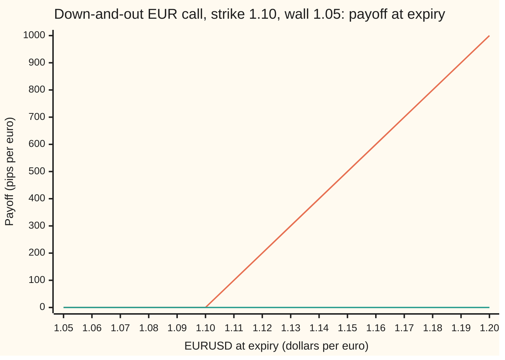
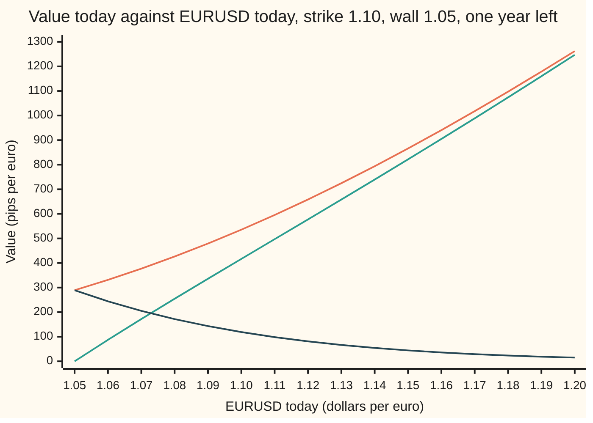

# Knock-out and knock-in: the plain option minus its mirror image, and knock-in plus knock-out equals the plain option

Financial mathematics → FX exotics as desks use them - digitals, touches and barriers → Barriers by the mirror → Knock-out and knock-in

---

## General Overview

A German exporter will receive dollars in a year and wants the right to buy euros at 1.10 dollars each. Today one euro costs 1.10 dollars, written EURUSD 1.10. A plain one-year euro call struck at 1.10 costs 0.053556 dollars per euro of notional: 535.56 **pips**, where a pip is 0.0001 dollars, the unit FX desks quote in.

The exporter wants it cheaper and has a view: the euro will not fall to 1.05 this year. So the desk adds a clause. If EURUSD ever trades at 1.05 or lower before expiry, the option is cancelled on the spot, and a later recovery does not bring it back. That clause is a **barrier**, 1.05 is the **barrier level**, and an option that dies on a touch is a **knock-out**. Its twin, which is born on the touch and is worthless otherwise, is a **knock-in**. This one is a **down-and-out call**: the wall sits below today's rate, touching it kills the option, and the option underneath is a call.

With the wall at 1.05 the knock-out costs 416.61 pips and the knock-in 118.95 pips. They add back to exactly 535.56. That addition is the first half of the idea. The second half is how to price the knock-in: it is the plain call priced from the **mirror image** of today's rate in the wall, scaled by one weight.

**A knock-out is the plain option minus a weighted copy of itself priced from the mirror image of the spot in the barrier, and the knock-in is that copy: the two always add up to the plain option.**

**What kind of fact this is:** a theorem inside the Garman–Kohlhagen model, proved on this card in Why it works; the in-plus-out identity holds in every model; the daily-monitoring shift at the end is an approximation, with its error measured.

### The picture: two paths, two payoffs

What a surviving option pays at expiry is the plain call's payoff. What a knocked-out one pays is zero, wherever EURUSD finishes. Which line applies was settled somewhere along the path.



Orange: the payoff if EURUSD never traded at 1.05 during the year, the plain call's hockey stick. Green, flat on zero: the payoff if it did, however high it finished. A path that dips to 1.049 in March and ends at 1.20 in a year pays nothing.

---

## The formula

Write $C(x)$ for the Garman–Kohlhagen price of the plain euro call when the spot is $x$ and everything else is unchanged ([garman-kohlhagen](../21-FX%20vanilla%20options%20-%20Garman-Kohlhagen%20and%20the%20desk%20conventions/01-garman-kohlhagen.md)). For a barrier $H$ at or below the strike, with the spot above the barrier:

$$C_{do} = C(S) - \left(\frac{H}{S}\right)^{2\lambda} C\!\left(\frac{H^2}{S}\right), \qquad \lambda = \frac{r_d - r_f - \tfrac12\sigma^2}{\sigma^2}$$

$$C_{di} = C(S) - C_{do} = \left(\frac{H}{S}\right)^{2\lambda} C\!\left(\frac{H^2}{S}\right)$$

**Read it aloud: the knock-out is the plain call minus the plain call started from the mirror spot, shrunk by the mirror weight; the knock-in is exactly what was subtracted.**

| Symbol | Plain meaning | In our example | Push it up and the answer… |
| --- | --- | --- | --- |
| $S$ | EURUSD today, dollars per euro | 1.10 | knock-out rises fast: more upside and more room above the wall |
| $K$ | the strike, the rate at which euros may be bought | 1.10 | falls: more to pay at expiry |
| $H$, $b$ | the barrier; $b = \ln(H/S)$ is its distance below spot on the log scale | 1.05 | knock-out falls: the wall moves closer |
| $r_d$ | the dollar interest rate, continuously compounded; $e^{-r_d T}$ discounts dollars | 5% | rises: the drift of EURUSD tilts up, away from the wall |
| $r_f$ | the euro interest rate; $e^{-r_f T}$ discounts euros | 3% | falls: the drift tilts down, toward the wall |
| $\sigma$ | volatility: the yearly spread of log moves in EURUSD | 10% | either way: more upside, but more touches |
| $T$ | time to expiry, in years | 1 | rises much less than the plain call: more time to gain, more time to die |
| $C(x)$, $N(x)$, $d_1$, $d_2$ | the plain call at spot $x$; the bell-curve area $N$ and its two distances $d_1$, $d_2$, as on the Garman–Kohlhagen card | $C(1.10) = 0.053556$ | |
| $\lambda$, $\nu$ | $\nu = r_d - r_f - \tfrac12\sigma^2$ is the drift of log EURUSD in the pricing world; $\lambda = \nu/\sigma^2$ is that drift in units of the yearly variance | $\nu = 0.015$, $\lambda = 1.5$ | |
| $H^2/S$, $(H/S)^{2\lambda}$ | the mirror spot, as far below the wall in percentage terms as spot is above it; and the mirror weight | 1.002273 and 0.869741 | |
| $C_{do}$, $C_{di}$ | prices today of the down-and-out and down-and-in calls, dollars per euro | 0.041661 and 0.011895 | |
| $n$, $\beta$ | number of equally spaced monitoring dates; the shift constant 0.5826 of Broadie, Glasserman and Kou | 252; 0.5826 | |

Two helper facts. The mirror spot $H^2/S$ satisfies $\ln(H^2/S) = 2\ln H - \ln S$: reflection in the wall is done on the log scale, because rates move by percentages. The weight $(H/S)^{2\lambda}$ corrects for drift: with EURUSD drifting up, a path that dips to the wall is less likely than its mirror partner, by exactly that factor.

For daily or other discrete monitoring on $n$ equal dates, the Broadie–Glasserman–Kou shift prices the contract with the same formula and a moved wall:

$$C_{do}^{(n)} \approx C_{do}\ \text{with } H \text{ replaced by } H\,e^{-\beta\sigma\sqrt{T/n}}$$

In words: move the wall away from spot by about six-tenths of one period's standard deviation of log moves.

### When it holds

- **Barrier at or below the strike, spot above the barrier.** With the barrier above the strike, the option can die while in the money and the formula gains extra terms ([the-eight-barrier-types](03-the-eight-barrier-types.md)). With spot at or below the barrier the option is already dead: out 0, in equals the plain call.
- **Continuous monitoring.** The formula counts every touch, however brief. A contract checked once a day is worth more: here by 15.78 pips. The shift above repairs most of that.
- **Constant volatility and rates, no jumps.** Real FX volatility depends on the strike, and near a barrier that matters more than for a plain option; a jump through the wall gives no warning. [barriers-with-the-smile](07-barriers-with-the-smile.md) measures that error.
- **No rebate, same payment date.** In-plus-out equals the plain call only when both legs pay the same thing at the same date and a knock-out pays nothing on the touch.

---

## Why it works

### Step 0: split the paths, then count the ones that touched

Every possible path of EURUSD over the year either touches 1.05 or does not. The knock-out is paid on the paths that do not. So the knock-out equals the plain call minus the value of the paths that touched and still finished in the money. The whole difficulty is valuing those touching paths. A mirror in the wall turns that into a second plain call.

### Step 1: knock-in plus knock-out is the plain call, on every path

Hold one knock-out and one knock-in with the same strike, wall and expiry. Follow any path. If it touches 1.05, the knock-out died and the knock-in came alive: the holder has one plain call. If it never touches, the knock-in never woke and the knock-out survived: again one plain call. Two positions that pay the same on every path cost the same:

$$C_{di} + C_{do} = C(S).$$

No model entered that argument. It holds with any volatility smile, with jumps, with any monitoring rule, as long as both legs use the same rule. Price one leg and the other is free.

### Step 2: on the log scale the wall is a flat line

Measure where EURUSD is by $\ln(S_t/S)$, the log of its ratio to today's rate. In the pricing world of the Garman–Kohlhagen card, that log ratio is a Brownian motion ([brownian-motion](../../11-Stochastic%20processes%20and%20calculus/05-Brownian%20Motion/01-brownian-motion.md)) with drift $\nu = r_d - r_f - \tfrac12\sigma^2$ per year and spread $\sigma$ per root-year. Here $\nu = 0.05 - 0.03 - 0.005 = 0.015$. The wall 1.05 becomes the flat level $b = \ln(1.05/1.10)$, below zero.

### Step 3: without drift, a touching path is paired with a path from the mirror start

Suppose for a moment the drift were zero. Take a path that starts at 0, touches the level $b$, and ends at some point $x$ above it. Flip the part before the first touch, up for down, about $b$. The flipped path starts at $2b$, the mirror of the start, and still ends at $x$. Every path from $2b$ to a point above the wall must cross the wall, so flipping back recovers a touching path: the pairing is one for one. Flipping a driftless Brownian motion keeps every probability ([reflection-principle-and-running-maximum](../../11-Stochastic%20processes%20and%20calculus/05-Brownian%20Motion/04-reflection-principle-and-running-maximum.md)).

So the paths that start at today's rate, touch the wall and finish at $x$ are counted exactly by all paths that start at the mirror point and finish at $x$, with no condition on them at all. On the rate scale the mirror start is $S e^{2b} = S (H/S)^2 = H^2/S$, which is 1.002273.

### Step 4: put the drift back, and the mirror gets a weight

With drift, up and down are no longer equally likely, so the flip changes probabilities. Girsanov's theorem ([girsanov-theorem](../../11-Stochastic%20processes%20and%20calculus/07-Changing%20Measure/02-girsanov-theorem.md)) says how: a drifted path's probability is the driftless one times $e^{\nu \times (\text{end} - \text{start})/\sigma^2}$ and a constant. A path from 0 to $x$ travelled $x$; its partner from $2b$ to $x$ travelled $x - 2b$. So the original's factor is $e^{2\nu b/\sigma^2}$ times its partner's, the same for every $x$. Since $b = \ln(H/S)$, that ratio is $(H/S)^{2\nu/\sigma^2} = (H/S)^{2\lambda}$. Here it is $(1.05/1.10)^3 = 0.869741$.

So the density of ending at $x$ without having touched is two bell curves: the ordinary one from today's rate, minus the one from the mirror start, shrunk by the weight.

### Step 5: each bell curve prices a plain call

Integrate the payoff $\max(S e^{x} - K, 0)$ against the ordinary bell curve: that is the plain call, $C(S)$. Integrate it against the bell curve from the mirror start: that is the plain call for a rate starting at $H^2/S$, so $C(H^2/S)$, times the weight. Subtract: the formula.

The condition $H \le K$ entered in one place. The payoff is positive only above the strike, and when the strike is at or above the wall, that whole region lies above the wall, so the two-curve density applies to all of it without cutting.

<details>
<summary>Detailed proof</summary>

Let $x_t = \ln(S_t/S)$, a Brownian motion with drift $\nu$ and variance $\sigma^2$ per year, and write $v = \sigma^2 T$. For driftless motion (Step 3), the density of ending at $x > b$ with the running minimum above $b$ is $\varphi_v(x) - \varphi_v(x - 2b)$, where $\varphi_v(u) = e^{-u^2/(2v)}/\sqrt{2\pi v}$; the second term is a free path from the mirror start $2b$.

Girsanov: the drifted law has density $e^{\nu x_T/\sigma^2 - \nu^2 T/(2\sigma^2)}$ against the driftless one. The survival condition is a statement about the path and passes through unchanged. On the first term, completing the square gives $\varphi_v(x - \nu T)$. On the second, write $\nu x/\sigma^2 = 2\nu b/\sigma^2 + \nu (x - 2b)/\sigma^2$; completing the square gives $e^{2\nu b/\sigma^2}\varphi_v(x - 2b - \nu T)$. So
$$P(x_T \in dx,\ \text{no touch}) = \Big[\varphi_v(x - \nu T) - e^{2\nu b/\sigma^2}\,\varphi_v(x - 2b - \nu T)\Big]dx,\quad x > b.$$
The knock-out is $e^{-r_d T}\int_{\ln(K/S)}^{\infty} (S e^{x} - K)\,[\ldots]\,dx$; the lower limit is at or above $b$ because $H \le K$. The first term is the Garman–Kohlhagen integral, so it gives $C(S)$. In the second substitute $x = y + 2b$: the density becomes $\varphi_v(y - \nu T)$, the payoff becomes $(H^2/S)e^{y} - K$, and the limit becomes $y > \ln(K S/H^2)$, which is exactly where that payoff turns positive. It is the Garman–Kohlhagen integral for spot $H^2/S$. With $e^{2\nu b/\sigma^2} = (H/S)^{2\lambda}$ the formula follows. At $S = H$ both terms are equal and cancel; at expiry the mirror call is worthless because $H^2/S < H \le K$.

</details>

### Step 6: why a daily check is worth more, and the shift

A contract that looks only at 252 daily closes misses a dip that happens and reverses between two closes. It survives more often, so it is worth more. In the checks, a fraction 0.596499 of continuous paths touch 1.05 during the year, while only 0.568990 of simulated daily paths are caught at a close.

Broadie, Glasserman and Kou showed that the continuous formula with the wall moved away from spot by $\beta\sigma\sqrt{T/n}$ on the log scale matches the $n$-date price, with an error that shrinks faster than $1/\sqrt{n}$. The constant $\beta$ is 0.5826, the average amount by which a random walk with bell-curve steps overshoots a level it crosses, measured in step standard deviations. For daily monitoring the wall 1.05 becomes 1.046154. The intuition: a daily path is only caught once it is already past the wall by about that overshoot, so it acts like a continuous path facing a slightly lower wall.

### Another road

The same formula falls out of the pricing equation: the knock-out solves the Garman–Kohlhagen equation with value zero on the wall, and the weighted mirror term is itself a solution that cancels the plain call exactly on the wall. That is the method of images from the heat equation. Monte Carlo reaches the answer with no algebra at all ([monte-carlo-pricing](../06-Numerical%20Methods%20for%20Pricing/01-monte-carlo-pricing.md)); the code below does it.

---

## Worked numbers, by hand

EURUSD 1.10, strike 1.10, wall 1.05, dollar rate 5%, euro rate 3%, volatility 10%, one year.

| Step | Arithmetic | Value |
| --- | --- | --- |
| drift of log EURUSD, $\nu$ | $0.05 - 0.03 - \tfrac12 (0.10)^2$ | 0.015 |
| $\lambda$ | $0.015 / 0.01$ | 1.5 |
| mirror weight $(H/S)^{2\lambda}$ | $(1.05/1.10)^{3}$ | 0.869741 |
| mirror spot $H^2/S$ | $1.1025 / 1.10$ | 1.002273 |
| plain call $C(1.10)$ | Garman–Kohlhagen | 0.053556 |
| mirror call $C(1.002273)$ | Garman–Kohlhagen, strike still 1.10 | 0.013677 |
| weighted mirror | $0.869741 \times 0.013677$ | 0.011895 |
| **down-and-out** | $0.053556 - 0.011895$ | **0.041661** |
| **down-and-in** | the weighted mirror | **0.011895** |
| check | $0.041661 + 0.011895$ | 0.053556 |

In desk units: the plain call is 535.56 pips, the knock-out 416.61, the knock-in 118.95. A wall touched on about 60% of paths (0.596499) removes only 118.95 of the 535.56 pips. The touching paths are the ones where the euro fell, and most of those would have finished below 1.10 and paid nothing anyway.

### What breaks if you drop a piece

Right answer 0.041661.

| Mistake | Comes out at | What went wrong |
| --- | --- | --- |
| Ignore the barrier | 0.053556 | Paid for paths the contract kills. |
| Drop the weight $(H/S)^{2\lambda}$ | 0.039879 | Treated each touching path as being as likely as its mirror partner; with drift toward higher EURUSD it is less likely. Still zero on the wall, so it does not announce itself. |
| Use $\lambda$ with $+\tfrac12\sigma^2$ in the exponent | 0.042717 | Took the other textbook's lambda, which belongs with a different form of the formula. |
| Put the mirror at $H$ instead of $H^2/S$ | 0.028398 | Reflected in the wrong place: subtracted far too much. |
| Leave out the euro rate $r_f$ | 0.060032 | Priced a currency like a share with no dividend; the drift and the euro discount are both wrong. |
| Continuous formula for a daily contract | 0.041661 against 0.043239 | 15.78 pips too cheap: the formula counts touches the contract never sees. |
| Shift the wall up, not down | 0.039891 against 0.043239 | Moves the wrong way: worse than no shift. |

---

## The price as EURUSD walks toward the wall

The mystery: at 1.06, just above the wall, the plain call is still worth 331.32 pips and the knock-out only 87.22. The option has a year to recover, and it would, if the wall did not end most of the paths that try.

Freeze the clock at one year to expiry and slide the spot:

| EURUSD today | Plain call, pips | Knock-out, pips | Knock-in, pips |
| --- | --- | --- | --- |
| 1.20 | 1262.09 | 1247.08 | 15.01 |
| 1.15 | 865.91 | 821.61 | 44.31 |
| 1.10 | 535.56 | 416.61 | 118.95 |
| 1.06 | 331.32 | 87.22 | 244.11 |
| 1.05 | 289.26 | 0.00 | 289.26 |

Far from the wall the knock-out is nearly the plain call. On the wall it is zero and the knock-in has become the plain call. Every row adds up.



Orange: the plain call. Green: the knock-out, pinned to zero at 1.05 and climbing steeply away from it. Dark blue: the knock-in, equal to the plain call on the wall and fading as the wall drifts out of reach. At any spot, green plus dark blue equals orange.

The steep climb is the knock-out's sensitivity to spot, its **delta** (dollars of option value per dollar of EURUSD move, per euro). A small table, all by bumping the formula in the checks:

| Product | Delta | Vega, pips per volatility point |
| --- | --- | --- |
| Plain call | 0.581 | 41.27 |
| Down-and-out | 0.804 | 10.10 |
| Down-and-in | −0.223 | 31.18 |

The knock-out moves more than the plain call with spot, because a rise both adds upside and moves it away from the wall. It gains little from extra volatility, which buys more touches as well as more upside. The knock-in's delta is negative: it is worth more as EURUSD falls toward the wall that creates it. [barrier-and-touch-greeks](06-barrier-and-touch-greeks.md) takes these apart near the wall, where they misbehave.

---

## Code, from first principles, and it actually runs

The code reaches the knock-out by five roads that share nothing but the inputs. Road 1 is the formula. Road 2 integrates the payoff against the two-curve density of Step 4 by Simpson's rule, with no bell-curve area and no $d_1$. Road 3 prices the knock-in from a formula written in the other textbook convention, with its own lambda, and checks that in plus out equals the plain call. Road 4 prices the contract monitored on 12, 52 or 252 dates exactly, by stepping backward on a grid of log EURUSD and keeping only the points above the wall at each date. Road 5 simulates 100,000 daily paths and their mirror-image twins with a hand-written random number generator. Each path gives two prices: its daily payoff, and its payoff times the chance it never dipped between closes (a Brownian bridge weight, which recovers the continuous price). Their difference on the same paths measures the monitoring gap with a small error. The bell-curve area is its own series; nothing imported knows the answer.

### Python

```python
# Knock-out and knock-in by reflection -- the check behind the card.  Standard library only.
# House FX market: EURUSD 1.10 (dollars per euro), USD rate 5%, EUR rate 3%, volatility 10%,
# one year, EUR call struck at 1.10, knocked out if EURUSD ever trades at 1.05 or lower.
# Nothing imported knows the answer: the bell-curve area is a series, the integrals are
# Simpson's rule, the lattice is a loop, and the random numbers come from our own generator.
from math import exp, log, sqrt, pi, cos, sin
from operator import mul

S, K, H, RD, RF, SIG, T = 1.10, 1.10, 1.05, 0.05, 0.03, 0.10, 1.0
PIP, BETA = 1e-4, 0.5826                       # 1 pip = 0.0001 USD; BETA = -zeta(1/2)/sqrt(2 pi), rounded

def phi(x): return exp(-0.5 * x * x) / sqrt(2.0 * pi)        # bell-curve height at x
def N(x):                                                      # bell-curve area left of x, by its series
    if x < -9.0: return 0.0
    if x > 9.0: return 1.0
    term = total = x; k = 0
    while abs(term) > 1e-17 * abs(total):
        k += 1; term *= x * x / (2 * k + 1); total += term
    return 0.5 + phi(x) * total

def call(s, k, sig=SIG, t=T, rd=RD, rf=RF):                    # Garman-Kohlhagen EUR call, USD per EUR
    v = sig * sqrt(t); d1 = (log(s / k) + (rd - rf + 0.5 * sig * sig) * t) / v
    return s * exp(-rf * t) * N(d1) - k * exp(-rd * t) * N(d1 - v)
def lam(sig=SIG, rd=RD, rf=RF): return (rd - rf - 0.5 * sig * sig) / (sig * sig)
def dao(s, k, h, sig=SIG, t=T, rd=RD, rf=RF):                  # Road 1: plain call minus its weighted mirror
    if s <= h: return 0.0
    return call(s, k, sig, t, rd, rf) - (h / s) ** (2 * lam(sig, rd, rf)) * call(h * h / s, k, sig, t, rd, rf)
def dai_rr(s, k, h, sig=SIG, t=T, rd=RD, rf=RF):               # Road 3: knock-in in the Reiner-Rubinstein form,
    L = (rd - rf + 0.5 * sig * sig) / (sig * sig); v = sig * sqrt(t)   # a different lambda, written apart
    y = log(h * h / (s * k)) / v + L * v
    return s * exp(-rf * t) * (h / s) ** (2 * L) * N(y) - k * exp(-rd * t) * (h / s) ** (2 * L - 2) * N(y - v)

def two_humps(n=2000):                                         # Road 2: integrate the payoff against the
    nu, v2, b = RD - RF - 0.5 * SIG * SIG, SIG * SIG * T, log(H / S)   # reflected density; no N, no d1
    dens = lambda y: (exp(-(y - nu * T) ** 2 / (2 * v2)) - exp(2 * nu * b / (SIG * SIG))
                      * exp(-(y - 2 * b - nu * T) ** 2 / (2 * v2))) / sqrt(2 * pi * v2)
    lo, hi = log(K / S), nu * T + 12 * SIG * sqrt(T); h = (hi - lo) / n
    f = lambda y: (S * exp(y) - K) * dens(y)
    tot = f(lo) + f(hi) + sum((4 if i % 2 else 2) * f(lo + i * h) for i in range(1, n))
    return exp(-RD * T) * tot * h / 3

def lattice(n, per=40, top=20):                                # Road 4: the n-date contract exactly, by
    dx, dt = log(S / H) / per, T / n                           # backward steps on a grid of ln(spot / wall)
    s, mu, M = SIG * sqrt(dt), (RD - RF - 0.5 * SIG * SIG) * dt, per * top
    w = [(1 if i in (0, M) else 4 if i % 2 else 2) * dx / 3 for i in range(M + 1)]
    W = int(9 * s / dx) + 2
    ker = [phi((d * dx - mu) / s) / s for d in range(-W, W + 1)]
    V = [max(H * exp(i * dx) - K, 0.0) for i in range(M + 1)]
    disc, pad = exp(-RD * dt), [0.0] * W
    for _ in range(n):                                         # each date: only grid points above the wall count
        U = pad + [a * b for a, b in zip(w, V)] + pad
        V = [disc * sum(map(mul, ker, U[i:i + 2 * W + 1])) for i in range(M + 1)]
    return V[per]

def mc(npairs, n=252, seed=20260927):                          # Road 5: simulated daily paths, our own random numbers
    st, dt = seed, T / n
    mu, s, c = (RD - RF - 0.5 * SIG * SIG) * dt, SIG * sqrt(dt), 2 / (SIG * SIG * dt)
    disc, acc, knocked = exp(-RD * T), [0.0] * 6, 0
    def u():
        nonlocal st
        st = (6364136223846793005 * st + 1442695040888963407) & 0xFFFFFFFFFFFFFFFF
        return ((st >> 11) + 0.5) / 9007199254740992.0
    for _ in range(npairs):
        zs = []
        while len(zs) < n:                                     # Box-Muller: two uniforms -> two bell-curve draws
            r, a = sqrt(-2 * log(u())), 2 * pi * u(); zs += [r * cos(a), r * sin(a)]
        est = []
        for sg in (s, -s):                                     # each path and its mirror-image twin
            y, surv, alive = log(S / H), 1.0, True
            for z in zs:
                yn = y + mu + sg * z
                if yn <= 0: alive, surv = False, 0.0; break
                surv *= 1 - exp(-c * y * yn); y = yn           # chance the path did not dip between closes
            pay = disc * max(H * exp(y) - K, 0.0) if alive else 0.0
            est.append((pay * surv, pay, pay - pay * surv)); knocked += not alive
        for j in range(3):
            a = 0.5 * (est[0][j] + est[1][j]); acc[j] += a; acc[j + 3] += a * a
    res = [(acc[j] / npairs, sqrt((acc[j + 3] / npairs - (acc[j] / npairs) ** 2) / npairs)) for j in range(3)]
    return res, knocked / (2 * npairs)

van, out, mirror, wgt = call(S, K), dao(S, K, H), call(H * H / S, K), (H / S) ** (2 * lam())
humps, inn = two_humps(), dai_rr(S, K, H)
a, nu = log(S / H), RD - RF - 0.5 * SIG * SIG
touch = N((-a - nu * T) / (SIG * sqrt(T))) + wgt * N((-a + nu * T) / (SIG * sqrt(T)))
lat = {n: lattice(n) for n in (12, 52, 252)}
bgk = {n: dao(S, K, H * exp(-BETA * SIG * sqrt(T / n))) for n in (12, 52, 252)}
bgk_up = dao(S, K, H * exp(BETA * SIG * sqrt(T / 252)))
sims, knocked = mc(100000)                                     # 100,000 paths and their twins
(mc_c, se_c), (mc_d, se_d), (gap, se_g) = sims
mc_daily = out + gap
greek = lambda f: ((f(S + 1e-4, SIG) - f(S - 1e-4, SIG)) / 2e-4,     # delta: bump spot by a pip each way
                   (f(S, SIG + 0.005) - f(S, SIG - 0.005)) / PIP)      # vega: pips per volatility point
g_v = greek(lambda s, sg: call(s, K, sg)); g_o = greek(lambda s, sg: dao(s, K, H, sg))
g_i = greek(lambda s, sg: dai_rr(s, K, H, sg))

rows = [("nu, drift of log EURUSD", [RD - RF - 0.5 * SIG * SIG]), ("lambda", [lam()]), ("weight (H/S)^(2 lambda)", [wgt]), ("mirror spot H^2/S", [H * H / S]),
    ("1 vanilla C(S)", [van]), ("  mirror call C(H^2/S)", [mirror]), ("  weighted mirror", [wgt * mirror]),
    ("1 down-and-out, formula", [out]), ("2 down-and-out, two humps", [humps]),
    ("3 down-and-in, other lambda", [inn]), ("  in + out", [inn + out]),
    ("  touch chance, continuous", [touch]), ("  BGK beta, rounded", [BETA]),
    ("4 lattice, 12 / 52 / 252 dates", [lat[12], lat[52], lat[252]]),
    ("  BGK wall, 12 / 52 / 252", [H * exp(-BETA * SIG * sqrt(T / n)) for n in (12, 52, 252)]),
    ("  BGK price, 12 / 52 / 252", [bgk[12], bgk[52], bgk[252]]),
    ("5 MC continuous, std error", [mc_c, se_c]), ("  MC daily raw, std error", [mc_d, se_d]),
    ("  paired gap, std error", [gap, se_g]), ("  MC daily = formula + gap", [mc_daily]),
    ("  knocked out at a close", [knocked]),
    ("pips: daily - continuous", [(lat[252] - out) / PIP]), ("pips: BGK - lattice, 252", [(bgk[252] - lat[252]) / PIP]),
    ("pips: BGK - MC daily", [(bgk[252] - mc_daily) / PIP]), ("pips: BGK - lattice, 12", [(bgk[12] - lat[12]) / PIP]),
    ("wrong: barrier ignored", [van]), ("wrong: weight dropped", [van - mirror]),
    ("wrong: lambda with +sigma^2/2", [van - (H / S) ** (2 * lam() + 2) * mirror]),
    ("wrong: mirror at H, not H^2/S", [van - wgt * call(H, K)]), ("wrong: EUR rate left out", [dao(S, K, H, rf=0.0)]),
    ("wrong: wall shifted up, 252", [bgk_up]),
    ("delta: vanilla / out / in", list(g_v[:1] + g_o[:1] + g_i[:1])),
    ("vega pips/pt: vanilla / out / in", [g_v[1], g_o[1], g_i[1]]),
    ("try: H = 1.08, out / in", [dao(S, K, 1.08), dai_rr(S, K, 1.08)]), ("try: H = 1.00, out", [dao(S, K, 1.00)]),
    ("try: sigma 0.15, vanilla / out", [call(S, K, 0.15), dao(S, K, H, 0.15)]),
    ("try: T = 3, vanilla / out", [call(S, K, t=3.0), dao(S, K, H, t=3.0)])]
for name, vals in rows:
    print(f"{name:<33}" + "".join(f"{v:>12.6f}" for v in vals))
print()
xs = [1.05 + 0.01 * i for i in range(16)]
print(f"{'chart, EURUSD':<24}" + "".join(f"{x:>8.2f}" for x in xs))
for name, f in (("chart, vanilla pips", lambda x: call(x, K) / PIP),
                ("chart, knock-out pips", lambda x: dao(x, K, H) / PIP), ("chart, knock-in pips", lambda x: dai_rr(x, K, H) / PIP),
                ("chart, payoff untouched", lambda x: max(x - K, 0.0) / PIP)):
    print(f"{name:<24}" + "".join(f"{f(x):>8.2f}" for x in xs))

assert abs(out - 0.041661) < 5e-7,                  "formula vs the shelf's house number"
assert abs(humps - out) < 1e-10,                    "reflected-density integral lands on the formula"
assert abs(inn + out - van) < 1e-12,                "in-out parity with a knock-in written in the other lambda"
assert abs(mc_c - out) < 3 * se_c,                  "bridge-weighted simulation finds the continuous price"
assert abs(mc_daily - lat[252]) < 3 * se_g,         "simulated daily price agrees with the lattice"
assert abs(bgk[252] - lat[252]) < PIP,              "BGK shift within a pip of the exact daily price"
assert lat[12] > lat[52] > lat[252] > out,          "fewer looks, fewer knock-outs, dearer option"
assert abs(bgk_up - lat[252]) > abs(out - lat[252]), "shifting the wall the wrong way is worse than no shift"
print("ALL CHECKS PASS")
```

**Ran 2026-09-27 on macOS, Python 3.14.6, standard library only. All checks passed. Output, pasted from the run:**

```
nu, drift of log EURUSD              0.015000
lambda                               1.500000
weight (H/S)^(2 lambda)              0.869741
mirror spot H^2/S                    1.002273
1 vanilla C(S)                       0.053556
  mirror call C(H^2/S)               0.013677
  weighted mirror                    0.011895
1 down-and-out, formula              0.041661
2 down-and-out, two humps            0.041661
3 down-and-in, other lambda          0.011895
  in + out                           0.053556
  touch chance, continuous           0.596499
  BGK beta, rounded                  0.582600
4 lattice, 12 / 52 / 252 dates       0.047509    0.044902    0.043239
  BGK wall, 12 / 52 / 252            1.032489    1.041551    1.046154
  BGK price, 12 / 52 / 252           0.047552    0.044905    0.043239
5 MC continuous, std error           0.041658    0.000130
  MC daily raw, std error            0.043232    0.000130
  paired gap, std error              0.001574    0.000026
  MC daily = formula + gap           0.043235
  knocked out at a close             0.568990
pips: daily - continuous            15.783976
pips: BGK - lattice, 252             0.003114
pips: BGK - MC daily                 0.044397
pips: BGK - lattice, 12              0.430368
wrong: barrier ignored               0.053556
wrong: weight dropped                0.039879
wrong: lambda with +sigma^2/2        0.042717
wrong: mirror at H, not H^2/S        0.028398
wrong: EUR rate left out             0.060032
wrong: wall shifted up, 252          0.039891
delta: vanilla / out / in            0.581012    0.804274   -0.223262
vega pips/pt: vanilla / out / in    41.274351   10.097090   31.177261
try: H = 1.08, out / in              0.022047    0.031509
try: H = 1.00, out                   0.052257
try: sigma 0.15, vanilla / out       0.074317    0.044898
try: T = 3, vanilla / out            0.100623    0.057087

chart, EURUSD               1.05    1.06    1.07    1.08    1.09    1.10    1.11    1.12    1.13    1.14    1.15    1.16    1.17    1.18    1.19    1.20
chart, vanilla pips       289.26  331.32  377.01  426.31  479.18  535.56  595.35  658.42  724.65  793.87  865.91  940.60 1017.75 1097.17 1178.68 1262.09
chart, knock-out pips       0.00   87.22  171.83  254.54  335.95  416.61  496.95  577.34  658.10  739.46  821.61  904.65  988.70 1073.77 1159.91 1247.08
chart, knock-in pips      289.26  244.11  205.18  171.77  143.23  118.95   98.40   81.08   66.55   54.41   44.31   35.95   29.06   23.40   18.77   15.01
chart, payoff untouched     0.00    0.00    0.00    0.00    0.00    0.00  100.00  200.00  300.00  400.00  500.00  600.00  700.00  800.00  900.00 1000.00
ALL CHECKS PASS
```

The two-curve integral lands on the formula to ten decimals, and the knock-in written with the other lambda adds back to the plain call to twelve. The bridge-weighted simulation finds the continuous price, 0.041658 against 0.041661, well inside its standard error of 0.000130. The daily price from the lattice is 0.043239. The simulation puts it at 0.043235 (formula plus a paired gap of 0.001574, standard error 0.000026). The shifted wall gives 0.043239: 0.003114 pips from the lattice and 0.044397 pips from the simulation. Monthly monitoring is harder for the shift, at 0.430368 pips, still under a pip.

### Rust

Same five roads, same random numbers, no crates. The outputs are identical line for line.

```rust
// Knock-out and knock-in by reflection -- the same check as barrier_options_by_reflection_check.py.
// Standard library only, no crates.  House FX market: EURUSD 1.10, USD 5%, EUR 3%, vol 10%, one year,
// EUR call struck at 1.10, knocked out if EURUSD ever trades at 1.05 or lower.
// Compile: rustc --edition 2021 -O barrier_options_by_reflection_check.rs -o /tmp/<dir>/chk
use std::f64::consts::PI;

const S: f64 = 1.10; const K: f64 = 1.10; const H: f64 = 1.05;
const RD: f64 = 0.05; const RF: f64 = 0.03; const SIG: f64 = 0.10; const T: f64 = 1.0;
const PIP: f64 = 1e-4; const BETA: f64 = 0.5826;              // BETA = -zeta(1/2)/sqrt(2 pi), rounded

fn phi(x: f64) -> f64 { (-0.5 * x * x).exp() / (2.0 * PI).sqrt() }
fn n_cdf(x: f64) -> f64 {                                      // bell-curve area left of x, by its series
    if x < -9.0 { return 0.0; }
    if x > 9.0 { return 1.0; }
    let (mut term, mut total, mut k) = (x, x, 0.0);
    while term.abs() > 1e-17 * total.abs() { k += 1.0; term *= x * x / (2.0 * k + 1.0); total += term; }
    0.5 + phi(x) * total
}
fn call(s: f64, k: f64, sig: f64, t: f64, rd: f64, rf: f64) -> f64 {   // Garman-Kohlhagen EUR call
    let v = sig * t.sqrt();
    let d1 = ((s / k).ln() + (rd - rf + 0.5 * sig * sig) * t) / v;
    s * (-rf * t).exp() * n_cdf(d1) - k * (-rd * t).exp() * n_cdf(d1 - v)
}
fn lam(sig: f64, rd: f64, rf: f64) -> f64 { (rd - rf - 0.5 * sig * sig) / (sig * sig) }
fn dao(s: f64, k: f64, h: f64, sig: f64, t: f64, rd: f64, rf: f64) -> f64 {   // Road 1
    if s <= h { return 0.0; }
    call(s, k, sig, t, rd, rf) - (h / s).powf(2.0 * lam(sig, rd, rf)) * call(h * h / s, k, sig, t, rd, rf)
}
fn dai_rr(s: f64, k: f64, h: f64, sig: f64) -> f64 {           // Road 3: knock-in, the other lambda
    let l = (RD - RF + 0.5 * sig * sig) / (sig * sig);
    let v = sig * T.sqrt();
    let y = (h * h / (s * k)).ln() / v + l * v;
    s * (-RF * T).exp() * (h / s).powf(2.0 * l) * n_cdf(y) - k * (-RD * T).exp() * (h / s).powf(2.0 * l - 2.0) * n_cdf(y - v)
}
fn c0(s: f64) -> f64 { call(s, K, SIG, T, RD, RF) }
fn o0(s: f64, h: f64) -> f64 { dao(s, K, h, SIG, T, RD, RF) }

fn two_humps(n: usize) -> f64 {                                // Road 2: reflected density, no N, no d1
    let (nu, v2, b) = (RD - RF - 0.5 * SIG * SIG, SIG * SIG * T, (H / S).ln());
    let f = |y: f64| {
        let dens = ((-(y - nu * T).powi(2) / (2.0 * v2)).exp() - (2.0 * nu * b / (SIG * SIG)).exp()
            * (-(y - 2.0 * b - nu * T).powi(2) / (2.0 * v2)).exp()) / (2.0 * PI * v2).sqrt();
        (S * y.exp() - K) * dens
    };
    let (lo, hi) = ((K / S).ln(), nu * T + 12.0 * SIG * T.sqrt());
    let h = (hi - lo) / n as f64;
    let mut tot = f(lo) + f(hi);
    for i in 1..n { tot += if i % 2 == 1 { 4.0 } else { 2.0 } * f(lo + i as f64 * h); }
    (-RD * T).exp() * tot * h / 3.0
}

fn lattice(n: usize) -> f64 {                                  // Road 4: the n-date contract on a log grid
    let (per, m) = (40usize, 800usize);
    let (dx, dt) = ((S / H).ln() / per as f64, T / n as f64);
    let (s, mu) = (SIG * dt.sqrt(), (RD - RF - 0.5 * SIG * SIG) * dt);
    let w: Vec<f64> = (0..=m).map(|i| if i == 0 || i == m { 1.0 } else if i % 2 == 1 { 4.0 } else { 2.0 } * dx / 3.0).collect();
    let wd = (9.0 * s / dx) as i64 + 2;
    let ker: Vec<f64> = (-wd..=wd).map(|d| phi((d as f64 * dx - mu) / s) / s).collect();
    let mut v: Vec<f64> = (0..=m).map(|i| (H * (i as f64 * dx).exp() - K).max(0.0)).collect();
    let (disc, wu) = ((-RD * dt).exp(), wd as usize);
    for _ in 0..n {
        let mut u = vec![0.0; m + 1 + 2 * wu];
        for i in 0..=m { u[i + wu] = w[i] * v[i]; }
        v = (0..=m).map(|i| disc * ker.iter().zip(&u[i..i + 2 * wu + 1]).map(|(a, b)| a * b).sum::<f64>()).collect();
    }
    v[per]
}

fn mc(npairs: usize, n: usize, seed: u64) -> ([(f64, f64); 3], f64) {   // Road 5: simulated daily paths
    let (mut st, dt) = (seed, T / n as f64);
    let (mu, s, c) = ((RD - RF - 0.5 * SIG * SIG) * dt, SIG * dt.sqrt(), 2.0 / (SIG * SIG * dt));
    let (disc, mut acc, mut knocked) = ((-RD * T).exp(), [0.0f64; 6], 0usize);
    let mut u = || {
        st = st.wrapping_mul(6364136223846793005).wrapping_add(1442695040888963407);
        ((st >> 11) as f64 + 0.5) / 9007199254740992.0
    };
    for _ in 0..npairs {
        let mut zs: Vec<f64> = Vec::with_capacity(n + 1);
        while zs.len() < n {                                   // Box-Muller
            let r = (-2.0 * u().ln()).sqrt();
            let a = 2.0 * PI * u();
            zs.push(r * a.cos()); zs.push(r * a.sin());
        }
        let mut est = [[0.0f64; 3]; 2];
        for (e, sg) in [s, -s].iter().enumerate() {            // each path and its mirror-image twin
            let (mut y, mut surv, mut alive) = ((S / H).ln(), 1.0f64, true);
            for z in &zs {
                let yn = y + mu + sg * z;
                if yn <= 0.0 { alive = false; surv = 0.0; break; }
                surv *= 1.0 - (-c * y * yn).exp(); y = yn;
            }
            let pay = if alive { disc * (H * y.exp() - K).max(0.0) } else { 0.0 };
            est[e] = [pay * surv, pay, pay - pay * surv];
            if !alive { knocked += 1; }
        }
        for j in 0..3 { let a = 0.5 * (est[0][j] + est[1][j]); acc[j] += a; acc[j + 3] += a * a; }
    }
    let np = npairs as f64;
    let mut res = [(0.0, 0.0); 3];
    for j in 0..3 { let m = acc[j] / np; res[j] = (m, ((acc[j + 3] / np - m * m) / np).sqrt()); }
    (res, knocked as f64 / (2.0 * np))
}

fn main() {
    let (van, out, mirror, wgt) = (c0(S), o0(S, H), c0(H * H / S), (H / S).powf(2.0 * lam(SIG, RD, RF)));
    let (humps, inn) = (two_humps(2000), dai_rr(S, K, H, SIG));
    let (a, nu) = ((S / H).ln(), RD - RF - 0.5 * SIG * SIG);
    let touch = n_cdf((-a - nu * T) / (SIG * T.sqrt())) + wgt * n_cdf((-a + nu * T) / (SIG * T.sqrt()));
    let dates = [12usize, 52, 252];
    let lat: Vec<f64> = dates.iter().map(|&n| lattice(n)).collect();
    let walls: Vec<f64> = dates.iter().map(|&n| H * (-BETA * SIG * (T / n as f64).sqrt()).exp()).collect();
    let bgk: Vec<f64> = walls.iter().map(|&w| o0(S, w)).collect();
    let bgk_up = o0(S, H * (BETA * SIG * (T / 252.0).sqrt()).exp());
    let (sims, knocked) = mc(100000, 252, 20260927);
    let [(mc_c, se_c), (mc_d, se_d), (gap, se_g)] = sims;
    let mc_daily = out + gap;
    let greek = |f: &dyn Fn(f64, f64) -> f64| ((f(S + 1e-4, SIG) - f(S - 1e-4, SIG)) / 2e-4,
                                                (f(S, SIG + 0.005) - f(S, SIG - 0.005)) / PIP);
    let g_v = greek(&|s, sg| call(s, K, sg, T, RD, RF));
    let g_o = greek(&|s, sg| dao(s, K, H, sg, T, RD, RF));
    let g_i = greek(&|s, sg| dai_rr(s, K, H, sg));

    let rows: Vec<(&str, Vec<f64>)> = vec![
        ("nu, drift of log EURUSD", vec![nu]), ("lambda", vec![lam(SIG, RD, RF)]), ("weight (H/S)^(2 lambda)", vec![wgt]), ("mirror spot H^2/S", vec![H * H / S]),
        ("1 vanilla C(S)", vec![van]), ("  mirror call C(H^2/S)", vec![mirror]), ("  weighted mirror", vec![wgt * mirror]),
        ("1 down-and-out, formula", vec![out]), ("2 down-and-out, two humps", vec![humps]),
        ("3 down-and-in, other lambda", vec![inn]), ("  in + out", vec![inn + out]),
        ("  touch chance, continuous", vec![touch]), ("  BGK beta, rounded", vec![BETA]),
        ("4 lattice, 12 / 52 / 252 dates", lat.clone()), ("  BGK wall, 12 / 52 / 252", walls.clone()),
        ("  BGK price, 12 / 52 / 252", bgk.clone()),
        ("5 MC continuous, std error", vec![mc_c, se_c]), ("  MC daily raw, std error", vec![mc_d, se_d]),
        ("  paired gap, std error", vec![gap, se_g]), ("  MC daily = formula + gap", vec![mc_daily]),
        ("  knocked out at a close", vec![knocked]),
        ("pips: daily - continuous", vec![(lat[2] - out) / PIP]), ("pips: BGK - lattice, 252", vec![(bgk[2] - lat[2]) / PIP]),
        ("pips: BGK - MC daily", vec![(bgk[2] - mc_daily) / PIP]), ("pips: BGK - lattice, 12", vec![(bgk[0] - lat[0]) / PIP]),
        ("wrong: barrier ignored", vec![van]), ("wrong: weight dropped", vec![van - mirror]),
        ("wrong: lambda with +sigma^2/2", vec![van - (H / S).powf(2.0 * lam(SIG, RD, RF) + 2.0) * mirror]),
        ("wrong: mirror at H, not H^2/S", vec![van - wgt * c0(H)]), ("wrong: EUR rate left out", vec![dao(S, K, H, SIG, T, RD, 0.0)]),
        ("wrong: wall shifted up, 252", vec![bgk_up]),
        ("delta: vanilla / out / in", vec![g_v.0, g_o.0, g_i.0]),
        ("vega pips/pt: vanilla / out / in", vec![g_v.1, g_o.1, g_i.1]),
        ("try: H = 1.08, out / in", vec![o0(S, 1.08), dai_rr(S, K, 1.08, SIG)]), ("try: H = 1.00, out", vec![o0(S, 1.00)]),
        ("try: sigma 0.15, vanilla / out", vec![call(S, K, 0.15, T, RD, RF), dao(S, K, H, 0.15, T, RD, RF)]),
        ("try: T = 3, vanilla / out", vec![call(S, K, SIG, 3.0, RD, RF), dao(S, K, H, SIG, 3.0, RD, RF)]),
    ];
    for (name, vals) in &rows {
        let cells: String = vals.iter().map(|v| format!("{:>12.6}", v)).collect();
        println!("{:<33}{}", name, cells);
    }
    println!();
    let xs: Vec<f64> = (0..16).map(|i| 1.05 + 0.01 * i as f64).collect();
    let charts: [(&str, &dyn Fn(f64) -> f64); 5] = [
        ("chart, EURUSD", &|x| x), ("chart, vanilla pips", &|x| c0(x) / PIP),
        ("chart, knock-out pips", &|x| o0(x, H) / PIP), ("chart, knock-in pips", &|x| dai_rr(x, K, H, SIG) / PIP),
        ("chart, payoff untouched", &|x| (x - K).max(0.0) / PIP)];
    for (name, f) in charts.iter() {
        let cells: String = xs.iter().map(|&x| format!("{:>8.2}", f(x))).collect();
        println!("{:<24}{}", name, cells);
    }

    assert!((out - 0.041661).abs() < 5e-7, "formula vs the shelf's house number");
    assert!((humps - out).abs() < 1e-10, "reflected-density integral lands on the formula");
    assert!((inn + out - van).abs() < 1e-12, "in-out parity with a knock-in written in the other lambda");
    assert!((mc_c - out).abs() < 3.0 * se_c, "bridge-weighted simulation finds the continuous price");
    assert!((mc_daily - lat[2]).abs() < 3.0 * se_g, "simulated daily price agrees with the lattice");
    assert!((bgk[2] - lat[2]).abs() < PIP, "BGK shift within a pip of the exact daily price");
    assert!(lat[0] > lat[1] && lat[1] > lat[2] && lat[2] > out, "fewer looks, fewer knock-outs, dearer option");
    assert!((bgk_up - lat[2]).abs() > (out - lat[2]).abs(), "shifting the wall the wrong way is worse than no shift");
    println!("ALL CHECKS PASS");
}
```

**Ran 2026-09-27 on macOS, rustc 1.98.1, no crates. All checks passed. Output, pasted from the run:**

```
nu, drift of log EURUSD              0.015000
lambda                               1.500000
weight (H/S)^(2 lambda)              0.869741
mirror spot H^2/S                    1.002273
1 vanilla C(S)                       0.053556
  mirror call C(H^2/S)               0.013677
  weighted mirror                    0.011895
1 down-and-out, formula              0.041661
2 down-and-out, two humps            0.041661
3 down-and-in, other lambda          0.011895
  in + out                           0.053556
  touch chance, continuous           0.596499
  BGK beta, rounded                  0.582600
4 lattice, 12 / 52 / 252 dates       0.047509    0.044902    0.043239
  BGK wall, 12 / 52 / 252            1.032489    1.041551    1.046154
  BGK price, 12 / 52 / 252           0.047552    0.044905    0.043239
5 MC continuous, std error           0.041658    0.000130
  MC daily raw, std error            0.043232    0.000130
  paired gap, std error              0.001574    0.000026
  MC daily = formula + gap           0.043235
  knocked out at a close             0.568990
pips: daily - continuous            15.783976
pips: BGK - lattice, 252             0.003114
pips: BGK - MC daily                 0.044397
pips: BGK - lattice, 12              0.430368
wrong: barrier ignored               0.053556
wrong: weight dropped                0.039879
wrong: lambda with +sigma^2/2        0.042717
wrong: mirror at H, not H^2/S        0.028398
wrong: EUR rate left out             0.060032
wrong: wall shifted up, 252          0.039891
delta: vanilla / out / in            0.581012    0.804274   -0.223262
vega pips/pt: vanilla / out / in    41.274351   10.097090   31.177261
try: H = 1.08, out / in              0.022047    0.031509
try: H = 1.00, out                   0.052257
try: sigma 0.15, vanilla / out       0.074317    0.044898
try: T = 3, vanilla / out            0.100623    0.057087

chart, EURUSD               1.05    1.06    1.07    1.08    1.09    1.10    1.11    1.12    1.13    1.14    1.15    1.16    1.17    1.18    1.19    1.20
chart, vanilla pips       289.26  331.32  377.01  426.31  479.18  535.56  595.35  658.42  724.65  793.87  865.91  940.60 1017.75 1097.17 1178.68 1262.09
chart, knock-out pips       0.00   87.22  171.83  254.54  335.95  416.61  496.95  577.34  658.10  739.46  821.61  904.65  988.70 1073.77 1159.91 1247.08
chart, knock-in pips      289.26  244.11  205.18  171.77  143.23  118.95   98.40   81.08   66.55   54.41   44.31   35.95   29.06   23.40   18.77   15.01
chart, payoff untouched     0.00    0.00    0.00    0.00    0.00    0.00  100.00  200.00  300.00  400.00  500.00  600.00  700.00  800.00  900.00 1000.00
ALL CHECKS PASS
```

Prices by monitoring, dollars per euro, from the lattice rows:

```
price of the knock-out, dollars per euro, strike 1.10, wall 1.05
continuous formula   ███████████████████████████             0.041661
252 daily dates      ████████████████████████████            0.043239
52 weekly dates      █████████████████████████████           0.044902
12 monthly dates     ███████████████████████████████         0.047509
plain call, no wall  ███████████████████████████████████     0.053556
```

Fewer looks, fewer knock-outs, a dearer option. The gap closes slowly, like one over the square root of the number of dates, which is why the shift carries $\sqrt{T/n}$.

> [!TIP]
> **Try changing**
> Guess the direction first.
> - **Move the wall up to 1.08.** The knock-out falls to 0.022047 and the knock-in rises to 0.031509: now the knock-in is the dearer twin. Move the wall down to 1.00 and the knock-out is 0.052257, close to the plain call's 0.053556.
> - **Raise volatility to 15%.** The plain call jumps from 0.053556 to 0.074317. The knock-out only goes from 0.041661 to 0.044898: most of the extra spread is spent on touches.
> - **Stretch to three years.** Plain call 0.100623, knock-out 0.057087. The longer the life, the more of the value the wall takes.
> - **Monitor monthly.** The lattice gives 0.047509, and the wall shifted to 1.032489 gives 0.047552: 0.430368 pips apart.

---

## The usual mistake

> [!warning]
> **Reading the knock-out discount as the chance of a touch.** About 60% of paths touch 1.05, yet the knock-out keeps 416.61 of the plain call's 535.56 pips. The paths that touch are the ones where the euro fell, and most of them would have paid little or nothing. The discount is the value of the touching paths, not their number, and the mirror call measures exactly that value.
>
> Smaller traps:
> - **Using the continuous formula for a contract fixed once a day.** It comes out 15.78 pips too cheap here, always in the same direction. Shift the wall away from spot, to 1.046154 for daily dates.
> - **Shifting the wall the wrong way.** Moving it toward spot gives 0.039891 against a true 0.043239: worse than not shifting.
> - **Mixing the two lambdas.** Books write the formula with $\lambda$ as here or with $\lambda + 1$ and a different exponent. Putting one book's lambda into the other's formula gives 0.042717.
> - **Using this formula with the wall above the strike.** It still returns a number. The number is wrong; the extra terms are on [the-eight-barrier-types](03-the-eight-barrier-types.md).

---

## Where you meet it in real life

- **Corporate hedging.** Exporters and importers buy knock-out calls and puts to cut premium: 416.61 pips instead of 535.56, in exchange for a level they believe will not trade.
- **Term sheets.** Interbank FX barriers are commonly watched continuously until the expiry cut; some contracts check a published daily fixing instead. The monitoring clause, not the model, decides which price applies. Conventions as used on this card, dated 27 Sep 2026: premiums in pips of the quote currency per unit of the base currency.
- **Structured deposits.** A deposit that pays a high coupon unless a rate trades through a level contains a knock-in option sold by the depositor.
- **Touch products.** Strip the call away and keep only the wall, and the contract pays on the touch itself: [fx-one-touch-and-no-touch](04-fx-one-touch-and-no-touch.md). A payoff that depends only on where the rate ends, not where it has been, is [fx-digitals](01-fx-digitals.md).
- **Two walls and the smile.** A floor and a ceiling at once is [double-barriers-and-double-no-touch](05-double-barriers-and-double-no-touch.md); a client who names a premium and asks where the wall must go is [barrier-level-from-a-target-premium](08-barrier-level-from-a-target-premium.md).
- **Shares.** The same formula with a dividend yield in place of the euro rate prices equity knock-outs: [knock-out-and-knock-in-options](../16-Barriers%2C%20touches%20and%20lookbacks/01-knock-out-and-knock-in-options.md).

> **Say it back**
> A knock-out dies the first time the rate touches its wall; a knock-in is born then. Held together they are one plain option on every path, so their prices add to the plain price. The knock-in is the plain call priced from the mirror image of spot in the wall, weighted by $(H/S)^{2\lambda}$ because the upward drift makes a path that dips to the wall less likely than its mirror partner. For the house euro call that is 0.011895, leaving 0.041661 for the knock-out. A contract checked once a day is worth more, and moving the wall away from spot by $0.5826\,\sigma\sqrt{T/n}$ prices it here to within a pip.

---

## What this builds on

- [garman-kohlhagen](../21-FX%20vanilla%20options%20-%20Garman-Kohlhagen%20and%20the%20desk%20conventions/01-garman-kohlhagen.md): the plain euro call $C(x)$, used twice in the formula, and the pricing world with drift $r_d - r_f$.
- [reflection-principle-and-running-maximum](../../11-Stochastic%20processes%20and%20calculus/05-Brownian%20Motion/04-reflection-principle-and-running-maximum.md): the flip after the first touch, which pairs touching paths with mirror paths.
- [brownian-motion](../../11-Stochastic%20processes%20and%20calculus/05-Brownian%20Motion/01-brownian-motion.md): the model of log EURUSD, and why it restarts afresh at the touch.
- [girsanov-theorem](../../11-Stochastic%20processes%20and%20calculus/07-Changing%20Measure/02-girsanov-theorem.md): how drift reweights paths, which produces the mirror weight.
- [monte-carlo-pricing](../06-Numerical%20Methods%20for%20Pricing/01-monte-carlo-pricing.md): the simulation road, and why its answer carries a standard error.

## Where this goes next

- [the-eight-barrier-types](03-the-eight-barrier-types.md): walls above and below, calls and puts, in and out, including the wall above the strike that this formula excludes.
- [fx-one-touch-and-no-touch](04-fx-one-touch-and-no-touch.md): the touch itself as the payoff, priced from the same touch probability this card computed.

This card priced one wall below the strike; what a knock-out is worth when the wall sits where it can kill an option already in the money is the question the eight-types table answers.

---

## Sources

Verified 2026-09-27: every link below resolves to the publisher's page.

- Merton, Robert C. "Theory of Rational Option Pricing." *Bell Journal of Economics and Management Science* 4, no. 1 (1973): 141–183. [doi:10.2307/3003143](https://doi.org/10.2307/3003143). The first published down-and-out call formula.
- Garman, Mark B., and Steven W. Kohlhagen. "Foreign Currency Option Values." *Journal of International Money and Finance* 2, no. 3 (1983): 231–237. [doi:10.1016/S0261-5606(83)80001-1](https://doi.org/10.1016/S0261-5606(83)80001-1). The plain currency call $C(x)$, with the euro rate in place of a dividend.
- Broadie, Mark, Paul Glasserman, and Steven Kou. "A Continuity Correction for Discrete Barrier Options." *Mathematical Finance* 7, no. 4 (1997): 325–349. [doi:10.1111/1467-9965.00035](https://doi.org/10.1111/1467-9965.00035). The shifted wall and the constant 0.5826.
- Beaglehole, David R., Philip H. Dybvig, and Guofu Zhou. "Going to Extremes: Correcting Simulation Bias in Exotic Option Valuation." *Financial Analysts Journal* 53, no. 1 (1997): 62–68. [doi:10.2469/faj.v53.n1.2057](https://doi.org/10.2469/faj.v53.n1.2057). The Brownian bridge weight used in road 5.
- Shreve, Steven E. *Stochastic Calculus for Finance II: Continuous-Time Models*. Springer, 2004. [Publisher page](https://link.springer.com/book/9780387401010). The reflection principle with drift and the barrier price derived from it.
