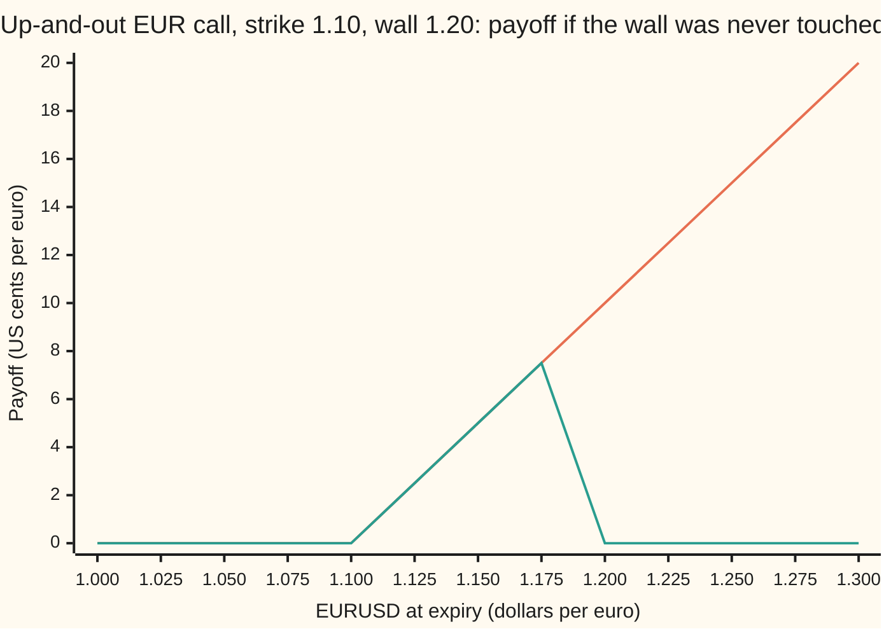
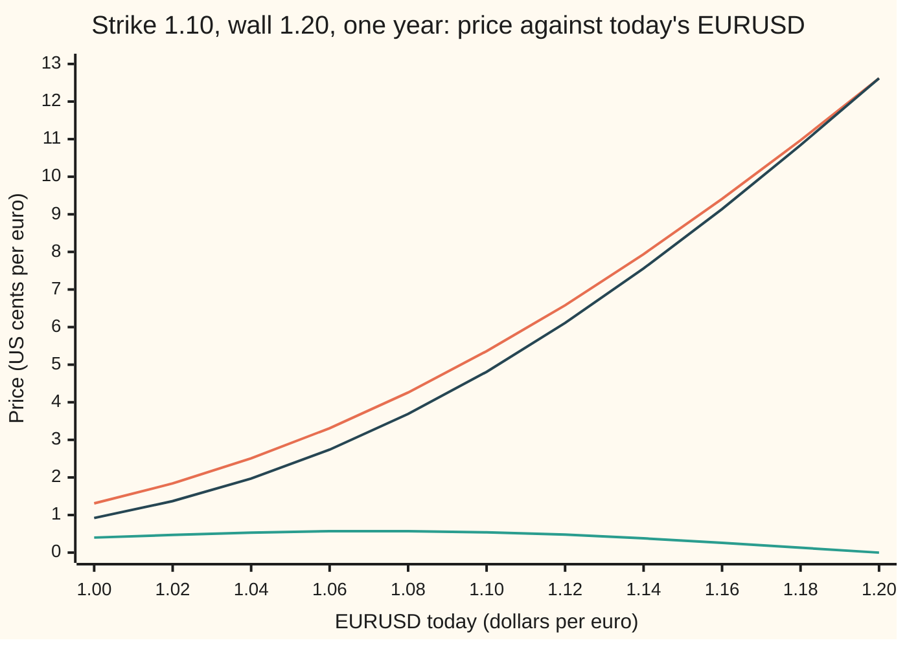

# The eight single barriers in one table: up or down, in or out, call or put, with rebates, from six building blocks

[Syllabus](../../../SYLLABUS.md) → [Financial mathematics](../README.md) → [FX exotics as desks use them - digitals, touches and barriers](../README.md#s23) → The eight single barriers in one table

---

## General Overview

An American importer must pay euros in a year. Today one euro costs 1.10 dollars, written EURUSD 1.10. A plain one-year call on the euro struck at 1.10 caps the cost of those euros. It costs 0.053556 dollars per euro of notional (the amount of euros the contract covers).

The desk offers a cheaper version. The same call, but it dies if EURUSD ever trades at 1.20 during the year. That wall sits above the strike, inside the region where the call pays. It is called a **reverse knock-out**, because the wall kills the option exactly when it is worth most. It costs 0.005440 dollars: about a tenth of the plain call. Its twin, which comes alive only on a touch of 1.20, costs 0.048115. The two add back to the plain call.

A single barrier has three switches. The wall is above or below today's rate (**up** or **down**). A touch kills the option or brings it to life (**out** or **in**). The option underneath is a **call** or a **put**. Two times two times two gives eight types. A **rebate** (a fixed cash sum paid to compensate for a knock-out, or for a knock-in that never came alive) can be added to any of them. Eight types, each with the strike on either side of the wall, is sixteen cases. They all come from six pieces of algebra, first tabulated by Mark Rubinstein and Eric Reiner in 1991, and called blocks A to F here.

**Every single-barrier option is a plain option cut to the paths and expiry rates that survive, minus the mirror image of that cut; the six blocks A to F are the pieces, and one table says which to add.**

**What kind of fact this is:** a theorem inside the Garman–Kohlhagen model (the Black–Scholes model for currencies), proved on this card in Why it works from the mirror density; the in-plus-out identity, without rebates, holds in every model.

### The picture: what the reverse knock-out pays



Orange: the plain call's payoff. Green: the reverse knock-out's payoff. It follows the plain call up to 7.50 cents at 1.175, then drops to zero at 1.20, because any path that ends at or above 1.20 touched 1.20 on the way. The most it can ever pay is the gap between strike and wall. A path that touches 1.20 in June and ends at 1.15 also pays zero.

---

## The formula

Notation first. $S$ is EURUSD today, $K$ the strike, $H$ the wall, $R$ the rebate, $r_d$ and $r_f$ the dollar and euro rates, $\sigma$ the volatility, $T$ the years to expiry, and $N$ the normal CDF. Two switches turn one set of formulas into all eight types. The **call-put switch** $\phi$ (phi) is +1 for a call and −1 for a put. The **wall switch** $\eta$ (eta) is +1 for a wall below today's rate and −1 for a wall above. Write $s = \sigma\sqrt{T}$ for the spread of log moves up to expiry. Each block is a dollar value today per euro of notional; $x_1$ to $z$, $\mu$ and $\lambda$ are defined just below.

$$A = \phi\,S e^{-r_f T} N(\phi x_1) - \phi\,K e^{-r_d T} N(\phi(x_1 - s))$$
$$B = \phi\,S e^{-r_f T} N(\phi x_2) - \phi\,K e^{-r_d T} N(\phi(x_2 - s))$$
$$C = \phi\,S e^{-r_f T} (H/S)^{2\mu+2} N(\eta y_1) - \phi\,K e^{-r_d T} (H/S)^{2\mu} N(\eta(y_1 - s))$$
$$D = \phi\,S e^{-r_f T} (H/S)^{2\mu+2} N(\eta y_2) - \phi\,K e^{-r_d T} (H/S)^{2\mu} N(\eta(y_2 - s))$$
$$E = R\,e^{-r_d T}\Big[N(\eta(x_2 - s)) - (H/S)^{2\mu} N(\eta(y_2 - s))\Big]$$
$$F = R\Big[(H/S)^{\mu+\lambda} N(\eta z) + (H/S)^{\mu-\lambda} N(\eta(z - 2\lambda s))\Big]$$

**Read it aloud: A is the plain option; B is the plain option counted only where the rate ends beyond the wall; C and D are A and B seen in the mirror of the wall and weighted; E is the rebate paid at expiry if the wall was never touched; F is the rebate paid the moment it is.**

The distances and exponents:

$$x_1 = \frac{\ln(S/K)}{s} + (1+\mu)s,\quad x_2 = \frac{\ln(S/H)}{s} + (1+\mu)s,\quad y_1 = \frac{\ln\!\big(H^2/(SK)\big)}{s} + (1+\mu)s,\quad y_2 = \frac{\ln(H/S)}{s} + (1+\mu)s$$

$$z = \frac{\ln(H/S)}{s} + \lambda s,\qquad \mu = \frac{r_d - r_f - \tfrac12\sigma^2}{\sigma^2},\qquad \lambda = \sqrt{\mu^2 + \frac{2r_d}{\sigma^2}}$$

In words: $x_1$ is the Garman–Kohlhagen d1; $x_2$ is the same with the wall in place of the strike; $y_1$ and $y_2$ are those two measured from the mirror spot $H^2/S$. The exponent $\mu$ is the drift of log EURUSD in units of its variance, the number that barrier-options-by-reflection calls lambda. The exponent $\lambda$ here is the one that discounts money paid at a random touch date.

| Symbol | Plain meaning | In our example | Push it up and the answer… |
| --- | --- | --- | --- |
| $S$, $S_T$ | EURUSD today, and at expiry, dollars per euro | 1.10 | up-and-out call falls: the wall comes closer |
| $K$ | the strike | 1.10 | reverse knock-out falls fast: the slice between strike and wall narrows |
| $H$, $b$ | the barrier (the wall); $b = \ln(H/S)$, its log distance from spot | 1.05 below, 1.20 above | up-and-out call rises: more room before the wall |
| $R$ | the rebate, dollars per euro | 0.005 | rebate blocks rise in proportion |
| $r_d$, $r_f$ | the dollar and euro interest rates, continuously compounded | 5%, 3% | drift of EURUSD rises with the dollar rate, falls with the euro rate |
| $\sigma$, $T$, $s$ | volatility; years to expiry; $s = \sigma\sqrt{T}$ | 10%, 1, 0.10 | knock-outs can fall: more touches |
| $\phi$, $\eta$ | call-put switch (+1 call, −1 put); wall switch (+1 below, −1 above) | $\phi = 1$, $\eta = -1$ for the up-and-out call | |
| $\mu$, $\lambda$ | drift of log EURUSD over its variance; the pay-at-touch exponent | 1.5, 3.5 | |
| $x_1$, $x_2$, $y_1$, $y_2$, $z$ | distances in units of $s$, as defined above | wall 1.20: 0.25, −0.620114, 1.990228, 1.120114, 1.220114 | |
| $N$, $\varphi$, $(H/S)^{2\mu}$ | bell-curve area to the left; bell-curve height; the mirror weight | wall 1.20: weight 1.298272 | |
| $A$, $B$, $C$, $D$ | plain; plain beyond the wall; the mirror images of A and B | wall 1.20, call: 0.053556, 0.038997, −0.001488, 0.007630 | |
| $E$, $F$, $t$ | rebate at expiry if never touched; rebate at the touch; $t$ a time before expiry | per dollar, wall 1.20: 0.537017, 0.425164 | |

### The table of recipes

The strike sits on one side of the wall or the other. Knock-outs take block F if they carry a rebate paid at the touch; knock-ins take block E if they carry a rebate paid at expiry when they never came alive.

| Type | $\eta$ | $\phi$ | Strike at or above the wall | Strike below the wall |
| --- | --- | --- | --- | --- |
| down-and-out call | +1 | +1 | A − C | B − D |
| down-and-in call | +1 | +1 | C | A − B + D |
| down-and-out put | +1 | −1 | A − B + C − D | 0 |
| down-and-in put | +1 | −1 | B − C + D | A |
| up-and-out call | −1 | +1 | 0 | A − B + C − D |
| up-and-in call | −1 | +1 | A | B − C + D |
| up-and-out put | −1 | −1 | B − D | A − C |
| up-and-in put | −1 | −1 | A − B + D | C |

Each row pair adds to A, the plain option. That is in-plus-out parity, built into the table.

### When it holds

- **Continuous monitoring.** Every touch counts, however brief. A contract fixed once a day is worth a different amount; barrier-options-by-reflection measures the gap and the shift that repairs it.
- **Constant volatility and rates, no jumps.** Real FX volatility varies with strike, and the reverse knock-out is the type most exposed to it, because its value sits in a narrow band just under the wall. [Barriers on a smile](07-barriers-with-the-smile.md) measures that error.
- **Spot on the live side of the wall.** With EURUSD already at or past the wall, a knock-out is dead (worth its rebate paid now) and a knock-in is the plain option.
- **Rebates as stated.** F pays at the touch; E pays at expiry. A rebate paid at expiry after a touch is a one-touch, not block F, and in-plus-out parity then needs the rebates added on both sides.

**Conventions verified 2026-09-27 (house terms; a term sheet overrides them):** notional in euros; premium and rebates in dollars per euro; the wall is watched continuously against the reference EURUSD rate, and a trade exactly at the wall is a touch; a pip is 0.0001.

---

## Why it works

### Step 0: every barrier is a cut of the plain payoff, minus its mirror

A knock-out pays the plain payoff on the paths that never touch the wall. Barrier-options-by-reflection ([Knock-out and knock-in](02-barrier-options-by-reflection.md)) proved that the density of those paths, on the side of the wall where the option is still alive, is the ordinary bell curve minus a weighted bell curve started from the mirror spot. So any knock-out is an integral of its payoff against two curves over one stretch of expiry rates. The eight types differ only in which stretch.

### Step 1: in plus out is the plain option

Hold a knock-in and a knock-out with the same wall, strike and type. On a path that touches, one died and one came alive. On a path that does not, the reverse. Either way the holder has the plain option. So each knock-in is the plain option minus its knock-out, with no model needed. Only four knock-outs need real work.

### Step 2: the plain density over a stretch gives A, B, or A − B

Integrate the payoff against the ordinary bell curve. Over every expiry rate where it pays, the answer is the plain option, block A. Over only the rates beyond the wall (above it for a call, below it for a put), the answer is B: the same formula with the wall in place of the strike inside the bell-curve areas. Over the rates between strike and wall, it is A − B. This is the "cut".

### Step 3: the mirror term over the same stretch gives C, D, or their difference

The mirror term is the same integral, for a rate that starts at $H^2/S$, times the mirror weight. Over the same stretches it produces the mirror copies of A, B and A − B. These are blocks C and D. The switch $\eta$ reads the mirror's bell curve from the correct side of the wall: for a wall above, it replaces each area $N(u)$ by $N(-u) = 1 - N(u)$. That flip changes the sign of a difference such as C − D, which is why the reverse knock-out ends in + C − D and not − C + D.

### Step 4: the four knock-outs, read off

- **Down-and-out call, strike at or above the wall.** The call pays only above the strike, and all of that lies on the live side. The stretch is the whole payoff: A − C. This is the regular knock-out of barrier-options-by-reflection.
- **Down-and-out call, strike below the wall.** Expiry rates between strike and wall can only be reached by paths that touched, so they are dead. The stretch is the rates above the wall: B − D.
- **Up-and-out call, strike below the wall.** The call pays above the strike, but only rates below the wall are alive. The stretch is strike to wall: the cut A − B, minus its mirror, which after the $\eta$ flip is A − B + C − D. This is the reverse knock-out.
- **Up-and-out call, strike at or above the wall.** Every paying rate lies at or past the wall. Nothing survives: 0.

The puts are the same four cases seen upside down, and Step 1 hands over the four knock-ins.

### Step 5: the two rebates

A rebate paid at expiry when a knock-in never came alive is the rebate times the chance of no touch, discounted from expiry: the no-touch of [One-touch and no-touch](04-fx-one-touch-and-no-touch.md). Integrating the survival density over the whole live side gives exactly block E. A rebate paid at the touch is the pay-at-hit one-touch of the same card: each touching path is discounted from its own touch date. Discounting at rate $r_d$ is the same as raising the drift from $\mu$ to $\lambda$ in variance units, which is where $\lambda = \sqrt{\mu^2 + 2r_d/\sigma^2}$ comes from; the proof is on that card. Block F is that price times the rebate.

<details>
<summary>Detailed proof</summary>

Let $u = \ln(S_T/S)$ and $b = \ln(H/S)$. Under the pricing measure $u$ is normal with mean $\mu\sigma^2 T$ and variance $s^2$; write $\varphi$ for its density. On paths that never touched the wall, and on the live side ($u > b$ for $\eta = 1$, $u < b$ for $\eta = -1$), the density of $u$ is
$$\varphi(u) - (H/S)^{2\mu}\,\varphi(u - 2b)$$
(barrier-options-by-reflection, Detailed proof, where $e^{2\mu b} = (H/S)^{2\mu}$). A knock-out paying $\phi(Se^u - K)$ is worth $e^{-r_d T}$ times the integral of that payoff against this density over the live stretch of $u$ where the payoff is positive.

**Plain term.** Over the stretch "u beyond a cut point", completing the square as on the Black–Scholes card gives $\phi[S e^{-r_f T}N(\cdot) - K e^{-r_d T} N(\cdot)]$, with arguments $x_1, x_1 - s$ when the cut is the strike and $x_2, x_2 - s$ when it is the wall; $\phi$ turns "above the cut" into "below it" for puts. These are A and B, and a stretch between strike and wall gives A − B.

**Mirror term.** Substitute $u = x + 2b$. The density becomes $(H/S)^{2\mu}\varphi(x)$ and the payoff $\phi((H^2/S)e^x - K)$: the plain term for spot $H^2/S$. Its share leg gains a further $(H^2/S)/S = (H/S)^2$, which is why the share part of C and D carries $(H/S)^{2\mu+2}$. Shifting the cut by $2b$ turns $x_1$ into $y_1$ and $x_2$ into $y_2$ up to sign. For $\eta = 1$ the mirrored stretch lies above its cut and reads $N(y)$; for $\eta = -1$ the live side is $u < b$, the stretch reverses, and the areas become $N(-y)$. These are C and D.

**Assembly.** For $\eta = -1$, $\phi = 1$, strike below the wall, the stretch is strike to wall. The plain term gives A − B. The mirror term over the same stretch is a difference of two reversed areas; since $N(-y) = 1 - N(y)$, the constant parts cancel in the difference and it equals $-(C - D)$ in the table's sign convention. So the value is $(A - B) + (C - D)$. The other fifteen cells follow the same way; each is checked below against a direct numerical integral.

**Rebates.** $E$ is $R e^{-r_d T}$ times the survival density integrated over the whole live side, which is the bracket in E. For F, the first-touch density with drift $\mu\sigma^2$, multiplied by $e^{-r_d t}$, equals $(H/S)^{\mu-\lambda}$ times the first-touch density with drift $\lambda\sigma^2$ (Girsanov, as on fx-one-touch-and-no-touch). The chance of a touch by $T$ at the new drift is $N(\eta(z - 2\lambda s)) + (H/S)^{2\lambda}N(\eta z)$; multiplying through gives the two terms of F.

</details>

### Another road

The same numbers come from brute force. One road multiplies the payoff by the chance that a path pinned at both ends never touched the wall, and integrates over the end point with Simpson's rule: no blocks. Another simulates 200,000 paths.

---

## Worked numbers, by hand

House market: EURUSD 1.10, strike 1.10, dollar rate 5%, euro rate 3%, volatility 10%, one year. The reverse knock-out: up-and-out call, wall 1.20, so $\eta = -1$, $\phi = +1$, strike below the wall.

| Step | Arithmetic | Value |
| --- | --- | --- |
| $\mu$ | $(0.05 - 0.03 - 0.005)/0.01$ | 1.5 |
| $\lambda$ | $\sqrt{2.25 + 0.10/0.01}$ | 3.5 |
| $x_1$ | $\ln(1.10/1.10)/0.1 + 2.5 \times 0.1$ | 0.25 |
| $x_2$ | $\ln(1.10/1.20)/0.1 + 0.25$ | −0.620114 |
| $y_1$, $y_2$ | $\ln(1.44/1.21)/0.1 + 0.25$; $\ln(1.20/1.10)/0.1 + 0.25$ | 1.990228; 1.120114 |
| mirror weights | $(1.20/1.10)^{3}$ and $(1.20/1.10)^{5}$ | 1.298272 and 1.545051 |
| A, the plain call | Garman–Kohlhagen | 0.053556 |
| B, the call beyond 1.20 | the payoff counted above 1.20 only | 0.038997 |
| C, D | the mirror copies, read from above the wall | −0.001488, 0.007630 |
| **up-and-out call** | $A - B + C - D$ with $C = -0.001488$: $0.053556 - 0.038997 - 0.001488 - 0.007630$ | **0.005440** |
| up-and-in call | $B - C + D = 0.038997 + 0.001488 + 0.007630$ | 0.048115 |
| check, full precision | up-and-out plus up-and-in | 0.053555771, the plain call |

A hand sum of six-decimal blocks can miss the last digit; the checks carry full precision. C is negative: with $\eta = -1$ the blocks are signed pieces, not prices.

The reverse knock-out is 0.1016 of the plain call; the knock-in takes 0.8984. B is the reason. Of the plain call's 0.053556, 0.038997 comes from expiry rates above 1.20, and those are all dead for the knock-out. The mirror term removes the rest: paths that end below 1.20 after visiting it.

### All eight at once

The house table, strike 1.10 for every type, wall 1.05 for the down types and 1.20 for the up types:

```
price, US dollars per euro     (each █ = 0.001 dollars)
down-and-out call  A-C       ██████████████████████████████████████████        0.041661
down-and-in call   C         ████████████                                      0.011895
down-and-out put   A-B+C-D   █                                                 0.000536
down-and-in put    B-C+D     ████████████████████████████████                  0.031882
up-and-out call    A-B+C-D   █████                                             0.005440
up-and-in call     B-C+D     ████████████████████████████████████████████████  0.048115
up-and-out put     A-C       ███████████████████████████████                   0.030930
up-and-in put      C         █                                                 0.001488
```

Down-and-out call plus down-and-in call is 0.053556, the plain call. Down-and-out put plus down-and-in put is 0.032418, the plain put. The two reverse knock-outs, the down-and-out put and the up-and-out call, are the two cheapest knock-outs: 0.000536 and 0.005440. The down-and-out put is almost worthless because a put struck at 1.10 with a wall at 1.05 can pay at most the gap between strike and wall, and dies on the way to paying it.

With the strike on the other side of each wall (1.00 for the down types, 1.25 for the up types), the other eight recipes give: down-and-out call 0.079507 (B − D), down-and-in call 0.042967, down-and-out put 0, down-and-in put 0.006214, up-and-out call 0, up-and-in call 0.008061, up-and-out put 0.106042 (B − D), up-and-in put 0.023566.

### Rebates

Add a rebate of 0.005 dollars per euro to the reverse knock-out.

| Rebate | Block | Price with rebate |
| --- | --- | --- |
| none | A − B + C − D | 0.005440 |
| 0.005 paid at the touch | + 0.005 × 0.425164 | 0.007566 |
| 0.005 paid at expiry after a touch | + 0.005 × 0.414213 | 0.007511 |

Paying at the touch is worth more, because the money arrives earlier. For the knock-in, a rebate of 0.005 paid at expiry if it never came alive adds 0.005 × E; on the down-and-in call that gives 0.013814 (E per dollar is 0.383822 for the wall at 1.05).

### What breaks if you drop a piece

Right answers: reverse knock-out 0.005440; down-and-out call 0.041661.

| Mistake | Comes out at | What went wrong |
| --- | --- | --- |
| Use the regular recipe A − C for the up-and-out call | 0.055044 | Priced the whole plain payoff as if it survived; the answer exceeds the plain call, 0.053556, which no knock-out can. |
| Leave the euro rate out of $\mu$ (down-and-out call) | 0.043844 against 0.041661 | Gave EURUSD the drift of a share with no dividend; the mirror weight and every distance shift. |
| Up-and-in from parity when the knock-out carries a touch rebate | 0.045990 against 0.050801 | In-plus-out equals the plain option only without rebates; with them, each side's rebate must be added back. |

---

## How the reverse knock-out moves with EURUSD

The mystery: a call that loses value when the euro rises. Keep one year to expiry and slide today's rate.



Orange: the plain call. Green: the up-and-out call, a low hump that peaks near 1.06 to 1.08 at 0.57 cents and falls to zero at the wall. Dark: the up-and-in call, which meets the plain call at 1.20, where it has come alive. The orange line is the sum of the other two at every point.

Delta (price change per unit move in EURUSD, by a one-pip bump) and vega (price change per volatility point, dollars) for all eight at the house rate:

| Type | Delta | Vega per point |
| --- | --- | --- |
| down-and-out call | 0.8043 | 0.001007 |
| down-and-in call | −0.2233 | 0.003120 |
| down-and-out put | 0.0075 | −0.000139 |
| down-and-in put | −0.3970 | 0.004267 |
| up-and-out call | −0.0242 | −0.001241 |
| up-and-in call | 0.6052 | 0.005369 |
| up-and-out put | −0.4203 | 0.003323 |
| up-and-in put | 0.0309 | 0.000804 |

Two signs surprise. The up-and-out call has negative delta: a higher euro brings the wall closer. Both reverse knock-outs have negative vega: more volatility means more touches, which outweighs the extra upside. How these behave right at the wall is [Greeks at the wall](06-barrier-and-touch-greeks.md).

---

## Code, from first principles, and it actually runs

The code prices all eight house types by the blocks, then by two roads that never use a block: a Simpson integral of the payoff times the chance that a path pinned at both ends never touched the wall, and a Monte Carlo of 200,000 paths with its own random numbers. It checks the other eight recipes against the integral, in-plus-out against a separately written Garman–Kohlhagen price, and block F against the first-touch density integrated over the year. The Monte Carlo dates a touch at the middle of its step, a small bias inside its standard error.

### Python

```python
# The eight single barriers -- the check behind the card.  Standard library only.  House FX market:
# EURUSD 1.10, strike 1.10, USD 5%, EUR 3%, vol 10%, 1 year, walls 1.05 and 1.20; USD per 1 EUR.
# Roads: (1) blocks A-F; (2) in + out = vanilla; (3) Simpson integral of payoff times bridge survival;
# (4) Monte Carlo with its own random numbers; (5) rebate at hit from the first-hitting-time density.
from math import log, exp, sqrt, cos, pi

def N(x):                                   # normal CDF, own series: 0.5 + phi(x)(x + x^3/3 + x^5/15 + ...)
    if abs(x) > 9.0: return 0.0 if x < 0 else 1.0
    term, total, k = x, x, 1
    while abs(term) > 1e-17 * abs(total) or k < 5:
        term *= x * x / (2 * k + 1); total += term; k += 1
    return 0.5 + total * exp(-0.5 * x * x) / sqrt(2 * pi)

S0, K, rd, rf, VOL, T, LO, HI, R = 1.10, 1.10, 0.05, 0.03, 0.10, 1.0, 1.05, 1.20, 0.005
# name, barrier, eta, phi, coefficients on A B C D, blocks in words, [strike if not K]
TYPES = [("DOC", LO, 1, 1, (1, 0, -1, 0), "A-C"), ("DIC", LO, 1, 1, (0, 0, 1, 0), "C"),
         ("DOP", LO, 1, -1, (1, -1, 1, -1), "A-B+C-D"), ("DIP", LO, 1, -1, (0, 1, -1, 1), "B-C+D"),
         ("UOC", HI, -1, 1, (1, -1, 1, -1), "A-B+C-D"), ("UIC", HI, -1, 1, (0, 1, -1, 1), "B-C+D"),
         ("UOP", HI, -1, -1, (1, 0, -1, 0), "A-C"), ("UIP", HI, -1, -1, (0, 0, 1, 0), "C")]
OTHER = [("DOC", LO, 1, 1, (0, 1, 0, -1), "B-D", 1.0), ("DIC", LO, 1, 1, (1, -1, 0, 1), "A-B+D", 1.0),   # strike under
         ("DOP", LO, 1, -1, (0, 0, 0, 0), "0", 1.0), ("DIP", LO, 1, -1, (1, 0, 0, 0), "A", 1.0),          # the low wall,
         ("UOC", HI, -1, 1, (0, 0, 0, 0), "0", 1.25), ("UIC", HI, -1, 1, (1, 0, 0, 0), "A", 1.25),        # strike over
         ("UOP", HI, -1, -1, (0, 1, 0, -1), "B-D", 1.25), ("UIP", HI, -1, -1, (1, -1, 0, 1), "A-B+D", 1.25)]  # the high
def blocks(S, v, H, eta, phi, b=rd - rf, K=K):
    s = v * sqrt(T); mu = (b - 0.5 * v * v) / (v * v); lam = sqrt(mu * mu + 2 * rd / (v * v))
    x1 = log(S / K) / s + (1 + mu) * s; x2 = log(S / H) / s + (1 + mu) * s
    y1 = log(H * H / (S * K)) / s + (1 + mu) * s; y2 = log(H / S) / s + (1 + mu) * s
    z = log(H / S) / s + lam * s
    fS, fK, hp, hm = S * exp(-rf * T), K * exp(-rd * T), (H / S) ** (2 * mu + 2), (H / S) ** (2 * mu)
    A = phi * fS * N(phi * x1) - phi * fK * N(phi * x1 - phi * s)
    B = phi * fS * N(phi * x2) - phi * fK * N(phi * x2 - phi * s)
    C = phi * fS * hp * N(eta * y1) - phi * fK * hm * N(eta * y1 - eta * s)
    D = phi * fS * hp * N(eta * y2) - phi * fK * hm * N(eta * y2 - eta * s)
    E = exp(-rd * T) * (N(eta * x2 - eta * s) - hm * N(eta * y2 - eta * s))     # 1 USD at expiry if never hit
    F = (H / S) ** (mu + lam) * N(eta * z) + (H / S) ** (mu - lam) * N(eta * z - 2 * eta * lam * s)  # 1 USD at hit
    return A, B, C, D, E, F, (mu, lam, x1, x2, y1, y2, z, hp, hm)

def price(t, S=S0, v=VOL, b=rd - rf):
    bl = blocks(S, v, t[1], t[2], t[3], b, *t[6:])
    return sum(c * x for c, x in zip(t[4], bl[:4]))

def simpson(f, a, b, n):
    h = (b - a) / n; tot = f(a) + f(b)
    for i in range(1, n):
        tot += (4 if i % 2 else 2) * f(a + i * h)
    return tot * h / 3

def by_integral(t):                         # road 3: survival chance of a bridge pinned at both ends
    H, eta, phi, out, k = t[1], t[2], t[3], t[0][1] == "O", (t[6:] or [K])[0]
    a, m, s = log(H / S0), (rd - rf - 0.5 * VOL * VOL) * T, VOL * sqrt(T)
    def f(z):
        x = m + s * z
        pay = max(phi * (S0 * exp(x) - k), 0.0)
        live = x > a if eta == 1 else x < a
        surv = 1 - exp(-2 * a * (a - x) / (s * s)) if live else 0.0
        return pay * (surv if out else 1 - surv) * exp(-0.5 * z * z) / sqrt(2 * pi)
    return exp(-rd * T) * simpson(f, -9.0, 9.0, 20000)

def hit_integral(H):                        # road 5: first-hitting-time density, discounted
    a, nu = log(H / S0), rd - rf - 0.5 * VOL * VOL
    f = lambda t: 0.0 if t == 0 else exp(-rd * t) * abs(a) / (VOL * sqrt(2 * pi * t ** 3)) * exp(-(a - nu * t) ** 2 / (2 * VOL * VOL * t))
    return simpson(f, 0.0, T, 20000)

state = [20260927]
def unif():                                 # splitmix64, then 53 bits into (0, 1)
    state[0] = (state[0] + 0x9E3779B97F4A7C15) & 0xFFFFFFFFFFFFFFFF
    z = state[0]
    z = ((z ^ (z >> 30)) * 0xBF58476D1CE4E5B9) & 0xFFFFFFFFFFFFFFFF
    z = ((z ^ (z >> 27)) * 0x94D049BB133111EB) & 0xFFFFFFFFFFFFFFFF
    return ((z ^ (z >> 31)) >> 11) * 2.0 ** -53 + 2.0 ** -54

def monte_carlo(paths=200000, steps=20):     # road 4: 12 payoffs per path, bridge test each step
    dt = T / steps; drift, sd = (rd - rf - 0.5 * VOL * VOL) * dt, VOL * sqrt(dt)
    aL, aH, disc = log(LO / S0), log(HI / S0), exp(-rd * T)
    sm, sq = [0.0] * 12, [0.0] * 12
    for _ in range(paths):
        x, tL, tH = 0.0, -1.0, -1.0
        for i in range(steps):
            z = sqrt(-2 * log(unif())) * cos(2 * pi * unif()); u3, u4 = unif(), unif()
            y = x + drift + sd * z
            if tL < 0 and (y <= aL or u3 < exp(-2 * (x - aL) * (y - aL) / (sd * sd))): tL = (i + 0.5) * dt
            if tH < 0 and (y >= aH or u4 < exp(-2 * (aH - x) * (aH - y) / (sd * sd))): tH = (i + 0.5) * dt
            x = y
        c, p = max(S0 * exp(x) - K, 0.0) * disc, max(K - S0 * exp(x), 0.0) * disc
        hL, hH = tL >= 0, tH >= 0
        v = [c * (not hL), c * hL, p * (not hL), p * hL, c * (not hH), c * hH, p * (not hH), p * hH,
             exp(-rd * tL) if hL else 0.0, exp(-rd * tH) if hH else 0.0, disc * (not hL), disc * (not hH)]
        for k in range(12):
            sm[k] += v[k]; sq[k] += v[k] * v[k]
    mean = [s / paths for s in sm]
    return mean, [sqrt(max(sq[k] / paths - mean[k] ** 2, 0.0) / paths) for k in range(12)]

def gk(phi, S=S0, K=K):                     # Garman-Kohlhagen vanilla, written the usual way
    d1 = (log(S / K) + (rd - rf + 0.5 * VOL * VOL) * T) / (VOL * sqrt(T)); d2 = d1 - VOL * sqrt(T)
    return phi * (S * exp(-rf * T) * N(phi * d1) - K * exp(-rd * T) * N(phi * d2))

van, (mc, se) = {1: gk(1), -1: gk(-1)}, monte_carlo()
print(f"vanilla EUR call {van[1]:.6f}   vanilla EUR put {van[-1]:.6f}")
for H, eta in ((LO, 1), (HI, -1)):
    print(f"blocks, call, H={H:.2f}   " + "  ".join(f"{x:.6f}" for x in blocks(S0, VOL, H, eta, 1)[:6]))
    print(f"pieces, H={H:.2f} mu lam x1 x2 y1 y2 z hp hm " + " ".join(f"{x:.6f}" for x in blocks(S0, VOL, H, eta, 1)[6]))
print("type blocks      formula  integral  monte-carlo   se      delta    vega/pt")
P = {}
for k, t in enumerate(TYPES):
    P[t[0]] = price(t); I = by_integral(t)
    dl = (price(t, S0 + 1e-4) - price(t, S0 - 1e-4)) / 2e-4
    vg = (price(t, v=VOL + 1e-4) - price(t, v=VOL - 1e-4)) / 2e-4 * 0.01
    print(f"{t[0]}  {t[5]:<9} {P[t[0]]:9.6f} {I:9.6f} {mc[k]:9.6f} {se[k]:9.6f} {dl:8.4f} {vg:9.6f}")
    assert abs(I - P[t[0]]) < 1e-7, t[0]
    assert abs(mc[k] - P[t[0]]) < 4 * se[k], t[0]
for o, i, ph in (("DOC", "DIC", 1), ("DOP", "DIP", -1), ("UOC", "UIC", 1), ("UOP", "UIP", -1)):
    print(f"parity {o}+{i} {P[o] + P[i]:.9f}  vanilla {van[ph]:.9f}")
    assert abs(P[o] + P[i] - van[ph]) < 1e-12
for k, t in enumerate(OTHER):               # the barrier on the other side of the strike
    P[k], I = price(t), by_integral(t)
    print(f"other side, {t[0]} K={t[6]:.2f} {t[5]:<6} formula {P[k]:.6f}  integral {I:.6f}")
    assert abs(I - P[k]) < 1e-7 and (k % 2 == 0 or abs(P[k] + P[k - 1] - gk(t[3], S0, t[6])) < 1e-12)
for j, (H, eta) in enumerate(((LO, 1), (HI, -1))):
    (E, F), Fi = blocks(S0, VOL, H, eta, 1)[4:6], hit_integral(H)
    print(f"1 USD at hit, H={H:.2f}: F {F:.6f}  density {Fi:.6f}  mc {mc[8 + j]:.6f}")
    print(f"1 USD at expiry if untouched, H={H:.2f}: E {E:.6f}  mc {mc[10 + j]:.6f}")
    assert abs(Fi - F) < 1e-7 and abs(mc[8 + j] - F) < 4 * se[8 + j] and abs(mc[10 + j] - E) < 4 * se[10 + j]
EU, FU, ED = blocks(S0, VOL, HI, -1, 1)[4], blocks(S0, VOL, HI, -1, 1)[5], blocks(S0, VOL, LO, 1, 1)[4]
print(f"one-touch 1.20, 1 USD at expiry = e^-rT - E {exp(-rd * T) - EU:.6f}")
print(f"UOC share of vanilla {P['UOC'] / van[1]:.4f}   UIC share {P['UIC'] / van[1]:.4f}")
print(f"UOC + 0.005 rebate at hit {P['UOC'] + R * FU:.6f}   at expiry {P['UOC'] + R * (exp(-rd * T) - EU):.6f}")
print(f"DIC + 0.005 rebate at expiry if never in {P['DIC'] + R * ED:.6f}")
print(f"wrong: UOC by the regular pair A-C {blocks(S0, VOL, HI, -1, 1)[0] - blocks(S0, VOL, HI, -1, 1)[2]:.6f}")
print(f"wrong: DOC with the EUR rate left out of mu {price(TYPES[0], b=rd):.6f}")
print(f"wrong: UIC+rebate as vanilla - (UOC+rebate at hit) {van[1] - P['UOC'] - R * FU:.6f}  right {P['UIC'] + R * EU:.6f}")
xs = [1.00 + 0.02 * i for i in range(11)]
print("chart, spot today    " + " ".join(f"{x:6.2f}" for x in xs))
print("chart, vanilla cents " + " ".join(f"{100 * gk(1, x):6.2f}" for x in xs))
for t in TYPES[4:6]:
    print(f"chart, {t[0]}     cents " + " ".join(f"{100 * (price(t, x) if abs(price(t, x)) > 1e-12 else 0.0):6.2f}" for x in xs))
xs = [1.00 + 0.025 * i for i in range(13)]
print("payoff, EURUSD at expiry " + " ".join(f"{x:5.3f}" for x in xs))
print("payoff, vanilla   cents  " + " ".join(f"{100 * max(x - K, 0):5.2f}" for x in xs))
print("payoff, UOC       cents  " + " ".join(f"{100 * max(x - K, 0) * (x < HI - 1e-9):5.2f}" for x in xs))
print("ALL CHECKS PASS")
```

**Ran 2026-09-27 on macOS, Python 3.14.6, standard library only. All checks passed. Output, pasted from the run:**

```
vanilla EUR call 0.053556   vanilla EUR put 0.032418
blocks, call, H=1.05   0.053556  0.049573  0.011895  0.008448  0.383822  0.587604
pieces, H=1.05 mu lam x1 x2 y1 y2 z hp hm 1.500000 3.500000 0.250000 0.715200 -0.680400 -0.215200 -0.115200 0.792470 0.869741
blocks, call, H=1.20   0.053556  0.038997  -0.001488  0.007630  0.537017  0.425164
pieces, H=1.20 mu lam x1 x2 y1 y2 z hp hm 1.500000 3.500000 0.250000 -0.620114 1.990228 1.120114 1.220114 1.545051 1.298272
type blocks      formula  integral  monte-carlo   se      delta    vega/pt
DOC  A-C        0.041661  0.041661  0.041548  0.000160   0.8043  0.001007
DIC  C          0.011895  0.011895  0.011935  0.000076  -0.2233  0.003120
DOP  A-B+C-D    0.000536  0.000536  0.000534  0.000008   0.0075 -0.000139
DIP  B-C+D      0.031882  0.031882  0.031839  0.000115  -0.3970  0.004267
UOC  A-B+C-D    0.005440  0.005440  0.005460  0.000034  -0.0242 -0.001241
UIC  B-C+D      0.048115  0.048115  0.048024  0.000168   0.6052  0.005369
UOP  A-C        0.030930  0.030930  0.030894  0.000114  -0.4203  0.003323
UIP  C          0.001488  0.001488  0.001479  0.000022   0.0309  0.000804
parity DOC+DIC 0.053555771  vanilla 0.053555771
parity DOP+DIP 0.032418051  vanilla 0.032418051
parity UOC+UIC 0.053555771  vanilla 0.053555771
parity UOP+UIP 0.032418051  vanilla 0.032418051
other side, DOC K=1.00 B-D    formula 0.079507  integral 0.079507
other side, DIC K=1.00 A-B+D  formula 0.042967  integral 0.042967
other side, DOP K=1.00 0      formula 0.000000  integral 0.000000
other side, DIP K=1.00 A      formula 0.006214  integral 0.006214
other side, UOC K=1.25 0      formula 0.000000  integral 0.000000
other side, UIC K=1.25 A      formula 0.008061  integral 0.008061
other side, UOP K=1.25 B-D    formula 0.106042  integral 0.106042
other side, UIP K=1.25 A-B+D  formula 0.023566  integral 0.023566
1 USD at hit, H=1.05: F 0.587604  density 0.587604  mc 0.588664
1 USD at expiry if untouched, H=1.05: E 0.383822  mc 0.382832
1 USD at hit, H=1.20: F 0.425164  density 0.425164  mc 0.424481
1 USD at expiry if untouched, H=1.20: E 0.537017  mc 0.537687
one-touch 1.20, 1 USD at expiry = e^-rT - E 0.414213
UOC share of vanilla 0.1016   UIC share 0.8984
UOC + 0.005 rebate at hit 0.007566   at expiry 0.007511
DIC + 0.005 rebate at expiry if never in 0.013814
wrong: UOC by the regular pair A-C 0.055044
wrong: DOC with the EUR rate left out of mu 0.043844
wrong: UIC+rebate as vanilla - (UOC+rebate at hit) 0.045990  right 0.050801
chart, spot today      1.00   1.02   1.04   1.06   1.08   1.10   1.12   1.14   1.16   1.18   1.20
chart, vanilla cents   1.31   1.84   2.51   3.31   4.26   5.36   6.58   7.94   9.41  10.97  12.62
chart, UOC     cents   0.40   0.47   0.53   0.57   0.57   0.54   0.48   0.38   0.26   0.13   0.00
chart, UIC     cents   0.92   1.37   1.97   2.74   3.69   4.81   6.11   7.56   9.14  10.84  12.62
payoff, EURUSD at expiry 1.000 1.025 1.050 1.075 1.100 1.125 1.150 1.175 1.200 1.225 1.250 1.275 1.300
payoff, vanilla   cents   0.00  0.00  0.00  0.00  0.00  2.50  5.00  7.50 10.00 12.50 15.00 17.50 20.00
payoff, UOC       cents   0.00  0.00  0.00  0.00  0.00  2.50  5.00  7.50  0.00  0.00  0.00  0.00  0.00
ALL CHECKS PASS
```

### Rust

```rust
// The eight single barriers -- the check behind the card.  Rust std only, no crates.  House FX market:
// EURUSD 1.10, strike 1.10, USD 5%, EUR 3%, vol 10%, 1 year, walls 1.05 and 1.20; USD per 1 EUR.
// Roads: (1) blocks A-F; (2) in + out = vanilla; (3) Simpson integral of payoff times bridge survival;
// (4) Monte Carlo with its own random numbers; (5) rebate at hit from the first-hitting-time density.
use std::f64::consts::PI;
const S0: f64 = 1.10; const K: f64 = 1.10; const RD: f64 = 0.05; const RF: f64 = 0.03;
const VOL: f64 = 0.10; const T: f64 = 1.0; const LO: f64 = 1.05; const HI: f64 = 1.20; const R: f64 = 0.005;

fn n(x: f64) -> f64 { // normal CDF, own series: 0.5 + phi(x)(x + x^3/3 + x^5/15 + ...)
    if x.abs() > 9.0 { return if x < 0.0 { 0.0 } else { 1.0 }; }
    let (mut term, mut total, mut k) = (x, x, 1.0);
    while term.abs() > 1e-17 * total.abs() || k < 5.0 {
        term *= x * x / (2.0 * k + 1.0); total += term; k += 1.0;
    }
    0.5 + total * (-0.5 * x * x).exp() / (2.0 * PI).sqrt()
}

// name, barrier, eta, phi, coefficients on A B C D, blocks in words, strike
struct Ty(&'static str, f64, f64, f64, [f64; 4], &'static str, f64);
const TYPES: [Ty; 8] = [Ty("DOC", LO, 1.0, 1.0, [1.0, 0.0, -1.0, 0.0], "A-C", K), Ty("DIC", LO, 1.0, 1.0, [0.0, 0.0, 1.0, 0.0], "C", K),
    Ty("DOP", LO, 1.0, -1.0, [1.0, -1.0, 1.0, -1.0], "A-B+C-D", K), Ty("DIP", LO, 1.0, -1.0, [0.0, 1.0, -1.0, 1.0], "B-C+D", K),
    Ty("UOC", HI, -1.0, 1.0, [1.0, -1.0, 1.0, -1.0], "A-B+C-D", K), Ty("UIC", HI, -1.0, 1.0, [0.0, 1.0, -1.0, 1.0], "B-C+D", K),
    Ty("UOP", HI, -1.0, -1.0, [1.0, 0.0, -1.0, 0.0], "A-C", K), Ty("UIP", HI, -1.0, -1.0, [0.0, 0.0, 1.0, 0.0], "C", K)];
const OTHER: [Ty; 8] = [Ty("DOC", LO, 1.0, 1.0, [0.0, 1.0, 0.0, -1.0], "B-D", 1.0), Ty("DIC", LO, 1.0, 1.0, [1.0, -1.0, 0.0, 1.0], "A-B+D", 1.0),
    Ty("DOP", LO, 1.0, -1.0, [0.0; 4], "0", 1.0), Ty("DIP", LO, 1.0, -1.0, [1.0, 0.0, 0.0, 0.0], "A", 1.0),
    Ty("UOC", HI, -1.0, 1.0, [0.0; 4], "0", 1.25), Ty("UIC", HI, -1.0, 1.0, [1.0, 0.0, 0.0, 0.0], "A", 1.25),
    Ty("UOP", HI, -1.0, -1.0, [0.0, 1.0, 0.0, -1.0], "B-D", 1.25), Ty("UIP", HI, -1.0, -1.0, [1.0, -1.0, 0.0, 1.0], "A-B+D", 1.25)];

fn blocks(s0: f64, v: f64, h: f64, eta: f64, phi: f64, b: f64, k: f64) -> [f64; 15] {
    let s = v * T.sqrt(); let mu = (b - 0.5 * v * v) / (v * v); let lam = (mu * mu + 2.0 * RD / (v * v)).sqrt();
    let x1 = (s0 / k).ln() / s + (1.0 + mu) * s; let x2 = (s0 / h).ln() / s + (1.0 + mu) * s;
    let y1 = (h * h / (s0 * k)).ln() / s + (1.0 + mu) * s; let y2 = (h / s0).ln() / s + (1.0 + mu) * s;
    let z = (h / s0).ln() / s + lam * s;
    let (fs, fk) = (s0 * (-RF * T).exp(), k * (-RD * T).exp());
    let (hp, hm) = ((h / s0).powf(2.0 * mu + 2.0), (h / s0).powf(2.0 * mu));
    let a = phi * fs * n(phi * x1) - phi * fk * n(phi * x1 - phi * s);
    let bb = phi * fs * n(phi * x2) - phi * fk * n(phi * x2 - phi * s);
    let c = phi * fs * hp * n(eta * y1) - phi * fk * hm * n(eta * y1 - eta * s);
    let d = phi * fs * hp * n(eta * y2) - phi * fk * hm * n(eta * y2 - eta * s);
    let e = (-RD * T).exp() * (n(eta * x2 - eta * s) - hm * n(eta * y2 - eta * s)); // 1 USD at expiry if never hit
    let f = (h / s0).powf(mu + lam) * n(eta * z) + (h / s0).powf(mu - lam) * n(eta * z - 2.0 * eta * lam * s); // 1 USD at hit
    [a, bb, c, d, e, f, mu, lam, x1, x2, y1, y2, z, hp, hm]
}
fn price(t: &Ty, s0: f64, v: f64, b: f64) -> f64 {
    let bl = blocks(s0, v, t.1, t.2, t.3, b, t.6);
    (0..4).fold(0.0, |acc, i| acc + t.4[i] * bl[i])
}
fn simpson(f: &dyn Fn(f64) -> f64, a: f64, b: f64, m: usize) -> f64 {
    let h = (b - a) / m as f64; let mut tot = f(a) + f(b);
    for i in 1..m { tot += (if i % 2 == 1 { 4.0 } else { 2.0 }) * f(a + i as f64 * h); }
    tot * h / 3.0
}
fn by_integral(t: &Ty) -> f64 { // road 3: survival chance of a bridge pinned at both ends
    let out = t.0.as_bytes()[1] == b'O';
    let (a, m, s) = ((t.1 / S0).ln(), (RD - RF - 0.5 * VOL * VOL) * T, VOL * T.sqrt());
    let f = |z: f64| {
        let x = m + s * z; let pay = (t.3 * (S0 * x.exp() - t.6)).max(0.0);
        let live = if t.2 == 1.0 { x > a } else { x < a };
        let surv = if live { 1.0 - (-2.0 * a * (a - x) / (s * s)).exp() } else { 0.0 };
        pay * (if out { surv } else { 1.0 - surv }) * (-0.5 * z * z).exp() / (2.0 * PI).sqrt()
    };
    (-RD * T).exp() * simpson(&f, -9.0, 9.0, 20000)
}
fn hit_integral(h: f64) -> f64 { // road 5: first-hitting-time density, discounted
    let (a, nu) = ((h / S0).ln(), RD - RF - 0.5 * VOL * VOL);
    let f = |t: f64| if t == 0.0 { 0.0 } else {
        (-RD * t).exp() * a.abs() / (VOL * (2.0 * PI * t.powf(3.0)).sqrt()) * (-(a - nu * t).powf(2.0) / (2.0 * VOL * VOL * t)).exp()
    };
    simpson(&f, 0.0, T, 20000)
}
struct Rng(u64);
impl Rng { // splitmix64, then 53 bits into (0, 1)
    fn unif(&mut self) -> f64 {
        self.0 = self.0.wrapping_add(0x9E3779B97F4A7C15); let mut z = self.0;
        z = (z ^ (z >> 30)).wrapping_mul(0xBF58476D1CE4E5B9);
        z = (z ^ (z >> 27)).wrapping_mul(0x94D049BB133111EB);
        ((z ^ (z >> 31)) >> 11) as f64 * 2f64.powi(-53) + 2f64.powi(-54)
    }
}
fn monte_carlo(paths: usize, steps: usize) -> ([f64; 12], [f64; 12]) { // road 4: bridge test each step
    let mut g = Rng(20260927);
    let dt = T / steps as f64; let (drift, sd) = ((RD - RF - 0.5 * VOL * VOL) * dt, VOL * dt.sqrt());
    let (al, ah, disc) = ((LO / S0).ln(), (HI / S0).ln(), (-RD * T).exp());
    let (mut sm, mut sq) = ([0.0f64; 12], [0.0f64; 12]);
    for _ in 0..paths {
        let (mut x, mut tl, mut th) = (0.0f64, -1.0f64, -1.0f64);
        for i in 0..steps {
            let u1 = g.unif(); let u2 = g.unif();
            let z = (-2.0 * u1.ln()).sqrt() * (2.0 * PI * u2).cos(); let (u3, u4) = (g.unif(), g.unif());
            let y = x + drift + sd * z;
            if tl < 0.0 && (y <= al || u3 < (-2.0 * (x - al) * (y - al) / (sd * sd)).exp()) { tl = (i as f64 + 0.5) * dt; }
            if th < 0.0 && (y >= ah || u4 < (-2.0 * (ah - x) * (ah - y) / (sd * sd)).exp()) { th = (i as f64 + 0.5) * dt; }
            x = y;
        }
        let (c, p) = ((S0 * x.exp() - K).max(0.0) * disc, (K - S0 * x.exp()).max(0.0) * disc);
        let (hl, hh) = (tl >= 0.0, th >= 0.0);
        let (o, i_) = (|hit: bool, val: f64| if hit { 0.0 } else { val }, |hit: bool, val: f64| if hit { val } else { 0.0 });
        let v = [o(hl, c), i_(hl, c), o(hl, p), i_(hl, p), o(hh, c), i_(hh, c), o(hh, p), i_(hh, p),
                 if hl { (-RD * tl).exp() } else { 0.0 }, if hh { (-RD * th).exp() } else { 0.0 }, o(hl, disc), o(hh, disc)];
        for k in 0..12 { sm[k] += v[k]; sq[k] += v[k] * v[k]; }
    }
    let (mut mean, mut se) = ([0.0f64; 12], [0.0f64; 12]);
    for k in 0..12 {
        mean[k] = sm[k] / paths as f64; se[k] = ((sq[k] / paths as f64 - mean[k].powf(2.0)).max(0.0) / paths as f64).sqrt();
    }
    (mean, se)
}
fn gk(phi: f64, s: f64, k: f64) -> f64 { // Garman-Kohlhagen vanilla, written the usual way
    let d1 = ((s / k).ln() + (RD - RF + 0.5 * VOL * VOL) * T) / (VOL * T.sqrt()); let d2 = d1 - VOL * T.sqrt();
    phi * (s * (-RF * T).exp() * n(phi * d1) - k * (-RD * T).exp() * n(phi * d2))
}
fn row(xs: &[f64], w: usize, p: usize, f: &dyn Fn(f64) -> f64) -> String {
    xs.iter().map(|&x| format!("{:w$.p$}", f(x), w = w, p = p)).collect::<Vec<_>>().join(" ")
}
fn main() {
    let b0 = RD - RF; let van = [gk(1.0, S0, K), gk(-1.0, S0, K)];
    let (mc, se) = monte_carlo(200000, 20);
    println!("vanilla EUR call {:.6}   vanilla EUR put {:.6}", van[0], van[1]);
    for (h, eta) in [(LO, 1.0), (HI, -1.0)] {
        let bl = blocks(S0, VOL, h, eta, 1.0, b0, K);
        println!("blocks, call, H={:.2}   {}", h, bl[..6].iter().map(|x| format!("{:.6}", x)).collect::<Vec<_>>().join("  "));
        println!("pieces, H={:.2} mu lam x1 x2 y1 y2 z hp hm {}", h, bl[6..].iter().map(|x| format!("{:.6}", x)).collect::<Vec<_>>().join(" "));
    }
    println!("type blocks      formula  integral  monte-carlo   se      delta    vega/pt");
    let mut p = [0.0f64; 8];
    for (k, t) in TYPES.iter().enumerate() {
        p[k] = price(t, S0, VOL, b0); let i = by_integral(t);
        let dl = (price(t, S0 + 1e-4, VOL, b0) - price(t, S0 - 1e-4, VOL, b0)) / 2e-4;
        let vg = (price(t, S0, VOL + 1e-4, b0) - price(t, S0, VOL - 1e-4, b0)) / 2e-4 * 0.01;
        println!("{}  {:<9} {:9.6} {:9.6} {:9.6} {:9.6} {:8.4} {:9.6}", t.0, t.5, p[k], i, mc[k], se[k], dl, vg);
        assert!((i - p[k]).abs() < 1e-7, "{}", t.0);
        assert!((mc[k] - p[k]).abs() < 4.0 * se[k], "{}", t.0);
    }
    for (o, ph) in [(0usize, 0usize), (2, 1), (4, 0), (6, 1)] {
        println!("parity {}+{} {:.9}  vanilla {:.9}", TYPES[o].0, TYPES[o + 1].0, p[o] + p[o + 1], van[ph]);
        assert!((p[o] + p[o + 1] - van[ph]).abs() < 1e-12);
    }
    let mut q = [0.0f64; 8];
    for (k, t) in OTHER.iter().enumerate() { // the barrier on the other side of the strike
        q[k] = price(t, S0, VOL, b0); let i = by_integral(t);
        println!("other side, {} K={:.2} {:<6} formula {:.6}  integral {:.6}", t.0, t.6, t.5, q[k], i);
        assert!((i - q[k]).abs() < 1e-7 && (k % 2 == 0 || (q[k] + q[k - 1] - gk(t.3, S0, t.6)).abs() < 1e-12));
    }
    for (j, (h, eta)) in [(LO, 1.0), (HI, -1.0)].iter().enumerate() {
        let bl = blocks(S0, VOL, *h, *eta, 1.0, b0, K); let fi = hit_integral(*h);
        println!("1 USD at hit, H={:.2}: F {:.6}  density {:.6}  mc {:.6}", h, bl[5], fi, mc[8 + j]);
        println!("1 USD at expiry if untouched, H={:.2}: E {:.6}  mc {:.6}", h, bl[4], mc[10 + j]);
        assert!((fi - bl[5]).abs() < 1e-7 && (mc[8 + j] - bl[5]).abs() < 4.0 * se[8 + j] && (mc[10 + j] - bl[4]).abs() < 4.0 * se[10 + j]);
    }
    let (bu, bd) = (blocks(S0, VOL, HI, -1.0, 1.0, b0, K), blocks(S0, VOL, LO, 1.0, 1.0, b0, K));
    let (eu, fu, ed) = (bu[4], bu[5], bd[4]);
    println!("one-touch 1.20, 1 USD at expiry = e^-rT - E {:.6}", (-RD * T).exp() - eu);
    println!("UOC share of vanilla {:.4}   UIC share {:.4}", p[4] / van[0], p[5] / van[0]);
    println!("UOC + 0.005 rebate at hit {:.6}   at expiry {:.6}", p[4] + R * fu, p[4] + R * ((-RD * T).exp() - eu));
    println!("DIC + 0.005 rebate at expiry if never in {:.6}", p[1] + R * ed);
    println!("wrong: UOC by the regular pair A-C {:.6}", bu[0] - bu[2]);
    println!("wrong: DOC with the EUR rate left out of mu {:.6}", price(&TYPES[0], S0, VOL, RD));
    println!("wrong: UIC+rebate as vanilla - (UOC+rebate at hit) {:.6}  right {:.6}", van[0] - p[4] - R * fu, p[5] + R * eu);
    let xs: Vec<f64> = (0..11).map(|i| 1.00 + 0.02 * i as f64).collect();
    println!("chart, spot today    {}", row(&xs, 6, 2, &|x| x));
    println!("chart, vanilla cents {}", row(&xs, 6, 2, &|x| 100.0 * gk(1.0, x, K)));
    for t in &TYPES[4..6] {
        println!("chart, {}     cents {}", t.0, row(&xs, 6, 2, &|x| { let v = price(t, x, VOL, b0); 100.0 * (if v.abs() > 1e-12 { v } else { 0.0 }) }));
    }
    let xs: Vec<f64> = (0..13).map(|i| 1.00 + 0.025 * i as f64).collect();
    println!("payoff, EURUSD at expiry {}", row(&xs, 5, 3, &|x| x));
    println!("payoff, vanilla   cents  {}", row(&xs, 5, 2, &|x| 100.0 * (x - K).max(0.0)));
    println!("payoff, UOC       cents  {}", row(&xs, 5, 2, &|x| 100.0 * (x - K).max(0.0) * (if x < HI - 1e-9 { 1.0 } else { 0.0 })));
    println!("ALL CHECKS PASS");
}
```

**Ran 2026-09-27 on macOS, rustc 1.98.1, no crates. All checks passed. Output, pasted from the run:**

```
vanilla EUR call 0.053556   vanilla EUR put 0.032418
blocks, call, H=1.05   0.053556  0.049573  0.011895  0.008448  0.383822  0.587604
pieces, H=1.05 mu lam x1 x2 y1 y2 z hp hm 1.500000 3.500000 0.250000 0.715200 -0.680400 -0.215200 -0.115200 0.792470 0.869741
blocks, call, H=1.20   0.053556  0.038997  -0.001488  0.007630  0.537017  0.425164
pieces, H=1.20 mu lam x1 x2 y1 y2 z hp hm 1.500000 3.500000 0.250000 -0.620114 1.990228 1.120114 1.220114 1.545051 1.298272
type blocks      formula  integral  monte-carlo   se      delta    vega/pt
DOC  A-C        0.041661  0.041661  0.041548  0.000160   0.8043  0.001007
DIC  C          0.011895  0.011895  0.011935  0.000076  -0.2233  0.003120
DOP  A-B+C-D    0.000536  0.000536  0.000534  0.000008   0.0075 -0.000139
DIP  B-C+D      0.031882  0.031882  0.031839  0.000115  -0.3970  0.004267
UOC  A-B+C-D    0.005440  0.005440  0.005460  0.000034  -0.0242 -0.001241
UIC  B-C+D      0.048115  0.048115  0.048024  0.000168   0.6052  0.005369
UOP  A-C        0.030930  0.030930  0.030894  0.000114  -0.4203  0.003323
UIP  C          0.001488  0.001488  0.001479  0.000022   0.0309  0.000804
parity DOC+DIC 0.053555771  vanilla 0.053555771
parity DOP+DIP 0.032418051  vanilla 0.032418051
parity UOC+UIC 0.053555771  vanilla 0.053555771
parity UOP+UIP 0.032418051  vanilla 0.032418051
other side, DOC K=1.00 B-D    formula 0.079507  integral 0.079507
other side, DIC K=1.00 A-B+D  formula 0.042967  integral 0.042967
other side, DOP K=1.00 0      formula 0.000000  integral 0.000000
other side, DIP K=1.00 A      formula 0.006214  integral 0.006214
other side, UOC K=1.25 0      formula 0.000000  integral 0.000000
other side, UIC K=1.25 A      formula 0.008061  integral 0.008061
other side, UOP K=1.25 B-D    formula 0.106042  integral 0.106042
other side, UIP K=1.25 A-B+D  formula 0.023566  integral 0.023566
1 USD at hit, H=1.05: F 0.587604  density 0.587604  mc 0.588664
1 USD at expiry if untouched, H=1.05: E 0.383822  mc 0.382832
1 USD at hit, H=1.20: F 0.425164  density 0.425164  mc 0.424481
1 USD at expiry if untouched, H=1.20: E 0.537017  mc 0.537687
one-touch 1.20, 1 USD at expiry = e^-rT - E 0.414213
UOC share of vanilla 0.1016   UIC share 0.8984
UOC + 0.005 rebate at hit 0.007566   at expiry 0.007511
DIC + 0.005 rebate at expiry if never in 0.013814
wrong: UOC by the regular pair A-C 0.055044
wrong: DOC with the EUR rate left out of mu 0.043844
wrong: UIC+rebate as vanilla - (UOC+rebate at hit) 0.045990  right 0.050801
chart, spot today      1.00   1.02   1.04   1.06   1.08   1.10   1.12   1.14   1.16   1.18   1.20
chart, vanilla cents   1.31   1.84   2.51   3.31   4.26   5.36   6.58   7.94   9.41  10.97  12.62
chart, UOC     cents   0.40   0.47   0.53   0.57   0.57   0.54   0.48   0.38   0.26   0.13   0.00
chart, UIC     cents   0.92   1.37   1.97   2.74   3.69   4.81   6.11   7.56   9.14  10.84  12.62
payoff, EURUSD at expiry 1.000 1.025 1.050 1.075 1.100 1.125 1.150 1.175 1.200 1.225 1.250 1.275 1.300
payoff, vanilla   cents   0.00  0.00  0.00  0.00  0.00  2.50  5.00  7.50 10.00 12.50 15.00 17.50 20.00
payoff, UOC       cents   0.00  0.00  0.00  0.00  0.00  2.50  5.00  7.50  0.00  0.00  0.00  0.00  0.00
ALL CHECKS PASS
```

The two outputs are identical, byte for byte, including the Monte Carlo rows: both use the same splitmix64 generator and the same arithmetic order.

> [!TIP]
> **Try changing**
> - **Today's rate to 1.14.** Guess first: the plain call gains, so does the reverse knock-out? No. The chart rows show the up-and-out call falling from 0.54 cents to 0.38, while the plain call rises from 5.36 to 7.94.
> - **Strike on the far side of the wall.** Guess first: what is an up-and-out call struck at 1.25 with a wall at 1.20 worth? Zero: every paying path touched. The "other side" rows print 0.000000, and the up-and-in call equals the plain call at that strike, 0.008061.
> - **A down-and-out call struck below its wall.** Set the strike to 1.00 with the wall at 1.05. Guess first: A − C or B − D? B − D, 0.079507, because rates between 1.00 and 1.05 are dead.
> - **The rebate from 0.005 to 0.** Guess first: the up-and-out call falls back to 0.005440, and in-plus-out parity holds again exactly: 0.005440 + 0.048115 = 0.053556 (the parity row).

---

## The usual mistake

> [!warning]
> **Buying a reverse knock-out as a cheap hedge.** The importer's plain call protects against a rising euro. The up-and-out call at 1.20 costs a tenth as much, 0.005440 against 0.053556, and it disappears exactly when the euro rises far enough to hurt. The importer is protected against small moves and left naked against large ones. Its delta is −0.0242: as the euro climbs, this "hedge" loses value.
>
> - **Copying the regular recipe to the reverse case.** A − C for the up-and-out call gives 0.055044, more than the plain call. Any knock-out priced above its plain option is a sign that the wrong row of the table was used.
> - **Treating C as a price.** Blocks are signed pieces. C is −0.001488 for the up call; only the sums in the table are prices.

---

## Where you meet it in real life

- **Corporate hedging desks.** Reverse knock-outs and knock-ins are sold to importers and exporters as cheaper forms of protection. The up-and-in call is the protection that arrives only after a big move; the up-and-out call the protection that leaves before one.
- **Structured products.** A barrier with a rebate is a building block of accumulators and target-redemption forwards; the rebate is a one-touch or no-touch folded inside ([One-touch and no-touch](04-fx-one-touch-and-no-touch.md)).
- **Quoting in the other currency.** The same table prices the euro-premium version after the change of numeraire on [One option, two currencies](../21-FX%20vanilla%20options%20-%20Garman-Kohlhagen%20and%20the%20desk%20conventions/02-premium-currency-and-foreign-domestic-symmetry.md): a EUR call with a wall above becomes a USD put with a wall below.
- **Choosing the wall.** Desks invert this table to find the barrier that hits a target premium: [Solving for the barrier](08-barrier-level-from-a-target-premium.md). The payout at the wall itself is the digital of [Currency digitals](01-fx-digitals.md).

> **Say it back**
> A single barrier has three switches: up or down, in or out, call or put. Every knock-out is the plain payoff over the stretch of expiry rates that can survive, minus the mirror image of that stretch. Blocks A and B cut the plain payoff; C and D are their mirrors; E and F are the two rebates. Each knock-in is the plain option minus its knock-out. The reverse knock-out, with its wall inside the paying region, is cheap because it dies when it would pay most.

---

## What this builds on

- [Knock-out and knock-in](02-barrier-options-by-reflection.md): the mirror density, the in-plus-out argument, and the regular down-and-out call this card generalises.
- [One option, two currencies](../21-FX%20vanilla%20options%20-%20Garman-Kohlhagen%20and%20the%20desk%20conventions/02-premium-currency-and-foreign-domestic-symmetry.md): which currency the premium is paid in, and why a call on one currency is a put on the other.
- [Reflection principle](../../11-Stochastic%20processes%20and%20calculus/05-Brownian%20Motion/04-reflection-principle-and-running-maximum.md): the flip at the first touch that makes the mirror density exact.

---

## Where this goes next

- [Two walls](05-double-barriers-and-double-no-touch.md): two walls at once, where one mirror becomes an infinite row of them.
- [Greeks at the wall](06-barrier-and-touch-greeks.md): delta and gamma as the rate approaches the wall, where the reverse knock-out's hedge flips sign and blows up.

The table prices each option with one wall; the open question is what happens when a contract has a wall on each side, and a touch of either one decides it.

---

## Sources

Verified 2026-09-27: every link below resolves to the publisher's page.

- Rubinstein, Mark, and Eric Reiner. "Breaking Down the Barriers." *Risk* 4, September 1991. No DOI; listed in the author's [publication record at UC Berkeley Haas](https://haas.berkeley.edu/wp-content/uploads/rubinstein_mark.pdf). The original table of eight barrier types with rebates.
- Haug, Espen Gaarder. *The Complete Guide to Option Pricing Formulas*, 2nd ed. McGraw-Hill, 2007. [Publisher page](https://www.mheducation.com/highered/mhp/product/complete-guide-to-option-pricing-formulas-2e.html). Blocks A to F in the $\phi$, $\eta$ notation used on this card.
- Wystup, Uwe. *FX Options and Structured Products*, 2nd ed. Wiley, 2017. [Publisher page](https://www.wiley.com/en-us/FX+Options+and+Structured+Products%2C+2nd+Edition-p-9781118471067). Reverse knock-outs and rebates as FX desks sell them.
- Merton, Robert C. "Theory of Rational Option Pricing." *Bell Journal of Economics and Management Science* 4, no. 1 (1973): 141–183. [doi:10.2307/3003143](https://doi.org/10.2307/3003143). The first down-and-out call formula.
- Garman, Mark B., and Steven W. Kohlhagen. "Foreign Currency Option Values." *Journal of International Money and Finance* 2, no. 3 (1983): 231–237. [doi:10.1016/S0261-5606(83)80001-1](https://doi.org/10.1016/S0261-5606(83)80001-1). Block A, the plain currency option.
