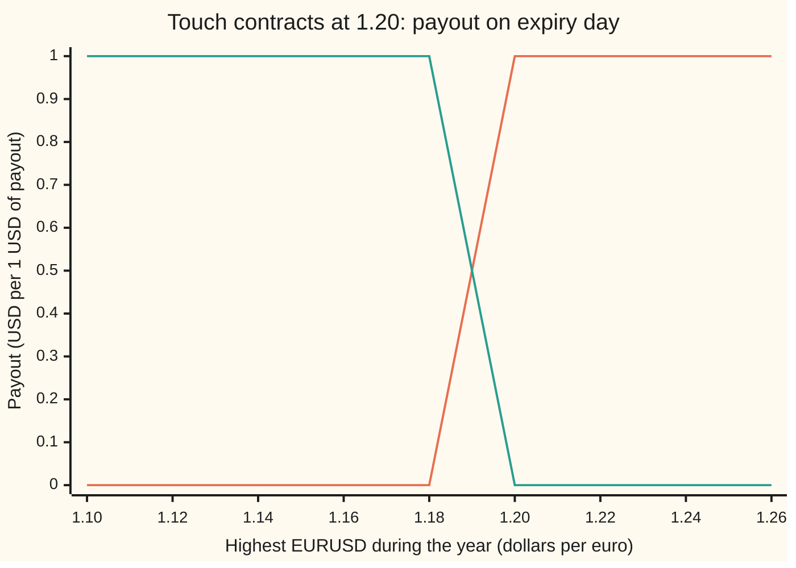
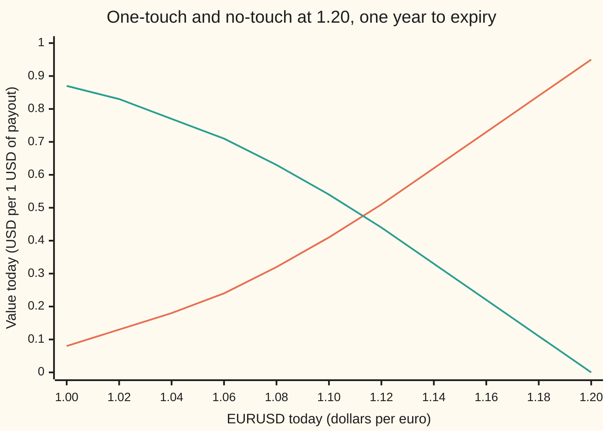

# One-touch and no-touch: a fixed payout on whether a level ever trades, priced from the chance of a first touch

[Syllabus](../../../SYLLABUS.md) → [Financial mathematics](../README.md) → [FX exotics as desks use them - digitals, touches and barriers](../README.md#s23) → One-touch and no-touch

---

## General Overview

The euro trades at 1.10 dollars, written EURUSD 1.10. A fund thinks the euro will rally hard at some point this year but has no view on where it ends. It buys a contract from a bank: *if EURUSD trades at 1.20 or higher at any moment in the next year, the bank pays USD 1 million on the expiry date; if it never does, nothing.* The euro can touch 1.20 in May and fall back to 1.05 by December. The contract still pays.

That contract is a **one-touch**: a fixed payout triggered the first time a level trades, whatever happens afterwards. Its opposite, which pays only if the level is **never** touched, is a **no-touch**. The level is the **barrier**, the same kind of wall as on [Knock-out and knock-in](02-barrier-options-by-reflection.md). Desks quote both as a percentage of the payout.

In the house currency market the one-touch at 1.20 costs 41.42% of the payout: USD 414,213 per million. The no-touch costs 53.70%. They add to 95.12%, not 100%: the missing 4.88% is a year's discounting of the payout. The rest is where 41.42% comes from: the chance that EURUSD ever reaches 1.20, which is 0.4355, discounted for a year.

**A one-touch is worth the discounted chance that the rate ever reaches the wall, the mirror in the wall counts that chance exactly, and the no-touch is the discount factor minus the one-touch.**

**What kind of fact this is:** a theorem inside the Garman–Kohlhagen model (a lognormal exchange rate with constant volatility, an assumption that fits well enough and is not a law), proved on this card in Why it works; the no-touch complement holds in every model; the daily-monitoring shift is an approximation, with its error measured by the code.

### The picture: the payoff depends on the highest level, not the last one

A plain option's payoff is drawn against the rate on expiry day. A one-touch ignores that rate. What matters is the highest EURUSD traded during the year.



Orange: the one-touch, nothing until the year's high reaches 1.20, then the full payout. Green: the no-touch, the exact reverse. Each path lands on one line or the other, so holding both pays one dollar on every path.

---

## The formula

Notation first. $S$ is EURUSD today in dollars per euro, so the euro is the **foreign** currency and the dollar the **domestic** one. $H$ is the barrier. The first moment EURUSD reaches $H$ is written $\tau$, read "tau", the **first touch time**; if it never happens, $\tau$ is taken as infinite. Everything else follows [Currency digitals](01-fx-digitals.md): $N(x)$ is the area under the standard bell curve left of $x$.

For an upper barrier ($H$ above $S$), the chance of a touch by expiry, in the dollar pricing world, is

$$P(\tau \le T) = N\!\left(\frac{\nu T - b}{\sigma\sqrt{T}}\right) + \left(\frac{H}{S}\right)^{2\lambda} N\!\left(\frac{-b - \nu T}{\sigma\sqrt{T}}\right)$$

with $b = \ln(H/S)$, $\nu = r_d - r_f - \tfrac12\sigma^2$ and $\lambda = \nu/\sigma^2$. The two contracts that pay one dollar at expiry are then

$$V_{OT} = e^{-r_d T}\,P(\tau \le T), \qquad V_{NT} = e^{-r_d T} - V_{OT}.$$

**Read it aloud: the one-touch is the chance the rate ever reaches the wall, discounted at the dollar rate; that chance is the chance of finishing beyond the wall plus a weighted mirror term for the paths that touched and came back; the no-touch is what is left of one discounted dollar.**

Paying at the touch, or paying in euros, needs one change each:

$$V_{OT}^{hit} = \left(\frac{H}{S}\right)^{(\nu - \hat\nu)/\sigma^2} P_{\hat\nu}(\tau \le T), \qquad \hat\nu = \sqrt{\nu^2 + 2 r_d \sigma^2}$$

$$V_{OT}^{EUR} = e^{-r_f T}\,P_{\nu_f}(\tau \le T), \qquad V_{OT}^{EUR,hit} = \frac{H}{S}\,V_{OT}^{hit}, \qquad \nu_f = r_d - r_f + \tfrac12\sigma^2$$

Here $P_{\hat\nu}$ means the same touch formula with the drift $\nu$ replaced by $\hat\nu$, and likewise for $\nu_f$.

**Read it aloud: paying at the touch is the same touch chance with the drift raised to absorb the discounting; paying in euros is the touch chance counted in euros and discounted at the euro rate; and a euro paid at the touch is worth exactly $H$ dollars at that moment.**

| Symbol | Plain meaning | In our example | Push it up and the one-touch… |
| --- | --- | --- | --- |
| $S$ | EURUSD today, dollars per euro | 1.10 | rises: closer to the wall; at $H$ it is worth $e^{-r_d T}$ |
| $H$, $b$ | the barrier; $b = \ln(H/S)$ is its distance above today's rate on the log scale | 1.20; 0.087011 | falls: further to go |
| $T$ | time to expiry, in years | 1 | rises: more time to touch |
| $\tau$, $X_t$, $M_T$ | first touch time, the first moment EURUSD trades at $H$; $X_t = \ln(S_t/S)$, the log of the rate's ratio to today; $M_T$, the highest $X_t$ by expiry | random | |
| $r_d$, $r_f$ | dollar and euro interest rates, continuously compounded; $e^{-r_d T}$ discounts dollars, $e^{-r_f T}$ euros | 5%, 3%; 0.951229 | $r_d$ up: drift tilts toward 1.20; $r_f$ up: away |
| $\sigma$ | volatility: the yearly spread of log moves in EURUSD | 10% | rises here: the wall is out of reach, so jumpiness helps |
| $\nu$, $\nu_f$ | drift of log EURUSD per year, counting in dollars and in euros | 0.015; 0.025 | |
| $\lambda$ | $\nu/\sigma^2$: the drift in units of yearly variance; $(H/S)^{2\lambda}$ is the mirror weight | 1.5; 1.298272 | |
| $\hat\nu$ | the tilted drift for pay-at-hit, $\sqrt{\nu^2 + 2r_d\sigma^2}$ | 0.035 | |
| $N(x)$ | bell-curve area to the left of $x$ | | |
| $V_{OT}$, $V_{NT}$ | prices today of the one-touch and no-touch, dollars per dollar of payout | 0.414213; 0.537017 | |
| $n$, $\beta$ | number of equally spaced monitoring dates; the Broadie–Glasserman–Kou constant | 252; 0.5826 | |

For a contract checked only at $n$ equal dates, price it with the same formula and the wall moved away from spot:

$$H \;\to\; H\,e^{+\beta\sigma\sqrt{T/n}} \quad\text{(upper wall)}, \qquad H \;\to\; H\,e^{-\beta\sigma\sqrt{T/n}} \quad\text{(lower wall)}.$$

In words: a daily check behaves like a continuous check against a slightly more distant wall. For 1.20 and daily fixings the wall becomes 1.204412.

**Conventions, dated 27 Sep 2026:** touches are quoted as a percentage of the payout, in the payout currency; "one-touch" alone means paid at expiry unless the term sheet says "pay at hit"; the barrier is watched continuously during market hours against the bank's own reference rate. These follow Wystup's text in Sources; a term sheet overrides them.

### When it holds

- **Continuous monitoring.** The formula counts every touch, however brief. A contract checked once a day at a fixing sees fewer touches: 0.392953 in simulation against 0.414213 continuous. The shift above gives 0.395051.
- **A lognormal rate with one constant volatility, no jumps.** A touch contract is priced almost entirely by the volatility near the wall, not at the money. On a real smile this model price is off, and the size of the error is measured on [Barriers on a smile](07-barriers-with-the-smile.md).
- **Known, constant rates in both currencies.** Both the drift and the discount come from them.
- **One wall.** A contract with a wall on each side is not the product of two single-wall chances: [Two walls](05-double-barriers-and-double-no-touch.md).
- **A real tilted drift.** Pay-at-hit needs $\nu^2 + 2r_d\sigma^2 \ge 0$. A negative rate deep enough makes the square root fail; the time integral in the code still prices it.
- **The complement needs the same payment date.** $V_{OT} + V_{NT} = e^{-r_d T}$ holds for a one-touch paid at expiry. A pay-at-hit one-touch plus a no-touch does not pay one dollar at a single date, so the identity fails.

---

## Why it works

### Step 0: the price is a discounted chance about the path's highest point

A one-touch pays one dollar at expiry exactly when the year's highest EURUSD is at or above $H$. In the dollar pricing world ([Currency digitals](01-fx-digitals.md)), a dollar paid at $T$ on an event is worth $e^{-r_d T}$ times the event's chance. So everything reduces to one number: the chance that a drifting random walk ever reaches a level. A mirror in the wall counts that chance.

### Step 1: work on the log scale, where the wall is flat

Measure EURUSD by $X_t = \ln(S_t/S)$, the log of its ratio to today. In the dollar pricing world $X_t$ is a Brownian motion with drift $\nu = r_d - r_f - \tfrac12\sigma^2$ per year and spread $\sigma$ per root-year. Here $\nu = 0.05 - 0.03 - 0.005 = 0.015$. The wall 1.20 becomes the flat level $b = \ln(1.20/1.10) = 0.087011$. The touch happens when the running maximum of $X_t$ reaches $b$.

### Step 2: split the touching paths in two

Every path that touches $b$ by expiry either finishes at or above $b$, or touches and falls back below it. The first group is easy. Finishing above $b$ is the event a digital struck at 1.20 pays on, so its chance is $N((\nu T - b)/(\sigma\sqrt{T}))$. That is the first term of the formula: 0.235727, worth 0.224231 dollars discounted.

The second group is the hard one, and it is where the mirror comes in.

### Step 3: without drift, the second group is a copy of the first

Suppose the drift were zero. Take a path that touches $b$ and ends at some $x$ below it. Flip everything after the first touch, up for down, about $b$. The flipped path ends at $2b - x$, above $b$. The pairing is one for one, and flipping a driftless Brownian motion keeps every probability ([Reflection principle](../../11-Stochastic%20processes%20and%20calculus/05-Brownian%20Motion/04-reflection-principle-and-running-maximum.md)). So touch-and-return is exactly as likely as finish-above, and the touch chance is twice the digital chance. Desks call this the **twice-the-digital rule**, and without drift it is exact.

### Step 4: put the drift back, and the mirror gets a weight

With drift, an upward piece of path and its downward flip are no longer equally likely. Girsanov's theorem (a change of drift is a reweighting of paths) gives the factor: a path with drift $\nu$ is weighted by $e^{\nu X_T/\sigma^2}$ times a constant, relative to a driftless one. The flipped path ends at $2b - x$ instead of $x$, so the ratio of the two weights is $e^{\nu(2x - 2b)/\sigma^2}$. Moving that weight onto the flipped path and completing the square turns the second group's chance into

$$e^{2\nu b/\sigma^2}\,N\!\left(\frac{-b - \nu T}{\sigma\sqrt{T}}\right) = \left(\frac{H}{S}\right)^{2\lambda} N\!\left(\frac{-b - \nu T}{\sigma\sqrt{T}}\right).$$

Here the weight is $(1.20/1.10)^{3} = 1.298272$ and the second group is worth 0.189982 dollars discounted. Add the two groups: 0.224231 + 0.189982 = 0.414213.

The drift of 0.015 pushes EURUSD toward the wall, so paths that touch tend to carry on through it. Fewer come back. That is why the mirror group, 0.189982, is smaller than the digital, 0.224231, and why twice the digital, 0.448462, overprices.

<details>
<summary>Detailed proof</summary>

Let $X_t$ be Brownian motion with drift $\nu$ and variance $\sigma^2$ per year, $M_T$ its maximum on $[0, T]$, $b > 0$, and $v = \sigma^2 T$. For $\nu = 0$ the reflection principle gives, for $x < b$, $P(M_T \ge b,\ X_T \in dx) = \varphi_v(2b - x)\,dx$, where $\varphi_v(u) = e^{-u^2/(2v)}/\sqrt{2\pi v}$.

By Girsanov, the law with drift $\nu$ has density $e^{\nu X_T/\sigma^2 - \nu^2 T/(2\sigma^2)}$ against the driftless law; the event $\{M_T \ge b\}$ is a statement about the path and passes through. So for $x < b$
$$P_\nu(M_T \ge b,\ X_T \in dx) = e^{\nu x/\sigma^2 - \nu^2 T/(2\sigma^2)}\,\varphi_v(2b - x)\,dx.$$
Write $\nu x/\sigma^2 = 2\nu b/\sigma^2 - \nu(2b - x)/\sigma^2$ and complete the square in $u = 2b - x$: $e^{-\nu u/\sigma^2 - \nu^2 T/(2\sigma^2)}\varphi_v(u) = \varphi_v(u + \nu T)$. Hence the density is $e^{2\nu b/\sigma^2}\varphi_v(2b - x + \nu T)$. Integrate over $x < b$, that is $u > b$: $\int_b^\infty \varphi_v(u + \nu T)\,du = N((-b - \nu T)/\sqrt{v})$.

For $x \ge b$ the touch is certain, and $P_\nu(X_T \ge b) = N((\nu T - b)/\sqrt{v})$. Adding the two pieces gives the formula. Checks: at $b = 0$ it equals $N(\nu\sqrt{T}/\sigma) + N(-\nu\sqrt{T}/\sigma) = 1$; as $b \to \infty$ both terms vanish.

Differentiating in $T$ gives the density of the first touch time, $f(t) = \dfrac{b}{\sigma\sqrt{2\pi t^3}}\exp\!\left(-\dfrac{(b - \nu t)^2}{2\sigma^2 t}\right)$, which the code integrates as its second road.

</details>

### Step 5: paying at the touch tilts the drift

A pay-at-hit one-touch pays one dollar at time $\tau$, worth $e^{-r_d \tau}$ today, so its price is the average of $e^{-r_d\tau}$ over paths that touch by $T$. That average looks harder than a chance. One reweighting turns it back into a chance.

Compare a path's weight under drift $\hat\nu$ with its weight under drift $\nu$, stopped at the touch where $X_\tau = b$. By Girsanov the ratio is $e^{(\hat\nu - \nu)b/\sigma^2 - (\hat\nu^2 - \nu^2)\tau/(2\sigma^2)}$. Choose $\hat\nu$ so that $(\hat\nu^2 - \nu^2)/(2\sigma^2) = r_d$, that is $\hat\nu = \sqrt{\nu^2 + 2r_d\sigma^2}$. Then the $\tau$ part of the ratio is exactly the discount $e^{-r_d\tau}$, and

$$\text{average of } e^{-r_d\tau}\text{ on touching paths, drift } \nu \;=\; e^{(\nu - \hat\nu)b/\sigma^2}\;P_{\hat\nu}(\tau \le T).$$

Here $\hat\nu = \sqrt{0.000225 + 0.001} = 0.035$ and $(\nu - \hat\nu)/\sigma^2 = -2$, so the pay-at-hit price is $(1.10/1.20)^2$ times the touch chance at drift 0.035: 0.425164. It exceeds the at-expiry price, 0.414213, because the money arrives earlier on every touching path.

### Step 6: paying in euros changes the counting currency

A one-touch paying one euro at expiry, valued in euros, is the euro-discounted chance of a touch counted in the euro pricing world. Counting in euros weights the futures where the euro is strong, which raises the drift of $X_t$ by $\sigma^2$: $\nu_f = 0.015 + 0.01 = 0.025$. This is the same slide that gives the euro digital $N(d_1)$ in place of $N(d_2)$ on [Currency digitals](01-fx-digitals.md). The touch chance becomes 0.470507, and the price is $e^{-0.03} \times 0.470507 = 0.456601$ euros per euro.

Paying one euro at the touch needs no new chance at all. At the moment of the touch one euro is worth exactly $H = 1.20$ dollars. So the contract is 1.20 pay-at-hit dollar one-touches, worth $1.20 \times 0.425164$ dollars, which is $1.20/1.10 \times 0.425164 = 0.463815$ euros. The code also reaches that number the long way, integrating the discounted first-touch density in the euro world, and the two agree.

### Step 7: the no-touch is what is left of one dollar

Hold a one-touch and a no-touch on the same wall, both paid at expiry. On every path exactly one pays, so together they pay one dollar at $T$ for certain. That costs $e^{-r_d T} = 0.951229$ today. Hence

$$V_{NT} = e^{-r_d T} - V_{OT} = 0.951229 - 0.414213 = 0.537017.$$

No model entered: the identity holds with any smile, jumps, or monitoring rule, as long as both contracts use the same rule. The code confirms it by pricing the no-touch directly, from the chance that the path ends below the wall and the Brownian bridge between now and expiry never crosses it.

### Step 8: daily monitoring, and the shift

A contract that checks EURUSD at 252 daily fixings misses any touch that happens and reverses between two fixings. It pays less often. In 50,000 simulated years the daily touch rate is 0.413100 against 0.433061 for the same paths watched continuously (the continuous rate uses the Brownian bridge between fixings). Broadie, Glasserman and Kou proved that moving the wall away from spot by $\beta\sigma\sqrt{T/n}$, with $\beta = 0.5826$, matches the discrete price with an error that shrinks faster than $1/\sqrt{n}$. Here the shifted price is 0.395051 against a simulated 0.392953, a gap inside the simulation's noise.

### Another road

The one-touch also solves the Garman–Kohlhagen pricing equation with value $e^{-r_d(T-t)}$ on the wall and zero at expiry below it, and the pay-at-hit version with value 1 on the wall. The mirror formula is that equation's solution by the method of images.

---

## Worked numbers, by hand

EURUSD 1.10, wall 1.20, dollar rate 5%, euro rate 3%, volatility 10%, one year, payout 1 USD at expiry.

| Step | Arithmetic | Value |
| --- | --- | --- |
| distance to the wall, $b$ | $\ln(1.20/1.10)$ | 0.087011 |
| drift in dollars, $\nu$ | $0.05 - 0.03 - \tfrac12(0.10)^2$ | 0.015 |
| $\lambda$ | $0.015/0.01$ | 1.5 |
| finish above 1.20 | $N((0.015 - 0.087011)/0.10) = N(-0.720114)$ | 0.235727 |
| mirror weight | $(1.20/1.10)^{3}$ | 1.298272 |
| touch and come back | $1.298272 \times N((-0.087011 - 0.015)/0.10) = 1.298272 \times N(-1.020114)$ | 0.199723 |
| touch chance | $0.235727 + 0.199723$ | 0.435450 |
| discount | $e^{-0.05}$ | 0.951229 |
| **one-touch** | $0.951229 \times 0.435450$ | **0.414213** |
| **no-touch** | $0.951229 - 0.414213$ | **0.537017** |

In desk terms: the one-touch is 41.42% of payout and the no-touch 53.70%. A fund paying USD 414,213 for a million-dollar one-touch is paying a little under half the payout for an event with a 43.5% chance, a year of interest removed.

The same wall, four ways of paying, each as a percentage of its own payout:

```
one-touch at 1.20, % of payout   (each █ = 2 percentage points)
USD, paid at expiry   █████████████████████               41.42
USD, paid at hit      █████████████████████               42.52
EUR, paid at expiry   ███████████████████████             45.66
EUR, paid at hit      ███████████████████████             46.38
```

The euro versions sit higher because a euro payout is worth most in exactly the futures where the euro climbs to 1.20. The pay-at-hit versions sit higher because the money arrives early.

### What breaks if you drop a piece

Right answer 0.414213 (one-touch, USD at expiry), 0.537017 (no-touch).

| Mistake | Comes out at | What went wrong |
| --- | --- | --- |
| Quote the touch chance as the price | 0.435450 | Forgot that the dollar arrives in a year. |
| Drop the drift: $2N(-b/\sigma\sqrt{T})$, discounted | 0.365499 | Treated EURUSD as driftless; the 2% rate gap pushes it toward 1.20. |
| Twice the digital | 0.448462 | The desk rule of thumb; exact only without drift. Here touching paths tend to carry on, so fewer come back. |
| No-touch as 1 minus the one-touch | 0.585787 | Complemented to one dollar today instead of one dollar in a year. |
| Euro drift for a dollar payout | 0.447560 | Counted in the wrong currency: that chance belongs with a euro payout and euro discounting. |
| At-expiry formula for a pay-at-hit contract | 0.414213 against 0.425164 | Discounted the whole year on money that arrives at the touch. |
| Continuous formula for a daily contract | 0.414213 against 0.392953 | Counted touches between fixings that the contract never sees. |

---

## The price as EURUSD walks toward the wall

The mystery: at 1.18, two big figures (0.02) from the wall, the one-touch is already worth 0.84, against 0.95 on the wall itself. More than half the paths from 1.18 touch 1.20 within a month. Freeze the clock at one year and slide today's rate:



Orange: the one-touch, rising to 0.951229 on the wall, one discounted dollar, because the touch has happened and the payout is certain. Green: the no-touch, falling to zero on the wall. At every rate the two add to 0.951229.

The curve is steepest just below the wall, so the hedge (the amount of euros a bank holds against the contract) is largest there and vanishes the moment the wall trades. That jump is the whole risk of running a touch book, taken apart on [Greeks at the wall](06-barrier-and-touch-greeks.md). At today's rate, by bumping the inputs:

| Greek | One-touch, per 1 USD of payout | No-touch | Meaning |
| --- | --- | --- | --- |
| delta | +0.048057 per 0.01 rise in EURUSD | −0.048057 | value change for one big figure up |
| vega | +0.037732 per vol point | −0.037732 | value change for volatility 10% → 11% |

---

## Code, from first principles, and it actually runs

The scripts reach every price by at least two roads and the touch chance by four. Road 1 is the mirror formula. Road 2 integrates the first-touch-time density over the year by Simpson's rule, with and without discounting, in the dollar and the euro world. Road 3 prices the no-touch directly: the end point's bell curve times the Brownian bridge's chance of never crossing the wall, integrated below the wall. Road 4 simulates 50,000 years of daily EURUSD with a hand-written random number generator, checking both the daily fixings and, through the bridge, the gaps between them. The bell-curve area is itself a Simpson integral.

### Python

```python
# One-touch and no-touch on EURUSD -- the check behind the card.  Standard library only.
# Nothing imported knows the answer: the bell-curve area, both integrals and the
# random numbers are written out below.  Four roads: the mirror formula, the
# first-passage-time integral, the bridge integral over the end point, a simulation.
from math import log, exp, sqrt, pi, cos

S, H, rd, rf, sig, T = 1.10, 1.20, 0.05, 0.03, 0.10, 1.0
nu_d = rd - rf - 0.5 * sig * sig          # drift of log EURUSD when counting in dollars
nu_f = rd - rf + 0.5 * sig * sig          # the same drift when counting in euros

def simpson(f, a, b, n):
    h = (b - a) / n
    s = f(a) + f(b)
    for i in range(1, n):
        s += (4 if i % 2 else 2) * f(a + i * h)
    return s * h / 3.0

def N(x):                                 # bell-curve area left of x
    half = simpson(lambda z: exp(-0.5 * z * z), 0.0, abs(x), 2000) / sqrt(2.0 * pi)
    return 0.5 + half if x >= 0 else 0.5 - half

# ---- road 1: the mirror formula ----
def touch(S, H, nu, sig, T):              # chance log EURUSD, drift nu, reaches ln(H/S) by T
    b, v = log(H / S), sig * sqrt(T)
    return N((nu * T - b) / v) + exp(2.0 * nu * b / (sig * sig)) * N((-b - nu * T) / v)

def at_hit(S, H, nu, r, sig, T):          # value of 1 paid at the touch: tilt the drift to nu2
    nu2 = sqrt(nu * nu + 2.0 * r * sig * sig)
    return exp(log(H / S) * (nu - nu2) / (sig * sig)) * touch(S, H, nu2, sig, T)

b = log(H / S)
p_d, p_f = touch(S, H, nu_d, sig, T), touch(S, H, nu_f, sig, T)
ot_usd, ot_eur = exp(-rd * T) * p_d, exp(-rf * T) * p_f
hit_usd = at_hit(S, H, nu_d, rd, sig, T)
hit_eur = H / S * hit_usd                 # at the touch one euro is worth exactly H dollars
nt_usd = exp(-rd * T) - ot_usd

# ---- road 2: integrate the first-passage-time density over the year ----
def fpt(t, nu):                           # density of the first time log EURUSD reaches b
    if t <= 0.0: return 0.0
    return b / (sig * sqrt(2.0 * pi * t ** 3)) * exp(-(b - nu * t) ** 2 / (2.0 * sig * sig * t))
def by_time(nu, r): return simpson(lambda t: exp(-r * t) * fpt(t, nu), 0.0, T, 20000)
p_d2, p_f2 = by_time(nu_d, 0.0), by_time(nu_f, 0.0)
hit_usd2, hit_eur2 = by_time(nu_d, rd), by_time(nu_f, rf)

# ---- road 3: no-touch as end points below the wall, times the bridge's chance of never crossing ----
v2 = sig * sig * T
def end_no_touch(x):
    dens = exp(-(x - nu_d * T) ** 2 / (2.0 * v2)) / sqrt(2.0 * pi * v2)
    return dens * (1.0 - exp(-2.0 * b * (b - x) / v2))
nt_usd3 = exp(-rd * T) * simpson(end_no_touch, -1.0, b, 20000)

# ---- road 4: simulate 50,000 years of daily EURUSD; bridge between days for continuous touches ----
M64, state = (1 << 64) - 1, 20260927
def uniform():                            # splitmix64, top 53 bits
    global state
    state = (state + 0x9E3779B97F4A7C15) & M64
    z = state
    z = ((z ^ (z >> 30)) * 0xBF58476D1CE4E5B9) & M64
    z = ((z ^ (z >> 27)) * 0x94D049BB133111EB) & M64
    return ((z ^ (z >> 31)) >> 11) / 9007199254740992.0
def gauss(): return sqrt(-2.0 * log(1.0 - uniform())) * cos(2.0 * pi * uniform())
paths, n = 50000, 252
dt = T / n
cont = disc = cont_sq = 0.0
for _ in range(paths):
    x, surv, hit = 0.0, 1.0, 0.0
    for _ in range(n):
        y = x + nu_d * dt + sig * sqrt(dt) * gauss()
        if y >= b:
            hit, surv = 1.0, 0.0
            break
        surv *= 1.0 - exp(-2.0 * (b - x) * (b - y) / (sig * sig * dt))
        x = y
    disc += hit
    cont += 1.0 - surv
    cont_sq += (1.0 - surv) ** 2
p_mc, p_daily = cont / paths, disc / paths
se = sqrt((cont_sq / paths - p_mc ** 2) / paths)
beta = 0.5826                             # Broadie-Glasserman-Kou: move the wall away by beta*sig*sqrt(dt)
H_shift = H * exp(beta * sig * sqrt(dt))
ot_bgk = exp(-rd * T) * touch(S, H_shift, nu_d, sig, T)

# ---- Greeks by bumping, what breaks, try changing ----
def ot(S=S, H=H, sig=sig, T=T): return exp(-rd * T) * touch(S, H, rd - rf - 0.5 * sig * sig, sig, T)
delta = (ot(S=S + 1e-4) - ot(S=S - 1e-4)) / 2e-4 * 0.01
vega = (ot(sig=sig + 1e-4) - ot(sig=sig - 1e-4)) / 2e-4 * 0.01
dig = exp(-rd * T) * N((nu_d * T - b) / (sig * sqrt(T)))
weight = (H / S) ** (2.0 * nu_d / (sig * sig))    # the mirror weight (H/S)^(2 lambda)
mirror = exp(-rd * T) * weight * N((-b - nu_d * T) / (sig * sqrt(T)))

rows = [
    ("ln(H/S)", b), ("drift in dollars nu_d", nu_d), ("drift in euros nu_f", nu_f),
    ("lambda = nu_d / sig^2", nu_d / (sig * sig)), ("tilted drift for pay-at-hit", sqrt(nu_d ** 2 + 2 * rd * sig * sig)),
    ("argument, finish above", (nu_d * T - b) / (sig * sqrt(T))), ("argument, mirror", (-b - nu_d * T) / (sig * sqrt(T))),
    ("chance: finish above 1.20", N((nu_d * T - b) / (sig * sqrt(T)))),
    ("chance: touch and come back", weight * N((-b - nu_d * T) / (sig * sqrt(T)))),
    ("1 touch chance, dollars, mirror", p_d), ("2 touch chance, dollars, time integral", p_d2),
    ("4 touch chance, simulation", p_mc), ("  simulation standard error", se),
    ("one-touch USD at expiry", ot_usd), ("no-touch USD, discount minus one-touch", nt_usd),
    ("3 no-touch USD, end-point integral", nt_usd3), ("discount factor e^-rdT", exp(-rd * T)),
    ("1 one-touch USD at hit, tilted mirror", hit_usd), ("2 one-touch USD at hit, time integral", hit_usd2),
    ("1 touch chance, euros, mirror", p_f), ("2 touch chance, euros, time integral", p_f2),
    ("one-touch EUR at expiry, in EUR", ot_eur),
    ("1 one-touch EUR at hit, H/S x USD at hit", hit_eur), ("2 one-touch EUR at hit, time integral", hit_eur2),
    ("digital USD above 1.20", dig), ("mirror weight (H/S)^(2 lambda)", weight),
    ("mirror digital, weighted", mirror),
    ("daily: simulated touch chance", p_daily), ("daily: simulated one-touch USD", exp(-rd * T) * p_daily),
    ("daily: shifted wall", H_shift), ("daily: one-touch USD, shifted wall", ot_bgk),
    ("delta per 0.01 rise in EURUSD", delta), ("vega per 1 vol point", vega),
    ("wrong: drift dropped", exp(-rd * T) * 2.0 * N(-b / (sig * sqrt(T)))),
    ("wrong: twice the digital", 2.0 * dig), ("wrong: no-touch as 1 - one-touch", 1.0 - ot_usd),
    ("wrong: euro drift for a dollar payout", exp(-rd * T) * p_f),
    ("try: vol 15%", ot(sig=0.15)), ("try: wall 1.15", ot(H=1.15)), ("try: three months", ot(T=0.25)),
]
for name, v in rows:
    print(f"{name:<42} {v:>10.6f}")
print("ladder: EURUSD today, one-touch USD, no-touch USD")
for k in range(11):
    s = 1.00 + 0.02 * k
    print(f"  {s:.2f} {ot(S=s):>6.2f} {exp(-rd * T) - ot(S=s):>6.2f}")

assert abs(p_d - p_d2) < 1e-7                                         # mirror = first-passage integral
assert abs(p_f - p_f2) < 1e-7                                         # same, counting in euros
assert abs(hit_usd - hit_usd2) < 1e-7                                 # tilted mirror = discounted integral
assert abs(hit_eur - hit_eur2) < 1e-7                                 # H/S identity = euro-measure integral
assert abs(nt_usd - nt_usd3) < 1e-7                                   # complement = end-point integral
assert abs(p_mc - p_d) < 3.0 * se                                     # simulation agrees with the formula
assert abs(exp(-rd * T) * p_daily - ot_bgk) < 0.004                   # shifted wall matches daily checks
print("all checks passed")
```

**Ran 2026-09-27 on macOS, Python 3.14.6, standard library only. All checks passed. Output, pasted from the run:**

```
ln(H/S)                                      0.087011
drift in dollars nu_d                        0.015000
drift in euros nu_f                          0.025000
lambda = nu_d / sig^2                        1.500000
tilted drift for pay-at-hit                  0.035000
argument, finish above                      -0.720114
argument, mirror                            -1.020114
chance: finish above 1.20                    0.235727
chance: touch and come back                  0.199723
1 touch chance, dollars, mirror              0.435450
2 touch chance, dollars, time integral       0.435450
4 touch chance, simulation                   0.433061
  simulation standard error                  0.002192
one-touch USD at expiry                      0.414213
no-touch USD, discount minus one-touch       0.537017
3 no-touch USD, end-point integral           0.537017
discount factor e^-rdT                       0.951229
1 one-touch USD at hit, tilted mirror        0.425164
2 one-touch USD at hit, time integral        0.425164
1 touch chance, euros, mirror                0.470507
2 touch chance, euros, time integral         0.470507
one-touch EUR at expiry, in EUR              0.456601
1 one-touch EUR at hit, H/S x USD at hit     0.463815
2 one-touch EUR at hit, time integral        0.463815
digital USD above 1.20                       0.224231
mirror weight (H/S)^(2 lambda)               1.298272
mirror digital, weighted                     0.189982
daily: simulated touch chance                0.413100
daily: simulated one-touch USD               0.392953
daily: shifted wall                          1.204412
daily: one-touch USD, shifted wall           0.395051
delta per 0.01 rise in EURUSD                0.048057
vega per 1 vol point                         0.037732
wrong: drift dropped                         0.365499
wrong: twice the digital                     0.448462
wrong: no-touch as 1 - one-touch             0.585787
wrong: euro drift for a dollar payout        0.447560
try: vol 15%                                 0.552517
try: wall 1.15                               0.665527
try: three months                            0.091886
ladder: EURUSD today, one-touch USD, no-touch USD
  1.00   0.08   0.87
  1.02   0.13   0.83
  1.04   0.18   0.77
  1.06   0.24   0.71
  1.08   0.32   0.63
  1.10   0.41   0.54
  1.12   0.51   0.44
  1.14   0.62   0.33
  1.16   0.73   0.22
  1.18   0.84   0.11
  1.20   0.95   0.00
all checks passed
```

### Rust

```rust
// One-touch and no-touch on EURUSD -- the check behind the card.  Rust std only.
// Same four roads as the Python: the mirror formula, the first-passage-time
// integral, the bridge integral over the end point, a simulation.
use std::f64::consts::PI;

const S: f64 = 1.10; const H: f64 = 1.20; const RD: f64 = 0.05; const RF: f64 = 0.03;
const SIG: f64 = 0.10; const T: f64 = 1.0;

fn simpson(f: &dyn Fn(f64) -> f64, a: f64, b: f64, n: usize) -> f64 {
    let h = (b - a) / n as f64;
    let mut s = f(a) + f(b);
    for i in 1..n {
        s += (if i % 2 == 1 { 4.0 } else { 2.0 }) * f(a + i as f64 * h);
    }
    s * h / 3.0
}

fn n_cdf(x: f64) -> f64 {
    let half = simpson(&|z: f64| (-0.5 * z * z).exp(), 0.0, x.abs(), 2000) / (2.0 * PI).sqrt();
    if x >= 0.0 { 0.5 + half } else { 0.5 - half }
}

// road 1: the mirror formula; chance log EURUSD, drift nu, reaches ln(h/s) by t
fn touch(s: f64, h: f64, nu: f64, sig: f64, t: f64) -> f64 {
    let (b, v) = ((h / s).ln(), sig * t.sqrt());
    n_cdf((nu * t - b) / v) + (2.0 * nu * b / (sig * sig)).exp() * n_cdf((-b - nu * t) / v)
}

fn at_hit(s: f64, h: f64, nu: f64, r: f64, sig: f64, t: f64) -> f64 {
    let nu2 = (nu * nu + 2.0 * r * sig * sig).sqrt();
    ((h / s).ln() * (nu - nu2) / (sig * sig)).exp() * touch(s, h, nu2, sig, t)
}

fn ot(s: f64, h: f64, sig: f64, t: f64) -> f64 {
    (-RD * t).exp() * touch(s, h, RD - RF - 0.5 * sig * sig, sig, t)
}

struct Rng(u64);
impl Rng {
    fn uniform(&mut self) -> f64 { // splitmix64, top 53 bits
        self.0 = self.0.wrapping_add(0x9E3779B97F4A7C15);
        let mut z = self.0;
        z = (z ^ (z >> 30)).wrapping_mul(0xBF58476D1CE4E5B9);
        z = (z ^ (z >> 27)).wrapping_mul(0x94D049BB133111EB);
        ((z ^ (z >> 31)) >> 11) as f64 / 9007199254740992.0
    }
    fn gauss(&mut self) -> f64 {
        let u1 = self.uniform();
        let u2 = self.uniform();
        (-2.0 * (1.0 - u1).ln()).sqrt() * (2.0 * PI * u2).cos()
    }
}

fn main() {
    let nu_d = RD - RF - 0.5 * SIG * SIG;
    let nu_f = RD - RF + 0.5 * SIG * SIG;
    let b = (H / S).ln();
    let (p_d, p_f) = (touch(S, H, nu_d, SIG, T), touch(S, H, nu_f, SIG, T));
    let (ot_usd, ot_eur) = ((-RD * T).exp() * p_d, (-RF * T).exp() * p_f);
    let hit_usd = at_hit(S, H, nu_d, RD, SIG, T);
    let hit_eur = H / S * hit_usd;
    let nt_usd = (-RD * T).exp() - ot_usd;

    // road 2: first-passage-time density integrated over the year
    let by_time = |nu: f64, r: f64| -> f64 {
        let f = |t: f64| -> f64 {
            if t <= 0.0 { return 0.0; }
            let fpt = b / (SIG * (2.0 * PI * t.powi(3)).sqrt())
                * (-(b - nu * t).powi(2) / (2.0 * SIG * SIG * t)).exp();
            (-r * t).exp() * fpt
        };
        simpson(&f, 0.0, T, 20000)
    };
    let (p_d2, p_f2) = (by_time(nu_d, 0.0), by_time(nu_f, 0.0));
    let (hit_usd2, hit_eur2) = (by_time(nu_d, RD), by_time(nu_f, RF));

    // road 3: end points below the wall, times the bridge's chance of never crossing
    let v2 = SIG * SIG * T;
    let end_no_touch = |x: f64| -> f64 {
        let dens = (-(x - nu_d * T).powi(2) / (2.0 * v2)).exp() / (2.0 * PI * v2).sqrt();
        dens * (1.0 - (-2.0 * b * (b - x) / v2).exp())
    };
    let nt_usd3 = (-RD * T).exp() * simpson(&end_no_touch, -1.0, b, 20000);

    // road 4: 50,000 simulated years of daily EURUSD, bridge between days
    let mut rng = Rng(20260927);
    let (paths, n) = (50000usize, 252usize);
    let dt = T / n as f64;
    let (mut cont, mut disc, mut cont_sq) = (0.0f64, 0.0f64, 0.0f64);
    for _ in 0..paths {
        let (mut x, mut surv, mut hit) = (0.0f64, 1.0f64, 0.0f64);
        for _ in 0..n {
            let y = x + nu_d * dt + SIG * dt.sqrt() * rng.gauss();
            if y >= b { hit = 1.0; surv = 0.0; break; }
            surv *= 1.0 - (-2.0 * (b - x) * (b - y) / (SIG * SIG * dt)).exp();
            x = y;
        }
        disc += hit;
        cont += 1.0 - surv;
        cont_sq += (1.0 - surv).powi(2);
    }
    let (p_mc, p_daily) = (cont / paths as f64, disc / paths as f64);
    let se = ((cont_sq / paths as f64 - p_mc * p_mc) / paths as f64).sqrt();
    let beta = 0.5826;
    let h_shift = H * (beta * SIG * dt.sqrt()).exp();
    let ot_bgk = (-RD * T).exp() * touch(S, h_shift, nu_d, SIG, T);

    let delta = (ot(S + 1e-4, H, SIG, T) - ot(S - 1e-4, H, SIG, T)) / 2e-4 * 0.01;
    let vega = (ot(S, H, SIG + 1e-4, T) - ot(S, H, SIG - 1e-4, T)) / 2e-4 * 0.01;
    let v = SIG * T.sqrt();
    let dig = (-RD * T).exp() * n_cdf((nu_d * T - b) / v);
    let weight = (H / S).powf(2.0 * nu_d / (SIG * SIG));
    let mirror = (-RD * T).exp() * weight * n_cdf((-b - nu_d * T) / v);

    let rows: Vec<(&str, f64)> = vec![
        ("ln(H/S)", b), ("drift in dollars nu_d", nu_d), ("drift in euros nu_f", nu_f),
        ("lambda = nu_d / sig^2", nu_d / (SIG * SIG)), ("tilted drift for pay-at-hit", (nu_d * nu_d + 2.0 * RD * SIG * SIG).sqrt()),
        ("argument, finish above", (nu_d * T - b) / v), ("argument, mirror", (-b - nu_d * T) / v),
        ("chance: finish above 1.20", n_cdf((nu_d * T - b) / v)),
        ("chance: touch and come back", weight * n_cdf((-b - nu_d * T) / v)),
        ("1 touch chance, dollars, mirror", p_d), ("2 touch chance, dollars, time integral", p_d2),
        ("4 touch chance, simulation", p_mc), ("  simulation standard error", se),
        ("one-touch USD at expiry", ot_usd), ("no-touch USD, discount minus one-touch", nt_usd),
        ("3 no-touch USD, end-point integral", nt_usd3), ("discount factor e^-rdT", (-RD * T).exp()),
        ("1 one-touch USD at hit, tilted mirror", hit_usd), ("2 one-touch USD at hit, time integral", hit_usd2),
        ("1 touch chance, euros, mirror", p_f), ("2 touch chance, euros, time integral", p_f2),
        ("one-touch EUR at expiry, in EUR", ot_eur),
        ("1 one-touch EUR at hit, H/S x USD at hit", hit_eur), ("2 one-touch EUR at hit, time integral", hit_eur2),
        ("digital USD above 1.20", dig), ("mirror weight (H/S)^(2 lambda)", weight),
        ("mirror digital, weighted", mirror),
        ("daily: simulated touch chance", p_daily), ("daily: simulated one-touch USD", (-RD * T).exp() * p_daily),
        ("daily: shifted wall", h_shift), ("daily: one-touch USD, shifted wall", ot_bgk),
        ("delta per 0.01 rise in EURUSD", delta), ("vega per 1 vol point", vega),
        ("wrong: drift dropped", (-RD * T).exp() * 2.0 * n_cdf(-b / v)),
        ("wrong: twice the digital", 2.0 * dig), ("wrong: no-touch as 1 - one-touch", 1.0 - ot_usd),
        ("wrong: euro drift for a dollar payout", (-RD * T).exp() * p_f),
        ("try: vol 15%", ot(S, H, 0.15, T)), ("try: wall 1.15", ot(S, 1.15, SIG, T)),
        ("try: three months", ot(S, H, SIG, 0.25)),
    ];
    for (name, val) in &rows {
        println!("{:<42} {:>10.6}", name, val);
    }
    println!("ladder: EURUSD today, one-touch USD, no-touch USD");
    for k in 0..11 {
        let s = 1.00 + 0.02 * k as f64;
        println!("  {:.2} {:>6.2} {:>6.2}", s, ot(s, H, SIG, T), (-RD * T).exp() - ot(s, H, SIG, T));
    }

    assert!((p_d - p_d2).abs() < 1e-7);
    assert!((p_f - p_f2).abs() < 1e-7);
    assert!((hit_usd - hit_usd2).abs() < 1e-7);
    assert!((hit_eur - hit_eur2).abs() < 1e-7);
    assert!((nt_usd - nt_usd3).abs() < 1e-7);
    assert!((p_mc - p_d).abs() < 3.0 * se);
    assert!(((-RD * T).exp() * p_daily - ot_bgk).abs() < 0.004);
    println!("all checks passed");
}
```

**Ran 2026-09-27 on macOS, rustc 1.98.1, no crates. All checks passed. Output, pasted from the run:**

```
ln(H/S)                                      0.087011
drift in dollars nu_d                        0.015000
drift in euros nu_f                          0.025000
lambda = nu_d / sig^2                        1.500000
tilted drift for pay-at-hit                  0.035000
argument, finish above                      -0.720114
argument, mirror                            -1.020114
chance: finish above 1.20                    0.235727
chance: touch and come back                  0.199723
1 touch chance, dollars, mirror              0.435450
2 touch chance, dollars, time integral       0.435450
4 touch chance, simulation                   0.433061
  simulation standard error                  0.002192
one-touch USD at expiry                      0.414213
no-touch USD, discount minus one-touch       0.537017
3 no-touch USD, end-point integral           0.537017
discount factor e^-rdT                       0.951229
1 one-touch USD at hit, tilted mirror        0.425164
2 one-touch USD at hit, time integral        0.425164
1 touch chance, euros, mirror                0.470507
2 touch chance, euros, time integral         0.470507
one-touch EUR at expiry, in EUR              0.456601
1 one-touch EUR at hit, H/S x USD at hit     0.463815
2 one-touch EUR at hit, time integral        0.463815
digital USD above 1.20                       0.224231
mirror weight (H/S)^(2 lambda)               1.298272
mirror digital, weighted                     0.189982
daily: simulated touch chance                0.413100
daily: simulated one-touch USD               0.392953
daily: shifted wall                          1.204412
daily: one-touch USD, shifted wall           0.395051
delta per 0.01 rise in EURUSD                0.048057
vega per 1 vol point                         0.037732
wrong: drift dropped                         0.365499
wrong: twice the digital                     0.448462
wrong: no-touch as 1 - one-touch             0.585787
wrong: euro drift for a dollar payout        0.447560
try: vol 15%                                 0.552517
try: wall 1.15                               0.665527
try: three months                            0.091886
ladder: EURUSD today, one-touch USD, no-touch USD
  1.00   0.08   0.87
  1.02   0.13   0.83
  1.04   0.18   0.77
  1.06   0.24   0.71
  1.08   0.32   0.63
  1.10   0.41   0.54
  1.12   0.51   0.44
  1.14   0.62   0.33
  1.16   0.73   0.22
  1.18   0.84   0.11
  1.20   0.95   0.00
all checks passed
```

The two outputs agree line for line.

> [!TIP]
> **Try changing**
> - **Volatility 10% → 15%.** Guess first: the wall is out of reach, so more jumpiness helps. The one-touch rises from 0.414213 to 0.552517. Set `sig = 0.15` in `ot(...)`.
> - **Wall 1.20 → 1.15.** Guess first: half the distance, but not double the price. It comes out at 0.665527.
> - **One year → three months.** Guess first: a quarter of the time is not a quarter of the price. It falls to 0.091886: the spread of log moves halves with a quarter of the time, so the wall is twice as far in standard deviations.
> - **Pay in euros at the touch.** Guess first: higher than the dollar version. It is 0.463815 euros per euro, exactly $H/S$ times the dollar pay-at-hit price.

---

## The usual mistake

> [!warning]
> **Pricing a one-touch as a digital.** A digital asks where EURUSD ends. A one-touch asks whether it ever got there. The digital at 1.20 is worth 0.224231; the one-touch 0.414213, nearly twice as much, because a touch that is later given back still pays. Hedging a one-touch with a digital leaves the bank short all the touch-and-return paths.
>
> Smaller traps:
> - **No-touch equals one minus one-touch.** It is the discount factor minus the one-touch: 0.537017, not 0.585787. Desk screens quote both, and the sum is 95.12%, not 100%.
> - **Twice the digital as a price.** Exact only with zero drift; here it gives 0.448462. With carry toward the wall it overprices, with carry away from it it underprices.
> - **Ignoring the payment date.** Pay-at-hit is worth 0.425164, not 0.414213. And the complement identity only holds for contracts paid at the same date.
> - **Continuous formula on a fixing-based contract.** A daily-fixing one-touch is worth about 0.393, not 0.414. Shift the wall away from spot by $\beta\sigma\sqrt{T/n}$.

---

## Where you meet it in real life

- **FX options desks.** One-touches and no-touches are among the most traded exotic currency options. They are quoted as a percentage of payout, and a client asking "what's the 1.20 one-touch" expects a number like 41.4%.
- **Hedge funds expressing a range view.** A fund that expects EURUSD to stay between two levels buys the pair of walls as one contract: [Two walls](05-double-barriers-and-double-no-touch.md).
- **Rebates on barrier options.** A knock-out that pays a fixed cash sum on the touch contains a pay-at-hit one-touch; its price is the Step 5 formula. Every one of the eight single barriers can carry one: [The eight single barriers in one table](03-the-eight-barrier-types.md).
- **Choosing the wall for a budget.** A client with a premium in mind asks where the wall must sit to cost it; the desk runs this card's formula backwards: [Solving for the barrier](08-barrier-level-from-a-target-premium.md).
- **Reading the market's view of the smile.** The market price of a one-touch differs from this card's model price; the gap, known as the touch's smile correction, is what traders argue about, and it is measured on [Barriers on a smile](07-barriers-with-the-smile.md).

> **Say it back**
> A one-touch pays a fixed amount if the rate ever trades at the wall; a no-touch pays if it never does. The one-touch paid at expiry is the discounted chance of a touch. That chance is the chance of finishing past the wall plus a mirror term for paths that touch and come back, weighted for the drift. Paying at the touch tilts the drift; paying in euros changes the counting currency. The no-touch is one discounted dollar minus the one-touch, in any model.

---

## What this builds on

- [Knock-out and knock-in](02-barrier-options-by-reflection.md): the mirror in the wall with its drift weight, applied there to a call; here to a fixed payout.
- [Currency digitals](01-fx-digitals.md): a fixed payout priced as a discounted probability, and why the currency of the payout changes the drift.
- [Reflection principle](../../11-Stochastic%20processes%20and%20calculus/05-Brownian%20Motion/04-reflection-principle-and-running-maximum.md): the flip after the first touch, and the law of the running maximum it gives.

## Where this goes next

- [Two walls](05-double-barriers-and-double-no-touch.md): two walls at once, where one mirror becomes an infinite hall of mirrors.
- [Greeks at the wall](06-barrier-and-touch-greeks.md): the delta and vega above, and why they jump at the wall.
- [Barriers on a smile](07-barriers-with-the-smile.md): what happens to 41.42% when volatility depends on the level.

This card prices one wall with one volatility; the question it leaves open is what a touch is worth when the market's volatility near 1.20 is not the 10% used at 1.10.

---

## Sources

Verified 2026-09-27: every link below resolves to the publisher's page.

- Broadie, Mark, Paul Glasserman, and Steven Kou. "A Continuity Correction for Discrete Barrier Options." *Mathematical Finance* 7, no. 4 (1997): 325–349. [doi:10.1111/1467-9965.00035](https://doi.org/10.1111/1467-9965.00035). The wall shift $\beta\sigma\sqrt{T/n}$ and its error bound.
- Garman, Mark B., and Steven W. Kohlhagen. "Foreign Currency Option Values." *Journal of International Money and Finance* 2, no. 3 (1983): 231–237. [doi:10.1016/S0261-5606(83)80001-1](https://doi.org/10.1016/S0261-5606(83)80001-1). The lognormal currency model with two interest rates that this card's drifts come from.
- Karatzas, Ioannis, and Steven E. Shreve. *Brownian Motion and Stochastic Calculus*, 2nd ed. Springer, 1998. [doi:10.1007/978-1-4612-0949-2](https://doi.org/10.1007/978-1-4612-0949-2). The reflection principle, the first-passage time of Brownian motion with drift, and Girsanov's theorem, proved in full.
- Wystup, Uwe. *FX Options and Structured Products*, 2nd ed. Wiley, 2017. [Publisher page](https://www.wiley.com/en-us/FX+Options+and+Structured+Products%2C+2nd+Edition-p-9781118471067). One-touch and no-touch contracts as desks trade them: payout currency, pay-at-hit, quoting as a percentage of payout.
