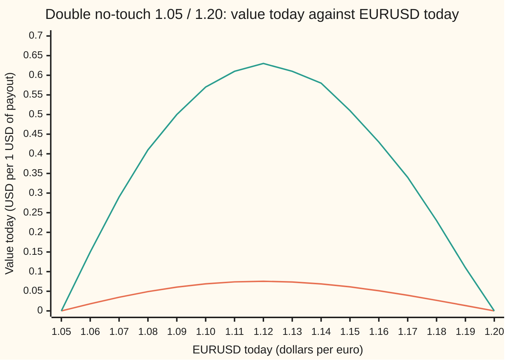
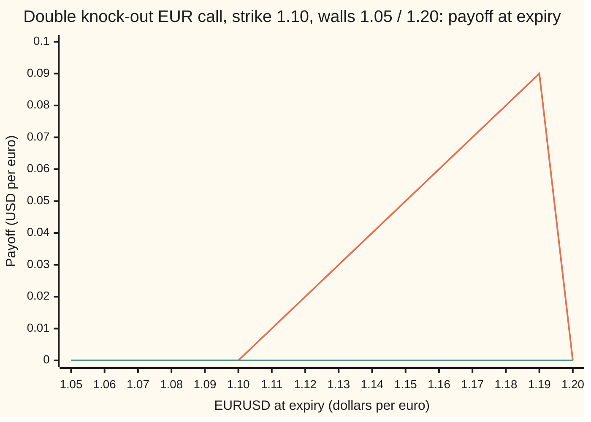

# Two walls: double knock-outs and the double no-touch, priced by a sum of images that converges in a handful of terms

[Syllabus](../../../SYLLABUS.md) → [Financial mathematics](../../../SYLLABUS.md#w12) → [FX exotics as desks use them - digitals, touches and barriers](../../../SYLLABUS.md#w12-s23) → Two walls

---

## General Overview

The euro trades at 1.10 dollars, written EURUSD 1.10. A fund expects a quiet year. It buys a contract from a bank: *if EURUSD never trades at 1.05 or below, and never at 1.20 or above, in the next year, the bank pays USD 1 million at expiry. One touch of either level and the contract is dead.* That contract is a **double no-touch**. The two levels are its **walls**, the same kind of barrier as on [One-touch and no-touch](04-fx-one-touch-and-no-touch.md), now one below spot and one above.

In the house currency market (dollar rate 5%, euro rate 3%, volatility 10%, one year) it costs 0.068977 dollars per dollar of payout, 6.90%: each dollar of premium buys about 14.50 of payout. A single no-touch at 1.20 costs 0.537017 and one at 1.05 costs 0.383822; a bet that EURUSD merely *ends* between the walls costs 0.470917. Demanding that the whole path stay inside is far stricter: the double no-touch is the cheapest range bet the FX market trades.

The same walls can sit on an option. A euro call struck at 1.10 that dies on a touch of either wall is a **double knock-out call**. It costs 19.89 **pips** (a pip is 0.0001 dollars per euro), against 535.56 for the plain call and 416.61 with the lower wall alone.

The price comes from mirrors. One wall needs one mirror image of today's rate; two walls facing each other make a hall of mirrors, images of images without end. The images move away fast, so four reflections settle the sum.

**Between two walls, the price is the no-wall price of the payoff, minus its mirror image in each wall, plus the images of those images, and so on, each image started from a reflected rate and weighted for drift; the terms shrink like the tail of a bell curve, so a handful gives the answer.**

**What kind of fact this is:** a theorem inside the Garman–Kohlhagen model (a lognormal exchange rate with constant volatility, an assumption that fits well enough and is not a law), proved on this card in Why it works.

### The picture: a hump between the walls, and how time raises it



Orange: one year to expiry, a low hump peaking at 0.0754 near 1.12. Green: the same contract with three months left, 0.57 at 1.10. Both lines are zero on each wall, where the contract has just died. The peak sits just below the corridor's middle, 1.1225 on the log scale, because the 2% rate gap drifts EURUSD upward: starting a little low leaves room for the drift.

---

## The formula

Notation first. $S$ is EURUSD today, dollars per euro. $L$ and $U$ are the lower and upper walls, with $L < S < U$. $T$ is the time to expiry in years; $r_d$ and $r_f$ are the dollar and euro rates; $\sigma$ is the volatility. The double no-touch pays one dollar at expiry if the rate stays strictly between the walls until then. The rest follows [One-touch and no-touch](04-fx-one-touch-and-no-touch.md): $\nu = r_d - r_f - \tfrac12\sigma^2$ is the drift of log EURUSD in the dollar pricing world, $\lambda = \nu/\sigma^2$ is that drift in units of yearly variance, and $N(x)$ is the bell-curve area left of $x$.

One helper price. Write $G(x)$ for the price, with **no walls at all**, of one dollar paid at expiry if EURUSD ends between $L$ and $U$, when today's rate is $x$:

$$G(x) = e^{-r_d T}\left[N\!\left(\frac{\ln(x/L) + \nu T}{\sigma\sqrt{T}}\right) - N\!\left(\frac{\ln(x/U) + \nu T}{\sigma\sqrt{T}}\right)\right]$$

In words: the discounted chance of finishing above $L$, minus the discounted chance of finishing above $U$. Then

$$V_{DNT} = \sum_{n=-\infty}^{\infty} \left(\frac{U}{L}\right)^{2n\lambda}\left[\,G\!\left(S\left(\frac{U}{L}\right)^{2n}\right) - \left(\frac{U}{S}\right)^{2\lambda} G\!\left(\frac{U^2}{S}\left(\frac{U}{L}\right)^{2n}\right)\right]$$

**Read it aloud: the double no-touch is the plain bet on ending between the walls, minus that bet started from today's rate mirrored in the upper wall, with each of those two repeated from rates shifted by whole round trips between the walls; every copy is weighted for drift.**

At $n = 0$: the plain bet $G(S)$ and its mirror in the upper wall, from $U^2/S$. The mirror in the lower wall, from $L^2/S$, is the second group's $n = -1$ member. Every further $n$ is an image of an image.

The double knock-out call uses the same sum with a different helper. Replace $G$ by $G_K$, the no-wall price of the call struck at $K$ that pays only if EURUSD ends below $U$:

$$G_K(x) = x\,e^{-r_f T}\big[N(d_1(x,K)) - N(d_1(x,U))\big] - K e^{-r_d T}\big[N(d_2(x,K)) - N(d_2(x,U))\big]$$

with $d_2(x,H) = \big(\ln(x/H) + \nu T\big)/(\sigma\sqrt{T})$ and $d_1 = d_2 + \sigma\sqrt{T}$, for $L \le K < U$. Kunitomo and Ikeda published the formula in 1992, with walls allowed to curve.

| Symbol | Plain meaning | In our example | Push it up and the double no-touch… |
| --- | --- | --- | --- |
| $S$ | EURUSD today, dollars per euro | 1.10 | peaks near 1.12, then falls to 0 at $U$ |
| $L$, $U$ | lower and upper walls | 1.05 and 1.20 | $L$ up: falls, less room; $U$ up: rises |
| $K$ | strike of the double knock-out call | 1.10 | (call) falls |
| $T$ | time to expiry, in years | 1 | falls: more time to touch |
| $r_d$, $r_f$, $D$ | dollar and euro rates, continuously compounded; $D = e^{-r_d T}$ | 5%, 3%; 0.951229 | $r_d$ up tilts EURUSD toward $U$ |
| $\sigma$ | volatility: the yearly spread of log moves in EURUSD | 10% | falls steeply |
| $X_t$, $a$, $b$, $w$ | $X_t = \ln(S_t/S)$, the log of the rate's ratio to today; the walls on that scale, $a = \ln(L/S)$, $b = \ln(U/S)$, and the gap $w = b - a$ | $a = -0.046520$, $b = 0.087011$, $w = 0.133531$ | |
| $\nu$, $\lambda$ | drift of $X_t$ per year in the dollar pricing world; $\lambda = \nu/\sigma^2$ | 0.015; 1.5 | |
| $n$, $c$ | an image's round-trip count and its centre on the log scale | $c = 0$, $+0.174023$, $-0.093040$ first | |
| $G(x)$, $G_K(x)$, $N(x)$, $d_1$, $d_2$, $H$ | no-wall prices of the range bet and capped call from rate $x$; the bell-curve area; Garman–Kohlhagen distances from $x$ to a level $H$ | $G(S) = 0.470917$ | |
| $v$, $\varphi_v$, $k$, $m_k$ | in the proof and wave series: the year's variance $\sigma^2 T$, the bell curve with that variance, a wave's count and its frequency $k\pi/w$ | 0.01 | |
| $V_{DNT}$, $V_{DKO}$, $V_{NT}$ | prices today of the double no-touch (per dollar of payout) and double knock-out call (dollars per euro); $V_{NT}(H)$, the single no-touch at wall $H$ | 0.068977; 0.001989; $V_{NT}(1.05) = 0.383822$ | |

On the log scale, reflecting in a wall sends a point $c$ to $2b - c$ or $2a - c$, and one reflection in each wall shifts it by $2w$. So plain terms sit at $c = 2nw$, mirrored ones at $c = 2b + 2nw$, each with weight $e^{\lambda c}$: the powers above, written as logs.

**Conventions verified 27 Sep 2026:** quoted as a percentage of payout, paid at expiry; both walls watched continuously against the bank's reference rate; a trade exactly at a wall is a touch. From Clark and Wystup in Sources; a term sheet overrides them.

### The payoff diagram of the double knock-out call



Orange: the payoff on a path that never touched either wall, climbing to 0.09 at 1.19 and dropping to zero on the upper wall. Green, flat on zero: any path that touched. The best case pays just under 1,000 pips, and getting there means running close to the wall that kills it: hence 19.89 pips.

### When it holds

- **Continuous monitoring of both walls.** The formula counts every touch, however brief. Checking once a week and ignoring the gaps gives 0.122999, nearly double.
- **A lognormal rate with one constant volatility, no jumps.** The double no-touch is a pure volatility bet, so on a real smile the model price is off. Desks correct it; the size of the correction is measured on [Barriers on a smile](07-barriers-with-the-smile.md).
- **Known, constant rates in both currencies.** The drift $\nu$ and the discount $D$ both come from them.
- **Flat walls, spot strictly inside, strike between the walls.** On or outside a wall the contract is dead: price 0. Walls that move with time need Kunitomo and Ikeda's curved form.
- **No rebate.** A cash sum paid on the touch adds a pay-at-hit double one-touch, not priced here.

---

## Why it works

### Step 0: a price is a discounted chance, and two mirrors make infinitely many

The double no-touch pays one dollar at expiry exactly when the path never leaves the corridor. In the dollar pricing world ([Currency digitals](01-fx-digitals.md)) its price is $D$ times the chance of that event. So everything reduces to one question: how is the rate distributed at expiry, counting only the paths that stayed inside?

One wall answers that with one mirror ([Reflection principle](../../11-Stochastic%20processes%20and%20calculus/05-Brownian%20Motion/04-reflection-principle-and-running-maximum.md)). Two walls answer it with a mirror in each, then mirrors of mirrors.

### Step 1: work on the log scale, where the walls are flat and the corridor has a width

Measure EURUSD by $X_t = \ln(S_t/S)$. In the dollar pricing world $X_t$ drifts at $\nu = 0.05 - 0.03 - 0.005 = 0.015$ per year and spreads by $\sigma\sqrt{T} = 0.100000$ over the year. The walls become flat levels, $a = \ln(1.05/1.10) = -0.046520$ below and $b = \ln(1.20/1.10) = 0.087011$ above. The corridor is $w = 0.133531$ wide: a little more than one year's spread.

### Step 2: without drift, subtract a mirror in each wall

Set the drift to zero for now. Start with every path, whatever it did: its end point spreads as a bell curve centred at 0. Some of those paths touched $b$. By the reflection argument, the touched paths that end at $x$ are exactly as many as all paths that end at $2b - x$: a bell curve centred at $2b$. Subtract it. Do the same for $a$: subtract a bell curve centred at $2a$.

That over-subtracts. A path that touched $b$ and later $a$ was removed twice. So add back the paths that touched $b$ then $a$, and those that touched $a$ then $b$. Reflect twice, once in each wall, and a point moves by $2w$: those two groups are bell curves centred at $+2w$ and $-2w$. Adding them over-adds the paths that touched three times, alternating, so subtract again, and so on. Each round removes or restores a group of paths with one more alternating touch.

The result is an alternating sum of bell curves. Those with a plus sign sit at $2nw$ for every whole number $n$; those with a minus sign sit at $2b + 2nw$.

### Step 3: put the drift back, and each image gets a weight

With drift, a path and its mirror image are no longer equally likely. Girsanov's theorem (a change of drift is a reweighting of paths) says a path of the drifting walk ending at $x$ carries the weight $e^{\lambda x}$, times a constant, relative to the driftless walk. Carry that weight through the integral for each image centred at $c$, complete the square, and the image becomes the plain range bet started from the shifted rate $S e^{c}$, times $e^{\lambda c}$. For the plain term, $c = 0$ and the weight is 1. For the first mirror in the upper wall, $c = 2b$ and the weight is $e^{2\lambda b} = (U/S)^{2\lambda} = 1.298272$, the same mirror weight as on the one-wall card.

<details>
<summary>Detailed proof</summary>

Let $v = \sigma^2 T$ and $\varphi_v(u) = e^{-u^2/(2v)}/\sqrt{2\pi v}$, the bell curve with variance $v$.

**Driftless walk.** Claim: a driftless walk from 0 that stays in $(a, b)$ ends with density
$$p_0(x) = \sum_{n=-\infty}^{\infty}\big[\varphi_v(x - 2nw) - \varphi_v(x - 2b - 2nw)\big].$$
Each term solves the heat equation $\partial_v p = \tfrac12 \partial_x^2 p$. As $v \to 0$ only the $n = 0$ plus term is centred inside $(a, b)$: the start is a point mass at 0. At $x = b$ plus term $n$ cancels minus term $-n$, since $\varphi_v$ is even. At $x = a$ plus term $n$ cancels minus term $-n - 1$, because $a - 2b + 2(n+1)w = 2nw - a$. The sum converges uniformly, the centres growing linearly against a Gaussian decay. The heat equation on an interval with zero at both ends and a given start has one solution, so this is it.

**Drift.** Under drift $\nu$ the walk has density $e^{\lambda X_T - \lambda^2 v/2}$ against the driftless one, and staying inside is a statement about the path, so $p_\nu(x) = e^{\lambda x - \lambda^2 v/2}\,p_0(x)$.

**One image.** For an image at $c$ and a window $(lo, hi)$, complete the square:
$$\int_{lo}^{hi} e^{\lambda x - \lambda^2 v/2}\varphi_v(x - c)\,dx = e^{\lambda c}\Big[N\Big(\tfrac{hi - c - \nu T}{\sqrt v}\Big) - N\Big(\tfrac{lo - c - \nu T}{\sqrt v}\Big)\Big],$$
because $\lambda v = \nu T$. With $(lo, hi) = (a, b)$ and the discount $D$ this is $e^{\lambda c}\,G(S e^{c})$: the range bet from rate $S e^c$. Summing over the plus centres $2nw$ and the minus centres $2b + 2nw$ gives the formula for $V_{DNT}$.

**The call.** Paying $S_T - K$ multiplies the integrand by $S e^{x}$. The same square-completion with $\lambda + 1$ in place of $\lambda$ yields $e^{\lambda c}\,S e^{c}\,e^{(\lambda + \frac12)v}$ times a bracket in $d_1$; since $(\lambda + \tfrac12)\sigma^2 T = (r_d - r_f)T$, the discounted asset part is $e^{\lambda c}\,S e^{c} e^{-r_f T}[\dots]$. With the window $(\ln(K/S), b)$ that is $e^{\lambda c}\,G_K(S e^{c})$, and the sum gives $V_{DKO}$.

</details>

### Step 4: why a handful of terms is enough

The plain term and the two first mirrors are the big ones:

- plain term, centre 0: 0.470917;
- mirror in 1.20, centre $+0.174023$: 0.178558;
- mirror in 1.05, centre $-0.093040$: 0.270440.

After them, every new image sits a further $2w = 0.267063$ away from the corridor. Its bracket is the chance that a bell curve with spread 0.100000 lands in the corridor from that far away, and such tail chances fall like $e^{-u^2/2}$ in the distance $u$ measured in spreads. The partial sums show it: 0.470917 with no reflections, 0.021919 after one, 0.069957 after two, 0.068972 after three, 0.068977 after four, and no change to six decimals after that. The code sums eight to be safe.

With a long expiry or a narrow corridor the spread grows against $w$ and more images matter. There the second series takes over.

### Step 5: the same answer as a sum of sine waves

Solve the same problem by separating the heat equation (the equation the driftless survival density obeys, as in the Detailed proof) instead of by mirrors. On a corridor of width $w$ with zero at both walls, the natural shapes are the sine waves $\sin\big(k\pi(x - a)/w\big)$, $k = 1, 2, 3, \dots$, and the $k$-th one decays like $e^{-\frac12 m_k^2\sigma^2 T}$ with $m_k = k\pi/w$. The driftless survival density is their sum; the drift weight $e^{\lambda x}$ integrates against each wave in closed form. The double no-touch becomes

$$V_{DNT} = e^{-r_d T - \frac12\lambda^2\sigma^2 T + \lambda a}\sum_{k=1}^{\infty}\frac{2}{w}\,\sin(-m_k a)\,e^{-\frac12 m_k^2\sigma^2 T}\;\frac{m_k\big(1 - (-1)^k e^{\lambda w}\big)}{\lambda^2 + m_k^2}.$$

One wave gives 0.0689775726, two give 0.0689767879, and the third changes nothing at ten decimals. Images converge fast for short expiries, waves for long ones. They are one function written two ways; Poisson summation (a rule turning a sum of shifted bell curves into a sum of waves) converts one into the other. Pelsser derived the wave form in 2000.

### Step 6: the knock-out, and in-plus-out

The double knock-out call is Step 3 with the capped call in place of the range bet. Its partial sums settle as fast, 0.014559, $-0.000241$, 0.002007, 0.001989, swinging through zero on the way: a warning against stopping at one reflection.

A double knock-in call, born on the first touch of either wall, completes it: knock-in plus knock-out is the plain call, 0.053556. So the double knock-in costs $0.053556 - 0.001989 = 0.051567$. Likewise a double one-touch, paying one dollar at expiry if either wall is touched, costs $D - V_{DNT} = 0.951229 - 0.068977 = 0.882253$. Neither identity needs the model.

### Other roads

The double no-touch also solves the Garman–Kohlhagen pricing equation with zero on both walls and one dollar at expiry between them. A finite-difference grid solves that equation directly ([Pricing on a grid](../06-Numerical%20Methods%20for%20Pricing/07-finite-differences-for-the-black-scholes-equation.md)); a simulation counts surviving paths. The code runs both.

---

## Worked numbers, by hand

EURUSD 1.10, walls 1.05 and 1.20, dollar rate 5%, euro rate 3%, volatility 10%, one year, payout 1 USD at expiry.

| Step | Arithmetic | Value |
| --- | --- | --- |
| lower wall on the log scale, $a$ | $\ln(1.05/1.10)$ | $-0.046520$ |
| upper wall on the log scale, $b$ | $\ln(1.20/1.10)$ | 0.087011 |
| corridor width, $w$ | $0.087011 + 0.046520$ | 0.133531 |
| drift, $\nu$; $\lambda$ | $0.05 - 0.03 - \tfrac12(0.10)^2$; $0.015/0.01$ | 0.015; 1.5 |
| discount, $D$ | $e^{-0.05}$ | 0.951229 |
| plain term: end inside, no walls | $D \times [N(0.615200) - N(-0.720114)] = D \times 0.495061$ | 0.470917 |
| mirror in 1.20, centre $2b = 0.174023$ | $D \times 1.298272 \times [N(2.355428) - N(1.020114)]$, bracket 0.144587 | 0.178558 |
| mirror in 1.05, centre $2a = -0.093040$ | $D \times 0.869741 \times [N(-0.315200) - N(-1.650514)]$, bracket 0.326886 | 0.270440 |
| after one reflection | $0.470917 - 0.178558 - 0.270440$ | 0.021919 |
| after two reflections | add the images at $\pm 2w$ | 0.069957 |
| after three | subtract the next pair | 0.068972 |
| **after four and beyond: double no-touch** | | **0.068977** |
| payout over premium | $1 / 0.068977$ | 14.497631 |

Each bracket is $G/D$ read at the image's rate, with arguments $(c - a + \nu T)/\sigma\sqrt{T}$ and $(c - b + \nu T)/\sigma\sqrt{T}$.

In desk terms: 6.90% of payout; each dollar of premium buys 14.50 of payout if EURUSD stays inside 1.05 to 1.20 for a year.

Four ways to bet on the same corridor, per dollar of payout:

```
range bets on 1.05 to 1.20, USD per 1 USD of payout   (each █ = 0.02)
never touch 1.20           ███████████████████████████   0.537017
end between the walls      ████████████████████████      0.470917
never touch 1.05           ███████████████████           0.383822
never touch either wall    ███                           0.068977
```

Each single no-touch lets the rate go anywhere on the other side; the ending bet lets it wander anywhere during the year. Only the double no-touch demands the whole path stay inside.

### What breaks if you drop a piece

Right answer 0.068977.

| Mistake | Comes out at | What went wrong |
| --- | --- | --- |
| Multiply the two single no-touch chances: $V_{NT}(1.20)\,V_{NT}(1.05)/D$ | 0.216687 | Treated the walls as independent. A path that avoids 1.20 spends more time low, nearer 1.05. |
| Add the two single no-touches and take off one $D$ | $-0.030391$ | Inclusion–exclusion with the paths that touch both walls left out; they were subtracted twice. |
| Stop at one mirror per wall | 0.021919 | The same double subtraction: the images of images restore those paths. |
| Simulate weekly checks, no bridge correction | 0.122999 | Missed every touch that happened and reversed between two checks. |
| Quote the ending bet $G(S)$ as the price | 0.470917 | Priced where EURUSD ends, not where it went. |

---

## How it moves: the clock works for the holder

The mystery: EURUSD sits at 1.10 for nine months, and the contract bought at 0.068977 is worth 0.57 with three months left. Nothing moved but the clock. Every quiet day leaves fewer days in which a touch can happen. The overview chart shows the hump rising; on expiry day it is a flat line at 1 between the walls.

So the double no-touch has the opposite gamma, vega and theta to a plain option (Greeks: the sensitivities of a price to its inputs). From the image series, bumping each input:

| Greek | Double no-touch, per 1 USD | Double knock-out call, per euro | Meaning |
| --- | --- | --- | --- |
| delta | +0.006651 | +0.000192 | value change for EURUSD up 0.01 |
| gamma | $-0.003397$ | $-0.000098$ | second difference over steps of 0.01: negative, the hump bends down |
| vega | $-0.039476$ | $-0.001162$ | value change per volatility point, averaged over 9% and 11% |
| theta | +0.000537 | +0.000015 | value change over one day, nothing else moving |

Negative vega and positive theta are the signature of selling volatility. The double no-touch's vega per point is more than half its value. Its buyer sells volatility with the loss capped at the premium. The knock-out call shares the signs, despite being a call, because the upper wall caps what a big move could give. How these Greeks jump near a wall is on [Greeks at the wall](06-barrier-and-touch-greeks.md).

---

## Code, from first principles, and it actually runs

The script reaches both prices by four independent roads. Road 1 is the image series. Road 2 is the sine-wave series, which shares no formula with road 1. Road 3 is a Crank–Nicolson grid (a finite-difference scheme averaging the old and new time steps) on the log scale, 400 space points by 400 time steps, zero on both walls. Road 4 is a simulation of 400,000 one-year paths in weekly steps with its own random-number generator, and between steps it multiplies in the chance that a Brownian bridge (the walk pinned at both ends of the week) did not touch either wall; this is the correction of Beaglehole, Dybvig and Zhou. Then the series is pushed to the one-wall limits, where it must reproduce the sibling cards' numbers: the down-and-out call 0.041661 and the one-touch 0.414213. The normal CDF is a written-out series. The two outputs agree digit for digit, because both languages run the same random-number generator from the same seed.

### Python

```python
# Double no-touch and double knock-out call -- the check behind the card.  Standard library only.
# Roads: (1) the image series, (2) the sine-wave series, (3) a Crank-Nicolson grid,
# (4) a bridge-corrected simulation with its own random numbers.  N(x) is a written-out series.
from math import log, sqrt, exp, sin, cos, pi

def N(x):                                            # bell-curve area left of x (Marsaglia's series)
    if x < -8.0: return 0.0
    if x > 8.0: return 1.0
    term, tot, k = x, x, 0
    while abs(term) > 1e-17 * abs(tot):
        k += 1; term *= x * x / (2 * k + 1); tot += term
    return 0.5 + tot * exp(-0.5 * x * x) / sqrt(2.0 * pi)
S, rd, rf, sig, T, L, U, K = 1.10, 0.05, 0.03, 0.10, 1.0, 1.05, 1.20, 1.10
def images(S, T, L, U, lo, hi, jmax, sig=sig, rd=rd, rf=rf):
    """Road 1. Returns (cash leg, asset leg): discounted values of 1 USD and of 1 EUR paid
    if the path never leaves (L, U) and log(S_T/S) ends in (lo, hi); images up to jmax reflections."""
    nu, s2 = rd - rf - 0.5 * sig * sig, sig * sig * T
    a, b = log(L / S), log(U / S); w = b - a
    out = [0.0, 0.0]
    for j in range(jmax + 1):
        if j == 0: imgs = [(0.0, 1.0)]
        elif j % 2: imgs = [(2 * b + (j - 1) * w, -1.0), (2 * a - (j - 1) * w, -1.0)]
        else: imgs = [(j * w, 1.0), (-j * w, 1.0)]
        for c, sg in imgs:
            for e in (0, 1):                         # e = 1 weights each outcome by S_T / S
                al = nu / (sig * sig) + e
                m = c + al * s2
                out[e] += sg * exp(al * c + 0.5 * al * al * s2) * (N((hi - m) / sqrt(s2)) - N((lo - m) / sqrt(s2)))
    f = exp(-rd * T - nu * nu * T / (2 * sig * sig))
    return f * out[0], f * S * out[1]
def dnt(S, T=T, L=L, U=U, jmax=8, sig=sig):
    if S <= L or S >= U: return 0.0
    return images(S, T, L, U, log(L / S), log(U / S), jmax, sig)[0]
def dko(S, T=T, L=L, U=U, jmax=8, sig=sig):
    if S <= L or S >= U: return 0.0
    cash, asset = images(S, T, L, U, log(max(K, L) / S), log(U / S), jmax, sig)
    return asset - K * cash

def dnt_sine(S, modes):                              # road 2: heat-equation modes that vanish at both walls
    nu = rd - rf - 0.5 * sig * sig; be = nu / (sig * sig)
    a, w = log(L / S), log(U / L); tot = 0.0
    for k in range(1, modes + 1):
        m = k * pi / w
        tot += (2 / w) * sin(-m * a) * exp(-0.5 * m * m * sig * sig * T) * m * (1 - (-1) ** k * exp(be * w)) / (be * be + m * m)
    return exp(-rd * T - nu * nu * T / (2 * sig * sig) + be * a) * tot

def grid(payoff, J=400, steps=400):                  # road 3: Crank-Nicolson in log-spot, zero at both walls
    a, b = log(L / S), log(U / S); h, dt = (b - a) / J, T / steps
    nu = rd - rf - 0.5 * sig * sig
    V = [0.0] + [payoff(S * exp(a + i * h)) for i in range(1, J)] + [0.0]
    lo, di, up = 0.5 * sig * sig / h ** 2 - nu / (2 * h), -sig * sig / h ** 2 - rd, 0.5 * sig * sig / h ** 2 + nu / (2 * h)
    for th, k in [(1.0, dt / 2)] * 4 + [(0.5, dt)] * (steps - 2):   # 4 implicit half steps calm the jump (Rannacher)
        rhs = [V[i] + (1 - th) * k * (lo * V[i - 1] + di * V[i] + up * V[i + 1]) for i in range(1, J)]
        A, B, C = -th * k * lo, 1 - th * k * di, -th * k * up
        cp, dp = [0.0] * (J - 1), [0.0] * (J - 1)    # Thomas algorithm for the tridiagonal solve
        for i in range(J - 1):
            den = B - A * (cp[i - 1] if i else 0.0)
            cp[i] = C / den; dp[i] = (rhs[i] - A * (dp[i - 1] if i else 0.0)) / den
        for i in range(J - 2, -1, -1):
            V[i + 1] = dp[i] - (cp[i] * V[i + 2] if i < J - 2 else 0.0)
    i = int(-a / h); t = -a / h - i                  # quadratic interpolation at log-spot 0, today's spot
    return V[i] * (t - 1) * (t - 2) / 2 - V[i + 1] * t * (t - 2) + V[i + 2] * t * (t - 1) / 2

def simulate(paths=400000, steps=52, seed=2026):     # road 4: weekly steps, Brownian-bridge survival between them
    nu, dt = rd - rf - 0.5 * sig * sig, T / steps
    a, b, v = log(L / S), log(U / S), sig * sig * dt
    st, tot = seed, [0.0] * 5                         # sums: bridge weight, its square, call, call^2, nodes-only
    for p in range(paths):
        x, wt, raw = 0.0, 1.0, 1.0
        for i in range(steps):
            st = (st * 6364136223846793005 + 1442695040888963407) % 2 ** 64; u1 = ((st >> 11) + 0.5) / 2 ** 53
            st = (st * 6364136223846793005 + 1442695040888963407) % 2 ** 64; u2 = ((st >> 11) + 0.5) / 2 ** 53
            y = x + nu * dt + sqrt(v) * sqrt(-2 * log(u1)) * cos(2 * pi * u2)
            if y <= a or y >= b: wt = raw = 0.0; break
            wt *= max(0.0, 1 - exp(-2 * (b - x) * (b - y) / v) - exp(-2 * (x - a) * (y - a) / v))
            x = y
        c = wt * max(S * exp(x) - K, 0.0)
        for j, val in enumerate((wt, wt * wt, c, c * c, raw)): tot[j] += val
    D, m = exp(-rd * T), [t / paths for t in tot]
    return D * m[0], D * sqrt((m[1] - m[0] ** 2) / paths), D * m[2], D * sqrt((m[3] - m[2] ** 2) / paths), D * m[4]

def reflect_nt(S, H):                                # single-wall no-touch by reflection, the sibling card's formula
    nu, s, h = rd - rf - 0.5 * sig * sig, sig * sqrt(T), log(H / S)
    sgn = 1.0 if H > S else -1.0
    return exp(-rd * T) * (N(sgn * (h - nu * T) / s) - exp(2 * nu * h / sig ** 2) * N(sgn * (-h - nu * T) / s))
def bs_call(S):
    s = sig * sqrt(T); d1 = (log(S / K) + (rd - rf + 0.5 * sig * sig) * T) / s
    return S * exp(-rf * T) * N(d1) - K * exp(-rd * T) * N(d1 - s)
def reflect_doc(S):                                  # down-and-out call, one wall, by reflection (K above L)
    return bs_call(S) - (L / S) ** (2 * (rd - rf - 0.5 * sig * sig) / sig ** 2) * bs_call(L * L / S)

D, V_dnt, V_dko = exp(-rd * T), dnt(S), dko(S)
nu, s, a, b = rd - rf - 0.5 * sig * sig, sig * sqrt(T), log(L / S), log(U / S)
print(f"inputs: a {a:.6f}  b {b:.6f}  width {b - a:.6f}  2w {2 * (b - a):.6f}  nu {nu:.6f}  sigma*sqrt(T) {s:.6f}  D {D:.6f}")
for c in (0.0, 2 * b, 2 * a):                         # the three nearest images, by hand: D x tilt x bracket
    tilt, br = exp(nu * c / sig ** 2), N((b - c - nu * T) / s) - N((a - c - nu * T) / s)
    print(f"image at {c:+.6f}: tilt {tilt:.6f}  bracket N({(c - a + nu * T) / s:+.6f}) - N({(c - b + nu * T) / s:+.6f}) = {br:.6f}  D x tilt x bracket {D * tilt * br:.6f}")
print("image series, partial sums     reflections  double no-touch  knock-out call")
for j in range(5): print(f"  images with up to {j} reflections {j:>9d} {dnt(S, jmax=j):16.6f} {dko(S, jmax=j):15.6f}")
print("sine series, modes 1 2 3       " + " ".join(f"{dnt_sine(S, m):.10f}" for m in (1, 2, 3)))
mc = simulate()
g_dnt, g_dko = grid(lambda s: 1.0), grid(lambda s: max(s - K, 0.0))
rng_dig = images(S, T, 1e-9, 1e9, log(L / S), log(U / S), 0)[0]
nt_up, nt_dn = reflect_nt(S, U), reflect_nt(S, L)
rows = [("1 image series, 8 reflections  DNT", V_dnt), ("1 image series, 8 reflections  DKO", V_dko),
        ("2 sine series, 3 modes         DNT", dnt_sine(S, 3)),
        ("3 Crank-Nicolson 400 x 400     DNT", g_dnt), ("3 Crank-Nicolson 400 x 400     DKO", g_dko),
        ("4 simulation 400k paths        DNT", mc[0]), ("  its standard error           DNT", mc[1]),
        ("4 simulation 400k paths        DKO", mc[2]), ("  its standard error           DKO", mc[3]),
        ("check: upper wall at 100, DKO", dko(S, U=100.0)), ("  one-wall reflection, DOC", reflect_doc(S)),
        ("check: upper wall at 100, DNT", dnt(S, U=100.0)), ("  one-wall no-touch at 1.05", nt_dn),
        ("check: lower wall at 0.01, DNT", dnt(S, L=0.01)), ("  one-wall no-touch at 1.20", nt_up),
        ("  one-touch at 1.20", D - nt_up), ("vanilla EUR call, K = 1.10", bs_call(S)),
        ("double knock-in = vanilla - DKO", bs_call(S) - V_dko), ("double one-touch = D - DNT", D - V_dnt),
        ("range bet: ends in 1.05-1.20", rng_dig), ("DNT payout / premium", 1.0 / V_dnt),
        ("wrong: NT(1.20) x NT(1.05) / D", nt_up * nt_dn / D), ("wrong: NT(1.20) + NT(1.05) - D", nt_up + nt_dn - D),
        ("wrong: simulation, no bridge", mc[4]),
        ("try: walls 1.00 / 1.25", dnt(S, L=1.00, U=1.25)), ("try: six months", dnt(S, T=0.5)),
        ("try: vol 8%", dnt(S, sig=0.08)), ("try: DKO, vol 8%", dko(S, sig=0.08))]
for name, v in rows: print(f"{name:<36} {v:>12.6f}")
h = 0.01                                             # Greeks by bumping road 1: spot by 0.01, vol by one point, one day
for nm, f in (("DNT", dnt), ("DKO", dko)):
    print(f"greeks {nm}: delta/0.01 {(f(S + h) - f(S - h)) / 2:+.6f}  gamma/0.01 {f(S + h) - 2 * f(S) + f(S - h):+.6f}"
          f"  vega/1pt {(f(S, sig=sig + 0.01) - f(S, sig=sig - 0.01)) / 2:+.6f}  theta/day {f(S, T=T - 1 / 365) - f(S):+.6f}")
spots = [1.05 + 0.01 * i for i in range(16)]
print("chart, spot       " + " ".join(f"{x:6.2f}" for x in spots))
print("chart, DNT 12m    " + " ".join(f"{dnt(x):6.4f}" for x in spots))
print("chart, DNT 3m     " + " ".join(f"{dnt(x, T=0.25):6.2f}" for x in spots))
print("chart, DKO payoff " + " ".join(f"{(max(x - K, 0.0) if L < x < U - 1e-9 else 0.0):6.4f}" for x in spots))

assert abs(V_dnt - dnt_sine(S, 3)) < 1e-10,          "two different series must give one price"
assert abs(V_dnt - g_dnt) < 1e-4,                     "grid within a pip of the series, DNT"
assert abs(V_dko - g_dko) < 1e-4,                     "grid within a pip of the series, DKO"
assert abs(V_dko - mc[2]) < 3 * mc[3],               "simulation within three standard errors, DKO"
assert abs(V_dnt - mc[0]) < 3 * mc[1],                "simulation within three standard errors, DNT"
assert abs(dko(S, U=100.0) - 0.041661) < 5e-7,       "far upper wall: the one-wall house knock-out"
assert abs(dnt(S, U=100.0) - nt_dn) < 1e-9,          "far upper wall: the one-wall no-touch at 1.05"
assert abs(D - dnt(S, L=0.01) - 0.4142) < 5e-5,      "far lower wall: the house one-touch at 1.20"
assert V_dnt < min(nt_up, nt_dn, rng_dig),           "two walls must cost less than any one of them"
print("ALL CHECKS PASS")
```

**Ran 2026-09-27 on macOS, Python 3.14.6, standard library only. All checks passed. Output, pasted from the run:**

```
inputs: a -0.046520  b 0.087011  width 0.133531  2w 0.267063  nu 0.015000  sigma*sqrt(T) 0.100000  D 0.951229
image at +0.000000: tilt 1.000000  bracket N(+0.615200) - N(-0.720114) = 0.495061  D x tilt x bracket 0.470917
image at +0.174023: tilt 1.298272  bracket N(+2.355428) - N(+1.020114) = 0.144587  D x tilt x bracket 0.178558
image at -0.093040: tilt 0.869741  bracket N(-0.315200) - N(-1.650514) = 0.326886  D x tilt x bracket 0.270440
image series, partial sums     reflections  double no-touch  knock-out call
  images with up to 0 reflections         0         0.470917        0.014559
  images with up to 1 reflections         1         0.021919       -0.000241
  images with up to 2 reflections         2         0.069957        0.002007
  images with up to 3 reflections         3         0.068972        0.001989
  images with up to 4 reflections         4         0.068977        0.001989
sine series, modes 1 2 3       0.0689775726 0.0689767879 0.0689767879
1 image series, 8 reflections  DNT       0.068977
1 image series, 8 reflections  DKO       0.001989
2 sine series, 3 modes         DNT       0.068977
3 Crank-Nicolson 400 x 400     DNT       0.068978
3 Crank-Nicolson 400 x 400     DKO       0.001989
4 simulation 400k paths        DNT       0.068829
  its standard error           DNT       0.000353
4 simulation 400k paths        DKO       0.001992
  its standard error           DKO       0.000014
check: upper wall at 100, DKO            0.041661
  one-wall reflection, DOC               0.041661
check: upper wall at 100, DNT            0.383822
  one-wall no-touch at 1.05              0.383822
check: lower wall at 0.01, DNT           0.537017
  one-wall no-touch at 1.20              0.537017
  one-touch at 1.20                      0.414213
vanilla EUR call, K = 1.10               0.053556
double knock-in = vanilla - DKO          0.051567
double one-touch = D - DNT               0.882253
range bet: ends in 1.05-1.20             0.470917
DNT payout / premium                    14.497631
wrong: NT(1.20) x NT(1.05) / D           0.216687
wrong: NT(1.20) + NT(1.05) - D          -0.030391
wrong: simulation, no bridge             0.122999
try: walls 1.00 / 1.25                   0.443888
try: six months                          0.283576
try: vol 8%                              0.189361
try: DKO, vol 8%                         0.005596
greeks DNT: delta/0.01 +0.006651  gamma/0.01 -0.003397  vega/1pt -0.039476  theta/day +0.000537
greeks DKO: delta/0.01 +0.000192  gamma/0.01 -0.000098  vega/1pt -0.001162  theta/day +0.000015
chart, spot         1.05   1.06   1.07   1.08   1.09   1.10   1.11   1.12   1.13   1.14   1.15   1.16   1.17   1.18   1.19   1.20
chart, DNT 12m    0.0000 0.0181 0.0347 0.0491 0.0606 0.0690 0.0739 0.0754 0.0736 0.0687 0.0612 0.0513 0.0397 0.0269 0.0135 0.0000
chart, DNT 3m       0.00   0.15   0.29   0.41   0.50   0.57   0.61   0.63   0.61   0.58   0.51   0.43   0.34   0.23   0.11   0.00
chart, DKO payoff 0.0000 0.0000 0.0000 0.0000 0.0000 0.0000 0.0100 0.0200 0.0300 0.0400 0.0500 0.0600 0.0700 0.0800 0.0900 0.0000
ALL CHECKS PASS
```

### Rust

```rust
// Double no-touch and double knock-out call -- the same check as the Python file, in Rust.  Std only.
// Roads: (1) image series, (2) sine-wave series, (3) Crank-Nicolson grid, (4) bridge-corrected simulation.
use std::f64::consts::PI;
const S: f64 = 1.10; const RD: f64 = 0.05; const RF: f64 = 0.03; const SIG: f64 = 0.10;
const T: f64 = 1.0; const L: f64 = 1.05; const U: f64 = 1.20; const K: f64 = 1.10;
fn n_cdf(x: f64) -> f64 {                              // bell-curve area left of x (Marsaglia's series)
    if x < -8.0 { return 0.0; } else if x > 8.0 { return 1.0; }
    let (mut term, mut tot, mut k) = (x, x, 0.0);
    while term.abs() > 1e-17 * tot.abs() { k += 1.0; term *= x * x / (2.0 * k + 1.0); tot += term; }
    0.5 + tot * (-0.5 * x * x).exp() / (2.0 * PI).sqrt()
}
#[derive(Clone, Copy)] struct Mkt { s: f64, t: f64, l: f64, u: f64, sig: f64 }
const M0: Mkt = Mkt { s: S, t: T, l: L, u: U, sig: SIG };
// road 1: discounted (cash leg, asset leg) for survival inside (l, u) and log(S_T/S) in (lo, hi)
fn images(m: Mkt, lo: f64, hi: f64, jmax: usize) -> (f64, f64) {
    let (sig, t) = (m.sig, m.t); let nu = RD - RF - 0.5 * sig * sig; let s2 = sig * sig * t;
    let (a, b) = ((m.l / m.s).ln(), (m.u / m.s).ln()); let w = b - a;
    let mut out = [0.0f64; 2];
    for j in 0..=jmax {
        let jf = j as f64;
        let imgs: Vec<(f64, f64)> = if j == 0 { vec![(0.0, 1.0)] }
            else if j % 2 == 1 { vec![(2.0 * b + (jf - 1.0) * w, -1.0), (2.0 * a - (jf - 1.0) * w, -1.0)] }
            else { vec![(jf * w, 1.0), (-jf * w, 1.0)] };
        for &(c, sg) in &imgs {
            for e in 0..2 {                                   // e = 1 weights each outcome by S_T / S
                let al = nu / (sig * sig) + e as f64; let mm = c + al * s2;
                out[e] += sg * (al * c + 0.5 * al * al * s2).exp()
                    * (n_cdf((hi - mm) / s2.sqrt()) - n_cdf((lo - mm) / s2.sqrt()));
            }
        }
    }
    let f = (-RD * t - nu * nu * t / (2.0 * sig * sig)).exp();
    (f * out[0], f * m.s * out[1])
}
fn dnt_j(m: Mkt, jmax: usize) -> f64 {
    if m.s <= m.l || m.s >= m.u { return 0.0; }
    images(m, (m.l / m.s).ln(), (m.u / m.s).ln(), jmax).0
}
fn dko_j(m: Mkt, jmax: usize) -> f64 {
    if m.s <= m.l || m.s >= m.u { return 0.0; }
    let (cash, asset) = images(m, (K.max(m.l) / m.s).ln(), (m.u / m.s).ln(), jmax); asset - K * cash
}
fn dnt(m: Mkt) -> f64 { dnt_j(m, 8) }  fn dko(m: Mkt) -> f64 { dko_j(m, 8) }
fn dnt_sine(modes: usize) -> f64 {                     // road 2: heat-equation modes that vanish at both walls
    let nu = RD - RF - 0.5 * SIG * SIG; let be = nu / (SIG * SIG);
    let (a, w, mut tot) = ((L / S).ln(), (U / L).ln(), 0.0);
    for k in 1..=modes {
        let (m, sgn) = (k as f64 * PI / w, if k % 2 == 1 { -1.0 } else { 1.0 });
        tot += (2.0 / w) * (-m * a).sin() * (-0.5 * m * m * SIG * SIG * T).exp() * m * (1.0 - sgn * (be * w).exp()) / (be * be + m * m);
    }
    (-RD * T - nu * nu * T / (2.0 * SIG * SIG) + be * a).exp() * tot
}
fn grid<F: Fn(f64) -> f64>(payoff: F) -> f64 {        // road 3: Crank-Nicolson 400 x 400, zero at both walls
    let (j, steps) = (400usize, 400usize);
    let (a, b, nu) = ((L / S).ln(), (U / S).ln(), RD - RF - 0.5 * SIG * SIG);
    let (h, dt) = ((b - a) / j as f64, T / steps as f64);
    let mut v: Vec<f64> = (0..=j).map(|i| if i == 0 || i == j { 0.0 } else { payoff(S * (a + i as f64 * h).exp()) }).collect();
    let (lo, di, up) = (0.5 * SIG * SIG / (h * h) - nu / (2.0 * h), -SIG * SIG / (h * h) - RD, 0.5 * SIG * SIG / (h * h) + nu / (2.0 * h));
    for n in 0..(steps + 2) {
        let (th, k) = if n < 4 { (1.0, dt / 2.0) } else { (0.5, dt) };   // 4 implicit half steps (Rannacher)
        let rhs: Vec<f64> = (1..j).map(|i| v[i] + (1.0 - th) * k * (lo * v[i - 1] + di * v[i] + up * v[i + 1])).collect();
        let (aa, bb, cc) = (-th * k * lo, 1.0 - th * k * di, -th * k * up);
        let (mut cp, mut dp) = (vec![0.0; j - 1], vec![0.0; j - 1]);
        for i in 0..(j - 1) {
            let (cprev, dprev) = if i > 0 { (cp[i - 1], dp[i - 1]) } else { (0.0, 0.0) };
            let den = bb - aa * cprev;
            cp[i] = cc / den; dp[i] = (rhs[i] - aa * dprev) / den;
        }
        for i in (0..(j - 1)).rev() { v[i + 1] = dp[i] - if i < j - 2 { cp[i] * v[i + 2] } else { 0.0 }; }
    }
    let i = (-a / h) as usize; let t = -a / h - i as f64;          // quadratic interpolation at today's spot
    v[i] * (t - 1.0) * (t - 2.0) / 2.0 - v[i + 1] * t * (t - 2.0) + v[i + 2] * t * (t - 1.0) / 2.0
}
fn simulate(paths: usize, steps: usize, seed: u64) -> [f64; 5] {   // road 4: weekly steps, bridge survival between
    let (nu, dt) = (RD - RF - 0.5 * SIG * SIG, T / steps as f64);
    let (a, b, v) = ((L / S).ln(), (U / S).ln(), SIG * SIG * dt);
    let (mut st, mut tot) = (seed, [0.0f64; 5]);      // sums: bridge weight, its square, call, call^2, nodes-only
    let next = |st: &mut u64| -> f64 {
        *st = st.wrapping_mul(6364136223846793005).wrapping_add(1442695040888963407);
        ((*st >> 11) as f64 + 0.5) / 9007199254740992.0
    };
    for _ in 0..paths {
        let (mut x, mut wt, mut raw) = (0.0f64, 1.0f64, 1.0f64);
        for _ in 0..steps {
            let (u1, u2) = (next(&mut st), next(&mut st));
            let y = x + nu * dt + v.sqrt() * (-2.0 * u1.ln()).sqrt() * (2.0 * PI * u2).cos();
            if y <= a || y >= b { wt = 0.0; raw = 0.0; break; }
            wt *= (1.0 - (-2.0 * (b - x) * (b - y) / v).exp() - (-2.0 * (x - a) * (y - a) / v).exp()).max(0.0);
            x = y;
        }
        let c = wt * (S * x.exp() - K).max(0.0);
        for (j, val) in [wt, wt * wt, c, c * c, raw].iter().enumerate() { tot[j] += val; }
    }
    let d = (-RD * T).exp(); let m: Vec<f64> = tot.iter().map(|t| t / paths as f64).collect();
    [d * m[0], d * ((m[1] - m[0] * m[0]) / paths as f64).sqrt(), d * m[2], d * ((m[3] - m[2] * m[2]) / paths as f64).sqrt(), d * m[4]]
}

fn reflect_nt(s: f64, hh: f64) -> f64 {               // single-wall no-touch by reflection, the sibling card's formula
    let (nu, sd, h) = (RD - RF - 0.5 * SIG * SIG, SIG * T.sqrt(), (hh / s).ln());
    let sgn = if hh > s { 1.0 } else { -1.0 };
    (-RD * T).exp() * (n_cdf(sgn * (h - nu * T) / sd) - (2.0 * nu * h / (SIG * SIG)).exp() * n_cdf(sgn * (-h - nu * T) / sd))
}
fn bs_call(s: f64) -> f64 {
    let sd = SIG * T.sqrt(); let d1 = ((s / K).ln() + (RD - RF + 0.5 * SIG * SIG) * T) / sd;
    s * (-RF * T).exp() * n_cdf(d1) - K * (-RD * T).exp() * n_cdf(d1 - sd)
}
fn reflect_doc(s: f64) -> f64 {                      // down-and-out call, one wall, by reflection (K above L)
    bs_call(s) - (L / s).powf(2.0 * (RD - RF - 0.5 * SIG * SIG) / (SIG * SIG)) * bs_call(L * L / s) }
fn main() {
    let (d, v_dnt, v_dko) = ((-RD * T).exp(), dnt(M0), dko(M0));
    let (nu, s, a, b) = (RD - RF - 0.5 * SIG * SIG, SIG * T.sqrt(), (L / S).ln(), (U / S).ln());
    println!("inputs: a {:.6}  b {:.6}  width {:.6}  2w {:.6}  nu {:.6}  sigma*sqrt(T) {:.6}  D {:.6}", a, b, b - a, 2.0 * (b - a), nu, s, d);
    for c in [0.0, 2.0 * b, 2.0 * a] {                   // the three nearest images, by hand: D x tilt x bracket
        let (tilt, br) = ((nu * c / (SIG * SIG)).exp(), n_cdf((b - c - nu * T) / s) - n_cdf((a - c - nu * T) / s));
        println!("image at {:+.6}: tilt {:.6}  bracket N({:+.6}) - N({:+.6}) = {:.6}  D x tilt x bracket {:.6}", c, tilt,
            (c - a + nu * T) / s, (c - b + nu * T) / s, br, d * tilt * br);
    }
    println!("image series, partial sums     reflections  double no-touch  knock-out call");
    for j in 0..5 { println!("  images with up to {} reflections {:>9} {:16.6} {:15.6}", j, j, dnt_j(M0, j), dko_j(M0, j)); }
    println!("sine series, modes 1 2 3       {:.10} {:.10} {:.10}", dnt_sine(1), dnt_sine(2), dnt_sine(3));
    let mc = simulate(400000, 52, 2026);
    let (g_dnt, g_dko) = (grid(|_s| 1.0), grid(|s| (s - K).max(0.0)));
    let rng_dig = images(Mkt { l: 1e-9, u: 1e9, ..M0 }, (L / S).ln(), (U / S).ln(), 0).0;
    let (nt_up, nt_dn) = (reflect_nt(S, U), reflect_nt(S, L));
    let rows: Vec<(&str, f64)> = vec![
        ("1 image series, 8 reflections  DNT", v_dnt), ("1 image series, 8 reflections  DKO", v_dko),
        ("2 sine series, 3 modes         DNT", dnt_sine(3)),
        ("3 Crank-Nicolson 400 x 400     DNT", g_dnt), ("3 Crank-Nicolson 400 x 400     DKO", g_dko),
        ("4 simulation 400k paths        DNT", mc[0]), ("  its standard error           DNT", mc[1]),
        ("4 simulation 400k paths        DKO", mc[2]), ("  its standard error           DKO", mc[3]),
        ("check: upper wall at 100, DKO", dko(Mkt { u: 100.0, ..M0 })), ("  one-wall reflection, DOC", reflect_doc(S)),
        ("check: upper wall at 100, DNT", dnt(Mkt { u: 100.0, ..M0 })), ("  one-wall no-touch at 1.05", nt_dn),
        ("check: lower wall at 0.01, DNT", dnt(Mkt { l: 0.01, ..M0 })), ("  one-wall no-touch at 1.20", nt_up),
        ("  one-touch at 1.20", d - nt_up), ("vanilla EUR call, K = 1.10", bs_call(S)),
        ("double knock-in = vanilla - DKO", bs_call(S) - v_dko), ("double one-touch = D - DNT", d - v_dnt),
        ("range bet: ends in 1.05-1.20", rng_dig), ("DNT payout / premium", 1.0 / v_dnt),
        ("wrong: NT(1.20) x NT(1.05) / D", nt_up * nt_dn / d), ("wrong: NT(1.20) + NT(1.05) - D", nt_up + nt_dn - d),
        ("wrong: simulation, no bridge", mc[4]),
        ("try: walls 1.00 / 1.25", dnt(Mkt { l: 1.00, u: 1.25, ..M0 })), ("try: six months", dnt(Mkt { t: 0.5, ..M0 })),
        ("try: vol 8%", dnt(Mkt { sig: 0.08, ..M0 })), ("try: DKO, vol 8%", dko(Mkt { sig: 0.08, ..M0 })),
    ];
    for (name, v) in &rows { println!("{:<36} {:>12.6}", name, v); }
    let h = 0.01;                                     // Greeks by bumping road 1: spot by 0.01, vol by one point, one day
    for (nm, f) in [("DNT", dnt as fn(Mkt) -> f64), ("DKO", dko as fn(Mkt) -> f64)] {
        let at = |s: f64, t: f64, sg: f64| f(Mkt { s, t, sig: sg, ..M0 });
        println!("greeks {}: delta/0.01 {:+.6}  gamma/0.01 {:+.6}  vega/1pt {:+.6}  theta/day {:+.6}", nm,
            (at(S + h, T, SIG) - at(S - h, T, SIG)) / 2.0, at(S + h, T, SIG) - 2.0 * at(S, T, SIG) + at(S - h, T, SIG),
            (at(S, T, SIG + 0.01) - at(S, T, SIG - 0.01)) / 2.0, at(S, T - 1.0 / 365.0, SIG) - at(S, T, SIG));
    }
    let spots: Vec<f64> = (0..16).map(|i| 1.05 + 0.01 * i as f64).collect();
    let line = |lab: &str, f: &dyn Fn(f64) -> f64, p: usize| {
        let body: Vec<String> = spots.iter().map(|&x| format!("{:6.*}", p, f(x))).collect();
        println!("{}{}", lab, body.join(" "));
    };
    line("chart, spot       ", &|x| x, 2);
    line("chart, DNT 12m    ", &|x| dnt(Mkt { s: x, ..M0 }), 4);
    line("chart, DNT 3m     ", &|x| dnt(Mkt { s: x, t: 0.25, ..M0 }), 2);
    line("chart, DKO payoff ", &|x| if L < x && x < U - 1e-9 { (x - K).max(0.0) } else { 0.0 }, 4);

    assert!((v_dnt - dnt_sine(3)).abs() < 1e-10, "two different series must give one price");
    assert!((v_dnt - g_dnt).abs() < 1e-4, "grid within a pip of the series, DNT");
    assert!((v_dko - g_dko).abs() < 1e-4, "grid within a pip of the series, DKO");
    assert!((v_dko - mc[2]).abs() < 3.0 * mc[3], "simulation within three standard errors, DKO");
    assert!((v_dnt - mc[0]).abs() < 3.0 * mc[1], "simulation within three standard errors, DNT");
    assert!((dko(Mkt { u: 100.0, ..M0 }) - 0.041661).abs() < 5e-7, "far upper wall: the one-wall house knock-out");
    assert!((dnt(Mkt { u: 100.0, ..M0 }) - nt_dn).abs() < 1e-9, "far upper wall: the one-wall no-touch at 1.05");
    assert!((d - dnt(Mkt { l: 0.01, ..M0 }) - 0.4142).abs() < 5e-5, "far lower wall: the house one-touch at 1.20");
    assert!(v_dnt < nt_up.min(nt_dn).min(rng_dig), "two walls must cost less than any one of them");
    println!("ALL CHECKS PASS");
}
```

**Ran 2026-09-27 on macOS, rustc 1.98.1, no crates. All checks passed. Output, pasted from the run:**

```
inputs: a -0.046520  b 0.087011  width 0.133531  2w 0.267063  nu 0.015000  sigma*sqrt(T) 0.100000  D 0.951229
image at +0.000000: tilt 1.000000  bracket N(+0.615200) - N(-0.720114) = 0.495061  D x tilt x bracket 0.470917
image at +0.174023: tilt 1.298272  bracket N(+2.355428) - N(+1.020114) = 0.144587  D x tilt x bracket 0.178558
image at -0.093040: tilt 0.869741  bracket N(-0.315200) - N(-1.650514) = 0.326886  D x tilt x bracket 0.270440
image series, partial sums     reflections  double no-touch  knock-out call
  images with up to 0 reflections         0         0.470917        0.014559
  images with up to 1 reflections         1         0.021919       -0.000241
  images with up to 2 reflections         2         0.069957        0.002007
  images with up to 3 reflections         3         0.068972        0.001989
  images with up to 4 reflections         4         0.068977        0.001989
sine series, modes 1 2 3       0.0689775726 0.0689767879 0.0689767879
1 image series, 8 reflections  DNT       0.068977
1 image series, 8 reflections  DKO       0.001989
2 sine series, 3 modes         DNT       0.068977
3 Crank-Nicolson 400 x 400     DNT       0.068978
3 Crank-Nicolson 400 x 400     DKO       0.001989
4 simulation 400k paths        DNT       0.068829
  its standard error           DNT       0.000353
4 simulation 400k paths        DKO       0.001992
  its standard error           DKO       0.000014
check: upper wall at 100, DKO            0.041661
  one-wall reflection, DOC               0.041661
check: upper wall at 100, DNT            0.383822
  one-wall no-touch at 1.05              0.383822
check: lower wall at 0.01, DNT           0.537017
  one-wall no-touch at 1.20              0.537017
  one-touch at 1.20                      0.414213
vanilla EUR call, K = 1.10               0.053556
double knock-in = vanilla - DKO          0.051567
double one-touch = D - DNT               0.882253
range bet: ends in 1.05-1.20             0.470917
DNT payout / premium                    14.497631
wrong: NT(1.20) x NT(1.05) / D           0.216687
wrong: NT(1.20) + NT(1.05) - D          -0.030391
wrong: simulation, no bridge             0.122999
try: walls 1.00 / 1.25                   0.443888
try: six months                          0.283576
try: vol 8%                              0.189361
try: DKO, vol 8%                         0.005596
greeks DNT: delta/0.01 +0.006651  gamma/0.01 -0.003397  vega/1pt -0.039476  theta/day +0.000537
greeks DKO: delta/0.01 +0.000192  gamma/0.01 -0.000098  vega/1pt -0.001162  theta/day +0.000015
chart, spot         1.05   1.06   1.07   1.08   1.09   1.10   1.11   1.12   1.13   1.14   1.15   1.16   1.17   1.18   1.19   1.20
chart, DNT 12m    0.0000 0.0181 0.0347 0.0491 0.0606 0.0690 0.0739 0.0754 0.0736 0.0687 0.0612 0.0513 0.0397 0.0269 0.0135 0.0000
chart, DNT 3m       0.00   0.15   0.29   0.41   0.50   0.57   0.61   0.63   0.61   0.58   0.51   0.43   0.34   0.23   0.11   0.00
chart, DKO payoff 0.0000 0.0000 0.0000 0.0000 0.0000 0.0000 0.0100 0.0200 0.0300 0.0400 0.0500 0.0600 0.0700 0.0800 0.0900 0.0000
ALL CHECKS PASS
```

Series and waves agree to ten decimals. The grid lands at 0.068978. The simulation gives the knock-out call 0.001992 against 0.001989, three hundredths of a pip apart with a standard error of 0.14 pips; the double no-touch 0.068829 against 0.068977, under half a standard error (0.000353) away. Moving the upper wall to 100 turns the formula into the down-and-out call of [Knock-out and knock-in](02-barrier-options-by-reflection.md), 0.041661, and the single no-touch at 1.05, 0.383822; moving the lower wall to 0.01 gives the no-touch at 1.20, 0.537017, whose complement is the house one-touch 0.414213.

> [!TIP]
> **Try changing**
> - **Widen the walls to 1.00 and 1.25.** Guess first: double, or more? Set `L=1.00, U=1.25`. The price is 0.443888, more than six times as much.
> - **Halve the time.** Guess first. Set `T=0.5`. The price is 0.283576: half the time, about four times the value.
> - **Lower volatility to 8%.** Set `sig=0.08`. The double no-touch rises to 0.189361 and the double knock-out call to 0.005596. Two volatility points almost triple both.
> - **Set the images to one reflection.** Set `jmax=1`. The double no-touch falls to 0.021919 and the call to $-0.000241$, a negative price: the sign that the sum was cut too early.

---

## The usual mistake

> [!warning]
> **Pricing two walls as two separate bets.** The chance of avoiding both walls is not the product of the chances of avoiding each: a path kept away from one spends its time nearer the other. The product gives 0.216687, three times the right 0.068977. Inclusion–exclusion without the both-walls term gives $-0.030391$. The images are the correct bookkeeping for every sequence of touches.
>
> Smaller traps:
> - **Stopping the series at one mirror per wall, or simulating weekly checks without the bridge.** Both appear in the table above. Sum until the terms stop changing; use very fine steps or the bridge factor.
> - **Treating the double knock-out call as a cheap call.** It costs 19.89 pips against 535.56 for the plain call, and it pays the most just before it dies. Its vega is negative: it is a range bet with a call's shape.
> - **Forgetting the smile.** Its sensitivity to volatility is large, so a flat 10% misprices it against the market.

---

## Where you meet it in real life

- **FX options desks.** Double no-touches are among the most traded exotic currency options. Clients ask for "the 1.05 / 1.20 DNT" and expect a quote in percent of payout, such as 6.90%.
- **Range views from funds.** A fund expecting calm buys a double no-touch: a loss-capped way to sell volatility, paying about 14.50 per dollar of premium here.
- **Structured deposits.** A bank deposit that pays a bonus coupon "if EURUSD stays in a range" contains a double no-touch; the coupon is set from its price.
- **Choosing the corridor for a budget.** A client with a target premium asks where the walls must sit; the desk runs the formula backwards: [Solving for the barrier](08-barrier-level-from-a-target-premium.md).

> **Say it back**
> A double no-touch pays if the rate never touches either of two walls; a double knock-out option dies on either. Its price is a discounted chance of staying inside, counted by a hall of mirrors: the plain bet, minus its image in each wall, plus images of images, each weighted for drift. The images move away by twice the corridor's width each round, so four reflections settle the sum, and a sine-wave series gives the same number. Demanding the whole path stay inside makes it the cheapest range bet, a loss-capped way to sell volatility.

---

## What this builds on

- [One-touch and no-touch](04-fx-one-touch-and-no-touch.md): one wall, one mirror, and the no-touch as a discounted chance; this card's far-wall limits reproduce its numbers.
- [The eight single barriers in one table](03-the-eight-barrier-types.md): the single barriers, and the in-plus-out identity used here for the double knock-in.
- [Reflection principle](../../11-Stochastic%20processes%20and%20calculus/05-Brownian%20Motion/04-reflection-principle-and-running-maximum.md): the flip after a first touch, applied here once per wall and then again.
- [Pricing on a grid](../06-Numerical%20Methods%20for%20Pricing/07-finite-differences-for-the-black-scholes-equation.md): the grid that serves as road 3.

## Where this goes next

- [Greeks at the wall](06-barrier-and-touch-greeks.md): the Greeks above near the walls, where they jump.
- [Barriers on a smile](07-barriers-with-the-smile.md): what 6.90% becomes when volatility depends on the level.
- [Solving for the barrier](08-barrier-level-from-a-target-premium.md): solving for the walls from a price.

This card prices a corridor with one flat volatility; the question it leaves open is how much a double no-touch's price moves when the market's volatility near each wall differs from the 10% used in the middle.

---

## Sources

Verified 2026-09-27: every link below resolves to the publisher's page, and its record names the work.

- Kunitomo, Naoto, and Masayuki Ikeda. "Pricing Options with Curved Boundaries." *Mathematical Finance* 2, no. 4 (1992): 275–298. [doi:10.1111/j.1467-9965.1992.tb00033.x](https://doi.org/10.1111/j.1467-9965.1992.tb00033.x). The image series for double barrier options, with walls that may curve; this card is its flat case.
- Clark, Iain J. *Foreign Exchange Option Pricing: A Practitioner's Guide*. Wiley, 2011. [doi:10.1002/9781119208679](https://doi.org/10.1002/9781119208679). Double no-touches and double knock-outs as FX desks quote and hedge them, in the chapters on first- and second-generation exotics.
- Pelsser, Antoon. "Pricing Double Barrier Options Using Laplace Transforms." *Finance and Stochastics* 4, no. 1 (2000): 95–104. [doi:10.1007/s007800050005](https://doi.org/10.1007/s007800050005). The sine-wave series of Step 5, and when it beats the images.
- Beaglehole, David R., Philip H. Dybvig, and Guofu Zhou. "Going to Extremes: Correcting Simulation Bias in Exotic Option Valuation." *Financial Analysts Journal* 53, no. 1 (1997): 62–68. [doi:10.2469/faj.v53.n1.2057](https://doi.org/10.2469/faj.v53.n1.2057). The Brownian-bridge survival factor used by the simulation.
- Wystup, Uwe. *FX Options and Structured Products*, 2nd ed. Wiley, 2017. [Publisher page](https://www.wiley.com/en-us/FX+Options+and+Structured+Products%2C+2nd+Edition-p-9781118471067). Double no-touch contracts, their quoting as a percentage of payout, and range products built from them.
