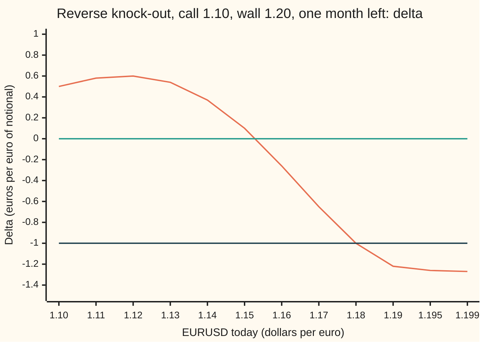
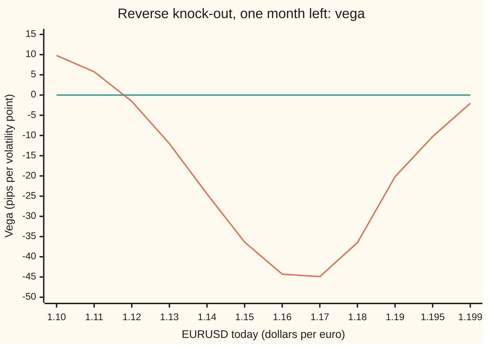

# Greeks at the wall: delta past one, gamma turning negative, vega flipping sign, and how desks bend the barrier to survive it

[Syllabus](../../../SYLLABUS.md) → [Financial mathematics](../../../SYLLABUS.md#w12) → [FX exotics as desks use them - digitals, touches and barriers](../../../SYLLABUS.md#w12-s23) → Greeks at the wall

---

## General Overview

A bank has sold a US importer a euro call. Strike 1.10 dollars per euro, one month left, and one clause: if EURUSD (the price of one euro in dollars) trades at 1.20 at any moment before expiry, the option dies. At the wall the option would pay ten cents per euro (1.20 minus the strike), so the payoff climbs toward the wall and then drops to nothing. That shape is a **reverse knock-out** ([The eight single barriers in one table](03-the-eight-barrier-types.md)). The same bank has also sold a fund a **one-touch** at 1.20: one dollar paid at expiry if 1.20 ever trades ([One-touch and no-touch](04-fx-one-touch-and-no-touch.md)).

The bank hedges both with its **Greeks**: the sensitivities of the price to spot, to volatility, and to both at once. On a plain call they are tame. Delta, the euros to hold per euro of option, lives between 0 and 1. Gamma, the change in delta as spot moves, is positive. Vega, the change in price as volatility rises, is positive. Next to a wall all three break these rules. At 1.19, with a month left, the knock-out's delta is minus 1.22: a one-pip rise in EURUSD costs the holder 1.22 pips, where a pip is 0.0001 dollars. Its gamma is negative. Its vega is minus 20.18 pips per volatility point: more jumpiness makes it cheaper. With one day left, the delta at the wall is minus 11.59.

No hedge can trade eleven times the notional (the euro amount the option is written on) at the moment the wall trades. So desks price as if the wall sat a few pips further away, and keep the difference as a reserve.

**Every Greek of a barrier contract is the Greek of a plain contract minus the Greek of its weighted mirror image; close to the wall that difference is squeezed into a few pips of spot, so delta passes one, gamma and vega turn negative, and the delta at the wall grows like one over the square root of the time left, which is why desks price to a shifted wall and bank the gap.**

**What kind of fact this is:** a theorem inside the Garman–Kohlhagen model (a lognormal exchange rate with constant volatility, an assumption that fits well enough and is not a law), proved on this card in Why it works; the wall-delta rule is an approximation, with its error printed by the checks; barrier shifting is a desk method for reserves, not a theorem.

### The picture: the reverse knock-out's delta across the last ten cents



Orange: the knock-out's delta. Green: zero. Dark blue: minus one. At 1.10 the option behaves like a plain at-the-money call, delta 0.50. Delta peaks at 0.60 near 1.12, crosses zero at 1.1528, where the price is highest, and crosses minus one at 1.1801. From there to the wall it is past one in size: minus 1.27 ten pips from the wall.

---

## The formula

Notation first, in words. $G$ is the price today of the contract's payoff with everything at or above the wall cut off, and no wall watched during the life. For the knock-out that is a plain call at 1.10, minus a plain call at 1.20, minus 0.10 dollars paid if EURUSD finishes above 1.20. For the one-touch it is its partner, the **no-touch** piece: one dollar paid if EURUSD finishes below 1.20. A prime means slope in spot: $G'$ is the delta of $G$, $G''$ its gamma. The price of the barrier contract comes from the mirror formula on [Knock-out and knock-in](02-barrier-options-by-reflection.md), written for a wall above spot:

$$V(S) = G(S) - w\,G(m), \qquad w = \left(\frac{H}{S}\right)^{2\lambda},\quad m = \frac{H^2}{S},\quad \lambda = \frac{r_d - r_f - \tfrac12\sigma^2}{\sigma^2}$$

Differentiate once and twice in spot, with the chain rule, noting that both the weight and the mirror spot move when spot moves:

$$\Delta = G'(S) + \frac{2\lambda w}{S}\,G(m) + \frac{w\,m}{S}\,G'(m)$$

$$\Gamma = G''(S) - \frac{2\lambda(2\lambda+1)\,w}{S^2}\,G(m) - \frac{(4\lambda+2)\,w\,m}{S^2}\,G'(m) - \frac{w\,m^2}{S^2}\,G''(m)$$

Differentiate in volatility; only the weight carries extra volatility, through $\lambda$:

$$\text{vega} = \partial_\sigma G(S) + \frac{4\ln(H/S)\,(r_d - r_f)}{\sigma^3}\,w\,G(m) - w\,\partial_\sigma G(m)$$

**Read it aloud: a barrier Greek is the plain Greek, minus the weighted mirror's Greek, plus the terms that appear because the mirror moves when spot or volatility moves.**

Vanna is the slope of delta in volatility and volga is the slope of vega in volatility; the code takes both from the exact delta and vega. The one-touch is one discounted dollar minus the no-touch, so its Greeks are the no-touch's with the sign flipped.

The blow-up at the wall has a short approximate form, the **wall-delta rule**, for the knock-out close to expiry:

$$\Delta(H) \approx 1 - \frac{(H-K)\sqrt{2/\pi}}{H\,\sigma\sqrt{T}}$$

In words: the delta at the wall grows like one over the square root of the time left, scaled by how deep in the money the wall sits.

| Symbol | Plain meaning | In our example | Push it up and the answer… |
| --- | --- | --- | --- |
| $S$ | EURUSD today, dollars per euro | 1.10 to 1.199 | knock-out rises, peaks at 1.1528, then falls to 0 at the wall |
| $K$ | strike of the euro call | 1.10 | knock-out falls |
| $H$, $\delta$ | the wall, 1.20; the shift a desk moves it by when pricing | 1.20; 10 pips | knock-out rises: more room to pay |
| $T$, $t$ | time left to expiry, in years; a moment during the life | one month, 1/12 | knock-out delta at the wall shrinks |
| $r_d$, $r_f$ | dollar and euro interest rates, continuously compounded | 5%, 3% | $r_d$ up tilts EURUSD toward the wall |
| $\sigma$ | volatility: the yearly spread of log moves in EURUSD | 10% | knock-out rises at 1.10, falls past 1.1182 |
| $\nu$, $\lambda$ | $\nu = r_d - r_f - \tfrac12\sigma^2$ is the drift of log EURUSD; $\lambda = \nu/\sigma^2$ is that drift in units of yearly variance | 0.015; 1.5 | |
| $w$, $m$ | the mirror weight $(H/S)^{2\lambda}$ and the mirror spot $H^2/S$ | 1.025423 and 1.210084 at spot 1.19 | |
| $G$, $C$, $D$, $k$ | price of the cut-off payoff; plain Garman–Kohlhagen call; cash digital paying one dollar above a strike $k$ | $G(1.19) = 0.041442$ | |
| $V$, $N$, $\varphi$ | price of the knock-out or one-touch; bell-curve area left of a point; bell-curve height | 125.59 pips at 1.19 | |
| $\Delta$, $\Gamma$ | delta, euros per euro of notional (or per dollar of payout); gamma, reported as change in delta per one-cent move | −1.2161; −0.1395 | |
| $d_1$, $d_2$ | the two bell-curve distances of [The Greeks of a currency option](../21-FX%20vanilla%20options%20-%20Garman-Kohlhagen%20and%20the%20desk%20conventions/03-garman-kohlhagen-greeks.md) | | |

Units: the knock-out in pips per euro of notional, the one-touch in percent of payout. Gamma per one-cent (100-pip) move; vega, vanna and volga per volatility point (one percent of volatility).

**Conventions, dated 27 Sep 2026:** FX desks report barrier Greeks per pip or per big figure (one cent) and per volatility point, and hold barrier reserves by pricing to a shifted wall, sized per bank by the notional and the liquidity at the level. Sizes vary by house and are not published; the hedging problem the shift answers is set out by Taleb in Sources.

### When it holds

- **Continuous monitoring.** The formulas watch every tick. A contract checked once a day has a different wall-delta ([Knock-out and knock-in](02-barrier-options-by-reflection.md) shifts the wall for that).
- **One constant volatility.** Near the wall the local volatility there decides the price, and the vega here is sensitivity to a parallel move in one number. On a smile the Greeks shift, most near the wall: [Barriers on a smile](07-barriers-with-the-smile.md).
- **Spot moves without jumps.** The hedge unwind at the wall assumes spot passes through 1.20 and the desk can deal close to it. A gap through the wall makes the unwind cost larger than any shift anticipated.
- **The wall-delta rule needs little time left.** With a month it is 3% off (minus 1.3033 against minus 1.2653); with a day, 1%.

---

## Why it works

### Step 0: the price must reach zero at the wall, across a short distance

At 1.19 the knock-out is worth 125.59 pips. At 1.20 it is worth nothing. The price falls about 125 pips over 100 pips of spot, so its slope must be near minus 1.26. The rest of the card makes that exact: the mirror formula gives the price, and differentiating it gives the Greeks.

### Step 1: differentiate the mirror formula

$V = G(S) - w\,G(m)$ has three places where spot enters: $G(S)$ directly, the weight $w = (H/S)^{2\lambda}$, and the mirror spot $m = H^2/S$. The weight's slope in spot is $-2\lambda w/S$. The mirror spot's slope is $-m/S$: as spot rises toward the wall, the mirror falls toward it from the other side. The chain rule gives the delta formula term by term. Differentiating again, with $w/S$ and $w/S^2$ each picking up one more factor of $1/S$, gives the gamma formula.

The pieces $G'$ and $G''$ are Garman–Kohlhagen Greeks of calls and digitals ([The Greeks of a currency option](../21-FX%20vanilla%20options%20-%20Garman-Kohlhagen%20and%20the%20desk%20conventions/03-garman-kohlhagen-greeks.md)). For the digital paying one dollar above strike $k$, with $v = \sigma\sqrt{T}$:

$$D = e^{-r_d T}N(d_2),\quad D' = \frac{e^{-r_d T}\varphi(d_2)}{x\,v},\quad D'' = -\frac{e^{-r_d T}\varphi(d_2)\,d_1}{x^2 v^2},\quad \partial_\sigma D = -\frac{e^{-r_d T}\varphi(d_2)\,d_1}{\sigma}$$

where $x$ is the spot the digital is priced from.

<details>
<summary>Detailed proof of the gamma and vega lines</summary>

Write $u = w/S$. Since $w' = -2\lambda w/S$, $u' = -(2\lambda+1)w/S^2$. The delta is $G'(S) + 2\lambda u\,G(m) + H^2 (w/S^2)\,G'(m)$, using $m/S = H^2/S^2$. Differentiate the second term: $2\lambda[u' G(m) + u\,G'(m)\,m'] = -2\lambda(2\lambda+1)wG(m)/S^2 - 2\lambda w m G'(m)/S^2$. For the third, $(w/S^2)' = -(2\lambda+2)w/S^3$, so its derivative is $-(2\lambda+2)w m G'(m)/S^2 - w m^2 G''(m)/S^2$. Adding the two $G'(m)$ terms gives $-(4\lambda+2)$, which is the gamma line.

For vega, only $G$ and $w$ depend on $\sigma$; $m$ does not. $\lambda = (r_d - r_f)/\sigma^2 - \tfrac12$, so $\partial_\sigma\lambda = -2(r_d - r_f)/\sigma^3$, and $\partial_\sigma w = w \cdot 2\ln(H/S)\cdot\partial_\sigma\lambda$. Then $\partial_\sigma V = \partial_\sigma G(S) - \partial_\sigma w\,G(m) - w\,\partial_\sigma G(m)$, which is the vega line. For the digital, $\partial_\sigma d_2 = -d_1/\sigma$ follows from writing $d_2 = \ln(x/k)/v + (r_d - r_f)\sqrt{T}/\sigma - v/2$ and differentiating each term.

</details>

### Step 2: delta passes one because the mirror term is steep

At 1.19 the three delta terms are $G'(S) = -0.539732$, $2\lambda w\,G(m)/S = 0.072814$, and $w m\,G'(m)/S = -0.749201$. Their sum is minus 1.2161. The cut-off payoff alone already has negative delta at 1.19: it is short 0.10 dollars of digital at 1.20, and that digital gains value fast as spot nears its strike from below. The mirror adds a second steep piece. Near the wall the two combine so that the price reaches exactly zero at 1.20.

### Step 3: gamma turns negative because the price is a hump

The knock-out's price rises from 132.67 pips at 1.10 to 374.61 at 1.15, then falls to zero at the wall. A curve that rises and then falls must bend downward over its top. Downward bending is negative gamma. Gamma crosses zero at 1.1183 and stays negative to within a few pips of the wall, where the price line straightens and gamma returns to a small positive 0.02 per cent at 1.199. The bank that sold the knock-out is therefore long gamma over the hump: its hedged book gains when spot swings back and forth there.

### Step 4: vega turns negative because vega is gamma summed along the life

More volatility gives a plain call more upside and costs nothing, since the downside is capped. A knock-out pays for that upside with more touches. Which effect wins has an exact answer. The price satisfies the Garman–Kohlhagen pricing equation between the two boundaries, the wall and expiry, with value zero on the wall. Differentiate that equation in $\sigma$: vega satisfies the same equation, zero on the wall and at expiry, with an extra source term $\sigma S^2\Gamma$. Solving it by averaging along paths, vega equals the discounted average of $\sigma S_t^2\,\Gamma$ collected over the life, on paths that have not touched. So vega is gamma summed along the surviving paths. Where gamma is mostly negative ahead of spot, vega is negative.

That is why the two sign changes nearly coincide: vega crosses zero at 1.1182, gamma at 1.1183. Vega flips about eight cents before the wall. With a week left it flips at 1.1388, with a day at 1.1467: less time left means less of the path runs through the negative-gamma hump.

### Step 5: the wall-delta rule

At the wall $S = H$, the weight is 1 and the mirror spot is $H$ itself, so $\Delta(H) = 2G'(H) + 2\lambda G(H)/H$. Close to expiry the second term is small. $G'(H)$ is the delta of a call deep in the money (near 1), minus an at-the-money call (near one half), minus 0.10 times the digital's delta at its own strike, $e^{-r_d T}\varphi(d_2)/(H\sigma\sqrt{T})$ with $\varphi(d_2)$ near $\varphi(0) = 1/\sqrt{2\pi}$. Doubling gives the rule. The digital's delta is what blows up: it is the cash jump of 0.10 dollars at the wall spread over one standard deviation of spot, and one standard deviation shrinks like $\sqrt{T}$.

### Step 6: the shifted wall pays for the unwind

The bank is short the knock-out. Near the wall the option's delta is minus 1.2653 per euro, so the bank's hedge is a short position of 1.2653 euros per euro of notional. When 1.20 trades, the option dies and the bank must buy those euros back, in a market that is rising through the level. If the fill comes 10 pips late, at 1.2010, the cost is $1.2653 \times 0.0010$, or 12.65 pips per euro of notional.

Now price the knock-out as if its wall were at 1.2010. At the moment spot reaches the real wall, the shifted-wall option is still alive, 10 pips from its own wall, and worth about its delta times 10 pips: 12.87. That residual value is the reserve released at knock-out, and it matches the 12.65-pip slippage to within 2%. Shifting the wall by $\delta$ is a way of charging, up front, for an unwind that slips by $\delta$.

A desk short a one-touch shifts the other way. Pulling the wall to 1.1990 makes the touch come sooner and the contract dearer: 2.14% of payout at 1.19.

### Another road

Bump and revalue ([Bump and revalue](../07-Greeks%20by%20Numbers%20and%20Calibration/01-bump-and-revalue-and-common-random-numbers.md)) needs only the price. A Crank–Nicolson grid, which steps the pricing equation backward from expiry on a ladder of spot levels with the wall on a rung, needs no formula at all. The code runs both.

---

## Worked numbers, by hand

Reverse knock-out, spot 1.19, strike 1.10, wall 1.20, dollar rate 5%, euro rate 3%, volatility 10%, one month left.

| Step | Arithmetic | Value |
| --- | --- | --- |
| drift in variance units, $\lambda$ | $(0.05 - 0.03 - 0.005)/0.01$ | 1.5 |
| mirror weight $w$ | $(1.20/1.19)^{3}$ | 1.025423 |
| mirror spot $m$ | $1.44/1.19$ | 1.210084 |
| cut-off price at spot, $G(S)$ | call 1.10 − call 1.20 − 0.10 × digital 1.20 | 0.041442 |
| cut-off price at mirror, $G(m)$ | same, from 1.210084 | 0.028167 |
| price | $0.041442 - 1.025423 \times 0.028167$ | 0.012559 |
| delta term 1, $G'(S)$ | Garman–Kohlhagen deltas | −0.539732 |
| delta term 2, $2\lambda w\,G(m)/S$ | $3 \times 1.025423 \times 0.028167 / 1.19$ | 0.072814 |
| delta term 3, $w m\,G'(m)/S$ | weighted mirror delta | −0.749201 |
| **delta** | $-0.539732 + 0.072814 - 0.749201$ | **−1.2161** |

The price is 125.59 pips per euro. A one-pip rise in spot costs the holder about 1.22 pips: for a EUR 10 million notional, the bank's hedge is short EUR 12.2 million, more than the notional itself.

The five Greeks at 1.19, from the checks, per euro of notional: delta −1.2161, gamma −0.1395 per cent, vega −20.18 pips per point, vanna 0.1908 per point, volga 3.92 pips per point, per point. The one-touch at 1.19, per dollar of payout: price 77.83%, delta 21.49, gamma 1.17 per cent, vega 1.98% per point, vanna −1.90, volga −0.37.

The one-touch's delta of 21.49 has a plain reading: a one-cent rise in EURUSD adds 21.49% of payout. For a USD 1 million payout, the hedge is EUR 21.5 million.

### What breaks if you drop a piece

Right answers at 1.19, one month: delta −1.2161. At 1.195: delta −1.26, gamma −0.05 per cent.

| Mistake | Comes out at | What went wrong |
| --- | --- | --- |
| Hedge with the vanilla call's delta | +0.9949 | Wrong sign: buys euros where the book needs to sell them. |
| Drop the weight's slope term $2\lambda w\,G(m)/S$ | −1.2889 | Treated the mirror weight as fixed; it moves with spot. |
| One-cent bump across the wall, at 1.195 | delta −0.9215, gamma +0.5748 per cent | The up-bump lands past the wall, where the price is flat zero; the bump is wider than the region it measures, and gamma's sign flips. |

---

## How the Greeks move as the wall and expiry close in

The mystery: at 1.10 and at 1.19 the knock-out has almost the same price, 132.67 and 125.59 pips, but opposite deltas and opposite vegas.

### Vega across the last ten cents



Orange: the knock-out's vega. Green: zero. Positive only below 1.1182; most negative, near minus 45 pips per point, around 1.16 to 1.17; back to zero at the wall, where the price is zero whatever the volatility. The one-touch's vega stays positive across the same range, peaking at 4.59% per point near 1.16, falling to 0.20% ten pips from the wall, where the touch is nearly certain and more volatility adds little.

### Delta at the wall as expiry approaches

Freeze spot at the wall and let the clock run. Knock-out delta at 1.20 per euro of notional, with the wall-delta rule beside it:

```
time left   |delta| at the wall, euros per euro of notional
  month    ████                                        -1.2653   (rule -1.3033)
  week     █████████████                               -3.7105   (rule -3.7947)
  day      ████████████████████████████████████████    -11.5933  (rule -11.7030)
```

One week to one day is seven times less time and about three times more delta, as one over the square root of time predicts. Ten pips from the wall the one-touch's delta goes from 21.78 with a month to 46.73 with a week and 124.58 with a day. The knock-out's gamma ten pips from the wall goes from 0.02 per cent to −0.05 and then −2.80.

### The reserve, spot by spot

Knock-out reserve, pips per euro, for three shifted walls, one month left:

| Spot | Wall 1.2010 | Wall 1.2020 | Wall 1.2050 |
| --- | --- | --- | --- |
| 1.10 | 0.24 | 0.46 | 1.02 |
| 1.19 | 14.26 | 28.75 | 73.37 |

The reserve is small when spot is far from the wall, where a touch is unlikely, and large when it is close. A desk marks its book to the shifted wall every day. The reserve is released when the option dies or expires.

---

## Code, from first principles, and it actually runs

The script reaches each of the five Greeks of both contracts three independent ways: the closed-form Greeks above; bump and revalue of the closed-form price, with spot and volatility nudged by 0.0001; and a Crank–Nicolson grid whose delta and gamma come from neighbouring rungs and whose volatility Greeks come from grids run at 9.9% and 10.1%. Then it sweeps spot, finds the zero crossings by bisection, follows the wall-delta to one day, prices shifted walls, and reproduces the what-breaks numbers. The bell-curve area is a Taylor series written in the script. One-year cross-checks against the shelf: reverse knock-out 54.40 pips, one-touch 0.414213 by two separate formulas.

### Python

```python
# Greeks at the wall: EURUSD reverse knock-out (call 1.10, dies at 1.20) and one-touch at 1.20.
# Standard library only. Three roads: closed-form Greeks, bump-and-revalue of the closed-form
# price, and a Crank-Nicolson grid that never sees the formula. The normal CDF is a series.
from math import exp, log, sqrt, pi
RD, RF, K, H, SIG = 0.05, 0.03, 1.10, 1.20, 0.10      # dollar rate, euro rate, strike, wall, vol
MONTH, WEEK, DAY = 1 / 12, 1 / 52, 1 / 365

def N(x):                                  # area under the bell curve left of x, by its Taylor series
    if abs(x) > 9: return 0.0 if x < 0 else 1.0
    t = s = x; n = 0
    while abs(t) > 1e-17 * abs(s):
        n += 1; t *= x * x / (2 * n + 1); s += t
    return 0.5 + s * exp(-0.5 * x * x) / sqrt(2 * pi)
def phi(x): return exp(-0.5 * x * x) / sqrt(2 * pi)
def vanilla(x, k, s, T):                   # call and cash digital at strike k: price, delta, gamma, vega
    v = s * sqrt(T); d1 = (log(x / k) + (RD - RF + 0.5 * s * s) * T) / v; d2 = d1 - v
    a, b = exp(-RF * T), exp(-RD * T)
    return ((x * a * N(d1) - k * b * N(d2), a * N(d1), a * phi(d1) / (x * v), x * a * phi(d1) * sqrt(T)),
            (b * N(d2), b * phi(d2) / (x * v), -b * phi(d2) * d1 / (x * x * v * v), -b * phi(d2) * d1 / s))
def below(prod, x, s, T, hb):              # plain price of the payoff cut off at the wall, and its Greeks
    cK = vanilla(x, K, s, T)[0]; cH, dH = vanilla(x, hb, s, T)
    if prod == "ko": return [cK[j] - cH[j] - (hb - K) * dH[j] for j in range(4)]
    return [(exp(-RD * T) if j == 0 else 0.0) - dH[j] for j in range(4)]      # no-touch piece
def closed(prod, S, s, T, hb=H, drop=False):   # mirror: V = G(S) - w G(m), w = (hb/S)^(2 lam), m = hb^2/S
    lam = (RD - RF - 0.5 * s * s) / (s * s); w = (hb / S) ** (2 * lam); m = hb * hb / S
    g, gm = below(prod, S, s, T, hb), below(prod, m, s, T, hb)
    v = g[0] - w * gm[0]
    d = g[1] + (0.0 if drop else 2 * lam * w * gm[0] / S) + w * m * gm[1] / S
    ga = (g[2] - 2 * lam * (2 * lam + 1) * w * gm[0] / S ** 2 - (4 * lam + 2) * w * m * gm[1] / S ** 2
          - w * m * m * gm[2] / S ** 2)
    ve = g[3] + w * 4 * log(hb / S) * (RD - RF) / s ** 3 * gm[0] - w * gm[3]
    if prod == "ot": return exp(-RD * T) - v, -d, -ga, -ve
    return v, d, ga, ve
def price(prod, S, s, T, hb=H):
    if S >= hb: return 0.0 if prod == "ko" else exp(-RD * T)
    return closed(prod, S, s, T, hb)[0]
def five(prod, S, s, T, e=1e-4):           # road 1: closed form; vanna, volga = vol-slopes of exact delta, vega
    c, up, dn = closed(prod, S, s, T), closed(prod, S, s + e, T), closed(prod, S, s - e, T)
    return [c[0], c[1], c[2], c[3], (up[1] - dn[1]) / (2 * e), (up[3] - dn[3]) / (2 * e)]
def bump(prod, S, s, T, h=1e-4, e=1e-4):   # road 2: bump and revalue the price only
    p = lambda x, y: price(prod, x, y, T); v = p(S, s)
    return [v, (p(S + h, s) - p(S - h, s)) / (2 * h), (p(S + h, s) - 2 * v + p(S - h, s)) / h ** 2,
            (p(S, s + e) - p(S, s - e)) / (2 * e),
            (p(S + h, s + e) - p(S + h, s - e) - p(S - h, s + e) + p(S - h, s - e)) / (4 * h * e),
            (p(S, s + e) - 2 * v + p(S, s - e)) / e ** 2]
LO, DS, STEPS = 0.90, 0.0005, 400
def grid(prod, s, T):                      # road 3: Crank-Nicolson on price x = LO..H, wall on a node
    n = round((H - LO) / DS); X = [LO + i * DS for i in range(n + 1)]
    V = [max(x - K, 0.0) for x in X] if prod == "ko" else [0.0] * n + [1.0]
    V[n] = 0.0 if prod == "ko" else 1.0; dt = T / STEPS
    A = [0.5 * s * s * x * x / DS ** 2 - 0.5 * (RD - RF) * x / DS for x in X]
    C = [0.5 * s * s * x * x / DS ** 2 + 0.5 * (RD - RF) * x / DS for x in X]
    B = [-s * s * x * x / DS ** 2 - RD for x in X]
    for k in range(STEPS):
        th = 1.0 if k < 4 else 0.5         # four fully implicit steps first, to calm the kink and the wall
        top = 0.0 if prod == "ko" else exp(-RD * (k + 1) * dt)
        r = [V[i] + (1 - th) * dt * (A[i] * V[i - 1] + B[i] * V[i] + C[i] * V[i + 1]) for i in range(1, n)]
        r[-1] += th * dt * C[n - 1] * top
        cp, dp = [0.0] * (n - 1), [0.0] * (n - 1)
        for j in range(n - 1):
            i = j + 1; a, c = -th * dt * A[i], -th * dt * C[i]
            den = 1 - th * dt * B[i] - (a * cp[j - 1] if j else 0.0)
            cp[j] = c / den; dp[j] = (r[j] - (a * dp[j - 1] if j else 0.0)) / den
        V[n - 1] = dp[n - 2]
        for j in range(n - 3, -1, -1): V[j + 1] = dp[j] - cp[j] * V[j + 2]
        V[n] = top
    return V
def from_grid(G0, Gu, Gd, S, e):          # Greeks off grid nodes; vol Greeks from grids at vol +- e
    i = round((S - LO) / DS)
    dlt = lambda V: (V[i + 1] - V[i - 1]) / (2 * DS)
    return [G0[i], dlt(G0), (G0[i + 1] - 2 * G0[i] + G0[i - 1]) / DS ** 2, (Gu[i] - Gd[i]) / (2 * e),
            (dlt(Gu) - dlt(Gd)) / (2 * e), (Gu[i] - 2 * G0[i] + Gd[i]) / e ** 2]
def root(f, a, b):                         # bisection: f(a), f(b) of opposite sign
    fa = f(a)
    for _ in range(80):
        m = 0.5 * (a + b)
        if (f(m) > 0) == (fa > 0): a, fa = m, f(m)
        else: b = m
    return 0.5 * (a + b)
def touch(S, s, T):                        # one-touch as discounted touch chance: an independent formula
    b, nu, v = log(H / S), RD - RF - 0.5 * s * s, s * sqrt(T)
    return exp(-RD * T) * (N((nu * T - b) / v) + (H / S) ** (2 * nu / s / s) * N((-b - nu * T) / v))

UNIT = {"ko": [1e4, 1, 0.01, 100, 0.01, 1], "ot": [100, 1, 0.01, 1, 0.01, 0.01]}   # desk units
def desk(prod, g): return [x * u for x, u in zip(g, UNIT[prod])]
print("house cross-checks, one year, spot 1.10")
print(f"  reverse knock-out, pips               {price('ko', 1.10, SIG, 1.0) * 1e4:10.2f}")
print(f"  one-touch, mirror of digital          {price('ot', 1.10, SIG, 1.0):10.6f}")
print(f"  one-touch, discounted touch chance    {touch(1.10, SIG, 1.0):10.6f}")
E = 0.001
grids = {p: [grid(p, SIG, MONTH), grid(p, SIG + E, MONTH), grid(p, SIG - E, MONTH)] for p in ("ko", "ot")}
names = ["price", "delta", "gamma", "vega", "vanna", "volga"]
print("one month left; units: KO pips, OT % of payout; gamma per cent, vega/vanna/volga per vol point")
print("                     closed form    bump    grid")
for prod, S in (("ko", 1.10), ("ko", 1.19), ("ot", 1.19)):
    rows = [desk(prod, five(prod, S, SIG, MONTH)), desk(prod, bump(prod, S, SIG, MONTH)),
            desk(prod, from_grid(*grids[prod], S, E))]
    for j in range(6):
        print(f"  {prod} {S:.2f} {names[j]:<6}  {rows[0][j]:12.4f} {rows[1][j]:9.4f} {rows[2][j]:9.4f}")
        assert abs(rows[1][j] - rows[0][j]) < 1e-4 * (1 + abs(rows[0][j]))       # bump agrees with closed form
        assert abs(rows[2][j] - rows[0][j]) < 1e-3 * (1 + abs(rows[0][j]))       # grid agrees with closed form
assert abs(price("ot", 1.10, SIG, 1.0) - touch(1.10, SIG, 1.0)) < 1e-12        # two one-touch formulas agree
lam, S = (RD - RF - 0.5 * SIG ** 2) / SIG ** 2, 1.19; w, m = (H / S) ** (2 * lam), H * H / S   # the hand table
g, gm = below("ko", S, SIG, MONTH, H), below("ko", m, SIG, MONTH, H)
print(f"worked, KO 1.19, month: lam {lam:.4f}  w {w:.6f}  m {m:.6f}  G(S) {g[0]:.6f}  G(m) {gm[0]:.6f}  price {g[0] - w * gm[0]:.6f}")
print(f"  delta terms: G'(S) {g[1]:.6f}  2 lam w G(m)/S {2 * lam * w * gm[0] / S:.6f}  w m G'(m)/S {w * m * gm[1] / S:.6f}")
print("sweep, one month: closed form   KO pips  delta  gamma   vega |  OT %   delta   vega")
for S in (1.10, 1.11, 1.12, 1.13, 1.14, 1.15, 1.16, 1.17, 1.18, 1.19, 1.195, 1.199):
    k, o = desk("ko", closed("ko", S, SIG, MONTH)), desk("ot", closed("ot", S, SIG, MONTH))
    print(f"  spot {S:<6.3f}  {k[0]:20.2f} {k[1]:6.2f} {k[2]:6.2f} {k[3]:6.2f} | {o[0]:5.2f} {o[1]:7.2f} {o[3]:6.2f}")
f = lambda j, t: (lambda S: closed("ko", S, SIG, MONTH)[j] - t)
print(f"  KO delta 0 at {root(f(1, 0), 1.12, 1.18):.4f}, delta -1 at {root(f(1, -1), 1.16, 1.19):.4f}, "
      f"vega 0 at {root(f(3, 0), 1.10, 1.13):.4f}, gamma 0 at {root(f(2, 0), 1.10, 1.13):.4f}")
print(f"  OT gamma 0 at {root(lambda S: closed('ot', S, SIG, MONTH)[2], 1.19, 1.199):.4f}; "
      "KO vega 0 at, week / day: " + " / ".join(f"{root(lambda S: closed('ko', S, SIG, T)[3], 1.10, 1.1999):.4f}" for T in (WEEK, DAY)))
print("T left    KO delta 1.199  at wall  wall-delta rule  KO gamma 1.199  OT delta 1.199")
for lab, T in (("month", MONTH), ("week", WEEK), ("day", DAY)):
    rule = 1 - (H - K) * sqrt(2 / pi) / (H * SIG * sqrt(T))      # wall-delta rule, near expiry
    print(f"  {lab:<6} {closed('ko', 1.199, SIG, T)[1]:16.4f} {closed('ko', H, SIG, T)[1]:8.4f} {rule:17.4f} "
          f"{closed('ko', 1.199, SIG, T)[2] * 0.01:15.4f} {closed('ot', 1.199, SIG, T)[1]:15.4f}")
    assert abs(closed("ko", H, SIG, T)[1] - rule) < 0.05 * abs(rule)             # blow-up law holds
print("barrier shift, one month   wall 1.2010   wall 1.2020   wall 1.2050  (KO reserve, pips)")
for S in (1.10, 1.19):
    print(f"  spot {S:.2f}          " + "".join(f"{(price('ko', S, SIG, MONTH, H + d) - price('ko', S, SIG, MONTH)) * 1e4:14.2f}" for d in (0.001, 0.002, 0.005)))
res, cost = price("ko", H, SIG, MONTH, H + 0.001), -closed("ko", H, SIG, MONTH)[1] * 0.001
print(f"  at spot 1.20, wall 1.2010: KO worth {res * 1e4:.2f} pips; |delta at wall| x 10 pips = {cost * 1e4:.2f}")
assert abs(res - cost) < 0.1 * cost                                              # shift pays for the unwind
print(f"  OT sold: wall pulled to 1.1990, reserve % at 1.10 / 1.19: " + " / ".join(f"{(price('ot', S, SIG, MONTH, H - 0.001) - price('ot', S, SIG, MONTH)) * 100:.2f}" for S in (1.10, 1.19)))
vd = vanilla(1.19, K, SIG, MONTH)[0][1]
up, mid, dn = (price("ko", x, SIG, MONTH) for x in (1.205, 1.195, 1.185))
print(f"what breaks at 1.19: vanilla delta {vd:.4f}; weight slope dropped {closed('ko', 1.19, SIG, MONTH, H, True)[1]:.4f}")
print(f"  at 1.195, one-cent bump across the wall: delta {(up - dn) / 0.02:.4f}, gamma per cent {(up - 2 * mid + dn) / 1e-4 * 0.01:.4f}")
print("ALL CHECKS PASS")
```

**Ran 2026-09-27 on macOS, Python 3.14.6, standard library only. All checks passed. Output, pasted from the run:**

```
house cross-checks, one year, spot 1.10
  reverse knock-out, pips                    54.40
  one-touch, mirror of digital            0.414213
  one-touch, discounted touch chance      0.414213
one month left; units: KO pips, OT % of payout; gamma per cent, vega/vanna/volga per vol point
                     closed form    bump    grid
  ko 1.10 price       132.6714  132.6714  132.6644
  ko 1.10 delta         0.4974    0.4974    0.4974
  ko 1.10 gamma         0.0972    0.0972    0.0972
  ko 1.10 vega          9.7921    9.7921    9.7904
  ko 1.10 vanna        -0.0250   -0.0250   -0.0250
  ko 1.10 volga        -1.8941   -1.8941   -1.8937
  ko 1.19 price       125.5900  125.5900  125.5937
  ko 1.19 delta        -1.2161   -1.2161   -1.2161
  ko 1.19 gamma        -0.1395   -0.1395   -0.1395
  ko 1.19 vega        -20.1837  -20.1838  -20.1860
  ko 1.19 vanna         0.1908    0.1908    0.1908
  ko 1.19 volga         3.9185    3.9185    3.9190
  ot 1.19 price        77.8256   77.8256   77.8253
  ot 1.19 delta        21.4861   21.4861   21.4856
  ot 1.19 gamma         1.1712    1.1712    1.1713
  ot 1.19 vega          1.9818    1.9818    1.9820
  ot 1.19 vanna        -1.8984   -1.8984   -1.8984
  ot 1.19 volga        -0.3667   -0.3667   -0.3668
worked, KO 1.19, month: lam 1.5000  w 1.025423  m 1.210084  G(S) 0.041442  G(m) 0.028167  price 0.012559
  delta terms: G'(S) -0.539732  2 lam w G(m)/S 0.072814  w m G'(m)/S -0.749201
sweep, one month: closed form   KO pips  delta  gamma   vega |  OT %   delta   vega
  spot 1.100                 132.67   0.50   0.10   9.79 |  0.29    0.30   0.28
  spot 1.110                 186.71   0.58   0.06   5.77 |  0.77    0.72   0.60
  spot 1.120                 246.14   0.60  -0.01  -1.55 |  1.86    1.54   1.16
  spot 1.130                 303.91   0.54  -0.11 -12.02 |  4.07    3.00   1.97
  spot 1.140                 350.38   0.37  -0.22 -24.45 |  8.12    5.27   2.98
  spot 1.150                 374.61   0.10  -0.33 -36.36 | 14.89    8.41   3.96
  spot 1.160                 366.68  -0.26  -0.39 -44.29 | 25.16   12.20   4.59
  spot 1.170                 320.70  -0.65  -0.38 -44.89 | 39.34   16.13   4.53
  spot 1.180                 237.48  -1.00  -0.29 -36.47 | 57.21   19.47   3.63
  spot 1.190                 125.59  -1.22  -0.14 -20.18 | 77.83   21.49   1.98
  spot 1.195                  63.41  -1.26  -0.05 -10.25 | 88.68   21.84   1.00
  spot 1.199                  12.67  -1.27   0.02  -2.04 | 97.41   21.78   0.20
  KO delta 0 at 1.1528, delta -1 at 1.1801, vega 0 at 1.1182, gamma 0 at 1.1183
  OT gamma 0 at 1.1962; KO vega 0 at, week / day: 1.1388 / 1.1467
T left    KO delta 1.199  at wall  wall-delta rule  KO gamma 1.199  OT delta 1.199
  month           -1.2686  -1.2653           -1.3033          0.0240         21.7768
  week            -3.7143  -3.7105           -3.7947         -0.0478         46.7316
  day            -11.4718 -11.5933          -11.7030         -2.8025        124.5816
barrier shift, one month   wall 1.2010   wall 1.2020   wall 1.2050  (KO reserve, pips)
  spot 1.10                    0.24          0.46          1.02
  spot 1.19                   14.26         28.75         73.37
  at spot 1.20, wall 1.2010: KO worth 12.87 pips; |delta at wall| x 10 pips = 12.65
  OT sold: wall pulled to 1.1990, reserve % at 1.10 / 1.19: 0.03 / 2.14
what breaks at 1.19: vanilla delta 0.9949; weight slope dropped -1.2889
  at 1.195, one-cent bump across the wall: delta -0.9215, gamma per cent 0.5748
ALL CHECKS PASS
```

### Rust

```rust
// Greeks at the wall: EURUSD reverse knock-out (call 1.10, dies at 1.20) and one-touch at 1.20.
// Std only. Three roads: closed-form Greeks, bump-and-revalue of the closed-form price, and a
// Crank-Nicolson grid that never sees the formula. The normal CDF is a series written here.
use std::f64::consts::PI;
const RD: f64 = 0.05; const RF: f64 = 0.03; const K: f64 = 1.10; const H: f64 = 1.20; const SIG: f64 = 0.10;
const MONTH: f64 = 1.0 / 12.0; const WEEK: f64 = 1.0 / 52.0; const DAY: f64 = 1.0 / 365.0;
const LO: f64 = 0.90; const DS: f64 = 0.0005; const STEPS: usize = 400;
#[derive(Clone, Copy, PartialEq)] enum P { Ko, Ot }

fn n_cdf(x: f64) -> f64 {                  // area under the bell curve left of x, by its Taylor series
    if x.abs() > 9.0 { return if x < 0.0 { 0.0 } else { 1.0 }; }
    let (mut t, mut s, mut n) = (x, x, 0.0);
    while t.abs() > 1e-17 * s.abs() { n += 1.0; t *= x * x / (2.0 * n + 1.0); s += t; }
    0.5 + s * (-0.5 * x * x).exp() / (2.0 * PI).sqrt()
}
fn phi(x: f64) -> f64 { (-0.5 * x * x).exp() / (2.0 * PI).sqrt() }
fn vanilla(x: f64, k: f64, s: f64, t: f64) -> ([f64; 4], [f64; 4]) {   // call and cash digital at strike k
    let v = s * t.sqrt(); let d1 = ((x / k).ln() + (RD - RF + 0.5 * s * s) * t) / v; let d2 = d1 - v;
    let (a, b) = ((-RF * t).exp(), (-RD * t).exp());
    ([x * a * n_cdf(d1) - k * b * n_cdf(d2), a * n_cdf(d1), a * phi(d1) / (x * v), x * a * phi(d1) * t.sqrt()],
     [b * n_cdf(d2), b * phi(d2) / (x * v), -b * phi(d2) * d1 / (x * x * v * v), -b * phi(d2) * d1 / s])
}
fn below(p: P, x: f64, s: f64, t: f64, hb: f64) -> [f64; 4] {   // plain price of the payoff cut at the wall
    let ck = vanilla(x, K, s, t).0; let (ch, dh) = vanilla(x, hb, s, t);
    let mut g = [0.0; 4];
    for j in 0..4 {
        g[j] = if p == P::Ko { ck[j] - ch[j] - (hb - K) * dh[j] }
               else { (if j == 0 { (-RD * t).exp() } else { 0.0 }) - dh[j] };   // no-touch piece
    }
    g
}
fn closed(p: P, sp: f64, s: f64, t: f64, hb: f64, drop: bool) -> [f64; 4] {   // mirror: V = G(S) - w G(m)
    let lam = (RD - RF - 0.5 * s * s) / (s * s); let w = (hb / sp).powf(2.0 * lam); let m = hb * hb / sp;
    let (g, gm) = (below(p, sp, s, t, hb), below(p, m, s, t, hb));
    let v = g[0] - w * gm[0];
    let d = g[1] + (if drop { 0.0 } else { 2.0 * lam * w * gm[0] / sp }) + w * m * gm[1] / sp;
    let ga = g[2] - 2.0 * lam * (2.0 * lam + 1.0) * w * gm[0] / sp.powi(2) - (4.0 * lam + 2.0) * w * m * gm[1] / sp.powi(2)
        - w * m * m * gm[2] / sp.powi(2);
    let ve = g[3] + w * 4.0 * (hb / sp).ln() * (RD - RF) / s.powi(3) * gm[0] - w * gm[3];
    if p == P::Ot { [(-RD * t).exp() - v, -d, -ga, -ve] } else { [v, d, ga, ve] }
}
fn price(p: P, sp: f64, s: f64, t: f64, hb: f64) -> f64 {
    if sp >= hb { return if p == P::Ko { 0.0 } else { (-RD * t).exp() }; }
    closed(p, sp, s, t, hb, false)[0]
}
fn five(p: P, sp: f64, s: f64, t: f64) -> [f64; 6] {   // road 1: closed form; vanna, volga = vol-slopes
    let e = 1e-4;
    let (c, u, d) = (closed(p, sp, s, t, H, false), closed(p, sp, s + e, t, H, false), closed(p, sp, s - e, t, H, false));
    [c[0], c[1], c[2], c[3], (u[1] - d[1]) / (2.0 * e), (u[3] - d[3]) / (2.0 * e)]
}
fn bump(p: P, sp: f64, s: f64, t: f64) -> [f64; 6] {   // road 2: bump and revalue the price only
    let (h, e) = (1e-4, 1e-4);
    let q = |x: f64, y: f64| price(p, x, y, t, H); let v = q(sp, s);
    [v, (q(sp + h, s) - q(sp - h, s)) / (2.0 * h), (q(sp + h, s) - 2.0 * v + q(sp - h, s)) / (h * h),
     (q(sp, s + e) - q(sp, s - e)) / (2.0 * e),
     (q(sp + h, s + e) - q(sp + h, s - e) - q(sp - h, s + e) + q(sp - h, s - e)) / (4.0 * h * e),
     (q(sp, s + e) - 2.0 * v + q(sp, s - e)) / (e * e)]
}
fn grid(p: P, s: f64, t: f64) -> Vec<f64> {   // road 3: Crank-Nicolson on price LO..H, wall on a node
    let n = ((H - LO) / DS).round() as usize;
    let x: Vec<f64> = (0..=n).map(|i| LO + i as f64 * DS).collect();
    let mut v: Vec<f64> = x.iter().map(|&y| if p == P::Ko { (y - K).max(0.0) } else { 0.0 }).collect();
    v[n] = if p == P::Ko { 0.0 } else { 1.0 }; let dt = t / STEPS as f64;
    let a: Vec<f64> = x.iter().map(|&y| 0.5 * s * s * y * y / (DS * DS) - 0.5 * (RD - RF) * y / DS).collect();
    let c: Vec<f64> = x.iter().map(|&y| 0.5 * s * s * y * y / (DS * DS) + 0.5 * (RD - RF) * y / DS).collect();
    let b: Vec<f64> = x.iter().map(|&y| -s * s * y * y / (DS * DS) - RD).collect();
    for k in 0..STEPS {
        let th = if k < 4 { 1.0 } else { 0.5 };   // four fully implicit steps first
        let top = if p == P::Ko { 0.0 } else { (-RD * (k + 1) as f64 * dt).exp() };
        let mut r: Vec<f64> = (1..n).map(|i| v[i] + (1.0 - th) * dt * (a[i] * v[i - 1] + b[i] * v[i] + c[i] * v[i + 1])).collect();
        r[n - 2] += th * dt * c[n - 1] * top;
        let (mut cp, mut dp) = (vec![0.0; n - 1], vec![0.0; n - 1]);
        for j in 0..n - 1 {
            let i = j + 1; let (aa, cc) = (-th * dt * a[i], -th * dt * c[i]);
            let den = 1.0 - th * dt * b[i] - if j > 0 { aa * cp[j - 1] } else { 0.0 };
            cp[j] = cc / den; dp[j] = (r[j] - if j > 0 { aa * dp[j - 1] } else { 0.0 }) / den;
        }
        v[n - 1] = dp[n - 2];
        for j in (0..n - 2).rev() { v[j + 1] = dp[j] - cp[j] * v[j + 2]; }
        v[n] = top;
    }
    v
}
fn from_grid(g0: &[f64], gu: &[f64], gd: &[f64], sp: f64, e: f64) -> [f64; 6] {
    let i = ((sp - LO) / DS).round() as usize;
    let dl = |v: &[f64]| (v[i + 1] - v[i - 1]) / (2.0 * DS);
    [g0[i], dl(g0), (g0[i + 1] - 2.0 * g0[i] + g0[i - 1]) / (DS * DS), (gu[i] - gd[i]) / (2.0 * e),
     (dl(gu) - dl(gd)) / (2.0 * e), (gu[i] - 2.0 * g0[i] + gd[i]) / (e * e)]
}
fn root<F: Fn(f64) -> f64>(f: F, mut a: f64, mut b: f64) -> f64 {   // bisection
    let mut fa = f(a);
    for _ in 0..80 {
        let m = 0.5 * (a + b); let fm = f(m);
        if (fm > 0.0) == (fa > 0.0) { a = m; fa = fm; } else { b = m; }
    }
    0.5 * (a + b)
}
fn touch(sp: f64, s: f64, t: f64) -> f64 {   // one-touch as discounted touch chance: independent formula
    let (b, nu, v) = ((H / sp).ln(), RD - RF - 0.5 * s * s, s * t.sqrt());
    (-RD * t).exp() * (n_cdf((nu * t - b) / v) + (H / sp).powf(2.0 * nu / s / s) * n_cdf((-b - nu * t) / v))
}
fn desk(p: P, g: &[f64]) -> Vec<f64> {   // desk units
    let u = if p == P::Ko { [1e4, 1.0, 0.01, 100.0, 0.01, 1.0] } else { [100.0, 1.0, 0.01, 1.0, 0.01, 0.01] };
    g.iter().zip(u.iter()).map(|(x, y)| x * y).collect()
}
fn main() {
    let cl = |p: P, sp: f64, t: f64| closed(p, sp, SIG, t, H, false);
    println!("house cross-checks, one year, spot 1.10");
    println!("  reverse knock-out, pips               {:10.2}", price(P::Ko, 1.10, SIG, 1.0, H) * 1e4);
    println!("  one-touch, mirror of digital          {:10.6}", price(P::Ot, 1.10, SIG, 1.0, H));
    println!("  one-touch, discounted touch chance    {:10.6}", touch(1.10, SIG, 1.0));
    let e = 0.001;
    let gk = [grid(P::Ko, SIG, MONTH), grid(P::Ko, SIG + e, MONTH), grid(P::Ko, SIG - e, MONTH)];
    let go = [grid(P::Ot, SIG, MONTH), grid(P::Ot, SIG + e, MONTH), grid(P::Ot, SIG - e, MONTH)];
    let names = ["price", "delta", "gamma", "vega", "vanna", "volga"];
    println!("one month left; units: KO pips, OT % of payout; gamma per cent, vega/vanna/volga per vol point");
    println!("                     closed form    bump    grid");
    for (p, sp, lab) in [(P::Ko, 1.10, "ko"), (P::Ko, 1.19, "ko"), (P::Ot, 1.19, "ot")] {
        let g = if p == P::Ko { &gk } else { &go };
        let rows = [desk(p, &five(p, sp, SIG, MONTH)), desk(p, &bump(p, sp, SIG, MONTH)), desk(p, &from_grid(&g[0], &g[1], &g[2], sp, e))];
        for j in 0..6 {
            println!("  {} {:.2} {:<6}  {:12.4} {:9.4} {:9.4}", lab, sp, names[j], rows[0][j], rows[1][j], rows[2][j]);
            assert!((rows[1][j] - rows[0][j]).abs() < 1e-4 * (1.0 + rows[0][j].abs()));   // bump agrees with closed form
            assert!((rows[2][j] - rows[0][j]).abs() < 1e-3 * (1.0 + rows[0][j].abs()));   // grid agrees with closed form
        }
    }
    assert!((price(P::Ot, 1.10, SIG, 1.0, H) - touch(1.10, SIG, 1.0)).abs() < 1e-12);   // two one-touch formulas agree
    let (lam, sp) = ((RD - RF - 0.5 * SIG * SIG) / (SIG * SIG), 1.19); let (w, m) = ((H / sp).powf(2.0 * lam), H * H / sp);
    let (g, gm) = (below(P::Ko, sp, SIG, MONTH, H), below(P::Ko, m, SIG, MONTH, H));   // the hand table
    println!("worked, KO 1.19, month: lam {:.4}  w {:.6}  m {:.6}  G(S) {:.6}  G(m) {:.6}  price {:.6}", lam, w, m, g[0], gm[0], g[0] - w * gm[0]);
    println!("  delta terms: G'(S) {:.6}  2 lam w G(m)/S {:.6}  w m G'(m)/S {:.6}", g[1], 2.0 * lam * w * gm[0] / sp, w * m * gm[1] / sp);
    println!("sweep, one month: closed form   KO pips  delta  gamma   vega |  OT %   delta   vega");
    for sp in [1.10, 1.11, 1.12, 1.13, 1.14, 1.15, 1.16, 1.17, 1.18, 1.19, 1.195, 1.199] {
        let (k, o) = (desk(P::Ko, &cl(P::Ko, sp, MONTH)), desk(P::Ot, &cl(P::Ot, sp, MONTH)));
        println!("  spot {:<6.3}  {:20.2} {:6.2} {:6.2} {:6.2} | {:5.2} {:7.2} {:6.2}", sp, k[0], k[1], k[2], k[3], o[0], o[1], o[3]);
    }
    let f = |j: usize, tg: f64| move |sp: f64| closed(P::Ko, sp, SIG, MONTH, H, false)[j] - tg;
    println!("  KO delta 0 at {:.4}, delta -1 at {:.4}, vega 0 at {:.4}, gamma 0 at {:.4}",
             root(f(1, 0.0), 1.12, 1.18), root(f(1, -1.0), 1.16, 1.19), root(f(3, 0.0), 1.10, 1.13), root(f(2, 0.0), 1.10, 1.13));
    let vz: Vec<String> = [WEEK, DAY].iter().map(|&t| format!("{:.4}", root(|sp| cl(P::Ko, sp, t)[3], 1.10, 1.1999))).collect();
    println!("  OT gamma 0 at {:.4}; KO vega 0 at, week / day: {}", root(|sp| cl(P::Ot, sp, MONTH)[2], 1.19, 1.199), vz.join(" / "));
    println!("T left    KO delta 1.199  at wall  wall-delta rule  KO gamma 1.199  OT delta 1.199");
    for (lab, t) in [("month", MONTH), ("week", WEEK), ("day", DAY)] {
        let rule = 1.0 - (H - K) * (2.0 / PI).sqrt() / (H * SIG * t.sqrt());   // wall-delta rule, near expiry
        println!("  {:<6} {:16.4} {:8.4} {:17.4} {:15.4} {:15.4}", lab, cl(P::Ko, 1.199, t)[1], cl(P::Ko, H, t)[1], rule,
                 cl(P::Ko, 1.199, t)[2] * 0.01, cl(P::Ot, 1.199, t)[1]);
        assert!((cl(P::Ko, H, t)[1] - rule).abs() < 0.05 * rule.abs());   // blow-up law holds
    }
    println!("barrier shift, one month   wall 1.2010   wall 1.2020   wall 1.2050  (KO reserve, pips)");
    for sp in [1.10, 1.19] {
        let cols: String = [0.001, 0.002, 0.005].iter()
            .map(|&d| format!("{:14.2}", (price(P::Ko, sp, SIG, MONTH, H + d) - price(P::Ko, sp, SIG, MONTH, H)) * 1e4)).collect();
        println!("  spot {:.2}          {}", sp, cols);
    }
    let (res, cost) = (price(P::Ko, H, SIG, MONTH, H + 0.001), -cl(P::Ko, H, MONTH)[1] * 0.001);
    println!("  at spot 1.20, wall 1.2010: KO worth {:.2} pips; |delta at wall| x 10 pips = {:.2}", res * 1e4, cost * 1e4);
    assert!((res - cost).abs() < 0.1 * cost);   // shift pays for the unwind
    let ot: Vec<String> = [1.10, 1.19].iter()
        .map(|&sp| format!("{:.2}", (price(P::Ot, sp, SIG, MONTH, H - 0.001) - price(P::Ot, sp, SIG, MONTH, H)) * 100.0)).collect();
    println!("  OT sold: wall pulled to 1.1990, reserve % at 1.10 / 1.19: {}", ot.join(" / "));
    let vd = vanilla(1.19, K, SIG, MONTH).0[1];
    let (up, mid, dn) = (price(P::Ko, 1.205, SIG, MONTH, H), price(P::Ko, 1.195, SIG, MONTH, H), price(P::Ko, 1.185, SIG, MONTH, H));
    println!("what breaks at 1.19: vanilla delta {:.4}; weight slope dropped {:.4}", vd, closed(P::Ko, 1.19, SIG, MONTH, H, true)[1]);
    println!("  at 1.195, one-cent bump across the wall: delta {:.4}, gamma per cent {:.4}", (up - dn) / 0.02, (up - 2.0 * mid + dn) / 1e-4 * 0.01);
    println!("ALL CHECKS PASS");
}
```

**Ran 2026-09-27 on macOS, rustc 1.98.1, no crates. All checks passed. Output, pasted from the run:**

```
house cross-checks, one year, spot 1.10
  reverse knock-out, pips                    54.40
  one-touch, mirror of digital            0.414213
  one-touch, discounted touch chance      0.414213
one month left; units: KO pips, OT % of payout; gamma per cent, vega/vanna/volga per vol point
                     closed form    bump    grid
  ko 1.10 price       132.6714  132.6714  132.6644
  ko 1.10 delta         0.4974    0.4974    0.4974
  ko 1.10 gamma         0.0972    0.0972    0.0972
  ko 1.10 vega          9.7921    9.7921    9.7904
  ko 1.10 vanna        -0.0250   -0.0250   -0.0250
  ko 1.10 volga        -1.8941   -1.8941   -1.8937
  ko 1.19 price       125.5900  125.5900  125.5937
  ko 1.19 delta        -1.2161   -1.2161   -1.2161
  ko 1.19 gamma        -0.1395   -0.1395   -0.1395
  ko 1.19 vega        -20.1837  -20.1838  -20.1860
  ko 1.19 vanna         0.1908    0.1908    0.1908
  ko 1.19 volga         3.9185    3.9185    3.9190
  ot 1.19 price        77.8256   77.8256   77.8253
  ot 1.19 delta        21.4861   21.4861   21.4856
  ot 1.19 gamma         1.1712    1.1712    1.1713
  ot 1.19 vega          1.9818    1.9818    1.9820
  ot 1.19 vanna        -1.8984   -1.8984   -1.8984
  ot 1.19 volga        -0.3667   -0.3667   -0.3668
worked, KO 1.19, month: lam 1.5000  w 1.025423  m 1.210084  G(S) 0.041442  G(m) 0.028167  price 0.012559
  delta terms: G'(S) -0.539732  2 lam w G(m)/S 0.072814  w m G'(m)/S -0.749201
sweep, one month: closed form   KO pips  delta  gamma   vega |  OT %   delta   vega
  spot 1.100                 132.67   0.50   0.10   9.79 |  0.29    0.30   0.28
  spot 1.110                 186.71   0.58   0.06   5.77 |  0.77    0.72   0.60
  spot 1.120                 246.14   0.60  -0.01  -1.55 |  1.86    1.54   1.16
  spot 1.130                 303.91   0.54  -0.11 -12.02 |  4.07    3.00   1.97
  spot 1.140                 350.38   0.37  -0.22 -24.45 |  8.12    5.27   2.98
  spot 1.150                 374.61   0.10  -0.33 -36.36 | 14.89    8.41   3.96
  spot 1.160                 366.68  -0.26  -0.39 -44.29 | 25.16   12.20   4.59
  spot 1.170                 320.70  -0.65  -0.38 -44.89 | 39.34   16.13   4.53
  spot 1.180                 237.48  -1.00  -0.29 -36.47 | 57.21   19.47   3.63
  spot 1.190                 125.59  -1.22  -0.14 -20.18 | 77.83   21.49   1.98
  spot 1.195                  63.41  -1.26  -0.05 -10.25 | 88.68   21.84   1.00
  spot 1.199                  12.67  -1.27   0.02  -2.04 | 97.41   21.78   0.20
  KO delta 0 at 1.1528, delta -1 at 1.1801, vega 0 at 1.1182, gamma 0 at 1.1183
  OT gamma 0 at 1.1962; KO vega 0 at, week / day: 1.1388 / 1.1467
T left    KO delta 1.199  at wall  wall-delta rule  KO gamma 1.199  OT delta 1.199
  month           -1.2686  -1.2653           -1.3033          0.0240         21.7768
  week            -3.7143  -3.7105           -3.7947         -0.0478         46.7316
  day            -11.4718 -11.5933          -11.7030         -2.8025        124.5816
barrier shift, one month   wall 1.2010   wall 1.2020   wall 1.2050  (KO reserve, pips)
  spot 1.10                    0.24          0.46          1.02
  spot 1.19                   14.26         28.75         73.37
  at spot 1.20, wall 1.2010: KO worth 12.87 pips; |delta at wall| x 10 pips = 12.65
  OT sold: wall pulled to 1.1990, reserve % at 1.10 / 1.19: 0.03 / 2.14
what breaks at 1.19: vanilla delta 0.9949; weight slope dropped -1.2889
  at 1.195, one-cent bump across the wall: delta -0.9215, gamma per cent 0.5748
ALL CHECKS PASS
```

The two outputs agree line for line. The grid's price at 1.10 sits 0.007 pips below the formula, the size of its rung spacing error; every Greek agrees across the three roads to the printed tolerance of the asserts.

> [!TIP]
> **Try changing**
> Guess first, then look at the printed line.
> - **A week left instead of a month.** Where does the knock-out's vega turn negative: nearer 1.10 or nearer the wall? Nearer the wall: 1.1388, against 1.1182 with a month. With a day it is 1.1467.
> - **A day left, spot on the wall.** How many euros of hedge per euro of notional? The delta is −11.5933; the wall-delta rule says −11.7030. For a EUR 10 million option that is a EUR 116 million buy-back at the level.
> - **Shift the wall 50 pips, spot at 1.19.** Is the reserve a small correction or a large share of the price? It is 73.37 pips on a price of 125.59: more than half the price.

---

## The usual mistake

> [!warning]
> **Believing the model delta can be traded at the wall.** The formula's hedge near 1.20 with a day left is 11.59 euros per euro of notional, to be bought back the instant the wall trades. Nobody can deal that size at one price in a market moving through a level everyone can see. The model delta is right about the price and wrong about what can be executed. The shifted wall is how a desk prices the gap between the two: the reserve at 1.19 for a 10-pip shift is 14.26 pips, and at the wall it funds about 10 pips of slippage on the whole unwind.
>
> Smaller traps:
> - **Assuming long options are long volatility.** The reverse knock-out's vega is negative from 1.1182 upward, down to −44.89 pips per point at 1.17. A holder who sells volatility against it, believing it long vega, doubles the risk.
> - **Bumping across the wall.** A one-cent bump at 1.195 gives delta −0.9215 and gamma +0.5748 per cent; the right values are −1.26 and −0.05. The bump must be much smaller than the distance to the wall, or taken one-sided.
> - **Reading the one-touch's delta as a fraction.** 21.49 at 1.19 is euros per dollar of payout: a USD 1 million payout needs EUR 21.5 million of hedge.
> - **Mixing gamma units.** Per unit of spot the knock-out's gamma at 1.19 is about −13.95; per one-cent move it is −0.1395. Desk reports use the second.

---

## Where you meet it in real life

- **FX exotic desks.** Reverse knock-outs sold to importers and exporters, and one-touches sold to funds, are among the most traded FX exotics. The risk report shows each barrier's distance, its delta at the wall, and the reserve.
- **Stop-loss orders at the wall.** A desk hedging a knock-out leaves an order to buy back its delta hedge at the barrier level, sized by the wall-delta.
- **Reserves and valuation control.** The shifted-wall price is the book value; the difference from the unshifted price is the reserve that product control signs off.
- **Solving for the barrier.** A client who wants a target premium gets a barrier level solved for it: [Solving for the barrier](08-barrier-level-from-a-target-premium.md). The Greeks here decide how close to spot a desk will let that level sit.
- **Two walls.** A double no-touch has a wall on each side and the same blow-ups at both: [Two walls](05-double-barriers-and-double-no-touch.md).
- **Digitals at expiry.** The same blow-up hits a digital at its strike: [Currency digitals](01-fx-digitals.md).

> **Say it back**
> A barrier contract's price is a plain price minus a weighted mirror, so every Greek is a plain Greek minus the mirror's, plus terms from the mirror moving. Near the wall the price must fall to zero over a few pips, so the reverse knock-out's delta passes minus one and its price curve bends down, which is negative gamma. Vega is gamma summed along the surviving paths, so it turns negative where gamma does, eight cents before the wall. The delta at the wall grows like one over the square root of the time left, eleven times the notional with a day to go. Desks price to a wall shifted a few pips away, and the extra value funds the buy-back that cannot be done at the level.

---

## What this builds on

- [The eight single barriers in one table](03-the-eight-barrier-types.md): what makes a knock-out "reverse", and the formula family this card differentiates.
- [One-touch and no-touch](04-fx-one-touch-and-no-touch.md): the one-touch's price as a discounted touch chance, and the no-touch piece used here.
- [The Greeks of a currency option](../21-FX%20vanilla%20options%20-%20Garman-Kohlhagen%20and%20the%20desk%20conventions/03-garman-kohlhagen-greeks.md): the call and digital Greeks every term on this card is built from.
- [Bump and revalue](../07-Greeks%20by%20Numbers%20and%20Calibration/01-bump-and-revalue-and-common-random-numbers.md): how to choose a bump size, and why a bump must not straddle a wall.

## Where this goes next

- [Barriers on a smile](07-barriers-with-the-smile.md): the vega and vanna here are sensitivities to one flat volatility; with a smile the volatility near the wall prices the knock-out, and the vanna-volga overlay turns these Greeks into a price correction.
- [Solving for the barrier](08-barrier-level-from-a-target-premium.md): runs the pricing backward, solving for the wall that gives a target premium, with the existence and boundary cases stated.

The Greeks here assume one flat volatility, and a reverse knock-out's value lives in the last cent below the wall, where the market's volatility is not flat; what the smile does to these numbers is the question the smile card answers.

---

## Sources

Verified 2026-09-27: every link below resolves to the publisher's page.

- Taleb, Nassim Nicholas. *Dynamic Hedging: Managing Vanilla and Exotic Options*. Wiley, 1997. [Publisher page](https://www.wiley.com/en-us/Dynamic+Hedging%3A+Managing+Vanilla+and+Exotic+Options-p-9780471152804). A trader's treatment of barrier options near the wall: why their delta and gamma cannot be hedged at the level, and how books carry that risk.
- Wystup, Uwe. *FX Options and Structured Products*, 2nd ed. Wiley, 2017. [Publisher page](https://www.wiley.com/en-us/FX+Options+and+Structured+Products%2C+2nd+Edition-p-9781118471067). Reverse knock-outs and one-touches as FX desks sell and hedge them, with their Greeks.
- Merton, Robert C. "Theory of Rational Option Pricing." *Bell Journal of Economics and Management Science* 4, no. 1 (1973): 141–183. [doi:10.2307/3003143](https://doi.org/10.2307/3003143). The first published closed-form barrier price, a down-and-out call priced by the mirror method this card differentiates.
- Garman, Mark B., and Steven W. Kohlhagen. "Foreign Currency Option Values." *Journal of International Money and Finance* 2, no. 3 (1983): 231–237. [doi:10.1016/S0261-5606(83)80001-1](https://doi.org/10.1016/S0261-5606(83)80001-1). The two-rate currency model behind every drift and discount on the card.
- Crank, John, and Phyllis Nicolson. "A Practical Method for Numerical Evaluation of Solutions of Partial Differential Equations of the Heat-Conduction Type." *Mathematical Proceedings of the Cambridge Philosophical Society* 43, no. 1 (1947): 50–67. [doi:10.1017/S0305004100023197](https://doi.org/10.1017/S0305004100023197). The time-stepping scheme used as the third road in the code.
