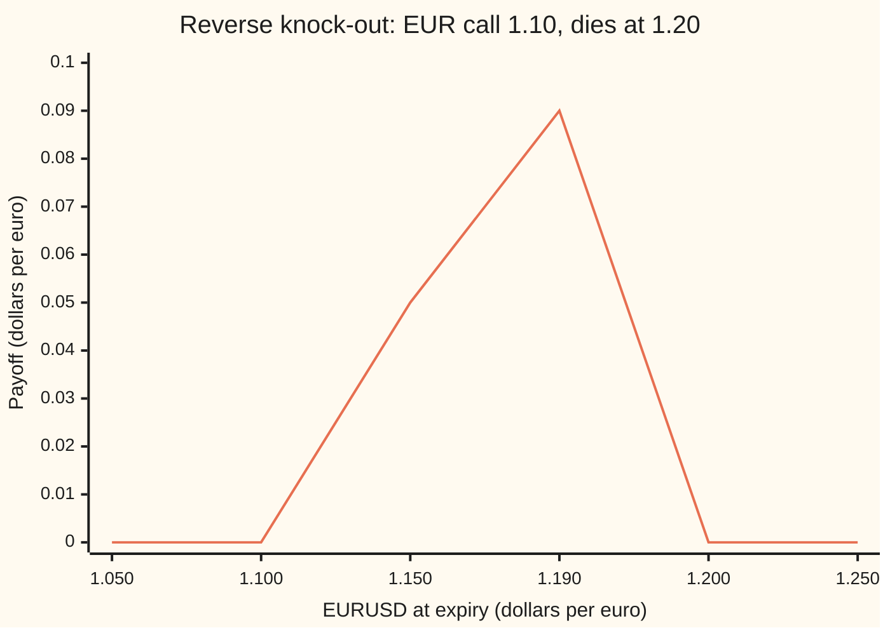
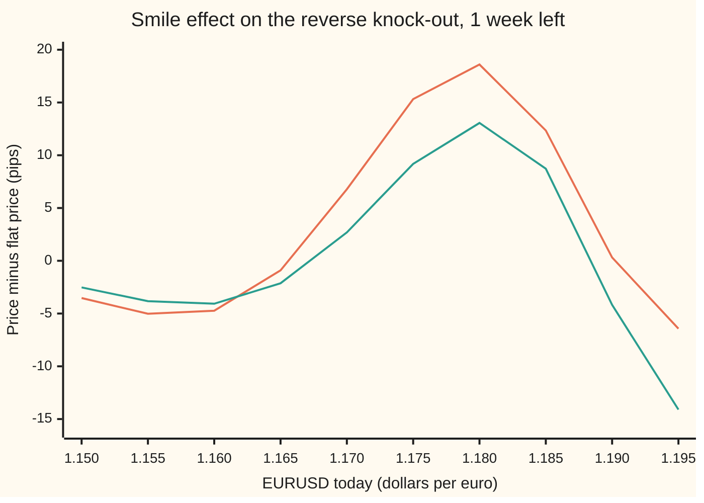

# Barriers on a smile: vanna-volga weighted by the chance of survival, and where it stops being enough

[Syllabus](../../../SYLLABUS.md) → [Financial mathematics](../README.md) → [FX exotics as desks use them - digitals, touches and barriers](../README.md#s23) → Barriers on a smile

---

## General Overview

EURUSD trades at 1.10: one euro costs 1.10 dollars. A US company that owes a bill in euros a year from now buys the right to buy those euros at 1.10, and to make the premium cheaper it accepts a condition. The contract is a one-year euro call struck at 1.10 that dies the moment EURUSD trades at 1.20. At expiry it pays EURUSD minus 1.10, per euro, but only if 1.20 never traded in the year. The wall sits where the option is already worth 10 cents, so the payoff climbs toward the wall and then drops to nothing. That shape is a **reverse knock-out**: the barrier sits where the option is in the money ([The eight single barriers in one table](03-the-eight-barrier-types.md)).

With one volatility for everything, 10%, the reflection formula prices it at 54.40 pips ([Knock-out and knock-in](02-barrier-options-by-reflection.md)). A **pip** is 0.0001 dollars per euro, the last quoted digit of EURUSD. The market does not quote one volatility. It quotes a **smile**: three volatilities for three standard strikes, here 10.75% for the 25-delta euro put, 10% at the money and 9.75% for the 25-delta euro call. A "25-delta" option is one whose hedge is a quarter of a euro per euro of contract, so it sits well out of the money on one side.

Desks price the smile into a barrier with a recipe. Take the vanna-volga overlay ([Vanna-volga pricing](../22-The%20FX%20smile%20-%20risk%20reversals%2C%20butterflies%20and%20vanna-volga/04-vanna-volga-pricing.md)): the extra cost, at market prices, of hedging the barrier's volatility risks with those three options. Then multiply it by the chance that the barrier survives, because a dead option needs no hedge. On the house contract the flat price is 54.40 pips, the full overlay adds 17.22, the weighted overlay adds 9.72, and the recipe says 64.12. A model that reproduces the same three quotes exactly, and lets volatility depend on where EURUSD is, says 66.03. Close. A week before expiry, with EURUSD at 1.19, one cent from the wall, the recipe adds 0.31 pips and the model takes away 4.18. Wrong sign.

**The survival-weighted overlay charges a knock-out for smile risk only in proportion to the chance it lives to need the hedge; it lands within two pips of a smile-consistent model on a young reverse knock-out and gets the sign wrong near the wall with days left, where only a model of how volatility moves with spot will do.**

**What kind of fact this is:** an approximation, a desk recipe with no model behind it; its error is stated on this card against a local-volatility model fitted to the same three quotes: 1.91 pips low on the house contract, 4.49 pips high a week from expiry.

### The picture: what the contract pays

The payoff at expiry, dollars per euro, if 1.20 never traded:



One line: the payoff. It rises one for one above the strike and drops to zero at the wall. A path that touched 1.20 on the way pays nothing, wherever it ends.

---

## The formula

$$V_{\text{VV}} \;=\; V_{\text{flat}} \;+\; p_{\text{surv}} \sum_{i=1}^{3} x_i \left(C_i^{\text{mkt}} - C_i^{\text{flat}}\right)$$

**Read it aloud:** the smile price is the one-volatility price, plus the market's extra charge for a three-option hedge of the barrier's volatility risks, scaled down by the chance the barrier is never touched.

The sum with $x_i$ inside is the overlay of the vanna-volga card, unchanged. The only new piece is $p_{\text{surv}}$ in front.

| Symbol | Plain meaning | In our example | Push it up and the answer… |
| --- | --- | --- | --- |
| $S$ | EURUSD today, dollars per euro | 1.10 (1.19 in the week case) | climbs toward the wall, then collapses to 0 at 1.20 |
| $K$ | the strike | 1.10 | falls: less to receive |
| $H$ | the wall, the knock-out level | 1.20 | rises: more room to pay out; at 1.25 the flat price is 165.90 pips |
| $T$ | years left to expiry | 1 (7/365 in the week case) | depends on spot: more time means more payoff and more knock-outs |
| $\sigma$ | the one flat volatility, the at-the-money quote | 10% | falls: vega is −0.124128 per 1.00 of volatility, so more wiggle kills more paths |
| $r_d$, $r_f$ | dollar and euro interest rates, continuously compounded | 5%, 3% | the gap sets the forward drift of EURUSD |
| $V_{\text{flat}}$ | the price with one volatility, by reflection | 54.40 pips | |
| $x_i$ | hedge weights: how many of each pillar option match the barrier's vega, vanna and volga | 1.080824, −2.120324, 1.194190 | |
| $C_i^{\text{mkt}} - C_i^{\text{flat}}$ | a pillar's market price minus its flat price: the smile's charge for that option | 25.51, 0, −8.67 pips | |
| $p_{\text{surv}}$ | the chance, in the pricing world, that EURUSD never trades at 1.20 before expiry | 0.564550 | more of the overlay is kept |
| $\mu$ | drift of log EURUSD in the pricing world, $r_d - r_f - \tfrac12\sigma^2$ | 5% − 3% − half of 10% squared | |
| $N$ | the bell-curve area to the left of a point | | |

The three greeks are the pilot's. **Vega** is the price change per unit of volatility. **Vanna** is how vega changes as spot moves. **Volga** is how vega changes as volatility moves ([Greeks at the wall](06-barrier-and-touch-greeks.md)).

The survival chance comes from the reflection argument of the touch card ([One-touch and no-touch](04-fx-one-touch-and-no-touch.md)):

$$p_{\text{surv}} = N\!\left(\frac{\ln(H/S) - \mu T}{\sigma\sqrt{T}}\right) - \left(\frac{H}{S}\right)^{2\mu/\sigma^2} N\!\left(\frac{-\ln(H/S) - \mu T}{\sigma\sqrt{T}}\right)$$

In words: the chance of ending below the wall, minus the chance of ending below it after touching it, which reflection turns into a chance about a mirrored start.

The weights solve three equations, one per risk:

$$\sum_{i=1}^{3} x_i \,\text{vega}_i = \text{vega}_{\text{KO}}, \qquad \sum_{i=1}^{3} x_i \,\text{vanna}_i = \text{vanna}_{\text{KO}}, \qquad \sum_{i=1}^{3} x_i \,\text{volga}_i = \text{volga}_{\text{KO}}$$

In words: hold enough of each pillar option that the basket carries exactly the knock-out's vega, vanna and volga, every greek taken at the flat 10%.

### When it holds

- **Knock-outs come early, if they come.** The weight treats the hedge as all-or-nothing at expiry. A knock-out that dies in week fifty held its hedge for almost the whole year, yet the weight charges it nothing. When touches cluster late, the weighted overlay understates the charge.
- **The barrier's greeks are smooth over the move that matters.** Far from the wall the knock-out's vanna and volga change slowly, and a second-order hedge is a fair picture. One cent from the wall with a week left, the week case's vanna is 25.906973 and the weights run to −27.09: the overlay becomes a small difference of large numbers.
- **The smile stays put as spot moves.** The overlay prices the hedge at today's quotes. A reverse knock-out's value lives just below the wall, and three quotes at today's spot do not say what volatility will be there when spot arrives.
- **Only the three quoted risks matter.** Third-order effects and the smile's path over time are ignored. With no model behind it, the recipe has no error bound; the only check is a model.

---

## Why it works

### Step 0: the smile is a price list for three risks

A flat price ignores what the market charges for three risks: a parallel shift in volatility (vega), a volatility change that comes with spot moves (vanna), and a change in the smile's curvature (volga). The three pillar options carry those risks in known amounts. Buy the mix of pillars that carries exactly the barrier's three risks; what that mix costs at market minus what it costs at flat volatility is the market's price for the barrier's smile exposure. That is the overlay of the vanna-volga card: 17.22 pips here.

### Step 1: a hedge on a dead option is wasted money

The overlay assumes the three-pillar hedge is held for the whole year. A knock-out stops existing when EURUSD touches 1.20. Its vega, vanna and volga drop to zero, the hedge is unwound, and the smile premium paid for the rest of the year buys nothing. The full overlay charges for risk the option carries only while alive.

The simplest fix scales the charge by the chance the option is still alive at the end: $p_{\text{surv}}$ = 0.564550. The overlay falls from 17.22 to 9.72 pips and the price from 71.62 to 64.12. The fix is a rule of thumb. It is not derived from any equation, and other versions weight by the expected fraction of the life survived instead. Its only justification is that it matches models on the contracts desks trade most.

### Step 2: a model to judge the recipe by

A judge must reproduce the same three quotes and then price the barrier with its own dynamics. The card uses **local volatility**: volatility becomes a function of where EURUSD is, $\sigma(S)$, chosen so that the three pillar options price exactly at their quotes ([Dupire local volatility](../13-Local%20volatility%20and%20jumps/01-dupire-local-volatility.md)). The full Dupire construction reads a whole surface across strikes and dates. Here only one date is quoted, so the card fits the smallest version: with the letter y for the log of EURUSD over today's spot, $\sigma(y) = a + b\,y + c\,y^2$, three numbers for three quotes, found by Newton's method. On the house contract a = 0.099672, b = −0.196188, c = 1.573968. The negative b makes volatility higher when the euro is lower, which is how the market's expensive euro puts show up in a model.

In that model the barrier is priced two ways that share nothing but the inputs. A finite-difference grid (a lattice in log spot and time on which the pricing equation is stepped back from expiry) puts the wall on the grid's top edge with value zero. A Monte Carlo simulation (many random paths averaged) steps EURUSD forward and, between steps, multiplies each path's weight by the chance it did not cross the wall unseen.

<details>
<summary>Detailed proof: the chance a path crosses the wall between two steps</summary>

Between two checks a time $\Delta t$ apart, EURUSD moves from $S$ to a new level $S'$, both below the wall $H$. In logs, the path starts $\ln(H/S)$ below the log wall and ends $\ln(H/S')$ below it. Over so short a step the drift is negligible next to the noise, so the path between the two ends is a Brownian bridge: a random path pinned at both ends, with variance rate $\sigma^2$.

1. A free path between those ends moved $\ln(H/S) - \ln(H/S')$ in log terms. Its density is proportional to $\exp\!\big(-[\ln(H/S) - \ln(H/S')]^2/(2\sigma^2\Delta t)\big)$.
2. Reflection: every path that touches the wall and ends $\ln(H/S')$ below it matches, one for one, a path that ends $\ln(H/S')$ above it. Flip the part after the first touch.
3. That mirrored path moved $\ln(H/S) + \ln(H/S')$, so its density is proportional to $\exp\!\big(-[\ln(H/S) + \ln(H/S')]^2/(2\sigma^2\Delta t)\big)$.
4. Divide step 3 by step 1. The difference of the two squares is $4\ln(H/S)\ln(H/S')$, so the chance of touching, given both ends, is $\exp\!\big(-2\ln(H/S)\ln(H/S')/(\sigma^2\Delta t)\big)$.

The simulation multiplies each path's weight by one minus that, step by step, using the local volatility at the step's start. Without the product it would check the wall only at the steps and overprice every knock-out.

</details>

### Step 3: the recipe, judged on the house contract

The model's smile effect, local volatility minus flat, is 11.63 pips by the grid and 11.22 by simulation, with a standard error of 0.39 (the simulation's own noise). The model price is 66.03 pips. The survival-weighted recipe, 64.12, is 1.91 pips low. The unweighted overlay, 71.62, is 5.59 pips high.

### Step 4: why it breaks a week from the wall

With seven days left and EURUSD at 1.19, the three pillars crowd into a band about two cents wide: 1.178701, 1.190571, 1.201450. The 25-delta call strike sits just past the wall, as it did with a year left. The knock-out's vanna is 25.906973, and the weights that match it are 6.886905, −27.090903 and 19.674034. The overlay is a small balance of large opposing trades, 0.70 pips. Scaled by survival, 0.447488, it adds 0.31.

The model disagrees in sign: 4.18 pips cheaper than flat by the grid, 3.99 by simulation, standard error 0.60. What the model sees and the recipe cannot is the volatility inside the last cent below the wall. That volatility decides how often paths touch 1.20 before expiry; a hedge priced from three options at today's spot has no view on it. The recipe's error, 4.49 pips, is larger than the whole smile effect it was meant to price.

The other road is to skip the recipe and use a model with dynamics for volatility itself, stochastic volatility ([The Heston model](../14-Stochastic%20volatility%20-%20Heston%2C%20SABR%20and%20their%20mix/01-heston-model.md)). A Heston model fitted to the same three quotes gives a different barrier price again, because local and stochastic volatility agree on today's vanillas and disagree on tomorrow's smile. Desks blend the two for exactly this product.

---

## Worked numbers, by hand

House FX market: $S$ = 1.10, $K$ = 1.10, $H$ = 1.20, $r_d$ = 5%, $r_f$ = 3%, flat $\sigma$ = 10%, $T$ = 1 year, smile 10.75% / 10% / 9.75%.

| Step | Arithmetic | Value |
| --- | --- | --- |
| pillar strikes, from the 25-delta and at-the-money rules | 25-delta put, at the money, 25-delta call | 1.052466, 1.127847, 1.201425 |
| flat knock-out price | reflection formula at 10% | 54.40 pips |
| smile charge per pillar | market price minus flat price | 25.51, 0, −8.67 pips |
| knock-out's greeks at 10% | vega, vanna, volga by bumps | −0.124128, 0.001461, 3.409950 |
| hedge weights | solve the three equations | 1.080824, −2.120324, 1.194190 |
| overlay | 1.080824 × 25.51 + 1.194190 × (−8.67) | 17.22 pips |
| survival chance | reflection formula for the touch | 0.564550 |
| weighted overlay | 0.564550 × 17.22 | 9.72 pips |
| **recipe price** | 54.40 + 9.72 | **64.12 pips** |
| model price, local volatility | 54.40 + 11.63 by the grid | 66.03 pips |

The euro put is expensive (10.75% against 10%), the euro call cheap. The knock-out is long volga (3.409950), so the hedge holds both wings, and the expensive put wing dominates. Its vanna at spot, 0.001461, is almost zero, so the tilt of the smile barely matters here.

The greeks behind the overlay, per 1.00 of volatility (vanna also per 1.00 of spot):

| Case | vega | vanna | volga | weights: put, at the money, call |
| --- | --- | --- | --- | --- |
| house, 1 year, spot 1.10 | −0.124128 | 0.001461 | 3.409950 | 1.080824, −2.120324, 1.194190 |
| 1 week left, spot 1.19 | −0.389870 | 25.906973 | 6.378283 | 6.886905, −27.090903, 19.674034 |

**Conventions verified 2026-09-27:** EURUSD pillars use spot delta with the premium in dollars (no premium adjustment) up to one year, at the money is the delta-neutral straddle, and a pip is 0.0001; the same house conventions as [Vanna-volga pricing](../22-The%20FX%20smile%20-%20risk%20reversals%2C%20butterflies%20and%20vanna-volga/04-vanna-volga-pricing.md), whose pillar strikes this card reproduces.

### What breaks if you drop a piece

Correct recipe 64.12 pips; model 66.03.

| Mistake | Comes out at | What went wrong |
| --- | --- | --- |
| No survival weight | 71.62 pips | charges for a hedge held after the option died |
| Weight by the touch chance | 61.90 pips | charges least for the options most likely to live |
| Flat price at the 25-delta call's 9.75%, "the volatility near the wall" | 57.62 pips | one volatility cannot be right for both the strike and the wall |
| Flat price at the 25-delta put's 10.75% | 45.99 pips | same mistake from the other wing, now far too low |

---

## How the gap moves as the wall and the clock close in

The contract did nothing; the calendar and the spot did. With a year left the recipe was 1.91 pips off. With a week left the error depends sharply on where EURUSD sits. The week case at 1.19:

| | Flat | Recipe | Local-volatility model |
| --- | --- | --- | --- |
| Price, pips | 350.12 | 350.43 | 345.94 |
| Smile effect, pips | | +0.31 | −4.18 (simulation −3.99, standard error 0.60) |
| Survival chance | 0.447488 | | |

The flat price has grown from 54.40 to 350.12 pips: with spot at 1.19 the option is nine cents in the money, and a week leaves little time to touch 1.20.

Year-case prices side by side, in pips:

```
house contract, 1 year, spot 1.10   price in pips
  flat, 10%            ████████████████████████████████████             54.40
  recipe, VV x surv    ███████████████████████████████████████████      64.12
  local vol model      ████████████████████████████████████████████     66.03
  VV, no weight        ████████████████████████████████████████████████ 71.62
```

Now slide spot from 1.150 to 1.195 with a week left, refitting the model to the same three quotes at each spot, as a desk refits each morning:



Orange: the survival-weighted recipe minus flat. Green: the local-volatility model minus flat. Away from the wall the two mostly share a sign and the recipe runs larger, 18.60 against 13.06 at 1.180. In the last cent they part: at 1.190 the signs differ, and at 1.195 the recipe catches less than half the effect, −6.43 against −14.10. The flat prices in the same sweep run from 501.70 pips at 1.150 through a peak of 633.67 at 1.170 down to 183.83 at 1.195.

This is the plain statement the recipe cannot make about itself: a reverse knock-out close to its wall needs a model of how volatility behaves at the wall, local or stochastic, not a correction computed from today's three quotes.

---

## Code, from first principles, and it actually runs

The script prices the house reverse knock-out and the week case by the flat reflection formula, the full and survival-weighted overlays, and a local-volatility model fitted to the three quotes. The smile effect in the model is reached by two independent roads: an implicit-then-Crank-Nicolson finite-difference grid, and a Monte Carlo that runs flat and smile paths on the same random draws with a Brownian-bridge crossing correction. The flat price itself is reached by formula and by grid. The normal curve area is a hand-written series, the inverse a bisection, the 3-by-3 system Cramer's rule, the random numbers splitmix64 with Box-Muller. Seven asserts: grid against formula, simulation against grid, survival chance against a grid pricing of the no-touch, the overlay repricing its own 25-delta call pillar, the fitted model repricing all three quotes on the grid and the 25-delta put by simulation, and the sign split a week out.

### Python

```python
# Barriers on a smile -- the check behind the card.  Standard library only.
# House EURUSD reverse knock-out: EUR call, strike 1.10, knocked out at 1.20.
# Roads: reflection formula, finite-difference PDE, Monte Carlo on the same draws.
from math import exp, log, sqrt, pi, cos
RD, RF, K, H, ATM, PIP = 0.05, 0.03, 1.10, 1.20, 0.10, 1e-4
SMILE = (0.1075, 0.10, 0.0975)                   # 25-delta put, ATM, 25-delta call vols

def phi(x): return exp(-0.5 * x * x) / sqrt(2 * pi)
def N(x):                                         # bell-curve area: series for the integral
    if abs(x) > 9: return 1.0 if x > 0 else 0.0
    s = t = x; n = 1
    while abs(t) > 1e-17 * abs(s): t *= x * x / (2 * n + 1); s += t; n += 1
    return 0.5 + phi(x) * s
def Ninv(p, lo=-9.0, hi=9.0):                     # bisection root finder
    for _ in range(80):
        m = 0.5 * (lo + hi); lo, hi = (m, hi) if N(m) < p else (lo, m)
    return 0.5 * (lo + hi)
def gk(S, k, T, v, w=1):                          # Garman-Kohlhagen call (w=1) or put (w=-1)
    d1 = (log(S / k) + (RD - RF + 0.5 * v * v) * T) / (v * sqrt(T)); d2 = d1 - v * sqrt(T)
    return w * (S * exp(-RF * T) * N(w * d1) - k * exp(-RD * T) * N(w * d2))
def dig(S, k, T, v): return exp(-RD * T) * N((log(S / k) + (RD - RF - 0.5 * v * v) * T) / (v * sqrt(T)))
def uoc(S, T, v, h=H):                            # road 1: reflection formula
    g = lambda s: gk(s, K, T, v) - gk(s, h, T, v) - (h - K) * dig(s, h, T, v)
    return g(S) - (h / S) ** (2 * (RD - RF) / (v * v) - 1) * g(h * h / S)
def surv(S, T, v, h=H):                           # chance the wall is never touched
    mu, a = RD - RF - 0.5 * v * v, log(h / S)
    return N((a - mu * T) / (v * sqrt(T))) - exp(2 * mu * a / (v * v)) * N((-a - mu * T) / (v * sqrt(T)))
def pillars(S, T, vols):                          # strikes of 25-put, ATM, 25-call (spot delta)
    vp, va, vc = vols; d = Ninv(0.25 * exp(RF * T)); m = (RD - RF) * T
    return [(S * exp(d * vp * sqrt(T) + m + 0.5 * vp * vp * T), vp, -1),
            (S * exp(m + 0.5 * va * va * T), va, 1),
            (S * exp(-d * vc * sqrt(T) + m + 0.5 * vc * vc * T), vc, 1)]
def vvv(f, S, v, e=1e-4):                         # vega, vanna, volga by central bumps
    return ((f(S, v + e) - f(S, v - e)) / (2 * e), (f(S + e, v + e) - f(S + e, v - e) - f(S - e, v + e)
            + f(S - e, v - e)) / (4 * e * e), (f(S, v + e) - 2 * f(S, v) + f(S, v - e)) / (e * e))
def solve3(A, b):                                 # Cramer's rule
    det = lambda m: (m[0][0] * (m[1][1] * m[2][2] - m[1][2] * m[2][1]) - m[0][1] * (m[1][0] * m[2][2]
                     - m[1][2] * m[2][0]) + m[0][2] * (m[1][0] * m[2][1] - m[1][1] * m[2][0]))
    return [det([[b[i] if j == c else A[i][j] for j in range(3)] for i in range(3)]) / det(A) for c in range(3)]
def overlay(f, S, T, pil):                        # vanna-volga: hedge weights x, cost of the hedge
    cols = [vvv(lambda s, v, k=k, w=w: gk(s, k, T, v, w), S, ATM) for k, _, w in pil]
    x = solve3([[cols[j][i] for j in range(3)] for i in range(3)], vvv(f, S, ATM))
    return x, sum(x[j] * (gk(S, k, T, v, w) - gk(S, k, T, ATM, w)) for j, (k, v, w) in enumerate(pil))

def pde(S, T, lv, pay, h=None, nx=300, nt=150):   # road 2: implicit-then-Crank-Nicolson, log spot
    L = 0.8 * sqrt(T) + 0.05; x0 = -L; x1 = log(h / S) if h else L; dx = (x1 - x0) / nx; dt = T / nt
    xs = [x0 + i * dx for i in range(nx + 1)]; V = [pay(S * exp(x)) for x in xs]
    if h: V[nx] = 0.0
    s2 = [lv(x) ** 2 for x in xs]
    lo_ = [0.5 * q / dx / dx - 0.5 * (RD - RF - 0.5 * q) / dx for q in s2]
    up_ = [0.5 * q / dx / dx + 0.5 * (RD - RF - 0.5 * q) / dx for q in s2]
    di_ = [-q / dx / dx - RD for q in s2]
    for n in range(nt):
        th = 1.0 if n < 2 else 0.5; e = (1 - th) * dt; bl = V[0] * exp(-RD * dt); bh = 0.0 if h else V[nx] * exp(-RD * dt)
        cp = [0.0] * (nx + 1); dp = [0.0] * (nx + 1); cp[0], dp[0] = 0.0, bl
        for i in range(1, nx):
            r = V[i] + e * (lo_[i] * V[i - 1] + di_[i] * V[i] + up_[i] * V[i + 1])
            a, b, c = -th * dt * lo_[i], 1 - th * dt * di_[i], -th * dt * up_[i]
            m = b - a * cp[i - 1]; cp[i] = c / m; dp[i] = (r - a * dp[i - 1]) / m
        V[nx] = bh
        for i in range(nx - 1, 0, -1): V[i] = dp[i] - cp[i] * V[i + 1]
        V[0] = bl
    i = int(-x0 / dx); w = -xs[i] / dx
    return V[i] * (1 - w) + V[i + 1] * w
def lvf(p): return lambda x: min(max(p[0] + p[1] * x + p[2] * x * x, 0.02), 0.6)
def calib(S, T, pil):                             # fit a + b x + c x^2 so the PDE hits all three quotes
    tgt = [(gk(S, k, T, v, w), vvv(lambda s, u: gk(s, k, T, u, w), S, v)[0]) for k, v, w in pil]
    res = lambda p: [(pde(S, T, lvf(p), lambda s, k=k, w=w: max(w * (s - k), 0.0)) - tgt[j][0]) / tgt[j][1]
                     for j, (k, v, w) in enumerate(pil)]
    p = [ATM, 0.0, 0.0]; r = res(p); J = [[0.0] * 3 for _ in range(3)]
    for j in range(3):
        q = p[:]; q[j] += 1e-3; rq = res(q)
        for i in range(3): J[i][j] = (rq[i] - r[i]) / 1e-3
    for _ in range(5):                            # chord Newton: one Jacobian, reused
        d = solve3(J, [-u for u in r]); p = [p[i] + d[i] for i in range(3)]; r = res(p)
    return p, max(abs(u) for u in r)
M64 = (1 << 64) - 1
def rng(seed):                                    # splitmix64 uniforms in (0, 1]
    while True:
        seed = (seed + 0x9E3779B97F4A7C15) & M64; z = seed
        z = ((z ^ (z >> 30)) * 0xBF58476D1CE4E5B9) & M64; z = ((z ^ (z >> 27)) * 0x94D049BB133111EB) & M64
        yield (((z ^ (z >> 31)) >> 11) + 1) / 9007199254740992.0
def mc(S, T, lv, pay, n, steps, h=H):             # road 3: flat and smile paths on the same draws
    g = rng(7); dt = T / steps; b = log(h / S); s1 = s2 = 0.0
    for _ in range(n):
        xa = xb = 0.0; wa = wb = 1.0
        for _ in range(steps):
            z = sqrt(-2 * log(next(g))) * cos(2 * pi * next(g)); out = []
            for x, v in ((xa, ATM), (xb, lv(xb))):         # Euler step, then Brownian-bridge survival
                y = x + (RD - RF - 0.5 * v * v) * dt + v * sqrt(dt) * z
                out.append((y, 0.0 if y >= b else 1 - exp(-2 * (b - x) * (b - y) / (v * v * dt))))
            (xa, ka), (xb, kb) = out; wa *= ka; wb *= kb
        d = wb * pay(S * exp(xb)) - wa * pay(S * exp(xa)); s1 += d; s2 += d * d
    m = s1 / n; return exp(-RD * T) * m, exp(-RD * T) * sqrt((s2 / n - m * m) / n)

call = lambda s: max(s - K, 0.0)
def case(S, T, tag, n, steps):
    pil = pillars(S, T, SMILE); flat = uoc(S, T, ATM); ps = surv(S, T, ATM); f = lambda s, v: uoc(s, T, v)
    x, ov = overlay(f, S, T, pil); p, fit = calib(S, T, pil); lv = lvf(p)
    pf = pde(S, T, lambda y: ATM, call, H); d = pde(S, T, lv, call, H) - pf; dm, se = mc(S, T, lv, call, n, steps)
    rows = [("pillar strikes 25P ATM 25C", [k for k, _, _ in pil]), ("barrier vega vanna volga", vvv(f, S, ATM)),
            ("hedge weights x", x), ("local vol a b c", p), ("flat: formula, PDE, pips", [flat / PIP, pf / PIP]),
            ("pillar cost mkt - flat, pips", [(gk(S, k, T, v, w) - gk(S, k, T, ATM, w)) / PIP for k, v, w in pil]),
            ("survival chance, touch chance", [ps, 1 - ps]), ("overlay: full, x survival, pips", [ov / PIP, ps * ov / PIP]),
            ("VV: unweighted, x survival, pips", [(flat + ov) / PIP, (flat + ps * ov) / PIP]), ("local vol: flat + PDE gap, pips", [(flat + d) / PIP]),
            ("smile gap: PDE, MC, s.e., pips", [d / PIP, dm / PIP, se / PIP]), ("VV minus local vol: full, x surv", [(ov - d) / PIP, (ps * ov - d) / PIP])]
    print(tag)
    for lab, vals in rows: print(f"  {lab:<32}" + "".join(f"{v:>12.6f}" for v in vals))
    return flat, ps, ov, d, pf, pil, lv, fit, dm, se

flat, ps, ov, d, pf, pil, lv, fit, dm, se = case(1.10, 1.0, "house reverse knock-out, 1 year, spot 1.10", 20000, 200)
W = 7 / 365
wf, wps, wov, wd, wpf, *_, wdm, wse = case(1.19, W, "same contract, 1 week left, spot 1.19", 20000, 200)
print("1 week left: spot, flat, VV x survival - flat, local vol - flat (pips)")
for s in [1.15 + 0.005 * i for i in range(10)]:
    ps_ = pillars(s, W, SMILE); _, o = overlay(lambda q, v: uoc(q, W, v), s, W, ps_); p_s, _ = calib(s, W, ps_)
    g = pde(s, W, lvf(p_s), call, H) - pde(s, W, lambda y: ATM, call, H)
    print(f"  {s:.3f} {uoc(s, W, ATM) / PIP:9.2f} {surv(s, W, ATM) * o / PIP:9.2f} {g / PIP:9.2f}")
print("payoff at expiry if 1.20 never traded: " + " ".join(f"{s:.3f}:{call(s) if s < H else 0.0:.3f}" for s in (1.05, 1.10, 1.15, 1.19, 1.20, 1.25)))
nt_pde = pde(1.10, 1.0, lambda y: ATM, lambda s: 1.0, H) * exp(RD)          # survival chance by PDE
k3, v3, _ = pil[2]; _, o3 = overlay(lambda s, v: gk(s, k3, 1.0, v), 1.10, 1.0, pil)
kp, vp, _ = pil[0]; pm, pse = mc(1.10, 1.0, lv, lambda s: max(kp - s, 0.0), 20000, 200, 1e9)
extra = [("wrong: weight by touch chance", (flat + (1 - ps) * ov) / PIP), ("wrong: flat at 25C vol 9.75%", uoc(1.10, 1.0, 0.0975) / PIP),
         ("wrong: flat at 25P vol 10.75%", uoc(1.10, 1.0, 0.1075) / PIP)]
for lab, vv_ in (("try: risk reversal mirrored", (0.0975, 0.10, 0.1075)), ("try: butterfly zero", (0.105, 0.10, 0.095))):
    _, o = overlay(lambda s, v: uoc(s, 1.0, v), 1.10, 1.0, pillars(1.10, 1.0, vv_)); extra.append((lab + ", VVxS", (flat + ps * o) / PIP))
_, o = overlay(lambda s, v: uoc(s, 1.0, v, 1.25), 1.10, 1.0, pil); f25, s25 = uoc(1.10, 1.0, ATM, 1.25), surv(1.10, 1.0, ATM, 1.25)
extra += [("try: wall 1.25, flat", f25 / PIP), ("try: wall 1.25, VV x survival", (f25 + s25 * o) / PIP),
          ("try: wall 1.25, local vol PDE", (f25 + pde(1.10, 1.0, lv, call, 1.25) - pde(1.10, 1.0, lambda y: ATM, call, 1.25)) / PIP)]
extra += [("check: survival by PDE", nt_pde), ("check: 25C via overlay", gk(1.10, k3, 1.0, ATM) + o3), ("  market 25C at 9.75%", gk(1.10, k3, 1.0, v3)),
          ("check: 25P smile-flat MC, s.e., pips", pm / PIP), ("  s.e.", pse / PIP), ("  market - flat, pips", (gk(1.10, kp, 1.0, vp, -1) - gk(1.10, kp, 1.0, ATM, -1)) / PIP)]
for lab, v in extra: print(f"{lab:<38}{v:>12.6f}")
assert abs(pf - flat) < 0.5 * PIP and abs(wpf - wf) < 0.5 * PIP, "PDE road vs reflection formula"
assert abs(dm - d) < 3 * se and abs(wdm - wd) < 3 * wse, "Monte Carlo smile gap vs PDE smile gap"
assert abs(nt_pde - ps) < 1e-3, "survival chance: closed form vs PDE"
assert abs(gk(1.10, k3, 1.0, ATM) + o3 - gk(1.10, k3, 1.0, v3)) < 1e-9, "overlay reprices its own pillar"
assert abs(pm - (gk(1.10, kp, 1.0, vp, -1) - gk(1.10, kp, 1.0, ATM, -1))) < 3 * pse, "local vol MC reprices the 25P quote"
assert fit < 1e-6, "local vol reprices all three quotes on the grid"
assert wd < 0 < wps * wov, "a week out the recipe and the model disagree in sign"
print("ALL CHECKS PASS")
```

**Ran 2026-09-27 on macOS, Python 3.14.6, standard library only. All checks passed. Output, pasted from the run:**

```
house reverse knock-out, 1 year, spot 1.10
  pillar strikes 25P ATM 25C          1.052466    1.127847    1.201425
  barrier vega vanna volga           -0.124128    0.001461    3.409950
  hedge weights x                     1.080824   -2.120324    1.194190
  local vol a b c                     0.099672   -0.196188    1.573968
  flat: formula, PDE, pips           54.403129   54.368767
  pillar cost mkt - flat, pips       25.505842    0.000000   -8.667845
  survival chance, touch chance       0.564550    0.435450
  overlay: full, x survival, pips    17.216267    9.719442
  VV: unweighted, x survival, pips   71.619396   64.122571
  local vol: flat + PDE gap, pips    66.033331
  smile gap: PDE, MC, s.e., pips     11.630203   11.220079    0.386244
  VV minus local vol: full, x surv    5.586064   -1.910760
same contract, 1 week left, spot 1.19
  pillar strikes 25P ATM 25C          1.178701    1.190571    1.201450
  barrier vega vanna volga           -0.389870   25.906973    6.378283
  hedge weights x                     6.886905  -27.090903   19.674034
  local vol a b c                     0.097908   -1.047469   77.709699
  flat: formula, PDE, pips          350.117971  350.103412
  pillar cost mkt - flat, pips        3.861901    0.000000   -1.316474
  survival chance, touch chance       0.447488    0.552512
  overlay: full, x survival, pips     0.696193    0.311538
  VV: unweighted, x survival, pips  350.814164  350.429509
  local vol: flat + PDE gap, pips   345.936863
  smile gap: PDE, MC, s.e., pips     -4.181108   -3.994241    0.597247
  VV minus local vol: full, x surv    4.877301    4.492646
1 week left: spot, flat, VV x survival - flat, local vol - flat (pips)
  1.150    501.70     -3.53     -2.52
  1.155    547.79     -5.02     -3.83
  1.160    588.76     -4.73     -4.07
  1.165    619.80     -0.91     -2.13
  1.170    633.67      6.78      2.69
  1.175    621.16     15.32      9.18
  1.180    572.94     18.60     13.06
  1.185    482.62     12.35      8.73
  1.190    350.12      0.31     -4.18
  1.195    183.83     -6.43    -14.10
payoff at expiry if 1.20 never traded: 1.050:0.000 1.100:0.000 1.150:0.050 1.190:0.090 1.200:0.000 1.250:0.000
wrong: weight by touch chance            61.899954
wrong: flat at 25C vol 9.75%             57.615538
wrong: flat at 25P vol 10.75%            45.985446
try: risk reversal mirrored, VVxS        64.771711
try: butterfly zero, VVxS                52.935645
try: wall 1.25, flat                    165.897074
try: wall 1.25, VV x survival           196.670293
try: wall 1.25, local vol PDE           192.252339
check: survival by PDE                    0.564548
check: 25C via overlay                    0.015390
  market 25C at 9.75%                     0.015390
check: 25P smile-flat MC, s.e., pips     26.775140
  s.e.                                    1.482241
  market - flat, pips                    25.505842
ALL CHECKS PASS
```

The flat price by grid is 54.37 pips against the formula's 54.40 on the house contract; the grid's error cancels in the smile effect, which takes the difference of two grids built the same way. The simulation's smile effect sits within about one standard error of the grid's in both cases. The overlay returns the 25-delta call's market price, 0.015390, to nine decimals, and the fitted model's 25-delta put, 26.78 pips over flat by simulation with standard error 1.48, is within one standard error of the market's 25.51.

### Rust

The same checks, the same inputs and the same random numbers. No crates.

```rust
// Barriers on a smile -- the same check in Rust, std only, no crates.
// Compile: rustc --edition 2021 -O barriers_with_the_smile_check.rs -o /tmp/bws_check
// House EURUSD reverse knock-out: EUR call, strike 1.10, knocked out at 1.20.
// Roads: reflection formula, finite-difference PDE, Monte Carlo on the same draws.
use std::f64::consts::PI;
const RD: f64 = 0.05; const RF: f64 = 0.03; const K: f64 = 1.10; const H: f64 = 1.20;
const ATM: f64 = 0.10; const PIP: f64 = 1e-4; const SMILE: [f64; 3] = [0.1075, 0.10, 0.0975];
type P = (f64, f64, f64); // pillar: strike, vol, +1 call / -1 put

fn phi(x: f64) -> f64 { (-0.5 * x * x).exp() / (2.0 * PI).sqrt() }
fn n_cdf(x: f64) -> f64 { // bell-curve area: series for the integral
    if x.abs() > 9.0 { return if x > 0.0 { 1.0 } else { 0.0 }; }
    let (mut s, mut t, mut n) = (x, x, 1.0);
    while t.abs() > 1e-17 * s.abs() { t *= x * x / (2.0 * n + 1.0); s += t; n += 1.0; }
    0.5 + phi(x) * s
}
fn n_inv(p: f64) -> f64 { // bisection root finder
    let (mut lo, mut hi) = (-9.0, 9.0);
    for _ in 0..80 { let m = 0.5 * (lo + hi); if n_cdf(m) < p { lo = m } else { hi = m } }
    0.5 * (lo + hi)
}
fn gk(s: f64, k: f64, t: f64, v: f64, w: f64) -> f64 { // Garman-Kohlhagen call or put
    let d1 = ((s / k).ln() + (RD - RF + 0.5 * v * v) * t) / (v * t.sqrt()); let d2 = d1 - v * t.sqrt();
    w * (s * (-RF * t).exp() * n_cdf(w * d1) - k * (-RD * t).exp() * n_cdf(w * d2))
}
fn dig(s: f64, k: f64, t: f64, v: f64) -> f64 { (-RD * t).exp() * n_cdf(((s / k).ln() + (RD - RF - 0.5 * v * v) * t) / (v * t.sqrt())) }
fn uoc(s: f64, t: f64, v: f64, h: f64) -> f64 { // road 1: reflection formula
    let g = |x: f64| gk(x, K, t, v, 1.0) - gk(x, h, t, v, 1.0) - (h - K) * dig(x, h, t, v);
    g(s) - (h / s).powf(2.0 * (RD - RF) / (v * v) - 1.0) * g(h * h / s)
}
fn surv(s: f64, t: f64, v: f64, h: f64) -> f64 { // chance the wall is never touched
    let (mu, a) = (RD - RF - 0.5 * v * v, (h / s).ln());
    n_cdf((a - mu * t) / (v * t.sqrt())) - (2.0 * mu * a / (v * v)).exp() * n_cdf((-a - mu * t) / (v * t.sqrt()))
}
fn pillars(s: f64, t: f64, vo: [f64; 3]) -> [P; 3] { // strikes of 25-put, ATM, 25-call (spot delta)
    let (vp, va, vc) = (vo[0], vo[1], vo[2]); let d = n_inv(0.25 * (RF * t).exp()); let m = (RD - RF) * t;
    [(s * (d * vp * t.sqrt() + m + 0.5 * vp * vp * t).exp(), vp, -1.0), (s * (m + 0.5 * va * va * t).exp(), va, 1.0),
     (s * (-d * vc * t.sqrt() + m + 0.5 * vc * vc * t).exp(), vc, 1.0)]
}
fn vvv(f: &dyn Fn(f64, f64) -> f64, s: f64, v: f64) -> [f64; 3] { // vega, vanna, volga by central bumps
    let e = 1e-4;
    [(f(s, v + e) - f(s, v - e)) / (2.0 * e), (f(s + e, v + e) - f(s + e, v - e) - f(s - e, v + e)
        + f(s - e, v - e)) / (4.0 * e * e), (f(s, v + e) - 2.0 * f(s, v) + f(s, v - e)) / (e * e)]
}
fn det(m: &[[f64; 3]; 3]) -> f64 {
    m[0][0] * (m[1][1] * m[2][2] - m[1][2] * m[2][1]) - m[0][1] * (m[1][0] * m[2][2]
        - m[1][2] * m[2][0]) + m[0][2] * (m[1][0] * m[2][1] - m[1][1] * m[2][0])
}
fn solve3(a: &[[f64; 3]; 3], b: &[f64; 3]) -> [f64; 3] { // Cramer's rule
    let mut x = [0.0; 3];
    for c in 0..3 { let mut m = *a; for i in 0..3 { m[i][c] = b[i]; } x[c] = det(&m) / det(a); }
    x
}
fn overlay(f: &dyn Fn(f64, f64) -> f64, s: f64, t: f64, pil: &[P; 3]) -> ([f64; 3], f64) { // hedge weights, hedge cost
    let mut a = [[0.0; 3]; 3];
    for (j, &(k, _, w)) in pil.iter().enumerate() { let c = vvv(&|x, v| gk(x, k, t, v, w), s, ATM); for i in 0..3 { a[i][j] = c[i]; } }
    let x = solve3(&a, &vvv(f, s, ATM));
    (x, pil.iter().enumerate().fold(0.0, |acc, (j, &(k, v, w))| acc + x[j] * (gk(s, k, t, v, w) - gk(s, k, t, ATM, w))))
}
fn pde(s: f64, t: f64, lv: &dyn Fn(f64) -> f64, pay: &dyn Fn(f64) -> f64, h: f64) -> f64 { // road 2 (h = 0: no wall)
    let (nx, nt) = (300usize, 150usize);
    let l = 0.8 * t.sqrt() + 0.05; let x0 = -l; let x1 = if h > 0.0 { (h / s).ln() } else { l };
    let dx = (x1 - x0) / nx as f64; let dt = t / nt as f64;
    let xs: Vec<f64> = (0..=nx).map(|i| x0 + i as f64 * dx).collect();
    let mut v: Vec<f64> = xs.iter().map(|x| pay(s * x.exp())).collect();
    if h > 0.0 { v[nx] = 0.0; }
    let s2: Vec<f64> = xs.iter().map(|&x| lv(x).powi(2)).collect();
    let lo: Vec<f64> = s2.iter().map(|q| 0.5 * q / dx / dx - 0.5 * (RD - RF - 0.5 * q) / dx).collect();
    let up: Vec<f64> = s2.iter().map(|q| 0.5 * q / dx / dx + 0.5 * (RD - RF - 0.5 * q) / dx).collect();
    let di: Vec<f64> = s2.iter().map(|q| -q / dx / dx - RD).collect();
    for n in 0..nt {
        let th = if n < 2 { 1.0 } else { 0.5 }; let e = (1.0 - th) * dt; let bl = v[0] * (-RD * dt).exp();
        let bh = if h > 0.0 { 0.0 } else { v[nx] * (-RD * dt).exp() };
        let (mut cp, mut dp) = (vec![0.0; nx + 1], vec![0.0; nx + 1]); dp[0] = bl;
        for i in 1..nx {
            let r = v[i] + e * (lo[i] * v[i - 1] + di[i] * v[i] + up[i] * v[i + 1]);
            let (a, b, c) = (-th * dt * lo[i], 1.0 - th * dt * di[i], -th * dt * up[i]);
            let m = b - a * cp[i - 1]; cp[i] = c / m; dp[i] = (r - a * dp[i - 1]) / m;
        }
        v[nx] = bh;
        for i in (1..nx).rev() { v[i] = dp[i] - cp[i] * v[i + 1]; }
        v[0] = bl;
    }
    let i = (-x0 / dx) as usize; let w = -xs[i] / dx;
    v[i] * (1.0 - w) + v[i + 1] * w
}
fn lvf(p: [f64; 3]) -> impl Fn(f64) -> f64 { move |x| (p[0] + p[1] * x + p[2] * x * x).max(0.02).min(0.6) }
fn calib(s: f64, t: f64, pil: &[P; 3]) -> ([f64; 3], f64) { // fit a + b x + c x^2 so the PDE hits all three quotes
    let tgt: Vec<(f64, f64)> = pil.iter().map(|&(k, v, w)| (gk(s, k, t, v, w), vvv(&|x, u| gk(x, k, t, u, w), s, v)[0])).collect();
    let res = |p: [f64; 3]| -> [f64; 3] {
        let mut r = [0.0; 3];
        for (j, &(k, _, w)) in pil.iter().enumerate() { r[j] = (pde(s, t, &lvf(p), &|x| (w * (x - k)).max(0.0), 0.0) - tgt[j].0) / tgt[j].1; }
        r };
    let mut p = [ATM, 0.0, 0.0]; let mut r = res(p); let mut jac = [[0.0; 3]; 3];
    for j in 0..3 { let mut q = p; q[j] += 1e-3; let rq = res(q); for i in 0..3 { jac[i][j] = (rq[i] - r[i]) / 1e-3; } }
    for _ in 0..5 { let d = solve3(&jac, &[-r[0], -r[1], -r[2]]); for i in 0..3 { p[i] += d[i]; } r = res(p); } // chord Newton
    (p, r.iter().fold(0.0, |m: f64, u| m.max(u.abs())))
}
struct Rng(u64); // splitmix64 uniforms in (0, 1]
impl Rng { fn u(&mut self) -> f64 {
    self.0 = self.0.wrapping_add(0x9E3779B97F4A7C15); let mut z = self.0;
    z = (z ^ (z >> 30)).wrapping_mul(0xBF58476D1CE4E5B9); z = (z ^ (z >> 27)).wrapping_mul(0x94D049BB133111EB);
    (((z ^ (z >> 31)) >> 11) + 1) as f64 / 9007199254740992.0 } }
fn mc(s: f64, t: f64, lv: &dyn Fn(f64) -> f64, pay: &dyn Fn(f64) -> f64, n: usize, steps: usize, h: f64) -> (f64, f64) { // road 3
    let mut g = Rng(7); let dt = t / steps as f64; let b = (h / s).ln(); let (mut s1, mut s2) = (0.0, 0.0);
    for _ in 0..n {
        let (mut xa, mut xb, mut wa, mut wb) = (0.0, 0.0, 1.0, 1.0);
        for _ in 0..steps {
            let u1 = g.u(); let z = (-2.0 * u1.ln()).sqrt() * (2.0 * PI * g.u()).cos();
            let step = |x: f64, v: f64| { let y = x + (RD - RF - 0.5 * v * v) * dt + v * dt.sqrt() * z; // Euler step, bridge survival
                (y, if y >= b { 0.0 } else { 1.0 - (-2.0 * (b - x) * (b - y) / (v * v * dt)).exp() }) };
            let (ya, ka) = step(xa, ATM); let (yb, kb) = step(xb, lv(xb));
            xa = ya; xb = yb; wa *= ka; wb *= kb;
        }
        let d = wb * pay(s * xb.exp()) - wa * pay(s * xa.exp()); s1 += d; s2 += d * d;
    }
    let m = s1 / n as f64; ((-RD * t).exp() * m, (-RD * t).exp() * ((s2 / n as f64 - m * m) / n as f64).sqrt())
}
fn call(s: f64) -> f64 { (s - K).max(0.0) }
fn case(s: f64, t: f64, tag: &str, n: usize, steps: usize) -> [f64; 7] {
    let pil = pillars(s, t, SMILE); let flat = uoc(s, t, ATM, H); let ps = surv(s, t, ATM, H); let f = |x: f64, v: f64| uoc(x, t, v, H);
    let (x, ov) = overlay(&f, s, t, &pil); let (p, _) = calib(s, t, &pil); let lv = lvf(p);
    let pf = pde(s, t, &|_| ATM, &call, H); let d = pde(s, t, &lv, &call, H) - pf; let (dm, se) = mc(s, t, &lv, &call, n, steps, H);
    let rows: Vec<(&str, Vec<f64>)> = vec![("pillar strikes 25P ATM 25C", pil.iter().map(|q| q.0).collect()), ("barrier vega vanna volga", vvv(&f, s, ATM).to_vec()),
        ("hedge weights x", x.to_vec()), ("local vol a b c", p.to_vec()), ("flat: formula, PDE, pips", vec![flat / PIP, pf / PIP]),
        ("pillar cost mkt - flat, pips", pil.iter().map(|&(k, v, w)| (gk(s, k, t, v, w) - gk(s, k, t, ATM, w)) / PIP).collect()),
        ("survival chance, touch chance", vec![ps, 1.0 - ps]), ("overlay: full, x survival, pips", vec![ov / PIP, ps * ov / PIP]),
        ("VV: unweighted, x survival, pips", vec![(flat + ov) / PIP, (flat + ps * ov) / PIP]), ("local vol: flat + PDE gap, pips", vec![(flat + d) / PIP]),
        ("smile gap: PDE, MC, s.e., pips", vec![d / PIP, dm / PIP, se / PIP]), ("VV minus local vol: full, x surv", vec![(ov - d) / PIP, (ps * ov - d) / PIP])];
    println!("{}", tag);
    for (lab, vals) in &rows { println!("  {:<32}{}", lab, vals.iter().map(|v| format!("{:>12.6}", v)).collect::<String>()); }
    [flat, ps, ov, d, pf, dm, se]
}
fn main() {
    let [flat, ps, ov, d, pf, dm, se] = case(1.10, 1.0, "house reverse knock-out, 1 year, spot 1.10", 20000, 200);
    let w = 7.0 / 365.0;
    let [wf, wps, wov, wd, wpf, wdm, wse] = case(1.19, w, "same contract, 1 week left, spot 1.19", 20000, 200);
    println!("1 week left: spot, flat, VV x survival - flat, local vol - flat (pips)");
    for i in 0..10 {
        let s = 1.15 + 0.005 * i as f64; let pl = pillars(s, w, SMILE);
        let (_, o) = overlay(&|q, v| uoc(q, w, v, H), s, w, &pl); let (ps_, _) = calib(s, w, &pl);
        let g = pde(s, w, &lvf(ps_), &call, H) - pde(s, w, &|_| ATM, &call, H);
        println!("  {:.3} {:9.2} {:9.2} {:9.2}", s, uoc(s, w, ATM, H) / PIP, surv(s, w, ATM, H) * o / PIP, g / PIP);
    }
    let pts: Vec<String> = [1.05, 1.10, 1.15, 1.19, 1.20, 1.25].iter().map(|&s: &f64| format!("{:.3}:{:.3}", s, if s < H { call(s) } else { 0.0 })).collect();
    println!("payoff at expiry if 1.20 never traded: {}", pts.join(" "));
    let pil = pillars(1.10, 1.0, SMILE); let (p0, fit) = calib(1.10, 1.0, &pil); let lv = lvf(p0);
    let nt_pde = pde(1.10, 1.0, &|_| ATM, &|_| 1.0, H) * RD.exp(); // survival chance by PDE
    let (k3, v3, _) = pil[2]; let (_, o3) = overlay(&|s, v| gk(s, k3, 1.0, v, 1.0), 1.10, 1.0, &pil);
    let (kp, vp, _) = pil[0]; let (pm, pse) = mc(1.10, 1.0, &lv, &|s| (kp - s).max(0.0), 20000, 200, 1e9);
    let mut extra: Vec<(String, f64)> = vec![("wrong: weight by touch chance".into(), (flat + (1.0 - ps) * ov) / PIP),
        ("wrong: flat at 25C vol 9.75%".into(), uoc(1.10, 1.0, 0.0975, H) / PIP), ("wrong: flat at 25P vol 10.75%".into(), uoc(1.10, 1.0, 0.1075, H) / PIP)];
    for (lab, vo) in [("try: risk reversal mirrored", [0.0975, 0.10, 0.1075]), ("try: butterfly zero", [0.105, 0.10, 0.095])] {
        let (_, o) = overlay(&|s, v| uoc(s, 1.0, v, H), 1.10, 1.0, &pillars(1.10, 1.0, vo)); extra.push((format!("{}, VVxS", lab), (flat + ps * o) / PIP));
    }
    let (_, o) = overlay(&|s, v| uoc(s, 1.0, v, 1.25), 1.10, 1.0, &pil); let (f25, s25) = (uoc(1.10, 1.0, ATM, 1.25), surv(1.10, 1.0, ATM, 1.25));
    let lv25 = f25 + pde(1.10, 1.0, &lv, &call, 1.25) - pde(1.10, 1.0, &|_| ATM, &call, 1.25);
    let mkt = gk(1.10, kp, 1.0, vp, -1.0) - gk(1.10, kp, 1.0, ATM, -1.0);
    for (lab, v) in [("try: wall 1.25, flat", f25 / PIP), ("try: wall 1.25, VV x survival", (f25 + s25 * o) / PIP), ("try: wall 1.25, local vol PDE", lv25 / PIP),
        ("check: survival by PDE", nt_pde), ("check: 25C via overlay", gk(1.10, k3, 1.0, ATM, 1.0) + o3), ("  market 25C at 9.75%", gk(1.10, k3, 1.0, v3, 1.0)),
        ("check: 25P smile-flat MC, s.e., pips", pm / PIP), ("  s.e.", pse / PIP), ("  market - flat, pips", mkt / PIP)] { extra.push((lab.into(), v)); }
    for (lab, v) in &extra { println!("{:<38}{:>12.6}", lab, v); }
    assert!((pf - flat).abs() < 0.5 * PIP && (wpf - wf).abs() < 0.5 * PIP, "PDE road vs reflection formula");
    assert!((dm - d).abs() < 3.0 * se && (wdm - wd).abs() < 3.0 * wse, "Monte Carlo smile gap vs PDE smile gap");
    assert!((nt_pde - ps).abs() < 1e-3, "survival chance: closed form vs PDE");
    assert!((gk(1.10, k3, 1.0, ATM, 1.0) + o3 - gk(1.10, k3, 1.0, v3, 1.0)).abs() < 1e-9, "overlay reprices its own pillar");
    assert!((pm - mkt).abs() < 3.0 * pse, "local vol MC reprices the 25P quote");
    assert!(fit < 1e-6, "local vol reprices all three quotes on the grid"); assert!(wd < 0.0 && 0.0 < wps * wov, "a week out the recipe and the model disagree in sign");
    println!("ALL CHECKS PASS");
}
```

**Ran 2026-09-27 on macOS, rustc 1.98.1, no crates. All checks passed. Output, pasted from the run:**

```
house reverse knock-out, 1 year, spot 1.10
  pillar strikes 25P ATM 25C          1.052466    1.127847    1.201425
  barrier vega vanna volga           -0.124128    0.001461    3.409950
  hedge weights x                     1.080824   -2.120324    1.194190
  local vol a b c                     0.099672   -0.196188    1.573968
  flat: formula, PDE, pips           54.403129   54.368767
  pillar cost mkt - flat, pips       25.505842    0.000000   -8.667845
  survival chance, touch chance       0.564550    0.435450
  overlay: full, x survival, pips    17.216267    9.719442
  VV: unweighted, x survival, pips   71.619396   64.122571
  local vol: flat + PDE gap, pips    66.033331
  smile gap: PDE, MC, s.e., pips     11.630203   11.220079    0.386244
  VV minus local vol: full, x surv    5.586064   -1.910760
same contract, 1 week left, spot 1.19
  pillar strikes 25P ATM 25C          1.178701    1.190571    1.201450
  barrier vega vanna volga           -0.389870   25.906973    6.378283
  hedge weights x                     6.886905  -27.090903   19.674034
  local vol a b c                     0.097908   -1.047469   77.709699
  flat: formula, PDE, pips          350.117971  350.103412
  pillar cost mkt - flat, pips        3.861901    0.000000   -1.316474
  survival chance, touch chance       0.447488    0.552512
  overlay: full, x survival, pips     0.696193    0.311538
  VV: unweighted, x survival, pips  350.814164  350.429509
  local vol: flat + PDE gap, pips   345.936863
  smile gap: PDE, MC, s.e., pips     -4.181108   -3.994241    0.597247
  VV minus local vol: full, x surv    4.877301    4.492646
1 week left: spot, flat, VV x survival - flat, local vol - flat (pips)
  1.150    501.70     -3.53     -2.52
  1.155    547.79     -5.02     -3.83
  1.160    588.76     -4.73     -4.07
  1.165    619.80     -0.91     -2.13
  1.170    633.67      6.78      2.69
  1.175    621.16     15.32      9.18
  1.180    572.94     18.60     13.06
  1.185    482.62     12.35      8.73
  1.190    350.12      0.31     -4.18
  1.195    183.83     -6.43    -14.10
payoff at expiry if 1.20 never traded: 1.050:0.000 1.100:0.000 1.150:0.050 1.190:0.090 1.200:0.000 1.250:0.000
wrong: weight by touch chance            61.899954
wrong: flat at 25C vol 9.75%             57.615538
wrong: flat at 25P vol 10.75%            45.985446
try: risk reversal mirrored, VVxS        64.771711
try: butterfly zero, VVxS                52.935645
try: wall 1.25, flat                    165.897074
try: wall 1.25, VV x survival           196.670293
try: wall 1.25, local vol PDE           192.252339
check: survival by PDE                    0.564548
check: 25C via overlay                    0.015390
  market 25C at 9.75%                     0.015390
check: 25P smile-flat MC, s.e., pips     26.775140
  s.e.                                    1.482241
  market - flat, pips                    25.505842
ALL CHECKS PASS
```

The two outputs agree line for line, down to the Monte Carlo rows, because both use the same generator, the same draws and the same order of arithmetic.

> [!TIP]
> **Try changing**
> Guess the direction first.
> - **Mirror the risk reversal** to 9.75% / 10% / 10.75%. The recipe goes from 64.12 to 64.77 pips, almost nothing. At spot the knock-out's vanna is 0.001461, so the tilt of the smile hardly touches it; the curvature does the work.
> - **Set the butterfly to zero**, 10.5% / 10% / 9.5%. The recipe falls to 52.94 pips, below the flat 54.40. Without the curvature charge only the tilt is left, and it prices against the option.
> - **Move the wall to 1.25.** Flat 165.90, recipe 196.67, model 192.25 pips. The recipe now lands above the model: with more room, fewer paths die, and the survival weight keeps more of an overlay that was too big to begin with.
> - **Slide spot to 1.195 with a week left.** The chart's last point: recipe −6.43, model −14.10 pips.

---

## The usual mistake

> [!warning]
> **Trusting the weighted overlay because it worked on the house contract.** The recipe was 1.91 pips from the model with a year left and ten cents to the wall. With a week left at 1.19 it adds 0.31 pips where the model takes away 4.18. The number looks equally tidy in both cases; no internal check flags the second. For a reverse knock-out near the wall, the price must come from a model of volatility dynamics, and the recipe is at best a sanity check.
>
> Four smaller traps:
> - **Forgetting the weight.** The unweighted overlay gives 71.62 pips, 5.59 above the model, and is worst on exactly the options most likely to knock out.
> - **Weighting by the touch chance.** 61.90 pips: the weight inverted.
> - **Picking one smile volatility for the whole contract.** At the call wing's 9.75% the flat price is 57.62 pips, at the put wing's 10.75% it is 45.99. A barrier cares about volatility at the strike and at the wall at once, so no single number from the smile fits.
> - **Treating the local-volatility answer as the truth.** It is one model that fits the same three quotes. It is known to predict a future smile flatter than the market's ([Pricing with local volatility](../13-Local%20volatility%20and%20jumps/03-pricing-under-local-volatility-and-the-forward-smile.md)), and a stochastic-volatility model fitted to the same quotes prices the barrier differently. The honest statement is a range between models, and the recipe's job is to land inside it.

---

## Where you meet it in real life

- **Corporate hedging desks.** Reverse knock-outs are sold to companies with foreign-currency bills as cheaper versions of a vanilla hedge. The quote on the screen is often a survival-weighted overlay on a flat price, refreshed faster than any model can run.
- **Pricing checks for the rest of the shelf.** The same weighting is applied to one-touches ([One-touch and no-touch](04-fx-one-touch-and-no-touch.md)) and to double no-touches ([Two walls](05-double-barriers-and-double-no-touch.md)), with the same failure near a wall. Digitals take the smile through a slope term instead ([Currency digitals](01-fx-digitals.md)).
- **Model validation.** Risk teams compare recipe prices with local and stochastic-volatility models across spots and dates, as in the chart above, and hold a reserve (money set aside against model error) where they part.
- **Hedging near the wall.** The week case's vanna of 25.906973 is the blow-up at the wall that [Greeks at the wall](06-barrier-and-touch-greeks.md) measures; desks shift the barrier and hold reserves against it.
- **Structuring to a budget.** A client who wants the knock-out at a set premium gets a barrier level solved from the price, and the price used is often this recipe ([Solving for the barrier](08-barrier-level-from-a-target-premium.md)).

> **Say it back**
> A flat price ignores the smile, and the vanna-volga overlay adds the market's charge for hedging a barrier's vega, vanna and volga with three quoted options. A knock-out stops needing that hedge when it dies, so desks scale the overlay by the chance of survival. On the house reverse knock-out that lands at 64.12 pips against a local-volatility model's 66.03. A week from expiry and a cent from the wall the recipe gets the sign of the smile effect wrong. There the price has to come from a model of how volatility behaves at the wall.

---

## What this builds on

- [Vanna-volga pricing](../22-The%20FX%20smile%20-%20risk%20reversals%2C%20butterflies%20and%20vanna-volga/04-vanna-volga-pricing.md): the three-pillar overlay this card weights.
- [Greeks at the wall](06-barrier-and-touch-greeks.md): the knock-out's vega, vanna and volga, and why they blow up at the wall.
- [One-touch and no-touch](04-fx-one-touch-and-no-touch.md): the survival chance, derived by reflection.
- [Dupire local volatility](../13-Local%20volatility%20and%20jumps/01-dupire-local-volatility.md): volatility as a function of spot, the model used as the judge.
- [The Heston model](../14-Stochastic%20volatility%20-%20Heston%2C%20SABR%20and%20their%20mix/01-heston-model.md): the other family of smile-consistent models, and why it prices barriers differently.

## Where this goes next

- [Solving for the barrier](08-barrier-level-from-a-target-premium.md): runs the price backwards to find the wall that meets a premium budget.

Every price on this card started from a barrier level someone chose; which level a given premium buys, and whether that question has exactly one answer, is where the shelf goes next.

---

## Sources

Verified 2026-09-27: every link below resolves to the publisher's page.

- Bossens, Frédéric, Grégory Rayée, Nikos S. Skantzos, and Griselda Deelstra. "Vanna-Volga Methods Applied to FX Derivatives: From Theory to Market Practice." *International Journal of Theoretical and Applied Finance* 13, no. 8 (2010): 1293–1324. [doi:10.1142/S0219024910006212](https://doi.org/10.1142/S0219024910006212). The survival-probability weighting and its variants, tested against local and stochastic volatility.
- Castagna, Antonio. *FX Options and Smile Risk*. Wiley, 2010. [Publisher page](https://www.wiley.com/en-us/FX+Options+and+Smile+Risk-p-9780470754191). The vanna-volga overlay and its use on barriers, by one of its authors.
- Wystup, Uwe. *FX Options and Structured Products*, 2nd ed. Wiley, 2017. [Publisher page](https://www.wiley.com/en-us/FX+Options+and+Structured+Products%2C+2nd+Edition-p-9781118471067). Reverse knock-outs as desks sell them, and the overlay as desks apply it.
- Glasserman, Paul. *Monte Carlo Methods in Financial Engineering*. Springer, 2003. [doi:10.1007/978-0-387-21617-1](https://doi.org/10.1007/978-0-387-21617-1). The Brownian-bridge crossing correction used in the simulation.
