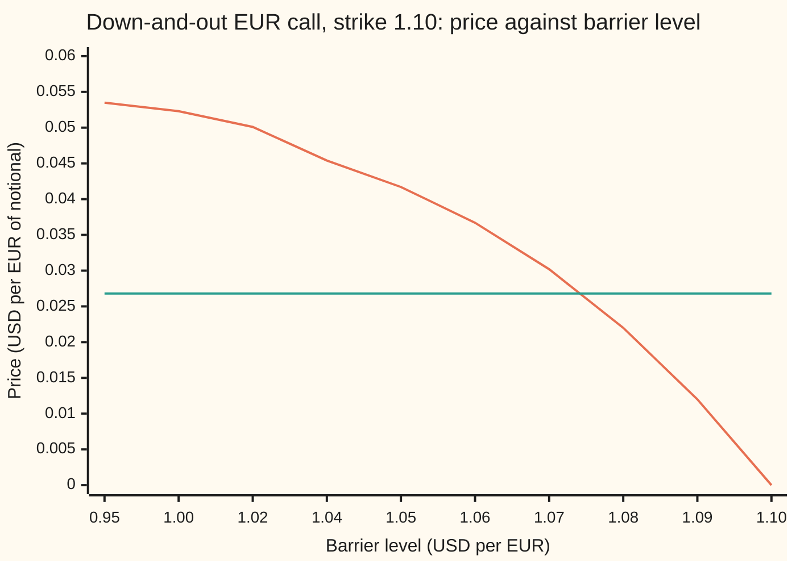
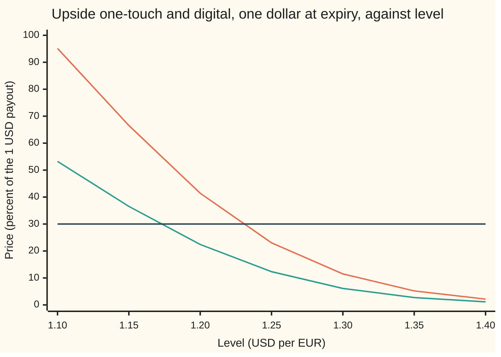
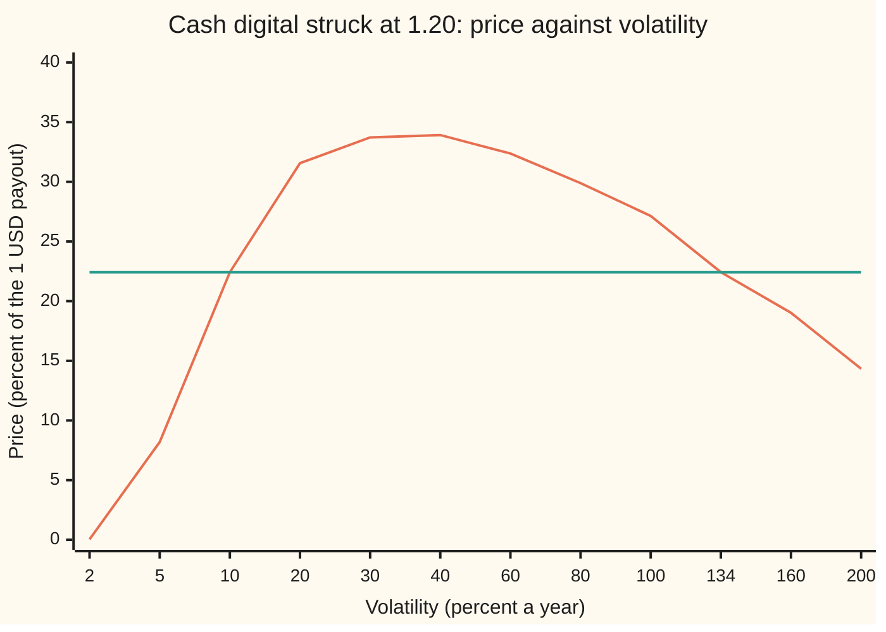

# Solving for the barrier: the knock-out level that makes the option cost what the client will pay, and the touch level a price implies

[Syllabus](../../../SYLLABUS.md) → [Financial mathematics](../../../SYLLABUS.md#w12) → [FX exotics as desks use them - digitals, touches and barriers](../../../SYLLABUS.md#w12-s23) → Solving for the barrier

---

## General Overview

One euro buys 1.10 dollars today. A company that must pay euros in a year wants protection against the euro strengthening, and a salesperson shows it a one-year euro call struck at 1.10: the right to sell dollars and buy euros at that rate. In the shelf's house market (dollar rate 5 percent, euro rate 3 percent, volatility 10 percent a year) the call costs 0.053556 dollars per euro of notional. The treasurer says the budget is half that: 0.026778.

The desk's answer is a **knock-out**: the same call with a clause that kills it, worthless, the first time the euro trades at or below a fixed level called the **barrier** ([Knock-out and knock-in](02-barrier-options-by-reflection.md)). A barrier far below 1.10 is almost never hit and the option costs nearly the full call. A barrier just under 1.10 is hit almost at once and the option costs almost nothing. Somewhere in between sits the level that costs exactly half. It is 1.074463, found by halving an interval until it is small enough.

The same question runs the other way on a one-touch, a contract that pays one dollar at expiry if the euro ever trades at a level during the year ([One-touch and no-touch](04-fx-one-touch-and-no-touch.md)). A broker quotes an upside one-touch at 30 percent of the payout. The house one-touch at 1.20 costs 0.4142, so a 30-percent touch sits further out: at 1.228604. Solving a price formula for one of its inputs, given its output, is called **inverting** it. That is the whole job of this card.

**A knock-out's price moves one way as its barrier moves, and so does a one-touch's; a target premium strictly inside the possible range therefore names exactly one level, found safely by bisection; a digital's strike inverts the same way, but its volatility does not, because a digital's price can rise and then fall as volatility grows.**

**What kind of fact this is:** a method, resting on a theorem proved on this card in Why it works: each level inverse exists and is unique inside the stated range; the digital's volatility inverse can have two answers or none.

### The picture: price falls as the barrier climbs toward spot



Falling line: the down-and-out call's price. Flat line: the client's target, half the vanilla (the plain call with no barrier). At 0.95 the barrier is rarely touched and the price, 0.0535, is almost the vanilla's 0.0536. At 1.10 the barrier starts on spot and the option is dead at birth. The curve never turns back up, so the flat line crosses it once, between 1.07 and 1.08.

---

## The formula

Notation first, in words. The **spot** $S$ is today's exchange rate in dollars per euro. The dollar is the pricing currency, so its rate $r_d$ discounts, and the euro rate $r_f$ plays the part a dividend yield plays for a share. The vanilla EUR call at spot $x$ is written $C(x)$, priced by the Garman–Kohlhagen formula on [Currency digitals](01-fx-digitals.md). The inverse problem is one equation in one unknown, the barrier $H$:

$$C_{\text{do}}(H) \;=\; C(S) \;-\; \Big(\frac{H}{S}\Big)^{\alpha}\, C\!\Big(\frac{H^2}{S}\Big) \;=\; P^{*}, \qquad \alpha = \frac{2\,(r_d - r_f - \tfrac12\sigma^2)}{\sigma^2}$$

**Read it aloud:** the knock-out is the vanilla call minus a scaled copy of the same call started from the mirror image of spot in the barrier; find the barrier that makes this equal the target price.

The mirror term is the reflection result from [Knock-out and knock-in](02-barrier-options-by-reflection.md), valid here because the barrier sits at or below the strike. For an upside one-touch paying one dollar at expiry, the same mirror gives

$$\text{OT}(H) \;=\; e^{-r_d T}\Big[\,N\big(d_2(S,H)\big) \;+\; \Big(\frac{H}{S}\Big)^{\alpha} N\big(-d_2(H^2/S,\,H)\big)\Big] \;=\; P^{*}$$

**Read it aloud:** the one-touch is a discounted dollar times the chance of finishing above the level, plus the chance of touching it and falling back, which the mirror counts.

| Symbol | Plain meaning | In our example | Push it up, target fixed, and the solved level… |
| --- | --- | --- | --- |
| $S$, $S_T$, $F$ | spot, dollars per euro today; the rate at expiry; the forward, the rate locked in today for delivery at expiry | 1.10; unknown; 1.122221 | knock-out level rises with spot; touch level rises with spot |
| $K$, $k$ | strike of the call; strike of a digital | 1.10; 1.171606 for a 30% digital | knock-out level falls: a cheaper call needs a looser barrier |
| $H$, $m$, $M$ | the barrier or touch level, the unknown; the year's lowest and highest rate | 1.074463 and 1.228604 | (the answer) |
| $r_d$ | dollar interest rate, continuously compounded | 5% | knock-out level rises; touch level rises (the euro drifts up) |
| $r_f$ | euro interest rate, continuously compounded | 3% | knock-out level falls; touch level falls (the euro drifts down) |
| $\sigma$ | volatility: the yearly size of the rate's swings | 10% | knock-out level falls slightly (swings reach a barrier sooner); touch level rises |
| $T$ | years to expiry | 1 | knock-out level rises slightly (the vanilla grows faster than the knock-out risk); touch level rises |
| $\alpha$ | the mirror's weight exponent, set by drift over variance | 3.0 | (a fixed input) |
| $C(x)$ | vanilla EUR call price if spot were $x$ | 0.053556 at 1.10 | (a function) |
| $d_2(x,k)$ | distance from $x$ to $k$ in units of $\sigma\sqrt{T}$, after drift | | (a helper) |
| $N(x)$ | area under the bell curve left of $x$ | | (a function) |
| $P^{*}$ | the target price the client will pay | 0.026778 and 0.30 | knock-out level falls; touch level falls |

The helper, in one line: $d_2(x,k) = \big(\ln(x/k) + (r_d - r_f - \tfrac12\sigma^2)T\big)/(\sigma\sqrt{T})$, the log-distance from $x$ to $k$ plus the year's drift, measured in units of one year's swing. The factor $e^{-r_d T}$, 0.951229, is the dollar discount: today's value of a dollar paid in a year.

A cash digital, which pays one dollar if the euro finishes above a strike $k$, costs $e^{-r_d T}N(d_2(S,k))$. Its strike inverts in one line, and its volatility sometimes has two answers; both are in Why it works, Step 4.

### When it holds

- **Continuous monitoring.** The barrier watches every instant. A desk that checks only a daily fixing sees fewer touches, so its knock-out is worth more at each level and the fair level for the same premium sits nearer spot than the one solved here; the correction is on [Daily monitoring](../16-Barriers%2C%20touches%20and%20lookbacks/03-discrete-monitoring-correction.md).
- **One flat volatility.** A real FX market has a smile (volatility that differs by strike), and barrier prices move with it. The level solved here is the flat-volatility level; [Barriers on a smile](07-barriers-with-the-smile.md) says how far it shifts.
- **A target strictly inside the price range.** Zero to the vanilla for the knock-out; zero to $e^{-r_d T}$ for the one-touch. Outside it there is no level, and a solver that does not check returns an edge of its bracket as if it were an answer.
- **Barrier at or below the strike** for the formula above. A barrier between spot and a lower strike uses a different mirror term (all eight cases on [The eight single barriers in one table](03-the-eight-barrier-types.md)); the monotonicity argument below does not change.
- **Payment at expiry.** A one-touch that pays at the moment of touching is worth more, so the same 30 percent quote implies a level further out.

**Conventions verified 2026-09-27 (this shelf's house terms; a term sheet overrides them):** notional in euros, premium in dollars per euro, one-touch premium quoted as a fraction of the dollar payout, payout at expiry.

---

## Why it works

### Step 0: a price that only ever moves one way can be read backwards

A pricing formula maps a level to a price. Reading it backwards needs two facts. The price must move **continuously** with the level, with no jumps, so every price between two achieved prices is achieved somewhere: that is the intermediate value theorem ([Intermediate value theorem](../../06-Calculus%20and%20analysis/01-Limits%20and%20Continuity/06-intermediate-value-theorem.md)). And it must move **strictly one way**, so no price is achieved twice. Continuous plus strictly one-way gives one level per price. The whole card is checking those two facts for each contract, finding the range of prices, and then solving.

### Step 1: the knock-out's price falls as the barrier rises

Follow one path of the exchange rate through the year. The knock-out pays the call's payoff only if the path's lowest point stayed above $H$. Raise $H$ from 1.04 to 1.05 and every path that survived the higher wall also survived the lower one; some paths that dipped to 1.045 now die. No path gains. So the payoff, path by path, can only shrink as $H$ rises. Averaging over paths keeps that order.

It shrinks strictly. For any two levels below spot, some paths have their lowest point between them and still finish above the strike. Those paths carry positive probability, so the price drops by a positive amount.

The edges fix the range. As $H$ falls toward zero, the mirror factor $(H/S)^{\alpha}$ goes to zero and the mirror call $C(H^2/S)$, a call whose spot has fallen far below its strike, goes to zero too: the price rises to the vanilla, 0.053556. As $H$ rises to spot, $(H/S)^{\alpha}$ goes to one and $H^2/S$ goes to $S$, so the two terms cancel: the price falls to zero. The formula is built from smooth pieces, so it is continuous in between.

Therefore **every target strictly between 0 and 0.053556 names exactly one barrier below spot.** Half the vanilla, 0.026778, is inside. Its level is 1.074463.

The same argument runs on the other side of spot. An up-and-out call dies when the rate climbs to $H$ above spot and strike (between spot and a higher strike it is worth zero at every level); raising that $H$ lets more paths live, so its price rises from zero toward the vanilla. The direction flips; uniqueness does not.

<details>
<summary>Detailed proof: existence, uniqueness and the boundary cases, for both contracts</summary>

Let $m$ be the lowest value and $M$ the highest value of the rate over the year, $S_T$ the rate at expiry. All prices are $e^{-r_dT}$ times an average in the pricing world of [Knock-out and knock-in](02-barrier-options-by-reflection.md).

**Knock-out.** Payoff $g_H = (S_T - K)^+\,\mathbf{1}\{m > H\}$. For $H_1 < H_2 < S$: $g_{H_1} - g_{H_2} = (S_T-K)^+\,\mathbf{1}\{H_1 < m \le H_2\} \ge 0$. The event $\{H_1 < m \le H_2,\ S_T > K\}$ has positive probability because the joint law of $(m, S_T)$ has a positive density on $\{m < S,\ S_T > m\}$. So $C_{\text{do}}(H_1) > C_{\text{do}}(H_2)$. Continuity: $m$ has a continuous distribution, so $H \mapsto \mathbf{1}\{m > H\}$ changes only on a set of probability tending to zero as the step shrinks; bounded convergence gives continuity (the closed form confirms it). Limits: $H \to 0$ gives $\mathbf{1}\{m > H\} \to 1$ almost surely, price $\to C(S)$; $H \to S$ gives $\mathbf{1}\{m > H\} \to 0$ almost surely (a Brownian path started at a level dips below it at once), price $\to 0$. By the intermediate value theorem each $P^*$ in $(0, C(S))$ has a root; strict decrease makes it unique. For $P^* \ge C(S)$ or $P^* \le 0$ there is none.

**One-touch, up.** Payoff $\mathbf{1}\{M \ge H\}$, $H > S$. For $S < H_1 < H_2$: $\mathbf{1}\{M \ge H_1\} - \mathbf{1}\{M \ge H_2\} = \mathbf{1}\{H_1 \le M < H_2\}$, positive with positive probability. Limits: $H \to S$ gives $M \ge H$ almost surely, price $\to e^{-r_dT}$ = 0.951229; $H \to \infty$ gives price $\to 0$. Each $P^*$ in $(0, e^{-r_dT})$ has exactly one level.

**Digital strike.** $e^{-r_dT}N(d_2(S,k))$ is continuous and strictly decreasing in $k$ (since $d_2$ is, and $N$ is strictly increasing), with limits $e^{-r_dT}$ as $k \to 0$ and $0$ as $k \to \infty$. Each $P^*$ in $(0, e^{-r_dT})$ has exactly one strike, given in closed form in Step 4.

</details>

### Step 2: the one-touch's price falls as the level moves away

A one-touch pays if the path's highest point reached $H$. Move $H$ up and every path that reached the higher level also reached the lower one; none is added. The price falls, strictly, for the same reason as Step 1.

The edges: with $H$ just above spot, the rate touches it almost at once, so the price is a sure dollar at expiry, 0.951229. With $H$ far away, the price goes to zero. **A quote strictly between 0 and 0.951229 names one level.** A one-touch quoted above 0.951229 is not an expensive trade; it is an impossible one, since no level makes a touch worth more than a guaranteed dollar.

At 0.30 the level is 1.228604, above the house 1.20 as it must be: the house touch costs 0.4142, more than 0.30, and price falls as the level moves out.

### Step 3: bisection, the solver that cannot miss

Newton's method (follow the slope to where the line meets the target) is fast but can overshoot on a curve as bent as the knock-out's near spot. Bisection is slower and cannot fail once the two facts of Step 0 hold. Start with a level that is too cheap and one that is too dear. Price the midpoint. Keep the half whose ends still straddle the target. Each round halves the interval.

For the knock-out, 1.00 is too dear (0.0523 is above the target) and 1.10 too cheap (zero). The first six midpoints are in the worked table below. The check runs 80 rounds, which reaches the limit of the computer's arithmetic.

### Step 4: the digital's strike inverts in one line; its volatility does not

A cash digital's price $e^{-r_dT}N(d_2(S,k))$ fixes one point on the bell curve. Divide the price by the discount, find the $z$ that has that area to its left, and solve $d_2 = z$ for the strike:

$$k \;=\; S\,\exp\!\Big(\big(r_d - r_f - \tfrac12\sigma^2\big)T \;-\; \sigma\sqrt{T}\,z\Big)$$

At 0.30 that gives 1.171606. Unique, by Step 0.

Volatility is different. Write $u = \sigma\sqrt{T}$ for one year's swing and let the strike sit above the forward, the rate at which euros can be locked in today for delivery in a year, 1.122221. Then $d_2 = \ln(F/k)/u - u/2$, where $\ln(F/k)$ is negative because the strike is above the forward. As $u$ grows from zero, the first term climbs from minus infinity and the second pulls down. The digital's price climbs, peaks, then falls. For the 1.20 digital the peak is at 36.6 percent volatility, price 0.339730.

So every price strictly between zero and the peak is hit twice. At 10 percent volatility the 1.20 digital costs 0.224231; setting $d_2 = z$ gives a quadratic in $u$ whose two positive roots are 10 percent and 134.0228 percent. Both are honest answers. A price above 0.339730 has none; exactly at it, one. The full case table, strike below, at and above the forward, is on [Digital inverses](../10-Digitals%20and%20the%20implied%20density/06-digital-inverses-vol-and-strike.md).

<details>
<summary>The algebra behind the two roots</summary>

Set $d_2 = z$ with $a = \ln(F/k)$: $a/u - u/2 = z$, so $u^2/2 + z\,u - a = 0$ and $u = -z \pm \sqrt{z^2 + 2a}$. With $a < 0$ and $z < 0$, both roots are positive when $z^2 + 2a > 0$, and their product is $-2a$: here 0.100000 times 1.340228 is $-2a$. The peak sits at $u = \sqrt{-2a}$, where the two roots meet, which is the 36.6 percent above.

</details>

### The other door

The same levels come out of Monte Carlo: simulate the rate month by month, and between months use the Brownian-bridge chance of having touched (the chance a path pinned at both ends crossed the wall in between, $\exp(-2(b-x)(b-y)/(\sigma^2\Delta t))$ in log terms, from Glasserman in Sources). At the solved levels it prices the knock-out at 0.026750 and the touch at 0.300859, each within its sampling error of the target. The equity version of this card, on Acme shares with a volatility inverse for the knock-out, is [Barrier inverses](../16-Barriers%2C%20touches%20and%20lookbacks/07-barrier-inverses-level-and-volatility.md).

---

## Worked numbers, by hand

House FX market: $S$ = 1.10, $K$ = 1.10, $r_d$ = 5%, $r_f$ = 3%, $\sigma$ = 10%, $T$ = 1. Target: half the vanilla.

| Step | Arithmetic | Value |
| --- | --- | --- |
| vanilla EUR call, $C(S)$ | Garman–Kohlhagen | 0.053556 |
| target $P^{*}$ | 0.053556 / 2 | 0.026778 |
| mirror exponent $\alpha$ | 2 × (0.05 − 0.03 − 0.005) / 0.01 | 3.0 |
| bracket | $H$ = 1.00 too dear (0.0523), $H$ = 1.10 worth 0 | straddles |
| midpoint 1 | $H$ = 1.050000, price 0.041661 | too dear: go up |
| midpoint 2 | $H$ = 1.075000, price 0.026343 | too cheap: go down |
| midpoint 3 | $H$ = 1.062500, price 0.035192 | too dear: go up |
| midpoint 4 | $H$ = 1.068750, price 0.031091 | too dear: go up |
| midpoint 5 | $H$ = 1.071875, price 0.028801 | too dear: go up |
| midpoint 6 | $H$ = 1.073438, price 0.027594 | too dear: go up |
| … 80 rounds | | $H$ = 1.074463 |
| check: mirror start $H^2/S$ | 1.074463^2 / 1.10 | 1.049519 |
| check: $(H/S)^{\alpha}$ | (1.074463 / 1.10)^3 | 0.931958 |
| check: $C(H^2/S)$ | call at spot 1.049519 | 0.028733 |
| check: price | 0.053556 − 0.931958 × 0.028733 | 0.026778 |
| **knock-out level** | | **1.074463** |

The treasurer's half-price call dies if the euro trades at or below 1.074463 at any moment in the year. That risk is what the discount buys.

The one-touch runs the same way on $\text{OT}(H)$, bracketed by 1.10 (worth 0.951229) and 3.0 (worth almost nothing): **1.228604** for a 30-percent quote. A cash digital at 30 percent sits at strike 1.171606, much closer, because finishing above a level is harder than touching it once.

The steepness matters for hedging. At the solved level the knock-out's price falls 0.804506 dollars per unit of barrier, so moving the barrier one pip (0.0001) moves the premium by about 0.80 pips. Both roads agree on that slope; its meaning as a Greek is on [Greeks at the wall](06-barrier-and-touch-greeks.md).

### What breaks if you drop a piece

| Mistake | Comes out at | What went wrong |
| --- | --- | --- |
| Swap the dollar and euro rates | level 1.039516 (right: 1.074463) | The euro's drift flips sign, the mirror exponent changes, and the barrier lands far too low |
| Use the digital strike as the touch level | touch there costs 0.549987 (quote: 0.30) | A digital needs the rate to finish above; a touch needs it to reach once. At the same price the touch level is further out |
| "Touch is twice the digital" rule | level 1.234554, true touch there 0.279253 | The factor of two holds when the log-rate has no drift; here its drift $r_d - r_f - \tfrac12\sigma^2$ is 1.5 percent |
| Bracket a digital's vol on 1% to 200% | prices 0.000000 and 0.143335, both below 0.224231 | Both ends are cheaper than the quote, so bisection sees no crossing, though two answers exist inside |

Every number in the table is printed by both checks below.

---

## Code, from first principles, and it actually runs

The script prices the house knock-out and one-touch two ways, then solves for each level on each road separately. Road 1 is the mirror formulas with a home-made bell-curve area (a Taylor series). Road 2 never touches the bell-curve area: it integrates the payoff against the density of paths that never met the wall, by Simpson's rule. Road 3 simulates 40,000 monthly paths with the Brownian-bridge touch chance and prices the knock-out and touch at the solved levels. The digital's strike comes from a closed form and from bisection on an integrated price; its two volatilities come from the quadratic and from bisection on each side of the peak. Five asserts on each side check the house prices and that independent roads meet.

### Python

```python
# Solving for the barrier -- the check behind the card.  Standard library only.
# EURUSD 1.10, USD rate 5%, EUR rate 3%, vol 10%, one year, 1 EUR notional, prices in USD.
# Nothing imported knows the answer: the normal CDF is a series, the integrals are
# Simpson's rule, the root finder is bisection, the random numbers are splitmix64.
from math import exp, log, sqrt, pi, cos
S, K, RD, RF, SIG, T = 1.10, 1.10, 0.05, 0.03, 0.10, 1.0
D, V = exp(-RD * T), SIG * sqrt(T)

def N(x):                                   # bell-curve area left of x, by its Taylor series
    if x < -9.0: return 0.0
    if x > 9.0: return 1.0
    t, s = x, x
    for k in range(1, 200):
        t *= x * x / (2 * k + 1); s += t
    return 0.5 + s * exp(-0.5 * x * x) / sqrt(2.0 * pi)
def phi(x): return exp(-0.5 * x * x) / sqrt(2.0 * pi)
def d2(x, k, rd=RD, rf=RF, s=SIG): return (log(x / k) + (rd - rf - 0.5 * s * s) * T) / (s * sqrt(T))
def call(x, k, rd=RD, rf=RF):
    return x * exp(-rf * T) * N(d2(x, k, rd, rf) + V) - k * exp(-rd * T) * N(d2(x, k, rd, rf))
def alpha(rd=RD, rf=RF): return 2.0 * (rd - rf - 0.5 * SIG * SIG) / (SIG * SIG)

# Road 1: closed forms by the method of images (a mirror start at H^2/S)
def do_img(H, rd=RD, rf=RF): return call(S, K, rd, rf) - (H / S) ** alpha(rd, rf) * call(H * H / S, K, rd, rf)
def ot_img(H): return D * (N(d2(S, H)) + (H / S) ** alpha() * N(-d2(H * H / S, H)))
def dig(k, s=SIG): return D * N(d2(S, k, s=s))

# Road 2: integrate the payoff against the density of paths that never met the wall (no N used)
MU = RD - RF - 0.5 * SIG * SIG
def simpson(f, a, b, n=4000):
    h = (b - a) / n; s = f(a) + f(b)
    for i in range(1, n): s += (4 if i % 2 else 2) * f(a + i * h)
    return s * h / 3.0
def alive(x, b): return (phi((x - MU * T) / V) - exp(2 * MU * b / SIG ** 2) * phi((x - 2 * b - MU * T) / V)) / V
def do_int(H):
    b = log(H / S); return D * simpson(lambda x: (S * exp(x) - K) * alive(x, b), log(K / S), MU * T + 10 * V)
def ot_int(H):
    b = log(H / S); return D * (1.0 - simpson(lambda x: alive(x, b), MU * T - 10 * V, b))
def dig_int(k): return D * simpson(lambda x: phi((x - MU * T) / V) / V, log(k / S), MU * T + 10 * V)

def bisect(f, lo, hi, target):             # f must change side of target between lo and hi
    flo = f(lo) - target
    for _ in range(80):
        mid = 0.5 * (lo + hi); fm = f(mid) - target
        if (fm > 0) == (flo > 0): lo, flo = mid, fm
        else: hi = mid
    return 0.5 * (lo + hi)

# Road 3: Monte Carlo, monthly steps, Brownian-bridge chance of touching between months
state = [20260927]
def unif():
    state[0] = (state[0] + 0x9E3779B97F4A7C15) & 0xFFFFFFFFFFFFFFFF
    z = state[0]
    z = ((z ^ (z >> 30)) * 0xBF58476D1CE4E5B9) & 0xFFFFFFFFFFFFFFFF
    z = ((z ^ (z >> 27)) * 0x94D049BB133111EB) & 0xFFFFFFFFFFFFFFFF
    return ((z ^ (z >> 31)) >> 11) / 9007199254740992.0 + 1e-17
def mc(H, kind, paths=40000, steps=12):
    b, dt, tot, tot2 = log(H / S), T / steps, 0.0, 0.0
    for _ in range(paths):
        x, live = 0.0, 1.0
        for _ in range(steps):
            z = sqrt(-2.0 * log(unif())) * cos(2.0 * pi * unif())
            y = x + MU * dt + SIG * sqrt(dt) * z
            if (y - b) * (x - b) <= 0: live = 0.0
            else: live *= 1.0 - exp(-2.0 * (b - x) * (b - y) / (SIG * SIG * dt))
            x = y
        pay = live * max(S * exp(x) - K, 0.0) if kind == "do" else 1.0 - live
        tot += pay; tot2 += pay * pay
    m = tot / paths
    return D * m, D * sqrt((tot2 / paths - m * m) / paths)

vanilla = call(S, K); target = 0.5 * vanilla
H1, H2 = bisect(do_img, 0.5, S, target), bisect(do_int, 0.5, S, target)
U1, U2 = bisect(ot_img, S, 3.0, 0.30), bisect(ot_int, S, 3.0, 0.30)
K1 = S * exp((RD - RF - 0.5 * SIG * SIG) * T - V * bisect(N, -9.0, 9.0, 0.30 / D))
K2 = bisect(dig_int, 0.5, 3.0, 0.30)
p12 = dig(1.20); z = bisect(N, -9.0, 9.0, p12 / D); a = log(S / 1.20) + (RD - RF) * T
lo_q, hi_q = -z - sqrt(z * z + 2 * a), -z + sqrt(z * z + 2 * a)     # sigma*sqrt(T) = -z -/+ root
peak = sqrt(-2 * a / T)
lo_b, hi_b = bisect(lambda s: dig(1.20, s), 0.001, peak, p12), bisect(lambda s: dig(1.20, s), peak, 3.0, p12)
mc_do, se_do = mc(H1, "do"); mc_ot, se_ot = mc(U1, "ot")
h = 1e-5
rows = [("forward F = S e^((rd-rf)T)", S * exp((RD - RF) * T)), ("house: vanilla EUR call 1.10", vanilla), ("house: down-and-out, H 1.05, images", do_img(1.05)),
        ("house: down-and-out, H 1.05, integral", do_int(1.05)), ("house: one-touch 1.20, images", ot_img(1.20)),
        ("house: one-touch 1.20, integral", ot_int(1.20)), ("image exponent alpha", alpha()),
        ("target: half the vanilla", target), ("KO level, road 1 images", H1), ("KO level, road 2 integral", H2),
        ("  mirror start H^2/S", H1 * H1 / S), ("  (H/S)^alpha", (H1 / S) ** alpha()), ("  vanilla at mirror start", call(H1 * H1 / S, K)),
        ("KO price at level, road 1", do_img(H1)), ("KO price at level, road 3 MC", mc_do), ("  MC standard error", se_do),
        ("KO slope dP/dH at level, road 1", (do_img(H1 + h) - do_img(H1 - h)) / (2 * h)),
        ("KO slope dP/dH at level, road 2", (do_int(H1 + h) - do_int(H1 - h)) / (2 * h)),
        ("touch level for 0.30, road 1", U1), ("touch level for 0.30, road 2", U2),
        ("touch price at level, road 3 MC", mc_ot), ("  MC standard error", se_ot),
        ("touch ceiling D (level at spot)", D), ("digital strike for 0.30, road 1", K1),
        ("digital strike for 0.30, road 2", K2), ("digital at the touch level", dig(U1)),
        ("digital 1.20 at 10% vol", p12), ("vol root low, quadratic", lo_q), ("vol root high, quadratic", hi_q),
        ("vol root low, bisection", lo_b), ("vol root high, bisection", hi_b),
        ("vol at the peak", peak), ("digital 1.20 peak price", dig(1.20, peak)),
        ("wrong: rates swapped, KO level", bisect(lambda H: do_img(H, RF, RD), 0.5, S, target)),
        ("wrong: digital strike as touch level", ot_img(K1)),
        ("wrong: touch = 2 x digital, level", bisect(lambda H: 2 * dig(H), S, 3.0, 0.30)),
        ("  true touch price there", ot_img(bisect(lambda H: 2 * dig(H), S, 3.0, 0.30))),
        ("wrong: bracket 1%..200%, price at 1%", dig(1.20, 0.01)), ("  price at 200%", dig(1.20, 2.0))]
for name, v in rows: print(f"{name:<40}{v:>12.6f}")
for f in (0.10, 0.25, 0.75, 0.90): print(f"{'KO level for ' + format(f, '.0%') + ' of vanilla':<40}{bisect(do_img, 0.5, S, f * vanilla):>12.6f}")
lo, hi, tr = 1.00, 1.10, []
for _ in range(6):
    m = 0.5 * (lo + hi); tr.append((m, do_img(m)))
    lo, hi = (m, hi) if tr[-1][1] > target else (lo, m)
print("bisection H  " + " ".join(f"{m:.6f}" for m, _ in tr))
print("bisection P  " + " ".join(f"{p:.6f}" for _, p in tr))
lv = [0.95, 1.00, 1.02, 1.04, 1.05, 1.06, 1.07, 1.08, 1.09, 1.10]
print("chart KO level  " + " ".join(f"{x:.2f}" for x in lv))
print("chart KO price  " + " ".join(f"{do_img(min(x, S)):.4f}" for x in lv))
up = [1.10, 1.15, 1.20, 1.25, 1.30, 1.35, 1.40]
print("chart up level  " + " ".join(f"{x:.2f}" for x in up))
print("chart touch %   " + " ".join(f"{100 * ot_img(x):.2f}" for x in up))
print("chart digital % " + " ".join(f"{100 * dig(x):.2f}" for x in up))
vs = [0.02, 0.05, 0.10, 0.20, 0.30, 0.40, 0.60, 0.80, 1.00, 1.34, 1.60, 2.00]
print("chart vol       " + " ".join(f"{x:.2f}" for x in vs))
print("chart dig 1.20 % " + " ".join(f"{100 * dig(1.20, x):.2f}" for x in vs))

assert abs(do_img(1.05) - 0.041661) < 5e-7, "house knock-out"
assert abs(ot_img(1.20) - 0.4142) < 5e-5, "house one-touch"
assert abs(H1 - H2) < 1e-6 and abs(U1 - U2) < 1e-6 and abs(K1 - K2) < 1e-6, "roads 1 and 2 agree on each level"
assert abs(mc_do - target) < 4 * se_do and abs(mc_ot - 0.30) < 4 * se_ot, "simulation lands on the targets"
assert abs(lo_q - lo_b) < 1e-6 and abs(hi_q - hi_b) < 1e-6 and abs(lo_q - SIG) < 1e-6, "two vols, two ways"
print("ALL CHECKS PASS")
```

**Ran 2026-09-27 on macOS, Python 3.14.6, standard library only. All checks passed. Output, pasted from the run:**

```
forward F = S e^((rd-rf)T)                  1.122221
house: vanilla EUR call 1.10                0.053556
house: down-and-out, H 1.05, images         0.041661
house: down-and-out, H 1.05, integral       0.041661
house: one-touch 1.20, images               0.414213
house: one-touch 1.20, integral             0.414213
image exponent alpha                        3.000000
target: half the vanilla                    0.026778
KO level, road 1 images                     1.074463
KO level, road 2 integral                   1.074463
  mirror start H^2/S                        1.049519
  (H/S)^alpha                               0.931958
  vanilla at mirror start                   0.028733
KO price at level, road 1                   0.026778
KO price at level, road 3 MC                0.026750
  MC standard error                         0.000292
KO slope dP/dH at level, road 1            -0.804506
KO slope dP/dH at level, road 2            -0.804506
touch level for 0.30, road 1                1.228604
touch level for 0.30, road 2                1.228604
touch price at level, road 3 MC             0.300859
  MC standard error                         0.002109
touch ceiling D (level at spot)             0.951229
digital strike for 0.30, road 1             1.171606
digital strike for 0.30, road 2             1.171606
digital at the touch level                  0.161344
digital 1.20 at 10% vol                     0.224231
vol root low, quadratic                     0.100000
vol root high, quadratic                    1.340228
vol root low, bisection                     0.100000
vol root high, bisection                    1.340228
vol at the peak                             0.366091
digital 1.20 peak price                     0.339730
wrong: rates swapped, KO level              1.039516
wrong: digital strike as touch level        0.549987
wrong: touch = 2 x digital, level           1.234554
  true touch price there                    0.279253
wrong: bracket 1%..200%, price at 1%        0.000000
  price at 200%                             0.143335
KO level for 10% of vanilla                 1.095760
KO level for 25% of vanilla                 1.088752
KO level for 75% of vanilla                 1.053286
KO level for 90% of vanilla                 1.029776
bisection H  1.050000 1.075000 1.062500 1.068750 1.071875 1.073438
bisection P  0.041661 0.026343 0.035192 0.031091 0.028801 0.027594
chart KO level  0.95 1.00 1.02 1.04 1.05 1.06 1.07 1.08 1.09 1.10
chart KO price  0.0535 0.0523 0.0501 0.0454 0.0417 0.0367 0.0302 0.0220 0.0120 0.0000
chart up level  1.10 1.15 1.20 1.25 1.30 1.35 1.40
chart touch %   95.12 66.55 41.42 23.02 11.50 5.20 2.15
chart digital % 53.23 36.54 22.42 12.33 6.11 2.74 1.13
chart vol       0.02 0.05 0.10 0.20 0.30 0.40 0.60 0.80 1.00 1.34 1.60 2.00
chart dig 1.20 % 0.04 8.19 22.42 31.56 33.72 33.92 32.37 29.89 27.14 22.43 19.02 14.33
ALL CHECKS PASS
```

### Rust

Same roads, same labels, same random-number stream, so the simulation lines match to the digit.

```rust
// Solving for the barrier -- the same check as barrier_level_from_a_target_premium_check.py, in Rust.
// EURUSD 1.10, USD rate 5%, EUR rate 3%, vol 10%, one year, 1 EUR notional, prices in USD.
// Std only: the normal CDF is a series, the integrals are Simpson's rule, the root finder is
// bisection, the random numbers are splitmix64.
use std::f64::consts::PI;
const S: f64 = 1.10; const K: f64 = 1.10; const RD: f64 = 0.05; const RF: f64 = 0.03;
const SIG: f64 = 0.10; const T: f64 = 1.0;
const MU: f64 = RD - RF - 0.5 * SIG * SIG;

fn n_cdf(x: f64) -> f64 {                   // bell-curve area left of x, by its Taylor series
    if x < -9.0 { return 0.0; }
    if x > 9.0 { return 1.0; }
    let (mut t, mut s) = (x, x);
    for k in 1..200 { t *= x * x / (2 * k + 1) as f64; s += t; }
    0.5 + s * (-0.5 * x * x).exp() / (2.0 * PI).sqrt()
}
fn phi(x: f64) -> f64 { (-0.5 * x * x).exp() / (2.0 * PI).sqrt() }
fn dd(x: f64) -> f64 { (-RD * x).exp() }
fn d2(x: f64, k: f64, rd: f64, rf: f64, s: f64) -> f64 { ((x / k).ln() + (rd - rf - 0.5 * s * s) * T) / (s * T.sqrt()) }
fn call(x: f64, k: f64, rd: f64, rf: f64) -> f64 {
    let v = SIG * T.sqrt(); let e = d2(x, k, rd, rf, SIG);
    x * (-rf * T).exp() * n_cdf(e + v) - k * (-rd * T).exp() * n_cdf(e)
}
fn alpha(rd: f64, rf: f64) -> f64 { 2.0 * (rd - rf - 0.5 * SIG * SIG) / (SIG * SIG) }
// Road 1: closed forms by the method of images (a mirror start at H^2/S)
fn do_img_r(h: f64, rd: f64, rf: f64) -> f64 { call(S, K, rd, rf) - (h / S).powf(alpha(rd, rf)) * call(h * h / S, K, rd, rf) }
fn do_img(h: f64) -> f64 { do_img_r(h, RD, RF) }
fn ot_img(h: f64) -> f64 { dd(T) * (n_cdf(d2(S, h, RD, RF, SIG)) + (h / S).powf(alpha(RD, RF)) * n_cdf(-d2(h * h / S, h, RD, RF, SIG))) }
fn dig(k: f64, s: f64) -> f64 { dd(T) * n_cdf(d2(S, k, RD, RF, s)) }
// Road 2: integrate the payoff against the density of paths that never met the wall (no N used)
fn simpson<F: Fn(f64) -> f64>(f: F, a: f64, b: f64) -> f64 {
    let n = 4000; let h = (b - a) / n as f64; let mut s = f(a) + f(b);
    for i in 1..n { s += if i % 2 == 1 { 4.0 } else { 2.0 } * f(a + i as f64 * h); }
    s * h / 3.0
}
fn alive(x: f64, b: f64) -> f64 {
    let v = SIG * T.sqrt();
    (phi((x - MU * T) / v) - (2.0 * MU * b / (SIG * SIG)).exp() * phi((x - 2.0 * b - MU * T) / v)) / v
}
fn do_int(h: f64) -> f64 {
    let (b, v) = ((h / S).ln(), SIG * T.sqrt());
    dd(T) * simpson(|x| (S * x.exp() - K) * alive(x, b), (K / S).ln(), MU * T + 10.0 * v)
}
fn ot_int(h: f64) -> f64 {
    let (b, v) = ((h / S).ln(), SIG * T.sqrt());
    dd(T) * (1.0 - simpson(|x| alive(x, b), MU * T - 10.0 * v, b))
}
fn dig_int(k: f64) -> f64 {
    let v = SIG * T.sqrt();
    dd(T) * simpson(|x| phi((x - MU * T) / v) / v, (k / S).ln(), MU * T + 10.0 * v)
}
fn bisect<F: Fn(f64) -> f64>(f: F, mut lo: f64, mut hi: f64, target: f64) -> f64 {
    let mut flo = f(lo) - target;         // f must change side of target between lo and hi
    for _ in 0..80 {
        let mid = 0.5 * (lo + hi); let fm = f(mid) - target;
        if (fm > 0.0) == (flo > 0.0) { lo = mid; flo = fm; } else { hi = mid; }
    }
    0.5 * (lo + hi)
}
// Road 3: Monte Carlo, monthly steps, Brownian-bridge chance of touching between months
fn unif(st: &mut u64) -> f64 {
    *st = st.wrapping_add(0x9E3779B97F4A7C15);
    let mut z = *st;
    z = (z ^ (z >> 30)).wrapping_mul(0xBF58476D1CE4E5B9);
    z = (z ^ (z >> 27)).wrapping_mul(0x94D049BB133111EB);
    ((z ^ (z >> 31)) >> 11) as f64 / 9007199254740992.0 + 1e-17
}
fn mc(h: f64, is_do: bool, st: &mut u64) -> (f64, f64) {
    let (paths, steps) = (40000, 12);
    let (b, dt) = ((h / S).ln(), T / steps as f64);
    let (mut tot, mut tot2) = (0.0, 0.0);
    for _ in 0..paths {
        let (mut x, mut live) = (0.0_f64, 1.0_f64);
        for _ in 0..steps {
            let u1 = unif(st); let u2 = unif(st);
            let z = (-2.0 * u1.ln()).sqrt() * (2.0 * PI * u2).cos();
            let y = x + MU * dt + SIG * dt.sqrt() * z;
            if (y - b) * (x - b) <= 0.0 { live = 0.0; }
            else { live *= 1.0 - (-2.0 * (b - x) * (b - y) / (SIG * SIG * dt)).exp(); }
            x = y;
        }
        let pay = if is_do { live * (S * x.exp() - K).max(0.0) } else { 1.0 - live };
        tot += pay; tot2 += pay * pay;
    }
    let m = tot / paths as f64;
    (dd(T) * m, dd(T) * ((tot2 / paths as f64 - m * m) / paths as f64).sqrt())
}
fn main() {
    let (d, v) = (dd(T), SIG * T.sqrt());
    let vanilla = call(S, K, RD, RF); let target = 0.5 * vanilla;
    let (h1, h2) = (bisect(do_img, 0.5, S, target), bisect(do_int, 0.5, S, target));
    let (u1, u2) = (bisect(ot_img, S, 3.0, 0.30), bisect(ot_int, S, 3.0, 0.30));
    let k1 = S * ((RD - RF - 0.5 * SIG * SIG) * T - v * bisect(n_cdf, -9.0, 9.0, 0.30 / d)).exp();
    let k2 = bisect(dig_int, 0.5, 3.0, 0.30);
    let p12 = dig(1.20, SIG); let z = bisect(n_cdf, -9.0, 9.0, p12 / d); let a = (S / 1.20).ln() + (RD - RF) * T;
    let (lo_q, hi_q) = (-z - (z * z + 2.0 * a).sqrt(), -z + (z * z + 2.0 * a).sqrt());
    let peak = (-2.0 * a / T).sqrt();
    let (lo_b, hi_b) = (bisect(|s| dig(1.20, s), 0.001, peak, p12), bisect(|s| dig(1.20, s), peak, 3.0, p12));
    let mut st: u64 = 20260927;
    let (mc_do, se_do) = mc(h1, true, &mut st); let (mc_ot, se_ot) = mc(u1, false, &mut st);
    let hb = 1e-5;
    let wr = bisect(|h| do_img_r(h, RF, RD), 0.5, S, target); let tw = bisect(|h| 2.0 * dig(h, SIG), S, 3.0, 0.30);
    let rows: Vec<(&str, f64)> = vec![("forward F = S e^((rd-rf)T)", S * ((RD - RF) * T).exp()), ("house: vanilla EUR call 1.10", vanilla), ("house: down-and-out, H 1.05, images", do_img(1.05)),
        ("house: down-and-out, H 1.05, integral", do_int(1.05)), ("house: one-touch 1.20, images", ot_img(1.20)),
        ("house: one-touch 1.20, integral", ot_int(1.20)), ("image exponent alpha", alpha(RD, RF)),
        ("target: half the vanilla", target), ("KO level, road 1 images", h1), ("KO level, road 2 integral", h2),
        ("  mirror start H^2/S", h1 * h1 / S), ("  (H/S)^alpha", (h1 / S).powf(alpha(RD, RF))), ("  vanilla at mirror start", call(h1 * h1 / S, K, RD, RF)),
        ("KO price at level, road 1", do_img(h1)), ("KO price at level, road 3 MC", mc_do), ("  MC standard error", se_do),
        ("KO slope dP/dH at level, road 1", (do_img(h1 + hb) - do_img(h1 - hb)) / (2.0 * hb)),
        ("KO slope dP/dH at level, road 2", (do_int(h1 + hb) - do_int(h1 - hb)) / (2.0 * hb)),
        ("touch level for 0.30, road 1", u1), ("touch level for 0.30, road 2", u2),
        ("touch price at level, road 3 MC", mc_ot), ("  MC standard error", se_ot),
        ("touch ceiling D (level at spot)", d), ("digital strike for 0.30, road 1", k1),
        ("digital strike for 0.30, road 2", k2), ("digital at the touch level", dig(u1, SIG)),
        ("digital 1.20 at 10% vol", p12), ("vol root low, quadratic", lo_q), ("vol root high, quadratic", hi_q),
        ("vol root low, bisection", lo_b), ("vol root high, bisection", hi_b),
        ("vol at the peak", peak), ("digital 1.20 peak price", dig(1.20, peak)),
        ("wrong: rates swapped, KO level", wr),
        ("wrong: digital strike as touch level", ot_img(k1)),
        ("wrong: touch = 2 x digital, level", tw), ("  true touch price there", ot_img(tw)),
        ("wrong: bracket 1%..200%, price at 1%", dig(1.20, 0.01)), ("  price at 200%", dig(1.20, 2.0))];
    for (name, x) in &rows { println!("{:<40}{:>12.6}", name, x); }
    for f in [0.10, 0.25, 0.75, 0.90] {
        println!("{:<40}{:>12.6}", format!("KO level for {:.0}% of vanilla", f * 100.0), bisect(do_img, 0.5, S, f * vanilla));
    }
    let row = |xs: &[f64], g: &dyn Fn(f64) -> f64, p: usize| xs.iter().map(|&x| format!("{:.*}", p, g(x))).collect::<Vec<_>>().join(" ");
    let (mut lo, mut hi, mut tr) = (1.00_f64, 1.10_f64, Vec::new());
    for _ in 0..6 {
        let m = 0.5 * (lo + hi); let p = do_img(m); tr.push((m, p));
        if p > target { lo = m; } else { hi = m; }
    }
    println!("bisection H  {}", tr.iter().map(|t| format!("{:.6}", t.0)).collect::<Vec<_>>().join(" "));
    println!("bisection P  {}", tr.iter().map(|t| format!("{:.6}", t.1)).collect::<Vec<_>>().join(" "));
    let lv = [0.95, 1.00, 1.02, 1.04, 1.05, 1.06, 1.07, 1.08, 1.09, 1.10];
    println!("chart KO level  {}", row(&lv, &|x| x, 2));
    println!("chart KO price  {}", row(&lv, &|x| do_img(x.min(S)), 4));
    let up = [1.10, 1.15, 1.20, 1.25, 1.30, 1.35, 1.40];
    println!("chart up level  {}", row(&up, &|x| x, 2));
    println!("chart touch %   {}", row(&up, &|x| 100.0 * ot_img(x), 2));
    println!("chart digital % {}", row(&up, &|x| 100.0 * dig(x, SIG), 2));
    let vs = [0.02, 0.05, 0.10, 0.20, 0.30, 0.40, 0.60, 0.80, 1.00, 1.34, 1.60, 2.00];
    println!("chart vol       {}", row(&vs, &|x| x, 2));
    println!("chart dig 1.20 % {}", row(&vs, &|x| 100.0 * dig(1.20, x), 2));

    assert!((do_img(1.05) - 0.041661).abs() < 5e-7, "house knock-out");
    assert!((ot_img(1.20) - 0.4142).abs() < 5e-5, "house one-touch");
    assert!((h1 - h2).abs() < 1e-6 && (u1 - u2).abs() < 1e-6 && (k1 - k2).abs() < 1e-6, "roads 1 and 2 agree on each level");
    assert!((mc_do - target).abs() < 4.0 * se_do && (mc_ot - 0.30).abs() < 4.0 * se_ot, "simulation lands on the targets");
    assert!((lo_q - lo_b).abs() < 1e-6 && (hi_q - hi_b).abs() < 1e-6 && (lo_q - SIG).abs() < 1e-6, "two vols, two ways");
    println!("ALL CHECKS PASS");
}
```

**Ran 2026-09-27 on macOS, rustc 1.98.1, no crates. All checks passed. Output, pasted from the run:**

```
forward F = S e^((rd-rf)T)                  1.122221
house: vanilla EUR call 1.10                0.053556
house: down-and-out, H 1.05, images         0.041661
house: down-and-out, H 1.05, integral       0.041661
house: one-touch 1.20, images               0.414213
house: one-touch 1.20, integral             0.414213
image exponent alpha                        3.000000
target: half the vanilla                    0.026778
KO level, road 1 images                     1.074463
KO level, road 2 integral                   1.074463
  mirror start H^2/S                        1.049519
  (H/S)^alpha                               0.931958
  vanilla at mirror start                   0.028733
KO price at level, road 1                   0.026778
KO price at level, road 3 MC                0.026750
  MC standard error                         0.000292
KO slope dP/dH at level, road 1            -0.804506
KO slope dP/dH at level, road 2            -0.804506
touch level for 0.30, road 1                1.228604
touch level for 0.30, road 2                1.228604
touch price at level, road 3 MC             0.300859
  MC standard error                         0.002109
touch ceiling D (level at spot)             0.951229
digital strike for 0.30, road 1             1.171606
digital strike for 0.30, road 2             1.171606
digital at the touch level                  0.161344
digital 1.20 at 10% vol                     0.224231
vol root low, quadratic                     0.100000
vol root high, quadratic                    1.340228
vol root low, bisection                     0.100000
vol root high, bisection                    1.340228
vol at the peak                             0.366091
digital 1.20 peak price                     0.339730
wrong: rates swapped, KO level              1.039516
wrong: digital strike as touch level        0.549987
wrong: touch = 2 x digital, level           1.234554
  true touch price there                    0.279253
wrong: bracket 1%..200%, price at 1%        0.000000
  price at 200%                             0.143335
KO level for 10% of vanilla                 1.095760
KO level for 25% of vanilla                 1.088752
KO level for 75% of vanilla                 1.053286
KO level for 90% of vanilla                 1.029776
bisection H  1.050000 1.075000 1.062500 1.068750 1.071875 1.073438
bisection P  0.041661 0.026343 0.035192 0.031091 0.028801 0.027594
chart KO level  0.95 1.00 1.02 1.04 1.05 1.06 1.07 1.08 1.09 1.10
chart KO price  0.0535 0.0523 0.0501 0.0454 0.0417 0.0367 0.0302 0.0220 0.0120 0.0000
chart up level  1.10 1.15 1.20 1.25 1.30 1.35 1.40
chart touch %   95.12 66.55 41.42 23.02 11.50 5.20 2.15
chart digital % 53.23 36.54 22.42 12.33 6.11 2.74 1.13
chart vol       0.02 0.05 0.10 0.20 0.30 0.40 0.60 0.80 1.00 1.34 1.60 2.00
chart dig 1.20 % 0.04 8.19 22.42 31.56 33.72 33.92 32.37 29.89 27.14 22.43 19.02 14.33
ALL CHECKS PASS
```

The two outputs are identical line for line.

### Pictures from the check



Top line: the one-touch. Middle line: the cash digital struck at the same level. Flat line: the 30-percent quote. The touch line crosses 30 between 1.20 and 1.25 (at 1.228604); the digital line crosses it much closer to spot (at 1.171606). Both fall all the way, so each crossing is the only one.



Hump: the digital's price as volatility grows. Flat line: the price at 10 percent volatility, 22.42 percent of payout. The hump crosses it twice, at 10 and near 134 percent. Nothing above the top of the hump, 0.339730, is reachable. The x-axis is spaced by category, not to scale.

> [!TIP]
> **Try changing**
> Guess the direction first. Then run it.
> - **A tighter budget.** Change the target to 25 percent of the vanilla. Guess: barrier nearer spot or further? Nearer: **1.088752**. At 90 percent of the vanilla it moves out to **1.029776**. The printed table has 10 and 75 percent too.
> - **Quote the digital at its peak.** Set the digital target to 0.339730. The quadratic's two roots merge into one, **36.6 percent** (0.366091). Nudge the target to 0.35 and the square root in the quadratic goes negative: no volatility fits.
> - **Cut the simulation.** Set `paths=4000`. The standard errors grow and the simulated knock-out wanders further from 0.026778; the asserts, set at four standard errors, still pass.
> - **Flip the rates.** Call `do_img(H, RF, RD)` in the solver. The level drops to **1.039516**, the first row of the what-breaks table.

---

## The usual mistake

> [!warning]
> **Running a solver without first checking the target is reachable.** A knock-out can never cost the vanilla's 0.053556 or more; a one-touch can never cost the discounted dollar, 0.951229, or more. Bisection given an unreachable target still returns a number: the edge of its bracket. A desk that quotes that number has priced a barrier sitting at spot, or at zero, and called it a trade. State the range first, then solve.
>
> Smaller traps:
> - **Treating a touch as a digital.** At a 30-percent price the digital strike is 1.171606 and the touch level is 1.228604. A touch placed at the digital's strike costs 0.549987, far above the quote.
> - **Trusting "touch ≈ 2 × digital".** It is the reflection argument with no drift. With the house drift of 1.5 percent it puts the level at 1.234554, where the true touch is worth 0.279253, short of the 0.30 quote.
> - **Taking the first volatility a solver finds from a digital.** The 1.20 digital at 0.224231 fits 10 percent and 134.0228 percent. A solver started at a high guess can settle on the wrong one; a bracket of 1 to 200 percent sees no crossing at all. Split the bracket at the peak, or better, quote digitals in dollars and imply volatility from vanillas.
> - **Swapping the currencies' rates.** The dollar rate discounts; the euro rate is the "dividend". Swap them and the half-price barrier moves from 1.074463 to 1.039516.

---

## Where you meet it in real life

- **Structuring a zero-cost or budget hedge.** A corporate treasurer names a premium; the desk solves for the knock-out level that fits it, exactly as on this card. The same inversion places the barrier in a knock-in forward or a range accrual.
- **Broker screens for one-touches.** Touches trade quoted in percent of payout. A trader seeing 1.228604 at 30 percent and 1.20 at 41.42 percent reads the implied levels and prices backwards and forwards between them ([One-touch and no-touch](04-fx-one-touch-and-no-touch.md)).
- **Double no-touch ranges.** A client asks for a range that pays at 20 percent; the desk solves for a symmetric pair of walls. Two walls, one unknown width, the same monotone argument: [Two walls](05-double-barriers-and-double-no-touch.md).
- **Digital strikes on a term sheet.** A digital coupon priced to a budget has its strike solved in one line; its volatility is never implied from the digital itself.
- **Vanilla premiums solved for a strike.** The same move on a plain option, on Acme shares: [Strike or spot from a target premium](../11-Implied%20volatility%20and%20the%20vanilla%20inverses/04-strike-or-spot-from-a-target-premium.md).

> **Say it back**
> A knock-out's price falls continuously as its barrier climbs toward spot, from the vanilla's price down to zero, so any target in between names one barrier. A one-touch's price falls from a sure discounted dollar to zero as its level moves away, so any quote in between names one level. Bisection finds both and cannot miss once the target is checked to be in range. A digital's strike inverts in one line. A digital's volatility can give two answers or none, because its price rises and then falls as volatility grows.

---

## What this builds on

- [Greeks at the wall](06-barrier-and-touch-greeks.md): the price's sensitivity to the barrier; its sign is the monotonicity this card inverts, and its size sets how far one pip of premium moves the level.
- [Currency digitals](01-fx-digitals.md): the Garman–Kohlhagen pricing of vanillas and digitals in the house FX market, and the digital whose strike and volatility are inverted in Step 4.
- [Intermediate value theorem](../../06-Calculus%20and%20analysis/01-Limits%20and%20Continuity/06-intermediate-value-theorem.md): a continuous price that starts above a target and ends below it crosses it; the existence half of every inverse here.

## Where this goes next

- [Barriers on a smile](07-barriers-with-the-smile.md): the same inversion with a volatility that differs by level, where the solved barrier shifts with the smile's shape.
- [Two walls](05-double-barriers-and-double-no-touch.md): two walls solved for one target, a range width instead of a level.
- [Barrier inverses](../16-Barriers%2C%20touches%20and%20lookbacks/07-barrier-inverses-level-and-volatility.md): the equity version, which adds the knock-out's own volatility inverse and its two roots.

The level inverse is safe because payoffs are ordered path by path; what this card leaves open is what happens to that safety once the volatility itself depends on where the rate is.

---

## Sources

Verified 2026-09-27: every link below resolves to the publisher's page.

- Garman, Mark B., and Steven W. Kohlhagen. "Foreign Currency Option Values." *Journal of International Money and Finance* 2, no. 3 (1983): 231–237. [doi:10.1016/S0261-5606(83)80001-1](https://doi.org/10.1016/S0261-5606(83)80001-1). The FX vanilla and the foreign rate as a dividend yield.
- Merton, Robert C. "Theory of Rational Option Pricing." *Bell Journal of Economics and Management Science* 4, no. 1 (1973): 141–183. [doi:10.2307/3003143](https://doi.org/10.2307/3003143). The first closed-form down-and-out call.
- Wystup, Uwe. *FX Options and Structured Products*, 2nd ed. Wiley, 2017. [Publisher page](https://www.wiley.com/en-us/FX+Options+and+Structured+Products%2C+2nd+Edition-p-9781118471067). Touches, barriers and how FX desks quote and structure them.
- Glasserman, Paul. *Monte Carlo Methods in Financial Engineering*. Springer, 2003. [doi:10.1007/978-0-387-21617-1](https://doi.org/10.1007/978-0-387-21617-1). The Brownian-bridge touch probability used by road 3.
