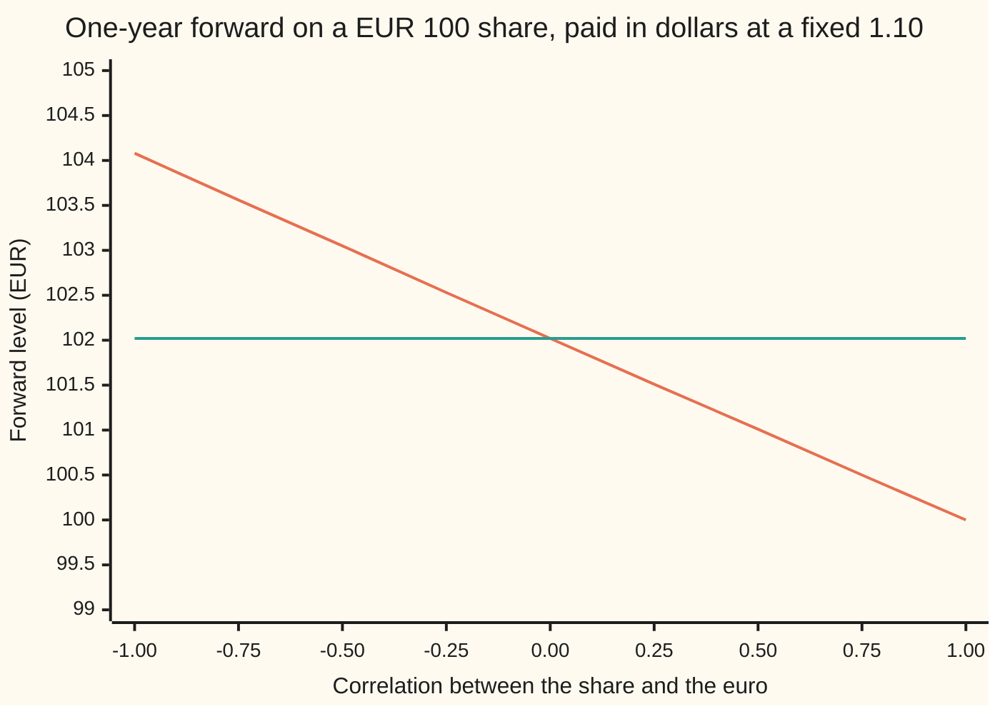

# The quanto adjustment: a foreign price paid in home money at a fixed rate drifts slower by correlation times two vols

Financial mathematics → Quantos and composites → Changing the currency of account → The quanto adjustment

---

## General Overview

A European share trades in Frankfurt at 100 euros. A dollar investor wants its price moves but not the euro's. A bank offers a contract: in one year, the bank pays 1.10 dollars for every euro the share ends above an agreed level, and takes 1.10 dollars for every euro it ends below. The 1.10 is fixed today and never moves, whatever the euro does. A contract like this, where a foreign price is paid out in home money at a fixed rate, is a **quanto** (short for "quantity-adjusting"), the word used from here on.

The agreed level is chosen so the contract costs nothing to enter. That level is the **quanto forward**. The obvious guess is the ordinary euro forward, the price at which a euro investor would agree to buy the share in a year: 102.02 euros, the share's 100 grown at the euro interest rate of 3 percent less its 1 percent dividend. The guess is wrong. The fair level is **EUR 101.41**, sixty-one cents lower.

The gap is 0.6 percent a year (exactly 0.006 in logs), and it comes from how the share and the euro move together. Here they tend to rise together: the **correlation** (a number from −1 to 1 measuring how often two prices move the same way) is 0.30. The share's yearly wobble, its **volatility**, is 20 percent; the euro's is 10 percent. Multiply the three: 0.30 × 0.20 × 0.10 = 0.006. That is the whole gap. Flip the correlation to −0.30 and the quanto forward rises to 102.63, above the euro forward by the same 0.6 percent.

**In the dollar investor's pricing world, a foreign share grows at the foreign rate, less its dividend, less correlation times the two volatilities; the quanto forward is today's price grown at that slower rate.**

**What kind of fact this is:** a theorem inside a model. Given two prices that wobble in the usual lognormal way (geometric Brownian motion) with fixed volatilities and correlation, no-arbitrage forces the drift; it is proved on this card in Why it works.

### The picture: the quanto forward against the correlation



The falling line (orange) is the quanto forward. The flat line (green) is the euro forward, 102.02, which ignores the currency altogether. They cross at zero correlation. At correlation 1 the quanto forward is exactly 100.00: the 2 percent euro carry (euro rate less dividend) is cancelled by the 1 × 0.20 × 0.10 = 2 percent adjustment.

---

## The formula

Notation first, in words. A subscript names whose rate it is: $r_d$ is the domestic (dollar) rate, $r_f$ the foreign (euro) rate. A bar over a letter marks a number fixed in the contract. $e^{x}$ is the exponential, the growth factor of continuous compounding.

$$F_Q = S\,e^{(r_f - q - \rho\,\sigma_S\,\sigma_X)\,T}$$

**Read it aloud:** the quanto forward is today's share price grown for $T$ years at the euro rate, less the dividend, less correlation times the share's volatility times the currency's volatility.

The rate in the exponent has a name of its own, the **quanto drift**:

$$\mu = r_f - q - \rho\,\sigma_S\,\sigma_X$$

It is how fast the share's euro price is expected to grow, averaged the way a dollar investor must average to avoid free money. The euro investor's version is the same without the last term, which gives the ordinary euro forward $F = S\,e^{(r_f - q)T}$.

| Symbol | Plain meaning | In our example | Push it up and the answer… |
| --- | --- | --- | --- |
| $S$, $S_T$ | the share's price in euros, today and at the end | EUR 100 today | rises one for one in proportion |
| $X_t$, $X_0$, $X_T$, $Y_t$, $Y_T$ | the exchange rate, dollars per euro, at time t, today and at the end; Y is the same rate upside down, euros per dollar | 1.10 today | does not move: today's rate never enters |
| $\bar X$ | the fixed rate written into the contract, dollars per euro | 1.10 | does not move: it scales the payout, not the level |
| $r_d$ | the dollar interest rate, continuously compounded | 5% | does not move the forward; it discounts the contract's value |
| $r_f$ | the euro interest rate, continuously compounded | 3% | rises: the share grows faster in euros |
| $q$ | the share's dividend yield | 1% | falls: dividends leave the price |
| $\sigma_S$, $\sigma_X$ | volatilities: yearly wobble of the share (in euros) and of the exchange rate | 20%, 10% | falls when correlation is positive, rises when negative |
| $\rho$ | correlation between the share's moves and the euro's moves against the dollar; say "rho" | 0.30 | falls: 0.6% lower per 0.30 |
| $T$ | time to the settlement date, in years | 1 | stretches the gap: 0.6% per year |
| $\mu$ | the quanto drift, $r_f - q - \rho\sigma_S\sigma_X$ | 1.4% a year | — |
| $F$, $F_Q$ | the euro forward and the quanto forward | EUR 102.02, EUR 101.41 | — |
| $W^S$, $W^X$, $dt$ | the random drivers (Brownian motions) of the share and the rate, correlated at $\rho$; $dt$ is a short slice of time | — | — |

### When it holds

- **Volatilities and correlation stay fixed.** If the correlation drifts over the year, the adjustment uses its average over the contract's life; an error in that average moves the log of the forward by the error times $\sigma_S\sigma_X T$.
- **Prices move without jumps.** The product rule below needs smooth wobbles. A devaluation that knocks 20 percent off the euro overnight while the share falls too adds a jump term the formula does not have.
- **Interest rates are fixed.** Random rates add their own co-movement terms: [quanto-adjustments-for-rates](../32-Convexity%20and%20Exotics/04-quanto-adjustments-for-rates.md).
- **The seller can rebalance continuously and cheaply.** The fair level assumes the bank hedges its currency exposure as the share moves. Coarse rebalancing leaves a residual profit or loss: [quanto-greeks-and-hedging](03-quanto-greeks-and-hedging.md).

---

## Why it works

### Step 0: the idea that makes it possible

One share can be bought by a dollar investor. Its dollar price is the euro price times the exchange rate, $S_t X_t$. That product is a dollar asset, so the dollar investor's no-arbitrage rule applies to it directly: in the dollar pricing world (the **risk-neutral** world, where every asset is averaged as if it earned the riskless rate), its total return must be the dollar rate. The exchange rate is also pinned, by covered interest parity. Two of the three growth rates in the product are forced. The third, the share's own, is whatever is left. And a product of two prices that rise together grows by more than the sum of their growth rates, so the leftover is smaller than the naive guess.

### Step 1: the exchange rate must drift at the rate gap

One euro in a euro bank account grows to $e^{r_f t}$ euros, worth $X_t\,e^{r_f t}$ dollars. It pays nothing else, so in the dollar world it must grow at $r_d$. The factor $e^{r_f t}$ supplies $r_f$ of that. The exchange rate supplies the rest:

$$\text{drift of } X = r_d - r_f = 0.05 - 0.03 = 2\% \text{ a year.}$$

This is covered interest parity ([covered-interest-parity](../20-FX%20spot%2C%20forwards%20and%20interest%20parity/02-covered-interest-parity.md)), the same fact that powers the currency option on [garman-kohlhagen](../21-FX%20vanilla%20options%20-%20Garman-Kohlhagen%20and%20the%20desk%20conventions/01-garman-kohlhagen.md).

### Step 2: a product of co-movers grows faster than the sum

One day, one move each. If the share rises 1 percent and the euro rises 1 percent, the dollar value rises by the factor 1.01 × 1.01 = 1.0201: 2.01 percent, not 2. If they move opposite ways, 1.01 × 0.99 = 0.9999, a touch below flat. The cross term, the product of the two moves, is small on one day. Over a year it adds up to a steady rate, because the two moves are correlated.

In continuous time this is the product rule of Itô calculus ([multidimensional-ito-and-correlation](../../11-Stochastic%20processes%20and%20calculus/06-Ito%20Calculus/06-multidimensional-ito-and-correlation.md)). Write each price as a drift plus a random kick:

$$\frac{dS_t}{S_t} = \mu\,dt + \sigma_S\,dW^S_t, \qquad \frac{dX_t}{X_t} = (r_d - r_f)\,dt + \sigma_X\,dW^X_t,$$

where $dW^S_t$ and $dW^X_t$ are the kicks over a short time $dt$, each with spread $\sqrt{dt}$, correlated at $\rho$. The product rule reads

$$d(S_t X_t) = X_t\,dS_t + S_t\,dX_t + dS_t\,dX_t .$$

The last term is the one ordinary calculus drops. It is the kick times the kick: $\sigma_S\sigma_X\,S_t X_t\,dW^S_t\,dW^X_t$, and correlated kicks multiply to $\rho\,dt$ on average ([joint-distributions-and-covariance](../../09-Probability%20and%20statistics/02-Random%20Variables/04-joint-distributions-and-covariance.md)). Divide through by $S_t X_t$:

$$\frac{d(S_t X_t)}{S_t X_t} = \big(\mu + r_d - r_f + \rho\,\sigma_S\sigma_X\big)\,dt + \sigma_S\,dW^S_t + \sigma_X\,dW^X_t .$$

The dollar value's growth is the share's growth, plus the currency's, plus the co-movement bonus $\rho\sigma_S\sigma_X$.

### Step 3: solve for the share's drift

The share pays a dividend yield $q$, so its dollar price must grow at $r_d - q$ in the dollar world. Set the growth from Step 2 equal to that:

$$\mu + (r_d - r_f) + \rho\,\sigma_S\sigma_X = r_d - q .$$

The $r_d$ cancels. What remains is the quanto drift:

$$\mu = r_f - q - \rho\,\sigma_S\sigma_X = 0.03 - 0.01 - 0.006 = 1.4\% \text{ a year.}$$

Using the euro world's 2 percent instead would make the dollar share grow at 4.6 percent a year where no-arbitrage allows 4. A simulation in the code shows it: the average dollar value of one share lands on 115.23 dollars against a required 114.49, eleven standard errors off. With the adjusted drift it lands on 114.54, within one.

### Step 4: the forward is the average of the share in the dollar world

The contract pays $\bar X\,(S_T - F_Q)$ dollars at time $T$. Its value today is that payout averaged in the dollar world and discounted at $r_d$:

$$\bar X\,e^{-r_d T}\big(\mathbb{E}^d[S_T] - F_Q\big),$$

where $\mathbb{E}^d$ means the average in the dollar world. The contract costs nothing, so $F_Q = \mathbb{E}^d[S_T]$. A price growing at drift $\mu$ with lognormal wobble has average $S\,e^{\mu T}$ ([itos-lemma](../../11-Stochastic%20processes%20and%20calculus/06-Ito%20Calculus/02-itos-lemma.md)). Hence

$$F_Q = S\,e^{(r_f - q - \rho\sigma_S\sigma_X)T} = 100\,e^{0.014} = 101.41 .$$

Two numbers dropped out. The fixed rate $\bar X$ multiplies the whole payout, so it cannot move the zero-cost level. Today's rate $X_0$ never appeared in $\mu$. The code checks the second by pricing with a spot of 1.30 instead of 1.10: still 101.41.

### Step 5: the sign, in a two-state story

Why lower when the share and the euro rise together? A one-period toy makes it visible. In the euro world, two equally likely states: the share ends at 120 or at 84, an average of 102. The euro ends strong at 1.21 dollars or weak at 0.99.

A state price is today's cost of one unit of money paid only in that state ([state-prices-and-risk-neutral-pricing-in-one-period](../03-Contracts%20and%20No-Arbitrage/07-state-prices-and-risk-neutral-pricing-in-one-period.md)). One dollar paid in a state is worth $1/X_T$ euros there. So the dollar world's odds are the euro world's odds times $1/X_T$, rescaled to add to one. The strong-euro state gets weight 0.5/1.21 against 0.5/0.99 for the weak one: 0.45 and 0.55.

- **Share high when the euro is strong.** Dollar-world average: 0.45 × 120 + 0.55 × 84 = **100.20**, below 102.
- **Share high when the euro is weak.** 0.55 × 120 + 0.45 × 84 = **103.80**, above 102.

The dollar investor's world discounts the states where the euro is strong, because a dollar buys few euros there. If those are the states where the share is high, the dollar average of the share is lower. The toy's gap in logs is ln(102/100.20) = 0.0178, close to what the formula gives at correlation 1 with the toy's own swings in logs, ln(120/84)/2 × ln(1.21/0.99)/2 = 0.178 × 0.100 = 0.018.

<details>
<summary>Detailed proof: the same drift by changing measure</summary>

Work in the euro world, where the euro bank account is the yardstick. There the share drifts at $r_f - q$, and the dollar, priced in euros as $Y_t = 1/X_t$, drifts at $r_f - r_d$; its random driver is $-W^X$, since a stronger euro is a weaker dollar.

The dollar world uses the dollar bank account as yardstick. Its odds are the euro world's odds reweighted by the dollar account's euro value, $Y_T e^{r_d T}$, divided by its euro-world average $Y_0 e^{r_f T}$. That ratio is
$$\exp\!\big(-\sigma_X W^X_T - \tfrac12\sigma_X^2 T\big).$$
Girsanov's theorem ([girsanov-theorem](../../11-Stochastic%20processes%20and%20calculus/07-Changing%20Measure/02-girsanov-theorem.md)) says a reweighting of this form, $\exp(\theta W_T - \tfrac12\theta^2 T)$ with $\theta = -\sigma_X$, turns $W^X$ into a driver with an extra drift $\theta = -\sigma_X$ per year. Any driver correlated with $W^X$ at $\rho$ picks up $\rho\theta$: its conditional average moves by $\rho$ times the shift, as for a bivariate normal ([bivariate-normal-and-conditioning](../../09-Probability%20and%20statistics/05-Transformations%20and%20Joint%20Laws/05-bivariate-normal-and-conditioning.md)). So $W^S$ gains drift $-\rho\sigma_X$.

Put that into the share: $dS_t/S_t = (r_f - q)\,dt + \sigma_S\,dW^S_t$ becomes $(r_f - q - \rho\sigma_S\sigma_X)\,dt$ plus a fresh dollar-world kick. The exchange rate, which in the euro world drifts at $r_d - r_f + \sigma_X^2$ (the upside-down of a price gains its variance), loses $\sigma_X \cdot \sigma_X$ and drifts at $r_d - r_f$, matching Step 1. Both drifts agree with the product-rule route.

Road 2 in the code is this proof done numerically: it averages $S_T Y_T$ and $Y_T$ over the euro world on a grid and divides, never using $\mu$.

</details>

The alternative route, then, is a change of yardstick: the quanto adjustment is what Girsanov's theorem does to a foreign share's drift when the numeraire (the asset prices are measured in) switches from the euro account to the dollar account. The product rule and the change of measure are one fact seen from two sides.

---

## Worked numbers, by hand

The house market: share EUR 100, $r_d$ = 5%, $r_f$ = 3%, $q$ = 1%, $\sigma_S$ = 20%, $\sigma_X$ = 10%, $\rho$ = 0.30, $T$ = 1 year, fixed rate 1.10.

| Step | Arithmetic | Value |
| --- | --- | --- |
| adjustment $\rho\sigma_S\sigma_X$ | 0.30 × 0.20 × 0.10 | 0.006 |
| quanto drift $\mu$ | 0.03 − 0.01 − 0.006 | 0.014 |
| euro forward | 100 × e^0.02 | EUR 102.02 |
| **quanto forward** | 100 × e^0.014 | **EUR 101.41** |
| gap | 102.02 − 101.41 | EUR 0.61 |
| gap in logs | ln(102.02 / 101.41) | 0.006 |
| correlation flipped to −0.30 | 100 × e^0.026 | EUR 102.63 |
| dollar share, required average | 100 × 1.10 × e^0.04 | $114.49 |

A dollar investor who wants the share's move without the euro's should lock in 101.41, not 102.02. The sixty-one cents is the price of shedding a currency that tends to rise exactly when the share does.

### The gap grows with time

The adjustment is a rate, so the gap compounds. Euros between the euro forward and the quanto forward, one block per EUR 0.20:

```
maturity   gap between the forwards, EUR (one block = 0.20)
  1 year   ███                                    EUR 0.61
 2 years   ██████                                 EUR 1.24
 5 years   ████████████████                       EUR 3.27
10 years   ████████████████████████████████████   EUR 7.11
```

At ten years the euro forward is 122.14 and the quanto forward 115.03. Long-dated quanto notes carry the adjustment in full.

### What breaks if you drop a piece

| Mistake | Comes out at | What went wrong |
| --- | --- | --- |
| No adjustment: use the euro forward | EUR 102.02 | A contract struck there is worth −$0.64 to the buyer on day one. |
| Sign flipped (or the rate quoted euros per dollar without flipping the correlation) | EUR 102.63 | The co-movement bonus was added, not removed. |
| Share grown at the dollar rate | EUR 103.46 | The share lives in euros; its carry is the euro rate. |
| Dollar share simulated with the euro drift | $115.18 average, against $114.49 | A free 0.6 percent a year sits in the model. |

---

## Code, from first principles, and it actually runs

The scripts reach the quanto forward four ways. Road 1 is the formula. Road 2 works entirely in the euro world, where nothing is adjusted: it averages the share times the dollar's euro value, and the dollar's euro value alone, on a 161 × 161 grid over two independent bell curves, weighted by Simpson's rule (a standard recipe for approximating an integral from sampled points), and divides. Road 3 does the same average by Monte Carlo (averaging over random draws), 200,000 pairs of correlated draws from a hand-written generator. Road 4 simulates the pair in the dollar world and tests Step 3: with the adjusted drift the dollar share is fairly priced, without it the simulation detects free money. The two-state story is recomputed and its sign compared with the formula's at correlation ±1.

### Python

```python
# The quanto adjustment -- the check behind the card.  Standard library only.
# A euro share paid in dollars at a fixed rate.  Roads to its forward:
# 1 the formula; 2 a 2-D Simpson integral in the euro world; 3 a Monte Carlo
# of the pair in the euro world; 4 a Monte Carlo of the pair in the dollar world,
# testing the product rule.  Random numbers: splitmix64 + Box-Muller, written here.
from math import exp, log, sqrt, pi, cos, sin

S, Xbar, X0 = 100.0, 1.10, 1.10          # share (EUR), fixed rate and spot (USD per EUR)
rd, rf, q, T = 0.05, 0.03, 0.01, 1.0     # dollar rate, euro rate, dividend yield, years
sS, sX, rho = 0.20, 0.10, 0.30           # share vol, FX vol, correlation

def quanto_fwd(rho, T=1.0):              # road 1: the formula
    return S * exp((rf - q - rho * sS * sX) * T)

def euro_fwd(T=1.0):
    return S * exp((rf - q) * T)

def euro_world_integral(rho, X0, n=160):
    # Road 2.  Euro world: the share drifts at rf - q, a dollar (Y = 1/X euros)
    # drifts at rf - rd.  Dollar-world mean of S_T = E[S_T Y_T] / E[Y_T].
    a, h = -8.0, 16.0 / n
    num = den = 0.0
    for i in range(n + 1):
        z1 = a + i * h
        wi = 1 if i in (0, n) else (4 if i % 2 else 2)
        ST = S * exp((rf - q - 0.5 * sS * sS) * T + sS * sqrt(T) * z1)
        for j in range(n + 1):
            z2 = a + j * h
            wj = 1 if j in (0, n) else (4 if j % 2 else 2)
            wx = rho * z1 + sqrt(1 - rho * rho) * z2
            YT = (1 / X0) * exp((rf - rd - 0.5 * sX * sX) * T - sX * sqrt(T) * wx)
            w = wi * wj * exp(-0.5 * (z1 * z1 + z2 * z2))
            num += w * ST * YT
            den += w * YT
    return num / den

M = (1 << 64) - 1
state = 20260927
def uniform():                           # splitmix64, top 53 bits, never 0
    global state
    state = (state + 0x9E3779B97F4A7C15) & M
    z = state
    z = ((z ^ (z >> 30)) * 0xBF58476D1CE4E5B9) & M
    z = ((z ^ (z >> 27)) * 0x94D049BB133111EB) & M
    z ^= z >> 31
    return ((z >> 11) + 1) / 9007199254740992.0

n = 200000
sy = sy1 = sy2 = sxy = 0.0               # euro-world sums
sa = sa2 = su = su2 = sxx = 0.0          # dollar-world sums
mu = rf - q - rho * sS * sX
for _ in range(n):
    r_ = sqrt(-2.0 * log(uniform())); t_ = 2.0 * pi * uniform()
    z1, z2 = r_ * cos(t_), r_ * sin(t_)
    wx = rho * z1 + sqrt(1 - rho * rho) * z2
    # road 3: euro world, no adjusted drift anywhere
    ST = S * exp((rf - q - 0.5 * sS * sS) * T + sS * sqrt(T) * z1)
    YT = (1 / X0) * exp((rf - rd - 0.5 * sX * sX) * T - sX * sqrt(T) * wx)
    sy += ST * YT; sy1 += YT; sy2 += ST * YT * ST * YT; sxy += YT * YT; sxx += ST * YT * YT
    # road 4: dollar world, share at the adjusted drift, rate at rd - rf
    XT = X0 * exp((rd - rf - 0.5 * sX * sX) * T + sX * sqrt(T) * wx)
    Sa = S * exp((mu - 0.5 * sS * sS) * T + sS * sqrt(T) * z1)
    Su = S * exp((rf - q - 0.5 * sS * sS) * T + sS * sqrt(T) * z1)
    sa += Sa * XT; sa2 += Sa * XT * Sa * XT; su += Su * XT; su2 += Su * XT * Su * XT
F_mc = sy / sy1
var_r = (sy2 - 2 * F_mc * sxx + F_mc * F_mc * sxy) / n    # variance of S Y - F Y
se_F = sqrt(var_r / n) / (sy1 / n)
dA, dU = sa / n, su / n
se_A, se_U = sqrt((sa2 / n - dA * dA) / n), sqrt((su2 / n - dU * dU) / n)
fair = S * X0 * exp((rd - q) * T)

# two-state story: euro-world odds 1/2 each; dollar-world odds proportional to (1/2) / X_T
up, dn, xs, xw = 120.0, 84.0, 1.21, 0.99
w_s = (0.5 / xs) / (0.5 / xs + 0.5 / xw)
together = w_s * up + (1 - w_s) * dn     # share high when the euro is strong
opposite = (1 - w_s) * up + w_s * dn     # share high when the euro is weak

FQ, FE = quanto_fwd(rho), euro_fwd()
FI = euro_world_integral(rho, X0)
FI_130 = euro_world_integral(rho, 1.30)
rows = [
    ("adjustment rho sS sX", rho * sS * sX), ("quanto drift rf - q - rho sS sX", mu),
    ("euro carry rf - q", rf - q), ("rate drift rd - rf", rd - rf), ("adjustment at rho = 1", sS * sX),
    ("1 formula: quanto forward", FQ), ("2 euro-world integral", FI),
    ("3 euro-world Monte Carlo", F_mc), ("  its standard error", se_F),
    ("euro forward S e^(rf-q)T", FE), ("gap, euro forward - quanto", FE - FQ),
    ("gap as ln(FE / FQ)", log(FE / FQ)),
    ("4 dollar share E[S X], adjusted", dA), ("  its standard error", se_A),
    ("  required S X0 e^(rd-q)T", fair),
    ("  dollar share E[S X], unadjusted", dU), ("  unadjusted, exact", fair * exp(rho * sS * sX * T)),
    ("  growth required, ln(fair / S X0)", log(fair / (S * X0)) / T), ("  growth unadjusted, exact", log(fair * exp(rho * sS * sX * T) / (S * X0)) / T),
    ("one day: 1.01 x 1.01", 1.01 * 1.01), ("one day: 1.01 x 0.99", 1.01 * 0.99),
    ("story: dollar weight, strong euro", w_s), ("story: euro-world mean", 0.5 * up + 0.5 * dn),
    ("story: together, dollar mean", together), ("story: opposite, dollar mean", opposite),
    ("story: ln(102 / together)", log(102.0 / together)),
    ("rho = -0.30: quanto forward", quanto_fwd(-0.30)), ("rho = 0: quanto forward", quanto_fwd(0.0)),
    ("wrong: domestic rate for the share", S * exp((rd - q - rho * sS * sX) * T)),
    ("contract struck at FE, USD value", Xbar * exp(-rd * T) * (FQ - FE)),
    ("try: spot 1.30, integral", FI_130),
]
for name, v in rows:
    print(f"{name:<36} {v:>12.6f}")
print("chart, rho      " + " ".join(f"{-1 + 0.25 * k:6.2f}" for k in range(9)))
print("chart, forward  " + " ".join(f"{quanto_fwd(-1 + 0.25 * k):6.2f}" for k in range(9)))
for Tm in (1, 2, 5, 10):
    print(f"bars, T = {Tm:>2}: euro {euro_fwd(Tm):7.2f}  quanto {quanto_fwd(rho, Tm):7.2f}  gap {euro_fwd(Tm) - quanto_fwd(rho, Tm):5.2f}")

assert abs(FI - FQ) < 1e-8,               "euro-world integral must land on the formula"
assert abs(FI_130 - FQ) < 1e-8,           "today's spot rate must not matter"
assert abs(F_mc - FQ) < 4 * se_F,         "euro-world Monte Carlo within 4 standard errors"
assert abs(dA - fair) < 4 * se_A,         "adjusted drift makes the dollar share fair"
assert abs(dU - fair) > 4 * se_U,         "unadjusted drift leaves a detectable free lunch"
assert (together < 0.5 * up + 0.5 * dn) == (quanto_fwd(1.0) < FE),  "story and model agree: moving together lowers it"
assert (opposite > 0.5 * up + 0.5 * dn) == (quanto_fwd(-1.0) > FE), "story and model agree: moving apart raises it"
print("ALL CHECKS PASS")
```

**Ran 2026-09-27 on macOS, Python 3.14.6, standard library only. All checks passed. Output, pasted from the run:**

```
adjustment rho sS sX                     0.006000
quanto drift rf - q - rho sS sX          0.014000
euro carry rf - q                        0.020000
rate drift rd - rf                       0.020000
adjustment at rho = 1                    0.020000
1 formula: quanto forward              101.409846
2 euro-world integral                  101.409846
3 euro-world Monte Carlo               101.443756
  its standard error                     0.045865
euro forward S e^(rf-q)T               102.020134
gap, euro forward - quanto               0.610288
gap as ln(FE / FQ)                       0.006000
4 dollar share E[S X], adjusted        114.536978
  its standard error                     0.064950
  required S X0 e^(rd-q)T              114.489185
  dollar share E[S X], unadjusted      115.226266
  unadjusted, exact                    115.178185
  growth required, ln(fair / S X0)       0.040000
  growth unadjusted, exact               0.046000
one day: 1.01 x 1.01                     1.020100
one day: 1.01 x 0.99                     0.999900
story: dollar weight, strong euro        0.450000
story: euro-world mean                 102.000000
story: together, dollar mean           100.200000
story: opposite, dollar mean           103.800000
story: ln(102 / together)                0.017805
rho = -0.30: quanto forward            102.634095
rho = 0: quanto forward                102.020134
wrong: domestic rate for the share     103.458461
contract struck at FE, USD value        -0.638576
try: spot 1.30, integral               101.409846
chart, rho       -1.00  -0.75  -0.50  -0.25   0.00   0.25   0.50   0.75   1.00
chart, forward  104.08 103.56 103.05 102.53 102.02 101.51 101.01 100.50 100.00
bars, T =  1: euro  102.02  quanto  101.41  gap  0.61
bars, T =  2: euro  104.08  quanto  102.84  gap  1.24
bars, T =  5: euro  110.52  quanto  107.25  gap  3.27
bars, T = 10: euro  122.14  quanto  115.03  gap  7.11
ALL CHECKS PASS
```

The integral road agrees with the formula to all printed digits without once using the quanto drift. The euro-world Monte Carlo sits 0.03 above, under one standard error. The unadjusted dollar share misses its required value by eleven standard errors; the adjusted one hits it.

### Rust

Same roads, same generator, same seed. No crates.

```rust
// The quanto adjustment -- the same check as quanto_forward_and_adjustment_check.py.
// Standard library only, no crates.  Roads: 1 the formula; 2 a 2-D Simpson integral
// in the euro world; 3 a Monte Carlo of the pair in the euro world; 4 a Monte Carlo
// of the pair in the dollar world.  splitmix64 + Box-Muller written out below.
use std::f64::consts::PI;

const S: f64 = 100.0; const XBAR: f64 = 1.10; const X0: f64 = 1.10;
const RD: f64 = 0.05; const RF: f64 = 0.03; const Q: f64 = 0.01; const T: f64 = 1.0;
const SS: f64 = 0.20; const SX: f64 = 0.10; const RHO: f64 = 0.30;

fn quanto_fwd(rho: f64, t: f64) -> f64 { S * ((RF - Q - rho * SS * SX) * t).exp() } // road 1
fn euro_fwd(t: f64) -> f64 { S * ((RF - Q) * t).exp() }

fn euro_world_integral(rho: f64, x0: f64, n: usize) -> f64 {
    // Road 2.  Euro world: share drifts at rf - q, a dollar (Y = 1/X euros) at rf - rd.
    let (a, h) = (-8.0, 16.0 / n as f64);
    let w = |i: usize| if i == 0 || i == n { 1.0 } else if i % 2 == 1 { 4.0 } else { 2.0 };
    let (mut num, mut den) = (0.0, 0.0);
    for i in 0..=n {
        let z1 = a + i as f64 * h;
        let st = S * ((RF - Q - 0.5 * SS * SS) * T + SS * T.sqrt() * z1).exp();
        for j in 0..=n {
            let z2 = a + j as f64 * h;
            let wx = rho * z1 + (1.0 - rho * rho).sqrt() * z2;
            let yt = (1.0 / x0) * ((RF - RD - 0.5 * SX * SX) * T - SX * T.sqrt() * wx).exp();
            let wt = w(i) * w(j) * (-0.5 * (z1 * z1 + z2 * z2)).exp();
            num += wt * st * yt;
            den += wt * yt;
        }
    }
    num / den
}

struct Rng(u64);
impl Rng {
    fn uniform(&mut self) -> f64 {                    // splitmix64, top 53 bits, never 0
        self.0 = self.0.wrapping_add(0x9E3779B97F4A7C15);
        let mut z = self.0;
        z = (z ^ (z >> 30)).wrapping_mul(0xBF58476D1CE4E5B9);
        z = (z ^ (z >> 27)).wrapping_mul(0x94D049BB133111EB);
        z ^= z >> 31;
        ((z >> 11) + 1) as f64 / 9007199254740992.0
    }
}

fn main() {
    let mut rng = Rng(20260927);
    let n = 200000;
    let (mut sy, mut sy1, mut sy2, mut sxy, mut sxx) = (0.0, 0.0, 0.0, 0.0, 0.0);
    let (mut sa, mut sa2, mut su, mut su2) = (0.0, 0.0, 0.0, 0.0);
    let mu = RF - Q - RHO * SS * SX;
    for _ in 0..n {
        let r_ = (-2.0 * rng.uniform().ln()).sqrt();
        let t_ = 2.0 * PI * rng.uniform();
        let (z1, z2) = (r_ * t_.cos(), r_ * t_.sin());
        let wx = RHO * z1 + (1.0 - RHO * RHO).sqrt() * z2;
        // road 3: euro world, no adjusted drift anywhere
        let st = S * ((RF - Q - 0.5 * SS * SS) * T + SS * T.sqrt() * z1).exp();
        let yt = (1.0 / X0) * ((RF - RD - 0.5 * SX * SX) * T - SX * T.sqrt() * wx).exp();
        sy += st * yt; sy1 += yt; sy2 += st * yt * st * yt; sxy += yt * yt; sxx += st * yt * yt;
        // road 4: dollar world, share at the adjusted drift, rate at rd - rf
        let xt = X0 * ((RD - RF - 0.5 * SX * SX) * T + SX * T.sqrt() * wx).exp();
        let s_a = S * ((mu - 0.5 * SS * SS) * T + SS * T.sqrt() * z1).exp();
        let s_u = S * ((RF - Q - 0.5 * SS * SS) * T + SS * T.sqrt() * z1).exp();
        sa += s_a * xt; sa2 += s_a * xt * s_a * xt; su += s_u * xt; su2 += s_u * xt * s_u * xt;
    }
    let nf = n as f64;
    let f_mc = sy / sy1;
    let var_r = (sy2 - 2.0 * f_mc * sxx + f_mc * f_mc * sxy) / nf;
    let se_f = (var_r / nf).sqrt() / (sy1 / nf);
    let (d_a, d_u) = (sa / nf, su / nf);
    let se_a = ((sa2 / nf - d_a * d_a) / nf).sqrt();
    let se_u = ((su2 / nf - d_u * d_u) / nf).sqrt();
    let fair = S * X0 * ((RD - Q) * T).exp();

    // two-state story: euro-world odds 1/2 each; dollar-world odds proportional to (1/2) / X_T
    let (up, dn, xs, xw) = (120.0, 84.0, 1.21, 0.99);
    let w_s = (0.5 / xs) / (0.5 / xs + 0.5 / xw);
    let together = w_s * up + (1.0 - w_s) * dn;
    let opposite = (1.0 - w_s) * up + w_s * dn;

    let (fq, fe) = (quanto_fwd(RHO, T), euro_fwd(T));
    let fi = euro_world_integral(RHO, X0, 160);
    let fi_130 = euro_world_integral(RHO, 1.30, 160);
    let rows: Vec<(&str, f64)> = vec![
        ("adjustment rho sS sX", RHO * SS * SX), ("quanto drift rf - q - rho sS sX", mu),
        ("euro carry rf - q", RF - Q), ("rate drift rd - rf", RD - RF), ("adjustment at rho = 1", SS * SX),
        ("1 formula: quanto forward", fq), ("2 euro-world integral", fi),
        ("3 euro-world Monte Carlo", f_mc), ("  its standard error", se_f),
        ("euro forward S e^(rf-q)T", fe), ("gap, euro forward - quanto", fe - fq),
        ("gap as ln(FE / FQ)", (fe / fq).ln()),
        ("4 dollar share E[S X], adjusted", d_a), ("  its standard error", se_a),
        ("  required S X0 e^(rd-q)T", fair),
        ("  dollar share E[S X], unadjusted", d_u), ("  unadjusted, exact", fair * (RHO * SS * SX * T).exp()),
        ("  growth required, ln(fair / S X0)", (fair / (S * X0)).ln() / T), ("  growth unadjusted, exact", (fair * (RHO * SS * SX * T).exp() / (S * X0)).ln() / T),
        ("one day: 1.01 x 1.01", 1.01 * 1.01), ("one day: 1.01 x 0.99", 1.01 * 0.99),
        ("story: dollar weight, strong euro", w_s), ("story: euro-world mean", 0.5 * up + 0.5 * dn),
        ("story: together, dollar mean", together), ("story: opposite, dollar mean", opposite),
        ("story: ln(102 / together)", (102.0 / together).ln()),
        ("rho = -0.30: quanto forward", quanto_fwd(-0.30, T)), ("rho = 0: quanto forward", quanto_fwd(0.0, T)),
        ("wrong: domestic rate for the share", S * ((RD - Q - RHO * SS * SX) * T).exp()),
        ("contract struck at FE, USD value", XBAR * (-RD * T).exp() * (fq - fe)),
        ("try: spot 1.30, integral", fi_130),
    ];
    for (name, v) in &rows { println!("{:<36} {:>12.6}", name, v); }
    let ks: Vec<f64> = (0..9).map(|k| -1.0 + 0.25 * k as f64).collect();
    println!("chart, rho      {}", ks.iter().map(|r| format!("{:6.2}", r)).collect::<Vec<_>>().join(" "));
    println!("chart, forward  {}", ks.iter().map(|r| format!("{:6.2}", quanto_fwd(*r, T))).collect::<Vec<_>>().join(" "));
    for tm in [1u32, 2, 5, 10] {
        let t = tm as f64;
        println!("bars, T = {:>2}: euro {:7.2}  quanto {:7.2}  gap {:5.2}", tm, euro_fwd(t), quanto_fwd(RHO, t), euro_fwd(t) - quanto_fwd(RHO, t));
    }

    assert!((fi - fq).abs() < 1e-8, "euro-world integral must land on the formula");
    assert!((fi_130 - fq).abs() < 1e-8, "today's spot rate must not matter");
    assert!((f_mc - fq).abs() < 4.0 * se_f, "euro-world Monte Carlo within 4 standard errors");
    assert!((d_a - fair).abs() < 4.0 * se_a, "adjusted drift makes the dollar share fair");
    assert!((d_u - fair).abs() > 4.0 * se_u, "unadjusted drift leaves a detectable free lunch");
    assert!((together < 0.5 * up + 0.5 * dn) == (quanto_fwd(1.0, T) < fe), "story and model agree: moving together lowers it");
    assert!((opposite > 0.5 * up + 0.5 * dn) == (quanto_fwd(-1.0, T) > fe), "story and model agree: moving apart raises it");
    println!("ALL CHECKS PASS");
}
```

**Ran 2026-09-27 on macOS, rustc 1.98.1, no crates. All checks passed. Output, pasted from the run:**

```
adjustment rho sS sX                     0.006000
quanto drift rf - q - rho sS sX          0.014000
euro carry rf - q                        0.020000
rate drift rd - rf                       0.020000
adjustment at rho = 1                    0.020000
1 formula: quanto forward              101.409846
2 euro-world integral                  101.409846
3 euro-world Monte Carlo               101.443756
  its standard error                     0.045865
euro forward S e^(rf-q)T               102.020134
gap, euro forward - quanto               0.610288
gap as ln(FE / FQ)                       0.006000
4 dollar share E[S X], adjusted        114.536978
  its standard error                     0.064950
  required S X0 e^(rd-q)T              114.489185
  dollar share E[S X], unadjusted      115.226266
  unadjusted, exact                    115.178185
  growth required, ln(fair / S X0)       0.040000
  growth unadjusted, exact               0.046000
one day: 1.01 x 1.01                     1.020100
one day: 1.01 x 0.99                     0.999900
story: dollar weight, strong euro        0.450000
story: euro-world mean                 102.000000
story: together, dollar mean           100.200000
story: opposite, dollar mean           103.800000
story: ln(102 / together)                0.017805
rho = -0.30: quanto forward            102.634095
rho = 0: quanto forward                102.020134
wrong: domestic rate for the share     103.458461
contract struck at FE, USD value        -0.638576
try: spot 1.30, integral               101.409846
chart, rho       -1.00  -0.75  -0.50  -0.25   0.00   0.25   0.50   0.75   1.00
chart, forward  104.08 103.56 103.05 102.53 102.02 101.51 101.01 100.50 100.00
bars, T =  1: euro  102.02  quanto  101.41  gap  0.61
bars, T =  2: euro  104.08  quanto  102.84  gap  1.24
bars, T =  5: euro  110.52  quanto  107.25  gap  3.27
bars, T = 10: euro  122.14  quanto  115.03  gap  7.11
ALL CHECKS PASS
```

The two outputs agree byte for byte, the Monte Carlo lines included, because both programs draw the same splitmix64 stream.

> [!TIP]
> **Try changing**
> Guess the direction first.
> - **Move today's exchange rate.** Set the spot to 1.30 in the integral road. The quanto forward stays at **EUR 101.41**: today's rate never enters.
> - **Flip the correlation.** Set `rho = -0.30`. The forward rises to **EUR 102.63**, 0.6 percent above the euro forward instead of below.
> - **Push correlation to 1.** The forward falls to **EUR 100.00**: the 2 percent euro carry and the 2 percent adjustment cancel.
> - **Stretch to ten years.** The gap grows to **EUR 7.11**, 122.14 against 115.03.

---

## The usual mistake

> [!warning]
> **Thinking the fixed rate removes the currency from the price.** It removes the currency from the payout. It does not remove it from the pricing, because the dollar investor's odds weigh states by what a dollar buys there, and those states are tied to the share through the correlation. Ignore that and the forward comes out at 102.02, sixty-one cents too high.
>
> Smaller traps:
> - **The sign of the correlation depends on how the rate is quoted.** Here the rate is dollars per euro, and positive correlation means the share rises with the euro. Quote euros per dollar and the same market has correlation −0.30; plugging in +0.30 gives 102.63.
> - **Growing the share at the dollar rate.** The share's carry is the euro rate less the dividend. Using the dollar rate gives 103.46.
> - **Putting the fixed rate or today's spot into the level.** Neither appears. The fixed rate sizes the payout in dollars; it does not move the zero-cost strike.
> - **Discounting the contract at the euro rate.** The payout is in dollars, so its value today is discounted at the dollar rate: −$0.64 for a contract struck at the euro forward.

---

## Where you meet it in real life

- **Dollar-settled futures on a foreign index.** An exchange can list a futures contract on a Japanese index that settles in dollars, one dollar per index point. Its fair level differs from the yen-settled contract's by exactly this adjustment.
- **Quanto notes.** Retail structured notes that pay a foreign index's return in home currency. The note's level is set with the quanto drift, and the options inside it are priced on [quanto-option](02-quanto-option.md).
- **The hedging desk.** The bank that sells the contract holds euro shares and must keep adjusting its euro position as the share moves; that is where the correlation cost is paid: [quanto-greeks-and-hedging](03-quanto-greeks-and-hedging.md).
- **Paying in the floating rate instead.** A contract that pays the share's value converted at the rate on the day keeps the currency risk and uses no adjustment: [composite-option](04-composite-option.md).
- **Reading the correlation back.** A quoted quanto level pins $\rho$, since everything else is observable: [implied-correlation-from-a-quanto](05-implied-correlation-from-a-quanto.md).
- **Interest rates paid in another currency.** A euro rate paid in dollars needs the same correction on the rate's drift: [quanto-adjustments-for-rates](../32-Convexity%20and%20Exotics/04-quanto-adjustments-for-rates.md).

> **Say it back**
> A quanto pays a foreign price in home money at a rate fixed today. The dollar value of the foreign share is share times exchange rate; its growth is pinned at the dollar rate less the dividend, and the rate's growth is pinned by interest parity. A product of co-moving prices grows by an extra correlation times the two volatilities, so the share's own drift must give that amount back. The quanto forward is today's price grown at the euro rate, less the dividend, less that product: 101.41 against 102.02 here. Positive correlation lowers it, negative raises it, and neither the fixed rate nor today's spot enters.

---

## What this builds on

- [covered-interest-parity](../20-FX%20spot%2C%20forwards%20and%20interest%20parity/02-covered-interest-parity.md): why the exchange rate drifts at the dollar rate less the euro rate, Step 1.
- [garman-kohlhagen](../21-FX%20vanilla%20options%20-%20Garman-Kohlhagen%20and%20the%20desk%20conventions/01-garman-kohlhagen.md): the currency as a lognormal asset with a foreign carry, the model used for the exchange rate here.
- [itos-lemma](../../11-Stochastic%20processes%20and%20calculus/06-Ito%20Calculus/02-itos-lemma.md): the kick-times-kick term, and the lognormal average $S\,e^{\mu T}$ used in Step 4.
- [multidimensional-ito-and-correlation](../../11-Stochastic%20processes%20and%20calculus/06-Ito%20Calculus/06-multidimensional-ito-and-correlation.md): the product rule for two correlated processes, the heart of Step 2.
- [girsanov-theorem](../../11-Stochastic%20processes%20and%20calculus/07-Changing%20Measure/02-girsanov-theorem.md): the change of yardstick in the folded proof.
- [joint-distributions-and-covariance](../../09-Probability%20and%20statistics/02-Random%20Variables/04-joint-distributions-and-covariance.md): correlation as the average product of two standardised moves.
- [bivariate-normal-and-conditioning](../../09-Probability%20and%20statistics/05-Transformations%20and%20Joint%20Laws/05-bivariate-normal-and-conditioning.md): building correlated draws from independent ones, as the code does, and why a shift in one driver moves the other by $\rho$ times as much.
- [state-prices-and-risk-neutral-pricing-in-one-period](../03-Contracts%20and%20No-Arbitrage/07-state-prices-and-risk-neutral-pricing-in-one-period.md): state prices, and why changing the currency of account reweights the odds, Step 5.

## Where this goes next

- [quanto-option](02-quanto-option.md): an option on the same share paid at the fixed rate is the Black-Scholes call run on the quanto drift.
- [quanto-adjustments-for-rates](../32-Convexity%20and%20Exotics/04-quanto-adjustments-for-rates.md): the same correction applied to an interest rate paid in another currency.

This card fixes the level at which a quanto costs nothing; what it leaves open is the price of the right, but not the duty, to trade at a level, which the quanto option prices from this drift.

---

## Sources

Verified 2026-09-27: every link below resolves to the publisher's page.

- Baxter, Martin, and Andrew Rennie. *Financial Calculus: An Introduction to Derivative Pricing*. Cambridge University Press, 1996. [doi:10.1017/CBO9780511806636](https://doi.org/10.1017/CBO9780511806636). Treats quantos by change of measure, the route of the folded proof.
- Garman, Mark B., and Steven W. Kohlhagen. "Foreign Currency Option Values." *Journal of International Money and Finance* 2, no. 3 (1983): 231–237. [doi:10.1016/S0261-5606(83)80001-1](https://doi.org/10.1016/S0261-5606(83)80001-1). The exchange rate as an asset with a foreign carry, Step 1.
- Geman, Hélyette, Nicole El Karoui, and Jean-Charles Rochet. "Changes of Numéraire, Changes of Probability Measure and Option Pricing." *Journal of Applied Probability* 32, no. 2 (1995): 443–458. [doi:10.2307/3215299](https://doi.org/10.2307/3215299). The general rule for switching yardsticks, of which the dollar and euro worlds are one case.
- Brigo, Damiano, and Fabio Mercurio. *Interest Rate Models — Theory and Practice*, 2nd ed. Springer, 2006. [doi:10.1007/978-3-540-34604-3](https://doi.org/10.1007/978-3-540-34604-3). The quanto adjustment carried over to interest rates paid in another currency.
