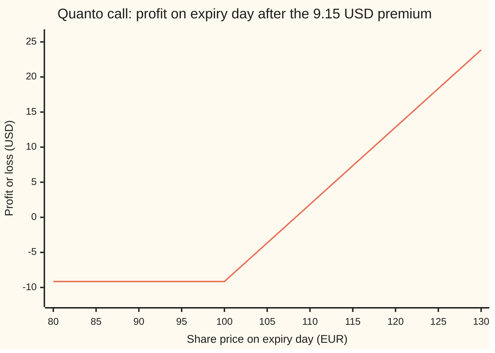
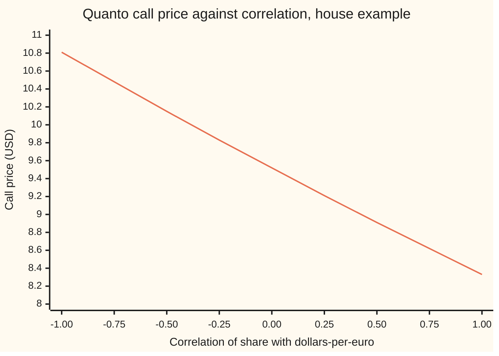

# Quanto option: Black-Scholes on the foreign share with its drift slowed, discounted at home, times the fixed rate

[Syllabus](../../../SYLLABUS.md) → [Financial mathematics](../README.md) → [Quantos and composites](../README.md#s24) → Quanto option

---

## General Overview

A share trades in Frankfurt at 100 euros. A fund in New York wants a one-year call on it: the right to the share's gain above 100 euros. The fund thinks in dollars and wants no opinion on the euro. So the contract fixes the conversion on day one: every euro of gain is paid as 1.10 dollars, whatever the euro is worth next year. Today the euro costs 1.15 dollars. The contract never uses that number.

An option on a foreign asset, paid in home currency at a rate written into the contract, is a **quanto option** (short for "quantity-adjusting"). The fixed rate removes the currency's level from the payoff. It does not remove the currency from the price. The currency still wobbles, and it wobbles partly in step with the share. That co-movement slows the share's growth in the pricing arithmetic, and the call gets cheaper.

With US rates at 5%, euro rates at 3%, a 1% dividend, share volatility 20%, currency volatility 10% and correlation 0.30, the call costs **9.15 dollars per share**: 91,516.29 dollars on 10,000 shares. Price it as if the share grew at its ordinary euro rate and it comes out at 9.52 dollars, 4% too dear.

**A quanto call is the Black-Scholes call on the foreign share, with the share's growth rate cut by correlation times the two volatilities, discounted at the home rate and multiplied by the fixed rate; today's exchange rate cancels out.**

**What kind of fact this is:** a model: share and currency are taken to wander as two linked random walks with constant volatilities and a constant correlation, an assumption rather than a law; inside the model the price is a theorem, proved on this card in Why it works.

### The picture: what the fund walks away with

The share's price in euros on expiry day runs across. The fund's profit in dollars, after the 9.15-dollar premium, runs up.



One line: the profit. It is flat at −9.15 dollars below the 100-euro strike, then climbs 1.10 dollars for every euro of gain, crossing zero at a share price of 108.32 euros. The slope is the fixed rate. An ordinary euro call converted at the market rate would have a slope that nobody knows until expiry.

---

## The formula

$$C = \bar{X}\left[\,S\,e^{(\mu - r_d)T}\,N(d_1) \;-\; K\,e^{-r_d T}\,N(d_2)\right], \qquad \mu = r_f - q - \rho\,\sigma_S\,\sigma_X$$

**Read it aloud: the share you might receive minus the cash you might hand over, each weighted by its own chance and discounted at the home rate, with the share's growth slowed by correlation times the two volatilities, all converted once at the fixed rate.**

| Symbol | Plain meaning | In our example | Push it up and the call… |
| --- | --- | --- | --- |
| $C$, $P$ | the quanto call's and put's price today | 9.151629 and 7.676433 USD | — |
| $S$, $S_T$ | the share's price in euros today, and on expiry day | 100 EUR | rises: more gain to be paid for |
| $K$ | the strike, in euros: the level the share must beat | 100 EUR | falls: further to climb |
| $\bar{X}$ | the fixed rate written into the contract ("X-bar"), dollars per euro | 1.10 | rises in proportion: each euro of gain buys more dollars |
| $X_0$, $X_T$ | the market exchange rate today and on expiry day, dollars per euro | 1.15 today | does nothing: it cancels |
| $r_d$, $r_f$ | the home (dollar) and foreign (euro) interest rates, continuously compounded | 5% and 3% | $r_d$ lowers it (it discounts); $r_f$ raises it (it sets the share's growth) |
| $q$ | the share's dividend yield: cash paid out of the share each year | 1% | lowers it: dividends leave the price, and the option holder gets none |
| $\sigma_S$, $\sigma_X$ | volatility (yearly spread of log returns) of the share, and of the exchange rate | 20% and 10% | $\sigma_S$ raises it; $\sigma_X$ lowers it when $\rho$ is positive |
| $\rho$ | correlation of the share's moves with the dollars-per-euro moves, from −1 to +1 | 0.30 | lowers it: the adjustment's sign turns on it |
| $T$ | years to expiry | 1 | raises it here: more room to move outweighs a longer slowdown |
| $\mu$, $\mu_X$ | growth rates in the dollar pricing world: the share's (the "quanto drift") and the exchange rate's | 1.4%; $\mu_X$ = 2% | $\mu$ raises it |
| $N(x)$, $d_1$, $d_2$ | bell-curve area left of $x$; the two cut-offs, in standard deviations | $d_1$ = 0.17, $d_2$ = −0.03 | — |

The cut-offs are the pilot's, with $\mu$ in place of $r - q$:

$$d_1 = \frac{\ln(S/K) + (\mu + \tfrac12\sigma_S^2)\,T}{\sigma_S\sqrt{T}}, \qquad d_2 = d_1 - \sigma_S\sqrt{T}$$

In words: $d_2$ is how many standard deviations of room the share has above the strike, measured with the slowed growth; $d_1$ is one standard deviation more. Only the share's volatility $\sigma_S$ measures the room. The currency's volatility never widens the payoff; it only bends the growth rate.

The put is the mirror, and the two are tied by **quanto put-call parity**, a call minus a put being a forward contract paid at the fixed rate:

$$P = \bar{X}\left[K e^{-r_d T} N(-d_2) - S e^{(\mu - r_d)T} N(-d_1)\right], \qquad C - P = \bar{X}\,e^{-r_d T}\left(S e^{\mu T} - K\right)$$

Here $S e^{\mu T}$ = 101.41 euros is the **quanto forward**, against the ordinary euro forward of 102.02 ([The quanto adjustment](01-quanto-forward-and-adjustment.md)).

### When it holds

- **Constant volatilities.** If the share's volatility moves, the price is off by roughly vega (0.40 dollars per volatility point) times the move.
- **Constant correlation.** Correlation is estimated from history, not bought in a market, and it drifts; each 0.01 of error moves the price about 1.2 cents here. The desk that sold the option carries this risk.
- **Two linked lognormal walks.** Share and exchange rate each move by compounding random percentages, joined by one correlation. Jumps, such as a currency devaluation, break the link.
- **Constant rates, European exercise.** One payment date. Early exercise or moving rates need a tree or a simulation.
- **The quote direction.** The formula takes the exchange rate as dollars per euro. Quote it as euros per dollar and the correlation's sign flips. Conventions verified 2026-09-27: the market quotes EUR/USD as dollars per euro.

---

## Why it works

### Step 0: two prices are pinned, and the share's growth is what is left

In the dollar pricing world (the risk-neutral world of [Black–Scholes call](../08-The%20Black-Scholes%20call%20and%20put/01-black-scholes-call.md), where every dollar asset earns the dollar rate), two things an American can hold have their growth rates fixed by no-arbitrage: a euro deposit, and one share held in dollars. The share's value in dollars is its euro price times the exchange rate. Fix the product's growth and the currency's growth, and the share's growth is forced. The adjustment falls out of one fact about products.

### Step 1: a product of two things that move together grows faster than its parts

Suppose the share rises 1% and the euro rises 1%. The share's dollar value rises by the factor 1.01 × 1.01 = 1.0201, not 1.02. If they move opposite ways, 1.01 × 0.99 = 0.9999: a touch below flat.

**Moving together adds a bonus to the product; moving apart subtracts one.** Over a year of small moves the bonus accumulates to exactly $\rho\sigma_S\sigma_X$ per year: correlation times the two volatilities. Here that is 0.30 × 0.20 × 0.10 = 0.006, or 0.6% a year.

### Step 2: the currency's growth is fixed by interest rates

One euro on deposit grows at the euro rate $r_f$. Held by an American, it is worth $X_t e^{r_f t}$ dollars, and in the dollar pricing world that must grow at $r_d$. So the exchange rate itself grows at $r_d - r_f$. This is covered interest parity, the currency's own forward.

### Step 3: solve for the share's growth

One share held in dollars pays the dividend $q$, so its dollar price must grow at $r_d - q$. That growth is the share's growth, plus the currency's, plus the together-bonus:

$$\mu + (r_d - r_f) + \rho\sigma_S\sigma_X = r_d - q \quad\Longrightarrow\quad \mu = r_f - q - \rho\sigma_S\sigma_X$$

The home rate cancels from both sides. What remains is the euro growth rate $r_f - q$ = 2%, cut by 0.6% to 1.4%. With positive correlation the share is high when the euro is strong, and the fixed rate is stingy in exactly those states, where the option pays. The price falls; hence the minus sign.

The Monte Carlo road in the code tests this directly. It simulates both assets with the slowed growth. The average dollar value of one share comes out at 119.67, against the required 119.69: a third of a standard error apart (one standard error is 0.07). With the unslowed growth the share would be worth 120.41 on average, eleven standard errors away from the simulation.

### Step 4: the option is Black-Scholes with that growth

With growth $\mu$ in the dollar world, the share at expiry is lognormal (its logarithm follows a bell curve). The payoff is $\bar{X}$ times the ordinary call payoff, in dollars, so

$$C = \bar{X}\,e^{-r_d T}\,\mathbb{E}\big[\max(S_T - K, 0)\big] = \bar{X}\,e^{-r_d T}\big[S e^{\mu T} N(d_1) - K N(d_2)\big]$$

where $\mathbb{E}$ is the average in the dollar pricing world. The average is the pilot's: split the payoff into a share half and a cash half, and complete the square in the share half. Folding $e^{\mu T}$ into $e^{-r_d T}$ gives the formula.

<details>
<summary>Detailed proof</summary>

Let the share and exchange rate follow $dS_t/S_t = \mu\,dt + \sigma_S\,dW^S_t$ and $dX_t/X_t = \mu_X\,dt + \sigma_X\,dW^X_t$ in the dollar pricing world, where $W^S$ and $W^X$ are standard Brownian motions whose increments have correlation $\rho$, and $\mu$, $\mu_X$ are unknown.

**Currency.** The euro deposit's dollar value $X_t e^{r_f t}$ has growth $\mu_X + r_f$; it pays no income, so $\mu_X + r_f = r_d$.

**Share in dollars.** Ito's product rule gives $d(S_t X_t) = S_t\,dX_t + X_t\,dS_t + d\langle S,X\rangle_t$, and the last term, the accumulated product of the two moves, is $\rho\sigma_S\sigma_X S_t X_t\,dt$. So $S_t X_t$ grows at $\mu + \mu_X + \rho\sigma_S\sigma_X$. Its total return including the dividend must be $r_d$, so $\mu + \mu_X + \rho\sigma_S\sigma_X = r_d - q$. Substituting $\mu_X = r_d - r_f$ gives $\mu = r_f - q - \rho\sigma_S\sigma_X$.

**Expectation.** Then $S_T = S\exp\big((\mu - \tfrac12\sigma_S^2)T + \sigma_S\sqrt{T}\,Z\big)$ with $Z$ a standard normal. On the event $S_T > K$, that is $Z > -d_2$, the cash half averages to $K N(d_2)$. The share half carries a factor $e^{\sigma_S\sqrt{T}z}$ against the bell curve's $e^{-z^2/2}$; completing the square shifts the curve by $\sigma_S\sqrt{T}$ and multiplies by $e^{\frac12\sigma_S^2T}$, which cancels the $-\tfrac12\sigma_S^2T$ in the growth and turns the lower limit $-d_2$ into $-d_1$. The share half is $S e^{\mu T} N(d_1)$. Multiply the difference by $\bar{X} e^{-r_d T}$. $\blacksquare$

</details>

### Step 5: why today's exchange rate cancels

The payoff names the share, the strike and the fixed rate. The market rate enters only through how it wobbles, $\sigma_X$, and how that wobble lines up with the share's, $\rho$. Where it happens to sit today is not in the formula.

The code's second road makes this concrete. It prices the option from inside the euro world: the share grows at its own $r_f - q$, the dollar payoff is converted into euros at the market rate on expiry day, the result is discounted at the euro rate, and only then converted to dollars at today's rate $X_0$. The quanto drift $\mu$ is never written down. Run with $X_0$ = 1.15 and again with $X_0$ = 2.00, it gives 9.151629 both times.

<details>
<summary>Why the euro world gives the same answer</summary>

In the euro pricing world the exchange rate grows at $r_d - r_f + \sigma_X^2$: the extra $\sigma_X^2$ is the together-bonus of the rate with itself, because a dollar deposit held in euros is worth $1/X_t$. Dividing the dollar payoff by $X_T$ and averaging reweights the outcomes; the reweighting is a change of measure (a switch of the unit prices are counted in), and it tilts the share's growth by exactly $-\rho\sigma_S\sigma_X$. Geman, El Karoui and Rochet (1995) give the general rule: changing the unit of account shifts each asset's growth by its co-movement with the new unit.

</details>

### The other door: a relabelled dividend

The formula is the pilot's Black-Scholes call with $r = r_d$ and a substitute dividend yield $q^{*} = r_d - r_f + q + \rho\sigma_S\sigma_X$ = 3.6%, since then $r - q^{*} = \mu$, all times $\bar{X}$. Any Black-Scholes routine prices a quanto if fed that one number. How the seller hedges it, day by day, is [Hedging a quanto](03-quanto-greeks-and-hedging.md).

---

## Worked numbers, by hand

The house quanto: $S$ = 100 euros, $K$ = 100, $\bar{X}$ = 1.10, $r_d$ = 5%, $r_f$ = 3%, $q$ = 1%, $\sigma_S$ = 20%, $\sigma_X$ = 10%, $\rho$ = 0.30, $T$ = 1 year. Today's market rate 1.15 is never used.

| Step | Arithmetic | Value |
| --- | --- | --- |
| adjustment, $-\rho\sigma_S\sigma_X$ | $-0.30 \times 0.20 \times 0.10$ | $-0.006$ |
| quanto drift $\mu$ | $0.03 - 0.01 - 0.006$ | $0.014$ |
| $\ln(S/K)$ | $\ln 1$ | $0$ |
| $d_1$ | $(0 + 0.014 + 0.02) / 0.20$ | $0.17$ |
| $d_2$ | $0.17 - 0.20$ | $-0.03$ |
| $N(d_1)$, $N(d_2)$ | bell-curve table | $0.567495$, $0.488034$ |
| share side | $100 \times e^{0.014 - 0.05} \times 0.567495$ | $54.742848$ |
| cash side | $100 \times e^{-0.05} \times 0.488034$ | $46.423185$ |
| **quanto call** | $1.10 \times (54.742848 - 46.423185)$ | **9.151629 USD** |
| premium on 10,000 shares | $10{,}000 \times 9.151629$ | 91,516.29 USD |
| breakeven share price | $100 + 9.151629 / 1.10$ | 108.32 EUR |

So the fund pays 9.15 dollars for each share's worth of euro upside, converted at a rate it chose, with no currency bet attached. The put on the same terms costs 7.68 dollars, and call minus put is 1.48 dollars, exactly $\bar{X} e^{-r_d T}$ times the quanto forward's excess over the strike.

### What breaks if you drop a piece

Correct answer 9.151629 dollars.

| Mistake | Comes out at | What went wrong |
| --- | --- | --- |
| No adjustment: growth $r_f - q$ | 9.517781 | 4% too dear, 0.37 dollars: the same as adding 0.92 volatility points to the share in the correct formula |
| Sign flipped: $+\rho\sigma_S\sigma_X$ | 9.893673 | Twice the error: the drift moved the wrong way by the same distance |
| Today's rate 1.15 in place of the fixed 1.10 | 9.567612 | The contract never mentions 1.15 |
| Home rate $r_d$ in the growth | 10.410107 | The share grows at its own country's rate; the home rate only discounts |
| Volatility $\sqrt{\sigma_S^2 + \sigma_X^2}$ | 10.136265 | The currency does not widen the payoff; it only bends the drift |
| Dividend dropped | 9.767290 | Dividends leave the share price and the option holder never sees them |

The 0.92 points solve one equation: which share volatility makes the correct formula give 9.517781? Raising $\sigma_S$ widens the payoff and also deepens the adjustment, which contains $\sigma_S$. Between 5% and 60% volatility the price rises steadily, from 3.23 to 24.80 dollars, so exactly one answer exists there, at 20.92%. Far above, near 500%, the deepening adjustment wins and the price turns down; a second, meaningless answer sits near 8,000%.

### How the price leans on correlation, and the Greeks

Hold everything else and slide the correlation from −1 to +1:



One line: the call's price. At zero correlation it is the unadjusted 9.52 dollars; at +1 it falls to 8.33, at −1 it rises to 10.81. Negative correlation means a strong share tends to come with a weak euro, so the fixed rate over-pays exactly where the option pays.

The sensitivities (Greeks: how much the price moves per unit of each input), by nudging each input in the code:

| Greek | Value | Reading |
| --- | --- | --- |
| delta | 0.602171 USD per EUR | equals $\bar{X} e^{(\mu - r_d)T} N(d_1)$ |
| gamma | 0.020862 per EUR | how fast delta changes as the share moves |
| vega, share | 0.399181 per volatility point | the share's volatility |
| correlation | −0.012043 per 0.01 | the risk no market fully hedges |
| currency volatility | −0.036130 per volatility point | negative because $\rho$ is positive |
| today's exchange rate | 0 | cancels |

Turning these into a hedge is [Hedging a quanto](03-quanto-greeks-and-hedging.md).

---

## Code, from first principles, and it actually runs

The scripts build their own normal CDF (a series), Simpson's rule and random numbers (splitmix64 with the Box-Muller transform). The call is reached by **three independent roads**: the closed form; a two-dimensional Simpson integral in the euro world that never uses $\mu$, run at two different spot rates; and a 200,000-path Monte Carlo of share and currency together in the dollar world. The put is priced by the formula and by the euro-world integral, and the pair is checked against quanto parity. The Monte Carlo also tests Step 3: the dollar value of one share must grow at $r_d - q$, and would not without the adjustment. Every wrong number, Greek and chart point on the card is printed. The two languages agree to every printed digit.

### Python

```python
# Quanto option -- the check behind the card.  Python standard library only.
# Every number quoted on the card is printed here.  The normal CDF is a series
# written out, the integral is Simpson's rule, the random numbers are splitmix64.
from math import log, sqrt, exp, pi, cos, sin

def phi(x): return exp(-0.5 * x * x) / sqrt(2.0 * pi)      # bell-curve height
def N(x):                                                  # bell-curve area left of x
    if x < -9.0: return 0.0
    if x > 9.0: return 1.0
    term, total, k = x, x, 1
    while abs(term) > 1e-17 * abs(total):                  # x + x^3/3 + x^5/(3*5) + ...
        term *= x * x / (2 * k + 1); total += term; k += 1
    return 0.5 + phi(x) * total

S, K, XBAR, X0 = 100.0, 100.0, 1.10, 1.15   # share EUR, strike EUR, fixed USD/EUR, spot USD/EUR
RD, RF, Q = 0.05, 0.03, 0.01                # USD rate, EUR rate, dividend yield
SS, SX, RHO, T = 0.20, 0.10, 0.30, 1.0      # share vol, FX vol, correlation, years

def drift(rf, q, ss, sx, rho): return rf - q - rho * ss * sx    # mu, the slowed drift

def quanto(S, K, xbar, rd, mu, ss, T, put=False):     # road 1: the closed form
    v = ss * sqrt(T)
    d1 = (log(S / K) + (mu + 0.5 * ss * ss) * T) / v; d2 = d1 - v
    share, cash = S * exp((mu - rd) * T), K * exp(-rd * T)
    if put: return xbar * (cash * N(-d2) - share * N(-d1))
    return xbar * (share * N(d1) - cash * N(d2))

def call(ss=SS, sx=SX, rho=RHO, q=Q, S=S):
    return quanto(S, K, XBAR, RD, drift(RF, q, ss, sx, rho), ss, T)

MU = drift(RF, Q, SS, SX, RHO)
D1 = (log(S / K) + (MU + 0.5 * SS * SS) * T) / (SS * sqrt(T)); D2 = D1 - SS * sqrt(T)
C, P = call(), quanto(S, K, XBAR, RD, MU, SS, T, put=True)

def simpson(f, a, b, n):                    # Simpson's rule, n even
    h, total = (b - a) / n, 0.0
    for i in range(n + 1): total += (1 if i in (0, n) else 4 if i % 2 else 2) * f(a + i * h)
    return h / 3 * total

def euro_world(x0, put=False, n=400):      # road 2: price in EUR under the EUR world, mu never used
    mS = (RF - Q - 0.5 * SS * SS) * T      # share drifts at its own rate rf - q
    mX = (RD - RF + SX * SX - 0.5 * SX * SX) * T   # USD per EUR drifts at rd - rf + sX^2 here
    zk = (log(K / S) - mS) / (SS * sqrt(T))        # share draw where S_T = K
    def inner(z1):
        sT = S * exp(mS + SS * sqrt(T) * z1)
        def g(z2):
            xT = x0 * exp(mX + SX * sqrt(T) * (RHO * z1 + sqrt(1 - RHO * RHO) * z2))
            return XBAR * max(K - sT if put else sT - K, 0.0) / xT * phi(z2)   # USD paid, in EUR
        return simpson(g, -9.0, 9.0, n) * phi(z1)
    lo, hi = (-9.0, zk) if put else (zk, 9.0)
    return x0 * exp(-RF * T) * simpson(inner, lo, hi, n)    # EUR price, converted at today's spot

C_115, C_200, P_int = euro_world(1.15), euro_world(2.00), euro_world(1.15, put=True)

state = [20260927]                          # road 3: Monte Carlo in the USD world, both assets
def u01():
    state[0] = (state[0] + 0x9E3779B97F4A7C15) & (2**64 - 1); z = state[0]
    z = ((z ^ (z >> 30)) * 0xBF58476D1CE4E5B9) & (2**64 - 1)
    z = ((z ^ (z >> 27)) * 0x94D049BB133111EB) & (2**64 - 1)
    return ((z ^ (z >> 31)) >> 11) * 2.0**-53
n_mc, sp, sp2, sv, sv2 = 200000, 0.0, 0.0, 0.0, 0.0
for _ in range(n_mc // 2):
    r, a = sqrt(-2.0 * log(1.0 - u01())), 2.0 * pi * u01()
    z1, z2 = r * cos(a), r * sin(a)
    for s1, s2 in ((z1, z2), (-z1, -z2)):              # each draw and its mirror
        sT = S * exp((MU - 0.5 * SS * SS) * T + SS * sqrt(T) * s1)
        xT = X0 * exp((RD - RF - 0.5 * SX * SX) * T + SX * sqrt(T) * (RHO * s1 + sqrt(1 - RHO * RHO) * s2))
        pay = XBAR * max(sT - K, 0.0); sp += pay; sp2 += pay * pay
        v = sT * xT; sv += v; sv2 += v * v                # one share, valued in USD
mc = exp(-RD * T) * sp / n_mc; mc_se = exp(-RD * T) * sqrt((sp2 / n_mc - (sp / n_mc) ** 2) / n_mc)
mv, mv_se = sv / n_mc, sqrt((sv2 / n_mc - (sv / n_mc) ** 2) / n_mc)
need_v, unadj_v = S * X0 * exp((RD - Q) * T), S * X0 * exp((RD - Q + RHO * SS * SX) * T)

def bisect(f, lo, hi):                       # root finder for the vol-point translation
    for _ in range(200):
        mid = 0.5 * (lo + hi)
        if (f(lo) > 0) == (f(mid) > 0): lo = mid
        else: hi = mid
    return 0.5 * (lo + hi)
no_adj = quanto(S, K, XBAR, RD, RF - Q, SS, T)
flipped = quanto(S, K, XBAR, RD, RF - Q + RHO * SS * SX, SS, T)
vol_eq = bisect(lambda s: call(ss=s) - no_adj, 0.05, 0.60)
h = 1e-4
delta_fd = (call(S=S + h) - call(S=S - h)) / (2 * h); delta_an = XBAR * exp((MU - RD) * T) * N(D1)

rows = [("1.01 x 1.01, moving together", 1.01 * 1.01), ("1.01 x 0.99, moving apart", 1.01 * 0.99),
    ("euro growth rf - q", RF - Q), ("currency growth rd - rf", RD - RF),
    ("adjustment -rho sS sX", -RHO * SS * SX), ("mu = rf - q - rho sS sX", MU), ("d1", D1), ("d2", D2),
    ("N(d1)", N(D1)), ("N(d2)", N(D2)), ("share side S e^(mu-rd)T N(d1)", S * exp((MU - RD) * T) * N(D1)),
    ("cash side K e^-rdT N(d2)", K * exp(-RD * T) * N(D2)), ("1 formula, call", C),
    ("2 EUR world, spot 1.15", C_115), ("2 EUR world, spot 2.00", C_200),
    ("3 Monte Carlo, 200000 paths", mc), ("  standard error", mc_se),
    ("formula, put", P), ("EUR world, put", P_int), ("  C - P, both by EUR world", C_115 - P_int),
    ("  Xbar e^-rdT (S e^muT - K)", XBAR * exp(-RD * T) * (S * exp(MU * T) - K)),
    ("MC mean of S_T X_T, USD", mv), ("  standard error", mv_se),
    ("  required S X0 e^(rd-q)T", need_v), ("  if drift were rf - q", unadj_v),
    ("substitute dividend q*", RD - RF + Q + RHO * SS * SX),
    ("quanto forward S e^muT", S * exp(MU * T)), ("euro forward S e^(rf-q)T", S * exp((RF - Q) * T)),
    ("premium on 10,000 shares", 10000 * C), ("breakeven share K + C/Xbar", K + C / XBAR),
    ("wrong: no adjustment", no_adj), ("  error, USD", no_adj - C),
    ("  too dear, percent", 100 * (no_adj / C - 1)),
    ("  as share vol, points", 100 * (vol_eq - SS)), ("wrong: sign flipped", flipped),
    ("wrong: spot 1.15 for Xbar", C / XBAR * X0), ("wrong: rd in the drift", quanto(S, K, XBAR, RD, RD - Q - RHO * SS * SX, SS, T)),
    ("wrong: vol sqrt(sS^2+sX^2)", quanto(S, K, XBAR, RD, MU, sqrt(SS * SS + SX * SX), T)),
    ("wrong: dividend dropped", call(q=0.0)),
    ("delta, USD per EUR, bump", delta_fd), ("delta, Xbar e^(mu-rd)T N(d1)", delta_an),
    ("gamma, bump", (call(S=S + 0.01) - 2 * C + call(S=S - 0.01)) / 1e-4),
    ("vega, per share-vol point", (call(ss=SS + h) - call(ss=SS - h)) / (2 * h) / 100),
    ("per 0.01 of correlation", (call(rho=RHO + h) - call(rho=RHO - h)) / (2 * h) / 100),
    ("per FX-vol point", (call(sx=SX + h) - call(sx=SX - h)) / (2 * h) / 100)]
for name, v in rows: print(f"{name:<32}{v:>14.6f}")
print("chart, correlation " + " ".join(f"{r:6.2f}" for r in (-1, -0.75, -0.5, -0.25, 0, 0.25, 0.5, 0.75, 1)))
print("chart, call USD    " + " ".join(f"{call(rho=r):6.2f}" for r in (-1, -0.75, -0.5, -0.25, 0, 0.25, 0.5, 0.75, 1)))
print("chart, share EUR   " + " ".join(f"{s:6.0f}" for s in range(80, 135, 5)))
print("chart, profit USD  " + " ".join(f"{XBAR * max(s - K, 0) - C:6.2f}" for s in range(80, 135, 5)))

assert abs(C - 9.151629) < 5e-7, "formula vs the hand-worked 9.151629"
assert abs(C_115 - C) < 1e-6, "EUR-world road, spot 1.15, lands on the formula"
assert abs(C_200 - C) < 1e-6, "EUR-world road, spot 2.00: today's rate cancels"
assert abs(mc - C) < 4 * mc_se, "Monte Carlo within four standard errors"
assert abs(P - P_int) < 1e-6, "formula put vs EUR-world put"
assert abs((C_115 - P_int) - XBAR * exp(-RD * T) * (S * exp(MU * T) - K)) < 1e-6, "quanto put-call parity"
assert abs(mv - need_v) < 4 * mv_se, "USD value of one share grows at rd - q"
assert abs(mv - unadj_v) > 8 * mv_se, "without the adjustment it would grow too fast"
assert abs(delta_fd - delta_an) < 1e-6, "bumped delta vs Xbar e^(mu-rd)T N(d1)"
print("ALL CHECKS PASS")
```

**Ran 2026-09-27 on macOS, Python 3.14.6, standard library only. All checks passed. Output, pasted from the run:**

```
1.01 x 1.01, moving together          1.020100
1.01 x 0.99, moving apart             0.999900
euro growth rf - q                    0.020000
currency growth rd - rf               0.020000
adjustment -rho sS sX                -0.006000
mu = rf - q - rho sS sX               0.014000
d1                                    0.170000
d2                                   -0.030000
N(d1)                                 0.567495
N(d2)                                 0.488034
share side S e^(mu-rd)T N(d1)        54.742848
cash side K e^-rdT N(d2)             46.423185
1 formula, call                       9.151629
2 EUR world, spot 1.15                9.151629
2 EUR world, spot 2.00                9.151629
3 Monte Carlo, 200000 paths           9.117707
  standard error                      0.032144
formula, put                          7.676433
EUR world, put                        7.676433
  C - P, both by EUR world            1.475196
  Xbar e^-rdT (S e^muT - K)           1.475196
MC mean of S_T X_T, USD             119.670082
  standard error                      0.067465
  required S X0 e^(rd-q)T           119.693239
  if drift were rf - q              120.413557
substitute dividend q*                0.036000
quanto forward S e^muT              101.409846
euro forward S e^(rf-q)T            102.020134
premium on 10,000 shares          91516.289491
breakeven share K + C/Xbar          108.319663
wrong: no adjustment                  9.517781
  error, USD                          0.366152
  too dear, percent                   4.000954
  as share vol, points                0.917398
wrong: sign flipped                   9.893673
wrong: spot 1.15 for Xbar             9.567612
wrong: rd in the drift               10.410107
wrong: vol sqrt(sS^2+sX^2)           10.136265
wrong: dividend dropped               9.767290
delta, USD per EUR, bump              0.602171
delta, Xbar e^(mu-rd)T N(d1)          0.602171
gamma, bump                           0.020862
vega, per share-vol point             0.399181
per 0.01 of correlation              -0.012043
per FX-vol point                     -0.036130
chart, correlation  -1.00  -0.75  -0.50  -0.25   0.00   0.25   0.50   0.75   1.00
chart, call USD     10.81  10.48  10.15   9.83   9.52   9.21   8.91   8.62   8.33
chart, share EUR       80     85     90     95    100    105    110    115    120    125    130
chart, profit USD   -9.15  -9.15  -9.15  -9.15  -9.15  -3.65   1.85   7.35  12.85  18.35  23.85
ALL CHECKS PASS
```

### Rust

```rust
// Quanto option -- the check behind the card.  Rust std only, no crates.
// Every number quoted on the card is printed here.  The normal CDF is a series
// written out, the integral is Simpson's rule, the random numbers are splitmix64.
use std::f64::consts::PI;

const S: f64 = 100.0; const K: f64 = 100.0; const XBAR: f64 = 1.10; const X0: f64 = 1.15;
const RD: f64 = 0.05; const RF: f64 = 0.03; const Q: f64 = 0.01;
const SS: f64 = 0.20; const SX: f64 = 0.10; const RHO: f64 = 0.30; const T: f64 = 1.0;

fn phi(x: f64) -> f64 { (-0.5 * x * x).exp() / (2.0 * PI).sqrt() }
fn n_cdf(x: f64) -> f64 {
    if x < -9.0 { return 0.0; }
    if x > 9.0 { return 1.0; }
    let (mut term, mut total, mut k) = (x, x, 1.0);
    while term.abs() > 1e-17 * total.abs() {            // x + x^3/3 + x^5/(3*5) + ...
        term *= x * x / (2.0 * k + 1.0); total += term; k += 1.0;
    }
    0.5 + phi(x) * total
}
fn drift(rf: f64, q: f64, ss: f64, sx: f64, rho: f64) -> f64 { rf - q - rho * ss * sx }
fn quanto(s: f64, k: f64, xbar: f64, rd: f64, mu: f64, ss: f64, t: f64, put: bool) -> f64 {
    let v = ss * t.sqrt();                               // road 1: the closed form
    let d1 = ((s / k).ln() + (mu + 0.5 * ss * ss) * t) / v; let d2 = d1 - v;
    let (share, cash) = (s * ((mu - rd) * t).exp(), k * (-rd * t).exp());
    if put { xbar * (cash * n_cdf(-d2) - share * n_cdf(-d1)) } else { xbar * (share * n_cdf(d1) - cash * n_cdf(d2)) }
}
fn call(ss: f64, sx: f64, rho: f64, q: f64, s: f64) -> f64 { quanto(s, K, XBAR, RD, drift(RF, q, ss, sx, rho), ss, T, false) }
fn simpson(f: &dyn Fn(f64) -> f64, a: f64, b: f64, n: usize) -> f64 {
    let h = (b - a) / n as f64; let mut total = 0.0;
    for i in 0..=n {
        let w = if i == 0 || i == n { 1.0 } else if i % 2 == 1 { 4.0 } else { 2.0 };
        total += w * f(a + i as f64 * h);
    }
    h / 3.0 * total
}
fn euro_world(x0: f64, put: bool, n: usize) -> f64 {  // road 2: EUR world, mu never used
    let m_s = (RF - Q - 0.5 * SS * SS) * T;              // share drifts at its own rate rf - q
    let m_x = (RD - RF + SX * SX - 0.5 * SX * SX) * T;   // USD per EUR drifts at rd - rf + sX^2
    let zk = ((K / S).ln() - m_s) / (SS * T.sqrt());
    let inner = |z1: f64| -> f64 {
        let s_t = S * (m_s + SS * T.sqrt() * z1).exp();
        let g = |z2: f64| -> f64 {
            let x_t = x0 * (m_x + SX * T.sqrt() * (RHO * z1 + (1.0 - RHO * RHO).sqrt() * z2)).exp();
            XBAR * (if put { K - s_t } else { s_t - K }).max(0.0) / x_t * phi(z2)
        };
        simpson(&g, -9.0, 9.0, n) * phi(z1)
    };
    let (lo, hi) = if put { (-9.0, zk) } else { (zk, 9.0) };
    x0 * (-RF * T).exp() * simpson(&inner, lo, hi, n)
}
struct Rng(u64);
impl Rng {
    fn u01(&mut self) -> f64 {
        self.0 = self.0.wrapping_add(0x9E3779B97F4A7C15); let mut z = self.0;
        z = (z ^ (z >> 30)).wrapping_mul(0xBF58476D1CE4E5B9);
        z = (z ^ (z >> 27)).wrapping_mul(0x94D049BB133111EB);
        ((z ^ (z >> 31)) >> 11) as f64 * 2f64.powi(-53)
    }
}
fn bisect(f: &dyn Fn(f64) -> f64, mut lo: f64, mut hi: f64) -> f64 {
    for _ in 0..200 {
        let mid = 0.5 * (lo + hi);
        if (f(lo) > 0.0) == (f(mid) > 0.0) { lo = mid; } else { hi = mid; }
    }
    0.5 * (lo + hi)
}
fn main() {
    let mu = drift(RF, Q, SS, SX, RHO);
    let d1 = ((S / K).ln() + (mu + 0.5 * SS * SS) * T) / (SS * T.sqrt()); let d2 = d1 - SS * T.sqrt();
    let c = call(SS, SX, RHO, Q, S); let p = quanto(S, K, XBAR, RD, mu, SS, T, true);
    let (c115, c200, p_int) = (euro_world(1.15, false, 400), euro_world(2.00, false, 400), euro_world(1.15, true, 400));
    // road 3: Monte Carlo in the USD world, both assets, each draw and its mirror
    let mut rng = Rng(20260927); let n_mc = 200000usize;
    let (mut sp, mut sp2, mut sv, mut sv2) = (0.0, 0.0, 0.0, 0.0);
    for _ in 0..n_mc / 2 {
        let r = (-2.0 * (1.0 - rng.u01()).ln()).sqrt(); let a = 2.0 * PI * rng.u01();
        let (z1, z2) = (r * a.cos(), r * a.sin());
        for (s1, s2) in [(z1, z2), (-z1, -z2)] {
            let s_t = S * ((mu - 0.5 * SS * SS) * T + SS * T.sqrt() * s1).exp();
            let x_t = X0 * ((RD - RF - 0.5 * SX * SX) * T + SX * T.sqrt() * (RHO * s1 + (1.0 - RHO * RHO).sqrt() * s2)).exp();
            let pay = XBAR * (s_t - K).max(0.0); sp += pay; sp2 += pay * pay;
            let v = s_t * x_t; sv += v; sv2 += v * v;
        }
    }
    let nf = n_mc as f64;
    let mc = (-RD * T).exp() * sp / nf; let mc_se = (-RD * T).exp() * ((sp2 / nf - (sp / nf).powi(2)) / nf).sqrt();
    let (mv, mv_se) = (sv / nf, ((sv2 / nf - (sv / nf).powi(2)) / nf).sqrt());
    let need_v = S * X0 * ((RD - Q) * T).exp(); let unadj_v = S * X0 * ((RD - Q + RHO * SS * SX) * T).exp();
    let no_adj = quanto(S, K, XBAR, RD, RF - Q, SS, T, false);
    let flipped = quanto(S, K, XBAR, RD, RF - Q + RHO * SS * SX, SS, T, false);
    let vol_eq = bisect(&|s: f64| call(s, SX, RHO, Q, S) - no_adj, 0.05, 0.60);
    let h = 1e-4;
    let delta_fd = (call(SS, SX, RHO, Q, S + h) - call(SS, SX, RHO, Q, S - h)) / (2.0 * h);
    let delta_an = XBAR * ((mu - RD) * T).exp() * n_cdf(d1);
    let rows: Vec<(&str, f64)> = vec![("1.01 x 1.01, moving together", 1.01 * 1.01), ("1.01 x 0.99, moving apart", 1.01 * 0.99),
        ("euro growth rf - q", RF - Q), ("currency growth rd - rf", RD - RF),
        ("adjustment -rho sS sX", -RHO * SS * SX), ("mu = rf - q - rho sS sX", mu), ("d1", d1), ("d2", d2),
        ("N(d1)", n_cdf(d1)), ("N(d2)", n_cdf(d2)), ("share side S e^(mu-rd)T N(d1)", S * ((mu - RD) * T).exp() * n_cdf(d1)),
        ("cash side K e^-rdT N(d2)", K * (-RD * T).exp() * n_cdf(d2)), ("1 formula, call", c),
        ("2 EUR world, spot 1.15", c115), ("2 EUR world, spot 2.00", c200),
        ("3 Monte Carlo, 200000 paths", mc), ("  standard error", mc_se),
        ("formula, put", p), ("EUR world, put", p_int), ("  C - P, both by EUR world", c115 - p_int),
        ("  Xbar e^-rdT (S e^muT - K)", XBAR * (-RD * T).exp() * (S * (mu * T).exp() - K)),
        ("MC mean of S_T X_T, USD", mv), ("  standard error", mv_se),
        ("  required S X0 e^(rd-q)T", need_v), ("  if drift were rf - q", unadj_v),
        ("substitute dividend q*", RD - RF + Q + RHO * SS * SX),
        ("quanto forward S e^muT", S * (mu * T).exp()), ("euro forward S e^(rf-q)T", S * ((RF - Q) * T).exp()),
        ("premium on 10,000 shares", 10000.0 * c), ("breakeven share K + C/Xbar", K + c / XBAR),
        ("wrong: no adjustment", no_adj), ("  error, USD", no_adj - c),
        ("  too dear, percent", 100.0 * (no_adj / c - 1.0)),
        ("  as share vol, points", 100.0 * (vol_eq - SS)), ("wrong: sign flipped", flipped),
        ("wrong: spot 1.15 for Xbar", c / XBAR * X0), ("wrong: rd in the drift", quanto(S, K, XBAR, RD, RD - Q - RHO * SS * SX, SS, T, false)),
        ("wrong: vol sqrt(sS^2+sX^2)", quanto(S, K, XBAR, RD, mu, (SS * SS + SX * SX).sqrt(), T, false)),
        ("wrong: dividend dropped", call(SS, SX, RHO, 0.0, S)),
        ("delta, USD per EUR, bump", delta_fd), ("delta, Xbar e^(mu-rd)T N(d1)", delta_an),
        ("gamma, bump", (call(SS, SX, RHO, Q, S + 0.01) - 2.0 * c + call(SS, SX, RHO, Q, S - 0.01)) / 1e-4),
        ("vega, per share-vol point", (call(SS + h, SX, RHO, Q, S) - call(SS - h, SX, RHO, Q, S)) / (2.0 * h) / 100.0),
        ("per 0.01 of correlation", (call(SS, SX, RHO + h, Q, S) - call(SS, SX, RHO - h, Q, S)) / (2.0 * h) / 100.0),
        ("per FX-vol point", (call(SS, SX + h, RHO, Q, S) - call(SS, SX - h, RHO, Q, S)) / (2.0 * h) / 100.0)];
    for (name, v) in &rows { println!("{:<32}{:>14.6}", name, v); }
    let rhos = [-1.0, -0.75, -0.5, -0.25, 0.0, 0.25, 0.5, 0.75, 1.0];
    println!("chart, correlation {}", rhos.iter().map(|r| format!("{:6.2}", r)).collect::<Vec<_>>().join(" "));
    println!("chart, call USD    {}", rhos.iter().map(|&r| format!("{:6.2}", call(SS, SX, r, Q, S))).collect::<Vec<_>>().join(" "));
    let shares: Vec<f64> = (0..11).map(|i| 80.0 + 5.0 * i as f64).collect();
    println!("chart, share EUR   {}", shares.iter().map(|s| format!("{:6.0}", s)).collect::<Vec<_>>().join(" "));
    println!("chart, profit USD  {}", shares.iter().map(|&s| format!("{:6.2}", XBAR * (s - K).max(0.0) - c)).collect::<Vec<_>>().join(" "));

    assert!((c - 9.151629).abs() < 5e-7, "formula vs the hand-worked 9.151629");
    assert!((c115 - c).abs() < 1e-6, "EUR-world road, spot 1.15, lands on the formula");
    assert!((c200 - c).abs() < 1e-6, "EUR-world road, spot 2.00: today's rate cancels");
    assert!((mc - c).abs() < 4.0 * mc_se, "Monte Carlo within four standard errors");
    assert!((p - p_int).abs() < 1e-6, "formula put vs EUR-world put");
    assert!(((c115 - p_int) - XBAR * (-RD * T).exp() * (S * (mu * T).exp() - K)).abs() < 1e-6, "quanto put-call parity");
    assert!((mv - need_v).abs() < 4.0 * mv_se, "USD value of one share grows at rd - q");
    assert!((mv - unadj_v).abs() > 8.0 * mv_se, "without the adjustment it would grow too fast");
    assert!((delta_fd - delta_an).abs() < 1e-6, "bumped delta vs Xbar e^(mu-rd)T N(d1)");
    println!("ALL CHECKS PASS");
}
```

**Ran 2026-09-27 on macOS, rustc 1.98.1, no crates. All checks passed. Output, pasted from the run:**

```
1.01 x 1.01, moving together          1.020100
1.01 x 0.99, moving apart             0.999900
euro growth rf - q                    0.020000
currency growth rd - rf               0.020000
adjustment -rho sS sX                -0.006000
mu = rf - q - rho sS sX               0.014000
d1                                    0.170000
d2                                   -0.030000
N(d1)                                 0.567495
N(d2)                                 0.488034
share side S e^(mu-rd)T N(d1)        54.742848
cash side K e^-rdT N(d2)             46.423185
1 formula, call                       9.151629
2 EUR world, spot 1.15                9.151629
2 EUR world, spot 2.00                9.151629
3 Monte Carlo, 200000 paths           9.117707
  standard error                      0.032144
formula, put                          7.676433
EUR world, put                        7.676433
  C - P, both by EUR world            1.475196
  Xbar e^-rdT (S e^muT - K)           1.475196
MC mean of S_T X_T, USD             119.670082
  standard error                      0.067465
  required S X0 e^(rd-q)T           119.693239
  if drift were rf - q              120.413557
substitute dividend q*                0.036000
quanto forward S e^muT              101.409846
euro forward S e^(rf-q)T            102.020134
premium on 10,000 shares          91516.289491
breakeven share K + C/Xbar          108.319663
wrong: no adjustment                  9.517781
  error, USD                          0.366152
  too dear, percent                   4.000954
  as share vol, points                0.917398
wrong: sign flipped                   9.893673
wrong: spot 1.15 for Xbar             9.567612
wrong: rd in the drift               10.410107
wrong: vol sqrt(sS^2+sX^2)           10.136265
wrong: dividend dropped               9.767290
delta, USD per EUR, bump              0.602171
delta, Xbar e^(mu-rd)T N(d1)          0.602171
gamma, bump                           0.020862
vega, per share-vol point             0.399181
per 0.01 of correlation              -0.012043
per FX-vol point                     -0.036130
chart, correlation  -1.00  -0.75  -0.50  -0.25   0.00   0.25   0.50   0.75   1.00
chart, call USD     10.81  10.48  10.15   9.83   9.52   9.21   8.91   8.62   8.33
chart, share EUR       80     85     90     95    100    105    110    115    120    125    130
chart, profit USD   -9.15  -9.15  -9.15  -9.15  -9.15  -3.65   1.85   7.35  12.85  18.35  23.85
ALL CHECKS PASS
```

> [!TIP]
> **Try changing**
> - **Correlation to −1.** Guess first: cheaper or dearer? Set `RHO = -1.0`. The call rises to 10.81 dollars: the fixed rate now pays most where the option pays.
> - **Correlation to 0.** Guess first. Set `RHO = 0.0`. The call is 9.52 dollars, exactly the "no adjustment" number: with no co-movement there is nothing to adjust.
> - **Today's rate to 2.00.** Guess first. The euro-world road already runs it: 9.151629, unchanged to six decimals.
> - **Dividend to 0.** Guess first. Set `Q = 0.0`. The call rises to 9.767290 dollars: more of the share's growth stays in its price.

---

## The usual mistake

> [!warning]
> **Getting the sign backwards.** The adjustment is $-\rho\sigma_S\sigma_X$ when the exchange rate is quoted as home currency per foreign unit (dollars per euro) and $\rho$ is the correlation with that quote. Quote the rate the other way, euros per dollar, and the same market has the opposite correlation, so textbooks using that quote write a plus. Mixing a formula from one convention with a correlation from the other gives 9.893673 instead of 9.151629: the error doubled, not removed.
>
> - **Using today's exchange rate.** It appears nowhere; putting 1.15 where the fixed 1.10 belongs gives 9.567612.
> - **Growing the share at the home rate.** The dollar rate discounts; the euro rate sets the share's growth. Swapping them gives 10.410107, the largest error here.
> - **Adding the currency's volatility to the share's.** The payoff depends on the share alone; $\sqrt{\sigma_S^2+\sigma_X^2}$ gives 10.136265.
> - **Reading the quanto as currency-risk free for the seller.** The buyer is free of the euro's level. The seller is not: the hedge in euro shares leaves a euro balance that changes with every share move, and the correlation cannot be locked in.

---

## Where you meet it in real life

- **Dollar-settled futures on foreign indices.** Nikkei 225 futures that pay a fixed number of dollars per index point are quanto futures; their fair level is the quanto forward, 101.41 against 102.02 in the house example ([The quanto adjustment](01-quanto-forward-and-adjustment.md)).
- **Structured notes.** A bank sells a US saver a note that pays the rise of a European index in dollars. The option inside is a quanto call, often with the fixed rate set to 1 so a point of index gain is a dollar.
- **Warrants on foreign indices.** Index warrants listed at home on foreign markets were early quanto products, and the correlation term decided whether they were priced fairly.
- **The alternative the buyer turned down.** A composite option pays the foreign gain converted at the market rate on the day, so the buyer keeps the currency bet: [Composite option](04-composite-option.md).
- **Reading correlation from prices.** Where quanto prices are quoted, the formula can be run backwards to the correlation the market charges: [Correlation from a quanto price](05-implied-correlation-from-a-quanto.md).

> **Say it back**
> A quanto call pays a foreign share's gain in home currency at a rate fixed on day one. Its price is the Black-Scholes call on the foreign share, discounted at the home rate and multiplied by the fixed rate. The one change is the share's growth: its own rate less dividends, cut by correlation times the two volatilities. That cut comes from the product of share and currency growing faster when they move together. Today's exchange rate cancels; its wobble and its correlation with the share do not.

---

## What this builds on

- [The quanto adjustment](01-quanto-forward-and-adjustment.md): the slowed drift and the quanto forward 101.41, which this card turns into an option price.
- [Black–Scholes call](../08-The%20Black-Scholes%20call%20and%20put/01-black-scholes-call.md): the two halves, the two chances $N(d_1)$ and $N(d_2)$, and the completed square reused in Step 4.

---

## Where this goes next

- [Hedging a quanto](03-quanto-greeks-and-hedging.md): the Greeks above turned into a hedge in euro shares and a currency position, and what the correlation risk costs.
- [Composite option](04-composite-option.md): the same share paid at the market rate instead, where the currency's volatility widens the payoff rather than bending the drift.

The price is known; what this card leaves open is how the seller, holding euro shares against a dollar promise, stays hedged as share, currency and correlation move.

---

## Sources

Verified 2026-09-27: every link below resolves to the publisher's page.

- Garman, Mark B., and Steven W. Kohlhagen. "Foreign Currency Option Values." *Journal of International Money and Finance* 2, no. 3 (1983): 231–237. [doi:10.1016/S0261-5606(83)80001-1](https://doi.org/10.1016/S0261-5606(83)80001-1). Two interest rates in one option formula, and the currency's growth at $r_d - r_f$ used in Step 2.
- Geman, Hélyette, Nicole El Karoui, and Jean-Charles Rochet. "Changes of Numéraire, Changes of Probability Measure and Option Pricing." *Journal of Applied Probability* 32, no. 2 (1995): 443–458. [doi:10.2307/3215299](https://doi.org/10.2307/3215299). The change of unit behind the euro-world road.
- Hull, John C. *Options, Futures, and Other Derivatives*, 11th ed. Pearson. [Publisher page](https://www.pearson.com/en-us/subject-catalog/p/options-futures-and-other-derivatives/P200000005938). The chapter on convexity, timing and quanto adjustments states the adjustment; check which way its exchange rate is quoted before copying the sign.
- Musiela, Marek, and Marek Rutkowski. *Martingale Methods in Financial Modelling*, 2nd ed. Springer, 2005. [Publisher page](https://link.springer.com/book/10.1007/b137866). Quantos and composites derived as changes of measure, with the correlated two-asset model.
