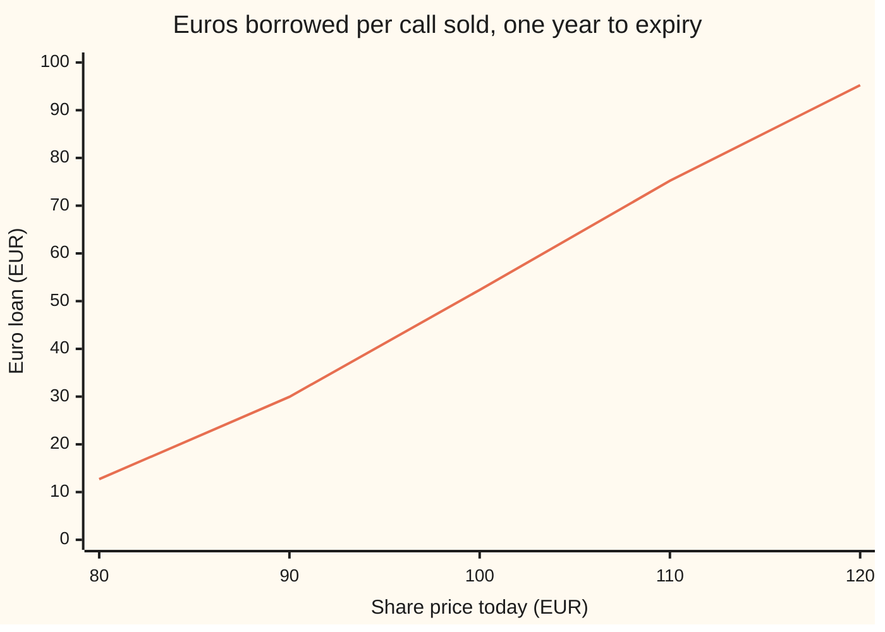
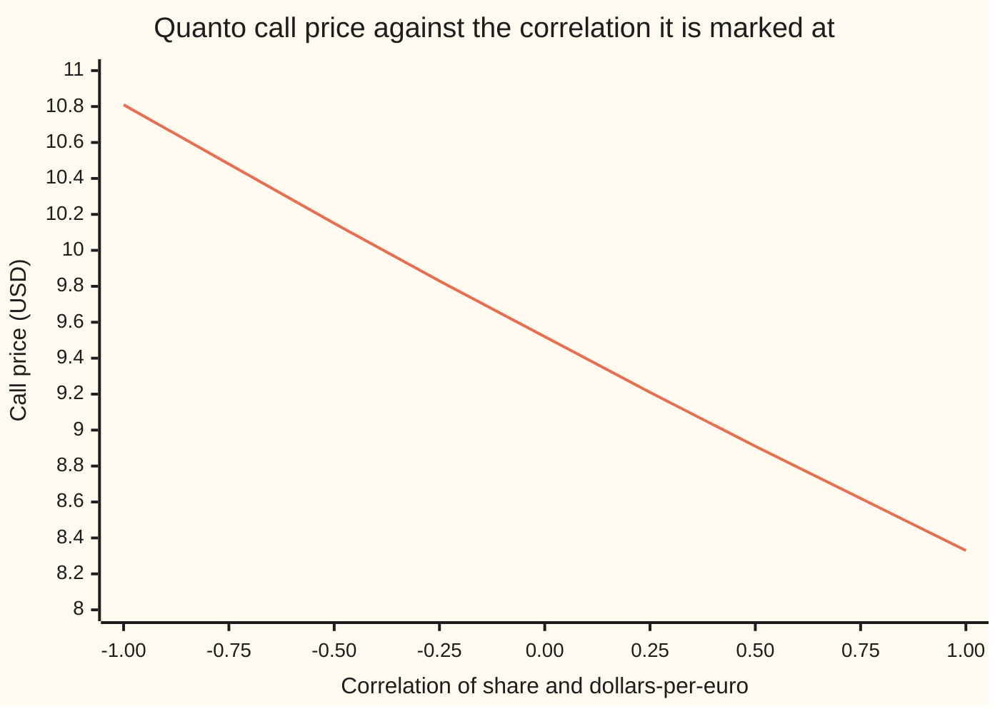

# Hedging a quanto: shares in euros, a currency hedge that resizes itself, and the Greek nobody else has, sensitivity to correlation

[Syllabus](../../../SYLLABUS.md) → [Financial mathematics](../../../SYLLABUS.md#w12) → [Quantos and composites](../../../SYLLABUS.md#w12-s24) → Hedging a quanto

---

## General Overview

A dealing desk in New York has sold a one-year call on a Frankfurt share. The share trades at 100 euros. The buyer, a dollar fund, is paid 1.10 dollars for every euro the share ends above 100, whatever the euro is worth next year. That is the quanto call of [Quanto option](02-quanto-option.md), and the desk took in 9.15 dollars for it. Today one euro costs 1.15 dollars.

The desk now owes a payment it cannot predict. Its defence is to build a copy of the call out of things it can trade, and keep the copy up to date. The copy has three pieces. The desk buys about half a Frankfurt share per call. It pays for the shares with euros it borrows, not with dollars. It keeps the 9.15 dollars in a dollar account. As the share moves, both the share count and the euro loan must be changed.

The price itself does not depend on today's exchange rate at all. That tempts people to think the desk needs no currency hedge. It does. The shares are a euro asset worth 60.22 dollars per call, and every cent of that value moves with the euro. The euro loan cancels it, and it has to track the share position euro for euro.

The price also leans on one number no market quotes: the correlation between the share and the euro. It runs from 10.81 dollars at correlation −1 to 8.33 dollars at +1, falling about 1.2 dollars per unit of correlation. That is the Greek nobody else has, and the desk cannot hedge it with anything it can buy.

**To hedge a quanto call, hold the price's dollar delta divided by today's exchange rate in foreign shares, borrow exactly the euro value of those shares, and keep the option's price in dollars; correlation, currency volatility and the euro rate reach the price only through the quanto drift, so their Greeks are that delta position seen through the drift.**

**What kind of fact this is:** a theorem inside a model: share and currency are taken to follow two linked random walks with constant volatilities and correlation, an assumption rather than a law; inside the model, Why it works proves that the hedge copies the call exactly.

### The picture: the euro loan follows the share

The share's price in euros runs across. The euros the desk has borrowed, per call sold, run up. Today's exchange rate is held at 1.15.



One line: the euro loan. At 80 euros the desk owes 12.71 euros per call; at 120 it owes 95.25. The loan is the euro value of the shares held, so it climbs faster than the share count: more shares, each worth more euros.

---

## The formula

$$\eta = \frac{V_S}{X}\ \text{shares}, \qquad L = \eta\,S\ \text{euros borrowed}, \qquad \text{dollar account} = V, \qquad V_S = \bar{X}\,e^{(\mu - r_d)T}\,N(d_1)$$

**Read it aloud: hold the dollar delta divided by today's dollars-per-euro in shares, borrow the euros those shares are worth, and keep the option's price in dollars; the dollar delta is the fixed rate times the discounted chance-in-shares from the quanto formula.**

Notation first, in words. $V_S$ is the **delta**: how many dollars the price moves when the share moves one euro, everything else held fixed (a partial derivative, the slope in one direction). A subscript on $V$ names the input being nudged, so $V_\rho$ is how many dollars the price moves per unit of correlation. These slopes are the **Greeks**. In the formula, $\eta$ (eta) is the number of shares held per call and $L$ the euros borrowed.

| Symbol | Plain meaning | In our example | Push it up and the hedge… |
| --- | --- | --- | --- |
| $V$ | the quanto call's price today, in dollars | 9.151629 USD | holds more dollars |
| $S$ | the share's price today, in euros | 100 EUR | holds more shares and a bigger euro loan |
| $K$ | the strike, in euros | 100 EUR | holds fewer shares |
| $\bar{X}$ | the fixed rate in the contract, dollars per euro | 1.10 | scales every Greek in proportion |
| $X$, $dX$ | the market exchange rate today, dollars per euro, and a small move in it | 1.15 | holds fewer shares; the price does not move |
| $r_d$, $r_f$ | dollar and euro interest rates, continuously compounded | 5% and 3% | $r_f$ raises the share's growth; $r_d$ discounts |
| $q$ | the share's dividend yield | 1% | slows the share's growth |
| $\sigma_S$, $\sigma_X$ | volatility (yearly spread of log returns) of the share, and of the exchange rate | 20% and 10% | $\sigma_S$ widens outcomes; $\sigma_X$ only bends the drift |
| $\rho$ | correlation of share moves with dollars-per-euro moves, from −1 to +1 | 0.30 | cheapens the call, shrinks the delta |
| $T$ | years to expiry | 1 | more time for the drift to bite |
| $\mu$, $F$ | quanto drift $r_f - q - \rho\sigma_S\sigma_X$, and quanto forward $F = S e^{\mu T}$ | 1.4%; 101.41 EUR | raises delta |
| $N$, $\varphi$, $d_1$, $d_2$ | bell-curve area and height; the two cut-offs of [Quanto option](02-quanto-option.md) | $d_1$ = 0.17 | — |

The cut-offs are $d_1 = [\ln(S/K) + (\mu + \tfrac12\sigma_S^2)T]/(\sigma_S\sqrt{T})$ and $d_2 = d_1 - \sigma_S\sqrt{T}$: how many standard deviations of room the share has above the strike, counted in shares and in cash.

The Greeks, all per call, all in dollars:

$$V_{SS} = \frac{\bar{X} e^{(\mu - r_d)T}\varphi(d_1)}{S\sigma_S\sqrt{T}}, \qquad V_{\sigma_S} = \bar{X} e^{-r_d T} F\left[\sqrt{T}\,\varphi(d_1) - \rho\sigma_X T\,N(d_1)\right]$$

$$V_\rho = -\sigma_S\sigma_X T\cdot S V_S, \qquad V_{\sigma_X} = -\rho\sigma_S T\cdot S V_S, \qquad V_{r_f} = T\cdot S V_S, \qquad V_{r_d} = -T\,V, \qquad V_X = 0$$

**Read it aloud: gamma and the width part of share vega are Black-Scholes; correlation, currency volatility and the euro rate act only through the drift, so each is the drift's own sensitivity times T times the dollar value of the delta position.**

| Greek | Plain meaning | Value | Per market unit |
| --- | --- | --- | --- |
| $V_S$ | delta: dollars per one-euro move of the share | 0.602171 | — |
| $\eta$ | shares to hold, $V_S / X$ | 0.523627 shares | — |
| $L$ | euros to borrow, $\eta S$ | 52.362724 EUR | worth 60.217133 USD |
| $V_{SS}$ | gamma: change in delta per one-euro move | 0.020862 | — |
| $V_{\sigma_S}$ | share vega | 39.918126 | 0.399181 per volatility point |
| $V_{\sigma_X}$ | currency vega | −3.613028 | −0.036130 per volatility point |
| $V_{r_d}$ | dollar rho | −9.151629 | — |
| $V_{r_f}$ | euro rho | 60.217133 | — |
| $V_\rho$ | correlation sensitivity | −1.204343 | −0.012043 per 0.01 |
| $V_X$ | sensitivity to today's exchange rate | 0 | — |

The euro rho, 60.22 dollars, equals the dollar value of the euro loan. That is no accident: a higher euro rate raises the drift, and the drift acts on the share position the loan funds.

### When it holds

- **Continuous rebalancing.** The copy is exact only if traded continuously. Rebalanced daily, it misses by a spread of 0.4563 dollars per call over the year.
- **Constant correlation and volatilities.** Correlation is estimated, not traded; each 0.01 it moves shifts the price 1.2 cents per call, and nothing on the market hedges it.
- **Euros borrowed and lent at the euro rate.** A funding spread (borrowing dearer than lending) leaks into the copy's cost every day the loan is open.
- **No jumps.** A devaluation overnight moves the exchange rate before the loan can be resized; the continuous proof says nothing about it.
- **A dividend paid as a steady yield.** A lumpy dividend changes the share count needed around its date.

---

## Why it works

### Step 0: the price ignores the exchange rate; the hedge cannot

The call's dollar price depends on the share, the rates, the volatilities and the correlation. Today's exchange rate is not among them. But the only thing that moves like the share is the share, and it is bought with euros. Owning it hands the desk a currency position the price never asked for. The hedge is the share position plus whatever cancels that currency position.

### Step 1: delta in dollars, then in shares

The price moves $V_S$ = 0.602171 dollars per euro the share moves. One share moves one euro, which is worth $X$ = 1.15 dollars today. So the desk needs $V_S / X$ shares for the dollar moves to match: 0.602171 / 1.15 = 0.523627 shares.

The quanto-option formula gives $V_S$ directly. Its share half is $\bar{X} e^{(\mu - r_d)T} S N(d_1)$, and the cut-off terms cancel on differentiation, as on the pilot [Black–Scholes call](../08-The%20Black-Scholes%20call%20and%20put/01-black-scholes-call.md): $\varphi(d_1) F = \varphi(d_2) K$. So $V_S = \bar{X} e^{(\mu - r_d)T} N(d_1)$.

### Step 2: the currency leak, and the loan that plugs it

The shares are worth $\eta S X$ dollars: 0.523627 × 100 × 1.15 = 60.22 dollars. If the euro moves by a small amount $dX$ with the share still, the shares gain $\eta S\,dX$ dollars. The call gains nothing: $V_X = 0$. So the desk is exposed to the euro by exactly the euro value of its shares, 52.36 euros.

A loan of $\eta S$ euros loses $\eta S\,dX$ dollars on the same move. Share position and loan cancel. **The currency hedge equals the euro value of the delta position**, and the desk funds the shares with it.

Everything left over is dollars: the 9.15 received, since the shares and the loan are worth 60.22 and −60.22 dollars.

### Step 3: the hedge must be resized as the share and the euro move

Both pieces depend on the state. When the share rises from 100 to 110 euros, delta rises and the desk buys shares: 0.5236 becomes 0.6838. The loan grows from 52.36 to 75.21 euros, faster than the share count, because each share is worth more euros.

The euro matters too. At $X$ = 1.25 with the share still at 100, the price and $V_S$ are unchanged, but each share is worth more dollars, so fewer are needed: 0.481737 shares, funded by a loan of 48.17 euros. A quanto has no currency delta, yet its hedge trades currency every day.

<details>
<summary>Detailed proof: the funded hedge copies the call exactly</summary>

Let the share and the exchange rate follow $dS/S = \mu\,dt + \sigma_S\,dW^S$ and $dX/X = (r_d - r_f)\,dt + \sigma_X\,dW^X$ in the dollar pricing world, where $W^S$ and $W^X$ are Brownian motions (the continuous random walks of wing 11) whose moves have correlation $\rho$. Then $dS\,dX = \rho\sigma_S\sigma_X S X\,dt$.

Hold $\eta = V_S / X$ shares, owe $L = \eta S$ euros, and keep $V$ dollars. The shares pay dividends $q S X\,dt$ dollars per share; the loan costs $r_f X\,dt$ dollars per euro; the dollars earn $r_d$. The gain over a short interval of length $\,dt$ is
$$dG = \eta\,[d(SX) + qSX\,dt] - \eta S\,[dX + r_f X\,dt] + r_d V\,dt.$$
Ito's product rule gives $d(SX) = X\,dS + S\,dX + dS\,dX$. The $dX$ terms cancel, since the loan is sized to the shares' euro value. With $\eta X = V_S$ what remains is
$$dG = V_S\,dS + (\rho\sigma_S\sigma_X + q - r_f)\,S V_S\,dt + r_d V\,dt = V_S\,dS - \mu S V_S\,dt + r_d V\,dt.$$
The call's price is the Black-Scholes price with dividend yield $r_d - \mu$, so it solves the Black-Scholes equation with that yield ([The Black-Scholes equation](../08-The%20Black-Scholes%20call%20and%20put/07-black-scholes-equation.md)): $\partial V/\partial t + \mu S V_S + \tfrac12\sigma_S^2 S^2 V_{SS} - r_d V = 0$, the first term being the price's slope in calendar time. Ito's lemma on $V(t, S)$ gives $dV = (\partial V/\partial t)\,dt + V_S\,dS + \tfrac12\sigma_S^2 S^2 V_{SS}\,dt = V_S\,dS + (r_d V - \mu S V_S)\,dt$. So $dG = dV$ at every instant.

The copy starts at $V$, needs no money added or taken out (self-financing), and gains what the call gains. At expiry $V$ equals the payoff $\bar{X}\max(S_T - K, 0)$, so the copy pays the fund. No $dW^X$ term survives anywhere: the currency risk is gone. With $\sigma_S, \sigma_X > 0$ and $|\rho| < 1$ the two random terms are independent directions, and matching them forces this $\eta$ and this $L$: the hedge is the only one. $\blacksquare$

</details>

### Step 4: most Greeks are one Greek in disguise

The price is Black-Scholes on the quanto forward $F = S e^{\mu T}$, with width $\sigma_S\sqrt{T}$, discounted at $r_d$ and scaled by $\bar{X}$. Nudging the forward moves the price by $\bar{X} e^{-r_d T} N(d_1)$ per euro of forward. Nudging the width moves it by $\bar{X} e^{-r_d T} F \varphi(d_1)$ per unit.

Correlation, currency volatility and the euro rate appear only inside $\mu$. A change in $\mu$ moves the forward by $F T$ times that change. Chain the two:

- **Correlation.** $\mu$ falls by $\sigma_S\sigma_X$ per unit of $\rho$, so $V_\rho = -\sigma_S\sigma_X T \cdot S V_S$ = −0.2 × 0.1 × 1 × 100 × 0.602171 = −1.204343.
- **Currency volatility.** $\mu$ falls by $\rho\sigma_S$ per unit of $\sigma_X$, so $V_{\sigma_X}$ = −0.3 × 0.2 × 100 × 0.602171 = −3.613028. Its sign is minus the sign of $\rho$: negative here.
- **Euro rate.** $\mu$ rises one for one, so $V_{r_f} = T S V_S$ = 60.217133.
- **Share volatility** does two jobs: it widens the outcomes, and it sits in the drift through $\rho\sigma_S\sigma_X$. Its vega is the width part minus $\rho\sigma_X T \cdot S V_S$.

The chain rule through $\mu$ is the whole story; [The Greeks of a currency option](../21-FX%20vanilla%20options%20-%20Garman-Kohlhagen%20and%20the%20desk%20conventions/03-garman-kohlhagen-greeks.md) does the same bookkeeping for a currency option, where the foreign rate plays the part $\mu$ plays here.

### Step 5: correlation is a risk the desk carries

Every other input has something to trade against it. Shares hedge delta, the euro loan hedges the currency, options on the share hedge share vega, currency options hedge currency vega. Correlation has no market of its own. The desk estimates it, marks the book at the estimate, and holds a reserve against being wrong; [Model risk](../07-Greeks%20by%20Numbers%20and%20Calibration/07-model-risk-and-parameter-stability.md) treats that practice in general.

### The other door: a tree with two coordinates

A second road to the price never writes $\mu$ down. Step share and exchange rate together on a tree with four branches per step, each with chance one quarter: the currency's shock is ±1, and the share's is $\rho$ times the currency's plus $\sqrt{1-\rho^2}$ times a second ±1. Choose the two step multipliers so that a euro deposit and a share, both held in dollars, grow at the dollar rate on average, interest and dividends included. Work backwards from expiry, discounting at $r_d$ ([Many steps](../04-Binomial%20Trees/03-multi-step-trees-and-backward-induction.md)). With 200 steps the tree's average share at expiry is 101.409869 euros, against the quanto forward 101.409846: the tree finds the slowed drift without being told it. Boyle (1988) built this kind of lattice for two assets.

---

## Worked numbers, by hand

The house quanto: $S$ = 100 euros, $K$ = 100, $\bar{X}$ = 1.10, $X$ = 1.15, $r_d$ = 5%, $r_f$ = 3%, $q$ = 1%, $\sigma_S$ = 20%, $\sigma_X$ = 10%, $\rho$ = 0.30, $T$ = 1 year.

| Step | Arithmetic | Value |
| --- | --- | --- |
| adjustment $\rho\sigma_S\sigma_X$ | 0.30 × 0.20 × 0.10 | 0.006 |
| quanto drift $\mu$ | 0.03 − 0.01 − 0.006 | 0.014 |
| $d_1$ | (0 + 0.014 + 0.02) / 0.20 | 0.17 |
| $N(d_1)$, $\varphi(d_1)$ | bell-curve table | 0.567495, 0.393219 |
| growth-and-discount factor | $e^{0.014 - 0.05}$ | 0.964640 |
| delta $V_S$ | 1.10 × 0.964640 × 0.567495 | 0.602171 USD per EUR |
| **shares** $\eta$ | 0.602171 / 1.15 | **0.523627** |
| **euro loan** $L$ | 0.523627 × 100 | **52.36 EUR** |
| its dollar value | 52.362724 × 1.15 | 60.22 USD |
| **dollar account** | the price | **9.15 USD** |
| gamma | 1.10 × 0.964640 × 0.393219 / (100 × 0.20) | 0.020862 |
| share vega | 1.10 × 0.964640 × 100 × (0.393219 − 0.03 × 0.567495), the bracket being 0.376194 | 39.918126 |
| currency vega | −0.30 × 0.20 × 100 × 0.602171 | −3.613028 |
| **correlation** | −0.20 × 0.10 × 100 × 0.602171 | **−1.204343** |
| dollar rho, euro rho | −1 × 9.151629; 100 × 0.602171 | −9.151629; 60.217133 |

So the desk that sold one call holds just over half a Frankfurt share, owes 52.36 euros, and keeps 9.15 dollars. A 0.01 rise in correlation makes the call it owes 1.2 cents cheaper, a gain the desk can neither lock in nor hedge.

### What breaks if you drop a piece

The right hedge leaves a spread of 0.4563 dollars per call after a year of daily rebalancing, across 2,000 simulated years.

| Mistake | Comes out at | What went wrong |
| --- | --- | --- |
| Shares = $V_S$, not divided by $X$ | 0.602171 shares; spread 3.1354 USD | Delta is in dollars per euro; one share moves 1.15 dollars, not 1 |
| No euro loan: shares bought with dollars | spread 7.8143 USD | "No currency delta" read as "no currency hedge"; the shares carry 52 euros of exposure |
| Euro loan sized on day one, never resized | spread 4.1212 USD | The loan must track the shares' euro value, which moves with the share and the euro |
| Share vega with the drift held fixed | 0.417246 per point, not 0.399181 | Raising $\sigma_S$ also slows the drift through $\rho\sigma_S\sigma_X$ |
| Delta from the unadjusted drift $r_f - q$ | 0.618354, not 0.602171 | The hedge over-buys by the same error that over-prices the call |

---

## How the hedge moves

The mystery: the price has no exchange rate in it, yet the desk trades euros every day. The share moved, and the loan had to follow.

### One story: the share rises

Hold the euro at 1.15 and a year to expiry, and slide the share:

| Share (EUR) | 80 | 90 | 100 | 110 | 120 |
| --- | --- | --- | --- | --- | --- |
| Shares held per call | 0.1588 | 0.3327 | 0.5236 | 0.6838 | 0.7938 |
| Euro loan (EUR) | 12.71 | 29.95 | 52.36 | 75.21 | 95.25 |

From 100 to 110 euros the share count climbs from 0.5236 to 0.6838 and the loan from 52.36 to 75.21 euros. Gamma sets the pace: the steeper delta is, the bigger the trade per euro of share move.

### One force at a time: what each broken hedge costs

Spread of the year-end hedging error per call, in dollars, across 2,000 simulated years, rebalanced daily:

```
hedge                        spread of error per call, USD
full hedge                   ██                                  0.4563
shares = V_S                 ██████████████                      3.1354
euro loan frozen             ██████████████████                  4.1212
no euro loan                 ███████████████████████████████████ 7.8143
```

The full hedge's spread comes from rebalancing once a day, not from any currency leak. A rule of thumb for daily hedging, the width part of vega times $\sigma_S$ times $\sqrt{\pi/4}$ over the square root of 252 trading days, predicts 0.465873. The simulation lands at 0.4563.

### How the price leans on correlation



One line: the call's price. It falls from 10.81 dollars at −1 to 8.33 at +1, an average slope of −1.237069 dollars per unit of correlation. At the marked 0.30 the slope is −1.204343. The line bends slightly because delta, the other factor in $V_\rho$, shrinks as the price falls.

---

## Code, from first principles, and it actually runs

The scripts build their own normal CDF (a series), a two-coordinate tree, and random numbers (splitmix64 with the Box-Muller transform). The price is reached by **three independent roads**: the closed form; the four-branch tree, which never uses the quanto drift, run at 100 and 200 steps and extrapolated; and a simulation of the desk's hedge over 2,000 years of daily rebalancing, whose average cost is the price. Every Greek is computed twice, from its formula and by bump-and-revalue (nudging one input up and down and re-pricing, [Bump and revalue](../07-Greeks%20by%20Numbers%20and%20Calibration/01-bump-and-revalue-and-common-random-numbers.md)); the correlation Greek a third time, by bumping the tree. The simulation runs four hedges side by side on the same paths: the right one and three broken ones. The two languages agree to every printed digit.

### Python

```python
# Hedging a quanto -- the check behind the card.  Python standard library only.
# Every number quoted on the card is printed here.  The normal CDF is a series
# written out, the tree is a loop, the random numbers are splitmix64.
from math import log, sqrt, exp, pi, cos, sin

def phi(x): return exp(-0.5 * x * x) / sqrt(2.0 * pi)      # bell-curve height
def N(x):                                                  # bell-curve area left of x
    if x < 0.0: return 1.0 - N(-x)
    if x > 8.5: return 1.0
    term, total, k = x, x, 0
    while term > 1e-17 * total:
        k += 1; term *= x * x / (2 * k + 1); total += term
    return 0.5 + phi(x) * total

S0, K, XBAR, X0 = 100.0, 100.0, 1.10, 1.15   # share EUR, strike EUR, fixed USD/EUR, spot USD/EUR
RD, RF, Q = 0.05, 0.03, 0.01                 # USD rate, EUR rate, dividend yield
A, B, RHO, T = 0.20, 0.10, 0.30, 1.0         # share vol, FX vol, correlation, years

def price(S=S0, a=A, b=B, rho=RHO, rd=RD, rf=RF, t=T):     # road 1: the closed form, in USD
    mu, w = rf - Q - rho * a * b, a * sqrt(t)
    d1 = (log(S / K) + (mu + 0.5 * a * a) * t) / w
    return XBAR * exp(-rd * t) * (S * exp(mu * t) * N(d1) - K * N(d1 - w))

def delta(S, t):                                           # V_S, USD per EUR of share price
    mu = RF - Q - RHO * A * B
    return XBAR * exp((mu - RD) * t) * N((log(S / K) + (mu + 0.5 * A * A) * t) / (A * sqrt(t)))

MU = RF - Q - RHO * A * B; W = A * sqrt(T)
D1 = (log(S0 / K) + (MU + 0.5 * A * A) * T) / W
V, VS = price(), delta(S0, T)
g = {"delta, USD per EUR": VS,                              # the Greeks by differentiating the formula
     "gamma, USD per EUR^2": XBAR * exp((MU - RD) * T) * phi(D1) / (S0 * W),
     "share vega, per unit": XBAR * exp(-RD * T) * S0 * exp(MU * T) * (sqrt(T) * phi(D1) - RHO * B * T * N(D1)),
     "FX vega, per unit": -RHO * A * T * S0 * VS,
     "USD rho, per unit": -T * V,
     "EUR rho, per unit": T * S0 * VS,
     "correlation, per unit": -A * B * T * S0 * VS}
h = 1e-4                                                   # the same Greeks by bump-and-revalue
bump = [(price(S=S0 + 0.01) - price(S=S0 - 0.01)) / 0.02,
        (price(S=S0 + 0.01) - 2 * V + price(S=S0 - 0.01)) / 1e-4,
        (price(a=A + h) - price(a=A - h)) / (2 * h), (price(b=B + h) - price(b=B - h)) / (2 * h),
        (price(rd=RD + h) - price(rd=RD - h)) / (2 * h), (price(rf=RF + h) - price(rf=RF - h)) / (2 * h),
        (price(rho=RHO + h) - price(rho=RHO - h)) / (2 * h)]

def tree(n, rho=RHO):              # road 2: two-asset tree; drifts come from no-arbitrage, mu never used
    hh = T / n; sh = sqrt(hh); be = sqrt(1.0 - rho * rho)
    mX = (exp(B * sh) + exp(-B * sh)) / 2.0                 # average FX step, four branches
    AX = exp((RD - RF) * hh) / mX                           # a euro deposit grows at rd in USD
    mSX = sum(exp(B * sh * e1 + A * sh * (rho * e1 + be * e2)) for e1 in (1, -1) for e2 in (1, -1)) / 4.0
    AS = exp((RD - Q) * hh) / (AX * mSX)                    # a share held in USD grows at rd - q
    v = [[XBAR * max(S0 * AS ** n * exp(A * sh * (rho * (2 * i - n) + be * (2 * j - n))) - K, 0.0)
          for j in range(n + 1)] for i in range(n + 1)]
    disc = exp(-RD * hh) / 4.0
    for m in range(n, 0, -1):
        v = [[disc * (v[i][j] + v[i + 1][j] + v[i][j + 1] + v[i + 1][j + 1]) for j in range(m)] for i in range(m)]
    step = sum(exp(A * sh * (rho * e1 + be * e2)) for e1 in (1, -1) for e2 in (1, -1)) / 4.0
    return v[0][0], S0 * (AS * step) ** n

t100, _ = tree(100); t200, fwd200 = tree(200)
t_rho = (tree(200, RHO + 0.05)[0] - tree(200, RHO - 0.05)[0]) / 0.1

state = [20260927]                                         # road 3: hedge it, daily, 2000 paths
def u01():
    state[0] = (state[0] + 0x9E3779B97F4A7C15) & 0xFFFFFFFFFFFFFFFF
    z = state[0]
    z = ((z ^ (z >> 30)) * 0xBF58476D1CE4E5B9) & 0xFFFFFFFFFFFFFFFF
    z = ((z ^ (z >> 27)) * 0x94D049BB133111EB) & 0xFFFFFFFFFFFFFFFF
    return ((z ^ (z >> 31)) >> 11) * 2.0 ** -53 + 2.0 ** -54

def hedge_book(paths=2000, steps=252):     # strategies: full, no euro loan, loan frozen, shares = V_S
    dt, be = T / steps, sqrt(1.0 - RHO * RHO)
    err = [[] for _ in range(4)]; cost = 0.0
    for _ in range(paths):
        S, X = S0, X0
        eta = [VS / X, VS / X, VS / X, VS]
        f = [-eta[0] * S, 0.0, -eta[2] * S, -eta[3] * S]
        d = [V - eta[k] * S * X - f[k] * X for k in range(4)]
        for s in range(1, steps + 1):
            r1, r2 = sqrt(-2.0 * log(u01())), 2.0 * pi * u01()
            z1, z2 = r1 * cos(r2), r1 * sin(r2)
            X *= exp((RD - RF - 0.5 * B * B) * dt + B * sqrt(dt) * z1)
            S *= exp((MU - 0.5 * A * A) * dt + A * sqrt(dt) * (RHO * z1 + be * z2))
            vs = delta(S, T - s * dt) if s < steps else 0.0
            for k in range(4):
                d[k] = d[k] * exp(RD * dt) + eta[k] * S * (exp(Q * dt) - 1.0) * X
                f[k] *= exp(RF * dt)
                if s == steps: continue
                ne = vs if k == 3 else vs / X
                nf = f[k] if k == 2 else (0.0 if k == 1 else -ne * S)
                d[k] -= (ne - eta[k]) * S * X + (nf - f[k]) * X
                eta[k], f[k] = ne, nf
        pay = XBAR * max(S - K, 0.0)
        for k in range(4): err[k].append(eta[k] * S * X + f[k] * X + d[k] - pay)
    ms = [(sum(e) / len(e), sqrt(sum(x * x for x in e) / len(e) - (sum(e) / len(e)) ** 2)) for e in err]
    return ms

hb = hedge_book()
VW = XBAR * exp(-RD * T) * S0 * exp(MU * T) * sqrt(T) * phi(D1)       # vega of the width alone
mc3 = V - exp(-RD * T) * hb[0][0]; mc3_se = exp(-RD * T) * hb[0][1] / sqrt(2000)

rows = [("rho a b", RHO * A * B), ("mu = rf - q - rho a b", MU), ("d1", D1), ("N(d1)", N(D1)), ("phi(d1)", phi(D1)),
        ("e^(mu - rd)T", exp((MU - RD) * T)), ("phi(d1) - rho b T N(d1)", sqrt(T) * phi(D1) - RHO * B * T * N(D1)),
        ("1 formula, call USD", V), ("2 tree, 100 steps", t100), ("2 tree, 200 steps", t200),
        ("2 tree, 2 x 200 - 100", 2 * t200 - t100), ("  tree mean share EUR", fwd200),
        ("  quanto forward S e^muT", S0 * exp(MU * T)), ("3 hedged simulation, call USD", mc3),
        ("  standard error", mc3_se), ("  rule of thumb, daily spread", sqrt(pi / 4) * VW * A / sqrt(252))]
for name, v in rows: print(f"{name:<34}{v:>14.6f}")
print(f"{'Greek':<26}{'formula':>14}{'bump':>14}")
for (name, v), bv in zip(g.items(), bump): print(f"{name:<26}{v:>14.6f}{bv:>14.6f}")
more = [("  correlation, tree bump", t_rho), ("share vega, per point", g["share vega, per unit"] / 100),
        ("FX vega, per point", g["FX vega, per unit"] / 100), ("correlation, per 0.01", g["correlation, per unit"] / 100),
        ("hedge: shares = V_S / X", VS / X0), ("hedge: euro loan EUR", -VS / X0 * S0),
        ("hedge: euro loan in USD", -VS * S0), ("hedge: dollar cash USD", V),
        ("wrong: shares = V_S", VS), ("wrong: vega, drift frozen", VW / 100),
        ("wrong: delta, no adjustment", XBAR * exp((RF - Q - RD) * T) * N((log(S0 / K) + (RF - Q + 0.5 * A * A) * T) / W)),
        ("shares at X = 1.25", VS / 1.25), ("euro loan at X = 1.25", -VS / 1.25 * S0)]
for name, v in more: print(f"{name:<34}{v:>14.6f}")
print("resize, share EUR     " + " ".join(f"{s:7.0f}" for s in (80, 90, 100, 110, 120)))
print("resize, shares        " + " ".join(f"{delta(s, T) / X0:7.4f}" for s in (80, 90, 100, 110, 120)))
print("resize, euro loan EUR " + " ".join(f"{-delta(s, T) / X0 * s:7.2f}" for s in (80, 90, 100, 110, 120)))
rhos = (-1.0, -0.75, -0.5, -0.25, 0.0, 0.25, 0.5, 0.75, 1.0)
print("chart, correlation    " + " ".join(f"{r:6.2f}" for r in rhos))
print("chart, call USD       " + " ".join(f"{price(rho=r):6.2f}" for r in rhos))
print(f"{'average slope, -1 to +1':<34}{(price(rho=1.0) - price(rho=-1.0)) / 2.0:>14.6f}")
for name, (m, sd) in zip(("full hedge", "no euro loan", "euro loan frozen", "shares = V_S"), hb):
    print(f"hedge error, {name:<18} mean {m:9.4f}  spread {sd:8.4f}")

assert abs(V - 9.151629) < 5e-7, "formula vs the hand-worked 9.151629"
assert abs(2 * t200 - t100 - V) < 0.002, "two-asset tree, extrapolated, lands on the formula"
assert abs(fwd200 - S0 * exp(MU * T)) < 1e-3, "the tree finds the quanto drift without being told it"
assert abs(mc3 - V) < 4 * mc3_se, "hedged simulation within four standard errors"
for (name, v), bv in zip(g.items(), bump):
    assert abs(v - bv) < 1e-5 * max(1.0, abs(v)), "Greek formula vs bump: " + name
assert abs(t_rho - g["correlation, per unit"]) < 0.01, "tree bump vs correlation Greek"
assert abs(hb[0][1] - sqrt(pi / 4) * VW * A / sqrt(252)) < 0.1, "full hedge spread vs the rule of thumb"
assert hb[1][1] > 5 * hb[0][1] and hb[2][1] > 2 * hb[0][1] and hb[3][1] > 2 * hb[0][1], "every broken hedge is worse"
print("ALL CHECKS PASS")
```

**Ran 2026-09-27 on macOS, Python 3.14.6, standard library only. All checks passed. Output, pasted from the run:**

```
rho a b                                 0.006000
mu = rf - q - rho a b                   0.014000
d1                                      0.170000
N(d1)                                   0.567495
phi(d1)                                 0.393219
e^(mu - rd)T                            0.964640
phi(d1) - rho b T N(d1)                 0.376194
1 formula, call USD                     9.151629
2 tree, 100 steps                       9.157613
2 tree, 200 steps                       9.154447
2 tree, 2 x 200 - 100                   9.151282
  tree mean share EUR                 101.409869
  quanto forward S e^muT              101.409846
3 hedged simulation, call USD           9.152018
  standard error                        0.009706
  rule of thumb, daily spread           0.465873
Greek                            formula          bump
delta, USD per EUR              0.602171      0.602171
gamma, USD per EUR^2            0.020862      0.020862
share vega, per unit           39.918126     39.918126
FX vega, per unit              -3.613028     -3.613028
USD rho, per unit              -9.151629     -9.151629
EUR rho, per unit              60.217133     60.217133
correlation, per unit          -1.204343     -1.204343
  correlation, tree bump               -1.208662
share vega, per point                   0.399181
FX vega, per point                     -0.036130
correlation, per 0.01                  -0.012043
hedge: shares = V_S / X                 0.523627
hedge: euro loan EUR                  -52.362724
hedge: euro loan in USD               -60.217133
hedge: dollar cash USD                  9.151629
wrong: shares = V_S                     0.602171
wrong: vega, drift frozen               0.417246
wrong: delta, no adjustment             0.618354
shares at X = 1.25                      0.481737
euro loan at X = 1.25                 -48.173706
resize, share EUR          80      90     100     110     120
resize, shares         0.1588  0.3327  0.5236  0.6838  0.7938
resize, euro loan EUR  -12.71  -29.95  -52.36  -75.21  -95.25
chart, correlation     -1.00  -0.75  -0.50  -0.25   0.00   0.25   0.50   0.75   1.00
chart, call USD        10.81  10.48  10.15   9.83   9.52   9.21   8.91   8.62   8.33
average slope, -1 to +1                -1.237069
hedge error, full hedge         mean   -0.0004  spread   0.4563
hedge error, no euro loan       mean   -0.0039  spread   7.8143
hedge error, euro loan frozen   mean   -0.0662  spread   4.1212
hedge error, shares = V_S       mean   -0.0516  spread   3.1354
ALL CHECKS PASS
```

The tree comes in at 9.157613 with 100 steps and 9.154447 with 200. Its error roughly halves as the steps double, so twice the second minus the first, 9.151282, lands beside the formula's 9.151629. The hedged simulation lands within one standard error. Every Greek's formula agrees with its bump to six decimals.

### Rust

```rust
// Hedging a quanto -- the same check as quanto_greeks_and_hedging_check.py, in Rust.
// Standard library only, no crates.  Normal CDF by series, tree by loops, splitmix64.
use std::f64::consts::PI;

fn phi(x: f64) -> f64 { (-0.5 * x * x).exp() / (2.0 * PI).sqrt() }
fn ncdf(x: f64) -> f64 {
    if x < 0.0 { return 1.0 - ncdf(-x); }
    if x > 8.5 { return 1.0; }
    let (mut term, mut total, mut k) = (x, x, 0.0);
    while term > 1e-17 * total { k += 1.0; term *= x * x / (2.0 * k + 1.0); total += term; }
    0.5 + phi(x) * total
}

const S0: f64 = 100.0; const K: f64 = 100.0; const XBAR: f64 = 1.10; const X0: f64 = 1.15;
const RD: f64 = 0.05; const RF: f64 = 0.03; const Q: f64 = 0.01;
const A: f64 = 0.20; const B: f64 = 0.10; const RHO: f64 = 0.30; const T: f64 = 1.0;

// road 1: the closed form, in USD. Arguments: S, a, b, rho, rd, rf, t
fn price(s: f64, a: f64, b: f64, rho: f64, rd: f64, rf: f64, t: f64) -> f64 {
    let (mu, w) = (rf - Q - rho * a * b, a * t.sqrt());
    let d1 = ((s / K).ln() + (mu + 0.5 * a * a) * t) / w;
    XBAR * (-rd * t).exp() * (s * (mu * t).exp() * ncdf(d1) - K * ncdf(d1 - w))
}
fn p0() -> f64 { price(S0, A, B, RHO, RD, RF, T) }
fn delta(s: f64, t: f64) -> f64 {
    let mu = RF - Q - RHO * A * B;
    XBAR * ((mu - RD) * t).exp() * ncdf(((s / K).ln() + (mu + 0.5 * A * A) * t) / (A * t.sqrt()))
}

// road 2: two-asset tree; drifts come from no-arbitrage, mu never used
fn tree(n: usize, rho: f64) -> (f64, f64) {
    let hh = T / n as f64; let sh = hh.sqrt(); let be = (1.0 - rho * rho).sqrt();
    let mx = ((B * sh).exp() + (-B * sh).exp()) / 2.0;
    let ax = ((RD - RF) * hh).exp() / mx;
    let (mut msx, mut step) = (0.0, 0.0);
    for e1 in [1.0, -1.0] { for e2 in [1.0, -1.0] { msx += (B * sh * e1 + A * sh * (rho * e1 + be * e2)).exp(); } }
    msx /= 4.0;
    let a_s = ((RD - Q) * hh).exp() / (ax * msx);
    let nf = n as f64;
    let mut v: Vec<Vec<f64>> = (0..=n).map(|i| (0..=n).map(|j| {
        let st = S0 * a_s.powf(nf) * (A * sh * (rho * (2.0 * i as f64 - nf) + be * (2.0 * j as f64 - nf))).exp();
        XBAR * (st - K).max(0.0) }).collect()).collect();
    let disc = (-RD * hh).exp() / 4.0;
    for m in (1..=n).rev() {
        v = (0..m).map(|i| (0..m).map(|j| disc * (v[i][j] + v[i + 1][j] + v[i][j + 1] + v[i + 1][j + 1])).collect()).collect();
    }
    for e1 in [1.0, -1.0] { for e2 in [1.0, -1.0] { step += (A * sh * (rho * e1 + be * e2)).exp(); } }
    step /= 4.0;
    (v[0][0], S0 * (a_s * step).powf(nf))
}

struct Rng(u64);
impl Rng {
    fn u01(&mut self) -> f64 {
        self.0 = self.0.wrapping_add(0x9E3779B97F4A7C15);
        let mut z = self.0;
        z = (z ^ (z >> 30)).wrapping_mul(0xBF58476D1CE4E5B9);
        z = (z ^ (z >> 27)).wrapping_mul(0x94D049BB133111EB);
        ((z ^ (z >> 31)) >> 11) as f64 * 2f64.powi(-53) + 2f64.powi(-54)
    }
}

// road 3: hedge it, daily, 2000 paths. Strategies: full, no euro loan, loan frozen, shares = V_S
fn hedge_book(v0: f64, vs0: f64, mu: f64, paths: usize, steps: usize) -> Vec<(f64, f64)> {
    let dt = T / steps as f64; let be = (1.0 - RHO * RHO).sqrt();
    let mut rng = Rng(20260927);
    let mut err: Vec<Vec<f64>> = vec![Vec::new(); 4];
    for _ in 0..paths {
        let (mut s, mut x) = (S0, X0);
        let mut eta = [vs0 / x, vs0 / x, vs0 / x, vs0];
        let mut f = [-eta[0] * s, 0.0, -eta[2] * s, -eta[3] * s];
        let mut d = [0.0; 4];
        for k in 0..4 { d[k] = v0 - eta[k] * s * x - f[k] * x; }
        for st in 1..=steps {
            let (r1, r2) = ((-2.0 * rng.u01().ln()).sqrt(), 2.0 * PI * rng.u01());
            let (z1, z2) = (r1 * r2.cos(), r1 * r2.sin());
            x *= ((RD - RF - 0.5 * B * B) * dt + B * dt.sqrt() * z1).exp();
            s *= ((mu - 0.5 * A * A) * dt + A * dt.sqrt() * (RHO * z1 + be * z2)).exp();
            let vs = if st < steps { delta(s, T - st as f64 * dt) } else { 0.0 };
            for k in 0..4 {
                d[k] = d[k] * (RD * dt).exp() + eta[k] * s * ((Q * dt).exp() - 1.0) * x;
                f[k] *= (RF * dt).exp();
                if st == steps { continue; }
                let ne = if k == 3 { vs } else { vs / x };
                let nf = if k == 2 { f[k] } else if k == 1 { 0.0 } else { -ne * s };
                d[k] -= (ne - eta[k]) * s * x + (nf - f[k]) * x;
                eta[k] = ne; f[k] = nf;
            }
        }
        let pay = XBAR * (s - K).max(0.0);
        for k in 0..4 { err[k].push(eta[k] * s * x + f[k] * x + d[k] - pay); }
    }
    err.iter().map(|e| {
        let n = e.len() as f64; let m = e.iter().sum::<f64>() / n;
        (m, (e.iter().map(|x| x * x).sum::<f64>() / n - m * m).sqrt()) }).collect()
}

fn main() {
    let mu = RF - Q - RHO * A * B; let w = A * T.sqrt();
    let d1 = ((S0 / K).ln() + (mu + 0.5 * A * A) * T) / w;
    let (v, vs) = (p0(), delta(S0, T));
    let g: [(&str, f64); 7] = [
        ("delta, USD per EUR", vs),
        ("gamma, USD per EUR^2", XBAR * ((mu - RD) * T).exp() * phi(d1) / (S0 * w)),
        ("share vega, per unit", XBAR * (-RD * T).exp() * S0 * (mu * T).exp() * (T.sqrt() * phi(d1) - RHO * B * T * ncdf(d1))),
        ("FX vega, per unit", -RHO * A * T * S0 * vs),
        ("USD rho, per unit", -T * v),
        ("EUR rho, per unit", T * S0 * vs),
        ("correlation, per unit", -A * B * T * S0 * vs)];
    let h = 1e-4;
    let pr = |s: f64, a: f64, b: f64, rho: f64, rd: f64, rf: f64| price(s, a, b, rho, rd, rf, T);
    let bump = [
        (pr(S0 + 0.01, A, B, RHO, RD, RF) - pr(S0 - 0.01, A, B, RHO, RD, RF)) / 0.02,
        (pr(S0 + 0.01, A, B, RHO, RD, RF) - 2.0 * v + pr(S0 - 0.01, A, B, RHO, RD, RF)) / 1e-4,
        (pr(S0, A + h, B, RHO, RD, RF) - pr(S0, A - h, B, RHO, RD, RF)) / (2.0 * h),
        (pr(S0, A, B + h, RHO, RD, RF) - pr(S0, A, B - h, RHO, RD, RF)) / (2.0 * h),
        (pr(S0, A, B, RHO, RD + h, RF) - pr(S0, A, B, RHO, RD - h, RF)) / (2.0 * h),
        (pr(S0, A, B, RHO, RD, RF + h) - pr(S0, A, B, RHO, RD, RF - h)) / (2.0 * h),
        (pr(S0, A, B, RHO + h, RD, RF) - pr(S0, A, B, RHO - h, RD, RF)) / (2.0 * h)];
    let (t100, _) = tree(100, RHO); let (t200, fwd200) = tree(200, RHO);
    let t_rho = (tree(200, RHO + 0.05).0 - tree(200, RHO - 0.05).0) / 0.1;
    let hb = hedge_book(v, vs, mu, 2000, 252);
    let vw = XBAR * (-RD * T).exp() * S0 * (mu * T).exp() * T.sqrt() * phi(d1);   // vega of the width alone
    let mc3 = v - (-RD * T).exp() * hb[0].0; let mc3_se = (-RD * T).exp() * hb[0].1 / 2000f64.sqrt();

    let rows = [("rho a b", RHO * A * B), ("mu = rf - q - rho a b", mu), ("d1", d1), ("N(d1)", ncdf(d1)), ("phi(d1)", phi(d1)),
        ("e^(mu - rd)T", ((mu - RD) * T).exp()), ("phi(d1) - rho b T N(d1)", T.sqrt() * phi(d1) - RHO * B * T * ncdf(d1)),
        ("1 formula, call USD", v), ("2 tree, 100 steps", t100), ("2 tree, 200 steps", t200),
        ("2 tree, 2 x 200 - 100", 2.0 * t200 - t100), ("  tree mean share EUR", fwd200),
        ("  quanto forward S e^muT", S0 * (mu * T).exp()), ("3 hedged simulation, call USD", mc3),
        ("  standard error", mc3_se), ("  rule of thumb, daily spread", (PI / 4.0).sqrt() * vw * A / 252f64.sqrt())];
    for (name, x) in rows { println!("{:<34}{:>14.6}", name, x); }
    println!("{:<26}{:>14}{:>14}", "Greek", "formula", "bump");
    for ((name, x), bx) in g.iter().zip(bump.iter()) { println!("{:<26}{:>14.6}{:>14.6}", name, x, bx); }
    let more = [("  correlation, tree bump", t_rho), ("share vega, per point", g[2].1 / 100.0),
        ("FX vega, per point", g[3].1 / 100.0), ("correlation, per 0.01", g[6].1 / 100.0),
        ("hedge: shares = V_S / X", vs / X0), ("hedge: euro loan EUR", -vs / X0 * S0),
        ("hedge: euro loan in USD", -vs * S0), ("hedge: dollar cash USD", v),
        ("wrong: shares = V_S", vs), ("wrong: vega, drift frozen", vw / 100.0),
        ("wrong: delta, no adjustment", XBAR * ((RF - Q - RD) * T).exp() * ncdf(((S0 / K).ln() + (RF - Q + 0.5 * A * A) * T) / w)),
        ("shares at X = 1.25", vs / 1.25), ("euro loan at X = 1.25", -vs / 1.25 * S0)];
    for (name, x) in more { println!("{:<34}{:>14.6}", name, x); }
    let sp = [80.0, 90.0, 100.0, 110.0, 120.0];
    let line = |lab: &str, f: &dyn Fn(f64) -> String| println!("{}{}", lab, sp.iter().map(|&s| f(s)).collect::<Vec<_>>().join(" "));
    line("resize, share EUR     ", &|s| format!("{:7.0}", s));
    line("resize, shares        ", &|s| format!("{:7.4}", delta(s, T) / X0));
    line("resize, euro loan EUR ", &|s| format!("{:7.2}", -delta(s, T) / X0 * s));
    let rhos = [-1.0, -0.75, -0.5, -0.25, 0.0, 0.25, 0.5, 0.75, 1.0];
    println!("chart, correlation    {}", rhos.iter().map(|r| format!("{:6.2}", r)).collect::<Vec<_>>().join(" "));
    println!("chart, call USD       {}", rhos.iter().map(|&r| format!("{:6.2}", pr(S0, A, B, r, RD, RF))).collect::<Vec<_>>().join(" "));
    println!("{:<34}{:>14.6}", "average slope, -1 to +1", (pr(S0, A, B, 1.0, RD, RF) - pr(S0, A, B, -1.0, RD, RF)) / 2.0);
    for (name, (m, sd)) in ["full hedge", "no euro loan", "euro loan frozen", "shares = V_S"].iter().zip(hb.iter()) {
        println!("hedge error, {:<18} mean {:9.4}  spread {:8.4}", name, m, sd);
    }

    assert!((v - 9.151629).abs() < 5e-7, "formula vs the hand-worked 9.151629");
    assert!((2.0 * t200 - t100 - v).abs() < 0.002, "two-asset tree, extrapolated, lands on the formula");
    assert!((fwd200 - S0 * (mu * T).exp()).abs() < 1e-3, "the tree finds the quanto drift without being told it");
    assert!((mc3 - v).abs() < 4.0 * mc3_se, "hedged simulation within four standard errors");
    for ((name, x), bx) in g.iter().zip(bump.iter()) {
        assert!((x - bx).abs() < 1e-5 * x.abs().max(1.0), "Greek formula vs bump: {}", name);
    }
    assert!((t_rho - g[6].1).abs() < 0.01, "tree bump vs correlation Greek");
    assert!((hb[0].1 - (PI / 4.0).sqrt() * vw * A / 252f64.sqrt()).abs() < 0.1, "full hedge spread vs the rule of thumb");
    assert!(hb[1].1 > 5.0 * hb[0].1 && hb[2].1 > 2.0 * hb[0].1 && hb[3].1 > 2.0 * hb[0].1, "every broken hedge is worse");
    println!("ALL CHECKS PASS");
}
```

**Ran 2026-09-27 on macOS, rustc 1.98.1, no crates. All checks passed. Output, pasted from the run:**

```
rho a b                                 0.006000
mu = rf - q - rho a b                   0.014000
d1                                      0.170000
N(d1)                                   0.567495
phi(d1)                                 0.393219
e^(mu - rd)T                            0.964640
phi(d1) - rho b T N(d1)                 0.376194
1 formula, call USD                     9.151629
2 tree, 100 steps                       9.157613
2 tree, 200 steps                       9.154447
2 tree, 2 x 200 - 100                   9.151282
  tree mean share EUR                 101.409869
  quanto forward S e^muT              101.409846
3 hedged simulation, call USD           9.152018
  standard error                        0.009706
  rule of thumb, daily spread           0.465873
Greek                            formula          bump
delta, USD per EUR              0.602171      0.602171
gamma, USD per EUR^2            0.020862      0.020862
share vega, per unit           39.918126     39.918126
FX vega, per unit              -3.613028     -3.613028
USD rho, per unit              -9.151629     -9.151629
EUR rho, per unit              60.217133     60.217133
correlation, per unit          -1.204343     -1.204343
  correlation, tree bump               -1.208662
share vega, per point                   0.399181
FX vega, per point                     -0.036130
correlation, per 0.01                  -0.012043
hedge: shares = V_S / X                 0.523627
hedge: euro loan EUR                  -52.362724
hedge: euro loan in USD               -60.217133
hedge: dollar cash USD                  9.151629
wrong: shares = V_S                     0.602171
wrong: vega, drift frozen               0.417246
wrong: delta, no adjustment             0.618354
shares at X = 1.25                      0.481737
euro loan at X = 1.25                 -48.173706
resize, share EUR          80      90     100     110     120
resize, shares         0.1588  0.3327  0.5236  0.6838  0.7938
resize, euro loan EUR  -12.71  -29.95  -52.36  -75.21  -95.25
chart, correlation     -1.00  -0.75  -0.50  -0.25   0.00   0.25   0.50   0.75   1.00
chart, call USD        10.81  10.48  10.15   9.83   9.52   9.21   8.91   8.62   8.33
average slope, -1 to +1                -1.237069
hedge error, full hedge         mean   -0.0004  spread   0.4563
hedge error, no euro loan       mean   -0.0039  spread   7.8143
hedge error, euro loan frozen   mean   -0.0662  spread   4.1212
hedge error, shares = V_S       mean   -0.0516  spread   3.1354
ALL CHECKS PASS
```

> [!TIP]
> **Try changing**
> Guess the direction first. Then run it.
> - **Move today's exchange rate.** Set `X0 = 1.25`. The price stays at 9.151629 dollars. The hedge does not: the hedge rows become 0.481737 shares and a loan of 48.17 euros, the values already printed for X = 1.25.
> - **Mark correlation at an extreme.** Evaluate `price(rho=-1.0)`. The call rises to 10.81 dollars, the top of the chart; `price(rho=1.0)` falls to 8.33. `tree(200, 1.0)` still runs: its second coin simply stops mattering.
> - **Forget to convert delta into shares.** The fourth hedge in `hedge_book` already does it, holding `vs` shares instead of `vs / X`. Its error spreads to 3.1354 dollars against 0.4563.
> - **Starve the tree.** Compare the 100-step price, 9.157613, with the 200-step price, 9.154447. Halve the steps and the error roughly doubles.

---

## The usual mistake

> [!warning]
> **"A quanto has no currency delta, so it needs no currency hedge."** The price has no currency delta. The hedge does. The shares that copy the call are a euro asset, and their dollar value moves with the euro. Left unfunded in euros, the hedged book's error spreads to 7.8143 dollars per call, against 0.4563 for the funded hedge: on a call that cost 9.15.
>
> Four smaller traps:
> - **Holding $V_S$ shares.** Delta is dollars per euro of share price; a share moves 1.15 dollars per euro. Divide by $X$: 0.523627 shares, not 0.602171.
> - **Sizing the euro loan once.** It must equal the shares' euro value every day. Frozen at day one, it leaves a 4.1212-dollar spread.
> - **Share vega from the width alone.** Raising $\sigma_S$ also raises the adjustment $\rho\sigma_S\sigma_X$ and slows the drift. Vega is 0.399181 per volatility point, not 0.417246.
> - **Reading currency vega as always negative.** Its sign is minus the sign of $\rho$. At 0.30 it is −0.036130 per point, so the desk, short the call, is long currency volatility; mark the correlation below zero and the desk becomes short it.

---

## Where you meet it in real life

- **Equity-derivatives desks.** A bank selling quanto notes on foreign indices runs exactly this book: index futures for delta, a foreign-currency funding line for the currency, and a correlation reserve it cannot hedge away.
- **Dollar-settled foreign index futures.** An index future paid in a currency other than the index's is a quanto forward ([The quanto adjustment](01-quanto-forward-and-adjustment.md)). The desk that makes a market in it carries the same funded hedge and the same correlation exposure.
- **Composite options.** Convert at the market rate on expiry day instead of a fixed one and the currency does widen the payoff; the hedge changes shape ([Composite option](04-composite-option.md)).
- **Reading correlation back.** Where quanto prices are quoted, the correlation they imply can be solved for ([Correlation from a quanto price](05-implied-correlation-from-a-quanto.md)).

> **Say it back**
> The quanto's price ignores today's exchange rate, but its hedge cannot. The desk holds the dollar delta divided by the exchange rate in foreign shares, borrows exactly the euro value of those shares, and keeps the price in dollars. Both the share count and the loan are resized as the share and the euro move. Correlation, currency volatility and the foreign rate reach the price only through the slowed drift, so their Greeks are delta's dollar position times the drift's own sensitivity. Correlation has no market to hedge it in, so the desk carries it.

---

## What this builds on

- [Quanto option](02-quanto-option.md): the price, the slowed drift $\mu$, and the house numbers this card differentiates.
- [The Greeks of a currency option](../21-FX%20vanilla%20options%20-%20Garman-Kohlhagen%20and%20the%20desk%20conventions/03-garman-kohlhagen-greeks.md): Greeks in two currencies, and the habit of stating which currency each one is counted in.
- [Many steps](../04-Binomial%20Trees/03-multi-step-trees-and-backward-induction.md): working a tree backwards from expiry, here with two coordinates.
- [Bump and revalue](../07-Greeks%20by%20Numbers%20and%20Calibration/01-bump-and-revalue-and-common-random-numbers.md): the second road to every Greek, and why the hedges are compared on the same random paths.

## Where this goes next

- [Correlation from a quanto price](05-implied-correlation-from-a-quanto.md): runs the price backwards, from a quoted quanto to the correlation that reproduces it, with the existence and uniqueness that the monotone chart above promises.

The desk marks its book at a correlation it cannot trade; what remains open is which correlation the market itself is charging, and the price chart's steady fall is what makes that question answerable.

---

## Sources

Verified 2026-09-27: every link below resolves to the publisher's page.

- Garman, Mark B., and Steven W. Kohlhagen. "Foreign Currency Option Values." *Journal of International Money and Finance* 2, no. 3 (1983): 231–237. [doi:10.1016/S0261-5606(83)80001-1](https://doi.org/10.1016/S0261-5606(83)80001-1). Why the exchange rate grows at the rate difference, the currency half of the proof.
- Boyle, Phelim P. "A Lattice Framework for Option Pricing with Two State Variables." *Journal of Financial and Quantitative Analysis* 23, no. 1 (1988): 1–12. [doi:10.2307/2331019](https://doi.org/10.2307/2331019). The two-asset lattice behind the second road.
- Geman, Hélyette, Nicole El Karoui, and Jean-Charles Rochet. "Changes of Numéraire, Changes of Probability Measure and Option Pricing." *Journal of Applied Probability* 32, no. 2 (1995): 443–458. [doi:10.2307/3215299](https://doi.org/10.2307/3215299). Why counting in another currency shifts a drift by a co-movement, the source of $\rho\sigma_S\sigma_X$.
- Shreve, Steven E. *Stochastic Calculus for Finance II: Continuous-Time Models*. Springer, 2004. [Publisher page](https://link.springer.com/book/9780387401010). Two correlated Brownian motions, Ito's product rule and self-financing portfolios, as used in the detailed proof.
