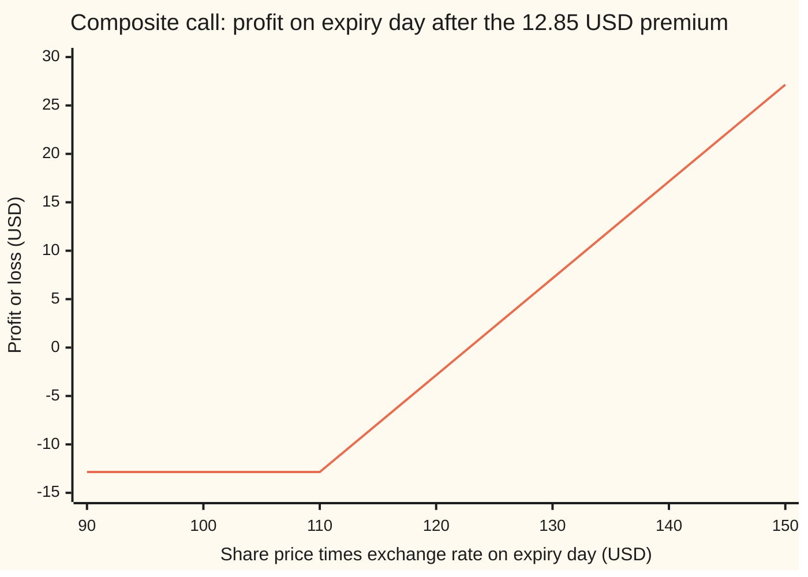
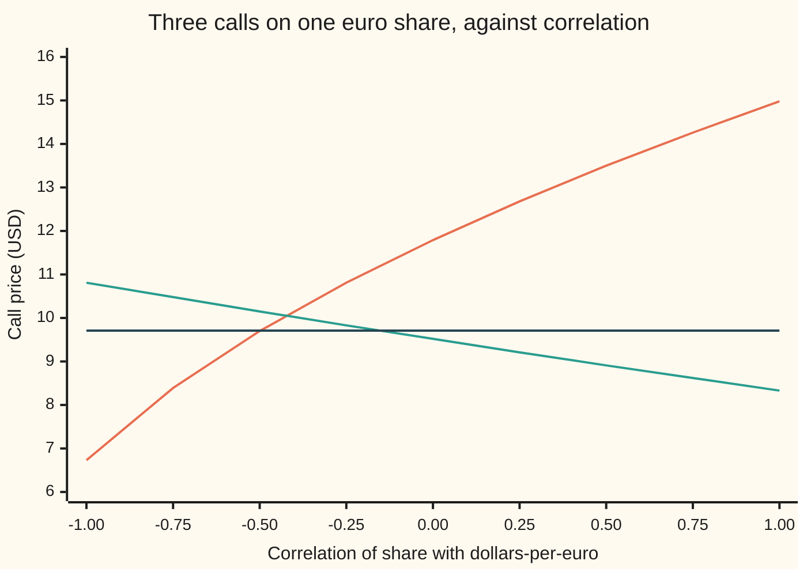

# Composite option: the foreign share priced in your currency at the market rate, so the vol is the vol of a product

[Syllabus](../../../SYLLABUS.md) → [Financial mathematics](../../../SYLLABUS.md#w12) → [Quantos and composites](../../../SYLLABUS.md#w12-s24) → Composite option

---

## General Overview

A share trades in Frankfurt at 100 euros. A euro costs 1.10 dollars today. So to a New York fund the share is worth 110 dollars: 100 euros times 1.10.

The fund wants a one-year call on that dollar value. The contract takes the share's euro price on expiry day, converts it at that day's exchange rate, and pays whatever exceeds 110 dollars. Nothing is fixed in advance except the dollar strike. A call on a foreign share, measured in home money at the market rate, is a **composite option**.

The fund now carries two risks in one number: the share can move, and the euro can move. They multiply. A share that climbs from 100 to 120 euros while the euro climbs to 1.30 dollars is worth 156.00 dollars. The option's price depends on how much that product wobbles. With the share's volatility (yearly spread of its percentage moves) at 20%, the euro's at 10%, and a correlation (a measure from −1 to +1 of how the two move together) of 0.30, the product wobbles at 24.9% a year. The call costs **12.85 dollars**.

The same share has two cousins on this shelf. A **quanto** pays the euro gain at a rate fixed on day one, 1.10, and costs 9.15 dollars ([Quanto option](02-quanto-option.md)). A **plain euro call**, with its euro payoff converted when it arrives, costs 9.71 dollars. Three contracts, one share, three prices, three different bets.

**A composite call is the Black-Scholes call on the share's dollar value, with the dollar rate as the growth rate and the volatility of a product: the two volatilities combined, with correlation adding to the spread instead of bending the drift.**

**What kind of fact this is:** a model: the share and the exchange rate are taken to wander as two linked random walks with constant volatilities and a constant correlation, an assumption rather than a law; inside the model the price is a theorem, proved on this card in Why it works.

### The picture: what the fund walks away with

The share's dollar value on expiry day runs across. The fund's profit in dollars, after the 12.85-dollar premium, runs up.



One line: the profit. It is flat at −12.85 dollars below the 110-dollar strike, then climbs a dollar for every dollar of value, crossing zero at 122.85 dollars. The axis is the product, so any pair of share price and exchange rate with the same product sits at the same point. A share at 95 euros with the euro at 1.30 is worth 123.50 dollars, and the call pays 13.50, though the share fell.

---

## The formula

Notation first. $V$ is the share's dollar value, the share's euro price times the exchange rate. The subscript $T$ marks expiry day: $V_T = S_T X_T$.

$$C = V\,e^{-qT}\,N(d_1) \;-\; K\,e^{-r_d T}\,N(d_2), \qquad V = S\,X_0$$

**Read it aloud: the dollar value of the share the holder might receive, minus the dollars the holder might hand over, each weighted by its own chance and discounted at the dollar rate, exactly as in Black-Scholes.**

The one new ingredient is the volatility, written $\sigma_V$:

$$\sigma_V = \sqrt{\sigma_S^2 + \sigma_X^2 + 2\rho\,\sigma_S\,\sigma_X}$$

**Read it aloud: the spread of the product is the square root of the share's variance plus the currency's variance plus twice their co-movement.**

| Symbol | Plain meaning | In our example | Push it up and the call… |
| --- | --- | --- | --- |
| $C$, $P$ | the composite call's and put's price today, in dollars | 12.849392 and 8.579147 USD | — |
| $S$, $S_T$ | the share's price in euros, today and on expiry day | 100 EUR | rises: more dollar value |
| $X_0$, $X_T$, $\bar{X}$ | the market exchange rate in dollars per euro, today and on expiry day; $\bar{X}$ is the quanto's fixed rate | 1.10 today; $\bar{X}$ = 1.10 | $X_0$ rises: more dollar value |
| $V$, $V_T$ | the share's dollar value, $S X_0$ today and $S_T X_T$ at expiry | 110 USD today | rises: the call is a call on $V$ |
| $K$ | the strike, in dollars | 110 USD | falls: further to climb |
| $r_d$, $r_f$ | the dollar (home) and euro (foreign) interest rates, continuously compounded | 5% and 3% | $r_d$ raises it, as in any call; $r_f$ does not appear |
| $q$ | the share's dividend yield: cash paid out of the share each year | 1% | lowers it: dividends leave the share price |
| $\sigma_S$, $\sigma_X$ | volatility of the share, and of the exchange rate: the yearly spread of log returns | 20% and 10% | both raise it: each widens the product |
| $\rho$ | correlation of the share's moves with the dollars-per-euro moves, from −1 to +1 | 0.30 | raises it: moving together widens the product |
| $\sigma_V$ | the composite volatility: the yearly spread of the dollar value's log returns | 24.8998% | raises it, the main dial |
| $T$ | years to expiry | 1 | raises it: more room to move |
| $N(x)$, $d_1$, $d_2$ | bell-curve area left of $x$; the two cut-offs, in standard deviations | $d_1$ = 0.285143, $d_2$ = 0.036145 | — |

The cut-offs are the pilot's, run on the dollar value with the composite volatility:

$$d_1 = \frac{\ln(V/K) + (r_d - q + \tfrac12\sigma_V^2)\,T}{\sigma_V\sqrt{T}}, \qquad d_2 = d_1 - \sigma_V\sqrt{T}$$

In words: $d_2$ is how many standard deviations of room the dollar value has above the strike; $d_1$ is one standard deviation more. The euro rate $r_f$ appears nowhere.

The put and the call are tied by the usual parity, applied to the dollar value:

$$C - P = V e^{-qT} - K e^{-r_d T}$$

### When it holds

- **Constant volatilities and correlation.** Correlation is rarely quoted directly; it is estimated from history or backed out of quanto prices, and it drifts. The call moves 3.35 dollars per unit of correlation, so an error in $\rho$ is an error in the price.
- **Two linked lognormal walks.** Share and exchange rate each move by compounding random percentages, joined by one correlation. A devaluation (an overnight jump in the currency) breaks the model.
- **Dividends as a steady yield.** The share pays out 1% a year smoothly. Lumpy dividends need the known-dividend adjustment.
- **Constant rates, European exercise.** One payment date. Early exercise needs a tree.
- **The quote direction.** The formula takes the rate as dollars per euro, the market's EUR/USD quote (conventions verified 2026-09-27). A correlation measured against euros per dollar has the opposite sign; flip it back before it enters $\sigma_V$.

---

## Why it works

### Step 0: the dollar value is something a dollar investor can hold

A New York fund can convert dollars to euros and buy the share. What it then holds is worth $S_t X_t$ dollars at every moment. So the dollar value $V$ is a traded dollar asset, like any American share. The composite call is an ordinary call on that asset, with a dollar strike. Black-Scholes needs two facts about the asset: how fast it grows in the pricing world, and how much it wobbles.

That is the whole difference from the quanto, whose underlying, "the euro price paid at 1.10", is not something a dollar investor can hold. Its growth had to be worked out, and came out bent by correlation. Here the growth is pinned at once.

### Step 1: its growth rate is the dollar rate less the dividend

In the dollar pricing world (the risk-neutral world of [Black–Scholes call](../08-The%20Black-Scholes%20call%20and%20put/01-black-scholes-call.md), where every dollar asset earns the dollar rate), a holding worth $V$ that pays dividends at 1% must grow in price at $r_d - q$ = 4%. Dividends are paid in euros at a yield of 1% on the share's euro value, which is also 1% of its dollar value. No correlation term appears in the growth. The euro rate $r_f$ does not appear either: it governs a euro deposit, and the fund holds a share.

### Step 2: its volatility is the volatility of a product

Take logarithms. The log of a product is the sum of the logs:

$$\ln V_T = \ln S_T + \ln X_T$$

So over the year, the dollar value's log return is the share's log return plus the currency's log return. The variance (the square of the spread) of a sum of two linked random quantities is the variance of each plus twice their covariance, the average product of their deviations ([Two variables at once](../../09-Probability%20and%20statistics/02-Random%20Variables/04-joint-distributions-and-covariance.md)). The covariance of the two log returns is $\rho\,\sigma_S\,\sigma_X$ per year. So

$$\sigma_V^2 = \sigma_S^2 + \sigma_X^2 + 2\rho\,\sigma_S\,\sigma_X = 0.04 + 0.01 + 0.012 = 0.062$$

and $\sigma_V$ = 24.8998%. Correlation widens the spread when positive: the share and the euro tend to rise and fall together, and their moves pile up. When negative they partly cancel. At $\rho = -1$ the spread is 20% − 10% = 10%; at $\rho = +1$ it is 20% + 10% = 30%.

The code checks this without the formula. It averages $\ln V_T$ and its square over both bell curves on a grid, and the spread that comes out is 0.248998.

### Step 3: a sum of two linked bell curves is a bell curve

The two log returns are jointly bell-shaped (normally distributed), and any sum of a jointly bell-shaped pair is bell-shaped. So $V_T$ is lognormal: its log follows a bell curve with spread $\sigma_V\sqrt{T}$. A lognormal dollar asset growing at $r_d - q$ is what the Black-Scholes call was built for, and the formula above follows.

<details>
<summary>Detailed proof</summary>

In the dollar pricing world let $dS_t/S_t = \mu\,dt + \sigma_S\,dW^S_t$ and $dX_t/X_t = (r_d - r_f)\,dt + \sigma_X\,dW^X_t$, where $W^S$ and $W^X$ are standard Brownian motions with correlated increments, $d\langle W^S, W^X\rangle_t = \rho\,dt$, and $\mu = r_f - q - \rho\sigma_S\sigma_X$ is the quanto drift of [The quanto adjustment](01-quanto-forward-and-adjustment.md).

**Logs.** Ito's lemma gives $d\ln S_t = (\mu - \tfrac12\sigma_S^2)\,dt + \sigma_S\,dW^S_t$ and $d\ln X_t = (r_d - r_f - \tfrac12\sigma_X^2)\,dt + \sigma_X\,dW^X_t$.

**Sum.** $d\ln V_t = \big(r_d - q - \rho\sigma_S\sigma_X - \tfrac12\sigma_S^2 - \tfrac12\sigma_X^2\big)dt + \sigma_S\,dW^S_t + \sigma_X\,dW^X_t$. The noise term $\sigma_S\,dW^S_t + \sigma_X\,dW^X_t$ has variance $(\sigma_S^2 + \sigma_X^2 + 2\rho\sigma_S\sigma_X)\,dt = \sigma_V^2\,dt$, so it equals $\sigma_V\,dW^V_t$ for a standard Brownian motion $W^V$. The drift is $r_d - q - \tfrac12\sigma_V^2$, because $\tfrac12\sigma_V^2 = \tfrac12\sigma_S^2 + \tfrac12\sigma_X^2 + \rho\sigma_S\sigma_X$.

**Result.** $dV_t/V_t = (r_d - q)\,dt + \sigma_V\,dW^V_t$: the correlation that bent the share's drift is exactly absorbed into the product's variance, and the product grows at $r_d - q$, as Step 1 required. The payoff $\max(V_T - K, 0)$ is then priced by the pilot's argument with $S \to V$, $r \to r_d$, $\sigma \to \sigma_V$. $\blacksquare$

</details>

### Step 4: from inside the euro world, the same price

A European holder sees the contract differently. The payoff $\max(S_T X_T - K, 0)$ dollars is worth $\max(S_T - K/X_T, 0)$ euros on expiry day. For a European this is a call on the share whose strike, $K/X_T$ euros, is random: the fixed 110 dollars converted at the rate on the day.

The code prices it that way. The share grows at its own euro rate $r_f - q$, the dollar (the foreign currency, seen from Frankfurt) grows at $r_f - r_d$, both are averaged on a grid over their joint bell curve, the result is discounted at the euro rate and converted at today's 1.10. No drift is adjusted anywhere. It lands on 12.849392 dollars, the formula's price to six decimals.

<details>
<summary>Why the correlation moves the drift on one card and the spread on the other</summary>

The quanto pays $\bar{X}(S_T - K)$: the currency enters only through the pricing world, never through the payoff. There it can only tilt the share's growth. The composite pays $S_T X_T - K$: the currency is inside the payoff, multiplied by the share. There the co-movement is part of how far the payoff can swing, which is spread, not drift. In the proof the same term $\rho\sigma_S\sigma_X$ appears on both sides of the ledger: once as the quanto drift's cut, once as the variance's bonus, and for the product they cancel in the drift.

</details>

### The other door: a relabelled Black-Scholes call

The formula is the pilot's call with three substitutions: the share's dollar value $V$ for the share price, the dollar rate $r_d$ for the rate, the composite volatility $\sigma_V$ for the volatility. Any Black-Scholes routine prices a composite if fed those three numbers, and the pilot's proof of the call, [Black–Scholes call](../08-The%20Black-Scholes%20call%20and%20put/01-black-scholes-call.md), is the proof of this one.

---

## Worked numbers, by hand

The house composite: $S$ = 100 euros, $X_0$ = 1.10, so $V$ = 110 dollars; $K$ = 110 dollars; $r_d$ = 5%, $q$ = 1%, $\sigma_S$ = 20%, $\sigma_X$ = 10%, $\rho$ = 0.30, $T$ = 1 year.

| Step | Arithmetic | Value |
| --- | --- | --- |
| cross term, $2\rho\sigma_S\sigma_X$ | $2 \times 0.30 \times 0.20 \times 0.10$ | $0.012$ |
| composite variance | $0.04 + 0.01 + 0.012$ | $0.062$ |
| $\sigma_V$ | $\sqrt{0.062}$ | $0.248998$ |
| $\ln(V/K)$ | $\ln(110/110)$ | $0$ |
| $d_1$ | $(0 + 0.05 - 0.01 + 0.031) / 0.248998$ | $0.285143$ |
| $d_2$ | $0.285143 - 0.248998$ | $0.036145$ |
| $N(d_1)$, $N(d_2)$ | bell-curve table | $0.612233$, $0.514417$ |
| share side | $110 \times e^{-0.01} \times 0.612233$ | $66.675492$ |
| cash side | $110 \times e^{-0.05} \times 0.514417$ | $53.826100$ |
| **composite call** | $66.675492 - 53.826100$ | **12.849392 USD** |
| breakeven dollar value | $110 + 12.849392$ | 122.85 USD |

So the fund pays 12.85 dollars for the right to the share's dollar value above 110. The put on the same terms costs 8.58 dollars, and call minus put is 4.27 dollars: the discounted dollar value less the discounted strike.

### Three contracts on one share

Same share, same market, same strike at today's rate (100 euros is 110 dollars at 1.10):

| Contract | Payoff in dollars | Price | Correlation's effect |
| --- | --- | --- | --- |
| Quanto call | $\bar{X}\,\max(S_T - 100, 0)$, at the fixed 1.10 | 9.15 | lowers it, through the drift (to 1.4% from 2%) |
| Plain euro call, converted on the day | $X_T\,\max(S_T - 100, 0)$ | 9.71 | none |
| Composite call | $\max(S_T X_T - 110, 0)$ | 12.85 | raises it, through the spread |

The plain call is the euro call's euro price converted at today's rate. A euro amount received later is worth its euro price today times $X_0$, whatever the currency does in between, so correlation cannot touch it.

Which one does a dollar investor own? Four expiry days show it:

| Share (EUR) | USD per EUR | Dollar value | Quanto pays | Composite pays | Plain pays |
| --- | --- | --- | --- | --- | --- |
| 120 | 1.30 | 156.00 | 22.00 | 46.00 | 26.00 |
| 120 | 0.90 | 108.00 | 22.00 | 0.00 | 18.00 |
| 95 | 1.30 | 123.50 | 0.00 | 13.50 | 0.00 |
| 110 | 1.10 | 121.00 | 11.00 | 11.00 | 11.00 |

- **The quanto holder owns the share's euro performance and nothing else.** The currency never touches the payoff: 22 dollars whether the euro rises or falls.
- **The composite holder owns the dollar value of a euro share.** The strike is in dollars, so a weak euro can wipe out a share gain (row two) and a strong euro can rescue a share loss (row three). This is the contract that insures a dollar portfolio that holds the share.
- **The plain holder owns a euro option and the euros it pays.** Whether it pays depends only on the share; how many dollars it pays depends on the rate. The currency risk sits on the payoff but never decides exercise.

### What breaks if you drop a piece

Correct answer 12.849392 dollars.

| Mistake | Comes out at | What went wrong |
| --- | --- | --- |
| Volatility $\sqrt{\sigma_S^2 + \sigma_X^2}$, correlation dropped | 11.790911 | The cross term 0.012 is a fifth of the variance |
| Share volatility $\sigma_S$ alone | 10.808928 | The currency is inside the payoff; its wobble widens the product |
| Volatilities added, $\sigma_S + \sigma_X$ | 14.978059 | Only right at $\rho = +1$; spreads add in variance, not in size |
| Growth at the euro rate $r_f - q$ | 11.562428 | The dollar value is a dollar asset; it grows at $r_d - q$ |

### How the price leans on correlation, and the Greeks

Hold everything else and slide the correlation from −1 to +1:



Orange, rising: the composite, from 6.73 to 14.98 dollars as its volatility runs from 10% to 30%. Green, falling: the quanto, from 10.81 to 8.33. Dark, flat: the plain euro call at 9.71. The composite and quanto move in opposite directions on the same dial. At $\rho = -0.25$ the composite volatility is exactly 20%, and the composite costs 10.81 dollars, the same as a call on the dollar value with the share's volatility alone.

The Greeks (sensitivities of the price to each input) at the house point:

| Greek | Value | Meaning |
| --- | --- | --- |
| Delta in shares, $e^{-qT}N(d_1)$ | 0.606141 | shares a seller holds to hedge, bought in euros |
| Price per euro of share price | 0.666755 USD | delta in shares times $X_0$ |
| Price per 1.00 of exchange rate | 60.61 USD | delta in shares times $S$ |
| Vega to $\sigma_V$ | 41.72 USD per unit | per percentage point, divide by 100 |
| Sensitivity to $\sigma_S$ | 38.53 USD per unit | vega times $(\sigma_S + \rho\sigma_X)/\sigma_V$ |
| Sensitivity to $\rho$ | 3.35 USD per unit | vega times $\sigma_S\sigma_X/\sigma_V$ |

The first three rows carry the hedging story. A seller who holds 0.606141 shares, bought with dollars converted to euros, has a position worth 0.606141 times $S X$ dollars. It moves 0.666755 dollars per euro of share price and 60.61 dollars per unit of exchange rate, the call's own two deltas. One trade covers both risks. No separate currency hedge is needed, because the shares are held in euros and the euros carry the currency. The quanto's seller is not so lucky: [Hedging a quanto](03-quanto-greeks-and-hedging.md).

---

## Code, from first principles, and it actually runs

The scripts build their own normal CDF (Simpson slices under the bell curve) and reach the composite price **three independent ways**: the formula with the composite volatility; a Simpson grid over the joint bell curve of share and currency in the dollar pricing world, which never computes $\sigma_V$; and a Simpson grid in the euro pricing world, where no drift is adjusted and the strike is converted at the rate on the day. The put is priced on its own grid and parity checked. The spread of $\ln V_T$ is measured on the grid and compared with $\sigma_V$. The same grid prices the quanto and the plain call; the Greeks are checked by bumping; every table and chart number is printed.

### Python

```python
# Composite option -- the check behind the card.  Standard library only.
# Every number quoted on the card is printed here.  The normal CDF, the
# integrals and the bumps are written out; nothing imported knows the answer.
from math import log, sqrt, exp, pi

def phi(x): return exp(-0.5 * x * x) / sqrt(2.0 * pi)      # bell-curve height

def simpson(f, a, b, n):
    h = (b - a) / n
    s = f(a) + f(b)
    for i in range(1, n):
        s += (4 if i % 2 else 2) * f(a + i * h)
    return s * h / 3.0

def N(x):                                                  # bell-curve area left of x
    if x < -12.0: return 0.0
    if x > 12.0: return 1.0
    return 0.5 + simpson(phi, 0.0, x, 2000)

def bs_call(S, K, r, q, v, T):                             # Black-Scholes, dividend yield q
    d1 = (log(S / K) + (r - q + 0.5 * v * v) * T) / (v * sqrt(T))
    d2 = d1 - v * sqrt(T)
    return S * exp(-q * T) * N(d1) - K * exp(-r * T) * N(d2), d1, d2

# ---- the house market ----
S, K_eur, X0, rd, rf, q = 100.0, 100.0, 1.10, 0.05, 0.03, 0.01
sS, sX, rho, T = 0.20, 0.10, 0.30, 1.0
K = K_eur * X0                                             # dollar strike, 110

def comp_vol(rho): return sqrt(sS * sS + sX * sX + 2.0 * rho * sS * sX)
def composite(rho, S=S, X=X0, sS_=None):                   # road 1: the formula
    s1 = sS if sS_ is None else sS_
    v = sqrt(s1 * s1 + sX * sX + 2.0 * rho * s1 * sX)
    return bs_call(S * X, K, rd, q, v, T)
def quanto(rho):                                           # the sibling card's price
    c, _, _ = bs_call(S, K_eur, rd, rd - (rf - q - rho * sS * sX), sS, T)
    return X0 * c
plain = X0 * bs_call(S, K_eur, rf, q, sS, T)[0]            # euro call, paid in euros

# ---- roads 2 and 3: brute-force average over two linked bell curves ----
def avg2(f, m=0.0, n=600, L=8.0):   # E f(z1, z2), z1 and z2 independent; z1's grid centred on m
    h = 2 * L / n
    w = [(1 if i in (0, n) else (4 if i % 2 else 2)) * h / 3.0 for i in range(n + 1)]
    zs = [-L + i * h for i in range(n + 1)]
    c = sqrt(1.0 - rho * rho)
    tot = [0.0] * 6
    for i, a0 in enumerate(zs):
        a = a0 + m
        for j, b in enumerate(zs):
            vals = f(a, rho * a + c * b)
            ww = w[i] * phi(a) * w[j] * phi(b)
            for k in range(len(vals)): tot[k] += ww * vals[k]
    return tot

def usd_world(zS, zX):          # dollar pricing world: share slowed by rho sS sX, euro grows at rd - rf
    ST = S * exp((rf - q - rho * sS * sX - 0.5 * sS * sS) * T + sS * sqrt(T) * zS)
    XT = X0 * exp((rd - rf - 0.5 * sX * sX) * T + sX * sqrt(T) * zX)
    V = ST * XT
    return (max(V - K, 0.0), max(K - V, 0.0), X0 * max(ST - K_eur, 0.0),
            XT * max(ST - K_eur, 0.0), log(V / (S * X0)), log(V / (S * X0)) ** 2)
def eur_world(zS, zX):          # euro pricing world: share grows at rf - q, the dollar at rf - rd
    ST = S * exp((rf - q - 0.5 * sS * sS) * T + sS * sqrt(T) * zS)
    inv_XT = exp((rf - rd - 0.5 * sX * sX) * T - sX * sqrt(T) * zX) / X0
    return (max(ST - K * inv_XT, 0.0), 0, 0, 0, 0, 0)       # payoff in euros: S_T - K / X_T

m = (log(K_eur / S) - (rf - q - rho * sS * sX - 0.5 * sS * sS) * T) / (sS * sqrt(T))
u = avg2(usd_world, m)                                     # m: the euro strike's line sits on a node
e = avg2(eur_world)
C, d1, d2 = composite(rho)
C_usd, P_usd, Q_int, plain_int = [exp(-rd * T) * x for x in u[:4]]
C_eur = X0 * exp(-rf * T) * e[0]
vol_int = sqrt((u[5] - u[4] ** 2) / T)
h = 1e-4
dS = (composite(rho, S=S + h)[0] - composite(rho, S=S - h)[0]) / (2 * h)
dX = (composite(rho, X=X0 + h)[0] - composite(rho, X=X0 - h)[0]) / (2 * h)
dr = (composite(rho + h)[0] - composite(rho - h)[0]) / (2 * h)
dsS = (composite(rho, sS_=sS + h)[0] - composite(rho, sS_=sS - h)[0]) / (2 * h)
vega = S * X0 * exp(-q * T) * phi(d1) * sqrt(T)
rows = [
    ("cross term 2 rho sS sX", 2 * rho * sS * sX), ("composite variance", comp_vol(rho) ** 2),
    ("composite vol", comp_vol(rho)), ("  vol from the log-moments integral", vol_int),
    ("d1", d1), ("d2", d2), ("N(d1)", N(d1)), ("N(d2)", N(d2)),
    ("share side V e^-qT N(d1)", S * X0 * exp(-q * T) * N(d1)),
    ("cash side K e^-rdT N(d2)", K * exp(-rd * T) * N(d2)),
    ("1 composite call, formula", C), ("2 dollar-world integral", C_usd),
    ("3 euro-world integral", C_eur), ("4 put by integral", P_usd),
    ("  C - P", C - P_usd), ("  S X e^-qT - K e^-rdT", S * X0 * exp(-q * T) - K * exp(-rd * T)),
    ("quanto drift rf - q - rho sS sX", rf - q - rho * sS * sX), ("quanto call, formula", quanto(rho)), ("  quanto by integral", Q_int),
    ("plain euro call x 1.10, formula", plain), ("  plain by integral", plain_int),
    ("delta, shares e^-qT N(d1)", exp(-q * T) * N(d1)), ("  bump S, per EUR", dS),
    ("  X e^-qT N(d1)", X0 * exp(-q * T) * N(d1)), ("  bump X, per 1.00 of rate", dX),
    ("  S e^-qT N(d1)", S * exp(-q * T) * N(d1)), ("vega per unit composite vol", vega),
    ("dC/drho, bump", dr), ("  vega x sS sX / vol", vega * sS * sX / comp_vol(rho)),
    ("dC/dsigma_S, bump", dsS), ("  vega x (sS + rho sX) / vol", vega * (sS + rho * sX) / comp_vol(rho)),
    ("breakeven dollar value", K + C),
    ("wrong: vol sqrt(sS^2 + sX^2)", composite(0.0)[0]),
    ("wrong: vol sS alone", bs_call(S * X0, K, rd, q, sS, T)[0]),
    ("wrong: vol sS + sX", composite(1.0)[0]),
    ("wrong: grows at the euro rate rf - q", bs_call(S * X0, K, rd, q + rd - rf, comp_vol(rho), T)[0]),
]
for name, v in rows: print(f"{name:<36} {v:>12.6f}")
print("scenario  share  USD per EUR  dollar value  quanto  composite  plain")
for sh, x in ((120.0, 1.30), (120.0, 0.90), (95.0, 1.30), (110.0, 1.10)):
    print(f"scenario {sh:6.0f} {x:12.2f} {sh * x:13.2f} {X0 * max(sh - K_eur, 0):8.2f}"
          f" {max(sh * x - K, 0):10.2f} {x * max(sh - K_eur, 0):6.2f}")
rhos = [-1.0 + 0.25 * i for i in range(9)]
print("chart, rho      " + " ".join(f"{r_:6.2f}" for r_ in rhos))
print("chart, composite" + " ".join(f"{composite(r_)[0]:6.2f}" for r_ in rhos))
print("chart, quanto   " + " ".join(f"{quanto(r_):6.2f}" for r_ in rhos))
print("chart, plain    " + " ".join(f"{plain:6.2f}" for r_ in rhos))
print("chart, comp vol " + " ".join(f"{comp_vol(r_):6.3f}" for r_ in rhos))
vs = [90.0 + 10.0 * i for i in range(7)]
print("payoff, value   " + " ".join(f"{v:6.0f}" for v in vs))
print("payoff, profit  " + " ".join(f"{max(v - K, 0) - C:6.2f}" for v in vs))

assert abs(C_usd - C) < 1e-5, "dollar-world integral must land on the formula"
assert abs(C_eur - C) < 1e-5, "euro-world integral, no drift adjustment, must agree"
assert abs((C - P_usd) - (S * X0 * exp(-q * T) - K * exp(-rd * T))) < 1e-5, "parity"
assert abs(vol_int - comp_vol(rho)) < 1e-6, "spread of log(S X) is the composite vol"
assert abs(Q_int - 9.151629) < 1e-5, "quanto integral matches the sibling card's price"
assert abs(plain_int - plain) < 1e-5, "plain call converted at expiry: integral vs formula"
assert abs(dr - vega * sS * sX / comp_vol(rho)) < 1e-4, "correlation sensitivity"
print("ALL CHECKS PASS")
```

**Ran 2026-09-27 on macOS, Python 3.14.6, standard library only. All checks passed. Output, pasted from the run:**

```
cross term 2 rho sS sX                   0.012000
composite variance                       0.062000
composite vol                            0.248998
  vol from the log-moments integral      0.248998
d1                                       0.285143
d2                                       0.036145
N(d1)                                    0.612233
N(d2)                                    0.514417
share side V e^-qT N(d1)                66.675492
cash side K e^-rdT N(d2)                53.826100
1 composite call, formula               12.849392
2 dollar-world integral                 12.849392
3 euro-world integral                   12.849392
4 put by integral                        8.579147
  C - P                                  4.270245
  S X e^-qT - K e^-rdT                   4.270245
quanto drift rf - q - rho sS sX          0.014000
quanto call, formula                     9.151629
  quanto by integral                     9.151629
plain euro call x 1.10, formula          9.710053
  plain by integral                      9.710053
delta, shares e^-qT N(d1)                0.606141
  bump S, per EUR                        0.666755
  X e^-qT N(d1)                          0.666755
  bump X, per 1.00 of rate              60.614083
  S e^-qT N(d1)                         60.614084
vega per unit composite vol             41.716161
dC/drho, bump                            3.350723
  vega x sS sX / vol                     3.350723
dC/dsigma_S, bump                       38.533310
  vega x (sS + rho sX) / vol            38.533311
breakeven dollar value                 122.849392
wrong: vol sqrt(sS^2 + sX^2)            11.790911
wrong: vol sS alone                     10.808928
wrong: vol sS + sX                      14.978059
wrong: grows at the euro rate rf - q    11.562428
scenario  share  USD per EUR  dollar value  quanto  composite  plain
scenario    120         1.30        156.00    22.00      46.00  26.00
scenario    120         0.90        108.00    22.00       0.00  18.00
scenario     95         1.30        123.50     0.00      13.50   0.00
scenario    110         1.10        121.00    11.00      11.00  11.00
chart, rho       -1.00  -0.75  -0.50  -0.25   0.00   0.25   0.50   0.75   1.00
chart, composite  6.73   8.39   9.70  10.81  11.79  12.68  13.50  14.26  14.98
chart, quanto    10.81  10.48  10.15   9.83   9.52   9.21   8.91   8.62   8.33
chart, plain      9.71   9.71   9.71   9.71   9.71   9.71   9.71   9.71   9.71
chart, comp vol  0.100  0.141  0.173  0.200  0.224  0.245  0.265  0.283  0.300
payoff, value       90    100    110    120    130    140    150
payoff, profit  -12.85 -12.85 -12.85  -2.85   7.15  17.15  27.15
ALL CHECKS PASS
```

Three roads land on 12.849392 to six decimals. The grid's spread for $\ln V_T$ matches the formula's 0.248998. The quanto from the grid is 9.151629, the sibling card's number.

### Rust

The same checks, same grid, same labels. No crates.

```rust
// Composite option -- the same check as composite_option_check.py, in Rust.
// Standard library only, no crates.  The normal CDF is Simpson slices under the
// bell curve; the two-asset averages are Simpson grids over two bell curves.
use std::f64::consts::PI;

fn phi(x: f64) -> f64 { (-0.5 * x * x).exp() / (2.0 * PI).sqrt() }

fn simpson<F: Fn(f64) -> f64>(f: F, a: f64, b: f64, n: usize) -> f64 {
    let h = (b - a) / n as f64;
    let mut s = f(a) + f(b);
    for i in 1..n { s += if i % 2 == 1 { 4.0 } else { 2.0 } * f(a + i as f64 * h); }
    s * h / 3.0
}

fn ncdf(x: f64) -> f64 {
    if x < -12.0 { return 0.0; }
    if x > 12.0 { return 1.0; }
    0.5 + simpson(phi, 0.0, x, 2000)
}

fn bs_call(s: f64, k: f64, r: f64, q: f64, v: f64, t: f64) -> (f64, f64, f64) {
    let d1 = ((s / k).ln() + (r - q + 0.5 * v * v) * t) / (v * t.sqrt());
    let d2 = d1 - v * t.sqrt();
    (s * (-q * t).exp() * ncdf(d1) - k * (-r * t).exp() * ncdf(d2), d1, d2)
}

const S: f64 = 100.0; const KE: f64 = 100.0; const X0: f64 = 1.10;
const RD: f64 = 0.05; const RF: f64 = 0.03; const Q: f64 = 0.01;
const SS: f64 = 0.20; const SX: f64 = 0.10; const RHO: f64 = 0.30; const T: f64 = 1.0;
const K: f64 = KE * X0;

fn comp_vol(rho: f64) -> f64 { (SS * SS + SX * SX + 2.0 * rho * SS * SX).sqrt() }
fn composite(rho: f64, s: f64, x: f64, s1: f64) -> (f64, f64, f64) {         // road 1: the formula
    let v = (s1 * s1 + SX * SX + 2.0 * rho * s1 * SX).sqrt();
    bs_call(s * x, K, RD, Q, v, T)
}
fn c_at(rho: f64) -> f64 { composite(rho, S, X0, SS).0 }
fn quanto(rho: f64) -> f64 { X0 * bs_call(S, KE, RD, RD - (RF - Q - rho * SS * SX), SS, T).0 }

fn avg2<F: Fn(f64, f64) -> [f64; 6]>(f: F, m: f64) -> [f64; 6] {   // roads 2 and 3: Simpson grid
    let (n, l) = (600usize, 8.0_f64);
    let h = 2.0 * l / n as f64;
    let w: Vec<f64> = (0..=n).map(|i| (if i == 0 || i == n { 1.0 } else if i % 2 == 1 { 4.0 } else { 2.0 }) * h / 3.0).collect();
    let c = (1.0 - RHO * RHO).sqrt();
    let mut tot = [0.0_f64; 6];
    for i in 0..=n {
        let a = -l + i as f64 * h + m;
        for j in 0..=n {
            let b = -l + j as f64 * h;
            let vals = f(a, RHO * a + c * b);
            let ww = w[i] * phi(a) * w[j] * phi(b);
            for k in 0..6 { tot[k] += ww * vals[k]; }
        }
    }
    tot
}

fn usd_world(zs: f64, zx: f64) -> [f64; 6] {
    let st = S * ((RF - Q - RHO * SS * SX - 0.5 * SS * SS) * T + SS * T.sqrt() * zs).exp();
    let xt = X0 * ((RD - RF - 0.5 * SX * SX) * T + SX * T.sqrt() * zx).exp();
    let v = st * xt;
    let lg = (v / (S * X0)).ln();
    [(v - K).max(0.0), (K - v).max(0.0), X0 * (st - KE).max(0.0), xt * (st - KE).max(0.0), lg, lg * lg]
}
fn eur_world(zs: f64, zx: f64) -> [f64; 6] {
    let st = S * ((RF - Q - 0.5 * SS * SS) * T + SS * T.sqrt() * zs).exp();
    let inv_xt = ((RF - RD - 0.5 * SX * SX) * T - SX * T.sqrt() * zx).exp() / X0;
    [(st - K * inv_xt).max(0.0), 0.0, 0.0, 0.0, 0.0, 0.0]
}

fn main() {
    let plain = X0 * bs_call(S, KE, RF, Q, SS, T).0;
    let m = ((KE / S).ln() - (RF - Q - RHO * SS * SX - 0.5 * SS * SS) * T) / (SS * T.sqrt());
    let u = avg2(usd_world, m);
    let e = avg2(eur_world, 0.0);
    let (c, d1, d2) = composite(RHO, S, X0, SS);
    let disc = (-RD * T).exp();
    let (c_usd, p_usd, q_int, plain_int) = (disc * u[0], disc * u[1], disc * u[2], disc * u[3]);
    let c_eur = X0 * (-RF * T).exp() * e[0];
    let vol_int = ((u[5] - u[4] * u[4]) / T).sqrt();
    let h = 1e-4;
    let ds = (composite(RHO, S + h, X0, SS).0 - composite(RHO, S - h, X0, SS).0) / (2.0 * h);
    let dx = (composite(RHO, S, X0 + h, SS).0 - composite(RHO, S, X0 - h, SS).0) / (2.0 * h);
    let dr = (c_at(RHO + h) - c_at(RHO - h)) / (2.0 * h);
    let dss = (composite(RHO, S, X0, SS + h).0 - composite(RHO, S, X0, SS - h).0) / (2.0 * h);
    let eq = (-Q * T).exp();
    let vega = S * X0 * eq * phi(d1) * T.sqrt();
    let rows: Vec<(&str, f64)> = vec![
        ("cross term 2 rho sS sX", 2.0 * RHO * SS * SX), ("composite variance", comp_vol(RHO).powi(2)),
        ("composite vol", comp_vol(RHO)), ("  vol from the log-moments integral", vol_int),
        ("d1", d1), ("d2", d2), ("N(d1)", ncdf(d1)), ("N(d2)", ncdf(d2)),
        ("share side V e^-qT N(d1)", S * X0 * eq * ncdf(d1)),
        ("cash side K e^-rdT N(d2)", K * disc * ncdf(d2)),
        ("1 composite call, formula", c), ("2 dollar-world integral", c_usd),
        ("3 euro-world integral", c_eur), ("4 put by integral", p_usd),
        ("  C - P", c - p_usd), ("  S X e^-qT - K e^-rdT", S * X0 * eq - K * disc),
        ("quanto drift rf - q - rho sS sX", RF - Q - RHO * SS * SX), ("quanto call, formula", quanto(RHO)), ("  quanto by integral", q_int),
        ("plain euro call x 1.10, formula", plain), ("  plain by integral", plain_int),
        ("delta, shares e^-qT N(d1)", eq * ncdf(d1)), ("  bump S, per EUR", ds),
        ("  X e^-qT N(d1)", X0 * eq * ncdf(d1)), ("  bump X, per 1.00 of rate", dx),
        ("  S e^-qT N(d1)", S * eq * ncdf(d1)), ("vega per unit composite vol", vega),
        ("dC/drho, bump", dr), ("  vega x sS sX / vol", vega * SS * SX / comp_vol(RHO)),
        ("dC/dsigma_S, bump", dss), ("  vega x (sS + rho sX) / vol", vega * (SS + RHO * SX) / comp_vol(RHO)),
        ("breakeven dollar value", K + c),
        ("wrong: vol sqrt(sS^2 + sX^2)", c_at(0.0)),
        ("wrong: vol sS alone", bs_call(S * X0, K, RD, Q, SS, T).0),
        ("wrong: vol sS + sX", c_at(1.0)),
        ("wrong: grows at the euro rate rf - q", bs_call(S * X0, K, RD, Q + RD - RF, comp_vol(RHO), T).0),
    ];
    for (name, v) in &rows { println!("{:<36} {:>12.6}", name, v); }
    println!("scenario  share  USD per EUR  dollar value  quanto  composite  plain");
    for (sh, x) in [(120.0_f64, 1.30_f64), (120.0, 0.90), (95.0, 1.30), (110.0, 1.10)] {
        println!("scenario {:6.0} {:12.2} {:13.2} {:8.2} {:10.2} {:6.2}", sh, x, sh * x,
                 X0 * (sh - KE).max(0.0), (sh * x - K).max(0.0), x * (sh - KE).max(0.0));
    }
    let rhos: Vec<f64> = (0..9).map(|i| -1.0 + 0.25 * i as f64).collect();
    let line = |f: &dyn Fn(f64) -> String| rhos.iter().map(|r| f(*r)).collect::<Vec<_>>().join(" ");
    println!("chart, rho      {}", line(&|r| format!("{:6.2}", r)));
    println!("chart, composite{}", line(&|r| format!("{:6.2}", c_at(r))));
    println!("chart, quanto   {}", line(&|r| format!("{:6.2}", quanto(r))));
    println!("chart, plain    {}", line(&|_| format!("{:6.2}", plain)));
    println!("chart, comp vol {}", line(&|r| format!("{:6.3}", comp_vol(r))));
    let vs: Vec<f64> = (0..7).map(|i| 90.0 + 10.0 * i as f64).collect();
    println!("payoff, value   {}", vs.iter().map(|v| format!("{:6.0}", v)).collect::<Vec<_>>().join(" "));
    println!("payoff, profit  {}", vs.iter().map(|v| format!("{:6.2}", (v - K).max(0.0) - c)).collect::<Vec<_>>().join(" "));

    assert!((c_usd - c).abs() < 1e-5, "dollar-world integral must land on the formula");
    assert!((c_eur - c).abs() < 1e-5, "euro-world integral, no drift adjustment, must agree");
    assert!(((c - p_usd) - (S * X0 * eq - K * disc)).abs() < 1e-5, "parity");
    assert!((vol_int - comp_vol(RHO)).abs() < 1e-6, "spread of log(S X) is the composite vol");
    assert!((q_int - 9.151629).abs() < 1e-5, "quanto integral matches the sibling card's price");
    assert!((plain_int - plain).abs() < 1e-5, "plain call converted at expiry: integral vs formula");
    assert!((dr - vega * SS * SX / comp_vol(RHO)).abs() < 1e-4, "correlation sensitivity");
    println!("ALL CHECKS PASS");
}
```

**Ran 2026-09-27 on macOS, rustc 1.98.1, no crates. All checks passed. Output, pasted from the run:**

```
cross term 2 rho sS sX                   0.012000
composite variance                       0.062000
composite vol                            0.248998
  vol from the log-moments integral      0.248998
d1                                       0.285143
d2                                       0.036145
N(d1)                                    0.612233
N(d2)                                    0.514417
share side V e^-qT N(d1)                66.675492
cash side K e^-rdT N(d2)                53.826100
1 composite call, formula               12.849392
2 dollar-world integral                 12.849392
3 euro-world integral                   12.849392
4 put by integral                        8.579147
  C - P                                  4.270245
  S X e^-qT - K e^-rdT                   4.270245
quanto drift rf - q - rho sS sX          0.014000
quanto call, formula                     9.151629
  quanto by integral                     9.151629
plain euro call x 1.10, formula          9.710053
  plain by integral                      9.710053
delta, shares e^-qT N(d1)                0.606141
  bump S, per EUR                        0.666755
  X e^-qT N(d1)                          0.666755
  bump X, per 1.00 of rate              60.614083
  S e^-qT N(d1)                         60.614084
vega per unit composite vol             41.716161
dC/drho, bump                            3.350723
  vega x sS sX / vol                     3.350723
dC/dsigma_S, bump                       38.533310
  vega x (sS + rho sX) / vol            38.533311
breakeven dollar value                 122.849392
wrong: vol sqrt(sS^2 + sX^2)            11.790911
wrong: vol sS alone                     10.808928
wrong: vol sS + sX                      14.978059
wrong: grows at the euro rate rf - q    11.562428
scenario  share  USD per EUR  dollar value  quanto  composite  plain
scenario    120         1.30        156.00    22.00      46.00  26.00
scenario    120         0.90        108.00    22.00       0.00  18.00
scenario     95         1.30        123.50     0.00      13.50   0.00
scenario    110         1.10        121.00    11.00      11.00  11.00
chart, rho       -1.00  -0.75  -0.50  -0.25   0.00   0.25   0.50   0.75   1.00
chart, composite  6.73   8.39   9.70  10.81  11.79  12.68  13.50  14.26  14.98
chart, quanto    10.81  10.48  10.15   9.83   9.52   9.21   8.91   8.62   8.33
chart, plain      9.71   9.71   9.71   9.71   9.71   9.71   9.71   9.71   9.71
chart, comp vol  0.100  0.141  0.173  0.200  0.224  0.245  0.265  0.283  0.300
payoff, value       90    100    110    120    130    140    150
payoff, profit  -12.85 -12.85 -12.85  -2.85   7.15  17.15  27.15
ALL CHECKS PASS
```

The two outputs agree line for line.

> [!TIP]
> **Try changing**
> Guess the direction first.
> - **Set `rho = -1.0`.** The composite volatility drops to 10%, and the call to **6.73** dollars. The quanto rises to **10.81**. Perfect opposite movement cancels half the wobble.
> - **Set `rho = 1.0`.** The composite volatility is 30%, the call **14.98**: exactly the "volatilities added" price, since at perfect correlation spreads do add in size.
> - **Set `rho = 0.0`.** The call is **11.79**, the "correlation dropped" price. The quanto becomes **9.52**, its unadjusted price.
> - **Set `rho = -0.25`.** The composite volatility is exactly 20%, the call **10.81**, the price with the share's volatility alone.

---

## The usual mistake

> [!warning]
> **Carrying the quanto's lesson across.** On the quanto card correlation lowers the price and the currency's volatility never widens the payoff. On this card both statements reverse. Correlation raises the composite call, 12.85 dollars against 11.79 at zero correlation, and the currency's volatility is half the story. The drift carries no correlation at all. Mixing the two, with the quanto's bent drift and the share's volatility, prices the quanto, 9.15, for a contract worth 12.85.
>
> Smaller traps:
> - **Dropping the cross term.** $\sqrt{\sigma_S^2 + \sigma_X^2}$ gives 11.79 dollars. The cross term is a fifth of the variance.
> - **Adding the volatilities.** $\sigma_S + \sigma_X$ = 30% gives 14.98, true only when share and currency move in lockstep.
> - **Growing the dollar value at the euro rate.** The share alone grows at $r_f - q$ in its own currency; its dollar value is a dollar asset and grows at $r_d - q$. The wrong rate gives 11.56.
> - **Comparing strikes across contracts.** The quanto's 100-euro strike and the composite's 110-dollar strike match only at today's rate. At 0.90 dollars per euro on expiry day, a share at 120 euros clears the quanto's strike and misses the composite's (row two of the scenarios).

---

## Where you meet it in real life

- **Protecting a foreign holding.** A dollar fund that owns European shares cares about their dollar value. A composite put on that value floors the fund's dollar loss, whatever mix of share and currency caused it.
- **Options on depositary receipts.** A depositary receipt is a foreign share repackaged to trade in dollars, and options listed on it are composites: the underlying price already moves with the share times the exchange rate.
- **Employee options in a foreign parent.** A staff member paid in dollars whose options are on a euro-listed parent, settled in dollars at the day's rate, holds a composite.
- **Against the quanto.** Retail notes that promise "the index return, in dollars, with no currency risk" are quantos; a note that pays the index's dollar value instead carries the composite's exposure. The quanto's level is set on [The quanto adjustment](01-quanto-forward-and-adjustment.md).

> **Say it back**
> A composite call pays the foreign share's value in home money, converted at the rate on the day, above a home-currency strike. That dollar value is something a dollar investor can hold, so it grows at the dollar rate less the dividend, with no correlation in the drift. Its log is the sum of the share's log and the currency's log, so its variance is the two variances plus twice their covariance. Black-Scholes on the dollar value with that volatility gives the price: 12.85 dollars here, against 9.15 for the quanto and 9.71 for the plain euro call. Correlation raises the composite and lowers the quanto.

---

## What this builds on

- [Quanto option](02-quanto-option.md): the fixed-rate contract on the same share, the price this card is measured against, and the dollar pricing world with two linked walks.
- [Two variables at once](../../09-Probability%20and%20statistics/02-Random%20Variables/04-joint-distributions-and-covariance.md): the variance of a sum is each variance plus twice the covariance, the whole of Step 2.

## Where this goes next

- [Correlation from a quanto price](05-implied-correlation-from-a-quanto.md): every input here is quoted in a market except $\rho$. A quoted quanto price pins it, and that implied correlation then prices the composite.
- [Hedging a quanto](03-quanto-greeks-and-hedging.md): the hedge that the composite gets for free, one euro share position, is two positions for the quanto.

---

## Sources

Verified 2026-09-27: every link below resolves to the publisher's page.

- Geman, Hélyette, Nicole El Karoui, and Jean-Charles Rochet. "Changes of Numéraire, Changes of Probability Measure and Option Pricing." *Journal of Applied Probability* 32, no. 2 (1995): 443–458. [doi:10.2307/3215299](https://doi.org/10.2307/3215299). Why pricing from the dollar world and the euro world gives one answer: Step 4's two roads.
- Hull, John C. *Options, Futures, and Other Derivatives*, 11th ed. Pearson. [Publisher page](https://www.pearson.com/en-us/subject-catalog/p/options-futures-and-other-derivatives/P200000005938). The textbook treatment of options on foreign assets and the quanto adjustment.
- Wystup, Uwe. *FX Options and Structured Products*, 2nd ed. Wiley, 2017. [Publisher page](https://www.wiley.com/en-us/FX+Options+and+Structured+Products%2C+2nd+Edition-p-9781118471067). Currency options from the dealer's side, including products on foreign assets paid in home currency and their quote conventions.
