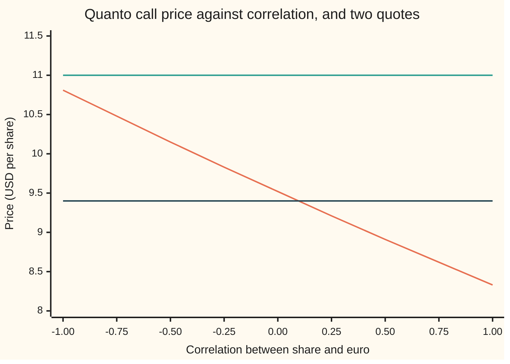

# Correlation from a quanto price: the one input you cannot see, solved backwards, and the range where a solution exists

[Syllabus](../../../SYLLABUS.md) → [Financial mathematics](../../../SYLLABUS.md#w12) → [Quantos and composites](../../../SYLLABUS.md#w12-s24) → Correlation from a quanto price

---

## General Overview

A share trades in Frankfurt at 100 euros. A bank in New York sells a one-year call on it that pays every euro of gain above 100 as 1.10 dollars, a rate fixed on day one. That is a quanto call ([Quanto option](02-quanto-option.md)). With US rates at 5%, euro rates at 3%, a 1% dividend, a share that wobbles 20% a year and a euro that wobbles 10% a year, the price depends on one more number: how closely the share and the euro move together. At a correlation of 0.30 the call costs 9.15 dollars.

Every input but one can be read off a screen. The share's price, the rates and the dividend are quoted. The two volatilities can be read from options on the share and options on the euro. The correlation cannot: no market sells it on its own. So desks run the formula backwards. A quoted quanto price goes in; the correlation that reproduces it comes out. That number is the **implied correlation**, the term used from here on.

Backwards is not always possible. However the correlation is set, between −1 and +1, the price stays between 8.33 and 10.81 dollars. Feed in 9.151629 and exactly 0.30 comes back. Feed in 11.00 and nothing comes back: no correlation produces that price, and a solver that returns one anyway has made it up.

**The quanto price falls steadily as the correlation rises, so any quote strictly between the price at correlation +1 and the price at correlation −1 names exactly one correlation, and any quote outside that range names none.**

**What kind of fact this is:** a method (root-finding on a model price) resting on a theorem: existence and uniqueness of the root, proved on this card in Why it works. The model underneath is the quanto model of [Quanto option](02-quanto-option.md), an assumption rather than a law.

### The picture: one falling curve, two flat quotes



Orange: the model price at each correlation, falling from 10.81 at −1 to 8.33 at +1. Green: a quote of 11.00, above the whole curve, so it never crosses. Dark blue: a quote of 9.40, which crosses the curve once, at a correlation of 0.10.

---

## The formula

The price as a function of the correlation, with every other input fixed:

$$C(\rho) = \bar{X}\,e^{-r_d T}\left[F_Q(\rho)\,N(d_1) - K\,N(d_2)\right], \qquad F_Q(\rho) = S\,e^{(r_f - q - \rho\,\sigma_S\,\sigma_X)T}$$

The implied correlation is the $\rho$ that solves

$$C(\rho) = C_m, \qquad \text{which has exactly one solution in } [-1, 1] \text{ when } C(1) \le C_m \le C(-1).$$

**Read it aloud:** find the correlation at which the model's quanto price equals the quoted price; one exists, and only one, when the quote lies between the price at perfect co-movement and the price at perfect opposite movement.

| Symbol | Plain meaning | In our example | Push it up and the price… |
| --- | --- | --- | --- |
| $C(\rho)$ | the model's quanto call price at correlation $\rho$, in dollars | 9.151629 at 0.30; 10.81 at −1; 8.33 at +1 | — |
| $C_m$ | the quoted (market) price that goes in | 9.151629, 11.00, 9.40 | — |
| $\rho$ | correlation of the share's moves with the dollars-per-euro moves, from −1 to +1; say "rho" | 0.30 comes back | falls, 1.20 dollars per unit near 0.30 |
| $\sigma_S$, $\sigma_X$ | volatility (yearly spread of log returns) of the share and of the exchange rate | 20% and 10% | $\sigma_X$: falls when $\rho$ is positive |
| $\bar{X}$ | the fixed rate in the contract ("X-bar"), dollars per euro | 1.10 | rises in proportion |
| $X_0$ | today's market exchange rate, dollars per euro | 1.15 | does nothing: it cancels |
| $S$, $K$ | the share's price today and the strike, both in euros | 100 and 100 | $S$ raises it; $K$ lowers it |
| $r_d$, $r_f$, $q$ | dollar rate, euro rate, dividend yield, continuously compounded | 5%, 3%, 1% | $r_f$ raises it; $r_d$ and $q$ lower it |
| $T$ | years to expiry | 1 | raises it |
| $F_Q$ | the quanto forward: the share's fair future price in this contract, euros | 101.41 at 0.30 | raises it |
| $N(x)$, $\varphi(x)$, $d_1$, $d_2$ | bell-curve area left of $x$ and its height at $x$; the Black-Scholes call's two cut-offs, with $F_Q$ as the forward | — | — |
| $\partial C / \partial \rho$ | the slope: dollars of price per unit of correlation | −1.204343 at 0.30 | — |

The cut-offs are the ones from [Black–Scholes call](../08-The%20Black-Scholes%20call%20and%20put/01-black-scholes-call.md), written with the forward:

$$d_1 = \frac{\ln(F_Q/K) + \tfrac12\sigma_S^2 T}{\sigma_S\sqrt{T}}, \qquad d_2 = d_1 - \sigma_S\sqrt{T}$$

In words: $d_2$ counts how many standard deviations of room the share has above the strike; $d_1$ adds one more spread, $\sigma_S\sqrt{T}$ (0.20 here).

The slope, which Step 2 derives and Newton's method uses:

$$\frac{\partial C}{\partial \rho} = -\,\bar{X}\,e^{-r_d T}\,F_Q\,N(d_1)\,\sigma_S\,\sigma_X\,T$$

In words: every factor is positive, and the minus sign in front makes the slope negative everywhere.

Conventions verified 2026-09-27: the exchange rate is quoted as dollars per euro and $\rho$ is measured against that quote; with euros per dollar the sign of $\rho$ flips.

### When it holds

- **Both volatilities known.** The correlation only enters through the product $\rho\sigma_X$. With $\sigma_X$ also unknown, one quote pins that product and nothing more: 0.03 here, which is 0.30 with a 10% euro or 0.60 with a 5% euro.
- **The quanto model is right.** Constant volatilities, constant correlation, lognormal prices. A quote carrying a volatility smile (strike-dependent volatility) or a dealer's margin is read as correlation, and the implied number absorbs every error in the other inputs.
- **The quote is inside the range.** Outside the band from 8.33 to 10.81 no correlation fits. The quote then says something the model cannot say, or an input is wrong.
- **The option is not far from the money.** The slope carries $N(d_1)$. At a strike of 140 euros the whole correlation range moves the price only from 0.47 to 0.77 dollars, and a one-cent quote error moves the answer by 0.072 instead of 0.008.
- **Something is exposed to the currency.** If $\sigma_X$, $\sigma_S$ or $T$ is zero the slope is zero, the price ignores the correlation, and every correlation fits a correct quote.

---

## Why it works

### Step 0: the correlation acts through one number, the quanto forward

The quanto call is the Black-Scholes call on a share whose fair future price is the quanto forward $F_Q$ ([The quanto adjustment](01-quanto-forward-and-adjustment.md)). The correlation appears nowhere else. So inverting in correlation is two smaller inversions in a row: from the price to the forward, and from the forward to the correlation. The first is monotone because a call is worth more when the share is expected to end higher. The second is monotone because the forward is an exponential in $\rho$.

### Step 1: the forward falls as the correlation rises

$F_Q(\rho) = S\,e^{(r_f - q - \rho\sigma_S\sigma_X)T}$. Every rise in $\rho$ lowers the exponent, so the forward slides: 104.08 at −1, 102.02 at 0, 100.00 at +1. At +1 the forward is exactly today's price, because the adjustment $\rho\sigma_S\sigma_X$ then equals the euro carry $r_f - q$ (the euro rate less the dividend).

As long as $\sigma_S$, $\sigma_X$ and $T$ are positive, the forward is strictly decreasing in $\rho$: a larger correlation always gives a smaller forward.

### Step 2: the price rises with the forward, so it falls with the correlation

Hold the forward's spread fixed and raise the forward. The call's price rises at the rate $\bar{X}e^{-r_d T}N(d_1)$ per euro of forward: the chance of exercise counted in shares, discounted and converted. That is positive. By the chain rule (the slope of a function of a function is the product of the two slopes), the price's slope in $\rho$ is that positive number times the forward's slope, $-\sigma_S\sigma_X T\,F_Q$. The product is the formula for $\partial C/\partial\rho$ above. At 0.30 it is −1.204343 dollars per unit of correlation: about 1.2 cents per 0.01.

<details>
<summary>Detailed proof: the slope in the forward is $\bar{X}e^{-r_dT}N(d_1)$</summary>

Write $C = A\,[F_Q N(d_1) - K N(d_2)]$ with $A = \bar{X}e^{-r_dT}$, and $v = \sigma_S\sqrt{T}$. Both cut-offs depend on the forward: $\partial d_1/\partial F_Q = \partial d_2/\partial F_Q = 1/(F_Q v)$. Differentiate:
$$\frac{\partial C}{\partial F_Q} = A\left[N(d_1) + F_Q\,\varphi(d_1)\frac{1}{F_Q v} - K\,\varphi(d_2)\frac{1}{F_Q v}\right]$$
where $\varphi$ is the bell curve's height. The two height terms cancel, because $F_Q\varphi(d_1) = K\varphi(d_2)$: the ratio $\varphi(d_1)/\varphi(d_2)$ is $e^{-(d_1^2 - d_2^2)/2} = e^{-(d_1 + d_2)v/2}$, and $(d_1 + d_2)v/2 = \ln(F_Q/K)$ from the definition of $d_1$, so the ratio is $K/F_Q$. What is left is $\partial C/\partial F_Q = A\,N(d_1)$, strictly positive for any finite $d_1$. With $\partial F_Q/\partial\rho = -\sigma_S\sigma_X T F_Q$, the chain rule gives the slope in the formula section. Since $\bar{X}e^{-r_dT}$, $F_Q$, $N(d_1)$, $\sigma_S$, $\sigma_X$ and $T$ are all positive, $\partial C/\partial\rho < 0$ for every $\rho$. $\blacksquare$

</details>

### Step 3: existence, by the intermediate value theorem

$C(\rho)$ is continuous on $[-1, 1]$: it is built from exponentials, a logarithm and the bell-curve area, all continuous. Its ends are $C(-1)$ = 10.808928 and $C(1)$ = 8.334790. The intermediate value theorem ([Intermediate value theorem](../../06-Calculus%20and%20analysis/01-Limits%20and%20Continuity/06-intermediate-value-theorem.md)) says a continuous function on an interval takes every value between its two end values. So any quote from 8.334790 to 10.808928 is hit by at least one correlation.

### Step 4: uniqueness, from the slope

A strictly decreasing function cannot take the same value twice: if $\rho_1 < \rho_2$ then $C(\rho_1) > C(\rho_2)$. So the correlation from Step 3 is the only one. Together: **exactly one root for a quote in the band, none outside it.**

### Step 5: the boundary cases

- **A quote equal to $C(-1)$ or $C(1)$.** The root is −1 or +1: share and euro move as one, in opposite or the same direction. Legal, but a sign that some other input is off.
- **A quote above $C(-1)$**, such as 11.00. No correlation in range fits. Newton's method, which follows the slope without keeping a bracket, walks past −1 and stops at −1.141154, where the formula, pushed outside the legal range, prices 11.00. That number is not a correlation.
- **A quote below $C(1)$**, such as 8.20. No correlation fits. The quote is below the lowest price any correlation gives.
- **$\sigma_X$, $\sigma_S$ or $T$ equal to 0.** The slope is zero everywhere and $C$ is flat. A correct quote fits every $\rho$; the correlation is not identified.

### Step 6: with the currency's volatility unknown, only the product is identified

The correlation enters only through $\rho\sigma_S\sigma_X$, and $\sigma_S$ is known. So a quote fixes $\rho\sigma_X$, not $\rho$ and $\sigma_X$ apart. For the house quote that product is 0.03. Assume a 5% euro volatility and the implied correlation is 0.60; assume 15% and it is 0.20. Since a correlation cannot exceed 1, the quote does say one thing about $\sigma_X$: it is at least 0.03. At 0.02 no correlation fits.

```
Implied correlation from 9.151629, by assumed euro volatility (one █ = 0.05)
FX vol 0.02   (would need a correlation above 1)        none
FX vol 0.03   ████████████████████                      1.00
FX vol 0.05   ████████████                              0.60
FX vol 0.10   ██████                                    0.30
FX vol 0.15   ████                                      0.20
FX vol 0.30   ██                                        0.10
```

In practice the euro's volatility is read from currency options, which trade in size. That is what makes the correlation, rather than just the product, recoverable.

### Comparing with history

The implied correlation is what the quote charges. The historical correlation is what the last year's daily returns show. They answer different questions, and the historical one is itself noisy. With 252 daily returns and a true correlation of 0.30, an estimate lands within about $(1 - \rho^2)/\sqrt{252}$ = 0.057 of the truth, as a typical error (R. A. Fisher derived the full distribution of such estimates in 1915). The check simulates 1,000 such years: the estimates average 0.2997 with a spread of 0.0570. One simulated year gave 0.275.

Now a dealer quotes 9.40. The implied correlation is 0.096. That sits 3.6 spreads below 0.30, too far to blame on a short history. The dealer is charging for a lower correlation than history shows, either as a view or as a premium for carrying correlation risk that cannot be hedged ([Hedging a quanto](03-quanto-greeks-and-hedging.md)).

### The other door: go through the forward

Step 0 gives a second route. Solve the quote for the quanto forward first, with no correlation in sight. Then read the correlation off the forward by logarithms: $\rho = (r_f - q - \ln(F_Q/S)/T)/(\sigma_S\sigma_X)$. The code takes this route with its own integrator and its own root finder, and lands on the same 0.300000.

---

## Worked numbers, by hand

The house quote 9.151629, halving the bracket from $[-1, 1]$ and keeping the half where the price minus the quote changes sign:

| Step | Arithmetic | Value |
| --- | --- | --- |
| is there a root? | 8.334790 ≤ 9.151629 ≤ 10.808928 | yes, exactly one |
| try $\rho$ = 0 | price minus quote +0.366152: too dear, go right | $[0, 1]$ |
| try 0.5 | −0.238721: too cheap, go left | $[0, 0.5]$ |
| try 0.25 | +0.060352 | $[0.25, 0.5]$ |
| try 0.375 | −0.090023 | $[0.25, 0.375]$ |
| try 0.3125 | −0.015046 | $[0.25, 0.3125]$ |
| try 0.28125 | +0.022600 | $[0.28125, 0.3125]$ |
| 80 halvings | the bracket closes on the root | **$\rho$ = 0.300000** |
| the other door: forward | solve the call price for $F_Q$ | 101.409846 EUR |
| its growth | $\ln(101.409846/100)/1$ | 0.014000 |
| back to $\rho$ | $(0.03 - 0.01 - 0.014)/(0.20 \times 0.10)$ | **0.300000** |
| the product pinned | $\rho\sigma_S\sigma_X$ = 0.30 × 0.20 × 0.10; $\rho\sigma_X$ | 0.006000; 0.030000 |

The quote carries a correlation of 0.30: the dollar investor's market is pricing a share that tends to rise when the euro strengthens, and charging 1.2 cents less for each extra 0.01 of that tendency.

### What breaks if you drop a piece

Same quote, 9.151629, correct answer 0.30:

| Mistake | Comes out at | What went wrong |
| --- | --- | --- |
| Today's rate 1.15 in place of the fixed 1.10 | ρ = 0.635 | Every price is scaled up by 1.15/1.10, so a much larger correlation is needed to pull it back down |
| Share vol widened to $\sqrt{\sigma_S^2 + \sigma_X^2}$ | no solution: floor 9.314703 | The currency's wobble does not widen a quanto payoff; with it added, even correlation +1 prices above the quote |
| Plus sign on the adjustment | ρ = −0.30 | A euros-per-dollar formula paired with a dollars-per-euro correlation |
| Newton on the quote 11.00 with no bracket | ρ = −1.141154 | No root exists; the solver reports a number outside the range of a correlation |

---

## Code, from first principles, and it actually runs

The scripts write their own bell-curve area (its Taylor series), their own integrator (Simpson's rule), their own root finders and their own random numbers (splitmix64 and Box-Muller). Four roads reach the correlation or check the price it rests on: bisection on the formula; a secant search on a Simpson-integrated price for the forward, then logarithms; Newton's method with the analytic slope; and a simulation in the euro investor's world, where the share grows at its plain euro rate, the payoff is converted back through a simulated exchange rate, and no quanto adjustment is used. The simulation reproduces the band's ends and the house price within one standard error. Then the scripts test the boundary quotes, the strike-140 conditioning, the euro-volatility trade-off, the four mistakes, and a thousand simulated years of history.

### Python

```python
# Correlation from a quanto price -- the check behind the card.  Standard library only.
# Normal CDF, integrator, root finders and random numbers are all written here.
from math import log, sqrt, exp, pi, cos, sin

def phi(x): return exp(-0.5 * x * x) / sqrt(2.0 * pi)      # bell-curve height
def N(x):                                                   # bell-curve area, by its Taylor series
    if x < -9.0: return 0.0
    if x > 9.0: return 1.0
    t = s = x
    for n in range(1, 400):
        t *= x * x / (2 * n + 1); s += t
        if abs(t) < 1e-17 * abs(s): break
    return 0.5 + s * phi(x)

S, K, XB, X0, RD, RF, Q, SS, SX, T = 100.0, 100.0, 1.10, 1.15, 0.05, 0.03, 0.01, 0.20, 0.10, 1.0

def fwd(rho, sx=SX): return S * exp((RF - Q - rho * SS * sx) * T)   # quanto forward, EUR
def price(rho, k=K, xb=XB, vol=SS, sx=SX, sign=-1.0):              # road 1: the closed form
    F = S * exp((RF - Q + sign * rho * SS * sx) * T)
    d1 = (log(F / k) + 0.5 * vol * vol * T) / (vol * sqrt(T)); d2 = d1 - vol * sqrt(T)
    return xb * exp(-RD * T) * (F * N(d1) - k * N(d2))
def slope(rho, k=K):                                                # dC/drho, by the chain rule
    F = fwd(rho); d1 = (log(F / k) + 0.5 * SS * SS * T) / (SS * sqrt(T))
    return -XB * exp(-RD * T) * F * N(d1) * SS * SX * T

def bisect(f, lo, hi, steps=80, log_rows=0):   # f(lo) > 0 > f(hi): the price falls as rho rises
    for i in range(steps):
        mid = 0.5 * (lo + hi); v = f(mid)
        if i < log_rows: print(f"bisect step {i+1}  rho {mid:+.6f}  price minus quote {v:+.6f}")
        if v > 0: lo = mid
        else: hi = mid
    return 0.5 * (lo + hi)
def implied(quote, **kw):                        # existence first, then the unique root
    top, bottom = price(-1.0, **kw), price(1.0, **kw)
    if not (bottom <= quote <= top): return None
    return bisect(lambda r: price(r, **kw) - quote, -1.0, 1.0)
def newton(quote, rho=0.0):                      # road 3: Newton, no bracket kept
    for _ in range(50): rho -= (price(rho) - quote) / slope(rho)
    return rho

def simpson_call_from_forward(F, k=K, n=2000):   # road 2: integrate the payoff over the bell curve
    v = SS * sqrt(T); a = (log(k / F) + 0.5 * v * v) / v; b = 10.0; h = (b - a) / n
    f = lambda z: (F * exp(-0.5 * v * v + v * z) - k) * phi(z)
    tot = f(a) + f(b) + sum((4 if i % 2 else 2) * f(a + i * h) for i in range(1, n))
    return XB * exp(-RD * T) * tot * h / 3.0
def forward_from_quote(quote):                   # secant on the forward, no correlation in sight
    f0, f1 = 100.0, 110.0
    g0, g1 = simpson_call_from_forward(f0) - quote, simpson_call_from_forward(f1) - quote
    for _ in range(60):
        if g1 == g0: break
        f0, f1, g0 = f1, f1 - g1 * (f1 - f0) / (g1 - g0), g1
        g1 = simpson_call_from_forward(f1) - quote
    return f1

M64 = (1 << 64) - 1
state = 20260927
def uniform():                                   # splitmix64, then a number strictly inside (0, 1)
    global state
    state = (state + 0x9E3779B97F4A7C15) & M64; z = state
    z = ((z ^ (z >> 30)) * 0xBF58476D1CE4E5B9) & M64; z = ((z ^ (z >> 27)) * 0x94D049BB133111EB) & M64
    return (((z ^ (z >> 31)) >> 11) + 0.5) / 9007199254740992.0
def normal_pair():                               # Box-Muller
    r, a = sqrt(-2.0 * log(uniform())), 2.0 * pi * uniform()
    return r * cos(a), r * sin(a)

PAIRS = [normal_pair() for _ in range(100000)]
def mc_price(rho):   # road 4: simulate in the EURO world, no quanto adjustment used anywhere
    total = total2 = 0.0; c = sqrt(1.0 - rho * rho)
    for z1, z2 in PAIRS:
        pair = 0.0
        for s in (1.0, -1.0):                    # antithetic: each draw and its mirror
            ST = S * exp((RF - Q - 0.5 * SS * SS) * T + SS * sqrt(T) * s * z1)
            XT = X0 * exp((RD - RF + 0.5 * SX * SX) * T + SX * sqrt(T) * s * (rho * z1 + c * z2))
            pair += 0.5 * XB * max(ST - K, 0.0) / XT
        total += pair; total2 += pair * pair
    n = len(PAIRS); m = total / n; se = sqrt((total2 / n - m * m) / n)
    return X0 * exp(-RF * T) * m, X0 * exp(-RF * T) * se

def sample_corr(n=252, rho=0.30):                # one simulated year of daily returns
    xs, ys = [], []
    for _ in range(n):
        z1, z2 = normal_pair(); xs.append(z1); ys.append(rho * z1 + sqrt(1 - rho * rho) * z2)
    mx, my = sum(xs) / n, sum(ys) / n
    sxy = sum((a - mx) * (b - my) for a, b in zip(xs, ys))
    return sxy / sqrt(sum((a - mx) * (a - mx) for a in xs) * sum((b - my) * (b - my) for b in ys))

def p(label, v): print(f"{label:<44} {v:>12.6f}" if v is not None else f"{label:<44} {'none':>12}")
HOUSE = 9.151629
p("formula at rho 0.30: the house quote", price(0.30))
p("ceiling: price at rho = -1", price(-1.0)); p("floor: price at rho = +1", price(1.0))
r1 = bisect(lambda r: price(r) - HOUSE, -1.0, 1.0, log_rows=6)
F2 = forward_from_quote(HOUSE); r2 = (RF - Q - log(F2 / S) / T) / (SS * SX)
r3 = newton(HOUSE)
p("1 bisection on the formula", r1); p("2 forward from quote, Simpson + secant", F2)
p("  ln(F/S)/T, the forward's growth", log(F2 / S) / T)
p("  rho = (rf - q - ln(F/S)/T) / (sS sX)", r2); p("3 Newton from rho = 0", r3)
p("rho sS sX, the quanto adjustment", r1 * SS * SX); p("rho sX, all the quote pins down", r1 * SX)
mc = {rho: mc_price(rho) for rho in (-1.0, 0.30, 1.0)}
for rho in (-1.0, 0.30, 1.0):
    print(f"4 euro-world simulation, rho {rho:+.2f}  {mc[rho][0]:>12.6f}  one standard error {mc[rho][1]:.6f}")
p("quote 11.00: correlation", implied(11.00)); p("  Newton, unbracketed", newton(11.00))
p("quote 8.20: correlation", implied(8.20)); p("quote 9.40: correlation", implied(9.40))
p("quote 8.50: correlation", implied(8.50))
p("slope dC/drho at 0.30", slope(r1)); p("rho moved by a 1-cent quote error", 0.01 / abs(slope(r1)))
p("  strike 140: ceiling", price(-1.0, k=140.0)); p("  strike 140: floor", price(1.0, k=140.0))
p("  strike 140: rho moved by 1 cent", 0.01 / abs(slope(0.30, k=140.0)))
for sx in (0.02, 0.03, 0.05, 0.15, 0.30):
    p(f"FX vol {sx:.2f} assumed: correlation", implied(HOUSE, sx=sx))
p("wrong: spot 1.15 for the fixed 1.10", implied(HOUSE, xb=X0))
p("wrong: vol sqrt(sS^2 + sX^2)", implied(HOUSE, vol=sqrt(SS * SS + SX * SX)))
p("  the floor with that vol", price(1.0, vol=sqrt(SS * SS + SX * SX)))
p("wrong: plus sign on rho", bisect(lambda r: HOUSE - price(r, sign=1.0), -1.0, 1.0))
est = [sample_corr() for _ in range(1000)]
mean = sum(est) / len(est); sd = sqrt(sum((e - mean) ** 2 for e in est) / (len(est) - 1))
p("history: first simulated year's estimate", est[0]); p("history: average of 1000 years", mean)
p("history: spread of the estimates", sd); p("  formula (1 - rho^2) / sqrt(252)", (1 - 0.09) / sqrt(252))
p("  quote 9.40 sits this many spreads away", (0.30 - implied(9.40)) / sd)
print("sweep: rho, price, quanto forward")
for rho in (-1.0, -0.75, -0.5, -0.25, 0.0, 0.25, 0.5, 0.75, 1.0):
    print(f"  {rho:+.2f}  {price(rho):.2f}  {fwd(rho):.2f}")
assert abs(r1 - 0.30) < 1e-5
assert abs(r2 - r1) < 1e-6
assert abs(r3 - r1) < 1e-9
assert abs(slope(r1) - (price(r1 + 1e-5) - price(r1 - 1e-5)) / 2e-5) < 1e-6   # slope = finite difference
assert all(price(i / 8) > price((i + 1) / 8) for i in range(-8, 8))            # strictly falling
assert all(abs(mc[r][0] - price(r)) < 4 * mc[r][1] for r in mc)
assert implied(11.00) is None
assert newton(11.00) < -1.0
assert implied(8.20) is None
assert abs(implied(HOUSE, sx=0.05) * 0.05 - implied(HOUSE, sx=0.15) * 0.15) < 1e-6
assert abs(sd / ((1 - 0.09) / sqrt(252)) - 1.0) < 0.15
print("All checks passed.")
```

**Ran 2026-09-27 on macOS, Python 3.14.6, standard library only. All checks passed. Output, pasted from the run:**

```
formula at rho 0.30: the house quote             9.151629
ceiling: price at rho = -1                      10.808928
floor: price at rho = +1                         8.334790
bisect step 1  rho +0.000000  price minus quote +0.366152
bisect step 2  rho +0.500000  price minus quote -0.238721
bisect step 3  rho +0.250000  price minus quote +0.060352
bisect step 4  rho +0.375000  price minus quote -0.090023
bisect step 5  rho +0.312500  price minus quote -0.015046
bisect step 6  rho +0.281250  price minus quote +0.022600
1 bisection on the formula                       0.300000
2 forward from quote, Simpson + secant         101.409846
  ln(F/S)/T, the forward's growth                0.014000
  rho = (rf - q - ln(F/S)/T) / (sS sX)           0.300000
3 Newton from rho = 0                            0.300000
rho sS sX, the quanto adjustment                 0.006000
rho sX, all the quote pins down                  0.030000
4 euro-world simulation, rho -1.00     10.828473  one standard error 0.031408
4 euro-world simulation, rho +0.30      9.169231  one standard error 0.023718
4 euro-world simulation, rho +1.00      8.350503  one standard error 0.019988
quote 11.00: correlation                             none
  Newton, unbracketed                           -1.141154
quote 8.20: correlation                              none
quote 9.40: correlation                          0.095638
quote 8.50: correlation                          0.854746
slope dC/drho at 0.30                           -1.204343
rho moved by a 1-cent quote error                0.008303
  strike 140: ceiling                            0.767842
  strike 140: floor                              0.470893
  strike 140: rho moved by 1 cent                0.072248
FX vol 0.02 assumed: correlation                     none
FX vol 0.03 assumed: correlation                 1.000000
FX vol 0.05 assumed: correlation                 0.600000
FX vol 0.15 assumed: correlation                 0.200000
FX vol 0.30 assumed: correlation                 0.100000
wrong: spot 1.15 for the fixed 1.10              0.635394
wrong: vol sqrt(sS^2 + sX^2)                         none
  the floor with that vol                        9.314703
wrong: plus sign on rho                         -0.300000
history: first simulated year's estimate         0.275379
history: average of 1000 years                   0.299693
history: spread of the estimates                 0.057009
  formula (1 - rho^2) / sqrt(252)                0.057325
  quote 9.40 sits this many spreads away         3.584765
sweep: rho, price, quanto forward
  -1.00  10.81  104.08
  -0.75  10.48  103.56
  -0.50  10.15  103.05
  -0.25  9.83  102.53
  +0.00  9.52  102.02
  +0.25  9.21  101.51
  +0.50  8.91  101.01
  +0.75  8.62  100.50
  +1.00  8.33  100.00
All checks passed.
```

### Rust

```rust
// Correlation from a quanto price -- the check behind the card.  Rust std only.
// Normal CDF, integrator, root finders and random numbers are all written here.
use std::f64::consts::PI;

const S: f64 = 100.0; const K: f64 = 100.0; const XB: f64 = 1.10; const X0: f64 = 1.15;
const RD: f64 = 0.05; const RF: f64 = 0.03; const Q: f64 = 0.01;
const SS: f64 = 0.20; const SX: f64 = 0.10; const T: f64 = 1.0;
const HOUSE: f64 = 9.151629;

fn phi(x: f64) -> f64 { (-0.5 * x * x).exp() / (2.0 * PI).sqrt() }   // bell-curve height
fn n_cdf(x: f64) -> f64 {                                           // bell-curve area, by its Taylor series
    if x < -9.0 { return 0.0; }
    if x > 9.0 { return 1.0; }
    let (mut t, mut s) = (x, x);
    for n in 1..400 {
        t *= x * x / (2 * n + 1) as f64; s += t;
        if t.abs() < 1e-17 * s.abs() { break; }
    }
    0.5 + s * phi(x)
}

#[derive(Clone, Copy)]
struct P { k: f64, xb: f64, vol: f64, sx: f64, sign: f64 }
const BASE: P = P { k: K, xb: XB, vol: SS, sx: SX, sign: -1.0 };

fn fwd(rho: f64) -> f64 { S * ((RF - Q - rho * SS * SX) * T).exp() }           // quanto forward, EUR
fn price(rho: f64, p: P) -> f64 {                                                // road 1: the closed form
    let f = S * ((RF - Q + p.sign * rho * SS * p.sx) * T).exp();
    let d1 = ((f / p.k).ln() + 0.5 * p.vol * p.vol * T) / (p.vol * T.sqrt()); let d2 = d1 - p.vol * T.sqrt();
    p.xb * (-RD * T).exp() * (f * n_cdf(d1) - p.k * n_cdf(d2))
}
fn slope(rho: f64, k: f64) -> f64 {                                              // dC/drho, by the chain rule
    let f = fwd(rho); let d1 = ((f / k).ln() + 0.5 * SS * SS * T) / (SS * T.sqrt());
    -XB * (-RD * T).exp() * f * n_cdf(d1) * SS * SX * T
}
fn bisect(f: &dyn Fn(f64) -> f64, mut lo: f64, mut hi: f64, log_rows: usize) -> f64 {
    for i in 0..80 {                                     // f(lo) > 0 > f(hi): the price falls as rho rises
        let mid = 0.5 * (lo + hi); let v = f(mid);
        if i < log_rows { println!("bisect step {}  rho {:+.6}  price minus quote {:+.6}", i + 1, mid, v); }
        if v > 0.0 { lo = mid; } else { hi = mid; }
    }
    0.5 * (lo + hi)
}
fn implied(quote: f64, p: P) -> Option<f64> {         // existence first, then the unique root
    let (top, bottom) = (price(-1.0, p), price(1.0, p));
    if !(bottom <= quote && quote <= top) { return None; }
    Some(bisect(&|r| price(r, p) - quote, -1.0, 1.0, 0))
}
fn newton(quote: f64) -> f64 {                         // road 3: Newton, no bracket kept
    let mut rho = 0.0;
    for _ in 0..50 { rho -= (price(rho, BASE) - quote) / slope(rho, K); }
    rho
}
fn simpson_call_from_forward(f: f64) -> f64 {          // road 2: integrate the payoff over the bell curve
    let n = 2000; let v = SS * T.sqrt(); let a = ((K / f).ln() + 0.5 * v * v) / v; let b = 10.0;
    let h = (b - a) / n as f64;
    let g = |z: f64| (f * (-0.5 * v * v + v * z).exp() - K) * phi(z);
    let mut inner = 0.0;
    for i in 1..n { inner += (if i % 2 == 1 { 4.0 } else { 2.0 }) * g(a + i as f64 * h); }
    XB * (-RD * T).exp() * (g(a) + g(b) + inner) * h / 3.0
}
fn forward_from_quote(quote: f64) -> f64 {             // secant on the forward, no correlation in sight
    let (mut f0, mut f1) = (100.0, 110.0);
    let (mut g0, mut g1) = (simpson_call_from_forward(f0) - quote, simpson_call_from_forward(f1) - quote);
    for _ in 0..60 {
        if g1 == g0 { break; }
        let f2 = f1 - g1 * (f1 - f0) / (g1 - g0);
        f0 = f1; f1 = f2; g0 = g1; g1 = simpson_call_from_forward(f1) - quote;
    }
    f1
}

struct Rng(u64);
impl Rng {
    fn uniform(&mut self) -> f64 {                     // splitmix64, then a number strictly inside (0, 1)
        self.0 = self.0.wrapping_add(0x9E3779B97F4A7C15); let mut z = self.0;
        z = (z ^ (z >> 30)).wrapping_mul(0xBF58476D1CE4E5B9); z = (z ^ (z >> 27)).wrapping_mul(0x94D049BB133111EB);
        (((z ^ (z >> 31)) >> 11) as f64 + 0.5) / 9007199254740992.0
    }
    fn normal_pair(&mut self) -> (f64, f64) {          // Box-Muller
        let r = (-2.0 * self.uniform().ln()).sqrt(); let a = 2.0 * PI * self.uniform();
        (r * a.cos(), r * a.sin())
    }
}
fn mc_price(rho: f64, pairs: &[(f64, f64)]) -> (f64, f64) {   // road 4: simulate in the EURO world
    let (mut total, mut total2) = (0.0, 0.0); let c = (1.0 - rho * rho).sqrt();
    for &(z1, z2) in pairs {
        let mut pair = 0.0;
        for s in [1.0, -1.0] {                          // antithetic: each draw and its mirror
            let st = S * ((RF - Q - 0.5 * SS * SS) * T + SS * T.sqrt() * s * z1).exp();
            let xt = X0 * ((RD - RF + 0.5 * SX * SX) * T + SX * T.sqrt() * s * (rho * z1 + c * z2)).exp();
            pair += 0.5 * XB * (st - K).max(0.0) / xt;
        }
        total += pair; total2 += pair * pair;
    }
    let n = pairs.len() as f64; let m = total / n; let se = ((total2 / n - m * m) / n).sqrt();
    (X0 * (-RF * T).exp() * m, X0 * (-RF * T).exp() * se)
}
fn sample_corr(rng: &mut Rng) -> f64 {                   // one simulated year of daily returns
    let (n, rho) = (252, 0.30); let (mut xs, mut ys) = (Vec::new(), Vec::new());
    for _ in 0..n { let (z1, z2) = rng.normal_pair(); xs.push(z1); ys.push(rho * z1 + (1.0f64 - rho * rho).sqrt() * z2); }
    let mx = xs.iter().fold(0.0, |a, b| a + b) / n as f64; let my = ys.iter().fold(0.0, |a, b| a + b) / n as f64;
    let (mut sxy, mut sxx, mut syy) = (0.0, 0.0, 0.0);
    for i in 0..n { sxy += (xs[i] - mx) * (ys[i] - my); }
    for i in 0..n { sxx += (xs[i] - mx) * (xs[i] - mx); }
    for i in 0..n { syy += (ys[i] - my) * (ys[i] - my); }
    sxy / (sxx * syy).sqrt()
}
fn p(label: &str, v: Option<f64>) {
    match v { Some(x) => println!("{:<44} {:>12.6}", label, x), None => println!("{:<44} {:>12}", label, "none") }
}

fn main() {
    let mut rng = Rng(20260927);
    let pairs: Vec<(f64, f64)> = (0..100000).map(|_| rng.normal_pair()).collect();
    p("formula at rho 0.30: the house quote", Some(price(0.30, BASE)));
    p("ceiling: price at rho = -1", Some(price(-1.0, BASE))); p("floor: price at rho = +1", Some(price(1.0, BASE)));
    let r1 = bisect(&|r| price(r, BASE) - HOUSE, -1.0, 1.0, 6);
    let f2 = forward_from_quote(HOUSE); let r2 = (RF - Q - (f2 / S).ln() / T) / (SS * SX);
    let r3 = newton(HOUSE);
    p("1 bisection on the formula", Some(r1)); p("2 forward from quote, Simpson + secant", Some(f2));
    p("  ln(F/S)/T, the forward's growth", Some((f2 / S).ln() / T));
    p("  rho = (rf - q - ln(F/S)/T) / (sS sX)", Some(r2)); p("3 Newton from rho = 0", Some(r3));
    p("rho sS sX, the quanto adjustment", Some(r1 * SS * SX)); p("rho sX, all the quote pins down", Some(r1 * SX));
    let mc: Vec<(f64, (f64, f64))> = [-1.0, 0.30, 1.0].iter().map(|&r| (r, mc_price(r, &pairs))).collect();
    for &(rho, (m, se)) in &mc {
        println!("4 euro-world simulation, rho {:+.2}  {:>12.6}  one standard error {:.6}", rho, m, se);
    }
    p("quote 11.00: correlation", implied(11.00, BASE)); p("  Newton, unbracketed", Some(newton(11.00)));
    p("quote 8.20: correlation", implied(8.20, BASE)); p("quote 9.40: correlation", implied(9.40, BASE));
    p("quote 8.50: correlation", implied(8.50, BASE));
    p("slope dC/drho at 0.30", Some(slope(r1, K))); p("rho moved by a 1-cent quote error", Some(0.01 / slope(r1, K).abs()));
    let k140 = P { k: 140.0, ..BASE };
    p("  strike 140: ceiling", Some(price(-1.0, k140))); p("  strike 140: floor", Some(price(1.0, k140)));
    p("  strike 140: rho moved by 1 cent", Some(0.01 / slope(0.30, 140.0).abs()));
    for sx in [0.02, 0.03, 0.05, 0.15, 0.30] {
        p(&format!("FX vol {:.2} assumed: correlation", sx), implied(HOUSE, P { sx, ..BASE }));
    }
    let wide = P { vol: (SS * SS + SX * SX).sqrt(), ..BASE };
    p("wrong: spot 1.15 for the fixed 1.10", implied(HOUSE, P { xb: X0, ..BASE }));
    p("wrong: vol sqrt(sS^2 + sX^2)", implied(HOUSE, wide)); p("  the floor with that vol", Some(price(1.0, wide)));
    let plus = P { sign: 1.0, ..BASE };
    p("wrong: plus sign on rho", Some(bisect(&|r| HOUSE - price(r, plus), -1.0, 1.0, 0)));
    let est: Vec<f64> = (0..1000).map(|_| sample_corr(&mut rng)).collect();
    let mean = est.iter().fold(0.0, |a, b| a + b) / est.len() as f64;
    let sd = (est.iter().fold(0.0, |a, e| a + (e - mean) * (e - mean)) / (est.len() - 1) as f64).sqrt();
    let formula = (1.0 - 0.09) / 252f64.sqrt(); let r940 = implied(9.40, BASE).unwrap();
    p("history: first simulated year's estimate", Some(est[0])); p("history: average of 1000 years", Some(mean));
    p("history: spread of the estimates", Some(sd)); p("  formula (1 - rho^2) / sqrt(252)", Some(formula));
    p("  quote 9.40 sits this many spreads away", Some((0.30 - r940) / sd));
    println!("sweep: rho, price, quanto forward");
    for rho in [-1.0, -0.75, -0.5, -0.25, 0.0, 0.25, 0.5, 0.75, 1.0] {
        println!("  {:+.2}  {:.2}  {:.2}", rho, price(rho, BASE), fwd(rho));
    }
    assert!((r1 - 0.30).abs() < 1e-5); assert!((r2 - r1).abs() < 1e-6); assert!((r3 - r1).abs() < 1e-9);
    assert!((slope(r1, K) - (price(r1 + 1e-5, BASE) - price(r1 - 1e-5, BASE)) / 2e-5).abs() < 1e-6);   // slope = finite difference
    assert!((-8..8).all(|i| price(i as f64 / 8.0, BASE) > price((i + 1) as f64 / 8.0, BASE)));          // strictly falling
    for &(rho, (m, se)) in &mc { assert!((m - price(rho, BASE)).abs() < 4.0 * se); }
    assert!(implied(11.00, BASE).is_none()); assert!(newton(11.00) < -1.0); assert!(implied(8.20, BASE).is_none());
    let a = implied(HOUSE, P { sx: 0.05, ..BASE }).unwrap() * 0.05; let b = implied(HOUSE, P { sx: 0.15, ..BASE }).unwrap() * 0.15;
    assert!((a - b).abs() < 1e-6);
    assert!((sd / formula - 1.0).abs() < 0.15);
    println!("All checks passed.");
}
```

**Ran 2026-09-27 on macOS, rustc 1.98.1, no crates. All checks passed. Output, pasted from the run:**

```
formula at rho 0.30: the house quote             9.151629
ceiling: price at rho = -1                      10.808928
floor: price at rho = +1                         8.334790
bisect step 1  rho +0.000000  price minus quote +0.366152
bisect step 2  rho +0.500000  price minus quote -0.238721
bisect step 3  rho +0.250000  price minus quote +0.060352
bisect step 4  rho +0.375000  price minus quote -0.090023
bisect step 5  rho +0.312500  price minus quote -0.015046
bisect step 6  rho +0.281250  price minus quote +0.022600
1 bisection on the formula                       0.300000
2 forward from quote, Simpson + secant         101.409846
  ln(F/S)/T, the forward's growth                0.014000
  rho = (rf - q - ln(F/S)/T) / (sS sX)           0.300000
3 Newton from rho = 0                            0.300000
rho sS sX, the quanto adjustment                 0.006000
rho sX, all the quote pins down                  0.030000
4 euro-world simulation, rho -1.00     10.828473  one standard error 0.031408
4 euro-world simulation, rho +0.30      9.169231  one standard error 0.023718
4 euro-world simulation, rho +1.00      8.350503  one standard error 0.019988
quote 11.00: correlation                             none
  Newton, unbracketed                           -1.141154
quote 8.20: correlation                              none
quote 9.40: correlation                          0.095638
quote 8.50: correlation                          0.854746
slope dC/drho at 0.30                           -1.204343
rho moved by a 1-cent quote error                0.008303
  strike 140: ceiling                            0.767842
  strike 140: floor                              0.470893
  strike 140: rho moved by 1 cent                0.072248
FX vol 0.02 assumed: correlation                     none
FX vol 0.03 assumed: correlation                 1.000000
FX vol 0.05 assumed: correlation                 0.600000
FX vol 0.15 assumed: correlation                 0.200000
FX vol 0.30 assumed: correlation                 0.100000
wrong: spot 1.15 for the fixed 1.10              0.635394
wrong: vol sqrt(sS^2 + sX^2)                         none
  the floor with that vol                        9.314703
wrong: plus sign on rho                         -0.300000
history: first simulated year's estimate         0.275379
history: average of 1000 years                   0.299693
history: spread of the estimates                 0.057009
  formula (1 - rho^2) / sqrt(252)                0.057325
  quote 9.40 sits this many spreads away         3.584765
sweep: rho, price, quanto forward
  -1.00  10.81  104.08
  -0.75  10.48  103.56
  -0.50  10.15  103.05
  -0.25  9.83  102.53
  +0.00  9.52  102.02
  +0.25  9.21  101.51
  +0.50  8.91  101.01
  +0.75  8.62  100.50
  +1.00  8.33  100.00
All checks passed.
```

The two outputs agree line for line. The simulated numbers match because both programs draw the same splitmix64 stream.

> [!TIP]
> **Try changing**
> - **Quote 8.50.** Guess first: above or below 0.30? Below the house price means more correlation. Answer: 0.854746.
> - **Quote 8.20.** Guess first: is there a root? It sits under the floor of 8.334790. Answer: none.
> - **Strike 140.** Guess first: does the band get wider or narrower? Narrower, from 0.767842 down to 0.470893, and a one-cent error now moves the correlation by 0.072248.
> - **Euro volatility 0.03.** Guess first: what correlation? The product 0.03 must be kept, so 1.000000: the quote sits on the floor of that market.

---

## The usual mistake

> [!warning]
> **Trusting a solver's answer without checking the band first.** A root finder always returns a number. Only the check $C(1) \le C_m \le C(-1)$ says whether that number is a correlation. Newton on 11.00 returns −1.141154; clipped to −1, it becomes a plausible-looking −1.00 that reproduces a price of 10.81, not 11.00.
>
> - **Reading the implied number as a forecast.** It is what the quote charges, including any premium for correlation risk. The dealer's 9.40 implies 0.096; history says 0.30, give or take 0.057.
> - **Inverting with the currency's volatility guessed.** Only $\rho\sigma_X$ = 0.03 is pinned. A guess of 5% returns 0.60; a guess of 15% returns 0.20. The correlation is only as good as the volatility fed in.
> - **Inverting a far out-of-the-money quote.** At a 140-euro strike a one-cent bid-ask spread spans 0.07 of correlation. The price barely listens to $\rho$ there, so the answer is mostly noise.
> - **Mixing quote directions.** A formula written for euros per dollar, fed a correlation measured against dollars per euro, returns −0.30.

---

## Where you meet it in real life

- **Correlation marks on an exotics desk.** A bank that has sold quanto notes needs a correlation to value them each night. Where dealers quote quanto prices or quanto forwards, the implied correlation from those quotes becomes the mark; the historical estimate is a sanity check.
- **Dollar-settled index futures.** A future on a foreign index settled in dollars at a fixed rate trades at the quanto forward. The log of the ordinary forward over it, divided by $\sigma_S\sigma_X T$, is an implied correlation, the other door of this card in daily use ([The quanto adjustment](01-quanto-forward-and-adjustment.md)).
- **Currency triangles.** For three currencies, the volatilities of the three exchange rates pin the correlation between two of them. Desks compare that currency-implied number with the quanto-implied one.
- **The composite alternative.** A composite option converts at the market rate, so the correlation widens the payoff's volatility instead of bending the forward. It can be inverted the same way, with its own band ([Composite option](04-composite-option.md)).

> **Say it back**
> The quanto price depends on a correlation no market sells, so desks solve for it from a quoted price. The correlation acts only through the quanto forward, which falls as it rises, so the price falls strictly across the whole range. A quote between the price at +1 and the price at −1 names exactly one correlation, by the intermediate value theorem and the strict slope; a quote outside names none. With the currency's volatility also unknown, a quote pins only correlation times that volatility. The implied number is what the price charges, not what history shows.

---

## What this builds on

- [Hedging a quanto](03-quanto-greeks-and-hedging.md): the price's sensitivity to correlation, and why that risk cannot be hedged, which is what the implied number charges for.
- [Intermediate value theorem](../../06-Calculus%20and%20analysis/01-Limits%20and%20Continuity/06-intermediate-value-theorem.md): a continuous function takes every value between its ends; that is Step 3's existence.

---

## Where this goes next

- [Composite option](04-composite-option.md): the same share and currency, converted at the market rate, where the correlation enters the volatility instead of the forward.
- [Correlation Greeks and implied correlation](../18-Many%20underlyings%20-%20exchange%2C%20spread%2C%20basket%20and%20rainbow/05-correlation-greeks-and-implied-correlation.md): the same inversion for two shares, where a basket or spread quote implies the correlation between them.

The correlation is now read from a price; what stays open is how a book holding many quantos marks one correlation consistently against another that the currency options already imply.

---

## Sources

Verified 2026-09-27: every link below resolves to the publisher's page.

- Garman, Mark B., and Steven W. Kohlhagen. "Foreign Currency Option Values." *Journal of International Money and Finance* 2, no. 3 (1983): 231–237. [doi:10.1016/S0261-5606(83)80001-1](https://doi.org/10.1016/S0261-5606(83)80001-1). Two interest rates in one option formula; the currency's growth at $r_d - r_f$ behind the quanto forward.
- Musiela, Marek, and Marek Rutkowski. *Martingale Methods in Financial Modelling*, 2nd ed. Springer, 2005. [doi:10.1007/b137866](https://doi.org/10.1007/b137866). Quantos derived in the correlated two-asset model, the model this card inverts.
- Fisher, R. A. "Frequency Distribution of the Values of the Correlation Coefficient in Samples from an Indefinitely Large Population." *Biometrika* 10, no. 4 (1915): 507–521. [doi:10.2307/2331838](https://doi.org/10.2307/2331838). The sampling spread of a historical correlation, used to judge the gap between implied and historical.
