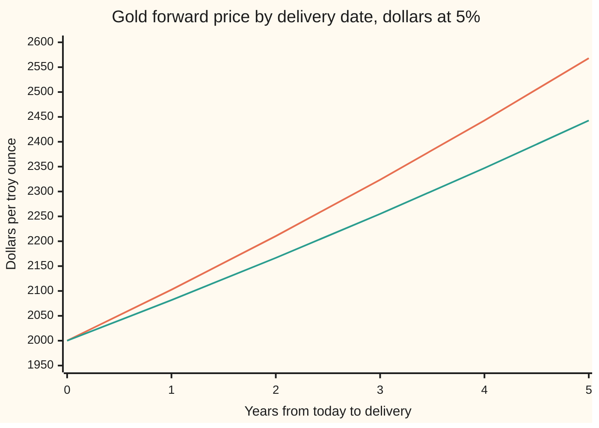
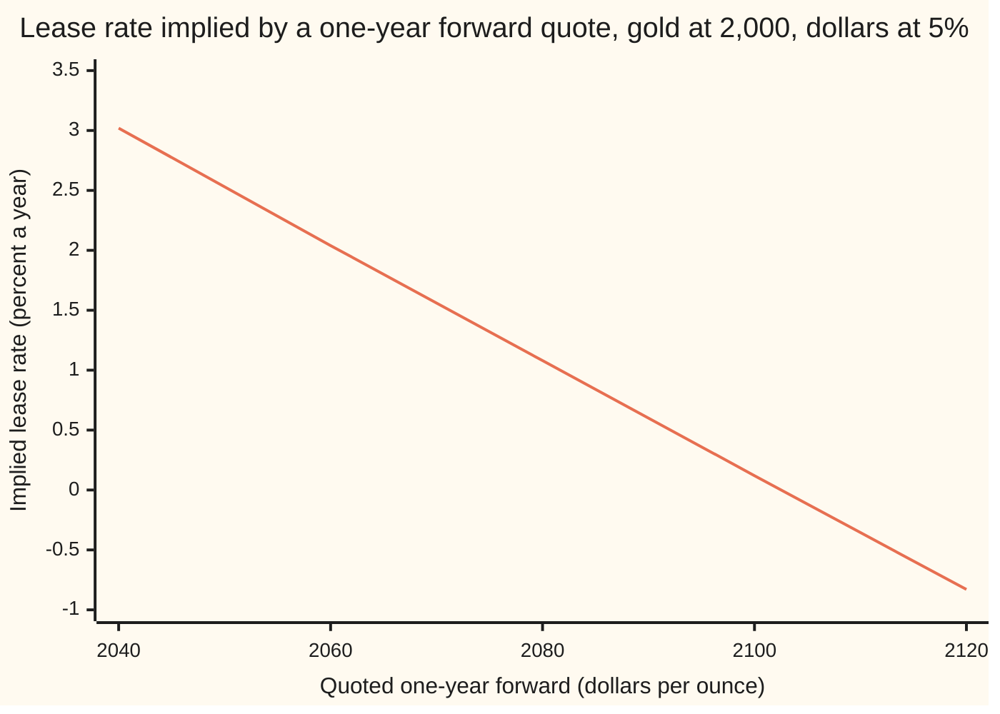

# Gold forward: spot grown at interest minus the lease rate, exact because gold can be borrowed like a currency

[Syllabus](../../../SYLLABUS.md) → [Financial mathematics](../../../SYLLABUS.md#w12) → [Commodity forwards - carry, storage, convenience yield and the curve](../../../SYLLABUS.md#w12-s25) → Gold forward

---

## General Overview

One troy ounce of gold, the unit gold is priced in, costs 2,000 dollars today. A dollar deposit pays 5 percent a year. A bullion bank, a bank that holds and deals in physical gold, will also take gold on deposit: hand it an ounce now and it hands back a little more than an ounce later. The extra is paid in gold, at the **lease rate**: 1 percent a year here.

A jeweller and a bank agree this morning that in one year the bank will deliver one ounce and the jeweller will pay a price written down now. No money moves until then. That agreement is a **gold forward**, and the price in it is the **forward price**. Exactly one forward price leaves nobody a free profit: 2,081.62 dollars.

That number is not a forecast of next year's gold price. It is forced by the two deposit rates. A bank asked to quote 2,100 sells the forward, borrows dollars, buys gold and lends the gold out. On delivery day it is 18.38 dollars ahead, whatever gold does. At 2,060 the trade runs backwards and the buyer of the forward keeps 21.62.

Every step of that trade exists because gold can be lent and borrowed at a known rate, paid in ounces. That makes gold a currency with its own interest rate. The international standard for currency codes lists it, as XAU, next to USD and EUR. The gold forward is then the currency forward of [Covered interest parity](../20-FX%20spot%2C%20forwards%20and%20interest%20parity/02-covered-interest-parity.md) with the lease rate in the place of the foreign interest rate.

**A gold forward is today's gold price grown at the dollar rate minus the lease rate, and it is an equality, not a bound, because gold can be borrowed and lent like money in both directions.**

**What kind of fact this is:** a theorem, proved on this card in Why it works, inside a stated model: one rate to borrow and lend dollars, one rate to borrow and lend gold, the same metal on every leg, no fees. When it holds says what each assumption buys.

### The picture: one spot price, a forward for every delivery date



The upper line is gold's forward if nobody paid to borrow it: spot grown at the full dollar rate. The lower line is the real forward, with a 1 percent lease rate. The gap between them is the lease income a holder of gold collects by lending it. Both lines start at spot, 2,000, and fan apart year by year. The lower line reaches 2,442.81 at five years; the upper line reached it a year earlier.

---

## The formula

Notation first, in words. The letter $l$ stands for the lease rate, the interest gold earns in gold. Rates are continuously compounded ([Forward price](../03-Contracts%20and%20No-Arbitrage/03-forward-price-by-cash-and-carry.md) uses the same convention): a deposit of 1 grows to $e^{rT}$ in $T$ years.

$$F = S\,e^{(r - l)\,T}$$

**Read it aloud: the forward price of gold is today's price, grown for the life of the contract at the dollar rate minus the lease rate.**

| Symbol | Plain meaning | In our example | Push it up and the forward… |
| --- | --- | --- | --- |
| $S$ | spot price: dollars for one troy ounce delivered now | 2,000.00 | rises in proportion |
| $F$ | forward price: dollars for one ounce, agreed now, delivered at $T$ | 2,081.62 | (the answer) |
| $r$ | dollar rate: what a dollar deposit pays per year, continuously compounded | 5% | rises: the gold's buyer is charged the interest on the dollars that bought it |
| $l$ | lease rate: what a gold deposit pays per year, in ounces, same basis | 1% | falls: gold held earns more, so it costs less for later delivery |
| $T$ | years until delivery | 1 | rises when $r$ exceeds $l$, as here |
| $e^{-lT}$ | ounces to lend today so that exactly one comes back at $T$ | 0.990050 | (built from $l$ and $T$) |
| $e^{-rT}$ | discount factor, D(T): today's value of one dollar due at $T$ | (for the proof) | |
| $e^{(r-l)T}$ | carry factor: how far the forward sits above spot, as a multiple | 1.040811 | (built from the three above) |
| $F_q$ | a forward price someone quotes, which may differ from $F$ | 2,100 or 2,060 | above $F$ the seller of the forward profits; below, the buyer |
| $S_T$ | the spot price that turns up on delivery day | unknown today | does not appear in $F$ at all |
| $H$ | a fixed dollar fee paid to a gold lender at $T$, in place of lease ounces (tip in Why it works only) | not used | lowers that contract's forward one for one |

Two helper formulas follow from taking logs of both sides.

$$\frac{1}{T}\ln\frac{F}{S} = r - l \qquad\qquad l = r - \frac{1}{T}\ln\frac{F}{S}$$

In words: the **forward premium**, the yearly rate at which the forward sits above spot, is exactly the gap between the two interest rates, 4 percent here. Read the other way, a quoted forward reveals the lease rate the market is charging. A quote of 2,100 implies a lease rate of 0.121 percent.

**Conventions verified 27 Sep 2026:** ISO 4217, the international list of currency codes, gives gold the code XAU, counted in troy ounces; spot gold is quoted in US dollars per troy ounce. Lease rates are quoted as a yearly percentage for a fixed term. Markets could change the quoting; the formula needs only that each rate travels with its own compounding.

### When it holds

- **Gold can be lent and borrowed at one lease rate, repaid in ounces.** Real banks lend gold dearer than they borrow it. The single $F$ then widens into a band, and a quote inside the band gives no free profit. A lease whose interest is a fixed dollar fee is a different contract, with a different formula (the tip in Why it works).
- **One dollar rate for borrowing and lending.** A trader who borrows dollars dearer than it lends them faces a second band, stacked on the first.
- **The ounce returned is the ounce delivered.** The loan must repay metal of the fineness, bar size and vault location the forward names. In March 2020, with flights grounded, New York gold futures traded tens of dollars above London spot for days, because a London bar could not become a New York delivery in time.
- **Holding gold costs nothing worth counting.** Vaulting and insurance are small next to 2,000 dollars an ounce, so this card ignores them. For a commodity where storage is heavy and the reverse trade is blocked, the equality breaks into a ceiling: [Storage and the carry ceiling](02-storage-cost-and-the-carry-ceiling.md).
- **Contracts are honoured.** A gold loan is a promise. If the borrower's credit is doubtful, the lease rate charged includes a premium for that risk, and the rate in the formula is not the rate the trader faces.

---

## Why it works

### Step 0: gold earns interest in gold, so an ounce next year costs less than an ounce today

Holding a share of stock earns dividends. Holding dollars earns interest. Holding gold in a vault earns nothing, but gold lent to a bank earns the lease rate, paid in more gold. So nobody needs a full ounce today to have one ounce in a year. Lend $e^{-lT}$ = 0.990050 ounces today and exactly one ounce comes back.

That gives two ways to own one ounce on delivery day, both fixed today.

- **Route A, through the forward.** Agree today to pay $F$ dollars at $T$. To be sure of the dollars, set aside $F e^{-rT}$ now in a dollar deposit; it grows to exactly $F$.
- **Route B, through spot and a gold loan.** Buy 0.990050 ounces today and lend them out. The cost today is $S e^{-lT}$ dollars.

Both deliver the same ounce on the same day with no risk, so they must cost the same:

$$F\,e^{-rT} = S\,e^{-lT} \quad\Longrightarrow\quad F = S\,e^{(r - l)T}.$$

At the house numbers both routes cost 1,980.10 dollars today. Two cards already hold this argument. In [Forward price](../03-Contracts%20and%20No-Arbitrage/03-forward-price-by-cash-and-carry.md) the asset pays an income yield, like a dividend; here that yield is the lease rate. In [Covered interest parity](../20-FX%20spot%2C%20forwards%20and%20interest%20parity/02-covered-interest-parity.md) the foreign currency earns its own deposit rate; here gold is the foreign currency and the lease rate is that deposit rate.

### Step 1: the seller's ledger, when the quote is too high

Say a dealer quotes $F_q$ = 2,100, above 2,081.62; dealers call such a quote rich. Sell the forward and cover it with borrowed dollars and lent gold. The trade is sized to deliver exactly one ounce.

| Step | Today | On delivery day |
| --- | --- | --- |
| Borrow 1,980.10 dollars at 5% | +1,980.10 dollars | −2,081.62 dollars |
| Buy 0.990050 oz at 2,000 | −1,980.10 dollars, +0.990050 oz | |
| Lend the gold at 1% | −0.990050 oz | +1.000000 oz |
| Sell 1 oz forward at 2,100 | nothing | −1 oz, +2,100.00 dollars |
| **Net** | **0** | **+18.38 dollars** |

Nothing is paid today. Every delivery-day amount was fixed this morning. The spot price on delivery day, $S_T$, appears nowhere in the table: the gold that comes back from the loan is the gold that goes into the forward. This direction is called **cash-and-carry**: buy the metal with borrowed cash and carry it to delivery, here earning the lease rate on the way.

### Step 2: the buyer's ledger, when the quote is too low

Now $F_q$ = 2,060, below 2,081.62; the quote is cheap. Run every leg the other way. This direction, **reverse cash-and-carry**, needs gold that can be borrowed, which is the whole reason gold gets an equality.

| Step | Today | On delivery day |
| --- | --- | --- |
| Borrow 0.990050 oz of gold at 1% | +0.990050 oz | −1.000000 oz |
| Sell it at 2,000 | −0.990050 oz, +1,980.10 dollars | |
| Deposit the dollars at 5% | −1,980.10 dollars | +2,081.62 dollars |
| Buy 1 oz forward at 2,060 | nothing | +1 oz, −2,060.00 dollars |
| **Net** | **0** | **+21.62 dollars** |

The forward delivers the ounce that repays the gold loan. The deposit pays for it with 21.62 dollars to spare. A quote that is too high is picked off by sellers; one too low, by buyers. Only one quote survives both.

### Step 3: close the gap in general

Write the seller's ledger for any quote $F_q$. On delivery day the forward pays $F_q$ for the ounce the gold loan returned, and the dollar loan costs $S e^{-lT} e^{rT}$. So

$$\text{seller's profit} = F_q - S\,e^{(r - l)T} = F_q - F, \qquad \text{buyer's profit} = F - F_q.$$

Because the trade is sized to one delivered ounce, the profit is the mispricing itself, with no extra factor. At 2,100 it is 18.38 and at 2,060 it is 21.62, the ledgers to the cent. The sign of $F_q - F$ picks the side that wins; only $F_q = F$ leaves neither side a sure profit.

<details>
<summary>Detailed proof: no quote other than F survives</summary>

Assume one continuously compounded rate $r$ to borrow and lend dollars, one rate $l$ to borrow and lend gold with interest repaid in ounces, no fees, the same deliverable metal on every leg, and contracts honoured. Let the market quote $F_q$ for one ounce at $T$.

Seller's strategy at time 0: borrow $S e^{-lT}$ dollars, buy $e^{-lT}$ ounces, lend them at $l$, and sell one ounce forward at $F_q$. Dollars at 0: $+S e^{-lT} - S e^{-lT} = 0$. Ounces at 0: $+e^{-lT} - e^{-lT} = 0$. At $T$ the gold loan returns $e^{-lT} e^{lT} = 1$ ounce, which goes into the forward for $F_q$ dollars, and the dollar loan costs $S e^{-lT} e^{rT} = F$. Net ounces at $T$: zero. Net dollars at $T$: $F_q - F$. No term depends on $S_T$.

Buyer's strategy: borrow $e^{-lT}$ ounces, sell them for $S e^{-lT}$ dollars, deposit the dollars at $r$, and buy one ounce forward at $F_q$. Every position at 0 nets to zero. At $T$ the deposit pays $F$, the forward takes $F_q$ and delivers one ounce, and that ounce repays the gold loan. Net dollars at $T$: $F - F_q$.

If $F_q > F$ the seller's strategy costs nothing and pays a positive amount for certain: an arbitrage, a sure profit from no outlay. If $F_q < F$ the buyer's does. In a market with no arbitrage, $F_q = F$. Both directions are needed. Without the gold loan in Step 2, only the upper half of the argument survives and $F$ becomes a ceiling, which is the situation on [Storage and the carry ceiling](02-storage-cost-and-the-carry-ceiling.md).

</details>

### Step 4: the forward premium is the rate gap, and a quote reveals the lease rate

Take logs of $F = S e^{(r-l)T}$ and divide by $T$. The forward premium, $\ln(F/S)/T$, is 4 percent: the dollar rate less the lease rate, nothing else. As a plain ratio the forward sits 4.0811 percent above spot, which is $e^{0.04} - 1$, not 4 percent.

Turn it around and the market's forward quote reveals the lease rate: $l = r - \ln(F_q/S)/T$. Before solving, three questions every inverse must answer.

- **Existence.** For $S$, $F_q$ and $T$ all positive, $e^{(r - l)T}$ runs from very large to very near zero as $l$ climbs, passing every positive ratio $F_q/S$ once. So every positive quote has a lease rate, though not always a positive one.
- **Uniqueness.** The curve only falls as $l$ rises, so it hits each ratio exactly once.
- **Boundary cases.** At $T = 0$ the forward is spot and says nothing about $l$: a quote equal to 2,000 fits every lease rate, and any other quote fits none. A quote of zero or below has no logarithm and no answer. A quote above full dollar carry, $S e^{rT}$ = 2,102.54, solves only with a negative lease rate, which free storage rules out (the chart below shows why); the tradable quotes run from just above 0 to 2,102.54.

A quote of 2,100 implies $l$ = 0.05 − ln(1.05) = 0.121 percent. A bisection search on the formula, which never takes a logarithm, finds the same number to twelve decimals.



The line falls as the quote rises: a dearer forward means gold earns less by being lent. It crosses zero at 2,102.54, the forward at full dollar carry. A quote above that, such as 2,120, implies a negative lease rate: lenders of gold paying borrowers to take it. With free storage that cannot last. Anyone could borrow gold, keep it in a drawer, hand it back, and pocket the fee. So 2,102.54 is a ceiling, and it is the first sign of the storage argument on [Storage and the carry ceiling](02-storage-cost-and-the-carry-ceiling.md): once holding the metal costs money, lenders will pay to be rid of that cost.

<details>
<summary>What if the lease interest is paid in dollars?</summary>

Some gold loans pay the lender a fixed dollar fee, $H$ at $T$, and return exactly one ounce. The same two routes then give $F = S e^{rT} - H$: buy an ounce with borrowed dollars, lend it, and the fee shaves the dollar debt. The two contracts give nearly the same forward when $H$ is close to the dollar value of the lease ounces, but not the same one, because ounces paid at $T$ are worth whatever gold is then worth, while $H$ is fixed. Read the lease contract before using the formula.

</details>

### The other door: an average, and a daily ledger

The code reaches the same 2,081.62 two more ways. First, as an average. Suppose gold's price drifts at $r - l$ a year and wobbles randomly around that path (the risk-neutral valuation of [Forward price](../03-Contracts%20and%20No-Arbitrage/03-forward-price-by-cash-and-carry.md)). Then the average of 200,000 simulated delivery-day prices lands on the forward, within its sampling error. Let gold drift at 8 percent instead, a forecast, and the average is 2,166.59: a different number, because the forward is not a forecast. Second, as a ledger rolled a day at a time, with the gold loan and the dollar loan each compounding once a day. That lands less than a cent below the continuous answer.

---

## Worked numbers, by hand

Gold $S$ = 2,000 dollars an ounce, $r$ = 5%, $l$ = 1%, one year.

| Step | Arithmetic | Value |
| --- | --- | --- |
| the rate gap | 0.05 − 0.01, times 1 year | 0.04 |
| carry factor | $e^{0.04}$ | 1.040811 |
| gold to lend today | $e^{-0.01}$ | 0.990050 oz |
| dollars to buy it | 2,000 × 0.990050 | 1,980.10 |
| dollar debt at delivery | 1,980.10 × $e^{0.05}$ | 2,081.62 |
| cross-check | 2,000 × 1.040811 | 2,081.62 |
| **one-year forward** | | **2,081.62** |
| seller's profit at 2,100 | 2,100.00 − 2,081.62 | 18.38 |
| buyer's profit at 2,060 | 2,081.62 − 2,060.00 | 21.62 |
| implied lease at 2,100 | 0.05 − ln(2,100 / 2,000) | 0.121% |
| **five-year forward** | 2,000 × $e^{0.04 \times 5}$ | **2,442.81** |

A jeweller who wants gold in a year and a mine that will produce it in a year can agree on 2,081.62 today without either of them having a view on gold.

### What breaks if you drop a piece

Same gold, correct forward 2,081.62. Every wrong answer below is printed by the checks.

| Mistake | Comes out at | What went wrong |
| --- | --- | --- |
| Forget the lease rate | 2,102.54 | Treats gold as a metal that earns nothing. A 2,100 quote then looks cheap by 2.54 when it is rich by 18.38: the trader buys the forward the wrong way round. |
| Add the lease rate | 2,123.67 | Treats the lease as a cost of holding gold. It is income to the holder who lends it. |
| Simple rate gap, $S(1 + (r-l)T)$ | 2,080.00 | Ignores compounding: interest earned on interest. The error grows with $T$. |
| Discount instead of grow | 1,921.58 | Shrinks spot by the carry instead of growing it: the forward moved the wrong way from spot. |
| Lend a whole ounce at 2,100 | −2.54 dollars and 0.010050 oz loose | The lease interest arrives in ounces. Lending a whole ounce leaves those ounces unsold, and their value depends on $S_T$: the lock is gone. |

---

## Code, from first principles, and it actually runs

The forward is reached four ways that share no formula. Road 1 is the closed form. Road 2 builds the seller's ledger for any quote and finds, by bisection, the quote at which it breaks even; bisection halves an interval that must contain the answer until it is pinned down. Road 3 rolls both loans forward one day at a time, with no exponentials. Road 4 averages 200,000 simulated delivery-day prices, drawn with a random number generator written in the script. The lease rate implied by a 2,100 quote is found twice too, by logarithm and by bisection. Every number on the card, including every point on the two charts, is printed below.

### Python

```python
# Gold forward and the lease rate -- the check behind the card.  Standard
# library only.  Every number on the card is printed here.  The forward is
# reached four ways that share no formula: the closed form, the break-even
# quote of the cash-and-carry ledger found by bisection, both loans rolled
# day by day, and an average over simulated gold prices drawn with a
# hand-written random number generator.
from math import exp, log, sqrt, cos, pi

S, r, l, T = 2000.0, 0.05, 0.01, 1.0             # spot USD/oz, dollar rate, lease rate, years

def forward(S, r, l, T):                           # road 1: the formula
    return S * exp((r - l) * T)

def rich(Fq):                                      # forward quoted too high: sell it, deliver 1 oz
    oz = exp(-l * T)                               # buy this much gold today and lend it out
    usd = oz * S                                   # borrow the dollars that pay for it
    back = oz * exp(l * T)                         # ounces the gold borrower returns at T
    debt = usd * exp(r * T)                        # dollars owed at T
    return oz, usd, back, debt, back * Fq - debt   # deliver the ounces for Fq, repay the loan

def cheap(Fq):                                     # forward quoted too low: buy it, owe 1 oz
    oz = exp(-l * T)                               # borrow this much gold and sell it
    usd = oz * S                                   # lend the dollars
    owed = oz * exp(l * T)                         # ounces owed to the gold lender at T
    deposit = usd * exp(r * T)                     # dollars back from the deposit at T
    return oz, usd, deposit, owed, deposit - owed * Fq

def bisect(f, lo, hi):                             # root of an increasing or decreasing f
    flo = f(lo)
    for _ in range(200):
        mid = 0.5 * (lo + hi)
        if (f(mid) > 0) == (flo > 0): lo, flo = mid, f(mid)
        else: hi = mid
    return 0.5 * (lo + hi)

def daily_roll(days=365):                          # road 3: both loans rolled once a day
    oz, debt = 1.0, S                              # 1 oz lent, S dollars borrowed to buy it
    for _ in range(int(days * T)):
        oz *= 1.0 + l / 365.0
        debt *= 1.0 + r / 365.0
    return debt / oz                               # dollars owed per ounce delivered

state = 20260927                                   # road 4: 64-bit linear congruential generator
def uniform():
    global state
    state = (state * 6364136223846793005 + 1442695040888963407) % 2**64
    return ((state >> 11) + 0.5) / 2**53

def mc_mean(drift, sigma=0.15, pairs=100000):      # average of simulated gold prices at T
    tot = tot2 = 0.0
    for _ in range(pairs):
        z = sqrt(-2.0 * log(uniform())) * cos(2.0 * pi * uniform())    # Box-Muller
        for zz in (z, -z):
            ST = S * exp((drift - 0.5 * sigma * sigma) * T + sigma * sqrt(T) * zz)
            tot += ST; tot2 += ST * ST
    m = tot / (2 * pairs)
    return m, sqrt((tot2 / (2 * pairs) - m * m) / (2 * pairs))

F = forward(S, r, l, T)
F_root = bisect(lambda q: rich(q)[4], 0.0, 10.0 * S)
F_day = daily_roll()
F_mc, se = mc_mean(r - l)
real_mc, _ = mc_mean(0.08)
implied = lambda q: r - log(q / S) / T             # the lease rate a quote implies
implied_root = bisect(lambda x: forward(S, r, x, T) - 2100.0, -1.0, 1.0)

def show(name, v, fmt="{:>16.6f}"):
    print(f"{name:<40}" + fmt.format(v))

print("gold 2000 USD/oz, dollars 5%, lease 1%, 1 year")
show("1 formula S e^((r-l)T)", F)
show("2 ledger break-even, bisection", F_root)
show("3 both loans rolled daily, 365 days", F_day)
show("4 Monte Carlo, vol 15%, 200000 draws", F_mc, "{:>16.2f}")
show("  standard error", se, "{:>16.2f}")
show("  mean if gold drifts at 8%", real_mc, "{:>16.2f}")
for name, v in zip(("gold bought and lent (oz)", "dollars borrowed", "gold returned at T (oz)",
                    "dollar debt at T", "profit at T"), rich(2100.0)):
    show("rich 2100: " + name, v)
for name, v in zip(("gold borrowed and sold (oz)", "dollars lent", "deposit at T",
                    "gold owed at T (oz)", "profit at T"), cheap(2060.0)):
    show("cheap 2060: " + name, v)
show("route A today: F e^(-rT)", F * exp(-r * T))
show("route B today: S e^(-lT)", S * exp(-l * T))
show("carry factor e^((r-l)T)", exp((r - l) * T))
show("premium ln(F/S)/T", log(F / S) / T)
show("  simple premium F/S - 1", F / S - 1.0)
show("implied lease at 2100, log inverse", implied(2100.0), "{:>16.12f}")
show("implied lease at 2100, bisection", implied_root, "{:>16.12f}")
show("full-carry ceiling S e^(rT)", forward(S, r, 0.0, T))
show("wrong: forgot the lease", forward(S, r, 0.0, T))
show("  2100 then looks cheap by", forward(S, r, 0.0, T) - 2100.0)
show("wrong: lease added", forward(S, r, -l, T))
show("wrong: simple gap S(1+(r-l)T)", S * (1.0 + (r - l) * T))
show("wrong: discounted, not grown", S * exp(-(r - l) * T))
show("wrong: lent 1 oz, cash at T", 2100.0 - S * exp(r * T))
show("  loose ounces left over", exp(l * T) - 1.0)
show("try: lease 5%", forward(S, r, 0.05, T))
show("try: lease 8%", forward(S, r, 0.08, T))
show("try: 5 years", forward(S, r, l, 5.0))
show("try: dollars 2%", forward(S, 0.02, l, T))
print("chart, years       " + "".join(f"{t:>9d}" for t in range(6)))
print("chart, lease 1%    " + "".join(f"{forward(S, r, l, t):>9.2f}" for t in range(6)))
print("chart, no lease    " + "".join(f"{forward(S, r, 0.0, t):>9.2f}" for t in range(6)))
quotes = (2040.0, 2060.0, 2080.0, 2100.0, 2120.0)
print("chart, quote       " + "".join(f"{q:>9.0f}" for q in quotes))
print("chart, implied %   " + "".join(f"{100 * implied(q):>9.2f}" for q in quotes))

assert abs(F - 2081.621548384777) < 1e-9,         "formula vs the value worked out by series"
assert abs(F_root - F) < 1e-8,                    "the ledger breaks even exactly at the formula"
assert abs(F_day - F) < 0.01,                     "daily compounding lands within a cent"
assert abs(F_mc - F) < 3.0 * se,                  "risk-neutral average of the gold price is the forward"
assert abs(real_mc - F) > 50.0,                   "a real-world forecast is a different number"
assert abs(implied(2100.0) - 0.001209835831) < 1e-12, "log inverse vs the value worked out by series"
assert abs(implied_root - implied(2100.0)) < 1e-12, "bisection inverse agrees with the log inverse"
assert abs(rich(2100.0)[4] - 18.378451615223) < 1e-9, "rich ledger locks in the quote minus the forward"
assert abs(cheap(2060.0)[4] - 21.621548384777) < 1e-9, "cheap ledger locks in the forward minus the quote"
print("ALL CHECKS PASS")
```

**Ran 2026-09-27 on macOS, Python 3.14.6, standard library only. All checks passed. Output, pasted from the run:**

```
gold 2000 USD/oz, dollars 5%, lease 1%, 1 year
1 formula S e^((r-l)T)                       2081.621548
2 ledger break-even, bisection               2081.621548
3 both loans rolled daily, 365 days          2081.614705
4 Monte Carlo, vol 15%, 200000 draws             2081.44
  standard error                                    0.70
  mean if gold drifts at 8%                      2166.59
rich 2100: gold bought and lent (oz)            0.990050
rich 2100: dollars borrowed                  1980.099667
rich 2100: gold returned at T (oz)              1.000000
rich 2100: dollar debt at T                  2081.621548
rich 2100: profit at T                         18.378452
cheap 2060: gold borrowed and sold (oz)         0.990050
cheap 2060: dollars lent                     1980.099667
cheap 2060: deposit at T                     2081.621548
cheap 2060: gold owed at T (oz)                 1.000000
cheap 2060: profit at T                        21.621548
route A today: F e^(-rT)                     1980.099667
route B today: S e^(-lT)                     1980.099667
carry factor e^((r-l)T)                         1.040811
premium ln(F/S)/T                               0.040000
  simple premium F/S - 1                        0.040811
implied lease at 2100, log inverse        0.001209835831
implied lease at 2100, bisection          0.001209835831
full-carry ceiling S e^(rT)                  2102.542193
wrong: forgot the lease                      2102.542193
  2100 then looks cheap by                      2.542193
wrong: lease added                           2123.673093
wrong: simple gap S(1+(r-l)T)                2080.000000
wrong: discounted, not grown                 1921.578878
wrong: lent 1 oz, cash at T                    -2.542193
  loose ounces left over                        0.010050
try: lease 5%                                2000.000000
try: lease 8%                                1940.891067
try: 5 years                                 2442.805516
try: dollars 2%                              2020.100334
chart, years               0        1        2        3        4        5
chart, lease 1%      2000.00  2081.62  2166.57  2254.99  2347.02  2442.81
chart, no lease      2000.00  2102.54  2210.34  2323.67  2442.81  2568.05
chart, quote            2040     2060     2080     2100     2120
chart, implied %        3.02     2.04     1.08     0.12    -0.83
ALL CHECKS PASS
```

Four roads, one forward. The ledger's break-even and the formula agree to six decimals. The daily roll sits less than a cent below, the price of compounding once a day instead of continuously. The simulated average is 2,081.44 with a standard error of 0.70, so the formula sits well inside the average's uncertainty. The 8 percent drift gives 2,166.59: the forward ignores forecasts.

### Rust

Same roads, same labels, same random number generator, built with `rustc --edition 2021 -O`.

```rust
// Gold forward and the lease rate -- the same check as the Python, in Rust.
// Standard library only, no crates.  The forward is reached four ways that
// share no formula: the closed form, the break-even quote of the
// cash-and-carry ledger found by bisection, both loans rolled day by day, and
// an average over simulated gold prices from a hand-written generator.
use std::f64::consts::PI;

const S: f64 = 2000.0; // spot, USD per troy ounce
const R: f64 = 0.05; // dollar rate, continuously compounded
const L: f64 = 0.01; // lease rate, continuously compounded
const T: f64 = 1.0; // years to delivery

fn forward(s: f64, r: f64, l: f64, t: f64) -> f64 { s * ((r - l) * t).exp() } // road 1

// forward quoted too high: sell it, buy gold and lend it, deliver 1 oz at T
fn rich(fq: f64) -> [f64; 5] {
    let oz = (-L * T).exp(); // gold bought today and lent out
    let usd = oz * S; // dollars borrowed to pay for it
    let back = oz * (L * T).exp(); // ounces returned at T
    let debt = usd * (R * T).exp(); // dollars owed at T
    [oz, usd, back, debt, back * fq - debt]
}

// forward quoted too low: buy it, borrow gold and sell it, owe 1 oz at T
fn cheap(fq: f64) -> [f64; 5] {
    let oz = (-L * T).exp(); // gold borrowed today and sold
    let usd = oz * S; // dollars lent out
    let deposit = usd * (R * T).exp(); // dollars back at T
    let owed = oz * (L * T).exp(); // ounces owed to the gold lender at T
    [oz, usd, deposit, owed, deposit - owed * fq]
}

fn bisect<F: Fn(f64) -> f64>(f: F, mut lo: f64, mut hi: f64) -> f64 {
    let mut flo = f(lo);
    for _ in 0..200 {
        let mid = 0.5 * (lo + hi);
        let fm = f(mid);
        if (fm > 0.0) == (flo > 0.0) { lo = mid; flo = fm; } else { hi = mid; }
    }
    0.5 * (lo + hi)
}

fn daily_roll(days: f64) -> f64 { // road 3: both loans rolled once a day
    let (mut oz, mut debt) = (1.0_f64, S);
    for _ in 0..((days * T) as usize) {
        oz *= 1.0 + L / 365.0;
        debt *= 1.0 + R / 365.0;
    }
    debt / oz
}

struct Lcg(u64); // road 4: 64-bit linear congruential generator
impl Lcg {
    fn uniform(&mut self) -> f64 {
        self.0 = self.0.wrapping_mul(6364136223846793005).wrapping_add(1442695040888963407);
        ((self.0 >> 11) as f64 + 0.5) / 9007199254740992.0
    }
}

fn mc_mean(rng: &mut Lcg, drift: f64, sigma: f64, pairs: usize) -> (f64, f64) {
    let (mut tot, mut tot2) = (0.0_f64, 0.0_f64);
    for _ in 0..pairs {
        let u1 = rng.uniform();
        let u2 = rng.uniform();
        let z = (-2.0 * u1.ln()).sqrt() * (2.0 * PI * u2).cos(); // Box-Muller
        for zz in [z, -z] {
            let st = S * ((drift - 0.5 * sigma * sigma) * T + sigma * T.sqrt() * zz).exp();
            tot += st;
            tot2 += st * st;
        }
    }
    let n = (2 * pairs) as f64;
    let m = tot / n;
    (m, ((tot2 / n - m * m) / n).sqrt())
}

fn implied(q: f64) -> f64 { R - (q / S).ln() / T } // the lease rate a quote implies

fn show(name: &str, v: f64) { println!("{:<40}{:>16.6}", name, v); }
fn show2(name: &str, v: f64) { println!("{:<40}{:>16.2}", name, v); }
fn show12(name: &str, v: f64) { println!("{:<40}{:>16.12}", name, v); }

fn main() {
    let f = forward(S, R, L, T);
    let f_root = bisect(|q| rich(q)[4], 0.0, 10.0 * S);
    let f_day = daily_roll(365.0);
    let mut rng = Lcg(20260927);
    let (f_mc, se) = mc_mean(&mut rng, R - L, 0.15, 100000);
    let (real_mc, _) = mc_mean(&mut rng, 0.08, 0.15, 100000);
    let implied_root = bisect(|x| forward(S, R, x, T) - 2100.0, -1.0, 1.0);

    println!("gold 2000 USD/oz, dollars 5%, lease 1%, 1 year");
    show("1 formula S e^((r-l)T)", f);
    show("2 ledger break-even, bisection", f_root);
    show("3 both loans rolled daily, 365 days", f_day);
    show2("4 Monte Carlo, vol 15%, 200000 draws", f_mc);
    show2("  standard error", se);
    show2("  mean if gold drifts at 8%", real_mc);
    let rn = ["gold bought and lent (oz)", "dollars borrowed", "gold returned at T (oz)", "dollar debt at T", "profit at T"];
    for (n, v) in rn.iter().zip(rich(2100.0)) { show(&format!("rich 2100: {}", n), v); }
    let cn = ["gold borrowed and sold (oz)", "dollars lent", "deposit at T", "gold owed at T (oz)", "profit at T"];
    for (n, v) in cn.iter().zip(cheap(2060.0)) { show(&format!("cheap 2060: {}", n), v); }
    show("route A today: F e^(-rT)", f * (-R * T).exp());
    show("route B today: S e^(-lT)", S * (-L * T).exp());
    show("carry factor e^((r-l)T)", ((R - L) * T).exp());
    show("premium ln(F/S)/T", (f / S).ln() / T);
    show("  simple premium F/S - 1", f / S - 1.0);
    show12("implied lease at 2100, log inverse", implied(2100.0));
    show12("implied lease at 2100, bisection", implied_root);
    show("full-carry ceiling S e^(rT)", forward(S, R, 0.0, T));
    show("wrong: forgot the lease", forward(S, R, 0.0, T));
    show("  2100 then looks cheap by", forward(S, R, 0.0, T) - 2100.0);
    show("wrong: lease added", forward(S, R, -L, T));
    show("wrong: simple gap S(1+(r-l)T)", S * (1.0 + (R - L) * T));
    show("wrong: discounted, not grown", S * (-(R - L) * T).exp());
    show("wrong: lent 1 oz, cash at T", 2100.0 - S * (R * T).exp());
    show("  loose ounces left over", (L * T).exp() - 1.0);
    show("try: lease 5%", forward(S, R, 0.05, T));
    show("try: lease 8%", forward(S, R, 0.08, T));
    show("try: 5 years", forward(S, R, L, 5.0));
    show("try: dollars 2%", forward(S, 0.02, L, T));
    let row = |label: &str, cells: Vec<String>| println!("{:<19}{}", label, cells.concat());
    row("chart, years", (0..6).map(|t| format!("{:>9}", t)).collect());
    row("chart, lease 1%", (0..6).map(|t| format!("{:>9.2}", forward(S, R, L, t as f64))).collect());
    row("chart, no lease", (0..6).map(|t| format!("{:>9.2}", forward(S, R, 0.0, t as f64))).collect());
    let quotes = [2040.0_f64, 2060.0, 2080.0, 2100.0, 2120.0];
    row("chart, quote", quotes.iter().map(|q| format!("{:>9.0}", q)).collect());
    row("chart, implied %", quotes.iter().map(|q| format!("{:>9.2}", 100.0 * implied(*q))).collect());

    assert!((f - 2081.621548384777).abs() < 1e-9, "formula vs the value worked out by series");
    assert!((f_root - f).abs() < 1e-8, "the ledger breaks even exactly at the formula");
    assert!((f_day - f).abs() < 0.01, "daily compounding lands within a cent");
    assert!((f_mc - f).abs() < 3.0 * se, "risk-neutral average of the gold price is the forward");
    assert!((real_mc - f).abs() > 50.0, "a real-world forecast is a different number");
    assert!((implied(2100.0) - 0.001209835831).abs() < 1e-12, "log inverse vs the value worked out by series");
    assert!((implied_root - implied(2100.0)).abs() < 1e-12, "bisection inverse agrees with the log inverse");
    assert!((rich(2100.0)[4] - 18.378451615223).abs() < 1e-9, "rich ledger locks in the quote minus the forward");
    assert!((cheap(2060.0)[4] - 21.621548384777).abs() < 1e-9, "cheap ledger locks in the forward minus the quote");
    println!("ALL CHECKS PASS");
}
```

**Ran 2026-09-27 on macOS, rustc 1.98.1, no crates. All checks passed. Output, pasted from the run:**

```
gold 2000 USD/oz, dollars 5%, lease 1%, 1 year
1 formula S e^((r-l)T)                       2081.621548
2 ledger break-even, bisection               2081.621548
3 both loans rolled daily, 365 days          2081.614705
4 Monte Carlo, vol 15%, 200000 draws             2081.44
  standard error                                    0.70
  mean if gold drifts at 8%                      2166.59
rich 2100: gold bought and lent (oz)            0.990050
rich 2100: dollars borrowed                  1980.099667
rich 2100: gold returned at T (oz)              1.000000
rich 2100: dollar debt at T                  2081.621548
rich 2100: profit at T                         18.378452
cheap 2060: gold borrowed and sold (oz)         0.990050
cheap 2060: dollars lent                     1980.099667
cheap 2060: deposit at T                     2081.621548
cheap 2060: gold owed at T (oz)                 1.000000
cheap 2060: profit at T                        21.621548
route A today: F e^(-rT)                     1980.099667
route B today: S e^(-lT)                     1980.099667
carry factor e^((r-l)T)                         1.040811
premium ln(F/S)/T                               0.040000
  simple premium F/S - 1                        0.040811
implied lease at 2100, log inverse        0.001209835831
implied lease at 2100, bisection          0.001209835831
full-carry ceiling S e^(rT)                  2102.542193
wrong: forgot the lease                      2102.542193
  2100 then looks cheap by                      2.542193
wrong: lease added                           2123.673093
wrong: simple gap S(1+(r-l)T)                2080.000000
wrong: discounted, not grown                 1921.578878
wrong: lent 1 oz, cash at T                    -2.542193
  loose ounces left over                        0.010050
try: lease 5%                                2000.000000
try: lease 8%                                1940.891067
try: 5 years                                 2442.805516
try: dollars 2%                              2020.100334
chart, years               0        1        2        3        4        5
chart, lease 1%      2000.00  2081.62  2166.57  2254.99  2347.02  2442.81
chart, no lease      2000.00  2102.54  2210.34  2323.67  2442.81  2568.05
chart, quote            2040     2060     2080     2100     2120
chart, implied %        3.02     2.04     1.08     0.12    -0.83
ALL CHECKS PASS
```

The two outputs match line for line, including the simulated average: both languages run the same generator from the same seed.

> [!TIP]
> **Try changing**
> Guess the direction first, then run it.
> - **Lease rate equal to the dollar rate.** Set `l = 0.05` (`L` in the Rust). The forward is **2,000.00**: spot itself. Gold then pays exactly what dollars pay, so neither side is charged for waiting.
> - **Lease rate above the dollar rate.** Set `l = 0.08`. The forward drops to **1,940.89**, below spot. A curve that falls with delivery date is called backwardation; for gold it happens when lenders of the metal are scarce.
> - **Five years.** Set `T = 5.0`. The forward is **2,442.81**, exactly the no-lease forward at four years: a 4 percent gap for five years and a 5 percent gap for four compound to the same factor.
> - **Cheaper dollars.** Set `r = 0.02`. The forward is **2,020.10**. The premium over spot shrinks to the new 1 percent gap; the lease rate did not move.

---

## The usual mistake

> [!warning]
> **Pricing gold as if it earned nothing.** Gold in a vault earns nothing, so it is tempting to set the forward at spot grown at the dollar rate, 2,102.54. But anyone who owns gold can lend it at the lease rate, and anyone who needs it can borrow it. The forward must pay the buyer back for that forgone lease income. Leave it out and a 2,100 quote looks cheap by 2.54 when it is rich by 18.38.
>
> - **Adding the lease rate.** The lease is income to the holder of gold, not a storage cost. Adding it gives 2,123.67.
> - **Lending a whole ounce to deliver a whole ounce.** The lease pays in ounces, so the trade needs 0.990050 ounces, not 1. Lending 1 leaves 0.010050 ounces unhedged.
> - **Treating an implied lease rate as a tradable one.** A 2,100 quote implies 0.121 percent. That is the rate that makes the quote fair, not a promise that any bank will lend gold at it.
> - **Mixing compounding.** A lease quoted as simple interest over a day count is not the $l$ in $e^{-lT}$. Convert it first, as [Covered interest parity](../20-FX%20spot%2C%20forwards%20and%20interest%20parity/02-covered-interest-parity.md) does for deposit rates.

---

## Where you meet it in real life

- **Gold mines hedging.** A mine that sells its next year's output forward locks in a price. The bank that buys that forward is on the buyer's side of Step 2: it borrows gold, often from a central bank, sells it at spot, and deposits the dollars. Its ledger closes when the mine delivers.
- **Central banks' reserves.** Gold held in reserve earns nothing in a vault. Lent to bullion banks, it earns the lease rate. Those loans are the supply of borrowable gold that makes Step 2 possible.
- **Gold on the currency desk.** Because gold behaves like a currency, banks trade it the way they trade currencies: spot, forwards, and swaps that buy gold now and sell it forward. The forward points on such a swap are $F - S$, read exactly as in [Forward points and the FX swap](../20-FX%20spot%2C%20forwards%20and%20interest%20parity/03-forward-points-and-fx-swaps.md).
- **Gold futures.** Exchange-traded futures settle gains and losses every day. With a fixed dollar rate their price equals the forward, and the gap otherwise is the subject of [Futures](../03-Contracts%20and%20No-Arbitrage/05-futures-margining-and-the-forward-futures-difference.md).
- **The rest of the shelf.** Wheat and crude oil cannot be lent the way gold can. Their forwards are bounds, not equalities: [Storage and the carry ceiling](02-storage-cost-and-the-carry-ceiling.md) and [Convenience yield](03-convenience-yield-implied-by-the-forward.md).

> **Say it back**
> Gold can be lent at a lease rate paid in more gold, so it is a currency with its own interest rate. An ounce next year then costs less than an ounce today: lend 0.990050 ounces and one comes back. Buying that gold with borrowed dollars fixes the cost of delivering an ounce at spot grown at the dollar rate minus the lease rate, 2,081.62 here. Any other quote is sold or bought against that ledger for a sure profit, and it takes both directions, gold lent and gold borrowed, to make the price exact. The forward premium over spot is the rate gap, so a quoted forward reveals the lease rate.

---

## What this builds on

- [Covered interest parity](../20-FX%20spot%2C%20forwards%20and%20interest%20parity/02-covered-interest-parity.md): the forward of one currency against another, from the two deposit rates. Gold is the foreign currency and the lease rate its deposit rate.
- [Forward price](../03-Contracts%20and%20No-Arbitrage/03-forward-price-by-cash-and-carry.md): the forward of any asset with an income yield, and the two ledgers that pin it. The lease rate is gold's income yield.

## Where this goes next

- [Storage and the carry ceiling](02-storage-cost-and-the-carry-ceiling.md): wheat costs money to store and cannot be borrowed like gold. The seller's ledger survives and gives a ceiling; the buyer's ledger does not.

The gold price was exact only because gold can be borrowed; storage-cost-and-the-carry-ceiling asks what is left of the formula when the reverse trade is blocked.

---

## Sources

Verified 27 Sep 2026: every link below resolves to the publisher's page.

- Hull, John C. *Options, Futures, and Other Derivatives*, 11th ed. Pearson. [Publisher page](https://www.pearson.com/en-us/subject-catalog/p/options-futures-and-other-derivatives/P200000005938). Chapter 5: forwards on assets with a known yield, and on gold and other investment commodities.
- McDonald, Robert L. *Derivatives Markets*, 3rd ed. Pearson. [Publisher page](https://www.pearson.com/en-us/subject-catalog/p/derivatives-markets/P200000005976/9780137612864). The chapter on commodity forwards and futures: the lease rate defined from the forward, and gold's carry in both directions.
- Fama, Eugene F., and Kenneth R. French. "Commodity Futures Prices: Some Evidence on Forecast Power, Premiums, and the Theory of Storage." *Journal of Business* 60, no. 1 (1987): 55–73. [doi:10.1086/296385](https://doi.org/10.1086/296385). Tests the theory of storage, the carry relation with storage costs and convenience yield, across a wide set of commodities, precious metals included.
