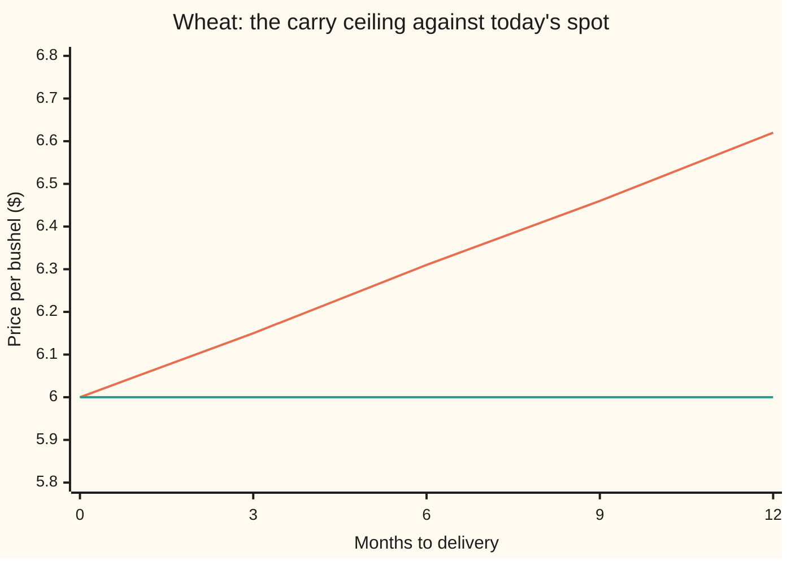

# Storage and the carry ceiling: for grain and oil the forward can sit below spot plus carry, never above it

[Syllabus](../../../SYLLABUS.md) → [Financial mathematics](../../../SYLLABUS.md#w12) → [Commodity forwards - carry, storage, convenience yield and the curve](../../../SYLLABUS.md#w12-s25) → Storage and the carry ceiling

---

## General Overview

Wheat sells today for **$6.00 a bushel**. A grain warehouse will hold a bushel for a year for **$0.30**, paid up front. Money borrowed for a year costs **5%** a year.

A miller wants wheat delivered in a year and asks a trader for a price. The deal struck today, for delivery later at a price fixed now, is a **forward**; the price written into it is the **forward price**. Nothing changes hands until delivery day.

The trader can make the promise safe. Borrow $6.30. Buy a bushel for $6.00. Pay the warehouse $0.30. Wait a year. Hand the bushel to the miller and use the payment to repay the loan, which by then has grown to about **$6.62**. That trade, buying now and storing for later delivery, is called **cash-and-carry**, and $6.62 is what it costs.

So a forward above $6.62 is free money: anyone with a warehouse and a bank account sells it, buys grain, stores it, and pockets the gap. At **$6.80** the gap is **$0.18 a bushel**, locked in today, whatever wheat does.

The surprise is the other side. A forward at **$6.00**, well under the cost of carrying grain, is not free money. Exploiting it would mean selling wheat that one does not own, and nobody lends out wheat for a year. The people holding grain keep it because they need it. So storage sets a ceiling on the forward and no floor.

**A forward on a stored commodity can never sit above spot plus the financed cost of storage, because cash-and-carry would pick it off; it can sit anywhere below, because the reverse trade needs a short sale of grain that holders will not make.**

**What kind of fact this is:** a theorem, proved on this card in Why it works; the missing floor is a fact about who holds grain, not a theorem.

### The picture: the ceiling by delivery month

The line is the carry ceiling for delivery 0, 3, 6, 9 and 12 months out, with storage charged at $0.30 for a full year and pro rata for less. Spot is flat at $6.00. Any forward on or below the upper line is allowed. Any point above it is picked off.



Orange, climbing: the ceiling, spot plus storage plus interest. Green, flat: spot. A forward can sit on the orange line, between the lines, or even under the green one. It cannot sit above the orange line for long.

---

## The formula

With storage paid as a bill today:

$$F \;\le\; (S + U)\,e^{rT}$$

**Read it aloud:** the forward price can be at most what it costs to buy the grain and pay the warehouse today, both financed until delivery.

With storage charged as a rate, a fixed fraction of the grain's value per year:

$$F \;\le\; S\,e^{(r+u)T}$$

**Read it aloud:** the grain's price grows at the interest rate plus the storage rate, and the forward can be at most that.

Here $e^{rT}$ is the continuous-compounding growth factor: what one dollar borrowed today is owed at time $T$ when interest is added in ever smaller slices ([Compound interest](../../01-Foundations/04-Compound%20Growth%20and%20Discounting/03-compound-interest.md)). The two forms agree when the rate matches the bill: $u = \ln\big((S+U)/S\big)$, which makes $S e^{uT} = S + U$ at $T = 1$.

| Symbol | Plain meaning | In our example | Push it up and the ceiling… |
| --- | --- | --- | --- |
| $F$ | the forward price: agreed today, paid on delivery | tested at $6.80 and $6.00 | (it is the thing being bounded) |
| $S$ | the spot price: wheat bought today | $6.00 a bushel | rises one for one, grown by $e^{rT}$ |
| $U$ | the storage bill for the whole period, paid today | $0.30 a bushel | rises, grown by $e^{rT}$ |
| $u$ | storage as a continuous rate, a fraction of value per year | 4.879% (matches the $0.30 bill) | rises |
| $r$ | the interest rate, continuously compounded | 5% | rises: the loan costs more |
| $T$ | time to delivery, in years | 1 | rises: more interest and more storage |
| $e^{rT}$ | growth factor on borrowed money | 1.051271 | — |
| $S_T$ | the spot price on delivery day, unknown today | anything | no effect: it cancels |
| $U_i$, $t_i$ | storage bills paid in instalments, and the times they fall due (Detailed proof) | one bill, $0.30 at time 0 | a later bill is financed for less time |
| $n$ | how many short spells a year is cut into, when storage or interest is run step by step | 200,000 in the code | the step-by-step answer closes on the formula |

### When it holds

- **Borrowing at $r$.** The trader must fund the $6.30 at the rate used. A trader who pays more faces a higher ceiling of their own; the market's ceiling is set by the cheapest funder with a warehouse.
- **Space at the quoted storage bill.** If the tanks or bins are full, cash-and-carry cannot be done and the ceiling stops binding. In April 2020 tanks at Cushing, Oklahoma, the US crude delivery point, ran short: the May crude contract fell below zero while June stayed far above it, a gap wider than any carry.
- **The same grain, in the same place.** The forward names a grade and a delivery point. Grain of another grade, or grain elsewhere, carries extra costs of cleaning or transport that enter $U$.
- **Both sides pay.** A forward is a promise; if the buyer might default, the locked gap is not locked.
- **The bill is known today.** If storage fees can change during the year, the ceiling uses the worst case the trader cannot contract away.

---

## Why it works

### Step 0: a trade that delivers the goods using only today's prices

A forward promises grain later. Grain later can be manufactured from grain now plus a warehouse plus a loan. No-arbitrage, the rule that two ways of getting the same thing must cost the same or someone profits from the gap ([No arbitrage](../03-Contracts%20and%20No-Arbitrage/02-no-arbitrage-and-the-law-of-one-price.md)), then caps what the promise can sell for. The whole card is whether the cap works in both directions. It does not.

### Step 1: cash-and-carry sets the ceiling

A trader who sees a forward at $F$ does four things today:

1. Sells the forward: promises one bushel on delivery day for $F$.
2. Borrows $S + U = 6.30$.
3. Buys one bushel for $S = 6.00$.
4. Pays the warehouse $U = 0.30$.

Net cash today: zero. On delivery day the trader hands over the bushel, receives $F$, and repays $(S + U)e^{rT}$. The profit is

$$F - (S + U)\,e^{rT},$$

and every piece of it is known today. Wheat's price on delivery day, $S_T$, never enters. At $F = 6.80$ the profit is $6.80 - 6.623008 = 0.176992$ a bushel. Every trader with access to credit and a warehouse wants this trade. Their selling pushes the forward down until the profit is gone. So the forward settles at or under the ceiling.

If the forward is settled in cash rather than grain, the trader sells the stored bushel for $S_T$ and pays the forward's buyer $S_T - F$. The two $S_T$ terms cancel and the profit is the same. The simulation in the code checks exactly that across 20,000 random delivery-day prices.

### Step 2: the reverse trade needs grain nobody lends

Now take a forward below the ceiling, at $F = 6.00$. The mirror trade would be:

1. Buy the forward: agree to receive a bushel for $6.00.
2. Borrow a bushel and sell it today for $6.00.
3. Put the $6.00 in the bank.

On delivery day the bank pays $6.307627$, the forward delivers a bushel for $6.00$, and that bushel repays the grain loan. The gain is $0.307627$, before any fee for the loan of grain.

Step 2 is the catch. Selling a bushel one does not own is a **short sale**: borrowing the thing, selling it, and returning it later. Shares can be borrowed for a small fee. Gold can be borrowed at a quoted lease rate, which is why the gold forward sits on its line rather than under it ([Gold forward](01-gold-forward-and-the-lease-rate.md)). Wheat has no such market. A mill holding wheat will not lend it for a year, because it needs the grain to keep the mill running. An outsider who buys the $6.00 forward without grain is just betting on the price: the simulation shows the result ranging from a loss of $3.48 to a gain of $9.84.

### Step 3: holders could do it, and choose not to

The only people who can run the reverse trade are those already holding grain. A holder who sells today also skips the $0.30 warehouse bill, so banks $6.30. Buying the forward, that holder ends the year with the same bushel plus $6.623008 - 6.00 = 0.623008$. Holders who do not do this are telling the market that having grain in the bin this year is worth at least $0.62 to them: it keeps a mill running, meets an order, avoids a shutdown. That benefit of holding the physical good has a name and its own card ([Convenience yield](03-convenience-yield-implied-by-the-forward.md)). It is not a payment anyone receives; it is how much a holder values not selling. So nothing forces the forward up to the ceiling.

### Step 4: storage as a rate gives the same ceiling

Some warehouses charge in kind: they keep a small sliver of the grain each day instead of a bill. Call the yearly rate $u$. To end the year holding one full bushel, a trader must start with $e^{uT}$ bushels, since a sliver $u\,\Delta t$ taken over many short spells $\Delta t$ shrinks the pile by the factor $e^{-uT}$. Buying $e^{uT}$ bushels at $S$ and financing them gives the ceiling $S\,e^{(r+u)T}$.

Matching the two forms: a $0.30 bill on $6.00 grain is the same as $u = \ln(6.30/6.00) = 4.879\%$. The code runs the in-kind warehouse slice by slice, 200,000 slices, and lands on $6.623008$, the same as the bill.

<details>
<summary>Detailed proof</summary>

**Claim.** Suppose money can be borrowed and lent at the continuously compounded rate $r$, a warehouse stores the commodity until $T$ for bills $U_1, \dots, U_k$ paid at known times $t_1, \dots, t_k$ between 0 and $T$, and the forward contract is honoured. If no riskless profit is available, then
$$F \le S\,e^{rT} + \sum_i U_i\,e^{r(T - t_i)}.$$
With one bill paid today this is $(S + U)e^{rT}$.

**Proof.** Suppose instead $F$ exceeds the right side. At time 0, sell one forward, borrow $S$ and buy a unit. At each $t_i$ borrow $U_i$ and pay the warehouse. At $T$ deliver the unit, receive $F$, and repay every loan: the first costs $S e^{rT}$, the one taken at $t_i$ costs $U_i e^{r(T - t_i)}$. Net cash at every date before $T$ is zero; at $T$ it is $F$ minus the right side, which is positive by assumption. A position that costs nothing and pays a positive amount for sure is a riskless profit, a contradiction.

**Why no lower bound follows.** The reverse argument must deliver, at time 0, a unit of the commodity the trader does not own. That requires borrowing the commodity and returning it at $T$. If such a loan exists at a known cost, the same algebra gives a matching floor, and for gold it does. If no lender exists, the argument cannot start. The only floor left is the lowest possible delivery-day price, since a long forward below it pays $S_T - F > 0$ for sure. When $S_T$ can fall close to zero, as in the simulation, any $F > 0$ up to the ceiling is consistent with no-arbitrage.

**Storage as a rate.** If the warehouse keeps the fraction $u\,\Delta t$ in each spell of length $\Delta t$, $n$ spells leave $(1 - uT/n)^n$ of the pile, which tends to $e^{-uT}$ as $n$ grows. Starting with $e^{uT}$ units leaves one; financing them costs $S e^{uT} e^{rT}$.

</details>

A second route reaches the same ceiling from the gold card: its lease argument, with the lease income set to zero and the storage bill added to the cost of holding, gives $(S + U)e^{rT}$ as the upper half. Gold keeps the lower half because a lender exists; wheat loses it because none does ([Gold forward](01-gold-forward-and-the-lease-rate.md)).

---

## Worked numbers, by hand

Wheat: $S = 6.00$, $U = 0.30$, $r = 5\%$, $T = 1$.

| Step | Arithmetic | Value |
| --- | --- | --- |
| cash needed today | $6.00 + 0.30$ | $6.30 |
| growth factor $e^{rT}$ | $e^{0.05}$ | 1.051271 |
| interest on the grain and the bill | $6.30 \times (1.051271 - 1)$ | $0.323008 |
| the bill alone, grown | $0.30 \times 1.051271$ | $0.315381 |
| **ceiling** | $6.30 \times 1.051271$ | **$6.623008** |
| carry profit at $6.80 | $6.80 - 6.623008$ | $0.176992 |
| gain at $6.00 with grain lent free | $6.307627 - 6.00$ | $0.307627 |
| gain at $6.00 for a holder, bill skipped | $6.623008 - 6.00$ | $0.623008 |

A miller quoted $6.80 for next year's wheat is being overcharged by about 18 cents a bushel, and a trader with a warehouse can collect those 18 cents today. A miller quoted $6.00 is not being undercharged by anything anyone can collect.

Where the $6.62 comes from, in dollars per bushel:

```
piece of the ceiling        dollars per bushel
spot grain           ██████████████████████████████  $6.00
storage bill         ██                              $0.30
interest on both     ██                              $0.32
ceiling, total       █████████████████████████████████  $6.62
```

### What breaks if you drop a piece

Correct ceiling: $6.623008.

| Mistake | Comes out at | What went wrong |
| --- | --- | --- |
| Leave storage out | $6.307627 | Forwards between $6.31 and $6.62 look rich; trading them loses money once the warehouse is paid. |
| Add the bill without financing it | $6.607627 | The $0.30 is paid today and borrowed for a year. Correct only if the bill is due at delivery. |
| Read $0.30 on $6.00 as $u = 5\%$ | $6.631026 | A 5% in-kind rate needs $e^{0.05} = 1.0513$ bushels bought per bushel delivered, 5.13% extra; the matching rate is 4.879%. |
| Simple interest instead of continuous | $6.615000 | $6.30 \times 1.05$. The error hides at two decimals and grows with $T$ and $r$. |

---

## Code, from first principles, and it actually runs

The scripts reach the ceiling by **three independent roads** and then test the trade on a fourth. Road 1 is the formula. Road 2 runs the cash-and-carry loan through 200,000 short spells of simple interest, with no exponential function. Road 3 charges storage in kind, a sliver of grain per spell, and finances the extra grain. Road 4 repays the loan from a home-made Taylor series for $e^x$ and draws 20,000 delivery-day wheat prices from a home-made random number generator (a linear congruential generator, turned into bell-curve draws by the Box–Muller formula) with 25% volatility, and records the cash-and-carry profit at $6.80 and a grain-less buyer's result at $6.00. The asserts check that each road lands on the ceiling, that the carry profit is the same on the worst and best path, and that the $6.00 forward can lose.

### Python

```python
# Storage and the carry ceiling -- the check behind the card.  Standard library only.
# Wheat at 6.00 a bushel, a 0.30 warehouse bill paid today, 5% a year, one year.
# Road 1 is the formula.  Road 2 grows the cash-and-carry loan in 200,000 slices of
# simple interest.  Road 3 pays storage in kind, a sliver of grain per slice.  Road 4
# simulates delivery-day wheat prices and repays the loan from a home-made e^x series.
from math import exp, log, sqrt, cos, pi

def exp_series(x):                          # e^x from its Taylor series, no library
    term, total, k = 1.0, 1.0, 0
    while abs(term) > 1e-18:
        k += 1; term *= x / k; total += term
    return total

def ceiling(S, U, r, T):                    # road 1: (S + U) e^{rT}
    return (S + U) * exp(r * T)

def loan_by_slices(amount, r, T, n):        # road 2: the loan balance, compounded n times
    bal, dt = amount, T / n
    for _ in range(n): bal *= 1.0 + r * dt
    return bal

def forward_in_kind(S, u, r, T, n):         # road 3: warehouse keeps u*dt of the grain each slice
    left, dt = 1.0, T / n
    for _ in range(n): left *= 1.0 - u * dt
    bushels = 1.0 / left                    # buy this many today so one is left at delivery
    return loan_by_slices(bushels * S, r, T, n)

state = [20260927]
def uniform():                              # 64-bit linear congruential generator
    state[0] = (6364136223846793005 * state[0] + 1442695040888963407) % 2**64
    return ((state[0] >> 11) + 0.5) / 2**53
def normal():                               # Box-Muller
    return sqrt(-2.0 * log(uniform())) * cos(2.0 * pi * uniform())

S, U, r, T, n = 6.00, 0.30, 0.05, 1.0, 200000
F_hi, F_lo, sigma, paths = 6.80, 6.00, 0.25, 20000
C1 = ceiling(S, U, r, T)
C2 = loan_by_slices(S + U, r, T, n)
u = log((S + U) / S)                        # the storage rate that matches a 0.30 bill
C3_formula = S * exp((r + u) * T)
C3_kind = forward_in_kind(S, u, r, T, n)
loan = (S + U) * exp_series(r * T)          # what the carry trade owes at delivery

pnl_hi, pnl_lo = [], []
for _ in range(paths):
    ST = S * exp(-0.5 * sigma * sigma * T + sigma * sqrt(T) * normal())
    pnl_hi.append(ST + (F_hi - ST) - loan)  # sell the stored grain, settle the short forward
    pnl_lo.append(ST - F_lo)                # a grain-less buyer of the 6.00 forward

rows = [
    ("interest factor e^rT", exp(r * T)),
    ("storage bill grown, U e^rT", U * exp(r * T)),
    ("interest on 6.30, (S+U)(e^rT - 1)", (S + U) * (exp(r * T) - 1.0)),
    ("1 ceiling (S+U) e^rT", C1),
    ("2 loan run in 200000 slices", C2),
    ("  storage rate u = ln(6.30/6.00)", u),
    ("3 S e^(r+u)T", C3_formula),
    ("  in kind, 200000 slices", C3_kind),
    ("carry profit at 6.80, formula", F_hi - C1),
    ("4 sim: carry profit at 6.80, min", min(pnl_hi)),
    ("  sim: carry profit at 6.80, max", max(pnl_hi)),
    ("  sim: long 6.00 forward, min", min(pnl_lo)),
    ("  sim: long 6.00 forward, max", max(pnl_lo)),
    ("short sale gain at 6.00, S e^rT - F", S * exp(r * T) - F_lo),
    ("holder's gain at 6.00, ceiling - F", C1 - F_lo),
    ("wrong: no storage, S e^rT", S * exp(r * T)),
    ("wrong: bill not financed", S * exp(r * T) + U),
    ("wrong: u read as 5%", S * exp((r + 0.05) * T)),
    ("wrong: simple interest", (S + U) * (1.0 + r * T)),
    ("try: r = 10%", ceiling(S, U, 0.10, T)),
    ("try: storage 0.60", ceiling(S, 0.60, r, T)),
    ("try: 6 months, bill 0.15", ceiling(S, 0.15, r, 0.5)),
    ("try: wheat 4.00, bill 0.30", ceiling(4.00, U, r, T)),
]
for name, v in rows:
    print(f"{name:<36} {v:>12.6f}")
print()
print("chart, months      " + " ".join(f"{m:6d}" for m in (0, 3, 6, 9, 12)))
print("chart, ceiling     " + " ".join(f"{ceiling(S, U * m / 12, r, m / 12):6.2f}" for m in (0, 3, 6, 9, 12)))
print("chart, spot        " + " ".join(f"{S:6.2f}" for m in (0, 3, 6, 9, 12)))

assert abs(C1 - 6.623007907169) < 1e-9,            "formula vs the hand value 6.30 x 1.0512711"
assert abs(C2 - C1) < 1e-6,                        "sliced loan must land on the formula"
assert abs(C3_kind - C3_formula) < 1e-6,           "storage in kind must land on S e^(r+u)T"
assert abs(min(pnl_hi) - (F_hi - C1)) < 1e-9,      "carry profit is the same on every path"
assert abs(max(pnl_hi) - (F_hi - C1)) < 1e-9,      "...best path included"
assert min(pnl_lo) < 0.0 < max(pnl_lo),            "a forward below the ceiling offers no sure trade"
print("ALL CHECKS PASS")
```

**Ran 2026-09-27 on macOS, Python 3.14.6, standard library only. All checks passed. Output, pasted from the run:**

```
interest factor e^rT                     1.051271
storage bill grown, U e^rT               0.315381
interest on 6.30, (S+U)(e^rT - 1)        0.323008
1 ceiling (S+U) e^rT                     6.623008
2 loan run in 200000 slices              6.623008
  storage rate u = ln(6.30/6.00)         0.048790
3 S e^(r+u)T                             6.623008
  in kind, 200000 slices                 6.623008
carry profit at 6.80, formula            0.176992
4 sim: carry profit at 6.80, min         0.176992
  sim: carry profit at 6.80, max         0.176992
  sim: long 6.00 forward, min           -3.477895
  sim: long 6.00 forward, max            9.841038
short sale gain at 6.00, S e^rT - F      0.307627
holder's gain at 6.00, ceiling - F       0.623008
wrong: no storage, S e^rT                6.307627
wrong: bill not financed                 6.607627
wrong: u read as 5%                      6.631026
wrong: simple interest                   6.615000
try: r = 10%                             6.962577
try: storage 0.60                        6.938389
try: 6 months, bill 0.15                 6.305688
try: wheat 4.00, bill 0.30               4.520466

chart, months           0      3      6      9     12
chart, ceiling       6.00   6.15   6.31   6.46   6.62
chart, spot          6.00   6.00   6.00   6.00   6.00
ALL CHECKS PASS
```

The ceiling comes out at 6.623008 on all three roads. The carry profit at $6.80 is 0.176992 on the cheapest and dearest of 20,000 random paths: the wheat price cancels. The buyer of the $6.00 forward ranges from −3.48 to +9.84: a bet, not a lock.

### Rust

The same four roads, std only. The generator uses wrapping 64-bit arithmetic, so both languages draw the same 20,000 prices.

```rust
// Storage and the carry ceiling -- the same check as the Python, in Rust.  Std only, no crates.
// Wheat at 6.00 a bushel, a 0.30 warehouse bill paid today, 5% a year, one year.
// Road 1 is the formula.  Road 2 grows the cash-and-carry loan in 200,000 slices of
// simple interest.  Road 3 pays storage in kind, a sliver of grain per slice.  Road 4
// simulates delivery-day wheat prices and repays the loan from a home-made e^x series.
use std::f64::consts::PI;

fn exp_series(x: f64) -> f64 {              // e^x from its Taylor series, no library
    let (mut term, mut total, mut k) = (1.0_f64, 1.0_f64, 0.0_f64);
    while term.abs() > 1e-18 { k += 1.0; term *= x / k; total += term; }
    total
}

fn ceiling(s: f64, u: f64, r: f64, t: f64) -> f64 { (s + u) * (r * t).exp() }   // road 1

fn loan_by_slices(amount: f64, r: f64, t: f64, n: usize) -> f64 {              // road 2
    let (mut bal, dt) = (amount, t / n as f64);
    for _ in 0..n { bal *= 1.0 + r * dt; }
    bal
}

fn forward_in_kind(s: f64, u: f64, r: f64, t: f64, n: usize) -> f64 {           // road 3
    let (mut left, dt) = (1.0_f64, t / n as f64);
    for _ in 0..n { left *= 1.0 - u * dt; }
    let bushels = 1.0 / left;               // buy this many today so one is left at delivery
    loan_by_slices(bushels * s, r, t, n)
}

struct Rng { state: u64 }
impl Rng {
    fn uniform(&mut self) -> f64 {          // 64-bit linear congruential generator
        self.state = self.state.wrapping_mul(6364136223846793005).wrapping_add(1442695040888963407);
        ((self.state >> 11) as f64 + 0.5) / 9007199254740992.0
    }
    fn normal(&mut self) -> f64 {           // Box-Muller
        let a = self.uniform();
        let b = self.uniform();
        (-2.0 * a.ln()).sqrt() * (2.0 * PI * b).cos()
    }
}

fn main() {
    let (s, u_bill, r, t, n) = (6.00_f64, 0.30_f64, 0.05_f64, 1.0_f64, 200000_usize);
    let (f_hi, f_lo, sigma, paths) = (6.80_f64, 6.00_f64, 0.25_f64, 20000);
    let c1 = ceiling(s, u_bill, r, t);
    let c2 = loan_by_slices(s + u_bill, r, t, n);
    let u = ((s + u_bill) / s).ln();        // the storage rate that matches a 0.30 bill
    let c3_formula = s * ((r + u) * t).exp();
    let c3_kind = forward_in_kind(s, u, r, t, n);
    let loan = (s + u_bill) * exp_series(r * t);

    let mut rng = Rng { state: 20260927 };
    let (mut hi_min, mut hi_max) = (f64::INFINITY, f64::NEG_INFINITY);
    let (mut lo_min, mut lo_max) = (f64::INFINITY, f64::NEG_INFINITY);
    for _ in 0..paths {
        let st = s * (-0.5 * sigma * sigma * t + sigma * t.sqrt() * rng.normal()).exp();
        let p_hi = st + (f_hi - st) - loan; // sell the stored grain, settle the short forward
        let p_lo = st - f_lo;               // a grain-less buyer of the 6.00 forward
        hi_min = hi_min.min(p_hi); hi_max = hi_max.max(p_hi);
        lo_min = lo_min.min(p_lo); lo_max = lo_max.max(p_lo);
    }

    let rows: Vec<(&str, f64)> = vec![
        ("interest factor e^rT", (r * t).exp()),
        ("storage bill grown, U e^rT", u_bill * (r * t).exp()),
        ("interest on 6.30, (S+U)(e^rT - 1)", (s + u_bill) * ((r * t).exp() - 1.0)),
        ("1 ceiling (S+U) e^rT", c1),
        ("2 loan run in 200000 slices", c2),
        ("  storage rate u = ln(6.30/6.00)", u),
        ("3 S e^(r+u)T", c3_formula),
        ("  in kind, 200000 slices", c3_kind),
        ("carry profit at 6.80, formula", f_hi - c1),
        ("4 sim: carry profit at 6.80, min", hi_min),
        ("  sim: carry profit at 6.80, max", hi_max),
        ("  sim: long 6.00 forward, min", lo_min),
        ("  sim: long 6.00 forward, max", lo_max),
        ("short sale gain at 6.00, S e^rT - F", s * (r * t).exp() - f_lo),
        ("holder's gain at 6.00, ceiling - F", c1 - f_lo),
        ("wrong: no storage, S e^rT", s * (r * t).exp()),
        ("wrong: bill not financed", s * (r * t).exp() + u_bill),
        ("wrong: u read as 5%", s * ((r + 0.05) * t).exp()),
        ("wrong: simple interest", (s + u_bill) * (1.0 + r * t)),
        ("try: r = 10%", ceiling(s, u_bill, 0.10, t)),
        ("try: storage 0.60", ceiling(s, 0.60, r, t)),
        ("try: 6 months, bill 0.15", ceiling(s, 0.15, r, 0.5)),
        ("try: wheat 4.00, bill 0.30", ceiling(4.00, u_bill, r, t)),
    ];
    for (name, v) in &rows { println!("{:<36} {:>12.6}", name, v); }
    println!();
    let months = [0u32, 3, 6, 9, 12];
    let m_row: Vec<String> = months.iter().map(|m| format!("{:6}", m)).collect();
    let c_row: Vec<String> = months.iter()
        .map(|&m| format!("{:6.2}", ceiling(s, u_bill * m as f64 / 12.0, r, m as f64 / 12.0))).collect();
    let s_row: Vec<String> = months.iter().map(|_| format!("{:6.2}", s)).collect();
    println!("chart, months      {}", m_row.join(" "));
    println!("chart, ceiling     {}", c_row.join(" "));
    println!("chart, spot        {}", s_row.join(" "));

    assert!((c1 - 6.623007907169).abs() < 1e-9, "formula vs the hand value 6.30 x 1.0512711");
    assert!((c2 - c1).abs() < 1e-6, "sliced loan must land on the formula");
    assert!((c3_kind - c3_formula).abs() < 1e-6, "storage in kind must land on S e^(r+u)T");
    assert!((hi_min - (f_hi - c1)).abs() < 1e-9, "carry profit is the same on every path");
    assert!((hi_max - (f_hi - c1)).abs() < 1e-9, "...best path included");
    assert!(lo_min < 0.0 && 0.0 < lo_max, "a forward below the ceiling offers no sure trade");
    println!("ALL CHECKS PASS");
}
```

**Ran 2026-09-27 on macOS, rustc 1.98.1, no crates. All checks passed. Output, pasted from the run:**

```
interest factor e^rT                     1.051271
storage bill grown, U e^rT               0.315381
interest on 6.30, (S+U)(e^rT - 1)        0.323008
1 ceiling (S+U) e^rT                     6.623008
2 loan run in 200000 slices              6.623008
  storage rate u = ln(6.30/6.00)         0.048790
3 S e^(r+u)T                             6.623008
  in kind, 200000 slices                 6.623008
carry profit at 6.80, formula            0.176992
4 sim: carry profit at 6.80, min         0.176992
  sim: carry profit at 6.80, max         0.176992
  sim: long 6.00 forward, min           -3.477895
  sim: long 6.00 forward, max            9.841038
short sale gain at 6.00, S e^rT - F      0.307627
holder's gain at 6.00, ceiling - F       0.623008
wrong: no storage, S e^rT                6.307627
wrong: bill not financed                 6.607627
wrong: u read as 5%                      6.631026
wrong: simple interest                   6.615000
try: r = 10%                             6.962577
try: storage 0.60                        6.938389
try: 6 months, bill 0.15                 6.305688
try: wheat 4.00, bill 0.30               4.520466

chart, months           0      3      6      9     12
chart, ceiling       6.00   6.15   6.31   6.46   6.62
chart, spot          6.00   6.00   6.00   6.00   6.00
ALL CHECKS PASS
```

The two outputs match line for line.

> [!TIP]
> **Try changing**
> Guess first, then run it.
> - **Double the interest rate.** Set `r = 0.10` in the ceiling. Answer: **$6.962577**. The whole $6.30 is financed, grain and bill alike, so the rate acts on both.
> - **Double the storage bill.** Set `U = 0.60`. Answer: **$6.938389**, up 31.5 cents: the extra 30 cents plus a year of interest on it.
> - **Halve the time.** Six months, bill $0.15. Answer: **$6.305688**. Half the storage and about half the interest.
> - **Cheaper wheat, same bill.** Wheat at $4.00, bill $0.30. Answer: **$4.520466**. The same bill is now a bigger share of the grain's value, so carry is a larger share of the forward.

---

## The usual mistake

> [!warning]
> **Writing the carry formula as an equality.** Many treatments write $F = S\,e^{(r+u)T}$, or subtract a convenience yield as though it were income paid to the holder, and then call any forward off the line mispriced in either direction. Only the upper side is enforced. A wheat forward at $6.00 is not $0.62 cheap; it is a market in which holders value grain in hand. Treating the line as an equality produces arbitrage signals that no one can trade.
>
> Smaller traps:
> - **Forgetting storage.** $S e^{rT} = 6.307627$ makes forwards between $6.31 and $6.62 look like free money. They are not.
> - **Not financing the bill.** $6.607627 instead of $6.623008. The timing of the storage payment matters: a bill paid today is borrowed for the year.
> - **Mixing the two storage conventions.** A bill of $0.30 on $6.00 grain is a rate of 4.879%, not 5%; using 5% gives $6.631026.
> - **Assuming the ceiling holds when storage is full.** No space means no cash-and-carry, so no ceiling for that delivery date.

---

## Where you meet it in real life

- **Grain elevators and calendar spreads.** Grain merchants quote the gap between two delivery months as a fraction of **full carry**, the ceiling's gap: storage plus interest. A spread near full carry says grain is plentiful and the bins are paid to hold it; a spread well under says grain is wanted now.
- **Exchange storage rules.** Grain futures exchanges set the maximum fee warehouses may charge for delivered grain, and so set $U$ for the ceiling. The Chicago wheat contract adjusts that fee according to how close spreads trade to full carry (its variable storage rate, in force since 2010). Conventions dated 2026-09-27; the CME rulebook was not reachable that day to re-verify.
- **Oil in tankers.** When crude for later delivery trades far above crude today, traders charter tankers and hold oil at sea: the cash-and-carry trade, run with ships. It stops when the forward falls back to the cost of the tanker plus interest.
- **Gold, the contrast.** Gold is lent out at a lease rate, so the reverse trade is possible and the forward sits on its line: [Gold forward](01-gold-forward-and-the-lease-rate.md).
- **Curve shapes.** Forwards sitting near the ceiling make an upward curve; forwards well under it can fall below spot. The names and the returns from rolling along each shape are on [Contango and backwardation](04-contango-backwardation-and-roll-yield.md).

> **Say it back**
> A forward on grain can be copied by borrowing, buying the grain now and paying a warehouse until delivery. That copy costs $(S + U)e^{rT}$, $6.62 for wheat at $6.00 with a $0.30 bill at 5%. A forward above that is sold against the copy for a sure profit, 18 cents at $6.80. A forward below it cannot be attacked, because the reverse trade needs borrowed grain and holders keep theirs. So storage sets a ceiling and no floor.

---

## What this builds on

- [Gold forward](01-gold-forward-and-the-lease-rate.md): the carry argument with a commodity that can be borrowed, where both bounds hold and the forward is a single number.
- [No arbitrage](../03-Contracts%20and%20No-Arbitrage/02-no-arbitrage-and-the-law-of-one-price.md): two routes to the same thing cannot differ in price, which is the argument of Step 1.

## Where this goes next

- [Convenience yield](03-convenience-yield-implied-by-the-forward.md): the gap under the ceiling measured as a rate, read backwards from a market forward.
- [Seasonal curves](05-seasonality-and-the-gas-curve.md): storage with limited space and a calendar, where the ceiling binds in some months and not others.

The ceiling says how high a forward may go; how far below it the market actually sits, and what that distance is worth to holders, is the question [Convenience yield](03-convenience-yield-implied-by-the-forward.md) answers.

---

## Sources

Verified 2026-09-27: every link below resolves to a page naming the cited work.

- Kaldor, Nicholas. "Speculation and Economic Stability." *Review of Economic Studies* 7, no. 1 (1939): 1–27. [doi:10.2307/2967593](https://doi.org/10.2307/2967593). Why holders keep stocks when the forward pays less than carrying them: the yield of having goods in hand.
- Working, Holbrook. "The Theory of Price of Storage." *American Economic Review* 39, no. 6 (1949): 1254–1262. No open link; the JSTOR page blocks automated checks. Why spreads below full carry are normal when stocks are scarce.
- Pindyck, Robert S. "The Dynamics of Commodity Spot and Futures Markets: A Primer." *The Energy Journal* 22, no. 3 (2001): 1–29. [doi:10.5547/ISSN0195-6574-EJ-Vol22-No3-1](https://doi.org/10.5547/ISSN0195-6574-EJ-Vol22-No3-1). Storage, the spread between spot and futures, and why the spread can fall below full carry.
- Hull, John C. *Options, Futures, and Other Derivatives*, 11th ed. Pearson. [Publisher page](https://www.pearson.com/en-us/subject-catalog/p/options-futures-and-other-derivatives/P200000005938). The chapter on forward and futures prices: storage costs, consumption commodities, and the inequality for assets held for use.
