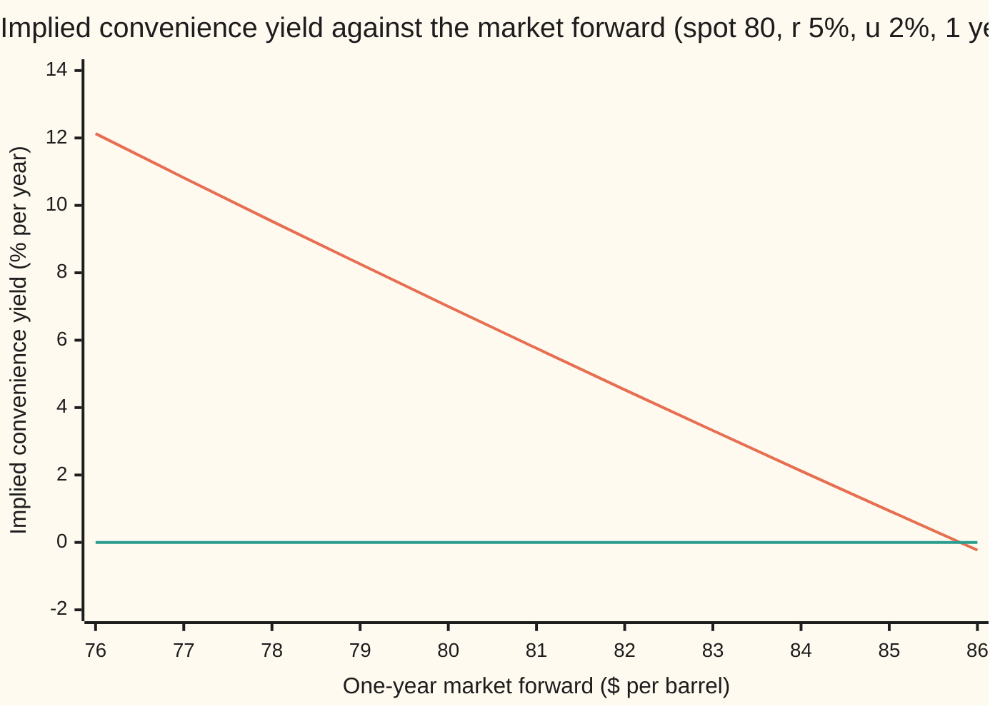

# Convenience yield: the number that makes the carry formula hit the market forward, and what it says about scarcity

[Syllabus](../../../SYLLABUS.md) → [Financial mathematics](../../../SYLLABUS.md#w12) → [Commodity forwards - carry, storage, convenience yield and the curve](../../../SYLLABUS.md#w12-s25) → Convenience yield

---

## General Overview

A barrel of crude oil costs $80 today. Money borrowed or lent for a year costs 5%. Keeping the barrel in a tank for a year costs 2% of its value. A trader who buys the barrel now with borrowed money, stores it, and delivers it in a year has spent $85.80 by delivery day. That is the ceiling on the one-year forward price (the price agreed today for delivery in a year): quote more, and anyone can buy, store and sell forward for a sure profit.

The market quotes $84. That is $1.80 under the ceiling, and no outsider can collect that $1.80. The trade that would collect it runs the other way: sell a barrel today, bank the cash, skip the storage, and buy it back forward. It needs someone holding barrels who is willing to part with them. The people holding barrels are refiners, traders and airlines, and they hold them because they need them.

So the gap is a price. It is what holders are giving up, this year, to keep oil on hand instead of on paper. Written as a yearly rate of the barrel's value, so it sits in the carry formula beside the interest rate and the storage cost, the gap is called the **convenience yield**. Here it is 2.12%.

**The convenience yield is the rate that, subtracted from interest and storage, makes the carry formula land exactly on the market forward; it measures what holding the physical thing is worth, and nobody pays it.**

**What kind of fact this is:** a definition: a number read back from a market quote. That exactly one such number exists for every positive forward is proved on this card in Why it works.

### The picture: spot, market forward, ceiling

```
dollars per barrel, each █ = 25 cents above $76
spot today              ████████████████                          $80.00
market forward          ████████████████████████████████          $84.00
storage-only ceiling    ███████████████████████████████████████   $85.80
```

The middle bar sits under the top one. The distance between them, $1.80 on delivery day, is what the convenience yield prices.

---

## The formula

$$y \;=\; r + u - \frac{\ln(F/S)}{T}$$

**Read it aloud:** the convenience yield is interest plus storage, minus the growth the market forward actually shows over spot, measured per year.

It is the carry formula from [Storage and the carry ceiling](02-storage-cost-and-the-carry-ceiling.md), $F = S\,e^{(r+u-y)T}$, solved for the one letter nobody quotes.

| Symbol | Plain meaning | In our example | Push it up and the answer… |
| --- | --- | --- | --- |
| $F$ | the **market forward**: the price quoted today for delivery at $T$ | $84 | $y$ falls: the market charges more for waiting, so holding is worth less |
| $S$ | the **spot price**: today's price for a barrel delivered now | $80 | $y$ rises: the same forward now shows less growth |
| $r$ | the **interest rate**, continuously compounded: what borrowed money costs per year | 5% | $y$ rises one for one |
| $u$ | the **storage cost**, a yearly fraction of the barrel's value | 2% | $y$ rises one for one |
| $T$ | time to delivery, in years | 1 | $y$ moves toward $r + u$: the same growth over spot is spread over more years |
| $y$ | the **convenience yield**: what holding the barrel is worth, as a yearly rate of its value | 2.12% | is the answer |
| $C$ | the **carry ceiling**, $S\,e^{(r+u)T}$: the forward with no convenience at all | $85.80 | $y$ rises with $\ln C$ |
| $G$ | the **gap** $C - F$, in delivery-day dollars | $1.80 | $y$ rises |
| $x$ | the gap as a share of the ceiling, $G/C$ | 0.020986 | $y$ rises, and $y \approx x/T$ while $x$ is small |
| $f$ | the forward a given yield implies, $f(y) = S\,e^{(r+u-y)T}$; used in the proof | $f(0.021210) = 84$ | — |

Two helper facts, each one line. The forward in terms of the ceiling: $F = C\,e^{-yT}$, so the convenience yield is the rate at which the market forward is "discounted" below the ceiling. And the same thing with the gap alone: $y = -\ln(1 - x)/T$, which for a small gap is nearly $x/T$: here 2.10% against the exact 2.12%.

### When it holds

- **Rates quoted continuously compounded, per year, as decimals.** Mix a 5% annual rate with continuous compounding and $y$ moves by the difference, about 0.12 points at these numbers.
- **Storage as a fraction of value.** The shelf's convention. If storage is quoted in dollars per barrel, convert it first or $y$ absorbs the conversion error.
- **A forward you could actually trade against spot.** If the forward and spot are for different grades or places (Brent against a Gulf Coast barrel), $y$ also absorbs the freight and quality difference.
- **$T$ not too short.** $y$ divides by $T$, so a one-cent error in a one-month quote moves $y$ by 0.15 points. At a year it moves it by 0.012 points.
- **Storage actually available at $u$.** When tanks are full, true storage costs more than the quoted $u$. The forward can then rise above the ceiling and the implied $y$ goes negative: the formula is flagging a wrong $u$, not a negative benefit.

---

## Why it works

### Step 0: the carry trade is one-sided

Two trades police a forward price. The first, **cash-and-carry**, buys spot, stores it and sells forward. Anyone with cash and a tank can run it, so it caps the forward at the ceiling $C$. The second, **reverse cash-and-carry**, sells spot, banks the money and buys forward. Only someone holding the commodity can run it, and holders have reasons not to. So there is a ceiling and no matching floor. The convenience yield is the name for how far below the ceiling the market chooses to sit.

### Step 1: the ceiling

The storage card builds $C = S\,e^{(r+u)T}$ by financing and storing one barrel: [Storage and the carry ceiling](02-storage-cost-and-the-carry-ceiling.md). Here $80\,e^{0.07} = 85.80$. A forward above that would be free money for anyone with a tank.

### Step 2: write the gap as a rate

The market forward is $F = 84$, below $C$. Write the shortfall the way interest and storage are written, as a continuously compounded rate $y$ taken off the ceiling:

$$F = C\,e^{-yT} = S\,e^{(r+u-y)T}.$$

This is the definition of $y$. Nothing new has been assumed. Before solving, the terms: with $S > 0$, $F > 0$ and $T > 0$, exactly one $y$ exists; $F = C$ gives $y = 0$, $F > C$ gives $y < 0$, and $T = 0$ or $F \le 0$ gives none. Step 4 proves each.

### Step 3: solve for it

Divide both sides by $S$: $F/S = e^{(r+u-y)T}$. Take the natural log of both sides ([Logarithms](../../01-Foundations/03-Powers%2C%20Roots%20and%20Logarithms/05-logarithms.md)): $\ln(F/S) = (r+u-y)T$. Divide by $T$ and move $y$ to the left ([Rearranging a formula](../../03-Algebra/01-Letters%20and%20Equations/03-rearranging-formulas.md)):

$$y = r + u - \frac{\ln(F/S)}{T}.$$

With the numbers: $\ln(84/80) = 0.048790$, so $y = 0.07 - 0.048790 = 0.021210$.

### Step 4: one answer, always, and the boundary cases

For a fixed delivery date ($T > 0$), the formula takes every positive forward to exactly one yield, and every yield comes from exactly one forward.

- **It exists.** The natural log is defined for every positive number, so any positive $F$ gives a $y$.
- **It is unique.** The log only climbs, so a higher $F$ always gives a lower $y$. Two different forwards can never share a yield.
- **At the ceiling, $F = C$:** $y = 0$. The market prices no benefit to holding.
- **At spot, $F = S$:** $y = r + u = 7\%$. The benefit exactly pays interest and storage; the curve is flat.
- **Above the ceiling, $F = 86.50$:** $y = -0.81\%$. Cash-and-carry now makes money, so either it is being done and the quote will fall, or storage costs more than $u$.
- **Toward zero, $F = 1$:** $y = 445\%$. As the forward shrinks to nothing, $y$ climbs without limit.
- **$T = 0$:** no answer. The forward must equal spot and carries no information about $y$.
- **$F \le 0$:** no answer. The log is undefined. Crude did settle below zero in April 2020; this log model cannot describe that, and a different one is needed.

<details>
<summary>Detailed proof: every yield is hit by exactly one forward</summary>

Fix $S > 0$, $r$, $u$ and $T > 0$. Define $f(y) = S\,e^{(r+u-y)T}$, the forward a given yield implies.

*Strictly falling.* If $y_1 < y_2$ then $(r+u-y_1)T > (r+u-y_2)T$, and $e^z$ strictly increases, so $f(y_1) > f(y_2)$. A strictly falling function never takes the same value twice: at most one $y$ per $F$.

*Every positive value.* $e^z$ takes every positive value exactly once as $z$ runs over all real numbers; its inverse is $\ln$. For a given $F > 0$ set $z = \ln(F/S)$ and $y = r + u - z/T$. Then $f(y) = S\,e^{z} = F$. So at least one $y$ per $F$.

Together: $f$ is a one-to-one match between all real yields and all positive forwards, and the formula on this card is its inverse. The limits follow from the log's: as $F \to 0$, $\ln(F/S) \to -\infty$ and $y \to +\infty$; as $F \to \infty$, $y \to -\infty$. The slope is $dy/dF = -1/(F\,T)$, never zero, which is the uniqueness again in calculus form, and at $F = 84$, $T = 1$ it is $-0.011905$: each dollar on the forward moves $y$ by 1.19 points.

</details>

### Step 5: what the number measures

Take a holder with one barrel. The reverse trade is open to them: sell it for $80, bank it at 5% to get $84.10 in a year, save the storage (worth $1.70 in delivery-day dollars on the storage card's convention), and buy a barrel forward for $84. In a year they have a barrel again and $84.10 + $1.70 − $84 = $1.80 more than if they had just kept it. In today's money that is $1.71.

Holders who keep their barrel are turning that down. So to the holder at the margin (the one just on the edge of selling), a barrel on hand for the year is worth at least $1.80 more than a barrel on paper. That value comes from being able to run a refinery through a supply cut, fill an order without waiting, or avoid shutting a plant down. Nicholas Kaldor named it the convenience yield in 1939. Written as a continuously compounded rate off the ceiling, as in Step 2, the $1.80 becomes 2.12% a year.

### Step 6: why it is not a cash flow

Interest is paid by a borrower. Storage is paid to a tank owner. Nobody pays the convenience yield. It is an **implied** number: inferred from a price, the way a car's value to its owner is inferred from the offers they refuse. A holder who has no use for the oil collects nothing by holding it; for them the right move is the reverse trade and the $1.80. The number belongs to the market, read off the forward, and it changes whenever the forward does.

A second route to the same number goes through the gap alone. With $x = G/C = 0.020986$, the series $-\ln(1-x) = x + x^2/2 + x^3/3 + \dots$ adds up to 0.021210. The code takes that road without calling a log, and a third that never takes a log at all.

---

## Worked numbers, by hand

Crude: $S = 80$, $r = 5\%$, $u = 2\%$, $T = 1$ year, market forward $F = 84$.

| Step | Arithmetic | Value |
| --- | --- | --- |
| interest plus storage | $0.05 + 0.02$ | $0.07$ |
| carry ceiling $C$ | $80 \times e^{0.07}$ | $\$85.80$ |
| gap $G$, delivery day | $85.80 - 84$ | $\$1.80$ |
| gap, today's dollars | $1.80 \times e^{-0.05}$ | $\$1.71$ |
| growth shown by the market | $\ln(84/80)$ | $0.048790$ |
| divide by $T$ | $0.048790 / 1$ | $0.048790$ |
| **convenience yield** $y$ | $0.07 - 0.048790$ | **$0.021210 = 2.12\%$** |
| rebuild the forward | $80 \times e^{0.07 - 0.021210}$ | $\$84.00$ |

The market is saying that a barrel in a tank this year is worth 2.12% of its value more than a barrel on a contract. In the inventory table below, that is the comfortable state.

### What breaks if you drop a piece

Correct answer 2.12%:

| Mistake | Comes out at | What went wrong |
| --- | --- | --- |
| Leave storage out | 0.12% | That is $y - u$, the net yield, not the convenience yield |
| Use $F/S - 1$ for $\ln(F/S)$ | 2.00% | Simple growth mixed with continuously compounded rates |
| Flip the log to $\ln(S/F)$ | 11.88% | A forward above spot now reads as scarcity |
| Enter a year as $T = 12$ | 6.59% | Months typed where years belong: the gap is spread twelve times too thin |

---

## How it moves with inventories

The spot price did not move and the carry costs did not move. Only the forward did, and the convenience yield swung from almost nothing to nearly 10%. The forward is carrying news about the tanks.

Four illustrative states of the same crude market, spot $80 in each, one-year forward as quoted (constructed to show the pattern, not taken from a date):

| Inventory state | Forward | Implied $y$ | What the curve is saying |
| --- | --- | --- | --- |
| Glut: tanks nearly full | $85.50 | 0.35% | Holding is barely worth anything; the forward sits near the ceiling |
| Comfortable | $84.00 | 2.12% | The card's example |
| Tight | $81.00 | 5.76% | Holders want their barrels; the forward barely clears spot |
| Squeeze | $78.00 | 9.53% | The forward is below spot: holding beats interest plus storage |

```
implied convenience yield, % per year, each █ = 0.25 points
glut          █                                          0.35
comfortable   ████████                                   2.12
tight         ███████████████████████                    5.76
squeeze       ██████████████████████████████████████     9.53
```

The ordering is the theory of storage. Holbrook Working and Michael Brennan argued in the 1940s and 1950s that with plenty in storage one more barrel is worth little to its holder, and with little in storage one more barrel is worth a lot. So the convenience yield falls as inventories rise: steeply when stocks are low, and flattening out once tanks are comfortable. Eugene Fama and Kenneth French tested this on futures prices in 1987 and found the spread between futures and spot moving with seasonal swings in inventories as the theory predicts.

The whole map from forward to yield, spot and carry held fixed:



The falling line is the implied yield; the flat line is zero. The falling line crosses 7.00% at a forward of $80, where the forward equals spot, and crosses zero just below $86, at the ceiling of $85.80. Everything left of $80 is a forward below spot: backwardation (a curve that slopes down), the subject of [Contango and backwardation](04-contango-backwardation-and-roll-yield.md). The line bends slightly upward: each dollar off the forward adds a little more yield than the last, because $dy/dF = -1/(FT)$ grows as $F$ shrinks.

---

## Code, from first principles, and it actually runs

Both programs reach the implied yield by three roads that share no step. Road 1 is the closed form, one logarithm. Road 2 is bisection: guess a yield, run the carry formula forwards, and halve the interval until the forward lands on $84; it never takes a log. Road 3 turns the dollar gap into a share of the ceiling and sums the series for $-\ln(1-x)$ by hand. Then the code checks the slope by bumping the forward a cent, confirms that the yield falls strictly across the chart's forwards (the uniqueness claim, on the page's own numbers), and prints every boundary case, every wrong answer, the inventory states and the chart points.

### Python

```python
# Convenience yield implied by the forward -- the check behind the card.
# Standard library only.  Every number quoted on the card is printed here.
# Crude at 80, rates 5%, storage 2% a year, one-year market forward at 84.
# The implied convenience yield y is reached three ways that share no step:
# the closed form (one logarithm), bisection on the carry formula (no
# logarithm at all), and a power series on the dollar gap (no library log).
from math import exp, log

def forward(S, r, u, y, T):          # the carry formula, run forwards
    return S * exp((r + u - y) * T)

def y_closed(S, r, u, F, T):         # road 1: the carry formula, run backwards
    return r + u - log(F / S) / T

def y_bisect(S, r, u, F, T):         # road 2: halve an interval; never takes a log
    lo, hi = -1.0, 1.0
    while forward(S, r, u, lo, T) < F: lo *= 2.0      # forward falls as y rises
    while forward(S, r, u, hi, T) > F: hi *= 2.0
    for _ in range(200):
        mid = 0.5 * (lo + hi)
        if forward(S, r, u, mid, T) > F: lo = mid
        else: hi = mid
    return 0.5 * (lo + hi)

def y_series(S, r, u, F, T):         # road 3: the gap as a share of the ceiling,
    C = S * exp((r + u) * T)         # then -ln(1 - x) = x + x^2/2 + x^3/3 + ...
    x = (C - F) / C
    total, term, k = 0.0, x, 1
    while abs(term) > 1e-18:
        total += term / k
        k += 1
        term *= x
    return total / T

S, r, u, F, T = 80.0, 0.05, 0.02, 84.0, 1.0
C = S * exp((r + u) * T)
G = C - F
y1, y2, y3 = y_closed(S, r, u, F, T), y_bisect(S, r, u, F, T), y_series(S, r, u, F, T)

h = 0.01                                            # slope: bump the forward a cent
slope_bump = (y_closed(S, r, u, F + h, T) - y_closed(S, r, u, F - h, T)) / (2 * h)
F1m = forward(S, r, u, y1, 1 / 12)                  # a one-month quote on the same yield
cent_1m = y_closed(S, r, u, F1m - 0.01, 1 / 12) - y1

rows = [
    ("ceiling C = S e^((r+u)T)", C), ("gap G = C - F, delivery day", G),
    ("gap in today's dollars", G * exp(-r * T)), ("ln(F/S)", log(F / S)),
    ("sell 80, bank it: S e^(rT)", S * exp(r * T)), ("storage saved: C - S e^(rT)", C - S * exp(r * T)),
    ("1 closed form y", y1), ("2 bisection, no log", y2), ("3 series on the gap", y3),
    ("  first term only, G/C", G / C), ("forward rebuilt from y", forward(S, r, u, y1, T)),
    ("boundary: F = C gives y", y_closed(S, r, u, C, T)),
    ("boundary: F = S gives y", y_closed(S, r, u, S, T)),
    ("boundary: F = 86.50 gives y", y_closed(S, r, u, 86.50, T)),
    ("boundary: F = 1.00 gives y", y_closed(S, r, u, 1.00, T)),
    ("slope dy/dF by bump", slope_bump), ("  -1/(F T)", -1 / (F * T)),
    ("one-month forward, same y", F1m), ("  y moved by a 1-cent error", cent_1m),
    ("  same cent on the 1-year quote", y_closed(S, r, u, F - 0.01, T) - y1),
    ("wrong: 5% annual as continuous", r - log(1 + r)),
    ("wrong: storage left out", y_closed(S, r, 0.0, F, T)),
    ("wrong: F/S - 1 for ln(F/S)", r + u - (F / S - 1) / T),
    ("wrong: ln(S/F), sign flipped", r + u - log(S / F) / T),
    ("wrong: T = 12 for a year", y_closed(S, r, u, F, 12.0)),
    ("gold: 2000, 5%, fwd 2081.62", y_closed(2000.0, 0.05, 0.0, 2081.62, 1.0)),
    ("try: storage 3%", y_closed(S, r, 0.03, F, T)), ("try: rates 4%", y_closed(S, 0.04, u, F, T)),
    ("try: 6-month forward 82", y_closed(S, r, u, 82.0, 0.5)),
]
for name, v in rows:
    print(f"{name:<32} {v:>12.6f}")

print()
print("inventory state    forward   implied y %")      # illustrative quotes, not market data
states = (("glut", 85.50), ("comfortable", 84.00), ("tight", 81.00), ("squeeze", 78.00))
ys = []
for name, f in states:
    ys.append(y_closed(S, r, u, f, T))
    print(f"{name:<16} {f:9.2f} {100 * ys[-1]:12.2f}")

print()
grid = [76.0 + i for i in range(11)]
curve = [y_closed(S, r, u, f, T) for f in grid]
print("chart, forward  " + " ".join(f"{f:6.0f}" for f in grid))
print("chart, y %      " + " ".join(f"{100 * v:6.2f}" for v in curve))

assert abs(y2 - y1) < 1e-12, "bisection (no log) must land on the closed form"
assert abs(y3 - y1) < 1e-12, "series on the gap must land on the closed form"
assert abs(forward(S, r, u, y1, T) - F) < 1e-9, "the implied yield must rebuild the market forward"
assert abs(slope_bump - (-1 / (F * T))) < 1e-8, "bumped slope vs -1/(F T)"
assert all(a > b for a, b in zip(curve, curve[1:])), "y must fall strictly as the forward rises: one answer per quote"
assert all(a < b for a, b in zip(ys, ys[1:])), "tighter market, lower forward, higher y"
print("ALL CHECKS PASS")
```

**Ran 2026-09-27 on macOS, Python 3.14.6, standard library only. All checks passed. Output, pasted from the run:**

```
ceiling C = S e^((r+u)T)            85.800655
gap G = C - F, delivery day          1.800655
gap in today's dollars               1.712836
ln(F/S)                              0.048790
sell 80, bank it: S e^(rT)          84.101688
storage saved: C - S e^(rT)          1.698967
1 closed form y                      0.021210
2 bisection, no log                  0.021210
3 series on the gap                  0.021210
  first term only, G/C               0.020986
forward rebuilt from y              84.000000
boundary: F = C gives y             -0.000000
boundary: F = S gives y              0.070000
boundary: F = 86.50 gives y         -0.008118
boundary: F = 1.00 gives y           4.452027
slope dy/dF by bump                 -0.011905
  -1/(F T)                          -0.011905
one-month forward, same y           80.325930
  y moved by a 1-cent error          0.001494
  same cent on the 1-year quote      0.000119
wrong: 5% annual as continuous       0.001210
wrong: storage left out              0.001210
wrong: F/S - 1 for ln(F/S)           0.020000
wrong: ln(S/F), sign flipped         0.118790
wrong: T = 12 for a year             0.065934
gold: 2000, 5%, fwd 2081.62          0.010001
try: storage 3%                      0.031210
try: rates 4%                        0.011210
try: 6-month forward 82              0.020615

inventory state    forward   implied y %
glut                 85.50         0.35
comfortable          84.00         2.12
tight                81.00         5.76
squeeze              78.00         9.53

chart, forward      76     77     78     79     80     81     82     83     84     85     86
chart, y %       12.13  10.82   9.53   8.26   7.00   5.76   4.53   3.32   2.12   0.94  -0.23
ALL CHECKS PASS
```

Three roads, one yield, agreeing to twelve decimals. The first term of the series alone, $G/C$, gives 2.10%: a quick estimate that is good while the gap is small. The gold row runs the same formula on the gold forward with no storage and recovers the 1% lease rate: see [Gold forward](01-gold-forward-and-the-lease-rate.md). The ceiling row prints −0.000000: zero, landed on from a hair below by rounding in the last binary digit.

### Rust

Same roads, same labels, std only. Rust's `ln` and `exp` are the only library maths used, and road 2 uses no `ln`.

```rust
// Convenience yield implied by the forward -- the same check as the Python, in Rust.
// Standard library only, no crates.  Crude at 80, rates 5%, storage 2% a year,
// one-year market forward at 84.  Three roads to the implied yield y that share
// no step: the closed form, bisection with no logarithm, and a series on the gap.
// Compile: rustc --edition 2021 -O convenience_yield_implied_by_the_forward_check.rs

fn forward(s: f64, r: f64, u: f64, y: f64, t: f64) -> f64 {   // the carry formula, forwards
    s * ((r + u - y) * t).exp()
}

fn y_closed(s: f64, r: f64, u: f64, f: f64, t: f64) -> f64 {  // road 1: backwards, one log
    r + u - (f / s).ln() / t
}

fn y_bisect(s: f64, r: f64, u: f64, f: f64, t: f64) -> f64 {  // road 2: never takes a log
    let (mut lo, mut hi) = (-1.0_f64, 1.0_f64);
    while forward(s, r, u, lo, t) < f { lo *= 2.0; }          // forward falls as y rises
    while forward(s, r, u, hi, t) > f { hi *= 2.0; }
    for _ in 0..200 {
        let mid = 0.5 * (lo + hi);
        if forward(s, r, u, mid, t) > f { lo = mid; } else { hi = mid; }
    }
    0.5 * (lo + hi)
}

fn y_series(s: f64, r: f64, u: f64, f: f64, t: f64) -> f64 {  // road 3: -ln(1 - x) as a series
    let c = s * ((r + u) * t).exp();
    let x = (c - f) / c;
    let (mut total, mut term, mut k) = (0.0_f64, x, 1.0_f64);
    while term.abs() > 1e-18 {
        total += term / k;
        k += 1.0;
        term *= x;
    }
    total / t
}

fn main() {
    let (s, r, u, f, t) = (80.0_f64, 0.05_f64, 0.02_f64, 84.0_f64, 1.0_f64);
    let c = s * ((r + u) * t).exp();
    let g = c - f;
    let (y1, y2, y3) = (y_closed(s, r, u, f, t), y_bisect(s, r, u, f, t), y_series(s, r, u, f, t));

    let h = 0.01;                                              // slope: bump the forward a cent
    let slope_bump = (y_closed(s, r, u, f + h, t) - y_closed(s, r, u, f - h, t)) / (2.0 * h);
    let f1m = forward(s, r, u, y1, 1.0 / 12.0);                // a one-month quote, same yield
    let cent_1m = y_closed(s, r, u, f1m - 0.01, 1.0 / 12.0) - y1;

    let rows: Vec<(&str, f64)> = vec![
        ("ceiling C = S e^((r+u)T)", c), ("gap G = C - F, delivery day", g),
        ("gap in today's dollars", g * (-r * t).exp()), ("ln(F/S)", (f / s).ln()),
        ("sell 80, bank it: S e^(rT)", s * (r * t).exp()), ("storage saved: C - S e^(rT)", c - s * (r * t).exp()),
        ("1 closed form y", y1), ("2 bisection, no log", y2), ("3 series on the gap", y3),
        ("  first term only, G/C", g / c), ("forward rebuilt from y", forward(s, r, u, y1, t)),
        ("boundary: F = C gives y", y_closed(s, r, u, c, t)),
        ("boundary: F = S gives y", y_closed(s, r, u, s, t)),
        ("boundary: F = 86.50 gives y", y_closed(s, r, u, 86.50, t)),
        ("boundary: F = 1.00 gives y", y_closed(s, r, u, 1.00, t)),
        ("slope dy/dF by bump", slope_bump), ("  -1/(F T)", -1.0 / (f * t)),
        ("one-month forward, same y", f1m), ("  y moved by a 1-cent error", cent_1m),
        ("  same cent on the 1-year quote", y_closed(s, r, u, f - 0.01, t) - y1),
        ("wrong: 5% annual as continuous", r - (1.0 + r).ln()),
        ("wrong: storage left out", y_closed(s, r, 0.0, f, t)),
        ("wrong: F/S - 1 for ln(F/S)", r + u - (f / s - 1.0) / t),
        ("wrong: ln(S/F), sign flipped", r + u - (s / f).ln() / t),
        ("wrong: T = 12 for a year", y_closed(s, r, u, f, 12.0)),
        ("gold: 2000, 5%, fwd 2081.62", y_closed(2000.0, 0.05, 0.0, 2081.62, 1.0)),
        ("try: storage 3%", y_closed(s, r, 0.03, f, t)), ("try: rates 4%", y_closed(s, 0.04, u, f, t)),
        ("try: 6-month forward 82", y_closed(s, r, u, 82.0, 0.5)),
    ];
    for (name, v) in &rows { println!("{:<32} {:>12.6}", name, v); }

    println!();
    println!("inventory state    forward   implied y %");         // illustrative quotes, not market data
    let states = [("glut", 85.50_f64), ("comfortable", 84.00), ("tight", 81.00), ("squeeze", 78.00)];
    let mut ys: Vec<f64> = Vec::new();
    for (name, fq) in states.iter() {
        ys.push(y_closed(s, r, u, *fq, t));
        println!("{:<16} {:9.2} {:12.2}", name, fq, 100.0 * ys[ys.len() - 1]);
    }

    println!();
    let grid: Vec<f64> = (0..11).map(|i| 76.0 + i as f64).collect();
    let curve: Vec<f64> = grid.iter().map(|fq| y_closed(s, r, u, *fq, t)).collect();
    let fs: Vec<String> = grid.iter().map(|fq| format!("{:6.0}", fq)).collect();
    let vs: Vec<String> = curve.iter().map(|v| format!("{:6.2}", 100.0 * v)).collect();
    println!("chart, forward  {}", fs.join(" "));
    println!("chart, y %      {}", vs.join(" "));

    assert!((y2 - y1).abs() < 1e-12, "bisection (no log) must land on the closed form");
    assert!((y3 - y1).abs() < 1e-12, "series on the gap must land on the closed form");
    assert!((forward(s, r, u, y1, t) - f).abs() < 1e-9, "the implied yield must rebuild the market forward");
    assert!((slope_bump - (-1.0 / (f * t))).abs() < 1e-8, "bumped slope vs -1/(F T)");
    assert!(curve.windows(2).all(|w| w[0] > w[1]), "y must fall strictly as the forward rises: one answer per quote");
    assert!(ys.windows(2).all(|w| w[0] < w[1]), "tighter market, lower forward, higher y");
    println!("ALL CHECKS PASS");
}
```

**Ran 2026-09-27 on macOS, rustc 1.98.1, no crates. All checks passed. Output, pasted from the run:**

```
ceiling C = S e^((r+u)T)            85.800655
gap G = C - F, delivery day          1.800655
gap in today's dollars               1.712836
ln(F/S)                              0.048790
sell 80, bank it: S e^(rT)          84.101688
storage saved: C - S e^(rT)          1.698967
1 closed form y                      0.021210
2 bisection, no log                  0.021210
3 series on the gap                  0.021210
  first term only, G/C               0.020986
forward rebuilt from y              84.000000
boundary: F = C gives y             -0.000000
boundary: F = S gives y              0.070000
boundary: F = 86.50 gives y         -0.008118
boundary: F = 1.00 gives y           4.452027
slope dy/dF by bump                 -0.011905
  -1/(F T)                          -0.011905
one-month forward, same y           80.325930
  y moved by a 1-cent error          0.001494
  same cent on the 1-year quote      0.000119
wrong: 5% annual as continuous       0.001210
wrong: storage left out              0.001210
wrong: F/S - 1 for ln(F/S)           0.020000
wrong: ln(S/F), sign flipped         0.118790
wrong: T = 12 for a year             0.065934
gold: 2000, 5%, fwd 2081.62          0.010001
try: storage 3%                      0.031210
try: rates 4%                        0.011210
try: 6-month forward 82              0.020615

inventory state    forward   implied y %
glut                 85.50         0.35
comfortable          84.00         2.12
tight                81.00         5.76
squeeze              78.00         9.53

chart, forward      76     77     78     79     80     81     82     83     84     85     86
chart, y %       12.13  10.82   9.53   8.26   7.00   5.76   4.53   3.32   2.12   0.94  -0.23
ALL CHECKS PASS
```

The two outputs agree byte for byte.

> [!TIP]
> **Try changing**
> Guess the direction first. Then run it.
> - **Raise storage to 3%.** Set `u = 0.03`. The yield goes from 2.12% to **3.12%**: one for one, because the market forward did not move, so the extra carry must be matched by extra convenience.
> - **Cut rates to 4%.** Set `r = 0.04`. The yield falls to **1.12%**. Cheaper money lowers the ceiling toward the quote, and less is left for convenience to explain.
> - **Use a six-month forward at 82.** Set `F = 82.0` and `T = 0.5`. The yield is **2.06%**: a smaller gap over a shorter time, nearly the same rate.
> - **Quote above the ceiling.** Set `F = 86.50`. The yield is **−0.81%**. Before believing it, check whether storage is really available at 2%.

---

## The usual mistake

> [!warning]
> **Treating the convenience yield as a cash flow.** Nobody pays it and nobody receives it. A fund that buys barrels and stores them does not earn 2.12% a year; it earns nothing from holding and pays the storage. The number is the value that holders with a use for the oil place on having it, inferred from what they refuse to sell. Put it into a cash-flow model as income and the model shows a return that no one can collect.
>
> Four smaller traps:
> - **Leaving storage out.** $r - \ln(F/S)/T$ gives 0.12%, which is the convenience yield net of storage. Both numbers are used in practice; say which one is quoted.
> - **One yield for every delivery date.** Each forward gives its own $y$. A six-month quote at 82 gives 2.06%, not 2.12%. The yields across dates form a curve of their own, and seasonal commodities bend it hard: [Seasonal curves](05-seasonality-and-the-gas-curve.md).
> - **Reading a short-dated yield too precisely.** At one month, a one-cent error in the quote moves $y$ by 0.15 points. Front-month yields jump around for this reason alone.
> - **Taking a negative yield at face value.** Below zero, the forward is above the carry ceiling. That means the storage number is wrong, usually because tanks are full. In April 2020 the expiring US crude future at Cushing, Oklahoma settled below zero dollars, largely because storage at the delivery point was close to full.

---

## Where you meet it in real life

- **Oil desks.** A trader reading the one-year spread (the forward minus spot) is reading the convenience yield with $r$ and $u$ held in their head. A falling forward against a steady spot is the market reporting that stocks are drawing down.
- **Metals and the lease rate.** For gold, holding is cheap and the lease market is deep, so the convenience yield equals the rate at which gold can be lent out: [Gold forward](01-gold-forward-and-the-lease-rate.md).
- **Grain after harvest.** Right after harvest the bins are full and the implied yield is small; before the next harvest it rises. The yield carries the seasons: [Seasonal curves](05-seasonality-and-the-gas-curve.md).
- **Commodity pricing models.** Eduardo Schwartz and Rajna Gibson in 1990 made the convenience yield a random quantity of its own, pulled back toward an average, alongside a random spot price. The pull-back idea is the subject of [A spot price that reverts](06-mean-reverting-spot-and-the-futures-curve.md).
- **Inventory policy.** A refiner deciding whether to hold extra crude compares its own value of having it with the market's $y$. If its own value is lower, the reverse trade is worth doing.

> **Say it back**
> The carry ceiling is spot grown at interest plus storage: $85.80 for crude at $80. The market forward sits below it, at $84, because only holders can run the trade that would close the gap, and they need their oil. Writing that gap as a yearly rate gives the convenience yield: 5% plus 2%, minus $\ln(84/80)$, which is 2.12%. Every positive forward gives exactly one such rate; lower forwards give higher rates, and the rate climbs when stocks run short. Nobody pays it: it is the value of holding the physical, read off the price.

---

## What this builds on

- [Storage and the carry ceiling](02-storage-cost-and-the-carry-ceiling.md): the ceiling $S\,e^{(r+u)T}$ and the cash-and-carry trade that enforces it. This card measures how far below it the market sits.
- [Logarithms](../../01-Foundations/03-Powers%2C%20Roots%20and%20Logarithms/05-logarithms.md): the natural log undoes $e^z$, which is what turns the carry formula inside out.
- [Rearranging a formula](../../03-Algebra/01-Letters%20and%20Equations/03-rearranging-formulas.md): moving $y$ to one side, the whole of Step 3.

## Where this goes next

- [Contango and backwardation](04-contango-backwardation-and-roll-yield.md): what the curve's slope means for someone who holds futures and rolls them month to month, and why a high convenience yield turns into a positive roll return.

A convenience yield read from one forward is one point; a curve of forwards gives one at every date, and the next question is what an investor earns by riding that curve.

---

## Sources

Verified 2026-09-27: every link below resolves to the publisher's page.

- Kaldor, Nicholas. "Speculation and Economic Stability." *Review of Economic Studies* 7, no. 1 (1939): 1–27. [doi:10.2307/2967593](https://doi.org/10.2307/2967593). Names the convenience yield: the return on stocks held because having them to hand is useful.
- Fama, Eugene F., and Kenneth R. French. "Commodity Futures Prices: Some Evidence on Forecast Power, Premiums, and the Theory of Storage." *Journal of Business* 60, no. 1 (1987): 55–73. [doi:10.1086/296385](https://doi.org/10.1086/296385). Tests the theory of storage on futures prices: the spread behaves as the convenience yield predicts across inventory levels.
- Gibson, Rajna, and Eduardo S. Schwartz. "Stochastic Convenience Yield and the Pricing of Oil Contingent Claims." *Journal of Finance* 45, no. 3 (1990): 959–976. [doi:10.1111/j.1540-6261.1990.tb05114.x](https://doi.org/10.1111/j.1540-6261.1990.tb05114.x). The convenience yield implied from oil futures, then modelled as a random quantity that reverts.
- Pindyck, Robert S. "The Dynamics of Commodity Spot and Futures Markets: A Primer." *Energy Journal* 22, no. 3 (2001): 1–29. [doi:10.5547/ISSN0195-6574-EJ-Vol22-No3-1](https://doi.org/10.5547/ISSN0195-6574-EJ-Vol22-No3-1). How inventories, spot, futures and the convenience yield move together, with oil and gas examples.
- Hull, John C. *Options, Futures, and Other Derivatives*, 11th ed. Pearson. [Publisher page](https://www.pearson.com/en-us/subject-catalog/p/options-futures-and-other-derivatives/P200000005938). The textbook statement of $F = S\,e^{(r+u-y)T}$ and of the convenience yield as the number that reconciles it with the market.
