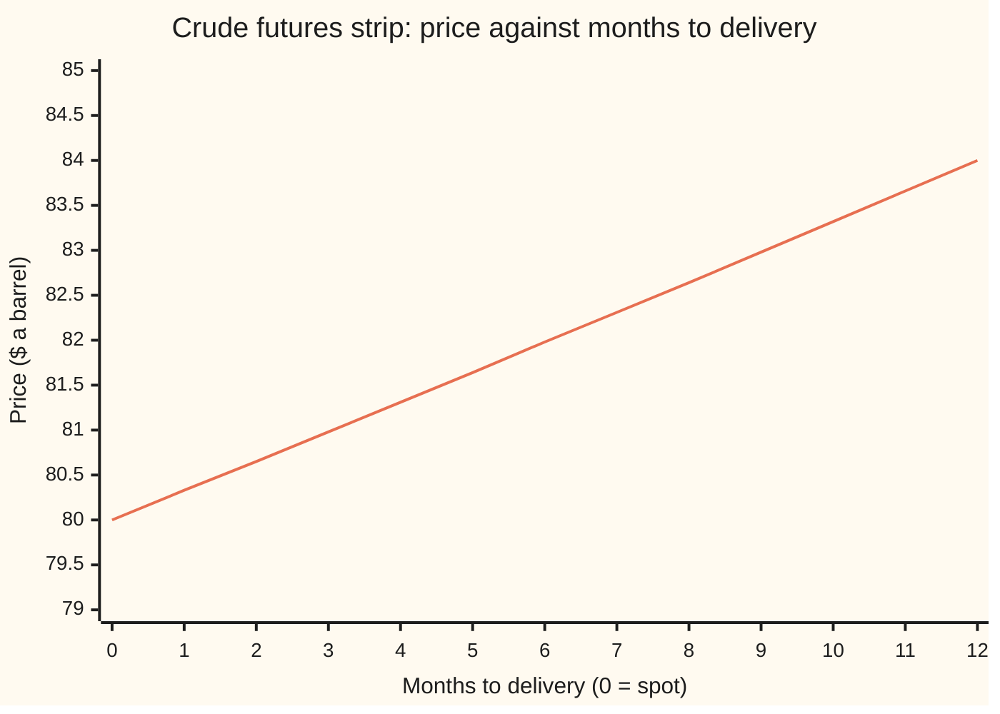
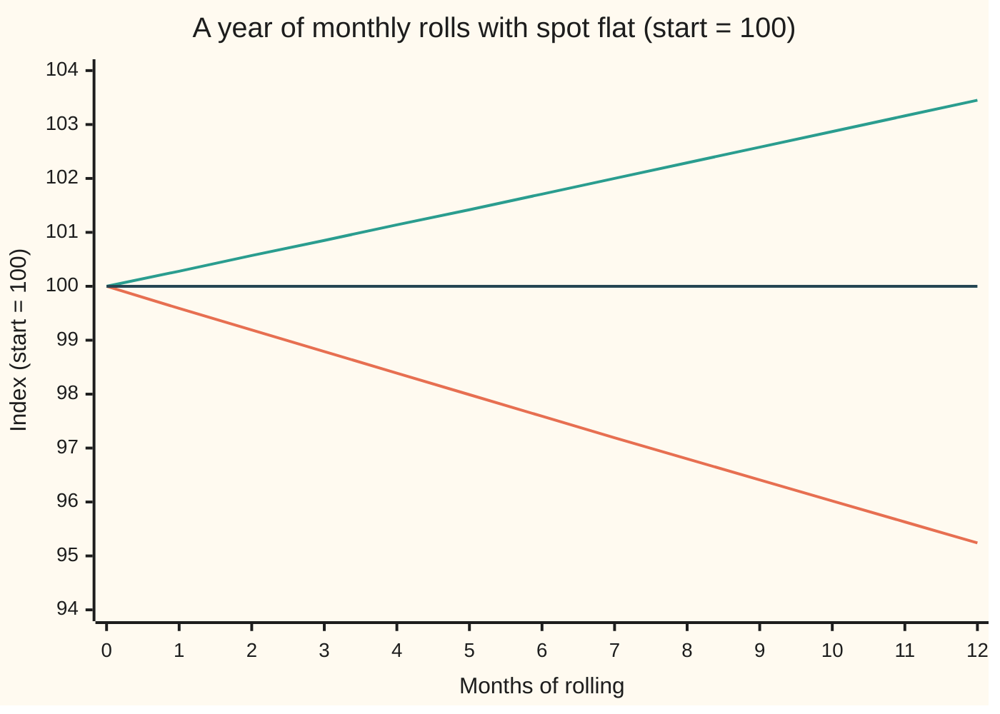

# Contango and backwardation: reading a futures strip, and the roll that pays or bleeds a long-only holder

Financial mathematics → Commodity forwards - carry, storage, convenience yield and the curve → Reading the curve → Contango and backwardation

---

## General Overview

Crude oil trades today at $80.00 a barrel. That is the **spot** price: the price for a barrel handed over now.

Oil also trades for later. A **futures contract** is a promise to buy a fixed amount of oil on a set delivery date at a price agreed today. Signing one costs nothing up front; the exchange only asks for a deposit, called **margin**, that stays the buyer's money. Each delivery month has its own contract and its own price. Read across the months and the prices form a row: the **strip**, also called the futures curve.

On this morning's screen the one-month contract is $80.33, the six-month $81.98, the twelve-month $84.00. The later the delivery, the dearer the oil, about 5% more for a year's wait. A strip that rises with delivery date is in **contango**. One that falls is in **backwardation**. Copper this morning is the second kind: $9,000.00 a tonne for now, $8,700.00 for a year out.

Now take a fund that wants to own oil without a tank. It buys the nearest contract, the **front month**. Before delivery it sells that contract and buys the next one. That swap is the **roll**, and the fund is a **long roller**. On a contango strip every roll sells cheap and buys dear. If spot sits at $80.00 all year, the roller still loses about 0.41% a month, 4.76% over the year. On the copper strip the same routine gains 0.28% a month.

**The slope of the strip is the carry of the commodity, and a roller who holds the front month earns the spot price's move minus that slope: contango bleeds, backwardation pays, even when spot never moves.**

**What kind of fact this is:** a definition (contango, backwardation and roll yield are names for the slope and for one part of a return), resting on the carry model of the earlier cards; the split of a roller's return into spot and roll is an identity, proved on this card in Why it works.

### The picture: the crude strip



The one line is today's crude strip, spot at month 0 and the twelve monthly contracts after it. It climbs about 33 cents a month. That steady climb is contango. The roll lives in the first step: the fund pays $80.33 for a contract that, if nothing changes, is worth $80.00 on its delivery day if spot does not move.

---

## The formula

Notation first, in words. The Greek letter $\tau$ ("tau") is the time left until a contract's delivery, in years. $F(\tau)$ is today's futures price for delivery $\tau$ years away. The carry model of the earlier cards prices every point on the strip the same way:

$$F(\tau) = S\,e^{(r+u-y)\,\tau} = S\,e^{c\,\tau}, \qquad c = r + u - y$$

**Read it aloud: the future for any delivery date is spot, grown at the net cost of holding the commodity until then.**

The sign of $c$ names the strip:

$$c > 0:\ \text{contango (rising strip)}, \qquad c < 0:\ \text{backwardation (falling strip)}$$

Hold one contract for a stretch of time $\Delta$ while the strip keeps its shape. Its price changes by the spot move and one more piece:

$$\ln\frac{F_{\text{end}}}{F_{\text{start}}} \;=\; \ln\frac{S_{\text{end}}}{S_{\text{start}}} \;-\; c\,\Delta$$

**Read it aloud: the future's return is the spot's return plus the roll yield, and the roll yield is minus the slope of the strip times the time held.**

The natural log, $\ln$, turns a ratio into a return that adds across months ([growth-factors](../../01-Foundations/04-Compound%20Growth%20and%20Discounting/01-growth-factors.md) multiplies the same ratios). As a plain percentage, one month of roll is $e^{-c\Delta} - 1$.

| Symbol | Plain meaning | In our example | Push it up and the roll… |
| --- | --- | --- | --- |
| $S$ | spot: the price for delivery now | $80.00 a barrel | no effect: the roll is a percentage of price |
| $\tau$ | time left until a contract's delivery, in years | 0 to 1 | — |
| $F(\tau)$ | today's futures price for delivery $\tau$ years away | $80.33 at one month, $84.00 at twelve | — |
| $r$ | the riskless rate: what cash earns in the bank | 5% | bleeds more: financing a barrel costs more |
| $u$ | storage cost, as a fraction of the price per year | 2% | bleeds more: the tank rent sits in the strip |
| $y$ | convenience yield: the benefit of holding the physical barrel, read off the strip | 2.12% | pays more: the strip tilts down |
| $c$ | the carry, $r + u - y$: the slope of the strip in log terms, per year | 4.88% | bleeds more; below zero it pays |
| $\Delta$ | the time a contract is held before rolling, in years | one month, $1/12$ | a bigger bite per roll, the same bite per year |
| $F_{\text{start}}$, $F_{\text{end}}$ | one contract's price when bought and when sold | $80.33, $80.00 | — |
| $S_{\text{start}}$, $S_{\text{end}}$ | spot at the same two moments | $80.00, $80.00 | a spot rise lifts the roller one for one |
| $T$ | total time spent rolling, in years | 1 | the bite grows in step |
| $n$, $S_d$ | in the detailed proof: days in one holding, and spot on day $d$ | 30 days a month, $80.00 | — |
| $e^{c\tau}$ | the growth factor from spot to the future | 1.050000 at one year | — |

### When it holds

- **The strip keeps its shape.** The identity assumes $c$ is the same when the contract is sold as when it was bought. If the strip steepens while the front contract is held, that contract gains the change in $c$ times its time left, a third term the spot and the roll do not capture.
- **One slope for the whole strip.** A single $c$ makes the strip a smooth curve. Real strips kink: gas is dear in winter and cheap in summer ([seasonality-and-the-gas-curve](05-seasonality-and-the-gas-curve.md)). Then the roll is the local slope between the first two contracts, not the twelve-month average.
- **Rolled at delivery.** The card rolls on the delivery day, when the front contract equals spot. Funds roll days earlier, so they earn the gap between the first and second contracts instead; with a smooth strip it is the same slope.
- **Futures treated as forwards.** Futures settle gains and losses daily through margin. With a fixed interest rate the two prices are equal; when rates move, the gap is too small to see at these horizons.
- **Cash counted apart.** The roll yield is a return on the contract's value, with no cash held. A fund that keeps the contract's full value in the bank earns the bank rate on top (Step 4).

---

## Why it works

### Step 0: a future on its delivery day is spot

On delivery day a futures contract is a promise to buy oil today at the contract price. Oil for today costs spot. So the contract's price and spot must meet on that day; if they did not, buying the cheaper and selling the dearer would earn a sure profit. This meeting is called **convergence**.

Convergence is the whole story of the roll. A contract bought above spot, on a day spot does not move, must drift down to spot by delivery. A contract bought below spot must drift up.

### Step 1: the slope of the strip is the carry

The earlier cards on this shelf price a future by the cost of the alternative: buy the barrel now, borrow the money at the bank rate $r$, pay the tank rent $u$, and give up the convenience yield $y$ that a physical barrel offers and a paper contract does not ([storage-cost-and-the-carry-ceiling](02-storage-cost-and-the-carry-ceiling.md), [convenience-yield-implied-by-the-forward](03-convenience-yield-implied-by-the-forward.md)). Every point on the strip is spot times $e^{c\tau}$ with the same $c$.

So $\ln F(\tau)$ is a straight line in $\tau$ with slope $c$. Contango and backwardation are the sign of that slope. For crude, $c = \ln(84/80) = 4.88\%$ a year. With $r = 5\%$ and $u = 2\%$, the market is saying $y = 2.12\%$: the same crude, and the same answer, as the convenience-yield card. For copper, $c = \ln(8{,}700/9{,}000) = -3.39\%$: the convenience of holding copper now beats the bank rate plus storage, so the strip falls.

Contango has a ceiling and backwardation has no floor. With no convenience at all the strip rises at the full carry $r + u = 7\%$, which caps the crude twelve-month at $85.80; above that, buying spot and storing it beats buying the future. Nothing stops $y$ from being large when a commodity is scarce, so a strip can fall as steeply as scarcity makes it.

### Step 2: hold one contract for a month

Buy the one-month contract. Its price is $S_{\text{start}}\,e^{c\Delta}$. A month later it is the delivery day, and the contract is worth $S_{\text{end}}$. Divide:

$$\frac{F_{\text{end}}}{F_{\text{start}}} = \frac{S_{\text{end}}}{S_{\text{start}}}\;e^{-c\Delta}$$

Take logs and the ratio splits into a sum: the spot return, plus $-c\Delta$. That second piece is the **roll yield**. It is not a payment from anyone. It is the drift of convergence: the contract started $c\Delta$ above spot, in log terms, and ended level with it.

For crude, $\Delta = 1/12$: the log roll is $-0.004066$, and $e^{-0.004066} - 1 = -0.41\%$. The contract bought at $80.33 finishes at $80.00.

### Step 3: roll, and the months chain

On delivery day the roller sells the old contract, at spot, and buys the new front month. Entering a future costs nothing, so no cash changes hands at the roll beyond settling the old contract's gain or loss. At each roll the fund buys new contracts worth what it is now worth. So the monthly returns multiply, as growth factors do, and the logs add.

After rolling for a total time $T$, in years:

$$\ln(\text{roller's growth}) = \ln\frac{S_{\text{end}}}{S_{\text{start}}} - c\,T$$

Over a year, $T = 1$, and the roller's growth is $S_{\text{end}}/(S_{\text{start}}\,e^{c}) = S_{\text{end}}/F(1)$. **Twelve monthly rolls earn exactly what buying the twelve-month contract earns.** For crude, if spot is still $80.00 in a year, $80/84 - 1 = -4.76\%$. How often the roller rolls does not matter while the shape holds: monthly or quarterly, the year costs $c$.

<details>
<summary>Detailed proof: the daily ledger telescopes</summary>

Mark the held contract every day. On day $d$ of a holding of length $\Delta$ split into $n$ days, it has $\tau_d = \Delta(1 - d/n)$ left and is worth $S_d\,e^{c\tau_d}$, where $S_d$ is spot that day. One day's growth is
$$\frac{S_{d+1}\,e^{c\tau_{d+1}}}{S_d\,e^{c\tau_d}} = \frac{S_{d+1}}{S_d}\,e^{-c\Delta/n}.$$
Multiply the $n$ days together. The spot ratios cancel in a chain, leaving $S_n/S_0$; the $n$ copies of $e^{-c\Delta/n}$ give $e^{-c\Delta}$. At each roll the new contract's first mark is its purchase price, so the chain carries straight across. Over any number of rolls the product is (last spot / first spot) times $e^{-c \times \text{total time}}$, whatever path spot takes in between and however the time is cut into holdings. The code builds this ledger day by day on a flat spot and on a random spot path and gets $-c$ both times.

</details>

### Step 4: where the bleed goes

A fund that buys futures does not spend the contract's value; it leaves it in the bank, earning $r$. Add that interest to the roller's return:

$$\text{spot return} - c + r \;=\; \text{spot return} + y - u$$

That right-hand side is what a barrel in a tank earns: the spot move, plus the convenience of having it, minus the rent. For crude, $+0.12\%$ a year with spot flat, by either road. So contango's bleed is mostly the interest a barrel holder gives up, and the funded roller already earns that interest on its cash. Roll yield is not a cost of futures; it is the carry, shown on the futures side of the ledger.

The market has a second habit of quoting the roll: on roll day, (price of the contract sold − price of the contract bought) / price of the contract bought. For crude that is $(80.00 - 80.33)/80.33 = -0.41\%$, the same number, because with a steady shape the contract sold is at spot. When the strip changes shape, the two readings part, and the gap is the shape change.

**Conventions verified 27 Sep 2026:** NYMEX crude futures are quoted in US dollars a barrel, LME copper in US dollars a tonne. Commodity indices such as the S&P GSCI publish an excess-return version (rolled futures alone) and a total-return version (plus interest on the cash). Exchanges could change contract terms; the arithmetic needs only prices for each delivery month.

How a spot price that drifts back toward a normal level shapes the strip is [mean-reverting-spot-and-the-futures-curve](06-mean-reverting-spot-and-the-futures-curve.md).

---

## Worked numbers, by hand

Crude: spot $80.00, twelve-month $84.00, $r = 5\%$, $u = 2\%$. Copper: spot $9,000.00, twelve-month $8,700.00.

| Step | Arithmetic | Value |
| --- | --- | --- |
| crude carry $c$ | $\ln(84/80) = \ln 1.05$ | 0.048790 (4.88%) |
| implied convenience yield $y$ | $0.05 + 0.02 - 0.048790$ | 0.021210 (2.12%) |
| front contract, one month | $80 \times e^{0.048790/12}$ | $80.33 |
| one month's roll, spot flat | $80.00/80.33 - 1$ | **−0.41%** |
| twelve months of rolls | $80/84 - 1$ | **−4.76%** |
| plus a year's cash interest | $e^{0.05 - 0.048790} - 1$ | +0.12% |
| copper carry $c$ | $\ln(8{,}700/9{,}000)$ | −0.033902 (−3.39%) |
| copper, one month | $e^{0.033902/12} - 1$ | **+0.28%** |
| copper, twelve months | $9{,}000/8{,}700 - 1$ | **+3.45%** |

A crude roller who is right that oil will hold at $80.00 still loses 4.76% a year on the contracts; a copper roller who is right that copper will hold at $9,000.00 gains 3.45%.

### What breaks if you drop a piece

| Mistake | Comes out at | What went wrong |
| --- | --- | --- |
| Strip read as a forecast of spot | +5.00% a year expected from buying | The 5% slope is carry, not a view; with spot flat the roller lost 4.76% |
| Roller's loss read as oil's fall | "oil fell 4.76%" | Spot moved +0.00%; the whole −4.76% was roll |
| The year's 5% spread split into twelve | −0.4167% a month (right: −0.4058%) | Months compound; divide the log slope, not the spread |
| Cash interest left out | −4.76% a year (right, funded: +0.12%) | The collateral earns the bank rate, which is most of the bleed |

The code prints all four.

---

## The roll, month by month

Spot does nothing all year. The crude roller still ends 4.76% down. The oil did not move; the strip's slope did the work.

### One roller, one flat year

Each month the roller pays $80.33 for the front contract and sells it at $80.00 on delivery day. Start the fund's contract value at 100:

| Month | Spot | Front contract bought at | Roller's index |
| --- | --- | --- | --- |
| 0 | $80.00 | $80.33 | 100.00 |
| 3 | $80.00 | $80.33 | 98.79 |
| 6 | $80.00 | $80.33 | 97.59 |
| 9 | $80.00 | $80.33 | 96.41 |
| 12 | $80.00 | — | 95.24 |

### Force one: the slope of the strip

Spot flat, one month of rolling, percent of the position:

```
strip           roll in one month, spot flat (percent)
copper   ██████████████                        +0.2829%
crude    ████████████████████                  -0.4058%
```

```
strip           roll over twelve months, spot flat (percent)
copper   ████████████████████████████          +3.4483%
crude    ██████████████████████████████████████ -4.7619%
```

Bar length is the size of the roll; the sign says who pays. Backwardation hands the roller the drift up to spot; contango takes the drift down.

### Force two: spot moves

Crude strip as today. Spot drifts steadily over the year to four different endings:

```
spot ends at    roller's year, percent
$76      ████████████████████████████████████████████  -9.5238%
$80      ██████████████████████                        -4.7619%
$84                                                    +0.0000%
$88      ██████████████████████                        +4.7619%
```

The roller breaks even exactly when spot ends at $84.00, the twelve-month price on the day it started. Spot up 5% and the roll down 4.76% cancel, as Step 3 said they must: a year of rolls is a purchase of the twelve-month contract.

### Both strips in one picture



Orange, falling: the crude roller in contango. Green, rising: the copper roller in backwardation. Dark, flat: spot, the same for both, since neither price moved. The gap between each rolling line and the flat line is the roll yield, and it widens at a steady rate because the slope never changed.

---

## Code, from first principles, and it actually runs

The check reaches the roll by four roads. Road 1 is the formula $e^{-c\Delta} - 1$. Road 2 is a daily ledger: it marks the held contract from the strip every day, sells at delivery and buys the new front, on a spot that never moves. Road 3 runs the same ledger on a random spot path from a hand-written random number generator and subtracts spot's own return; what is left is $-c$, whatever the path. Road 4 fits a straight line through the logs of the strip as a screen quotes it, to the cent, and reads $c$ off the slope. The roll-date spread, the funded roller and every number on the card are printed too.

### Python

```python
# Contango, backwardation and roll yield -- the check behind the card.
# Standard library only.  Every number quoted on the card is printed here.
# Nothing imported knows the answer: the random numbers come from a generator
# written below, the straight-line fit is written out, the ledgers are loops.
from math import exp, log, sqrt, cos, pi

r, u = 0.05, 0.02                     # bank rate and crude storage, per year
S_OIL, F12_OIL = 80.0, 84.0           # crude: spot and the 12-month future, $/barrel
S_CU, F12_CU = 9000.0, 8700.0         # copper: spot and the 12-month future, $/tonne
DAYS = 30                             # daily marks in each month of a ledger

def carry(S, F12):                    # c = r + u - y, read off the two ends of a strip
    return log(F12 / S)

def strip(S, c):                      # the curve: future for delivery k months out
    return [S * exp(c * k / 12) for k in range(13)]

def roll_formula(c, months):          # road 1: spot fixed, shape fixed
    return exp(-c * months / 12) - 1

def ledger(c, spot, months, per_roll=1):
    # Road 2: hold the front contract, mark it every day from the curve, and at
    # its delivery buy the new front.  spot[i] is the spot price on day i.
    value, day = 1.0, 0
    for _ in range(months // per_roll):
        for d in range(per_roll * DAYS):
            left0 = (per_roll * DAYS - d) / (12 * DAYS)    # years to delivery today
            left1 = left0 - 1 / (12 * DAYS)                # and tomorrow
            value *= spot[day + 1] * exp(c * left1) / (spot[day] * exp(c * left0))
            day += 1
    return value - 1

state = 20260927                      # a 64-bit linear congruential generator
def uniform():
    global state
    state = (state * 6364136223846793005 + 1442695040888963407) % 2**64
    return ((state >> 11) + 0.5) / 2**53

def gauss():                          # Box-Muller: two uniforms make one bell-curve draw
    u1 = uniform()
    u2 = uniform()
    return sqrt(-2.0 * log(u1)) * cos(2.0 * pi * u2)

def fit_slope(prices):                # road 4: least-squares slope of ln F against years
    xs = [k / 12 for k in range(len(prices))]
    ys = [log(p) for p in prices]
    mx, my = sum(xs) / len(xs), sum(ys) / len(ys)
    sxy = sum((x - mx) * (y - my) for x, y in zip(xs, ys))
    return sxy / sum((x - mx) ** 2 for x in xs)

def pct(x): return f"{0.0 if abs(x) < 1e-12 else 100 * x:+.4f}%"
def show(label, text): print(f"{label:<44} {text}")

c_oil, c_cu = carry(S_OIL, F12_OIL), carry(S_CU, F12_CU)
flat_oil = [S_OIL] * (12 * DAYS + 1)
flat_cu = [S_CU] * (12 * DAYS + 1)
oil_strip, cu_strip = strip(S_OIL, c_oil), strip(S_CU, c_cu)

sigma, dt, path = 0.30, 1 / (12 * DAYS), [S_OIL]      # road 3: a random spot path
for _ in range(12 * DAYS):
    path.append(path[-1] * exp(-0.5 * sigma * sigma * dt + sigma * sqrt(dt) * gauss()))
fut_log = log(1 + ledger(c_oil, path, 12))
spot_log = log(path[-1] / path[0])
quoted = [round(p, 2) for p in oil_strip]               # the strip as a screen shows it

show("crude carry c = r + u - y, per year", f"{c_oil:.6f}")
y_oil = r + u - c_oil                                   # what the market forward implies
show("crude implied convenience yield y", f"{y_oil:.6f}")
print("crude strip, months 0..12:", " ".join(f"{p:.2f}" for p in oil_strip))
show("front minus spot, $; growth factor e^c", f"{oil_strip[1] - S_OIL:.2f}  {exp(c_oil):.6f}")
show("full-carry ceiling r + u; 12-month cap", f"{r + u:.6f}  {S_OIL * exp(r + u):.2f}")
show("copper carry c, per year", f"{c_cu:.6f}")
print("copper strip, months 0,3,6,9,12:", " ".join(f"{cu_strip[k]:.2f}" for k in (0, 3, 6, 9, 12)))
show("1 formula, crude, one month", pct(roll_formula(c_oil, 1)))
show("2 daily ledger, crude, one month", pct(ledger(c_oil, flat_oil, 1)))
show("  roll-date spread (F0 - F1) / F1", pct((oil_strip[0] - oil_strip[1]) / oil_strip[1]))
show("  one month, in logs, -c/12", f"{-c_oil / 12:.6f}")
show("1 formula, crude, twelve months", pct(roll_formula(c_oil, 12)))
show("2 daily ledger, crude, twelve months", pct(ledger(c_oil, flat_oil, 12)))
show("  spot / 12-month future - 1", pct(S_OIL / F12_OIL - 1))
show("3 random path: spot ends at", f"{path[-1]:.2f}")
show("  futures log return", f"{fut_log:.6f}")
show("  spot log return", f"{spot_log:.6f}")
show("  futures minus spot, the roll", f"{fut_log - spot_log:.6f}")
show("4 straight-line fit to the quoted strip, c", f"{fit_slope(quoted):.6f}")
show("copper: formula, one month", pct(roll_formula(c_cu, 1)))
show("copper: daily ledger, one month", pct(ledger(c_cu, flat_cu, 1)))
show("copper: formula, twelve months", pct(roll_formula(c_cu, 12)))
show("copper: daily ledger, twelve months", pct(ledger(c_cu, flat_cu, 12)))
show("crude roller + cash interest, a year", pct(exp(r - c_oil) - 1))
show("crude barrel in a tank, y - u, a year", pct(exp(y_oil - u) - 1))
for end in (76.0, 80.0, 84.0, 88.0):
    walk = [S_OIL * (end / S_OIL) ** (i / (12 * DAYS)) for i in range(12 * DAYS + 1)]
    show(f"crude roller, spot drifts to {end:.0f}", f"spot {pct(end / S_OIL - 1)}  roller {pct(ledger(c_oil, walk, 12))}")
show("wrong: strip read as a forecast, a year", pct(F12_OIL / S_OIL - 1))
show("wrong: 5% spread / 12, one month", pct(-(F12_OIL / S_OIL - 1) / 12))
show("try: strip 80 -> 88, one month", pct(roll_formula(carry(80.0, 88.0), 1)))
show("try: y = 7%, carry and one month", f"{r + u - 0.07:.6f}  {pct(roll_formula(r + u - 0.07, 1))}")
show("try: roll quarterly, crude, a year", pct(ledger(c_oil, flat_oil, 12, per_roll=3)))
print("chart, crude roller index:", " ".join(f"{100 * (1 + roll_formula(c_oil, m)):.2f}" for m in range(13)))
print("chart, copper roller index:", " ".join(f"{100 * (1 + roll_formula(c_cu, m)):.2f}" for m in range(13)))
print("chart, spot index:", " ".join(f"{100 * flat_oil[m * DAYS] / S_OIL:.2f}" for m in range(13)))

assert abs(ledger(c_oil, flat_oil, 12) - (S_OIL / F12_OIL - 1)) < 1e-12, "ledger vs the two ends of the strip"
assert abs(roll_formula(c_oil, 1) - ledger(c_oil, flat_oil, 1)) < 1e-12, "formula vs daily ledger, crude month"
assert abs(roll_formula(c_cu, 12) - ledger(c_cu, flat_cu, 12)) < 1e-12, "formula vs daily ledger, copper year"
assert abs(ledger(c_oil, flat_oil, 1) - (oil_strip[0] - oil_strip[1]) / oil_strip[1]) < 1e-12, "ledger vs roll-date spread"
assert abs((fut_log - spot_log) + c_oil) < 1e-9, "random path: futures minus spot is -c"
assert abs(fit_slope(quoted) - c_oil) < 2e-4, "slope of the quoted strip recovers c"
assert ledger(c_cu, flat_cu, 12) > 0 > ledger(c_oil, flat_oil, 12), "backwardation pays, contango bleeds"
print("ALL CHECKS PASS")
```

**Ran 2026-09-27 on macOS, Python 3.14.6, standard library only. All checks passed. Output, pasted from the run:**

```
crude carry c = r + u - y, per year          0.048790
crude implied convenience yield y            0.021210
crude strip, months 0..12: 80.00 80.33 80.65 80.98 81.31 81.64 81.98 82.31 82.64 82.98 83.32 83.66 84.00
front minus spot, $; growth factor e^c       0.33  1.050000
full-carry ceiling r + u; 12-month cap       0.070000  85.80
copper carry c, per year                     -0.033902
copper strip, months 0,3,6,9,12: 9000.00 8924.04 8848.73 8774.05 8700.00
1 formula, crude, one month                  -0.4058%
2 daily ledger, crude, one month             -0.4058%
  roll-date spread (F0 - F1) / F1            -0.4058%
  one month, in logs, -c/12                  -0.004066
1 formula, crude, twelve months              -4.7619%
2 daily ledger, crude, twelve months         -4.7619%
  spot / 12-month future - 1                 -4.7619%
3 random path: spot ends at                  67.94
  futures log return                         -0.212133
  spot log return                            -0.163343
  futures minus spot, the roll               -0.048790
4 straight-line fit to the quoted strip, c   0.048786
copper: formula, one month                   +0.2829%
copper: daily ledger, one month              +0.2829%
copper: formula, twelve months               +3.4483%
copper: daily ledger, twelve months          +3.4483%
crude roller + cash interest, a year         +0.1211%
crude barrel in a tank, y - u, a year        +0.1211%
crude roller, spot drifts to 76              spot -5.0000%  roller -9.5238%
crude roller, spot drifts to 80              spot +0.0000%  roller -4.7619%
crude roller, spot drifts to 84              spot +5.0000%  roller +0.0000%
crude roller, spot drifts to 88              spot +10.0000%  roller +4.7619%
wrong: strip read as a forecast, a year      +5.0000%
wrong: 5% spread / 12, one month             -0.4167%
try: strip 80 -> 88, one month               -0.7911%
try: y = 7%, carry and one month             0.000000  +0.0000%
try: roll quarterly, crude, a year           -4.7619%
chart, crude roller index: 100.00 99.59 99.19 98.79 98.39 97.99 97.59 97.19 96.80 96.41 96.02 95.63 95.24
chart, copper roller index: 100.00 100.28 100.57 100.85 101.14 101.42 101.71 102.00 102.29 102.58 102.87 103.16 103.45
chart, spot index: 100.00 100.00 100.00 100.00 100.00 100.00 100.00 100.00 100.00 100.00 100.00 100.00 100.00
ALL CHECKS PASS
```

### Rust

Same numbers, same labels, built with `rustc --edition 2021 -O`.

```rust
// Contango, backwardation and roll yield -- the same check as the Python, in
// Rust.  No crates.  Every number quoted on the card is printed here.  The
// random numbers come from a generator written below, the straight-line fit is
// written out, the ledgers are loops.
const R: f64 = 0.05;                  // bank rate, per year
const U: f64 = 0.02;                  // crude storage, per year
const S_OIL: f64 = 80.0;              // crude spot, $/barrel
const F12_OIL: f64 = 84.0;            // crude 12-month future
const S_CU: f64 = 9000.0;             // copper spot, $/tonne
const F12_CU: f64 = 8700.0;           // copper 12-month future
const DAYS: usize = 30;               // daily marks in each month of a ledger

fn carry(s: f64, f12: f64) -> f64 { (f12 / s).ln() }     // c = r + u - y

fn strip(s: f64, c: f64) -> Vec<f64> {                    // future for delivery k months out
    (0..13).map(|k| s * (c * k as f64 / 12.0).exp()).collect()
}

fn roll_formula(c: f64, months: f64) -> f64 { (-c * months / 12.0).exp() - 1.0 }   // road 1

// Road 2: hold the front contract, mark it every day from the curve, and at
// its delivery buy the new front.  spot[i] is the spot price on day i.
fn ledger(c: f64, spot: &[f64], months: usize, per_roll: usize) -> f64 {
    let (mut value, mut day) = (1.0, 0);
    let n = per_roll * DAYS;
    for _ in 0..months / per_roll {
        for d in 0..n {
            let left0 = (n - d) as f64 / (12 * DAYS) as f64;    // years to delivery today
            let left1 = left0 - 1.0 / (12 * DAYS) as f64;       // and tomorrow
            value *= spot[day + 1] * (c * left1).exp() / (spot[day] * (c * left0).exp());
            day += 1;
        }
    }
    value - 1.0
}

struct Lcg { state: u64 }             // a 64-bit linear congruential generator
impl Lcg {
    fn uniform(&mut self) -> f64 {
        self.state = self.state.wrapping_mul(6364136223846793005).wrapping_add(1442695040888963407);
        ((self.state >> 11) as f64 + 0.5) / 9007199254740992.0
    }
    fn gauss(&mut self) -> f64 {      // Box-Muller: two uniforms make one bell-curve draw
        let u1 = self.uniform();
        let u2 = self.uniform();
        (-2.0 * u1.ln()).sqrt() * (2.0 * std::f64::consts::PI * u2).cos()
    }
}

fn fit_slope(prices: &[f64]) -> f64 {  // road 4: least-squares slope of ln F against years
    let n = prices.len() as f64;
    let xs: Vec<f64> = (0..prices.len()).map(|k| k as f64 / 12.0).collect();
    let ys: Vec<f64> = prices.iter().map(|p| p.ln()).collect();
    let (mx, my) = (xs.iter().sum::<f64>() / n, ys.iter().sum::<f64>() / n);
    let sxy: f64 = xs.iter().zip(&ys).map(|(x, y)| (x - mx) * (y - my)).sum();
    sxy / xs.iter().map(|x| (x - mx) * (x - mx)).sum::<f64>()
}

fn pct(x: f64) -> String { format!("{:+.4}%", if x.abs() < 1e-12 { 0.0 } else { 100.0 * x }) }
fn show(label: &str, text: String) { println!("{:<44} {}", label, text) }
fn join(v: &[f64]) -> String { v.iter().map(|p| format!("{:.2}", p)).collect::<Vec<_>>().join(" ") }

fn main() {
    let (c_oil, c_cu) = (carry(S_OIL, F12_OIL), carry(S_CU, F12_CU));
    let flat_oil = vec![S_OIL; 12 * DAYS + 1];
    let flat_cu = vec![S_CU; 12 * DAYS + 1];
    let (oil_strip, cu_strip) = (strip(S_OIL, c_oil), strip(S_CU, c_cu));

    let (sigma, dt) = (0.30, 1.0 / (12 * DAYS) as f64);   // road 3: a random spot path
    let mut rng = Lcg { state: 20260927 };
    let mut path = vec![S_OIL];
    for _ in 0..12 * DAYS {
        let last = *path.last().unwrap();
        path.push(last * (-0.5 * sigma * sigma * dt + sigma * dt.sqrt() * rng.gauss()).exp());
    }
    let fut_log = (1.0 + ledger(c_oil, &path, 12, 1)).ln();
    let spot_log = (path[12 * DAYS] / path[0]).ln();
    let quoted: Vec<f64> = oil_strip.iter().map(|p| (p * 100.0).round() / 100.0).collect();

    show("crude carry c = r + u - y, per year", format!("{:.6}", c_oil));
    let y_oil = R + U - c_oil;                                // what the market forward implies
    show("crude implied convenience yield y", format!("{:.6}", y_oil));
    println!("crude strip, months 0..12: {}", join(&oil_strip));
    show("front minus spot, $; growth factor e^c", format!("{:.2}  {:.6}", oil_strip[1] - S_OIL, c_oil.exp()));
    show("full-carry ceiling r + u; 12-month cap", format!("{:.6}  {:.2}", R + U, S_OIL * (R + U).exp()));
    show("copper carry c, per year", format!("{:.6}", c_cu));
    let cu5: Vec<f64> = [0, 3, 6, 9, 12].iter().map(|&k| cu_strip[k]).collect();
    println!("copper strip, months 0,3,6,9,12: {}", join(&cu5));
    show("1 formula, crude, one month", pct(roll_formula(c_oil, 1.0)));
    show("2 daily ledger, crude, one month", pct(ledger(c_oil, &flat_oil, 1, 1)));
    show("  roll-date spread (F0 - F1) / F1", pct((oil_strip[0] - oil_strip[1]) / oil_strip[1]));
    show("  one month, in logs, -c/12", format!("{:.6}", -c_oil / 12.0));
    show("1 formula, crude, twelve months", pct(roll_formula(c_oil, 12.0)));
    show("2 daily ledger, crude, twelve months", pct(ledger(c_oil, &flat_oil, 12, 1)));
    show("  spot / 12-month future - 1", pct(S_OIL / F12_OIL - 1.0));
    show("3 random path: spot ends at", format!("{:.2}", path[12 * DAYS]));
    show("  futures log return", format!("{:.6}", fut_log));
    show("  spot log return", format!("{:.6}", spot_log));
    show("  futures minus spot, the roll", format!("{:.6}", fut_log - spot_log));
    show("4 straight-line fit to the quoted strip, c", format!("{:.6}", fit_slope(&quoted)));
    show("copper: formula, one month", pct(roll_formula(c_cu, 1.0)));
    show("copper: daily ledger, one month", pct(ledger(c_cu, &flat_cu, 1, 1)));
    show("copper: formula, twelve months", pct(roll_formula(c_cu, 12.0)));
    show("copper: daily ledger, twelve months", pct(ledger(c_cu, &flat_cu, 12, 1)));
    show("crude roller + cash interest, a year", pct((R - c_oil).exp() - 1.0));
    show("crude barrel in a tank, y - u, a year", pct((y_oil - U).exp() - 1.0));
    for end in [76.0_f64, 80.0, 84.0, 88.0] {
        let walk: Vec<f64> = (0..=12 * DAYS).map(|i| S_OIL * (end / S_OIL).powf(i as f64 / (12 * DAYS) as f64)).collect();
        show(&format!("crude roller, spot drifts to {:.0}", end),
             format!("spot {}  roller {}", pct(end / S_OIL - 1.0), pct(ledger(c_oil, &walk, 12, 1))));
    }
    show("wrong: strip read as a forecast, a year", pct(F12_OIL / S_OIL - 1.0));
    show("wrong: 5% spread / 12, one month", pct(-(F12_OIL / S_OIL - 1.0) / 12.0));
    show("try: strip 80 -> 88, one month", pct(roll_formula(carry(80.0, 88.0), 1.0)));
    show("try: y = 7%, carry and one month", format!("{:.6}  {}", R + U - 0.07, pct(roll_formula(R + U - 0.07, 1.0))));
    show("try: roll quarterly, crude, a year", pct(ledger(c_oil, &flat_oil, 12, 3)));
    let idx = |c: f64| -> Vec<f64> { (0..13).map(|m| 100.0 * (1.0 + roll_formula(c, m as f64))).collect() };
    println!("chart, crude roller index: {}", join(&idx(c_oil)));
    println!("chart, copper roller index: {}", join(&idx(c_cu)));
    println!("chart, spot index: {}", join(&(0..13).map(|m| 100.0 * flat_oil[m * DAYS] / S_OIL).collect::<Vec<_>>()));

    assert!((ledger(c_oil, &flat_oil, 12, 1) - (S_OIL / F12_OIL - 1.0)).abs() < 1e-12, "ledger vs the two ends of the strip");
    assert!((roll_formula(c_oil, 1.0) - ledger(c_oil, &flat_oil, 1, 1)).abs() < 1e-12, "formula vs daily ledger, crude month");
    assert!((roll_formula(c_cu, 12.0) - ledger(c_cu, &flat_cu, 12, 1)).abs() < 1e-12, "formula vs daily ledger, copper year");
    assert!((ledger(c_oil, &flat_oil, 1, 1) - (oil_strip[0] - oil_strip[1]) / oil_strip[1]).abs() < 1e-12, "ledger vs roll-date spread");
    assert!(((fut_log - spot_log) + c_oil).abs() < 1e-9, "random path: futures minus spot is -c");
    assert!((fit_slope(&quoted) - c_oil).abs() < 2e-4, "slope of the quoted strip recovers c");
    assert!(ledger(c_cu, &flat_cu, 12, 1) > 0.0 && 0.0 > ledger(c_oil, &flat_oil, 12, 1), "backwardation pays, contango bleeds");
    println!("ALL CHECKS PASS");
}
```

**Ran 2026-09-27 on macOS, rustc 1.98.1, no crates. All checks passed. Output, pasted from the run:**

```
crude carry c = r + u - y, per year          0.048790
crude implied convenience yield y            0.021210
crude strip, months 0..12: 80.00 80.33 80.65 80.98 81.31 81.64 81.98 82.31 82.64 82.98 83.32 83.66 84.00
front minus spot, $; growth factor e^c       0.33  1.050000
full-carry ceiling r + u; 12-month cap       0.070000  85.80
copper carry c, per year                     -0.033902
copper strip, months 0,3,6,9,12: 9000.00 8924.04 8848.73 8774.05 8700.00
1 formula, crude, one month                  -0.4058%
2 daily ledger, crude, one month             -0.4058%
  roll-date spread (F0 - F1) / F1            -0.4058%
  one month, in logs, -c/12                  -0.004066
1 formula, crude, twelve months              -4.7619%
2 daily ledger, crude, twelve months         -4.7619%
  spot / 12-month future - 1                 -4.7619%
3 random path: spot ends at                  67.94
  futures log return                         -0.212133
  spot log return                            -0.163343
  futures minus spot, the roll               -0.048790
4 straight-line fit to the quoted strip, c   0.048786
copper: formula, one month                   +0.2829%
copper: daily ledger, one month              +0.2829%
copper: formula, twelve months               +3.4483%
copper: daily ledger, twelve months          +3.4483%
crude roller + cash interest, a year         +0.1211%
crude barrel in a tank, y - u, a year        +0.1211%
crude roller, spot drifts to 76              spot -5.0000%  roller -9.5238%
crude roller, spot drifts to 80              spot +0.0000%  roller -4.7619%
crude roller, spot drifts to 84              spot +5.0000%  roller +0.0000%
crude roller, spot drifts to 88              spot +10.0000%  roller +4.7619%
wrong: strip read as a forecast, a year      +5.0000%
wrong: 5% spread / 12, one month             -0.4167%
try: strip 80 -> 88, one month               -0.7911%
try: y = 7%, carry and one month             0.000000  +0.0000%
try: roll quarterly, crude, a year           -4.7619%
chart, crude roller index: 100.00 99.59 99.19 98.79 98.39 97.99 97.59 97.19 96.80 96.41 96.02 95.63 95.24
chart, copper roller index: 100.00 100.28 100.57 100.85 101.14 101.42 101.71 102.00 102.29 102.58 102.87 103.16 103.45
chart, spot index: 100.00 100.00 100.00 100.00 100.00 100.00 100.00 100.00 100.00 100.00 100.00 100.00 100.00
ALL CHECKS PASS
```

The two outputs match line for line, the random path included, because both programs run the same generator from the same seed.

> [!TIP]
> **Try changing**
> Guess first, then look at the answer, which the check prints on its `try:` lines.
> - **A steeper strip.** Make the twelve-month crude contract $88.00 instead of $84.00. Does the monthly bleed double? Nearly: −0.7911% a month, against −0.4058%.
> - **A tight market.** Keep $r = 5\%$ and $u = 2\%$ but let the convenience yield rise to $y = 7\%$. The carry is 0.000000, the strip is flat, and the roll is +0.0000%.
> - **Roll less often.** Roll every three months instead of every month. Is the year cheaper? No: −4.7619%, the same as monthly, because the year's cost is $c$ however the year is cut.
> - **Spot rises past the twelve-month price.** Let spot drift to $88.00 over the year. Spot is up 10%, the roller only +4.7619%: the first 5% of the rise pays for the roll.

---

## The usual mistake

> [!warning]
> **Reading contango as the market predicting a rise.** The crude strip says $84.00 in a year because $84.00 is what it costs to buy a barrel today, fund it and store it, less its convenience. Nobody has to believe oil will reach $84.00. A roller who buys on that "forecast" and sees spot sit at $80.00 loses 4.76%, not the 5% gain the strip seemed to promise.
>
> - **Blaming the oil price.** A crude fund that falls 4.76% in a year when spot finished flat did not lose on oil. Spot moved +0.00%. The whole loss is roll.
> - **Dividing the spread by twelve.** The 5% spread across the year is not twelve steps of 0.4167%. Growth compounds; the monthly step is −0.4058%, from the log slope.
> - **Forgetting the cash.** A fully funded roller earns the bank rate on its cash. Its year is +0.12%, not −4.76%. Comparing an unfunded futures return with a stock's total return overstates the bleed by the bank rate.
> - **Calling backwardation free money.** The copper roller's +3.45% is the convenience yield net of rates and storage, paid for by the risk that the tightness ends: the strip can flip to contango and the roll with it.

---

## Where you meet it in real life

- **Commodity index funds.** A fund that tracks oil by holding front-month futures reports two returns: the futures return, which includes the roll, and the spot move people see on the news. In a steep contango the fund can lag spot for months on end.
- **Excess return and total return.** Commodity indices publish both: the excess return is the rolled futures alone, the total return adds interest on the cash. Step 4 is the difference between the two.
- **Storage filling up.** When tanks fill, storage turns dear and $y$ falls toward nothing, so crude strips steepen toward full carry ([storage-cost-and-the-carry-ceiling](02-storage-cost-and-the-carry-ceiling.md)). Rollers bleed fastest exactly then.
- **Tight metals markets.** Copper, when warehouse stocks run low, trades in backwardation: users pay up for metal now. Rollers are paid for holding the risk that stocks come back.
- **Gold.** Gold's strip almost always sits in mild contango, with the lease rate playing the part of $y$ ([gold-forward-and-the-lease-rate](01-gold-forward-and-the-lease-rate.md)).
- **Options on futures.** A crude option usually settles into a futures contract, so it is priced off that contract's point on the strip, not off spot: [options-on-commodity-futures](../26-Options%20on%20commodity%20futures%20and%20spreads/01-options-on-commodity-futures.md).

> **Say it back**
> A futures strip lists the price of a commodity for each delivery month. Its slope in log terms is the carry, $r + u - y$: rising is contango, falling is backwardation. Each contract meets spot on its delivery day, so a front-month holder earns spot's move plus the drift down (or up) to spot, which is minus the slope times the time held. A year of monthly rolls earns what the twelve-month contract earns, and with the cash interest added the roller earns what a barrel in a tank earns. The roll is carry, not a forecast and not a fee.

---

## What this builds on

- [convenience-yield-implied-by-the-forward](03-convenience-yield-implied-by-the-forward.md): the $y$ read backwards from a market forward, and the same crude at $80.00 and $84.00 with $y = 2.12\%$.
- [percentages](../../01-Foundations/01-Everyday%20Arithmetic/10-percentages.md): returns as percentages of a price, and why −0.41% of $80.33 is the 33 cents lost.
- [growth-factors](../../01-Foundations/04-Compound%20Growth%20and%20Discounting/01-growth-factors.md): why twelve monthly rolls multiply rather than add, and why the log slope, not the spread over twelve, gives the month.

## Where this goes next

- [seasonality-and-the-gas-curve](05-seasonality-and-the-gas-curve.md): a strip with no single slope, where the roll depends on the month of the year.
- [mean-reverting-spot-and-the-futures-curve](06-mean-reverting-spot-and-the-futures-curve.md): a spot that is pulled back to a normal level, which bends the strip toward that level and explains backwardation after a price spike.
- [options-on-commodity-futures](../26-Options%20on%20commodity%20futures%20and%20spreads/01-options-on-commodity-futures.md): options priced off one point of the strip.
- [commodity-swap-and-average-price-forward](../27-Averages%20-%20commodity%20swaps%20and%20Asian%20options/01-commodity-swap-and-average-price-forward.md): a fixed price for a whole stretch of the strip, set from its average.

This card gave the whole strip one slope; when the slope changes from month to month, as gas does between summer and winter, the roll a holder earns depends on the calendar, and [seasonality-and-the-gas-curve](05-seasonality-and-the-gas-curve.md) prices that.

---

## Sources

Verified 2026-09-27: every link below resolves to the publisher's page.

- Gorton, Gary, and K. Geert Rouwenhorst. "Facts and Fantasies about Commodity Futures." *Financial Analysts Journal* 62, no. 2 (2006): 47–68. [doi:10.2469/faj.v62.n2.4083](https://doi.org/10.2469/faj.v62.n2.4083). Long-run returns of rolled, fully collateralised commodity futures, and why collateral interest belongs in the comparison.
- Erb, Claude B., and Campbell R. Harvey. "The Strategic and Tactical Value of Commodity Futures." *Financial Analysts Journal* 62, no. 2 (2006): 69–97. [doi:10.2469/faj.v62.n2.4084](https://doi.org/10.2469/faj.v62.n2.4084). Splits futures returns into spot and roll, and shows how much of the cross-section of returns the roll explains.
- Kaldor, Nicholas. "Speculation and Economic Stability." *Review of Economic Studies* 7, no. 1 (1939): 1–27. [doi:10.2307/2967593](https://doi.org/10.2307/2967593). The origin of the convenience yield, the term that lets a strip fall.
- Hull, John C. *Options, Futures, and Other Derivatives*, 11th ed. Pearson. [Publisher page](https://www.pearson.com/en-us/subject-catalog/p/options-futures-and-other-derivatives/P200000005938). The cost-of-carry price of commodity futures, convergence, and contango and backwardation in the textbook's futures chapters.
