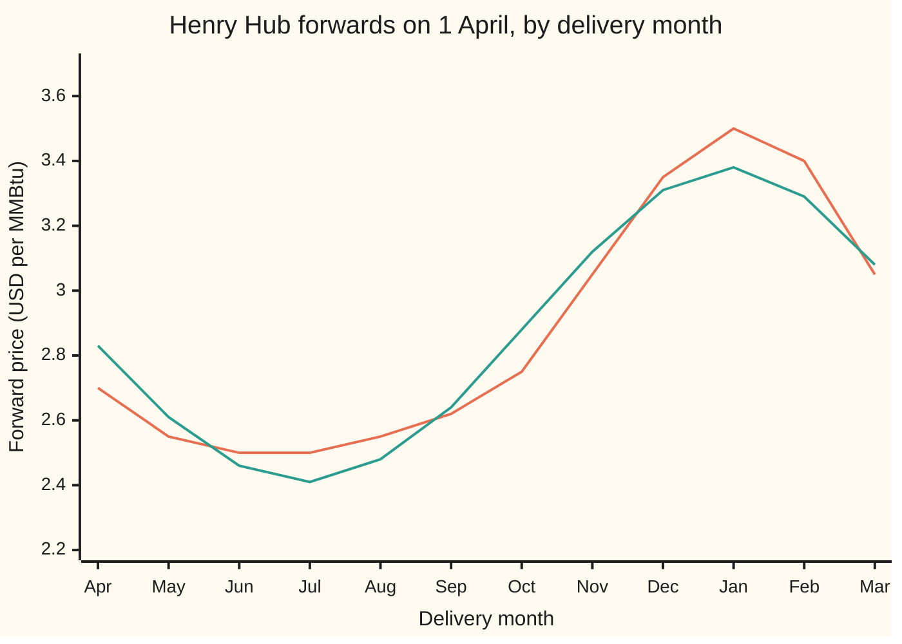
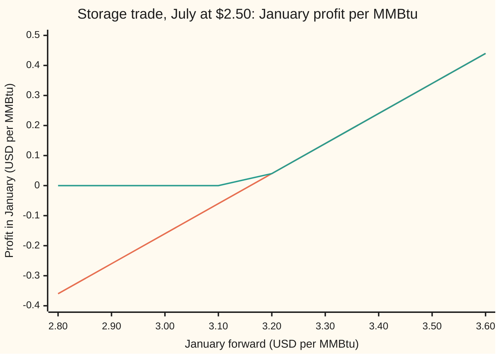

# Seasonal curves: natural gas forwards that hump every winter, and the storage trade that keeps summer-to-winter spreads bounded

[Syllabus](../../../SYLLABUS.md) → [Financial mathematics](../README.md) → [Commodity forwards - carry, storage, convenience yield and the curve](../README.md#s25) → Seasonal curves

---

## General Overview

Natural gas at Henry Hub, the Louisiana pipeline junction where United States gas is priced, is quoted in dollars per MMBtu (one million British thermal units, about a thousand cubic feet of gas). On 1 April a trader can lock in a price today for gas delivered in any later month. That price is a **forward**. July gas costs **$2.50**. January gas costs **$3.50**.

Nothing about the gas differs. The dates do. Houses in the northern United States burn gas for heat in winter, and the pipelines cannot carry enough in January to meet the peak. So the price for winter delivery sits above the price for summer delivery, every year, and the full twelve-month list of forwards (the **strip**) rises into a hump each winter and sinks each summer.

Two questions follow. First, how to describe that hump with a few numbers, so that any month can be priced from them. Second, how high the hump can go. The answer to the second is a warehouse. A salt cavern or an emptied gas field can take gas in during July and give it back in January. If the space, the pumping and the interest cost **$0.66** per MMBtu in all, then January cannot sit more than $0.66 above July without handing free money to anyone with storage. A $1.00 gap is a trade. A $0.30 gap is not a trade in either direction, and the reason it is not says the most about this card.

**A seasonal forward curve is a level times a yearly shape; storage caps how far winter can rise above summer, at the cost of storing plus interest, and nothing caps how far it can fall.**

**What kind of fact this is:** a model for the shape (a fit that describes the curve well, not a law), and inside it a theorem: the one-sided storage bound, proved on this card in Why it works.

### The picture: one gas year, quoted and fitted

The illustrative strip below was built for this card around the July and January quotes; it is not a copy of any day's market. The fitted curve is the level-times-cosine shape of The formula.



Orange: the quoted strip. Green: the fitted level-times-cosine curve. The fit follows the hump to within 14 cents everywhere, and misses in a telling way: real gas is flat all summer and sharp in winter, while a cosine is equally round at both ends.

---

## The formula

Two formulas, one for each question. Notation first, in words. Time $t$ is measured in years from 1 April, so July delivery is $t = 0.25$ and January is $t = 0.75$. The cosine of an angle (the horizontal coordinate of a point that far round a circle of radius 1) repeats every full turn, and a full turn is 2π radians, so 2π times a time in years turns once per year.

**The shape.**

$$F(t) = L\, e^{\beta \cos(2\pi (t - t_0))}$$

**Read it aloud:** the forward for delivery at time t is a level, stretched up by as much as a factor e to the beta at the peak date and squeezed down by the same factor half a year away.

Taking logs turns it into a sum, and expanding the cosine of a difference makes it a straight-line fit:

$$\ln F(t) = a + A\cos(2\pi t) + B\sin(2\pi t), \qquad \beta = \sqrt{A^2 + B^2}, \qquad 2\pi t_0 = \text{the angle whose cosine and sine are } A/\beta,\ B/\beta.$$

**The bound.**

$$F_w - F_s \;\le\; c + F_s\,(e^{r\tau} - 1)$$

**Read it aloud:** winter can sit above summer by at most the cost of storing the gas plus the interest on the money paid for it in summer.

| Symbol | Plain meaning | In our example | Push it up and the answer… |
| --- | --- | --- | --- |
| $F(t)$ | the forward price today for gas delivered at time $t$ | $2.50 July, $3.50 January | — |
| $t$, $m$ | delivery date in years after 1 April; $m$ counts months from 0 (April) to 11 (March), so $t = m/12$ | 0.25 July, 0.75 January | — |
| $L$ | the **level**: the curve's typical price, with the season taken out | $2.85 | every month rises in proportion |
| $\beta$ | the **amplitude**: how far the log price swings above and below the level. Say "beta". | 0.168 | winter higher, summer lower, spread wider |
| $t_0$ | the **peak date**, where the shape is highest | 0.743, within three days of the January slot | the hump slides later in the year |
| $a$, $A$, $B$ | the three numbers the fit finds: the log of the level, and the cosine and sine parts of the swing | 1.049, −0.0074, −0.167 | — |
| $F_s$ | the summer (July) forward | $2.50 | the cap rises by the extra interest |
| $F_w$ | the winter (January) forward | $3.50 | the storage trade earns more |
| $c$ | **all-in storage cost**: injection (pumping in), space for the season, withdrawal (pumping out), paid in January | $0.60: space $0.50, pumping $0.05 each way | the cap rises dollar for dollar |
| $r$ | the interest rate, continuously compounded | 5% | the cap rises |
| $\tau$ | time from summer to winter delivery. Say "tau". | 0.5 years | the cap rises |
| $e^{r\tau}$ | what $1 borrowed in July has grown to by January | 1.0253 | — |

The pair $A$, $B$ and the pair $\beta$, $2\pi t_0$ are the same information in two forms. $A$ and $B$ are the two legs of a right triangle, $\beta$ is its hypotenuse and $2\pi t_0$ is its angle ([Sine, cosine and tangent](../../05-Geometry%20and%20trig/03-Trigonometry/01-right-triangle-trigonometry.md)). The legs are easy to fit. The hypotenuse and angle are easy to read.

### When it holds

- **The shape is deterministic and repeats yearly.** Weather, not the calendar, drives demand. A mild winter shrinks the hump that year, and a single fixed $\beta$ cannot follow it; refit the shape from each day's strip.
- **One cosine is enough.** Real gas has a flat summer and a sharp winter, and one cosine misses April and October by 13 cents here. A second cosine turning twice a year fixes most of that; the bound below does not use the shape at all.
- **Storage can be bought at the stated cost.** The cap is $c$ plus interest only for someone with access to space at $c$. When every cavern is full, the marginal barrel of space costs more and the cap rises with it.
- **Money can be borrowed and lent at $r$.** A trader who funds at 10% faces a cap of $0.73, not $0.66.
- **The bound needs no model.** It holds whatever shape the curve has, as long as the storage and funding costs are right.

---

## Why it works

### Step 0: storage is a machine that turns July gas into January gas

A forward contract fixes a price today for delivery later. Storage turns a July delivery into a January delivery, at a known cost. So anyone with storage can manufacture a January forward out of a July forward. January therefore cannot trade above what the machine charges: the July price, grown at interest, plus the fees. The machine only runs one way. Gas can be put in store and taken out later; it cannot be taken out of January and handed over in July. That one-way machine is why the bound is one-sided.

### Step 1: write down the storage trade

On 1 April, with no money changing hands:

1. Agree to buy gas for July delivery at $F_s$ = $2.50.
2. Agree to sell the same gas for January delivery at $F_w$ = $3.50.
3. Lease storage space for the season at an all-in $c$ = $0.60, payable in January.

In July, borrow $2.50, take the gas and pump it in. In January, pump it out, deliver it, collect $3.50, repay the loan with interest and pay the storage bill. Every amount was fixed on 1 April. What is left in January is

$$F_w - F_s\,e^{r\tau} - c = 3.50 - 2.5633 - 0.60 = 0.3367.$$

### Step 2: no free money means the leftover cannot be positive

The trade costs nothing on 1 April and carries no risk after: every price, fee and rate was locked. A positive leftover is money from nothing. Storage owners would run the trade until buying July pushed its forward up and selling January pushed its forward down. So in a market without such gifts, $F_w - F_s e^{r\tau} - c \le 0$, which rearranges to the bound:

$$F_w - F_s \le c + F_s\,(e^{r\tau} - 1) = 0.60 + 0.0633 = 0.6633.$$

The second road to the same number makes no rearrangement. It values the trade's cash flows from 1 April, paying $2.50 discounted from July and receiving the January price less the fee discounted from January, and searches by halving intervals for the January price at which that value is exactly zero. The search lands on $3.1633, a spread of $0.6633, matching the formula to nine decimals.

### Step 3: why the bound does not run backwards

A $0.30 spread puts January at $2.80. The storage trade then loses $0.3633 in January, so no one runs it. The mirror trade would sell July gas, buy January gas, and pocket the $0.60 fee plus interest that storage would have cost. That mirror trade needs gas in July to sell. Someone without gas would have to borrow it, and no deep market lends gas for six months the way banks lend gold; pipeline park-and-loan services are small and short ([Gold forward](01-gold-forward-and-the-lease-rate.md)). Only someone already holding gas in store can run it, and that inventory runs out.

So nothing pins the spread from below. It can sit at $0.30, at zero, or below zero, when gas held in July is worth more than gas promised for January. That extra worth of holding the physical gas is the convenience yield ([Convenience yield](03-convenience-yield-implied-by-the-forward.md)). The same one-sided ceiling appears for any storable good ([Storage and the carry ceiling](02-storage-cost-and-the-carry-ceiling.md)); gas makes it seasonal.

### Step 4: why a level times a shape

Seasonal premiums scale with price. When gas is $5, the winter premium is a larger number of dollars than when gas is $2.50, because the same cold snap bids up a dearer fuel. A multiplicative shape captures that: every month is the level times a factor that depends only on the calendar. Logs turn the product into a sum, $\ln F = \ln L + \beta\cos(2\pi(t - t_0))$.

The cosine of a difference splits into two pieces ([Trig identities](../../05-Geometry%20and%20trig/03-Trigonometry/03-trig-identities.md)):

$$\beta\cos(2\pi t - 2\pi t_0) = \underbrace{\beta\cos(2\pi t_0)}_{A}\cos(2\pi t) + \underbrace{\beta\sin(2\pi t_0)}_{B}\sin(2\pi t).$$

The unknowns $A$ and $B$ now sit outside the cosine and sine, multiplying known numbers. Fitting them is a straight-line fit with two slopes, solved by least squares: choose $a$, $A$ and $B$ to make the sum of squared misses in the log prices as small as possible.

### Step 5: twelve evenly spaced months make the fit a set of averages

For monthly points spread evenly round the year, the cosine column, the sine column and the constant column are **orthogonal**: the sum of the products of any two different columns is zero. Least squares then splits into three separate problems, one per column, and each answer is an average:

$$a = \tfrac{1}{12}\sum_m \ln F_m, \qquad A = \tfrac{2}{12}\sum_m \ln F_m \cos(2\pi m/12), \qquad B = \tfrac{2}{12}\sum_m \ln F_m \sin(2\pi m/12).$$

Here $m$ runs over the months 0 (April) to 11 (March). For this strip, $a = 1.049048$, so the level is $e^{1.049} = 2.85$. $A = -0.0074$ and $B = -0.1674$. The hypotenuse is $\beta = 0.1676$. The angle lands at $t_0 = 0.743$ years, 8.92 months after 1 April: the January slot, within three days.

<details>
<summary>Detailed proof: why the three columns are orthogonal over twelve months</summary>

Write $\theta_m = 2\pi m/12$ for $m = 0, \dots, 11$. These are twelve angles evenly spaced round a full turn.

1. **Sum of cosines and of sines is zero.** The twelve points $(\cos\theta_m, \sin\theta_m)$ sit at the corners of a regular twelve-sided shape centred on the origin. Turning the shape by one step, $2\pi/12$, maps it onto itself, so it also maps the sum of the twelve points onto itself. The only point that a turn leaves fixed is the origin. So $\sum\cos\theta_m = 0$ and $\sum\sin\theta_m = 0$: the constant column is orthogonal to both others.
2. **Sum of cosine times sine is zero.** $\cos\theta\sin\theta = \tfrac12\sin 2\theta$, and the angles $2\theta_m$ are six evenly spaced angles visited twice, so by part 1 their sines sum to zero.
3. **Sum of squares is six.** $\cos^2\theta = \tfrac12(1 + \cos 2\theta)$. Summing, the cosines of $2\theta_m$ vanish by the same argument, leaving $\tfrac12 \times 12 = 6$. The sine squares also sum to 6.

With these, the least-squares equations have off-diagonal entries of zero and diagonal entries 12, 6 and 6. Each equation then solves alone: $12a = \sum \ln F_m$, $6A = \sum \ln F_m\cos\theta_m$, $6B = \sum \ln F_m \sin\theta_m$. These are the averages of Step 5. The code solves the full three-by-three system by elimination as well, without using orthogonality, and gets the same numbers to twelve decimals.

</details>

### Step 6: the level moves, the shape stays

A cold forecast lifts the whole strip. In this model, that is a change in $L$ with $\beta$ and $t_0$ fixed. The spread is then $L$ times the gap between the winter and summer factors, so it grows in proportion to the level. The cap does not: $c$ is a fee in dollars, and only the interest term grows with the July price. Lift the level by 20% and the $1.00 spread becomes $1.20 while the cap moves from $0.6633 to only $0.6759; the locked profit rises from $0.3367 to $0.5241. High prices make storage worth more.

The alternative road to a curve's shape starts from the spot price instead: a spot that is pulled back toward a seasonal mean produces a forward curve with the same hump, damped at long dates ([A spot price that reverts](06-mean-reverting-spot-and-the-futures-curve.md)).

---

## Worked numbers, by hand

July $2.50, January $3.50, storage $0.60 all-in paid in January, interest 5%, six months apart.

| Step | Arithmetic | Value |
| --- | --- | --- |
| growth of $1 from July to January | $e^{0.05 \times 0.5}$ | 1.0253 |
| interest on the July gas | $2.50 \times 0.0253$ | $0.0633 |
| **cap on the spread** | $0.60 + 0.0633$ | **$0.6633** |
| January break-even price | $2.50 + 0.6633$ | $3.1633 |
| quoted spread | $3.50 − 2.50$ | $1.00 |
| profit locked for January | $3.50 − 2.5633 − 0.60$ | **$0.3367** |
| the same profit valued on 1 April | $0.3367 \times e^{-0.05 \times 0.75}$ | $0.3243 |
| on a million MMBtu of space | $0.3367 \times 1{,}000{,}000$ | $336,712 |
| low case, January at $2.80 | $2.80 − 2.5633 − 0.60$ | −$0.3633: no trade |

The shape, from the same strip:

| Step | Arithmetic | Value |
| --- | --- | --- |
| mean log price, $a$ | average of the twelve logs | 1.0490 |
| level, $L$ | $e^{1.0490}$ | $2.8549 |
| amplitude, $\beta$ | $\sqrt{0.0074^2 + 0.1674^2}$ | 0.1676 |
| peak date, $t_0$ | angle of the triangle, over one full turn | 0.743 years |
| peak-to-trough ratio | $e^{2 \times 0.1676}$ | 1.398 |
| fitted July to January spread | $3.38 − 2.41$ | $0.9605 |

A storage owner with a million MMBtu of space who sees this strip on 1 April locks $336,712 for January, $0.3243 per MMBtu in today's money, with no view on the weather. At a $0.30 spread the same owner leaves the cavern empty; nobody else can profit either.

### What breaks if you drop a piece

| Mistake | Comes out at | What went wrong |
| --- | --- | --- |
| Forget the interest | cap $0.60 | The July purchase ties up $2.50 for six months; that money has a price |
| Count the space fee only, $0.50, not injection and withdrawal | cap $0.5633 | Pumping in and out costs $0.05 each way; trades between $0.56 and $0.66 look profitable and lose |
| Run the bound backwards at a $0.30 spread | a phantom $0.3633 profit | The reverse trade sells July gas nobody has and nobody lends |
| Trade on the fitted spread instead of the quoted one | $0.9605 in place of $1.00 | The one-cosine fit misses January by 12 cents; the contracts pay on the quotes |

---

## Code, from first principles, and it actually runs

The code fits the shape by two roads and finds the cap by two roads, then checks the storage decision by a third. Fit road 1 uses the orthogonal averages of Step 5. Fit road 2 builds the full least-squares equations and solves them by elimination, never assuming orthogonality. Cap road 1 is the formula. Cap road 2 values the trade's cash flows from 1 April and finds the break-even January price by bisection (halving an interval until it is tiny). Road 3 tries every inject-then-withdraw pair of months on the whole strip and must pick July to January on its own. Every "what breaks" and "try changing" number is printed, and so is every chart point.

### Python

```python
# Seasonal gas curve -- the check behind the card.  Standard library only.
# A 12-month Henry Hub strip (USD/MMBtu, illustrative) is fitted to a level times
# a yearly cosine shape by two roads, then the summer-to-winter storage bound is
# found by a formula and by pricing the trade's cash flows and searching.
from math import log, exp, cos, sin, atan2, pi, sqrt

MONTHS = ["Apr", "May", "Jun", "Jul", "Aug", "Sep", "Oct", "Nov", "Dec", "Jan", "Feb", "Mar"]
STRIP = [2.70, 2.55, 2.50, 2.50, 2.55, 2.62, 2.75, 3.05, 3.35, 3.50, 3.40, 3.05]
r, c, FS, FW = 0.05, 0.60, 2.50, 3.50        # rate, all-in storage cost, July and January forwards
TS, TW = 3 / 12, 9 / 12                       # delivery times in years from 1 April
TAU = TW - TS
y = [log(f) for f in STRIP]
th = [2 * pi * m / 12 for m in range(12)]

# Road 1 to the shape: over 12 evenly spaced months cos and sin are orthogonal, so each
# coefficient is an average (a discrete Fourier sum).
a1 = sum(y) / 12
A1 = 2 / 12 * sum(v * cos(t) for v, t in zip(y, th))
B1 = 2 / 12 * sum(v * sin(t) for v, t in zip(y, th))

# Road 2: ordinary least squares, normal equations solved by Gaussian elimination.
def solve(M, v):
    n = len(v); M = [row[:] + [v[i]] for i, row in enumerate(M)]
    for k in range(n):
        p = max(range(k, n), key=lambda i: abs(M[i][k])); M[k], M[p] = M[p], M[k]
        for i in range(k + 1, n):
            f = M[i][k] / M[k][k]
            M[i] = [M[i][j] - f * M[k][j] for j in range(n + 1)]
    x = [0.0] * n
    for i in reversed(range(n)):
        x[i] = (M[i][n] - sum(M[i][j] * x[j] for j in range(i + 1, n))) / M[i][i]
    return x
X = [[1.0, cos(t), sin(t)] for t in th]
XtX = [[sum(row[i] * row[j] for row in X) for j in range(3)] for i in range(3)]
Xty = [sum(row[i] * v for row, v in zip(X, y)) for i in range(3)]
a2, A2, B2 = solve(XtX, Xty)

L = exp(a1)
beta = sqrt(A1 * A1 + B1 * B1)                   # the hypotenuse of A and B
t0 = (atan2(B1, A1) / (2 * pi)) % 1.0            # peak time, years from 1 April
fit = [L * exp(beta * cos(2 * pi * (m / 12 - t0))) for m in range(12)]

# The storage bound.  Road 1: the formula.
cap1 = c + FS * (exp(r * TAU) - 1)
# Road 2: value today of "buy July, store, sell January" from its cash flows alone,
# then bisection for the January price at which the trade is worth exactly zero.
def trade_pv(fs, fw, cost, ts, tw):
    return -fs * exp(-r * ts) + (fw - cost) * exp(-r * tw)
lo, hi = FS, FS + 5.0
for _ in range(200):
    mid = 0.5 * (lo + hi)
    lo, hi = (mid, hi) if trade_pv(FS, mid, c, TS, TW) < 0 else (lo, mid)
cap2 = 0.5 * (lo + hi) - FS

profit_jan = FW - FS * exp(r * TAU) - c          # locked in, paid in January
profit_pv = trade_pv(FS, FW, c, TS, TW)          # the same trade valued today
fw_low = FS + 0.30
loss_low = fw_low - FS * exp(r * TAU) - c
phantom = FS * exp(r * TAU) + c - fw_low         # the reverse trade, if gas could be borrowed

# Road 3: every storage cycle on the whole strip, inject in month i, withdraw in month j,
# the season's space leased for the flat 0.60; the search must find July -> January.
best = max(((trade_pv(STRIP[i], STRIP[j], c, i / 12, j / 12), i, j)
            for i in range(12) for j in range(i + 1, 12)))

fitted_spread = fit[9] - fit[3]
level_up = 1.2 * FW - 1.2 * FS - (c + 1.2 * FS * (exp(r * TAU) - 1))

print(f"{'fit road 1  a, A, B':<30} {a1:10.6f} {A1:10.6f} {B1:10.6f}")
print(f"{'fit road 2  a, A, B':<30} {a2:10.6f} {A2:10.6f} {B2:10.6f}")
print(f"{'level L = e^a':<30} {L:10.4f}")
print(f"{'amplitude beta':<30} {beta:10.4f}")
print(f"{'peak t0, years from 1 Apr':<30} {t0:10.4f}  = month {12 * t0:.2f}")
print(f"{'winter/summer shape ratio':<30} {exp(2 * beta):10.4f}")
print("month   strip    fit   miss")
for m in range(12):
    print(f"{MONTHS[m]:<5} {STRIP[m]:7.2f} {fit[m]:6.2f} {STRIP[m] - fit[m]:+6.2f}")
print(f"{'largest miss':<30} {max(abs(s - f) for s, f in zip(STRIP, fit)):10.4f}")
print(f"{'fitted Jul -> Jan spread':<30} {fitted_spread:10.4f}")
print(f"{'quoted spreads, high and low':<30} {FW - FS:10.4f} {fw_low - FS:10.4f}")
print(f"{'growth e^(r tau), July -> Jan':<30} {exp(r * TAU):10.4f}")
print(f"{'July 2.50 grown to January':<30} {FS * exp(r * TAU):10.4f}")
print(f"{'interest on July gas':<30} {FS * (exp(r * TAU) - 1):10.4f}")
print(f"{'cap road 1  formula':<30} {cap1:10.4f}")
print(f"{'cap road 2  cash flows+search':<30} {cap2:10.4f}")
print(f"{'January break-even price':<30} {FS + cap1:10.4f}")
print(f"{'spread 1.00: profit in Jan':<30} {profit_jan:10.4f}")
print(f"{'spread 1.00: value today':<30} {profit_pv:10.4f}")
print(f"{'  x 1,000,000 MMBtu, in Jan':<30} {profit_jan * 1e6:10.0f}")
print(f"{'spread 0.30: storage trade':<30} {loss_low:10.4f}")
print(f"{'best cycle on the strip':<30} {MONTHS[best[1]]} -> {MONTHS[best[2]]}  {best[0]:.4f}")
print(f"{'wrong: no interest, cap':<30} {c:10.4f}")
print(f"{'wrong: storage fee only, cap':<30} {0.50 + FS * (exp(r * TAU) - 1):10.4f}")
print(f"{'wrong: reverse trade on 0.30':<30} {phantom:10.4f}")
print(f"{'try: level x 1.2, spread, cap':<30} {1.2 * (FW - FS):10.4f} {c + 1.2 * FS * (exp(r * TAU) - 1):10.4f}")
print(f"{'try: level x 1.2, profit Jan':<30} {level_up:10.4f}")
print(f"{'try: r = 10%, cap':<30} {c + FS * (exp(0.10 * TAU) - 1):10.4f}")
print(f"{'try: c = 1.10, spread 1.00 P&L':<30} {FW - FS * exp(r * TAU) - 1.10:10.4f}")
print("chart, Jan price  " + " ".join(f"{2.8 + 0.1 * k:5.2f}" for k in range(9)))
print("chart, trade P&L  " + " ".join(f"{2.8 + 0.1 * k - FS - cap1:5.2f}" for k in range(9)))
print("chart, take-it    " + " ".join(f"{max(2.8 + 0.1 * k - FS - cap1, 0.0):5.2f}" for k in range(9)))

assert max(abs(u - v) for u, v in zip((a1, A1, B1), (a2, A2, B2))) < 1e-12, "two fits agree"
assert abs(cap1 - cap2) < 1e-9, "formula cap equals the searched break-even"
assert abs(profit_pv * exp(r * TW) - profit_jan) < 1e-12, "today's value grows to the January profit"
assert (best[1], best[2]) == (3, 9), "the best cycle on the strip is the summer-to-winter one"
assert max(abs(exp(a1 + A1 * cos(t) + B1 * sin(t)) - f) for t, f in zip(th, fit)) < 1e-12, "legs form equals level-and-peak form"
assert fw_low - FS < cap2 < FW - FS, "0.30 sits under the searched cap, 1.00 over it"
print("ALL CHECKS PASS")
```

**Ran 2026-09-27 on macOS, Python 3.14.6, standard library only. All checks passed. Output, pasted from the run:**

```
fit road 1  a, A, B              1.049048  -0.007383  -0.167430
fit road 2  a, A, B              1.049048  -0.007383  -0.167430
level L = e^a                      2.8549
amplitude beta                     0.1676
peak t0, years from 1 Apr          0.7430  = month 8.92
winter/summer shape ratio          1.3982
month   strip    fit   miss
Apr      2.70   2.83  -0.13
May      2.55   2.61  -0.06
Jun      2.50   2.46  +0.04
Jul      2.50   2.41  +0.09
Aug      2.55   2.48  +0.07
Sep      2.62   2.64  -0.02
Oct      2.75   2.88  -0.13
Nov      3.05   3.12  -0.07
Dec      3.35   3.31  +0.04
Jan      3.50   3.38  +0.12
Feb      3.40   3.29  +0.11
Mar      3.05   3.08  -0.03
largest miss                       0.1339
fitted Jul -> Jan spread           0.9605
quoted spreads, high and low       1.0000     0.3000
growth e^(r tau), July -> Jan      1.0253
July 2.50 grown to January         2.5633
interest on July gas               0.0633
cap road 1  formula                0.6633
cap road 2  cash flows+search      0.6633
January break-even price           3.1633
spread 1.00: profit in Jan         0.3367
spread 1.00: value today           0.3243
  x 1,000,000 MMBtu, in Jan        336712
spread 0.30: storage trade        -0.3633
best cycle on the strip        Jul -> Jan  0.3243
wrong: no interest, cap            0.6000
wrong: storage fee only, cap       0.5633
wrong: reverse trade on 0.30       0.3633
try: level x 1.2, spread, cap      1.2000     0.6759
try: level x 1.2, profit Jan       0.5241
try: r = 10%, cap                  0.7282
try: c = 1.10, spread 1.00 P&L    -0.1633
chart, Jan price   2.80  2.90  3.00  3.10  3.20  3.30  3.40  3.50  3.60
chart, trade P&L  -0.36 -0.26 -0.16 -0.06  0.04  0.14  0.24  0.34  0.44
chart, take-it     0.00  0.00  0.00  0.00  0.04  0.14  0.24  0.34  0.44
ALL CHECKS PASS
```

### Rust

Same inputs, same labels. Rust has `atan2` and `rem_euclid` built into its numbers; the elimination and the search are written out.

```rust
// Seasonal gas curve -- the same check as seasonality_and_the_gas_curve_check.py, in Rust.
// Standard library only, no crates.  The strip is fitted to a level times a yearly
// cosine shape by two roads; the storage bound is found by a formula and by pricing
// the trade's cash flows and searching.
use std::f64::consts::PI;

const MONTHS: [&str; 12] = ["Apr", "May", "Jun", "Jul", "Aug", "Sep", "Oct", "Nov", "Dec", "Jan", "Feb", "Mar"];
const STRIP: [f64; 12] = [2.70, 2.55, 2.50, 2.50, 2.55, 2.62, 2.75, 3.05, 3.35, 3.50, 3.40, 3.05];
const R: f64 = 0.05;
const C: f64 = 0.60;
const FS: f64 = 2.50;
const FW: f64 = 3.50;
const TS: f64 = 3.0 / 12.0;
const TW: f64 = 9.0 / 12.0;

// Gaussian elimination with partial pivoting on an augmented 3 x 4 system.
fn solve(mut m: [[f64; 4]; 3]) -> [f64; 3] {
    for k in 0..3 {
        let mut p = k;
        for i in k..3 { if m[i][k].abs() > m[p][k].abs() { p = i; } }
        m.swap(k, p);
        for i in (k + 1)..3 {
            let f = m[i][k] / m[k][k];
            for j in 0..4 { m[i][j] -= f * m[k][j]; }
        }
    }
    let mut x = [0.0; 3];
    for i in (0..3).rev() {
        let mut s = m[i][3];
        for j in (i + 1)..3 { s -= m[i][j] * x[j]; }
        x[i] = s / m[i][i];
    }
    x
}

// Value today of: pay fs at ts for gas, deliver it at tw for fw, pay the storage cost at tw.
fn trade_pv(fs: f64, fw: f64, cost: f64, ts: f64, tw: f64) -> f64 {
    -fs * (-R * ts).exp() + (fw - cost) * (-R * tw).exp()
}

fn row(label: &str, v: f64) { println!("{:<30} {:10.4}", label, v); }

fn main() {
    let tau = TW - TS;
    let y: Vec<f64> = STRIP.iter().map(|f| f.ln()).collect();
    let th: Vec<f64> = (0..12).map(|m| 2.0 * PI * m as f64 / 12.0).collect();

    // Road 1 to the shape: orthogonal sums (a discrete Fourier sum).
    let a1 = y.iter().sum::<f64>() / 12.0;
    let aa1 = 2.0 / 12.0 * (0..12).map(|m| y[m] * th[m].cos()).sum::<f64>();
    let bb1 = 2.0 / 12.0 * (0..12).map(|m| y[m] * th[m].sin()).sum::<f64>();

    // Road 2: least squares by the normal equations.
    let mut aug = [[0.0; 4]; 3];
    for m in 0..12 {
        let x = [1.0, th[m].cos(), th[m].sin()];
        for i in 0..3 {
            for j in 0..3 { aug[i][j] += x[i] * x[j]; }
            aug[i][3] += x[i] * y[m];
        }
    }
    let [a2, aa2, bb2] = solve(aug);

    let l = a1.exp();
    let beta = (aa1 * aa1 + bb1 * bb1).sqrt();
    let t0 = (bb1.atan2(aa1) / (2.0 * PI)).rem_euclid(1.0);
    let fit: Vec<f64> = (0..12).map(|m| l * (beta * (2.0 * PI * (m as f64 / 12.0 - t0)).cos()).exp()).collect();

    // The storage bound.  Road 1: the formula.
    let cap1 = C + FS * ((R * tau).exp() - 1.0);
    // Road 2: bisection for the January price at which the trade is worth zero today.
    let (mut lo, mut hi) = (FS, FS + 5.0);
    for _ in 0..200 {
        let mid = 0.5 * (lo + hi);
        if trade_pv(FS, mid, C, TS, TW) < 0.0 { lo = mid; } else { hi = mid; }
    }
    let cap2 = 0.5 * (lo + hi) - FS;

    let profit_jan = FW - FS * (R * tau).exp() - C;
    let profit_pv = trade_pv(FS, FW, C, TS, TW);
    let fw_low = FS + 0.30;
    let loss_low = fw_low - FS * (R * tau).exp() - C;
    let phantom = FS * (R * tau).exp() + C - fw_low;

    // Road 3: every storage cycle on the strip, the season's space leased for a flat 0.60.
    let mut best = (f64::MIN, 0usize, 0usize);
    for i in 0..12 {
        for j in (i + 1)..12 {
            let v = trade_pv(STRIP[i], STRIP[j], C, i as f64 / 12.0, j as f64 / 12.0);
            if v > best.0 { best = (v, i, j); }
        }
    }

    let fitted_spread = fit[9] - fit[3];
    let level_up = 1.2 * FW - 1.2 * FS - (C + 1.2 * FS * ((R * tau).exp() - 1.0));

    println!("{:<30} {:10.6} {:10.6} {:10.6}", "fit road 1  a, A, B", a1, aa1, bb1);
    println!("{:<30} {:10.6} {:10.6} {:10.6}", "fit road 2  a, A, B", a2, aa2, bb2);
    row("level L = e^a", l);
    row("amplitude beta", beta);
    println!("{:<30} {:10.4}  = month {:.2}", "peak t0, years from 1 Apr", t0, 12.0 * t0);
    row("winter/summer shape ratio", (2.0 * beta).exp());
    println!("month   strip    fit   miss");
    for m in 0..12 {
        println!("{:<5} {:7.2} {:6.2} {:+6.2}", MONTHS[m], STRIP[m], fit[m], STRIP[m] - fit[m]);
    }
    let miss = (0..12).map(|m| (STRIP[m] - fit[m]).abs()).fold(0.0, f64::max);
    row("largest miss", miss);
    row("fitted Jul -> Jan spread", fitted_spread);
    println!("{:<30} {:10.4} {:10.4}", "quoted spreads, high and low", FW - FS, fw_low - FS);
    row("growth e^(r tau), July -> Jan", (R * tau).exp());
    row("July 2.50 grown to January", FS * (R * tau).exp());
    row("interest on July gas", FS * ((R * tau).exp() - 1.0));
    row("cap road 1  formula", cap1);
    row("cap road 2  cash flows+search", cap2);
    row("January break-even price", FS + cap1);
    row("spread 1.00: profit in Jan", profit_jan);
    row("spread 1.00: value today", profit_pv);
    println!("{:<30} {:10.0}", "  x 1,000,000 MMBtu, in Jan", profit_jan * 1e6);
    row("spread 0.30: storage trade", loss_low);
    println!("{:<30} {} -> {}  {:.4}", "best cycle on the strip", MONTHS[best.1], MONTHS[best.2], best.0);
    row("wrong: no interest, cap", C);
    row("wrong: storage fee only, cap", 0.50 + FS * ((R * tau).exp() - 1.0));
    row("wrong: reverse trade on 0.30", phantom);
    println!("{:<30} {:10.4} {:10.4}", "try: level x 1.2, spread, cap", 1.2 * (FW - FS), C + 1.2 * FS * ((R * tau).exp() - 1.0));
    row("try: level x 1.2, profit Jan", level_up);
    row("try: r = 10%, cap", C + FS * ((0.10 * tau).exp() - 1.0));
    row("try: c = 1.10, spread 1.00 P&L", FW - FS * (R * tau).exp() - 1.10);
    let grid: Vec<f64> = (0..9).map(|k| 2.8 + 0.1 * k as f64).collect();
    let fmt = |f: &dyn Fn(f64) -> f64| grid.iter().map(|w| format!("{:5.2}", f(*w))).collect::<Vec<_>>().join(" ");
    println!("chart, Jan price  {}", fmt(&|w| w));
    println!("chart, trade P&L  {}", fmt(&|w| w - FS - cap1));
    println!("chart, take-it    {}", fmt(&|w| (w - FS - cap1).max(0.0)));

    let fit_gap = [(a1, a2), (aa1, aa2), (bb1, bb2)].iter().map(|(u, v)| (u - v).abs()).fold(0.0, f64::max);
    assert!(fit_gap < 1e-12, "two fits agree");
    assert!((cap1 - cap2).abs() < 1e-9, "formula cap equals the searched break-even");
    assert!((profit_pv * (R * TW).exp() - profit_jan).abs() < 1e-12, "today's value grows to the January profit");
    assert!((best.1, best.2) == (3, 9), "the best cycle on the strip is the summer-to-winter one");
    let form_gap = (0..12).map(|m| ((a1 + aa1 * th[m].cos() + bb1 * th[m].sin()).exp() - fit[m]).abs()).fold(0.0, f64::max);
    assert!(form_gap < 1e-12, "legs form equals level-and-peak form");
    assert!(fw_low - FS < cap2 && cap2 < FW - FS, "0.30 sits under the searched cap, 1.00 over it");
    println!("ALL CHECKS PASS");
}
```

**Ran 2026-09-27 on macOS, rustc 1.98.1, no crates. All checks passed. Output, pasted from the run:**

```
fit road 1  a, A, B              1.049048  -0.007383  -0.167430
fit road 2  a, A, B              1.049048  -0.007383  -0.167430
level L = e^a                      2.8549
amplitude beta                     0.1676
peak t0, years from 1 Apr          0.7430  = month 8.92
winter/summer shape ratio          1.3982
month   strip    fit   miss
Apr      2.70   2.83  -0.13
May      2.55   2.61  -0.06
Jun      2.50   2.46  +0.04
Jul      2.50   2.41  +0.09
Aug      2.55   2.48  +0.07
Sep      2.62   2.64  -0.02
Oct      2.75   2.88  -0.13
Nov      3.05   3.12  -0.07
Dec      3.35   3.31  +0.04
Jan      3.50   3.38  +0.12
Feb      3.40   3.29  +0.11
Mar      3.05   3.08  -0.03
largest miss                       0.1339
fitted Jul -> Jan spread           0.9605
quoted spreads, high and low       1.0000     0.3000
growth e^(r tau), July -> Jan      1.0253
July 2.50 grown to January         2.5633
interest on July gas               0.0633
cap road 1  formula                0.6633
cap road 2  cash flows+search      0.6633
January break-even price           3.1633
spread 1.00: profit in Jan         0.3367
spread 1.00: value today           0.3243
  x 1,000,000 MMBtu, in Jan        336712
spread 0.30: storage trade        -0.3633
best cycle on the strip        Jul -> Jan  0.3243
wrong: no interest, cap            0.6000
wrong: storage fee only, cap       0.5633
wrong: reverse trade on 0.30       0.3633
try: level x 1.2, spread, cap      1.2000     0.6759
try: level x 1.2, profit Jan       0.5241
try: r = 10%, cap                  0.7282
try: c = 1.10, spread 1.00 P&L    -0.1633
chart, Jan price   2.80  2.90  3.00  3.10  3.20  3.30  3.40  3.50  3.60
chart, trade P&L  -0.36 -0.26 -0.16 -0.06  0.04  0.14  0.24  0.34  0.44
chart, take-it     0.00  0.00  0.00  0.00  0.04  0.14  0.24  0.34  0.44
ALL CHECKS PASS
```

The two outputs agree line for line at the printed precision.

### The cap in one picture

```
USD per MMBtu, one block = $0.05
storage, all-in        ████████████           $0.60
interest on July gas   █                      $0.06
cap on the spread      █████████████          $0.66
quoted spread, high    ████████████████████   $1.00
quoted spread, low     ██████                 $0.30
```

The high spread overshoots the cap by $0.34, and that overshoot is the trade. The low spread sits under it, and nothing on this card can act on the gap.



Orange: the storage trade's January profit if run regardless. Green: its value to a storage owner who runs it only when it pays, which is never below zero. The kink sits at $3.1633. Storage is an **option** on the spread: a right, not a duty, to run the trade, worth using only above the cap. That is the one-sidedness drawn.

> [!TIP]
> **Try changing**
> Guess the direction first. Then run it.
> - **Lift the level 20%.** Multiply both forwards by 1.2. The spread becomes $1.20, the cap only $0.6759, and the January profit rises from $0.3367 to **$0.5241**.
> - **Double the interest rate** to 10%. The cap rises to **$0.7282**. Dear money makes storage dearer.
> - **Raise the storage cost** to $1.10. The $1.00 spread now loses **$0.1633** in January: no trade, and no free money the other way either.

---

## The usual mistake

> [!warning]
> **Reading the storage cap as a band with two walls.** It has one. Storage caps how far winter can sit above summer; nothing floors how far it can sit below. A $0.30 spread is not a bargain waiting for a trade, and a winter below summer is not a mistake in the quotes. The reverse trade needs gas nobody lends.
>
> Smaller traps:
> - **Leaving out interest.** The cap comes out at $0.60 instead of $0.6633; every spread between the two looks like free money and is not.
> - **Reading the hump as contango.** A curve that rises from July to January and falls again by April is seasonal, not a sign of rising prices. Roll returns on a seasonal curve repeat each year ([Contango and backwardation](04-contango-backwardation-and-roll-yield.md)).
> - **Trading the fit's misses.** The one-cosine curve misses April and October by 13 cents. That is the model's shape error, not a price error.
> - **Using storage cost per month as all-in.** Space is leased for a season and pumping costs are charged each way; add them all before comparing.

---

## Where you meet it in real life

- **Gas storage operators.** Owners of salt caverns and depleted fields sell space for the season. The first number they quote is the spread this card computes: the summer-to-winter gap less costs, locked with forwards on the day the space is sold.
- **Winter strips.** Utilities buy the November-to-March gas strip in summer to lock heating costs; its premium over summer is the hump fitted here.
- **Power.** Electricity cannot be stored at scale, so it has no cap of this kind, and its seasonal spikes are much sharper: [Power that cannot be stored](../26-Options%20on%20commodity%20futures%20and%20spreads/07-electricity-and-the-spark-spread.md).
- **Grain.** Wheat is cheapest at harvest and rises through the year by roughly the cost of storing it: the same ceiling, with an annual cycle driven by supply instead of demand ([Storage and the carry ceiling](02-storage-cost-and-the-carry-ceiling.md)).
- **Petrol and heating oil.** Summer-grade petrol and winter heating oil carry their own humps, bounded by tank storage in the same one-sided way.

> **Say it back**
> Gas forwards rise into a hump every winter because demand for heat peaks then. The strip is fitted as a level times a yearly cosine shape; logs and a cosine-difference expansion make the fit a set of averages. Storage turns July gas into January gas for a fee plus interest, so January cannot sit above July by more than that. The reverse needs gas nobody lends, so there is no floor. A $1.00 spread over a $0.66 cap is a trade; a $0.30 spread is not a trade either way.

---

## What this builds on

- [Contango and backwardation](04-contango-backwardation-and-roll-yield.md): the words for a curve that rises or falls with delivery date, which this card bends into a yearly hump.
- [Storage and the carry ceiling](02-storage-cost-and-the-carry-ceiling.md): the one-sided ceiling that storage puts on a forward, here applied between two future dates.
- [Sine, cosine and tangent](../../05-Geometry%20and%20trig/03-Trigonometry/01-right-triangle-trigonometry.md): cosine, sine and the triangle whose legs are $A$ and $B$ and whose hypotenuse is $\beta$.

## Where this goes next

- [Power that cannot be stored](../26-Options%20on%20commodity%20futures%20and%20spreads/07-electricity-and-the-spark-spread.md): a commodity that cannot be stored, so the cap vanishes, and the spread between power and the gas that makes it becomes the traded object.

Storage made the spread's ceiling a fixed cost; the open question is what a spread is worth when nothing can carry the commodity from one date to another, and that is where electricity starts.

---

## Sources

Verified 2026-09-27: every link below resolves to the named work; the DOI's title and first author match on Crossref.

**Conventions verified 2026-09-27:** Henry Hub prices are quoted in US dollars per million Btu (EIA series page below).

- Geman, Hélyette. *Commodities and Commodity Derivatives: Modeling and Pricing for Agriculturals, Metals and Energy*. Wiley, 2005. [Publisher page](https://www.wiley.com/en-us/Commodities+and+Commodity+Derivatives%3A+Modeling+and+Pricing+for+Agriculturals%2C+Metals+and+Energy-p-9780470012185). The storage argument, convenience yield and the natural gas market.
- Borovkova, Svetlana, and Hélyette Geman. "Seasonal and stochastic effects in commodity forward curves." *Review of Derivatives Research* 9, no. 2 (2006): 167–186. [doi:10.1007/s11147-007-9008-4](https://doi.org/10.1007/s11147-007-9008-4). The forward curve as a level times a deterministic seasonal shape, fitted to gas and power.
- U.S. Energy Information Administration. "Henry Hub Natural Gas Spot Price (Dollars per Million Btu)." [EIA series page](https://www.eia.gov/dnav/ng/hist/rngwhhdm.htm). The quoting unit.
