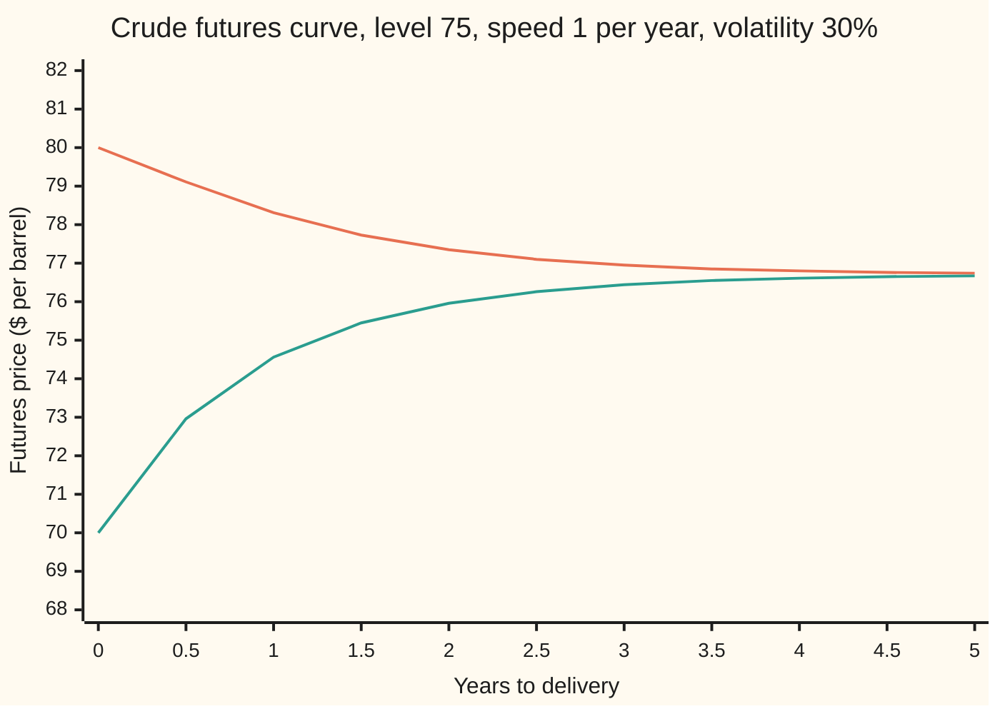

# A spot price that reverts: the Schwartz one-factor model, its futures formula, and why long-dated futures barely move

[Syllabus](../../../SYLLABUS.md) → [Financial mathematics](../README.md) → [Commodity forwards - carry, storage, convenience yield and the curve](../README.md#s25) → A spot price that reverts

---

## General Overview

Crude oil trades at $80 a barrel today. Over recent years it has tended to settle nearer $75. A price above its usual level does not stay there by itself: high prices bring out more drilling and less driving, and both push the price back down. A price below the usual level is pushed up the same way.

A weight hanging on a spring behaves like this. Pull it down and it heads back toward rest, fast when far away, slowly when close. Markets call the pull **mean reversion**: a price drawn back toward a long-run level. From here on that target is called the **level**, and the strength of the pull the **speed**.

The carry cards priced a forward from spot plus the cost of holding the barrel ([Contango and backwardation](04-contango-backwardation-and-roll-yield.md)). That pins the curve only when barrels can be stored and lent freely. When they cannot, the curve needs a model of spot itself. Eduardo Schwartz's 1997 one-factor model is the simplest one that reverts. The logarithm of the price wanders with 30 percent volatility, while a pull of speed 1 per year draws it toward the logarithm of $75.

Out comes a futures price for every delivery date: $78.31 for one year, $76.74 for five. The curve starts at spot, bends toward the level and flattens, and its long end barely moves. If spot falls 12.50 percent, the one-year future falls 4.79 percent and the five-year future 0.09 percent. That damping of volatility with maturity is called the **Samuelson effect**, after Paul Samuelson, who predicted it in 1965.

**When the log of spot is pulled toward a fixed level, each future is a blend of today's log price and that level, with a weight on today that fades at the reversion speed, plus a small term for the spread the shocks leave behind; so long-dated futures sit near one price and hardly move.**

**What kind of fact this is:** a model: the pull toward a fixed level is an assumption that fits many commodity curves well enough, not a law. Inside the model, the futures formula is a theorem, proved on this card in Why it works.

### The picture: two curves that forget where they started



Upper line: spot at $80, a falling curve (backwardation). Lower line: spot at $70, a rising curve (contango). Both head for the same long-run futures price, $76.71. That is above $75, and Step 4 explains the gap. A $10 difference in spot today has shrunk, by year five, to the gap between $76.74 and $76.67.

---

## The formula

Notation first. The model is written in the shorthand of Itô calculus ([Ito's lemma](../../11-Stochastic%20processes%20and%20calculus/06-Ito%20Calculus/02-itos-lemma.md)). $dX_t$ is the change in $X_t$ over a short step of time $dt$. $dW_t$ is a random shock over that step, with average zero and variance $dt$. The model for the log of spot, $X_t = \ln S_t$, is an Ornstein-Uhlenbeck process: a random walk with a pull toward a level ([Mean reversion](../../11-Stochastic%20processes%20and%20calculus/06-Ito%20Calculus/05-ornstein-uhlenbeck-and-cir-processes.md)).

$$dX_t = \kappa\,(a - X_t)\,dt + \sigma\,dW_t$$

**Read it aloud:** over each short step, the log price moves toward the level by a fraction $\kappa\,dt$ of the gap, then takes a random kick of size $\sigma$.

The futures price for delivery in $T$ years, with today's spot $S$:

$$F(T) = \exp\!\Big(e^{-\kappa T}\ln S \;+\; \big(1 - e^{-\kappa T}\big)\,a \;+\; \frac{\sigma^2}{4\kappa}\big(1 - e^{-2\kappa T}\big)\Big)$$

**Read it aloud:** take today's log price and the level, blend them with weight $e^{-\kappa T}$ on today, add half the spread the kicks have built up by delivery, and turn the log back into a price.

| Symbol | Plain meaning | In our example | Push it up and the answer… |
| --- | --- | --- | --- |
| $S$, $S_t$, $S_T$ | spot price of a barrel today, at time $t$, and on delivery day | $80 | short futures rise most, long ones hardly at all |
| $X_t$, $X_T$ | log of spot now and on delivery day, $\ln S_t$ | $\ln 80 = 4.3820$ | same as raising spot |
| $a$ | the level: the long-run value of the log price, so $e^a$ is a price | $\ln 75 = 4.3175$ | long futures rise almost one for one |
| $\kappa$ | the speed: the fraction of the gap closed per year, said "kappa" | 1 per year | the curve reaches the level sooner |
| $\sigma$ | spot volatility: size of the random kicks per year | 30% | every future rises a little: the spread term grows |
| $T$, $t$, $T_i$, $i$ | years to delivery; time running from today; the maturity of quote number $i$ | 1 and 5 | the future moves toward the long-run price |
| $dt$, $dX_t$, $dW_t$, $s$, $dW_s$ | a short step of time; the change in the log price over it; the random shock over it; a past time and the shock then | | |
| $F(T)$, $F_i$ | model futures price for delivery at $T$; a quoted price at maturity $T_i$ | $78.31 at one year | |
| $e^{-\kappa T}$ | weight left on today's spot at delivery | 0.3679 at one year | |
| $m(T)$, $v(T)$ | average and variance of the log price at delivery | $m = 4.3412$ and $v/2 = 0.0195$ at one year | |
| $\sigma_F(T)$ | volatility of the future itself | 11.04% at one year | |

Two helper formulas come out of the same model. The first is the volatility of a future with $T$ years left:

$$\sigma_F(T) = \sigma\,e^{-\kappa T}$$

In words: a future moves by the fraction $e^{-\kappa T}$ of any move in log spot, so its volatility is the spot volatility shrunk by the same fraction. At one year that is 11.04 percent; at five years, 0.20 percent.

The second is where the curve ends, letting $T$ run to infinity:

$$F(\infty) = \exp\!\Big(a + \frac{\sigma^2}{4\kappa}\Big) = 75\,e^{0.0225} = 76.71$$

In words: the price at the level, $e^a$, nudged up by the long-run spread of the log price. A gap between the log price and the level halves every $\ln 2/\kappa$ years, 0.69 years here.

### When it holds

- **The level is fixed.** If the level itself drifts (new reserves, new technology), long-dated futures move far more than 0.20 percent a year. Gibson and Schwartz add a second random factor that gives the long end moves of its own; it is named here, not built.
- **Speed and volatility are constant.** Crude reverts faster in a glut than in a squeeze. With one fixed speed the curve's bend is the same in every regime, and the fit below then blames the strip's noise.
- **The level is the pricing-world level.** A futures price is an average taken in the pricing (risk-neutral) world, where the reward for bearing oil risk is folded into the drift. The $a$ read off futures is that pricing-world level, not a forecast. Treating it as a forecast mistakes a price for a prediction.
- **Interest rates are not random, or at least not tied to oil.** Then a futures price equals the pricing-world average of spot at delivery. If rates move with oil, futures and forwards separate and the formula needs a correction.
- **The kicks are normal, with no jumps.** A supply shock that moves spot sharply overnight is not in the model; the front of the curve then gaps by far more than $\sigma_F$ suggests.

---

## Why it works

### Step 0: a future is the pricing-world average of spot at delivery

A futures contract costs nothing to enter and is settled every day. A position that costs nothing can have no average gain in the pricing world, so the futures price today equals the pricing-world average of the spot price on delivery day. With rates not tied to oil this holds exactly. So pricing the curve means one thing: averaging $S_T$.

The log price $X_T$ turns out to be a sum of many small normal kicks, and a sum of normal kicks is normal. For a normal $X_T$ with average $m(T)$ and variance $v(T)$, the average of $e^{X_T}$ is $e^{m + v/2}$, not $e^{m}$. So only those two numbers are needed.

### Step 1: undo the pull, and the kicks simply add

Multiply $X_t$ by $e^{\kappa t}$. That factor grows at exactly the rate the pull shrinks the gap, so in the product the pull cancels. Itô's product rule gives

$$d\big(e^{\kappa t}X_t\big) = \kappa a\,e^{\kappa t}\,dt + \sigma e^{\kappa t}\,dW_t .$$

Add up both sides from $0$ to $T$ and divide by $e^{\kappa T}$:

$$X_T = e^{-\kappa T}X_0 + \big(1 - e^{-\kappa T}\big)a + \sigma\int_0^T e^{-\kappa (T-s)}\,dW_s .$$

The first two terms are fixed today. The last is a weighted sum of normal kicks, a kick at time $s$ discounted by $e^{-\kappa(T-s)}$: an old kick has had longer to be pulled back.

<details>
<summary>Detailed proof: the product rule step and the variance</summary>

For $Y_t = e^{\kappa t}X_t$, the product rule gives $dY_t = \kappa e^{\kappa t}X_t\,dt + e^{\kappa t}\,dX_t$. The factor $e^{\kappa t}$ has no random part, so there is no extra Itô term. Substituting $dX_t = \kappa(a - X_t)\,dt + \sigma\,dW_t$, the $\kappa e^{\kappa t}X_t\,dt$ terms cancel, leaving $dY_t = \kappa a e^{\kappa t}dt + \sigma e^{\kappa t}dW_t$. Integrating, $Y_T - Y_0 = a(e^{\kappa T} - 1) + \sigma\int_0^T e^{\kappa s}dW_s$. Divide by $e^{\kappa T}$ for $X_T$.

The integral of a fixed function against $dW_s$ is normal with average zero. Its variance is the integral of the function squared (Itô's isometry, [Mean reversion](../../11-Stochastic%20processes%20and%20calculus/06-Ito%20Calculus/05-ornstein-uhlenbeck-and-cir-processes.md)):
$$v(T) = \sigma^2\int_0^T e^{-2\kappa(T-s)}\,ds = \frac{\sigma^2}{2\kappa}\big(1 - e^{-2\kappa T}\big).$$
Then $F(T) = E[e^{X_T}] = e^{m(T) + v(T)/2}$, and $v/2$ is the $\sigma^2(1 - e^{-2\kappa T})/4\kappa$ term.

</details>

### Step 2: the average is a blend

Take the average of $X_T$. The kicks average to zero, so

$$m(T) = e^{-\kappa T}\ln S + \big(1 - e^{-\kappa T}\big)\,a .$$

This is a weighted average of today's log price and the level. At delivery in zero years all the weight is on today. As delivery moves out, the weight on today decays like $e^{-\kappa T}$ and shifts to the level. At one year, 0.3679 of the weight is still on today; at five years, 0.0067.

The same answer follows from a smaller equation. The average obeys $dm/dt = \kappa(a - m)$: the gap between the average and the level shrinks at rate $\kappa$. The check steps that equation forward numerically, without using the exponential solution, as its second road.

### Step 3: the spread grows, then stops

The variance obeys $dv/dt = \sigma^2 - 2\kappa v$. Kicks add $\sigma^2$ per year; the pull removes twice $\kappa$ times the current variance, because it shrinks every deviation and variance is a square. Starting from zero, the variance climbs and levels off where the two balance, at $\sigma^2/2\kappa$. Half of that, 0.0225 here, is the most the spread can add to the log of any future. At one year it has reached 0.0195.

Without reversion the variance of the log grows forever in proportion to $T$. With reversion it stops, so the curve can flatten.

### Step 4: exponentiate, and the long end appears

Put Steps 2 and 3 into $e^{m + v/2}$ and the futures formula at the top of the card is the result. Let $T$ grow. The weight on today dies, $m$ tends to $a$, and $v/2$ tends to $\sigma^2/4\kappa$. The curve flattens at $e^{a + \sigma^2/4\kappa} = 76.71$, not at $e^a = 75$. The level is a level for the *log* price; the average *price* sits higher because a price averaged over a spread of outcomes gains from the high ones more than it loses from the low ones.

### Step 5: why long futures barely move, the Samuelson effect

Tomorrow, the same formula prices the same contract with one day less to run and a new spot. Only one input is random: $\ln S$, and it enters with the coefficient $e^{-\kappa T}$. So any change in log spot changes log $F(T)$ by $e^{-\kappa T}$ times that change. The future's volatility is $\sigma e^{-\kappa T}$. A future's volatility therefore rises as delivery approaches. A five-year contract is nearly asleep at 0.20 percent. Four years later it has one year left and moves at 11.04 percent. In its last weeks it moves almost like spot.

### Step 6: reading the speed and the level off a strip

A market quotes a strip of futures. The model has two numbers to find, $\kappa$ and $a$, with $\sigma$ taken from option prices. The fit chooses them to make the model's log prices as close as possible to the quoted log prices, in the sense of least squares ([Least squares](../../03-Algebra/06-Dot%20Products%20and%20Best%20Fits/04-least-squares.md)):

$$\min_{\kappa,\,a}\ \sum_i \big(\ln F_i - \ln F(T_i)\big)^2 .$$

Before solving, what the problem can and cannot do.

- **Existence.** For any fixed speed, the model's log price is a straight line in $a$ with slope $1 - e^{-\kappa T_i}$. A straight-line least-squares problem always has an answer, and it is unique as long as one maturity is above zero. So the best level exists for every speed, in closed form.
- **Uniqueness in the speed.** What is left is a search over one number, $\kappa$. Nothing guarantees a single minimum for every strip. For a strip that bends steadily toward one level there is one in practice. The check confirms it by two methods that share no steps and start from different places.
- **Boundary cases.** A strip that is flat at spot does not pin the speed: the fit keeps improving as $\kappa$ runs off to zero or to infinity. As $\kappa$ goes to zero the pull vanishes and the level stops mattering, so it cannot be found. As $\kappa$ grows without limit the curve jumps to its long-run value at once, and only $a + \sigma^2/4\kappa$ can be found. At least three maturities that bend are needed to pin two numbers and test the fit.
- **Why $\sigma$ is not fitted too.** At the long end $\sigma$ and $a$ enter only through $a + \sigma^2/4\kappa$. A strip alone can barely tell a higher level from more volatility. Options on the futures can ([Implied vol on a futures option and the commodity smile](../26-Options%20on%20commodity%20futures%20and%20spreads/03-commodity-implied-vol-and-the-call-skew.md)).

The first method computes the best level in closed form for each trial speed, then narrows the interval of speeds by the golden ratio each round. The second, Gauss-Newton, moves both numbers at once along the direction a straight-line approximation of the model says will cut the error, halving the step whenever the error rises. On the strip below, both find a speed of 0.9979 and a level of $74.99, close to the 1 and $75 the strip was built from, a few cents of noise away.

### The other road: a second factor

Gibson and Schwartz (1990) let the convenience yield, the benefit of holding the physical barrel ([Convenience yield](03-convenience-yield-implied-by-the-forward.md)), follow its own mean-reverting process. The one-factor model is the special case where that yield is tied to the price: in carry language it says the convenience yield is high when spot is high, which is what pulls the curve down. With a second factor the long end gets its own random moves. That model is named here and not built.

---

## Worked numbers, by hand

Crude at $80, level $75, speed 1 per year, volatility 30 percent.

| Step | Arithmetic | One year | Five years |
| --- | --- | --- | --- |
| weight on today | $e^{-\kappa T}$ | 0.3679 | 0.0067 |
| log of spot | $\ln 80$ | 4.3820 | 4.3820 |
| the level | $a = \ln 75$ | 4.3175 | 4.3175 |
| blend, $m(T)$ | weight × 4.3820 + (1 − weight) × 4.3175 | 4.3412 | 4.3179 |
| spread term, $v(T)/2$ | $0.30^2\,(1 - e^{-2\kappa T})/4$ | 0.0195 | 0.0225 |
| log of the future | blend + spread term | 4.3607 | 4.3404 |
| **futures price** | $e^{\text{log of the future}}$ | **$78.31** | **$76.74** |
| futures volatility | $0.30 \times$ weight | 11.04% | 0.20% |

A one-year contract prices a barrel at $78.31: most of the way from $80 toward the level. A five-year contract prices it at $76.74, already close to the long end, $76.71.

### What breaks if you drop a piece

| Mistake | Comes out at | What went wrong |
| --- | --- | --- |
| Drop the spread term $v/2$ | $76.80 at one year, $75.03 at five (right: $78.31, $76.74) | The average of a price is above the price at the average log. |
| Let the price revert, not its log: $75 + 5e^{-\kappa T}$ | $76.84 at one year (right: $78.31) | A different model. It also lets prices go negative in a deep enough slump. |
| Read the long end as the level, $75 | $75.00 against the model's $76.71 | The level is for the log price. The long-run future carries the spread term. |
| Price the five-year future's vol like spot's, as a carry model does | 30.00% (right: 0.20%) | In a carry model the log future moves one for one with log spot. Reversion cuts that to $e^{-\kappa T}$. |

---

## When spot moves, the front of the curve follows and the back stays

The mystery first. Spot drops $10, from $80 to $70, a fall of 12.50 percent. The one-year future falls only 4.79 percent. The five-year future falls 0.09 percent. Nobody changed their mind about the long run. The market is pricing a shock it expects to fade.

### One move, traced along the curve

| Years to delivery | Spot at $80 | Spot at $70 |
| --- | --- | --- |
| 0 | $80.00 | $70.00 |
| 0.5 | $79.11 | $72.96 |
| 1 | $78.31 | $74.56 |
| 2 | $77.35 | $75.96 |
| 3 | $76.95 | $76.44 |
| 5 | $76.74 | $76.67 |

The front falls with spot. The back holds. The picture at the top of the card is this table drawn: two curves that start $10 apart and end 7 cents apart.

### Force one: the move fades with maturity

Every future moves by a fraction $e^{-\kappa T}$ of the move in log spot. So each future's volatility is spot's 30 percent cut by that fraction:

```
futures volatility, percent per year, one block = 1 point
0.25 years  ███████████████████████   23.36%
0.5 years   ██████████████████        18.20%
1 year      ███████████               11.04%
2 years     ████                       4.06%
3 years     █                          1.49%
5 years                                0.20%
```

### Force two: the clock wakes a contract up

Read the same bars upward, for one contract as delivery approaches. Five years out it moves at 0.20 percent. Three years later, with two to run, it moves at 4.06 percent. With three months left, 23.36 percent. Nothing about the barrel changed: the contract became a claim on a nearer spot price, which has had less time to be pulled back. So an option on a near future costs more per unit of time than one on a far future.

---

## Code, from first principles, and it actually runs

The futures price is reached by three independent roads. Road one is the closed form. Road two never uses the exponential solution: it steps the two equations for the average and variance of the log price forward with a Runge-Kutta scheme (four slope samples per step), then applies $e^{m + v/2}$. Road three simulates the log price itself: 10,000 pairs of paths in steps of 0.01 years, from a random-number generator written in the script. The futures volatility is checked by bumping spot inside road two. The fit of the speed and level is done by golden-section search and by Gauss-Newton, and both must agree. Every what-breaks and try-changing number is printed.

### Python

```python
# A spot price that reverts -- the check behind the card.  Standard library only.
# Crude at 80, its log pulled toward ln 75 at speed kappa = 1, volatility 30%.
# Futures prices reached three ways: the Schwartz closed form, the two moment
# equations stepped forward by Runge-Kutta, and a Monte Carlo of the log price.
# Then the Samuelson vol, a spot jump, and a least-squares fit of a strip.
from math import log, exp, sqrt, cos, pi

S0, LEVEL, KAPPA, SIGMA = 80.0, 75.0, 1.0, 0.30
A = log(LEVEL)                                    # long-run level of the LOG price

def fut(T, S=S0, k=KAPPA, a=A, s=SIGMA):          # road 1: the closed form
    w = exp(-k * T)
    return exp(w * log(S) + (1 - w) * a + s * s * (1 - exp(-2 * k * T)) / (4 * k))

def fut_ode(T, S=S0, k=KAPPA, a=A, s=SIGMA, n=2000):
    # road 2: mean m and variance v of the log obey dm/dt = k(a - m), dv/dt = s^2 - 2kv.
    # Step both with Runge-Kutta; no exponential solution is used.  F = exp(m + v/2).
    m, v, h = log(S), 0.0, T / n
    fm = lambda m: k * (a - m)
    fv = lambda v: s * s - 2 * k * v
    for _ in range(n):
        m1 = fm(m); m2 = fm(m + h / 2 * m1); m3 = fm(m + h / 2 * m2); m4 = fm(m + h * m3)
        m += h / 6 * (m1 + 2 * m2 + 2 * m3 + m4)
        v1 = fv(v); v2 = fv(v + h / 2 * v1); v3 = fv(v + h / 2 * v2); v4 = fv(v + h * v3)
        v += h / 6 * (v1 + 2 * v2 + 2 * v3 + v4)
    return exp(m + v / 2)

state = 20260927                                  # road 3: our own random numbers (64-bit LCG)
def uniform():
    global state
    state = (state * 6364136223846793005 + 1442695040888963407) % 2**64
    return ((state >> 11) + 0.5) / 2**53

def simulate(times, pairs=10000, dt=0.01):
    # Euler steps of dX = kappa (a - X) dt + sigma dW, antithetic pairs; returns mean and s.e. of S_T
    marks = {round(T / dt): T for T in times}
    sums = {T: [0.0, 0.0] for T in times}
    for _ in range(pairs):
        x1 = x2 = log(S0)
        for step in range(1, max(marks) + 1):
            z = sqrt(-2 * log(uniform())) * cos(2 * pi * uniform())
            x1 += KAPPA * (A - x1) * dt + SIGMA * sqrt(dt) * z
            x2 += KAPPA * (A - x2) * dt - SIGMA * sqrt(dt) * z
            if step in marks:
                y = (exp(x1) + exp(x2)) / 2
                sums[marks[step]][0] += y; sums[marks[step]][1] += y * y
    out = {}
    for T, (s1, s2) in sums.items():
        mean = s1 / pairs
        out[T] = (mean, sqrt((s2 / pairs - mean * mean) / pairs))
    return out

TIMES = [0.25, 0.5, 1.0, 2.0, 3.0, 5.0]
sim = simulate(TIMES)
print("inputs: spot 80, level e^a = 75, kappa = 1 per year, sigma = 0.30")
print(f"half-life of a gap, ln 2 / kappa (years)      {log(2) / KAPPA:10.4f}")
print(f"long-run futures level 75 e^(sigma^2/4kappa)  {LEVEL * exp(SIGMA**2 / (4 * KAPPA)):10.4f}")
print(f"futures price at T = 30 (ODE road)            {fut_ode(30.0):10.4f}")
for T in (1.0, 5.0):                              # the worked-numbers table, step by step
    w, v = exp(-KAPPA * T), SIGMA**2 * (1 - exp(-2 * KAPPA * T)) / (4 * KAPPA)
    m = w * log(S0) + (1 - w) * A
    print(f"by hand T = {T:.0f}: e^-kT {w:.4f}  ln S {log(S0):.4f}  a {A:.4f}  blend {m:.4f}"
          f"  variance term {v:.4f}  ln F {m + v:.4f}  F {exp(m + v):.4f}")
print("   T   closed form   ODE road   simulation  (s.e.)")
for T in TIMES:
    print(f"{T:4.2f}  {fut(T):11.4f}  {fut_ode(T):9.4f}  {sim[T][0]:11.4f}  ({sim[T][1]:.4f})")

# Samuelson: futures vol = sigma e^{-kappa T}; second road bumps the spot inside the ODE road
print("   T   futures vol, formula   by bumping spot")
vols = []
for T in TIMES:
    h = 1e-4
    bump = SIGMA * (log(fut_ode(T, S=S0 * exp(h))) - log(fut_ode(T, S=S0 * exp(-h)))) / (2 * h)
    vols.append((SIGMA * exp(-KAPPA * T), bump))
    print(f"{T:4.2f}  {100 * vols[-1][0]:18.2f}%  {100 * bump:15.2f}%")

print(f"spot falls 80 -> 70, moves: spot {100 * (70 / 80 - 1):+.2f}%,",
      f"1-year {100 * (fut(1.0, S=70.0) / fut(1.0) - 1):+.2f}%, 5-year {100 * (fut(5.0, S=70.0) / fut(5.0) - 1):+.2f}%")

grid = [0.5 * i for i in range(11)]
print("chart T      " + " ".join(f"{T:6.1f}" for T in grid))
print("chart from 80" + " ".join(f"{fut(T):6.2f}" for T in grid))
print("chart from 70" + " ".join(f"{fut(T, S=70.0):6.2f}" for T in grid))

# ---- the fit: a strip of quotes, sigma taken as known, find kappa and the level ----
STRIP_T = [0.25, 0.5, 1.0, 1.5, 2.0, 3.0, 4.0, 5.0]
STRIP_F = [79.60, 79.08, 78.33, 77.70, 77.37, 76.93, 76.81, 76.72]
def sse(k, a):
    return sum((log(f) - log(fut(T, k=k, a=a))) ** 2 for T, f in zip(STRIP_T, STRIP_F))
def best_a(k):                                    # for fixed kappa, the level solves a straight-line fit
    w = [1 - exp(-k * T) for T in STRIP_T]
    y = [log(f) - exp(-k * T) * log(S0) - SIGMA**2 * (1 - exp(-2 * k * T)) / (4 * k)
         for T, f in zip(STRIP_T, STRIP_F)]
    return sum(wi * yi for wi, yi in zip(w, y)) / sum(wi * wi for wi in w)
lo, hi, g = 0.05, 5.0, (sqrt(5) - 1) / 2          # road 1: golden-section search on kappa alone
for _ in range(200):
    c, d = hi - g * (hi - lo), lo + g * (hi - lo)
    if sse(c, best_a(c)) < sse(d, best_a(d)): hi = d
    else: lo = c
k1 = (lo + hi) / 2; a1 = best_a(k1)
k2, a2 = 0.5, log(STRIP_F[-1])                   # road 2: Gauss-Newton on both at once,
for _ in range(50):                               # starting from the longest quote
    r = [log(f) - log(fut(T, k=k2, a=a2)) for T, f in zip(STRIP_T, STRIP_F)]
    e = 1e-6
    jk = [(log(fut(T, k=k2 + e, a=a2)) - log(fut(T, k=k2 - e, a=a2))) / (2 * e) for T in STRIP_T]
    ja = [(log(fut(T, k=k2, a=a2 + e)) - log(fut(T, k=k2, a=a2 - e))) / (2 * e) for T in STRIP_T]
    p, q, u = sum(x * x for x in jk), sum(x * y for x, y in zip(jk, ja)), sum(y * y for y in ja)
    bk, ba = sum(x * y for x, y in zip(jk, r)), sum(x * y for x, y in zip(ja, r))
    dk, da = (u * bk - q * ba) / (p * u - q * q), (p * ba - q * bk) / (p * u - q * q)
    step = 1.0                                    # halve the step until the error falls
    while step > 1e-6 and (k2 + step * dk <= 0 or sse(k2 + step * dk, a2 + step * da) > sse(k2, a2)):
        step /= 2
    k2, a2 = k2 + step * dk, a2 + step * da
print(f"fit, golden section: kappa {k1:.4f}  level e^a {exp(a1):.4f}  rms log error {sqrt(sse(k1, a1) / 8):.6f}")
print(f"fit, Gauss-Newton:   kappa {k2:.4f}  level e^a {exp(a2):.4f}  rms log error {sqrt(sse(k2, a2) / 8):.6f}")
print("strip quotes  " + " ".join(f"{f:6.2f}" for f in STRIP_F))
print("fitted curve  " + " ".join(f"{fut(T, k=k1, a=a1):6.2f}" for T in STRIP_T))

# ---- what breaks, and try changing ----
print(f"wrong: drop the variance term, 1-year        {exp(exp(-1) * log(S0) + (1 - exp(-1)) * A):10.4f}")
print(f"wrong: drop the variance term, 5-year        {exp(exp(-5) * log(S0) + (1 - exp(-5)) * A):10.4f}")
print(f"wrong: price (not log) reverts, 1-year       {LEVEL + (S0 - LEVEL) * exp(-1):10.4f}")
print(f"wrong: carry-model vol, 5-year future        {100 * SIGMA:9.2f}%")
print(f"try: kappa = 0.25, 5-year future             {fut(5.0, k=0.25):10.4f}")
print(f"try: kappa = 0.25, long-run futures level    {LEVEL * exp(SIGMA**2 / (4 * 0.25)):10.4f}")
print(f"try: spot 70, 1-year future                  {fut(1.0, S=70.0):10.4f}")
print(f"try: kappa = 0.25, 5-year futures vol        {100 * SIGMA * exp(-1.25):9.2f}%")

for T in TIMES:
    assert abs(fut(T) - fut_ode(T)) < 1e-6, "closed form vs Runge-Kutta moments"
    assert abs(sim[T][0] - fut(T)) < 4 * sim[T][1], "simulation within four standard errors"
    assert abs(vols[TIMES.index(T)][0] - vols[TIMES.index(T)][1]) < 1e-6, "Samuelson vol vs bump"
assert abs(fut_ode(30.0) - LEVEL * exp(SIGMA**2 / (4 * KAPPA))) < 1e-6, "ODE long end vs the limit"
assert abs(k1 - k2) < 1e-6, "two fits agree on kappa"
assert abs(exp(a1) - LEVEL) < 1.0, "fit recovers the level the strip was built from"
assert abs(k1 - KAPPA) < 0.2, "fit recovers the speed the strip was built from"
print("ALL CHECKS PASS")
```

**Ran 2026-09-27 on macOS, Python 3.14.6, standard library only. All checks passed. Output, pasted from the run:**

```
inputs: spot 80, level e^a = 75, kappa = 1 per year, sigma = 0.30
half-life of a gap, ln 2 / kappa (years)          0.6931
long-run futures level 75 e^(sigma^2/4kappa)     76.7066
futures price at T = 30 (ODE road)               76.7066
by hand T = 1: e^-kT 0.3679  ln S 4.3820  a 4.3175  blend 4.3412  variance term 0.0195  ln F 4.3607  F 78.3108
by hand T = 5: e^-kT 0.0067  ln S 4.3820  a 4.3175  blend 4.3179  variance term 0.0225  ln F 4.3404  F 76.7399
   T   closed form   ODE road   simulation  (s.e.)
0.25      79.5673    79.5673      79.5742  (0.0100)
0.50      79.1113    79.1113      79.1097  (0.0162)
1.00      78.3108    78.3108      78.3525  (0.0230)
2.00      77.3477    77.3477      77.3960  (0.0255)
3.00      76.9492    76.9492      76.9505  (0.0247)
5.00      76.7399    76.7399      76.7765  (0.0244)
   T   futures vol, formula   by bumping spot
0.25               23.36%            23.36%
0.50               18.20%            18.20%
1.00               11.04%            11.04%
2.00                4.06%             4.06%
3.00                1.49%             1.49%
5.00                0.20%             0.20%
spot falls 80 -> 70, moves: spot -12.50%, 1-year -4.79%, 5-year -0.09%
chart T         0.0    0.5    1.0    1.5    2.0    2.5    3.0    3.5    4.0    4.5    5.0
chart from 80 80.00  79.11  78.31  77.73  77.35  77.10  76.95  76.85  76.80  76.76  76.74
chart from 70 70.00  72.96  74.56  75.45  75.96  76.26  76.44  76.55  76.61  76.65  76.67
fit, golden section: kappa 0.9979  level e^a 74.9894  rms log error 0.000311
fit, Gauss-Newton:   kappa 0.9979  level e^a 74.9894  rms log error 0.000311
strip quotes   79.60  79.08  78.33  77.70  77.37  76.93  76.81  76.72
fitted curve   79.57  79.11  78.31  77.73  77.34  76.94  76.79  76.73
wrong: drop the variance term, 1-year           76.8020
wrong: drop the variance term, 5-year           75.0326
wrong: price (not log) reverts, 1-year          76.8394
wrong: carry-model vol, 5-year future            30.00%
try: kappa = 0.25, 5-year future                82.9793
try: kappa = 0.25, long-run futures level       82.0631
try: spot 70, 1-year future                     74.5569
try: kappa = 0.25, 5-year futures vol             8.60%
ALL CHECKS PASS
```

The closed form and the Runge-Kutta road agree to four decimals at every maturity. The simulation lands within two standard errors of them at every maturity, as a random estimate should. The bump reproduces $\sigma e^{-\kappa T}$ at every maturity. The two fits agree to the printed digits.

### Rust

Same roads, same random numbers, same labels. Compiled with `rustc --edition 2021 -O`.

```rust
// A spot price that reverts -- the same check as the Python, in Rust.  No crates.
// Crude at 80, its log pulled toward ln 75 at speed kappa = 1, volatility 30%.
// Futures prices reached three ways: the Schwartz closed form, the two moment
// equations stepped forward by Runge-Kutta, and a Monte Carlo of the log price.
// Then the Samuelson vol, a spot jump, and a least-squares fit of a strip.
use std::f64::consts::PI;

const S0: f64 = 80.0; const LEVEL: f64 = 75.0;
const KAPPA: f64 = 1.0; const SIGMA: f64 = 0.30;

fn fut(t: f64, s: f64, k: f64, a: f64, sg: f64) -> f64 {        // road 1: the closed form
    let w = (-k * t).exp();
    (w * s.ln() + (1.0 - w) * a + sg * sg * (1.0 - (-2.0 * k * t).exp()) / (4.0 * k)).exp()
}

fn fut_ode(t: f64, s: f64, k: f64, a: f64, sg: f64) -> f64 {
    // road 2: dm/dt = k(a - m), dv/dt = s^2 - 2kv, stepped by Runge-Kutta; F = exp(m + v/2)
    let n = 2000;
    let (mut m, mut v, h) = (s.ln(), 0.0_f64, t / n as f64);
    let fm = |m: f64| k * (a - m);
    let fv = |v: f64| sg * sg - 2.0 * k * v;
    for _ in 0..n {
        let (m1, v1) = (fm(m), fv(v));
        let (m2, v2) = (fm(m + h / 2.0 * m1), fv(v + h / 2.0 * v1));
        let (m3, v3) = (fm(m + h / 2.0 * m2), fv(v + h / 2.0 * v2));
        let (m4, v4) = (fm(m + h * m3), fv(v + h * v3));
        m += h / 6.0 * (m1 + 2.0 * m2 + 2.0 * m3 + m4);
        v += h / 6.0 * (v1 + 2.0 * v2 + 2.0 * v3 + v4);
    }
    (m + v / 2.0).exp()
}

struct Lcg(u64);                                                  // road 3: our own random numbers
impl Lcg {
    fn uniform(&mut self) -> f64 {
        self.0 = self.0.wrapping_mul(6364136223846793005).wrapping_add(1442695040888963407);
        ((self.0 >> 11) as f64 + 0.5) / 9007199254740992.0
    }
}

fn simulate(times: &[f64], pairs: usize, dt: f64, a: f64) -> Vec<(f64, f64)> {
    // Euler steps of dX = kappa (a - X) dt + sigma dW, antithetic pairs; mean and s.e. of S_T
    let mut rng = Lcg(20260927);
    let marks: Vec<usize> = times.iter().map(|t| (t / dt).round() as usize).collect();
    let last = *marks.iter().max().unwrap();
    let mut sums = vec![(0.0_f64, 0.0_f64); times.len()];
    for _ in 0..pairs {
        let (mut x1, mut x2) = (S0.ln(), S0.ln());
        for step in 1..=last {
            let u1 = rng.uniform();
            let u2 = rng.uniform();
            let z = (-2.0 * u1.ln()).sqrt() * (2.0 * PI * u2).cos();
            x1 += KAPPA * (a - x1) * dt + SIGMA * dt.sqrt() * z;
            x2 += KAPPA * (a - x2) * dt - SIGMA * dt.sqrt() * z;
            if let Some(i) = marks.iter().position(|&mk| mk == step) {
                let y = (x1.exp() + x2.exp()) / 2.0;
                sums[i].0 += y;
                sums[i].1 += y * y;
            }
        }
    }
    let p = pairs as f64;
    sums.iter().map(|&(s1, s2)| { let mean = s1 / p; (mean, ((s2 / p - mean * mean) / p).sqrt()) }).collect()
}

fn main() {
    let a = LEVEL.ln();
    let f = |t: f64| fut(t, S0, KAPPA, a, SIGMA);
    let times = [0.25, 0.5, 1.0, 2.0, 3.0, 5.0];
    let sim = simulate(&times, 10000, 0.01, a);
    println!("inputs: spot 80, level e^a = 75, kappa = 1 per year, sigma = 0.30");
    println!("half-life of a gap, ln 2 / kappa (years)      {:10.4}", 2f64.ln() / KAPPA);
    let long_end = LEVEL * (SIGMA * SIGMA / (4.0 * KAPPA)).exp();
    println!("long-run futures level 75 e^(sigma^2/4kappa)  {:10.4}", long_end);
    println!("futures price at T = 30 (ODE road)            {:10.4}", fut_ode(30.0, S0, KAPPA, a, SIGMA));
    for t in [1.0_f64, 5.0] {                                     // the worked-numbers table
        let (w, v) = ((-KAPPA * t).exp(), SIGMA * SIGMA * (1.0 - (-2.0 * KAPPA * t).exp()) / (4.0 * KAPPA));
        let m = w * S0.ln() + (1.0 - w) * a;
        println!("by hand T = {:.0}: e^-kT {:.4}  ln S {:.4}  a {:.4}  blend {:.4}  variance term {:.4}  ln F {:.4}  F {:.4}",
                 t, w, S0.ln(), a, m, v, m + v, (m + v).exp());
    }
    println!("   T   closed form   ODE road   simulation  (s.e.)");
    for (i, &t) in times.iter().enumerate() {
        println!("{:4.2}  {:11.4}  {:9.4}  {:11.4}  ({:.4})", t, f(t), fut_ode(t, S0, KAPPA, a, SIGMA), sim[i].0, sim[i].1);
    }
    println!("   T   futures vol, formula   by bumping spot");
    let mut vols = Vec::new();
    for &t in &times {
        let h = 1e-4_f64;
        let up = fut_ode(t, S0 * h.exp(), KAPPA, a, SIGMA).ln();
        let dn = fut_ode(t, S0 * (-h).exp(), KAPPA, a, SIGMA).ln();
        let bump = SIGMA * (up - dn) / (2.0 * h);
        vols.push((SIGMA * (-KAPPA * t).exp(), bump));
        println!("{:4.2}  {:18.2}%  {:15.2}%", t, 100.0 * vols[vols.len() - 1].0, 100.0 * bump);
    }
    let g = |t: f64, s: f64| fut(t, s, KAPPA, a, SIGMA);
    println!("spot falls 80 -> 70, moves: spot {:+.2}%, 1-year {:+.2}%, 5-year {:+.2}%", 100.0 * (70.0 / 80.0 - 1.0),
             100.0 * (g(1.0, 70.0) / f(1.0) - 1.0), 100.0 * (g(5.0, 70.0) / f(5.0) - 1.0));
    let grid: Vec<f64> = (0..11).map(|i| 0.5 * i as f64).collect();
    let row = |vals: Vec<f64>, p: usize| vals.iter().map(|v| format!("{:6.*}", p, v)).collect::<Vec<_>>().join(" ");
    println!("chart T      {}", row(grid.clone(), 1));
    println!("chart from 80{}", row(grid.iter().map(|&t| f(t)).collect(), 2));
    println!("chart from 70{}", row(grid.iter().map(|&t| g(t, 70.0)).collect(), 2));

    // ---- the fit: a strip of quotes, sigma taken as known, find kappa and the level ----
    let st: [f64; 8] = [0.25, 0.5, 1.0, 1.5, 2.0, 3.0, 4.0, 5.0];
    let sf: [f64; 8] = [79.60, 79.08, 78.33, 77.70, 77.37, 76.93, 76.81, 76.72];
    let model = |t: f64, k: f64, aa: f64| fut(t, S0, k, aa, SIGMA).ln();
    let sse = |k: f64, aa: f64| st.iter().zip(sf.iter()).map(|(&t, &q)| (q.ln() - model(t, k, aa)).powi(2)).sum::<f64>();
    let best_a = |k: f64| {                                       // for fixed kappa, a straight-line fit
        let (mut num, mut den) = (0.0, 0.0);
        for (&t, &q) in st.iter().zip(sf.iter()) {
            let w = 1.0 - (-k * t).exp();
            let y = q.ln() - (-k * t).exp() * S0.ln() - SIGMA * SIGMA * (1.0 - (-2.0 * k * t).exp()) / (4.0 * k);
            num += w * y; den += w * w;
        }
        num / den
    };
    let (mut lo, mut hi, gr) = (0.05_f64, 5.0_f64, (5f64.sqrt() - 1.0) / 2.0);   // road 1: golden section
    for _ in 0..200 {
        let (c, d) = (hi - gr * (hi - lo), lo + gr * (hi - lo));
        if sse(c, best_a(c)) < sse(d, best_a(d)) { hi = d } else { lo = c }
    }
    let k1 = (lo + hi) / 2.0;
    let a1 = best_a(k1);
    let (mut k2, mut a2) = (0.5_f64, sf[sf.len() - 1].ln());      // road 2: Gauss-Newton, both at once
    for _ in 0..50 {
        let e = 1e-6;
        let (mut p, mut q, mut u, mut bk, mut ba) = (0.0, 0.0, 0.0, 0.0, 0.0);
        for (&t, &fq) in st.iter().zip(sf.iter()) {
            let r = fq.ln() - model(t, k2, a2);
            let jk = (model(t, k2 + e, a2) - model(t, k2 - e, a2)) / (2.0 * e);
            let ja = (model(t, k2, a2 + e) - model(t, k2, a2 - e)) / (2.0 * e);
            p += jk * jk; q += jk * ja; u += ja * ja; bk += jk * r; ba += ja * r;
        }
        let (dk, da) = ((u * bk - q * ba) / (p * u - q * q), (p * ba - q * bk) / (p * u - q * q));
        let mut step = 1.0;                                       // halve the step until the error falls
        while step > 1e-6 && (k2 + step * dk <= 0.0 || sse(k2 + step * dk, a2 + step * da) > sse(k2, a2)) {
            step /= 2.0;
        }
        k2 += step * dk; a2 += step * da;
    }
    println!("fit, golden section: kappa {:.4}  level e^a {:.4}  rms log error {:.6}", k1, a1.exp(), (sse(k1, a1) / 8.0).sqrt());
    println!("fit, Gauss-Newton:   kappa {:.4}  level e^a {:.4}  rms log error {:.6}", k2, a2.exp(), (sse(k2, a2) / 8.0).sqrt());
    println!("strip quotes  {}", sf.iter().map(|q| format!("{:6.2}", q)).collect::<Vec<_>>().join(" "));
    println!("fitted curve  {}", st.iter().map(|&t| format!("{:6.2}", fut(t, S0, k1, a1, SIGMA))).collect::<Vec<_>>().join(" "));

    // ---- what breaks, and try changing ----
    let (e1, e5) = ((-1.0_f64).exp(), (-5.0_f64).exp());
    println!("wrong: drop the variance term, 1-year        {:10.4}", (e1 * S0.ln() + (1.0 - e1) * a).exp());
    println!("wrong: drop the variance term, 5-year        {:10.4}", (e5 * S0.ln() + (1.0 - e5) * a).exp());
    println!("wrong: price (not log) reverts, 1-year       {:10.4}", LEVEL + (S0 - LEVEL) * e1);
    println!("wrong: carry-model vol, 5-year future        {:9.2}%", 100.0 * SIGMA);
    println!("try: kappa = 0.25, 5-year future             {:10.4}", fut(5.0, S0, 0.25, a, SIGMA));
    println!("try: kappa = 0.25, long-run futures level    {:10.4}", LEVEL * (SIGMA * SIGMA / (4.0 * 0.25)).exp());
    println!("try: spot 70, 1-year future                  {:10.4}", g(1.0, 70.0));
    println!("try: kappa = 0.25, 5-year futures vol        {:9.2}%", 100.0 * SIGMA * (-1.25_f64).exp());

    for (i, &t) in times.iter().enumerate() {
        assert!((f(t) - fut_ode(t, S0, KAPPA, a, SIGMA)).abs() < 1e-6, "closed form vs Runge-Kutta moments");
        assert!((sim[i].0 - f(t)).abs() < 4.0 * sim[i].1, "simulation within four standard errors");
        assert!((vols[i].0 - vols[i].1).abs() < 1e-6, "Samuelson vol vs bump");
    }
    assert!((fut_ode(30.0, S0, KAPPA, a, SIGMA) - long_end).abs() < 1e-6, "ODE long end vs the limit");
    assert!((k1 - k2).abs() < 1e-6, "two fits agree on kappa");
    assert!((a1.exp() - LEVEL).abs() < 1.0, "fit recovers the level the strip was built from");
    assert!((k1 - KAPPA).abs() < 0.2, "fit recovers the speed the strip was built from");
    println!("ALL CHECKS PASS");
}
```

**Ran 2026-09-27 on macOS, rustc 1.98.1, no crates. All checks passed. Output, pasted from the run:**

```
inputs: spot 80, level e^a = 75, kappa = 1 per year, sigma = 0.30
half-life of a gap, ln 2 / kappa (years)          0.6931
long-run futures level 75 e^(sigma^2/4kappa)     76.7066
futures price at T = 30 (ODE road)               76.7066
by hand T = 1: e^-kT 0.3679  ln S 4.3820  a 4.3175  blend 4.3412  variance term 0.0195  ln F 4.3607  F 78.3108
by hand T = 5: e^-kT 0.0067  ln S 4.3820  a 4.3175  blend 4.3179  variance term 0.0225  ln F 4.3404  F 76.7399
   T   closed form   ODE road   simulation  (s.e.)
0.25      79.5673    79.5673      79.5742  (0.0100)
0.50      79.1113    79.1113      79.1097  (0.0162)
1.00      78.3108    78.3108      78.3525  (0.0230)
2.00      77.3477    77.3477      77.3960  (0.0255)
3.00      76.9492    76.9492      76.9505  (0.0247)
5.00      76.7399    76.7399      76.7765  (0.0244)
   T   futures vol, formula   by bumping spot
0.25               23.36%            23.36%
0.50               18.20%            18.20%
1.00               11.04%            11.04%
2.00                4.06%             4.06%
3.00                1.49%             1.49%
5.00                0.20%             0.20%
spot falls 80 -> 70, moves: spot -12.50%, 1-year -4.79%, 5-year -0.09%
chart T         0.0    0.5    1.0    1.5    2.0    2.5    3.0    3.5    4.0    4.5    5.0
chart from 80 80.00  79.11  78.31  77.73  77.35  77.10  76.95  76.85  76.80  76.76  76.74
chart from 70 70.00  72.96  74.56  75.45  75.96  76.26  76.44  76.55  76.61  76.65  76.67
fit, golden section: kappa 0.9979  level e^a 74.9894  rms log error 0.000311
fit, Gauss-Newton:   kappa 0.9979  level e^a 74.9894  rms log error 0.000311
strip quotes   79.60  79.08  78.33  77.70  77.37  76.93  76.81  76.72
fitted curve   79.57  79.11  78.31  77.73  77.34  76.94  76.79  76.73
wrong: drop the variance term, 1-year           76.8020
wrong: drop the variance term, 5-year           75.0326
wrong: price (not log) reverts, 1-year          76.8394
wrong: carry-model vol, 5-year future            30.00%
try: kappa = 0.25, 5-year future                82.9793
try: kappa = 0.25, long-run futures level       82.0631
try: spot 70, 1-year future                     74.5569
try: kappa = 0.25, 5-year futures vol             8.60%
ALL CHECKS PASS
```

The two outputs match line for line, the simulation included, since both run the same generator with the same seed.

> [!TIP]
> **Try changing**
> Guess first. Each answer is printed on a `try:` line of the output, so a guess can be checked before editing anything.
> - **Slow the pull.** Set `KAPPA = 0.25`. The five-year future rises from $76.74 to **$82.98**, above today's spot. The long-run price becomes 75 times $e^{0.30^2/(4 \times 0.25)}$, **$82.06**: a weak pull lets the log price spread wider, and the spread term grows. The five-year future's volatility rises to **8.60%**. The fit's asserts then stop the run, since the strip was built with speed 1.
> - **Start below the level.** Set `S0 = 70.0`. The one-year future is **$74.56**, above spot: the curve now rises, in contango, with no storage cost in sight. The fit's asserts stop this run too, since the strip was quoted against spot at 80.
> - **Break the formula.** Change `(4 * k)` to `(2 * k)` in `fut`. The first assert stops the run: the closed form no longer matches the Runge-Kutta road.

---

## The usual mistake

> [!warning]
> **Reading the level as where the curve ends, or as a forecast.** The level $a$ belongs to the log price, and it is fitted in the pricing world. The long end of the curve is $e^{a + \sigma^2/4\kappa}$, $76.71 here, not $75. And a level fitted to futures includes the market's charge for bearing oil risk. It is not an estimate of where oil will trade.
>
> - **Dropping the spread term.** Averaging the log and exponentiating gives $75.03 for the five-year future; the right price is $76.74.
> - **Using spot volatility for a far future.** Hedging a five-year exposure with 30 percent volatility overstates its risk; the model says 0.20 percent. Real long-dated contracts move more than that, which is the one-factor model's known weakness and the reason for a second factor.
> - **Fitting $\sigma$ from the strip.** At the long end the strip only sees $a + \sigma^2/4\kappa$. Freeing $\sigma$ lets the fit trade level against volatility and slide along that ridge.
> - **Confusing the half-life with the speed.** A speed of 1 per year closes half the gap in 0.69 years, not in one year and not in half a year.

---

## Where you meet it in real life

- **Producer hedging.** Output sold five years forward is priced off a future that barely responds to today's spot, so hedge ratios follow the $e^{-\kappa T}$ weight, not one for one.
- **Valuing a mine or a field.** Schwartz built the model to value natural-resource projects. A project whose cash flows lie mostly in years five to twenty is priced off the flat long end, not off today's spot.
- **Gas and power curves.** Both revert fast, because inventories are thin or impossible. The seasonal pattern sits on top of the reversion ([Seasonal curves](05-seasonality-and-the-gas-curve.md)).
- **When carry stops pinning the curve.** Storage puts a ceiling on contango ([Storage and the carry ceiling](02-storage-cost-and-the-carry-ceiling.md)), but nothing puts a floor under backwardation. A reverting spot model fills that gap with a shape.
- **Interest rates.** The same process drives Vasicek's short rate. There the level is a long-run interest rate and the same $e^{-\kappa T}$ weight shapes the yield curve.

> **Say it back**
> The Schwartz model lets the log of spot wander, with a pull toward a fixed level at a fixed speed. A future is the pricing-world average of spot at delivery. That average blends today's log price and the level with a weight that fades like $e^{-\kappa T}$, plus half the spread the kicks leave behind. So the curve starts at spot and flattens a little above the level. Every future moves by the same fading weight times a spot move, so long-dated futures barely move.

---

## What this builds on

- [Contango and backwardation](04-contango-backwardation-and-roll-yield.md): the two curve shapes this model produces from one formula, depending on which side of the level spot sits.
- [Mean reversion](../../11-Stochastic%20processes%20and%20calculus/06-Ito%20Calculus/05-ornstein-uhlenbeck-and-cir-processes.md): the pulled random walk itself, its solution and its variance.
- [Ito's lemma](../../11-Stochastic%20processes%20and%20calculus/06-Ito%20Calculus/02-itos-lemma.md): the product rule used in Step 1, and the notation $dX_t$, $dW_t$.
- [Least squares](../../03-Algebra/06-Dot%20Products%20and%20Best%20Fits/04-least-squares.md): the straight-line fit that finds the level in closed form for each speed.

## Where this goes next

- [Implied vol on a futures option and the commodity smile](../26-Options%20on%20commodity%20futures%20and%20spreads/03-commodity-implied-vol-and-the-call-skew.md): options on these futures, where the fading volatility $\sigma e^{-\kappa T}$ becomes an implied volatility that depends on the contract, and the call skew appears.

A strip pins the speed and the level but not the volatility; what option prices on the futures reveal about $\sigma$, and why they disagree across strikes, is the question left open here.

---

## Sources

Verified 2026-09-27: every link below resolves to the publisher's page.

- Schwartz, Eduardo S. "The Stochastic Behavior of Commodity Prices: Implications for Valuation and Hedging." *The Journal of Finance* 52, no. 3 (1997): 923–973. [doi:10.1111/j.1540-6261.1997.tb02721.x](https://doi.org/10.1111/j.1540-6261.1997.tb02721.x). The one-factor model on this card, its futures formula, and fits to oil, copper and gold curves.
- Gibson, Rajna, and Eduardo S. Schwartz. "Stochastic Convenience Yield and the Pricing of Oil Contingent Claims." *The Journal of Finance* 45, no. 3 (1990): 959–976. [doi:10.1111/j.1540-6261.1990.tb05114.x](https://doi.org/10.1111/j.1540-6261.1990.tb05114.x). The two-factor extension named on this card.
- Bessembinder, Hendrik, Jay F. Coughenour, Paul J. Seguin, and Margaret Monroe Smoller. "Mean Reversion in Equilibrium Asset Prices: Evidence from the Futures Term Structure." *The Journal of Finance* 50, no. 1 (1995): 361–375. [doi:10.1111/j.1540-6261.1995.tb05178.x](https://doi.org/10.1111/j.1540-6261.1995.tb05178.x). Reads the reversion speed off futures curves, the idea behind Step 6.
- Uhlenbeck, G. E., and L. S. Ornstein. "On the Theory of the Brownian Motion." *Physical Review* 36, no. 5 (1930): 823–841. [doi:10.1103/PhysRev.36.823](https://doi.org/10.1103/PhysRev.36.823). The pulled random walk, first written for a particle in a fluid.
- Vasicek, Oldřich. "An Equilibrium Characterization of the Term Structure." *Journal of Financial Economics* 5, no. 2 (1977): 177–188. [doi:10.1016/0304-405X(77)90016-2](https://doi.org/10.1016/0304-405X(77)90016-2). The same process used for interest rates, and the same $e^{-\kappa T}$ weights shaping a curve.
