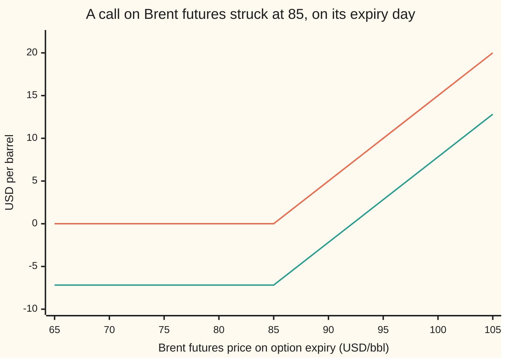

# Options on a futures price: Black-76 with the future as underlying, the spot nowhere, and two expiry dates to keep apart

[Syllabus](../../../SYLLABUS.md) → [Financial mathematics](../README.md) → [Options on commodity futures and spreads](../README.md#s26) → Options on a futures price

---

## General Overview

A Brent crude futures contract, named for a contract month about eight months away, trades at **85 dollars a barrel** this morning. One contract covers 1,000 barrels. Nobody pays for the barrels to hold it: a futures position costs nothing to open, and each day's gain or loss is paid in cash overnight, a process called **daily settlement** or margining.

An option on that contract is the right, in six months' time, to step into a long futures position at a fixed price of 85, the **strike**. If the future then trades at 95, the holder exercises, is credited 10 dollars a barrel through margin that same day, and can close the position at once. If it trades at 75, the holder walks away. At a volatility of 30 percent a year and a bank rate of 5 percent, the fair premium paid today is **7.00 dollars a barrel**, or **7,002.68 dollars on one 1,000-barrel lot**.

Three facts set this apart from an option on a share. The price of a barrel for immediate delivery, the **spot price**, appears nowhere in the premium: it matters only through the futures quote. The option expires before the future it is written on, and the volatility runs only to the option's expiry. And on some exchanges the premium itself is margined like a future rather than paid up front; there the fair quote is **7.18**, the same value divided by the six-month discount factor 0.975310, the worth today of a dollar paid in six months.

The same formula stops working when the future can go below zero. On 20 April 2020 the May contract on West Texas crude, the US benchmark, settled at −37.63 dollars a barrel, and option exchanges had to switch models.

**An option on a commodity future is Black-76 with the futures quote as the underlying, run to the option's own expiry, discounted to the day the cash moves, or not discounted at all when the premium is itself margined.**

**What kind of fact this is:** a model: the futures quote is *taken* to wander lognormally with one volatility, which fits oil well enough between crises and fails at zero. Inside it, two theorems are proved on this card in Why it works: the spot drops out, and the margined quote is the up-front premium divided by the discount factor. The Black-76 formula itself is proved on [Black-76](../05-Black-Scholes%20from%20the%20Ground%20Up/06-black-76-and-forward-level-pricing.md).

### The picture: what the option settles for on expiry day



The upper kinked line is the settlement per barrel: nothing up to the strike of 85, then a dollar for every dollar above it. The lower line is the buyer's profit after the premium, measured on expiry day: the 7.00 paid up front grows to 7.18 by then at 5 percent, and 7.18 is also the whole premium in a margined market. Breakeven is a futures price of 92.18.

---

## The formula

Notation first, in words. $F$ is the **futures price** quoted today, $K$ the **strike**, $T$ the time in years to the **option's** expiry, $r$ the bank rate, continuously compounded, $\sigma$ (say "sigma") the volatility of the futures quote, and $D = e^{-rT}$ the **discount factor**, what a dollar paid on option expiry is worth today. $N(x)$ is the bell-curve area to the left of $x$.

$$C = D\,\bigl[F\,N(d_1) - K\,N(d_2)\bigr], \qquad P = D\,\bigl[K\,N(-d_2) - F\,N(-d_1)\bigr]$$

$$d_1 = \frac{\ln(F/K) + \tfrac12\sigma^2 T}{\sigma\sqrt{T}}, \qquad d_2 = d_1 - \sigma\sqrt{T}$$

**Read it aloud:** the futures quote the holder might step into, minus the strike the holder might pay, each weighted by its own chance, with the pair shrunk once to today's money.

When the premium is margined like a future, nothing is paid today and nothing needs shrinking. The fair quote $V$ is the same bracket without $D$:

$$V = F\,N(d_1) - K\,N(d_2) = C / D$$

**Read it aloud:** a margined premium is the plain average payoff on expiry day, because the money moves then, not now.

| Symbol | Plain meaning | In our example | Push it up and the call… |
| --- | --- | --- | --- |
| $F$ | the futures price quoted today | 85 USD/bbl | rises: more to step into |
| $F_T$ | the futures price on option expiry, unknown today | — | — |
| $K$ | the strike | 85 USD/bbl | falls: further to climb |
| $T$ | years to the **option's** expiry | 0.5 | rises: more room to move |
| $T_f$ | years to the future's own last trading day, three business days after $T$ | just over 0.5 | nothing: it is not in the formula |
| $r$, $D$ | bank rate, and the discount factor $e^{-rT}$ | 5 percent, 0.975310 | falls slightly: rho is −3.501339 |
| $\sigma$, $\sigma_N$ | volatility of the futures quote as a fraction of itself; and the normal volatility, in dollars | 30 percent; 25.50 USD/bbl a year | rises, and it matters most |
| $N(x)$, $\phi(x)$ | the bell curve's area to the left of $x$, and its height at $x$ | — | — |
| $d_1$, $d_2$ | the quote's lead over the strike in units of $\sigma\sqrt{T}$, plus and minus half a unit | 0.106066, −0.106066 | — |
| $C$, $P$ | call and put premiums, paid today | 7.002679 each | — |
| $V$ | the margined quote, $C/D$ | 7.179952 | — |
| $S$, $y$ | the spot price, and the net convenience yield that links it to $F$ | 87, 9.65 percent | nothing, with $F$ held fixed |

At the money, with $F = K$, the call and the put cost the same: $C - P = D\,(F - K)$ is zero. A future has no carry left to tilt one side.

### When it holds

- **The futures quote wanders lognormally with one volatility.** In practice each strike carries its own volatility, and the oil call wing is often richer than the put wing: [Implied vol on a futures option and the commodity smile](03-commodity-implied-vol-and-the-call-skew.md). A wrong volatility moves the price by about vega times the error: 0.232549 dollars a barrel per volatility point here.
- **The futures price stays above zero.** A lognormal quote cannot reach zero. When it did, in April 2020, the formula returned no number, and the check below shows it.
- **Exercise on expiry day only, or a margined premium.** Brent options on ICE may be exercised any business day. With the premium margined that right is worth nothing extra, as Step 4 proves. With the premium paid up front it is worth 3.4 cents a barrel here, and the formula misses it.
- **Rates known in advance.** Then futures and forward quotes coincide and one discount factor does. With random rates the two quotes part, as [Futures](../03-Contracts%20and%20No-Arbitrage/05-futures-margining-and-the-forward-futures-difference.md) measures; the futures quote is still the one to use.

**Conventions verified 27 Sep 2026:** ICE's Brent Crude American-style option is on 1,000 barrels, American exercise, futures-style margined, and expires three business days before its futures contract stops trading; the future stops on the last business day of the second month before its contract month. Exchanges revise these terms; read the contract page before substituting.

---

## Why it works

### Step 0: a future is a fair bet on its own number

Opening a future costs nothing, and daily settlement pays each day's move in cash at once. A position that costs nothing and pays its moves at once can be worth nothing only if its average move is nothing under the pricing rule, the risk-neutral average that prices every trade: otherwise everyone would open a billion of them. So the futures quote drifts nowhere. Everything a barrel costs to carry, earns in convenience, or pays in storage is already inside the number 85. The shape of the curve that produces it is the business of [Contango and backwardation](../25-Commodity%20forwards%20-%20carry%2C%20storage%2C%20convenience%20yield%20and%20the%20curve/04-contango-backwardation-and-roll-yield.md).

That one sentence is the reason Black-76 fits, and the reason the spot can be left out.

### Step 1: exercise hands over a future, and the cash moves that day

On option expiry, exercising a call opens a long future at the strike. The exchange marks it to that day's settlement price $F_T$ at once, so the holder is credited $F_T - K$ in margin that day. The barrels, the future's own last trading day $T_f$, and the contract month all lie later and never touch the option. The payoff is

$$\max(F_T - K,\ 0), \quad \text{paid in cash at } T.$$

So the volatility runs to $T$, since the quote's wander after $T$ changes nothing the holder receives; and the discount runs to $T$, since that is when the cash arrives.


Only the first arrow carries volatility and discounting. The later boxes are the future's life, not the option's.

### Step 2: price the payoff with Black-76

Step 0 says the quote drifts nowhere; the model adds that its logarithm spreads as a bell curve with width $\sigma\sqrt{T}$. That is exactly the setting of [Black-76](../05-Black-Scholes%20from%20the%20Ground%20Up/06-black-76-and-forward-level-pricing.md), which proves the formula: average the payoff over the bell curve, and the strike half gets the chance $N(d_2)$ while the futures half gets the shifted chance $N(d_1)$. The check does that average again here by brute force, Simpson's rule over the bell curve, and lands on 7.002679 to six decimals.

### Step 3: the spot drops out

Suppose instead the pricing started from the barrel. Spot Brent at 87 and a future at 85 means holding a barrel earns more than the bank rate, through its **net convenience yield** $y$: the benefit of having oil on hand, less storage. The futures quote carries it: $F = S\,e^{(r-y)T}$, so $y = r - \ln(F/S)/T$, which is 9.65 percent for a spot of 87.

Feed spot and yield into Black-Scholes with $y$ in the dividend's place, and the premium is 7.002679. Feed a spot of 80 instead, a curve in **contango** (futures above spot, so $y$ comes out at −7.12 percent), and it is 7.002679 again. Any spot, with its yield chosen to reproduce the quote 85, gives the same premium.

<details>
<summary>Detailed proof: every spot route collapses onto the futures quote</summary>

Black-Scholes with yield $y$ reads $C = S\,e^{-yT}N(d_1) - K\,e^{-rT}N(d_2)$ with $d_1 = \bigl[\ln(S/K) + (r - y + \tfrac12\sigma^2)T\bigr]/(\sigma\sqrt{T})$. Substitute $S = F\,e^{-(r-y)T}$.

The top of $d_1$: $\ln(S/K) + (r-y)T = \ln\bigl(F\,e^{-(r-y)T}/K\bigr) + (r-y)T = \ln(F/K)$. The yield cancels, leaving $\ln(F/K) + \tfrac12\sigma^2 T$, which is Black-76's $d_1$; $d_2$ follows.

The front: $S\,e^{-yT} = F\,e^{-(r-y)T}e^{-yT} = F\,e^{-rT} = D\,F$. The yield cancels again.

So $C = D\,[F\,N(d_1) - K\,N(d_2)]$ for every pair $(S, y)$ with the same $F$. The spot and the yield enter only through their combination $S\,e^{(r-y)T}$, and that combination is the quote on the screen. $\blacksquare$

</details>

The practical reading: for oil, the yield is not observable on its own. It is backed out of the futures curve. A model that starts from spot has to invent $y$ to match $F$, and then the invention cancels.

### Step 4: a margined premium is a future on the payoff

On ICE, the buyer of a Brent option pays nothing on the trade date. The option's quote is marked daily like a future, and on expiry the buyer has paid, in total, the quote at purchase and received the payoff. That makes the quote a futures price whose underlying is the payoff. By Step 0 a futures price is the plain average of what it settles to, with no discount:

$$V = \text{average of } \max(F_T - K, 0) = F\,N(d_1) - K\,N(d_2) = C/D = 7.179952.$$

The two ways of paying have the same value today. A buyer who pays 7.002679 today gives up the 5 percent interest on it; a margined buyer keeps the cash, and the quote rises by exactly the interest: $7.002679 / 0.975310 = 7.179952$. On one lot the gap is 177.27 dollars.

The margined quote also kills early exercise. Exercising early, with the quote at some level $F'$, collects $F' - K$. Keeping the option is worth the average of $\max(F_T - K, 0)$ from there, which is at least $\max(\text{average of } F_T - K,\ 0) = \max(F' - K, 0)$, since the quote averages to itself and the payoff bends upward. So the live option is always worth at least its exercise value and nobody exercises early: American and European margined options have one price. The check's American tree with no funding lands on 7.179055, within a tenth of a cent of $C/D$. With the premium paid up front the discount breaks that inequality deep in the money, and the American tree finds 3.4 cents of early-exercise value.

### Step 5: where the model ends

A lognormal quote puts zero weight below zero, at every level. The **normal**, or **Bachelier**, model lets the quote move by dollars rather than percentages ([Bachelier](../05-Black-Scholes%20from%20the%20Ground%20Up/07-bachelier-model.md)). Matched at 85, a 30 percent volatility is about $\sigma_N = 0.30 \times 85 = 25.50$ dollars a year, and the Bachelier call is 7.015811, 0.013132 above Black-76. The chance of a negative quote at six months is 0.000001. The models only part company when the quote is low. With one month to run and the dollar volatility held at 25.50, as it is when moves stay dollar-sized, the normal model's weight below zero grows as the quote falls:

```
chance the future ends below zero, one month left, normal vol 25.50 USD/bbl/yr (lognormal: none at any level)
future 85   |                                         0.0000
future 40   |                                         0.0000
future 20   |▌                                        0.0033
future 10   |██████████████                           0.0872
future  5   |████████████████████████████████████████ 0.2485
```

At 5 dollars a month out, a put struck at zero is worth 1.084719 under the normal model and nothing under the lognormal one. At −37.63 the lognormal formula has no answer at all, since it takes the logarithm of a negative number; the normal one prices the same put at 37.473535.

A third road to the premium, a 2,000-step coin-flip tree on the futures quote, lands on 7.001803. The tree's up-probability solves $p\,u + (1-p)\,d = 1$, which is Step 0 written for one step.

---

## Worked numbers, by hand

House Brent: $F = 85$, $K = 85$, $\sigma = 30$ percent, $T = 0.5$, $r = 5$ percent.

| Step | Arithmetic | Value |
| --- | --- | --- |
| lead over strike, in logs | $\ln(85/85)$ | 0 |
| one wiggle unit, $\sigma\sqrt{T}$ | $0.30 \times \sqrt{0.5}$ | 0.212132 |
| $d_1$ | $(0 + \tfrac12 \times 0.212132^2)/0.212132$ | 0.106066 |
| $d_2$ | $0.106066 - 0.212132$ | −0.106066 |
| $N(d_1)$, $N(d_2)$ | bell-curve areas | 0.542235, 0.457765 |
| bracket, $F\,N(d_1) - K\,N(d_2)$ | $85 \times (0.542235 - 0.457765)$ | 7.179952 |
| discount $D$ | $e^{-0.05 \times 0.5}$ | 0.975310 |
| **call, paid up front** | $0.975310 \times 7.179952$ | **7.002679** |
| per 1,000-barrel lot | $7.002679 \times 1{,}000$ | 7,002.68 |
| **margined quote** | the bracket itself, $C/D$ | **7.179952** |
| put | parity, $C - D(F-K)$ | 7.002679 |

A buyer paying up front hands over 7,002.68 dollars per lot today; a margined buyer on ICE hands over nothing today and is quoted 7.18 a barrel. Both have the same value today.

The option's first-order sensitivities, printed by the check and taken apart properly on [Greeks of a futures option](02-futures-option-greeks.md):

| Greek | Formula | Value |
| --- | --- | --- |
| delta, per dollar on the future | $D\,N(d_1)$ | 0.528847 (0.528847 by bumping) |
| gamma, change in delta per dollar | $D\,\phi(d_1)/(F\sigma\sqrt{T})$ | 0.021458 |
| vega, per unit of volatility | $D\,F\,\phi(d_1)\sqrt{T}$ | 23.254860 |
| rho, per unit of rate, future held | $-T\,C$ | −3.501339 |

Delta sits just above one half, as for any at-the-money option, and the discount pulls it down from $N(d_1)$ = 0.542235.

### What breaks if you drop a piece

| Mistake | Comes out at | What went wrong |
| --- | --- | --- |
| Spot 87 used as $F$ | 8.102748 | The barrel today is not what the option delivers; the quote is 85 |
| Seven months, a clock run past expiry toward the contract month | 7.529958 | The option dies at six months; the quote's later wander is not the holder's |
| Future treated as a share, drifting at $r$ | 8.189645 | Carry counted twice: it is already inside 85 |
| Margined quote paid as $C$ | 0.177274 too little | Discounting a premium that is not paid today |

---

## Code, from first principles, and it actually runs

The check reaches the call four ways: the Black-76 formula; Simpson's rule averaging the payoff over the bell curve; a 2,000-step coin-flip tree on the futures quote; and Black-Scholes on two different spot prices with the yield backed out of the curve. It prices the put separately and checks parity, reaches the margined quote through an undiscounted American tree, bumps the quote to check delta, reproduces every wrong answer above, and runs the April 2020 levels through both models. The Python normal curve is a power series; the Rust one adds thin slices under the curve, a different road.

### Python

```python
# Options on commodity futures -- the check behind the card.  Standard library
# only.  Nothing imported knows the answer: the normal CDF is a power series
# written out here, the integral is Simpson's rule, the tree is a loop.
# House Brent: futures 85 USD/bbl, strike 85, vol 30%, six months, rate 5%.
from math import log, sqrt, exp, pi

def phi(x): return exp(-0.5 * x * x) / sqrt(2.0 * pi)      # bell-curve height
def N(x):                                                  # bell-curve area left of x
    if x > 8.0: return 1.0
    if x < -8.0: return 0.0
    term, total, n = x, x, 0
    while abs(term) > 1e-17 * abs(total) + 1e-300:
        n += 1
        term *= x * x / (2 * n + 1)
        total += term
    return 0.5 + phi(x) * total

def black76(F, K, r, sig, T, put=False, t_disc=None):
    D = exp(-r * (T if t_disc is None else t_disc))
    d1 = (log(F / K) + 0.5 * sig * sig * T) / (sig * sqrt(T)); d2 = d1 - sig * sqrt(T)
    if put: return D * (K * N(-d2) - F * N(-d1))
    return D * (F * N(d1) - K * N(d2))

def spot_route(S, K, r, y, sig, T):                        # Black-Scholes on the spot, yield y
    d1 = (log(S / K) + (r - y + 0.5 * sig * sig) * T) / (sig * sqrt(T)); d2 = d1 - sig * sqrt(T)
    return S * exp(-y * T) * N(d1) - K * exp(-r * T) * N(d2)

def simpson(f, a, b, n=2000):
    h = (b - a) / n
    s = f(a) + f(b) + sum((4 if i % 2 else 2) * f(a + i * h) for i in range(1, n))
    return s * h / 3.0

def by_integral(F, K, r, sig, T, put=False):              # average payoff over the future at expiry
    v = sig * sqrt(T); z0 = (log(K / F) + 0.5 * v * v) / v  # the future ends above K when z > z0
    FT = lambda z: F * exp(-0.5 * v * v + v * z)
    if put: return exp(-r * T) * simpson(lambda z: (K - FT(z)) * phi(z), -10.0, z0)
    return exp(-r * T) * simpson(lambda z: (FT(z) - K) * phi(z), z0, 10.0)

def tree(F, K, disc, sig, T, steps, american):           # coin-flip tree on the futures price
    dt = T / steps; u = exp(sig * sqrt(dt)); d = 1.0 / u
    p = (1.0 - d) / (u - d); g = exp(-disc * dt)          # the future drifts nowhere: p solves p u + (1-p) d = 1
    vals = [max(F * u ** j * d ** (steps - j) - K, 0.0) for j in range(steps + 1)]
    for i in range(steps - 1, -1, -1):
        for j in range(i + 1):
            cont = g * (p * vals[j + 1] + (1.0 - p) * vals[j])
            vals[j] = max(cont, F * u ** j * d ** (i - j) - K) if american else cont
    return vals[0]

def bach(F, K, sn, T, r, put=False):                      # Bachelier: absolute moves
    s = sn * sqrt(T); d = (F - K) / s; D = exp(-r * T)
    if put: return D * ((K - F) * N(-d) + s * phi(d))
    return D * ((F - K) * N(d) + s * phi(d))

F, K, r, sig, T, lot = 85.0, 85.0, 0.05, 0.30, 0.5, 1000
D = exp(-r * T); v = sig * sqrt(T)
d1 = (log(F / K) + 0.5 * v * v) / v; d2 = d1 - v
C, P = black76(F, K, r, sig, T), black76(F, K, r, sig, T, put=True)
C_int, P_int = by_integral(F, K, r, sig, T), by_integral(F, K, r, sig, T, put=True)
C_tree = tree(F, K, r, sig, T, 2000, False)
C_amer = tree(F, K, r, sig, T, 2000, True)
V = C / D                                                  # margined, futures-style quote
V_tree = tree(F, K, 0.0, sig, T, 2000, True)               # American, no premium to fund
y87 = r - log(F / 87.0) / T; y80 = r - log(F / 80.0) / T
C87, C80 = spot_route(87.0, K, r, y87, sig, T), spot_route(80.0, K, r, y80, sig, T)
h = 0.01
delta_bump = (black76(F + h, K, r, sig, T) - black76(F - h, K, r, sig, T)) / (2 * h)
Tdel = 7.0 / 12.0                                           # a clock run a month past expiry
sn = sig * F                                                # normal vol matched at 85
rows = [
    ("sig rootT", v), ("d1", d1), ("d2", d2), ("N(d1)", N(d1)), ("N(d2)", N(d2)), ("discount D, 6 months", D),
    ("1 formula, call", C), ("2 Simpson integral, call", C_int), ("3 tree 2000 steps, call", C_tree),
    ("4 spot route, spot 87, yield", y87), ("  call from spot 87", C87),
    ("  spot route, spot 80, yield", y80), ("  call from spot 80", C80),
    ("put, formula", P), ("put, Simpson integral", P_int), ("C - P", C - P), ("D (F - K)", D * (F - K)),
    ("call per 1,000-barrel lot", C * lot), ("margined quote C / D", V), ("breakeven future, K + C / D", K + V),
    ("  American tree, no funding", V_tree), ("American tree, premium up front", C_amer),
    ("  early-exercise value", C_amer - C_tree),
    ("delta D N(d1)", D * N(d1)), ("delta by bump", delta_bump),
    ("gamma D phi(d1) / (F sig rootT)", D * phi(d1) / (F * v)), ("vega D F phi(d1) rootT", D * F * phi(d1) * sqrt(T)),
    ("  vega per volatility point", D * F * phi(d1) * sqrt(T) / 100),
    ("rho -T C", -T * C),
    ("wrong: spot 87 used as F", black76(87.0, K, r, sig, T)),
    ("wrong: 7 months for vol and discount", black76(F, K, r, sig, Tdel)),
    ("wrong: future as a share, drift r", spot_route(F, K, r, 0.0, sig, T)),
    ("gap: margined quote minus C", V - C), ("  gap per lot", (V - C) * lot),
    ("try: vol 40%", black76(F, K, r, 0.40, T)), ("try: strike 95", black76(F, 95.0, r, sig, T)),
    ("try: one month left", black76(F, K, r, sig, 1 / 12)),
    ("normal vol sig F, USD/bbl/yr", sn), ("Bachelier call, 85, 6 months", bach(F, K, sn, T, r)),
    ("  Bachelier minus Black-76", bach(F, K, sn, T, r) - C),
    ("normal: chance below 0, 85, 6m", N(-F / (sn * sqrt(T)))),
]
for name, x in rows:
    print(f"{name:<36} {x:>14.6f}")
for lvl in (85.0, 40.0, 20.0, 10.0, 5.0):
    print(f"one month, future {lvl:5.0f}: normal chance below 0 {N(-lvl / (sn * sqrt(1 / 12))):.4f}")
print(f"normal put, strike 0, future 5, one month {bach(5.0, 0.0, sn, 1 / 12, r, put=True):.6f}")
try:
    wti = f"{black76(-37.63, 10.0, r, sig, 1 / 12):.6f}"
except ValueError:
    wti = "no price: log of a negative number"
print(f"Black-76 at future -37.63: {wti}")
print(f"normal put, strike 0, future -37.63, one month {bach(-37.63, 0.0, sn, 1 / 12, r, put=True):.6f}")
xs = [65.0 + 5.0 * i for i in range(9)]
print("chart, future at expiry " + " ".join(f"{x:6.0f}" for x in xs))
print("chart, payoff           " + " ".join(f"{max(x - K, 0.0):6.2f}" for x in xs))
print("chart, profit after C/D " + " ".join(f"{max(x - K, 0.0) - V:6.2f}" for x in xs))

assert abs(C - 7.002679) < 5e-7,                 "house number"
assert abs(C_int - C) < 1e-7,                    "integral road lands on the formula"
assert abs(C_tree - C) < 0.005,                  "tree road within half a cent"
assert abs(C87 - C) < 1e-9 and abs(C80 - C) < 1e-9, "spot enters only through the futures quote"
assert abs((C - P_int) - D * (F - K)) < 1e-7,    "parity with a put priced on its own"
assert abs(V_tree - V) < 0.005,                  "margined American tree equals C / D"
assert abs(delta_bump - D * N(d1)) < 1e-6,       "bumped delta"
print("ALL CHECKS PASS")
```

**Ran 2026-09-27 on macOS, Python 3.14.6, standard library only. All checks passed. Output, pasted from the run:**

```
sig rootT                                  0.212132
d1                                         0.106066
d2                                        -0.106066
N(d1)                                      0.542235
N(d2)                                      0.457765
discount D, 6 months                       0.975310
1 formula, call                            7.002679
2 Simpson integral, call                   7.002679
3 tree 2000 steps, call                    7.001803
4 spot route, spot 87, yield               0.096514
  call from spot 87                        7.002679
  spot route, spot 80, yield              -0.071249
  call from spot 80                        7.002679
put, formula                               7.002679
put, Simpson integral                      7.002679
C - P                                      0.000000
D (F - K)                                  0.000000
call per 1,000-barrel lot               7002.678610
margined quote C / D                       7.179952
breakeven future, K + C / D               92.179952
  American tree, no funding                7.179055
American tree, premium up front            7.036197
  early-exercise value                     0.034393
delta D N(d1)                              0.528847
delta by bump                              0.528847
gamma D phi(d1) / (F sig rootT)            0.021458
vega D F phi(d1) rootT                    23.254860
  vega per volatility point                0.232549
rho -T C                                  -3.501339
wrong: spot 87 used as F                   8.102748
wrong: 7 months for vol and discount       7.529958
wrong: future as a share, drift r          8.189645
gap: margined quote minus C                0.177274
  gap per lot                            177.273653
try: vol 40%                               9.323327
try: strike 95                             3.529513
try: one month left                        2.923576
normal vol sig F, USD/bbl/yr              25.500000
Bachelier call, 85, 6 months               7.015811
  Bachelier minus Black-76                 0.013132
normal: chance below 0, 85, 6m             0.000001
one month, future    85: normal chance below 0 0.0000
one month, future    40: normal chance below 0 0.0000
one month, future    20: normal chance below 0 0.0033
one month, future    10: normal chance below 0 0.0872
one month, future     5: normal chance below 0 0.2485
normal put, strike 0, future 5, one month 1.084719
Black-76 at future -37.63: no price: log of a negative number
normal put, strike 0, future -37.63, one month 37.473535
chart, future at expiry     65     70     75     80     85     90     95    100    105
chart, payoff             0.00   0.00   0.00   0.00   0.00   5.00  10.00  15.00  20.00
chart, profit after C/D  -7.18  -7.18  -7.18  -7.18  -7.18  -2.18   2.82   7.82  12.82
ALL CHECKS PASS
```

Four roads, one call. The integral and both spot routes agree with the formula to six decimals; the tree is a tenth of a cent low and closes with more steps. The margined American tree matches $C/D$ to the same tenth of a cent, with no early-exercise value, while the up-front American tree carries 0.034393 of it.

### Rust

Same inputs, same labels, a different normal curve. Built with `rustc --edition 2021 -O`.

```rust
// Options on commodity futures -- the same check as the Python, in Rust.  No
// crates.  The normal CDF here is a different road from the Python's series:
// Simpson's rule adds up thin slices under the bell curve from 0 to x.
// House Brent: futures 85 USD/bbl, strike 85, vol 30%, six months, rate 5%.
use std::f64::consts::PI;

fn phi(x: f64) -> f64 { (-0.5 * x * x).exp() / (2.0 * PI).sqrt() }

fn simpson<G: Fn(f64) -> f64>(f: G, a: f64, b: f64, n: usize) -> f64 {
    let h = (b - a) / n as f64;
    let mut s = f(a) + f(b);
    for i in 1..n { s += if i % 2 == 1 { 4.0 } else { 2.0 } * f(a + i as f64 * h); }
    s * h / 3.0
}

fn n_cdf(x: f64) -> f64 {                                  // area left of x
    if x > 8.0 { return 1.0; }
    if x < -8.0 { return 0.0; }
    0.5 + simpson(phi, 0.0, x, 2000)
}

fn black76(f: f64, k: f64, r: f64, sig: f64, t: f64, put: bool, t_disc: f64) -> f64 {
    let d = (-r * t_disc).exp();
    let d1 = ((f / k).ln() + 0.5 * sig * sig * t) / (sig * t.sqrt());
    let d2 = d1 - sig * t.sqrt();
    if put { d * (k * n_cdf(-d2) - f * n_cdf(-d1)) } else { d * (f * n_cdf(d1) - k * n_cdf(d2)) }
}

fn spot_route(s: f64, k: f64, r: f64, y: f64, sig: f64, t: f64) -> f64 {
    let d1 = ((s / k).ln() + (r - y + 0.5 * sig * sig) * t) / (sig * t.sqrt());
    let d2 = d1 - sig * t.sqrt();
    s * (-y * t).exp() * n_cdf(d1) - k * (-r * t).exp() * n_cdf(d2)
}

fn by_integral(f: f64, k: f64, r: f64, sig: f64, t: f64, put: bool) -> f64 {
    let v = sig * t.sqrt();
    let z0 = ((k / f).ln() + 0.5 * v * v) / v;            // the future ends above K when z > z0
    let ft = |z: f64| f * (-0.5 * v * v + v * z).exp();
    let dsc = (-r * t).exp();
    if put { dsc * simpson(|z| (k - ft(z)) * phi(z), -10.0, z0, 2000) }
    else { dsc * simpson(|z| (ft(z) - k) * phi(z), z0, 10.0, 2000) }
}

fn tree(f: f64, k: f64, disc: f64, sig: f64, t: f64, steps: usize, american: bool) -> f64 {
    let dt = t / steps as f64;
    let u = (sig * dt.sqrt()).exp();
    let d = 1.0 / u;
    let p = (1.0 - d) / (u - d);                           // the future drifts nowhere
    let g = (-disc * dt).exp();
    let node = |i: usize, j: usize| f * u.powi(j as i32) * d.powi((i - j) as i32);
    let mut vals: Vec<f64> = (0..=steps).map(|j| (node(steps, j) - k).max(0.0)).collect();
    for i in (0..steps).rev() {
        for j in 0..=i {
            let cont = g * (p * vals[j + 1] + (1.0 - p) * vals[j]);
            vals[j] = if american { cont.max(node(i, j) - k) } else { cont };
        }
    }
    vals[0]
}

fn bach(f: f64, k: f64, sn: f64, t: f64, r: f64, put: bool) -> f64 {   // Bachelier: absolute moves
    let s = sn * t.sqrt();
    let d = (f - k) / s;
    let dsc = (-r * t).exp();
    if put { dsc * ((k - f) * n_cdf(-d) + s * phi(d)) } else { dsc * ((f - k) * n_cdf(d) + s * phi(d)) }
}

fn main() {
    let (f, k, r, sig, t, lot) = (85.0_f64, 85.0_f64, 0.05_f64, 0.30_f64, 0.5_f64, 1000.0_f64);
    let dsc = (-r * t).exp();
    let v = sig * t.sqrt();
    let d1 = ((f / k).ln() + 0.5 * v * v) / v;
    let d2 = d1 - v;
    let c = black76(f, k, r, sig, t, false, t);
    let p = black76(f, k, r, sig, t, true, t);
    let c_int = by_integral(f, k, r, sig, t, false);
    let p_int = by_integral(f, k, r, sig, t, true);
    let c_tree = tree(f, k, r, sig, t, 2000, false);
    let c_amer = tree(f, k, r, sig, t, 2000, true);
    let vq = c / dsc;                                      // margined, futures-style quote
    let v_tree = tree(f, k, 0.0, sig, t, 2000, true);      // American, no premium to fund
    let y87 = r - (f / 87.0).ln() / t;
    let y80 = r - (f / 80.0).ln() / t;
    let c87 = spot_route(87.0, k, r, y87, sig, t);
    let c80 = spot_route(80.0, k, r, y80, sig, t);
    let h = 0.01;
    let delta_bump = (black76(f + h, k, r, sig, t, false, t) - black76(f - h, k, r, sig, t, false, t)) / (2.0 * h);
    let tdel = 7.0 / 12.0;                                 // a clock run a month past expiry
    let sn = sig * f;
    let m1 = 1.0 / 12.0;
    let rows: Vec<(&str, f64)> = vec![
        ("sig rootT", v), ("d1", d1), ("d2", d2), ("N(d1)", n_cdf(d1)), ("N(d2)", n_cdf(d2)), ("discount D, 6 months", dsc),
        ("1 formula, call", c), ("2 Simpson integral, call", c_int), ("3 tree 2000 steps, call", c_tree),
        ("4 spot route, spot 87, yield", y87), ("  call from spot 87", c87),
        ("  spot route, spot 80, yield", y80), ("  call from spot 80", c80),
        ("put, formula", p), ("put, Simpson integral", p_int), ("C - P", c - p), ("D (F - K)", dsc * (f - k)),
        ("call per 1,000-barrel lot", c * lot), ("margined quote C / D", vq), ("breakeven future, K + C / D", k + vq),
        ("  American tree, no funding", v_tree), ("American tree, premium up front", c_amer),
        ("  early-exercise value", c_amer - c_tree),
        ("delta D N(d1)", dsc * n_cdf(d1)), ("delta by bump", delta_bump),
        ("gamma D phi(d1) / (F sig rootT)", dsc * phi(d1) / (f * v)), ("vega D F phi(d1) rootT", dsc * f * phi(d1) * t.sqrt()),
        ("  vega per volatility point", dsc * f * phi(d1) * t.sqrt() / 100.0),
        ("rho -T C", -t * c),
        ("wrong: spot 87 used as F", black76(87.0, k, r, sig, t, false, t)),
        ("wrong: 7 months for vol and discount", black76(f, k, r, sig, tdel, false, tdel)),
        ("wrong: future as a share, drift r", spot_route(f, k, r, 0.0, sig, t)),
        ("gap: margined quote minus C", vq - c), ("  gap per lot", (vq - c) * lot),
        ("try: vol 40%", black76(f, k, r, 0.40, t, false, t)), ("try: strike 95", black76(f, 95.0, r, sig, t, false, t)),
        ("try: one month left", black76(f, k, r, sig, m1, false, m1)),
        ("normal vol sig F, USD/bbl/yr", sn), ("Bachelier call, 85, 6 months", bach(f, k, sn, t, r, false)),
        ("  Bachelier minus Black-76", bach(f, k, sn, t, r, false) - c),
        ("normal: chance below 0, 85, 6m", n_cdf(-f / (sn * t.sqrt()))),
    ];
    for (name, x) in &rows { println!("{:<36} {:>14.6}", name, x); }
    for lvl in [85.0_f64, 40.0, 20.0, 10.0, 5.0] {
        println!("one month, future {:5.0}: normal chance below 0 {:.4}", lvl, n_cdf(-lvl / (sn * m1.sqrt())));
    }
    println!("normal put, strike 0, future 5, one month {:.6}", bach(5.0, 0.0, sn, m1, r, true));
    let wti = black76(-37.63, 10.0, r, sig, m1, false, m1);
    let wti_s = if wti.is_nan() { "no price: log of a negative number".to_string() } else { format!("{:.6}", wti) };
    println!("Black-76 at future -37.63: {}", wti_s);
    println!("normal put, strike 0, future -37.63, one month {:.6}", bach(-37.63, 0.0, sn, m1, r, true));
    let xs: Vec<f64> = (0..9).map(|i| 65.0 + 5.0 * i as f64).collect();
    let line = |g: &dyn Fn(f64) -> f64, dp: usize| xs.iter().map(|&x| format!("{:6.*}", dp, g(x))).collect::<Vec<_>>().join(" ");
    println!("chart, future at expiry {}", line(&|x| x, 0));
    println!("chart, payoff           {}", line(&|x| (x - k).max(0.0), 2));
    println!("chart, profit after C/D {}", line(&|x| (x - k).max(0.0) - vq, 2));

    assert!((c - 7.002679).abs() < 5e-7, "house number");
    assert!((c_int - c).abs() < 1e-7, "integral road lands on the formula");
    assert!((c_tree - c).abs() < 0.005, "tree road within half a cent");
    assert!((c87 - c).abs() < 1e-9 && (c80 - c).abs() < 1e-9, "spot enters only through the futures quote");
    assert!(((c - p_int) - dsc * (f - k)).abs() < 1e-7, "parity with a put priced on its own");
    assert!((v_tree - vq).abs() < 0.005, "margined American tree equals C / D");
    assert!((delta_bump - dsc * n_cdf(d1)).abs() < 1e-6, "bumped delta");
    println!("ALL CHECKS PASS");
}
```

**Ran 2026-09-27 on macOS, rustc 1.98.1, no crates. All checks passed. Output, pasted from the run:**

```
sig rootT                                  0.212132
d1                                         0.106066
d2                                        -0.106066
N(d1)                                      0.542235
N(d2)                                      0.457765
discount D, 6 months                       0.975310
1 formula, call                            7.002679
2 Simpson integral, call                   7.002679
3 tree 2000 steps, call                    7.001803
4 spot route, spot 87, yield               0.096514
  call from spot 87                        7.002679
  spot route, spot 80, yield              -0.071249
  call from spot 80                        7.002679
put, formula                               7.002679
put, Simpson integral                      7.002679
C - P                                      0.000000
D (F - K)                                  0.000000
call per 1,000-barrel lot               7002.678610
margined quote C / D                       7.179952
breakeven future, K + C / D               92.179952
  American tree, no funding                7.179055
American tree, premium up front            7.036197
  early-exercise value                     0.034393
delta D N(d1)                              0.528847
delta by bump                              0.528847
gamma D phi(d1) / (F sig rootT)            0.021458
vega D F phi(d1) rootT                    23.254860
  vega per volatility point                0.232549
rho -T C                                  -3.501339
wrong: spot 87 used as F                   8.102748
wrong: 7 months for vol and discount       7.529958
wrong: future as a share, drift r          8.189645
gap: margined quote minus C                0.177274
  gap per lot                            177.273653
try: vol 40%                               9.323327
try: strike 95                             3.529513
try: one month left                        2.923576
normal vol sig F, USD/bbl/yr              25.500000
Bachelier call, 85, 6 months               7.015811
  Bachelier minus Black-76                 0.013132
normal: chance below 0, 85, 6m             0.000001
one month, future    85: normal chance below 0 0.0000
one month, future    40: normal chance below 0 0.0000
one month, future    20: normal chance below 0 0.0033
one month, future    10: normal chance below 0 0.0872
one month, future     5: normal chance below 0 0.2485
normal put, strike 0, future 5, one month 1.084719
Black-76 at future -37.63: no price: log of a negative number
normal put, strike 0, future -37.63, one month 37.473535
chart, future at expiry     65     70     75     80     85     90     95    100    105
chart, payoff             0.00   0.00   0.00   0.00   0.00   5.00  10.00  15.00  20.00
chart, profit after C/D  -7.18  -7.18  -7.18  -7.18  -7.18  -2.18   2.82   7.82  12.82
ALL CHECKS PASS
```

The two outputs agree line for line.

> [!TIP]
> **Try changing**
> Guess the direction first.
> - **Raise the volatility to 40 percent.** The call rises from 7.00 to **9.323327**: vega's 0.232549 per point, times ten points, predicts almost all of the rise.
> - **Move the strike to 95.** The call falls to **3.529513**. The future must climb 10 dollars before the option pays anything.
> - **Cut the time to one month.** The call is **2.923576**, well over a third of the six-month price for a sixth of the time. Width grows with the root of time, not with time.
> - **Change the spot to anything.** Set `87.0` in the spot route to 60 or 120. The yield adjusts and the call stays **7.002679**.

---

## The usual mistake

> [!warning]
> **Pricing from the spot.** The screen shows spot Brent and the futures strip side by side, and spot looks like "the price of oil". It is not the underlying. With spot 87 in the place of the future, the call comes out at 8.102748 instead of 7.002679. When the curve is steep, as oil's often is, spot and the relevant future can be many dollars apart.
>
> Smaller traps:
> - **Running the clock toward the contract month.** Brent options carry the contract month's name but expire about two months before it. One month too long, seven in place of six, gives 7.53.
> - **Discounting a margined premium.** An ICE Brent quote of 7.18 is fair; reading it as a paid-up premium to be discounted, or quoting 7.00 in a margined market, loses 17.7 cents a barrel.
> - **Giving the future a drift.** Treating 85 like a share that grows at the bank rate counts the carry twice and gives 8.19.
> - **Running the lognormal model near zero.** It assigns no chance to a negative quote at any level, so it misprices low-strike puts well before it fails outright.

---

## Where you meet it in real life

- **ICE Brent options.** American exercise, futures-style margined, 1,000 barrels, expiring three business days before the future. The quote is $V$, and by Step 4 early exercise has no value.
- **Options paid on the trade date.** Where the premium changes hands up front, the price is $C$, and an American contract carries a small early-exercise premium that needs a tree.
- **April 2020.** With West Texas crude futures near zero and then below it, commodity exchanges temporarily switched their option models from Black-Scholes to Bachelier; CME Clearing's switch took effect on 22 April 2020, two days after the May contract settled at −37.63.
- **Refining and power margins.** A refiner's margin is an option on the gap between two futures, gasoline and crude: [Spread options](04-margrabe-and-kirk-spread-options.md), with its sensitivities on [Greeks of a spread option](05-spread-option-greeks.md) and the correlation read back on [Correlation from a spread option](06-implied-correlation-from-a-spread-option.md). Electricity, which cannot be stored, strains Step 0 hardest: [Power that cannot be stored](07-electricity-and-the-spark-spread.md).
- **Quoting in volatility.** Desks quote these options by the $\sigma$ that makes the formula match the price, and the numbers differ by strike: [Implied vol on a futures option and the commodity smile](03-commodity-implied-vol-and-the-call-skew.md).

> **Say it back**
> A futures quote costs nothing to hold and settles daily, so it is a fair bet on itself, and every carry cost already sits inside it. An option on it is Black-76 with that quote as the underlying, so the spot never appears. The volatility and the discount run to the option's expiry, not the future's and not the contract month. A premium paid up front is $C$; a margined premium is $C/D$, the same value, and it makes early exercise worthless. At or below zero the lognormal model stops, and the normal model takes over.

---

## What this builds on

- [Contango and backwardation](../25-Commodity%20forwards%20-%20carry%2C%20storage%2C%20convenience%20yield%20and%20the%20curve/04-contango-backwardation-and-roll-yield.md): the futures curve and the convenience yield that Step 3 shows cancelling.
- [Black-76](../05-Black-Scholes%20from%20the%20Ground%20Up/06-black-76-and-forward-level-pricing.md): the formula itself, proved.
- [Futures](../03-Contracts%20and%20No-Arbitrage/05-futures-margining-and-the-forward-futures-difference.md): daily settlement, and why a margined quote is a fair bet on itself.
- [Bachelier](../05-Black-Scholes%20from%20the%20Ground%20Up/07-bachelier-model.md): the normal model that took over when oil went negative.

## Where this goes next

- [Greeks of a futures option](02-futures-option-greeks.md): the Greeks table taken apart, including the two meanings of rho.
- [Spread options](04-margrabe-and-kirk-spread-options.md): an option on the gap between two futures.
- [Kemna-Vorst](../27-Averages%20-%20commodity%20swaps%20and%20Asian%20options/02-kemna-vorst-geometric-asian.md): an option on the average futures price over a month, the way most physical oil is priced.

This card prices one future against a fixed strike; the question it leaves open is how to price an option whose strike is itself another moving futures price.

---

## Sources

Verified 27 Sep 2026: every link below resolves to the publisher's page.

- Black, Fischer. "The Pricing of Commodity Contracts." *Journal of Financial Economics* 3, no. 1–2 (1976): 167–179. [doi:10.1016/0304-405X(76)90024-6](https://doi.org/10.1016/0304-405X(76)90024-6). The original: options on futures priced off the futures quote.
- Lieu, Derming. "Option Pricing with Futures-Style Margining." *Journal of Futures Markets* 10, no. 4 (1990): 327–338. [doi:10.1002/fut.3990100402](https://doi.org/10.1002/fut.3990100402). The margined quote without discounting, and why early exercise has no value.
- Choi, Jaehyuk, Minsuk Kwak, Chyng Wen Tee, and Yumeng Wang. "A Black–Scholes User's Guide to the Bachelier Model." *Journal of Futures Markets* 42, no. 5 (2022): 959–980. [doi:10.1002/fut.22315](https://doi.org/10.1002/fut.22315); preprint [arXiv:2104.08686](https://arxiv.org/abs/2104.08686). The 2020 switch to Bachelier on commodity exchanges, and how to convert between the two models.
- ICE Futures Europe. "Brent Crude American-style Options." [Contract page](https://www.ice.com/products/218/Brent-Crude-American-style-Options). Lot size, exercise style, futures-style margining and the expiry rule, as verified on the date above.
