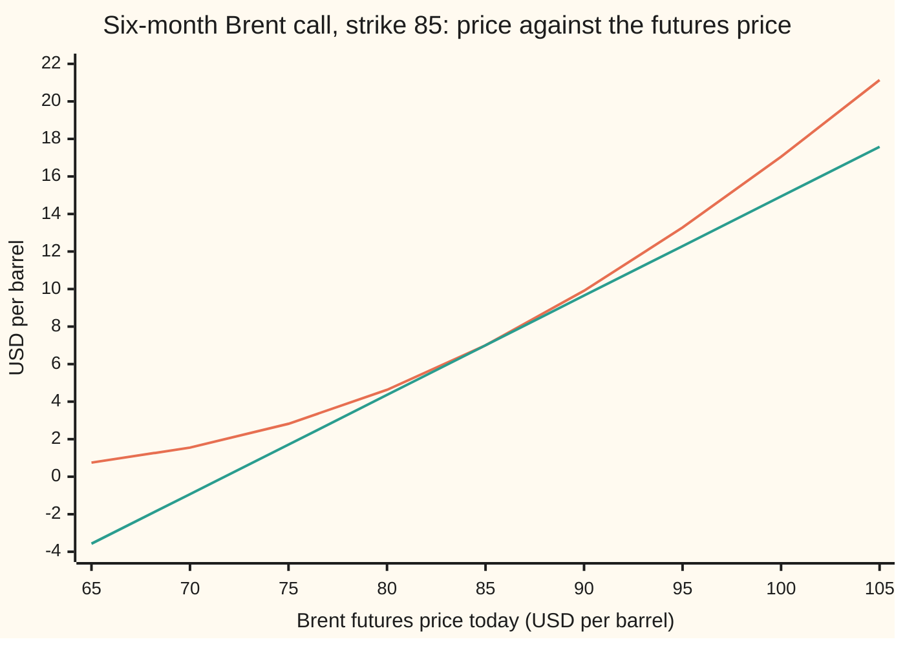
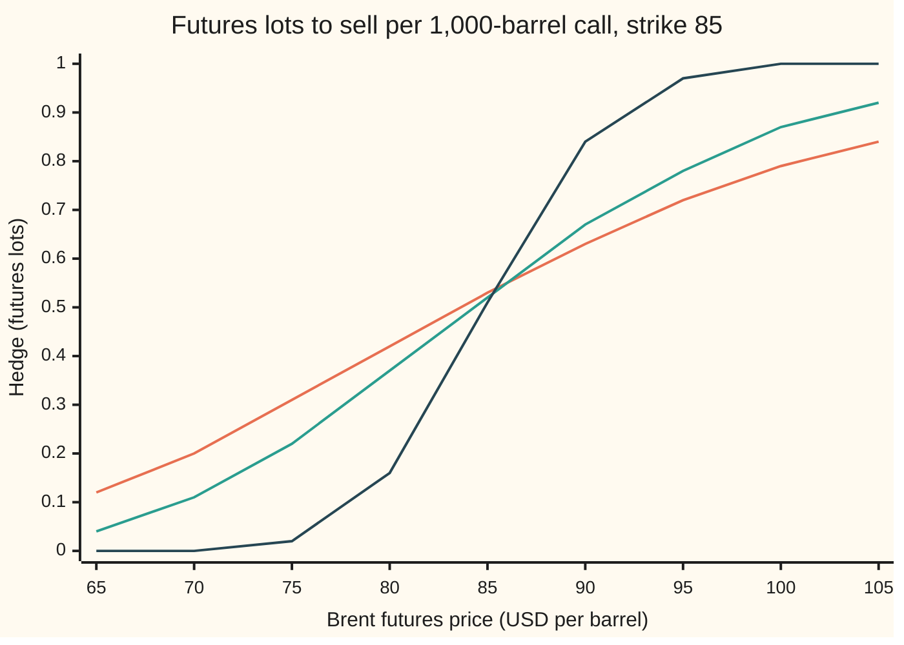

# Greeks of a futures option: delta in contracts not barrels, rho that is minus time times price, and vega per vol point per lot

Financial mathematics → Options on commodity futures and spreads → Hedging a Brent option → Greeks of a futures option

---

## General Overview

A Brent crude future for delivery in six months trades at 85 dollars a barrel. A refiner owns a call option on that future: the right, six months from now, to buy it at 85. The option covers 1,000 barrels. The market prices oil's swings at 30 percent a year, cash earns 5 percent, and the option costs $7.00 a barrel, paid today.

The refiner's risk desk asks four questions. If the future rises a dollar, how much does the option gain, and how many futures must be sold to cancel that? If the market's volatility rises one point, what is that worth? What does one day of waiting cost? And if interest rates rise, does the option gain or lose?

The answers are the option's **Greeks**: the rates at which its price moves when one input moves and the rest stay still. For this option the first answer is 0.5288 dollars per barrel for each dollar on the future. On 1,000 barrels that is $529 per dollar, and since one Brent future also covers 1,000 barrels, the hedge is to sell **0.53 of a futures contract**, not 529 contracts. A contract of this size is called a **lot**, the word used from here on. Vega is $0.2325 per barrel per volatility point, $232.55 per lot. And the rate sensitivity has a surprise: raising rates makes this call *cheaper*, by exactly the time left times the price, −3.50 dollars per barrel per unit of rate. A call on a share gains from higher rates. A call on a future loses.

**The Greeks of a futures option are the Black–Scholes Greeks with the futures price in place of the share price and one discount factor over everything, so delta is a count of futures per barrel, and rho, with the futures price held still, is minus the time left times the premium.**

**What kind of fact this is:** a theorem inside the Black-76 model, proved on this card in Why it works. The model is an assumption about how futures prices move, not a law; the conversion into lots, volatility points and days is a convention.

### The picture: the price, and the hedge as a straight line



The first line (orange) is the option's price per barrel as the futures price varies, six months left. The second line (green) is the straight line through $7.00 at 85 with slope 0.5288: what the option would be worth if it moved exactly like 0.5288 barrels of futures. The slope is delta. The green line is the hedge. The orange curve bends away from it on both sides, always above: that bend is gamma, and it is why the hedge must be reset as the price moves.

---

## The formula

The price itself comes from [options-on-commodity-futures](01-options-on-commodity-futures.md): Black's 1976 formula, the Black–Scholes call with the futures price in place of the share and no dividend term.

$$V = e^{-rT}\big[F\,N(d_1) - K\,N(d_2)\big], \qquad d_1 = \frac{\ln(F/K) + \tfrac12\sigma^2 T}{\sigma\sqrt{T}}, \qquad d_2 = d_1 - \sigma\sqrt{T}$$

Here $N(x)$ is the area under the bell curve left of $x$ and $\phi(x)$ is the curve's height at $x$. The five Greeks, per barrel, are each the slope in one input with the others frozen:

$$\Delta = e^{-rT}N(d_1), \quad \Gamma = \frac{e^{-rT}\phi(d_1)}{F\sigma\sqrt{T}}, \quad \nu = e^{-rT}F\,\phi(d_1)\sqrt{T}, \quad \Theta = r\,V - \frac{e^{-rT}F\,\phi(d_1)\,\sigma}{2\sqrt{T}}, \quad \rho = -T\,V$$

**Read it aloud:** delta is the discount times $N(d_1)$, a weight between 0 and 1; gamma, vega and the decay part of theta all carry the same discounted bell-curve height; theta adds back the interest on the premium; and rho is minus the years left times the price.

The hedge in futures lots converts barrels into contracts:

$$h = \frac{n\,m\,\Delta}{M}$$

**Read it aloud:** the lots to sell are the options held, times the barrels each covers, times delta, divided by the barrels in one future.

| Symbol | Plain meaning | In our example | Push it up and the answer… |
| --- | --- | --- | --- |
| $V$ | the option's premium, dollars per barrel, paid today | 7.00 | — |
| $F$ | today's futures price for the delivery month | 85 | delta rises toward $e^{-rT}$ |
| $K$ | the strike, the futures price the option lets its owner buy at | 85 | delta falls |
| $T$ | years until the option expires | 0.5 | rho grows more negative |
| $r$ | the bank rate, continuously compounded | 5% | premium falls |
| $\sigma$ | volatility: the yearly spread of the log futures price | 30% | premium rises by vega per unit |
| $N(x)$, $\phi(x)$ | bell-curve area left of $x$, and the bell curve's height at $x$ | $N(d_1)$ = 0.5422 | — |
| $d_1$, $d_2$ | the log distance from strike to future in units of $\sigma\sqrt{T}$, shifted up and down by half a unit | 0.1061 and −0.1061 | — |
| $e^{-rT}$ | the discount: today's value of a dollar paid at expiry | 0.9753 | — |
| $n$, $m$, $M$ | options held, barrels per option, barrels per future | 1, 1,000, 1,000 | — |
| $h$ | futures lots that match the option's delta | 0.53 | — |
| $V_m$ | the quote of a margined option, whose premium is not paid up front | 7.18 | — |
| $q$ | dividend yield of the Acme share, used only in the spot comparison | 2% | — |

The Greeks in the desk's units, for the house Brent call:

| Greek | What moves | Per barrel | Desk unit, per 1,000-barrel option |
| --- | --- | --- | --- |
| $\Delta$ delta | futures price, per $1 | 0.5288 | 529 barrels, **0.53 lots** |
| $\Gamma$ gamma | delta, per $1 on the future | 0.0215 | 0.0215 lots more per $1 rise |
| $\nu$ vega | volatility, per unit (per point = ÷ 100) | 23.25 (0.2325 per point) | **$232.55 per vol point** |
| $\Theta$ theta | calendar time, per year (per day = ÷ 365) | −6.63 (−0.0182 per day) | −$18.15 per day |
| $\rho$ rho | bank rate, per unit (per basis point = ÷ 10,000), future held still | **−3.50** | −$3,501.34 per unit, −$0.35 per basis point |

A basis point is a hundredth of a percentage point. A volatility point is one percentage point of $\sigma$, from 30 to 31 percent.

### When it holds

- **The futures price is lognormal with one fixed volatility.** Real Brent options show a smile ([commodity-implied-vol-and-the-call-skew](03-commodity-implied-vol-and-the-call-skew.md)); if volatility moves with the price, the true hedge differs from $\Delta$ by vega times that co-movement.
- **The premium is paid today and financed at one fixed rate.** For a margined option, where nothing is paid up front, delta is $N(d_1)$ and rho is zero (Step 5). Using the paid formulas on a margined option under-hedges by $13.39 per dollar per lot.
- **Rho holds the futures price still.** If a rate move also shifts the future, the total effect adds delta times that shift (Step 4).
- **Hedging is continuous and fractional.** Only whole lots trade. A single option's 0.53 lot rounds to one lot or none, leaving half a lot unhedged; desks net many options before rounding.
- **European exercise, or a margined American one.** A premium-paid American futures call can be worth exercising early; a margined one never is ([options-on-commodity-futures](01-options-on-commodity-futures.md)).

---

## Why it works

### Step 0: a future costs nothing, so the only money at stake today is the premium

A share must be paid for. A future costs nothing to enter: its gains and losses are settled in cash every day, called **marking to market**. In the pricing world of [options-on-commodity-futures](01-options-on-commodity-futures.md) the futures price therefore has no drift: it is expected to stay where it is. The option's premium, by contrast, is real money paid today for a payoff six months away. The whole card follows from those two facts. The futures price carries no interest; the premium does.

### Step 1: delta is the discount times $N(d_1)$

Differentiate the price in $F$. Both $d_1$ and $d_2$ depend on $F$, each with slope $1/(F\sigma\sqrt{T})$. Three terms appear: $N(d_1)$ from $F$ itself, and two bell-curve heights from the moving $d$'s. The two heights cancel exactly, because $F\phi(d_1) = K\phi(d_2)$. What is left is $\Delta = e^{-rT}N(d_1)$.

For the house call, $N(d_1)$ is 0.5422 and the discount is 0.9753, so delta is 0.5288. The same formula without the discount would be the delta of the undiscounted quote, which Step 5 meets again.

<details>
<summary>Detailed proof: the derivatives of Steps 1 and 3</summary>

**The cancelling identity.** $\phi(d_2)/\phi(d_1) = e^{(d_1^2 - d_2^2)/2} = e^{(d_1 - d_2)(d_1 + d_2)/2}$. Here $d_1 - d_2 = \sigma\sqrt{T}$ and $d_1 + d_2 = 2\ln(F/K)/(\sigma\sqrt{T})$, so the exponent is $\ln(F/K)$ and $K\phi(d_2) = F\phi(d_1)$.

**Delta.** $\partial V/\partial F = e^{-rT}\big[N(d_1) + F\phi(d_1)\,\partial d_1/\partial F - K\phi(d_2)\,\partial d_2/\partial F\big]$. Both partial derivatives equal $1/(F\sigma\sqrt{T})$, and the identity makes the bracket's last two terms equal and opposite.

**Gamma.** Differentiate delta once more: $e^{-rT}\phi(d_1)/(F\sigma\sqrt{T})$.

**Vega.** $\partial V/\partial\sigma = e^{-rT}\big[F\phi(d_1)\,\partial d_1/\partial\sigma - K\phi(d_2)\,\partial d_2/\partial\sigma\big] = e^{-rT}F\phi(d_1)\,\partial(d_1 - d_2)/\partial\sigma = e^{-rT}F\phi(d_1)\sqrt{T}$.

**Theta.** Theta is minus the slope in $T$, the time left. The discount gives $r\,V$. The $d$'s give $-e^{-rT}F\phi(d_1)\,\partial(d_1 - d_2)/\partial T = -e^{-rT}F\phi(d_1)\,\sigma/(2\sqrt{T})$. Substituting gamma shows $\Theta + \tfrac12\sigma^2F^2\Gamma = r\,V$: Black's pricing equation, with no delta term because the future has no drift.

**Rho.** With $F$, $K$, $\sigma$ and $T$ fixed, $d_1$ and $d_2$ contain no $r$. Only the discount does, and its slope in $r$ is $-T e^{-rT}$. So $\rho = -T\,V$.

</details>

### Step 2: from barrels to lots, and why the discount stays in the hedge

Delta is dollars of option value per dollar on the future, per barrel. The option covers $m$ = 1,000 barrels, so a $1 rise adds $529 to its value. One futures lot covers $M$ = 1,000 barrels and pays $1,000 per dollar of rise. Matching the two: sell $h = 1 \times 1{,}000 \times 0.5288 / 1{,}000 = 0.53$ lots. Delta is a number of lots only when the option and the future cover the same quantity; otherwise the ratio $m/M$ does the conversion.

The discount inside delta has a plain reason. A future's gain is paid into the account today. The option's gain is a larger payoff at expiry, worth today only its discounted value. So the hedge holds $e^{-rT}N(d_1)$ futures, not $N(d_1)$. Traders call this **tailing** the hedge. Selling 0.5422 lots against a premium-paid option over-hedges by 13.39 barrels of exposure per lot.

Compare a spot option. The house Acme call, on a share at $100 with dividend yield $q$ = 2 percent, is hedged with $e^{-qT}N(d_1)$ = 0.5869 shares bought with borrowed cash ([delta](../09-The%20Greeks%2C%20one%20each/01-delta.md)). The same call can be priced by Black's formula on Acme's one-year future: it gives the same $9.23. Its delta there is 0.5695 futures: the spot delta divided by $e^{(r-q)T}$ = 1.0305, the dollars the future moves per dollar on the share. Two differences, then: the futures hedge needs no cash to buy the hedge, only margin; and it needs fewer contracts, because each future moves more than the share does.

### Step 3: gamma, vega and theta share one piece

All three contain $e^{-rT}F\phi(d_1)$: the discounted futures price times the bell curve's height at $d_1$. For the house call it is 32.8873.

- **Gamma** divides it by $F^2\sigma\sqrt{T}$: 0.0215. After a $1 rise the hedge needs 0.0215 lots more.
- **Vega** multiplies it by $\sqrt{T}$: 23.25 per unit of volatility, 0.2325 per point per barrel, $232.55 per point per lot ([vega](../09-The%20Greeks%2C%20one%20each/03-vega.md) explains why desks divide by 100).
- **Theta** subtracts $\sigma/(2\sqrt{T})$ times it, 6.9765, from the interest on the premium, $r\,V$ = 0.3501: −6.63 per year, −0.0182 per barrel per day, −$18.15 per lot per day.

The three are tied by Black's equation, $\Theta + \tfrac12\sigma^2F^2\Gamma = r\,V$. Time decay pays for gamma, less the interest on money already spent.

### Step 4: rho is minus time times price, and why a share's rho is not

Hold the future still and raise the rate. The chances $N(d_1)$ and $N(d_2)$ do not change, because $F$ already carries every effect of rates on the oil price. Only the discount changes, and it falls at rate $T$ per unit of rate. So $\rho = -T V$ = −0.5 × 7.00 = −3.50 per barrel. On a lot, −$3,501.34 per unit of rate, −$0.35 per basis point. A small number: rates barely touch a six-month futures option.

For a share the story reverses. The Acme call's rho is $K T e^{-rT}N(d_2)$ = 49.46, positive ([rho-and-dividend-rho](../09-The%20Greeks%2C%20one%20each/05-rho-and-dividend-rho.md)). The difference is what is held still. Holding the share still lets the forward, $S e^{(r-q)T}$, rise with the rate. Holding the future still does not. The chain rule joins them: the stock rho equals the futures rho plus delta times the futures price's slope in the rate, $-TV + \Delta \cdot T F$. For Acme both roads give 49.46.

### Step 5: a margined option has no premium to discount

On some exchanges, Brent among them, the buyer of a futures option pays no premium up front. The option is marked to market daily like a future, and [options-on-commodity-futures](01-options-on-commodity-futures.md) shows its fair quote is the paid premium without the discount, and that such an option is never worth exercising early. That card calls the paid premium C and the margined quote V; here $V$ is the paid premium, so that rho reads $-T\,V$, and $V_m$ is the margined quote:

$$V_m = F\,N(d_1) - K\,N(d_2) = e^{rT}V$$

Its Greeks follow by the same differentiation with the discount removed. Nothing is financed, so nothing is discounted. For the house call, $V_m$ = 7.18. Its delta is $N(d_1)$ = 0.5422 lots: the untailed number is right here, because the option's own gains are now paid daily, like the future's. Its rho is zero with the future held still, and its theta is the decay term alone, −0.0196 per barrel per day.

A second road to every Greek is bump-and-reprice: nudge one input, reprice, divide. The code does it for all five and lands on the formulas; [delta](../09-The%20Greeks%2C%20one%20each/01-delta.md) shows why the central difference is accurate.

---

## Worked numbers, by hand

House Brent: $F$ = 85, $K$ = 85, $\sigma$ = 30%, $T$ = 0.5 years, $r$ = 5%, one option on 1,000 barrels, futures lot 1,000 barrels.

| Step | Arithmetic | Value |
| --- | --- | --- |
| $\sigma\sqrt{T}$ | $0.30 \times \sqrt{0.5}$ | 0.2121 |
| $d_1$ | $(\ln 1 + 0.5 \times 0.09 \times 0.5)/0.2121$ | 0.1061 |
| $d_2$ | $0.1061 - 0.2121$ | −0.1061 |
| $N(d_1)$, $N(d_2)$ | bell-curve areas | 0.5422, 0.4578 |
| discount $e^{-rT}$ | $e^{-0.025}$ | 0.9753 |
| premium $V$ | $0.9753 \times 85 \times (0.5422 - 0.4578)$ | 7.00 |
| delta | $0.9753 \times 0.5422$ | 0.5288 |
| hedge in lots | $1 \times 1{,}000 \times 0.5288 / 1{,}000$ | **0.53** |
| shared piece $e^{-rT}F\phi(d_1)$ | $0.9753 \times 85 \times 0.3967$ | 32.8873 |
| gamma | $32.8873 / (85^2 \times 0.2121)$ | 0.0215 |
| vega per point, per lot | $32.8873 \times \sqrt{0.5} / 100 \times 1{,}000$ | **$232.55** |
| theta per day, per lot | $(0.3501 - 6.9765)/365 \times 1{,}000$ | −$18.15 |
| rho per unit, per barrel | $-0.5 \times 7.00$ | **−3.50** |
| rho per basis point, per lot | $-3.50 \times 1{,}000 / 10{,}000$ | −$0.35 |

Selling about half a lot of Brent futures makes the refiner's option position indifferent to a small move in oil. A one-point rise in volatility adds $232.55 to it; a day's wait takes $18.15 away; a one-basis-point rate rise takes $0.35.

### What breaks if you drop a piece

| Mistake | Comes out at | What went wrong |
| --- | --- | --- |
| Read delta 528.85 barrels as contracts | 528.85 lots sold | 1,000 times the hedge: barrels confused with lots |
| Hedge a premium-paid option with $N(d_1)$ lots | 0.5422 lots, $13.39 per $1 per lot over-hedged | Dropped the tail: the future's gain arrives today |
| Use the share's rho formula $KTe^{-rT}N(d_2)$ | +18.97 per barrel | Held the spot still, not the future; wrong sign |
| Quote vega per unit as per point | 23.25 per barrel, not 0.2325 | One unit of volatility is 100 points |
| Quote theta per year as per day | −$6,626.32 per lot, not −$18.15 | 365 days in the unit |

---

## How the hedge moves

The price moves the hedge, and so does the clock. A hedge set once at 0.53 lots is right for a moment only.

### One option, followed month by month

Suppose the Brent future wanders over the six months as below. At each month-start the desk reprices and resets the hedge.

| Month | Future (USD) | Option (USD per barrel) | Hedge, lots | Gamma |
| --- | --- | --- | --- | --- |
| 0 | 85.0 | 7.003 | 0.5288 | 0.0215 |
| 1 | 88.0 | 8.108 | 0.5962 | 0.0221 |
| 2 | 93.0 | 10.769 | 0.7157 | 0.0203 |
| 3 | 87.0 | 6.126 | 0.5836 | 0.0294 |
| 4 | 80.0 | 1.995 | 0.3295 | 0.0368 |
| 5 | 84.0 | 2.436 | 0.4609 | 0.0544 |

Months 0 and 5 have nearly the same futures price, 85 and 84. The hedge fell from 0.53 lots to 0.46, and gamma more than doubled. The one-dollar fall explains about 0.02 lots of that, through gamma; the clock did the rest.

### Force one: the futures price

Six months left, lots per 1,000-barrel option:

```
Brent future   hedge in lots, 6 months left
    $65   ██████                           0.12
    $75   ███████████████                  0.31
    $85   ██████████████████████████       0.53
    $95   ████████████████████████████████████  0.72
   $105   ██████████████████████████████████████████  0.84
```

### Force two: the clock

The future held at 90, five dollars above the strike:

```
time left      hedge in lots, future at $90
  6 months   ████████████████████████████████  0.630
  4 months   █████████████████████████████████  0.651
  2 months   ███████████████████████████████████  0.695
  1 month    ██████████████████████████████████████  0.756
  2 weeks    ██████████████████████████████████████████  0.831
  1 week     ██████████████████████████████████████████████  0.918
```

An option that is in the money heads toward a full lot as expiry nears, because exercise becomes nearly certain. One out of the money heads toward none.

### Both together



Orange: six months left. Green: three months left. Dark blue: two weeks left. As expiry nears the curve steepens into a step at the strike. Gamma is that steepness, and it is why a short-dated option near the strike needs the hedge reset most often.

---

## Code, from first principles, and it actually runs

The scripts price the house Brent call and compute its five Greeks by five independent roads: the closed forms; bump-and-reprice in each input; a Simpson integral over the lognormal futures price, for the price and for delta; the house Acme call priced both on its share and on its future, joined by the chain rule for rho; and a simulation that sells the call, hedges it daily with futures on 2,000 random paths, and reads the price back from the hedged book. The normal curve area, the integrator and the random numbers are written from scratch. The last road also shows the tail's effect: the tailed hedge gives the smallest error, and the simulated price with it lands within one standard error of the formula.

### Python

```python
# Greeks of a futures option (Black-76), Brent house example. Standard library only.
from math import exp, log, sqrt, pi, cos, sin

def N(x):                       # normal CDF from its own series: erf(z) = 2/sqrt(pi) e^-z^2 sum 2^n z^(2n+1)/(1*3*..*(2n+1))
    z = abs(x) / sqrt(2.0)
    if z > 6.0:
        e = 1.0
    else:
        term, total, n = z, z, 0
        while term > 1e-17 * total:
            n += 1
            term *= 2.0 * z * z / (2 * n + 1)
            total += term
        e = 2.0 / sqrt(pi) * exp(-z * z) * total
    return 0.5 * (1.0 + e) if x >= 0 else 0.5 * (1.0 - e)

def phi(x): return exp(-0.5 * x * x) / sqrt(2.0 * pi)

def d12(F, K, s, T):
    d1 = (log(F / K) + 0.5 * s * s * T) / (s * sqrt(T))
    return d1, d1 - s * sqrt(T)

def b76(F, K, r, s, T):          # premium-paid call, dollars per barrel
    d1, d2 = d12(F, K, s, T)
    return exp(-r * T) * (F * N(d1) - K * N(d2))

def greeks(F, K, r, s, T):       # closed forms: delta, gamma, vega, theta (per year), rho
    d1, d2 = d12(F, K, s, T); D = exp(-r * T); V = b76(F, K, r, s, T)
    return (D * N(d1), D * phi(d1) / (F * s * sqrt(T)), D * F * phi(d1) * sqrt(T),
            r * V - D * F * phi(d1) * s / (2.0 * sqrt(T)), -T * V)

F, K, r, s, T, lot = 85.0, 85.0, 0.05, 0.30, 0.5, 1000.0
d1, d2 = d12(F, K, s, T); D = exp(-r * T); V = b76(F, K, r, s, T)
dl, ga, ve, th, rh = greeks(F, K, r, s, T)
h = 1e-3                         # road 2: bump and reprice
dl_b = (b76(F + h, K, r, s, T) - b76(F - h, K, r, s, T)) / (2 * h)
ga_b = (b76(F + 0.1, K, r, s, T) - 2 * V + b76(F - 0.1, K, r, s, T)) / 0.01
ve_b = (b76(F, K, r, s + h, T) - b76(F, K, r, s - h, T)) / (2 * h)
th_b = -(b76(F, K, r, s, T + h) - b76(F, K, r, s, T - h)) / (2 * h)
rh_b = (b76(F, K, r + h, s, T) - b76(F, K, r - h, s, T)) / (2 * h)
q = lambda F_, r_: b76(F_, K, r_, s, T) / exp(-r_ * T)      # margined quote: nothing paid up front
qdl_b = (q(F + h, r) - q(F - h, r)) / (2 * h)
qrh_b = (q(F, r + h) - q(F, r - h)) / (2 * h)
qth = -F * phi(d1) * s / (2.0 * sqrt(T))
# road 3: Simpson integral over the lognormal, above the strike only (no kink inside)
zs = (log(K / F) + 0.5 * s * s * T) / (s * sqrt(T)); m = 4000; w = (8.0 - zs) / m
V_int, dl_int = 0.0, 0.0
for i in range(m + 1):
    z = zs + i * w; c = 1 if i in (0, m) else (4 if i % 2 else 2)
    FT = F * exp(-0.5 * s * s * T + s * sqrt(T) * z)
    V_int += c * (FT - K) * phi(z); dl_int += c * (FT / F) * phi(z)
V_int *= D * w / 3; dl_int *= D * w / 3
# road 4: Acme, the house stock, priced on spot (Black-Scholes) and on its one-year future (Black-76)
S, Ka, ra, qa, sa, Ta = 100.0, 100.0, 0.05, 0.02, 0.20, 1.0
b1 = (log(S / Ka) + (ra - qa + 0.5 * sa * sa) * Ta) / (sa * sqrt(Ta)); b2 = b1 - sa * sqrt(Ta)
C_bs = S * exp(-qa * Ta) * N(b1) - Ka * exp(-ra * Ta) * N(b2)
Fa = S * exp((ra - qa) * Ta); C_76 = b76(Fa, Ka, ra, sa, Ta); ga76 = greeks(Fa, Ka, ra, sa, Ta)
spot_delta = exp(-qa * Ta) * N(b1); stock_rho = Ka * Ta * exp(-ra * Ta) * N(b2)
chain_rho = ga76[4] + ga76[0] * Ta * Fa          # rho at fixed future + delta * dF/dr
# road 5: sell the Brent call, hedge daily with futures, 2000 paths, own random numbers
state = 0x2545F4914F6CDD1D
def unif():
    global state
    state ^= (state << 13) & 0xFFFFFFFFFFFFFFFF; state ^= state >> 7
    state ^= (state << 17) & 0xFFFFFFFFFFFFFFFF
    return ((state >> 11) + 0.5) / 9007199254740992.0
paths, steps = 2000, 126; dt = T / steps
acc = [[0.0, 0.0] for _ in range(3)]              # plain, untailed N(d1), tailed e^-rT N(d1)
for p in range(paths):
    Fp, G = F, [0.0, 0.0, 0.0]
    for k in range(steps):
        tau = T - k * dt; nd = N(d12(Fp, K, s, tau)[0])
        if k % 2 == 0:
            u1, u2 = unif(), unif(); rad = sqrt(-2.0 * log(u1)); z = rad * cos(2 * pi * u2)
        else:
            z = rad * sin(2 * pi * u2)
        Fn = Fp * exp(-0.5 * s * s * dt + s * sqrt(dt) * z)
        for j, hr in enumerate((0.0, nd, exp(-r * tau) * nd)):
            G[j] = G[j] * exp(r * dt) + hr * (Fn - Fp)
        Fp = Fn
    for j in range(3):
        x = max(Fp - K, 0.0) - G[j]; acc[j][0] += x; acc[j][1] += x * x
est = []
for a0, a1 in acc:
    mu = a0 / paths; sd = sqrt(a1 / paths - mu * mu)
    est.append((D * mu, D * sd / sqrt(paths)))
rows = [
    ("d1", d1), ("N(d1)", N(d1)), ("e^-rT", D),
    ("1 formula V", V), ("2 Simpson integral V", V_int),
    ("delta formula", dl), ("delta bump", dl_b), ("delta integral", dl_int),
    ("delta in barrels, per option", dl * lot), ("gamma formula", ga), ("gamma bump", ga_b),
    ("vega per unit formula", ve), ("vega per unit bump", ve_b),
    ("vega per vol point, per barrel", ve / 100), ("vega per vol point, per lot", ve / 100 * lot),
    ("theta per year formula", th), ("theta per year bump", th_b),
    ("theta per day, per barrel", th / 365), ("theta per day, per lot", th / 365 * lot),
    ("rho per unit formula", rh), ("rho per unit bump", rh_b), ("rho per unit, per lot", rh * lot),
    ("rho per basis point, per lot", rh * lot / 1e4),
    ("margined quote V_m = V e^rT", V / D), ("margined delta bump", qdl_b),
    ("margined theta per day, per barrel", qth / 365), ("margined rho bump", qrh_b),
    ("Acme Black-Scholes call", C_bs), ("Acme Black-76 on 1y future", C_76),
    ("Acme spot delta, shares", spot_delta), ("Acme futures delta, lots", ga76[0]),
    ("Acme stock rho", stock_rho), ("Acme -T C + delta T F", chain_rho),
    ("wrong: N(d1) lots, $ per $1 per lot", (N(d1) - dl) * lot),
    ("wrong: stock rho formula, Brent", K * T * D * N(d2)), ("wrong: theta per year, per lot", th * lot),
]
for name, v in rows:
    print(f"{name:<36} {v:>13.6f}")
A = D * F * phi(d1)
print(f"hand: sigma sqrt T {s * sqrt(T):.6f}  d2 {d2:.6f}  N(d2) {N(d2):.6f}  phi(d1) {phi(d1):.6f}")
print(f"hand: A = e^-rT F phi(d1) {A:.6f}  rV {r * V:.6f}  A sigma/(2 sqrt T) {A * s / (2 * sqrt(T)):.6f}  V per lot {V * lot:.6f}")
for lab, (e, se) in zip(("3 sim V, no hedge", "3 sim V, N(d1) lots", "3 sim V, e^-rT N(d1) lots"), est):
    print(f"{lab:<27} {e:>9.6f}  standard error {se:.6f}")
fs = [65.0 + 5.0 * i for i in range(9)]
print("chart, Brent future  " + " ".join(f"{x:6.0f}" for x in fs))
print("chart, V per barrel  " + " ".join(f"{b76(x, K, r, s, T):6.2f}" for x in fs))
print("chart, V + delta dF  " + " ".join(f"{V + dl * (x - F):6.2f}" for x in fs))
for lab, tt in (("lots, 6m, paid", 0.5), ("lots, 3m, paid", 0.25), ("lots, 2w, paid", 1 / 26)):
    print(f"{lab:<20} " + " ".join(f"{greeks(x, K, r, s, tt)[0]:6.2f}" for x in fs))
print("time left, F = 90   " + " ".join(f"{b:6.3f}" for b in (greeks(90.0, K, r, s, t)[0] for t in (0.5, 1 / 3, 1 / 6, 1 / 12, 1 / 24, 1 / 52))))
for mo, Fm in ((0, 85.0), (1, 88.0), (2, 93.0), (3, 87.0), (4, 80.0), (5, 84.0)):
    g = greeks(Fm, K, r, s, (6 - mo) / 12)
    print(f"story month {mo}  F {Fm:5.1f}  V {b76(Fm, K, r, s, (6 - mo) / 12):6.3f}  lots {g[0]:6.4f}  gamma {g[1]:6.4f}")
assert abs(V - 7.002679) < 5e-7, "formula vs the shelf's house call 7.002679"
assert abs(V_int - V) < 1e-8 and abs(dl_int - dl) < 1e-8, "integral road lands on formula price and delta"
assert abs(dl_b - dl) < 1e-8 and abs(ga_b - ga) < 1e-6 and abs(ve_b - ve) < 1e-5, "bumps match closed forms"
assert abs(th_b - th) < 1e-5 and abs(rh_b - rh) < 1e-6, "theta and rho = -T V by bumping"
assert abs(qdl_b - N(d1)) < 1e-8 and abs(qrh_b) < 1e-8, "margined delta N(d1), margined rho zero"
assert abs(C_76 - 9.227005508154) < 1e-9 and abs(chain_rho - stock_rho) < 1e-9, "Acme both ways"
assert abs(est[2][0] - V) < 3 * est[2][1] and est[2][1] < est[1][1] < est[0][1] / 5, "hedged simulation"
print("ALL CHECKS PASS")
```

**Ran 2026-09-27 on macOS, Python 3.14.6, standard library only. All checks passed. Output, pasted from the run:**

```
d1                                        0.106066
N(d1)                                     0.542235
e^-rT                                     0.975310
1 formula V                               7.002679
2 Simpson integral V                      7.002679
delta formula                             0.528847
delta bump                                0.528847
delta integral                            0.528847
delta in barrels, per option            528.847183
gamma formula                             0.021458
gamma bump                                0.021458
vega per unit formula                    23.254860
vega per unit bump                       23.254859
vega per vol point, per barrel            0.232549
vega per vol point, per lot             232.548598
theta per year formula                   -6.626324
theta per year bump                      -6.626328
theta per day, per barrel                -0.018154
theta per day, per lot                  -18.154312
rho per unit formula                     -3.501339
rho per unit bump                        -3.501339
rho per unit, per lot                 -3501.339305
rho per basis point, per lot             -0.350134
margined quote V_m = V e^rT               7.179952
margined delta bump                       0.542235
margined theta per day, per barrel       -0.019597
margined rho bump                         0.000000
Acme Black-Scholes call                   9.227006
Acme Black-76 on 1y future                9.227006
Acme spot delta, shares                   0.586851
Acme futures delta, lots                  0.569507
Acme stock rho                           49.458109
Acme -T C + delta T F                    49.458109
wrong: N(d1) lots, $ per $1 per lot      13.387830
wrong: stock rho formula, Brent          18.974666
wrong: theta per year, per lot        -6626.324004
hand: sigma sqrt T 0.212132  d2 -0.106066  N(d2) 0.457765  phi(d1) 0.396705
hand: A = e^-rT F phi(d1) 32.887338  rV 0.350134  A sigma/(2 sqrt T) 6.976458  V per lot 7002.678610
3 sim V, no hedge            7.436143  standard error 0.288163
3 sim V, N(d1) lots          6.999199  standard error 0.012480
3 sim V, e^-rT N(d1) lots    7.005834  standard error 0.011975
chart, Brent future      65     70     75     80     85     90     95    100    105
chart, V per barrel    0.75   1.55   2.82   4.63   7.00   9.91  13.28  17.05  21.14
chart, V + delta dF   -3.57  -0.93   1.71   4.36   7.00   9.65  12.29  14.94  17.58
lots, 6m, paid         0.12   0.20   0.31   0.42   0.53   0.63   0.72   0.79   0.84
lots, 3m, paid         0.04   0.11   0.22   0.37   0.52   0.67   0.78   0.87   0.92
lots, 2w, paid         0.00   0.00   0.02   0.16   0.51   0.84   0.97   1.00   1.00
time left, F = 90    0.630  0.651  0.695  0.756  0.831  0.918
story month 0  F  85.0  V  7.003  lots 0.5288  gamma 0.0215
story month 1  F  88.0  V  8.108  lots 0.5962  gamma 0.0221
story month 2  F  93.0  V 10.769  lots 0.7157  gamma 0.0203
story month 3  F  87.0  V  6.126  lots 0.5836  gamma 0.0294
story month 4  F  80.0  V  1.995  lots 0.3295  gamma 0.0368
story month 5  F  84.0  V  2.436  lots 0.4609  gamma 0.0544
ALL CHECKS PASS
```

### Rust

```rust
// Greeks of a futures option (Black-76), Brent house example. Rust std only, no crates.
use std::f64::consts::PI;

fn n_cdf(x: f64) -> f64 { // normal CDF from its own series: erf(z) = 2/sqrt(pi) e^-z^2 sum 2^n z^(2n+1)/(1*3*..*(2n+1))
    let z = x.abs() / 2f64.sqrt();
    let e = if z > 6.0 { 1.0 } else {
        let (mut term, mut total, mut n) = (z, z, 0.0);
        while term > 1e-17 * total {
            n += 1.0;
            term *= 2.0 * z * z / (2.0 * n + 1.0);
            total += term;
        }
        2.0 / PI.sqrt() * (-z * z).exp() * total
    };
    if x >= 0.0 { 0.5 * (1.0 + e) } else { 0.5 * (1.0 - e) }
}
fn phi(x: f64) -> f64 { (-0.5 * x * x).exp() / (2.0 * PI).sqrt() }
fn d12(f: f64, k: f64, s: f64, t: f64) -> (f64, f64) {
    let d1 = ((f / k).ln() + 0.5 * s * s * t) / (s * t.sqrt());
    (d1, d1 - s * t.sqrt())
}
fn b76(f: f64, k: f64, r: f64, s: f64, t: f64) -> f64 { // premium-paid call, dollars per barrel
    let (d1, d2) = d12(f, k, s, t);
    (-r * t).exp() * (f * n_cdf(d1) - k * n_cdf(d2))
}
fn greeks(f: f64, k: f64, r: f64, s: f64, t: f64) -> [f64; 5] { // delta, gamma, vega, theta (per year), rho
    let (d1, _) = d12(f, k, s, t);
    let dd = (-r * t).exp();
    let v = b76(f, k, r, s, t);
    [dd * n_cdf(d1), dd * phi(d1) / (f * s * t.sqrt()), dd * f * phi(d1) * t.sqrt(),
     r * v - dd * f * phi(d1) * s / (2.0 * t.sqrt()), -t * v]
}
struct Rng(u64);
impl Rng {
    fn unif(&mut self) -> f64 {
        self.0 ^= self.0 << 13; self.0 ^= self.0 >> 7; self.0 ^= self.0 << 17;
        ((self.0 >> 11) as f64 + 0.5) / 9007199254740992.0
    }
}
fn main() {
    let (f, k, r, s, t, lot) = (85.0f64, 85.0f64, 0.05f64, 0.30f64, 0.5f64, 1000.0f64);
    let (d1, d2) = d12(f, k, s, t);
    let dd = (-r * t).exp();
    let v = b76(f, k, r, s, t);
    let [dl, ga, ve, th, rh] = greeks(f, k, r, s, t);
    let h = 1e-3; // road 2: bump and reprice
    let dl_b = (b76(f + h, k, r, s, t) - b76(f - h, k, r, s, t)) / (2.0 * h);
    let ga_b = (b76(f + 0.1, k, r, s, t) - 2.0 * v + b76(f - 0.1, k, r, s, t)) / 0.01;
    let ve_b = (b76(f, k, r, s + h, t) - b76(f, k, r, s - h, t)) / (2.0 * h);
    let th_b = -(b76(f, k, r, s, t + h) - b76(f, k, r, s, t - h)) / (2.0 * h);
    let rh_b = (b76(f, k, r + h, s, t) - b76(f, k, r - h, s, t)) / (2.0 * h);
    let q = |f_: f64, r_: f64| b76(f_, k, r_, s, t) / (-r_ * t).exp(); // margined quote: nothing paid up front
    let qdl_b = (q(f + h, r) - q(f - h, r)) / (2.0 * h);
    let qrh_b = (q(f, r + h) - q(f, r - h)) / (2.0 * h);
    let qth = -f * phi(d1) * s / (2.0 * t.sqrt());
    // road 3: Simpson integral over the lognormal, above the strike only (no kink inside)
    let zs = ((k / f).ln() + 0.5 * s * s * t) / (s * t.sqrt());
    let m = 4000usize;
    let w = (8.0 - zs) / m as f64;
    let (mut v_int, mut dl_int) = (0.0f64, 0.0f64);
    for i in 0..=m {
        let z = zs + i as f64 * w;
        let c = if i == 0 || i == m { 1.0 } else if i % 2 == 1 { 4.0 } else { 2.0 };
        let ft = f * (-0.5 * s * s * t + s * t.sqrt() * z).exp();
        v_int += c * (ft - k) * phi(z);
        dl_int += c * (ft / f) * phi(z);
    }
    v_int *= dd * w / 3.0;
    dl_int *= dd * w / 3.0;
    // road 4: Acme, the house stock, priced on spot (Black-Scholes) and on its one-year future (Black-76)
    let (sp, ka, ra, qa, sa, ta) = (100.0f64, 100.0f64, 0.05f64, 0.02f64, 0.20f64, 1.0f64);
    let b1 = ((sp / ka).ln() + (ra - qa + 0.5 * sa * sa) * ta) / (sa * ta.sqrt());
    let b2 = b1 - sa * ta.sqrt();
    let c_bs = sp * (-qa * ta).exp() * n_cdf(b1) - ka * (-ra * ta).exp() * n_cdf(b2);
    let fa = sp * ((ra - qa) * ta).exp();
    let c_76 = b76(fa, ka, ra, sa, ta);
    let ga76 = greeks(fa, ka, ra, sa, ta);
    let spot_delta = (-qa * ta).exp() * n_cdf(b1);
    let stock_rho = ka * ta * (-ra * ta).exp() * n_cdf(b2);
    let chain_rho = ga76[4] + ga76[0] * ta * fa; // rho at fixed future + delta * dF/dr
    // road 5: sell the Brent call, hedge daily with futures, 2000 paths, own random numbers
    let mut rng = Rng(0x2545F4914F6CDD1D);
    let (paths, steps) = (2000usize, 126usize);
    let dt = t / steps as f64;
    let mut acc = [[0.0f64; 2]; 3]; // plain, untailed N(d1), tailed e^-rT N(d1)
    let (mut u2, mut rad) = (0.0f64, 0.0f64);
    for _p in 0..paths {
        let (mut fp, mut g) = (f, [0.0f64; 3]);
        for kk in 0..steps {
            let tau = t - kk as f64 * dt;
            let nd = n_cdf(d12(fp, k, s, tau).0);
            let z = if kk % 2 == 0 {
                let u1 = rng.unif(); u2 = rng.unif(); rad = (-2.0 * u1.ln()).sqrt(); rad * (2.0 * PI * u2).cos()
            } else { rad * (2.0 * PI * u2).sin() };
            let fnext = fp * (-0.5 * s * s * dt + s * dt.sqrt() * z).exp();
            for (j, hr) in [0.0, nd, (-r * tau).exp() * nd].iter().enumerate() {
                g[j] = g[j] * (r * dt).exp() + hr * (fnext - fp);
            }
            fp = fnext;
        }
        for j in 0..3 {
            let x = (fp - k).max(0.0) - g[j];
            acc[j][0] += x; acc[j][1] += x * x;
        }
    }
    let est: Vec<(f64, f64)> = acc.iter().map(|a| {
        let mu = a[0] / paths as f64;
        let sd = (a[1] / paths as f64 - mu * mu).sqrt();
        (dd * mu, dd * sd / (paths as f64).sqrt())
    }).collect();
    let rows: [(&str, f64); 34] = [
        ("d1", d1), ("N(d1)", n_cdf(d1)), ("e^-rT", dd),
        ("1 formula V", v), ("2 Simpson integral V", v_int),
        ("delta formula", dl), ("delta bump", dl_b), ("delta integral", dl_int),
        ("delta in barrels, per option", dl * lot), ("gamma formula", ga), ("gamma bump", ga_b),
        ("vega per unit formula", ve), ("vega per unit bump", ve_b),
        ("vega per vol point, per barrel", ve / 100.0), ("vega per vol point, per lot", ve / 100.0 * lot),
        ("theta per year formula", th), ("theta per year bump", th_b),
        ("theta per day, per barrel", th / 365.0), ("theta per day, per lot", th / 365.0 * lot),
        ("rho per unit formula", rh), ("rho per unit bump", rh_b), ("rho per unit, per lot", rh * lot),
        ("rho per basis point, per lot", rh * lot / 1e4),
        ("margined quote V_m = V e^rT", v / dd), ("margined delta bump", qdl_b),
        ("margined theta per day, per barrel", qth / 365.0), ("margined rho bump", qrh_b),
        ("Acme Black-Scholes call", c_bs), ("Acme Black-76 on 1y future", c_76),
        ("Acme spot delta, shares", spot_delta), ("Acme futures delta, lots", ga76[0]),
        ("Acme stock rho", stock_rho), ("Acme -T C + delta T F", chain_rho),
        ("wrong: N(d1) lots, $ per $1 per lot", (n_cdf(d1) - dl) * lot),
    ];
    for (name, x) in rows.iter() { println!("{:<36} {:>13.6}", name, x); }
    println!("{:<36} {:>13.6}", "wrong: stock rho formula, Brent", k * t * dd * n_cdf(d2));
    println!("{:<36} {:>13.6}", "wrong: theta per year, per lot", th * lot);
    let a = dd * f * phi(d1);
    println!("hand: sigma sqrt T {:.6}  d2 {:.6}  N(d2) {:.6}  phi(d1) {:.6}", s * t.sqrt(), d2, n_cdf(d2), phi(d1));
    println!("hand: A = e^-rT F phi(d1) {:.6}  rV {:.6}  A sigma/(2 sqrt T) {:.6}  V per lot {:.6}", a, r * v, a * s / (2.0 * t.sqrt()), v * lot);
    let labs = ["3 sim V, no hedge", "3 sim V, N(d1) lots", "3 sim V, e^-rT N(d1) lots"];
    for (lab, (e, se)) in labs.iter().zip(est.iter()) { println!("{:<27} {:>9.6}  standard error {:.6}", lab, e, se); }
    let fs: Vec<f64> = (0..9).map(|i| 65.0 + 5.0 * i as f64).collect();
    let line = |vals: Vec<String>| vals.join(" ");
    println!("chart, Brent future  {}", line(fs.iter().map(|x| format!("{:6.0}", x)).collect()));
    println!("chart, V per barrel  {}", line(fs.iter().map(|&x| format!("{:6.2}", b76(x, k, r, s, t))).collect()));
    println!("chart, V + delta dF  {}", line(fs.iter().map(|&x| format!("{:6.2}", v + dl * (x - f))).collect()));
    for (lab, tt) in [("lots, 6m, paid", 0.5), ("lots, 3m, paid", 0.25), ("lots, 2w, paid", 1.0 / 26.0)] {
        println!("{:<20} {}", lab, line(fs.iter().map(|&x| format!("{:6.2}", greeks(x, k, r, s, tt)[0])).collect()));
    }
    let tl = [0.5, 1.0 / 3.0, 1.0 / 6.0, 1.0 / 12.0, 1.0 / 24.0, 1.0 / 52.0];
    println!("time left, F = 90   {}", line(tl.iter().map(|&x| format!("{:6.3}", greeks(90.0, k, r, s, x)[0])).collect()));
    for (mo, fm) in [(0, 85.0), (1, 88.0), (2, 93.0), (3, 87.0), (4, 80.0), (5, 84.0)] {
        let tt = (6 - mo) as f64 / 12.0;
        let g = greeks(fm, k, r, s, tt);
        println!("story month {}  F {:5.1}  V {:6.3}  lots {:6.4}  gamma {:6.4}", mo, fm, b76(fm, k, r, s, tt), g[0], g[1]);
    }
    assert!((v - 7.002679).abs() < 5e-7, "formula vs the shelf's house call 7.002679");
    assert!((v_int - v).abs() < 1e-8 && (dl_int - dl).abs() < 1e-8, "integral road lands on formula price and delta");
    assert!((dl_b - dl).abs() < 1e-8 && (ga_b - ga).abs() < 1e-6 && (ve_b - ve).abs() < 1e-5, "bumps match closed forms");
    assert!((th_b - th).abs() < 1e-5 && (rh_b - rh).abs() < 1e-6, "theta and rho = -T V by bumping");
    assert!((qdl_b - n_cdf(d1)).abs() < 1e-8 && qrh_b.abs() < 1e-8, "margined delta N(d1), margined rho zero");
    assert!((c_76 - 9.227005508154).abs() < 1e-9 && (chain_rho - stock_rho).abs() < 1e-9, "Acme both ways");
    assert!((est[2].0 - v).abs() < 3.0 * est[2].1 && est[2].1 < est[1].1 && est[1].1 < est[0].1 / 5.0, "hedged simulation");
    println!("ALL CHECKS PASS");
}
```

**Ran 2026-09-27 on macOS, rustc 1.98.1, no crates. All checks passed. Output, pasted from the run:**

```
d1                                        0.106066
N(d1)                                     0.542235
e^-rT                                     0.975310
1 formula V                               7.002679
2 Simpson integral V                      7.002679
delta formula                             0.528847
delta bump                                0.528847
delta integral                            0.528847
delta in barrels, per option            528.847183
gamma formula                             0.021458
gamma bump                                0.021458
vega per unit formula                    23.254860
vega per unit bump                       23.254859
vega per vol point, per barrel            0.232549
vega per vol point, per lot             232.548598
theta per year formula                   -6.626324
theta per year bump                      -6.626328
theta per day, per barrel                -0.018154
theta per day, per lot                  -18.154312
rho per unit formula                     -3.501339
rho per unit bump                        -3.501339
rho per unit, per lot                 -3501.339305
rho per basis point, per lot             -0.350134
margined quote V_m = V e^rT               7.179952
margined delta bump                       0.542235
margined theta per day, per barrel       -0.019597
margined rho bump                         0.000000
Acme Black-Scholes call                   9.227006
Acme Black-76 on 1y future                9.227006
Acme spot delta, shares                   0.586851
Acme futures delta, lots                  0.569507
Acme stock rho                           49.458109
Acme -T C + delta T F                    49.458109
wrong: N(d1) lots, $ per $1 per lot      13.387830
wrong: stock rho formula, Brent          18.974666
wrong: theta per year, per lot        -6626.324004
hand: sigma sqrt T 0.212132  d2 -0.106066  N(d2) 0.457765  phi(d1) 0.396705
hand: A = e^-rT F phi(d1) 32.887338  rV 0.350134  A sigma/(2 sqrt T) 6.976458  V per lot 7002.678610
3 sim V, no hedge            7.436143  standard error 0.288163
3 sim V, N(d1) lots          6.999199  standard error 0.012480
3 sim V, e^-rT N(d1) lots    7.005834  standard error 0.011975
chart, Brent future      65     70     75     80     85     90     95    100    105
chart, V per barrel    0.75   1.55   2.82   4.63   7.00   9.91  13.28  17.05  21.14
chart, V + delta dF   -3.57  -0.93   1.71   4.36   7.00   9.65  12.29  14.94  17.58
lots, 6m, paid         0.12   0.20   0.31   0.42   0.53   0.63   0.72   0.79   0.84
lots, 3m, paid         0.04   0.11   0.22   0.37   0.52   0.67   0.78   0.87   0.92
lots, 2w, paid         0.00   0.00   0.02   0.16   0.51   0.84   0.97   1.00   1.00
time left, F = 90    0.630  0.651  0.695  0.756  0.831  0.918
story month 0  F  85.0  V  7.003  lots 0.5288  gamma 0.0215
story month 1  F  88.0  V  8.108  lots 0.5962  gamma 0.0221
story month 2  F  93.0  V 10.769  lots 0.7157  gamma 0.0203
story month 3  F  87.0  V  6.126  lots 0.5836  gamma 0.0294
story month 4  F  80.0  V  1.995  lots 0.3295  gamma 0.0368
story month 5  F  84.0  V  2.436  lots 0.4609  gamma 0.0544
ALL CHECKS PASS
```

The two outputs are identical line for line.

> [!TIP]
> **Try changing**
> - **Unhedged against hedged.** Guess first: how much does daily hedging shrink the simulation's error? Compare the rows `3 sim V, no hedge` and `3 sim V, e^-rT N(d1) lots`. Answer: the standard error falls from 0.2882 to 0.0120. The unhedged estimate, 7.4361, is far noisier than the hedged one, 7.0058, which sits within a standard error of the formula's 7.0027.
> - **Tailed against untailed.** Guess first: does dropping the discount from the hedge change much over six months at 5%? Answer: the standard error rises from 0.0120 to 0.0125. Small here, since the discount, 0.9753, is close to 1; the gap grows with the rate and with the time to expiry.
> - **Margined instead of paid.** Guess first: what happens to rho? Answer: the row `margined rho bump` prints 0.000000, and delta becomes 0.5422.
> - **Shorten the clock at a price above the strike.** Guess first: at a future of 90 with one week left, how many lots? Answer: 0.918, from 0.630 at six months.

---

## The usual mistake

> [!warning]
> **Reading delta as a number of contracts.** Delta, 0.5288, is dollars per barrel per dollar on the future. Multiplied by the option's 1,000 barrels it is 529 barrels of exposure, and divided by the future's 1,000 barrels it is 0.53 lots. Selling 529 lots would put on a position a thousand times too large.
>
> Four smaller traps:
> - **Borrowing the share's rho.** A share call's rho is positive, $KTe^{-rT}N(d_2)$. On the Brent call that formula gives +18.97; the right answer with the future held still is −3.50.
> - **Mixing paid and margined formulas.** ICE Brent options are margined: delta is $N(d_1)$, 0.5422, and rho is zero. Applying the paid delta, 0.5288, to them under-hedges by $13.39 per dollar per lot; the reverse over-hedges by the same amount.
> - **Vega per unit and theta per year.** Vega per unit is 23.25 per barrel: the slope stretched over a move from 30 to 130 percent volatility. The desk number is 0.2325 per point. Theta per year, −$6,626.32 per lot, is not what one day costs; −$18.15 is.
> - **Setting the hedge and walking away.** With gamma at 0.0215 lots per dollar, a move from 85 to 90 shifts the six-month hedge from 0.53 to 0.63 lots. Near the strike with two weeks left the hedge swings from 0.16 to 0.84 lots between 80 and 90.

---

## Where you meet it in real life

- **ICE Brent options.** Each covers 1,000 barrels, exercises into the Brent future, and is margined futures-style: no premium changes hands on the trade, and the option is marked to market daily. The exchange names the Brent future as the option's delta hedge. Conventions verified 2026-09-27 on the ICE contract page.
- **Airline and refinery fuel hedging.** A buyer of calls on oil futures reports its exposure in futures lots, so that option and futures positions add up in one number.
- **Risk reports.** Desks sum vega per volatility point per lot and theta per day across every option in a book. The per-unit and per-year numbers from the formulas are never what appears on the report.
- **Spread positions.** A refiner holding options on the gap between gasoline and crude has a delta in each leg. [spread-option-greeks](05-spread-option-greeks.md) extends this card to two futures, and [margrabe-and-kirk-spread-options](04-margrabe-and-kirk-spread-options.md) prices them.
- **Implied volatility.** Vega is the step size when a market price is turned back into a volatility: [commodity-implied-vol-and-the-call-skew](03-commodity-implied-vol-and-the-call-skew.md).

> **Say it back**
> A futures option's Greeks are the Black–Scholes Greeks with the futures price in place of the share and one discount over everything. Delta, $e^{-rT}N(d_1)$, counts futures per barrel; the lot hedge divides by the barrels in a future, 0.53 lots here, not 529. The discount stays in because a future pays its gains today. With the future held still, rates touch only the discount, so rho is minus the time left times the premium, −3.50 per barrel. A margined option has no premium to discount: its delta is $N(d_1)$ and its rho is zero.

---

## What this builds on

- [options-on-commodity-futures](01-options-on-commodity-futures.md): Black's formula for the price, the Brent house example, and the paid versus margined premium.
- [delta](../09-The%20Greeks%2C%20one%20each/01-delta.md): the slope in the underlying and the hedge it defines, on a share.
- [vega](../09-The%20Greeks%2C%20one%20each/03-vega.md): the slope in volatility and the per-point convention.
- [rho-and-dividend-rho](../09-The%20Greeks%2C%20one%20each/05-rho-and-dividend-rho.md): the share's rho, which this card's chain rule recovers from the futures rho.

## Where this goes next

- [commodity-implied-vol-and-the-call-skew](03-commodity-implied-vol-and-the-call-skew.md): runs the price backwards to a volatility with vega as the step, and meets the smile that breaks the one-volatility assumption.
- [spread-option-greeks](05-spread-option-greeks.md): two futures, two deltas, and a sensitivity to their correlation.

This card assumed one volatility for every strike; the market's prices say otherwise, and the implied-volatility card asks what number the market is really quoting.

---

## Sources

Verified 2026-09-27: every link below resolves to the publisher's page.

- Black, Fischer. "The Pricing of Commodity Contracts." *Journal of Financial Economics* 3, no. 1–2 (1976): 167–179. [doi:10.1016/0304-405X(76)90024-6](https://doi.org/10.1016/0304-405X(76)90024-6). The futures option formula whose derivatives this card takes.
- Asay, Michael R. "A Note on the Design of Commodity Option Contracts." *Journal of Futures Markets* 2, no. 1 (1982): 1–7. [doi:10.1002/fut.3990020102](https://doi.org/10.1002/fut.3990020102). The margined option priced without discounting, whose Greeks Step 5 takes.
- Hull, John C. *Options, Futures, and Other Derivatives*, 11th ed. Pearson. [Publisher page](https://www.pearson.com/en-us/subject-catalog/p/options-futures-and-other-derivatives/P200000005938). Futures options, the Greeks, and tailing the hedge in textbook form.
- ICE Futures Europe. "Brent Crude American-style Options," contract specification. [ICE product page](https://www.ice.com/products/218/Brent-Crude-American-style-Option). Contract size, the futures-style margining and the Brent future as the delta hedge.
