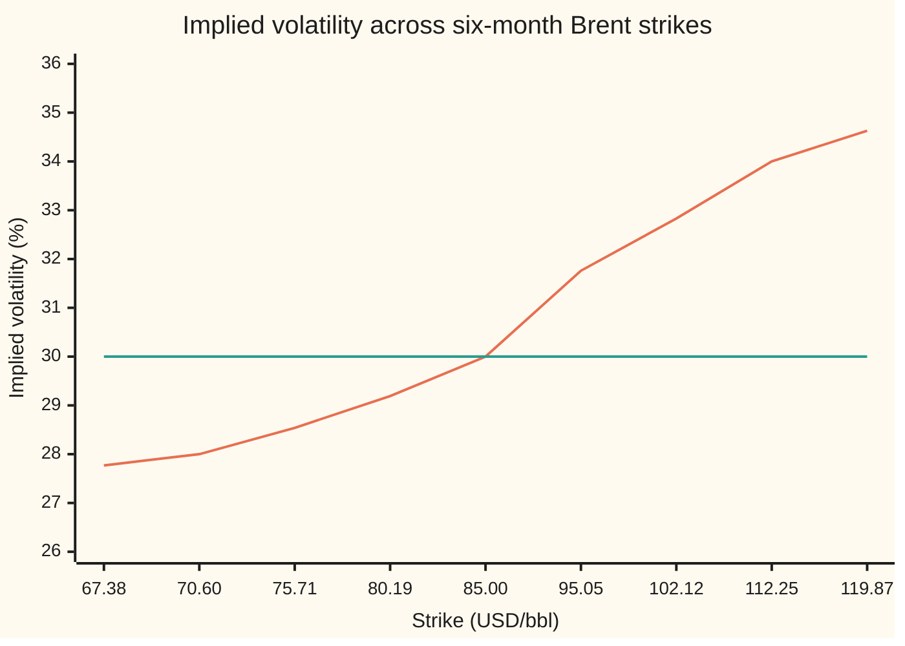
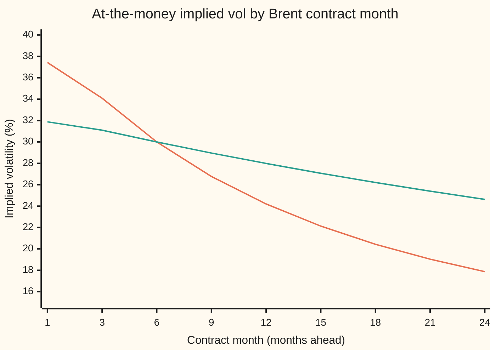

# Implied vol on a futures option and the commodity smile: an upward skew for oil and gas, and vol that fades with maturity

Financial mathematics → Options on commodity futures and spreads → Reading vol off an oil option → Implied vol on a futures option and the commodity smile

---

## General Overview

Brent crude for delivery in six months trades at 85 US dollars a barrel on the futures market. A futures contract is an agreement, made today, to buy oil at a fixed price on a later date. A call option on that contract, struck at 85 and expiring in six months, shows on the screen at 7.002679 dollars a barrel. The call is the right, not the duty, to buy the futures contract at the strike. The bank rate is 5 percent a year.

Every input to the option's pricing formula can be looked up except one: the volatility, how widely the futures price is expected to swing, as a yearly percentage. So the formula is run backwards. The price goes in; the volatility that reproduces it comes out. For 7.002679 it is 30.00 percent.

Run the same inversion across strikes and two facts about oil appear. First, calls far above the market are dearer than puts the same distance below. The 15-delta call, struck far above the market, moves about 15 cents for each dollar the futures moves; it implies 34 percent. The 15-delta put, its mirror below the market, implies 28 percent. Oil spikes up when supply fails, and the options price that in. Second, the further out the contract month, the lower the volatility. The 24-month contract trades near 18 percent. A shock to today's oil supply is expected to fade before a far delivery date, so far contracts barely move.

**Implied vol is the one volatility that makes the futures-option formula match the quote; it exists and is unique when the quote lies strictly between the discounted payoff at zero volatility and the discounted futures price, and for oil and gas it rises with strike and falls with contract month.**

**What kind of fact this is:** a definition (implied vol), made safe by a theorem (one quote, one volatility) proved in Why it works; the upward skew is a market observation, and the fade with maturity comes from a model, the mean-reverting spot, with its formula derived on this card.

### The picture: the Brent strip, six-month options



Rising curve: the implied volatility read off each strike's quote, from the 10-delta put on the left to the 10-delta call on the right. Flat line: the 30 percent at the money. The curve climbs to the right. That is the call skew. An equity strip, as on [volatility-smile-and-skew](../12-The%20smile%20and%20the%20surface/01-volatility-smile-and-skew.md), leans the other way.

---

## The formula

The option is priced by Black's 1976 formula for options on futures, Black-76, taught on [options-on-commodity-futures](01-options-on-commodity-futures.md):

$$C(\sigma) = D\,\big[F\,N(d_1) - K\,N(d_2)\big], \qquad P(\sigma) = D\,\big[K\,N(-d_2) - F\,N(-d_1)\big], \qquad D = e^{-rT}.$$

Implied volatility, written $\sigma_{\text{imp}}$, is defined by one equation, and has a solution exactly inside one range:

$$C(\sigma_{\text{imp}}) = C_{\text{mkt}}, \qquad D\,(F - K)^+ \;<\; C_{\text{mkt}} \;<\; D\,F.$$

**Read it aloud:** the implied volatility is the setting of the volatility dial at which Black-76 matches the screen, and such a setting exists, once only, when the quote sits above the discounted payoff at zero volatility and below the discounted futures price.

Here $(F - K)^+$ means $F - K$ when that is positive, and zero otherwise. For a put the range is $D\,(K - F)^+ < P_{\text{mkt}} < D\,K$.

The strip is summarised by two numbers read at the 15-delta points:

$$\text{RR} = \sigma_{15c} - \sigma_{15p}, \qquad \text{BF} = \tfrac12(\sigma_{15c} + \sigma_{15p}) - \sigma_{\text{ATM}}.$$

**Read it aloud:** the risk reversal is the call's vol minus the put's vol, and the butterfly is how far their average sits above the at-the-money vol. Positive risk reversal means calls are rich.

The fade with contract month, called the Samuelson effect, is one formula when the spot price is pulled back toward a normal level:

$$\sigma_{\text{imp}}(T)^2 = \sigma_S^2\,\frac{1 - e^{-2\kappa T}}{2\kappa T}.$$

**Read it aloud:** the implied variance of a contract delivering in $T$ years is the spot's variance times the average, over the option's life, of how much of each shock survives to delivery, squared.

| Symbol | Plain meaning | In our example | Push it up and the answer… |
| --- | --- | --- | --- |
| $C_{\text{mkt}}$, $P_{\text{mkt}}$ | the call's and put's quoted prices, USD/bbl | 7.002679 | implied vol rises |
| $C$, $P$ | Black-76 call and put prices at volatility $\sigma$ | 7.002679 at 30% | |
| $\sigma$, $\sigma_{\text{imp}}$, $w$, $w_0$, $w_1$ | volatility: yearly spread of the log futures price, a decimal; the one that matches the quote; $w = \sigma\sqrt T$, the total swing, with a small and a large one in the proof | 0.300000 | price rises |
| $F$ | the futures price today | 85 USD/bbl | a call's implied vol falls for the same quote |
| $K$ | the strike | 85 at the money; 67.38 to 119.87 on the strip | a call's implied vol rises for the same quote |
| $D$, $r$ | discount factor $e^{-rT}$; bank rate, continuously compounded | 0.975310; 5% | move floor and ceiling |
| $T$, $t$ | time to expiry in years; a running time between now and $T$ | 0.5 | the same quote implies a lower vol |
| $d_1$, $d_2$ | the formula's two distances, $d_1 = \frac{\ln(F/K) + \frac12\sigma^2 T}{\sigma\sqrt T}$, $d_2 = d_1 - \sigma\sqrt T$ | 0.106066, $-0.106066$ | |
| $N$, $\varphi$ | bell-curve area left of a point, and the bell curve's height | $N(d_1) = 0.542235$ | |
| $\nu$ | vega: dollars gained per unit of $\sigma$, $D\,F\,\varphi(d_1)\sqrt T$ | 23.254860 | |
| $\Delta$, $b$, $c$ | delta, here $N(d_1)$; the tilt and bend of the strip's vol curve in delta | 15-delta call 34%; $b = -0.081250$, $c = 0.052850$ | |
| $\sigma_S$, $\kappa$ | the spot's own volatility; the pull-back speed toward a normal level, per year | 0.393128; 1.2 | far vols rise; far vols fall |

In words: $d_2$ counts how many standard swings the strike sits below the futures price, minus half a swing; $d_1$ is one swing more.

**Convention on this card:** delta means $N(d_1)$, the futures delta without discounting. Some desks multiply by $D$ or subtract the premium; either moves the 15-delta strikes slightly, not the shape of the strip. The premium is paid today, as in an over-the-counter trade, so the price carries $D$.

**Conventions verified 2026-09-28** on ICE's Brent Crude American-style Options page: listed Brent options are American-style, futures-style margined (no premium changes hands up front; the option's value is settled daily, like a futures), and stop trading three business days before their futures. With futures-style margining the fair quote is Black-76 without $D$, and early exercise is worth nothing.

### When it holds

- **European exercise, premium paid today.** Black-76 prices options exercisable only at expiry. A premium-paid American option on futures can be worth more than $D\,F$; its quote may have no answer in this formula. A futures-style margined option, like listed Brent, is inverted with $D = 1$.
- **Agreed inputs.** Rate, time and futures price are fixed first. Treat 85 as a spot price in Black-Scholes and the same quote implies 24.92 percent, not 30: implied vol absorbs every error in the other inputs.
- **Lognormal futures price for the inversion; a smile for the market.** One volatility per strike is a quoting device. The strip's shape is information the model cannot produce.
- **Mean reversion for the term structure.** The Samuelson formula needs a spot that is pulled back toward a normal level at a steady speed. If shocks were permanent ($\kappa = 0$), every contract month would carry the same volatility.
- **Option expiry at the contract's expiry.** Listed Brent options stop three business days before their futures. The formula here ignores that gap.

---

## Why it works

### Step 0: a price that climbs without gaps meets each level once

As the volatility dial turns from zero to endless, the option's price rises steadily, with no jumps and no dips. It starts at a floor and approaches a ceiling without touching either. Every quote strictly between is met once. That is the whole reason a price can be read as a volatility, and it is the argument of [implied-volatility](../11-Implied%20volatility%20and%20the%20vanilla%20inverses/01-implied-volatility.md), with the futures price in place of the share.

### Step 1: the floor and the ceiling for a futures option

Turn volatility to zero. The futures price then ends where it is, at 85. The call pays $F - K$ for sure, or nothing, so its value is $D\,(F - K)^+$. For the at-the-money Brent call that floor is 0.

Turn volatility up without limit. Then $d_1$ runs to plus infinity and $d_2$ to minus infinity, so $N(d_1) \to 1$ and $N(d_2) \to 0$. The price tends to $D\,F = 82.901343$. The reason is plain: the call can never be worth more than the futures contract itself, paid for today, and that costs $D\,F$.

A quote of 83.00 lies above the ceiling. No volatility produces it. Sell the call for 83.00, bank 82.90 and buy one futures contract. At expiry the bank holds 85 and the futures has gained its final price minus 85: together, the final futures price, which covers any call payoff. The 0.10 left over is riskless profit.

### Step 2: the price always climbs, so the answer is unique

Vega is $\nu = D\,F\,\varphi(d_1)\sqrt T$. A discount factor, a price, a bell-curve height and a square root are all positive. So vega is positive at every volatility, and two different volatilities never give the same price. At 30 percent it is 23.254860 dollars per unit of $\sigma$, as [futures-option-greeks](02-futures-option-greeks.md) computes.

<details>
<summary>Detailed proof: vega is positive, the limits are the floor and ceiling, the root is unique</summary>

Write $w = \sigma\sqrt T > 0$ and $m = \ln(F/K)$. Then $d_1 = m/w + w/2$, $d_2 = m/w - w/2$, and $C(w) = D\,[F\,N(d_1) - K\,N(d_2)]$.

**The identity.** $d_1^2 - d_2^2 = (d_1 + d_2)(d_1 - d_2) = (2m/w)\,w = 2m$. So $\varphi(d_1)/\varphi(d_2) = e^{-m} = K/F$, which gives $F\,\varphi(d_1) = K\,\varphi(d_2)$.

**The slope.** $N$ has slope $\varphi$. So $C'(w) = D\,[F\varphi(d_1)\,d_1' - K\varphi(d_2)\,d_2'] = D\,F\varphi(d_1)\,(d_1' - d_2') = D\,F\,\varphi(d_1)$, because $d_1 - d_2 = w$. This is positive. The put, $P = D\,[K\,N(-d_2) - F\,N(-d_1)]$, has the same slope.

**The limits.** As $w \to 0$: if $m > 0$ both $d$ values go to $+\infty$ and $C \to D(F - K)$; if $m < 0$ both go to $-\infty$ and $C \to 0$; if $m = 0$ both go to 0 and $C \to D(F - K)/2 = 0$. As $w \to \infty$: $d_1 \to +\infty$, $d_2 \to -\infty$, $C \to D\,F$.

**Existence and uniqueness.** For a quote strictly inside the range, the limits give a small $w_0$ priced below it and a large $w_1$ priced above. $C$ is continuous, so it meets the quote somewhere between (the intermediate value theorem). Two meeting points would force a zero slope between them (the mean value theorem), and the slope is never zero. For every $w$, $C(w/2) < C(w) < C(2w)$, so the ends of the range are never reached: a quote at either end has no positive, finite volatility.

</details>

### Step 3: find the crossing, two ways

Halving always works inside the range. Start with volatilities from almost zero to 1,000 percent. Price the midpoint, keep the half whose prices still straddle the quote, repeat. Sixty halvings land on 0.300000.

Newton's method is faster. It steps along the slope: new guess = old guess minus (price minus quote) divided by vega. That is [newtons-method](../../06-Calculus%20and%20analysis/03-What%20Derivatives%20Tell%20You/06-newtons-method.md) with vega as the derivative. From a start of 0.5 it reaches 0.300000 in 4 steps. It can fail near the floor or ceiling, where vega is tiny and the step is huge; halving cannot.

### Step 4: read every strike, and the strip leans up

The six-month Brent strip is built from three quotes: 30 percent at the money, 34 percent at the 15-delta call, 28 percent at the 15-delta put. On this card the volatility is a smooth curve in delta between them: $\sigma = 0.30 + b\,(\Delta - \Delta_{\text{ATM}}) + c\,(\Delta - \Delta_{\text{ATM}})^2$, where $\Delta_{\text{ATM}} = 0.542235$ is the delta of the call struck at the futures price. A put's delta is $N(d_1) - 1$, so the 15-delta put is the strike whose call delta is 0.85. This is a simple shape chosen for the example, not a market standard.

A delta and a volatility fix a strike. Since $\Delta = N(d_1)$, the strike is $K = F\,e^{-N^{-1}(\Delta)\,\sigma\sqrt T + \frac12\sigma^2 T}$, where $N^{-1}$ undoes $N$. The 15-delta call lands at 112.25 and the 15-delta put at 70.60. Each strike's out-of-the-money option is priced at its volatility; those prices are the screen. Inverting each price returns its volatility to four decimals. Inverting the put through put-call parity, $C - P = D\,(F - K)$, returns the same number: one strike has one volatility, whichever side is quoted.

The risk reversal is $34 - 28 = +6.0000$ vol points (percentage points of volatility); the butterfly is $+1.0000$. The call skew costs real money. At its 34 percent, the 15-delta call costs 1.396756; at a flat 30 percent it would cost 0.895547. The skew adds 0.501209 dollars a barrel.

Why do calls carry the premium? Three reasons, each about the oil market rather than the formula.

- **Supply shocks move the price up.** A pipeline outage, a hurricane or an export ban cuts supply at once, and demand cannot adjust fast. Prices jump up; they rarely jump down by the same amount.
- **Scarcity raises volatility.** When stocks in storage run low, there is no buffer, so each piece of news moves the price more. High prices and high volatility arrive together. In equities the pairing runs the other way: falling prices come with rising volatility, and the skew leans to puts. The inventory side of this is on [mean-reverting-spot-and-the-futures-curve](../25-Commodity%20forwards%20-%20carry%2C%20storage%2C%20convenience%20yield%20and%20the%20curve/06-mean-reverting-spot-and-the-futures-curve.md).
- **Consumers buy calls.** Airlines and refiners protect themselves against a price spike by buying calls. Producers, who fear a fall, often hedge with futures or sell calls to pay for puts. Net demand sits on the upside.

Natural gas and power show the same lean, often more steeply, because they are harder to store.

### Step 5: why far contracts move less

On a mean-reverting spot, a shock to the price today is expected to fade. The model, from [mean-reverting-spot-and-the-futures-curve](../25-Commodity%20forwards%20-%20carry%2C%20storage%2C%20convenience%20yield%20and%20the%20curve/06-mean-reverting-spot-and-the-futures-curve.md), says the log spot is pulled toward a normal level at speed $\kappa$ a year: a fraction $e^{-\kappa u}$ of any shock is still there $u$ years later. A futures price is the expected spot at delivery. So a shock at time $t$ moves the contract delivering at $T$ by only $e^{-\kappa(T - t)}$ of what it does to the spot. Its volatility at time $t$ is $\sigma_S\,e^{-\kappa(T - t)}$.

The option's implied variance is the average of that squared volatility over the option's life:

$$\sigma_{\text{imp}}(T)^2 = \frac{1}{T}\int_0^T \sigma_S^2\,e^{-2\kappa(T - t)}\,dt = \sigma_S^2\,\frac{1 - e^{-2\kappa T}}{2\kappa T}.$$

The integral is a plain exponential: its antiderivative is $\sigma_S^2\,e^{-2\kappa(T - t)}/(2\kappa)$, evaluated from $0$ to $T$.

On this card $\kappa = 1.2$, so half of any shock is gone in 0.5776 years. The spot's own volatility $\sigma_S = 0.393128$ is set so the six-month contract sits at 30 percent, matching the Brent quote. The formula then predicts every other month. Near expiry, contracts behave like spot and carry close to the spot's own 0.393128. The 24-month contract comes out at 17.87 percent.



Steep curve: pull-back speed $\kappa = 1.2$ a year, falling from 37.43 percent on the one-month contract to 17.87 percent on the 24-month. Gentle curve: $\kappa = 0.3$, both fitted to 30 percent at six months; the 24-month contract then carries 24.63 percent. Slower pull-back, slower fade.

Two more roads check the formula. The integral, added up numerically by Simpson's rule, gives the same row to two decimals. And a simulation that never uses the formula follows 40,000 random paths of the mean-reverting log spot, week by week for two years. The average ending spot is the 24-month futures price. The average call payoff, discounted, is the option's price, 7.775924. Inverted through Black-76, it implies 17.9682 percent: 0.0985 points from the formula, inside the simulation's noise.

---

## Worked numbers, by hand

House Brent: $F = K = 85$, $r = 5\%$, $T = 0.5$, quote $C_{\text{mkt}} = 7.002679$.

| Step | Arithmetic | Value |
| --- | --- | --- |
| discount $D$ | $e^{-0.05 \times 0.5}$ | 0.975310 |
| floor, $D\,(F - K)^+$ | $F = K$ | 0 |
| ceiling, $D\,F$ | $0.975310 \times 85$ | 82.901343 |
| inside? | $0 < 7.002679 < 82.901343$ | yes: one answer |
| try $\sigma = 0.30$: $d_1$ | $(0 + \tfrac12 \times 0.09 \times 0.5) / (0.30 \times \sqrt{0.5})$ | 0.106066 |
| $N(d_1)$, $N(d_2)$ | $d_2 = -0.106066$ | 0.542235, 0.457765 |
| price at 0.30 | $0.975310 \times 85 \times (0.542235 - 0.457765)$ | 7.002679, the quote |
| vega at 0.30 | $0.975310 \times 85 \times \varphi(0.106066) \times \sqrt{0.5}$ | 23.254860 |
| **implied volatility** | | **0.300000, or 30%** |

The 24-month vol, from the Samuelson formula with $\kappa = 1.2$:

| Step | Arithmetic | Value |
| --- | --- | --- |
| six-month factor | $(1 - e^{-1.2}) / 1.2 = (1 - 0.301194)/1.2$ | 0.582338 |
| spot vol $\sigma_S$ | $0.30 / \sqrt{0.582338}$ | 0.393128 |
| 24-month factor | $(1 - e^{-4.8}) / 4.8 = (1 - 0.008230)/4.8$ | 0.206619 |
| its square root | | 0.454553 |
| **24-month implied vol** | $0.393128 \times 0.454553$ | **17.87%** |

A trader quoting the 24-month contract at the front month's 30 percent would charge 12.920768 for its at-the-money call. At the model's 17.87 percent it is worth 7.733545.

### What breaks if you drop a piece

| Mistake | Comes out at | What went wrong |
| --- | --- | --- |
| Treat 85 as a spot price in Black-Scholes, no yield | 0.249215 | The model grows the price at 5% a year; a futures price does not grow, it is already the delivery price |
| Forget the discount $D$ | 0.292566 | The premium is paid today, the payoff in six months ($D = 1$ is right only under futures-style margining) |
| Use one year instead of six months | 0.217523 | More time needs less volatility for the same price |
| Quote 83.00, range not checked | 10.000000 | Above the ceiling 82.901343: no root; the solver stops at its 1,000% edge |
| Price the 24-month call at the front's 30% | 12.920768 instead of 7.733545 | Ignores the fade: overpays 5.187223 |

---

## Code, from first principles, and it actually runs

The code reads 30 percent out of the Brent quote by three roads: halving on Black-76, Newton's method on Black-76, and halving on a price built by averaging the payoff over the bell curve with Simpson's rule, which uses no $d_1$ or $d_2$. It builds the nine-strike strip from the three quoted points, prices each strike, inverts every price back to its volatility, and inverts every put a second time through parity. It computes the Samuelson term structure by three roads: the formula, the integral added up numerically, and a simulation of the mean-reverting spot. It prints every wrong answer in the table above. Mutation tests were run: flipping the sign of the half-variance term in $d_1$, flipping the put's sign, halving the exponent in the Samuelson factor, removing the pull-back from the simulation, removing the drift from the Simpson price, flipping a sign in the strip fit, and deleting the range check each trip an assert.

### Python

```python
# Commodity implied vol and the call skew -- the check behind the card.  Standard library only.
# Nothing imported knows the answer: the normal CDF is a series, the inverse CDF, the root
# finders, the integrator and the random numbers are all written out here.
from math import log, sqrt, exp, pi, cos, sin
def phi(x): return exp(-0.5 * x * x) / sqrt(2.0 * pi)      # bell-curve height at x
def N(x):                                # bell-curve area left of x: 1/2 + phi(x)(x + x^3/3 + x^5/15 + ...)
    if x < -12.0: return 0.0
    if x > 12.0: return 1.0
    term, total, k = x, x, 1
    while abs(term) > 1e-17 * abs(total):
        term *= x * x / (2 * k + 1); total += term; k += 1
    return 0.5 + phi(x) * total
def N_inv(p, lo=-12.0, hi=12.0):         # inverse CDF by halving
    for _ in range(80):
        mid = 0.5 * (lo + hi)
        if N(mid) < p: lo = mid
        else: hi = mid
    return 0.5 * (lo + hi)
def d1(F, K, s, T): return (log(F / K) + 0.5 * s * s * T) / (s * sqrt(T))
def black_call(F, K, r, s, T):           # Black-76 call on a futures price
    a = d1(F, K, s, T); return exp(-r * T) * (F * N(a) - K * N(a - s * sqrt(T)))
def black_put(F, K, r, s, T):            # Black-76 put, written separately
    a = d1(F, K, s, T); return exp(-r * T) * (K * N(s * sqrt(T) - a) - F * N(-a))
def vega(F, K, r, s, T): return exp(-r * T) * F * phi(d1(F, K, s, T)) * sqrt(T)
def call_by_simpson(F, K, r, s, T, n=20000):   # average the payoff over the bell curve: no d1, no d2
    a, b = -10.0, 10.0; h = (b - a) / n
    f = lambda z: max(F * exp(-0.5 * s * s * T + s * sqrt(T) * z) - K, 0.0) * phi(z)
    tot = f(a) + f(b) + sum((4 if i % 2 else 2) * f(a + i * h) for i in range(1, n))
    return exp(-r * T) * tot * h / 3.0
def bisect(price, quote, lo=1e-6, hi=10.0, steps=60):
    for _ in range(steps):
        mid = 0.5 * (lo + hi)
        if price(mid) < quote: lo = mid
        else: hi = mid
    return 0.5 * (lo + hi)
def implied(quote, F, K, r, T, put=False):       # refuse quotes outside the no-arbitrage range
    D = exp(-r * T)
    floor, ceil = (D * max(K - F, 0), D * K) if put else (D * max(F - K, 0), D * F)
    if not floor < quote < ceil: return None
    f = black_put if put else black_call
    return bisect(lambda s: f(F, K, r, s, T), quote)
def newton(quote, F, K, r, T, s=0.5):
    for i in range(1, 50):
        step = (black_call(F, K, r, s, T) - quote) / vega(F, K, r, s, T); s -= step
        if abs(step) < 1e-13: return s, i
    return s, 50
F, K, r, T = 85.0, 85.0, 0.05, 0.5          # house Brent: futures 85, strike 85, 5%, six months
D = exp(-r * T); Q = 7.002679                 # the screen quote, USD/bbl
iv1 = implied(Q, F, K, r, T)
iv2, its = newton(Q, F, K, r, T)
iv3 = bisect(lambda s: call_by_simpson(F, K, r, s, T), Q, 0.1, 0.6, 40)
a0 = d1(F, K, 0.30, T)
print("house Brent: F 85, K 85, r 5%, T 0.5")
rows = [("discount D = e^-rT", D), ("floor D(F-K)+", D * max(F - K, 0)), ("ceiling D F", D * F),
        ("d1 at 0.30", a0), ("N(d1)", N(a0)), ("N(d2)", N(a0 - 0.30 * sqrt(T))),
        ("call at 0.30", black_call(F, K, r, 0.30, T)), ("vega at 0.30", vega(F, K, r, 0.30, T)),
        ("1 implied vol, bisection", iv1), ("2 implied vol, Newton", iv2), ("  Newton steps from 0.5", its),
        ("3 implied vol, Simpson price", iv3)]
for name, v in rows: print(f"  {name:<30} {v:>11.6f}")
# The smile: vol as a quadratic in call delta x = N(d1), pinned at 30% where K = F.
xa = N(0.5 * 0.30 * sqrt(T))                  # delta of the at-the-money-forward call
u, v_ = 0.15 - xa, 0.85 - xa                  # 15-delta call, 15-delta put (call delta 0.85)
det = u * v_ * v_ - v_ * u * u
b = (0.04 * v_ * v_ - (-0.02) * u * u) / det  # vol(x) - 0.30 = b (x - xa) + c (x - xa)^2
c = (u * (-0.02) - v_ * 0.04) / det
vol_at = lambda x: 0.30 + b * (x - xa) + c * (x - xa) ** 2
print(f"\nsmile in delta: xa {xa:.6f}  b {b:.6f}  c {c:.6f}")
print("  label  strike    vol%   quote (OTM side)  implied%  put-via-parity%")
labels = [("10p", 0.90), ("15p", 0.85), ("25p", 0.75), ("35p", 0.65), ("ATMF", xa),
          ("35c", 0.35), ("25c", 0.25), ("15c", 0.15), ("10c", 0.10)]
smile = {}
for lab, x in labels:
    s = vol_at(x); Kx = F * exp(-N_inv(x) * s * sqrt(T) + 0.5 * s * s * T)
    put = x > xa + 1e-12
    q = black_put(F, Kx, r, s, T) if put else black_call(F, Kx, r, s, T)
    iv = implied(q, F, Kx, r, T, put)
    ivp = implied(q + D * (F - Kx), F, Kx, r, T) if put else implied(q - D * (F - Kx), F, Kx, r, T, True)
    smile[lab] = (Kx, s, q, iv, ivp)
    print(f"  {lab:<5} {Kx:7.2f}  {100*s:6.2f}  {q:10.6f} {'P' if put else 'C'}      {100*iv:7.4f}   {100*ivp:7.4f}")
rr = smile["15c"][3] - smile["15p"][3]; fly = 0.5 * (smile["15c"][3] + smile["15p"][3]) - smile["ATMF"][3]
K15 = smile["15c"][0]
c34, c30 = black_call(F, K15, r, 0.34, T), black_call(F, K15, r, 0.30, T)
print(f"  risk reversal 15c - 15p {100*rr:.4f}   butterfly {100*fly:.4f} vol points")
print(f"  15c at 34% {c34:.6f}, at flat 30% {c30:.6f}, richer by {c34 - c30:.6f}")
# Samuelson: option expiring with its contract at T; model spot log-vol sig, pull-back kappa.
kap = 1.2
f = lambda T_, k=kap: (1 - exp(-2 * k * T_)) / (2 * k * T_)
sig = 0.30 / sqrt(f(0.5))                     # fitted so the 6-month contract sits at 30%
def samuel_simpson(T_, n=2000):               # road 2: average sig^2 e^{-2 kap (T-t)} over [0, T]
    h = T_ / n; g = lambda t: sig * sig * exp(-2 * kap * (T_ - t))
    tot = g(0) + g(T_) + sum((4 if i % 2 else 2) * g(i * h) for i in range(1, n))
    return sqrt(tot * h / 3.0 / T_)
print(f"\nSamuelson: kappa {kap}, spot vol {sig:.6f}, half-life {log(2)/kap:.4f} y")
print(f"  by hand: e^-1.2 {exp(-1.2):.6f}  f(0.5) {f(0.5):.6f}  e^-4.8 {exp(-4.8):.6f}  f(2) {f(2.0):.6f}  sqrt f(2) {sqrt(f(2.0)):.6f}")
months = [1, 3, 6, 9, 12, 15, 18, 21, 24]
print("  month   " + " ".join(f"{m:6d}" for m in months))
print("  vol %   " + " ".join(f"{100*sig*sqrt(f(m/12)):6.2f}" for m in months))
print("  simpson " + " ".join(f"{100*samuel_simpson(m/12):6.2f}" for m in months))
print("  k=0.3 % " + " ".join(f"{100*0.30/sqrt(f(0.5,0.3))*sqrt(f(m/12,0.3)):6.2f}" for m in months))
# Road 3: simulate the mean-reverting log spot weekly for two years, price the ATM call, invert.
state = 20260927
def unif():
    global state
    state = (6364136223846793005 * state + 1442695040888963407) % 2**64
    return ((state >> 11) + 0.5) / 2**53
paths, steps, T2 = 40000, 104, 2.0
dt = T2 / steps; ends = []
for _ in range(paths):
    y = 0.0
    for j in range(steps // 2):               # Box-Muller: two normals per pair of uniforms
        u1, u2 = unif(), unif(); rad = sqrt(-2 * log(u1))
        for z in (rad * cos(2 * pi * u2), rad * sin(2 * pi * u2)):
            y += -kap * y * dt + sig * sqrt(dt) * z
    ends.append(exp(y))
m2 = sum(ends) / paths                          # the 24-month futures is the average spot; scale it to 85
C2 = exp(-r * T2) * sum(max(85 * e / m2 - 85, 0) for e in ends) / paths
iv_mc = implied(C2, 85.0, 85.0, r, T2)
print(f"  24m by simulation: raw mean {m2:.6f}, ATM call {C2:.6f}, implied {100*iv_mc:.4f}%, gap {100*(iv_mc - sig*sqrt(f(2.0))):.4f} pts")
print("\nwhat breaks (house quote 7.002679 unless stated)")
bs_spot = lambda s: 85 * N((r + 0.5 * s * s) * T / (s * sqrt(T))) - 85 * D * N((r - 0.5 * s * s) * T / (s * sqrt(T)))
wrong = [("85 as spot, Black-Scholes, no yield", bisect(bs_spot, Q)),
         ("forgot the discount D", bisect(lambda s: F * N(d1(F, K, s, T)) - K * N(d1(F, K, s, T) - s * sqrt(T)), Q)),
         ("T = 1 year, not 6 months", implied(Q, F, K, r, 1.0)),
         ("quote 83.00, bare solver", bisect(lambda s: black_call(F, K, r, s, T), 83.0))]
for name, v in wrong: print(f"  {name:<40} {v:>10.6f}")
v24 = sig * sqrt(f(2.0))
over = black_call(F, K, r, 0.30, 2.0) - black_call(F, K, r, v24, 2.0)
print(f"  24m ATM call at 30% {black_call(F, K, r, 0.30, 2.0):.6f}, at {100*v24:.2f}% {black_call(F, K, r, v24, 2.0):.6f}: overpays {over:.6f}")
assert abs(iv1 - 0.30) < 1e-6 and abs(iv2 - iv1) < 1e-9, "7.002679 was made at 30%: both solvers recover it"
assert abs(iv3 - iv1) < 1e-6, "a price built by Simpson averaging gives the same vol"
assert all(abs(k_[3] - k_[1]) < 1e-9 and abs(k_[4] - k_[1]) < 1e-9 for k_ in smile.values()), "every quote inverts to its smile vol, both sides of parity"
assert abs(smile["15c"][1] - 0.34) < 1e-12 and abs(smile["15p"][1] - 0.28) < 1e-12 and abs(smile["ATMF"][0] - F) < 1e-9, "smile pinned"
assert all(abs(sig * sqrt(f(m / 12)) - samuel_simpson(m / 12)) < 1e-7 for m in months), "closed form vs integral"
assert abs(iv_mc - v24) < 0.006, "simulated spot gives the 24-month vol within noise"
assert implied(83.0, F, K, r, T) is None and wrong[3][1] > 9.99, "83 is above the ceiling: no vol, bare solver hits its edge"
print("ALL CHECKS PASS")
```

**Ran 2026-09-27 on macOS, Python 3.14.6, standard library only. All checks passed. Output, pasted from the run:**

```
house Brent: F 85, K 85, r 5%, T 0.5
  discount D = e^-rT                0.975310
  floor D(F-K)+                     0.000000
  ceiling D F                      82.901343
  d1 at 0.30                        0.106066
  N(d1)                             0.542235
  N(d2)                             0.457765
  call at 0.30                      7.002679
  vega at 0.30                     23.254860
  1 implied vol, bisection          0.300000
  2 implied vol, Newton             0.300000
    Newton steps from 0.5           4.000000
  3 implied vol, Simpson price      0.300000

smile in delta: xa 0.542235  b -0.081250  c 0.052850
  label  strike    vol%   quote (OTM side)  implied%  put-via-parity%
  10p     67.38   27.77    0.838502 P      27.7696   27.7696
  15p     70.60   28.00    1.397761 P      28.0000   28.0000
  25p     75.71   28.54    2.771964 P      28.5400   28.5400
  35p     80.19   29.19    4.536808 P      29.1858   29.1858
  ATMF    85.00   30.00    7.002679 C      30.0000   30.0000
  35c     95.05   31.76    3.895864 C      31.7572   31.7572
  25c    102.12   32.83    2.567685 C      32.8258   32.8258
  15c    112.25   34.00    1.396756 C      34.0000   34.0000
  10c    119.87   34.63    0.871533 C      34.6268   34.6268
  risk reversal 15c - 15p 6.0000   butterfly 1.0000 vol points
  15c at 34% 1.396756, at flat 30% 0.895547, richer by 0.501209

Samuelson: kappa 1.2, spot vol 0.393128, half-life 0.5776 y
  by hand: e^-1.2 0.301194  f(0.5) 0.582338  e^-4.8 0.008230  f(2) 0.206619  sqrt f(2) 0.454553
  month        1      3      6      9     12     15     18     21     24
  vol %    37.43  34.09  30.00  26.77  24.20  22.13  20.43  19.04  17.87
  simpson  37.43  34.09  30.00  26.77  24.20  22.13  20.43  19.04  17.87
  k=0.3 %  31.88  31.10  30.00  28.96  27.99  27.07  26.21  25.40  24.63
  24m by simulation: raw mean 1.034651, ATM call 7.775924, implied 17.9682%, gap 0.0985 pts

what breaks (house quote 7.002679 unless stated)
  85 as spot, Black-Scholes, no yield        0.249215
  forgot the discount D                      0.292566
  T = 1 year, not 6 months                   0.217523
  quote 83.00, bare solver                  10.000000
  24m ATM call at 30% 12.920768, at 17.87% 7.733545: overpays 5.187223
ALL CHECKS PASS
```

### Rust

```rust
// Commodity implied vol and the call skew -- the same check as the Python file, in Rust.
// Standard library only, no crates.  Rust has no erf, so the bell-curve area N(x) is built
// by adding thin slices under the curve (Simpson's rule).  Every other tool is written out too.
use std::f64::consts::PI;
fn phi(x: f64) -> f64 { (-0.5 * x * x).exp() / (2.0 * PI).sqrt() }     // bell-curve height at x
fn simpson(f: &dyn Fn(f64) -> f64, a: f64, b: f64, n: usize) -> f64 {
    let h = (b - a) / n as f64;
    let mut s = f(a) + f(b);
    for i in 1..n { s += if i % 2 == 1 { 4.0 } else { 2.0 } * f(a + i as f64 * h); }
    s * h / 3.0
}
fn n_cdf(x: f64) -> f64 {
    if x < -12.0 { return 0.0; }
    if x > 12.0 { return 1.0; }
    0.5 + simpson(&phi, 0.0, x, 4000)
}
fn n_inv(p: f64) -> f64 {                                                // inverse CDF by halving
    let (mut lo, mut hi) = (-12.0, 12.0);
    for _ in 0..80 { let mid = 0.5 * (lo + hi); if n_cdf(mid) < p { lo = mid; } else { hi = mid; } }
    0.5 * (lo + hi)
}
fn d1(f: f64, k: f64, s: f64, t: f64) -> f64 { ((f / k).ln() + 0.5 * s * s * t) / (s * t.sqrt()) }
fn black_call(f: f64, k: f64, r: f64, s: f64, t: f64) -> f64 {        // Black-76 call on a futures price
    let a = d1(f, k, s, t); (-r * t).exp() * (f * n_cdf(a) - k * n_cdf(a - s * t.sqrt()))
}
fn black_put(f: f64, k: f64, r: f64, s: f64, t: f64) -> f64 {         // Black-76 put, written separately
    let a = d1(f, k, s, t); (-r * t).exp() * (k * n_cdf(s * t.sqrt() - a) - f * n_cdf(-a))
}
fn vega(f: f64, k: f64, r: f64, s: f64, t: f64) -> f64 { (-r * t).exp() * f * phi(d1(f, k, s, t)) * t.sqrt() }
fn call_by_simpson(f: f64, k: f64, r: f64, s: f64, t: f64) -> f64 { // average the payoff: no d1, no d2
    let g = |z: f64| (f * (-0.5 * s * s * t + s * t.sqrt() * z).exp() - k).max(0.0) * phi(z);
    (-r * t).exp() * simpson(&g, -10.0, 10.0, 20000)
}
fn bisect(price: &dyn Fn(f64) -> f64, quote: f64, mut lo: f64, mut hi: f64, steps: usize) -> f64 {
    for _ in 0..steps { let mid = 0.5 * (lo + hi); if price(mid) < quote { lo = mid; } else { hi = mid; } }
    0.5 * (lo + hi)
}
fn implied(quote: f64, f: f64, k: f64, r: f64, t: f64, put: bool) -> Option<f64> {
    let d = (-r * t).exp();
    let (floor, ceil) = if put { (d * (k - f).max(0.0), d * k) } else { (d * (f - k).max(0.0), d * f) };
    if !(floor < quote && quote < ceil) { return None; }                 // outside the range: no vol
    Some(if put { bisect(&|s| black_put(f, k, r, s, t), quote, 1e-6, 10.0, 60) }
         else { bisect(&|s| black_call(f, k, r, s, t), quote, 1e-6, 10.0, 60) })
}
fn newton(quote: f64, f: f64, k: f64, r: f64, t: f64) -> (f64, usize) {
    let mut s = 0.5;
    for i in 1..50 {
        let step = (black_call(f, k, r, s, t) - quote) / vega(f, k, r, s, t); s -= step;
        if step.abs() < 1e-13 { return (s, i); }
    }
    (s, 50)
}
fn main() {
    let (f, k, r, t) = (85.0_f64, 85.0_f64, 0.05_f64, 0.5_f64);         // house Brent
    let d = (-r * t).exp(); let q = 7.002679_f64;
    let iv1 = implied(q, f, k, r, t, false).unwrap();
    let (iv2, its) = newton(q, f, k, r, t);
    let iv3 = bisect(&|s| call_by_simpson(f, k, r, s, t), q, 0.1, 0.6, 40);
    let a0 = d1(f, k, 0.30, t);
    println!("house Brent: F 85, K 85, r 5%, T 0.5");
    let rows: Vec<(&str, f64)> = vec![("discount D = e^-rT", d), ("floor D(F-K)+", d * (f - k).max(0.0)), ("ceiling D F", d * f),
        ("d1 at 0.30", a0), ("N(d1)", n_cdf(a0)), ("N(d2)", n_cdf(a0 - 0.30 * t.sqrt())),
        ("call at 0.30", black_call(f, k, r, 0.30, t)), ("vega at 0.30", vega(f, k, r, 0.30, t)),
        ("1 implied vol, bisection", iv1), ("2 implied vol, Newton", iv2), ("  Newton steps from 0.5", its as f64),
        ("3 implied vol, Simpson price", iv3)];
    for (name, v) in &rows { println!("  {:<30} {:>11.6}", name, v); }
    // The smile: vol as a quadratic in call delta x = N(d1), pinned at 30% where K = F.
    let xa = n_cdf(0.5 * 0.30 * t.sqrt());
    let (u, v) = (0.15 - xa, 0.85 - xa);
    let det = u * v * v - v * u * u;
    let b = (0.04 * v * v - (-0.02) * u * u) / det;
    let c = (u * (-0.02) - v * 0.04) / det;
    let vol_at = |x: f64| 0.30 + b * (x - xa) + c * (x - xa).powi(2);
    println!("\nsmile in delta: xa {:.6}  b {:.6}  c {:.6}", xa, b, c);
    println!("  label  strike    vol%   quote (OTM side)  implied%  put-via-parity%");
    let labels = [("10p", 0.90), ("15p", 0.85), ("25p", 0.75), ("35p", 0.65), ("ATMF", xa),
                  ("35c", 0.35), ("25c", 0.25), ("15c", 0.15), ("10c", 0.10)];
    let mut smile: Vec<(&str, f64, f64, f64, f64)> = Vec::new();         // label, strike, vol, implied, via parity
    for &(lab, x) in &labels {
        let s = vol_at(x); let kx = f * (-n_inv(x) * s * t.sqrt() + 0.5 * s * s * t).exp();
        let put = x > xa + 1e-12;
        let qt = if put { black_put(f, kx, r, s, t) } else { black_call(f, kx, r, s, t) };
        let iv = implied(qt, f, kx, r, t, put).unwrap();
        let ivp = if put { implied(qt + d * (f - kx), f, kx, r, t, false) } else { implied(qt - d * (f - kx), f, kx, r, t, true) }.unwrap();
        println!("  {:<5} {:7.2}  {:6.2}  {:10.6} {}      {:7.4}   {:7.4}", lab, kx, 100.0 * s, qt, if put { "P" } else { "C" }, 100.0 * iv, 100.0 * ivp);
        smile.push((lab, kx, s, iv, ivp));
    }
    let get = |l: &str| *smile.iter().find(|e| e.0 == l).unwrap();
    let rr = get("15c").3 - get("15p").3; let fly = 0.5 * (get("15c").3 + get("15p").3) - get("ATMF").3;
    let k15 = get("15c").1;
    let (c34, c30) = (black_call(f, k15, r, 0.34, t), black_call(f, k15, r, 0.30, t));
    println!("  risk reversal 15c - 15p {:.4}   butterfly {:.4} vol points", 100.0 * rr, 100.0 * fly);
    println!("  15c at 34% {:.6}, at flat 30% {:.6}, richer by {:.6}", c34, c30, c34 - c30);
    // Samuelson: option expiring with its contract at T; spot log-vol sig, pull-back kappa.
    let kap = 1.2_f64;
    let fr = |tt: f64, kk: f64| (1.0 - (-2.0 * kk * tt).exp()) / (2.0 * kk * tt);
    let sig = 0.30 / fr(0.5, kap).sqrt();
    let samuel_simpson = |tt: f64| (simpson(&|x: f64| sig * sig * (-2.0 * kap * (tt - x)).exp(), 0.0, tt, 2000) / tt).sqrt();
    println!("\nSamuelson: kappa {}, spot vol {:.6}, half-life {:.4} y", kap, sig, 2.0_f64.ln() / kap);
    println!("  by hand: e^-1.2 {:.6}  f(0.5) {:.6}  e^-4.8 {:.6}  f(2) {:.6}  sqrt f(2) {:.6}", (-1.2_f64).exp(), fr(0.5, kap), (-4.8_f64).exp(), fr(2.0, kap), fr(2.0, kap).sqrt());
    let months = [1, 3, 6, 9, 12, 15, 18, 21, 24];
    let line = |g: &dyn Fn(f64) -> f64| months.iter().map(|&m| format!("{:6.2}", 100.0 * g(m as f64 / 12.0))).collect::<Vec<_>>().join(" ");
    println!("  month   {}", months.iter().map(|m| format!("{:6}", m)).collect::<Vec<_>>().join(" "));
    println!("  vol %   {}", line(&|tt| sig * fr(tt, kap).sqrt()));
    println!("  simpson {}", line(&|tt| samuel_simpson(tt)));
    println!("  k=0.3 % {}", line(&|tt| 0.30 / fr(0.5, 0.3).sqrt() * fr(tt, 0.3).sqrt()));
    // Road 3: simulate the mean-reverting log spot weekly for two years, price the ATM call, invert.
    let mut state: u64 = 20260927;
    let mut unif = || { state = state.wrapping_mul(6364136223846793005).wrapping_add(1442695040888963407);
                        ((state >> 11) as f64 + 0.5) / 9007199254740992.0 };
    let (paths, steps, t2) = (40000usize, 104usize, 2.0_f64);
    let dt = t2 / steps as f64; let mut ends = Vec::with_capacity(paths);
    for _ in 0..paths {
        let mut y = 0.0_f64;
        for _ in 0..steps / 2 {                                          // Box-Muller: two normals per pair
            let (u1, u2) = (unif(), unif()); let rad = (-2.0 * u1.ln()).sqrt();
            for z in [rad * (2.0 * PI * u2).cos(), rad * (2.0 * PI * u2).sin()] { y += -kap * y * dt + sig * dt.sqrt() * z; }
        }
        ends.push(y.exp());
    }
    let m2 = ends.iter().sum::<f64>() / paths as f64;                    // the 24-month futures: average spot, scaled to 85
    let c2 = (-r * t2).exp() * ends.iter().map(|e| (85.0 * e / m2 - 85.0).max(0.0)).sum::<f64>() / paths as f64;
    let iv_mc = implied(c2, 85.0, 85.0, r, t2, false).unwrap();
    println!("  24m by simulation: raw mean {:.6}, ATM call {:.6}, implied {:.4}%, gap {:.4} pts", m2, c2, 100.0 * iv_mc, 100.0 * (iv_mc - sig * fr(2.0, kap).sqrt()));
    println!("\nwhat breaks (house quote 7.002679 unless stated)");
    let bs_spot = |s: f64| 85.0 * n_cdf((r + 0.5 * s * s) * t / (s * t.sqrt())) - 85.0 * d * n_cdf((r - 0.5 * s * s) * t / (s * t.sqrt()));
    let wrong: Vec<(&str, f64)> = vec![("85 as spot, Black-Scholes, no yield", bisect(&bs_spot, q, 1e-6, 10.0, 60)),
        ("forgot the discount D", bisect(&|s| f * n_cdf(d1(f, k, s, t)) - k * n_cdf(d1(f, k, s, t) - s * t.sqrt()), q, 1e-6, 10.0, 60)),
        ("T = 1 year, not 6 months", implied(q, f, k, r, 1.0, false).unwrap()),
        ("quote 83.00, bare solver", bisect(&|s| black_call(f, k, r, s, t), 83.0, 1e-6, 10.0, 60))];
    for (name, v) in &wrong { println!("  {:<40} {:>10.6}", name, v); }
    let v24 = sig * fr(2.0, kap).sqrt();
    let over = black_call(f, k, r, 0.30, 2.0) - black_call(f, k, r, v24, 2.0);
    println!("  24m ATM call at 30% {:.6}, at {:.2}% {:.6}: overpays {:.6}", black_call(f, k, r, 0.30, 2.0), 100.0 * v24, black_call(f, k, r, v24, 2.0), over);
    assert!((iv1 - 0.30).abs() < 1e-6 && (iv2 - iv1).abs() < 1e-9, "7.002679 was made at 30%: both solvers recover it");
    assert!((iv3 - iv1).abs() < 1e-6, "a price built by Simpson averaging gives the same vol");
    assert!(smile.iter().all(|e| (e.3 - e.2).abs() < 1e-9 && (e.4 - e.2).abs() < 1e-9), "every quote inverts to its smile vol, both sides of parity");
    assert!((get("15c").2 - 0.34).abs() < 1e-12 && (get("15p").2 - 0.28).abs() < 1e-12 && (get("ATMF").1 - f).abs() < 1e-9, "smile pinned");
    assert!(months.iter().all(|&m| (sig * fr(m as f64 / 12.0, kap).sqrt() - samuel_simpson(m as f64 / 12.0)).abs() < 1e-7), "closed form vs integral");
    assert!((iv_mc - v24).abs() < 0.006, "simulated spot gives the 24-month vol within noise");
    assert!(implied(83.0, f, k, r, t, false).is_none() && wrong[3].1 > 9.99, "83 is above the ceiling: no vol, bare solver hits its edge");
    println!("ALL CHECKS PASS");
}
```

**Ran 2026-09-27 on macOS, rustc 1.98.1, no crates. All checks passed. Output, pasted from the run:**

```
house Brent: F 85, K 85, r 5%, T 0.5
  discount D = e^-rT                0.975310
  floor D(F-K)+                     0.000000
  ceiling D F                      82.901343
  d1 at 0.30                        0.106066
  N(d1)                             0.542235
  N(d2)                             0.457765
  call at 0.30                      7.002679
  vega at 0.30                     23.254860
  1 implied vol, bisection          0.300000
  2 implied vol, Newton             0.300000
    Newton steps from 0.5           4.000000
  3 implied vol, Simpson price      0.300000

smile in delta: xa 0.542235  b -0.081250  c 0.052850
  label  strike    vol%   quote (OTM side)  implied%  put-via-parity%
  10p     67.38   27.77    0.838502 P      27.7696   27.7696
  15p     70.60   28.00    1.397761 P      28.0000   28.0000
  25p     75.71   28.54    2.771964 P      28.5400   28.5400
  35p     80.19   29.19    4.536808 P      29.1858   29.1858
  ATMF    85.00   30.00    7.002679 C      30.0000   30.0000
  35c     95.05   31.76    3.895864 C      31.7572   31.7572
  25c    102.12   32.83    2.567685 C      32.8258   32.8258
  15c    112.25   34.00    1.396756 C      34.0000   34.0000
  10c    119.87   34.63    0.871533 C      34.6268   34.6268
  risk reversal 15c - 15p 6.0000   butterfly 1.0000 vol points
  15c at 34% 1.396756, at flat 30% 0.895547, richer by 0.501209

Samuelson: kappa 1.2, spot vol 0.393128, half-life 0.5776 y
  by hand: e^-1.2 0.301194  f(0.5) 0.582338  e^-4.8 0.008230  f(2) 0.206619  sqrt f(2) 0.454553
  month        1      3      6      9     12     15     18     21     24
  vol %    37.43  34.09  30.00  26.77  24.20  22.13  20.43  19.04  17.87
  simpson  37.43  34.09  30.00  26.77  24.20  22.13  20.43  19.04  17.87
  k=0.3 %  31.88  31.10  30.00  28.96  27.99  27.07  26.21  25.40  24.63
  24m by simulation: raw mean 1.034651, ATM call 7.775924, implied 17.9682%, gap 0.0985 pts

what breaks (house quote 7.002679 unless stated)
  85 as spot, Black-Scholes, no yield        0.249215
  forgot the discount D                      0.292566
  T = 1 year, not 6 months                   0.217523
  quote 83.00, bare solver                  10.000000
  24m ATM call at 30% 12.920768, at 17.87% 7.733545: overpays 5.187223
ALL CHECKS PASS
```

The two outputs agree line for line, including the simulation: both use the same random-number rule, and they build the bell-curve area differently, a series in Python and Simpson's rule in Rust.

> [!TIP]
> **Try changing**
> Guess first, then run.
> - **Slow the pull-back** to $\kappa = 0.3$, refitting the spot vol to 30 percent at six months. Guess the 24-month vol. The answer is 24.63 percent: a slower fade.
> - **Quote 83.00** for the Brent call. The range check refuses it, since the ceiling is 82.901343. Remove the check and bisection prints 10.000000, a 1,000 percent "volatility".
> - **Flatten the skew** by pricing the 15-delta call at 30 percent. Guess the price. It is 0.895547, against 1.396756 at the skewed 34 percent.
> - **Start Newton at 0.5.** It takes 4 steps to reach 0.300000. Halving takes sixty.

---

## The usual mistake

> [!warning]
> **Reading the call skew with an equity eye.** On a share index, calls usually imply less than puts, and a high call vol looks like a mispricing to sell. In oil and gas, when supply is the worry, the lean is upward. The 15-delta call at 34 percent against the put at 28 percent is the market pricing supply spikes, not an error. Selling it as "rich" is selling insurance against the shock the market fears most.
>
> Smaller traps:
> - **Spot model on a futures price.** Black-Scholes with 85 as spot and no yield turns 30 percent into 24.92 percent. The futures price is already the delivery price and does not grow.
> - **One vol for every contract month.** Quoting the 24-month contract at the six-month 30 percent prices its at-the-money call at 12.920768, where the Samuelson model gives 7.733545.
> - **Skipping the range check.** 83.00 is above the ceiling 82.901343, yet a bare solver returns 10.000000.
> - **Forgetting the discount.** For a premium paid today, dropping $D$ gives 29.26 percent. Small here; larger for long-dated options. The opposite slip, discounting a futures-style margined quote, is as wrong.

---

## Where you meet it in real life

- **Oil options screens.** Brent and WTI options on futures are quoted in volatility across strikes and contract months. When supply is the worry the call wing trades above the put wing; in a demand collapse crude's skew can tip toward puts. The front months carry the highest vols.
- **Hedging programs.** An airline buying calls to cap its fuel bill pays the call skew. A producer buying puts pays less for its protection, and often sells calls to fund it, a collar that sells the skew back.
- **Spread options.** The two legs of a crack spread each carry their own vol, read off their own strips; the next step is [margrabe-and-kirk-spread-options](04-margrabe-and-kirk-spread-options.md), and the correlation between legs is read out of a price the same way on [implied-correlation-from-a-spread-option](06-implied-correlation-from-a-spread-option.md).
- **Power and gas.** Electricity cannot be stored, so its spikes are sharper and its front-month vols much higher: [electricity-and-the-spark-spread](07-electricity-and-the-spark-spread.md).
- **Risk systems.** A bank's commodity book stores a vol surface indexed by contract month and delta. The Samuelson shape is the first thing checked when a long-dated vol looks wrong.

> **Say it back**
> A futures option's price rises steadily with volatility, from the discounted payoff at zero vol to the discounted futures price. So every quote strictly inside has one implied volatility, found by halving or Newton; Brent at 7.002679 gives 30 percent. Read across strikes, oil's vols climb to the right: the 15-delta call at 34 percent against the put at 28 percent, because supply shocks spike prices up. Read across contract months, vols fall, because a mean-reverting spot lets today's shocks fade before far delivery dates; the 24-month contract sits near 18 percent. Implied vol is a price in different units, and oil's units lean up and fade out.

---

## What this builds on

- [futures-option-greeks](02-futures-option-greeks.md): vega for a futures option, the slope that makes the answer unique and drives Newton.
- [mean-reverting-spot-and-the-futures-curve](../25-Commodity%20forwards%20-%20carry%2C%20storage%2C%20convenience%20yield%20and%20the%20curve/06-mean-reverting-spot-and-the-futures-curve.md): the pull-back model whose shocks fade at speed $\kappa$.
- [implied-volatility](../11-Implied%20volatility%20and%20the%20vanilla%20inverses/01-implied-volatility.md): the inverse for a share option, with the same floor-ceiling proof.
- [volatility-smile-and-skew](../12-The%20smile%20and%20the%20surface/01-volatility-smile-and-skew.md): reading one volatility per strike, and why the curve is not flat.
- [newtons-method](../../06-Calculus%20and%20analysis/03-What%20Derivatives%20Tell%20You/06-newtons-method.md): the fast root finder used as the second road.

## Where this goes next

- [asian-implied-volatility](../27-Averages%20-%20commodity%20swaps%20and%20Asian%20options/05-asian-implied-volatility.md): the same inverse for options on an average price, where the answer depends on which model turns price into vol.
- [margrabe-and-kirk-spread-options](04-margrabe-and-kirk-spread-options.md): two futures, two vols from two strips, one option on their difference.

This card reads one volatility per strike and per month; what an option on a month's average price implies, when the vols of many contract months blend into one, is the question the Asian card answers.

---

## Sources

Verified 2026-09-28: every link below resolves to the publisher's page, and each DOI's title and first author match on Crossref.

- Black, Fischer. "The Pricing of Commodity Contracts." *Journal of Financial Economics* 3, no. 1–2 (1976): 167–179. [doi:10.1016/0304-405X(76)90024-6](https://doi.org/10.1016/0304-405X(76)90024-6). The futures-option formula this card inverts.
- Schwartz, Eduardo S. "The Stochastic Behavior of Commodity Prices: Implications for Valuation and Hedging." *Journal of Finance* 52, no. 3 (1997): 923–973. [doi:10.1111/j.1540-6261.1997.tb02721.x](https://doi.org/10.1111/j.1540-6261.1997.tb02721.x). The mean-reverting spot and the futures volatility that decays with maturity.
- Manaster, Steven, and Gary J. Koehler. "The Calculation of Implied Variances from the Black-Scholes Model: A Note." *Journal of Finance* 37, no. 1 (1982): 227–230. [doi:10.1111/j.1540-6261.1982.tb01105.x](https://doi.org/10.1111/j.1540-6261.1982.tb01105.x). Uniqueness of implied volatility and a safe start for Newton's method.
- Geman, Hélyette. *Commodities and Commodity Derivatives: Modeling and Pricing for Agriculturals, Metals and Energy*. Wiley, 2005. [Publisher page](https://www.wiley.com/en-us/Commodities+and+Commodity+Derivatives%3A+Modeling+and+Pricing+for+Agriculturals%2C+Metals+and+Energy-p-9780470012185). Commodity volatility, its term structure and the inventory story behind the upward skew.
- ICE Futures Europe. "Brent Crude American-style Options: contract specification." [ICE product page](https://www.ice.com/products/218/Brent-Crude-American-style-Option/specs). American exercise, futures-style margining and the last trading day; conventions verified 2026-09-28.
