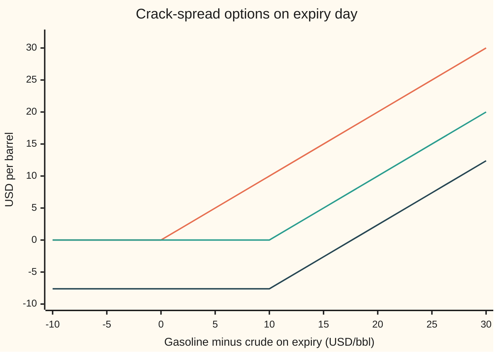
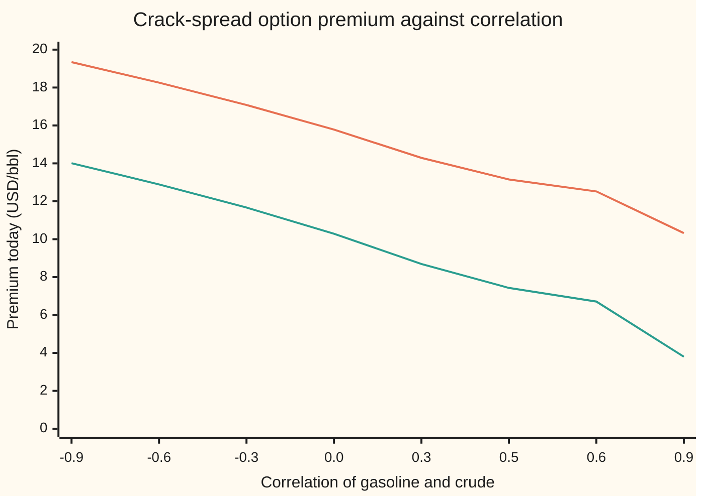

# Spread options: exchanging one price for another with Margrabe's exact formula, and Kirk's shortcut when there is a strike

[Syllabus](../../../SYLLABUS.md) → [Financial mathematics](../README.md) → [Options on commodity futures and spreads](../README.md#s26) → Spread options

---

## General Overview

A refinery buys crude oil and sells gasoline. Its margin is the gap between the two prices, called the **crack spread**: the price at which crude is "cracked" into products. Six months out, gasoline futures trade at **100 dollars a barrel** and crude futures at **90**. The gap today is 10 dollars. Nobody knows what it will be in six months.

A **spread option** pays on that gap. The simplest one pays the gap itself if it is positive, and nothing otherwise: at expiry the holder receives gasoline minus crude, or walks away. That is an option to hand over a barrel of crude and take a barrel of gasoline in return, an **exchange option**. With gasoline wandering 30 percent a year, crude 25 percent, the two moving together with a correlation of 0.5, and a 5 percent bank rate, the exchange option is worth **13.15 dollars a barrel** today.

Add a **strike** of 10 and the holder receives the gap minus 10, when that is positive: a bet that the margin widens beyond today's 10. That option is worth **7.43**. It has no exact formula. Kirk's shortcut gives 7.43, a simulation of 400,000 correlated pairs of expiry prices gives 7.46 with a standard error of 1.87 cents, and an exact one-dimensional integral agrees with Kirk to a ten-thousandth of a cent.

One input matters here that a single-asset option never had: the **correlation**, how firmly the two prices move together. Two prices that move as one keep their gap steady, and a steady gap makes a cheap option. At zero correlation the exchange option costs **15.78**. Correlation is the steering wheel.

**An option on the gap between two futures prices is a call on their ratio, counted in units of the second price; with no strike that gives Margrabe's exact formula, whose one volatility is the ratio's, and with a strike Kirk folds the strike into the second price and reuses the same formula.**

**What kind of fact this is:** a model, both futures taken to wander lognormally with fixed volatilities and a fixed correlation; inside it Margrabe's formula is a theorem, proved on this card in Why it works, and Kirk's is an approximation, its error measured on this card: under a tenth of a cent here, a few cents when the legs are loosely tied.

### The picture: what the options pay on expiry day



The top line is the exchange option's payoff: the gap, once it is positive. The middle line is the payoff with a strike of 10. The bottom line is the buyer's profit on the strike-10 option after its 7.43 premium, grown at 5 percent to 7.62 by expiry. The gap must beat the strike by the grown premium before that buyer is ahead. Two prices sit behind the one number on the horizontal axis, and the premium depends on how they move together.

---

## The formula

Notation first, in words. $F_1$ is the gasoline futures price and $F_2$ the crude futures price, both in dollars a barrel today; $F_1(T)$ and $F_2(T)$ are the same quotes on expiry day. $\sigma_1$ and $\sigma_2$ (say "sigma one", "sigma two") are their volatilities, each a fraction of its own price per square-root year. $\rho$ (say "rho") is the correlation between their moves. $D = e^{-rT}$ is the discount factor for the bank rate $r$ over $T$ years. $N(x)$ is the bell-curve area to the left of $x$.

The spread call pays $\max(F_1(T) - F_2(T) - K,\ 0)$. With strike $K = 0$, Margrabe's formula:

$$V = D\,\bigl[F_1\,N(d_1) - F_2\,N(d_2)\bigr], \qquad \sigma = \sqrt{\sigma_1^2 + \sigma_2^2 - 2\rho\,\sigma_1\sigma_2}$$

$$d_1 = \frac{\ln(F_1/F_2) + \tfrac12\sigma^2 T}{\sigma\sqrt{T}}, \qquad d_2 = d_1 - \sigma\sqrt{T}$$

**Read it aloud:** the gasoline the holder might take minus the crude the holder might hand over, each weighted by its own chance, discounted once; and the only volatility is that of gasoline measured in barrels of crude.

This is the Black-76 call of [Options on a futures price](01-options-on-commodity-futures.md) with crude in the strike's place and the **ratio volatility** $\sigma$ in the volatility's place. The bank rate appears only in the discount $D$. It never enters $d_1$, because both legs are futures that drift nowhere and the rate has nothing to tilt.

With a strike, Kirk's approximation treats "crude plus strike" as one price and reuses the formula:

$$V_K \approx D\,\bigl[F_1\,N(d_1^K) - (F_2 + K)\,N(d_2^K)\bigr], \qquad \sigma_K = \sqrt{\sigma_1^2 - 2\rho\,\sigma_1\sigma_2\,a + \sigma_2^2 a^2}, \qquad a = \frac{F_2}{F_2 + K}$$

with $d_1^K$ and $d_2^K$ built as above from $F_1$, $F_2 + K$ and $\sigma_K$.

**Read it aloud:** the strike is glued onto the crude leg; crude's wiggle, spread over a bigger number, shrinks by the factor $a$; then Margrabe runs as before.

| Symbol | Plain meaning | In our example | Push it up and the option… |
| --- | --- | --- | --- |
| $F_1$, $F_1(T)$ | gasoline futures price, today and on expiry | 100 USD/bbl | rises: more to take |
| $F_2$, $F_2(T)$ | crude futures price, today and on expiry | 90 USD/bbl | falls: more to hand over |
| $K$ | strike on the gap | 0, then 10 | falls: the gap must widen further |
| $T$ | years to the option's expiry | 0.5 | rises: more room for the gap to move |
| $r$, $D$ | bank rate, and discount factor $e^{-rT}$ | 5 percent, 0.975310 | falls slightly: heavier discounting |
| $\sigma_1$, $\sigma_2$ | volatilities of gasoline and crude | 30 and 25 percent | rises, unless the other leg is far jumpier and closely tied |
| $\rho$, $Z_1$, $Z_2$ | correlation of the two legs' moves, from −1 to +1; $Z_1$ and $Z_2$ are the legs' standard bell-curve shocks, correlated by $\rho$ | 0.5 | falls: about 6 cents per +0.01 |
| $R$, $\sigma$ | the ratio $F_1/F_2$, gasoline priced in barrels of crude, and its volatility | 100/90; 27.84 percent | rises |
| $a$, $\sigma_K$ | crude's share of "crude plus strike", and Kirk's volatility | 0.9, 27.04 percent | — |
| $N(x)$, $\phi(x)$ | bell-curve area to the left of $x$, and its height at $x$ | — | — |
| $d_1$, $d_2$ | log lead of gasoline over crude in units of $\sigma\sqrt{T}$, plus and minus half a unit | 0.633657, 0.436807 | — |
| $V$, $V_K$ | premium paid today with zero strike, and with strike $K$ | 13.15, 7.43 | — |

A **correlation** is a covariance scaled to lie between −1 and +1 ([Two variables at once](../../09-Probability%20and%20statistics/02-Random%20Variables/04-joint-distributions-and-covariance.md)). At +1 the two legs move in lockstep; at 0 they ignore each other; at −1 one rises when the other falls.

The option's sensitivity to each input is the business of [Greeks of a spread option](05-spread-option-greeks.md). Three numbers are enough here, computed twice in the check, by formula and by a small nudge:

| Greek, exchange option | Formula | Value |
| --- | --- | --- |
| gasoline delta, premium per dollar on gasoline | $D\,N(d_1)$ | 0.718655 |
| crude delta, premium per dollar on crude | $-D\,N(d_2)$ | −0.652360 |
| correlation, premium per +0.01 of $\rho$ | $D\,F_1\,\phi(d_1)\sqrt{T} \times (-\sigma_1\sigma_2/\sigma) \times 0.01$ | −0.060640 |

### When it holds

- **Both futures wander lognormally with fixed volatilities.** Each leg has its own smile ([Implied vol on a futures option and the commodity smile](03-commodity-implied-vol-and-the-call-skew.md)), and a spread option reaches into both wings at once. One volatility per leg misprices by roughly vega times the error.
- **One fixed correlation.** Refinery outages and crises move gasoline and crude apart, and correlation drops just when the spread matters. Every 0.01 of error costs about 6 cents here. The market's own view of $\rho$ can be read back from a traded spread option: [Correlation from a spread option](06-implied-correlation-from-a-spread-option.md).
- **Both legs in the same unit.** Gasoline futures in New York are quoted per gallon; a barrel holds 42 US gallons, so the quote is multiplied by 42 before it enters (conventions verified 2026-09-28). Mixed units give a gap that means nothing.
- **Crude plus strike stays positive.** Kirk needs $F_2 + K > 0$. A negative strike is fine as long as that holds. When a leg can itself go below zero, as power prices can, the lognormal model fails and a normal model takes over ([Power that cannot be stored](07-electricity-and-the-spark-spread.md)).
- **European exercise, rates known in advance.** Exercise only on expiry day. Then one discount factor serves both legs.

---

## Why it works

### Step 0: count in barrels of crude, and the second price becomes the unit

The exchange option pays gasoline minus crude when positive. Factor crude out:

$$\max\bigl(F_1(T) - F_2(T),\ 0\bigr) = F_2(T) \times \max\Bigl(\frac{F_1(T)}{F_2(T)} - 1,\ 0\Bigr).$$

The right side is a quantity of crude times a call on the **ratio** $R = F_1/F_2$, gasoline priced in barrels of crude, with strike 1. Measured in barrels of crude, the option is an ordinary call on one number. Two uncertain prices have become one.

Pricing in a unit other than dollars is legitimate. The unit must be something that can be held, and every price divided by it must be a fair bet under the matching pricing rule. That is the change of numeraire ([Change of numeraire](../../11-Stochastic%20processes%20and%20calculus/07-Changing%20Measure/05-change-of-numeraire.md)): a **numeraire** is the asset used as the unit of account. Here the unit is "one barrel of crude delivered on expiry day, paid for then": a claim worth $D\,F_2$ today, since a futures quote is a fair bet on its own number.

### Step 1: the ratio's volatility is the volatility of a difference

The log of a ratio is a difference of logs: $\ln R = \ln F_1 - \ln F_2$. Each log wanders with its own volatility, and the two wanders are correlated. The variance of a difference of two correlated quantities is the sum of their variances minus twice their covariance:

$$\sigma^2 = \sigma_1^2 + \sigma_2^2 - 2\rho\,\sigma_1\sigma_2.$$

The minus sign carries the whole story. Positive correlation subtracts: the legs move together, the ratio barely moves, the option is cheap. Negative correlation adds: when gasoline rises crude falls, the ratio swings, the option is dear. For the refinery, $\sigma^2 = 0.09 + 0.0625 - 0.075 = 0.0775$, so $\sigma = 0.278388$, about 28 percent. Gasoline alone wiggles 30 percent a year; measured in crude, less. The rule for combining two correlated wanders is [Several Brownian motions](../../11-Stochastic%20processes%20and%20calculus/06-Ito%20Calculus/06-multidimensional-ito-and-correlation.md).

### Step 2: in crude units the ratio drifts nowhere, so Black-76 applies

Under the crude-unit pricing rule, the ratio is itself a fair bet: its average on expiry day is today's $R = 100/90$. Its log spreads as a bell curve of width $\sigma\sqrt{T}$. That is exactly the setting of Black-76 with forward $R$, strike 1 and no discounting, because the unit is paid on expiry day:

$$\frac{V}{D\,F_2} = R\,N(d_1) - 1 \cdot N(d_2), \qquad d_1 = \frac{\ln R + \tfrac12\sigma^2 T}{\sigma\sqrt{T}}.$$

Multiply through by the unit's price $D\,F_2$ and Margrabe's formula appears: $V = D\,[F_1 N(d_1) - F_2 N(d_2)]$. No rate appears inside $d_1$: both legs are futures with no drift, so the ratio has none either.

<details>
<summary>Detailed proof: the ratio is a fair bet in crude units, and its volatility is sigma</summary>

Under the ordinary pricing rule, write each futures price on expiry as a fair bet: $F_1(T) = F_1\,e^{-\frac12\sigma_1^2 T + \sigma_1\sqrt{T}\,Z_1}$ and likewise $F_2(T)$ with $\sigma_2$ and $Z_2$, where $Z_1$ and $Z_2$ are standard bell-curve draws with correlation $\rho$ ([Bivariate normal](../../09-Probability%20and%20statistics/05-Transformations%20and%20Joint%20Laws/05-bivariate-normal-and-conditioning.md)).

The option's value is $D\,E[\max(F_1(T) - F_2(T), 0)] = D\,F_2\,E[W \max(R(T) - 1, 0)]$ with weight $W = F_2(T)/F_2 = e^{-\frac12\sigma_2^2 T + \sigma_2\sqrt{T}Z_2}$. The weight is positive with average 1, so it defines a new pricing rule: the crude-unit rule. Multiplying a bell curve by $e^{\sigma_2\sqrt{T}Z_2}$ and completing the square slides $Z_2$'s centre to $\sigma_2\sqrt{T}$ and $Z_1$'s centre to $\rho\,\sigma_2\sqrt{T}$, leaving spreads and correlation unchanged.

Now $\ln R(T) = \ln R - \tfrac12\sigma_1^2 T + \tfrac12\sigma_2^2 T + \sigma_1\sqrt{T}Z_1 - \sigma_2\sqrt{T}Z_2$. Under the new rule the two centres add $\rho\sigma_1\sigma_2 T - \sigma_2^2 T$ to the mean. The mean becomes $\ln R - \tfrac12(\sigma_1^2 + \sigma_2^2 - 2\rho\sigma_1\sigma_2)T = \ln R - \tfrac12\sigma^2 T$. The random part $\sigma_1\sqrt{T}Z_1 - \sigma_2\sqrt{T}Z_2$ has variance $\sigma^2 T$ by Step 1. So $\ln R(T)$ is a bell curve with centre $\ln R - \tfrac12\sigma^2 T$ and width $\sigma\sqrt{T}$: the ratio is lognormal, its average is $R$, and the Black-76 average of $\max(R(T) - 1, 0)$ is $R\,N(d_1) - N(d_2)$. Multiplying by $D\,F_2$ finishes the proof.

</details>

### Step 3: Kirk glues the strike onto the crude leg

With a strike the payoff is $\max(F_1(T) - (F_2(T) + K),\ 0)$. Treat $F_2 + K$, "crude plus strike", as a single price and Margrabe would apply at once, with it in crude's place. The obstacle: crude plus strike is not lognormal. A lognormal price never falls below zero; crude plus strike never falls below $K$.

Kirk's move is to give crude plus strike the right wiggle for today. A one-dollar move in crude is a one-dollar move in crude plus strike. As a fraction of its own level, crude's wiggle is $\sigma_2$; the same dollars spread over the bigger number $F_2 + K$ are a fraction $\sigma_2\,F_2/(F_2 + K) = a\,\sigma_2$. For the refinery, $a = 90/100 = 0.9$, so crude plus strike wiggles 22.5 percent a year. Put $a\,\sigma_2$ in place of $\sigma_2$ in the ratio volatility and run Margrabe:

$$\sigma_K^2 = 0.09 - 2(0.5)(0.30)(0.225) + 0.225^2 = 0.073125, \qquad \sigma_K = 0.270416.$$

That is an approximation, frozen at today's crude price. When crude moves, the true share $a$ moves with it and Kirk's volatility is stale. At zero strike $a = 1$ and Kirk is exactly Margrabe. With a strike, the error is smallest when gasoline and "crude plus strike" start level, as they do here at 100 and 100.

### Step 4: the exact price by fixing crude first

A spread option on two lognormal prices has no closed form with a strike, but it has an exact answer one integral deep. Fix crude's random shock $Z_2$. Crude's expiry price $F_2(T)$ is then a known number. Gasoline, given $Z_2 = z$, is still lognormal: its average shifts to $F_1\,e^{-\frac12\rho^2\sigma_1^2 T + \rho\,\sigma_1\sqrt{T}\,Z_2}$ and its volatility shrinks to $\sigma_1\sqrt{1-\rho^2}$, the part of gasoline's wiggle not explained by crude. So given $z$, the option is a plain Black-76 call with strike $F_2(T) + K$. Average that call over the bell curve in $Z_2$ by Simpson's rule, and discount. This is road 3 in the code. It uses no Kirk volatility and no ratio; at zero strike it lands on Margrabe to six decimals, and at strike 10 it measures Kirk's error.

The fourth road is brute force: simulate 400,000 pairs of correlated expiry prices and average the payoff ([Monte Carlo pricing](../06-Numerical%20Methods%20for%20Pricing/01-monte-carlo-pricing.md)). Correlated draws come from two independent bell-curve draws `g1` and `g2` by the Cholesky recipe, `z2 = rho*g1 + sqrt(1 - rho^2)*g2`: `z2` keeps variance 1 and shares correlation `rho` with `g1`. The simulation needs no formula, and its standard error bounds how far off it can reasonably be.

---

## Worked numbers, by hand

The refinery's crack: $F_1 = 100$, $F_2 = 90$, $\sigma_1 = 30\%$, $\sigma_2 = 25\%$, $\rho = 0.5$, $T = 0.5$ year, $r = 5\%$.

| Step | Arithmetic | Value |
| --- | --- | --- |
| ratio variance, $\sigma^2$ | $0.09 + 0.0625 - 2(0.5)(0.30)(0.25)$ | 0.0775 |
| ratio volatility, $\sigma$ | $\sqrt{0.0775}$ | 0.278388 |
| one wiggle unit, $\sigma\sqrt{T}$ | $0.278388 \times 0.707107$ | 0.196850 |
| $d_1$ | $(\ln(100/90) + \tfrac12(0.0775)(0.5)) / 0.196850 = (0.105361 + 0.019375)/0.196850$ | 0.633657 |
| $d_2$ | $0.633657 - 0.196850$ | 0.436807 |
| $N(d_1)$, $N(d_2)$ | bell-curve table | 0.736848, 0.668874 |
| discount $D$ | $e^{-0.05 \times 0.5}$ | 0.975310 |
| gasoline half | $0.975310 \times 100 \times 0.736848$ | 71.865484 |
| crude half | $0.975310 \times 90 \times 0.668874$ | 58.712375 |
| **exchange option, $V$** | $71.865484 - 58.712375$ | **13.15** |
| Kirk share $a$ | $90/(90 + 10)$ | 0.9 |
| Kirk volatility $\sigma_K$ | $\sqrt{0.09 - 0.0675 + 0.050625}$ | 0.270416 |
| **Kirk, strike 10, $V_K$** | Black-76 with forward 100, strike 100, volatility 0.270416, $D = 0.975310$ | **7.43** |

The right to swap a barrel of crude for a barrel of gasoline in six months costs 13.15 dollars today; the right to do it only once the gap passes 10 costs 7.43. Paid through margin on expiry day instead of up front, the exchange option's fair quote is the same bracket without $D$: 13.486081.

How good is Kirk? Four roads at strike 10:

| Road | Strike 10 | Strike 0 |
| --- | --- | --- |
| 1 Margrabe | — | 13.153109 |
| 2 Kirk | 7.428642 | — |
| 3 exact integral | 7.428643 | 13.153109 |
| 4 simulation, 400,000 paths | 7.456102 (standard error 0.018677) | 13.192021 (0.023404) |

The simulation sits 1.47 standard errors above the integral, well inside chance. Kirk sits 0.027460 below the simulation. By itself the simulation can say only that Kirk is within a few cents. The integral pins it: Kirk misses by a ten-thousandth of a cent at strike 10. Across these strikes the miss never exceeds 0.1097 cents:

| Strike | Kirk | Exact integral | Kirk minus exact, cents |
| --- | --- | --- | --- |
| 0 | 13.1531 | 13.1531 | −0.0000 |
| 5 | 10.0301 | 10.0307 | −0.0618 |
| 10 | 7.4286 | 7.4286 | −0.0001 |
| 20 | 3.7440 | 3.7429 | +0.1097 |
| 30 | 1.7042 | 1.7037 | +0.0461 |

At strike 0, Kirk's share $a$ is 1 and Kirk is Margrabe. The error changes sign between 5 and 20 and passes close to zero at 10, where gasoline and "crude plus strike" start level. That small miss belongs to $\rho = 0.5$. Loosen the tie to $\rho = -0.5$ and at strike 20 Kirk overprices by 2.52 cents. At $\rho = 1$ Kirk's volatility can be exactly zero while the true price is not, since the true share $a$ still moves.

### Correlation is the steering wheel



Upper line: the exchange option, by Margrabe. Lower line: the strike-10 option, by Kirk. Everything else is held fixed. From correlation −0.9 to +0.9 the exchange option falls from 19.34 to 10.32; the strike-10 option falls from 14.01 to 3.80. The exchange option has a floor: its discounted gap, 9.753099, which is all it is worth when the legs are identical twins and the gap cannot move. The strike-10 option has no such floor: it is struck at today's gap and lives only on movement.

### What breaks if you drop a piece

Correct answers: 13.15 at zero strike, 7.43 at strike 10.

| Mistake | Comes out at | What went wrong |
| --- | --- | --- |
| $+2\rho\sigma_1\sigma_2$ in the ratio variance | 17.88 | Correlation added instead of subtracted: the legs treated as moving apart |
| correlation left out, $\rho = 0$ | 15.78 | Two prices that move together were priced as strangers |
| Kirk without the share $a$, crude's full 25 percent on "crude plus strike" | 7.65 | The strike does not wiggle; spreading crude's dollars over 100 instead of 90 was skipped |
| exchange option minus the discounted strike, $V - D\,K$ | 3.40 | The strike is charged on every path, including those where the option expires worthless |

---

## Code, from first principles, and it actually runs

The code prices the refinery's options four independent ways: Margrabe's formula, Kirk's approximation, the exact conditional integral of Step 4, and a Monte Carlo simulation of correlated expiry prices with its own random-number generator. The bell-curve area is Simpson's rule over the bell curve's height, written out; the integral is the same Simpson's rule; the random numbers come from splitmix64, a short integer recipe, turned into bell-curve draws by the Box-Muller formula. Both languages run the same generator from the same seed, so their simulations agree to every printed digit. The code then checks the Greeks by nudging, and reproduces every chart point and every "what breaks" number.

### Python

```python
# Spread options on futures: Margrabe (zero strike) and Kirk (with a strike).
# Standard library only.  The normal CDF, the integrator and the random numbers
# are written here; nothing imported already knows the answer.
from math import log, sqrt, exp, cos, sin, pi

def phi(x): return exp(-0.5 * x * x) / sqrt(2.0 * pi)            # bell-curve height

def simpson(f, a, b, n):
    h = (b - a) / n
    s = f(a) + f(b)
    for i in range(1, n):
        s += (4.0 if i % 2 == 1 else 2.0) * f(a + i * h)
    return s * h / 3.0

def N(x):                                                         # bell-curve area left of x
    if x < -8.0: return 0.0
    if x > 8.0: return 1.0
    return 0.5 + simpson(phi, 0.0, x, 400)

def black(F, K, v, D):                  # Black-76 call; v = volatility times root-time
    if v <= 0.0: return D * max(F - K, 0.0)
    d1 = (log(F / K) + 0.5 * v * v) / v
    return D * (F * N(d1) - K * N(d1 - v))

def ratio_vol(s1, s2, rho): return sqrt(max(s1 * s1 + s2 * s2 - 2.0 * rho * s1 * s2, 0.0))

def margrabe(F1, F2, s1, s2, rho, T, D):                          # road 1, zero strike
    return black(F1, F2, ratio_vol(s1, s2, rho) * sqrt(T), D)

def kirk_vol(F2, K, s1, s2, rho):
    a = F2 / (F2 + K)                    # crude's share of "crude plus strike"
    return ratio_vol(s1, s2 * a, rho)

def kirk(F1, F2, K, s1, s2, rho, T, D):                           # road 2, with a strike
    return black(F1, F2 + K, kirk_vol(F2, K, s1, s2, rho) * sqrt(T), D)

def by_integral(F1, F2, K, s1, s2, rho, T, D):
    # Road 3: fix crude's shock z, gasoline is then lognormal on its own; average over z.
    rt, c = sqrt(T), sqrt(1.0 - rho * rho)
    def f(z):
        F2T = F2 * exp(-0.5 * s2 * s2 * T + s2 * rt * z)
        m = F1 * exp(-0.5 * s1 * s1 * T * rho * rho + s1 * rt * rho * z)   # gasoline's mean given z
        return black(m, F2T + K, s1 * rt * c, 1.0) * phi(z)
    return D * simpson(f, -8.0, 8.0, 2000)

class Rng:                                                        # splitmix64, written out
    def __init__(self, seed): self.s = seed
    def u(self):
        self.s = (self.s + 0x9E3779B97F4A7C15) & 0xFFFFFFFFFFFFFFFF
        z = self.s
        z = ((z ^ (z >> 30)) * 0xBF58476D1CE4E5B9) & 0xFFFFFFFFFFFFFFFF
        z = ((z ^ (z >> 27)) * 0x94D049BB133111EB) & 0xFFFFFFFFFFFFFFFF
        z ^= z >> 31
        return ((z >> 11) + 0.5) / 9007199254740992.0

def monte_carlo(F1, F2, strikes, s1, s2, rho, T, D, n, seed):
    # Road 4: correlated terminal prices, z2 = rho g1 + sqrt(1 - rho^2) g2 (Cholesky).
    rng, rt, c = Rng(seed), sqrt(T), sqrt(1.0 - rho * rho)
    sums, sq = [0.0] * len(strikes), [0.0] * len(strikes)
    for _ in range(n):
        r = sqrt(-2.0 * log(rng.u())); w = 2.0 * pi * rng.u()
        g1, g2 = r * cos(w), r * sin(w)
        A = F1 * exp(-0.5 * s1 * s1 * T + s1 * rt * g1)
        B = F2 * exp(-0.5 * s2 * s2 * T + s2 * rt * (rho * g1 + c * g2))
        for j, K in enumerate(strikes):
            p = max(A - B - K, 0.0); sums[j] += p; sq[j] += p * p
    out = []
    for j in range(len(strikes)):
        mean = sums[j] / n
        out.append((D * mean, D * sqrt((sq[j] / n - mean * mean) / n)))
    return out

# ---- the house crack spread: gasoline 100, crude 90 USD/bbl, vols 30% and 25%, rho 0.5, six months, 5% ----
F1, F2, s1, s2, rho, T, r = 100.0, 90.0, 0.30, 0.25, 0.5, 0.5, 0.05
D = exp(-r * T)
sig = ratio_vol(s1, s2, rho); v = sig * sqrt(T)
d1 = (log(F1 / F2) + 0.5 * v * v) / v; d2 = d1 - v
M = margrabe(F1, F2, s1, s2, rho, T, D)
M_int = by_integral(F1, F2, 0.0, s1, s2, rho, T, D)
kv = kirk_vol(F2, 10.0, s1, s2, rho)
Kk = kirk(F1, F2, 10.0, s1, s2, rho, T, D)
K_int = by_integral(F1, F2, 10.0, s1, s2, rho, T, D)
(mc0, se0), (mc10, se10) = monte_carlo(F1, F2, (0.0, 10.0), s1, s2, rho, T, D, 400000, 20260927)
h = 0.01
dg_bump = (margrabe(F1 + h, F2, s1, s2, rho, T, D) - margrabe(F1 - h, F2, s1, s2, rho, T, D)) / (2 * h)
dc_bump = (margrabe(F1, F2 + h, s1, s2, rho, T, D) - margrabe(F1, F2 - h, s1, s2, rho, T, D)) / (2 * h)
drho = (margrabe(F1, F2, s1, s2, rho + 0.01, T, D) - margrabe(F1, F2, s1, s2, rho - 0.01, T, D)) / 2.0
drho_an = D * F1 * phi(d1) * sqrt(T) * (-s1 * s2 / sig) * 0.01   # vega times d(sigma)/d(rho), per 0.01
rows = [("ratio vol sigma", sig), ("discount D = e^-rT", D), ("d1", d1), ("d2", d2),
    ("N(d1)", N(d1)), ("N(d2)", N(d2)), ("gasoline half D F1 N(d1)", D * F1 * N(d1)),
    ("crude half    D F2 N(d2)", D * F2 * N(d2)),
    ("1 Margrabe, K = 0", M), ("3 integral, K = 0", M_int), ("4 Monte Carlo, K = 0", mc0), ("  MC std error", se0),
    ("margined quote, K = 0 (no D)", M / D),
    ("Kirk weight a = F2/(F2+K)", F2 / (F2 + 10.0)), ("Kirk vol", kv),
    ("2 Kirk, K = 10", Kk), ("3 integral, K = 10", K_int), ("4 Monte Carlo, K = 10", mc10), ("  MC std error", se10),
    ("  Kirk minus integral", Kk - K_int), ("  Kirk minus MC", Kk - mc10),
    ("  (MC - integral) / std error", (mc10 - K_int) / se10),
    ("delta gasoline D N(d1)", D * N(d1)), ("  by bump", dg_bump),
    ("delta crude -D N(d2)", -D * N(d2)), ("  by bump", dc_bump),
    ("per +0.01 correlation, formula", drho_an), ("  by bump", drho),
    ("wrong: +2 rho in the ratio vol", black(F1, F2, sqrt(s1 * s1 + s2 * s2 + 2 * rho * s1 * s2) * sqrt(T), D)),
    ("wrong: correlation dropped (rho 0)", margrabe(F1, F2, s1, s2, 0.0, T, D)),
    ("wrong: Kirk, crude vol not scaled", black(F1, F2 + 10.0, sig * sqrt(T), D)),
    ("wrong: Margrabe minus D K", M - D * 10.0),
    ("try: rho = 0.9, K = 0", margrabe(F1, F2, s1, s2, 0.9, T, D)),
    ("try: T = 1, K = 10, Kirk", kirk(F1, F2, 10.0, s1, s2, rho, 1.0, exp(-r))),
    ("try: T = 1, K = 10, integral", by_integral(F1, F2, 10.0, s1, s2, rho, 1.0, exp(-r))),
    ("try: vols 30/30, rho = 1", margrabe(F1, F2, s1, s1, 1.0, T, D)),
    ("try: rho -0.5, K=20, Kirk - exact", kirk(F1, F2, 20.0, s1, s2, -0.5, T, D) - by_integral(F1, F2, 20.0, s1, s2, -0.5, T, D))]
for name, x in rows: print(f"{name:<36} {x:>12.6f}")
print("strike  Kirk      integral  Kirk-int(cents)")
for K in (0.0, 5.0, 10.0, 20.0, 30.0):
    a, b = kirk(F1, F2, K, s1, s2, rho, T, D), by_integral(F1, F2, K, s1, s2, rho, T, D)
    print(f"{K:>6.0f}  {a:8.4f}  {b:8.4f}  {100 * (a - b):+8.4f}")
rhos = (-0.9, -0.6, -0.3, 0.0, 0.3, 0.5, 0.6, 0.9)
print("chart, rho      " + " ".join(f"{x:6.1f}" for x in rhos))
print("chart, K = 0    " + " ".join(f"{margrabe(F1, F2, s1, s2, x, T, D):6.2f}" for x in rhos))
print("chart, K = 10   " + " ".join(f"{kirk(F1, F2, 10.0, s1, s2, x, T, D):6.2f}" for x in rhos))
xs = (-10.0, -5.0, 0.0, 5.0, 10.0, 15.0, 20.0, 25.0, 30.0)
print("chart, spread   " + " ".join(f"{x:6.0f}" for x in xs))
print("chart, pay K=0  " + " ".join(f"{max(x, 0.0):6.2f}" for x in xs))
print("chart, pay K=10 " + " ".join(f"{max(x - 10.0, 0.0):6.2f}" for x in xs))
print("chart, profit   " + " ".join(f"{max(x - 10.0, 0.0) - Kk / D:6.2f}" for x in xs))
assert abs(M - 13.153108728969) < 1e-6, "Margrabe vs the shelf's house number"
assert abs(M_int - M) < 1e-6, "integral road lands on Margrabe at zero strike"
assert abs(mc0 - M) < 4.0 * se0, "simulation within four standard errors of Margrabe"
assert abs(Kk - K_int) < 1e-5, "Kirk within a thousandth of a cent of the integral at strike 10"
assert abs(mc10 - K_int) < 4.0 * se10, "simulation within four standard errors of the integral"
assert abs(dg_bump - D * N(d1)) < 1e-6, "bumped gasoline delta vs D N(d1)"
assert abs(drho - drho_an) < 1e-4, "bumped correlation sensitivity vs vega times d(sigma)/d(rho)"
print("ALL CHECKS PASS")
```

**Ran 2026-09-28 on macOS, Python 3.14.6, standard library only. All checks passed. Output, pasted from the run:**

```
ratio vol sigma                          0.278388
discount D = e^-rT                       0.975310
d1                                       0.633657
d2                                       0.436807
N(d1)                                    0.736848
N(d2)                                    0.668874
gasoline half D F1 N(d1)                71.865484
crude half    D F2 N(d2)                58.712375
1 Margrabe, K = 0                       13.153109
3 integral, K = 0                       13.153109
4 Monte Carlo, K = 0                    13.192021
  MC std error                           0.023404
margined quote, K = 0 (no D)            13.486081
Kirk weight a = F2/(F2+K)                0.900000
Kirk vol                                 0.270416
2 Kirk, K = 10                           7.428642
3 integral, K = 10                       7.428643
4 Monte Carlo, K = 10                    7.456102
  MC std error                           0.018677
  Kirk minus integral                   -0.000001
  Kirk minus MC                         -0.027460
  (MC - integral) / std error            1.470230
delta gasoline D N(d1)                   0.718655
  by bump                                0.718655
delta crude -D N(d2)                    -0.652360
  by bump                               -0.652360
per +0.01 correlation, formula          -0.060640
  by bump                               -0.060641
wrong: +2 rho in the ratio vol          17.878635
wrong: correlation dropped (rho 0)      15.777471
wrong: Kirk, crude vol not scaled        7.646942
wrong: Margrabe minus D K                3.400010
try: rho = 0.9, K = 0                   10.316302
try: T = 1, K = 10, Kirk                10.230731
try: T = 1, K = 10, integral            10.230744
try: vols 30/30, rho = 1                 9.753099
try: rho -0.5, K=20, Kirk - exact        0.025187
strike  Kirk      integral  Kirk-int(cents)
     0   13.1531   13.1531   -0.0000
     5   10.0301   10.0307   -0.0618
    10    7.4286    7.4286   -0.0001
    20    3.7440    3.7429   +0.1097
    30    1.7042    1.7037   +0.0461
chart, rho        -0.9   -0.6   -0.3    0.0    0.3    0.5    0.6    0.9
chart, K = 0     19.34  18.26  17.08  15.78  14.29  13.15  12.52  10.32
chart, K = 10    14.01  12.89  11.67  10.29   8.69   7.43   6.71   3.80
chart, spread      -10     -5      0      5     10     15     20     25     30
chart, pay K=0    0.00   0.00   0.00   5.00  10.00  15.00  20.00  25.00  30.00
chart, pay K=10   0.00   0.00   0.00   0.00   0.00   5.00  10.00  15.00  20.00
chart, profit    -7.62  -7.62  -7.62  -7.62  -7.62  -2.62   2.38   7.38  12.38
ALL CHECKS PASS
```

Margrabe and the integral agree to six decimals at zero strike; the simulation lands within four standard errors, as its assert demands. At strike 10, Kirk and the integral agree to a millionth of a dollar. The nudged deltas and correlation sensitivity match their formulas.

### Rust

Same four roads, same seed, same rows. No crates.

```rust
// Spread options on futures: Margrabe (zero strike) and Kirk (with a strike), in Rust.
// Standard library only, no crates.  Same roads, same random numbers, same rows
// as margrabe_and_kirk_spread_options_check.py.
use std::f64::consts::PI;

fn phi(x: f64) -> f64 { (-0.5 * x * x).exp() / (2.0 * PI).sqrt() }   // bell-curve height

fn simpson<F: Fn(f64) -> f64>(f: F, a: f64, b: f64, n: usize) -> f64 {
    let h = (b - a) / n as f64;
    let mut s = f(a) + f(b);
    for i in 1..n { s += if i % 2 == 1 { 4.0 } else { 2.0 } * f(a + i as f64 * h); }
    s * h / 3.0
}

fn n_cdf(x: f64) -> f64 {                                              // area left of x
    if x < -8.0 { return 0.0; }
    if x > 8.0 { return 1.0; }
    0.5 + simpson(phi, 0.0, x, 400)
}

fn black(f: f64, k: f64, v: f64, d: f64) -> f64 {    // Black-76 call; v = vol times root-time
    if v <= 0.0 { return d * (f - k).max(0.0); }
    let d1 = ((f / k).ln() + 0.5 * v * v) / v;
    d * (f * n_cdf(d1) - k * n_cdf(d1 - v))
}

fn ratio_vol(s1: f64, s2: f64, rho: f64) -> f64 { (s1 * s1 + s2 * s2 - 2.0 * rho * s1 * s2).max(0.0).sqrt() }

fn margrabe(f1: f64, f2: f64, s1: f64, s2: f64, rho: f64, t: f64, d: f64) -> f64 {   // road 1
    black(f1, f2, ratio_vol(s1, s2, rho) * t.sqrt(), d)
}

fn kirk_vol(f2: f64, k: f64, s1: f64, s2: f64, rho: f64) -> f64 {
    let a = f2 / (f2 + k);                // crude's share of "crude plus strike"
    ratio_vol(s1, s2 * a, rho)
}

fn kirk(f1: f64, f2: f64, k: f64, s1: f64, s2: f64, rho: f64, t: f64, d: f64) -> f64 {   // road 2
    black(f1, f2 + k, kirk_vol(f2, k, s1, s2, rho) * t.sqrt(), d)
}

fn by_integral(f1: f64, f2: f64, k: f64, s1: f64, s2: f64, rho: f64, t: f64, d: f64) -> f64 {
    // Road 3: fix crude's shock z, gasoline is then lognormal on its own; average over z.
    let (rt, c) = (t.sqrt(), (1.0 - rho * rho).sqrt());
    let f = |z: f64| {
        let f2t = f2 * (-0.5 * s2 * s2 * t + s2 * rt * z).exp();
        let m = f1 * (-0.5 * s1 * s1 * t * rho * rho + s1 * rt * rho * z).exp();   // gasoline's mean given z
        black(m, f2t + k, s1 * rt * c, 1.0) * phi(z)
    };
    d * simpson(f, -8.0, 8.0, 2000)
}

struct Rng { s: u64 }                                                   // splitmix64, written out
impl Rng {
    fn u(&mut self) -> f64 {
        self.s = self.s.wrapping_add(0x9E3779B97F4A7C15);
        let mut z = self.s;
        z = (z ^ (z >> 30)).wrapping_mul(0xBF58476D1CE4E5B9);
        z = (z ^ (z >> 27)).wrapping_mul(0x94D049BB133111EB);
        z ^= z >> 31;
        ((z >> 11) as f64 + 0.5) / 9007199254740992.0
    }
}

fn monte_carlo(f1: f64, f2: f64, strikes: &[f64], s1: f64, s2: f64, rho: f64, t: f64, d: f64, n: usize, seed: u64) -> Vec<(f64, f64)> {
    // Road 4: correlated terminal prices, z2 = rho g1 + sqrt(1 - rho^2) g2 (Cholesky).
    let (mut rng, rt, c) = (Rng { s: seed }, t.sqrt(), (1.0 - rho * rho).sqrt());
    let (mut sums, mut sq) = (vec![0.0f64; strikes.len()], vec![0.0f64; strikes.len()]);
    for _ in 0..n {
        let r = (-2.0 * rng.u().ln()).sqrt();
        let w = 2.0 * PI * rng.u();
        let (g1, g2) = (r * w.cos(), r * w.sin());
        let a = f1 * (-0.5 * s1 * s1 * t + s1 * rt * g1).exp();
        let b = f2 * (-0.5 * s2 * s2 * t + s2 * rt * (rho * g1 + c * g2)).exp();
        for (j, k) in strikes.iter().enumerate() {
            let p = (a - b - k).max(0.0);
            sums[j] += p;
            sq[j] += p * p;
        }
    }
    (0..strikes.len()).map(|j| {
        let mean = sums[j] / n as f64;
        (d * mean, d * ((sq[j] / n as f64 - mean * mean) / n as f64).sqrt())
    }).collect()
}

fn row(xs: &[f64], w: usize, p: usize) -> String {
    xs.iter().map(|x| format!("{:>w$.p$}", x, w = w, p = p)).collect::<Vec<_>>().join(" ")
}

fn main() {
    // the house crack spread: gasoline 100, crude 90 USD/bbl, vols 30% and 25%, rho 0.5, six months, 5%
    let (f1, f2, s1, s2, rho, t, r) = (100.0_f64, 90.0_f64, 0.30_f64, 0.25_f64, 0.5_f64, 0.5_f64, 0.05_f64);
    let d = (-r * t).exp();
    let sig = ratio_vol(s1, s2, rho);
    let v = sig * t.sqrt();
    let d1 = ((f1 / f2).ln() + 0.5 * v * v) / v;
    let d2 = d1 - v;
    let m = margrabe(f1, f2, s1, s2, rho, t, d);
    let m_int = by_integral(f1, f2, 0.0, s1, s2, rho, t, d);
    let kv = kirk_vol(f2, 10.0, s1, s2, rho);
    let kk = kirk(f1, f2, 10.0, s1, s2, rho, t, d);
    let k_int = by_integral(f1, f2, 10.0, s1, s2, rho, t, d);
    let mc = monte_carlo(f1, f2, &[0.0, 10.0], s1, s2, rho, t, d, 400000, 20260927);
    let ((mc0, se0), (mc10, se10)) = (mc[0], mc[1]);
    let h = 0.01;
    let dg_bump = (margrabe(f1 + h, f2, s1, s2, rho, t, d) - margrabe(f1 - h, f2, s1, s2, rho, t, d)) / (2.0 * h);
    let dc_bump = (margrabe(f1, f2 + h, s1, s2, rho, t, d) - margrabe(f1, f2 - h, s1, s2, rho, t, d)) / (2.0 * h);
    let drho = (margrabe(f1, f2, s1, s2, rho + 0.01, t, d) - margrabe(f1, f2, s1, s2, rho - 0.01, t, d)) / 2.0;
    let drho_an = d * f1 * phi(d1) * t.sqrt() * (-s1 * s2 / sig) * 0.01;   // vega times d(sigma)/d(rho), per 0.01
    let rows: Vec<(&str, f64)> = vec![("ratio vol sigma", sig), ("discount D = e^-rT", d), ("d1", d1), ("d2", d2),
        ("N(d1)", n_cdf(d1)), ("N(d2)", n_cdf(d2)), ("gasoline half D F1 N(d1)", d * f1 * n_cdf(d1)),
        ("crude half    D F2 N(d2)", d * f2 * n_cdf(d2)),
        ("1 Margrabe, K = 0", m), ("3 integral, K = 0", m_int), ("4 Monte Carlo, K = 0", mc0), ("  MC std error", se0),
        ("margined quote, K = 0 (no D)", m / d),
        ("Kirk weight a = F2/(F2+K)", f2 / (f2 + 10.0)), ("Kirk vol", kv),
        ("2 Kirk, K = 10", kk), ("3 integral, K = 10", k_int), ("4 Monte Carlo, K = 10", mc10), ("  MC std error", se10),
        ("  Kirk minus integral", kk - k_int), ("  Kirk minus MC", kk - mc10),
        ("  (MC - integral) / std error", (mc10 - k_int) / se10),
        ("delta gasoline D N(d1)", d * n_cdf(d1)), ("  by bump", dg_bump),
        ("delta crude -D N(d2)", -d * n_cdf(d2)), ("  by bump", dc_bump),
        ("per +0.01 correlation, formula", drho_an), ("  by bump", drho),
        ("wrong: +2 rho in the ratio vol", black(f1, f2, (s1 * s1 + s2 * s2 + 2.0 * rho * s1 * s2).sqrt() * t.sqrt(), d)),
        ("wrong: correlation dropped (rho 0)", margrabe(f1, f2, s1, s2, 0.0, t, d)),
        ("wrong: Kirk, crude vol not scaled", black(f1, f2 + 10.0, sig * t.sqrt(), d)),
        ("wrong: Margrabe minus D K", m - d * 10.0),
        ("try: rho = 0.9, K = 0", margrabe(f1, f2, s1, s2, 0.9, t, d)),
        ("try: T = 1, K = 10, Kirk", kirk(f1, f2, 10.0, s1, s2, rho, 1.0, (-r).exp())),
        ("try: T = 1, K = 10, integral", by_integral(f1, f2, 10.0, s1, s2, rho, 1.0, (-r).exp())),
        ("try: vols 30/30, rho = 1", margrabe(f1, f2, s1, s1, 1.0, t, d)),
        ("try: rho -0.5, K=20, Kirk - exact", kirk(f1, f2, 20.0, s1, s2, -0.5, t, d) - by_integral(f1, f2, 20.0, s1, s2, -0.5, t, d))];
    for (name, x) in &rows { println!("{:<36} {:>12.6}", name, x); }
    println!("strike  Kirk      integral  Kirk-int(cents)");
    for k in [0.0_f64, 5.0, 10.0, 20.0, 30.0] {
        let (a, b) = (kirk(f1, f2, k, s1, s2, rho, t, d), by_integral(f1, f2, k, s1, s2, rho, t, d));
        println!("{:>6.0}  {:8.4}  {:8.4}  {:+8.4}", k, a, b, 100.0 * (a - b));
    }
    let rhos = [-0.9_f64, -0.6, -0.3, 0.0, 0.3, 0.5, 0.6, 0.9];
    println!("chart, rho      {}", row(&rhos, 6, 1));
    println!("chart, K = 0    {}", row(&rhos.map(|x| margrabe(f1, f2, s1, s2, x, t, d)), 6, 2));
    println!("chart, K = 10   {}", row(&rhos.map(|x| kirk(f1, f2, 10.0, s1, s2, x, t, d)), 6, 2));
    let xs = [-10.0_f64, -5.0, 0.0, 5.0, 10.0, 15.0, 20.0, 25.0, 30.0];
    println!("chart, spread   {}", row(&xs, 6, 0));
    println!("chart, pay K=0  {}", row(&xs.map(|x| x.max(0.0)), 6, 2));
    println!("chart, pay K=10 {}", row(&xs.map(|x| (x - 10.0).max(0.0)), 6, 2));
    println!("chart, profit   {}", row(&xs.map(|x| (x - 10.0).max(0.0) - kk / d), 6, 2));
    assert!((m - 13.153108728969).abs() < 1e-6, "Margrabe vs the shelf's house number");
    assert!((m_int - m).abs() < 1e-6, "integral road lands on Margrabe at zero strike");
    assert!((mc0 - m).abs() < 4.0 * se0, "simulation within four standard errors of Margrabe");
    assert!((kk - k_int).abs() < 1e-5, "Kirk within a thousandth of a cent of the integral at strike 10");
    assert!((mc10 - k_int).abs() < 4.0 * se10, "simulation within four standard errors of the integral");
    assert!((dg_bump - d * n_cdf(d1)).abs() < 1e-6, "bumped gasoline delta vs D N(d1)");
    assert!((drho - drho_an).abs() < 1e-4, "bumped correlation sensitivity vs vega times d(sigma)/d(rho)");
    println!("ALL CHECKS PASS");
}
```

**Ran 2026-09-28 on macOS, rustc 1.98.1, no crates. All checks passed. Output, pasted from the run:**

```
ratio vol sigma                          0.278388
discount D = e^-rT                       0.975310
d1                                       0.633657
d2                                       0.436807
N(d1)                                    0.736848
N(d2)                                    0.668874
gasoline half D F1 N(d1)                71.865484
crude half    D F2 N(d2)                58.712375
1 Margrabe, K = 0                       13.153109
3 integral, K = 0                       13.153109
4 Monte Carlo, K = 0                    13.192021
  MC std error                           0.023404
margined quote, K = 0 (no D)            13.486081
Kirk weight a = F2/(F2+K)                0.900000
Kirk vol                                 0.270416
2 Kirk, K = 10                           7.428642
3 integral, K = 10                       7.428643
4 Monte Carlo, K = 10                    7.456102
  MC std error                           0.018677
  Kirk minus integral                   -0.000001
  Kirk minus MC                         -0.027460
  (MC - integral) / std error            1.470230
delta gasoline D N(d1)                   0.718655
  by bump                                0.718655
delta crude -D N(d2)                    -0.652360
  by bump                               -0.652360
per +0.01 correlation, formula          -0.060640
  by bump                               -0.060641
wrong: +2 rho in the ratio vol          17.878635
wrong: correlation dropped (rho 0)      15.777471
wrong: Kirk, crude vol not scaled        7.646942
wrong: Margrabe minus D K                3.400010
try: rho = 0.9, K = 0                   10.316302
try: T = 1, K = 10, Kirk                10.230731
try: T = 1, K = 10, integral            10.230744
try: vols 30/30, rho = 1                 9.753099
try: rho -0.5, K=20, Kirk - exact        0.025187
strike  Kirk      integral  Kirk-int(cents)
     0   13.1531   13.1531   -0.0000
     5   10.0301   10.0307   -0.0618
    10    7.4286    7.4286   -0.0001
    20    3.7440    3.7429   +0.1097
    30    1.7042    1.7037   +0.0461
chart, rho        -0.9   -0.6   -0.3    0.0    0.3    0.5    0.6    0.9
chart, K = 0     19.34  18.26  17.08  15.78  14.29  13.15  12.52  10.32
chart, K = 10    14.01  12.89  11.67  10.29   8.69   7.43   6.71   3.80
chart, spread      -10     -5      0      5     10     15     20     25     30
chart, pay K=0    0.00   0.00   0.00   5.00  10.00  15.00  20.00  25.00  30.00
chart, pay K=10   0.00   0.00   0.00   0.00   0.00   5.00  10.00  15.00  20.00
chart, profit    -7.62  -7.62  -7.62  -7.62  -7.62  -2.62   2.38   7.38  12.38
ALL CHECKS PASS
```

The two outputs agree line for line, the simulation included, because both languages draw the same random numbers in the same order.

> [!TIP]
> **Try changing**
> Guess the direction first. Then run it.
> - **Tie the legs tighter.** Set `rho = 0.9` in the Margrabe call. The exchange option falls from 13.15 to **10.32**: the ratio barely moves.
> - **Double the time.** Price the strike-10 option over one year. Kirk gives **10.230731** and the integral **10.230744**: still agreeing to the fourth decimal.
> - **Move the strike to 20.** Kirk gives **3.7440** against the exact **3.7429**: the largest miss in the sweep, a tenth of a cent.
> - **Make the legs identical twins.** Give both 30 percent volatility and correlation 1. The ratio volatility is 0, the gap cannot move, and the exchange option is worth **9.753099**: today's gap of 10, discounted.

---

## The usual mistake

> [!warning]
> **Pricing the spread as one asset with one volatility.** It is tempting to quote "crack-spread volatility" and feed the gap of 10 into Black-76. But the gap is not lognormal: it can go negative, its percentage wiggle is enormous when it is near zero, and its behaviour depends on correlation, which a single volatility hides. The correct object is the ratio of two lognormal prices, whose volatility $\sqrt{\sigma_1^2 + \sigma_2^2 - 2\rho\sigma_1\sigma_2}$ keeps the correlation in view.
>
> Smaller traps:
> - **Flipping the sign of the correlation term.** Adding $2\rho\sigma_1\sigma_2$ gives 17.88 instead of 13.15.
> - **Forgetting correlation altogether.** Treating the legs as independent gives 15.78 instead of 13.15, and hedges built on it are wrong too.
> - **Kirk with crude's raw volatility.** Leaving out the share $a = F_2/(F_2 + K)$ gives 7.65 instead of 7.43.
> - **Treating the futures as shares with no dividend.** For two non-dividend shares Margrabe has no rate at all; for futures the premium carries one discount. Dropping $D$ gives 13.486081, which is right only when the premium itself is margined.

---

## Where you meet it in real life

- **Refinery margins.** A refinery is long the crack spread by its nature. Selling crack-spread calls earns premium against margin it would rather lock in; buying puts on the crack protects against a squeeze.
- **Power plants.** A gas-fired plant turns gas into electricity; its margin is the spark spread, power minus gas times a heat rate. The plant is a strip of spark-spread options, one per hour it can run: [Power that cannot be stored](07-electricity-and-the-spark-spread.md).
- **Correlation desks.** A traded spread option carries one unknown the single-leg options do not: $\rho$. Solving for it from a market price is [Correlation from a spread option](06-implied-correlation-from-a-spread-option.md).
- **Hedging a spread book.** Margrabe's two deltas, 0.72 barrels of gasoline long and 0.65 of crude short per option, are the hedge; how they and the correlation exposure move is [Greeks of a spread option](05-spread-option-greeks.md).
- **Takeovers paid in shares, and outperformance options.** An offer of one share of the bidder for one share of the target is an exchange option between two stocks. Margrabe first wrote the formula for exactly this kind of swap.

> **Say it back**
> A spread option pays on the gap between two prices. With no strike, count everything in units of the second price: the option becomes a call on the ratio, and Black-76 prices it with one volatility, the ratio's, $\sqrt{\sigma_1^2 + \sigma_2^2 - 2\rho\sigma_1\sigma_2}$. That is Margrabe's formula, exact in the lognormal model, with the rate only in the discount. With a strike, Kirk glues the strike onto the second leg, shrinks that leg's volatility by its share, and reuses Margrabe; an exact integral shows the error is a fraction of a cent here. Correlation steers the price: the tighter the link, the cheaper the option.

---

## What this builds on

- [Options on a futures price](01-options-on-commodity-futures.md): Black-76 on a futures quote, the formula Margrabe and Kirk both reuse.
- [Two variables at once](../../09-Probability%20and%20statistics/02-Random%20Variables/04-joint-distributions-and-covariance.md): covariance and correlation, and the variance of a difference that gives the ratio volatility.
- [Bivariate normal](../../09-Probability%20and%20statistics/05-Transformations%20and%20Joint%20Laws/05-bivariate-normal-and-conditioning.md): two correlated bell curves, and fixing one to leave the other a smaller bell curve, the exact road of Step 4.
- [Change of numeraire](../../11-Stochastic%20processes%20and%20calculus/07-Changing%20Measure/05-change-of-numeraire.md): pricing in units of another asset, the move that turns two prices into one ratio.
- [Several Brownian motions](../../11-Stochastic%20processes%20and%20calculus/06-Ito%20Calculus/06-multidimensional-ito-and-correlation.md): how two correlated wandering prices combine, and why the ratio is lognormal.
- [Monte Carlo pricing](../06-Numerical%20Methods%20for%20Pricing/01-monte-carlo-pricing.md): averaging simulated payoffs, and the standard error that bounds the simulation.

## Where this goes next

- [Greeks of a spread option](05-spread-option-greeks.md): the two deltas, the two vegas and the correlation sensitivity, and how to hedge each.
- [Power that cannot be stored](07-electricity-and-the-spark-spread.md): spread options on a commodity that cannot be stored and can trade below zero, where Kirk's positive-price assumption is tested hardest.

This card prices the spread given a correlation; how a trading desk hedges the correlation it cannot trade directly is the question [Greeks of a spread option](05-spread-option-greeks.md) answers.

---

## Sources

Verified 2026-09-28: each DOI checked against Crossref for title and first author.

- Margrabe, William. "The Value of an Option to Exchange One Asset for Another." *The Journal of Finance* 33, no. 1 (1978): 177–186. [doi:10.1111/j.1540-6261.1978.tb03397.x](https://doi.org/10.1111/j.1540-6261.1978.tb03397.x). The exchange option and its closed form, first proved here.
- Black, Fischer. "The Pricing of Commodity Contracts." *Journal of Financial Economics* 3, no. 1–2 (1976): 167–179. [doi:10.1016/0304-405X(76)90024-6](https://doi.org/10.1016/0304-405X(76)90024-6). The Black-76 formula on a futures quote that Margrabe and Kirk reuse.
- Carmona, René, and Valdo Durrleman. "Pricing and Hedging Spread Options." *SIAM Review* 45, no. 4 (2003): 627–685. [doi:10.1137/S0036144503424798](https://doi.org/10.1137/S0036144503424798). A survey of spread-option pricing in energy markets, including Kirk's approximation and the conditioning integral.
- Geman, Hélyette, Nicole El Karoui, and Jean-Charles Rochet. "Changes of Numéraire, Changes of Probability Measure and Option Pricing." *Journal of Applied Probability* 32, no. 2 (1995): 443–458. [doi:10.2307/3215299](https://doi.org/10.2307/3215299). The general change-of-unit argument behind Step 0 and the detailed proof.
