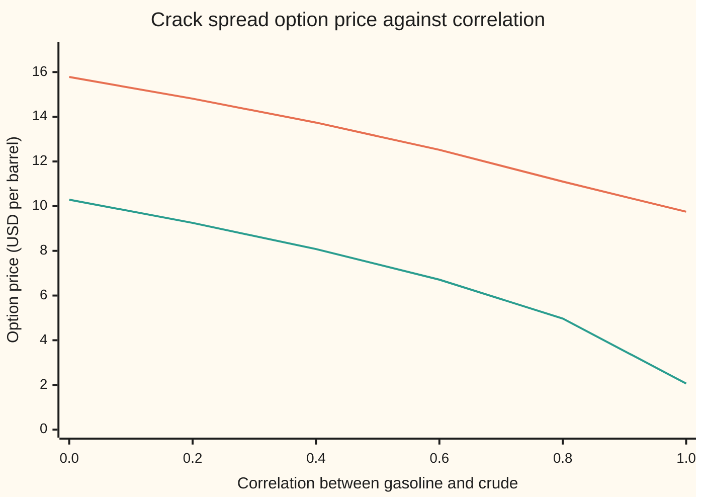
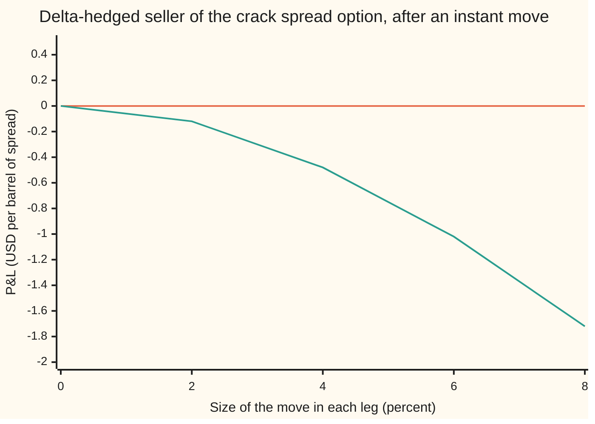

# Greeks of a spread option: a delta for each leg, a cross gamma, two vegas, and the sensitivity to correlation

[Syllabus](../../../SYLLABUS.md) → [Financial mathematics](../../../SYLLABUS.md#w12) → [Options on commodity futures and spreads](../../../SYLLABUS.md#w12-s26) → Greeks of a spread option

---

## General Overview

A refinery buys crude oil and sells gasoline. Its margin is the gap between the two prices, the **crack spread**. On the shelf's house numbers, gasoline futures for delivery in six months trade at 100 dollars a barrel and crude futures at 90. Gasoline's volatility (the yearly spread of its percentage moves) is 30 percent; crude's is 25 percent. Their **correlation**, a number from −1 to 1 that says how closely the two prices' daily moves line up, is 0.5. Cash earns 5 percent.

A bank sells an option on this gap. In six months it pays gasoline minus crude if that is positive. The strike is zero. Its price, from Margrabe's formula on the card before this one, is **13.15 dollars a barrel**.

The bank must hedge. How much gasoline should it buy, and how much crude should it sell? The answers are the option's two **deltas**: **+0.72** barrels of gasoline futures and **−0.65** barrels of crude futures per barrel of spread. The signs are opposite because the option gains when gasoline rises and loses when crude rises.

With both hedges on, small price moves no longer touch the bank. But the price also depends on correlation, and no futures contract trades correlation. The option loses **6.06 dollars per unit of correlation**. If the market marks correlation down from 0.5 to 0.3, the option gains 1.14 dollars and the bank, short the option, loses 1.14 with both legs hedged. The same loss arrives when the two prices actually move together less than priced.

**A spread option has one delta per leg, a two-by-two table of gammas whose off-diagonal cross gamma is negative, a vega per leg, and a sensitivity to correlation that equals the cross gamma scaled by both volatilities, both prices and the time left; delta hedges in the two futures remove the first but leave the last untouched.**

**What kind of fact this is:** a theorem inside a model. The model is that both futures prices wander lognormally with fixed volatilities and fixed correlation. Inside it, the closed-form Greeks at zero strike and the bridge between cross gamma and correlation are proved on this card in Why it works. At a positive strike the card uses Kirk's approximation, and its Greeks are compared against an exact integral, with the error stated.

### The picture: the price falls as correlation rises



The upper line is the zero-strike option, priced by Margrabe's formula. The lower line is the same option with a strike of 10 dollars, priced by Kirk's approximation. Both fall as correlation rises: prices that move together leave a steadier gap, and a steadier gap is worth less as an option. The slope of each line at correlation 0.5 is the correlation sensitivity: −6.06 for the upper line and −6.84 for the lower one.

---

## The formula

Notation first, in words. Subscript 1 means gasoline, subscript 2 crude. $D = e^{-rT}$ is the discount factor, $r$ the riskless rate, $T$ the years to expiry. $N(x)$ is the bell-curve area to the left of $x$ and $n(x)$ the curve's height at $x$. A **partial derivative**, written with a curly d, is the rate the price changes when one input moves and the others are held still ([Partial derivatives](../../06-Calculus%20and%20analysis/07-Several%20Variables/01-partial-derivatives.md)). **Delta** (Δ) is a first derivative in a price, **gamma** (Γ) a second derivative in two prices, **vega** (ν, "nu") a derivative in a volatility.

The price, recalled from [Spread options](04-margrabe-and-kirk-spread-options.md):

$$V = D\,\bigl[F_1 N(d_1) - F_2 N(d_2)\bigr], \qquad \sigma = \sqrt{\sigma_1^2 + \sigma_2^2 - 2\rho\,\sigma_1\sigma_2}, \qquad v = \sigma\sqrt{T}$$

$$d_1 = \frac{\ln(F_1/F_2) + \tfrac12 v^2}{v}, \qquad d_2 = d_1 - v$$

The Greeks:

$$\Delta_1 = \frac{\partial V}{\partial F_1} = D\,N(d_1), \qquad \Delta_2 = \frac{\partial V}{\partial F_2} = -D\,N(d_2)$$

$$\Gamma_{11} = \frac{D\,n(d_1)}{F_1 v}, \qquad \Gamma_{12} = \frac{\partial^2 V}{\partial F_1\,\partial F_2} = -\frac{D\,n(d_1)}{F_2 v}, \qquad \Gamma_{22} = \frac{D\,n(d_1)\,F_1}{F_2^2\, v}$$

$$\nu_1 = D F_1 n(d_1)\sqrt{T}\;\frac{\sigma_1 - \rho\sigma_2}{\sigma}, \qquad \nu_2 = D F_1 n(d_1)\sqrt{T}\;\frac{\sigma_2 - \rho\sigma_1}{\sigma}, \qquad \frac{\partial V}{\partial \rho} = -D F_1 n(d_1)\sqrt{T}\;\frac{\sigma_1\sigma_2}{\sigma}$$

And the bridge that ties correlation to cross gamma:

$$\frac{\partial V}{\partial \rho} \;=\; \sigma_1\sigma_2\,T\,F_1F_2\,\Gamma_{12}$$

**Read it aloud:** each delta is a discounted in-the-money chance, counted in its own barrels; the gammas share one bell-curve height; the two vegas and the correlation sensitivity are one vega split by the chain rule; and the correlation sensitivity is the cross gamma times both volatilities, both prices and the time left.

| Symbol | Plain meaning | In our example | Push it up and the answer… |
| --- | --- | --- | --- |
| $V$ | the option's price today, per barrel of spread | 13.15 USD | |
| $F_1$, $F_2$ | gasoline and crude futures prices for the expiry month | 100 and 90 USD per barrel | $F_1$ up: price rises 0.72 per dollar; $F_2$ up: price falls 0.65 per dollar |
| $K$ | strike on the gap; zero here, 10 USD in the Kirk comparison | 0 | price falls |
| $\sigma_1$, $\sigma_2$ | each leg's volatility, the yearly spread of its percentage moves | 0.30 and 0.25 | both raise the price here, but $\nu_2$ turns negative when $\rho\sigma_1 > \sigma_2$ |
| $\rho$ | correlation of the two legs' moves, from −1 to 1 | 0.5 | price falls: a steadier gap |
| $\sigma$, $v$ | volatility of the ratio gasoline/crude, and that volatility over the option's life | 0.2784 and 0.1969 | price rises |
| $T$, $r$, $D$ | years to expiry, the riskless rate, and the discount factor $e^{-rT}$ | 0.5, 5%, 0.9753 | $r$ up: every Greek shrinks by the same factor |
| $d_1$, $d_2$ | how far gasoline sits above crude, in units of $v$, counted in gasoline and in crude | 0.6337 and 0.4368 | |
| $N$, $n$ | bell-curve area to the left of a point, and bell-curve height at a point | $N(d_1)$ = 0.7368, $n(d_1)$ = 0.3264 | |
| $\Delta_1$, $\Delta_2$ | futures to hold per barrel of spread to cancel small moves: gasoline, crude | +0.7187 and −0.6524 | |
| $\Gamma_{11}$, $\Gamma_{12}$, $\Gamma_{22}$ | how each delta changes per dollar move in a price; $\Gamma_{12}$ is the cross gamma | 0.0162, −0.0180, 0.0200 | |
| $\nu_1$, $\nu_2$ | price change per unit (100 points) of each leg's volatility | 14.15 and 8.09 | |

### When it holds

- **Both futures prices are lognormal with fixed volatilities.** If a leg's volatility moves with its level (a smile, on [Implied vol on a futures option and the commodity smile](03-commodity-implied-vol-and-the-call-skew.md)), the true delta picks up an extra term of vega times the volatility's slope, and the closed-form deltas are off by it.
- **Correlation is one fixed number.** Real correlation between crude and its products drifts, and falls sharply in refinery outages. Every dollar of hedged P&L that comes from correlation is then measured by the correlation sensitivity times the change.
- **Zero strike for the closed forms.** At a positive strike no closed form exists. Kirk's approximation stands in; at a 10-dollar strike its deltas are 0.5248 and −0.4486 against exact values of 0.5250 and −0.4488, and its correlation sensitivity is −6.84 against −6.83.
- **Hedges are adjusted continuously.** A desk that rebalances 63 times over six months carries a hedging error on every path, but the error averages to zero when correlation behaves as priced.
- **European exercise, futures settled daily, cash earning the riskless rate.** Each is a standard exchange feature; a physically settled spread with delivery options needs its own model.

---

## Why it works

### Step 0: every Greek is a partial derivative of one formula

Each Greek holds all inputs but one or two still and asks how fast the price moves. Two features of Margrabe's formula keep the derivatives short. The volatilities and the correlation enter only through the spread volatility $\sigma$, so three sensitivities become one vega and a chain rule. And the formula is **homogeneous of degree one**: multiply both futures prices by the same number and the price is multiplied by it too. That forces relations among the deltas and among the gammas.

### Step 1: the bell-height identity

The two bell heights are $n(d_1) = e^{-d_1^2/2}/\sqrt{2\pi}$ and $n(d_2)$ likewise. Their ratio is

$$\frac{n(d_2)}{n(d_1)} = e^{(d_1^2 - d_2^2)/2} = e^{(d_1 + d_2)(d_1 - d_2)/2} = e^{\,(d_1+d_2)v/2}.$$

From the definitions, $d_1 + d_2 = 2\ln(F_1/F_2)/v$. So the exponent is $\ln(F_1/F_2)$, the ratio is $F_1/F_2$, and $F_1\,n(d_1) = F_2\,n(d_2)$.

### Step 2: the deltas

Differentiate the price in gasoline's futures price. The product rule gives the plain term $D\,N(d_1)$ plus a bracket:

$$\frac{\partial V}{\partial F_1} = D\,N(d_1) + D\Bigl[F_1\,n(d_1)\,\frac{\partial d_1}{\partial F_1} - F_2\,n(d_2)\,\frac{\partial d_2}{\partial F_1}\Bigr].$$

Since $d_2 = d_1 - v$ and $v$ does not depend on the prices, the two inner derivatives are equal. By Step 1 the two bell terms are equal too. The bracket is zero. So $\Delta_1 = D\,N(d_1)$. The same argument in crude's price gives $\Delta_2 = -D\,N(d_2)$.

Each delta is a discounted probability. $N(d_1)$ is the chance the option finishes in the money, counted in barrels of gasoline; $N(d_2)$ is the same event counted in barrels of crude. The minus sign on crude is the delivery the option holder makes.

### Step 3: the deltas rebuild the price

Homogeneity has a consequence known as Euler's theorem: for a price that scales with its inputs, the price equals each input times its derivative, summed.

$$V = F_1\,\Delta_1 + F_2\,\Delta_2.$$

Proof in one line: scale both prices by a common factor, so the price scales by it too, and differentiate in that factor at 1. At the house numbers, 100 × 0.7187 − 90 × 0.6524 = 13.15, the price. Compare a single call on a futures price, whose formula carries a separate cash term, the discounted strike times $N(d_2)$, outside its delta. Here crude plays the strike's role, so the two deltas carry the whole price. Step 4 uses this.

### Step 4: the gamma table, and the direction it cannot see

Differentiate the deltas. Only $d_1$ and $d_2$ move, and $\partial d_1/\partial F_1 = 1/(F_1 v)$, $\partial d_1/\partial F_2 = -1/(F_2 v)$. That gives

$$\Gamma_{11} = \frac{D\,n(d_1)}{F_1 v}, \qquad \Gamma_{12} = -\frac{D\,n(d_1)}{F_2 v}, \qquad \Gamma_{22} = \frac{D\,n(d_2)}{F_2 v} = \frac{D\,n(d_1)\,F_1}{F_2^2 v},$$

the last step by Step 1. The cross gamma $\Gamma_{12}$ is negative. It says: when crude rises, the gasoline delta falls. That makes sense, since a higher crude price makes the gap smaller and the option less likely to pay.

Now multiply the first row by the prices: $F_1\Gamma_{11} + F_2\Gamma_{12} = D n(d_1)/v - D n(d_1)/v = 0$. The deltas are homogeneous of degree zero (they depend only on the ratio), and this is Euler's theorem again, one level down. The gamma table is therefore **singular**: there is one direction of moves it cannot see. That direction is both prices moving by the same percentage. Push gasoline and crude both up 5 percent and a delta-hedged book gains or loses nothing at all, to every order: the option's value rises by 5 percent of itself, and by Step 3 the hedge's gain, 5 percent of each price times its delta, is the same amount. Only moves that change the ratio of the two prices cost a hedged seller money.

### Step 5: vegas and correlation through one volatility

The volatilities and the correlation reach the price only through $\sigma$. So each sensitivity is the same vega in $\sigma$, times how much the input moves $\sigma$. The vega in $\sigma$ is Black's vega with gasoline as the asset: $\partial V/\partial\sigma = D F_1 n(d_1)\sqrt{T}$, which is 22.51 here. The chain rule through $\sigma^2 = \sigma_1^2 + \sigma_2^2 - 2\rho\sigma_1\sigma_2$ gives

$$\frac{\partial\sigma}{\partial\sigma_1} = \frac{\sigma_1 - \rho\sigma_2}{\sigma} = 0.6286, \qquad \frac{\partial\sigma}{\partial\sigma_2} = \frac{\sigma_2 - \rho\sigma_1}{\sigma} = 0.3592, \qquad \frac{\partial\sigma}{\partial\rho} = -\frac{\sigma_1\sigma_2}{\sigma} = -0.2694.$$

Multiply: $\nu_1$ = 14.15, $\nu_2$ = 8.09, and $\partial V/\partial\rho$ = −6.06. The correlation sensitivity is always negative, because raising correlation always shrinks the spread volatility. A leg's vega can have either sign. When $\rho\sigma_1$ exceeds $\sigma_2$, more crude volatility makes crude track gasoline more closely, the gap steadies, and the option loses value.

### Step 6: the bridge from correlation to cross gamma

Take the product of $\Gamma_{12}$ with $\sigma_1\sigma_2 T F_1 F_2$:

$$\sigma_1\sigma_2 T F_1 F_2 \cdot \Bigl(-\frac{D n(d_1)}{F_2\,\sigma\sqrt{T}}\Bigr) = -D F_1 n(d_1)\sqrt{T}\,\frac{\sigma_1\sigma_2}{\sigma} = \frac{\partial V}{\partial\rho}.$$

That is the algebra. The reason is the hedged seller's profit over a short step, which to second order is minus half the gamma table applied to the price moves:

$$\text{hedged P\&L of the seller} \approx -\tfrac12\bigl(\Gamma_{11}\,dF_1^2 + 2\,\Gamma_{12}\,dF_1\,dF_2 + \Gamma_{22}\,dF_2^2\bigr) + \text{time decay}.$$

The product $dF_1\,dF_2$ averages to $\rho\,\sigma_1\sigma_2F_1F_2$ per unit of time. So correlation reaches the book only through the cross-gamma term, and summed over the option's life its weight is the correlation sensitivity. The time decay pays for the correlation the option was sold at. If realised correlation is lower, $\Gamma_{12}$ being negative, the cross term takes money from the seller, on average, on every step. Futures have no gamma, so no futures position changes this term. The single-asset version of this bookkeeping is [Theta pays for gamma](../09-The%20Greeks%2C%20one%20each/10-theta-pays-for-gamma-hedged-pnl.md).

<details>
<summary>Detailed proof: the bridge holds for any strike, not only Margrabe's</summary>

Write the price as a function of the prices, the two variances $\sigma_1^2T$ and $\sigma_2^2T$ of the log prices at expiry, and their covariance $c = \rho\sigma_1\sigma_2T$. For any European payoff on two lognormal futures, the price obeys the two-dimensional heat relation
$$\frac{\partial V}{\partial c} = F_1F_2\,\frac{\partial^2 V}{\partial F_1\,\partial F_2}.$$
It follows from writing the price as a discounted integral of the payoff against the bivariate normal density of the two log prices. That density's derivative in its covariance equals its mixed second derivative in the two log prices, a standard property of the normal density. Two integrations by parts move those derivatives onto the payoff side. A mixed derivative in the two log prices is the product of the two prices times the mixed derivative in the prices, and no first-derivative terms appear, because the log means depend on the two variances but not on the covariance. Since $\rho$ reaches the price only through the covariance, the chain rule gives
$$\frac{\partial V}{\partial\rho} = \frac{\partial V}{\partial c}\,\frac{\partial c}{\partial\rho} = \sigma_1\sigma_2T\,F_1F_2\,\Gamma_{12}.$$
Nothing in the argument used the strike. At a 10-dollar strike the check computes both sides by bumping an exact integral: −6.8334 by bumping correlation, −6.8333 from the cross gamma. The two agree to the bumps' accuracy.

</details>

### Step 7: positive strikes, by bumping

At a positive strike there is no closed form, and Kirk's approximation is a common market choice. Desks bump it: reprice with one input nudged up and down and divide the difference by the nudge ([Bump and revalue](../07-Greeks%20by%20Numbers%20and%20Calibration/01-bump-and-revalue-and-common-random-numbers.md)). A cross gamma needs four repricings: both prices up, both down, and the two mixed cases.

Checking Kirk needs an exact price to bump. Fix crude's random shock at expiry. Crude's price is then known, and gasoline is still lognormal, with volatility cut by the factor $\sqrt{1-\rho^2}$. So the conditional value is Black's formula on gasoline with a known strike, and averaging it over crude's shock with Simpson's rule gives the exact price for any strike. Bumping that integral is the second route to every Greek on this card.

---

## Worked numbers, by hand

House crack: $F_1$ = 100, $F_2$ = 90, $\sigma_1$ = 0.30, $\sigma_2$ = 0.25, $\rho$ = 0.5, $T$ = 0.5, $r$ = 5%, zero strike.

| Step | Arithmetic | Value |
| --- | --- | --- |
| spread variance $\sigma^2$ | $0.09 + 0.0625 - 2(0.5)(0.30)(0.25)$ | 0.0775 |
| spread volatility $\sigma$ | $\sqrt{0.0775}$ | 0.2784 |
| $v = \sigma\sqrt{T}$ | $0.2784 \times \sqrt{0.5}$ | 0.1969 |
| discount $D$ | $e^{-0.05 \times 0.5}$ | 0.9753 |
| $d_1$ | $(\ln(100/90) + \tfrac12 v^2)/v = (0.1054 + 0.0194)/0.1969$ | 0.6337 |
| $d_2$ | $0.6337 - 0.1969$ | 0.4368 |
| $N(d_1)$, $N(d_2)$, $n(d_1)$ | bell-curve area and height | 0.7368, 0.6689, 0.3264 |
| gasoline delta $\Delta_1$ | $0.9753 \times 0.7368$ | **+0.7187** |
| crude delta $\Delta_2$ | $-0.9753 \times 0.6689$ | **−0.6524** |
| rebuild the price | $100 \times 0.7187 - 90 \times 0.6524$ | 13.15 |
| $\Gamma_{11}$ | $0.9753 \times 0.3264 / (100 \times 0.1969)$ | 0.0162 |
| cross gamma $\Gamma_{12}$ | $-0.9753 \times 0.3264 / (90 \times 0.1969)$ | **−0.0180** |
| $\Gamma_{22}$ | $0.9753 \times 0.3264 \times 100 / (90^2 \times 0.1969)$ | 0.0200 |
| vega in $\sigma$ | $0.9753 \times 100 \times 0.3264 \times \sqrt{0.5}$ | 22.51 |
| gasoline vega $\nu_1$ | $22.51 \times 0.6286$ | 14.15 |
| crude vega $\nu_2$ | $22.51 \times 0.3592$ | 8.09 |
| correlation sensitivity | $22.51 \times (-0.2694)$ | **−6.06** |
| bridge check | $0.30 \times 0.25 \times 0.5 \times 100 \times 90 \times (-0.017967)$ | −6.06 |

The desk that sold this option buys 0.72 barrels of gasoline futures and sells 0.65 barrels of crude futures for each barrel of spread, and then carries a correlation exposure of −6.06 dollars per unit that it cannot trade away.

### The Greeks in one table, zero strike and a 10-dollar strike

| Greek | Zero strike, closed form | 10-dollar strike, Kirk by bump | 10-dollar strike, exact by bump |
| --- | --- | --- | --- |
| price | 13.1531 | 7.4286 | 7.4286 |
| delta gasoline | 0.7187 | 0.5248 | 0.5250 |
| delta crude | −0.6524 | −0.4486 | −0.4488 |
| gamma 11 | 0.0162 | 0.0203 | 0.0203 |
| cross gamma 12 | −0.0180 | −0.0202 | −0.0202 |
| gamma 22 | 0.0200 | 0.0202 | 0.0202 |
| vega gasoline | 14.15 | 18.99 | 18.99 |
| vega crude | 8.09 | 6.84 | 6.83 |
| correlation sensitivity | −6.06 | −6.84 | −6.83 |

The strike pulls both deltas toward a half, since the option sits closer to the money, and the three gammas become almost equal. Kirk's Greeks match the exact ones to a few ten-thousandths on deltas and to a cent on correlation. Kirk's crude vega and correlation sensitivity sharing the digits 6.836340 is a coincidence of these inputs.

### What breaks if you drop a piece

| Mistake | Comes out at | What went wrong |
| --- | --- | --- |
| Use $N(d_2)$ for the gasoline delta | 0.6524 instead of 0.7187 | That is crude's hedge size. Gasoline's delta counts the in-the-money chance in gasoline, not crude. |
| Write $+2\rho\sigma_1\sigma_2$ in the spread volatility | price 17.88 instead of 13.15 | The sign turns correlation into anti-correlation; the correlation sensitivity flips sign too. |
| Drop the discount on the futures delta | 0.7368 instead of 0.7187 | A futures option pays in six months; its delta is a discounted probability. |
| Hedge crude with the gasoline size, −0.72 | loses 0.30 when both legs rise 5% | The spread is not one asset. Equal and opposite hedges leave the book short too much crude. |

---

## The hedged book when the legs move

A book that sold the option and holds the two deltas is flat to small moves. What moves it is how the two legs move relative to each other. Per barrel of spread, after instant jumps:

| Scenario | Hedged seller's P&L (USD per barrel) |
| --- | --- |
| both legs up 5% (105 and 94.5) | 0.00 |
| both legs up 5 dollars (105 and 95) | −0.0024 |
| gasoline up 5%, crude down 5% (105 and 85.5) | −0.73 |
| gamma estimate of that last move | −0.81 |
| no price move, correlation marked from 0.5 to 0.3 | −1.14 |
| correlation sensitivity × 0.2 | −1.21 |

The first line is Step 4: equal percentage moves cost nothing, exactly. A parallel dollar move shifts the ratio slightly and costs a quarter of a cent. Moves that pull the legs apart cost real money, and the gamma table predicts them to within about a tenth. A re-mark of correlation, with no price moving, costs more than any of them.

```
hedged seller's P&L, USD per barrel of spread, bar = 0.05
  both +5%                 |                          0.00
  both +5 USD              |                         -0.0024
  gasoline +5%, crude -5%  ███████████████           -0.73
  correlation 0.5 to 0.3   ███████████████████████   -1.14
```

The same book against the size of the move, for legs that move together and legs that move apart:



The flat line is both legs moving up by the same percentage: no loss at any size. The falling line is gasoline up and crude down by that percentage. The loss grows with the square of the move, as a gamma loss does.

Over time the test is a simulation. The check sells the option at correlation 0.5, rebalances both deltas 63 times over six months, and runs 2,000 price paths. With realised correlation 0.5 the average result is +0.01 dollars, standard error 0.016: zero, as priced. With realised correlation 0.2 and hedging still at 0.5, the average is **−1.69 dollars**, standard error 0.028. The option priced at 0.2 is worth 1.66 dollars more than at 0.5. The seller lost about the value of the correlation it sold too dear, with every rebalance done correctly.

The hedges do not change that average: futures cost nothing to enter, so their gains average zero. What they change is the spread across paths. Unhedged, the standard error is 0.40; hedged, 0.028. The hedges strip out the price risk and leave the correlation loss almost certain.

---

## Code, from first principles, and it actually runs

The code computes every Greek three ways at zero strike: the closed forms, bumps of Margrabe's formula, and bumps of an exact price built by integrating Black's formula over crude's shock with Simpson's rule. At a 10-dollar strike it bumps Kirk's approximation and the exact integral side by side, and checks the bridge between cross gamma and correlation there. A delta-hedging simulation with its own random numbers is the third road to the claim that correlation risk survives the hedge. The bell-curve area is a power series written out; nothing imported knows an answer.

### Python

```python
# Greeks of a spread option -- the check behind the card.  Standard library only.
# Nothing imported holds an answer: the bell-curve area is a series written out
# here, the integral is Simpson's rule, the random numbers come from splitmix64.
from math import exp, log, sqrt, pi, cos
F1, F2, S1, S2, RHO, T, R = 100.0, 90.0, 0.30, 0.25, 0.5, 0.5, 0.05   # house crack
D = exp(-R * T)                                             # discount factor to expiry

def n(x): return exp(-0.5 * x * x) / sqrt(2.0 * pi)         # bell-curve height
def N(x):                                                   # bell-curve area left of x
    if x < -9.0: return 0.0
    if x > 9.0: return 1.0
    term, total, k = x, x, 1
    while abs(term) > 1e-17 * abs(total):                   # x + x^3/3 + x^5/(3*5) + ...
        term *= x * x / (2 * k + 1); total += term; k += 1
    return 0.5 + n(x) * total

def spread_vol(s1, s2, rho): return sqrt(s1 * s1 + s2 * s2 - 2.0 * rho * s1 * s2)
def margrabe(f1, f2, s1=S1, s2=S2, rho=RHO):               # road 1: the closed form
    v = spread_vol(s1, s2, rho) * sqrt(T)
    d1 = (log(f1 / f2) + 0.5 * v * v) / v
    return D * (f1 * N(d1) - f2 * N(d1 - v))
def greeks(f1, f2, s1=S1, s2=S2, rho=RHO):                 # closed-form Greeks
    s = spread_vol(s1, s2, rho); v = s * sqrt(T)
    d1 = (log(f1 / f2) + 0.5 * v * v) / v; d2 = d1 - v
    dvs = D * f1 * n(d1) * sqrt(T)                          # dV / d(spread vol)
    return {"delta gasoline": D * N(d1), "delta crude": -D * N(d2),
            "gamma 11": D * n(d1) / (f1 * v), "gamma 12": -D * n(d1) / (f2 * v),
            "gamma 22": D * n(d1) * f1 / (f2 * f2 * v),
            "vega gasoline": dvs * (s1 - rho * s2) / s, "vega crude": dvs * (s2 - rho * s1) / s,
            "corr sensitivity": -dvs * s1 * s2 / s}
def kirk(f1, f2, K, s1=S1, s2=S2, rho=RHO):                # Kirk's approximation
    b = f2 / (f2 + K); v = sqrt(s1 * s1 - 2 * rho * s1 * s2 * b + s2 * s2 * b * b) * sqrt(T)
    d1 = (log(f1 / (f2 + K)) + 0.5 * v * v) / v
    return D * (f1 * N(d1) - (f2 + K) * N(d1 - v))
def exact(f1, f2, K, s1=S1, s2=S2, rho=RHO, m=400):        # road 2: fix crude's shock z,
    def given(z):                                           # then gasoline is lognormal: Black
        c2 = f2 * exp(-0.5 * s2 * s2 * T + s2 * sqrt(T) * z) + K
        c1 = f1 * exp(-0.5 * rho * rho * s1 * s1 * T + rho * s1 * sqrt(T) * z)
        w = s1 * sqrt(1.0 - rho * rho) * sqrt(T)
        e1 = (log(c1 / c2) + 0.5 * w * w) / w
        return (c1 * N(e1) - c2 * N(e1 - w)) * n(z)
    a, h = -9.0, 18.0 / m                                   # Simpson's rule over z
    tot = given(a) + given(-a) + sum((4 if i % 2 else 2) * given(a + i * h) for i in range(1, m))
    return D * tot * h / 3.0
def bumped(p, K):                                           # Greeks by bump-and-reprice
    h, e = 0.1, 1e-4
    V = lambda a=0.0, b=0.0, **kw: p(F1 + a, F2 + b, K, **kw)
    return {"delta gasoline": (V(h) - V(-h)) / (2 * h), "delta crude": (V(0, h) - V(0, -h)) / (2 * h),
            "gamma 11": (V(h) - 2 * V() + V(-h)) / h ** 2,
            "gamma 12": (V(h, h) - V(h, -h) - V(-h, h) + V(-h, -h)) / (4 * h * h),
            "gamma 22": (V(0, h) - 2 * V() + V(0, -h)) / h ** 2,
            "vega gasoline": (V(s1=S1 + e) - V(s1=S1 - e)) / (2 * e),
            "vega crude": (V(s2=S2 + e) - V(s2=S2 - e)) / (2 * e),
            "corr sensitivity": (V(rho=RHO + e) - V(rho=RHO - e)) / (2 * e)}
mar3 = lambda f1, f2, K, **kw: margrabe(f1, f2, **kw)      # Margrabe with a dummy strike slot

state = [20260927]                                          # splitmix64, then Box-Muller
def unif():
    state[0] = (state[0] + 0x9E3779B97F4A7C15) & 0xFFFFFFFFFFFFFFFF
    z = state[0]
    z = ((z ^ (z >> 30)) * 0xBF58476D1CE4E5B9) & 0xFFFFFFFFFFFFFFFF
    z = ((z ^ (z >> 27)) * 0x94D049BB133111EB) & 0xFFFFFFFFFFFFFFFF
    return ((z ^ (z >> 31)) >> 11) / 9007199254740992.0 + 0.5 / 9007199254740992.0
def gauss(): return sqrt(-2.0 * log(unif())) * cos(2.0 * pi * unif())
def hedge_sim(rho_real, paths=2000, steps=63):             # road 3: sell, hedge both legs daily-ish
    dt, pnl, raw = T / steps, [], []
    for _ in range(paths):
        f1, f2, cash = F1, F2, margrabe(F1, F2)
        for k in range(steps):
            t_left = T - k * dt
            v = spread_vol(S1, S2, RHO) * sqrt(t_left)
            d1 = (log(f1 / f2) + 0.5 * v * v) / v
            a1, a2 = exp(-R * t_left) * N(d1), -exp(-R * t_left) * N(d1 - v)
            g1 = gauss(); g2 = rho_real * g1 + sqrt(1 - rho_real ** 2) * gauss()
            n1 = f1 * exp(-0.5 * S1 * S1 * dt + S1 * sqrt(dt) * g1)
            n2 = f2 * exp(-0.5 * S2 * S2 * dt + S2 * sqrt(dt) * g2)
            cash = cash * exp(R * dt) + a1 * (n1 - f1) + a2 * (n2 - f2)
            f1, f2 = n1, n2
        pnl.append(D * (cash - max(f1 - f2, 0.0))); raw.append(margrabe(F1, F2) - D * max(f1 - f2, 0.0))
    se = lambda xs, mu: sqrt(sum((x - mu) ** 2 for x in xs) / (paths - 1) / paths)
    mu = sum(pnl) / paths; return mu, se(pnl, mu), se(raw, sum(raw) / paths)   # hedged, unhedged se

P = print
def row(lab, *v): P(f"{lab:<32}" + "".join(f"{x:12.6f}" for x in v))
V0, G, sv = margrabe(F1, F2), greeks(F1, F2), spread_vol(S1, S2, RHO) * sqrt(T)
Gm, Gx, d1 = bumped(mar3, 0.0), bumped(exact, 0.0), (log(F1 / F2) + 0.5 * sv * sv) / sv
P("house crack: F1 100, F2 90, vols 0.30 0.25, corr 0.5, T 0.5, r 0.05; sim 2000 paths x 63 hedges")
row("spread vol sigma", spread_vol(S1, S2, RHO)); row("D = e^-rT, v = sigma*sqrt(T)", D, sv)
row("d1, d2", d1, d1 - sv); row("N(d1), N(d2), n(d1)", N(d1), N(d1 - sv), n(d1))
sg = spread_vol(S1, S2, RHO); row("ln(F1/F2), sigma^2, v^2/2", log(F1 / F2), sg * sg, 0.5 * sv * sv)
row("dV/dsigma, dsigma/ds1, ds2, drho", D * F1 * n(d1) * sqrt(T), (S1 - RHO * S2) / sg, (S2 - RHO * S1) / sg, -S1 * S2 / sg)
row("price  Margrabe formula", V0); row("price  integral over crude", exact(F1, F2, 0.0))
P(f"{'greek at K = 0':<20}{'closed form':>12}{'bump formula':>14}{'bump integral':>15}")
for k in G: P(f"{k:<20}{G[k]:12.6f}{Gm[k]:14.6f}{Gx[k]:15.6f}")
euler, bridge = F1 * G["delta gasoline"] + F2 * G["delta crude"], S1 * S2 * T * F1 * F2 * G["gamma 12"]
row("F1*delta1 + F2*delta2", euler); row("F1*gamma11 + F2*gamma12", F1 * G["gamma 11"] + F2 * G["gamma 12"])
row("s1*s2*T*F1*F2*gamma12", bridge)
book = lambda f1, f2, rho=RHO: -(margrabe(f1, f2, rho=rho) - V0) + G["delta gasoline"] * (f1 - F1) + G["delta crude"] * (f2 - F2)
P("hedged short book, instant moves (USD per bbl of spread)")
row("  both legs +5%", book(105.0, 94.5)); row("  both legs +5 USD", book(105.0, 95.0))
row("  gasoline +5%, crude -5%", book(105.0, 85.5))
row("  gamma estimate of that", -0.5 * (G["gamma 11"] * 25 + 2 * G["gamma 12"] * 5 * -4.5 + G["gamma 22"] * 4.5 ** 2))
row("  correlation 0.5 -> 0.3", book(F1, F2, 0.3)); row("  corr sensitivity x 0.2", G["corr sensitivity"] * 0.2)
xs, rs = range(0, 9, 2), [i / 10 for i in range(0, 11, 2)]
P("chart, move x %           " + "".join(f"{x:8d}" for x in xs))
P("chart, together +x/+x     " + "".join(f"{book(F1 * (1 + x / 100), F2 * (1 + x / 100)):8.2f}" for x in xs))
P("chart, apart +x/-x        " + "".join(f"{book(F1 * (1 + x / 100), F2 * (1 - x / 100)):8.2f}" for x in xs))
P("chart, correlation        " + "".join(f"{x:8.1f}" for x in rs))
P("chart, Margrabe K = 0     " + "".join(f"{margrabe(F1, F2, rho=x):8.2f}" for x in rs))
P("chart, Kirk K = 10        " + "".join(f"{kirk(F1, F2, 10.0, rho=x):8.2f}" for x in rs))
Gk, Ge = bumped(kirk, 10.0), bumped(exact, 10.0)
P(f"{'strike K = 10':<20}{'Kirk bump':>12}{'exact bump':>14}")
P(f"{'price':<20}{kirk(F1, F2, 10.0):12.6f}{exact(F1, F2, 10.0):14.6f}")
for k in G: P(f"{k:<20}{Gk[k]:12.6f}{Ge[k]:14.6f}")
kbridge = S1 * S2 * T * F1 * F2 * Ge["gamma 12"]; row("K=10 s1*s2*T*F1*F2*gamma12", kbridge)
(m5, e5, u5), (m2, e2, u2) = hedge_sim(0.5), hedge_sim(0.2)
P(f"sim: realised corr 0.5, mean    {m5:12.6f}  se {e5:.6f}  unhedged se {u5:.6f}")
P(f"sim: realised corr 0.2, mean    {m2:12.6f}  se {e2:.6f}  unhedged se {u2:.6f}")
row("price at 0.5 minus price at 0.2", V0 - margrabe(F1, F2, rho=0.2))
w_d2, w_plus, w_nodisc = D * N(d1 - sv), margrabe(F1, F2, rho=-RHO), G["delta gasoline"] / D
w_same = book(105.0, 94.5) - (G["delta crude"] + G["delta gasoline"]) * 4.5
row("wrong: N(d2) as gasoline delta", w_d2); row("wrong: +2 rho s1 s2, price", w_plus)
row("wrong: no discount, delta", w_nodisc); row("wrong: crude hedge = -delta1", w_same)
row("try: rho 0.9, vega crude", greeks(F1, F2, rho=0.9)["vega crude"])
row("try: crude 100, delta gasoline", greeks(F1, 100.0)["delta gasoline"])
assert abs(V0 - exact(F1, F2, 0.0)) < 1e-8, "Margrabe vs integral over crude"
for k in G: assert abs(G[k] - Gx[k]) < 2e-4 * max(1.0, abs(G[k])), "closed-form Greek vs bumped integral: " + k
assert abs(euler - exact(F1, F2, 0.0)) < 1e-8, "deltas rebuild the price (Euler)"
assert abs(kbridge - Ge["corr sensitivity"]) < 1e-3, "bridge: corr sensitivity = s1 s2 T F1 F2 gamma12, K=10"
assert abs(m5) < 4 * e5 + 0.02 and m2 < -1.0 and e5 < 0.1 * u5 and e2 < 0.1 * u2, "hedged book: flat at the priced correlation, loses when legs decouple"
assert abs(w_d2 - G["delta gasoline"]) > 0.05 and abs(w_plus - V0) > 1 and abs(w_same) > 0.1, "each mistake moves a number"
P("ALL CHECKS PASS")
```

**Ran 2026-09-27 on macOS, Python 3.14.6, standard library only. All checks passed. Output, pasted from the run:**

```
house crack: F1 100, F2 90, vols 0.30 0.25, corr 0.5, T 0.5, r 0.05; sim 2000 paths x 63 hedges
spread vol sigma                    0.278388
D = e^-rT, v = sigma*sqrt(T)        0.975310    0.196850
d1, d2                              0.633657    0.436807
N(d1), N(d2), n(d1)                 0.736848    0.668874    0.326378
ln(F1/F2), sigma^2, v^2/2           0.105361    0.077500    0.019375
dV/dsigma, dsigma/ds1, ds2, drho   22.508599    0.628619    0.359211   -0.269408
price  Margrabe formula            13.153109
price  integral over crude         13.153109
greek at K = 0       closed form  bump formula  bump integral
delta gasoline          0.718655      0.718654       0.718654
delta crude            -0.652360     -0.652359      -0.652359
gamma 11                0.016171      0.016171       0.016171
gamma 12               -0.017967     -0.017967      -0.017967
gamma 22                0.019964      0.019964       0.019964
vega gasoline          14.149323     14.149323      14.149323
vega crude              8.085328      8.085327       8.085327
corr sensitivity       -6.063996     -6.063996      -6.063996
F1*delta1 + F2*delta2              13.153109
F1*gamma11 + F2*gamma12             0.000000
s1*s2*T*F1*F2*gamma12              -6.063996
hedged short book, instant moves (USD per bbl of spread)
  both legs +5%                     0.000000
  both legs +5 USD                 -0.002382
  gasoline +5%, crude -5%          -0.725931
  gamma estimate of that           -0.808533
  correlation 0.5 -> 0.3           -1.137180
  corr sensitivity x 0.2           -1.212799
chart, move x %                  0       2       4       6       8
chart, together +x/+x         0.00    0.00    0.00    0.00    0.00
chart, apart +x/-x            0.00   -0.12   -0.48   -1.02   -1.72
chart, correlation             0.0     0.2     0.4     0.6     0.8     1.0
chart, Margrabe K = 0        15.78   14.81   13.74   12.52   11.10    9.75
chart, Kirk K = 10           10.29    9.25    8.08    6.71    4.97    2.06
strike K = 10          Kirk bump    exact bump
price                   7.428642      7.428643
delta gasoline          0.524798      0.525015
delta crude            -0.448613     -0.448836
gamma 11                0.020256      0.020256
gamma 12               -0.020246     -0.020247
gamma 22                0.020243      0.020244
vega gasoline          18.989834     18.994804
vega crude              6.836340      6.830418
corr sensitivity       -6.836340     -6.833358
K=10 s1*s2*T*F1*F2*gamma12         -6.833298
sim: realised corr 0.5, mean        0.011432  se 0.015779  unhedged se 0.338004
sim: realised corr 0.2, mean       -1.692354  se 0.027976  unhedged se 0.400068
price at 0.5 minus price at 0.2    -1.657744
wrong: N(d2) as gasoline delta      0.652360
wrong: +2 rho s1 s2, price         17.878635
wrong: no discount, delta           0.736848
wrong: crude hedge = -delta1       -0.298328
try: rho 0.9, vega crude           -2.090294
try: crude 100, delta gasoline      0.525890
ALL CHECKS PASS
```

The three columns of the zero-strike table agree to the sixth decimal on every Greek, apart from a last-digit bump error on the deltas. The row $F_1\Gamma_{11} + F_2\Gamma_{12}$ is zero: the singular gamma table of Step 4.

### Rust

Same inputs, same labels, same random-number generator, written again in Rust with no crates.

```rust
// Greeks of a spread option -- the same check as spread_option_greeks_check.py, in Rust.
// Standard library only, no crates.  The bell-curve area is a series written out here,
// the integral is Simpson's rule, the random numbers come from splitmix64.
use std::f64::consts::PI;
const F1: f64 = 100.0; const F2: f64 = 90.0; const S1: f64 = 0.30; const S2: f64 = 0.25;
const RHO: f64 = 0.5; const T: f64 = 0.5; const R: f64 = 0.05;
fn d() -> f64 { (-R * T).exp() }                               // discount factor to expiry
fn n(x: f64) -> f64 { (-0.5 * x * x).exp() / (2.0 * PI).sqrt() } // bell-curve height
fn nc(x: f64) -> f64 {                                          // bell-curve area left of x
    if x < -9.0 { return 0.0; }
    if x > 9.0 { return 1.0; }
    let (mut term, mut total, mut k) = (x, x, 1.0);
    while term.abs() > 1e-17 * total.abs() { term *= x * x / (2.0 * k + 1.0); total += term; k += 1.0; }
    0.5 + n(x) * total
}
fn spread_vol(s1: f64, s2: f64, rho: f64) -> f64 { (s1 * s1 + s2 * s2 - 2.0 * rho * s1 * s2).sqrt() }
type Pricer = fn(f64, f64, f64, f64, f64, f64) -> f64;         // f1, f2, K, s1, s2, rho
fn margrabe(f1: f64, f2: f64, _k: f64, s1: f64, s2: f64, rho: f64) -> f64 {   // road 1
    let v = spread_vol(s1, s2, rho) * T.sqrt();
    let d1 = ((f1 / f2).ln() + 0.5 * v * v) / v;
    d() * (f1 * nc(d1) - f2 * nc(d1 - v))
}
fn mg(f1: f64, f2: f64, rho: f64) -> f64 { margrabe(f1, f2, 0.0, S1, S2, rho) }
const NAMES: [&str; 8] = ["delta gasoline", "delta crude", "gamma 11", "gamma 12", "gamma 22",
    "vega gasoline", "vega crude", "corr sensitivity"];
fn greeks(f1: f64, f2: f64, s1: f64, s2: f64, rho: f64) -> [f64; 8] {   // closed-form Greeks
    let s = spread_vol(s1, s2, rho); let v = s * T.sqrt();
    let d1 = ((f1 / f2).ln() + 0.5 * v * v) / v; let d2 = d1 - v;
    let dvs = d() * f1 * n(d1) * T.sqrt();                      // dV / d(spread vol)
    [d() * nc(d1), -d() * nc(d2), d() * n(d1) / (f1 * v), -d() * n(d1) / (f2 * v),
     d() * n(d1) * f1 / (f2 * f2 * v), dvs * (s1 - rho * s2) / s, dvs * (s2 - rho * s1) / s,
     -dvs * s1 * s2 / s]
}
fn kirk(f1: f64, f2: f64, k: f64, s1: f64, s2: f64, rho: f64) -> f64 {  // Kirk's approximation
    let b = f2 / (f2 + k);
    let v = (s1 * s1 - 2.0 * rho * s1 * s2 * b + s2 * s2 * b * b).sqrt() * T.sqrt();
    let d1 = ((f1 / (f2 + k)).ln() + 0.5 * v * v) / v;
    d() * (f1 * nc(d1) - (f2 + k) * nc(d1 - v))
}
fn exact(f1: f64, f2: f64, k: f64, s1: f64, s2: f64, rho: f64) -> f64 {  // road 2: fix crude's shock z
    let given = |z: f64| {                                      // then gasoline is lognormal: Black
        let c2 = f2 * (-0.5 * s2 * s2 * T + s2 * T.sqrt() * z).exp() + k;
        let c1 = f1 * (-0.5 * rho * rho * s1 * s1 * T + rho * s1 * T.sqrt() * z).exp();
        let w = s1 * (1.0 - rho * rho).sqrt() * T.sqrt();
        let e1 = ((c1 / c2).ln() + 0.5 * w * w) / w;
        (c1 * nc(e1) - c2 * nc(e1 - w)) * n(z)
    };
    let (m, a) = (400, -9.0); let h = 18.0 / m as f64;          // Simpson's rule over z
    let mut s = 0.0;
    for i in 1..m { s += if i % 2 == 1 { 4.0 } else { 2.0 } * given(a + i as f64 * h); }
    d() * (given(a) + given(-a) + s) * h / 3.0
}
fn bumped(p: Pricer, k: f64) -> [f64; 8] {                      // Greeks by bump-and-reprice
    let (h, e) = (0.1, 1e-4);
    let v = |a: f64, b: f64| p(F1 + a, F2 + b, k, S1, S2, RHO);
    [(v(h, 0.0) - v(-h, 0.0)) / (2.0 * h), (v(0.0, h) - v(0.0, -h)) / (2.0 * h),
     (v(h, 0.0) - 2.0 * v(0.0, 0.0) + v(-h, 0.0)) / (h * h),
     (v(h, h) - v(h, -h) - v(-h, h) + v(-h, -h)) / (4.0 * h * h),
     (v(0.0, h) - 2.0 * v(0.0, 0.0) + v(0.0, -h)) / (h * h),
     (p(F1, F2, k, S1 + e, S2, RHO) - p(F1, F2, k, S1 - e, S2, RHO)) / (2.0 * e),
     (p(F1, F2, k, S1, S2 + e, RHO) - p(F1, F2, k, S1, S2 - e, RHO)) / (2.0 * e),
     (p(F1, F2, k, S1, S2, RHO + e) - p(F1, F2, k, S1, S2, RHO - e)) / (2.0 * e)]
}
struct Rng(u64);                                                // splitmix64, then Box-Muller
impl Rng {
    fn unif(&mut self) -> f64 {
        self.0 = self.0.wrapping_add(0x9E3779B97F4A7C15);
        let mut z = self.0;
        z = (z ^ (z >> 30)).wrapping_mul(0xBF58476D1CE4E5B9);
        z = (z ^ (z >> 27)).wrapping_mul(0x94D049BB133111EB);
        ((z ^ (z >> 31)) >> 11) as f64 / 9007199254740992.0 + 0.5 / 9007199254740992.0
    }
    fn gauss(&mut self) -> f64 { let u = self.unif(); (-2.0 * u.ln()).sqrt() * (2.0 * PI * self.unif()).cos() }
}
fn se(xs: &[f64]) -> f64 {                                      // standard error of the mean
    let n = xs.len() as f64; let mut mu = 0.0; for x in xs { mu += x; } mu /= n;
    let mut ss = 0.0; for x in xs { ss += (x - mu) * (x - mu); } (ss / (n - 1.0) / n).sqrt()
}
fn hedge_sim(rng: &mut Rng, rho_real: f64, paths: usize, steps: usize) -> (f64, f64, f64) {  // road 3
    let dt = T / steps as f64; let (mut pnl, mut raw) = (Vec::with_capacity(paths), Vec::with_capacity(paths));
    for _ in 0..paths {
        let (mut f1, mut f2, mut cash) = (F1, F2, mg(F1, F2, RHO));
        for k in 0..steps {
            let t_left = T - k as f64 * dt;
            let v = spread_vol(S1, S2, RHO) * t_left.sqrt();
            let d1 = ((f1 / f2).ln() + 0.5 * v * v) / v;
            let (a1, a2) = ((-R * t_left).exp() * nc(d1), -(-R * t_left).exp() * nc(d1 - v));
            let g1 = rng.gauss(); let g2 = rho_real * g1 + (1.0 - rho_real * rho_real).sqrt() * rng.gauss();
            let n1 = f1 * (-0.5 * S1 * S1 * dt + S1 * dt.sqrt() * g1).exp();
            let n2 = f2 * (-0.5 * S2 * S2 * dt + S2 * dt.sqrt() * g2).exp();
            cash = cash * (R * dt).exp() + a1 * (n1 - f1) + a2 * (n2 - f2);
            f1 = n1; f2 = n2;
        }
        pnl.push(d() * (cash - (f1 - f2).max(0.0))); raw.push(mg(F1, F2, RHO) - d() * (f1 - f2).max(0.0));
    }
    let mut mu = 0.0; for x in &pnl { mu += x; } mu /= paths as f64;
    (mu, se(&pnl), se(&raw))                                    // hedged mean, hedged se, unhedged se
}
fn main() {
    let (v0, g) = (mg(F1, F2, RHO), greeks(F1, F2, S1, S2, RHO));
    let (gm, gx) = (bumped(margrabe, 0.0), bumped(exact, 0.0));
    let x0 = exact(F1, F2, 0.0, S1, S2, RHO);
    let sv = spread_vol(S1, S2, RHO) * T.sqrt(); let d1 = ((F1 / F2).ln() + 0.5 * sv * sv) / sv;
    let line = |lab: &str, v: &[f64]| { let mut s = format!("{:<32}", lab);
        for x in v { s.push_str(&format!("{:12.6}", x)); } println!("{}", s); };
    println!("house crack: F1 100, F2 90, vols 0.30 0.25, corr 0.5, T 0.5, r 0.05; sim 2000 paths x 63 hedges");
    println!("spread vol sigma                {:12.6}", spread_vol(S1, S2, RHO));
    line("D = e^-rT, v = sigma*sqrt(T)", &[d(), sv]); line("d1, d2", &[d1, d1 - sv]);
    line("N(d1), N(d2), n(d1)", &[nc(d1), nc(d1 - sv), n(d1)]);
    let sg = spread_vol(S1, S2, RHO); line("ln(F1/F2), sigma^2, v^2/2", &[(F1 / F2).ln(), sg * sg, 0.5 * sv * sv]);
    line("dV/dsigma, dsigma/ds1, ds2, drho", &[d() * F1 * n(d1) * T.sqrt(), (S1 - RHO * S2) / sg, (S2 - RHO * S1) / sg, -S1 * S2 / sg]);
    println!("price  Margrabe formula         {:12.6}", v0);
    println!("price  integral over crude      {:12.6}", x0);
    println!("{:<20}{:>12}{:>14}{:>15}", "greek at K = 0", "closed form", "bump formula", "bump integral");
    for i in 0..8 { println!("{:<20}{:12.6}{:14.6}{:15.6}", NAMES[i], g[i], gm[i], gx[i]); }
    let euler = F1 * g[0] + F2 * g[1];
    println!("F1*delta1 + F2*delta2           {:12.6}", euler);
    println!("F1*gamma11 + F2*gamma12         {:12.6}", F1 * g[2] + F2 * g[3]);
    println!("s1*s2*T*F1*F2*gamma12           {:12.6}", S1 * S2 * T * F1 * F2 * g[3]);
    let book = |f1: f64, f2: f64, rho: f64| -(mg(f1, f2, rho) - v0) + g[0] * (f1 - F1) + g[1] * (f2 - F2);
    println!("hedged short book, instant moves (USD per bbl of spread)");
    println!("  both legs +5%                 {:12.6}", book(105.0, 94.5, RHO));
    println!("  both legs +5 USD              {:12.6}", book(105.0, 95.0, RHO));
    println!("  gasoline +5%, crude -5%       {:12.6}", book(105.0, 85.5, RHO));
    let gam = -0.5 * (g[2] * 25.0 + 2.0 * g[3] * 5.0 * -4.5 + g[4] * 4.5 * 4.5);
    println!("  gamma estimate of that        {:12.6}", gam);
    println!("  correlation 0.5 -> 0.3        {:12.6}", book(F1, F2, 0.3));
    println!("  corr sensitivity x 0.2        {:12.6}", g[7] * 0.2);
    let row = |lab: &str, f: &dyn Fn(f64) -> String, xs: &[f64]| {
        let mut s = format!("{:<26}", lab); for &x in xs { s.push_str(&f(x)); } println!("{}", s); };
    let xs = [0.0, 2.0, 4.0, 6.0, 8.0];
    row("chart, move x %", &|x| format!("{:8}", x as i32), &xs);
    row("chart, together +x/+x", &|x| format!("{:8.2}", book(F1 * (1.0 + x / 100.0), F2 * (1.0 + x / 100.0), RHO)), &xs);
    row("chart, apart +x/-x", &|x| format!("{:8.2}", book(F1 * (1.0 + x / 100.0), F2 * (1.0 - x / 100.0), RHO)), &xs);
    let rs: Vec<f64> = (0..6).map(|i| (2 * i) as f64 / 10.0).collect();
    row("chart, correlation", &|x| format!("{:8.1}", x), &rs);
    row("chart, Margrabe K = 0", &|x| format!("{:8.2}", mg(F1, F2, x)), &rs);
    row("chart, Kirk K = 10", &|x| format!("{:8.2}", kirk(F1, F2, 10.0, S1, S2, x)), &rs);
    let (gk, ge) = (bumped(kirk, 10.0), bumped(exact, 10.0));
    println!("{:<20}{:>12}{:>14}", "strike K = 10", "Kirk bump", "exact bump");
    println!("{:<20}{:12.6}{:14.6}", "price", kirk(F1, F2, 10.0, S1, S2, RHO), exact(F1, F2, 10.0, S1, S2, RHO));
    for i in 0..8 { println!("{:<20}{:12.6}{:14.6}", NAMES[i], gk[i], ge[i]); }
    let kbridge = S1 * S2 * T * F1 * F2 * ge[3];
    println!("K=10 s1*s2*T*F1*F2*gamma12      {:12.6}", kbridge);
    let mut rng = Rng(20260927);
    let (m5, e5, u5) = hedge_sim(&mut rng, 0.5, 2000, 63); let (m2, e2, u2) = hedge_sim(&mut rng, 0.2, 2000, 63);
    println!("sim: realised corr 0.5, mean    {:12.6}  se {:.6}  unhedged se {:.6}", m5, e5, u5);
    println!("sim: realised corr 0.2, mean    {:12.6}  se {:.6}  unhedged se {:.6}", m2, e2, u2);
    println!("price at 0.5 minus price at 0.2 {:12.6}", v0 - mg(F1, F2, 0.2));
    let w_d2 = d() * nc(d1 - sv);
    let w_plus = mg(F1, F2, -RHO);
    let w_nodisc = g[0] / d();
    let w_same = book(105.0, 94.5, RHO) - (g[1] + g[0]) * 4.5;
    println!("wrong: N(d2) as gasoline delta  {:12.6}", w_d2);
    println!("wrong: +2 rho s1 s2, price      {:12.6}", w_plus);
    println!("wrong: no discount, delta       {:12.6}", w_nodisc);
    println!("wrong: crude hedge = -delta1    {:12.6}", w_same);
    println!("try: rho 0.9, vega crude        {:12.6}", greeks(F1, F2, S1, S2, 0.9)[6]);
    println!("try: crude 100, delta gasoline  {:12.6}", greeks(F1, 100.0, S1, S2, RHO)[0]);
    assert!((v0 - x0).abs() < 1e-8, "Margrabe vs integral over crude");
    for i in 0..8 { assert!((g[i] - gx[i]).abs() < 2e-4 * g[i].abs().max(1.0), "closed-form Greek vs bumped integral"); }
    assert!((euler - x0).abs() < 1e-8, "deltas rebuild the price (Euler)");
    assert!((kbridge - ge[7]).abs() < 1e-3, "bridge: corr sensitivity = s1 s2 T F1 F2 gamma12, K=10");
    assert!(m5.abs() < 4.0 * e5 + 0.02 && m2 < -1.0 && e5 < 0.1 * u5 && e2 < 0.1 * u2, "hedged book: flat at the priced correlation, loses when legs decouple");
    assert!((w_d2 - g[0]).abs() > 0.05 && (w_plus - v0).abs() > 1.0 && w_same.abs() > 0.1, "each mistake moves a number");
    println!("ALL CHECKS PASS");
}
```

**Ran 2026-09-27 on macOS, rustc 1.98.1, no crates. All checks passed. Output, pasted from the run:**

```
house crack: F1 100, F2 90, vols 0.30 0.25, corr 0.5, T 0.5, r 0.05; sim 2000 paths x 63 hedges
spread vol sigma                    0.278388
D = e^-rT, v = sigma*sqrt(T)        0.975310    0.196850
d1, d2                              0.633657    0.436807
N(d1), N(d2), n(d1)                 0.736848    0.668874    0.326378
ln(F1/F2), sigma^2, v^2/2           0.105361    0.077500    0.019375
dV/dsigma, dsigma/ds1, ds2, drho   22.508599    0.628619    0.359211   -0.269408
price  Margrabe formula            13.153109
price  integral over crude         13.153109
greek at K = 0       closed form  bump formula  bump integral
delta gasoline          0.718655      0.718654       0.718654
delta crude            -0.652360     -0.652359      -0.652359
gamma 11                0.016171      0.016171       0.016171
gamma 12               -0.017967     -0.017967      -0.017967
gamma 22                0.019964      0.019964       0.019964
vega gasoline          14.149323     14.149323      14.149323
vega crude              8.085328      8.085327       8.085327
corr sensitivity       -6.063996     -6.063996      -6.063996
F1*delta1 + F2*delta2              13.153109
F1*gamma11 + F2*gamma12             0.000000
s1*s2*T*F1*F2*gamma12              -6.063996
hedged short book, instant moves (USD per bbl of spread)
  both legs +5%                     0.000000
  both legs +5 USD                 -0.002382
  gasoline +5%, crude -5%          -0.725931
  gamma estimate of that           -0.808533
  correlation 0.5 -> 0.3           -1.137180
  corr sensitivity x 0.2           -1.212799
chart, move x %                  0       2       4       6       8
chart, together +x/+x         0.00    0.00    0.00    0.00    0.00
chart, apart +x/-x            0.00   -0.12   -0.48   -1.02   -1.72
chart, correlation             0.0     0.2     0.4     0.6     0.8     1.0
chart, Margrabe K = 0        15.78   14.81   13.74   12.52   11.10    9.75
chart, Kirk K = 10           10.29    9.25    8.08    6.71    4.97    2.06
strike K = 10          Kirk bump    exact bump
price                   7.428642      7.428643
delta gasoline          0.524798      0.525015
delta crude            -0.448613     -0.448836
gamma 11                0.020256      0.020256
gamma 12               -0.020246     -0.020247
gamma 22                0.020243      0.020244
vega gasoline          18.989834     18.994804
vega crude              6.836340      6.830418
corr sensitivity       -6.836340     -6.833358
K=10 s1*s2*T*F1*F2*gamma12         -6.833298
sim: realised corr 0.5, mean        0.011432  se 0.015779  unhedged se 0.338004
sim: realised corr 0.2, mean       -1.692354  se 0.027976  unhedged se 0.400068
price at 0.5 minus price at 0.2    -1.657744
wrong: N(d2) as gasoline delta      0.652360
wrong: +2 rho s1 s2, price         17.878635
wrong: no discount, delta           0.736848
wrong: crude hedge = -delta1       -0.298328
try: rho 0.9, vega crude           -2.090294
try: crude 100, delta gasoline      0.525890
ALL CHECKS PASS
```

The two outputs are identical line for line, including the simulation, because both programs draw the same splitmix64 stream and apply the same arithmetic in the same order.

> [!TIP]
> **Try changing**
> Guess the sign first, then run it.
> - **Raise correlation to 0.9.** Crude's vega becomes **−2.09**. With the legs that tightly linked, more crude volatility makes the gap steadier. The row `try: rho 0.9, vega crude` prints it.
> - **Move crude up to 100.** The option is now at the money, and gasoline's delta falls from 0.7187 to **0.5259**. The row `try: crude 100, delta gasoline` prints it.
> - **Hedge through a correlation collapse.** Call `hedge_sim(0.2)`: the paths decouple while the desk hedges at 0.5. The average result is **−1.69**, against a pricing difference of −1.66. The row `sim: realised corr 0.2, mean` prints it.

---

## The usual mistake

> [!warning]
> **Believing that a book hedged in both legs is hedged.** The two deltas remove first-order price risk and nothing else. The correlation sensitivity, −6.06 dollars per unit here, rides on the cross gamma, and futures carry no gamma. A seller who is flat in gasoline and flat in crude still loses 1.14 dollars per barrel if the market marks correlation from 0.5 to 0.3, and about 1.69 dollars if the legs actually decouple to 0.2 over the life. Options on one leg alone cannot offset it either: they have gamma in their own leg but no cross gamma. Only other options on the spread itself carry the opposite exposure.
>
> Smaller traps:
> - **Giving crude the same hedge size as gasoline.** The spread is not one asset. Hedging with +0.72 and −0.72 leaves the book short too much crude, and a 5 percent rise in both legs costs 0.30 dollars.
> - **Reading one "spread vega" as the risk.** The option has a vega in each leg, 14.15 and 8.09, and they can have opposite signs. A desk that reports only a vega in the spread volatility cannot say which leg's options to trade.
> - **Using Margrabe's correlation sensitivity at a positive strike.** At a 10-dollar strike it is −6.84, not −6.06. The Greeks move with the strike; bump the approximation that prices the strike.
> - **Forgetting the discount on a futures delta.** $N(d_1)$ alone gives 0.7368; the right hedge is 0.7187 barrels.

---

## Where you meet it in real life

- **Refinery hedging.** Refiners sell crack spread options or buy them to fix margins. The dealer on the other side runs exactly the two-leg delta hedge on this card, in exchange-traded crude and gasoline futures, and reports its correlation exposure separately.
- **Power stations.** A gas-fired plant's margin is power minus gas times a heat rate. It is a spread option with a strike, priced and hedged the same way, with the complication that power cannot be stored: [Power that cannot be stored](07-electricity-and-the-spark-spread.md).
- **Risk reports.** A commodity desk's daily report lists delta by leg, a gamma table with cross terms, vega by leg and a correlation bucket. The cross-gamma number is the one that ties the last bucket to the others.
- **Correlation trading.** Because correlation cannot be hedged with futures, desks read the correlation a spread option's price implies and trade it against their own forecast: [Correlation from a spread option](06-implied-correlation-from-a-spread-option.md). The equity version, with baskets and best-of options, is [Correlation Greeks and implied correlation](../18-Many%20underlyings%20-%20exchange%2C%20spread%2C%20basket%20and%20rainbow/05-correlation-greeks-and-implied-correlation.md).

> **Say it back**
> A spread option has a delta for each leg: a discounted probability in gasoline and minus one in crude, and together they rebuild the price exactly. Its gammas form a two-by-two table whose off-diagonal cross gamma is negative, and the table cannot see moves that scale both prices together. Its two vegas and its correlation sensitivity are one vega in the spread's volatility, split by the chain rule. The correlation sensitivity equals the cross gamma times both volatilities, both prices and the time left. So hedging each leg with futures leaves the correlation exposure untouched, and a seller loses when the two prices decouple.

---

## What this builds on

- [Spread options](04-margrabe-and-kirk-spread-options.md): the price this card differentiates, Margrabe's closed form at zero strike and Kirk's approximation above it.
- [Greeks of a futures option](02-futures-option-greeks.md): one-leg delta, gamma and vega on a futures price, including why a futures delta carries a discount.
- [Partial derivatives](../../06-Calculus%20and%20analysis/07-Several%20Variables/01-partial-derivatives.md): derivatives in one input with the others held still, and mixed second derivatives such as the cross gamma.

## Where this goes next

- [Correlation from a spread option](06-implied-correlation-from-a-spread-option.md): runs the price backwards, from a quoted spread option price to the correlation it implies, with the existence and uniqueness conditions stated.

The correlation sensitivity says how much a wrong correlation costs; what correlation the market is actually charging is the open question, answered by reading it out of a quoted price.

---

## Sources

Verified 2026-09-27: every DOI below resolves to the publisher's page, and the DOI registry's record names the paper.

- Margrabe, William. "The Value of an Option to Exchange One Asset for Another." *Journal of Finance* 33, no. 1 (1978): 177–186. [doi:10.1111/j.1540-6261.1978.tb03397.x](https://doi.org/10.1111/j.1540-6261.1978.tb03397.x). The zero-strike formula whose Greeks this card derives, and the homogeneity argument behind them.
- Black, Fischer. "The Pricing of Commodity Contracts." *Journal of Financial Economics* 3, no. 1–2 (1976): 167–179. [doi:10.1016/0304-405X(76)90024-6](https://doi.org/10.1016/0304-405X(76)90024-6). Options on futures prices, the discounting of futures deltas, and futures hedges that need no cash leg.
- Carmona, René, and Valdo Durrleman. "Pricing and Hedging Spread Options." *SIAM Review* 45, no. 4 (2003): 627–685. [doi:10.1137/S0036144503424798](https://doi.org/10.1137/S0036144503424798). The survey of spread options at positive strikes, including Kirk's approximation, the conditioning integral, and the Greeks and hedges of spread options.
