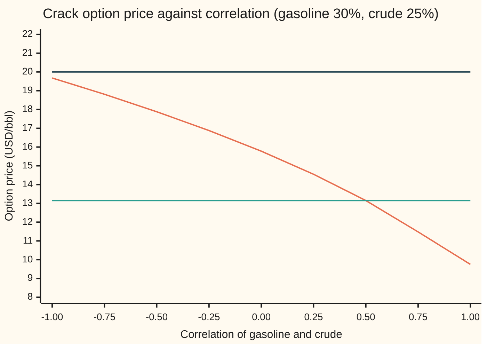

# Correlation from a spread option: the market's number for how two prices move together, and when no number fits

[Syllabus](../../../SYLLABUS.md) → [Financial mathematics](../../../SYLLABUS.md#w12) → [Options on commodity futures and spreads](../../../SYLLABUS.md#w12-s26) → Correlation from a spread option

---

## General Overview

A refinery buys crude oil and sells gasoline. Its margin is the gap between the two prices, called the crack spread. Gasoline futures for delivery in six months trade at 100 US dollars a barrel; crude futures for the same month trade at 90. A futures price is the price agreed today for delivery later. A bank sells the refinery an option that pays, in six months, gasoline minus crude if that gap is positive, and nothing otherwise. The dealer screen shows it at 13.15 dollars a barrel.

The price depends on how wide the gap may swing. That depends on three things: how much gasoline swings, how much crude swings, and how closely the two move together. The first two are read off each fuel's own options, 30 percent a year for gasoline and 25 percent for crude. The third, the correlation, has no market of its own. So the spread option's price is run backwards, the way a single option's price is run backwards to give a volatility. The price goes in; the correlation that reproduces it comes out. For 13.15 it is 0.50.

Not every quote has an answer. With these two volatilities, the highest price the formula can give is 19.68, reached when the two prices move in exact opposition. A quote of 20 lies above that ceiling. No correlation reproduces it. The quote says one of the two volatilities is wrong, or the model is.

**Implied correlation is the one correlation that makes the spread-option formula match the quote; it exists and is unique when the quote lies between the prices at correlation +1 and −1, and it is only as good as the two volatilities fed in beside it.**

**What kind of fact this is:** a definition (implied correlation), made safe by a theorem (one quote in range, one correlation) proved in Why it works; the comparison with realised correlation is a statistical estimate, with its error band stated.

### The picture: the crack option's price against correlation



Falling curve: the option's price at each correlation. Middle flat line: the quote 13.15. It crosses the curve once, at 0.50. Top flat line: a quote of 20. It never meets the curve, which tops out at 19.68 when the correlation is −1.

---

## The formula

The option is priced by Margrabe's formula, taught on [Spread options](04-margrabe-and-kirk-spread-options.md). It is Black's futures-option formula with gasoline as the asset, crude as the strike, and one volatility for the gap:

$$C(\rho) = D\,\big[F_1\,N(d_1) - F_2\,N(d_2)\big], \qquad \sigma(\rho)^2 = \sigma_1^2 + \sigma_2^2 - 2\rho\,\sigma_1\sigma_2 .$$

Implied correlation, written $\rho_{\text{imp}}$, is defined by one equation, and has a solution exactly inside one range:

$$C(\rho_{\text{imp}}) = C_{\text{mkt}}, \qquad C(+1) \;\le\; C_{\text{mkt}} \;\le\; C(-1).$$

**Read it aloud:** the implied correlation is the setting of the correlation dial at which Margrabe's formula matches the screen, and such a setting exists, once only, when the quote sits between the price at perfect co-movement and the price at perfect opposition.

Because correlation reaches the price only through $\sigma$, the inverse can also be done in two steps. First read the gap's volatility, $\sigma_{\text{imp}}$, off the quote. Then undo the second equation:

$$\rho_{\text{imp}} = \frac{\sigma_1^2 + \sigma_2^2 - \sigma_{\text{imp}}^2}{2\,\sigma_1\sigma_2}.$$

**Read it aloud:** the correlation is how much of the two legs' combined variance the quote says has cancelled, as a share of the most that could cancel.

The realised correlation of a price history is the sample version, over daily log returns $x_i$ of gasoline and $y_i$ of crude (a log return is the natural log of today's price over yesterday's):

$$\hat\rho = \frac{\sum_i (x_i - \bar x)(y_i - \bar y)}{\sqrt{\sum_i (x_i - \bar x)^2\;\sum_i (y_i - \bar y)^2}} .$$

| Symbol | Plain meaning | In our example | Push it up and the answer… |
| --- | --- | --- | --- |
| $C_{\text{mkt}}$, $C$, $B$ | the quoted price, USD/bbl; Margrabe's price at a given correlation; the same price as a function of the gap's total swing $w = \sigma\sqrt T$ | 13.153109 | implied correlation falls |
| $F_1$, $F_2$ | gasoline and crude futures prices for the delivery month | 100 and 90 | move the range; the quote's correlation shifts |
| $\sigma_1$, $\sigma_2$ | each leg's volatility: yearly spread of its log price, a decimal | 0.30 and 0.25 | the same quote implies a higher correlation |
| $\rho$, $\rho_{\text{imp}}$ | correlation of the two legs' daily moves, from −1 to 1; the one that matches the quote | 0.50 | price falls |
| $\sigma$, $\sigma_{\text{imp}}$, $g$ | volatility of the ratio gasoline over crude, called the gap's volatility; the one the quote implies; $g(\rho) = \sigma^2$, the gap's variance | 0.278388; $g(0.5)$ = 0.077500 | price rises |
| $D$, $r$ | discount factor $e^{-rT}$; bank rate, continuously compounded | 0.975310; 5% | raise $r$ (so $D$ falls): the same quote implies a lower correlation |
| $T$ | time to expiry in years | 0.5 | |
| $d_1$, $d_2$ | Black's two distances, $d_1 = \frac{\ln(F_1/F_2) + \frac12\sigma^2T}{\sigma\sqrt T}$, $d_2 = d_1 - \sigma\sqrt T$ | 0.633657, 0.436807 | |
| $N$, $\varphi$ | bell-curve area left of a point; the bell curve's height | $N(d_1)$ = 0.736848 | |
| $\partial C/\partial\rho$ | correlation vega: dollars per unit of correlation, $-D F_1 \varphi(d_1)\sqrt T\,\sigma_1\sigma_2/\sigma$ | −6.063996 | |
| $\hat\rho$, $x_i$, $y_i$, $i$, $n$ | realised correlation; day $i$'s log returns of gasoline and crude; the day's number; the number of days | 0.6675 over 126 days | |
| $K$, $b$ | a cash strike added to crude; Kirk's weight $F_2/(F_2 + K)$ on crude's volatility | 10 | |

### When it holds

- **Two lognormal legs, one fixed correlation.** Margrabe assumes each futures price has constant volatility and the pair a constant correlation. Real spreads have a smile in correlation too: different strikes imply different numbers, the way single options imply different vols.
- **Agreed volatilities.** The two vols are fixed first, from each leg's own options. Move gasoline's vol from 30 to 32 percent and the same quote implies 0.5462, not 0.50: implied correlation absorbs every error in the vols.
- **European exercise, zero strike for the exact formula.** Margrabe is exact only at zero strike. With a cash strike, Kirk's approximation stands in; on this card at strike 10 it recovers the same 0.500000 as an exact price does.
- **Delivery and expiry in the same month.** Real crack options settle on specific contract months with their own vols. The formula here uses one expiry for both legs.

---

## Why it works

### Step 0: a price that falls without gaps meets each level once

As the correlation dial turns from −1 to +1, the option's price falls steadily, with no jumps and no flat stretches. It starts at a ceiling and ends at a floor. Every quote between is met exactly once. That is the whole reason a spread price can be read as a correlation. It is the argument of [Intermediate value theorem](../../06-Calculus%20and%20analysis/01-Limits%20and%20Continuity/06-intermediate-value-theorem.md), applied to a function that only goes down.

### Step 1: correlation reaches the price only through the gap's volatility

The option pays gasoline minus crude when positive. Divide by crude: it pays crude times (gasoline over crude, minus one). So it is a call on the ratio of the two prices, struck at one, counted in barrels of crude. The ratio's log is gasoline's log return minus crude's. Its variance is a sum of the two variances minus twice the shared part:

$$\sigma^2 = \sigma_1^2 + \sigma_2^2 - 2\rho\,\sigma_1\sigma_2.$$

That is the second equation of the formula. Correlation appears nowhere else. When the two move together ($\rho$ near 1), their gap barely moves; when they move against each other ($\rho$ near −1), the gap swings with both at once. The proof that the price is Black's formula on this ratio, by counting in crude barrels instead of dollars, is on [Spread options](04-margrabe-and-kirk-spread-options.md).

### Step 2: the floor and the ceiling

$\sigma^2$ is a straight line in $\rho$ with slope $-2\sigma_1\sigma_2$, negative. At $\rho = +1$ it is $(\sigma_1 - \sigma_2)^2$, so $\sigma = |\sigma_1 - \sigma_2|$ = 0.05. At $\rho = -1$ it is $(\sigma_1 + \sigma_2)^2$, so $\sigma$ = 0.55. The gap's volatility can run only between those two.

Priced at 0.05, the crack option is worth 9.754440, a hair above the zero-volatility floor $D\,(F_1 - F_2)$ = 9.753099. The legs' vols differ, so even perfect co-movement leaves the gap some swing. Priced at 0.55 it is worth 19.675922. A quote of 20 lies above; a quote of 9.70 lies below. Neither has a correlation.

A quote of 20 is not an arbitrage. The model-free limits are wider: the option is worth at least $D\,(F_1 - F_2)$ and at most $D\,F_1$, the cost of the gasoline itself. A quote of 20 means that with gasoline at 30 percent and crude at 25 percent, no correlation fits. Raise either vol and it may fit.

### Step 3: the price always falls, so the answer is unique

Chain two slopes. The price rises with $\sigma$: its slope in $\sigma$ is vega, $D F_1 \varphi(d_1)\sqrt T$, positive. The gap's volatility falls with $\rho$: its slope is $-\sigma_1\sigma_2/\sigma$, negative. Multiply: the correlation vega, $\partial C/\partial \rho = -D F_1 \varphi(d_1)\sqrt T\,\sigma_1\sigma_2/\sigma$, is negative at every correlation. At 0.50 it is −6.063996 dollars per unit of correlation, as [Greeks of a spread option](05-spread-option-greeks.md) computes.

<details>
<summary>Detailed proof: existence, uniqueness and the boundary cases</summary>

Fix $\sigma_1, \sigma_2 > 0$ and $T > 0$. Write $g(\rho) = \sigma_1^2 + \sigma_2^2 - 2\rho\sigma_1\sigma_2$ for $\rho \in [-1, 1]$.

**The variance is positive except in one corner.** $g(\rho) \ge g(1) = (\sigma_1 - \sigma_2)^2 \ge 0$, with $g(\rho) = 0$ only when $\rho = 1$ and $\sigma_1 = \sigma_2$. So $\sigma(\rho) = \sqrt{g(\rho)}$ is continuous on $[-1, 1]$ and strictly decreasing, since $g$ is.

**The price is strictly increasing in the gap's volatility.** Let $B(w) = D\,[F_1 N(d_1) - F_2 N(d_2)]$ with $w = \sigma\sqrt T > 0$, $d_1 = \ln(F_1/F_2)/w + w/2$, $d_2 = d_1 - w$. The identity $F_1\varphi(d_1) = F_2\varphi(d_2)$ (from $d_1^2 - d_2^2 = 2\ln(F_1/F_2)$) collapses the slope to $B'(w) = D F_1 \varphi(d_1) > 0$. As $w \to 0$, $B(w) \to D\,(F_1 - F_2)^+$, so defining $B(0)$ that way makes $B$ continuous and strictly increasing on $[0, \infty)$.

**The composition.** $C(\rho) = B(\sigma(\rho)\sqrt T)$ is continuous on $[-1, 1]$, and strictly decreasing: a strictly increasing function of a strictly decreasing one.

**Existence.** If $C(1) \le C_{\text{mkt}} \le C(-1)$, the intermediate value theorem gives a $\rho$ in $[-1, 1]$ with $C(\rho) = C_{\text{mkt}}$.

**Uniqueness.** Two different roots would give two equal values of a strictly decreasing function. Impossible.

**Boundary cases.** A quote equal to $C(1)$ gives $\rho = 1$; equal to $C(-1)$ gives $\rho = -1$. A quote strictly inside gives a $\rho$ strictly inside $(-1, 1)$. A quote outside $[C(1), C(-1)]$ has no correlation: every $\rho$ in range gives a price on the wrong side of it. The two-step route agrees: $\sigma_{\text{imp}}$ exists for any quote at least $D\,(F_1 - F_2)^+$ and below $D\,F_1$ (which no finite volatility reaches), and the formula for $\rho_{\text{imp}}$ lands in $[-1, 1]$ exactly when $|\sigma_1 - \sigma_2| \le \sigma_{\text{imp}} \le \sigma_1 + \sigma_2$.

</details>

### Step 4: find the crossing, four ways

Halving always works inside the range. Start with the whole interval from −1 to +1. Price the midpoint. The price falls with correlation, so if the midpoint's price is above the quote, the answer lies to the right; keep that half. Fifty halvings land on 0.500000.

The two-step route gives the same number with no search in correlation. Halving on Black's formula finds the gap's volatility the quote implies, 0.278388. Then $\rho = (0.1525 - 0.0775)/0.15$ = 0.500000.

Newton's method steps along the slope: new guess = old guess minus (price minus quote) divided by the correlation vega. From a start of 0 it reaches 0.500000 in 6 steps.

The fourth road never uses Margrabe's formula. Fix crude's random shock at expiry. Crude's price is then known. Gasoline, given that shock, is still lognormal, with its volatility cut by $\sqrt{1 - \rho^2}$ and its centre moved by the shared part. So the option's value, given crude, is Black's formula on gasoline with crude as a known strike. Averaging that over crude's bell curve by Simpson's rule gives the price. Halving on this price returns 0.500000. The same integral gives the floor and ceiling, 9.754440 and 19.675922, to six decimals.

### Step 5: compare with realised correlation

A history of daily moves gives its own correlation. On this card the history is simulated: 126 trading days, about six months, drawn with the legs' vols and a true correlation of 0.70. Its sample correlation $\hat\rho$ is 0.6675. The history's own vols come out at 0.2797 and 0.2445, close to the 30 and 25 percent it was drawn with.

A sample of 126 days pins correlation only loosely. Fisher's transformation, $\tfrac12\ln\frac{1+\hat\rho}{1-\hat\rho}$, turns a sample correlation into a number that is close to bell-shaped, with standard error $1/\sqrt{n - 3}$. Going 1.96 standard errors each side and transforming back gives a 95 percent band: 0.5577 to 0.7543. It covers the true 0.70, as such a band does in 19 samples out of 20.

The market's 0.50 lies below the band. The quote prices more swing in the crack than history showed. At the realised 0.6675 the option would be worth 12.071238. The quote is 1.081871 dollars a barrel higher. Two readings are possible. Sellers may be charging for the risk that correlation breaks down, which happens in refinery outages and export bans. Or the history is not the future. The comparison says how much is being paid for the difference; it does not say who is right.

### Step 6: the answer depends on the vols assumed

Correlation is solved for last, so it inherits every error in the two vols. Hold the quote at 13.153109 and change the assumed vols. The implied correlation moves as below.

```
implied correlation, crude vol held at 25%, one mark = 0.02
gasoline 26%   ████████████████████           0.4046
gasoline 28%   ███████████████████████        0.4529
gasoline 30%   █████████████████████████      0.5000
gasoline 32%   ███████████████████████████    0.5462
gasoline 34%   ██████████████████████████████ 0.5918
```

Two vol points either side of 30 percent on gasoline move the correlation from 0.4529 to 0.5462. At gasoline 55 percent the formula asks for 1.0455, which is not a correlation: the gap's implied volatility, 0.278388, is below the smallest the two legs allow, $0.55 - 0.25$. The solver refuses it.

The printed grid in the code also varies crude's vol. With crude at 23 percent and gasoline at 26 the quote implies 0.3595; with crude at 27 and gasoline at 34 it implies 0.6046. A desk that quotes correlation always quotes the vols beside it.

---

## Worked numbers, by hand

Conventions verified 2026-09-28: NYMEX RBOB gasoline futures are quoted in dollars per gallon, Brent and WTI crude in dollars per barrel; crack spreads convert gasoline at 42 gallons a barrel. The 100 here is gasoline already in dollars per barrel.

House crack: $F_1$ = 100, $F_2$ = 90, $\sigma_1$ = 0.30, $\sigma_2$ = 0.25, $T$ = 0.5, $r$ = 5%, zero strike, quote $C_{\text{mkt}}$ = 13.153109, shown on screen as 13.15.

| Step | Arithmetic | Value |
| --- | --- | --- |
| discount $D$ | $e^{-0.05 \times 0.5}$ | 0.975310 |
| lowest price, $\rho = +1$, $\sigma = 0.05$ | Margrabe at 0.05 | 9.754440 |
| highest price, $\rho = -1$, $\sigma = 0.55$ | Margrabe at 0.55 | 19.675922 |
| inside? | $9.754440 \le 13.153109 \le 19.675922$ | yes: one answer |
| gap's implied vol $\sigma_{\text{imp}}$ | halving on Black's formula | 0.278388 |
| check: $d_1$, $d_2$ | $\frac{\ln(100/90) + \frac12 (0.077500)(0.5)}{0.278388\sqrt{0.5}}$, then minus $0.278388\sqrt{0.5}$ | 0.633657, 0.436807 |
| check: price | $0.975310 \times (100 \times 0.736848 - 90 \times 0.668874)$ | 13.153109 |
| $\sigma_1^2 + \sigma_2^2$ | $0.09 + 0.0625$ | 0.152500 |
| $\sigma_{\text{imp}}^2$ | $0.278388^2$ | 0.077500 |
| $2\sigma_1\sigma_2$ | $2 \times 0.30 \times 0.25$ | 0.150000 |
| **implied correlation** | $(0.1525 - 0.0775)/0.15$ | **0.500000** |

A quote of 20: it is above 19.675922, so there is no answer. The gap would need a volatility above 0.55, and two legs at 30 and 25 percent cannot produce one.

A price error of 1 cent moves the implied correlation by 0.01 / 6.063996 = 0.001649. The correlation read off a quote to the cent is good to about two thousandths, given the vols. The screen's rounded 13.15 sits 0.31 cents below the exact quote, so it implies 0.500513, which still reads 0.50.

The same inversion works with a strike. With a strike of 10 dollars, the Kirk price at 0.50 is 7.428642. Halving on Kirk returns 0.500000; halving on the exact integral price returns 0.500000 too. At this strike Kirk's error is too small to move the correlation in the sixth decimal.

### What breaks if you drop a piece

| Mistake | Comes out at | What went wrong |
| --- | --- | --- |
| Drop the 2 in $2\rho\sigma_1\sigma_2$ when solving | 1.000000 | The formula then returns twice the correlation; here it reads as perfect co-movement |
| Write $+2\rho\sigma_1\sigma_2$ | −0.500000 | The sign turns co-movement into opposition |
| Forget the discount $D$ | 0.552555 | An undiscounted formula needs less gap swing to reach the same quote |
| Quote 20.00, no range check | −1.000000 | Above the ceiling 19.675922: the solver stops at its edge and reports a number that is not an answer |
| Assume gasoline vol 55% | 1.0455, refused | The quote's gap vol 0.278388 is below $0.55 - 0.25$: the legs cannot move together closely enough |

---

## Code, from first principles, and it actually runs

The code reads 0.50 out of the crack quote by four roads: halving on Margrabe's formula, the two-step route through the gap's implied vol, Newton's method with the correlation vega, and halving on a price built by averaging over crude's bell curve, which never uses Margrabe. It checks the floor and ceiling by the formula and the integral, and prices the option a fifth way by simulating both futures with mirrored random draws. It simulates a six-month history, measures its correlation with a Fisher band, prints the implied correlation across a grid of assumed vols, inverts a Kirk quote at strike 10, and prints every wrong answer in the table above. Mutation tests were run: flipping the sign of the cross term, dropping the correlation from the integral's centre or its volatility cut, uncorrelating the simulation, dropping a factor from the correlation vega, changing the history's correlation, and deleting the range check each trip an assert or stop the run.

### Python

```python
# Implied correlation from a spread option -- the check behind the card.  Standard library only.
# Nothing imported knows the answer: the normal CDF is a series, the root finders, the integrator
# and the random numbers are written out here.
from math import log, sqrt, exp, pi, cos, sin, atanh, tanh
def phi(x): return exp(-0.5 * x * x) / sqrt(2.0 * pi)       # bell-curve height at x
def N(x):                                # bell-curve area left of x: 1/2 + phi(x)(x + x^3/3 + x^5/15 + ...)
    if x < -12.0: return 0.0
    if x > 12.0: return 1.0
    term, total, k = x, x, 1
    while abs(term) > 1e-17 * abs(total):
        term *= x * x / (2 * k + 1); total += term; k += 1
    return 0.5 + phi(x) * total
def black(F, K, w):                      # undiscounted Black call, total swing w = vol * sqrt(T)
    if w < 1e-12: return max(F - K, 0.0)
    a = (log(F / K) + 0.5 * w * w) / w
    return F * N(a) - K * N(a - w)
F1, F2, s1, s2, T, r = 100.0, 90.0, 0.30, 0.25, 0.5, 0.05   # gasoline, crude, their vols, six months, 5%
D = exp(-r * T)
def spread_vol(rho, a=s1, b=s2): return sqrt(max(a * a + b * b - 2 * rho * a * b, 0.0))
def margrabe(rho, a=s1, b=s2): return D * black(F1, F2, spread_vol(rho, a, b) * sqrt(T))
def kirk(rho, K):                        # Kirk: crude plus strike treated as one lognormal leg
    b = F2 / (F2 + K); v = sqrt(max(s1 * s1 - 2 * rho * s1 * s2 * b + s2 * s2 * b * b, 0.0))
    return D * black(F1, F2 + K, v * sqrt(T))
def by_integral(rho, K=0.0, n=2000):     # road 4: fix crude's shock z; gasoline is then lognormal
    a, bb = -8.0, 8.0; h = (bb - a) / n; st = sqrt(T)
    def f(z):
        crude = F2 * exp(-0.5 * s2 * s2 * T + s2 * st * z)
        gas = F1 * exp(-0.5 * rho * rho * s1 * s1 * T + rho * s1 * st * z)
        return black(gas, crude + K, s1 * sqrt(max(1 - rho * rho, 0.0)) * st) * phi(z)
    tot = f(a) + f(bb) + sum((4 if i % 2 else 2) * f(a + i * h) for i in range(1, n))
    return D * tot * h / 3.0
def bisect(price, quote, lo=-1.0, hi=1.0, steps=50):   # price falls as rho rises
    for _ in range(steps):
        mid = 0.5 * (lo + hi)
        if price(mid) > quote: lo = mid
        else: hi = mid
    return 0.5 * (lo + hi)
def implied_rho(quote, price=margrabe):  # refuse quotes outside [price at +1, price at -1]
    if not price(1.0) <= quote <= price(-1.0): return None
    return bisect(price, quote)
def corr_vega(rho):                      # dC/drho = vega times dsigma/drho = -vega s1 s2 / sigma
    v = spread_vol(rho); a = (log(F1 / F2) + 0.5 * v * v * T) / (v * sqrt(T))
    return -D * F1 * phi(a) * sqrt(T) * s1 * s2 / v
Q = round(margrabe(0.5), 6)              # the screen quote, to six decimals
print("house crack: gasoline 100, crude 90, vols 30% and 25%, six months, 5%")
rows = [("discount D", D), ("floor D (F1 - F2)", D * (F1 - F2)),
        ("spread vol at rho 0.5", spread_vol(0.5)), ("quote = Margrabe at rho 0.5", Q),
        ("price at rho +1 (lowest)", margrabe(1.0)), ("  same by integral", by_integral(1.0, n=20000)),
        ("price at rho -1 (highest)", margrabe(-1.0)), ("  same by integral", by_integral(-1.0, n=20000))]
r1 = implied_rho(Q)
vimp = bisect(lambda v: D * black(F1, F2, v * sqrt(T)), Q, 1.0, 1e-9, 60)   # price rises with vol
r2 = (s1 * s1 + s2 * s2 - vimp * vimp) / (2 * s1 * s2)
x, its = 0.0, 0
while its < 50:
    its += 1; step = (margrabe(x) - Q) / corr_vega(x); x -= step
    if abs(step) < 1e-13: break
r4 = implied_rho(Q, by_integral)
cv, bump = corr_vega(0.5), (margrabe(0.501) - margrabe(0.499)) / 0.002
rows += [("1 implied rho, bisection", r1), ("  implied spread vol", vimp), ("2 rho from the spread vol", r2),
         ("3 implied rho, Newton from 0", x), ("  Newton steps", its), ("4 implied rho, integral price", r4),
         ("corr vega dC/drho at 0.5", cv), ("  same by bump", bump), ("rho moved by a 0.01 price error", 0.01 / abs(cv))]
w5 = spread_vol(0.5) * sqrt(T); a5 = (log(F1 / F2) + 0.5 * w5 * w5) / w5
rows += [("d1 at rho 0.5", a5), ("d2 = d1 - sigma sqrt T", a5 - w5), ("N(d1)", N(a5)), ("N(d2)", N(a5 - w5))]
for name, v in rows: print(f"  {name:<32} {v:>11.6f}")
print(f"  by hand: s1^2 + s2^2 {s1*s1 + s2*s2:.6f}   2 s1 s2 {2*s1*s2:.6f}   vimp^2 {vimp*vimp:.6f}")
print(f"  spread vol can run from |s1 - s2| {abs(s1 - s2):.6f} to s1 + s2 {s1 + s2:.6f}")
txt = lambda v: "none" if v is None else f"{v:.6f}"
print(f"  quote 20.00: rho {txt(implied_rho(20.0))}    quote 9.70: rho {txt(implied_rho(9.70))}")
print("\nchart: price against correlation, quote lines 13.15 and 20.00")
grid = [-1.0 + 0.25 * i for i in range(9)]
print("  rho    " + " ".join(f"{g:6.2f}" for g in grid))
print("  price  " + " ".join(f"{margrabe(g):6.2f}" for g in grid))
state = [20260927]
def unif():                              # 64-bit linear congruential generator
    state[0] = (6364136223846793005 * state[0] + 1442695040888963407) % 2**64
    return ((state[0] >> 11) + 0.5) / 2**53
def pair():                              # Box-Muller: two independent normals
    u1, u2 = unif(), unif(); rad = sqrt(-2 * log(u1))
    return rad * cos(2 * pi * u2), rad * sin(2 * pi * u2)
def pay(z1, z2):                         # the spread's payoff for one pair of shocks, at rho 0.5
    w2 = 0.5 * z1 + sqrt(0.75) * z2
    return max(F1 * exp(-0.5 * s1 * s1 * T + s1 * sqrt(T) * z1) - F2 * exp(-0.5 * s2 * s2 * T + s2 * sqrt(T) * w2), 0.0)
paths, tot, tot2 = 500000, 0.0, 0.0     # road 5: simulate both futures, each draw used twice (z and -z)
for _ in range(paths):
    z1, z2 = pair(); p = 0.5 * (pay(z1, z2) + pay(-z1, -z2)); tot += p; tot2 += p * p
mc = D * tot / paths; se = D * sqrt(tot2 / paths - (tot / paths) ** 2) / sqrt(paths)
print(f"\nsimulation, {paths} mirrored pairs: price {mc:.6f}  std error {se:.6f}  implied rho {implied_rho(mc):.6f}")
days, true_rho, dt = 126, 0.70, 1.0 / 252          # a six-month history of daily moves
state[0] = 777; xs, ys = [], []
for _ in range(days):
    z1, z2 = pair()
    xs.append(s1 * sqrt(dt) * z1); ys.append(s2 * sqrt(dt) * (true_rho * z1 + sqrt(1 - true_rho ** 2) * z2))
mx, my = sum(xs) / days, sum(ys) / days
sxy = sum((a - mx) * (b - my) for a, b in zip(xs, ys))
sxx = sum((a - mx) ** 2 for a in xs); syy = sum((b - my) ** 2 for b in ys)
rr = sxy / sqrt(sxx * syy); half = 1.96 / sqrt(days - 3)
lo, hi = tanh(atanh(rr) - half), tanh(atanh(rr) + half)
print(f"realised, {days} days drawn at rho {true_rho:.2f}: vols {sqrt(sxx/(days-1)/dt):.4f} {sqrt(syy/(days-1)/dt):.4f}  rho {rr:.4f}  95% band {lo:.4f} to {hi:.4f}")
print(f"  price at realised rho {margrabe(rr):.6f}   quote minus that {Q - margrabe(rr):.6f}")
print("\nimplied rho from the same quote, by the vols assumed (gasoline down, crude across)")
print("  gas \\ crude    0.23      0.25      0.27")
for a in (0.26, 0.28, 0.30, 0.32, 0.34):
    print(f"  {a:.2f}      " + "  ".join(f"{(a*a + b*b - vimp*vimp) / (2*a*b):8.4f}" for b in (0.23, 0.25, 0.27)))
need = (0.55 ** 2 + s2 * s2 - vimp * vimp) / (2 * 0.55 * s2)
print(f"  gasoline vol 0.55: rho needed {need:.4f}, solver says {txt(implied_rho(Q, lambda p: margrabe(p, 0.55)))}")
KQ = round(kirk(0.5, 10.0), 6)
rk, rx = implied_rho(KQ, lambda p: kirk(p, 10.0)), implied_rho(KQ, lambda p: by_integral(p, 10.0))
print(f"\nstrike 10: Kirk quote {KQ:.6f}  rho by Kirk {rk:.6f}  rho by exact integral {rx:.6f}")
print("\nwhat breaks")
und = bisect(lambda p: black(F1, F2, spread_vol(p) * sqrt(T)), Q)
wrong = [("no 2 on the cross term", (s1 * s1 + s2 * s2 - vimp * vimp) / (s1 * s2)),
         ("plus sign on the cross term", (vimp * vimp - s1 * s1 - s2 * s2) / (2 * s1 * s2)),
         ("forgot the discount D", und), ("quote 20.00, bare solver", bisect(margrabe, 20.0))]
for name, v in wrong: print(f"  {name:<32} {v:>11.6f}")
assert abs(r1 - 0.5) < 1e-6 and abs(r2 - r1) < 1e-6 and abs(x - r1) < 1e-9, "three roads on Margrabe"
assert abs(r4 - r1) < 1e-6, "a price built without Margrabe gives the same correlation"
assert abs(by_integral(-1.0, n=20000) - margrabe(-1.0)) < 1e-4 and abs(by_integral(1.0, n=20000) - margrabe(1.0)) < 1e-4, "bounds by two roads"
assert abs(mc - Q) < 3 * se, "simulated spread payoff matches the quote within noise"
assert abs(cv - bump) < 1e-4 and cv < 0, "correlation vega by formula and by bump, and negative"
assert implied_rho(20.0) is None and implied_rho(9.70) is None and need > 1, "no correlation outside the range"
assert lo < true_rho < hi, "realised band covers the correlation the history was drawn with"
print("ALL CHECKS PASS")
```

**Ran 2026-09-27 on macOS, Python 3.14.6, standard library only. All checks passed. Output, pasted from the run:**

```
house crack: gasoline 100, crude 90, vols 30% and 25%, six months, 5%
  discount D                          0.975310
  floor D (F1 - F2)                   9.753099
  spread vol at rho 0.5               0.278388
  quote = Margrabe at rho 0.5        13.153109
  price at rho +1 (lowest)            9.754440
    same by integral                  9.754440
  price at rho -1 (highest)          19.675922
    same by integral                 19.675922
  1 implied rho, bisection            0.500000
    implied spread vol                0.278388
  2 rho from the spread vol           0.500000
  3 implied rho, Newton from 0        0.500000
    Newton steps                      6.000000
  4 implied rho, integral price       0.500000
  corr vega dC/drho at 0.5           -6.063996
    same by bump                     -6.063997
  rho moved by a 0.01 price error     0.001649
  d1 at rho 0.5                       0.633657
  d2 = d1 - sigma sqrt T              0.436807
  N(d1)                               0.736848
  N(d2)                               0.668874
  by hand: s1^2 + s2^2 0.152500   2 s1 s2 0.150000   vimp^2 0.077500
  spread vol can run from |s1 - s2| 0.050000 to s1 + s2 0.550000
  quote 20.00: rho none    quote 9.70: rho none

chart: price against correlation, quote lines 13.15 and 20.00
  rho     -1.00  -0.75  -0.50  -0.25   0.00   0.25   0.50   0.75   1.00
  price   19.68  18.81  17.88  16.88  15.78  14.55  13.15  11.48   9.75

simulation, 500000 mirrored pairs: price 13.144642  std error 0.008094  implied rho 0.501396
realised, 126 days drawn at rho 0.70: vols 0.2797 0.2445  rho 0.6675  95% band 0.5577 to 0.7543
  price at realised rho 12.071238   quote minus that 1.081871

implied rho from the same quote, by the vols assumed (gasoline down, crude across)
  gas \ crude    0.23      0.25      0.27
  0.26        0.3595    0.4046    0.4487
  0.28        0.4177    0.4529    0.4881
  0.30        0.4739    0.5000    0.5272
  0.32        0.5285    0.5462    0.5660
  0.34        0.5818    0.5918    0.6046
  gasoline vol 0.55: rho needed 1.0455, solver says none

strike 10: Kirk quote 7.428642  rho by Kirk 0.500000  rho by exact integral 0.500000

what breaks
  no 2 on the cross term              1.000000
  plus sign on the cross term        -0.500000
  forgot the discount D               0.552555
  quote 20.00, bare solver           -1.000000
ALL CHECKS PASS
```

### Rust

```rust
// Implied correlation from a spread option -- the same check as the Python file, in Rust.
// Standard library only, no crates.  The normal CDF is a series, and the root finders, the
// integrator and the random numbers are written out here.
use std::f64::consts::PI;
const F1: f64 = 100.0; const F2: f64 = 90.0; const S1: f64 = 0.30; const S2: f64 = 0.25;
const T: f64 = 0.5; const R: f64 = 0.05;
fn phi(x: f64) -> f64 { (-0.5 * x * x).exp() / (2.0 * PI).sqrt() }      // bell-curve height at x
fn n_cdf(x: f64) -> f64 {                // 1/2 + phi(x)(x + x^3/3 + x^5/15 + ...)
    if x < -12.0 { return 0.0; }
    if x > 12.0 { return 1.0; }
    let (mut term, mut total, mut k) = (x, x, 1.0);
    while term.abs() > 1e-17 * total.abs() { term *= x * x / (2.0 * k + 1.0); total += term; k += 1.0; }
    0.5 + phi(x) * total
}
fn black(f: f64, k: f64, w: f64) -> f64 { // undiscounted Black call, total swing w = vol * sqrt(T)
    if w < 1e-12 { return (f - k).max(0.0); }
    let a = ((f / k).ln() + 0.5 * w * w) / w;
    f * n_cdf(a) - k * n_cdf(a - w)
}
fn disc() -> f64 { (-R * T).exp() }
fn spread_vol(rho: f64, a: f64, b: f64) -> f64 { (a * a + b * b - 2.0 * rho * a * b).max(0.0).sqrt() }
fn margrabe(rho: f64, a: f64, b: f64) -> f64 { disc() * black(F1, F2, spread_vol(rho, a, b) * T.sqrt()) }
fn kirk(rho: f64, k: f64) -> f64 {        // crude plus strike treated as one lognormal leg
    let b = F2 / (F2 + k);
    let v = (S1 * S1 - 2.0 * rho * S1 * S2 * b + S2 * S2 * b * b).max(0.0).sqrt();
    disc() * black(F1, F2 + k, v * T.sqrt())
}
fn by_integral(rho: f64, k: f64, n: usize) -> f64 {   // road 4: fix crude's shock z; gasoline is lognormal
    let (a, bb) = (-8.0, 8.0); let h = (bb - a) / n as f64; let st = T.sqrt();
    let f = |z: f64| {
        let crude = F2 * (-0.5 * S2 * S2 * T + S2 * st * z).exp();
        let gas = F1 * (-0.5 * rho * rho * S1 * S1 * T + rho * S1 * st * z).exp();
        black(gas, crude + k, S1 * (1.0 - rho * rho).max(0.0).sqrt() * st) * phi(z)
    };
    let mut tot = f(a) + f(bb);
    for i in 1..n { tot += if i % 2 == 1 { 4.0 } else { 2.0 } * f(a + i as f64 * h); }
    disc() * tot * h / 3.0
}
fn bisect(price: &dyn Fn(f64) -> f64, quote: f64, mut lo: f64, mut hi: f64, steps: usize) -> f64 {
    for _ in 0..steps { let mid = 0.5 * (lo + hi); if price(mid) > quote { lo = mid; } else { hi = mid; } }
    0.5 * (lo + hi)
}
fn implied_rho(quote: f64, price: &dyn Fn(f64) -> f64) -> Option<f64> {   // refuse quotes outside the range
    if !(price(1.0) <= quote && quote <= price(-1.0)) { return None; }
    Some(bisect(price, quote, -1.0, 1.0, 50))
}
fn corr_vega(rho: f64) -> f64 {           // dC/drho = -vega s1 s2 / sigma
    let v = spread_vol(rho, S1, S2); let a = ((F1 / F2).ln() + 0.5 * v * v * T) / (v * T.sqrt());
    -disc() * F1 * phi(a) * T.sqrt() * S1 * S2 / v
}
fn txt(v: Option<f64>) -> String { match v { None => "none".to_string(), Some(x) => format!("{:.6}", x) } }
struct Lcg(u64);
impl Lcg {
    fn unif(&mut self) -> f64 {
        self.0 = self.0.wrapping_mul(6364136223846793005).wrapping_add(1442695040888963407);
        ((self.0 >> 11) as f64 + 0.5) / 9007199254740992.0
    }
    fn pair(&mut self) -> (f64, f64) {    // Box-Muller: two independent normals
        let (u1, u2) = (self.unif(), self.unif()); let rad = (-2.0 * u1.ln()).sqrt();
        (rad * (2.0 * PI * u2).cos(), rad * (2.0 * PI * u2).sin())
    }
}
fn main() {
    let d = disc();
    let m = |p: f64| margrabe(p, S1, S2);
    let q = (m(0.5) * 1e6).round() / 1e6;                                // the screen quote, six decimals
    println!("house crack: gasoline 100, crude 90, vols 30% and 25%, six months, 5%");
    let mut rows: Vec<(&str, f64)> = vec![("discount D", d), ("floor D (F1 - F2)", d * (F1 - F2)),
        ("spread vol at rho 0.5", spread_vol(0.5, S1, S2)), ("quote = Margrabe at rho 0.5", q),
        ("price at rho +1 (lowest)", m(1.0)), ("  same by integral", by_integral(1.0, 0.0, 20000)),
        ("price at rho -1 (highest)", m(-1.0)), ("  same by integral", by_integral(-1.0, 0.0, 20000))];
    let r1 = implied_rho(q, &m).unwrap();
    let vimp = bisect(&|v: f64| d * black(F1, F2, v * T.sqrt()), q, 1.0, 1e-9, 60);   // price rises with vol
    let r2 = (S1 * S1 + S2 * S2 - vimp * vimp) / (2.0 * S1 * S2);
    let (mut x, mut its) = (0.0_f64, 0);
    while its < 50 { its += 1; let step = (m(x) - q) / corr_vega(x); x -= step; if step.abs() < 1e-13 { break; } }
    let r4 = implied_rho(q, &|p| by_integral(p, 0.0, 2000)).unwrap();
    let (cv, bump) = (corr_vega(0.5), (m(0.501) - m(0.499)) / 0.002);
    rows.extend([("1 implied rho, bisection", r1), ("  implied spread vol", vimp), ("2 rho from the spread vol", r2),
        ("3 implied rho, Newton from 0", x), ("  Newton steps", its as f64), ("4 implied rho, integral price", r4),
        ("corr vega dC/drho at 0.5", cv), ("  same by bump", bump), ("rho moved by a 0.01 price error", 0.01 / cv.abs())]);
    let w5 = spread_vol(0.5, S1, S2) * T.sqrt(); let a5 = ((F1 / F2).ln() + 0.5 * w5 * w5) / w5;
    rows.extend([("d1 at rho 0.5", a5), ("d2 = d1 - sigma sqrt T", a5 - w5), ("N(d1)", n_cdf(a5)), ("N(d2)", n_cdf(a5 - w5))]);
    for (name, v) in &rows { println!("  {:<32} {:>11.6}", name, v); }
    println!("  by hand: s1^2 + s2^2 {:.6}   2 s1 s2 {:.6}   vimp^2 {:.6}", S1 * S1 + S2 * S2, 2.0 * S1 * S2, vimp * vimp);
    println!("  spread vol can run from |s1 - s2| {:.6} to s1 + s2 {:.6}", (S1 - S2).abs(), S1 + S2);
    println!("  quote 20.00: rho {}    quote 9.70: rho {}", txt(implied_rho(20.0, &m)), txt(implied_rho(9.70, &m)));
    println!("\nchart: price against correlation, quote lines 13.15 and 20.00");
    let grid: Vec<f64> = (0..9).map(|i| -1.0 + 0.25 * i as f64).collect();
    println!("  rho    {}", grid.iter().map(|g| format!("{:6.2}", g)).collect::<Vec<_>>().join(" "));
    println!("  price  {}", grid.iter().map(|g| format!("{:6.2}", m(*g))).collect::<Vec<_>>().join(" "));
    let mut rng = Lcg(20260927);
    let pay = |z1: f64, z2: f64| {        // the spread's payoff for one pair of shocks, at rho 0.5
        let w2 = 0.5 * z1 + 0.75_f64.sqrt() * z2;
        (F1 * (-0.5 * S1 * S1 * T + S1 * T.sqrt() * z1).exp() - F2 * (-0.5 * S2 * S2 * T + S2 * T.sqrt() * w2).exp()).max(0.0)
    };
    let (paths, mut tot, mut tot2) = (500000usize, 0.0_f64, 0.0_f64);    // road 5: each draw used twice, z and -z
    for _ in 0..paths { let (z1, z2) = rng.pair(); let p = 0.5 * (pay(z1, z2) + pay(-z1, -z2)); tot += p; tot2 += p * p; }
    let np = paths as f64;
    let mc = d * tot / np; let se = d * (tot2 / np - (tot / np).powi(2)).sqrt() / np.sqrt();
    println!("\nsimulation, {} mirrored pairs: price {:.6}  std error {:.6}  implied rho {:.6}", paths, mc, se, implied_rho(mc, &m).unwrap());
    let (days, true_rho, dt) = (126usize, 0.70_f64, 1.0 / 252.0_f64);  // a six-month history of daily moves
    let mut rng = Lcg(777); let (mut xs, mut ys) = (Vec::new(), Vec::new());
    for _ in 0..days {
        let (z1, z2) = rng.pair();
        xs.push(S1 * dt.sqrt() * z1); ys.push(S2 * dt.sqrt() * (true_rho * z1 + (1.0 - true_rho * true_rho).sqrt() * z2));
    }
    let nd = days as f64;
    let (mx, my) = (xs.iter().sum::<f64>() / nd, ys.iter().sum::<f64>() / nd);
    let sxy: f64 = xs.iter().zip(&ys).map(|(a, b)| (a - mx) * (b - my)).sum();
    let sxx: f64 = xs.iter().map(|a| (a - mx).powi(2)).sum(); let syy: f64 = ys.iter().map(|b| (b - my).powi(2)).sum();
    let rr = sxy / (sxx * syy).sqrt(); let half = 1.96 / (nd - 3.0).sqrt();
    let (lo, hi) = ((rr.atanh() - half).tanh(), (rr.atanh() + half).tanh());
    println!("realised, {} days drawn at rho {:.2}: vols {:.4} {:.4}  rho {:.4}  95% band {:.4} to {:.4}", days, true_rho,
        (sxx / (nd - 1.0) / dt).sqrt(), (syy / (nd - 1.0) / dt).sqrt(), rr, lo, hi);
    println!("  price at realised rho {:.6}   quote minus that {:.6}", m(rr), q - m(rr));
    println!("\nimplied rho from the same quote, by the vols assumed (gasoline down, crude across)");
    println!("  gas \\ crude    0.23      0.25      0.27");
    for a in [0.26_f64, 0.28, 0.30, 0.32, 0.34] {
        let cells: Vec<String> = [0.23_f64, 0.25, 0.27].iter().map(|b| format!("{:8.4}", (a * a + b * b - vimp * vimp) / (2.0 * a * b))).collect();
        println!("  {:.2}      {}", a, cells.join("  "));
    }
    let need = (0.55_f64.powi(2) + S2 * S2 - vimp * vimp) / (2.0 * 0.55 * S2);
    println!("  gasoline vol 0.55: rho needed {:.4}, solver says {}", need, txt(implied_rho(q, &|p| margrabe(p, 0.55, S2))));
    let kq = (kirk(0.5, 10.0) * 1e6).round() / 1e6;
    let (rk, rx) = (implied_rho(kq, &|p| kirk(p, 10.0)).unwrap(), implied_rho(kq, &|p| by_integral(p, 10.0, 2000)).unwrap());
    println!("\nstrike 10: Kirk quote {:.6}  rho by Kirk {:.6}  rho by exact integral {:.6}", kq, rk, rx);
    println!("\nwhat breaks");
    let und = bisect(&|p| black(F1, F2, spread_vol(p, S1, S2) * T.sqrt()), q, -1.0, 1.0, 50);
    let wrong: Vec<(&str, f64)> = vec![("no 2 on the cross term", (S1 * S1 + S2 * S2 - vimp * vimp) / (S1 * S2)),
        ("plus sign on the cross term", (vimp * vimp - S1 * S1 - S2 * S2) / (2.0 * S1 * S2)),
        ("forgot the discount D", und), ("quote 20.00, bare solver", bisect(&m, 20.0, -1.0, 1.0, 50))];
    for (name, v) in &wrong { println!("  {:<32} {:>11.6}", name, v); }
    assert!((r1 - 0.5).abs() < 1e-6 && (r2 - r1).abs() < 1e-6 && (x - r1).abs() < 1e-9, "three roads on Margrabe");
    assert!((r4 - r1).abs() < 1e-6, "a price built without Margrabe gives the same correlation");
    assert!((by_integral(-1.0, 0.0, 20000) - m(-1.0)).abs() < 1e-4 && (by_integral(1.0, 0.0, 20000) - m(1.0)).abs() < 1e-4, "bounds by two roads");
    assert!((mc - q).abs() < 3.0 * se, "simulated spread payoff matches the quote within noise");
    assert!((cv - bump).abs() < 1e-4 && cv < 0.0, "correlation vega by formula and by bump, and negative");
    assert!(implied_rho(20.0, &m).is_none() && implied_rho(9.70, &m).is_none() && need > 1.0, "no correlation outside the range");
    assert!(lo < true_rho && true_rho < hi, "realised band covers the correlation the history was drawn with");
    println!("ALL CHECKS PASS");
}
```

**Ran 2026-09-27 on macOS, rustc 1.98.1, no crates. All checks passed. Output, pasted from the run:**

```
house crack: gasoline 100, crude 90, vols 30% and 25%, six months, 5%
  discount D                          0.975310
  floor D (F1 - F2)                   9.753099
  spread vol at rho 0.5               0.278388
  quote = Margrabe at rho 0.5        13.153109
  price at rho +1 (lowest)            9.754440
    same by integral                  9.754440
  price at rho -1 (highest)          19.675922
    same by integral                 19.675922
  1 implied rho, bisection            0.500000
    implied spread vol                0.278388
  2 rho from the spread vol           0.500000
  3 implied rho, Newton from 0        0.500000
    Newton steps                      6.000000
  4 implied rho, integral price       0.500000
  corr vega dC/drho at 0.5           -6.063996
    same by bump                     -6.063997
  rho moved by a 0.01 price error     0.001649
  d1 at rho 0.5                       0.633657
  d2 = d1 - sigma sqrt T              0.436807
  N(d1)                               0.736848
  N(d2)                               0.668874
  by hand: s1^2 + s2^2 0.152500   2 s1 s2 0.150000   vimp^2 0.077500
  spread vol can run from |s1 - s2| 0.050000 to s1 + s2 0.550000
  quote 20.00: rho none    quote 9.70: rho none

chart: price against correlation, quote lines 13.15 and 20.00
  rho     -1.00  -0.75  -0.50  -0.25   0.00   0.25   0.50   0.75   1.00
  price   19.68  18.81  17.88  16.88  15.78  14.55  13.15  11.48   9.75

simulation, 500000 mirrored pairs: price 13.144642  std error 0.008094  implied rho 0.501396
realised, 126 days drawn at rho 0.70: vols 0.2797 0.2445  rho 0.6675  95% band 0.5577 to 0.7543
  price at realised rho 12.071238   quote minus that 1.081871

implied rho from the same quote, by the vols assumed (gasoline down, crude across)
  gas \ crude    0.23      0.25      0.27
  0.26        0.3595    0.4046    0.4487
  0.28        0.4177    0.4529    0.4881
  0.30        0.4739    0.5000    0.5272
  0.32        0.5285    0.5462    0.5660
  0.34        0.5818    0.5918    0.6046
  gasoline vol 0.55: rho needed 1.0455, solver says none

strike 10: Kirk quote 7.428642  rho by Kirk 0.500000  rho by exact integral 0.500000

what breaks
  no 2 on the cross term              1.000000
  plus sign on the cross term        -0.500000
  forgot the discount D               0.552555
  quote 20.00, bare solver           -1.000000
ALL CHECKS PASS
```

The two outputs agree line for line, including the simulation and the simulated history: both use the same random-number rule and the same series for the bell-curve area.

> [!TIP]
> **Try changing**
> Guess first, then run.
> - **Quote 20.00.** The range check refuses it: the ceiling is 19.675922. Remove the check and halving returns −1.000000, a correlation that does not reproduce the quote.
> - **Assume gasoline at 32 percent.** Guess the implied correlation from the same 13.153109. It is 0.5462. At 28 percent it is 0.4529.
> - **Assume gasoline at 55 percent.** The formula asks for 1.0455. The solver says none.
> - **Start Newton at 0.** It takes 6 steps to reach 0.500000. Halving takes fifty.

---

## The usual mistake

> [!warning]
> **Quoting implied correlation without its vols.** The number 0.50 belongs to the pair 30 and 25 percent. Change gasoline's vol by two points and the same quote says 0.4529 or 0.5462. Comparing an implied correlation with a realised one, or with another desk's, is meaningless unless the vols match. Correlation is solved last, so it soaks up every error made before it.
>
> Smaller traps:
> - **Reading a quote outside the range as an arbitrage.** A quote of 20 fits no correlation at these vols, but it is below the model-free ceiling $D\,F_1$. It says the vols are wrong, not that money is free.
> - **Skipping the range check.** A bare solver returns −1.000000 for 20.00, a number that prices the option at 19.675922, not 20.
> - **Trusting a short history.** 126 days of data put the realised correlation somewhere from 0.5577 to 0.7543. The gap between the implied 0.50 and the realised 0.6675 is partly noise.
> - **Dropping the 2 in the cross term.** The inversion then returns twice the correlation: 1.000000 here.

---

## Where you meet it in real life

- **Refinery hedging.** A refiner that buys crack-spread options pays for correlation risk. When crude and products decouple, in an outage or a sudden export rule, the gap widens and the option pays.
- **Spark spreads.** The gap between power and gas prices is the same problem with harder legs, since power cannot be stored: [Power that cannot be stored](07-electricity-and-the-spark-spread.md).
- **Dealer risk systems.** A bank's commodity book stores implied correlations by pair and month, beside the vols from [Implied vol on a futures option and the commodity smile](03-commodity-implied-vol-and-the-call-skew.md). The correlation vega from [Greeks of a spread option](05-spread-option-greeks.md) turns a move in correlation into dollars.
- **Correlation trading.** A desk that believes realised correlation will stay near 0.67 while the market implies 0.50 sells the spread option and hedges both legs. It earns the difference if history holds, and loses when the legs decouple.
- **Other markets.** The same inversion reads correlation out of currency cross rates and out of quanto prices, as on [Correlation from a quanto price](../24-Quantos%20and%20composites/05-implied-correlation-from-a-quanto.md).

> **Say it back**
> A spread option's price depends on correlation only through the volatility of the gap, which falls as correlation rises. So the price falls steadily from its value at correlation −1 to its value at +1, and any quote between has exactly one implied correlation; the house crack at 13.15 gives 0.50. A quote above the −1 price, such as 20, fits no correlation at these vols. The answer can be found by halving, by Newton, or by reading the gap's vol first and undoing the variance formula. It is only as good as the two vols beside it, and a short history's realised correlation carries a wide band.

---

## What this builds on

- [Greeks of a spread option](05-spread-option-greeks.md): the correlation vega, negative everywhere, which makes the answer unique and drives Newton.
- [Intermediate value theorem](../../06-Calculus%20and%20analysis/01-Limits%20and%20Continuity/06-intermediate-value-theorem.md): a continuous function that starts above the quote and ends below it must cross it; that is existence.

## Where this goes next

- [Power that cannot be stored](07-electricity-and-the-spark-spread.md): the spread between power and the gas that makes it, where one leg cannot be stored and its vol and correlation behave differently.

This card reads one correlation from one quote with the vols held fixed; what happens to a spread when one leg's price spikes with no storage to smooth it is the question the spark-spread card takes up.

---

## Sources

Verified 2026-09-27: every link below resolves to the publisher's page.

- Margrabe, William. "The Value of an Option to Exchange One Asset for Another." *Journal of Finance* 33, no. 1 (1978): 177–186. [doi:10.1111/j.1540-6261.1978.tb03397.x](https://doi.org/10.1111/j.1540-6261.1978.tb03397.x). The zero-strike spread formula this card inverts.
- Carmona, René, and Valdo Durrleman. "Pricing and Hedging Spread Options." *SIAM Review* 45, no. 4 (2003): 627–685. [doi:10.1137/S0036144503424798](https://doi.org/10.1137/S0036144503424798). Spread options in energy markets, Kirk's approximation, and implied correlation with its smile.
- Fisher, R. A. "Frequency Distribution of the Values of the Correlation Coefficient in Samples from an Indefinitely Large Population." *Biometrika* 10, no. 4 (1915): 507–521. [doi:10.2307/2331838](https://doi.org/10.2307/2331838). The transformation behind the realised correlation's band.
- Geman, Hélyette. *Commodities and Commodity Derivatives: Modeling and Pricing for Agriculturals, Metals and Energy*. Wiley, 2005. [Publisher page](https://www.wiley.com/en-us/Commodities+and+Commodity+Derivatives%3A+Modeling+and+Pricing+for+Agriculturals%2C+Metals+and+Energy-p-9780470012185). Crack and spark spreads and the energy markets they trade in.
