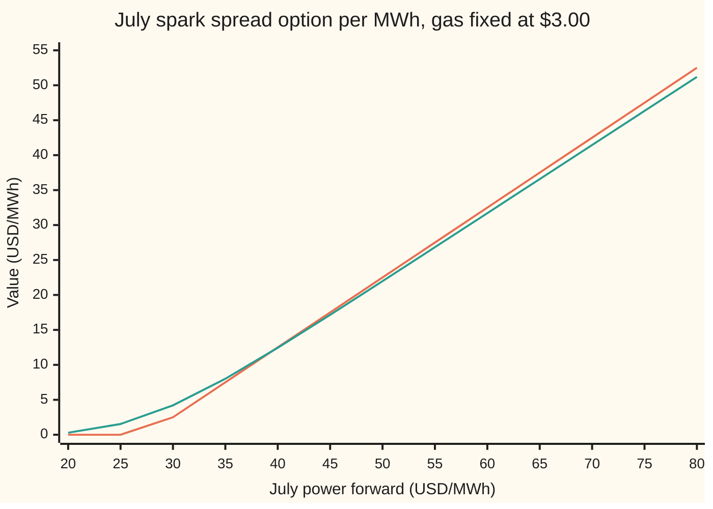
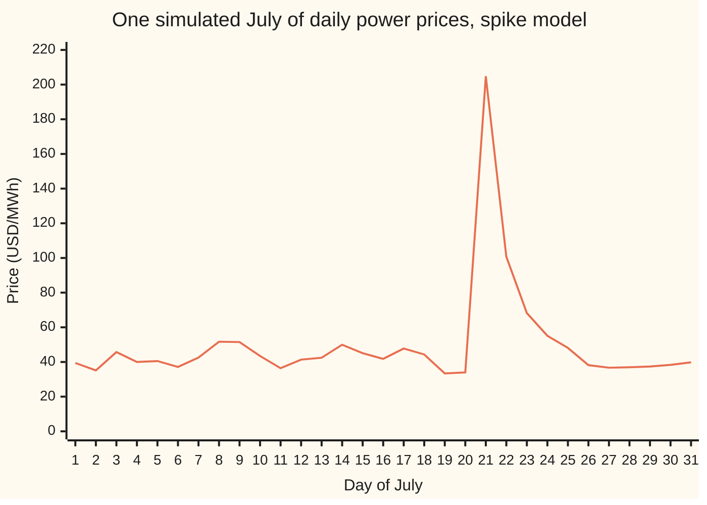
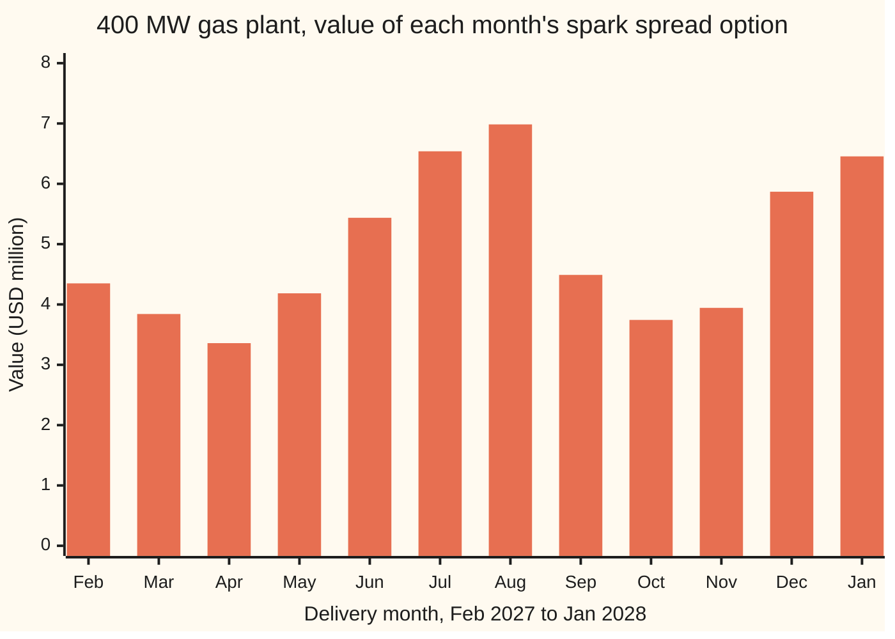

# Power that cannot be stored: why carry fails, hourly shapes and spikes, and the spark spread as an option on a power plant

Financial mathematics → Options on commodity futures and spreads → Spark spreads and plant value → Power that cannot be stored

---

## General Overview

A gas-fired power plant sits on a North American grid. On 1 January 2027 its owner can sell July power forward at **$50 per MWh** (a megawatt-hour: one megawatt of output running for one hour). The owner can also buy July gas forward at **$3.00 per MMBtu** (a million British thermal units, the unit gas is sold in). The plant burns **7.5 MMBtu** of gas for each MWh it makes. That burn rate is its **heat rate**.

So one MWh of July power costs 7.5 × $3.00 = **$22.50** of gas to make. Power sells for $50. The gap, **$27.50**, is the **spark spread**: the gross margin of turning gas into electricity. Staff, water and wear add a **variable cost** of $5 per MWh. What is the plant's July worth?

Three facts make electricity unlike every other commodity on this shelf. It cannot be stored in bulk, so the July price is not today's price plus a storage bill. Its price has a shape inside each day and week, so "July power" is really an average of 744 hourly prices. And some of those hours spike to four or ten times normal. The plant owner runs the plant only when power pays more than gas plus cost. That right, without the obligation, is an option. From here on it is called the **spark spread option**, and a plant is a string of them.

**A power forward is the average of future spot power under the pricing weights (Step 1), not spot plus carry; a gas plant's month is a call on power minus heat rate times gas, struck at the variable cost; and the plant is the sum of those calls across its months.**

**What kind of fact this is:** a model. Lognormal forwards for power and gas are an assumption that fits monthly contracts well enough, not a law. Inside it, Kirk's formula is an approximation, with its error against the exact integral stated below, and "the forward is an expectation" is a theorem, proved in Why it works.

### The picture: what the July option pays, and what it is worth today

Gas is held at $3.00, so fuel plus cost is $27.50. Power's July price runs across.



Orange: the payoff in July, power minus $27.50 or nothing. Green: the option's value on 1 January, six months early. At $50 the two nearly touch: $21.97 against $22.50. The plant is almost sure to run in July, so its option is almost all margin. Far above $27.50 green sits just under orange, by the discount on money paid in July. Near $27.50 green rises above orange, because running or idling is a close call there. That is where the option earns its keep.

---

## The formula

When the July contracts expire at $T$, the plant earns, per MWh of capacity,

$$\text{payoff} = \max\big(S_T - H\,G_T - K,\; 0\big),$$

and on 1 January that payoff is worth, by Kirk's approximation,

$$V \approx e^{-rT}\Big[F_P\,N(d_1) - (H F_G + K)\,N(d_2)\Big].$$

**Read it aloud:** the power expected to be sold, weighted by one chance, minus the fuel and running cost expected to be paid, weighted by another, both shrunk back to today's dollars.

| Symbol | Plain meaning | In our example | Push it up and the answer… |
| --- | --- | --- | --- |
| $F_P$ | power forward: the price fixed today for delivery through July | $50/MWh | rises, by about 0.97 per dollar |
| $F_G$ | gas forward for July | $3.00/MMBtu | falls, by about 7.22 per dollar |
| $H$ | heat rate: MMBtu of gas burned per MWh made | 7.5 | falls: dearer fuel per MWh |
| $K$ | variable cost per MWh, the option's strike | $5 | falls |
| $\sigma_P$, $\sigma_G$ | volatility: yearly spread of percentage moves in the power and gas forwards | 50%, 40% | rises with power's; gas's can push either way, since gas moves with power |
| $\rho$ | correlation: how closely the two forwards move together, from −1 to 1 | 0.70 | falls: the gap between them steadies |
| $T$ | years until July's price is known | 0.5 | — |
| $r$, $e^{-rT}$ | riskless rate, and the discount it gives: today's value of $1 paid at $T$ | 5%, 0.97531 | falls a little |
| $S_T$, $G_T$ | July power and gas prices at $T$, when July's contracts expire | unknown today | — |
| $V$ | the option's value today, per MWh of capacity | $21.97 | — |
| $b$, $\sigma_K$ | Kirk's weight on gas, fuel over fuel-plus-cost, and the blended volatility it gives | 0.8182, 35.78% | — |
| $d_1$, $d_2$, $N(x)$ | distances to the strike in units of $\sigma_K\sqrt{T}$, and the bell-curve area left of $x$ | 2.4895, 2.2365 | — |

Kirk's two helpers:

$$b = \frac{H F_G}{H F_G + K}, \qquad \sigma_K = \sqrt{\sigma_P^2 - 2\rho\,\sigma_P\sigma_G\,b + \sigma_G^2 b^2}.$$

In words: fuel plus cost is treated as one lognormal price, and its volatility is gas's volatility scaled by the share of that lump that is gas. The heat rate multiplies the gas price, not its percentage moves, so $\sigma_G$ carries through unchanged.

$$d_1 = \frac{\ln\!\big(F_P/(H F_G + K)\big) + \tfrac12\sigma_K^2 T}{\sigma_K\sqrt{T}}, \qquad d_2 = d_1 - \sigma_K\sqrt{T}.$$

These are the Black-76 distances from [options-on-commodity-futures](01-options-on-commodity-futures.md), with fuel-plus-cost as the strike.

### When it holds

- **Both forwards lognormal, one volatility each.** Monthly power and gas forwards fit this tolerably. Hourly spot power does not: spikes give it a far fatter right tail, and a lognormal fitted to the same average misses the value in those hours.
- **One decision per month.** A real plant chooses hour by hour. Pricing the month as one option undervalues the plant; pricing peak and off-peak apart gives $22.05 against $21.97, even with the same volatility.
- **No start-up costs or minimum run times.** A plant that pays to start and must then run for hours holds a linked chain of choices, not separate options. Valuing that needs dynamic programming (working backwards through every hour's choice), which this card does not do.
- **Prices stay positive.** A lognormal cannot go below zero. Power can, in windy or sunny hours with too little demand; Kirk then does not apply.
- **Kirk's lump is nearly lognormal.** True when the strike is small next to fuel. Here Kirk gives 21.9721 against the exact 21.9723 in July, and 21.6904 against 21.6924 twelve months out. It widens for large strikes and long dates.
- **Volatility and correlation constant across months.** Real power volatility rises as delivery nears, and summer and winter differ. The strip below uses one set for every month for clarity.

---

## Why it works

### Step 0: a plant is an option, and power's forward is an average, not a carry

A plant owner never has to run. Each month, or each hour, the plant burns gas only if power pays more than gas plus cost. A right without an obligation is an option, and its underlying is the spark spread. Everything below prices that option. First the underlying needs a price, and electricity's forward price has a different origin from any stored commodity's.

### Step 1: why cash-and-carry fails for electricity

For gold, oil or gas, a forward is pinned by a trade: buy today at spot, store it, deliver it later ([seasonality-and-the-gas-curve](../25-Commodity%20forwards%20-%20carry%2C%20storage%2C%20convenience%20yield%20and%20the%20curve/05-seasonality-and-the-gas-curve.md) shows storage capping the gas curve). If the forward sits above spot plus interest and storage, the trade prints money.

Power cannot be stored in bulk: the grid must balance supply and demand every second. Batteries and pumped hydro hold a little, with losses, nothing like a gas or oil stock. On 1 January spot power might trade at $30. Carry arithmetic says July should cost 30 × e^(0.05 × 0.5) = **$30.76**. July actually trades at $50. No one can buy January power, keep it, and sell it in July, so nothing closes the gap between $30.76 and $50. January and July power are different goods.

What pins the July forward instead? A forward costs nothing to enter and pays the difference between the delivered spot price and the forward price. Something that costs nothing today must average to zero under the pricing weights (the risk-neutral probabilities that make every traded asset's price its discounted average payoff). So

$$F_P = \mathbb{E}^{Q}\big[S_T\big]:$$

the forward is the average July spot price under the pricing weights. Those weights fold in the market's appetite for risk as well as expected demand, heat waves and plant outages. No trade pins them down, so the market's forward is an input, not an output. A forward on a stored good is also an average under the same weights, but for it the carry trade forces that average to equal spot plus carry. Power has no such trade, so the average is all there is.

<details>
<summary>Detailed proof: a zero-cost forward is an expectation</summary>

Let a forward agreed today at price $F_P$ pay $S_T - F_P$ at time $T$. Entering costs nothing. Under the pricing weights, every traded payoff's price today is $e^{-rT}$ times its average payoff. So $0 = e^{-rT}\,\mathbb{E}^{Q}[S_T - F_P]$. Since $F_P$ is fixed today it comes out of the average: $F_P = \mathbb{E}^{Q}[S_T]$. No storage entered the argument. For a storable good a second relation holds as well, spot times carry, and the two together give the familiar curve. For power only the first holds.

</details>

### Step 2: reading a baseload and peak shape

Power is quoted in **blocks** of hours. The common North American **peak** block is 5x16: sixteen hours a day, five weekdays a week. The code takes hours ending 7 to 22, local time; each exchange contract names its own hours. **Off-peak** is every other hour. **Baseload** is all hours. July 2027 has 31 days and starts on a Thursday, so it holds 22 weekdays: 352 peak hours and 392 off-peak hours out of 744. Exchanges set their own holiday rules per hub, and those move a day or two between blocks. *Conventions dated 2026-09-28:* the block hours, the weekday start and the no-holiday count are this card's stated assumptions; each contract's own specification governs.

A baseload forward is the hour-weighted average of the two blocks. With peak at $60 and baseload at $50:

$$50 \times 744 = 60 \times 352 + \text{off-peak} \times 392 \;\Rightarrow\; \text{off-peak} = \$41.02.$$

The code finds the weekday of 1 July 2027 by Sakamoto's rule and counts the peak hours from it. The same weighting runs through a day: an hourly shape is a set of weights that average back to the block price.

### Step 3: spikes, drawn as jumps

On most days power clears near the running cost of the last plant needed. On a few days a heat wave or an outage leaves the grid short, and the price jumps many times over for a day or two before falling back. [merton-jump-diffusion](../13-Local%20volatility%20and%20jumps/04-merton-jump-diffusion.md) adds jumps to a stock; power adds jumps to a price that is also pulled back fast.

A sketch in words. Take a day's price as a calm level times e raised to a deviation. Each day the deviation halves, gets a small random shove (8% spread), and with a 4% chance jumps by ln 5, which multiplies the price by five. The average of e to the deviation can be computed exactly, day by day, because each past shove's effect has halved once per day since. Choose the calm level so that July averages $50.



One line: a single July drawn from the model. Most days sit near $40. Day 21 spikes to $204.81, day 22 is still $100.74, and by day 26 the price is back under $40.

The calm level comes out at **$39.61**. With no spikes the same level would give a July forward of **$39.78**. The spikes add **$10.22**: a fifth of the forward pays for about 1.2 spike days a month on average (31 × 0.04), and 28% of Julys (0.96^31) have none. Twenty thousand simulated Julys average $50.01, within one standard error (0.0695) of the exact $50.

Two consequences. The forward sits well above a typical day's price, and that is not a mistake by the market. And any payoff that is convex in the price, like a plant that runs only when profitable, collects more from those spike days than a lognormal with the same average would credit.

### Step 4: the plant's month as a spread option

Set the hourly detail aside and let the plant decide once for July. It pays $S_T - H\,F_G(T) - K$ if positive: power minus 7.5 times gas minus $5. That is a call on the difference of two prices, a **spread option**. [margrabe-and-kirk-spread-options](04-margrabe-and-kirk-spread-options.md) prices it; this card uses the result.

With a zero strike, Margrabe's exchange formula is exact: measure power in units of fuel, and only the volatility of their ratio matters. With a positive strike, fuel plus cost is no longer lognormal, and Kirk's move is to pretend it is, with volatility $\sigma_K$. The weight $b$ says how much of that lump moves with gas: here 22.50 of 27.50, or 0.8182. At zero strike $b$ is 1 and Kirk equals Margrabe exactly: the code gets $26.8230 both ways.

### Step 5: the exact road, by fixing gas first

Kirk is an approximation, so the card checks it against an exact price. Fix July gas at one outcome. Given that outcome, power is still lognormal: its forward shifts by the part of its move that follows gas, and its leftover volatility is $\sigma_P\sqrt{1-\rho^2}$. Fuel plus cost is now a fixed number, so Black-76 prices the call on power exactly. Average those prices across every gas outcome, weighted by the bell curve, and discount. The average is a one-dimensional integral, done by Simpson's rule on 600 slices. That is **$21.9723** against Kirk's **$21.9721**.

A third road, simulation, draws 100,000 correlated pairs of July prices, each with its mirror image, and averages the payoff: $21.9752, within one standard error of 0.0126 of the integral.

<details>
<summary>Detailed proof: power given gas is lognormal</summary>

Write July gas as $F_G\,e^{-\frac12\sigma_G^2 T + \sigma_G\sqrt{T}\,z}$ and July power as $F_P\,e^{-\frac12\sigma_P^2 T + \sigma_P\sqrt{T}\,(\rho z + \sqrt{1-\rho^2}\,u)}$, where $z$ and $u$ are independent standard bell-curve draws. Both have the right averages, and their log moves have correlation $\rho$. Hold $z$ fixed. Power becomes $F_P\,e^{-\frac12\rho^2\sigma_P^2 T + \rho\sigma_P\sqrt{T}z} \cdot e^{-\frac12(1-\rho^2)\sigma_P^2 T + \sigma_P\sqrt{1-\rho^2}\sqrt{T}\,u}$. The first factor is a new forward. The second has average 1 and log-spread $\sigma_P\sqrt{1-\rho^2}\sqrt{T}$: a lognormal. So given $z$, the call on power struck at $H F_G e^{\dots z} + K$ is Black-76 with that forward and that volatility. Averaging over $z$ against the bell curve gives the exact price. Nothing was approximated but the numerical integral.

</details>

### Step 6: the plant is a strip, and finer choices are worth more

A plant runs every month, so it holds twelve options, each on its own month's forwards. Its value is the sum. Each option is priced per MWh; times the month's hours and 400 MW, it gives a 400 MW plant's dollars.

Splitting a month into finer blocks can only add value. A maximum of a sum is never more than the sum of the maxima: running peak and off-peak separately always does at least as well as one decision for both. With the same volatility on each block, the peak option is worth $31.70 and the off-peak $13.39. Hour-weighted, that is **$22.05**, against **$21.97** for one baseload decision. Split all the way to hours, with spikes, and the gap grows. That is the plant's real optionality. Before start-up costs, which pull the other way, a monthly price sits under it.

---

## Worked numbers, by hand

July 2027, valued 1 January: power $50, gas $3.00, heat rate 7.5, cost $5, volatilities 50% and 40%, correlation 0.70, rate 5%, half a year.

| Step | Arithmetic | Value |
| --- | --- | --- |
| fuel per MWh, $H F_G$ | 7.5 × 3.00 | $22.50 |
| spark spread | 50 − 22.50 | $27.50 |
| fuel plus cost, the strike lump | 22.50 + 5 | $27.50 |
| gas weight $b$ | 22.50 / 27.50 | 0.8182 |
| $\sigma_K$ | √(0.25 − 2 × 0.7 × 0.5 × 0.4 × 0.8182 + 0.16 × 0.8182^2) | 0.3578 |
| $\sigma_K\sqrt{T}$ | 0.3578 × √0.5 | 0.2530 |
| log distance | ln(50 / 27.50) | 0.5978 |
| $d_1$ | (0.5978 + ½ × 0.3578^2 × 0.5) / 0.2530 | 2.4895 |
| $d_2$ | 2.4895 − 0.2530 | 2.2365 |
| $N(d_1)$, $N(d_2)$ | bell-curve areas | 0.99360, 0.98734 |
| discount | e^(−0.05 × 0.5) | 0.97531 |
| option value | 0.97531 × (50 × 0.99360 − 27.50 × 0.98734) | **$21.97 per MWh** |
| July, 400 MW × 744 hours | 21.9721 × 744 × 400 | **$6.539 million** |

The plant's July is worth $21.97 for each MWh it could make. $21.94 of that is the discounted margin the forwards already lock in; $0.0276 is the value of being allowed to stay off.

The house cross-check, with the same code on [margrabe-and-kirk-spread-options](04-margrabe-and-kirk-spread-options.md)'s crack spread (gasoline 100, crude 90), gives Margrabe 13.1531 at zero strike and Kirk 7.4286 at strike 10: the shelf's 13.15 and 7.43.

### The whole year as a strip



Bars: Kirk value of each month, times its hours, times 400 MW. The strip's forwards are illustrative, built for this card around July's $50 and $3.00. Summer and midwinter power lead; the shoulder months of spring and autumn trail. Winter gas is dear too, which is why December and January do not lead by more. The twelve sum to **$59.1975 million** by Kirk and **$59.2004 million** by the exact integral.

### What breaks if you drop a piece

| Mistake | Comes out at | What went wrong |
| --- | --- | --- |
| July power priced from January spot plus carry ($30.76) | $4.72, not $21.97 | Power cannot be carried; the forward is its own average |
| Correlation set to 0 | $22.48, not $21.97 | Independent legs make the gap too jumpy |
| Only the locked-in margin counted | $21.94 here; 0 for a peaker worth $4.90 | Throws away the right to stay off |
| One baseload decision for the month | $21.97, not $22.05 for peak and off-peak apart | Coarser choices are worth less |

The code prints every one.

---

## Code, from first principles, and it actually runs

The script prices the July option three independent ways: Kirk's formula, an exact integral that fixes gas and prices power by Black-76, and a simulation of both prices with its own random numbers. It also checks the zero-strike case against Kirk, the shelf's house crack spread, the calendar count behind the peak block, and the spike model's forward by an exact product against 20,000 simulated months. Then it prices the twelve-month strip by Kirk and by the integral.

### Python

```python
# Electricity and the spark spread -- the check behind the card.  Standard
# library only: the normal CDF, the integrator and the random numbers are all
# written here.  One gas plant's July: power forward 50 USD/MWh, gas 3.00
# USD/MMBtu, heat rate 7.5 MMBtu/MWh, variable cost 5 USD/MWh, six months out.
from math import exp, log, sqrt, cos, pi

R, HR, VOM, SP, SG, RHO, MW = 0.05, 7.5, 5.0, 0.50, 0.40, 0.70, 400.0

def N(x):                                   # normal CDF, Marsaglia's series
    if abs(x) > 9.0:
        return 0.0 if x < 0 else 1.0
    s, t, b, q, i = x, 0.0, x, x * x, 1.0
    while s != t:
        t = s; i += 2.0; b *= q / i; s = t + b
    return 0.5 + s * exp(-0.5 * q - 0.91893853320467274)
def black(F, K, vol, T):                    # undiscounted call on a forward
    sd = vol * sqrt(T)
    d1 = (log(F / K) + 0.5 * sd * sd) / sd
    return F * N(d1) - K * N(d1 - sd)
def kirk(P, f2, K, sp, sg, rho, T):         # road 1: Kirk's approximation
    b = f2 / (f2 + K)
    v = sqrt(sp * sp - 2.0 * rho * sp * sg * b + sg * sg * b * b)
    return exp(-R * T) * black(P, f2 + K, v, T)
def exact(P, f2, K, sp, sg, rho, T, n=600): # road 2: fix gas, Black on power,
    rt, h, tot = sqrt(T), 18.0 / n, 0.0     # Simpson's rule across gas outcomes
    for i in range(n + 1):
        z = -9.0 + i * h
        fuel = f2 * exp(-0.5 * sg * sg * T + sg * rt * z)
        pw = P * exp(-0.5 * rho * rho * sp * sp * T + rho * sp * rt * z)
        w = 1.0 if i in (0, n) else (4.0 if i % 2 else 2.0)
        tot += w * exp(-0.5 * z * z) * black(pw, fuel + K, sp * sqrt(1.0 - rho * rho), T)
    return exp(-R * T) * tot * h / 3.0 / sqrt(2.0 * pi)
state = 88172645463325252
def uniform():                              # xorshift64: own random numbers
    global state
    state ^= (state << 13) & 0xFFFFFFFFFFFFFFFF
    state ^= state >> 7
    state ^= (state << 17) & 0xFFFFFFFFFFFFFFFF
    return ((state >> 11) + 0.5) / 9007199254740992.0
def gauss():                                # Box-Muller, one normal per call
    u1, u2 = uniform(), uniform()
    return sqrt(-2.0 * log(u1)) * cos(2.0 * pi * u2)
def mc(P, f2, K, T, pairs):                 # road 3: simulate both prices
    tot = tot2 = 0.0
    for _ in range(pairs):
        a, c = gauss(), gauss()
        zg = RHO * a + sqrt(1.0 - RHO * RHO) * c
        pay = 0.0
        for s in (1.0, -1.0):               # antithetic pair: z and -z
            pw = P * exp(-0.5 * SP * SP * T + SP * sqrt(T) * s * a)
            fuel = f2 * exp(-0.5 * SG * SG * T + SG * sqrt(T) * s * zg)
            pay += 0.5 * max(pw - fuel - K, 0.0)
        tot += pay; tot2 += pay * pay
    m = tot / pairs
    return exp(-R * T) * m, exp(-R * T) * sqrt((tot2 / pairs - m * m) / pairs)
def row(label, v, d=4): print(f"{label:<40}{v:>14.{d}f}")
def july(K=VOM, f2=22.5, sp=SP, rho=RHO, P=50.0): return kirk(P, f2, K, sp, SG, rho, 0.5)

# 1. no carry: July power priced off today's spot by storage arithmetic
print(f"carry: spot today 30.00, spot x e^(rT) at T = 0.5 {30.0 * exp(R * 0.5):.4f}")
# 2. the July shape: 31 days from Thursday 1 July 2027, peak = weekdays HE7-HE22
wd = (2027 + 2027 // 4 - 2027 // 100 + 2027 // 400 + 5 + 1 + 6) % 7   # Sakamoto's rule, Mon = 0
peak_h = sum(1 for d in range(31) for hr in range(24) if (wd + d) % 7 < 5 and 6 <= hr <= 21)
off_px = (50.0 * 744 - 60.0 * peak_h) / (744 - peak_h)
print(f"shape: 1 July 2027 weekday {wd} (Mon = 0), peak hours {peak_h}, off-peak hours {744 - peak_h}"); row("shape: off-peak price", off_px)
# 3. spikes as jumps: daily log price reverts half-way each day, 4% chance of x5
KAP, SDD, PJ, JUMP = 0.5, 0.08, 0.04, log(5.0)
def mean_mult(t, pj):                       # E[e^x_t], exactly, day by day
    m = 1.0
    for s in range(t):
        c = (1.0 - KAP) ** (t - 1 - s)
        m *= exp(0.5 * c * c * SDD * SDD) * (1.0 - pj + pj * exp(c * JUMP))
    return m
level = 50.0 / (sum(mean_mult(t, PJ) for t in range(1, 32)) / 31)
calm = level * sum(mean_mult(t, 0.0) for t in range(1, 32)) / 31
def month():
    x, path = 0.0, []
    for _ in range(31):
        x = (1.0 - KAP) * x + SDD * gauss() + (JUMP if uniform() < PJ else 0.0)
        path.append(level * exp(x))
    return path
sims = [sum(month()) / 31 for _ in range(20000)]
sm = sum(sims) / len(sims); sse = sqrt(sum((v - sm) ** 2 for v in sims)) / len(sims)
row("spikes: calm-day level", level); row("spikes: forward with no spikes", calm); row("spikes: premium in the forward", 50.0 - calm)
row("spikes: forward, simulated", sm); row("spikes: simulation standard error", sse)
print("chart, one July of daily prices " + " ".join(f"{v:.2f}" for v in month()))
# 4. July, six months out, three roads
kj, ej = july(), exact(50.0, 22.5, VOM, SP, SG, RHO, 0.5)
mj, mse = mc(50.0, 22.5, VOM, 0.5, 100000)
row("July spark spread, P - HR x G", 50.0 - HR * 3.0, 2)
row("July 1 Kirk", kj); row("July 2 exact integral", ej); row("July 3 simulation", mj)
row("July   simulation standard error", mse)
row("July intrinsic e^(-rT)(27.50 - 5)", exp(-0.5 * R) * 22.5); row("July time value, Kirk - intrinsic", kj - exp(-0.5 * R) * 22.5)
b = 22.5 / 27.5; v = sqrt(SP * SP - 2 * RHO * SP * SG * b + SG * SG * b * b); d1 = (log(50 / 27.5) + 0.25 * v * v) / (v * sqrt(0.5))
hand = exp(-0.5 * R) * (50 * N(d1) - 27.5 * N(d1 - v * sqrt(0.5)))
print(f"Kirk by hand: b {b:.4f} vol {v:.4f} vol*sqrtT {v * sqrt(0.5):.4f} ln {log(50 / 27.5):.4f} d1 {d1:.4f} d2 {d1 - v * sqrt(0.5):.4f} N {N(d1):.5f} {N(d1 - v * sqrt(0.5)):.5f} disc {exp(-0.5 * R):.5f}")
print(f"July zero cost: Kirk {july(K=0.0):.4f}, exact {exact(50.0, 22.5, 0.0, SP, SG, RHO, 0.5):.4f}")
pk, pe = july(f2=45.0), exact(50.0, 45.0, VOM, SP, SG, RHO, 0.5)
print(f"peaker, heat rate 15, spread 5.00 = cost: Kirk {pk:.4f}, exact {pe:.4f}")
def house(K):                               # the spread-option card's crack spread
    b = 90.0 / (90.0 + K); v = sqrt(0.09 - 2 * 0.5 * 0.3 * 0.25 * b + 0.0625 * b * b)
    return exp(-R * 0.5) * black(100.0, 90.0 + K, v, 0.5)
row("house: Margrabe crack, strike 0", house(0.0)); row("house: Kirk crack, strike 10", house(10.0))
# 5. blocks: peak and off-peak priced apart, then hour-weighted
kp, ko = july(P=60.0), july(P=off_px)
row("blocks: peak option", kp); row("blocks: off-peak option", ko)
row("blocks: hour-weighted", (peak_h * kp + (744 - peak_h) * ko) / 744)
# 6. Greeks of the July option by bumping, both roads
for lab, f in (("Kirk", kirk), ("exact", exact)):
    dp = (f(50.01, 22.5, VOM, SP, SG, RHO, 0.5) - f(49.99, 22.5, VOM, SP, SG, RHO, 0.5)) / 0.02
    dg = (f(50.0, 22.5075, VOM, SP, SG, RHO, 0.5) - f(50.0, 22.4925, VOM, SP, SG, RHO, 0.5)) / 0.002
    dr = f(50.0, 22.5, VOM, SP, SG, 0.8, 0.5) - f(50.0, 22.5, VOM, SP, SG, 0.6, 0.5)
    print(f"greeks {lab:<6} power {dp:.4f}  gas {dg:.4f}  corr 0.6->0.8 {dr:.4f}")
# 7. the plant: a strip of monthly options, Feb 2027 to Jan 2028
strip = (("Feb", 52, 4.10, 672), ("Mar", 45, 3.60, 744), ("Apr", 40, 3.10, 720),
         ("May", 41, 2.90, 744), ("Jun", 46, 2.90, 720), ("Jul", 50, 3.00, 744),
         ("Aug", 52, 3.05, 744), ("Sep", 43, 2.95, 720), ("Oct", 40, 3.00, 744),
         ("Nov", 44, 3.40, 720), ("Dec", 55, 4.00, 744), ("Jan", 60, 4.40, 744))
tk = te = 0.0
for k, (mon, p, g, hrs) in enumerate(strip, 1):
    a, b = kirk(p, HR * g, VOM, SP, SG, RHO, k / 12), exact(p, HR * g, VOM, SP, SG, RHO, k / 12)
    tk += a * hrs * MW / 1e6; te += b * hrs * MW / 1e6
    print(f"strip {mon} T={k:>2}/12 P {p:5.2f} G {g:4.2f} spread {p - HR * g:6.2f}"
          f"  Kirk {a:7.4f} exact {b:7.4f}  USD m {a * hrs * MW / 1e6:6.3f}")
row("plant, 400 MW, one year, USD m, Kirk", tk); row("plant, 400 MW, one year, USD m, exact", te)
# 8. what breaks, and try-changing
row("wrong: July off carry forward", july(P=30.0 * exp(R * 0.5)))
row("wrong: correlation set to 0", july(rho=0.0))
row("try: gas 4.00, fuel 30", july(f2=30.0)); row("try: power vol 0.80", july(sp=0.80))
row("try: peaker, correlation 0.9", july(f2=45.0, rho=0.9))
print("chart, power at expiry  " + " ".join(f"{p:6.0f}" for p in range(20, 85, 5)))
print("chart, payoff at expiry " + " ".join(f"{max(p - 27.5, 0):6.2f}" for p in range(20, 85, 5)))
print("chart, value 6 m out    " + " ".join(f"{july(P=float(p)):6.2f}" for p in range(20, 85, 5)))
assert abs(kj - ej) < 0.001 and abs(pk - pe) < 0.01 and abs(hand - kj) < 1e-9, "Kirk by hand = code = integral"
assert abs(mj - ej) < 4 * mse, "simulation within four standard errors of the integral"
assert abs(house(0.0) - 13.15) < 0.005 and abs(house(10.0) - 7.43) < 0.005, "sibling card's numbers"
assert abs(sm - 50.0) < 4 * sse, "simulated spiky month averages to the exact forward"
assert wd == 3 and peak_h == 22 * 16, "1 July 2027 is a Thursday; 22 weekdays of 16 peak hours"
print("ALL CHECKS PASS")
```

**Ran 2026-09-28 on macOS, Python 3.14.6, standard library only. All checks passed. Output, pasted from the run:**

```
carry: spot today 30.00, spot x e^(rT) at T = 0.5 30.7595
shape: 1 July 2027 weekday 3 (Mon = 0), peak hours 352, off-peak hours 392
shape: off-peak price                          41.0204
spikes: calm-day level                         39.6147
spikes: forward with no spikes                 39.7822
spikes: premium in the forward                 10.2178
spikes: forward, simulated                     50.0111
spikes: simulation standard error               0.0695
chart, one July of daily prices 39.43 35.17 45.72 40.01 40.54 37.13 42.55 51.70 51.48 43.47 36.42 41.37 42.46 49.94 45.06 41.80 47.75 44.32 33.40 33.99 204.81 100.74 68.22 55.11 48.13 38.18 36.70 36.97 37.40 38.35 39.82
July spark spread, P - HR x G                    27.50
July 1 Kirk                                    21.9721
July 2 exact integral                          21.9723
July 3 simulation                              21.9752
July   simulation standard error                0.0126
July intrinsic e^(-rT)(27.50 - 5)              21.9445
July time value, Kirk - intrinsic               0.0276
Kirk by hand: b 0.8182 vol 0.3578 vol*sqrtT 0.2530 ln 0.5978 d1 2.4895 d2 2.2365 N 0.99360 0.98734 disc 0.97531
July zero cost: Kirk 26.8230, exact 26.8230
peaker, heat rate 15, spread 5.00 = cost: Kirk 4.9009, exact 4.9019
house: Margrabe crack, strike 0                13.1531
house: Kirk crack, strike 10                    7.4286
blocks: peak option                            31.7004
blocks: off-peak option                        13.3870
blocks: hour-weighted                          22.0514
greeks Kirk   power 0.9691  gas -7.2230  corr 0.6->0.8 -0.0569
greeks exact  power 0.9690  gas -7.2227  corr 0.6->0.8 -0.0567
strip Feb T= 1/12 P 52.00 G 4.10 spread  21.25  Kirk 16.1826 exact 16.1826  USD m  4.350
strip Mar T= 2/12 P 45.00 G 3.60 spread  18.00  Kirk 12.9101 exact 12.9101  USD m  3.842
strip Apr T= 3/12 P 40.00 G 3.10 spread  16.75  Kirk 11.6622 exact 11.6624  USD m  3.359
strip May T= 4/12 P 41.00 G 2.90 spread  19.25  Kirk 14.0620 exact 14.0622  USD m  4.185
strip Jun T= 5/12 P 46.00 G 2.90 spread  24.25  Kirk 18.8783 exact 18.8785  USD m  5.437
strip Jul T= 6/12 P 50.00 G 3.00 spread  27.50  Kirk 21.9721 exact 21.9723  USD m  6.539
strip Aug T= 7/12 P 52.00 G 3.05 spread  29.12  Kirk 23.4702 exact 23.4705  USD m  6.985
strip Sep T= 8/12 P 43.00 G 2.95 spread  20.88  Kirk 15.5896 exact 15.5907  USD m  4.490
strip Oct T= 9/12 P 40.00 G 3.00 spread  17.50  Kirk 12.5804 exact 12.5823  USD m  3.744
strip Nov T=10/12 P 44.00 G 3.40 spread  18.50  Kirk 13.6938 exact 13.6959  USD m  3.944
strip Dec T=11/12 P 55.00 G 4.00 spread  25.00  Kirk 19.7205 exact 19.7222  USD m  5.869
strip Jan T=12/12 P 60.00 G 4.40 spread  27.00  Kirk 21.6904 exact 21.6924  USD m  6.455
plant, 400 MW, one year, USD m, Kirk           59.1975
plant, 400 MW, one year, USD m, exact          59.2004
wrong: July off carry forward                   4.7234
wrong: correlation set to 0                    22.4783
try: gas 4.00, fuel 30                         14.9952
try: power vol 0.80                            22.5513
try: peaker, correlation 0.9                    3.2400
chart, power at expiry      20     25     30     35     40     45     50     55     60     65     70     75     80
chart, payoff at expiry   0.00   0.00   2.50   7.50  12.50  17.50  22.50  27.50  32.50  37.50  42.50  47.50  52.50
chart, value 6 m out      0.29   1.54   4.21   8.01  12.44  17.15  21.97  26.83  31.70  36.58  41.45  46.33  51.20
ALL CHECKS PASS
```

### Rust

Same numbers, same labels, built with `rustc --edition 2021 -O`.

```rust
// Electricity and the spark spread -- the same check as the Python, in Rust.
// No crates: the normal CDF, the integrator and the random numbers are all
// written here.  One gas plant's July: power forward 50 USD/MWh, gas 3.00
// USD/MMBtu, heat rate 7.5 MMBtu/MWh, variable cost 5 USD/MWh, six months out.
use std::f64::consts::PI;

const R: f64 = 0.05; const HR: f64 = 7.5; const VOM: f64 = 5.0; const MW: f64 = 400.0;
const SP: f64 = 0.50; const SG: f64 = 0.40; const RHO: f64 = 0.70;
const KAP: f64 = 0.5; const SDD: f64 = 0.08; const PJ: f64 = 0.04;

fn n(x: f64) -> f64 {                       // normal CDF, Marsaglia's series
    if x.abs() > 9.0 { return if x < 0.0 { 0.0 } else { 1.0 } }
    let (mut s, mut t, mut b, q, mut i) = (x, 0.0, x, x * x, 1.0);
    while s != t { t = s; i += 2.0; b *= q / i; s = t + b; }
    0.5 + s * (-0.5 * q - 0.91893853320467274).exp()
}
fn black(f: f64, k: f64, vol: f64, t: f64) -> f64 {   // undiscounted call on a forward
    let sd = vol * t.sqrt();
    let d1 = ((f / k).ln() + 0.5 * sd * sd) / sd;
    f * n(d1) - k * n(d1 - sd)
}
fn kirk(p: f64, f2: f64, k: f64, sp: f64, sg: f64, rho: f64, t: f64) -> f64 {  // road 1
    let b = f2 / (f2 + k);
    let v = (sp * sp - 2.0 * rho * sp * sg * b + sg * sg * b * b).sqrt();
    (-R * t).exp() * black(p, f2 + k, v, t)
}
fn exact(p: f64, f2: f64, k: f64, sp: f64, sg: f64, rho: f64, t: f64) -> f64 { // road 2
    let (nn, rt) = (600, t.sqrt());
    let (h, mut tot) = (18.0 / nn as f64, 0.0);
    for i in 0..=nn {                       // fix gas, Black on power, Simpson across gas
        let z = -9.0 + i as f64 * h;
        let fuel = f2 * (-0.5 * sg * sg * t + sg * rt * z).exp();
        let pw = p * (-0.5 * rho * rho * sp * sp * t + rho * sp * rt * z).exp();
        let w = if i == 0 || i == nn { 1.0 } else if i % 2 == 1 { 4.0 } else { 2.0 };
        tot += w * (-0.5 * z * z).exp() * black(pw, fuel + k, sp * (1.0 - rho * rho).sqrt(), t);
    }
    (-R * t).exp() * tot * h / 3.0 / (2.0 * PI).sqrt()
}
struct Rng(u64);
impl Rng {
    fn uniform(&mut self) -> f64 {          // xorshift64: own random numbers
        self.0 ^= self.0 << 13; self.0 ^= self.0 >> 7; self.0 ^= self.0 << 17;
        ((self.0 >> 11) as f64 + 0.5) / 9007199254740992.0
    }
    fn gauss(&mut self) -> f64 {            // Box-Muller, one normal per call
        let (u1, u2) = (self.uniform(), self.uniform());
        (-2.0 * u1.ln()).sqrt() * (2.0 * PI * u2).cos()
    }
}
fn mc(g: &mut Rng, p: f64, f2: f64, k: f64, t: f64, pairs: usize) -> (f64, f64) { // road 3
    let (mut tot, mut tot2) = (0.0, 0.0);
    for _ in 0..pairs {
        let (a, c) = (g.gauss(), g.gauss());
        let zg = RHO * a + (1.0 - RHO * RHO).sqrt() * c;
        let mut pay = 0.0;
        for s in [1.0, -1.0] {              // antithetic pair: z and -z
            let pw = p * (-0.5 * SP * SP * t + SP * t.sqrt() * s * a).exp();
            let fuel = f2 * (-0.5 * SG * SG * t + SG * t.sqrt() * s * zg).exp();
            pay += 0.5 * f64::max(pw - fuel - k, 0.0);
        }
        tot += pay; tot2 += pay * pay;
    }
    let m = tot / pairs as f64;
    ((-R * t).exp() * m, (-R * t).exp() * ((tot2 / pairs as f64 - m * m) / pairs as f64).sqrt())
}
fn row(label: &str, v: f64, d: usize) { println!("{:<40}{:>14.*}", label, d, v); }
fn july(k: f64, f2: f64, sp: f64, rho: f64, p: f64) -> f64 { kirk(p, f2, k, sp, SG, rho, 0.5) }
fn mean_mult(t: i32, pj: f64) -> f64 {      // E[e^x_t], exactly, day by day
    let mut m = 1.0;
    for s in 0..t {
        let c = (1.0 - KAP).powi(t - 1 - s);
        m *= (0.5 * c * c * SDD * SDD).exp() * (1.0 - pj + pj * (c * 5f64.ln()).exp());
    }
    m
}
fn month(g: &mut Rng, level: f64) -> Vec<f64> {
    let (mut x, mut path) = (0.0, Vec::new());
    for _ in 0..31 {
        x = (1.0 - KAP) * x + SDD * g.gauss() + if g.uniform() < PJ { 5f64.ln() } else { 0.0 };
        path.push(level * f64::exp(x));
    }
    path
}
fn main() {
    let mut g = Rng(88172645463325252);
    // 1. no carry: July power priced off today's spot by storage arithmetic
    println!("carry: spot today 30.00, spot x e^(rT) at T = 0.5 {:.4}", 30.0 * (R * 0.5).exp());
    // 2. the July shape: 31 days from Thursday 1 July 2027, peak = weekdays HE7-HE22
    let wd = (2027 + 2027 / 4 - 2027 / 100 + 2027 / 400 + 5 + 1 + 6) % 7;   // Sakamoto's rule, Mon = 0
    let is_peak = |d: i32, hr: i32| (wd + d) % 7 < 5 && (6..=21).contains(&hr);
    let peak_h = (0..31).flat_map(|d| (0..24).map(move |hr| (d, hr))).filter(|&(d, hr)| is_peak(d, hr)).count() as f64;
    let off_px = (50.0 * 744.0 - 60.0 * peak_h) / (744.0 - peak_h);
    println!("shape: 1 July 2027 weekday {} (Mon = 0), peak hours {}, off-peak hours {}", wd, peak_h, 744.0 - peak_h);
    row("shape: off-peak price", off_px, 4);
    // 3. spikes as jumps: daily log price reverts half-way each day, 4% chance of x5
    let level = 50.0 / ((1..32).map(|t| mean_mult(t, PJ)).sum::<f64>() / 31.0);
    let calm = level * (1..32).map(|t| mean_mult(t, 0.0)).sum::<f64>() / 31.0;
    let sims: Vec<f64> = (0..20000).map(|_| month(&mut g, level).iter().sum::<f64>() / 31.0).collect();
    let sm = sims.iter().sum::<f64>() / sims.len() as f64;
    let sse = sims.iter().map(|v| (v - sm) * (v - sm)).sum::<f64>().sqrt() / sims.len() as f64;
    row("spikes: calm-day level", level, 4); row("spikes: forward with no spikes", calm, 4);
    row("spikes: premium in the forward", 50.0 - calm, 4);
    row("spikes: forward, simulated", sm, 4); row("spikes: simulation standard error", sse, 4);
    let path: Vec<String> = month(&mut g, level).iter().map(|v| format!("{:.2}", v)).collect();
    println!("chart, one July of daily prices {}", path.join(" "));
    // 4. July, six months out, three roads
    let (kj, ej) = (july(VOM, 22.5, SP, RHO, 50.0), exact(50.0, 22.5, VOM, SP, SG, RHO, 0.5));
    let (mj, mse) = mc(&mut g, 50.0, 22.5, VOM, 0.5, 100000);
    row("July spark spread, P - HR x G", 50.0 - HR * 3.0, 2);
    row("July 1 Kirk", kj, 4); row("July 2 exact integral", ej, 4); row("July 3 simulation", mj, 4);
    row("July   simulation standard error", mse, 4);
    row("July intrinsic e^(-rT)(27.50 - 5)", (-0.5 * R).exp() * 22.5, 4);
    row("July time value, Kirk - intrinsic", kj - (-0.5 * R).exp() * 22.5, 4);
    let b = 22.5 / 27.5; let v = (SP * SP - 2.0 * RHO * SP * SG * b + SG * SG * b * b).sqrt();
    let (sd, ln) = (v * 0.5f64.sqrt(), (50.0f64 / 27.5).ln()); let d1 = (ln + 0.25 * v * v) / sd;
    let hand = (-0.5 * R).exp() * (50.0 * n(d1) - 27.5 * n(d1 - sd));
    println!("Kirk by hand: b {:.4} vol {:.4} vol*sqrtT {:.4} ln {:.4} d1 {:.4} d2 {:.4} N {:.5} {:.5} disc {:.5}",
             b, v, sd, ln, d1, d1 - sd, n(d1), n(d1 - sd), (-0.5 * R).exp());
    println!("July zero cost: Kirk {:.4}, exact {:.4}", july(0.0, 22.5, SP, RHO, 50.0), exact(50.0, 22.5, 0.0, SP, SG, RHO, 0.5));
    let (pk, pe) = (july(VOM, 45.0, SP, RHO, 50.0), exact(50.0, 45.0, VOM, SP, SG, RHO, 0.5));
    println!("peaker, heat rate 15, spread 5.00 = cost: Kirk {:.4}, exact {:.4}", pk, pe);
    let house = |k: f64| {                  // the spread-option card's crack spread
        let b = 90.0 / (90.0 + k); let v = (0.09 - 2.0 * 0.5 * 0.3 * 0.25 * b + 0.0625 * b * b).sqrt();
        (-R * 0.5).exp() * black(100.0, 90.0 + k, v, 0.5)
    };
    row("house: Margrabe crack, strike 0", house(0.0), 4); row("house: Kirk crack, strike 10", house(10.0), 4);
    // 5. blocks: peak and off-peak priced apart, then hour-weighted
    let (kp, ko) = (july(VOM, 22.5, SP, RHO, 60.0), july(VOM, 22.5, SP, RHO, off_px));
    row("blocks: peak option", kp, 4); row("blocks: off-peak option", ko, 4);
    row("blocks: hour-weighted", (peak_h * kp + (744.0 - peak_h) * ko) / 744.0, 4);
    // 6. Greeks of the July option by bumping, both roads
    let roads: [(&str, fn(f64, f64, f64, f64, f64, f64, f64) -> f64); 2] = [("Kirk", kirk), ("exact", exact)];
    for (lab, f) in roads {
        let dp = (f(50.01, 22.5, VOM, SP, SG, RHO, 0.5) - f(49.99, 22.5, VOM, SP, SG, RHO, 0.5)) / 0.02;
        let dg = (f(50.0, 22.5075, VOM, SP, SG, RHO, 0.5) - f(50.0, 22.4925, VOM, SP, SG, RHO, 0.5)) / 0.002;
        let dr = f(50.0, 22.5, VOM, SP, SG, 0.8, 0.5) - f(50.0, 22.5, VOM, SP, SG, 0.6, 0.5);
        println!("greeks {:<6} power {:.4}  gas {:.4}  corr 0.6->0.8 {:.4}", lab, dp, dg, dr);
    }
    // 7. the plant: a strip of monthly options, Feb 2027 to Jan 2028
    let strip = [("Feb", 52.0, 4.10, 672.0), ("Mar", 45.0, 3.60, 744.0), ("Apr", 40.0, 3.10, 720.0),
                 ("May", 41.0, 2.90, 744.0), ("Jun", 46.0, 2.90, 720.0), ("Jul", 50.0, 3.00, 744.0),
                 ("Aug", 52.0, 3.05, 744.0), ("Sep", 43.0, 2.95, 720.0), ("Oct", 40.0, 3.00, 744.0),
                 ("Nov", 44.0, 3.40, 720.0), ("Dec", 55.0, 4.00, 744.0), ("Jan", 60.0, 4.40, 744.0)];
    let (mut tk, mut te) = (0.0, 0.0);
    for (k, &(mon, p, gas, hrs)) in strip.iter().enumerate() {
        let t = (k + 1) as f64 / 12.0;
        let (a, b) = (kirk(p, HR * gas, VOM, SP, SG, RHO, t), exact(p, HR * gas, VOM, SP, SG, RHO, t));
        tk += a * hrs * MW / 1e6; te += b * hrs * MW / 1e6;
        println!("strip {} T={:>2}/12 P {:5.2} G {:4.2} spread {:6.2}  Kirk {:7.4} exact {:7.4}  USD m {:6.3}",
                 mon, k + 1, p, gas, p - HR * gas, a, b, a * hrs * MW / 1e6);
    }
    row("plant, 400 MW, one year, USD m, Kirk", tk, 4); row("plant, 400 MW, one year, USD m, exact", te, 4);
    // 8. what breaks, and try-changing
    row("wrong: July off carry forward", july(VOM, 22.5, SP, RHO, 30.0 * (R * 0.5).exp()), 4);
    row("wrong: correlation set to 0", july(VOM, 22.5, SP, 0.0, 50.0), 4);
    row("try: gas 4.00, fuel 30", july(VOM, 30.0, SP, RHO, 50.0), 4); row("try: power vol 0.80", july(VOM, 22.5, 0.80, RHO, 50.0), 4);
    row("try: peaker, correlation 0.9", july(VOM, 45.0, SP, 0.9, 50.0), 4);
    let grid: Vec<f64> = (0..13).map(|i| 20.0 + 5.0 * i as f64).collect();
    let line = |f: &dyn Fn(f64) -> String| grid.iter().map(|&p| f(p)).collect::<Vec<_>>().join(" ");
    println!("chart, power at expiry  {}", line(&|p| format!("{:6.0}", p)));
    println!("chart, payoff at expiry {}", line(&|p| format!("{:6.2}", f64::max(p - 27.5, 0.0))));
    println!("chart, value 6 m out    {}", line(&|p| format!("{:6.2}", july(VOM, 22.5, SP, RHO, p))));
    assert!((kj - ej).abs() < 0.001 && (pk - pe).abs() < 0.01 && (hand - kj).abs() < 1e-9, "Kirk by hand = code = integral");
    assert!((mj - ej).abs() < 4.0 * mse, "simulation within four standard errors of the integral");
    assert!((house(0.0) - 13.15).abs() < 0.005 && (house(10.0) - 7.43).abs() < 0.005, "sibling card's numbers");
    assert!((sm - 50.0).abs() < 4.0 * sse, "simulated spiky month averages to the exact forward");
    assert!(wd == 3 && peak_h == 22.0 * 16.0, "1 July 2027 is a Thursday; 22 weekdays of 16 peak hours");
    println!("ALL CHECKS PASS");
}
```

**Ran 2026-09-28 on macOS, rustc 1.98.1, no crates. All checks passed. Output, pasted from the run:**

```
carry: spot today 30.00, spot x e^(rT) at T = 0.5 30.7595
shape: 1 July 2027 weekday 3 (Mon = 0), peak hours 352, off-peak hours 392
shape: off-peak price                          41.0204
spikes: calm-day level                         39.6147
spikes: forward with no spikes                 39.7822
spikes: premium in the forward                 10.2178
spikes: forward, simulated                     50.0111
spikes: simulation standard error               0.0695
chart, one July of daily prices 39.43 35.17 45.72 40.01 40.54 37.13 42.55 51.70 51.48 43.47 36.42 41.37 42.46 49.94 45.06 41.80 47.75 44.32 33.40 33.99 204.81 100.74 68.22 55.11 48.13 38.18 36.70 36.97 37.40 38.35 39.82
July spark spread, P - HR x G                    27.50
July 1 Kirk                                    21.9721
July 2 exact integral                          21.9723
July 3 simulation                              21.9752
July   simulation standard error                0.0126
July intrinsic e^(-rT)(27.50 - 5)              21.9445
July time value, Kirk - intrinsic               0.0276
Kirk by hand: b 0.8182 vol 0.3578 vol*sqrtT 0.2530 ln 0.5978 d1 2.4895 d2 2.2365 N 0.99360 0.98734 disc 0.97531
July zero cost: Kirk 26.8230, exact 26.8230
peaker, heat rate 15, spread 5.00 = cost: Kirk 4.9009, exact 4.9019
house: Margrabe crack, strike 0                13.1531
house: Kirk crack, strike 10                    7.4286
blocks: peak option                            31.7004
blocks: off-peak option                        13.3870
blocks: hour-weighted                          22.0514
greeks Kirk   power 0.9691  gas -7.2230  corr 0.6->0.8 -0.0569
greeks exact  power 0.9690  gas -7.2227  corr 0.6->0.8 -0.0567
strip Feb T= 1/12 P 52.00 G 4.10 spread  21.25  Kirk 16.1826 exact 16.1826  USD m  4.350
strip Mar T= 2/12 P 45.00 G 3.60 spread  18.00  Kirk 12.9101 exact 12.9101  USD m  3.842
strip Apr T= 3/12 P 40.00 G 3.10 spread  16.75  Kirk 11.6622 exact 11.6624  USD m  3.359
strip May T= 4/12 P 41.00 G 2.90 spread  19.25  Kirk 14.0620 exact 14.0622  USD m  4.185
strip Jun T= 5/12 P 46.00 G 2.90 spread  24.25  Kirk 18.8783 exact 18.8785  USD m  5.437
strip Jul T= 6/12 P 50.00 G 3.00 spread  27.50  Kirk 21.9721 exact 21.9723  USD m  6.539
strip Aug T= 7/12 P 52.00 G 3.05 spread  29.12  Kirk 23.4702 exact 23.4705  USD m  6.985
strip Sep T= 8/12 P 43.00 G 2.95 spread  20.88  Kirk 15.5896 exact 15.5907  USD m  4.490
strip Oct T= 9/12 P 40.00 G 3.00 spread  17.50  Kirk 12.5804 exact 12.5823  USD m  3.744
strip Nov T=10/12 P 44.00 G 3.40 spread  18.50  Kirk 13.6938 exact 13.6959  USD m  3.944
strip Dec T=11/12 P 55.00 G 4.00 spread  25.00  Kirk 19.7205 exact 19.7222  USD m  5.869
strip Jan T=12/12 P 60.00 G 4.40 spread  27.00  Kirk 21.6904 exact 21.6924  USD m  6.455
plant, 400 MW, one year, USD m, Kirk           59.1975
plant, 400 MW, one year, USD m, exact          59.2004
wrong: July off carry forward                   4.7234
wrong: correlation set to 0                    22.4783
try: gas 4.00, fuel 30                         14.9952
try: power vol 0.80                            22.5513
try: peaker, correlation 0.9                    3.2400
chart, power at expiry      20     25     30     35     40     45     50     55     60     65     70     75     80
chart, payoff at expiry   0.00   0.00   2.50   7.50  12.50  17.50  22.50  27.50  32.50  37.50  42.50  47.50  52.50
chart, value 6 m out      0.29   1.54   4.21   8.01  12.44  17.15  21.97  26.83  31.70  36.58  41.45  46.33  51.20
ALL CHECKS PASS
```

The two outputs match line for line, simulations included: both languages use the same random-number recipe from the same seed.

### Greeks of the July option

Each Greek is bumped on both roads; they agree to the third decimal. [spread-option-greeks](05-spread-option-greeks.md) derives them.

| Greek, per MWh of capacity | Kirk | Exact | Meaning for the owner |
| --- | --- | --- | --- |
| power delta, per $1 of power | 0.9691 | 0.9690 | sell about 0.97 MWh forward per MWh of capacity |
| gas delta, per $1/MMBtu | −7.2230 | −7.2227 | buy about 7.22 MMBtu forward, just under the heat rate |
| correlation 0.6 to 0.8 | −0.0569 | −0.0567 | tighter legs, slightly less value |

> [!TIP]
> **Try changing**
> Guess first, then run it. The printed "try" lines give the answers.
> - **Gas at $4.00.** Fuel becomes $30, the spread $20, margin after cost $15. The option comes to $14.9952: more of it is now time value, since a smaller margin is easier to lose.
> - **Power volatility 80%.** From 50%, the value rises only to $22.5513. Deep in the money, volatility barely matters.
> - **An old peaker, heat rate 15.** Fuel is $45, so power exactly covers fuel plus cost and the locked-in margin is zero. The option is still worth $4.9009 by Kirk, $4.9019 exact: pure optionality.
> - **The same peaker at correlation 0.9.** The value falls to $3.2400. For a plant that runs only on close calls, correlation is the main input.

---

## The usual mistake

> [!warning]
> **Pricing forward power from spot plus carry.** Carry works only for goods that can be bought now and delivered later from storage. Power cannot be, so January's $30 says nothing mechanical about July. Carry gives $30.76 and a July option worth $4.72; the market's $50 forward gives $21.97.
>
> - **Valuing a plant at its forward margin.** For an efficient plant in July the margin is nearly everything, $21.94 of $21.97. For a peaker at the money it is nothing, yet the option is $4.90.
> - **Scaling gas volatility by the heat rate.** Multiplying gas by 7.5 multiplies its dollar moves, not its percentage moves. The heat rate enters Kirk through $b$, not through $\sigma_G$.
> - **Reading the forward as a forecast of a typical day.** In the spike sketch a typical day clears near $39.61 while the forward is $50. The gap is the spikes, not bias.
> - **Monthly Kirk as the plant's full value.** Hourly choices and spikes add value a monthly lognormal cannot see: splitting peak and off-peak alone lifts $21.97 to $22.05. Start-up costs, also unseen, subtract.

---

## Where you meet it in real life

- **Tolling agreements.** A trading house pays a plant owner a fixed fee for the right to deliver gas and take power for several years. That right is the strip on this card, and the fee is set from it.
- **Buying and selling plants.** Bidders value a gas plant as a strip of spark spread options plus capacity payments, then subtract start-up and maintenance costs that the simple strip ignores.
- **Hedging a generator.** Owners sell power forward and buy gas forward in the delta amounts, about 0.97 MWh and 7.22 MMBtu per MWh of July capacity here, and rebalance as prices move.
- **Clean spark and dark spreads.** Where carbon is priced, a clean spark spread subtracts the plant's emissions per MWh times the carbon price as a third leg. A coal plant's margin is the dark spread. Same option, different fuel.
- **Correlation trading.** Spark spread options quoted by brokers let traders back out the power-gas correlation, as in [implied-correlation-from-a-spread-option](06-implied-correlation-from-a-spread-option.md).

> **Say it back**
> Electricity cannot be stored, so its forward is not spot plus carry; it is the average future spot price under the pricing weights, spikes included. Power is quoted in blocks, and a baseload price is the hour-weighted average of peak and off-peak. A gas plant turns heat rate times gas into power, so its month is a call on power minus fuel, struck at its running cost, priced by Kirk and checked by an exact integral. The plant is the sum of those calls, and finer choices only add to it.

---

## What this builds on

- [margrabe-and-kirk-spread-options](04-margrabe-and-kirk-spread-options.md): the exchange formula and Kirk's approximation, used here with fuel plus cost as the second leg.
- [seasonality-and-the-gas-curve](../25-Commodity%20forwards%20-%20carry%2C%20storage%2C%20convenience%20yield%20and%20the%20curve/05-seasonality-and-the-gas-curve.md): storage bounding a seasonal curve, the mechanism power lacks.
- [merton-jump-diffusion](../13-Local%20volatility%20and%20jumps/04-merton-jump-diffusion.md): jumps added to a price, here pulled back within days.

## Where this goes next

- [spread-option-greeks](05-spread-option-greeks.md): the power and gas deltas behind a generator's hedge.
- [implied-correlation-from-a-spread-option](06-implied-correlation-from-a-spread-option.md): where the 0.70 correlation comes from in a market.
- Plants with start-up costs, gas storage and swing contracts, where each choice changes the next, need dynamic programming, held for a later shelf.

A monthly strip prices a plant that decides once a month; the open question is what a plant that decides every hour, and pays to start, is worth.

---

## Sources

Verified 2026-09-28: each link opens the cited work; DOIs checked against Crossref for title and first author.

- Alexander Eydeland and Krzysztof Wolyniec, *Energy and Power Risk Management: New Developments in Modeling, Pricing, and Hedging*, Wiley, 2003. [Publisher page](https://www.wiley.com/en-us/Energy+and+Power+Risk+Management%3A+New+Developments+in+Modeling%2C+Pricing%2C+and+Hedging-p-9780471104001). Why power has no carry, block shapes, spikes, and plants as spark spread options.
- Shi-Jie Deng, Blake Johnson and Aram Sogomonian, "Exotic electricity options and the valuation of electricity generation and transmission assets", *Decision Support Systems* 30 (2001), 383–392. [doi:10.1016/S0167-9236(00)00112-3](https://doi.org/10.1016/S0167-9236(00)00112-3). A plant valued as a strip of spark spread options.
- William Margrabe, "The Value of an Option to Exchange One Asset for Another", *Journal of Finance* 33 (1978). [doi:10.1111/j.1540-6261.1978.tb03397.x](https://doi.org/10.1111/j.1540-6261.1978.tb03397.x). The zero-strike case, exact.
- René Carmona and Valdo Durrleman, "Pricing and Hedging Spread Options", *SIAM Review* 45 (2003). [doi:10.1137/S0036144503424798](https://doi.org/10.1137/S0036144503424798). Survey of spread option methods, including Kirk's approximation and the conditioning integral used as the exact road.
