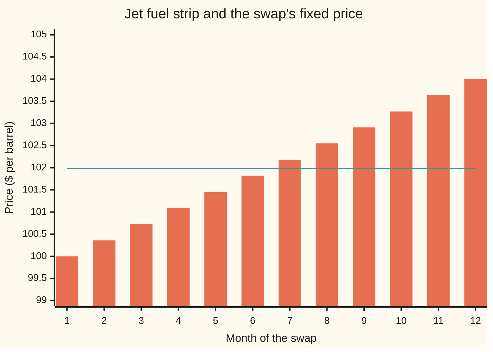
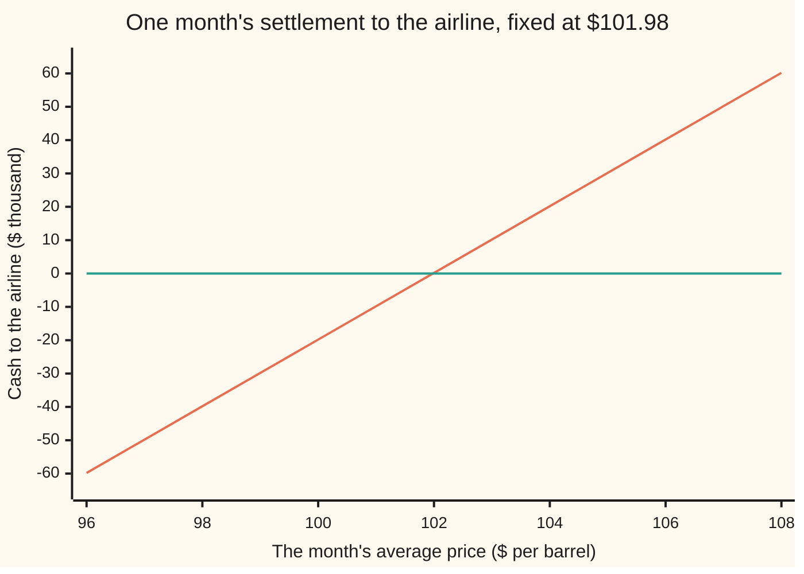

# Commodity swap: a fixed price against the monthly average, priced as a strip of forwards with no option in it

[Syllabus](../../../SYLLABUS.md) → [Financial mathematics](../README.md) → [Averages - commodity swaps and Asian options](../README.md#s27) → Commodity swap

---

## General Overview

An airline burns 10,000 barrels of jet fuel a month. Its supplier bills each month at that month's average price: the jet fuel price is published on each of the month's 22 pricing days, and the bill uses the plain average of the 22 readings. The airline wants next year's bill fixed now.

A bank agrees to a deal. For each of the next twelve months, the airline pays a fixed price per barrel on 10,000 barrels, and the bank pays the month's average price on the same 10,000 barrels. Only the difference changes hands, at each month's end. If a month averages $104 and the fixed price is $101.98, the bank pays the airline $20.18 thousand, and the airline hands that on to its supplier: its fuel has cost $101.98 a barrel. If the month averages $96, the airline pays the bank $59.82 thousand, and again its fuel has cost $101.98. This deal is a **commodity swap**: a fixed price swapped for a floating one, month by month. Each month's floating leg pays an average, so each month on its own is an **average-price forward**: a promise to trade at a fixed price against an average of many days' prices.

The market already quotes a price today for each month's average. That row of twelve prices is the **strip**. On this morning's screen it runs from $100.00 for next month to $104.00 for the twelfth month. The fixed price that makes the swap worth nothing to either side is not the plain average of the strip, $102.00. It is **$101.98**, the strip averaged with each month weighted by how soon its money arrives.

No volatility enters that number. Both sides are bound, so each month's settlement is a straight line in the average, and a straight line is priced by forwards alone. A cap on the twelfth month at the same fixed price, which pays only when the average ends above it, costs $86,441.65 at 20 percent volatility and $161,999.81 at 40 percent. The swap costs nothing at either.

**A commodity swap is a strip of average-price forwards, one per month; its fair fixed price is the average of the month forwards weighted by their discount factors, and once the strip moves its value is the discounted sum of the twelve gaps between the new strip and the fixed price.**

**What kind of fact this is:** a theorem of no-arbitrage pricing, proved on this card in Why it works, under the assumptions listed in When it holds; the strip itself is market data, not a forecast.

### The picture: the strip against the fixed price



Bars: the strip, today's price for each month's average. Line: the fixed price, $101.98. In months 1 to 6 the airline pays more than the strip; in months 7 to 12 it pays less. Discounted, the two sets of gaps cancel exactly.

---

## The formula

Notation first, in words. The months are numbered $i$ = 1 to $n$, with $n$ = 12. Month $i$ settles at $t_i = i/12$ years. The **discount factor** $D(t_i) = e^{-r t_i}$ is what one dollar paid at $t_i$ is worth today, with $r$ the riskless rate, continuously compounded. The strip price for month $i$ is $F_i$. The fixed price is $K$, and $Q$ is the barrels per month. A capital sigma, $\sum_{i=1}^{n}$, means "add the following over the months 1 to $n$".

Month $i$'s floating payment uses the average of its $m$ daily prices, $S_{i,1}$ to $S_{i,m}$:

$$\bar S_i = \frac{1}{m}\sum_{j=1}^{m} S_{i,j}.$$

The value of the swap today, to the side paying fixed, and the fixed price that sets it to zero:

$$V = Q\sum_{i=1}^{n} D(t_i)\,\big(F_i - K\big), \qquad K^\ast = \frac{\sum_{i=1}^{n} D(t_i)\,F_i}{\sum_{i=1}^{n} D(t_i)}.$$

**Read it aloud:** each month is worth its barrels times the gap between its strip price and the fixed price, shrunk to today's money; the fair fixed price is the strip averaged with the discount factors as weights.

The bottom of $K^\ast$ has a name. The sum $A = \sum_{i=1}^{n} D(t_i)$ is the **annuity**: today's value of one dollar paid at each of the twelve month ends. After the strip moves to new prices $F'_i$, with new fair fixed price $K'$, the old swap's value takes two equal forms:

$$V = Q\sum_{i=1}^{n} D(t_i)\,\big(F'_i - K\big) = Q\,\big(K' - K\big)\,A.$$

| Symbol | Plain meaning | In our example | Push it up and the answer… |
| --- | --- | --- | --- |
| $V$ | value of the swap today to the side paying fixed | 0 at the start; $234,666.66 after the strip moves | is the answer |
| $K$ | the fixed price written in the contract | $101.98 | $V$ falls by $Q\,A$ per dollar |
| $K^\ast$, $K'$ | the fair fixed price today; the fair fixed price after the strip moves | $101.98; $103.99 | — |
| $F_i$, $F'_i$ | today's strip price for month $i$'s average; the same after the move | $100.00 to $104.00; $103 to $105 | $V$ rises by $Q\,D(t_i)$ per dollar |
| $\bar S_i$ | month $i$'s average of its daily prices, known only at month end | the number on the supplier's bill | — |
| $S_{i,j}$, $f$ | the published price on pricing day $j$ of month $i$; today's forward price for one such day | — | — |
| $n$, $i$ | number of months; which month | 12 | — |
| $m$, $j$, $k$ | pricing days in a month; which day; days already fixed | 22; —; 11 in the mid-month mark | more days: a smoother average, same value |
| $Q$ | barrels per month | 10,000 | scales $V$ |
| $t_i$, $D(t_i)$, $r$ | settlement date in years; its discount factor $e^{-r t_i}$; the riskless rate | $1/12$ and 0.99584 for month 1; 5% | $r$ up: later months weigh less |
| $A$ | the annuity, $\sum D(t_i)$ | 11.68 | — |
| $\sigma$ | volatility of the jet fuel price, used only by the simulation | 20% and 40% | no effect on $V$ or $K^\ast$ |

### When it holds

- **Rates known today.** The discount factors are fixed numbers. If rates move with the fuel price and the hedge is a daily-margined futures contract, a small convexity gap opens ([Futures](../03-Contracts%20and%20No-Arbitrage/05-futures-margining-and-the-forward-futures-difference.md)); for a one-year fuel swap it is small.
- **The strip quotes the same index.** The formula prices the average the strip quotes. An airline that hedges jet fuel with heating oil prices carries **basis risk**, the gap between two related prices, and no formula on this card removes it.
- **No default.** Each side is assumed to pay. The chance that one side fails is priced separately, as a charge on the value $V$.
- **Dates fixed in advance.** Pricing days and payment dates are set by the contract and do not depend on the price.
- **A straight-line payoff.** Add a cap, a floor or a right to extend, and volatility returns: that is the Asian option of [The Asian option desks trade](03-arithmetic-asian-option.md).

Conventions on this card: each month settles on its last calendar day, with 22 pricing days a month. Real contracts often pay a few business days after the last pricing day, which moves each discount factor by a hair and does not change the method. Conventions verified 2026-09-28.

---

## Why it works

### Step 0: a straight-line promise is priced piece by piece

Every payment in the swap is a fixed number of barrels times either a fixed price or one day's published price divided by 22. Each piece is a straight line in the prices, and a straight line is copied exactly with forward contracts, which cost nothing to enter, plus cash. No forecast of jet fuel is needed, and no view of how much it swings. The swap is worth what the copies are worth.

### Step 1: one day's price, paid at month end

Take the promise "pay one barrel's price on pricing day $j$ of month $i$, in cash, at the month's end $t_i$". Write $f$ for the forward price today for that day's price. A forward is a contract that trades that day's price for $f$ at no cost today, so the promise is worth the same as $f$ dollars paid at $t_i$, which is $D(t_i)\,f$ today.

The only wrinkle is timing: the forward settles on the pricing day, the swap a little later at month end. Holding slightly fewer forwards and banking the proceeds until month end fixes it; the folded proof below does the arithmetic.

<details>
<summary>Detailed proof: one day's price, paid later</summary>

Let pricing day $j$ of month $i$ fall at date $d$, in years, before the payment date $t_i$. Today, enter $e^{-r(t_i - d)}$ forward contracts on day $d$'s price at forward price $f$, costing nothing. On day $d$ they pay $e^{-r(t_i - d)}\,(S_{i,j} - f)$. Bank it at rate $r$ until $t_i$: it grows to exactly $S_{i,j} - f$. So "receive $S_{i,j}$ at $t_i$" equals this position plus "receive $f$ at $t_i$". The position cost nothing; receiving $f$ at $t_i$ is worth $D(t_i)\,f$ today. If the promise traded at any other price, selling the dearer side and buying the cheaper would lock in a riskless profit. Rates known today are used once, in the fixed count $e^{-r(t_i - d)}$.

</details>

### Step 2: the average is worth the average of the forwards

Month $i$ pays $\bar S_i$, the average of $m$ daily prices. An average is a sum divided by $m$, a straight line again. So its value is the average of the $m$ pieces from Step 1: $D(t_i)$ times the average of the daily forward prices. That average of forwards is what the strip quotes as $F_i$. The month is worth $D(t_i)\,F_i$ per barrel.

This is why the month is an **Asian forward** rather than a European one. A European forward settles on one date's price, and its value uses the forward for that date. An Asian forward settles on an average, and its value uses the average of the forwards for all its dates. When each pricing day reads the same monthly contract, as in this card's simulation, the two numbers coincide for the value; they part company in risk. A European forward on the month-end price keeps all 10,000 barrels exposed until the last day. The average fixes one twenty-second of the month with each pricing day, so the exposure runs off as the month goes. The mid-month mark below prices exactly that.

### Step 3: add the months, and set the value to zero

The floating leg is worth $Q \sum D(t_i)\,F_i$. The fixed leg, $K$ per barrel on $Q$ barrels each month, is worth $Q\,K \sum D(t_i)$. Their difference is $V$. Setting $V$ = 0 and solving for $K$ gives $K^\ast$.

The weights $D(t_i)/A$ are positive and add to 1, so $K^\ast$ is a true average of the strip. The early months weigh more because their money arrives sooner. On a rising strip, in **contango**, the cheap early months pull $K^\ast$ below the plain average: $101.98, not $102.00.

### Step 4: after the strip moves, the mark

The contract is written; $K$ is fixed. A later morning brings a new strip $F'_i$. Steps 1 to 3 still price each month, now with $F'_i$: the value is $Q \sum D(t_i)(F'_i - K)$, the discounted sum of the twelve gaps between the new strip and the old fixed price.

A second road gives the same number with no sum over gaps. Enter a new swap in the opposite direction at today's fair fixed price $K'$: it costs nothing. The two floating legs now cancel. What remains is receiving $K'$ and paying $K$ on $Q$ barrels every month, a fixed stream worth $Q\,(K' - K)\,A$. The two expressions agree because $K'$ was defined to make $\sum D(t_i)(F'_i - K') = 0$.

### Step 5: a month already under way

Part-way through month 1, $k$ of its $m$ prices are published. Those are banked: they are numbers, not prices to hedge. The month's expected average becomes $(k \times \text{banked average} + (m - k) \times F'_1)/m$, and only the $(m - k)/m$ share still moves with the market. Everything else is Step 4 with discount factors counted from the new date.

The same weighted average appears on interest-rate curves: the fixed rate on a par swap is the discount-weighted average of the forward rates ([Spot, forward and par rates](../02-Curves/01-spot-forward-and-par-rates.md)). A commodity swap is that construction with fuel prices where the forward rates were.

---

## Worked numbers, by hand

The jet fuel swap: $Q$ = 10,000 barrels, $n$ = 12 months, $r$ = 5%, strip $100.00 to $104.00 in equal steps.

| Step | Arithmetic | Value |
| --- | --- | --- |
| month 1's discount factor | $e^{-0.05 \times 1/12}$ | 0.99584 |
| month 12's discount factor | $e^{-0.05 \times 1}$ | 0.95123 |
| annuity $A$ | 0.99584 + 0.99170 + … + 0.95123 | 11.6806 |
| weighted strip | 0.99584 × 100.00 + … + 0.95123 × 104.00 | 1191.207 |
| fair fixed price $K^\ast$ | 1191.207 ÷ 11.6806 | **$101.98** |
| check by root finding | the $K$ at which $V$ = 0 | $101.98 |
| plain average, for comparison | (100.00 + … + 104.00) ÷ 12 | $102.00 |

Month by month at $K$ = $101.98. The last column is the month's **delta**: dollars gained per $1 rise in that month's strip price, $Q\,D(t_i)$.

| Month | Strip $F_i$ | $D(t_i)$ | Gap $F_i - K$ | PV of the gap, $ | Delta, $ per $1 |
| --- | --- | --- | --- | --- | --- |
| 1 | 100.00 | 0.99584 | −1.9819 | −19,736.94 | 9,958.42 |
| 2 | 100.36 | 0.99170 | −1.6219 | −16,084.75 | 9,917.01 |
| 3 | 100.73 | 0.98758 | −1.2519 | −12,363.83 | 9,875.78 |
| 4 | 101.09 | 0.98347 | −0.8919 | −8,771.92 | 9,834.71 |
| 5 | 101.45 | 0.97938 | −0.5319 | −5,209.67 | 9,793.82 |
| 6 | 101.82 | 0.97531 | −0.1619 | −1,579.37 | 9,753.10 |
| 7 | 102.18 | 0.97125 | 0.1981 | 1,923.72 | 9,712.55 |
| 8 | 102.55 | 0.96722 | 0.5681 | 5,494.42 | 9,672.16 |
| 9 | 102.91 | 0.96319 | 0.9281 | 8,939.07 | 9,631.94 |
| 10 | 103.27 | 0.95919 | 1.2881 | 12,354.99 | 9,591.89 |
| 11 | 103.64 | 0.95520 | 1.6581 | 15,837.86 | 9,552.01 |
| 12 | 104.00 | 0.95123 | 2.0181 | 19,196.43 | 9,512.29 |

The first six months are worth money to the bank, the last six to the airline, and the twelve present values add to zero. A fixed price of $101.98 is what a dealer quotes for this strip before adding a margin.

### What breaks if you drop a piece

| Mistake | Comes out at | What went wrong |
| --- | --- | --- |
| Fixed price set to the plain average, $102.00 | the airline starts $2,110.12 behind | The weights were dropped: early months, which are cheap on this strip, count for more |
| Fixed price set to today's front month, $100.00 | the swap is worth $231,501.28 to the airline on day one | One point of the strip stood in for all twelve |
| Mark after the move without discounting | $242,167.83, not $234,666.66 | A gap paid in month 12 is worth 0.95123 of a gap paid now |
| Mid-month mark with the banked fixings ignored | $235,156.06, not $233,160.22 | Eleven published prices were treated as if they still floated at the new strip |

The code prints all four.

---

## The mark after inception, and the average already banked

Signed at $101.98 in the morning, the swap can be worth a quarter of a million dollars by the afternoon, before a single barrel is priced.

### The strip moves

That afternoon jet fuel rallies. The front month rises $3 and the twelfth month $1: the strip now runs from $103 to $105. The contract still says $101.98.

| Road | Arithmetic | Value to the airline |
| --- | --- | --- |
| New fair fixed price $K'$ | the new strip, discount-weighted | $103.99 |
| Gap $K' - K$ | 103.99 − 101.98 | $2.01 |
| Twelve discounted gaps | $Q \sum D(t_i)(F'_i - K)$ | $234,666.66 |
| Offsetting swap | $Q\,(K' - K)\,A$ = 10,000 × 2.009034 × 11.680570 | $234,666.66 |

The airline could close the position at this price: enter the opposite swap at $103.99 and collect the $2.01 difference on 10,000 barrels for twelve months.

### Half a month later

Now eleven of month 1's 22 pricing days are published, averaging $102.60, and the strip stands where the afternoon left it.

| Step | Arithmetic | Value |
| --- | --- | --- |
| month 1's expected average | (11 × 102.60 + 11 × 103.00) ÷ 22 | $102.80 |
| month 1's discount factor, from the new date | $e^{-0.05 \times 11/264}$ | 0.997919 |
| the mark, by months | Step 4 with month 1's average replaced | $233,160.22 |
| the mark, by offsetting swap | the same, as $Q\,(K' - K)\,A$ from the new date | $233,160.22 |
| the mark, simulated from the new date | 20,000 path pairs at 20% volatility | $233,724.43, standard error $911.44 |
| month 1's delta, by bumping its forward $1 | half of its barrels still float | $4,989.59 |

The simulated mark sits within one standard error, the simulation's own measure of its noise, of the formula.

As the month runs, month 1's exposure falls by one twenty-second per pricing day:

```
month 1 barrels still exposed to the price, by fixings left (of 22)
  22 left  ████████████████████████████████████████  10000.00
  16 left  █████████████████████████████             7272.73
  11 left  ████████████████████                      5000.00
   6 left  ███████████                               2727.27
   0 left                                               0.00
```

A European forward on the month-end price would sit at 10,000 barrels until the last day and then drop to zero. The average spreads the drop evenly, which is why averages are what a buyer with steady daily use wants.

### The Greeks

| Greek | Meaning | Value at the start |
| --- | --- | --- |
| Delta, parallel | dollars gained per $1 rise in every month of the strip | $116,805.70 |
| Delta, month $i$ | dollars per $1 rise in month $i$ alone: $Q\,D(t_i)$ | $9,958.42 for month 1, $9,512.29 for month 12 |
| Gamma | change in delta per $1 move | 0: the value is a straight line in the strip |
| Vega | change per unit of volatility | 0; the simulated value at the fair price is $912.12 (standard error $976.36) at 20% and $3,548.74 (standard error $3,904.16) at 40%, both zero within noise |
| Rho | change if rates rise 1 percentage point | −$419.72: the airline's gains lie in the later months, which rates shrink most |

### The payoff of one month



First line: the month's net cash to the airline, 10,000 barrels times the average minus $101.98. Second line: zero. The line is straight, with no kink and no floor. That straightness is the whole reason volatility drops out.

---

## Code, from first principles, and it actually runs

Three roads lead to the fair fixed price. Road 1 is the weighted strip. Road 2 is bisection: it halves an interval two hundred times to find the fixed price at which the swap is worth zero, never dividing by the annuity. Road 3 simulates every pricing day of the year, with each month's contract wandering around its strip price, all twelve driven by one random path. The random numbers come from a splitmix64 generator written out in both languages, and each path is paired with its mirror image to cut noise. At 20 and 40 percent volatility the fair price should not move and a cap on month 12 should. The marks are computed as gaps, as an offsetting swap, and mid-month by simulation too.

### Python

```python
# Commodity swap and average-price forward -- the check behind the card.  Standard library only.
# Twelve-month jet fuel swap, 10,000 bbl a month, 22 pricing days a month, paid at each month end.
# Nothing imported knows the answer: the random numbers come from a splitmix64 generator written
# out, the root finder is bisection written out, and the paths are simulated day by day.
from math import log, sqrt, exp, cos, pi

N_BBL, r, DAYS = 10000.0, 0.05, 22
STRIP = [100.00, 100.36, 100.73, 101.09, 101.45, 101.82, 102.18, 102.55, 102.91, 103.27, 103.64, 104.00]
MOVED = [103.00, 103.18, 103.36, 103.55, 103.73, 103.91, 104.09, 104.27, 104.45, 104.64, 104.82, 105.00]
REALISED, DONE = 102.60, 11                   # mid-month 1: 11 of 22 fixings banked, averaging 102.60

def disc(t0, rate=r): return [exp(-rate * ((i + 1) / 12.0 - t0)) for i in range(12)]

def fair(curve, D): return sum(d * f for d, f in zip(D, curve)) / sum(D)       # road 1

def pv(curve, K, D): return N_BBL * sum(d * (f - K) for d, f in zip(D, curve))  # fixed payer's value

def bisect(g, lo, hi):                                                         # road 2: pv(K) = 0
    for _ in range(200):
        mid = 0.5 * (lo + hi)
        if (g(lo) > 0) == (g(mid) > 0): lo = mid
        else: hi = mid
    return 0.5 * (lo + hi)

class Rng:                                                                     # splitmix64 + Box-Muller
    def __init__(self, seed): self.s = seed
    def u(self):
        self.s = (self.s + 0x9E3779B97F4A7C15) & 0xFFFFFFFFFFFFFFFF
        z = self.s
        z = ((z ^ (z >> 30)) * 0xBF58476D1CE4E5B9) & 0xFFFFFFFFFFFFFFFF
        z = ((z ^ (z >> 27)) * 0x94D049BB133111EB) & 0xFFFFFFFFFFFFFFFF
        return ((z ^ (z >> 31)) >> 11) / 9007199254740992.0
    def z(self): return sqrt(-2.0 * log(1.0 - self.u())) * cos(2.0 * pi * self.u())

def simulate(curve, sigma, pairs, payoff, t0=0.0, banked=0, banked_avg=0.0):
    # road 3: month i's contract wanders as F_i exp(sigma W - sigma^2 (t - t0) / 2), one shared W;
    # a fixing on a day in month i reads month i's contract that day.  Antithetic pairs.
    rng, h, k = Rng(7), 1.0 / (12.0 * DAYS), len(payoff([curve[0]] * 12))
    acc, acc2 = [0.0] * k, [0.0] * k
    for _ in range(pairs):
        zs = [rng.z() for _ in range(12 * DAYS)]
        pair = [0.0] * k
        for sgn in (1.0, -1.0):
            w, t, avgs = 0.0, t0, []
            for i in range(12):
                s, n0 = (banked_avg * banked, banked) if i == 0 else (0.0, 0)
                for j in range(n0, DAYS):
                    tj = (i * DAYS + j + 1) * h
                    w += sgn * sigma * sqrt(tj - t) * zs[i * DAYS + j]
                    t = tj
                    s += curve[i] * exp(w - 0.5 * sigma * sigma * (tj - t0))
                avgs.append(s / DAYS)
            pair = [p + 0.5 * v for p, v in zip(pair, payoff(avgs))]
        acc = [a + p for a, p in zip(acc, pair)]
        acc2 = [a + p * p for a, p in zip(acc2, pair)]
    means = [a / pairs for a in acc]
    return means, [sqrt((b / pairs - m * m) / pairs) for b, m in zip(acc2, means)]

# ---- at inception ----
D0 = disc(0.0)
K = fair(STRIP, D0)
K_root = bisect(lambda k: pv(STRIP, k, D0), 90.0, 110.0)
annuity, simple = sum(D0), sum(STRIP) / 12.0
print(f"annuity, sum of 12 discount factors    {annuity:14.6f}")
print(f"sum of D(t_i) F_i over the 12 months   {sum(d * f for d, f in zip(D0, STRIP)):14.6f}")
print(f"road 1  fair fixed price, weighted     {K:14.6f}")
print(f"road 2  fair fixed price, bisection    {K_root:14.6f}")
sim = {}
for sig in (0.20, 0.40):
    cap = lambda a: [fair(a, D0), pv(a, K, D0), N_BBL * D0[11] * max(a[11] - K, 0.0)]
    sim[sig] = simulate(STRIP, sig, 20000, cap)
    (f, v, c), (sf, sv, sc) = sim[sig]
    print(f"road 3  vol {sig:.2f}: fair price          {f:14.6f}   se {sf:.6f}")
    print(f"        vol {sig:.2f}: swap value at K, $  {v:14.2f}   se {sv:.2f}")
    print(f"        vol {sig:.2f}: month-12 cap, $     {c:14.2f}   se {sc:.2f}")
print("month  forward   D(t_i)    gap F-K   PV of gap $   delta $ per $1")
for i in range(12):
    print(f"{i + 1:5d} {STRIP[i]:8.2f} {D0[i]:8.5f} {STRIP[i] - K:10.4f} {N_BBL * D0[i] * (STRIP[i] - K):13.2f} {N_BBL * D0[i]:13.2f}")
print(f"parallel delta, $ per $1 on all months {N_BBL * annuity:14.2f}")
print(f"rho, $ for rates up 1 percent          {pv(STRIP, K, disc(0.0, r + 0.01)):14.2f}")
print(f"chart, one month's net cash at avg 96..108, $000: " + " ".join(f"{N_BBL * (a - K) / 1000:.2f}" for a in range(96, 109, 2)))

# ---- that afternoon the strip moves: front up 3, back up 1 ----
K_new = fair(MOVED, D0)
m_gaps, m_offset = pv(MOVED, K, D0), N_BBL * (K_new - K) * annuity
print(f"moved: new fair fixed price            {K_new:14.6f}")
print(f"moved: gap, new fair price minus K    {K_new - K:14.6f}")
print(f"moved: mark, discounted sum of gaps, $ {m_gaps:14.2f}")
print(f"moved: mark, offsetting swap, $        {m_offset:14.2f}")

# ---- mid-month 1: 11 fixings banked at 102.60, curve as moved ----
t0 = DONE / (12.0 * DAYS)
D1 = disc(t0)
E = [(DONE * REALISED + (DAYS - DONE) * MOVED[0]) / DAYS] + MOVED[1:]
mark_mid = pv(E, K, D1)
mark_off = N_BBL * (fair(E, D1) - K) * sum(D1)
(mc_mid,), (se_mid,) = simulate(MOVED, 0.20, 20000, lambda a: [pv(a, K, D1)], t0, DONE, REALISED)
bumped = [MOVED[0] + 1.0] + MOVED[1:]
E_b = [(DONE * REALISED + (DAYS - DONE) * bumped[0]) / DAYS] + bumped[1:]
delta1 = pv(E_b, K, D1) - mark_mid
wrong_unbanked = pv(MOVED, K, D1)
print(f"mid-month: month 1 expected average    {E[0]:14.6f}")
print(f"mid-month: month 1 discount factor    {D1[0]:14.6f}")
print(f"mid-month: mark, formula, $            {mark_mid:14.2f}")
print(f"mid-month: mark, offsetting swap, $    {mark_off:14.2f}")
print(f"mid-month: mark, simulated, $          {mc_mid:14.2f}   se {se_mid:.2f}")
print(f"mid-month: month 1 delta by bump, $    {delta1:14.2f}")
print(f"wrong: plain average as fixed price    {simple:14.6f}")
print(f"  its value to the fixed payer, $      {pv(STRIP, simple, D0):14.2f}")
print(f"wrong: fixed at today's front 100, $   {pv(STRIP, 100.0, D0):14.2f}")
print(f"wrong: moved mark undiscounted, $      {N_BBL * sum(f - K for f in MOVED):14.2f}")
print(f"wrong: mid-month, banked half ignored  {wrong_unbanked:14.2f}")
print(f"try: rates at zero, fair price        {fair(STRIP, disc(0.0, 0.0)):14.6f}")
print(f"try: strip reversed, fair price        {fair(STRIP[::-1], D0):14.6f}")
print(f"try: rates at 10 percent, fair price   {fair(STRIP, disc(0.0, 0.10)):14.6f}")
print("bars, month 1 barrels still exposed, fixings left 22 16 11 6 0: " +
      " ".join(f"{N_BBL * n / DAYS:.2f}" for n in (22, 16, 11, 6, 0)))

assert abs(K - K_root) < 1e-9, "closed form vs bisection on the value"
assert abs(annuity - exp(-r / 12) * (1 - exp(-r)) / (1 - exp(-r / 12))) < 1e-9, "annuity vs geometric series"
assert abs(sim[0.20][0][0] - K) < 4 * sim[0.20][1][0], "simulated fair price at 20% vol"
assert abs(sim[0.40][0][0] - K) < 4 * sim[0.40][1][0], "simulated fair price at 40% vol"
assert sim[0.40][0][2] > 1.5 * sim[0.20][0][2], "a cap on the average does depend on vol"
assert abs(m_gaps - m_offset) < 1e-6, "sum of gaps vs offsetting swap"
assert abs(mark_off - mark_mid) < 1e-6, "mid-month mark vs offsetting swap"
assert abs(mc_mid - mark_mid) < 4 * se_mid, "simulated mid-month mark"
assert abs(delta1 - N_BBL * D1[0] * (DAYS - DONE) / DAYS) < 1e-6, "month-1 delta scales with fixings left"
print("ALL CHECKS PASS")
```

**Ran 2026-09-28 on macOS, Python 3.14.6, standard library only. All checks passed. Output, pasted from the run:**

```
annuity, sum of 12 discount factors         11.680570
sum of D(t_i) F_i over the 12 months      1191.207104
road 1  fair fixed price, weighted         101.981935
road 2  fair fixed price, bisection        101.981935
road 3  vol 0.20: fair price              101.989744   se 0.008359
        vol 0.20: swap value at K, $          912.12   se 976.36
        vol 0.20: month-12 cap, $           86441.65   se 502.46
road 3  vol 0.40: fair price              102.012316   se 0.033424
        vol 0.40: swap value at K, $         3548.74   se 3904.16
        vol 0.40: month-12 cap, $          161999.81   se 1204.32
month  forward   D(t_i)    gap F-K   PV of gap $   delta $ per $1
    1   100.00  0.99584    -1.9819     -19736.94       9958.42
    2   100.36  0.99170    -1.6219     -16084.75       9917.01
    3   100.73  0.98758    -1.2519     -12363.83       9875.78
    4   101.09  0.98347    -0.8919      -8771.92       9834.71
    5   101.45  0.97938    -0.5319      -5209.67       9793.82
    6   101.82  0.97531    -0.1619      -1579.37       9753.10
    7   102.18  0.97125     0.1981       1923.72       9712.55
    8   102.55  0.96722     0.5681       5494.42       9672.16
    9   102.91  0.96319     0.9281       8939.07       9631.94
   10   103.27  0.95919     1.2881      12354.99       9591.89
   11   103.64  0.95520     1.6581      15837.86       9552.01
   12   104.00  0.95123     2.0181      19196.43       9512.29
parallel delta, $ per $1 on all months      116805.70
rho, $ for rates up 1 percent                 -419.72
chart, one month's net cash at avg 96..108, $000: -59.82 -39.82 -19.82 0.18 20.18 40.18 60.18
moved: new fair fixed price                103.990969
moved: gap, new fair price minus K          2.009034
moved: mark, discounted sum of gaps, $      234666.66
moved: mark, offsetting swap, $             234666.66
mid-month: month 1 expected average        102.800000
mid-month: month 1 discount factor          0.997919
mid-month: mark, formula, $                 233160.22
mid-month: mark, offsetting swap, $         233160.22
mid-month: mark, simulated, $               233724.43   se 911.44
mid-month: month 1 delta by bump, $           4989.59
wrong: plain average as fixed price        102.000000
  its value to the fixed payer, $            -2110.12
wrong: fixed at today's front 100, $        231501.28
wrong: moved mark undiscounted, $           242167.83
wrong: mid-month, banked half ignored       235156.06
try: rates at zero, fair price            102.000000
try: strip reversed, fair price            102.018065
try: rates at 10 percent, fair price       101.963874
bars, month 1 barrels still exposed, fixings left 22 16 11 6 0: 10000.00 7272.73 5000.00 2727.27 0.00
ALL CHECKS PASS
```

### Rust

Same inputs, same generator, same labels. No crates.

```rust
// Commodity swap and average-price forward -- the same check as the Python, in Rust.  std only.
// Twelve-month jet fuel swap, 10,000 bbl a month, 22 pricing days a month, paid at each month end.
// The random numbers are the same splitmix64 generator written out, so both scripts draw alike.
// Compile: rustc --edition 2021 -O commodity_swap_and_average_price_forward_check.rs -o /tmp/<dir>/chk
use std::f64::consts::PI;

const N_BBL: f64 = 10000.0;
const R: f64 = 0.05;
const DAYS: usize = 22;
const STRIP: [f64; 12] = [100.00, 100.36, 100.73, 101.09, 101.45, 101.82, 102.18, 102.55, 102.91, 103.27, 103.64, 104.00];
const MOVED: [f64; 12] = [103.00, 103.18, 103.36, 103.55, 103.73, 103.91, 104.09, 104.27, 104.45, 104.64, 104.82, 105.00];
const REALISED: f64 = 102.60;
const DONE: usize = 11;

fn disc(t0: f64, rate: f64) -> Vec<f64> { (0..12).map(|i| (-rate * ((i + 1) as f64 / 12.0 - t0)).exp()).collect() }
fn fair(c: &[f64], d: &[f64]) -> f64 { d.iter().zip(c).map(|(a, b)| a * b).sum::<f64>() / d.iter().sum::<f64>() }
fn pv(c: &[f64], k: f64, d: &[f64]) -> f64 { N_BBL * d.iter().zip(c).map(|(a, f)| a * (f - k)).sum::<f64>() }

fn bisect<G: Fn(f64) -> f64>(g: G, mut lo: f64, mut hi: f64) -> f64 {
    for _ in 0..200 {
        let mid = 0.5 * (lo + hi);
        if (g(lo) > 0.0) == (g(mid) > 0.0) { lo = mid; } else { hi = mid; }
    }
    0.5 * (lo + hi)
}

struct Rng { s: u64 }
impl Rng {
    fn u(&mut self) -> f64 {
        self.s = self.s.wrapping_add(0x9E3779B97F4A7C15);
        let mut z = self.s;
        z = (z ^ (z >> 30)).wrapping_mul(0xBF58476D1CE4E5B9);
        z = (z ^ (z >> 27)).wrapping_mul(0x94D049BB133111EB);
        ((z ^ (z >> 31)) >> 11) as f64 / 9007199254740992.0
    }
    fn z(&mut self) -> f64 { let a = self.u(); let b = self.u(); (-2.0 * (1.0 - a).ln()).sqrt() * (2.0 * PI * b).cos() }
}

// road 3: month i's contract wanders as F_i exp(sigma W - sigma^2 (t - t0) / 2), one shared W.
fn simulate<P: Fn(&[f64]) -> Vec<f64>>(curve: &[f64], sigma: f64, pairs: usize, payoff: P,
                                       t0: f64, banked: usize, banked_avg: f64) -> (Vec<f64>, Vec<f64>) {
    let (mut rng, h, k) = (Rng { s: 7 }, 1.0 / (12.0 * DAYS as f64), payoff(&[curve[0]; 12]).len());
    let (mut acc, mut acc2) = (vec![0.0; k], vec![0.0; k]);
    for _ in 0..pairs {
        let zs: Vec<f64> = (0..12 * DAYS).map(|_| rng.z()).collect();
        let mut pair = vec![0.0; k];
        for sgn in [1.0, -1.0] {
            let (mut w, mut t, mut avgs) = (0.0_f64, t0, Vec::new());
            for i in 0..12 {
                let (mut s, n0) = if i == 0 { (banked_avg * banked as f64, banked) } else { (0.0, 0) };
                for j in n0..DAYS {
                    let tj = (i * DAYS + j + 1) as f64 * h;
                    w += sgn * sigma * (tj - t).sqrt() * zs[i * DAYS + j];
                    t = tj;
                    s += curve[i] * (w - 0.5 * sigma * sigma * (tj - t0)).exp();
                }
                avgs.push(s / DAYS as f64);
            }
            for (p, v) in pair.iter_mut().zip(payoff(&avgs)) { *p += 0.5 * v; }
        }
        for j in 0..k { acc[j] += pair[j]; acc2[j] += pair[j] * pair[j]; }
    }
    let m: Vec<f64> = acc.iter().map(|a| a / pairs as f64).collect();
    let se = acc2.iter().zip(&m).map(|(b, mm)| ((b / pairs as f64 - mm * mm) / pairs as f64).sqrt()).collect();
    (m, se)
}

fn main() {
    // ---- at inception ----
    let d0 = disc(0.0, R);
    let k = fair(&STRIP, &d0);
    let k_root = bisect(|x| pv(&STRIP, x, &d0), 90.0, 110.0);
    let (annuity, simple) = (d0.iter().sum::<f64>(), STRIP.iter().sum::<f64>() / 12.0);
    println!("annuity, sum of 12 discount factors    {:14.6}", annuity);
    println!("sum of D(t_i) F_i over the 12 months   {:14.6}", d0.iter().zip(&STRIP).map(|(d, f)| d * f).sum::<f64>());
    println!("road 1  fair fixed price, weighted     {:14.6}", k);
    println!("road 2  fair fixed price, bisection    {:14.6}", k_root);
    let mut sim = Vec::new();
    for sig in [0.20, 0.40] {
        let cap = |a: &[f64]| vec![fair(a, &d0), pv(a, k, &d0), N_BBL * d0[11] * (a[11] - k).max(0.0)];
        let (m, se) = simulate(&STRIP, sig, 20000, cap, 0.0, 0, 0.0);
        println!("road 3  vol {:.2}: fair price          {:14.6}   se {:.6}", sig, m[0], se[0]);
        println!("        vol {:.2}: swap value at K, $  {:14.2}   se {:.2}", sig, m[1], se[1]);
        println!("        vol {:.2}: month-12 cap, $     {:14.2}   se {:.2}", sig, m[2], se[2]);
        sim.push((m, se));
    }
    println!("month  forward   D(t_i)    gap F-K   PV of gap $   delta $ per $1");
    for i in 0..12 {
        println!("{:5} {:8.2} {:8.5} {:10.4} {:13.2} {:13.2}", i + 1, STRIP[i], d0[i], STRIP[i] - k,
                 N_BBL * d0[i] * (STRIP[i] - k), N_BBL * d0[i]);
    }
    println!("parallel delta, $ per $1 on all months {:14.2}", N_BBL * annuity);
    println!("rho, $ for rates up 1 percent          {:14.2}", pv(&STRIP, k, &disc(0.0, R + 0.01)));
    let chart: Vec<String> = (96..109).step_by(2).map(|a| format!("{:.2}", N_BBL * (a as f64 - k) / 1000.0)).collect();
    println!("chart, one month's net cash at avg 96..108, $000: {}", chart.join(" "));

    // ---- that afternoon the strip moves: front up 3, back up 1 ----
    let k_new = fair(&MOVED, &d0);
    let (m_gaps, m_offset) = (pv(&MOVED, k, &d0), N_BBL * (k_new - k) * annuity);
    println!("moved: new fair fixed price            {:14.6}", k_new);
    println!("moved: gap, new fair price minus K    {:14.6}", k_new - k);
    println!("moved: mark, discounted sum of gaps, $ {:14.2}", m_gaps);
    println!("moved: mark, offsetting swap, $        {:14.2}", m_offset);

    // ---- mid-month 1: 11 fixings banked at 102.60, curve as moved ----
    let t0 = DONE as f64 / (12.0 * DAYS as f64);
    let d1 = disc(t0, R);
    let month1 = |f1: f64| (DONE as f64 * REALISED + (DAYS - DONE) as f64 * f1) / DAYS as f64;
    let mut e = MOVED.to_vec();
    e[0] = month1(MOVED[0]);
    let mark_mid = pv(&e, k, &d1);
    let mark_off = N_BBL * (fair(&e, &d1) - k) * d1.iter().sum::<f64>();
    let (mc, se) = simulate(&MOVED, 0.20, 20000, |a: &[f64]| vec![pv(a, k, &d1)], t0, DONE, REALISED);
    let mut e_b = e.clone();
    e_b[0] = month1(MOVED[0] + 1.0);
    let delta1 = pv(&e_b, k, &d1) - mark_mid;
    let wrong_unbanked = pv(&MOVED, k, &d1);
    println!("mid-month: month 1 expected average    {:14.6}", e[0]);
    println!("mid-month: month 1 discount factor    {:14.6}", d1[0]);
    println!("mid-month: mark, formula, $            {:14.2}", mark_mid);
    println!("mid-month: mark, offsetting swap, $    {:14.2}", mark_off);
    println!("mid-month: mark, simulated, $          {:14.2}   se {:.2}", mc[0], se[0]);
    println!("mid-month: month 1 delta by bump, $    {:14.2}", delta1);
    println!("wrong: plain average as fixed price    {:14.6}", simple);
    println!("  its value to the fixed payer, $      {:14.2}", pv(&STRIP, simple, &d0));
    println!("wrong: fixed at today's front 100, $   {:14.2}", pv(&STRIP, 100.0, &d0));
    println!("wrong: moved mark undiscounted, $      {:14.2}", N_BBL * MOVED.iter().map(|f| f - k).sum::<f64>());
    println!("wrong: mid-month, banked half ignored  {:14.2}", wrong_unbanked);
    let rev: Vec<f64> = STRIP.iter().rev().cloned().collect();
    println!("try: rates at zero, fair price        {:14.6}", fair(&STRIP, &disc(0.0, 0.0)));
    println!("try: strip reversed, fair price        {:14.6}", fair(&rev, &d0));
    println!("try: rates at 10 percent, fair price   {:14.6}", fair(&STRIP, &disc(0.0, 0.10)));
    let bars: Vec<String> = [22.0, 16.0, 11.0, 6.0, 0.0].iter().map(|n| format!("{:.2}", N_BBL * n / DAYS as f64)).collect();
    println!("bars, month 1 barrels still exposed, fixings left 22 16 11 6 0: {}", bars.join(" "));

    assert!((k - k_root).abs() < 1e-9, "closed form vs bisection on the value");
    assert!((annuity - (-R / 12.0).exp() * (1.0 - (-R).exp()) / (1.0 - (-R / 12.0).exp())).abs() < 1e-9, "annuity vs geometric series");
    assert!((sim[0].0[0] - k).abs() < 4.0 * sim[0].1[0], "simulated fair price at 20% vol");
    assert!((sim[1].0[0] - k).abs() < 4.0 * sim[1].1[0], "simulated fair price at 40% vol");
    assert!(sim[1].0[2] > 1.5 * sim[0].0[2], "a cap on the average does depend on vol");
    assert!((m_gaps - m_offset).abs() < 1e-6, "sum of gaps vs offsetting swap");
    assert!((mark_off - mark_mid).abs() < 1e-6, "mid-month mark vs offsetting swap");
    assert!((mc[0] - mark_mid).abs() < 4.0 * se[0], "simulated mid-month mark");
    assert!((delta1 - N_BBL * d1[0] * (DAYS - DONE) as f64 / DAYS as f64).abs() < 1e-6, "month-1 delta scales with fixings left");
    println!("ALL CHECKS PASS");
}
```

**Ran 2026-09-28 on macOS, rustc 1.98.1, no crates. All checks passed. Output, pasted from the run:**

```
annuity, sum of 12 discount factors         11.680570
sum of D(t_i) F_i over the 12 months      1191.207104
road 1  fair fixed price, weighted         101.981935
road 2  fair fixed price, bisection        101.981935
road 3  vol 0.20: fair price              101.989744   se 0.008359
        vol 0.20: swap value at K, $          912.12   se 976.36
        vol 0.20: month-12 cap, $           86441.65   se 502.46
road 3  vol 0.40: fair price              102.012316   se 0.033424
        vol 0.40: swap value at K, $         3548.74   se 3904.16
        vol 0.40: month-12 cap, $          161999.81   se 1204.32
month  forward   D(t_i)    gap F-K   PV of gap $   delta $ per $1
    1   100.00  0.99584    -1.9819     -19736.94       9958.42
    2   100.36  0.99170    -1.6219     -16084.75       9917.01
    3   100.73  0.98758    -1.2519     -12363.83       9875.78
    4   101.09  0.98347    -0.8919      -8771.92       9834.71
    5   101.45  0.97938    -0.5319      -5209.67       9793.82
    6   101.82  0.97531    -0.1619      -1579.37       9753.10
    7   102.18  0.97125     0.1981       1923.72       9712.55
    8   102.55  0.96722     0.5681       5494.42       9672.16
    9   102.91  0.96319     0.9281       8939.07       9631.94
   10   103.27  0.95919     1.2881      12354.99       9591.89
   11   103.64  0.95520     1.6581      15837.86       9552.01
   12   104.00  0.95123     2.0181      19196.43       9512.29
parallel delta, $ per $1 on all months      116805.70
rho, $ for rates up 1 percent                 -419.72
chart, one month's net cash at avg 96..108, $000: -59.82 -39.82 -19.82 0.18 20.18 40.18 60.18
moved: new fair fixed price                103.990969
moved: gap, new fair price minus K          2.009034
moved: mark, discounted sum of gaps, $      234666.66
moved: mark, offsetting swap, $             234666.66
mid-month: month 1 expected average        102.800000
mid-month: month 1 discount factor          0.997919
mid-month: mark, formula, $                 233160.22
mid-month: mark, offsetting swap, $         233160.22
mid-month: mark, simulated, $               233724.43   se 911.44
mid-month: month 1 delta by bump, $           4989.59
wrong: plain average as fixed price        102.000000
  its value to the fixed payer, $            -2110.12
wrong: fixed at today's front 100, $        231501.28
wrong: moved mark undiscounted, $           242167.83
wrong: mid-month, banked half ignored       235156.06
try: rates at zero, fair price            102.000000
try: strip reversed, fair price            102.018065
try: rates at 10 percent, fair price       101.963874
bars, month 1 barrels still exposed, fixings left 22 16 11 6 0: 10000.00 7272.73 5000.00 2727.27 0.00
ALL CHECKS PASS
```

The two outputs match line for line. Bisection lands on the weighted strip to six decimals, and the annuity matches its geometric-series closed form; the simulated fair price sits within one standard error at both volatilities. The cap nearly doubles with volatility; the swap stays at zero within noise.

> [!TIP]
> **Try changing**
> Guess the direction first, then run it.
> - **Rates to zero.** Call `fair(STRIP, disc(0.0, 0.0))`. Every weight becomes equal and the fair price is the plain average, **$102.00**.
> - **Rates to 10 percent.** Call `fair(STRIP, disc(0.0, 0.10))`. Later months shrink further and the price falls to **$101.96**.
> - **Reverse the strip.** Feed `STRIP[::-1]`, a falling strip in **backwardation**, where later months are cheaper. The heavy early months are now the dear ones and the price rises above the plain average to **$102.02**.
> - **Double the volatility.** Already in the run: from 20 to 40 percent the cap on month 12 goes from **$86,441.65** to **$161,999.81**, while the swap's fair price stays at $101.98 within noise.

---

## The usual mistake

> [!warning]
> **Pricing a swap like an option.** Volatility has no place in a swap price. Both sides are bound, so each settlement is a straight line in the average, and straight lines are copied with forwards and cash. A desk that charges for volatility on a plain swap is charging for nothing; one that sells a cap with the swap's pricing gives away the $86,441.65 the cap is worth.
>
> - **The plain average as the fixed price.** On this rising strip $102.00 overcharges the airline by $2,110.12 in today's money. The weights are discount factors.
> - **The front month as the fixed price.** $100.00 hands the airline $231,501.28 on day one. The fixed price is an average of the whole strip.
> - **Undiscounted gaps.** The mark after the move is $234,666.66, not $242,167.83.
> - **Forgetting the banked days.** In the middle of a month, published fixings are cash. Treating them as still floating gives $235,156.06 instead of $233,160.22, and doubles the month's delta.

---

## Where you meet it in real life

- **Airline fuel hedging.** Airlines fix their fuel cost a year or more ahead with swaps like this one, against monthly averages of a jet fuel index, because their burn is spread evenly over each month.
- **Producers selling forward.** A mine or an oil producer takes the other side: it receives the fixed price and pays the average, which locks in revenue on steady output.
- **Cleared average-price contracts.** Exchanges list monthly average-price contracts that are these single-month legs, margined daily; a strip of twelve is a cleared commodity swap.
- **Daily risk reports.** Each open swap is revalued every evening as the discounted sum of its gaps against that day's strip: Step 4.
- **Options on the average.** Put a floor under one month and the price needs volatility: [Kemna-Vorst](02-kemna-vorst-geometric-asian.md) for the exact geometric case, [The Asian option desks trade](03-arithmetic-asian-option.md) for the one desks trade.

> **Say it back**
> A commodity swap exchanges a fixed price for each month's average price on a set number of barrels. Each month is an average-price forward, worth its discount factor times the gap between the strip price and the fixed price. The fair fixed price is the strip averaged with discount factors as weights: $101.98 on a strip from $100 to $104. After the strip moves, the swap is worth the discounted sum of the new gaps, which equals the change in fair fixed price times the annuity. The payoff is a straight line, so volatility never enters.

---

## What this builds on

- [Contango and backwardation](../25-Commodity%20forwards%20-%20carry%2C%20storage%2C%20convenience%20yield%20and%20the%20curve/04-contango-backwardation-and-roll-yield.md): how to read a strip, and why a rising one pulls the fixed price below the plain average.
- [Valuing an old currency forward](../20-FX%20spot%2C%20forwards%20and%20interest%20parity/04-fx-forward-value-after-inception.md): the discounted-gap mark for a currency forward, with the discount factor taken in the currency the gap is paid in.
- [An old forward](../03-Contracts%20and%20No-Arbitrage/04-forward-value-after-inception.md): one forward's mark as the discounted gap; this card adds twelve of them.
- [Spot, forward and par rates](../02-Curves/01-spot-forward-and-par-rates.md): discount factors, and the par rate as a discount-weighted average of forwards, the same construction as $K^\ast$.

## Where this goes next

- [Kemna-Vorst](02-kemna-vorst-geometric-asian.md): a call on the average, priced exactly when the average is geometric.
- [The Asian option desks trade](03-arithmetic-asian-option.md): the call on the arithmetic average this card's swap settles on, the $86,441.65 cap made precise.
- [Asian Greeks and the average already banked](04-asian-greeks-and-the-running-average.md): the banked fixings of Step 5, now inside an option, where they move the strike as well as the delta.
- [Implied vol from an Asian quote](05-asian-implied-volatility.md): reading the volatility back out of a quoted price for an option on the average.

The swap's price needed no volatility because its payoff is a straight line; bend that line with a floor or a cap and the question becomes what the bend is worth, which [Kemna-Vorst](02-kemna-vorst-geometric-asian.md) answers exactly for a geometric average.

---

## Sources

Verified 2026-09-28: each DOI's Crossref record names the cited title and first author; the Pearson page names Hull's 11th edition.

- Schofield, Neil C. *Commodity Derivatives: Markets and Applications*, 2nd ed. Wiley, 2021. [doi:10.1002/9781119349242](https://doi.org/10.1002/9781119349242). Commodity swaps across energy and metals markets, with fixed legs set against average-priced floating legs.
- Clewlow, Les, and Chris Strickland. "Valuing Energy Options in a One Factor Model Fitted to Forward Prices." 1999. [doi:10.2139/ssrn.160608](https://doi.org/10.2139/ssrn.160608). One random driver moving a whole forward curve, the model behind this card's simulation.
- Kemna, A. G. Z., and A. C. F. Vorst. "A Pricing Method for Options Based on Average Asset Values." *Journal of Banking & Finance* 14, no. 1 (1990): 113–129. [doi:10.1016/0378-4266(90)90039-5](https://doi.org/10.1016/0378-4266(90)90039-5). Where volatility enters once the average sits inside an option.
- Hull, John C. *Options, Futures, and Other Derivatives*, 11th ed. Pearson. [Publisher page](https://www.pearson.com/en-us/subject-catalog/p/options-futures-and-other-derivatives/P200000005938). Swaps valued as portfolios of forward contracts, the argument of Steps 3 and 4.
