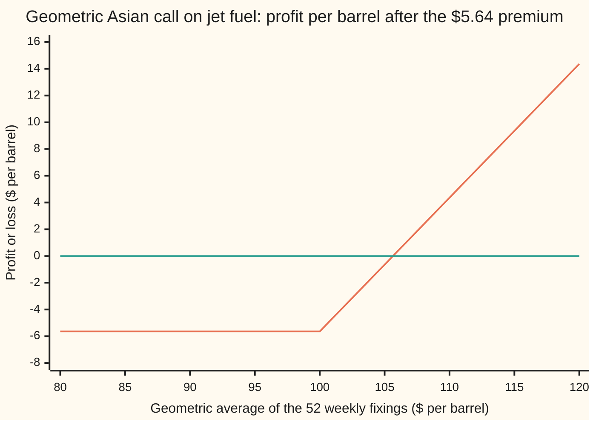
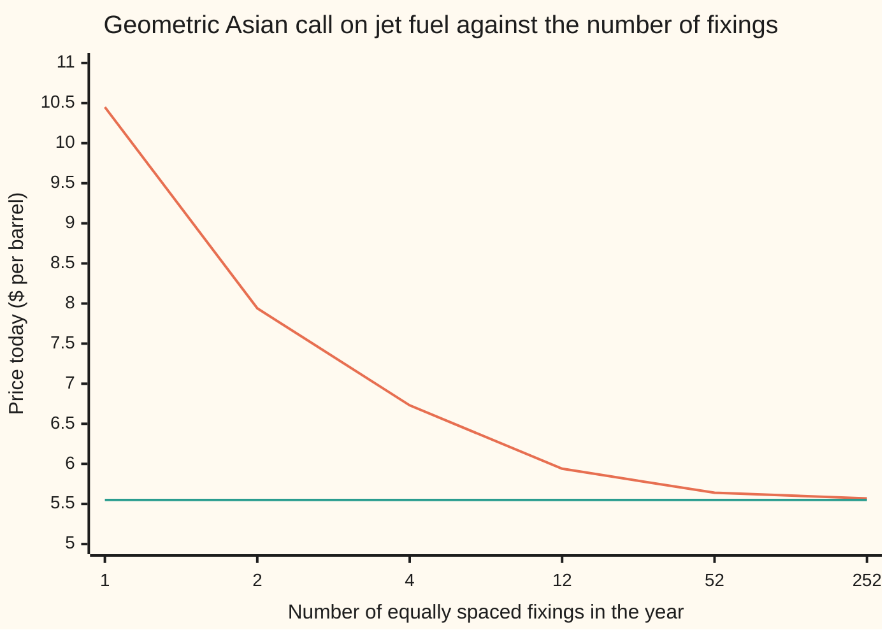

# Kemna-Vorst: the Asian option with an exact price, because a geometric average of lognormals is lognormal

Financial mathematics → Averages - commodity swaps and Asian options → Averaging a futures strip → Kemna-Vorst

---

## General Overview

An airline burns jet fuel every week of the year. Jet fuel costs $100 a barrel today. The airline's budget cares about the average price it pays over the next twelve months, not the price on any one day. So its hedge is an option on the average: at the end of the year it receives, per barrel, whatever the year's average price of jet fuel came to above $100. A contract that settles on an average is an **Asian option**.

The contract reads the price once a week, 52 times. Each reading is called a **fixing**. The price of jet fuel for delivery in any given week is already quoted today, on the futures market: a **futures price** is the price agreed now for delivery at a later date, and the list of them, date by date, is the **futures curve**. In this example the curve rises 5 percent a year, from $100 for delivery now to $105.13 for delivery in a year. That is the full cost of carry: money tied up in stored fuel earns nothing, so a barrel promised later costs the bank interest more.

An ordinary one-year call on the last week's price costs $10.45. A call on the average costs about half that, because an average of 52 readings moves less than one reading. If the average is the ordinary one (add the prices, divide by 52), no formula prices it exactly. If it is the **geometric average** (multiply the 52 prices and take the 52nd root), one formula does: Kemna and Vorst's, from 1990. The answer for this contract is **$5.64**. With fixings spread continuously over the year it would be $5.55. With a single fixing at the end, it is the plain call again, $10.45.

The equity version of this result, for a share with a dividend yield, is on [geometric-asian-kemna-vorst](../17-Averages%2C%20choosers%2C%20compounds%20and%20forward-starts/01-geometric-asian-kemna-vorst.md): there it is Black-Scholes with the volatility divided by √3 and a stand-in yield. A commodity desk has no spot-and-yield pair to feed it. It has a futures curve, and each fixing belongs to a different point on that curve. This card rewrites the result in the desk's inputs: the futures price for each fixing date, fed to Black-76, the call formula for an option on a futures price.

**Each fixing is lognormal around its own futures price, all driven by one random path, so the log of their geometric average is normal and the average is lognormal; its call is Black-76 fed two doctored inputs: the forward of the average, the curve's geometric mean shaved by a small haircut, and the volatility of the average, the futures volatility σ times the square root of (n+1)(2n+1)/6n^2, where n is the number of fixings.**

**What kind of fact this is:** a theorem inside the one-factor lognormal model of the futures curve, proved on this card in Why it works; the model itself is an assumption about markets, not a law.

### The picture: what the airline walks away with

The geometric average of the 52 fixings runs left to right. Profit per barrel at the end of the year, after the $5.64 premium, runs up the page. The flat line is break-even.



First line: profit after the premium, flat at −$5.64 until the average passes the $100 strike, then rising a dollar per dollar. Second line: zero. The hockey stick is a plain call's; only the horizontal axis has changed, from one price to an average of 52.

---

## The formula

Notation first. The fixings fall on the dates $t_i = iT/n$ for i = 1 to n: n equal steps, the last on the expiry date T, today not counted. The futures price quoted today for delivery at date t is written $F(0,t)$. The geometric average of the fixings is $G$. The call pays $\max(G - K, 0)$ at T.

The price is Black-76 on the average:

$$C_G = e^{-rT}\left[\,F_G\,N(d_1) - K\,N(d_2)\,\right], \qquad P_G = e^{-rT}\left[\,K\,N(-d_2) - F_G\,N(-d_1)\,\right]$$

$$d_1 = \frac{\ln(F_G/K) + \tfrac12\sigma_G^2 T}{\sigma_G\sqrt{T}}, \qquad d_2 = d_1 - \sigma_G\sqrt{T}$$

with the two doctored inputs

$$\sigma_G = \sigma\sqrt{\frac{(n+1)(2n+1)}{6n^2}}, \qquad F_G = \Big(F(0,t_1)\,F(0,t_2)\cdots F(0,t_n)\Big)^{1/n}\, e^{-\frac12\left(\sigma^2\bar t - \sigma_G^2 T\right)}, \qquad \bar t = \frac{(n+1)T}{2n}.$$

**Read it aloud:** the call on the average is a plain futures call on a pretend futures price, whose level is the geometric mean of the curve at the fixing dates, shaved slightly, and whose volatility is the commodity's volatility cut by the averaging.

| Symbol | Plain meaning | In our example | Push it up and the answer… |
| --- | --- | --- | --- |
| $C_G$, $P_G$ | today's price of the call and the put on the geometric average | $5.64; $3.51 | is the answer |
| $G$, $n$, $t_i$, $X_i$ | the geometric average of the fixings; how many fixings; the date of the i-th; the i-th fixing | weekly: n = 52, $t_i$ = i/52 | more fixings: call falls toward $5.55 |
| $F(0,t)$, $S_0$, $c$ | today's futures price for delivery at t, the curve; its level for delivery now; its slope, a rate per year | 100 e^(0.05t): $100 now, $105.13 at T | the whole curve up, or c up: call rises |
| $K$ | the strike the average is compared with | $100 | call falls |
| $T$, $\bar t$ | expiry, the last fixing, in years; the centre of the fixing dates | 1; 0.5096 | — |
| $r$ | the bank rate, continuously compounded; $e^{-rT}$ discounts a dollar paid at T | 5%; 0.9512 | curve held fixed: call falls a little |
| $\sigma$ | volatility of the futures prices: the spread of their yearly log change | 20% | call rises |
| $\sigma_G$ | volatility of the average | 0.1171 | is the volatility the option sees |
| $F_G$ | forward of the average: what G is worth, delivered at T | $102.24 | call rises |
| $d_1$, $d_2$ | distances of the strike from the centre of ln G, in its own standard deviations | 0.2477; 0.1305 | — |
| $N$ | the bell-curve area to the left of a point | N(d1) 0.5978, N(d2) 0.5519 | — |
| $W$, $W_t$ | the one random path that moves the whole curve; its value at time t, normal with mean 0 and variance t | one path per simulated year | — |

In words, $d_2$ counts how far ln G is expected to land above ln K, in units of the spread (standard deviation) of ln G, and $d_1$ sits one spread further. The factor $\bar t$ is the plain average of the fixing dates, and the haircut $e^{-\frac12(\sigma^2\bar t - \sigma_G^2 T)}$ is 0.9967 here.

When the curve rises at a steady rate c, as $F(0,t) = S_0 e^{ct}$, the geometric mean of the forwards is the forward at the centre date, $F(0,\bar t) = S_0 e^{c\bar t}$: $102.58 here. Then $F_G$ = 102.58 × 0.9967 = $102.24.

### When it holds

- **One volatility for every futures contract that fixes.** Near-dated energy futures move more than far-dated ones. If each fixing has its own volatility, the variance sum in Step 3 takes each pair's product of volatilities, and the single σ misprices the average by roughly vega (price change per point of volatility) times the error.
- **One random factor moves the whole curve.** The formula assumes every point of the curve rises and falls together. When the fixings read different delivery months that are imperfectly correlated, the true variance of the average is smaller and this price is too high.
- **Lognormal futures prices, centred on today's curve.** Entering a futures contract costs nothing, so in the pricing world its price has no drift. Jumps or a skewed smile break the lognormal law and the formula with it.
- **The averaging starts today and pays at T.** A contract already part-way through has fixings banked; that changes both inputs, and it is the subject of [asian-greeks-and-the-running-average](04-asian-greeks-and-the-running-average.md). A payment a few days after the last fixing discounts over those extra days.
- **The average is geometric.** Traded contracts average arithmetically. That average is not lognormal, and this price is only a floor under it.

---

## Why it works

### Step 0: logs turn the average into a sum of normals

The log of a geometric average is the ordinary average of the logs: the product of 52 prices becomes a sum of 52 log prices, divided by 52. If each log price is bell-curved (normally distributed), and all of them are built from the same bell-curved shocks, then any weighted sum of them is bell-curved. So ln G is normal and G is lognormal, the same kind of quantity as a single futures price at expiry. Black-76 prices a call on any lognormal quantity once its forward and its total variance are known. The proof is finding those two numbers.

### Step 1: each fixing is lognormal around its own futures price

A futures contract costs nothing to enter. In the pricing world (the risk-neutral world of [options-on-commodity-futures](../26-Options%20on%20commodity%20futures%20and%20spreads/01-options-on-commodity-futures.md)) a price that costs nothing to hold has no expected gain, so today's futures price is the expected price at delivery. The fixing at $t_i$ is the price for delivery that week, read that week: it is the futures contract for date $t_i$, at its own expiry.

With one Brownian path $W$ (the random walk of [brownian-motion](../../11-Stochastic%20processes%20and%20calculus/05-Brownian%20Motion/01-brownian-motion.md), with $W_t$ normal with mean 0 and variance t) moving the whole curve, the fixing is

$$X_i = F(0,t_i)\,e^{\sigma W_{t_i} - \frac12\sigma^2 t_i}.$$

The −σ^2 t_i/2 is the lognormal correction: a lognormal's mean is the exponential of its log's mean plus half its log's variance ([lognormal-distribution](../../09-Probability%20and%20statistics/04-Continuous%20Distributions/06-lognormal-distribution.md)), so subtracting half the variance keeps the expected fixing at $F(0,t_i)$.

### Step 2: the centre of ln G sits at the centre of the dates

Average the logs of the n fixings. The random part has mean zero. What remains is

$$\text{centre of } \ln G = \frac1n\sum_{i=1}^n \ln F(0,t_i) \;-\; \tfrac12\sigma^2\,\bar t .$$

The first term is the log of the geometric mean of the curve at the fixing dates. The second collects the corrections, and averaging $t_i = iT/n$ gives $\bar t = (n+1)T/(2n)$, using 1 + 2 + … + n = n(n+1)/2. For weekly fixings $\bar t$ = 0.5096: just past mid-year, because today is not a fixing and the last day is.

### Step 3: the variance of ln G is about a third of the last fixing's

Cut the year into n weeks and let the shock in week k be the change in W over that week. That shock sits inside every fixing from week k on: n − k + 1 of them. So it enters the average of the logs with weight (n − k + 1)/n. Early shocks count almost fully; the last week's shock counts once in 52.

Shocks in different weeks are independent, so their variances add, each scaled by the square of its weight. The weights squared add up to $(1^2 + 2^2 + \dots + n^2)/n^2$, and $1^2 + \dots + n^2 = n(n+1)(2n+1)/6$. Each week's shock has variance σ^2 T/n. The total is

$$\operatorname{Var}(\ln G) = \sigma^2 T\,\frac{(n+1)(2n+1)}{6n^2} = \sigma_G^2\,T .$$

For 52 fixings the fraction is 0.3430, so the variance of ln G is 0.013720 and $\sigma_G$ = 0.20 × √0.3430 = 0.1171. As n grows the fraction falls to 2n^2/6n^2 = 1/3. This step is the equity card's, unchanged: the curve moves the centre, never the variance. The code's second road redoes it as a brute-force sum of σ^2 min(t_i, t_j) over all 52 × 52 pairs of dates.

### Step 4: the forward of the average, with its haircut

Black-76 needs the forward of G: its expected value in the pricing world. A lognormal's mean is the exponential of its log's centre plus half its log's variance:

$$F_G = \exp\!\Big(\text{centre of }\ln G + \tfrac12\sigma_G^2 T\Big) = \Big(\prod_i F(0,t_i)\Big)^{1/n}\,e^{-\frac12(\sigma^2\bar t - \sigma_G^2 T)} .$$

The haircut is below 1 because $\sigma^2\bar t$ exceeds $\sigma_G^2 T$: each fixing carries its own full variance, but the average keeps only part of it, so it loses part of the lift that variance gives a lognormal's mean. For jet fuel the geometric mean of the curve is $102.58 and the haircut is 0.9967, so $F_G$ = $102.24.

### Step 5: price it with Black-76

G is now a lognormal quantity with forward $F_G$ and total log-variance $\sigma_G^2 T$, paid at T. Black-76 prices a call on exactly such a quantity: split the payoff into "receive G" and "pay K", each on the event that G ends above K. The cash half is $K e^{-rT} N(d_2)$. Counting in units of G shifts the bell curve by one spread and gives $F_G e^{-rT} N(d_1)$. The put follows the same way, and the two obey parity: $C_G - P_G = e^{-rT}(F_G - K)$. Nothing is approximated. Given the model, the price is exact.

### Step 6: the two ends of the ladder

With one fixing, $\bar t = T$, the fraction is 1, the haircut is 1 and $F_G = F(0,T)$ = $105.13: Black-76 on the one-year futures, $10.45. As the fixings multiply, $\bar t \to T/2$ and the fraction tends to 1/3, so $\sigma_G \to \sigma/\sqrt{3}$ and, on the steadily rising curve, $F_G \to F(0, T/2)\,e^{-\sigma^2 T/12}$, which gives $5.55.



First line: the n-fixing price, from the plain call's $10.45 at one fixing, through $5.94 monthly and $5.64 weekly, to $5.57 on 252 daily fixings. Second line: the continuous price, $5.55, the floor they approach.

On a curve that rises at the rate r, $F(0,t) = S_0 e^{rt}$, these inputs are exactly the equity card's formula with no dividend, and its continuous price with the yield set to zero is this card's $5.55. Pricing by simulation, as on [monte-carlo-pricing](../06-Numerical%20Methods%20for%20Pricing/01-monte-carlo-pricing.md), is the other route, and the code takes it.

---

## Worked numbers, by hand

Jet fuel: curve $100 e^{0.05t}$, K = $100, r = 5%, σ = 20%, T = 1 year, 52 weekly fixings.

| Step | Arithmetic | Value |
| --- | --- | --- |
| centre of the dates, $\bar t$ | 53 / 104 | 0.5096 |
| variance fraction | 53 × 105 / (6 × 52^2) | 0.3430 |
| $\sigma_G$ | 0.20 × √0.3430 | 0.1171 |
| geometric mean of the curve | 100 × e^(0.05 × 0.5096) | $102.58 |
| haircut | e^(−(0.04 × 0.5096 − 0.1171^2) / 2) | 0.9967 |
| $F_G$ | 102.58 × 0.9967 | $102.24 |
| $d_1$ | (ln 1.0224 + 0.1171^2 / 2) / 0.1171 | 0.2477 |
| $d_2$ | 0.2477 − 0.1171 | 0.1305 |
| N(d1), N(d2) | bell-curve table | 0.5978, 0.5519 |
| discount | e^(−0.05) | 0.9512 |
| average half | 0.9512 × 102.24 × 0.5978 | $58.14 |
| cash half | 0.9512 × 100 × 0.5519 | $52.50 |
| **premium** | 58.14 − 52.50 | **$5.64** |

A year of protection on the airline's weekly average costs $5.64 a barrel, against $10.45 for protection on the last week alone. The cut comes from both inputs: a volatility of 11.7 percent instead of 20, and a forward of $102.24 instead of the $105.13 one-year futures. The put on the same average costs $3.51.

### What breaks if you drop a piece

Same contract, right answer $5.64. Every wrong number is printed by both checks.

| Mistake | Comes out at | What went wrong |
| --- | --- | --- |
| Keep the raw 20% volatility | $8.77 | The average carries a third of the variance of one fixing, not all of it |
| Use the continuous σ/√3 formula on the weekly contract | $5.55 | Fifty-two readings are jumpier than a continuum; monthly the gap is $5.55 against $5.94 |
| Use the swap price, the plain average of the forwards, as $F_G$ | $5.84 | $102.59 is the forward of the arithmetic average; the geometric one is $102.24 |
| The fixings read one futures contract, whose price is flat at $100, but the curve is taken to rise at 5% | $5.64 (right: $4.28) | A single futures contract has no drift; each fixing's forward is $100 |

### The Greeks

Sensitivities by bumping the formula. Delta here moves the whole curve with today's price $S_0$; rho moves the bank rate with the futures prices held still. How these change once fixings are banked is on [asian-greeks-and-the-running-average](04-asian-greeks-and-the-running-average.md).

| Greek | Plain meaning | Value |
| --- | --- | --- |
| delta | dollars gained per $1 rise in the whole curve; equals e^(−rT) N(d1) F_G / S_0 | 0.5814 |
| gamma | change in delta per $1 rise in the curve | 0.0321 |
| vega | dollars per one point of futures volatility | 0.2010 |
| rho | dollars per one point of the bank rate, curve held | −0.0564 |

Rho is negative and small: with the futures prices given, the rate only discounts the payoff, so a point on the rate costs about one year's discounting of the $5.64.

---

## How the futures curve moves it

The same 52 weekly fixings, the same volatility, the same strike. Only the shape of the curve changes.

| Curve, $F(0,t)$ | What it means | Geometric Asian call |
| --- | --- | --- |
| $100 e^{0.05t}$, contango at the bank rate | fuel for later delivery costs more: full cost of carry | $5.64 |
| flat at $100 | every fixing reads one futures contract, or storage and yield cancel the rate | $4.28 |
| $100 e^{-0.05t}$, backwardation | fuel for later delivery costs less: a scarcity premium on prompt barrels | $3.16 |

The equity habit is to feed a spot price and let it grow at the rate less a yield. A commodity desk reads the curve instead, date by date, because the curve is the market's price for each fixing. The same spot of $100 gives $5.64 or $3.16 depending on the curve.

---

## Code, from first principles, and it actually runs

Both programs price the weekly contract by four roads. Road 1 is the closed form: the two doctored inputs, then Black-76. Road 2 builds the law of ln G fixing by fixing from the curve: the centre by summing ln F(0, t_i) − σ^2 t_i/2 over the 52 dates, the variance by summing σ^2 min(t_i, t_j) over all 52 × 52 pairs, then the payoff averaged over that bell curve by Simpson's rule, with no 1/2, no fraction formula, no d1 and no d2. Road 3 simulates 100,000 years of one Brownian path read weekly, and forms each fixing from the curve. Road 4 prices the put by Simpson, against the closed form and against parity. The same paths give the arithmetic average, and a count of paths where it fell below the geometric one. The normal CDF is a written-out series; the random numbers come from splitmix64, a short integer scrambler, turned into normals by the Box-Muller transform.

### Python

```python
# Kemna-Vorst on a commodity: the geometric Asian call on weekly jet fuel fixings, priced
# from the futures curve.  Standard library only.  Nothing imported knows the answer: the normal
# CDF is a series written out, the integral is Simpson's rule, the random numbers are
# splitmix64 + Box-Muller, and the variance of ln G is a brute-force sum over the fixing dates.
from math import log, sqrt, exp, cos, sin, pi

def phi(x): return exp(-0.5 * x * x) / sqrt(2.0 * pi)            # bell-curve height
def N(x):                                                        # bell-curve area left of x
    if x < -9.0: return 0.0
    if x > 9.0: return 1.0
    term = total = x; k = 1
    while abs(term) > 1e-17 * abs(total):
        k += 2; term *= x * x / k; total += term
    return 0.5 + phi(x) * total

def black76(F, K, r, sig, T, put=False):                         # Black-76 on a forward F
    d1 = (log(F / K) + 0.5 * sig * sig * T) / (sig * sqrt(T)); d2 = d1 - sig * sqrt(T)
    if put: return exp(-r * T) * (K * N(-d2) - F * N(-d1))
    return exp(-r * T) * (F * N(d1) - K * N(d2))

def kv_inputs(S0, c, sig, T, n):     # road 1: the two doctored inputs, closed form, curve S0 e^(c t)
    tbar = T * (n + 1) / (2.0 * n)                               # centre of the fixing dates
    frac = (n + 1) * (2 * n + 1) / (6.0 * n * n)                 # variance fraction
    FG = S0 * exp(c * tbar) * exp(-0.5 * sig * sig * (tbar - frac * T))
    return FG, sig * sqrt(frac)

def kv(S0, K, r, c, sig, T, n, put=False):
    FG, sG = kv_inputs(S0, c, sig, T, n)
    return black76(FG, K, r, sG, T, put)

def kv_cont(S0, K, r, c, sig, T):                                # continuous limit: sigma/sqrt 3
    return black76(S0 * exp(0.5 * c * T - sig * sig * T / 12.0), K, r, sig / sqrt(3.0), T)

def simpson(m, v, payoff, r, T, panels=200000):                  # E[payoff(G)], ln G ~ normal(m, v)
    a, b = -10.0, 10.0; h = (b - a) / panels
    f = lambda z: payoff(exp(m + sqrt(v) * z)) * phi(z)
    tot = f(a) + f(b)
    for i in range(1, panels):
        tot += (4 if i % 2 else 2) * f(a + i * h)
    return exp(-r * T) * tot * h / 3.0

S0, K, r, c, sig, T, n = 100.0, 100.0, 0.05, 0.05, 0.20, 1.0, 52
fwd = lambda t: S0 * exp(c * t)                                  # the futures curve today
FG, sG = kv_inputs(S0, c, sig, T, n)
tbar, frac = T * (n + 1) / (2.0 * n), (n + 1) * (2 * n + 1) / (6.0 * n * n)
d1 = (log(FG / K) + 0.5 * sG * sG * T) / (sG * sqrt(T)); d2 = d1 - sG * sqrt(T)
C, P = kv(S0, K, r, c, sig, T, n), kv(S0, K, r, c, sig, T, n, put=True)

# road 2: the law of ln G fixing by fixing, from the curve: no 1/2, no 1/3, no d1 or d2
ts = [T * i / n for i in range(1, n + 1)]
m2 = sum(log(fwd(t)) - 0.5 * sig * sig * t for t in ts) / n
v2 = sig * sig * sum(min(x, y) for x in ts for y in ts) / n ** 2
C2 = simpson(m2, v2, lambda G: max(G - K, 0.0), r, T)
P2 = simpson(m2, v2, lambda G: max(K - G, 0.0), r, T)

# road 3: simulate the one Brownian path that moves every futures price, read it weekly
MASK = (1 << 64) - 1
state = 20260927
def uniform():
    global state
    state = (state + 0x9E3779B97F4A7C15) & MASK
    z = state
    z = ((z ^ (z >> 30)) * 0xBF58476D1CE4E5B9) & MASK
    z = ((z ^ (z >> 27)) * 0x94D049BB133111EB) & MASK
    return (((z ^ (z >> 31)) >> 11) + 1) * 2.0 ** -53
paths, h = 100000, T / n
acc = [0.0, 0.0, 0.0, 0.0]; am_below_gm = 0; disc = exp(-r * T)
for _ in range(paths):
    w = 0.0; sum_log = 0.0; sum_px = 0.0
    for i in range(0, n, 2):
        rad = sqrt(-2.0 * log(uniform())); ang = 2.0 * pi * uniform()
        for zz, t in ((rad * cos(ang), ts[i]), (rad * sin(ang), ts[i + 1])):
            w += sqrt(h) * zz
            x = log(fwd(t)) - 0.5 * sig * sig * t + sig * w      # fixing = F(0,t) e^(sig W - sig^2 t/2)
            sum_log += x; sum_px += exp(x)
    g, a = exp(sum_log / n), sum_px / n
    am_below_gm += a < g
    pg, pa = disc * max(g - K, 0.0), disc * max(a - K, 0.0)
    acc[0] += pg; acc[1] += pg * pg; acc[2] += pa; acc[3] += pa * pa
mean_se = lambda s1, s2: (s1 / paths, sqrt((s2 / paths - (s1 / paths) ** 2) / paths))
mc_g, mc_a = mean_se(acc[0], acc[1]), mean_se(acc[2], acc[3])

# Greeks: the whole curve moves with the prompt price S0; rho holds the curve still
bump = lambda **kw: kv(**{**dict(S0=S0, K=K, r=r, c=c, sig=sig, T=T, n=n), **kw})
delta = (bump(S0=S0 + 0.01) - bump(S0=S0 - 0.01)) / 0.02
gamma = (bump(S0=S0 + 0.5) - 2 * C + bump(S0=S0 - 0.5)) / 0.25
vega = (bump(sig=sig + 1e-4) - bump(sig=sig - 1e-4)) / 2e-4 / 100
rho = (bump(r=r + 1e-4) - bump(r=r - 1e-4)) / 2e-4 / 100
swap = sum(fwd(t) for t in ts) / n                               # arithmetic mean of the forwards

rows = [("forward for the last fixing, F(0,T)", fwd(T)), ("centre of the fixings, tbar", tbar),
        ("variance fraction (n+1)(2n+1)/6n^2", frac), ("sigma_G = sigma sqrt(fraction)", sG),
        ("F(0,tbar), geometric mean of forwards", fwd(tbar)), ("haircut e^(-sig^2(tbar-frac T)/2)", FG / fwd(tbar)),
        ("F_G, forward of the average", FG), ("d1", d1), ("d2", d2), ("N(d1)", N(d1)), ("N(d2)", N(d2)), ("discount e^-rT", disc),
        ("average half e^-rT F_G N(d1)", disc * FG * N(d1)), ("cash half e^-rT K N(d2)", disc * K * N(d2)),
        ("1 closed form, 52 weekly fixings", C), ("2 centre of ln G, summed", m2), ("  ln F_G - sigma_G^2 T/2", log(FG) - 0.5 * sG * sG * T),
        ("2 var ln G, 52x52 min sum", v2), ("  sigma_G^2 T", sG * sG * T), ("2 Simpson over that law", C2),
        ("3 simulation, 100000 paths", mc_g[0]), ("  standard error", mc_g[1]),
        ("4 put, closed form", P), ("4 put, Simpson", P2), ("  C - P, Simpson", C2 - P2), ("  e^-rT (F_G - K)", disc * (FG - K)),
        ("arithmetic average, same paths", mc_a[0]), ("  paths where AM < GM", am_below_gm)]
rows += [(f"ladder: {m} fixings", kv(S0, K, r, c, sig, T, m)) for m in (1, 2, 4, 12, 52, 252, 1000000)]
rows += [("continuous: sigma/sqrt 3", kv_cont(S0, K, r, c, sig, T)),
         ("curve flat: one futures contract", kv(S0, K, r, 0.0, sig, T, n)),
         ("curve backwardated, c = -5%", kv(S0, K, r, -0.05, sig, T, n)),
         ("delta by bump", delta), ("  e^-rT N(d1) F_G/S0", disc * N(d1) * FG / S0),
         ("gamma by bump", gamma), ("vega per vol point", vega), ("rho per rate point, curve held", rho),
         ("swap price, mean of the forwards", swap),
         ("wrong: raw sigma, F_G kept", black76(FG, K, r, sig, T)),
         ("wrong: swap price as F_G", black76(swap, K, r, sG, T)),
         ("try: sigma = 0.40", kv(S0, K, r, c, 0.40, T, n)), ("try: K = 110", kv(S0, 110.0, r, c, sig, T, n)),
         ("try: one month, 21 daily fixings", kv(S0, K, r, c, sig, 1.0 / 12, 21))]
for name, v in rows:
    print(f"{name:<40} {v:>12.6f}" if isinstance(v, float) else f"{name:<40} {v:>12}")
grid = [80.0 + 5.0 * i for i in range(9)]
print("chart, G at expiry " + " ".join(f"{x:6.0f}" for x in grid))
print("chart, profit      " + " ".join(f"{max(x - K, 0.0) - C:6.2f}" for x in grid))
ladder = [kv(S0, K, r, c, sig, T, m) for m in (1, 2, 4, 12, 52, 252)] + [kv_cont(S0, K, r, c, sig, T)]
print("chart, fixings     " + " ".join(f"{m:>6}" for m in (1, 2, 4, 12, 52, 252, "cont")))
print("chart, price       " + " ".join(f"{v:6.2f}" for v in ladder))

assert abs(C2 - C) < 1e-7, "fixing-by-fixing law of ln G must reproduce the closed form"
assert abs(mc_g[0] - C) < 3 * mc_g[1], "simulation within 3 standard errors of the formula"
assert abs((C2 - P2) - disc * (FG - K)) < 1e-7, "parity: Simpson call and put against the closed F_G"
assert abs(P2 - P) < 1e-7, "put: Simpson against the closed form"
bs1 = (log(S0 / K) + (r + 0.5 * sig * sig) * T) / (sig * sqrt(T))          # spot-form Black-Scholes, no yield
assert abs(kv(S0, K, r, c, sig, T, 1) - (S0 * N(bs1) - K * disc * N(bs1 - sig * sqrt(T)))) < 1e-10, "one fixing is the plain call"
assert abs(kv(S0, K, r, c, sig, T, 1000000) - kv_cont(S0, K, r, c, sig, T)) < 1e-5, "ladder tends to sigma/sqrt 3"
assert abs(delta - disc * N(d1) * FG / S0) < 1e-6, "bumped delta vs e^-rT N(d1) F_G/S0"
print("ALL CHECKS PASS")
```

**Ran 2026-09-28 on macOS, Python 3.14.6, standard library only. All checks passed. Output, pasted from the run:**

```
forward for the last fixing, F(0,T)        105.127110
centre of the fixings, tbar                  0.509615
variance fraction (n+1)(2n+1)/6n^2           0.343010
sigma_G = sigma sqrt(fraction)               0.117134
F(0,tbar), geometric mean of forwards      102.580818
haircut e^(-sig^2(tbar-frac T)/2)            0.996673
F_G, forward of the average                102.239577
d1                                           0.247655
d2                                           0.130521
N(d1)                                        0.597799
N(d2)                                        0.551923
discount e^-rT                               0.951229
average half e^-rT F_G N(d1)                58.137957
cash half e^-rT K N(d2)                     52.500526
1 closed form, 52 weekly fixings             5.637432
2 centre of ln G, summed                     4.620459
  ln F_G - sigma_G^2 T/2                     4.620459
2 var ln G, 52x52 min sum                    0.013720
  sigma_G^2 T                                0.013720
2 Simpson over that law                      5.637432
3 simulation, 100000 paths                   5.638831
  standard error                             0.024692
4 put, closed form                           3.507080
4 put, Simpson                               3.507080
  C - P, Simpson                             2.130352
  e^-rT (F_G - K)                            2.130352
arithmetic average, same paths               5.854524
  paths where AM < GM                               0
ladder: 1 fixings                           10.450584
ladder: 2 fixings                            7.943359
ladder: 4 fixings                            6.733487
ladder: 12 fixings                           5.940200
ladder: 52 fixings                           5.637432
ladder: 252 fixings                          5.565509
ladder: 1000000 fixings                      5.546823
continuous: sigma/sqrt 3                     5.546819
curve flat: one futures contract             4.278721
curve backwardated, c = -5%                  3.160285
delta by bump                                0.581380
  e^-rT N(d1) F_G/S0                         0.581380
gamma by bump                                0.032119
vega per vol point                           0.200996
rho per rate point, curve held              -0.056374
swap price, mean of the forwards           102.591500
wrong: raw sigma, F_G kept                   8.773882
wrong: swap price as F_G                     5.839447
try: sigma = 0.40                            9.517543
try: K = 110                                 1.912747
try: one month, 21 daily fixings             1.469777
chart, G at expiry     80     85     90     95    100    105    110    115    120
chart, profit       -5.64  -5.64  -5.64  -5.64  -5.64  -0.64   4.36   9.36  14.36
chart, fixings          1      2      4     12     52    252   cont
chart, price        10.45   7.94   6.73   5.94   5.64   5.57   5.55
ALL CHECKS PASS
```

### Rust

```rust
// Kemna-Vorst on a commodity -- the same check as the Python, in Rust.  std only.
// Normal CDF as a written-out series, Simpson's rule, a brute-force sum over the fixing dates,
// splitmix64 + Box-Muller for the random numbers.
// Compile: rustc --edition 2021 -O kemna_vorst_geometric_asian_check.rs -o /tmp/kvga
use std::f64::consts::PI;

fn phi(x: f64) -> f64 { (-0.5 * x * x).exp() / (2.0 * PI).sqrt() }
fn n_cdf(x: f64) -> f64 {
    if x < -9.0 { return 0.0; }
    if x > 9.0 { return 1.0; }
    let (mut term, mut total, mut k) = (x, x, 1.0);
    while term.abs() > 1e-17 * total.abs() {
        k += 2.0; term *= x * x / k; total += term;
    }
    0.5 + phi(x) * total
}
fn black76(f: f64, k: f64, r: f64, sig: f64, t: f64, put: bool) -> f64 {
    let d1 = ((f / k).ln() + 0.5 * sig * sig * t) / (sig * t.sqrt());
    let d2 = d1 - sig * t.sqrt();
    if put { return (-r * t).exp() * (k * n_cdf(-d2) - f * n_cdf(-d1)); }
    (-r * t).exp() * (f * n_cdf(d1) - k * n_cdf(d2))
}
// road 1: the two doctored inputs in closed form, for the curve S0 e^(c t)
fn kv_inputs(s0: f64, c: f64, sig: f64, t: f64, n: f64) -> (f64, f64) {
    let tbar = t * (n + 1.0) / (2.0 * n);
    let frac = (n + 1.0) * (2.0 * n + 1.0) / (6.0 * n * n);
    let fg = s0 * (c * tbar).exp() * (-0.5 * sig * sig * (tbar - frac * t)).exp();
    (fg, sig * frac.sqrt())
}
fn kv(s0: f64, k: f64, r: f64, c: f64, sig: f64, t: f64, n: f64, put: bool) -> f64 {
    let (fg, sg) = kv_inputs(s0, c, sig, t, n);
    black76(fg, k, r, sg, t, put)
}
fn kv_cont(s0: f64, k: f64, r: f64, c: f64, sig: f64, t: f64) -> f64 {
    black76(s0 * (0.5 * c * t - sig * sig * t / 12.0).exp(), k, r, sig / 3f64.sqrt(), t, false)
}
fn simpson(m: f64, v: f64, payoff: &dyn Fn(f64) -> f64, r: f64, t: f64) -> f64 {
    let (a, b, panels) = (-10.0, 10.0, 200000);
    let h = (b - a) / panels as f64;
    let f = |z: f64| payoff((m + v.sqrt() * z).exp()) * phi(z);
    let mut tot = f(a) + f(b);
    for i in 1..panels { tot += (if i % 2 == 1 { 4.0 } else { 2.0 }) * f(a + i as f64 * h); }
    (-r * t).exp() * tot * h / 3.0
}
struct Rng(u64);
impl Rng {
    fn uniform(&mut self) -> f64 {
        self.0 = self.0.wrapping_add(0x9E3779B97F4A7C15);
        let mut z = self.0;
        z = (z ^ (z >> 30)).wrapping_mul(0xBF58476D1CE4E5B9);
        z = (z ^ (z >> 27)).wrapping_mul(0x94D049BB133111EB);
        (((z ^ (z >> 31)) >> 11) + 1) as f64 * 2f64.powi(-53)
    }
}

fn main() {
    let (s0, k, r, c, sig, t, n) = (100.0f64, 100.0f64, 0.05f64, 0.05f64, 0.20f64, 1.0f64, 52usize);
    let nf = n as f64;
    let fwd = |tt: f64| s0 * (c * tt).exp();
    let (fg, sg) = kv_inputs(s0, c, sig, t, nf);
    let tbar = t * (nf + 1.0) / (2.0 * nf);
    let frac = (nf + 1.0) * (2.0 * nf + 1.0) / (6.0 * nf * nf);
    let d1 = ((fg / k).ln() + 0.5 * sg * sg * t) / (sg * t.sqrt());
    let d2 = d1 - sg * t.sqrt();
    let (cc, pp) = (kv(s0, k, r, c, sig, t, nf, false), kv(s0, k, r, c, sig, t, nf, true));

    // road 2: the law of ln G fixing by fixing, from the curve
    let ts: Vec<f64> = (1..=n).map(|i| t * i as f64 / nf).collect();
    let m2 = ts.iter().map(|&x| fwd(x).ln() - 0.5 * sig * sig * x).sum::<f64>() / nf;
    let mut cov = 0.0;
    for x in &ts { for y in &ts { cov += x.min(*y); } }
    let v2 = sig * sig * cov / (nf * nf);
    let c2 = simpson(m2, v2, &|g: f64| (g - k).max(0.0), r, t);
    let p2 = simpson(m2, v2, &|g: f64| (k - g).max(0.0), r, t);

    // road 3: one Brownian path moves every futures price; read it weekly
    let mut rng = Rng(20260927);
    let (paths, h) = (100000usize, t / nf);
    let mut acc = [0.0f64; 4];
    let mut am_below_gm = 0usize;
    let disc = (-r * t).exp();
    for _ in 0..paths {
        let (mut w, mut sum_log, mut sum_px) = (0.0f64, 0.0f64, 0.0f64);
        let mut i = 0;
        while i < n {
            let rad = (-2.0 * rng.uniform().ln()).sqrt();
            let ang = 2.0 * PI * rng.uniform();
            for (zz, tt) in [(rad * ang.cos(), ts[i]), (rad * ang.sin(), ts[i + 1])] {
                w += h.sqrt() * zz;
                let x = fwd(tt).ln() - 0.5 * sig * sig * tt + sig * w;
                sum_log += x; sum_px += x.exp();
            }
            i += 2;
        }
        let (g, a) = ((sum_log / nf).exp(), sum_px / nf);
        if a < g { am_below_gm += 1; }
        let (pg, pa) = (disc * (g - k).max(0.0), disc * (a - k).max(0.0));
        acc[0] += pg; acc[1] += pg * pg; acc[2] += pa; acc[3] += pa * pa;
    }
    let pf = paths as f64;
    let mean_se = |s1: f64, s2: f64| (s1 / pf, ((s2 / pf - (s1 / pf).powi(2)) / pf).sqrt());
    let (mc_g, mc_a) = (mean_se(acc[0], acc[1]), mean_se(acc[2], acc[3]));

    // Greeks: the whole curve moves with S0; rho holds the curve still
    let bump = |s: f64, rr: f64, sg_: f64| kv(s, k, rr, c, sg_, t, nf, false);
    let delta = (bump(s0 + 0.01, r, sig) - bump(s0 - 0.01, r, sig)) / 0.02;
    let gamma = (bump(s0 + 0.5, r, sig) - 2.0 * cc + bump(s0 - 0.5, r, sig)) / 0.25;
    let vega = (bump(s0, r, sig + 1e-4) - bump(s0, r, sig - 1e-4)) / 2e-4 / 100.0;
    let rho = (bump(s0, r + 1e-4, sig) - bump(s0, r - 1e-4, sig)) / 2e-4 / 100.0;
    let swap = ts.iter().map(|&x| fwd(x)).sum::<f64>() / nf;

    let mut rows: Vec<(String, f64)> = vec![
        ("forward for the last fixing, F(0,T)".into(), fwd(t)), ("centre of the fixings, tbar".into(), tbar),
        ("variance fraction (n+1)(2n+1)/6n^2".into(), frac), ("sigma_G = sigma sqrt(fraction)".into(), sg),
        ("F(0,tbar), geometric mean of forwards".into(), fwd(tbar)), ("haircut e^(-sig^2(tbar-frac T)/2)".into(), fg / fwd(tbar)),
        ("F_G, forward of the average".into(), fg), ("d1".into(), d1), ("d2".into(), d2),
        ("N(d1)".into(), n_cdf(d1)), ("N(d2)".into(), n_cdf(d2)), ("discount e^-rT".into(), disc),
        ("average half e^-rT F_G N(d1)".into(), disc * fg * n_cdf(d1)), ("cash half e^-rT K N(d2)".into(), disc * k * n_cdf(d2)),
        ("1 closed form, 52 weekly fixings".into(), cc), ("2 centre of ln G, summed".into(), m2),
        ("  ln F_G - sigma_G^2 T/2".into(), fg.ln() - 0.5 * sg * sg * t),
        ("2 var ln G, 52x52 min sum".into(), v2), ("  sigma_G^2 T".into(), sg * sg * t), ("2 Simpson over that law".into(), c2),
        ("3 simulation, 100000 paths".into(), mc_g.0), ("  standard error".into(), mc_g.1),
        ("4 put, closed form".into(), pp), ("4 put, Simpson".into(), p2), ("  C - P, Simpson".into(), c2 - p2),
        ("  e^-rT (F_G - K)".into(), disc * (fg - k)),
        ("arithmetic average, same paths".into(), mc_a.0), ("  paths where AM < GM".into(), f64::NAN),
    ];
    for m in [1usize, 2, 4, 12, 52, 252, 1000000] { rows.push((format!("ladder: {} fixings", m), kv(s0, k, r, c, sig, t, m as f64, false))); }
    let tail: Vec<(&str, f64)> = vec![
        ("continuous: sigma/sqrt 3", kv_cont(s0, k, r, c, sig, t)),
        ("curve flat: one futures contract", kv(s0, k, r, 0.0, sig, t, nf, false)),
        ("curve backwardated, c = -5%", kv(s0, k, r, -0.05, sig, t, nf, false)),
        ("delta by bump", delta), ("  e^-rT N(d1) F_G/S0", disc * n_cdf(d1) * fg / s0),
        ("gamma by bump", gamma), ("vega per vol point", vega), ("rho per rate point, curve held", rho),
        ("swap price, mean of the forwards", swap),
        ("wrong: raw sigma, F_G kept", black76(fg, k, r, sig, t, false)),
        ("wrong: swap price as F_G", black76(swap, k, r, sg, t, false)),
        ("try: sigma = 0.40", kv(s0, k, r, c, 0.40, t, nf, false)), ("try: K = 110", kv(s0, 110.0, r, c, sig, t, nf, false)),
        ("try: one month, 21 daily fixings", kv(s0, k, r, c, sig, 1.0 / 12.0, 21.0, false)),
    ];
    for (name, v) in tail { rows.push((name.to_string(), v)); }
    for (name, v) in &rows {
        if v.is_nan() { println!("{:<40} {:>12}", name, am_below_gm); } else { println!("{:<40} {:>12.6}", name, v); }
    }
    let grid: Vec<f64> = (0..9).map(|i| 80.0 + 5.0 * i as f64).collect();
    println!("chart, G at expiry {}", grid.iter().map(|x| format!("{:6.0}", x)).collect::<Vec<_>>().join(" "));
    println!("chart, profit      {}", grid.iter().map(|x| format!("{:6.2}", (x - k).max(0.0) - cc)).collect::<Vec<_>>().join(" "));
    let mut ladder: Vec<f64> = [1.0, 2.0, 4.0, 12.0, 52.0, 252.0].iter().map(|&m| kv(s0, k, r, c, sig, t, m, false)).collect();
    ladder.push(kv_cont(s0, k, r, c, sig, t));
    println!("chart, fixings          1      2      4     12     52    252   cont");
    println!("chart, price       {}", ladder.iter().map(|v| format!("{:6.2}", v)).collect::<Vec<_>>().join(" "));

    assert!((c2 - cc).abs() < 1e-7, "fixing-by-fixing law of ln G must reproduce the closed form");
    assert!((mc_g.0 - cc).abs() < 3.0 * mc_g.1, "simulation within 3 standard errors of the formula");
    assert!(((c2 - p2) - disc * (fg - k)).abs() < 1e-7, "parity: Simpson call and put against the closed F_G");
    assert!((p2 - pp).abs() < 1e-7, "put: Simpson against the closed form");
    let bs1 = ((s0 / k).ln() + (r + 0.5 * sig * sig) * t) / (sig * t.sqrt()); // spot-form Black-Scholes, no yield
    assert!((kv(s0, k, r, c, sig, t, 1.0, false) - (s0 * n_cdf(bs1) - k * disc * n_cdf(bs1 - sig * t.sqrt()))).abs() < 1e-10, "one fixing is the plain call");
    assert!((kv(s0, k, r, c, sig, t, 1e6, false) - kv_cont(s0, k, r, c, sig, t)).abs() < 1e-5, "ladder tends to sigma/sqrt 3");
    assert!((delta - disc * n_cdf(d1) * fg / s0).abs() < 1e-6, "bumped delta vs e^-rT N(d1) F_G/S0");
    println!("ALL CHECKS PASS");
}
```

**Ran 2026-09-28 on macOS, rustc 1.98.1, no crates. All checks passed. Output, pasted from the run:**

```
forward for the last fixing, F(0,T)        105.127110
centre of the fixings, tbar                  0.509615
variance fraction (n+1)(2n+1)/6n^2           0.343010
sigma_G = sigma sqrt(fraction)               0.117134
F(0,tbar), geometric mean of forwards      102.580818
haircut e^(-sig^2(tbar-frac T)/2)            0.996673
F_G, forward of the average                102.239577
d1                                           0.247655
d2                                           0.130521
N(d1)                                        0.597799
N(d2)                                        0.551923
discount e^-rT                               0.951229
average half e^-rT F_G N(d1)                58.137957
cash half e^-rT K N(d2)                     52.500526
1 closed form, 52 weekly fixings             5.637432
2 centre of ln G, summed                     4.620459
  ln F_G - sigma_G^2 T/2                     4.620459
2 var ln G, 52x52 min sum                    0.013720
  sigma_G^2 T                                0.013720
2 Simpson over that law                      5.637432
3 simulation, 100000 paths                   5.638831
  standard error                             0.024692
4 put, closed form                           3.507080
4 put, Simpson                               3.507080
  C - P, Simpson                             2.130352
  e^-rT (F_G - K)                            2.130352
arithmetic average, same paths               5.854524
  paths where AM < GM                               0
ladder: 1 fixings                           10.450584
ladder: 2 fixings                            7.943359
ladder: 4 fixings                            6.733487
ladder: 12 fixings                           5.940200
ladder: 52 fixings                           5.637432
ladder: 252 fixings                          5.565509
ladder: 1000000 fixings                      5.546823
continuous: sigma/sqrt 3                     5.546819
curve flat: one futures contract             4.278721
curve backwardated, c = -5%                  3.160285
delta by bump                                0.581380
  e^-rT N(d1) F_G/S0                         0.581380
gamma by bump                                0.032119
vega per vol point                           0.200996
rho per rate point, curve held              -0.056374
swap price, mean of the forwards           102.591500
wrong: raw sigma, F_G kept                   8.773882
wrong: swap price as F_G                     5.839447
try: sigma = 0.40                            9.517543
try: K = 110                                 1.912747
try: one month, 21 daily fixings             1.469777
chart, G at expiry     80     85     90     95    100    105    110    115    120
chart, profit       -5.64  -5.64  -5.64  -5.64  -5.64  -0.64   4.36   9.36  14.36
chart, fixings          1      2      4     12     52    252   cont
chart, price        10.45   7.94   6.73   5.94   5.64   5.57   5.55
ALL CHECKS PASS
```

The two outputs agree line for line, simulation included: both languages run the same generator from the same seed. The simulation lands at $5.64 within one standard error; the arithmetic call on the same paths is $5.85, and on no path was the arithmetic average below the geometric one.

> [!TIP]
> **Try changing**
> Guess the direction first.
> - **Double the volatility.** Set `sig = 0.40` in `kv`. The call rises from $5.64 to **$9.52**.
> - **Raise the strike.** Set `K = 110`. The call falls to **$1.91**: the forward of the average, $102.24, now sits well below the strike.
> - **A one-month contract.** Set `T = 1/12` and `n = 21`, one fixing per trading day. The call is **$1.47**: a month of averaging leaves little room to move.
> - **Monthly fixings.** Set `n = 12`. The call is **$5.94**, dearer than weekly: fewer readings, each carrying more of the late shocks.

---

## The usual mistake

> [!warning]
> **Feeding a spot price and a growth rate when the contract reads futures.** The fixings are futures prices, and each has today's futures price as its centre. If the contract averages one futures contract whose price is flat at $100, the growth-at-5% habit prices it at $5.64 against the right $4.28, a third too dear. Read the curve at the fixing dates; do not rebuild it from a spot price.
>
> Smaller traps:
> - **Keeping the raw volatility.** $8.77 against $5.64. Averaging keeps about a third of one fixing's variance.
> - **Using the continuous formula on a weekly or monthly contract.** $5.55 for a weekly contract worth $5.64, and for a monthly one worth $5.94. Price the contract's own fixing count.
> - **Using the swap price as the forward of the average.** The plain average of the forwards, $102.59, is the forward of the arithmetic average. With the geometric volatility it gives $5.84, a number that belongs to neither contract.
> - **Quoting this as the price of a traded Asian.** Traded contracts average arithmetically, and the arithmetic average is never below the geometric one. On the simulated paths the arithmetic call is $5.85 against $5.64.

---

## Where you meet it in real life

- **Airline and shipping fuel hedges.** Fuel buyers hedge with options on the monthly or yearly average price. The contract is arithmetic, and the geometric price is the first sanity check on a quote: an arithmetic quote below it is wrong.
- **Average-price options on exchange-traded futures.** Exchanges list options on crude oil and other energy futures that settle on a calendar month's average of daily settlement prices. The monthly average is what the underlying swap pays: [commodity-swap-and-average-price-forward](01-commodity-swap-and-average-price-forward.md).
- **Control variates.** Simulate the arithmetic and the geometric call on the same paths. The geometric one's true price is known from this formula, so its simulation error is known, and subtracting it removes most of the arithmetic one's error. That is how [arithmetic-asian-option](03-arithmetic-asian-option.md) reaches the traded price.
- **Quoting in volatility.** Desks quote average-price options in a volatility, and the reduced volatility of this card is the first step in turning a price back into one: [asian-implied-volatility](05-asian-implied-volatility.md).

> **Say it back**
> An Asian option pays on the average price over its life. On a commodity each fixing is a futures price read at its own delivery date, lognormal around today's quote, and all the fixings move with one random path. The log of their geometric average is an average of normals, so the average is lognormal, and Black-76 prices it once two inputs are doctored. The volatility is cut to σ√((n+1)(2n+1)/6n^2), a third of the variance in the limit; the forward is the curve's geometric mean at the fixing dates, shaved by a small haircut. For 52 weekly jet fuel fixings that gives $5.64, between the plain call's $10.45 and the continuous $5.55.

---

## What this builds on

- [options-on-commodity-futures](../26-Options%20on%20commodity%20futures%20and%20spreads/01-options-on-commodity-futures.md): Black-76, the call on a futures price, and why a futures price has no drift in the pricing world.
- [lognormal-distribution](../../09-Probability%20and%20statistics/04-Continuous%20Distributions/06-lognormal-distribution.md): a quantity whose log is normal, with mean the exponential of the log's mean plus half its variance.
- [normal-distribution](../../09-Probability%20and%20statistics/04-Continuous%20Distributions/04-normal-distribution.md): the bell curve, its area N, and why a weighted sum of jointly normal quantities is normal.
- [brownian-motion](../../11-Stochastic%20processes%20and%20calculus/05-Brownian%20Motion/01-brownian-motion.md): the random path that moves the curve, whose readings at s and u share variance min(s, u).
- [geometric-asian-kemna-vorst](../17-Averages%2C%20choosers%2C%20compounds%20and%20forward-starts/01-geometric-asian-kemna-vorst.md): the same result for a share with a dividend yield, with the continuous proof and its own four roads.

## Where this goes next

- [arithmetic-asian-option](03-arithmetic-asian-option.md): the contract fuel buyers actually trade, the arithmetic average, priced by simulation with this card's exact price as the control.

This card prices the average that stays lognormal; the average in a real fuel contract is a sum of lognormals, which is not lognormal, and pricing it anyway is the question the arithmetic card answers.

---

## Sources

Verified 2026-09-28: each DOI's Crossref record names the cited title and first author.

- Kemna, A. G. Z., and A. C. F. Vorst. "A Pricing Method for Options Based on Average Asset Values." *Journal of Banking & Finance* 14, no. 1 (1990): 113–129. [doi:10.1016/0378-4266(90)90039-5](https://doi.org/10.1016/0378-4266(90)90039-5). The exact geometric price and its use as a control for the arithmetic Asian.
- Black, Fischer. "The Pricing of Commodity Contracts." *Journal of Financial Economics* 3, no. 1–2 (1976): 167–179. [doi:10.1016/0304-405X(76)90024-6](https://doi.org/10.1016/0304-405X(76)90024-6). The option formula on a futures price, fed here with the average's forward and volatility.
- Glasserman, Paul. *Monte Carlo Methods in Financial Engineering*. Springer, 2003. [doi:10.1007/978-0-387-21617-1](https://doi.org/10.1007/978-0-387-21617-1). Discrete geometric averages of a lognormal path, and the geometric control variate.
