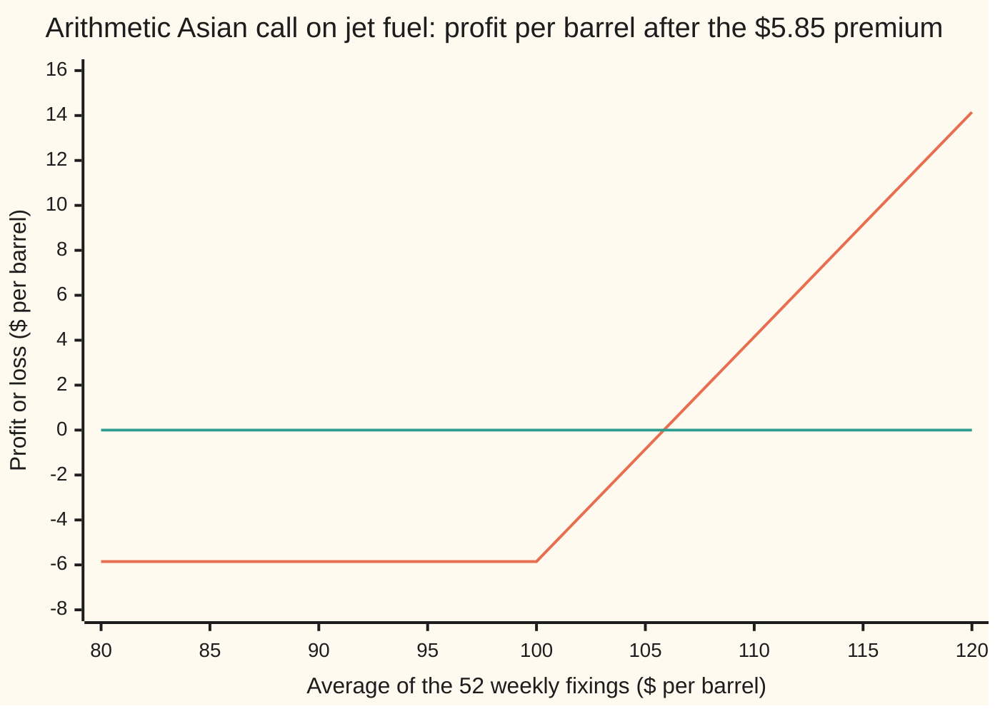
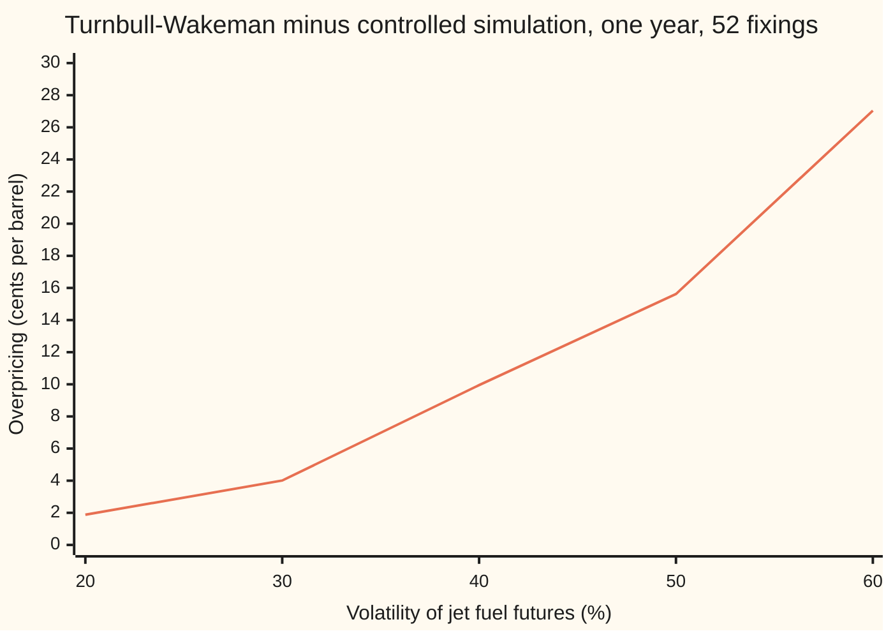

# The Asian option desks trade: no exact formula, so match two moments and let the geometric twin steer the simulation

Financial mathematics → Averages - commodity swaps and Asian options → Pricing the traded average → The Asian option desks trade

---

## General Overview

An airline burns jet fuel every week. Jet fuel costs \$100 a barrel today. The airline's budget feels the year's average price, not the price on one afternoon. So it buys a call on the average: at the end of the year, per barrel, it receives whatever the average of 52 weekly price readings came to above \$100. Each reading is a **fixing**. A contract that settles on an average is an **Asian option**.

The average is the ordinary one, add and divide by 52: the **arithmetic** average, the one fuel contracts use. The plain one-year call on the last week's price costs \$10.45. The call on the average costs \$5.85, 56 percent of it, because an average of 52 readings wanders less than one reading.

No formula gives the \$5.85. A cousin, the call on the **geometric** average (multiply the 52 fixings, take the 52nd root), has an exact price, \$5.64 ([kemna-vorst-geometric-asian](02-kemna-vorst-geometric-asian.md)). The quick route computes the average's exact mean and mean square, pretends the average has the simplest shape with those two numbers, and prices that: \$5.87, the **Turnbull-Wakeman** approximation. The careful route simulates 50,000 possible years, prices the geometric twin on the same years, and uses the twin's known miss to correct the arithmetic price: \$5.854, with an error bar of a tenth of a cent, 36 times tighter than without the correction.

**The arithmetic Asian has no closed form: match its exact first two moments to a lognormal for a quick price, or simulate it with the exact geometric twin as a control, which cancels almost all the simulation's noise.**

**What kind of fact this is:** a method: the price is a risk-neutral average with no closed form, estimated by simulation steered by an exact twin; Turnbull-Wakeman beside it is an approximation, its error measured on this card at 1.9 cents and shown growing with volatility and time.

### The picture: what the airline walks away with



First line: profit per barrel, flat at −\$5.85 until the average passes the \$100 strike, then rising a dollar per dollar. Second line: break-even. A plain call's hockey stick, with the year's average on the horizontal axis.

---

## The formula

Notation first, in words. The fixings fall on dates $t_i = iT/n$ for $i$ = 1 to $n$, counted in years from today, the last one on the expiry date $T$. The futures price quoted today for delivery at date $t$ is $F(0,t)$; the list of them, date by date, is the **futures curve**. The fixing on date $t_i$ is $P_i$. A capital sigma adds up a list. $E[\;]$ is an average over all possible price paths in the risk-neutral world, the pricing world in which a futures price has no expected drift ([options-on-commodity-futures](../26-Options%20on%20commodity%20futures%20and%20spreads/01-options-on-commodity-futures.md)). $N(x)$ is the bell-curve area left of $x$.

The contract and its price:

$$A = \frac1n\sum_{i=1}^{n} P_i, \qquad C_A = e^{-rT}\,E\big[\max(A - K,\,0)\big]$$

**Read it aloud:** average the fixings; the call is worth today's value of the average's excess over the strike, averaged over every possible path.

The quick price, **Turnbull-Wakeman**: Black-76 (the call formula for a futures price) fed the average's own forward and its own spread.

$$C_A \approx e^{-rT}\big(M_1\,N(e_1) - K\,N(e_2)\big)$$

**Read it aloud:** the average's expected value you might receive, minus the strike you might pay, each weighted by its own chance.

The careful price, simulation corrected by the geometric twin:

$$\widehat C_A = \bar X - \beta\,\big(\bar Y - C_G\big)$$

**Read it aloud:** the plain simulated price, minus a slope times however far the simulated twin missed its exact price.

Here $X$ is one simulated year's discounted arithmetic payoff, $Y$ the geometric one on the same year, and a bar over a letter is its average across the simulated years.

| Symbol | Plain meaning | In our example | Push it up and the answer… |
| --- | --- | --- | --- |
| $C_A$, $C_G$ | price of the arithmetic call; exact price of the geometric twin | \$5.85; \$5.64 | is the answer |
| $A$, $G$ | arithmetic and geometric averages of the fixings | $G$ never exceeds $A$ | the payoff reads $A$ |
| $n$, $t_i$, $i$, $P_i$, $t$, $a$ | number of fixings; date of fixing $i$; its number; its price; $t$ or $a$, any date | 52 weekly: $t_i = i/52$ | $n$ up: cheaper, the average smooths harder |
| $F(0,t)$ | today's futures price for delivery at $t$: the curve | $100e^{0.05t}$: \$100.10 at the first fixing, \$105.13 at the last | whole curve up: dearer |
| $K$, $K^*$ | the strike; the strike left for the unfixed part once some fixings are banked | \$100 | falls |
| $r$, $e^{-rT}$ | the bank rate, continuously compounded; the discount on a dollar paid at $T$ | 5%; 0.9512 | curve held fixed: slightly cheaper |
| $\sigma$, $T$ | volatility of the futures prices (yearly spread of log changes); expiry in years | 20%; 1 | both: dearer |
| $W$ | the one random path (Brownian motion) that moves the whole curve | one path per simulated year | — |
| $M_1$, $M_2$ | exact mean and exact mean square of $A$ | \$102.59; 10,672.68 | $M_1$ up: dearer |
| $v_A$, $v$, $e_1$, $e_2$, $d_1$, $d_2$, $N$ | fitted log-spread of $A$ over the whole life ($v$ any log-spread); the cut-offs, like the plain call's $d_1$, $d_2$; bell-curve area | 0.1180; 0.2758, 0.1577 | $v_A$ up: dearer |
| $F_G$ | forward of the geometric average | \$102.24 | dearer |
| $X$, $Y$, $\beta$, $\rho$ | discounted arithmetic and geometric payoffs on one path; the slope; their correlation | $\rho$ = 0.9996 | $\rho$ nearer one: tighter error bar |

The helpers, each exact:

$$P_i = F(0,t_i)\,e^{\sigma W_{t_i} - \frac12\sigma^2 t_i}$$

In words: each fixing is lognormal around its own point on today's curve, and one random path drives them all.

$$M_1 = \frac1n\sum_{i=1}^{n} F(0,t_i), \qquad M_2 = \frac{1}{n^2}\sum_{i=1}^{n}\sum_{j=1}^{n} F(0,t_i)\,F(0,t_j)\,e^{\sigma^2\min(t_i,\,t_j)}$$

In words: $M_1$ is the plain average of the curve at the fixing dates, which is the price of the matching average-price swap; $M_2$ adds up how each pair of fixings moves together.

$$v_A = \sqrt{\ln\!\big(M_2/M_1^2\big)}, \qquad e_1 = \frac{\ln(M_1/K) + \tfrac12 v_A^2}{v_A}, \qquad e_2 = e_1 - v_A$$

In words: $v_A$ is the log-spread a lognormal would need to have both moments; $e_1$ and $e_2$ are the plain call's $d_1$ and $d_2$ with the average in place of the futures price.

### When it holds

- **One volatility for every fixing.** Near-dated energy futures usually move more than far-dated ones. If each fixing has its own volatility, every pair in $M_2$ and every simulated step carries its own; a single 20% misprices by roughly vega (price change per volatility point) times the error: 22 cents a point here.
- **One random path moves the whole curve.** When the fixings read different delivery months that are not perfectly correlated, the true $M_2$ is smaller and both prices on this card are too high.
- **Lognormal fixings.** Fuel prices jump in supply shocks, and markets price a skew (a volatility that depends on the strike). Neither is in the model, and the simulation inherits that error too.
- **Moderate $\sigma^2 T$, for Turnbull-Wakeman.** Its error grows with volatility and time (Step 7).
- **No fixings banked yet.** Once some fixings are known, part of the average is cash and the option on the rest has a shifted strike $K^*$. Far out of the money, the quick price is then too cheap, not too dear (Step 7).

---

## Why it works

### Step 0: the price is still an average over paths, and the sum is the problem

In the risk-neutral world an option is worth its discounted average payoff; only the payoff changed. The equity card on shelf 17 prices this contract for a share with a dividend yield, \$5.26 by the same two roads ([arithmetic-asian-options](../17-Averages%2C%20choosers%2C%20compounds%20and%20forward-starts/02-arithmetic-asian-options.md)). This card spends its length on what a commodity changes.

Each fixing is lognormal (its log follows a bell curve). The log of a product is a sum of logs, and bell-curved logs driven by the same shocks sum to a bell curve, so the geometric average is lognormal and has a formula. The log of a sum is not a sum of anything, so the arithmetic average has no formula. The card attacks it with exact moments, a simulation, and two bounds.

### Step 1: a commodity desk reads the curve, not a spot price

An equity desk feeds a share price and lets it grow at the bank rate less the dividend yield. A fuel desk has a futures curve instead, and each fixing belongs to a different point on it. A futures contract costs nothing to enter, so in the pricing world its price has no expected gain: the fixing on date $t_i$ is expected to equal today's quote $F(0,t_i)$. That is the helper formula for $P_i$, the sibling card's starting point too ([kemna-vorst-geometric-asian](02-kemna-vorst-geometric-asian.md)).

In this example the curve rises 5 percent a year, the interest cost of holding fuel, with storage left out: $F(0,t) = 100e^{0.05t}$. The first fixing's forward is \$100.10, the last one's \$105.13. Their plain average is $M_1$ = \$102.59. That number is the price of the average-price swap on the same dates ([commodity-swap-and-average-price-forward](01-commodity-swap-and-average-price-forward.md)): the Asian call is an option on that swap's floating leg.

The equity formula is the special curve $F(0,t) = Se^{(r-q)t}$, where S is the share price and q its dividend yield. A \$100 share with the bank rate less the yield at 3% gives a flatter curve, and Turnbull-Wakeman on it gives \$5.27, the equity card's figure; jet fuel's 5% curve gives \$5.87. A currency's forward curve slopes at the home rate minus the foreign rate, so an average-rate currency option is this card with the foreign rate in the yield's place.

### Step 2: the average's first two moments are exact

The average has no formula, but its mean and mean square do. The mean is $M_1$, because each fixing's mean is its forward. For the mean square, two fixings share every random shove up to the earlier date. A lognormal pair's product then has mean $F(0,t_i)F(0,t_j)e^{\sigma^2\min(t_i,t_j)}$. Summed over all 52 × 52 pairs and divided by 52^2, that is $M_2$ = 10,672.68.

<details>
<summary>Detailed proof: the two moments</summary>

Write $P_a = F(0,a)\,e^{\sigma W_a - \frac12\sigma^2 a}$, with $W$ Brownian motion: its reading at time $a$ is normal with mean 0 and variance $a$, and readings at two dates $a \le b$ share the variance up to $a$. A normal variable $Z$ with mean 0 and variance $v^2$ has $E[e^Z] = e^{v^2/2}$ ([lognormal-distribution](../../09-Probability%20and%20statistics/04-Continuous%20Distributions/06-lognormal-distribution.md)). Taking $Z = \sigma W_a$ gives $E[P_a] = F(0,a)$; average over the fixings to get $M_1$.

For a pair, $W_a + W_b$ has variance $a + b + 2\min(a,b)$. So
$$E[P_a P_b] = F(0,a)F(0,b)\,e^{-\frac12\sigma^2(a+b)}\,e^{\frac12\sigma^2(a+b) + \sigma^2\min(a,b)} = F(0,a)F(0,b)\,e^{\sigma^2\min(a,b)}.$$
The square of the average is $\frac{1}{n^2}$ times the sum of $P_a P_b$ over all ordered pairs. Take the expectation term by term: that is $M_2$. The code checks both moments against 50,000 simulated years.

</details>

### Step 3: Turnbull-Wakeman fits a lognormal to those two moments

Suppose $A$ were lognormal with log-spread $v$. Then its mean square over its squared mean would be exactly $e^{v^2}$. Run that backwards on the true moments: $M_2/M_1^2$ = 1.014030, so $v_A$ = 0.1180. One fixing on its own has log-spread $\sigma\sqrt T$ = 0.20. The average's is well under that, because the early fixings have barely had time to move.

Now treat $A$ as a futures price with forward $M_1$ and whole-life log-spread $v_A$, and apply Black-76. The moments are exact; the lognormal shape is the only guess. The answer is \$5.87. This two-moment fit is Levy's form (1992); software labelled Turnbull-Wakeman usually means it.

Changing one input at a time shows the spread does most of the work: the average's spread alone takes \$10.45 to \$7.44, its forward alone only to \$8.97.

### Step 4: simulate, and read the error bar honestly

One Brownian path per simulated year, read at the 52 dates, gives 52 fixings by the helper formula. Each weekly step is an exact bell-curve draw, so there is no discretisation error ([monte-carlo-pricing](../06-Numerical%20Methods%20for%20Pricing/01-monte-carlo-pricing.md)). On each year, average the fixings, take the discounted payoff, and average across years.

With 50,000 years the plain answer is \$5.91. Its error bar is the spread of the payoffs over the square root of 50,000: 3.6 cents ([monte-carlo-estimates-and-error](../../09-Probability%20and%20statistics/11-Simulation/04-monte-carlo-estimates-and-error.md)). That bar shrinks only with the square root of the number of years, so buying precision by brute force is expensive.

### Step 5: the geometric twin as a control variate

A **control variate** is a companion quantity with a known price, simulated on the same paths so that its error reveals theirs. On every simulated year, compute the geometric payoff $Y$ too. The twin's exact price is \$5.64; this batch priced it at \$5.69. The arithmetic payoff rides the same paths, so it ran rich by nearly the same amount. Subtract a multiple $\beta$ of the twin's miss.

The correction adds nothing on average, for any $\beta$, because the twin's miss averages to zero; it cannot bias the price. The best $\beta$ is the slope of $X$ against $Y$ across the paths. With it, the variance left over is $1 - \rho^2$ of the plain variance, where $\rho$ is their correlation ([variance-reduction-for-pricing](../06-Numerical%20Methods%20for%20Pricing/02-variance-reduction-for-pricing.md)).

Here $\rho$ = 0.9996: the two averages differ by little on any path, and their payoffs switch on together. The controlled price is \$5.8544 with an error bar of 0.10 cents, 36 times tighter than the plain one from the same paths. Brute force would need about 1,300 times as many paths.

<details>
<summary>Detailed proof: why the correction cannot bias the price</summary>

For a fixed $\beta$, the estimator's expectation is $E[X] - \beta(E[Y] - C_G)$. The twin's exact price is its expected discounted payoff, $C_G = E[Y]$, so the bracket is zero and the expectation is $C_A$. Per path, the variance is $\operatorname{var}(X) - 2\beta\operatorname{cov}(X,Y) + \beta^2\operatorname{var}(Y)$, a parabola in $\beta$ lowest at $\beta = \operatorname{cov}(X,Y)/\operatorname{var}(Y)$, where it equals $(1-\rho^2)\operatorname{var}(X)$. Estimating $\beta$ from the same paths adds a bias of order one over the number of paths, far below the error bar.

</details>

### Step 6: a floor and a ceiling with no simulation

On every path, adding and dividing never gives less than multiplying and rooting: $A \ge G$, the arithmetic-geometric mean inequality. So the arithmetic payoff is never below the geometric one, and $C_A \ge C_G$ = \$5.64.

The gap between the two payoffs is never more than the gap between the averages. Take the discounted average over paths: $C_A \le C_G + e^{-rT}(M_1 - F_G)$ = \$5.97. Both roads land inside \$5.64 to \$5.97, a window built from two exact numbers and one inequality.

### Step 7: where the quick price drifts

The fitted lognormal matches the true average's mean and spread, not its shape. Near the money the mismatch makes Turnbull-Wakeman too dear, and the gap grows with the total variance $\sigma^2 T$. Far out of the money it can err the other way.



The one line is the quick price's overpricing in cents, each point measured against a controlled simulation with an error bar under two cents: 1.9 cents at the house 20%, 10 cents at 40%, 27 cents on \$14.71 at 60%, a level fuel reaches in a crisis.

Two more places it drifts:

- **Long dates.** Stretch the same 52 fixings over five years at 20% volatility: \$15.42 quick against \$15.24 simulated, 18 cents dear.
- **Averages already in progress.** Halfway through the year, 26 fixings are banked at an average of \$80, and the curve for the next half-year again reads $100e^{0.05t}$. The payoff is half of the remaining average's excess over $K^*$ = 2 × 100 − 80 = \$120. That option is far out of the money. The quick price is 3.76 cents against the simulated 4.11 cents: 91.7 percent of the true price, too cheap. If the banked fixings alone guarantee the average clears the strike, $K^*$ is zero or negative, the log in $e_1$ is undefined, and the option is sure to pay: it is worth half the discounted gap between the remaining average's forward and $K^*$. How price and hedge change as fixings bank is the subject of [asian-greeks-and-the-running-average](04-asian-greeks-and-the-running-average.md).

Other routes exist: a lattice or a partial differential equation in two variables, the price and the running average; and quasi-random points, spread evenly on purpose, which cut the error bar further than the control alone ([quasi-monte-carlo-and-brownian-bridge](../06-Numerical%20Methods%20for%20Pricing/03-quasi-monte-carlo-and-brownian-bridge.md)).

---

## Worked numbers, by hand

Jet fuel: curve $100e^{0.05t}$, $K$ = \$100, $r$ = 5%, $\sigma$ = 20%, $T$ = 1 year, 52 weekly fixings.

| Step | Arithmetic | Value |
| --- | --- | --- |
| mean of the average | $M_1 = \frac{1}{52}\sum 100e^{0.05\,i/52}$ | 102.591500 |
| mean square of the average | $M_2$, the double sum over 52 × 52 pairs | 10,672.682136 |
| ratio | $M_2/M_1^2$ | 1.014030 |
| fitted log-spread | $v_A = \sqrt{\ln 1.014030}$ | 0.118036 |
| first cut-off | $e_1 = (\ln 1.025915 + \tfrac12 v_A^2)/v_A$ | 0.275773 |
| second cut-off | $e_2 = 0.275773 - 0.118036$ | 0.157737 |
| chances | $N(e_1)$, $N(e_2)$ | 0.608639, 0.562668 |
| discount | $e^{-0.05}$ | 0.951229 |
| Turnbull-Wakeman | 0.951229 × (102.5915 × 0.608639 − 100 × 0.562668) | 5.873245 |
| geometric twin, exact | the sibling card's formula, $F_G$ = 102.239577 | 5.637432 |
| **controlled simulation** | 50,000 paths, the twin as control | **\$5.8544 ± 0.0010** |

A year of protection on the airline's weekly average costs \$5.85 a barrel, 56 percent of the \$10.45 plain call on the last week.

### Greeks, by bumping the formula

Bump the whole curve by 1 percent (a dollar at the front) and the volatility by a hundredth of a point, and reprice by Turnbull-Wakeman. The sibling card treats them properly ([asian-greeks-and-the-running-average](04-asian-greeks-and-the-running-average.md)).

| Greek | Asian call | Plain call | Why they differ |
| --- | --- | --- | --- |
| delta, dollars per \$1 move of the curve | 0.5938 | 0.6367 | the average's forward sits lower on the curve |
| gamma, change in delta per \$1 | 0.0317 | 0.0188 | a narrower spread concentrates the kink |
| vega, dollars per volatility point | 0.2219 | 0.3752 | the average feels only part of the spread |

### What the curve changes

Same fixings, strike and volatility; only the curve's shape changes. Each price is by Turnbull-Wakeman and by controlled simulation.

| Curve $F(0,t)$ | What it means | Quick | Simulated |
| --- | --- | --- | --- |
| $100e^{0.05t}$, contango | later fuel costs more: full cost of carry | \$5.87 | \$5.85 |
| flat at \$100 | every fixing reads one futures contract, or storage and yield cancel the rate | \$4.45 | \$4.44 |
| $100e^{-0.05t}$, backwardation | prompt barrels are scarce, later fuel costs less | \$3.28 | \$3.28 |

The same \$100 spot price gives \$5.85 or \$3.28 depending on the curve, and the quick price's error shrinks as the average's forward falls below the strike.

The fixing schedule matters too. A common alternative to one annual Asian is a strip of twelve monthly ones, each averaging its month's 21 business days and settling at month end. Per barrel of the year's fuel, the strip costs \$6.48 by Turnbull-Wakeman, inside its floor \$6.46 and ceiling \$6.49: dearer than the annual \$5.85, because each month can pay on its own while one annual average lets good and bad months net out.

### What breaks if you drop a piece

| Mistake | Comes out at | What went wrong |
| --- | --- | --- |
| Price the last week's fixing, not the average | \$10.45 | that is the plain call; the averaging is the whole contract |
| Keep the full spread 0.20 on the average's forward | \$8.97 | an average of partly known prices spreads less than one price |
| Use the one-year futures price as the average's forward | \$7.44 | the fixings sit along the curve, centred on \$102.59, not at its end |
| Treat the 52 fixings as independent draws | \$2.72 | neighbouring weeks share almost all their shocks; the spread is not 0.20 over √52 |
| Quote the geometric twin as the price | \$5.64 | $G$ never exceeds $A$: the twin is the floor |
| Price a contango strip as a flat spot of \$100 | \$4.44 | the fixings' forwards are on the curve, up to \$105.13 |

The code prints all six.

---

## Code, from first principles, and it actually runs

Both programs write their own bell-curve area (Marsaglia's series), random numbers (splitmix64, with the Box-Muller transform turning two even draws into one bell-curve draw) and paths. They reach the price by four roads: plain simulation, controlled simulation, Turnbull-Wakeman, and the floor and ceiling. They check the paths against three exact numbers (the twin's price and both moments), check that one fixing gives the plain call, \$10.450584, two ways, and measure the quick price's drift in both directions.

### Python

```python
# The arithmetic Asian on jet fuel: 52 weekly fixings read the futures curve 100 e^(0.05 t).
# Standard library only.  Nothing imported knows the answer: the bell-curve area, the random
# numbers (splitmix64 + Box-Muller) and every path are written out below.
from math import log, sqrt, exp, cos, pi

K, r, sig, T, n = 100.0, 0.05, 0.20, 1.0, 52

def N(x):                                   # area left of x: Marsaglia's series
    if x < -9.0: return 0.0
    if x > 9.0: return 1.0
    s, t, b, i = x, 0.0, x, 1.0
    while s != t:
        i += 2.0
        b, t = b * x * x / i, s
        s += b
    return 0.5 + s * exp(-0.5 * x * x - 0.91893853320467274178)

def black(F, v, k, tp):                     # Black-76: call on a lognormal with forward F, log-spread v
    d1 = (log(F / k) + 0.5 * v * v) / v
    return exp(-r * tp) * (F * N(d1) - k * N(d1 - v))

def curve(c, lvl=100.0): return lambda t: lvl * exp(c * t)     # futures price for delivery at t
def dates(m, tx=T, t0=0.0): return [t0 + (tx - t0) * (i + 1) / m for i in range(m)]

def tw(fw, ts, s=sig, k=K):                 # Turnbull-Wakeman: exact two moments, fitted lognormal
    m, Fs = len(ts), [fw(t) for t in ts]
    M1 = sum(Fs) / m
    M2 = sum(Fs[i] * Fs[j] * exp(s * s * min(ts[i], ts[j])) for i in range(m) for j in range(m)) / (m * m)
    vA = sqrt(log(M2 / (M1 * M1)))
    return black(M1, vA, k, ts[-1]), M1, M2, vA

def kv(fw, ts, s=sig, k=K):                 # geometric twin, exact: the law of ln G summed date by date
    m = len(ts)
    mu = sum(log(fw(t)) - 0.5 * s * s * t for t in ts) / m
    var = s * s * sum(min(a, b) for a in ts for b in ts) / (m * m)
    return black(exp(mu + 0.5 * var), sqrt(var), k, ts[-1]), exp(mu + 0.5 * var)

state = 20260927                            # splitmix64: 64-bit integer mixing
def uniform():
    global state
    state = (state + 0x9E3779B97F4A7C15) & 0xFFFFFFFFFFFFFFFF
    z = ((state ^ (state >> 30)) * 0xBF58476D1CE4E5B9) & 0xFFFFFFFFFFFFFFFF
    z = ((z ^ (z >> 27)) * 0x94D049BB133111EB) & 0xFFFFFFFFFFFFFFFF
    return ((z ^ (z >> 31)) >> 11) * 2.0 ** -53 + 2.0 ** -54

def normal():                               # Box-Muller, one draw per pair of uniforms
    return sqrt(-2.0 * log(uniform())) * cos(2.0 * pi * uniform())

def mc(fw, ts, s=sig, k=K, paths=20000):    # fixing i = F(0,t_i) e^(s W(t_i) - s^2 t_i / 2)
    m, d = len(ts), exp(-r * ts[-1])
    base = [log(fw(t)) - 0.5 * s * s * t for t in ts]
    steps = [s * sqrt(t - u) for t, u in zip(ts, [0.0] + ts[:-1])]
    a = [0.0] * 8
    for _ in range(paths):
        W = tot = totlog = 0.0
        for b0, st in zip(base, steps):
            W += st * normal()
            tot, totlog = tot + exp(b0 + W), totlog + b0 + W
        A = tot / m
        X, Y = d * max(A - k, 0.0), d * max(exp(totlog / m) - k, 0.0)   # arithmetic, geometric
        for j, v in enumerate((X, X * X, Y, Y * Y, X * Y, A, A * A, A * A * A * A)):
            a[j] += v
    p = float(paths)
    mx, my, mA, mA2 = a[0] / p, a[2] / p, a[5] / p, a[6] / p
    vx, vy, cxy = a[1] / p - mx * mx, a[3] / p - my * my, a[4] / p - mx * my
    beta = cxy / vy                             # slope of X on Y; the twin's miss is subtracted
    return (mx, sqrt(vx / p), mx - beta * (my - kv(fw, ts, s, k)[0]), sqrt((vx - beta * cxy) / p),
            cxy / sqrt(vx * vy), my, sqrt(vy / p), mA, sqrt((mA2 - mA * mA) / p), mA2, sqrt((a[7] / p - mA2 * mA2) / p))

def row(label, *vals, w=12, dp=6):
    print(f"{label:<42}" + "".join(f"{v:>{w}.{dp}f}" for v in vals))

fw, ts = curve(0.05), dates(n)
plain = black(fw(T), sig * sqrt(T), K, T)
d1 = (log(100.0 / K) + (r + 0.5 * sig * sig) * T) / (sig * sqrt(T))    # spot form, no yield
spot_form = 100.0 * N(d1) - K * exp(-r * T) * N(d1 - sig * sqrt(T))
TW, M1, M2, vA = tw(fw, ts)
KV, FG = kv(fw, ts)
e1 = (log(M1 / K) + 0.5 * vA * vA) / vA
mx, se, ctrl, se_c, rho, gsim, se_g, mA, se_A, mA2, se_A2 = mc(fw, ts, paths=50000)
ceiling = KV + exp(-r * T) * (M1 - FG)      # A - G >= (A-K)+ - (G-K)+ >= 0 on every path

for label, *vals in [("curve F(0,t) at first and last fixing", fw(ts[0]), fw(T)),
        ("plain call, Black-76 on F(0,T)", plain), ("plain call, spot form, no yield", spot_form),
        ("M1, mean of the average, exact", M1), ("  simulated, and its error bar", mA, se_A),
        ("M2, mean square of the average, exact", M2), ("  simulated, and its error bar", mA2, se_A2),
        ("M2 / M1^2", M2 / (M1 * M1)), ("log-spread of the average vA", vA),
        ("log-spread of one fixing, sigma*sqrt(T)", sig * sqrt(T)), ("cut-offs e1, e2", e1, e1 - vA),
        ("N(e1), N(e2)", N(e1), N(e1 - vA)), ("discount e^-rT", exp(-r * T)),
        ("geometric twin, Kemna-Vorst", KV), ("  simulated, and its error bar", gsim, se_g),
        ("geometric forward F_G", FG), ("1 plain simulation, and its error bar", mx, se),
        ("2 controlled simulation, and its bar", ctrl, se_c), ("  correlation rho", rho),
        ("  error bar shrinks by", se / se_c), ("  plain paths needed for that bar, times", (se / se_c) ** 2),
        ("3 Turnbull-Wakeman", TW), ("  minus road 2", TW - ctrl), ("4 floor (the twin) and ceiling", KV, ceiling),
        ("Asian / plain call", ctrl / plain), ("dial: lower spread only", black(fw(T), vA, K, T)),
        ("dial: lower forward only", black(M1, sig * sqrt(T), K, T)),
        ("wrong: fixings as independent draws", black(M1, sig * sqrt(T / n), K, T)),
        ("equity slope r-q = 3%, Turnbull-Wakeman", tw(curve(0.03), ts)[0])]:
    row(label, *vals)

def greeks(tsx):                            # bump the whole curve by 1%, the volatility by 0.01 point
    up, mid, dn = (tw(curve(0.05, 100.0 * (1 + h)), tsx)[0] for h in (0.01, 0.0, -0.01))
    vu, vd = tw(fw, tsx, sig + 1e-4)[0], tw(fw, tsx, sig - 1e-4)[0]
    return (up - dn) / 2.0, (up - 2 * mid + dn) / 1.0, (vu - vd) / 2e-4 / 100
row("greeks, Asian (delta gamma vega/pt)", *greeks(ts), w=10, dp=4)
row("greeks, plain call", *greeks([T]), w=10, dp=4)

print(f"{'scenario: TW, controlled MC, bar, TW - MC':<42}")
errs = [TW - ctrl]
for label, f, tx, s in (("  curve flat at 100", curve(0.0), ts, sig), ("  curve falling 5% (backwardation)", curve(-0.05), ts, sig),
                        ("  vol 30%", fw, ts, 0.3), ("  vol 40%", fw, ts, 0.4), ("  vol 50%", fw, ts, 0.5),
                        ("  vol 60%", fw, ts, 0.6), ("  five years, 52 fixings", fw, dates(n, 5.0), sig)):
    res = mc(f, tx, s)
    errs.append(tw(f, tx, s)[0] - res[2])
    row(label, tw(f, tx, s)[0], res[2], res[3], errs[-1], w=10, dp=4)
    if label == "  vol 60%": bar60 = res[3]
half, kstar = dates(26, 0.5), 2 * K - 80.0  # 26 fixings banked at $80; 26 left over half a year
res = mc(fw, half, k=kstar)
row("  half done, $80 banked (half of K*=120)", 0.5 * tw(fw, half, k=kstar)[0], 0.5 * res[2], 0.5 * res[3],
    0.5 * (tw(fw, half, k=kstar)[0] - res[2]), w=10, dp=4)
row("  half done: TW / MC", tw(fw, half, k=kstar)[0] / res[2])
strip = [[mth / 12 + (i + 1) / 252 for i in range(21)] for mth in range(12)]   # 21 daily fixings a month
kvs = [kv(fw, tm) for tm in strip]
row("monthly strip: TW, floor, ceiling", sum(tw(fw, tm)[0] for tm in strip) / 12, sum(g[0] for g in kvs) / 12,
    sum(g[0] + exp(-r * tm[-1]) * (tw(fw, tm)[1] - g[1]) for g, tm in zip(kvs, strip)) / 12)
print(f"{'chart, TW - MC in cents, vol 20% to 60%':<42}" + "".join(f"{100 * e:>7.2f}" for e in errs[:1] + errs[3:7]))
avgs = [80 + 5 * i for i in range(9)]
print(f"{'chart, average at expiry':<42}" + "".join(f"{x:>7d}" for x in avgs))
print(f"{'chart, profit after premium':<42}" + "".join(f"{max(x - K, 0.0) - ctrl:>7.2f}" for x in avgs))

assert abs(tw(fw, [T])[0] - spot_form) < 1e-9 and abs(spot_form - 10.450583572185565) < 1e-9, "one fixing: the plain call"
assert abs(gsim - KV) < 3 * se_g, "the paths reproduce the exact geometric price"
assert abs(mA - M1) < 3 * se_A and abs(mA2 - M2) < 3 * se_A2, "the paths reproduce both exact moments"
assert KV < ctrl < ceiling, "controlled price inside the AM-GM floor and ceiling"
assert abs(ctrl - mx) < 3 * se, "the control moves the price by less than three plain bars"
assert se / se_c > 10, "the control shrinks the error bar at least tenfold"
assert abs(TW - ctrl) < 0.03, "moment matching within three cents at 20% vol"
assert errs[6] > 10 * bar60 and errs[6] > 5 * (TW - ctrl), "at 60% vol the approximation has drifted"
assert tw(fw, half, k=kstar)[0] < res[2] - 3 * res[3], "half banked, far out of the money: the quick price is too cheap"
print("ALL CHECKS PASS")
```

**Ran 2026-09-27 on macOS, Python 3.14.6, standard library only. All checks passed. Output, pasted from the run:**

```
curve F(0,t) at first and last fixing       100.096200  105.127110
plain call, Black-76 on F(0,T)               10.450584
plain call, spot form, no yield              10.450584
M1, mean of the average, exact              102.591500
  simulated, and its error bar              102.684326    0.054420
M2, mean square of the average, exact     10672.682136
  simulated, and its error bar            10692.145187   11.510309
M2 / M1^2                                     1.014030
log-spread of the average vA                  0.118036
log-spread of one fixing, sigma*sqrt(T)       0.200000
cut-offs e1, e2                               0.275773    0.157737
N(e1), N(e2)                                  0.608639    0.562668
discount e^-rT                                0.951229
geometric twin, Kemna-Vorst                   5.637432
  simulated, and its error bar                5.687312    0.035213
geometric forward F_G                       102.239577
1 plain simulation, and its error bar         5.906059    0.036450
2 controlled simulation, and its bar          5.854446    0.001010
  correlation rho                             0.999616
  error bar shrinks by                       36.092732
  plain paths needed for that bar, times   1302.685319
3 Turnbull-Wakeman                            5.873245
  minus road 2                                0.018798
4 floor (the twin) and ceiling                5.637432    5.972191
Asian / plain call                            0.560203
dial: lower spread only                       7.435303
dial: lower forward only                      8.970321
wrong: fixings as independent draws           2.722591
equity slope r-q = 3%, Turnbull-Wakeman       5.272956
greeks, Asian (delta gamma vega/pt)           0.5938    0.0317    0.2219
greeks, plain call                            0.6367    0.0188    0.3752
scenario: TW, controlled MC, bar, TW - MC 
  curve flat at 100                           4.4497    4.4418    0.0013    0.0079
  curve falling 5% (backwardation)            3.2785    3.2783    0.0011    0.0002
  vol 30%                                     8.1139    8.0738    0.0035    0.0401
  vol 40%                                    10.3826   10.2831    0.0064    0.0995
  vol 50%                                    12.6723   12.5161    0.0106    0.1562
  vol 60%                                    14.9827   14.7123    0.0165    0.2704
  five years, 52 fixings                     15.4191   15.2379    0.0098    0.1813
  half done, $80 banked (half of K*=120)      0.0376    0.0411    0.0002   -0.0034
  half done: TW / MC                          0.916777
monthly strip: TW, floor, ceiling             6.478722    6.462012    6.489740
chart, TW - MC in cents, vol 20% to 60%      1.88   4.01   9.95  15.62  27.04
chart, average at expiry                       80     85     90     95    100    105    110    115    120
chart, profit after premium                 -5.85  -5.85  -5.85  -5.85  -5.85  -0.85   4.15   9.15  14.15
ALL CHECKS PASS
```

### Rust

Same numbers, same labels, built with `rustc --edition 2021 -O`.

```rust
// The arithmetic Asian on jet fuel: 52 weekly fixings read the futures curve 100 e^(0.05 t).
// Rust std only, no crates.  Nothing imported knows the answer: the bell-curve area, the random
// numbers (splitmix64 + Box-Muller) and every path are written out below.
use std::f64::consts::PI;

const K: f64 = 100.0; const R: f64 = 0.05; const SIG: f64 = 0.20; const T: f64 = 1.0; const NF: usize = 52;
fn ncdf(x: f64) -> f64 {                    // area left of x: Marsaglia's series
    if x < -9.0 { return 0.0; }
    if x > 9.0 { return 1.0; }
    let (mut s, mut t, mut b, mut i) = (x, 0.0, x, 1.0);
    while s != t {
        i += 2.0; b = b * x * x / i; t = s; s += b;
    }
    0.5 + s * (-0.5 * x * x - 0.91893853320467274178).exp()
}
fn black(f: f64, v: f64, k: f64, tp: f64) -> f64 {   // Black-76: call on a lognormal, forward f, log-spread v
    let d1 = ((f / k).ln() + 0.5 * v * v) / v;
    (-R * tp).exp() * (f * ncdf(d1) - k * ncdf(d1 - v))
}
#[derive(Clone, Copy)]
struct Curve { c: f64, lvl: f64 }           // futures price for delivery at t: lvl e^(c t)
impl Curve { fn at(&self, t: f64) -> f64 { self.lvl * (self.c * t).exp() } }
fn dates(m: usize, tx: f64, t0: f64) -> Vec<f64> {
    (0..m).map(|i| t0 + (tx - t0) * (i + 1) as f64 / m as f64).collect()
}
fn tw(fw: Curve, ts: &[f64], s: f64, k: f64) -> (f64, f64, f64, f64) {   // Turnbull-Wakeman
    let m = ts.len() as f64;
    let fs: Vec<f64> = ts.iter().map(|&t| fw.at(t)).collect();
    let m1 = fs.iter().fold(0.0, |a, &f| a + f) / m;
    let mut m2 = 0.0;
    for i in 0..ts.len() {
        for j in 0..ts.len() { m2 += fs[i] * fs[j] * (s * s * ts[i].min(ts[j])).exp(); }
    }
    m2 /= m * m;
    let va = (m2 / (m1 * m1)).ln().sqrt();
    (black(m1, va, k, ts[ts.len() - 1]), m1, m2, va)
}
fn kv(fw: Curve, ts: &[f64], s: f64, k: f64) -> (f64, f64) {   // geometric twin, exact, summed date by date
    let m = ts.len() as f64;
    let mu = ts.iter().fold(0.0, |a, &t| a + (fw.at(t).ln() - 0.5 * s * s * t)) / m;
    let mut sm = 0.0;
    for &a in ts { for &b in ts { sm += a.min(b); } }
    let var = s * s * sm / (m * m);
    (black((mu + 0.5 * var).exp(), var.sqrt(), k, ts[ts.len() - 1]), (mu + 0.5 * var).exp())
}
struct Rng(u64);
impl Rng {
    fn uniform(&mut self) -> f64 {          // splitmix64: 64-bit integer mixing
        self.0 = self.0.wrapping_add(0x9E3779B97F4A7C15);
        let mut z = (self.0 ^ (self.0 >> 30)).wrapping_mul(0xBF58476D1CE4E5B9);
        z = (z ^ (z >> 27)).wrapping_mul(0x94D049BB133111EB);
        ((z ^ (z >> 31)) >> 11) as f64 * 2f64.powi(-53) + 2f64.powi(-54)
    }
    fn normal(&mut self) -> f64 {           // Box-Muller, one draw per pair of uniforms
        let a = (-2.0 * self.uniform().ln()).sqrt();
        a * (2.0 * PI * self.uniform()).cos()
    }
}
// fixing i = F(0,t_i) e^(s W(t_i) - s^2 t_i / 2); returns plain, bar, controlled, bar, rho,
// geometric simulated and bar, mean of A and bar, mean of A^2 and bar
fn mc(rng: &mut Rng, fw: Curve, ts: &[f64], s: f64, k: f64, paths: usize) -> [f64; 11] {
    let (m, d) = (ts.len() as f64, (-R * ts[ts.len() - 1]).exp());
    let base: Vec<f64> = ts.iter().map(|&t| fw.at(t).ln() - 0.5 * s * s * t).collect();
    let steps: Vec<f64> = (0..ts.len()).map(|i| s * (ts[i] - if i == 0 { 0.0 } else { ts[i - 1] }).sqrt()).collect();
    let mut a = [0.0f64; 8];
    for _ in 0..paths {
        let (mut w, mut tot, mut totlog) = (0.0, 0.0, 0.0);
        for (b0, st) in base.iter().zip(steps.iter()) {
            w += st * rng.normal();
            tot += (b0 + w).exp(); totlog += b0 + w;
        }
        let av = tot / m;
        let (x, y) = (d * (av - k).max(0.0), d * ((totlog / m).exp() - k).max(0.0));   // arithmetic, geometric
        for (j, v) in [x, x * x, y, y * y, x * y, av, av * av, av * av * av * av].iter().enumerate() { a[j] += v; }
    }
    let p = paths as f64;
    let (mx, my, ma, ma2) = (a[0] / p, a[2] / p, a[5] / p, a[6] / p);
    let (vx, vy, cxy) = (a[1] / p - mx * mx, a[3] / p - my * my, a[4] / p - mx * my);
    let beta = cxy / vy;                    // slope of X on Y; the twin's miss is subtracted
    [mx, (vx / p).sqrt(), mx - beta * (my - kv(fw, ts, s, k).0), ((vx - beta * cxy) / p).sqrt(),
     cxy / (vx * vy).sqrt(), my, (vy / p).sqrt(), ma, ((ma2 - ma * ma) / p).sqrt(), ma2, ((a[7] / p - ma2 * ma2) / p).sqrt()]
}
fn row(label: &str, vals: &[f64], w: usize, dp: usize) {
    let s: String = vals.iter().map(|v| format!("{:>w$.dp$}", v, w = w, dp = dp)).collect();
    println!("{:<42}{}", label, s);
}
fn greeks(tsx: &[f64]) -> [f64; 3] {        // bump the whole curve by 1%, the volatility by 0.01 point
    let fw = Curve { c: 0.05, lvl: 100.0 };
    let p = |h: f64| tw(Curve { c: 0.05, lvl: 100.0 * (1.0 + h) }, tsx, SIG, K).0;
    let (up, mid, dn) = (p(0.01), p(0.0), p(-0.01));
    let (vu, vd) = (tw(fw, tsx, SIG + 1e-4, K).0, tw(fw, tsx, SIG - 1e-4, K).0);
    [(up - dn) / 2.0, (up - 2.0 * mid + dn) / 1.0, (vu - vd) / 2e-4 / 100.0]
}
fn main() {
    let mut rng = Rng(20260927);
    let fw = Curve { c: 0.05, lvl: 100.0 };
    let ts = dates(NF, T, 0.0);
    let plain = black(fw.at(T), SIG * T.sqrt(), K, T);
    let d1 = ((100.0 / K).ln() + (R + 0.5 * SIG * SIG) * T) / (SIG * T.sqrt());   // spot form, no yield
    let spot_form = 100.0 * ncdf(d1) - K * (-R * T).exp() * ncdf(d1 - SIG * T.sqrt());
    let (tw0, m1, m2, va) = tw(fw, &ts, SIG, K);
    let (kv0, fg) = kv(fw, &ts, SIG, K);
    let e1 = ((m1 / K).ln() + 0.5 * va * va) / va;
    let [mx, se, ctrl, se_c, rho, gsim, se_g, ma, se_a, ma2, se_a2] = mc(&mut rng, fw, &ts, SIG, K, 50000);
    let ceiling = kv0 + (-R * T).exp() * (m1 - fg);   // A - G >= (A-K)+ - (G-K)+ >= 0 on every path
    let eq = tw(Curve { c: 0.03, lvl: 100.0 }, &ts, SIG, K).0;
    let rows: Vec<(&str, Vec<f64>)> = vec![("curve F(0,t) at first and last fixing", vec![fw.at(ts[0]), fw.at(T)]),
        ("plain call, Black-76 on F(0,T)", vec![plain]), ("plain call, spot form, no yield", vec![spot_form]),
        ("M1, mean of the average, exact", vec![m1]), ("  simulated, and its error bar", vec![ma, se_a]),
        ("M2, mean square of the average, exact", vec![m2]), ("  simulated, and its error bar", vec![ma2, se_a2]),
        ("M2 / M1^2", vec![m2 / (m1 * m1)]), ("log-spread of the average vA", vec![va]),
        ("log-spread of one fixing, sigma*sqrt(T)", vec![SIG * T.sqrt()]), ("cut-offs e1, e2", vec![e1, e1 - va]),
        ("N(e1), N(e2)", vec![ncdf(e1), ncdf(e1 - va)]), ("discount e^-rT", vec![(-R * T).exp()]),
        ("geometric twin, Kemna-Vorst", vec![kv0]), ("  simulated, and its error bar", vec![gsim, se_g]),
        ("geometric forward F_G", vec![fg]), ("1 plain simulation, and its error bar", vec![mx, se]),
        ("2 controlled simulation, and its bar", vec![ctrl, se_c]), ("  correlation rho", vec![rho]),
        ("  error bar shrinks by", vec![se / se_c]), ("  plain paths needed for that bar, times", vec![(se / se_c).powi(2)]),
        ("3 Turnbull-Wakeman", vec![tw0]), ("  minus road 2", vec![tw0 - ctrl]), ("4 floor (the twin) and ceiling", vec![kv0, ceiling]),
        ("Asian / plain call", vec![ctrl / plain]), ("dial: lower spread only", vec![black(fw.at(T), va, K, T)]),
        ("dial: lower forward only", vec![black(m1, SIG * T.sqrt(), K, T)]),
        ("wrong: fixings as independent draws", vec![black(m1, SIG * (T / NF as f64).sqrt(), K, T)]),
        ("equity slope r-q = 3%, Turnbull-Wakeman", vec![eq])];
    for (label, vals) in rows.iter() { row(label, vals, 12, 6); }
    row("greeks, Asian (delta gamma vega/pt)", &greeks(&ts), 10, 4);
    row("greeks, plain call", &greeks(&[T]), 10, 4);

    println!("{:<42}", "scenario: TW, controlled MC, bar, TW - MC");
    let (mut errs, mut bar60) = (vec![tw0 - ctrl], 0.0);
    let five = dates(NF, 5.0, 0.0);
    let sc: [(&str, Curve, &[f64], f64); 7] = [("  curve flat at 100", Curve { c: 0.0, lvl: 100.0 }, &ts, SIG), ("  curve falling 5% (backwardation)", Curve { c: -0.05, lvl: 100.0 }, &ts, SIG),
        ("  vol 30%", fw, &ts, 0.3), ("  vol 40%", fw, &ts, 0.4), ("  vol 50%", fw, &ts, 0.5),
        ("  vol 60%", fw, &ts, 0.6), ("  five years, 52 fixings", fw, &five, SIG)];
    for &(label, f, tx, s) in sc.iter() {
        let (res, t0) = (mc(&mut rng, f, tx, s, K, 20000), tw(f, tx, s, K).0);
        errs.push(t0 - res[2]);
        row(label, &[t0, res[2], res[3], t0 - res[2]], 10, 4);
        if label == "  vol 60%" { bar60 = res[3]; }
    }
    let (half, kstar) = (dates(26, 0.5, 0.0), 2.0 * K - 80.0);   // 26 fixings banked at $80; 26 left
    let (res, th) = (mc(&mut rng, fw, &half, SIG, kstar, 20000), tw(fw, &half, SIG, kstar).0);
    row("  half done, $80 banked (half of K*=120)", &[0.5 * th, 0.5 * res[2], 0.5 * res[3], 0.5 * (th - res[2])], 10, 4);
    row("  half done: TW / MC", &[th / res[2]], 12, 6);
    let strip: Vec<Vec<f64>> = (0..12).map(|mth| (0..21).map(|i| mth as f64 / 12.0 + (i + 1) as f64 / 252.0).collect()).collect();
    let (mut st, mut fl, mut ce) = (0.0, 0.0, 0.0);
    for tm in strip.iter() {                // 21 daily fixings a month
        let (g, t1) = (kv(fw, tm, SIG, K), tw(fw, tm, SIG, K));
        st += t1.0; fl += g.0;
        ce += g.0 + (-R * tm[tm.len() - 1]).exp() * (t1.1 - g.1);
    }
    row("monthly strip: TW, floor, ceiling", &[st / 12.0, fl / 12.0, ce / 12.0], 12, 6);
    let cents: Vec<f64> = [errs[0], errs[3], errs[4], errs[5], errs[6]].iter().map(|e| 100.0 * e).collect();
    row("chart, TW - MC in cents, vol 20% to 60%", &cents, 7, 2);
    let avgs: Vec<i32> = (0..9).map(|i| 80 + 5 * i).collect();
    println!("{:<42}{}", "chart, average at expiry", avgs.iter().map(|a| format!("{:>7}", a)).collect::<String>());
    let prof: Vec<f64> = avgs.iter().map(|&a| (a as f64 - K).max(0.0) - ctrl).collect();
    row("chart, profit after premium", &prof, 7, 2);

    assert!((tw(fw, &[T], SIG, K).0 - spot_form).abs() < 1e-9 && (spot_form - 10.450583572185565).abs() < 1e-9, "one fixing: the plain call");
    assert!((gsim - kv0).abs() < 3.0 * se_g, "the paths reproduce the exact geometric price");
    assert!((ma - m1).abs() < 3.0 * se_a && (ma2 - m2).abs() < 3.0 * se_a2, "the paths reproduce both exact moments");
    assert!(kv0 < ctrl && ctrl < ceiling, "controlled price inside the AM-GM floor and ceiling");
    assert!((ctrl - mx).abs() < 3.0 * se, "the control moves the price by less than three plain bars");
    assert!(se / se_c > 10.0, "the control shrinks the error bar at least tenfold");
    assert!((tw0 - ctrl).abs() < 0.03, "moment matching within three cents at 20% vol");
    assert!(errs[6] > 10.0 * bar60 && errs[6] > 5.0 * (tw0 - ctrl), "at 60% vol the approximation has drifted");
    assert!(th < res[2] - 3.0 * res[3], "half banked, far out of the money: the quick price is too cheap");
    println!("ALL CHECKS PASS");
}
```

**Ran 2026-09-27 on macOS, rustc 1.98.1, no crates. All checks passed. Output, pasted from the run:**

```
curve F(0,t) at first and last fixing       100.096200  105.127110
plain call, Black-76 on F(0,T)               10.450584
plain call, spot form, no yield              10.450584
M1, mean of the average, exact              102.591500
  simulated, and its error bar              102.684326    0.054420
M2, mean square of the average, exact     10672.682136
  simulated, and its error bar            10692.145187   11.510309
M2 / M1^2                                     1.014030
log-spread of the average vA                  0.118036
log-spread of one fixing, sigma*sqrt(T)       0.200000
cut-offs e1, e2                               0.275773    0.157737
N(e1), N(e2)                                  0.608639    0.562668
discount e^-rT                                0.951229
geometric twin, Kemna-Vorst                   5.637432
  simulated, and its error bar                5.687312    0.035213
geometric forward F_G                       102.239577
1 plain simulation, and its error bar         5.906059    0.036450
2 controlled simulation, and its bar          5.854446    0.001010
  correlation rho                             0.999616
  error bar shrinks by                       36.092732
  plain paths needed for that bar, times   1302.685319
3 Turnbull-Wakeman                            5.873245
  minus road 2                                0.018798
4 floor (the twin) and ceiling                5.637432    5.972191
Asian / plain call                            0.560203
dial: lower spread only                       7.435303
dial: lower forward only                      8.970321
wrong: fixings as independent draws           2.722591
equity slope r-q = 3%, Turnbull-Wakeman       5.272956
greeks, Asian (delta gamma vega/pt)           0.5938    0.0317    0.2219
greeks, plain call                            0.6367    0.0188    0.3752
scenario: TW, controlled MC, bar, TW - MC 
  curve flat at 100                           4.4497    4.4418    0.0013    0.0079
  curve falling 5% (backwardation)            3.2785    3.2783    0.0011    0.0002
  vol 30%                                     8.1139    8.0738    0.0035    0.0401
  vol 40%                                    10.3826   10.2831    0.0064    0.0995
  vol 50%                                    12.6723   12.5161    0.0106    0.1562
  vol 60%                                    14.9827   14.7123    0.0165    0.2704
  five years, 52 fixings                     15.4191   15.2379    0.0098    0.1813
  half done, $80 banked (half of K*=120)      0.0376    0.0411    0.0002   -0.0034
  half done: TW / MC                          0.916777
monthly strip: TW, floor, ceiling             6.478722    6.462012    6.489740
chart, TW - MC in cents, vol 20% to 60%      1.88   4.01   9.95  15.62  27.04
chart, average at expiry                       80     85     90     95    100    105    110    115    120
chart, profit after premium                 -5.85  -5.85  -5.85  -5.85  -5.85  -0.85   4.15   9.15  14.15
ALL CHECKS PASS
```

The two outputs match line for line: the same generator, the same arithmetic in the same order.

> [!TIP]
> **Try changing**
> Guess first, then run it.
> - **Raise the volatility.** Change `sig` from 0.20 to 0.40. Guess: the quick price's lead grows to about the drift chart's 40% point. It does, and the first assert stops the run: one fixing no longer gives the \$10.45 plain call.
> - **Flip the correction.** Change `mx - beta * (my - kv` to `mx + beta * (my - kv`. The twin's miss is now added, doubling the error; the three-cent assert stops the run.
> - **Share every shock.** Change `min(ts[i], ts[j])` to `max(ts[i], ts[j])`. The exact $M_2$ grows, the simulated one does not, and the moments assert fails.
> - **A new seed.** Change `state` to any other number. The controlled price moves by about its 0.10-cent bar; the plain one by about its 3.6-cent bar.

---

## The usual mistake

> [!warning]
> **Reading Turnbull-Wakeman as the price.** Its error is not fixed: 1.9 cents dear at 20% over a year, 27 cents at 60%, 18 cents over five years, and too cheap on a half-banked average far out of the money. Mark a book by the controlled simulation; use the quick price as a first guess and a check.
>
> - **Feeding a spot price and a growth rate.** The fixings read the futures curve. Pricing a contango strip as though every fixing's forward were \$100 gives \$4.44 against \$5.85.
> - **Treating the fixings as independent.** Dividing the volatility by √52 gives \$2.72. This week's price is last week's plus one week of movement; neighbouring fixings share almost everything.
> - **Reading a simulated price without its bar.** The plain \$5.91 and the controlled \$5.85 differ by less than two plain bars of 3.6 cents: the same price, only one of them precise.

---

## Where you meet it in real life

- **Airline and shipping fuel hedges.** Fuel buyers pay the average over a period, so they hedge with calls on the average, annual or as monthly strips.
- **Capped average-price swaps.** A swap paying the average, \$102.59 here, with a cap is the swap plus a short call on the same average: [commodity-swap-and-average-price-forward](01-commodity-swap-and-average-price-forward.md).
- **Currency average-rate options.** An exporter converting monthly receipts hedges the average exchange rate; Step 1 says why the card carries over.
- **Settlement that resists manipulation.** Pushing one price moves an average of 52 by a fifty-second, which is why thin commodity markets settle on averages.
- **Quoting in volatility.** Desks quote Asians as a volatility; turning a price back into one needs this card's pricer inside a root finder: [asian-implied-volatility](05-asian-implied-volatility.md).

> **Say it back**
> A commodity Asian call pays the average of the fixings minus the strike, if positive, and each fixing is lognormal around its own point on today's futures curve. The arithmetic average of lognormals is not lognormal, so no formula prices it. Turnbull-Wakeman matches the average's exact mean and mean square to a lognormal and prices that with Black-76: \$5.87 for weekly jet fuel, 1.9 cents dear, and drifting further at high volatility, long dates and half-banked averages. Simulation with the geometric twin as a control gives \$5.854 with a 0.10-cent bar, 36 times tighter than the plain simulation. Averaging nearly halves the \$10.45 plain call.

---

## What this builds on

- [kemna-vorst-geometric-asian](02-kemna-vorst-geometric-asian.md): the exact price of the geometric twin on the same futures curve, which is the control variate and the floor.
- [monte-carlo-pricing](../06-Numerical%20Methods%20for%20Pricing/01-monte-carlo-pricing.md): pricing by simulating the risk-neutral world and averaging discounted payoffs.
- [variance-reduction-for-pricing](../06-Numerical%20Methods%20for%20Pricing/02-variance-reduction-for-pricing.md): why a control variate stays unbiased and leaves $1 - \rho^2$ of the variance.
- [monte-carlo-estimates-and-error](../../09-Probability%20and%20statistics/11-Simulation/04-monte-carlo-estimates-and-error.md): the error bar of a simulated average, and why it shrinks only with the square root of the paths.
- [arithmetic-asian-options](../17-Averages%2C%20choosers%2C%20compounds%20and%20forward-starts/02-arithmetic-asian-options.md): the same two roads for a share with a dividend yield, \$5.26 on the house market; this card is that result with the futures curve in place of spot and yield.

## Where this goes next

- [asian-greeks-and-the-running-average](04-asian-greeks-and-the-running-average.md): the Asian's hedge ratios, and how price and hedge change as fixings bank and the strike on the rest shifts.

This card prices a fresh average and shows the quick price going wrong once half of it is banked; what a desk holds on day 180, and how it hedges, is the question asian-greeks-and-the-running-average answers.

---

## Sources

Verified 2026-09-28: every link below resolves to the publisher's page.

- Turnbull, Stuart M., and Lee Macdonald Wakeman. "A Quick Algorithm for Pricing European Average Options." *Journal of Financial and Quantitative Analysis* 26, no. 3 (1991): 377–389. [doi:10.2307/2331213](https://doi.org/10.2307/2331213). The moment-matching approximation of Step 3.
- Levy, Edmond. "Pricing European Average Rate Currency Options." *Journal of International Money and Finance* 11, no. 5 (1992): 474–491. [doi:10.1016/0261-5606(92)90013-N](https://doi.org/10.1016/0261-5606(92)90013-N). The two-moment lognormal fit in the form used here, for currency averages.
- Kemna, A. G. Z., and A. C. F. Vorst. "A Pricing Method for Options Based on Average Asset Values." *Journal of Banking & Finance* 14, no. 1 (1990): 113–129. [doi:10.1016/0378-4266(90)90039-5](https://doi.org/10.1016/0378-4266(90)90039-5). The geometric twin's exact price and its use as the arithmetic option's control variate.
- Black, Fischer. "The Pricing of Commodity Contracts." *Journal of Financial Economics* 3, no. 1–2 (1976): 167–179. [doi:10.1016/0304-405X(76)90024-6](https://doi.org/10.1016/0304-405X(76)90024-6). The call on a futures price, fed here with the average's forward and spread.
- Glasserman, Paul. *Monte Carlo Methods in Financial Engineering*. Springer, 2003. [doi:10.1007/978-0-387-21617-1](https://doi.org/10.1007/978-0-387-21617-1). Control variates, with the Asian option as the worked case.
