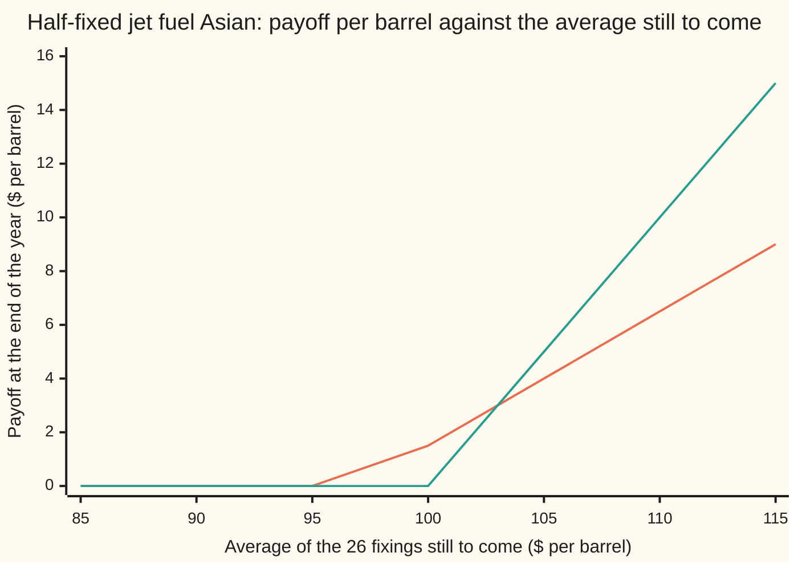
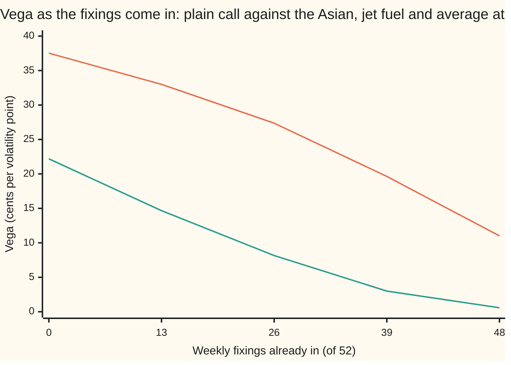

# Asian Greeks and the average already banked: damped delta and vega, and the strike that shrinks as fixings come in

[Syllabus](../../../SYLLABUS.md) → [Financial mathematics](../../../SYLLABUS.md#w12) → [Averages - commodity swaps and Asian options](../../../SYLLABUS.md#w12-s27) → Asian Greeks and the average already banked

---

## General Overview

A bank has sold an airline a one-year call on the average price of jet fuel, which costs $100 a barrel. The contract reads the price once a week, 52 times; each reading is a **fixing**. At the end of the year the airline receives, per barrel, the average of the 52 fixings minus the $100 strike, if that is positive. This **arithmetic Asian call** costs $5.85 per barrel, simulated on [The Asian option desks trade](03-arithmetic-asian-option.md). A plain call on the last week's price costs $10.45.

The bank has to hedge what it sold, and hedging runs on the **Greeks**: the rates at which the price moves when one input moves. **Delta** is the dollars gained per $1 rise in jet fuel. **Gamma** is how fast delta itself changes per $1. **Vega** is the dollars gained per one percentage point of volatility (the yearly jumpiness of the price, 20 percent here). On a desk nobody hedges jet fuel with barrels in a tank. The hedge is a strip of futures, one for each delivery month, so the delta is also reported month by month, or here quarter by quarter: a **delta ladder**.

Six months on, 26 fixings are in, averaging $103, and jet fuel is back at $100. Those 26 prices can no longer move: $51.50 of the final average is settled money. What remains is half an option on the 26 fixings still to come, struck at $97 instead of $100. Its delta is 0.35, a little over half the fresh contract's 0.59, and its vega has fallen from 22 cents to 7 cents per volatility point.

**An Asian's Greeks come from two roads that must agree: reprice after a small bump on the same random draws, or differentiate the moment-matched formula; the fixings already in turn the rest of the contract into a smaller Asian with a new strike, so with prices steady every Greek drains as the year runs.**

**What kind of fact this is:** a method, bump and revalue on common random numbers, checked against the Greeks of an approximation (the moment-matched formula, within 2 cents on price and 0.005 on delta here); the rewrite of a part-fixed contract as a smaller option is an exact identity, proved on [Asian Greeks and implied volatility](../17-Averages%2C%20choosers%2C%20compounds%20and%20forward-starts/03-asian-greeks-and-implied-volatility.md) and checked here by simulation.

### The picture: the half-fixed contract at expiry

The average of the 26 fixings still to come runs left to right. The payoff per barrel at the end of the year runs up the page.



First line: the true contract. It starts paying at $97, not $100, and gains 50 cents per dollar, not a dollar. Second line: the same 26 fixings priced as if nothing were banked, which is the mistake the What-breaks table prices. The $51.50 already fixed moved the kink left and halved the slope.

---

## The formula

Notation first. There are $n$ fixings in all; $k$ are already in and $m = n - k$ are still to come. The fixings in averaged $\bar a$. The weight of the open part is $w = m/n$. The fixings still to come are $X_1, \dots, X_m$, at times $t_1, \dots, t_m$ in years from today, and they will average $A_{\text{rest}}$, unknown today. For each fixing date the futures market quotes today a **forward price** $F_i$: the price agreed now for a barrel delivered on that date. The final payoff is paid at the last fixing, $\tau$ years from now, and $e^{-r\tau}$ discounts it at the bank rate $r$.

**The banked part** (proved on the shelf-17 card; one line of algebra):

$$A = \frac{k}{n}\,\bar a + w\,A_{\text{rest}}, \qquad (A - K)^+ = w\,\big(A_{\text{rest}} - K^*\big)^+, \qquad K^* = \frac{K - \tfrac{k}{n}\,\bar a}{w}$$

**Read it aloud:** subtract the settled money from the strike, scale the rest up by the open weight, and what remains is a smaller Asian on the fixings to come.

**The moment-matched price** (Lévy's approximation, fed the futures curve):

$$V \approx e^{-r\tau}\,w\,\big[M_1\,N(d_1) - K^*\,N(d_1 - v)\big], \qquad d_1 = \frac{\ln(M_1/K^*) + \tfrac12 v^2}{v}$$

$$M_1 = \frac{1}{m}\sum_{i=1}^{m} F_i, \qquad M_2 = \frac{1}{m^2}\sum_{i=1}^{m}\sum_{j=1}^{m} F_i F_j\,e^{\sigma^2 \min(t_i, t_j)}, \qquad v = \sqrt{\ln\!\big(M_2 / M_1^2\big)}$$

**Read it aloud:** replace the open average by a lognormal variable with the same mean and the same mean square, and price it with Black-76, the call formula for an option on a forward price.

**Its Greeks,** in closed form. When jet fuel moves, the whole curve moves in proportion, so $M_1$ is proportional to $S$ and $v$ does not change:

$$\Delta = e^{-r\tau}\,w\,\frac{M_1}{S}\,N(d_1), \qquad \Gamma = e^{-r\tau}\,w\,\frac{M_1}{S}\,\frac{\varphi(d_1)}{S\,v}, \qquad \mathcal{V} = e^{-r\tau}\,w\,M_1\,\varphi(d_1)\,\frac{\partial M_2/\partial\sigma}{2\,M_2\,v}$$

**Read it aloud:** the matched call's own Greeks, scaled by the open weight. Here $\varphi$ is the bell-curve height (the normal density).

**The bump road,** on the same random draws each time, with $h$ = $1 on jet fuel and one point on volatility:

$$\Delta \approx \frac{V(S+h) - V(S-h)}{2h}, \qquad \Gamma \approx \frac{V(S+h) - 2V(S) + V(S-h)}{h^2}, \qquad \mathcal{V} \approx \frac{V(\sigma + 0.01) - V(\sigma - 0.01)}{2}$$

**The ladder:** $\Delta_Q$ is the price change when only quarter Q's forwards rise 1 percent. The rungs add up to $\Delta$.

| Symbol | Plain meaning | In our example | Push it up and the answer… |
| --- | --- | --- | --- |
| $V$ | price of the Asian call today, per barrel | $5.87 fresh (formula); $2.89 half-fixed | — |
| $S$ | jet fuel's price today; the whole curve moves in proportion with it | $100 | V rises, by delta per $1 |
| $K$, $K^*$ | the strike; the strike the open average must beat | $100; $97.00 after 26 fixings at $103 | V falls |
| $n$, $k$, $m$ | fixings in all, already in, still to come | 52; 26 and 26 half-way | more k: less risk left |
| $\bar a$, $w$ | average of the fixings in; open weight m/n | $103; 0.50 | ā up: V and delta rise |
| $A$, $A_{\text{rest}}$, $X_i$, $i$, $j$ | the final average; the average still to come; the i-th fixing to come; counters over fixings | settles at the last fixing | — |
| $F_i$, $t_i$ | today's forward price for fixing i; its time from today in years | $100 grown at 5 percent to each date; i/52 | $F_i$ up: V up by that fixing's rung |
| $r$, $\tau$, $D$ | bank rate; time to the last fixing; $D = e^{-r\tau}$, the discount factor | 5%; 1 then 0.5; 0.9512 then 0.9753 | r up: forwards rise, discount deepens |
| $\sigma$, $W$ | volatility of every fixing's log, per year; the one random path (Brownian motion) all fixings share | 20% | V rises, always |
| $M_1$, $M_2$, $v$, $Y$ | expected open average (the fair swap price); its expected square; log-spread of the matched lognormal Y | $102.59, v 0.1180 fresh; $101.31, v 0.0843 half-fixed | — |
| $N$, $\varphi$, $d_1$ | bell-curve area and height; distance to the strike in spread units | d1 0.2758 fresh, 0.5577 half-fixed | — |
| $\Delta$, $\Gamma$, $\mathcal{V}$, $\Delta_Q$, $h$ | delta per $1; gamma per $1; vega per volatility point; one quarter's rung; bump size | 0.59, 0.032, $0.22 fresh; 0.35, 0.020, $0.07 half-fixed; h = $1 | — |

### When it holds

- **One volatility for every fixing.** A real curve has more volatility near the front month than in the back; each fixing then needs its own σ, and a single number misprices the option by roughly the gap, in points, times the vega.
- **All fixings driven by one random path.** Real curve points do not move in lockstep; with a second factor the far fixings are less correlated with the near ones, and the average is calmer than this card says.
- **Shared draws for every bump.** With fresh random numbers per bump, delta becomes the difference of two noisy prices; the noise does not shrink as the bump does ([Bump and revalue](../07-Greeks%20by%20Numbers%20and%20Calibration/01-bump-and-revalue-and-common-random-numbers.md)).
- **New strike above zero.** If the banked average $\bar a$ is so high that $K^* \le 0$, the call pays for certain: its price is $e^{-r\tau} w (M_1 - K^*)$, an average-price forward, vega is zero and gamma is zero. With 26 fixings at $205 the new strike is −5 and the price $51.84; the simulation agrees.
- **Draining is not a law.** It holds with prices steady. If the banked prices pull $K^*$ from far out of the money to the money, the half-option left has more gamma and vega than the fresh one had.
- **Lognormal matching is close, not exact.** A sum of lognormals is not lognormal. Here the formula sits 2 cents above the simulation on price and 0.004 on delta; the gap grows with volatility and length.

---

## Why it works

### Step 0: a Greek is a slope of an average, so take the slope on fixed draws

A simulated price is an average of payoffs over many random paths. Nudge an input, rerun on the **same** random numbers (common random numbers), and subtract: the shared noise cancels and the slope is left. The formula road reaches the same slopes by calculus on an approximate price. The two must agree within the approximation's error; that agreement is the check.

### Step 1: each fixing is a futures price, so the curve is the input

A commodity desk has no spot price and dividend yield to feed a model. It has the futures curve. A futures price has no drift in the pricing world: the contract costs nothing to enter, so its expected change must be zero ([Options on a futures price](../26-Options%20on%20commodity%20futures%20and%20spreads/01-options-on-commodity-futures.md)). Fixing i is that date's price, which the matching futures price reaches at delivery, so

$$X_i = F_i\,\exp\!\big(\sigma W(t_i) - \tfrac12\sigma^2 t_i\big),$$

where $W$ is one random path (a Brownian motion) shared by every fixing. The $-\tfrac12\sigma^2 t_i$ keeps the expected fixing equal to $F_i$. Here the curve is the house one, $F_i = 100\,e^{0.05\,t_i}$: full carry at the bank rate, no storage cost, no convenience yield. A real curve in backwardation (falling with delivery date) goes in the same slot; see [Contango and backwardation](../25-Commodity%20forwards%20-%20carry%2C%20storage%2C%20convenience%20yield%20and%20the%20curve/04-contango-backwardation-and-roll-yield.md).

On the equity card every fixing was today's share price grown at $r - q$. Here the input is a list of 52 prices, and every Greek can be asked per point of it.

**Conventions verified 28 Sep 2026:** a listed Gulf Coast jet fuel swap averages Platts' daily Gulf Coast Jet/Kero 54 mid-price over every business day of the contract month (AEGIS SEF rulebook, chapter 1403). That is about 250 fixings a year, grouped by month. The 52 weekly fixings here are the shelf's simpler schedule; the formulas take any schedule.

### Step 2: the two moments, from the one path

The average's mean is the average of the forwards: $M_1 = \frac1m \sum F_i$. For the fresh contract that is $102.59, the fair fixed price of a jet-fuel swap on the same fixings ([Commodity swap](01-commodity-swap-and-average-price-forward.md)).

For the mean square, multiply two fixings. Their logs share the path up to the earlier date, so the covariance of the logs is $\sigma^2 \min(t_i, t_j)$, and the expected product is $F_i F_j e^{\sigma^2 \min(t_i, t_j)}$. Average over all pairs: $M_2$. A lognormal variable with the same two moments has log-spread $v = \sqrt{\ln(M_2/M_1^2)}$: 0.1180 for the fresh contract, against 0.20 for one fixing a year out. Black-76 on a forward $M_1$ with spread $v$ gives the price.

<details>
<summary>Detailed proof: the moments and the matched Greeks</summary>

**Product of two fixings.** $\ln X_i + \ln X_j = \ln F_i + \ln F_j - \tfrac12\sigma^2(t_i + t_j) + \sigma\big(W(t_i) + W(t_j)\big)$. The sum $W(t_i) + W(t_j)$ is normal with variance $t_i + t_j + 2\min(t_i, t_j)$. The mean of $e^Y$ for a normal $Y$ is $e^{\text{mean} + \frac12\text{variance}}$, so $\mathbb{E}[X_i X_j] = F_i F_j\,e^{\sigma^2 \min(t_i, t_j)}$. Dividing the double sum by $m^2$ gives $M_2$.

**Matching.** A lognormal $Y$ with $\mathbb{E}[Y] = M_1$ and $\mathbb{E}[Y^2] = M_2$ has $\ln Y$ normal with variance $v^2 = \ln(M_2/M_1^2)$. Black-76 on it: $\mathbb{E}[(Y - K^*)^+] = M_1 N(d_1) - K^* N(d_1 - v)$.

**Delta and gamma.** Scaling $S$ scales every $F_i$ by the same factor, so $M_1 \propto S$, $M_2 \propto S^2$, and $v$ does not move. Then $\partial d_1/\partial S = 1/(S v)$, and the standard Black identity $M_1 \varphi(d_1) = K^* \varphi(d_1 - v)$ cancels the terms from $d_1$'s movement, leaving $\Delta = e^{-r\tau} w (M_1/S) N(d_1)$. Differentiating once more gives $\Gamma$.

**Vega.** $M_1$ does not depend on σ. Black-76's slope in its spread is $M_1 \varphi(d_1)$; the chain rule through $v^2 = \ln M_2 - 2\ln M_1$ gives $\partial v/\partial\sigma = (\partial M_2/\partial\sigma)/(2 M_2 v)$, with $\partial M_2/\partial\sigma = \frac{1}{m^2}\sum\sum F_i F_j e^{\sigma^2 \min(t_i, t_j)}\,2\sigma\min(t_i, t_j)$.

**Ladder adds up.** A 1 percent rise in every forward is, to first order, the sum of 1 percent rises quarter by quarter, and it equals a 1 percent rise in $S$: $1 at $100. So the rungs sum to delta.

</details>

### Step 3: why delta and vega are damped

Delta is the matched call's $N(d_1)$ times $M_1/S$, discounted. For the fresh contract: $0.9512 \times (102.5915/100) \times 0.6086$ = 0.5940. The plain call's delta is 0.6368. The average responds a little less to today's price than the last fixing does.

Vega is damped much harder. Volatility enters only through $v$, and the average keeps 0.1180 of spread where one year-end fixing keeps 0.20: vega per point falls from 37.52 cents to 22.19. Gamma goes the other way, 0.0318 against 0.0188, because a narrow spread bends the price tightly round the strike.

### Step 4: the banked fixings leave the ladder and shrink the rest

After 26 fixings averaging $103:

$$A = \tfrac{26}{52} \times 103 + \tfrac{26}{52}\,A_{\text{rest}} = 51.50 + 0.5\,A_{\text{rest}}, \qquad (A - 100)^+ = 0.5\,(A_{\text{rest}} - 97)^+.$$

The first two quarters of the ladder are now exactly zero: no forward for a date already fixed exists to hedge with. Every remaining Greek is 0.5 times the Greek of a six-month Asian on 26 fixings struck at $97. That six-month option is in the money (its matched forward is $101.31 against the $97 strike), so its own delta is high, near 0.7; the half weight cuts it to 0.35. The result is a little over half the fresh delta: the weight halves it and the in-the-money strike gives some back.

Vega shrinks three ways at once (the weight, the shorter time, the in-the-money strike): from 22 cents to 7 cents per point.

### Step 5: the other door

Pathwise differentiation (differentiating each path's payoff, then averaging) gives delta and vega with no bump; the equity card uses it, and [Greeks inside the simulation](../07-Greeks%20by%20Numbers%20and%20Calibration/02-pathwise-and-likelihood-ratio-greeks.md) proves when it is valid. Bumps are used here because a commodity risk system bumps each curve point anyway, and the ladder comes from the same runs.

---

## Worked numbers, by hand

The half-fixed contract: 26 fixings in at an average of $103, jet fuel at $100, 26 weekly fixings and half a year to go.

| Step | Arithmetic | Value |
| --- | --- | --- |
| settled money | $\tfrac{26}{52} \times 103$ | $51.50 |
| open weight $w$ | $26/52$ | 0.50 |
| new strike $K^*$ | $(100 - 51.50)/0.5$ | $97.00 |
| expected open average $M_1$ | average of $100\,e^{0.05\,i/52}$ over i = 1 … 26 | $101.3092 |
| log-spread $v$ | $\sqrt{\ln(M_2/M_1^2)}$ | 0.0843 |
| $d_1$ | $(\ln(101.3092/97) + \tfrac12 \times 0.0843^2)/0.0843$ | 0.5577 |
| $N(d_1)$, $N(d_1 - v)$ | bell-curve areas | 0.7115, 0.6820 |
| discount $D$ | $e^{-0.05 \times 0.5}$ | 0.9753 |
| **price** | $0.9753 \times 0.5 \times (101.3092 \times 0.7115 - 97 \times 0.6820)$ | **$2.89** (code, full precision: 2.8879) |
| **delta** | $0.9753 \times 0.5 \times (101.3092/100) \times 0.7115$ | **0.3515** |
| delta, simulated full contract | bump $1 on shared draws | 0.3504 |

The bank holds about 0.35 barrels of jet-fuel futures per barrel of contract, all in the second half of the year, where it held 0.59 spread over all four quarters in January.

### What breaks if you drop a piece

Right answers, formula road: half-fixed $2.89 with delta 0.35; fresh $5.87 with delta 0.59.

| Mistake | Comes out at | What went wrong |
| --- | --- | --- |
| Ignore the banked fixings: price the 26 to come as a fresh Asian struck at $100 | $3.98, delta 0.57 | The settled $51.50 was dropped: weight 1 instead of 0.5, strike $100 instead of $97 |
| Move the strike to $97 but keep full weight | $5.78, delta 0.70 | Twice the right answer: the open part is only half the average |
| Subtract the $51.50 from the strike but forget to divide by the weight | $25.75 | The strike must be rescaled to the open average's units: $(100 - 51.50)/0.5$, not $100 - 51.50$ |
| Use today's $100 for every fixing instead of the forward curve (fresh contract) | $4.45, delta 0.50 | A flat curve drops the carry: the average's forward is $102.59, not $100 |

---

## As the fixings come in

Jet fuel can sit still all year and the risk still drains: each Friday one more price is locked in. Hold jet fuel and the running average at $100, so the new strike stays $100:

| Fixings in | Price | Asian delta | Asian vega, cents per point | Plain call delta, same time left | Plain call vega, cents per point |
| --- | --- | --- | --- | --- | --- |
| 0 | $5.87 | 0.5940 | 22.19 | 0.6368 | 37.52 |
| 13 | $3.74 | 0.4379 | 14.67 | 0.6191 | 33.00 |
| 26 | $1.99 | 0.2855 | 8.16 | 0.5977 | 27.36 |
| 39 | $0.69 | 0.1382 | 3.00 | 0.5695 | 19.64 |
| 48 | $0.13 | 0.0409 | 0.58 | 0.5387 | 11.01 |

The plain call's delta barely moves: at the money it stays near 0.6 until the last day. The Asian's delta drains toward zero because every banked fixing takes its share of delta with it.

### Force one: the ladder empties from the front

Delta per quarter, per 1 percent rise in that quarter's forwards, simulated on shared draws:

```
quarter and contract    delta rung, per 1 percent rise in that quarter's forwards
Q1  fresh               ████████████████████████████          0.1377
Q1  26 fixings in                                             0.0000
Q2  fresh               █████████████████████████████         0.1455
Q2  26 fixings in                                             0.0000
Q3  fresh               ██████████████████████████████        0.1513
Q3  26 fixings in       ██████████████████████████████████    0.1717
Q4  fresh               ███████████████████████████████       0.1553
Q4  26 fixings in       ████████████████████████████████████  0.1789
```

Fresh, the later quarters carry slightly more delta: their forwards are higher. After 26 fixings, Q1 and Q2 hold nothing, and Q3 and Q4 each hold more than they did in January, because the $97 strike is now in the money. The four fresh rungs add up to the parallel delta, 0.59.

### Force two: vega drains faster than time



Top line: a plain call with the same time left, its vega shrinking roughly with the square root of that time. Bottom line: the Asian. It starts lower and falls faster, because two things shrink at once: the time left and the open weight.

---

## Code, from first principles, and it actually runs

The script prices the fresh and half-fixed contracts and their Greeks by two independent roads. Road 1 simulates 20,000 pairs of paths (each path and its mirror image) of 52 weekly fixings from a hand-written random number generator, with the geometric average (exact price from [Kemna-Vorst](02-kemna-vorst-geometric-asian.md)) as control variate, and bumps jet fuel, volatility and each quarter's forwards on the same draws. For the half-fixed contract it simulates the **original** payoff, banked fixings and all, so it tests the rewrite rather than assuming it. Road 2 is the moment-matched formula and its closed-form Greeks. The bell-curve area is a power series written out.

### Python

```python
# Asian Greeks and the running average -- the check behind the card.  Standard library only.
# Jet fuel: 52 weekly fixings, each lognormal around its own forward price (Black-76 style).
# Road 1: Monte Carlo on common random numbers, bumped, with the geometric average as control.
# Road 2: the moment-matched (Levy) formula and its closed-form Greeks.  No erf, no random module.
# Delta is per $1 on jet fuel with the whole forward curve moving in proportion.
from math import exp, log, sqrt, cos, sin, pi

def phi(x): return exp(-0.5 * x * x) / sqrt(2.0 * pi)
def N(x):                                   # normal CDF from its power series
    if abs(x) > 9.0: return 0.0 if x < 0 else 1.0
    term, total, k = x, x, 0
    while abs(term) > 1e-17 * abs(total):
        k += 1; term *= x * x / (2 * k + 1); total += term
    return 0.5 + phi(x) * total

def fwd(S, r, t): return [S * exp(r * ti) for ti in t]      # the forward for each fixing still to come
def moments(F, t, sig):                      # M1, M2 and dM2/dsigma of the open average
    m = len(F); M2 = dM2 = 0.0
    for i in range(m):
        for j in range(m):
            c = min(t[i], t[j]); e = F[i] * F[j] * exp(sig * sig * c)
            M2 += e; dM2 += e * 2 * sig * c
    return sum(F) / m, M2 / m / m, dM2 / m / m

def levy(S, F, t, sig, w, Ks, disc):         # price, delta, gamma, vega per vol point
    M1, M2, dM2 = moments(F, t, sig)
    if Ks <= 0: return disc * w * (M1 - Ks), disc * w * M1 / S, 0.0, 0.0
    v = sqrt(log(M2 / M1 / M1)); d1 = (log(M1 / Ks) + 0.5 * v * v) / v
    return (disc * w * (M1 * N(d1) - Ks * N(d1 - v)), disc * w * M1 / S * N(d1),
            disc * w * M1 / S * phi(d1) / (S * v), disc * w * M1 * phi(d1) * dM2 / (2 * M2 * v) / 100)

def geo(F, t, sig, w, Ks, disc):             # exact price of the geometric-average version (the control)
    m = len(F); mu = sum(log(f) for f in F) / m - 0.5 * sig * sig * sum(t) / m
    s2 = sig * sig * sum(min(a, b) for a in t for b in t) / m / m; G = exp(mu + 0.5 * s2)
    if Ks <= 0: return disc * w * (G - Ks)
    d1 = (log(G / Ks) + 0.5 * s2) / sqrt(s2)
    return disc * w * (G * N(d1) - Ks * N(d1 - sqrt(s2)))

def sim(F, t, sig, pairs, q):                # per path: open average, log geometric average, sum per quarter
    st, out, m = 20260927, [], len(F)
    def u():
        nonlocal st
        st = (st + 0x9E3779B97F4A7C15) & 0xFFFFFFFFFFFFFFFF; z = st
        z = ((z ^ (z >> 30)) * 0xBF58476D1CE4E5B9) & 0xFFFFFFFFFFFFFFFF
        z = ((z ^ (z >> 27)) * 0x94D049BB133111EB) & 0xFFFFFFFFFFFFFFFF
        return ((z ^ (z >> 31)) >> 11) * 2.0 ** -53
    for _ in range(pairs):
        zs = []
        while len(zs) < m:
            a, b = 1.0 - u(), u(); R = sqrt(-2.0 * log(a)); zs += [R * cos(2 * pi * b), R * sin(2 * pi * b)]
        for sgn in (1.0, -1.0):
            W, prev, A, L, Q = 0.0, 0.0, 0.0, 0.0, [0.0] * 4
            for i in range(m):
                W += sgn * zs[i] * sqrt(t[i] - prev); prev = t[i]
                x = F[i] * exp(sig * W - 0.5 * sig * sig * t[i]); A += x; L += log(x); Q[q[i]] += x
            out.append((A / m, L / m, Q))
    return out

def mc(P, F, t, sig, fixed, w, K, disc, scale=1.0, q=None, qb=-1, b=1.0):   # controlled price, shared draws
    m, Ks = len(F), (K - fixed) / w
    Fb = [f * scale * (b if qi == qb else 1.0) for f, qi in zip(F, q or [-1] * m)]
    tot = 0.0
    for A, L, Q in P:
        a = scale * (A + ((b - 1.0) * Q[qb] / m if qb >= 0 else 0.0))
        g = exp(L + log(scale) + (log(b) * q.count(qb) / m if qb >= 0 else 0.0))
        tot += max(fixed + w * a - K, 0.0) - w * max(g - Ks, 0.0)
    return disc * tot / len(P) + geo(Fb, t, sig, w, Ks, disc)

S, K, r, sig, n, pairs = 100.0, 100.0, 0.05, 0.20, 52, 20000
out = lambda lab, a, b: print(f"{lab:<34}{a:>11.4f}{b:>11.4f}")
# ---- fresh contract: 52 fixings to come, nothing banked ----
t = [(i + 1) / n for i in range(n)]; F = fwd(S, r, t); qid = [i // 13 for i in range(n)]; D = exp(-r)
P0, Pu, Pd = (sim(F, t, s, pairs, qid) for s in (sig, sig + 0.01, sig - 0.01))
v0, vu, vd = mc(P0, F, t, sig, 0, 1, K, D), mc(P0, F, t, sig, 0, 1, K, D, 1.01), mc(P0, F, t, sig, 0, 1, K, D, 0.99)
mcg = ((vu - vd) / 2, (vu - 2 * v0 + vd), (mc(Pu, F, t, sig + .01, 0, 1, K, D) - mc(Pd, F, t, sig - .01, 0, 1, K, D)) / 2)
lf = levy(S, F, t, sig, 1, K, D)
d1 = (log(F[-1] / K) + 0.5 * sig * sig) / sig; bl = D * (F[-1] * N(d1) - K * N(d1 - sig))
print(f"{'fresh, 52 fixings to come':<34}{'MC bumped':>11}{'formula':>11}")
out("price", v0, lf[0]); out("delta", mcg[0], lf[1]); out("gamma", mcg[1], lf[2]); out("vega per vol point", mcg[2], lf[3])
gx, gmc = geo(F, t, sig, 1, K, D), D * sum(max(exp(L) - K, 0) for A, L, Q in P0) / len(P0)
out("geometric control, exact / MC", gx, gmc)
out("plain Black-76 call: price, delta", bl, N(d1)); out("plain call: gamma, vega/point", phi(d1) / (S * sig), S * phi(d1) / 100)
def ladder(P, F, t, fixed, w, disc, q):     # delta per quarter: that quarter's forwards moved 1 percent
    if not P: return [0.0] * 4
    Ks = (K - fixed) / w; bump = lambda j, b: [f * (b if qi == j else 1.0) for f, qi in zip(F, q)]
    return [((mc(P, F, t, sig, fixed, w, K, disc, 1, q, j, 1.01) - mc(P, F, t, sig, fixed, w, K, disc, 1, q, j, 0.99)) / 2,
             (levy(S, bump(j, 1.01), t, sig, w, Ks, disc)[0] - levy(S, bump(j, 0.99), t, sig, w, Ks, disc)[0]) / 2)
            if j in q else (0.0, 0.0) for j in range(4)]
# ---- seasoned: 26 fixings banked at an average of 103, jet fuel back at 100, half a year left ----
lad0 = ladder(P0, F, t, 0, 1, D, qid); k, abar = 26, 103.0; fixed, w = k / n * abar, (n - k) / n; Ks = (K - fixed) / w
t2 = [(i + 1) / n for i in range(n - k)]; F2 = fwd(S, r, t2); D2 = exp(-r * t2[-1])
q2 = [(k + i) // 13 for i in range(n - k)]
Q0, Qu, Qd = (sim(F2, t2, s, pairs, q2) for s in (sig, sig + 0.01, sig - 0.01))
s0, su, sd = (mc(Q0, F2, t2, sig, fixed, w, K, D2, x) for x in (1.0, 1.01, 0.99))
sv = (mc(Qu, F2, t2, sig + .01, fixed, w, K, D2) - mc(Qd, F2, t2, sig - .01, fixed, w, K, D2)) / 2
ls = levy(S, F2, t2, sig, w, Ks, D2)
print(f"seasoned: banked part {fixed:.2f}, weight {w:.2f}, new strike {Ks:.2f}")
out("price, full payoff vs rewritten", s0, ls[0]); out("delta", (su - sd) / 2, ls[1])
out("gamma", su - 2 * s0 + sd, ls[2]); out("vega per vol point", sv, ls[3])
out("delta, seasoned / fresh", ((su - sd) / 2) / mcg[0], ls[1] / lf[1]); lad2 = ladder(Q0, F2, t2, fixed, w, D2, q2)
fx2 = k / n * 205.0; fwd_mc = mc(Q0, F2, t2, sig, fx2, w, K, D2); fwd_lv = levy(S, F2, t2, sig, w, (K - fx2) / w, D2)[0]
out("banked at 205: strike -5, price", fwd_mc, fwd_lv)
for lab, FF, tt, KK, dd in (("fresh", F, t, K, D), ("seasoned", F2, t2, Ks, D2)):
    M1, M2, _ = moments(FF, tt, sig); v = sqrt(log(M2 / M1 / M1)); e = (log(M1 / KK) + 0.5 * v * v) / v
    print(f"{lab + ': M1 v d1 N(d1) N(d1-v) D':<34}" + "".join(f"{x:>9.4f}" for x in (M1, v, e, N(e), N(e - v), dd)))
print(f"{'delta ladder, quarter':<22}{'fresh MC':>10}{'formula':>10}{'seas. MC':>10}{'formula':>10}")
for j in range(4):
    print(f"{'Q' + str(j + 1):<22}" + "".join(f"{x:>10.4f}" for x in lad0[j] + lad2[j]))
# ---- risk draining as fixings are set: jet fuel and the running average both held at 100 ----
print(f"{'fixings in':>10}{'price':>9}{'delta':>9}{'vega/pt':>9}{'call dlt':>9}{'call vg':>9}")
va, vc = [], []
for kk in (0, 13, 26, 39, 48):
    tk = [(i + 1) / n for i in range(n - kk)]; tau = tk[-1]; e1 = (r + 0.5 * sig * sig) * tau / (sig * sqrt(tau))
    p = levy(S, fwd(S, r, tk), tk, sig, (n - kk) / n, K, exp(-r * tau))
    print(f"{kk:>10}{p[0]:>9.4f}{p[1]:>9.4f}{p[3]:>9.4f}{N(e1):>9.4f}{S * phi(e1) * sqrt(tau) / 100:>9.4f}")
    va.append(100 * p[3]); vc.append(S * phi(e1) * sqrt(tau))
xs = [85.0 + 5 * i for i in range(7)]
for lab, row in (("chart, remaining average", xs), ("chart, seasoned payoff", [w * max(x - Ks, 0) for x in xs]),
                 ("chart, banked ignored", [max(x - K, 0) for x in xs]), ("chart, Asian vega cents", va), ("chart, call vega cents", vc)):
    print(f"{lab:<25}" + " ".join(f"{v:6.2f}" for v in row))
# ---- what breaks, and try changing ----
two = lambda lab, x: out(lab, x[0], x[1])
two("wrong: ignore banked, fresh 26 at 100", levy(S, F2, t2, sig, 1, K, D2))
two("wrong: strike 97 but full weight", levy(S, F2, t2, sig, 1, Ks, D2))
two("wrong: strike 100-51.5, not /0.5", levy(S, F2, t2, sig, w, K - fixed, D2))
two("wrong: flat curve at 100, fresh", levy(S, [S] * n, t, sig, 1, K, D))
two("try: banked at 97, strike 103", levy(S, F2, t2, sig, w, (K - k / n * 97) / w, D2))
tm = [(i + 1) / 12 for i in range(12)]; two("try: 12 monthly fixings, fresh", levy(S, fwd(S, r, tm), tm, sig, 1, K, D))
two("try: sigma 0.40, fresh", levy(S, F, t, 0.40, 1, K, D))
assert abs(gmc - gx) < 0.02, "raw simulator, no control: geometric average vs its exact price"
assert abs(v0 - lf[0]) < 0.03, "controlled simulation vs moment formula, fresh price"
assert abs(mcg[0] - lf[1]) < 0.01, "bumped delta vs formula delta"
assert abs(mcg[2] - lf[3]) < 0.005, "bumped vega vs formula vega"
assert abs(mcg[1] / lf[2] - 1) < 0.1, "bumped gamma vs formula gamma, within 10 percent"
assert abs(s0 - ls[0]) < 0.03, "full seasoned payoff simulated vs half an option struck at 97"
assert abs((su - sd) / 2 - ls[1]) < 0.01, "seasoned delta, bumped vs formula"
assert abs(sum(x[0] for x in lad0) - mcg[0]) < 0.002 and abs(sum(x[0] for x in lad2) - (su - sd) / 2) < 0.002, "rungs add up to delta"
assert abs(fwd_mc - fwd_lv) < 0.02, "strike below zero: simulated vs the certain-payout forward value"
assert abs(bl - 10.450583572185565) < 1e-9, "plain call against the house number"
print("ALL CHECKS PASS")
```

**Ran 2026-09-28 on macOS, Python 3.14.6, standard library only. All checks passed. Output, pasted from the run:**

```
fresh, 52 fixings to come           MC bumped    formula
price                                  5.8540     5.8732
delta                                  0.5899     0.5940
gamma                                  0.0319     0.0318
vega per vol point                     0.2201     0.2219
geometric control, exact / MC          5.6374     5.6395
plain Black-76 call: price, delta     10.4506     0.6368
plain call: gamma, vega/point          0.0188     0.3752
seasoned: banked part 51.50, weight 0.50, new strike 97.00
price, full payoff vs rewritten        2.8814     2.8879
delta                                  0.3504     0.3515
gamma                                  0.0203     0.0200
vega per vol point                     0.0707     0.0712
delta, seasoned / fresh                0.5940     0.5918
banked at 205: strike -5, price       51.8428    51.8422
fresh: M1 v d1 N(d1) N(d1-v) D     102.5915   0.1180   0.2758   0.6086   0.5627   0.9512
seasoned: M1 v d1 N(d1) N(d1-v) D  101.3092   0.0843   0.5577   0.7115   0.6820   0.9753
delta ladder, quarter   fresh MC   formula  seas. MC   formula
Q1                        0.1377    0.1388    0.0000    0.0000
Q2                        0.1455    0.1465    0.0000    0.0000
Q3                        0.1513    0.1524    0.1717    0.1721
Q4                        0.1553    0.1564    0.1789    0.1793
fixings in    price    delta  vega/pt call dlt  call vg
         0   5.8732   0.5940   0.2219   0.6368   0.3752
        13   3.7376   0.4379   0.1467   0.6191   0.3300
        26   1.9894   0.2855   0.0816   0.5977   0.2736
        39   0.6915   0.1382   0.0300   0.5695   0.1964
        48   0.1257   0.0409   0.0058   0.5387   0.1101
chart, remaining average  85.00  90.00  95.00 100.00 105.00 110.00 115.00
chart, seasoned payoff     0.00   0.00   0.00   1.50   4.00   6.50   9.00
chart, banked ignored      0.00   0.00   0.00   0.00   5.00  10.00  15.00
chart, Asian vega cents   22.19  14.67   8.16   3.00   0.58
chart, call vega cents    37.52  33.00  27.36  19.64  11.01
wrong: ignore banked, fresh 26 at 100     3.9787     0.5710
wrong: strike 97 but full weight       5.7758     0.7030
wrong: strike 100-51.5, not /0.5      25.7527     0.4940
wrong: flat curve at 100, fresh        4.4497     0.4979
try: banked at 97, strike 103          1.2951     0.2168
try: 12 monthly fixings, fresh         6.1742     0.5972
try: sigma 0.40, fresh                10.3826     0.5754
ALL CHECKS PASS
```

The simulated price, 5.8540, is the shelf's house number. The formula's gaps (2 cents on price, 0.004 on delta) are the approximation's, not noise: the raw simulator, with no control, lands within a fifth of a cent of the exact geometric price (5.6395 against 5.6374). For the half-fixed contract, the full original payoff lands within a cent of half an option struck at $97.

### Rust

Same roads, same generator, same order of arithmetic. No crates.

```rust
// Asian Greeks and the running average -- the same check as the Python, in Rust.  std only, no crates.
// Road 1: Monte Carlo on common random numbers, bumped, geometric average as control.
// Road 2: the moment-matched (Levy) formula and its closed-form Greeks.
// Compile: rustc --edition 2021 -O asian_greeks_and_the_running_average_check.rs -o /tmp/<dir>/chk
use std::f64::consts::PI;

fn phi(x: f64) -> f64 { (-0.5 * x * x).exp() / (2.0 * PI).sqrt() }
fn ncdf(x: f64) -> f64 {                            // normal CDF from its power series
    if x.abs() > 9.0 { return if x < 0.0 { 0.0 } else { 1.0 }; }
    let (mut term, mut total, mut k) = (x, x, 0.0);
    while term.abs() > 1e-17 * total.abs() { k += 1.0; term *= x * x / (2.0 * k + 1.0); total += term; }
    0.5 + phi(x) * total
}
fn fwd(s: f64, r: f64, t: &[f64]) -> Vec<f64> { t.iter().map(|ti| s * (r * ti).exp()).collect() }
fn moments(f: &[f64], t: &[f64], sig: f64) -> (f64, f64, f64) {
    let m = f.len() as f64; let (mut m2, mut dm2) = (0.0, 0.0);
    for i in 0..f.len() { for j in 0..f.len() {
        let c = t[i].min(t[j]); let e = f[i] * f[j] * (sig * sig * c).exp();
        m2 += e; dm2 += e * 2.0 * sig * c;
    } }
    (f.iter().sum::<f64>() / m, m2 / m / m, dm2 / m / m)
}
fn levy(s: f64, f: &[f64], t: &[f64], sig: f64, w: f64, ks: f64, disc: f64) -> [f64; 4] {
    let (m1, m2, dm2) = moments(f, t, sig);
    if ks <= 0.0 { return [disc * w * (m1 - ks), disc * w * m1 / s, 0.0, 0.0]; }
    let v = (m2 / m1 / m1).ln().sqrt(); let d1 = ((m1 / ks).ln() + 0.5 * v * v) / v;
    [disc * w * (m1 * ncdf(d1) - ks * ncdf(d1 - v)), disc * w * m1 / s * ncdf(d1),
     disc * w * m1 / s * phi(d1) / (s * v), disc * w * m1 * phi(d1) * dm2 / (2.0 * m2 * v) / 100.0]
}
fn geo(f: &[f64], t: &[f64], sig: f64, w: f64, ks: f64, disc: f64) -> f64 {
    let m = f.len() as f64;
    let mu = f.iter().map(|x| x.ln()).sum::<f64>() / m - 0.5 * sig * sig * t.iter().sum::<f64>() / m;
    let mut sm = 0.0; for a in t { for b in t { sm += a.min(*b); } }
    let s2 = sig * sig * sm / m / m; let g = (mu + 0.5 * s2).exp();
    if ks <= 0.0 { return disc * w * (g - ks); }
    let d1 = ((g / ks).ln() + 0.5 * s2) / s2.sqrt();
    disc * w * (g * ncdf(d1) - ks * ncdf(d1 - s2.sqrt()))
}
struct Path { a: f64, l: f64, q: [f64; 4] }
fn sim(f: &[f64], t: &[f64], sig: f64, pairs: usize, q: &[usize]) -> Vec<Path> {
    let mut st: u64 = 20260927; let m = f.len(); let mut out = Vec::new();
    let mut u = || { st = st.wrapping_add(0x9E3779B97F4A7C15); let mut z = st;
        z = (z ^ (z >> 30)).wrapping_mul(0xBF58476D1CE4E5B9); z = (z ^ (z >> 27)).wrapping_mul(0x94D049BB133111EB);
        ((z ^ (z >> 31)) >> 11) as f64 * 2f64.powi(-53) };
    for _ in 0..pairs {
        let mut zs: Vec<f64> = Vec::new();
        while zs.len() < m { let a = 1.0 - u(); let b = u(); let rr = (-2.0 * a.ln()).sqrt();
            zs.push(rr * (2.0 * PI * b).cos()); zs.push(rr * (2.0 * PI * b).sin()); }
        for sgn in [1.0, -1.0] {
            let (mut w, mut prev, mut a, mut l, mut qs) = (0.0, 0.0, 0.0, 0.0, [0.0f64; 4]);
            for i in 0..m {
                w += sgn * zs[i] * (t[i] - prev).sqrt(); prev = t[i];
                let x = f[i] * (sig * w - 0.5 * sig * sig * t[i]).exp(); a += x; l += x.ln(); qs[q[i]] += x;
            }
            out.push(Path { a: a / m as f64, l: l / m as f64, q: qs });
        }
    }
    out
}
#[allow(clippy::too_many_arguments)]
fn mc(p: &[Path], f: &[f64], t: &[f64], sig: f64, fixed: f64, w: f64, k: f64, disc: f64,
      scale: f64, q: &[usize], qb: i32, b: f64) -> f64 {
    let m = f.len() as f64; let ks = (k - fixed) / w;
    let fb: Vec<f64> = (0..f.len()).map(|i| f[i] * scale * (if qb >= 0 && q[i] as i32 == qb { b } else { 1.0 })).collect();
    let cnt = if qb >= 0 { q.iter().filter(|&&x| x as i32 == qb).count() as f64 } else { 0.0 };
    let mut tot = 0.0;
    for pa in p {
        let a = scale * (pa.a + if qb >= 0 { (b - 1.0) * pa.q[qb as usize] / m } else { 0.0 });
        let g = (pa.l + scale.ln() + if qb >= 0 { b.ln() * cnt / m } else { 0.0 }).exp();
        tot += (fixed + w * a - k).max(0.0) - w * (g - ks).max(0.0);
    }
    disc * tot / p.len() as f64 + geo(&fb, t, sig, w, ks, disc)
}
fn out(lab: &str, a: f64, b: f64) { println!("{:<34}{:>11.4}{:>11.4}", lab, a, b); }

fn main() {
    let (s, k, r, sig, n, pairs) = (100.0_f64, 100.0_f64, 0.05_f64, 0.20_f64, 52usize, 20000usize);
    let nf = n as f64;
    // ---- fresh contract ----
    let t: Vec<f64> = (0..n).map(|i| (i + 1) as f64 / nf).collect(); let f = fwd(s, r, &t);
    let qid: Vec<usize> = (0..n).map(|i| i / 13).collect(); let d = (-r).exp();
    let (p0, pu, pd) = (sim(&f, &t, sig, pairs, &qid), sim(&f, &t, sig + 0.01, pairs, &qid), sim(&f, &t, sig - 0.01, pairs, &qid));
    let pr = |p: &[Path], sg: f64, fx: f64, w: f64, sc: f64| mc(p, &f, &t, sg, fx, w, k, d, sc, &qid, -1, 1.0);
    let (v0, vu, vd) = (pr(&p0, sig, 0.0, 1.0, 1.0), pr(&p0, sig, 0.0, 1.0, 1.01), pr(&p0, sig, 0.0, 1.0, 0.99));
    let mcg = [(vu - vd) / 2.0, vu - 2.0 * v0 + vd, (pr(&pu, sig + 0.01, 0.0, 1.0, 1.0) - pr(&pd, sig - 0.01, 0.0, 1.0, 1.0)) / 2.0];
    let lf = levy(s, &f, &t, sig, 1.0, k, d);
    let fl = f[n - 1]; let d1 = ((fl / k).ln() + 0.5 * sig * sig) / sig; let bl = d * (fl * ncdf(d1) - k * ncdf(d1 - sig));
    println!("{:<34}{:>11}{:>11}", "fresh, 52 fixings to come", "MC bumped", "formula");
    out("price", v0, lf[0]); out("delta", mcg[0], lf[1]); out("gamma", mcg[1], lf[2]); out("vega per vol point", mcg[2], lf[3]);
    let gmc = d * p0.iter().map(|x| (x.l.exp() - k).max(0.0)).sum::<f64>() / p0.len() as f64;
    let gx = geo(&f, &t, sig, 1.0, k, d); out("geometric control, exact / MC", gx, gmc);
    out("plain Black-76 call: price, delta", bl, ncdf(d1)); out("plain call: gamma, vega/point", phi(d1) / (s * sig), s * phi(d1) / 100.0);
    let ladder = |p: &[Path], ff: &[f64], tt: &[f64], fixed: f64, w: f64, disc: f64, q: &[usize]| -> Vec<(f64, f64)> {
        let ks = (k - fixed) / w;
        let bump = |j: usize, b: f64| -> Vec<f64> { ff.iter().zip(q).map(|(x, &qi)| x * if qi == j { b } else { 1.0 }).collect() };
        (0..4).map(|j| if q.contains(&j) {
            ((mc(p, ff, tt, sig, fixed, w, k, disc, 1.0, q, j as i32, 1.01) - mc(p, ff, tt, sig, fixed, w, k, disc, 1.0, q, j as i32, 0.99)) / 2.0,
             (levy(s, &bump(j, 1.01), tt, sig, w, ks, disc)[0] - levy(s, &bump(j, 0.99), tt, sig, w, ks, disc)[0]) / 2.0)
        } else { (0.0, 0.0) }).collect()
    };
    let lad0 = ladder(&p0, &f, &t, 0.0, 1.0, d, &qid);
    // ---- seasoned: 26 banked at an average of 103, jet fuel back at 100 ----
    let (kk, abar) = (26usize, 103.0);
    let fixed = kk as f64 / nf * abar; let w = (n - kk) as f64 / nf; let ks = (k - fixed) / w;
    let t2: Vec<f64> = (0..n - kk).map(|i| (i + 1) as f64 / nf).collect(); let f2 = fwd(s, r, &t2); let d2 = (-r * t2[t2.len() - 1]).exp();
    let q2: Vec<usize> = (0..n - kk).map(|i| (kk + i) / 13).collect();
    let (q0, qu, qd) = (sim(&f2, &t2, sig, pairs, &q2), sim(&f2, &t2, sig + 0.01, pairs, &q2), sim(&f2, &t2, sig - 0.01, pairs, &q2));
    let sp = |p: &[Path], sg: f64, fx: f64, sc: f64| mc(p, &f2, &t2, sg, fx, w, k, d2, sc, &q2, -1, 1.0);
    let (s0, su, sd) = (sp(&q0, sig, fixed, 1.0), sp(&q0, sig, fixed, 1.01), sp(&q0, sig, fixed, 0.99));
    let sv = (sp(&qu, sig + 0.01, fixed, 1.0) - sp(&qd, sig - 0.01, fixed, 1.0)) / 2.0;
    let ls = levy(s, &f2, &t2, sig, w, ks, d2);
    println!("seasoned: banked part {:.2}, weight {:.2}, new strike {:.2}", fixed, w, ks);
    out("price, full payoff vs rewritten", s0, ls[0]); out("delta", (su - sd) / 2.0, ls[1]);
    out("gamma", su - 2.0 * s0 + sd, ls[2]); out("vega per vol point", sv, ls[3]);
    out("delta, seasoned / fresh", ((su - sd) / 2.0) / mcg[0], ls[1] / lf[1]);
    let lad2 = ladder(&q0, &f2, &t2, fixed, w, d2, &q2);
    let fx2 = kk as f64 / nf * 205.0; let fwd_mc = sp(&q0, sig, fx2, 1.0); let fwd_lv = levy(s, &f2, &t2, sig, w, (k - fx2) / w, d2)[0];
    out("banked at 205: strike -5, price", fwd_mc, fwd_lv);
    for (lab, ff, tt, kx, dd) in [("fresh", &f, &t, k, d), ("seasoned", &f2, &t2, ks, d2)] {
        let (m1, m2, _) = moments(ff, tt, sig); let v = (m2 / m1 / m1).ln().sqrt(); let e = ((m1 / kx).ln() + 0.5 * v * v) / v;
        println!("{:<34}{}", format!("{}: M1 v d1 N(d1) N(d1-v) D", lab), [m1, v, e, ncdf(e), ncdf(e - v), dd].iter().map(|x| format!("{:>9.4}", x)).collect::<String>());
    }
    println!("{:<22}{:>10}{:>10}{:>10}{:>10}", "delta ladder, quarter", "fresh MC", "formula", "seas. MC", "formula");
    for j in 0..4 { println!("{:<22}{:>10.4}{:>10.4}{:>10.4}{:>10.4}", format!("Q{}", j + 1), lad0[j].0, lad0[j].1, lad2[j].0, lad2[j].1); }
    // ---- risk draining as fixings are set ----
    println!("{:>10}{:>9}{:>9}{:>9}{:>9}{:>9}", "fixings in", "price", "delta", "vega/pt", "call dlt", "call vg");
    let (mut va, mut vc): (Vec<f64>, Vec<f64>) = (Vec::new(), Vec::new());
    for kx in [0usize, 13, 26, 39, 48] {
        let tk: Vec<f64> = (0..n - kx).map(|i| (i + 1) as f64 / nf).collect(); let tau = tk[tk.len() - 1];
        let e1 = (r + 0.5 * sig * sig) * tau / (sig * tau.sqrt());
        let p = levy(s, &fwd(s, r, &tk), &tk, sig, (n - kx) as f64 / nf, k, (-r * tau).exp());
        println!("{:>10}{:>9.4}{:>9.4}{:>9.4}{:>9.4}{:>9.4}", kx, p[0], p[1], p[3], ncdf(e1), s * phi(e1) * tau.sqrt() / 100.0);
        va.push(100.0 * p[3]); vc.push(s * phi(e1) * tau.sqrt());
    }
    let xs: Vec<f64> = (0..7).map(|i| 85.0 + 5.0 * i as f64).collect();
    let rows = [("chart, remaining average", xs.clone()), ("chart, seasoned payoff", xs.iter().map(|x| w * (x - ks).max(0.0)).collect()),
        ("chart, banked ignored", xs.iter().map(|x| (x - k).max(0.0)).collect()), ("chart, Asian vega cents", va), ("chart, call vega cents", vc)];
    for (lab, row) in rows.iter() { println!("{:<25}{}", lab, row.iter().map(|v| format!("{:6.2}", v)).collect::<Vec<_>>().join(" ")); }
    // ---- what breaks, and try changing ----
    let two = |lab: &str, x: [f64; 4]| out(lab, x[0], x[1]);
    two("wrong: ignore banked, fresh 26 at 100", levy(s, &f2, &t2, sig, 1.0, k, d2));
    two("wrong: strike 97 but full weight", levy(s, &f2, &t2, sig, 1.0, ks, d2));
    two("wrong: strike 100-51.5, not /0.5", levy(s, &f2, &t2, sig, w, k - fixed, d2));
    two("wrong: flat curve at 100, fresh", levy(s, &vec![s; n], &t, sig, 1.0, k, d));
    two("try: banked at 97, strike 103", levy(s, &f2, &t2, sig, w, (k - kk as f64 / nf * 97.0) / w, d2));
    let tm: Vec<f64> = (0..12).map(|i| (i + 1) as f64 / 12.0).collect();
    two("try: 12 monthly fixings, fresh", levy(s, &fwd(s, r, &tm), &tm, sig, 1.0, k, d));
    two("try: sigma 0.40, fresh", levy(s, &f, &t, 0.40, 1.0, k, d));

    assert!((gmc - gx).abs() < 0.02, "raw simulator, no control: geometric average vs its exact price");
    assert!((v0 - lf[0]).abs() < 0.03, "controlled simulation vs moment formula, fresh price");
    assert!((mcg[0] - lf[1]).abs() < 0.01, "bumped delta vs formula delta");
    assert!((mcg[2] - lf[3]).abs() < 0.005, "bumped vega vs formula vega");
    assert!((mcg[1] / lf[2] - 1.0).abs() < 0.1, "bumped gamma vs formula gamma, within 10 percent");
    assert!((s0 - ls[0]).abs() < 0.03, "full seasoned payoff simulated vs half an option struck at 97");
    assert!(((su - sd) / 2.0 - ls[1]).abs() < 0.01, "seasoned delta, bumped vs formula");
    assert!((lad0.iter().map(|x| x.0).sum::<f64>() - mcg[0]).abs() < 0.002 && (lad2.iter().map(|x| x.0).sum::<f64>() - (su - sd) / 2.0).abs() < 0.002, "rungs add up to delta");
    assert!((fwd_mc - fwd_lv).abs() < 0.02, "strike below zero: simulated vs the certain-payout forward value");
    assert!((bl - 10.450583572185565).abs() < 1e-9, "plain call against the house number");
    println!("ALL CHECKS PASS");
}
```

**Ran 2026-09-28 on macOS, rustc 1.98.1, no crates. All checks passed. Output, pasted from the run:**

```
fresh, 52 fixings to come           MC bumped    formula
price                                  5.8540     5.8732
delta                                  0.5899     0.5940
gamma                                  0.0319     0.0318
vega per vol point                     0.2201     0.2219
geometric control, exact / MC          5.6374     5.6395
plain Black-76 call: price, delta     10.4506     0.6368
plain call: gamma, vega/point          0.0188     0.3752
seasoned: banked part 51.50, weight 0.50, new strike 97.00
price, full payoff vs rewritten        2.8814     2.8879
delta                                  0.3504     0.3515
gamma                                  0.0203     0.0200
vega per vol point                     0.0707     0.0712
delta, seasoned / fresh                0.5940     0.5918
banked at 205: strike -5, price       51.8428    51.8422
fresh: M1 v d1 N(d1) N(d1-v) D     102.5915   0.1180   0.2758   0.6086   0.5627   0.9512
seasoned: M1 v d1 N(d1) N(d1-v) D  101.3092   0.0843   0.5577   0.7115   0.6820   0.9753
delta ladder, quarter   fresh MC   formula  seas. MC   formula
Q1                        0.1377    0.1388    0.0000    0.0000
Q2                        0.1455    0.1465    0.0000    0.0000
Q3                        0.1513    0.1524    0.1717    0.1721
Q4                        0.1553    0.1564    0.1789    0.1793
fixings in    price    delta  vega/pt call dlt  call vg
         0   5.8732   0.5940   0.2219   0.6368   0.3752
        13   3.7376   0.4379   0.1467   0.6191   0.3300
        26   1.9894   0.2855   0.0816   0.5977   0.2736
        39   0.6915   0.1382   0.0300   0.5695   0.1964
        48   0.1257   0.0409   0.0058   0.5387   0.1101
chart, remaining average  85.00  90.00  95.00 100.00 105.00 110.00 115.00
chart, seasoned payoff     0.00   0.00   0.00   1.50   4.00   6.50   9.00
chart, banked ignored      0.00   0.00   0.00   0.00   5.00  10.00  15.00
chart, Asian vega cents   22.19  14.67   8.16   3.00   0.58
chart, call vega cents    37.52  33.00  27.36  19.64  11.01
wrong: ignore banked, fresh 26 at 100     3.9787     0.5710
wrong: strike 97 but full weight       5.7758     0.7030
wrong: strike 100-51.5, not /0.5      25.7527     0.4940
wrong: flat curve at 100, fresh        4.4497     0.4979
try: banked at 97, strike 103          1.2951     0.2168
try: 12 monthly fixings, fresh         6.1742     0.5972
try: sigma 0.40, fresh                10.3826     0.5754
ALL CHECKS PASS
```

The two outputs agree line for line.

> [!TIP]
> **Try changing**
> Guess the direction first. Then run it.
> - **A cheaper banked average.** Set the 26 fixings to average $97 instead of $103. The new strike becomes $103, out of the money: price **$1.30**, delta **0.22**.
> - **Monthly fixings.** Twelve month-end fixings instead of 52 weekly ones. Fewer, later readings keep more spread: the fresh price rises to **$6.17** and delta to **0.60**.
> - **Double the volatility.** Set σ to 0.40. The fresh price goes to **$10.38**, delta falls to **0.58**: a wider spread pulls $N(d_1)$ down.
> - **Starve the simulation.** Set `pairs = 500`. The controlled price and Greeks barely move, because the geometric control absorbs most of the noise. The raw-simulator assert fails: without the control, 1,000 paths cannot place the geometric price within 2 cents.

---

## The usual mistake

> [!warning]
> **Treating the banked fixings as part of the option.** They are settled money. Pricing the 26 open fixings as a fresh Asian shows $3.98 and delta 0.57, where the truth is $2.89 and 0.35: 0.57 barrels of futures per barrel where 0.35 is right.
>
> Smaller traps:
> - **Moving the strike and forgetting the weight.** The new strike $97 applies to half a contract. Full weight doubles the price to $5.78.
> - **Feeding spot instead of the curve.** Every fixing has its own forward. A flat $100 for all 52 prices the fresh contract at $4.45 instead of $5.87.
> - **Gamma from fresh draws.** A second difference of two independent noisy prices is mostly noise. Use the same draws for the up, middle and down runs.
> - **Hedging with the plain call's delta.** 0.64 against the Asian's 0.59 fresh, and the gap widens every week as fixings bank.

---

## Where you meet it in real life

- **Airline fuel hedging.** A fuel bill is an average, so its hedge is an average-price option or swap. Mid-year, the bank hedges only the months still open.
- **The swap next door.** When the new strike falls to zero or below, the option is certain to pay and becomes an average-price forward: [Commodity swap](01-commodity-swap-and-average-price-forward.md).
- **Delta ladders on a commodity desk.** Risk is reported per futures month, not as one number, because each month is hedged with its own contract. The ladder on this card, by quarter, is the coarse version.
- **Quotes in volatility.** A dealer quoting the half-fixed Asian in volatility must say which model and which banked average it assumes; that inverse is [Implied vol from an Asian quote](05-asian-implied-volatility.md).

> **Say it back**
> An Asian's Greeks come from two roads: bump the input and reprice on the same random draws, or differentiate the moment-matched Black-76 formula fed the futures curve. Averaging damps delta a little and vega a lot. Once fixings are in, the settled part is money: the rest is a smaller option, weight m over n, struck at the strike minus the settled part, divided by the weight. For the jet-fuel contract half-way through at $103, that is half an option struck at $97, with delta 0.35 against 0.59 fresh. The banked months drop out of the delta ladder, and with prices steady every Greek drains as the year runs.

---

## What this builds on

- [The Asian option desks trade](03-arithmetic-asian-option.md): the contract itself, its $5.85 price, and the controlled simulation that this card bumps.
- [Bump and revalue](../07-Greeks%20by%20Numbers%20and%20Calibration/01-bump-and-revalue-and-common-random-numbers.md): why a bump on shared draws gives a clean slope and a bump on fresh draws does not.
- [Asian Greeks and implied volatility](../17-Averages%2C%20choosers%2C%20compounds%20and%20forward-starts/03-asian-greeks-and-implied-volatility.md): the equity version on Acme shares, which proves the banked-fixing rewrite and that the price rises strictly with volatility. This card reuses both and changes the inputs to a futures curve.

## Where this goes next

- [Implied vol from an Asian quote](05-asian-implied-volatility.md): the same formula run backwards, from a dealer's Asian quote to the one volatility that reproduces it, for fresh and half-fixed contracts.

This card prices the Greeks from a known volatility; the question left open is which volatility a quoted Asian price implies, and whether a half-fixed quote pins one down at all.

---

## Sources

Verified 28 Sep 2026: every link below resolves to the cited work.

- Black, Fischer. "The Pricing of Commodity Contracts." *Journal of Financial Economics* 3, no. 1–2 (1976): 167–179. [doi:10.1016/0304-405X(76)90024-6](https://doi.org/10.1016/0304-405X(76)90024-6). Black-76: the option on a forward price, the formula the moment road feeds.
- Kemna, A. G. Z., and A. C. F. Vorst. "A Pricing Method for Options Based on Average Asset Values." *Journal of Banking and Finance* 14, no. 1 (1990): 113–129. [doi:10.1016/0378-4266(90)90039-5](https://doi.org/10.1016/0378-4266(90)90039-5). The exact geometric price, used as the simulation's control.
- Turnbull, Stuart M., and Lee M. Wakeman. "A Quick Algorithm for Pricing European Average Options." *Journal of Financial and Quantitative Analysis* 26, no. 3 (1991): 377–389. [doi:10.2307/2331213](https://doi.org/10.2307/2331213). Moment matching for average options, including contracts already part-way through their averaging period.
- Levy, Edmond. "Pricing European Average Rate Currency Options." *Journal of International Money and Finance* 11, no. 5 (1992): 474–491. [doi:10.1016/0261-5606(92)90013-N](https://doi.org/10.1016/0261-5606(92)90013-N). The two-moment lognormal match used as road 2.
- AEGIS SEF. "Chapter 1403: Jet Fuel Basis Swap - Gulf Coast Jet CMA - Platts." Rulebook filing with the CFTC, 2023. [CFTC filing](https://www.cftc.gov/sites/default/files/filings/ptc/23/09/ptc0918236687.pdf). The monthly average of daily Platts jet fuel assessments, the real fixing schedule.
- Glasserman, Paul. *Monte Carlo Methods in Financial Engineering*. Springer, 2003. [Publisher page](https://link.springer.com/book/10.1007/978-0-387-21617-1). Common random numbers, control variates and finite-difference Greeks in simulation.
