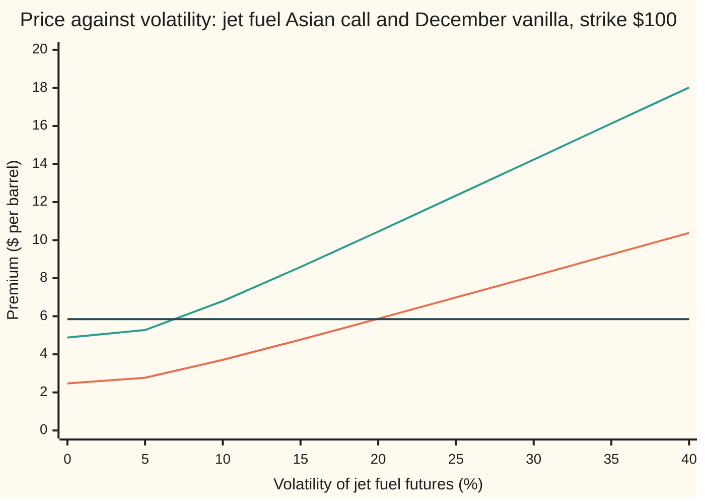

# Implied vol from an Asian quote: invert the moment-matched price, and why it is not the vanilla's vol

[Syllabus](../../../SYLLABUS.md) → [Financial mathematics](../README.md) → [Averages - commodity swaps and Asian options](../README.md#s27) → Implied vol from an Asian quote

---

## General Overview

A broker offers an airline a one-year call on the average price of jet fuel at \$5.854 a barrel. The contract reads the price once a week, 52 times; each reading is a **fixing**. At the end of the year it pays, per barrel, the average of the fixings above the \$100 strike. Each fixing reads the futures market. Jet fuel is \$100 today, and futures prices rise along the delivery dates as $100e^{0.05t}$ for delivery in $t$ years, reaching \$105.13 for December. The bank rate is 5 percent.

Every input to the price can be looked up except one: the **volatility**, the yearly spread of the futures price's log changes. Desks argue in volatility, not dollars. So the premium is run backwards: the **implied volatility** is the one volatility at which the pricing formula returns the quote.

The quick formula for this contract is Turnbull-Wakeman, which treats the average as lognormal (its log follows a bell curve) with the average's exact mean and mean square ([The Asian option desks trade](03-arithmetic-asian-option.md)). Run backwards on \$5.854, it answers 19.91 percent. A simulation of the exact model, run backwards the same way, answers 20.00 percent. The \$5.854 was that simulation's price at 20 percent, so both roads agree the quote means 20 percent volatility.

Now read the same \$5.854 through the plain call formula, fed the strip's own forward, the swap price of \$102.59. It answers 11.75 percent. Fed the December futures price, it answers 7.08 percent. Neither is a volatility of jet fuel: an average moves less than one price, and the plain formula mistakes the averaging for calm. The wrong contract gives the wrong vol. A rule of thumb repairs the reading: an average taken evenly from today to expiry carries about one third of the last price's total variance, so 11.75 percent times the square root of 3 should land near the Asian's vol. It gives 20.36 percent.

**The moment-matched price rises strictly with volatility, so an Asian quote between its zero-volatility floor and its infinite-volatility ceiling gives exactly one implied vol, on the same scale as a vanilla's; the same premium read through the vanilla formula returns the average's own spread, about the square root of a third of it.**

**What kind of fact this is:** a method, inverting a price formula, resting on a theorem: the price rises strictly with volatility, proved on this card in Why it works for Turnbull-Wakeman and on [Asian Greeks and implied volatility](../17-Averages%2C%20choosers%2C%20compounds%20and%20forward-starts/03-asian-greeks-and-implied-volatility.md) for the exact price. The divide-by-three rule is an approximation, its error stated in Worked numbers.

### The picture: two price curves, one quote



First line, lower: the Asian call by Turnbull-Wakeman, rising from its floor of \$2.47 at zero volatility. Second line, upper: a plain call on the December futures, from its floor of \$4.88. Flat line: the \$5.854 quote. Each rising line crosses the quote once. The Asian crosses near 20 percent; the vanilla crosses between 5 and 10 percent, at 7.08.

---

## The formula

Notation first, in words. $Q$ is the quoted premium. $C_{TW}(\sigma)$ is the Turnbull-Wakeman price when every fixing has volatility $\sigma$. The implied volatility $\hat\sigma$, read "sigma hat", is the solution of one equation:

$$C_{TW}(\hat\sigma) = Q, \qquad C_{TW}(\sigma) = e^{-rT}\big(M_1\,N(e_1) - K\,N(e_2)\big)$$

**Read it aloud:** find the volatility at which the moment-matched price of the average equals the quote.

The price is Black-76, the plain call formula for a futures price, fed the average's forward $M_1$ and the average's own log-spread $v_A$. [The Asian option desks trade](03-arithmetic-asian-option.md) derives the parts; here they are in one line each.

$$M_1 = \frac1n\sum_{i=1}^{n} F(0,t_i), \qquad M_2(\sigma) = \frac{1}{n^2}\sum_{i=1}^{n}\sum_{j=1}^{n} F(0,t_i)\,F(0,t_j)\,e^{\sigma^2\min(t_i,\,t_j)}$$

In words: $M_1$ is the plain average of the futures curve at the fixing dates, the price of the matching swap; $M_2$ is the average's mean square, and it is the only place volatility enters.

$$v_A(\sigma) = \sqrt{\ln\!\big(M_2/M_1^2\big)}, \qquad e_1 = \frac{\ln(M_1/K) + \tfrac12 v_A^2}{v_A}, \qquad e_2 = e_1 - v_A$$

In words: $v_A$ is the log-spread a lognormal needs to have both moments; $e_1$ and $e_2$ are the plain call's cut-offs with the average in place of the futures price.

A solution exists, and only one, exactly when the quote sits inside a band:

$$e^{-rT}\,(M_1 - K)^+ \;<\; Q \;<\; e^{-rT}\,M_1$$

**Read it aloud:** the quote must exceed the discounted payoff with no volatility at all, and stay below the discounted value of the whole average.

Newton's method solves it fast, stepping by the price error over the slope:

$$\sigma_{k+1} = \sigma_k - \frac{C_{TW}(\sigma_k) - Q}{\mathcal{V}(\sigma_k)}, \qquad \mathcal{V}(\sigma) = e^{-rT}\,M_1\,\varphi(e_1)\,\frac{M_2'(\sigma)}{2\,v_A\,M_2}$$

In words: $\mathcal{V}$, the vega, is the price's slope in volatility; $\varphi$ is the bell curve's height; and $M_2'$ is the slope of $M_2$, the same double sum with each term multiplied by $2\sigma\min(t_i,t_j)$.

The sanity check reads the vanilla formula's answer back into an Asian vol:

$$\sigma_{\text{van}} \approx \hat\sigma\,\sqrt{c}, \qquad c = \frac{(n+1)(2n+1)}{6n^2} \;\to\; \frac13, \qquad c \approx \frac{t_0 + L/3}{T} \text{ for a window}$$

**Read it aloud:** the vol the plain formula reads is the Asian's vol times the square root of the share of variance the average keeps: a third for an average from today to expiry, more for an average squeezed near expiry.

| Symbol | Plain meaning | In our example | Push it up and the answer… |
| --- | --- | --- | --- |
| $Q$ | the quoted Asian premium, per barrel | \$5.854 | implied vol rises |
| $\sigma$, $\sigma_k$, $\hat\sigma$ | a trial volatility; Newton's k-th guess; the implied volatility | 20%; from 30%; 19.91% by the formula, 20.00% by simulation | — |
| $C_{TW}$ | the Turnbull-Wakeman price at a given volatility | \$5.87 at 20% | is the answer's target |
| $K$, $r$, $T$ | strike; bank rate, continuously compounded; expiry in years; $e^{-rT}$ discounts a dollar paid at $T$ | \$100; 5%; 1 | $K$ up: implied vol up for the same quote |
| $n$, $i$, $j$, $t_i$ | number of fixings; their counters; date of fixing $i$ in years | 52 weekly; $t_i = i/52$ | $n$ up: slightly less variance kept |
| $F(0,t)$, $F_i$, $t$ | today's futures price for delivery at date $t$; the one at fixing $i$ | $100e^{0.05t}$; \$105.13 for December | curve up: implied vol down |
| $M_1$, $M_2$, $M_2'$ | mean of the average, the swap price; its mean square; that square's slope in $\sigma$ | \$102.59 | $M_1$ up: floor and ceiling rise |
| $v_A$, $e_1$, $e_2$ | the average's fitted log-spread over the whole life; the cut-offs | 0.1180 at 20% | $v_A$ up: price up |
| $N$, $\varphi$ | bell-curve area to the left; bell-curve height | — | — |
| $\mathcal{V}$ | vega, dollars per unit of volatility | \$0.2219 per point at 20% | bigger vega: flatter inverse, a tighter vol |
| $\sigma_{\text{van}}$, $c$ | the vol the plain formula reads from $Q$; share of the last price's log-variance the average keeps | 11.75%; 0.343 | $c$ up: the two vols converge |
| $t_0$, $L$, $W$ | start and length of an averaging window; in the proofs, the one random path moving the curve | December: 11/12 and 1/12 of a year | $t_0$ up: $c$ nearer 1 |

### When it holds

- **One volatility for every fixing.** Near-dated energy futures usually move more than far-dated ones. The Asian's single implied vol is then a blend of the strip's vols, weighted toward the later fixings, and it need not equal the December option's vol even when the market is consistent.
- **One random path moves the whole curve.** If the fixings read delivery months that are not perfectly correlated, the true $M_2$ is smaller, the market price is lower, and the implied vol reads low.
- **The lognormal fit.** Turnbull-Wakeman overprices this contract by 1.9 cents at 20 percent. Divided by the vega of 22 cents a point, that is roughly the gap between its 19.91 percent and the simulation's 20.00 percent, and it grows with the total variance $\sigma^2 T$.
- **A quote inside the band.** Below \$2.47 or above \$97.59 no volatility fits; a solver without the check returns the edge of its search interval, which means nothing.
- **No fixings banked.** Part-way through the year, invert the open part of the contract with its shifted strike ([Asian Greeks and the average already banked](04-asian-greeks-and-the-running-average.md)). If the banked fixings already guarantee payment, the price no longer depends on volatility and no implied vol exists.

---

## Why it works

### Step 0: an inverse needs a price that only climbs

A quote maps to one volatility only if the price rises strictly as volatility rises. Then each price level is crossed once, and a search that keeps the half of an interval containing the quote cannot miss. The equity card on shelf 17 proves the exact Asian price has this property, by a convexity argument, and inverts an Acme quote back to 20 percent ([Asian Greeks and implied volatility](../17-Averages%2C%20choosers%2C%20compounds%20and%20forward-starts/03-asian-greeks-and-implied-volatility.md)). This card spends its length on what a commodity changes: the average is of futures prices along a curve, the formula is Black-76 with the strip's forward in place of a spot price, and the fixing schedule is the contract's own.

### Step 1: the band comes from the swap price

With no volatility every fixing lands on today's futures price, so the average lands on $M_1$, the swap price, \$102.59. The call then pays $M_1 - K$ for sure, worth $e^{-rT}(M_1 - K)$ = \$2.47 today. That is the floor.

With unbounded volatility almost every path's average collapses toward zero while its mean stays at $M_1$: the rare huge paths carry the whole mean. The strike then almost never matters, and the call is worth the discounted average itself, \$97.59. That is the ceiling.

The floor is commodity-specific. An equity desk grows a spot price at the bank rate less the dividend yield. A fuel desk reads the curve at each fixing date. The December vanilla's floor is higher, \$4.88, because its forward is the curve's far end, \$105.13, not the average of the curve.

### Step 2: the moment-matched price rises strictly with volatility

Volatility enters only through $M_2$. Each term of $M_2$ is $F_i F_j e^{\sigma^2\min(t_i,t_j)}$, which grows with $\sigma$. So $M_2$ grows, and $v_A$ grows with it. The Black-76 price grows with $v_A$: a wider spread lifts a call, whose loss is capped. A chain of increasing steps is increasing.

<details>
<summary>Detailed proof: monotone, continuous, and one root</summary>

**Slope in the spread.** Write $B(v) = e^{-rT}\big(M_1 N(e_1) - K N(e_1 - v)\big)$. The identity $M_1\varphi(e_1) = K\varphi(e_2)$ holds because $\ln(M_1/K) = \tfrac12(e_1^2 - e_2^2)$, which is the definition of $e_1$ rearranged. Differentiating, the terms in $\partial e_1/\partial v$ cancel by that identity, leaving $B'(v) = e^{-rT} M_1\varphi(e_1) > 0$.

**Slope of the spread.** $v_A^2 = \ln M_2 - 2\ln M_1$, and $M_1$ does not involve $\sigma$. So $2 v_A v_A' = M_2'/M_2$. Every term of $M_2'$ is $2\sigma\min(t_i,t_j)F_iF_je^{\sigma^2\min(t_i,t_j)}$, positive for $\sigma > 0$. Hence $v_A' > 0$, and by the chain rule $\mathcal{V} = B'(v_A)\,v_A' > 0$: the formula in The formula.

**Limits.** As $\sigma \to 0$, $M_2 \to M_1^2$ and $v_A \to 0$. If $M_1 > K$, both cut-offs run to $+\infty$ and the price tends to $e^{-rT}(M_1 - K)$; if $M_1 < K$, both run to $-\infty$ and it tends to 0. Either way the limit is the floor. As $\sigma \to \infty$, $M_2 \to \infty$ and $v_A \to \infty$; then $e_1 \to +\infty$ and $e_2 = (\ln(M_1/K) - \tfrac12 v_A^2)/v_A \to -\infty$, so the price tends to $e^{-rT}M_1$.

**One root.** The price is continuous and strictly increasing in $\sigma$ and runs between the two limits without reaching either. By the intermediate value theorem each $Q$ strictly inside the band is hit exactly once, and no $Q$ outside it is hit at all.

</details>

### Step 3: two solvers on the formula

**Bisection** brackets the root between 0.0001 percent and 500 percent, checks that the quote lies between the prices at the two ends, and halves until the interval is narrower than $10^{-13}$. It cannot fail, because the price only climbs.

**Newton's method** replaces the price curve by its tangent at the current guess and jumps to where the tangent meets the quote ([Newton's method](../../06-Calculus%20and%20analysis/03-What%20Derivatives%20Tell%20You/06-newtons-method.md)). The slope is the exact vega from Step 2. From 30 percent the guesses run 19.987221, 19.913274, 19.913267 percent. The curve in the picture is nearly straight, so the first jump lands within a tenth of a point. Bisection and Newton agree to every printed digit.

### Step 4: a third road, inverting the simulation

Turnbull-Wakeman is an approximation. The exact model has no formula, but it has a precise simulation: 50,000 simulated years of weekly fixings, priced with the geometric average as a control, whose exact price corrects most of the noise (the method of [The Asian option desks trade](03-arithmetic-asian-option.md)). At 20 percent it gives \$5.854446 with an error bar of a tenth of a cent.

To invert it, draw the random numbers once and reuse them at every trial volatility. Then the simulated price is a smooth function of $\sigma$, not a new noisy number at each try. The secant method, Newton with the slope estimated from the last two tries, needs 6 simulated prices to find 19.998 percent. The formula's 19.91 percent is the lognormal fit's error expressed in volatility.

### Step 5: why the vanilla formula reads the average's spread

Turnbull-Wakeman *is* Black-76, fed $M_1$ and $v_A$. So if the vanilla formula is fed the swap price $M_1$ and asked what volatility reproduces \$5.854, it must answer $v_A(\hat\sigma)$, the average's log-spread over the year: 11.75 percent. The code prints both: they agree to every digit.

That number is a property of the average, not of jet fuel. $\hat\sigma$ is the volatility of each fixing, the same kind of number as the December vanilla's implied vol, and the two can be compared directly. $\sigma_{\text{van}}$ is smaller because averaging cancels part of the movement.

Feeding the December futures instead, \$105.13, gives 7.08 percent. The vanilla formula then also believes the payoff centres on \$105.13 rather than \$102.59, and cuts the volatility further to hold the price down.

### Step 6: total variance divided by three

The log of an average behaves nearly like the average of the logs, and that is a bell curve whose variance can be counted. For an average taken evenly from today to expiry, it keeps a share $c$ of the last price's log-variance $\sigma^2 T$. Continuous averaging keeps exactly one third. Weekly averaging over 52 weeks keeps 0.343, a touch more because the last fixing sits on the expiry date.

So $v_A \approx \hat\sigma\sqrt{cT}$, and the Asian's vol can be recovered from the vanilla reading: 11.75 percent times the square root of 3 is 20.36 percent; divided by the square root of 0.343 it is 20.07 percent. Both land within half a point of 20.00. What remains is the curve's slope and the lognormal fit.

<details>
<summary>Detailed proof: where the three comes from</summary>

Let $W$ be the Brownian path driving every fixing: its values at two dates have covariance equal to the earlier date. The log of fixing $i$ is a constant plus $\sigma W_{t_i}$, so the average of the logs has variance $\sigma^2$ times $\frac{1}{n^2}\sum_i\sum_j \min(t_i,t_j)$.

With $t_i = iT/n$, the double sum counts each $\min(i,j)$: $\sum_i\sum_j \min(i,j) = \sum_{k=1}^{n}(n-k+1)^2 = n(n+1)(2n+1)/6$. So the variance is $\sigma^2 T\,(n+1)(2n+1)/(6n^2) = \sigma^2 T c$. As $n$ grows, $c \to 2n^3/(6n^3) = 1/3$.

For a window of length $L$ ending at $T$, starting at $t_0 = T - L$, split the path at each fixing into its value at the window's start plus its movement after that. The first part is shared by every fixing and contributes $t_0$. The second is a fresh average over length $L$ and contributes $L/3$. So $c \approx (t_0 + L/3)/T$.

</details>

### Step 7: the fixing schedule changes the rule

Commodity average options often settle on one calendar month: the average of the daily prices in that month. Take one on the December month, bought now: 21 daily fixings from 11/12 of a year to one year.

**Conventions verified 28 Sep 2026:** a listed Gulf Coast jet fuel swap averages a daily price over every business day of its contract month ([Asian Greeks and the average already banked](04-asian-greeks-and-the-running-average.md)). The 52 weekly fixings elsewhere on this card are the shelf's simpler schedule.

Most of the variance is already in place before the window opens, so the average keeps almost all of it: $c \approx 11/12 + 1/36$, and the rule says $\sigma_{\text{van}} \approx$ 19.44 percent.

The card's own check prices this contract at 20 percent: \$10.12, next to \$10.45 for the December vanilla. Read through the vanilla formula on its swap price, \$104.92, it gives 19.46 percent, against the rule's 19.44. Applying "divide by three" blindly would claim the Asian's vol is 33.70 percent. The rule is about the schedule, not about Asians.

---

## Worked numbers, by hand

Jet fuel: curve $100e^{0.05t}$, $K$ = \$100, $r$ = 5%, $T$ = 1 year, 52 weekly fixings, quote $Q$ = \$5.854.

| Step | Arithmetic | Value |
| --- | --- | --- |
| swap price | $M_1 = \frac{1}{52}\sum 100e^{0.05\,i/52}$ | \$102.5915 |
| floor | $e^{-0.05}(102.5915 - 100)$ | \$2.4651 |
| ceiling | $e^{-0.05} \times 102.5915$ | \$97.5881 |
| quote inside the band? | 2.4651 < 5.854 < 97.5881 | yes: one vol |
| Turnbull-Wakeman at 20% | Black-76 on $M_1$, $v_A$ = 0.1180 | \$5.873245 |
| gap to the quote | 5.873245 − 5.854 | \$0.019245 |
| vega at 20% | per volatility point | \$0.221911 |
| one Newton step | 20% − 0.019245 / 0.221911 points | 19.9133% |
| a second step | the step is now tiny | **19.913267%** |
| simulation, inverted | 6 prices on shared draws | **20.00%** |
| vanilla formula on $M_1$ | the log-spread at which Black-76 gives 5.854 | 11.75% |
| times the square root of 3 | continuous-average rule | 20.36% |
| divided by the square root of 0.343 | weekly-average rule | 20.07% |

A broker's \$5.854 is a quote for 20 percent volatility on jet fuel futures, the same volatility a December option at \$10.45 carries.

### What breaks if you drop a piece

| Mistake | Comes out at | What went wrong |
| --- | --- | --- |
| Read the Asian premium with the vanilla formula on the December futures | 7.08% | the wrong payoff and the wrong forward; averaging read as calm |
| Read it with the vanilla formula on the swap price | 11.75% | that is the average's spread, not a fixing's volatility |
| Price the average off a flat \$100, the equity habit with no carry | 26.29% | the forward is too low, so the volatility inflates to fill the premium |
| Treat the 52 fixings as independent draws | 118.71% | neighbouring weeks share almost all their movement |
| Solve a quote of \$2.40, below the floor | no volatility | the quote is under the zero-volatility value; the model cannot reach it |
| Apply divide-by-three to a December-month average | 33.70%, not 19.46% read | its window opens late, so it keeps most of the variance |

The code prints all six.

---

## Code, from first principles, and it actually runs

The code reaches the implied vol by three roads: bisection on Turnbull-Wakeman, Newton's method on Turnbull-Wakeman with its exact vega, and the secant method on the controlled simulation with shared random draws. It then reads the quote through the vanilla formula two ways, runs the divide-by-three check for the weekly and the December schedules, and prints every number on the card. The simulation uses the arithmetic-asian-option card's seed, so its price at 20 percent matches that card's.

### Python

```python
# Implied vol from an Asian quote on jet fuel: 52 weekly fixings read the futures curve 100 e^(0.05 t).
# Standard library only.  Nothing imported knows the answer: the bell-curve area, both root finders,
# the random numbers (splitmix64 + Box-Muller) and every simulated path are written out below.
from math import log, sqrt, exp, cos, pi, isnan
from array import array

K, r, T, n, Q = 100.0, 0.05, 1.0, 52, 5.854        # Q: the house Asian quote, $ per barrel

def N(x):                                   # area left of x: Marsaglia's series
    if x < -9.0: return 0.0
    if x > 9.0: return 1.0
    s, t, b, i = x, 0.0, x, 1.0
    while s != t:
        i += 2.0
        b, t = b * x * x / i, s
        s += b
    return 0.5 + s * exp(-0.5 * x * x - 0.91893853320467274178)
def black(F, v, k=K, tp=T):                 # Black-76: call on a lognormal with forward F, whole-life log-spread v
    d1 = (log(F / k) + 0.5 * v * v) / v
    return exp(-r * tp) * (F * N(d1) - k * N(d1 - v))
def curve(c, lvl=100.0): return lambda t: lvl * exp(c * t)
def dates(m, t1=T, t0=0.0): return [t0 + (t1 - t0) * (i + 1) / m for i in range(m)]
fw, ts = curve(0.05), dates(n)

def tw(s, f=fw, tx=ts, k=K):                # Turnbull-Wakeman price and its exact slope in s (vega)
    m, Fs = len(tx), [f(t) for t in tx]
    M1 = sum(Fs) / m
    M2 = dM2 = 0.0
    for i in range(m):
        for j in range(m):
            a = Fs[i] * Fs[j] * exp(s * s * min(tx[i], tx[j]))
            M2, dM2 = M2 + a, dM2 + a * 2.0 * s * min(tx[i], tx[j])
    M2, dM2 = M2 / (m * m), dM2 / (m * m)
    v = sqrt(log(M2 / (M1 * M1)))
    e1 = (log(M1 / k) + 0.5 * v * v) / v
    return black(M1, v, k, tx[-1]), exp(-r * tx[-1]) * M1 * exp(-0.5 * e1 * e1) / sqrt(2.0 * pi) * dM2 / (2.0 * v * M2), M1, v

def bisect(f, q, lo=1e-6, hi=5.0):         # f increasing: keep the half that straddles q
    if not f(lo) < q < f(hi): return float("nan")        # outside the band: no volatility fits
    while hi - lo > 1e-13:
        mid = 0.5 * (lo + hi)
        lo, hi = (mid, hi) if f(mid) < q else (lo, mid)
    return 0.5 * (lo + hi)
def newton(q, s=0.30):                      # step by price error over vega; the path is kept
    path = [s]
    while True:
        p, vg = tw(s)[:2]
        s -= (p - q) / vg
        path.append(s)
        if abs(path[-1] - path[-2]) < 1e-13: return s, path

state = 20260927                            # splitmix64, the arithmetic-asian-option card's seed
def uniform():
    global state
    state = (state + 0x9E3779B97F4A7C15) & 0xFFFFFFFFFFFFFFFF
    z = ((state ^ (state >> 30)) * 0xBF58476D1CE4E5B9) & 0xFFFFFFFFFFFFFFFF
    z = ((z ^ (z >> 27)) * 0x94D049BB133111EB) & 0xFFFFFFFFFFFFFFFF
    return ((z ^ (z >> 31)) >> 11) * 2.0 ** -53 + 2.0 ** -54

PATHS = 50000                               # one set of draws, reused at every trial volatility
Z = array("d", (sqrt(-2.0 * log(uniform())) * cos(2.0 * pi * uniform()) for _ in range(PATHS * n)))

def kv(s):                                  # geometric twin, exact (Kemna-Vorst on the curve)
    mu = sum(log(fw(t)) - 0.5 * s * s * t for t in ts) / n
    var = s * s * sum(min(a, b) for a in ts for b in ts) / (n * n)
    return black(exp(mu + 0.5 * var), sqrt(var))

def mc(s):                                  # controlled simulation: the geometric twin as control
    d, base = exp(-r * T), [log(fw(t)) - 0.5 * s * s * t for t in ts]
    steps = [s * sqrt(t - u) for t, u in zip(ts, [0.0] + ts[:-1])]
    sx = sxx = sy = syy = sxy = 0.0
    for p in range(PATHS):
        W = tot = totlog = 0.0
        for i in range(n):
            W += steps[i] * Z[p * n + i]
            tot, totlog = tot + exp(base[i] + W), totlog + base[i] + W
        X, Y = d * max(tot / n - K, 0.0), d * max(exp(totlog / n) - K, 0.0)
        sx, sxx, sy, syy, sxy = sx + X, sxx + X * X, sy + Y, syy + Y * Y, sxy + X * Y
    mx, my = sx / PATHS, sy / PATHS
    vy, cxy, vx = syy / PATHS - my * my, sxy / PATHS - mx * my, sxx / PATHS - mx * mx
    beta = cxy / vy
    return mx - beta * (my - kv(s)), sqrt((vx - beta * cxy) / PATHS)
def secant(f, q, a=0.19, b=0.21):           # road 3: root of the simulated price, secant steps
    fa, fb, k = f(a) - q, f(b) - q, 2
    while abs(b - a) > 1e-9:
        a, b, fa = b, b - fb * (b - a) / (fb - fa), fb
        fb, k = f(b) - q, k + 1
    return b, k

def row(label, *vals, dp=6):
    print(f"{label:<44}" + "".join(f"{v:>12.{dp}f}" for v in vals))

TW20, vega20, M1, vA20 = tw(0.20)
floor, ceil = exp(-r * T) * max(M1 - K, 0.0), exp(-r * T) * M1
iv_bis = bisect(lambda s: tw(s)[0], Q)
iv_new, npath = newton(Q)
mc20, se20 = mc(0.20)
iv_mc, evals = secant(lambda s: mc(s)[0], Q)
van_M1 = bisect(lambda v: black(M1, v), Q)           # vanilla formula on the strip's forward (the swap price)
van_dec = bisect(lambda v: black(fw(T), v), Q)       # vanilla formula on the December futures
c_week, below = (n + 1) * (2 * n + 1) / (6.0 * n * n), bisect(lambda s: tw(s)[0], 2.40)  # c: variance kept

for label, *vals in [("quote Q; strip forward M1; Dec futures", Q, M1, fw(T)),
        ("band: floor e^-rT (M1-K)+, ceiling e^-rT M1", floor, ceil),
        ("TW at 20%; vega/pt; gap to Q; one Newton step", TW20, vega20 / 100, TW20 - Q, 0.20 - (TW20 - Q) / vega20), ("TW log-spread vA at 20%", vA20),
        ("controlled simulation at 20%; error bar", mc20, se20),
        ("1 implied vol, bisection on TW", iv_bis), ("2 implied vol, Newton on TW", iv_new),
        ("3 implied vol, secant on simulation", iv_mc), ("  simulated prices used", evals),
        ("vanilla formula on M1 reads", van_M1), ("  TW log-spread at the TW implied vol", tw(iv_bis)[3]),
        ("vanilla formula on Dec futures reads", van_dec),
        ("sanity: read x sqrt(3); x 1/sqrt(c); c", van_M1 * sqrt(3.0), van_M1 / sqrt(c_week), c_week),
        ("wrong: flat curve at $100, TW implied", bisect(lambda s: tw(s, curve(0.0))[0], Q)),
        ("wrong: fixings independent, implied", bisect(lambda s: black(M1, s * sqrt(sum(ts)) / n), Q)),
        ("wrong: quote 2.40, below the floor", below)]:
    row(label, *vals)
print(f"{'Newton from 30%, vol in % after each step':<44}" + "".join(f"{100 * s:>12.6f}" for s in npath[1:5]))

dec = [11.0 / 12 + (i + 1) / 252.0 for i in range(21)]      # December average: 21 daily fixings
TWd, _, M1d, _ = tw(0.20, tx=dec)
van_d, rule_d = bisect(lambda v: black(M1d, v), TWd), 0.20 * sqrt(11.0 / 12 + 1.0 / 36)
row("Dec-only average: TW at 20%; M1; Dec vanilla", TWd, M1d, black(fw(T), 0.20))
row("  vanilla on its M1 reads; x sqrt(3); rule", van_d, van_d * sqrt(3.0), rule_d)
vols = [0, 5, 10, 15, 20, 25, 30, 35, 40]
curves = [[tw(max(v, 1e-4) / 100)[0] for v in vols], [black(fw(T), max(v, 1e-4) / 100) for v in vols]]
print(f"{'chart, vol %':<28}" + "".join(f"{v:>8d}" for v in vols))
for lab, cv in (("chart, Asian TW price", curves[0]), ("chart, vanilla on Dec price", curves[1])):
    print(f"{lab:<28}" + "".join(f"{p:>8.2f}" for p in cv))

assert abs(iv_bis - iv_new) < 1e-10, "bisection and Newton land on one root"
assert abs(tw(iv_bis)[0] - Q) < 1e-9, "the implied vol reprices the quote"
assert abs(vega20 - (tw(0.200001)[0] - tw(0.199999)[0]) / 2e-6) < 1e-5, "exact vega matches the price's slope"
assert abs(iv_mc - 0.20) < 0.002 and abs(mc20 - Q) < 3 * se20, "the simulation reads back 20% from its own price"
assert 0.0 < iv_mc - iv_bis < 0.003, "TW's small overpricing makes its implied vol slightly low"
assert abs(van_M1 - tw(iv_bis)[3]) < 1e-9, "vanilla on M1 reads exactly TW's fitted log-spread"
assert abs(van_M1 * sqrt(3.0) - iv_mc) < 0.01, "total variance over three: within one vol point"
assert abs(c_week - sum(min(a, b) for a in ts for b in ts) / (n * n * T)) < 1e-12, "c counts the weekly overlap"
assert abs(van_d - rule_d) < 0.001, "the window rule reads the December average"
assert all(a < b for a, b in zip(curves[0], curves[0][1:])) and abs(curves[0][0] - floor) < 1e-9, "rising from the floor"
assert isnan(below) and not isnan(bisect(lambda s: tw(s)[0], floor + 0.01)), "no vol below the floor, one just above"
print("ALL CHECKS PASS")
```

**Ran 2026-09-28 on macOS, Python 3.14.6, standard library only. All checks passed. Output, pasted from the run:**

```
quote Q; strip forward M1; Dec futures          5.854000  102.591500  105.127110
band: floor e^-rT (M1-K)+, ceiling e^-rT M1     2.465111   97.588053
TW at 20%; vega/pt; gap to Q; one Newton step    5.873245    0.221911    0.019245    0.199133
TW log-spread vA at 20%                         0.118036
controlled simulation at 20%; error bar         5.854446    0.001010
1 implied vol, bisection on TW                  0.199133
2 implied vol, Newton on TW                     0.199133
3 implied vol, secant on simulation             0.199980
  simulated prices used                         6.000000
vanilla formula on M1 reads                     0.117523
  TW log-spread at the TW implied vol           0.117523
vanilla formula on Dec futures reads            0.070834
sanity: read x sqrt(3); x 1/sqrt(c); c          0.203555    0.200663    0.343010
wrong: flat curve at $100, TW implied           0.262917
wrong: fixings independent, implied             1.187139
wrong: quote 2.40, below the floor                   nan
Newton from 30%, vol in % after each step      19.987221   19.913274   19.913267   19.913267
Dec-only average: TW at 20%; M1; Dec vanilla   10.121086  104.918807   10.450584
  vanilla on its M1 reads; x sqrt(3); rule      0.194576    0.337016    0.194365
chart, vol %                       0       5      10      15      20      25      30      35      40
chart, Asian TW price           2.47    2.77    3.71    4.77    5.87    6.99    8.11    9.25   10.38
chart, vanilla on Dec price     4.88    5.28    6.80    8.59   10.45   12.34   14.23   16.13   18.02
ALL CHECKS PASS
```

### Rust

```rust
// Implied vol from an Asian quote on jet fuel: 52 weekly fixings read the futures curve 100 e^(0.05 t).
// Rust std only.  Nothing imported knows the answer: the bell-curve area, both root finders,
// the random numbers (splitmix64 + Box-Muller) and every simulated path are written out below.
use std::f64::consts::PI;
const K: f64 = 100.0;
const R: f64 = 0.05;
const T: f64 = 1.0;
const NF: usize = 52;
const Q: f64 = 5.854; // the house Asian quote, $ per barrel
const PATHS: usize = 50000; // one set of draws, reused at every trial volatility

fn ncdf(x: f64) -> f64 { // area left of x: Marsaglia's series
    if x < -9.0 { return 0.0; }
    if x > 9.0 { return 1.0; }
    let (mut s, mut t, mut b, mut i) = (x, 0.0, x, 1.0);
    while s != t { i += 2.0; b = b * x * x / i; t = s; s += b; }
    0.5 + s * (-0.5 * x * x - 0.91893853320467274178).exp()
}
fn black(f: f64, v: f64, k: f64, tp: f64) -> f64 { // Black-76 on a lognormal with forward f, log-spread v
    let d1 = ((f / k).ln() + 0.5 * v * v) / v;
    (-R * tp).exp() * (f * ncdf(d1) - k * ncdf(d1 - v))
}
fn fwd(c: f64, t: f64) -> f64 { 100.0 * (c * t).exp() } // futures price for delivery at t
// Turnbull-Wakeman on curve slope c and dates tx: (price, exact vega, M1, fitted log-spread)
fn tw(s: f64, c: f64, tx: &[f64], k: f64) -> (f64, f64, f64, f64) {
    let m = tx.len() as f64;
    let fs: Vec<f64> = tx.iter().map(|&t| fwd(c, t)).collect();
    let m1 = fs.iter().sum::<f64>() / m;
    let (mut m2, mut dm2) = (0.0, 0.0);
    for i in 0..tx.len() {
        for j in 0..tx.len() {
            let mn = tx[i].min(tx[j]);
            let a = fs[i] * fs[j] * (s * s * mn).exp();
            m2 += a; dm2 += a * 2.0 * s * mn;
        }
    }
    m2 /= m * m; dm2 /= m * m;
    let v = (m2 / (m1 * m1)).ln().sqrt();
    let e1 = ((m1 / k).ln() + 0.5 * v * v) / v;
    let tl = tx[tx.len() - 1];
    (black(m1, v, k, tl), (-R * tl).exp() * m1 * (-0.5 * e1 * e1).exp() / (2.0 * PI).sqrt() * dm2 / (2.0 * v * m2), m1, v)
}
fn bisect<F: Fn(f64) -> f64>(f: F, q: f64) -> f64 { // f increasing: keep the half that straddles q
    let (mut lo, mut hi) = (1e-6, 5.0);
    if !(f(lo) < q && q < f(hi)) { return f64::NAN; } // outside the band: no volatility fits
    while hi - lo > 1e-13 {
        let mid = 0.5 * (lo + hi);
        if f(mid) < q { lo = mid; } else { hi = mid; }
    }
    0.5 * (lo + hi)
}
struct Rng(u64);
impl Rng { // splitmix64, the arithmetic-asian-option card's seed
    fn uniform(&mut self) -> f64 {
        self.0 = self.0.wrapping_add(0x9E3779B97F4A7C15);
        let mut z = self.0;
        z = (z ^ (z >> 30)).wrapping_mul(0xBF58476D1CE4E5B9);
        z = (z ^ (z >> 27)).wrapping_mul(0x94D049BB133111EB);
        ((z ^ (z >> 31)) >> 11) as f64 * 2f64.powi(-53) + 2f64.powi(-54)
    }
}
fn kv(s: f64, ts: &[f64]) -> f64 { // geometric twin, exact (Kemna-Vorst on the curve)
    let n = ts.len() as f64;
    let mu = ts.iter().map(|&t| fwd(0.05, t).ln() - 0.5 * s * s * t).sum::<f64>() / n;
    let mut var = 0.0;
    for &a in ts { for &b in ts { var += a.min(b); } }
    var = s * s * var / (n * n);
    black((mu + 0.5 * var).exp(), var.sqrt(), K, T)
}
fn mc(s: f64, ts: &[f64], z: &[f64]) -> (f64, f64) { // controlled simulation, geometric twin as control
    let d = (-R * T).exp();
    let base: Vec<f64> = ts.iter().map(|&t| fwd(0.05, t).ln() - 0.5 * s * s * t).collect();
    let steps: Vec<f64> = (0..NF).map(|i| s * (ts[i] - if i == 0 { 0.0 } else { ts[i - 1] }).sqrt()).collect();
    let (mut sx, mut sxx, mut sy, mut syy, mut sxy) = (0.0, 0.0, 0.0, 0.0, 0.0);
    for p in 0..PATHS {
        let (mut w, mut tot, mut totlog) = (0.0, 0.0, 0.0);
        for i in 0..NF {
            w += steps[i] * z[p * NF + i];
            tot += (base[i] + w).exp(); totlog += base[i] + w;
        }
        let x = d * (tot / NF as f64 - K).max(0.0);
        let y = d * ((totlog / NF as f64).exp() - K).max(0.0);
        sx += x; sxx += x * x; sy += y; syy += y * y; sxy += x * y;
    }
    let pn = PATHS as f64;
    let (mx, my) = (sx / pn, sy / pn);
    let (vy, cxy, vx) = (syy / pn - my * my, sxy / pn - mx * my, sxx / pn - mx * mx);
    let beta = cxy / vy;
    (mx - beta * (my - kv(s, ts)), ((vx - beta * cxy) / pn).sqrt())
}
fn row(label: &str, vals: &[f64]) {
    let mut line = format!("{:<44}", label);
    for v in vals { line += &if v.is_nan() { format!("{:>12}", "nan") } else { format!("{:>12.6}", v) }; }
    println!("{}", line);
}
fn main() {
    let ts: Vec<f64> = (0..NF).map(|i| T * (i + 1) as f64 / NF as f64).collect();
    let mut rng = Rng(20260927);
    let z: Vec<f64> = (0..PATHS * NF).map(|_| { let u1 = rng.uniform(); let u2 = rng.uniform();
        (-2.0 * u1.ln()).sqrt() * (2.0 * PI * u2).cos() }).collect();
    let twp = |s: f64| tw(s, 0.05, &ts, K).0;
    let (tw20, vega20, m1, va20) = tw(0.20, 0.05, &ts, K);
    let (floor, ceil) = ((-R * T).exp() * (m1 - K).max(0.0), (-R * T).exp() * m1);
    let iv_bis = bisect(twp, Q);
    let mut npath = vec![0.30]; // Newton: step by price error over vega
    loop {
        let s = *npath.last().unwrap();
        let (p, vg, _, _) = tw(s, 0.05, &ts, K);
        npath.push(s - (p - Q) / vg);
        if (npath[npath.len() - 1] - s).abs() < 1e-13 { break; }
    }
    let iv_new = *npath.last().unwrap();
    let (mc20, se20) = mc(0.20, &ts, &z);
    // road 3: secant steps on the simulated price
    let (mut a, mut b) = (0.19, 0.21);
    let (mut fa, mut fb, mut evals) = (mc(a, &ts, &z).0 - Q, mc(b, &ts, &z).0 - Q, 2.0);
    while (b - a).abs() > 1e-9 {
        let nb = b - fb * (b - a) / (fb - fa);
        a = b; fa = fb; b = nb;
        fb = mc(b, &ts, &z).0 - Q; evals += 1.0;
    }
    let iv_mc = b;
    let van_m1 = bisect(|v| black(m1, v, K, T), Q); // vanilla formula on the strip's forward
    let van_dec = bisect(|v| black(fwd(0.05, T), v, K, T), Q); // vanilla formula on December futures
    let c_week = (NF as f64 + 1.0) * (2.0 * NF as f64 + 1.0) / (6.0 * (NF * NF) as f64);
    let below = bisect(twp, 2.40);
    row("quote Q; strip forward M1; Dec futures", &[Q, m1, fwd(0.05, T)]);
    row("band: floor e^-rT (M1-K)+, ceiling e^-rT M1", &[floor, ceil]);
    row("TW at 20%; vega/pt; gap to Q; one Newton step", &[tw20, vega20 / 100.0, tw20 - Q, 0.20 - (tw20 - Q) / vega20]);
    row("TW log-spread vA at 20%", &[va20]);
    row("controlled simulation at 20%; error bar", &[mc20, se20]);
    row("1 implied vol, bisection on TW", &[iv_bis]);
    row("2 implied vol, Newton on TW", &[iv_new]);
    row("3 implied vol, secant on simulation", &[iv_mc]);
    row("  simulated prices used", &[evals]);
    row("vanilla formula on M1 reads", &[van_m1]);
    row("  TW log-spread at the TW implied vol", &[tw(iv_bis, 0.05, &ts, K).3]);
    row("vanilla formula on Dec futures reads", &[van_dec]);
    row("sanity: read x sqrt(3); x 1/sqrt(c); c", &[van_m1 * 3f64.sqrt(), van_m1 / c_week.sqrt(), c_week]);
    row("wrong: flat curve at $100, TW implied", &[bisect(|s| tw(s, 0.0, &ts, K).0, Q)]);
    row("wrong: fixings independent, implied", &[bisect(|s| black(m1, s * ts.iter().sum::<f64>().sqrt() / NF as f64, K, T), Q)]);
    row("wrong: quote 2.40, below the floor", &[below]);
    row("Newton from 30%, vol in % after each step", &npath[1..5].iter().map(|s| 100.0 * s).collect::<Vec<f64>>());
    let dec: Vec<f64> = (0..21).map(|i| 11.0 / 12.0 + (i + 1) as f64 / 252.0).collect(); // 21 daily fixings
    let (twd, _, m1d, _) = tw(0.20, 0.05, &dec, K);
    let (van_d, rule_d) = (bisect(|v| black(m1d, v, K, T), twd), 0.20 * (11.0 / 12.0 + 1.0 / 36.0f64).sqrt());
    row("Dec-only average: TW at 20%; M1; Dec vanilla", &[twd, m1d, black(fwd(0.05, T), 0.20, K, T)]);
    row("  vanilla on its M1 reads; x sqrt(3); rule", &[van_d, van_d * 3f64.sqrt(), rule_d]);
    let vols = [0, 5, 10, 15, 20, 25, 30, 35, 40];
    let asian: Vec<f64> = vols.iter().map(|&v| twp((v as f64).max(1e-4) / 100.0)).collect();
    let van: Vec<f64> = vols.iter().map(|&v| black(fwd(0.05, T), (v as f64).max(1e-4) / 100.0, K, T)).collect();
    println!("{:<28}{}", "chart, vol %", vols.iter().map(|v| format!("{:>8}", v)).collect::<String>());
    println!("{:<28}{}", "chart, Asian TW price", asian.iter().map(|p| format!("{:>8.2}", p)).collect::<String>());
    println!("{:<28}{}", "chart, vanilla on Dec price", van.iter().map(|p| format!("{:>8.2}", p)).collect::<String>());
    assert!((iv_bis - iv_new).abs() < 1e-10, "bisection and Newton land on one root");
    assert!((twp(iv_bis) - Q).abs() < 1e-9, "the implied vol reprices the quote");
    assert!((vega20 - (twp(0.200001) - twp(0.199999)) / 2e-6).abs() < 1e-5, "exact vega matches the price's slope");
    assert!((iv_mc - 0.20).abs() < 0.002 && (mc20 - Q).abs() < 3.0 * se20, "the simulation reads back 20%");
    assert!(iv_mc - iv_bis > 0.0 && iv_mc - iv_bis < 0.003, "TW's small overpricing makes its implied vol low");
    assert!((van_m1 - tw(iv_bis, 0.05, &ts, K).3).abs() < 1e-9, "vanilla on M1 reads TW's fitted log-spread");
    assert!((van_m1 * 3f64.sqrt() - iv_mc).abs() < 0.01, "total variance over three: within one vol point");
    let overlap: f64 = ts.iter().map(|&a| ts.iter().map(|&b| a.min(b)).sum::<f64>()).sum();
    assert!((c_week - overlap / ((NF * NF) as f64 * T)).abs() < 1e-12, "c counts the weekly overlap");
    assert!((van_d - rule_d).abs() < 0.001, "the window rule reads the December average");
    assert!(asian.windows(2).all(|w| w[0] < w[1]) && (asian[0] - floor).abs() < 1e-9, "rising from the floor");
    assert!(below.is_nan() && !bisect(twp, floor + 0.01).is_nan(), "no vol below the floor, one just above");
    println!("ALL CHECKS PASS");
}
```

**Ran 2026-09-28 on macOS, rustc 1.98.1, no crates. All checks passed. Output, pasted from the run:**

```
quote Q; strip forward M1; Dec futures          5.854000  102.591500  105.127110
band: floor e^-rT (M1-K)+, ceiling e^-rT M1     2.465111   97.588053
TW at 20%; vega/pt; gap to Q; one Newton step    5.873245    0.221911    0.019245    0.199133
TW log-spread vA at 20%                         0.118036
controlled simulation at 20%; error bar         5.854446    0.001010
1 implied vol, bisection on TW                  0.199133
2 implied vol, Newton on TW                     0.199133
3 implied vol, secant on simulation             0.199980
  simulated prices used                         6.000000
vanilla formula on M1 reads                     0.117523
  TW log-spread at the TW implied vol           0.117523
vanilla formula on Dec futures reads            0.070834
sanity: read x sqrt(3); x 1/sqrt(c); c          0.203555    0.200663    0.343010
wrong: flat curve at $100, TW implied           0.262917
wrong: fixings independent, implied             1.187139
wrong: quote 2.40, below the floor                   nan
Newton from 30%, vol in % after each step      19.987221   19.913274   19.913267   19.913267
Dec-only average: TW at 20%; M1; Dec vanilla   10.121086  104.918807   10.450584
  vanilla on its M1 reads; x sqrt(3); rule      0.194576    0.337016    0.194365
chart, vol %                       0       5      10      15      20      25      30      35      40
chart, Asian TW price           2.47    2.77    3.71    4.77    5.87    6.99    8.11    9.25   10.38
chart, vanilla on Dec price     4.88    5.28    6.80    8.59   10.45   12.34   14.23   16.13   18.02
ALL CHECKS PASS
```

The two outputs agree line for line.

> [!TIP]
> **Try changing**
> - **A quote under the floor.** Guess first: what does a quote of \$2.40 imply? Change `Q` to 2.40. No volatility: the solver refuses, because \$2.40 is below the \$2.47 floor.
> - **Forget the curve.** Guess first: flat futures at \$100, same quote. Pass `curve(0.0)` to `tw` in the first inversion. The answer rises to 26.29 percent.
> - **Squeeze the window.** Guess first: does a December-month average read closer to the vanilla? Price it at 20 percent with `tx=dec`: \$10.12, and the vanilla formula reads it at 19.46 percent.
> - **The rule's constant.** Replace `c_week` by one third. The weekly sanity check moves from 20.07 to 20.36 percent.

---

## The usual mistake

> [!warning]
> **Comparing an Asian's premium-implied vol from the vanilla formula with the vanilla vols on the screen.** Read through the plain call formula, \$5.854 looks like 11.75 or 7.08 percent volatility, and the Asian looks like cheap volatility. It is not cheap. The averaging lowers the premium; the volatility is the same 20 percent. The Asian's vol must come from an Asian formula.
>
> Smaller traps:
> - **Feeding a spot price where the curve belongs.** A flat \$100 in place of the jet fuel curve reads 26.29 percent. The forward of an average of futures is the swap price, \$102.59.
> - **Trusting the formula's vol to the last digit.** Turnbull-Wakeman reads 19.91 percent where the exact model reads 20.00. At higher volatility or longer dates the gap widens.
> - **Solving outside the band.** A quote under \$2.47 has no volatility. A solver that returns 0.0001 percent there is reporting its search limit.
> - **Carrying divide-by-three to every schedule.** It holds for an average running evenly from today. A December-month average keeps almost all the variance.

---

## Where you meet it in real life

- **An airline's hedge desk.** Before paying \$5.854 a barrel, the desk inverts the quote and compares 20 percent with the December option's implied vol ([Implied vol on a futures option and the commodity smile](../26-Options%20on%20commodity%20futures%20and%20spreads/03-commodity-implied-vol-and-the-call-skew.md)). Like for like, the premium is fair or it is not.
- **Talking in volatility.** A desk compares options of different shapes by their volatility, not their premium. For an average-price option that comparison needs this inverse, and a counterparty checking a premium against an agreed volatility runs it too.
- **Model validation.** The gap between the formula's implied vol and the simulation's, 19.91 against 20.00 percent, states an approximation's error in the units traders use.
- **Seasoned trades.** Halfway through the year, the vol is read off the open part of the average with its shifted strike ([Asian Greeks and the average already banked](04-asian-greeks-and-the-running-average.md)).
- **The swap underneath.** The floor and the rule both start from the swap price ([Commodity swap](01-commodity-swap-and-average-price-forward.md)); the geometric twin that steers the simulation is priced exactly on [Kemna-Vorst](02-kemna-vorst-geometric-asian.md).

> **Say it back**
> An Asian quote is turned into a volatility by solving the moment-matched price for $\sigma$. That price rises strictly with volatility, from the discounted swap-price payoff to the discounted swap price, so every quote in between has one answer. For jet fuel, \$5.854 means 20 percent, the same kind of number as a vanilla's vol. The vanilla formula applied to the same premium reads the average's own spread, 11.75 percent. Multiply that by the square root of 3, or by the schedule's own factor, and the fixing's volatility comes back.

---

## What this builds on

- [Asian Greeks and the average already banked](04-asian-greeks-and-the-running-average.md): the Asian's vega, the slope every solver here uses, and the seasoned contract with its shifted strike.
- [Implied vol on a futures option and the commodity smile](../26-Options%20on%20commodity%20futures%20and%20spreads/03-commodity-implied-vol-and-the-call-skew.md): implied vol for a plain option on one futures contract, the number the Asian's vol is compared with.
- [Newton's method](../../06-Calculus%20and%20analysis/03-What%20Derivatives%20Tell%20You/06-newtons-method.md): the tangent-line step that solves the equation in a few steps.
- [Asian Greeks and implied volatility](../17-Averages%2C%20choosers%2C%20compounds%20and%20forward-starts/03-asian-greeks-and-implied-volatility.md): the equity version, which proves the exact Asian price rises strictly with volatility and inverts it on the Acme market.

## Where this goes next

- [Caplet stripping](../29-Caps%2C%20Floors%20and%20Swaptions/03-caplet-stripping.md): a strip of interest-rate options read back into one volatility per date, the problem an Asian's single blended vol hides.
- [Solving rate options backwards](../29-Caps%2C%20Floors%20and%20Swaptions/09-rate-option-inverses.md): the same existence, uniqueness and solver argument for rate options.

This card reads one flat volatility off one average; when near fuel contracts move more than far ones, which volatility belongs to which fixing is the question stripping answers.

---

## Sources

Verified 2026-09-28: each DOI's title and first author confirmed on Crossref.

- Turnbull, Stuart M., and Lee Macdonald Wakeman. "A Quick Algorithm for Pricing European Average Options." *Journal of Financial and Quantitative Analysis* 26, no. 3 (1991): 377–389. [doi:10.2307/2331213](https://doi.org/10.2307/2331213). The moment-matched price inverted here.
- Levy, Edmond. "Pricing European Average Rate Currency Options." *Journal of International Money and Finance* 11, no. 5 (1992): 474–491. [doi:10.1016/0261-5606(92)90013-N](https://doi.org/10.1016/0261-5606(92)90013-N). The two-moment lognormal fit in the form used on this card.
- Kemna, A. G. Z., and A. C. F. Vorst. "A Pricing Method for Options Based on Average Asset Values." *Journal of Banking and Finance* 14, no. 1 (1990): 113–129. [doi:10.1016/0378-4266(90)90039-5](https://doi.org/10.1016/0378-4266(90)90039-5). The geometric twin, and the variance of an average that gives the one third.
- Black, Fischer. "The Pricing of Commodity Contracts." *Journal of Financial Economics* 3, no. 1–2 (1976): 167–179. [doi:10.1016/0304-405X(76)90024-6](https://doi.org/10.1016/0304-405X(76)90024-6). The futures-price call formula underneath Turnbull-Wakeman.
- Carr, Peter, Christian-Oliver Ewald, and Yajun Xiao. "On the Qualitative Effect of Volatility and Duration on Prices of Asian Options." *Finance Research Letters* 5, no. 3 (2008): 162–171. [doi:10.1016/j.frl.2008.05.001](https://doi.org/10.1016/j.frl.2008.05.001). The exact Asian price rises with volatility, so its implied vol is unique.
