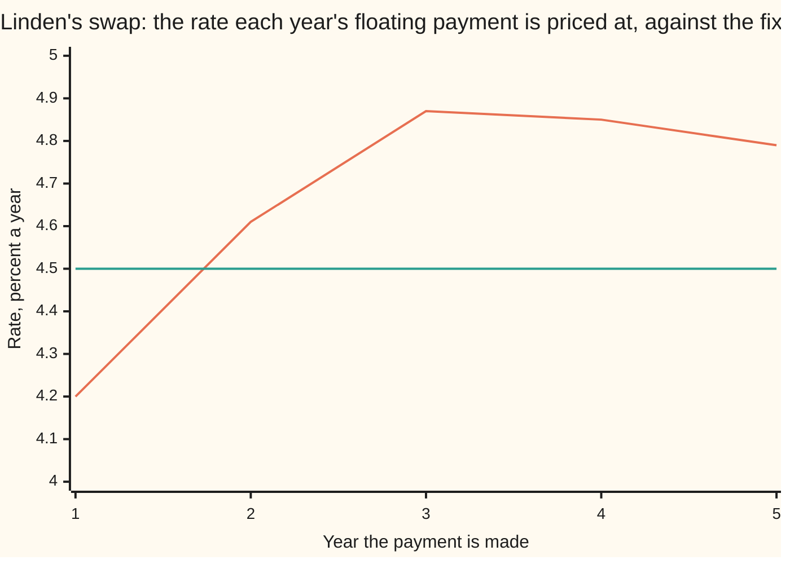

# Interest rate swaps: fixed for floating, valued as two bonds or as a strip of forwards

[Syllabus](../../../SYLLABUS.md) → [Financial mathematics](../../../SYLLABUS.md#w12) → [Swaps](../../../SYLLABUS.md#w12-s28) → Interest rate swaps

---

## General Overview

Linden Freight, a made-up haulage company, owes its bank 10,000,000.00 dollars for five more years. The loan charges a floating rate: each year the rate is read off a screen at the start of the year and the interest is paid at the end. A bad year for rates is a bad year for Linden, whatever its lorries earn.

So Linden agreed a second contract with a dealer. Each year Linden pays 4.50 percent of 10,000,000.00 dollars, which is 450,000.00 dollars, and receives whatever the floating rate comes to on the same amount. The floating receipt cancels the floating interest on the loan. What is left is a fixed bill. That contract is an **interest rate swap**: two streams of interest on one amount, one fixed and one floating, with the amount itself never changing hands. The amount is the **notional**, and each stream is a **leg**.

This morning is a reset date, the day the next floating rate is read, and five annual payments remain. Rates have risen since the swap was struck: a brand-new five-year swap now fixes at 4.65 percent, not 4.50. Linden is paying less than the market charges, so the swap is worth something to Linden. The question is how much, when four of the five floating payments depend on rates nobody knows yet.

There are two ways to answer, and they look nothing alike. One reads the swap as two bonds held against each other. The other reads it as five separate forward agreements, one per year. Both give **65,736.36 dollars**, and a third road through a tree of random future rates gives it again.

**A swap is worth the same read as two bonds or as a strip of forwards, because the floating payments valued at their forward rates add up to the notional less its discounted repayment: a floating-rate note is worth exactly its face on every reset date.**

**What kind of fact this is:** a theorem, proved on this card in Why it works, for a swap whose floating rate is projected and discounted on one curve; the swap contract itself is a definition.

### The picture: what the floating leg is expected to pay



The bending line is the forward rate for each year: the rate today's curve already locks in for that year ([Forward rate agreements](../02-Curves/02-forward-rate-agreements.md)). The flat line is Linden's fixed 4.50 percent. In year one the floating rate is below it and Linden pays the gap. From year two on the floating rate is above it and Linden collects. The swap's value is those gaps, each shrunk to today's money and added up.

---

## The formula

Notation first, in words. The payment years are counted by $i$, from 1 to $n$, and $n = 5$ here. Year $i$ ends on the date $T_i$; the start of the first year is today. Today's price of one dollar paid on $T_i$ is the **discount factor** $D_i$, short for $D(T_i)$, read off the bootstrapped curve ([Bootstrapping](../02-Curves/04-bootstrapping-the-discount-curve.md)). A dollar today costs a dollar, so $D_0 = 1$. The **year fraction** $\alpha_i$ is how much of a year period $i$ counts as; every period here is a full year, so each $\alpha_i$ is 1. The notional is $N$ and the fixed rate is $K$. The **forward rate** $F_i$ is the rate for year $i$ that the curve already contains. Every sign is for Linden's side, the side that pays fixed, called the **payer**.

$$F_i \;=\; \frac{1}{\alpha_i}\left(\frac{D_{i-1}}{D_i} - 1\right)$$

**Read it aloud:** a dollar parked from the start of year $i$ to its end grows by the ratio of the two discount factors, and the forward rate is that growth stated per year.

The swap as a strip of forwards:

$$V \;=\; \sum_{i=1}^{n} N\,\alpha_i\,\bigl(F_i - K\bigr)\,D_i$$

**Read it aloud:** each year, the gap between the forward rate and the fixed rate, turned into dollars on the notional, shrunk to today, and added up.

The swap as two bonds:

$$V \;=\; B_{\text{flt}} - B_{\text{fix}}, \qquad B_{\text{flt}} = N, \qquad B_{\text{fix}} = \sum_{i=1}^{n} N\,\alpha_i\,K\,D_i \;+\; N\,D_n$$

**Read it aloud:** hold a floating-rate note worth its face, owe a bond paying the fixed coupon with the notional repaid at the end, and the swap is the difference.

The theorem is that these two formulas always give the same number. The bridge between them is one identity, the **telescoping** of the floating leg: a sum where each term cancels part of the next.

$$\sum_{i=1}^{n} N\,\alpha_i\,F_i\,D_i \;=\; N\,\bigl(1 - D_n\bigr)$$

| Symbol | Plain meaning | In our example | Push it up and the answer… |
| --- | --- | --- | --- |
| $N$ | the notional: the amount the rates are applied to, never exchanged | 10,000,000.00 dollars | every dollar figure scales with it |
| $K$ | the fixed rate written into the swap | 4.50 percent | the payer's swap loses value |
| $n$ | the number of payments left | 5 | more years of the gap |
| $i$ | which year's payment | 1 to 5 | — |
| $T_i$, $T_n$ | the date year $i$ ends and its payment is made | 1 to 5 years from today | — |
| $\alpha_i$ | the year fraction of period $i$ | 1 | each payment is bigger |
| $D_i$, $D(T)$, $D_0$ | the discount factor: today's price of one dollar paid on that date | 0.79621728 at five years | the fixed bond gains while the note stays at par, so the payer's swap loses |
| $F_i$ | the forward rate for year $i$, from two neighbouring discount factors | 4.2000 to 4.8719 percent | the payer receives more, so the swap gains |
| $L_i$, $L_n$ | the fixing: the floating rate actually read at the start of year $i$ | known today for year 1 only | pays more that year, with no effect on today's value |
| $V$ | the swap's value today to the payer | 65,736.36 dollars | — |
| $B_{\text{flt}}$, $B_{\text{fix}}$ | the floating-rate note and the fixed-coupon bond, both repaying $N$ at the end | 10,000,000.00 and 9,934,263.64 dollars | — |
| $A$ | the annuity: the sum of $\alpha_i D_i$, what one unit of coupon a year costs today | 4.382424 | — |

**Conventions verified 27 Sep 2026.** This card fixes every year fraction at 1 and reads each floating rate at the start of its year, paid at the end. The dollar market's floating leg now references SOFR, an overnight rate published each business day by the Federal Reserve Bank of New York, compounded over each period and known only at the period's end ([Money markets](../02-Curves/03-money-market-instruments-and-sofr.md)). The telescoping below survives that change: compounded overnight rates still grow a dollar from one payment date to the next by the ratio of the two discount factors.

### When it holds

- **One curve projects and discounts.** The forward rates and the discount factors come from the same prices. Since 2008 desks project with one curve and discount with another; then the note is no longer worth exactly par and the two-bond road needs a correction, set out on [Multi-curve](04-basis-swaps-and-the-multi-curve-framework.md).
- **Today is a reset date.** Par holds on the day the rate is read. Between resets the next floating payment is already fixed, so the note is worth that fixed payment plus the notional, discounted from the next payment date, which drifts away from par until the next reset.
- **The floating rate matches its period.** A rate read at the start of a period, for exactly that period, paid at its end. Pay it late, or apply a rate for a different length of time, and the terms stop cancelling.
- **No spread on the floating leg.** A floating leg paying the rate plus a margin is a par note plus a small fixed annuity; the margin must be valued as a fixed leg of its own.
- **Both sides pay.** Nothing here allows for either party failing. The value of that risk is a separate adjustment to the number on this card.

---

## Why it works

### Step 0: an unknown rate can have a known price today

The floating payments depend on rates that will be read in the years ahead. That looks like a forecast. It is not. Any one of those payments can be copied today with two deposits, as the forward-rate card showed, and a copied payment costs what its copy costs. No view on where rates are going enters the price. Once each payment has a price, the swap is a sum of prices.

### Step 1: one floating payment is worth two discount factors apart

Take the payment for year $i$: $N\,\alpha_i\,L_i$, paid at $T_i$, where $L_i$ is read at $T_{i-1}$.

Copy it like this. Hold $N$ dollars at $T_{i-1}$. Lend them for the year at whatever rate $L_i$ then turns out to be. At $T_i$ they come back as $N(1 + \alpha_i L_i)$. Keep the interest, $N\alpha_i L_i$, which is the payment. Hand back the $N$.

That plan needs $N$ dollars at $T_{i-1}$, which costs $N D_{i-1}$ today, and gives up $N$ dollars at $T_i$, which is worth $N D_i$ today. So the payment is worth $N(D_{i-1} - D_i)$ today, whatever the rate turns out to be. By the definition of the forward rate, that is exactly $N\,\alpha_i\,F_i\,D_i$: the payment priced as if the rate were the forward rate.

### Step 2: the floating leg telescopes

Add the five payments:

$$N(D_0 - D_1) + N(D_1 - D_2) + N(D_2 - D_3) + N(D_3 - D_4) + N(D_4 - D_5) \;=\; N(1 - D_5)$$

Every middle discount factor appears once with a plus and once with a minus. Only the first and the last survive. The floating leg is worth 10,000,000.00 times one minus 0.79621728: **2,037,827.18 dollars**. The code adds the five forward-rate payments one by one and lands on the same figure to the cent.

### Step 3: add the notional, and the floating leg becomes a note worth par

Now attach a repayment of $N$ at $T_n$ to the floating leg. That payment is worth $N D_n$ today. The floating leg plus the repayment is a **floating-rate note**: a bond whose coupon is the floating rate, repaying its face at the end. Its value is $N(1 - D_n) + N D_n = N$. Exactly the face, 10,000,000.00 dollars, on a reset date.

The same repayment attached to the fixed leg makes an ordinary bond: five coupons of 450,000.00 dollars and the notional at the end. It is worth 9,934,263.64 dollars.

A repayment of $N$ added to both legs cancels in the swap. So the swap is the note less the bond: 10,000,000.00 minus 9,934,263.64, which is 65,736.36 dollars. The two views are the same sum with the notional added to both sides.

<details>
<summary>Detailed proof: the note is worth par at every reset, whatever rates do</summary>

Work backwards from the last reset, $T_{n-1}$. There the rate $L_n$ is read, and the note will pay $N(1 + \alpha_n L_n)$ at $T_n$. Discounted over that one period at that same rate, it is worth $N(1 + \alpha_n L_n) / (1 + \alpha_n L_n) = N$.

Suppose the note is worth $N$, just after its payment, on the reset date $T_i$, in every state of the world. Step back to $T_{i-1}$, where $L_i$ is read. At $T_i$ the holder receives the coupon $N\alpha_i L_i$ and keeps a note worth $N$: a total of $N(1 + \alpha_i L_i)$, the same in every state. Discounting a certain amount over one period at the rate for that period gives $N$ again.

By induction the note is worth $N$ on every reset date, in every state, and so today. No step used a model of how rates move: only that each coupon is paid at the rate that discounts its own period. Step 1 reaches the same total by pricing each payment separately; this proof reaches it by collapsing the payments from the end. The code runs both.

</details>

### Step 4: the forwards give the same answer term by term

Road two needs no bonds. Each year the payer receives $N\alpha_i F_i$ and pays $N\alpha_i K$ in forward terms, a net of $N\alpha_i(F_i - K)$, worth that times $D_i$ today. Year one costs Linden 30,000.00 dollars, worth 28,790.79 today. Years two to five pay Linden. The sum is 65,736.36 dollars. Both roads agree because Step 2 showed the forward-rate floating leg equals $N(1 - D_n)$, and Step 3 showed that is the note less the repayment.

### Step 5: a tree of random rates changes nothing

The third road lets the floating rates wander. The check builds a tree of one-year rates: from each node the rate moves up or down by a fixed step with equal odds. The centre of each year's rates is solved by bisection (halving an interval until it pins a root) so that the tree reprices all five discount factors. Each floating payment is then valued at its own node, where its rate is known, and priced back to today.

Rates on this tree run from 2.9005 percent to 6.9005 percent by year two. The swap still comes to 65,736.36 dollars. Double the step size and it comes to 65,736.36 again. At each of the three year-two nodes, the note rolls back to 10,000,000.00 dollars, while the fixed bond swings from 10,458,090.65 to 9,372,878.37. The floating side is immune to the path; the fixed side is not.

<details>
<summary>Why the volatility drops out</summary>

The tree's step size, its **volatility**, changes how far rates spread. It cannot change the swap's value because every payment in a swap is linear in the rate: no floor, no cap, no choice. A linear payment can be copied with two deposits, as in Step 1, so its price depends on the discount factors alone, and the tree is fitted to those. An option on the rate, such as a cap, pays only on one side of a level; there the spread matters, and the tree's volatility moves the price.

</details>

A shortcut runs through the **par swap rate**, the fixed rate that makes a new swap worth nothing: 4.65 percent on this curve. The swap is worth the gap between 4.65 and 4.50 percent, times the notional, times the annuity 4.382424, which gives 65,736.36 dollars once more. Why the par rate takes that form is [The par swap rate](02-par-swap-rate-and-annuity.md).

---

## Worked numbers, by hand

The curve is the five annual discount factors bootstrapped on [Bootstrapping](../02-Curves/04-bootstrapping-the-discount-curve.md). The swap: $N$ = 10,000,000.00 dollars, $K$ = 4.50 percent, five annual payments, each $\alpha_i$ = 1.

| Step | Arithmetic | Value |
| --- | --- | --- |
| year 1 forward | $1 / 0.95969290 - 1$ | 4.2000 percent |
| year 2 forward | $0.95969290 / 0.91740758 - 1$ | 4.6092 percent |
| years 3, 4, 5 forwards | the same ratio, one year on each time | 4.8719, 4.8509, 4.7851 percent |
| year 1 net, today | $10{,}000{,}000 \times (0.042 - 0.045) \times 0.95969290$ | −28,790.79 |
| years 2 to 5 net, today | the same, with $F_i$ and $D_i$ | 10,019.78; 32,530.45; 29,275.03; 22,701.88 |
| **road two: strip of forwards** | the five added, before rounding | **65,736.36** |
| annuity | $0.95969290 + 0.91740758 + 0.87478903 + 0.83431725 + 0.79621728$ | 4.38242404 |
| fixed coupons, today | $450{,}000 \times 4.38242404$ | 1,972,090.82 |
| fixed bond's principal, today | $10{,}000{,}000 \times 0.79621728$ | 7,962,172.82 |
| fixed bond | $1{,}972{,}090.82 + 7{,}962{,}172.82$ | 9,934,263.64 |
| floating note | par on a reset date | 10,000,000.00 |
| **road one: note less bond** | $10{,}000{,}000.00 - 9{,}934{,}263.64$ | **65,736.36** |

Linden's swap is an asset worth 65,736.36 dollars: that is what a dealer should pay Linden to take it over this morning, and what Linden's accounts carry it at.

The same value, year by year, as money today. One █ per 2,000 dollars; the first year is a payment out.

```
worth today of each year's net payment to Linden, one █ = $2,000
year 1  (out)  ██████████████   -$28,790.79
year 2   (in)  █████             $10,019.78
year 3   (in)  ████████████████  $32,530.45
year 4   (in)  ███████████████   $29,275.03
year 5   (in)  ███████████       $22,701.88
```

### What breaks if you drop a piece

Same swap, correct value 65,736.36 dollars.

| Mistake | Comes out at | What went wrong |
| --- | --- | --- |
| Net payments added without discounting | 81,709.25 | A dollar in year five was counted as a dollar today |
| Each year's par swap quote used as that year's floating rate | −11,635.85 | A par rate is an average over several years, not the rate for one year; on a rising curve it sits below the forwards and flips the sign |
| Floating note at par against the fixed coupons alone | 8,027,909.18 | The notional was added to one leg and not the other |

Every number in the table is printed by both checks.

### How the value moves

| Sensitivity | Move | Change in Linden's value |
| --- | --- | --- |
| Rates up (delta) | every curve quote up 1 basis point (0.01 percent), curve rebuilt | +4,362.89 |
| Rates down | every quote down 1 basis point | −4,365.33 |
| DV01 | half the up move less the down move | 4,364.11 per basis point |
| Convexity (gamma) | the down move exceeds the up move by | 2.44, slightly against the payer |
| Volatility (vega) | tree volatility from 1 to 2 percent | 0.00 |

The payer gains as rates rise, almost linearly, and volatility is worth nothing. Why the DV01 differs from the quick estimate $N \times A \times 0.0001$ = 4,382.42, and how to hedge it, is [Swap DV01](03-swap-dv01-and-hedging.md).

---

## Code, from first principles, and it actually runs

The check rebuilds the curve from the bootstrapping card's quotes, then values the swap three independent ways: the note less the bond, the strip of forwards, and a tree of random rates fitted to the curve by its own bisection. The tree is run at two volatilities. It rolls the note and the fixed bond back through the tree: the note is par at every year-two node, and the bond lands on its curve price. It prints each wrong answer above, and bumps every quote 1 basis point each way for the sensitivity table.

### Python

```python
# Interest rate swaps -- the check behind the card.  Standard library only;
# nothing imported that already knows an answer.  One 5-year swap, 4.5 percent
# fixed paid annually against a 12-month floating rate, 10,000,000 notional,
# valued on the bootstrapped curve by three roads that share no shortcut:
#   road 1, two bonds: the floating note at par, less a fixed-coupon bond;
#   road 2, a strip of forwards: each year's net payment at its forward rate;
#   road 3, a rate tree fitted to the curve, where the floating rates are random,
#           summing each node's net payment at today's price for that node.
N, K, YEARS = 10_000_000.0, 0.045, 5          # notional, fixed rate, annual payments
SWAPS = ((2, 0.0440), (3, 0.0455), (4, 0.0462), (5, 0.0465))   # par quotes, the curve card

def curve(bump):                              # bump: added to every quote
    D = [1.0, 1.0 / (1.042 + bump)]           # today, and the 12-month deposit at 4.2%
    for n, S in SWAPS:                        # the ladder, one rung per quote
        D.append((1.0 - (S + bump) * sum(D[1:n])) / (1.0 + S + bump))
    return D

def strip(D):                                 # road 2 on any curve: net forwards, discounted
    return sum(N * (D[i - 1] / D[i] - 1.0 - K) * D[i] for i in range(1, YEARS + 1))

D = curve(0.0)
F = [D[i - 1] / D[i] - 1.0 for i in range(1, YEARS + 1)]   # forward rate for year i

# road 1: pay fixed = own a floating-rate note, owe a fixed-coupon bond
fixed_coupons = sum(K * N * D[i] for i in range(1, YEARS + 1))
fixed_bond = fixed_coupons + N * D[YEARS]
note = N                                      # worth par on a reset date: the card's claim
road1 = note - fixed_bond

# road 2: each year's net payment, set at its forward rate, discounted
net = [N * (F[i - 1] - K) for i in range(1, YEARS + 1)]
pv = [net[i - 1] * D[i] for i in range(1, YEARS + 1)]
road2 = sum(pv)
float_leg = sum(N * F[i - 1] * D[i] for i in range(1, YEARS + 1))

def bisect(f, lo, hi):                        # f(lo) and f(hi) differ in sign
    for _ in range(200):
        mid = 0.5 * (lo + hi)
        if (f(lo) > 0) == (f(mid) > 0): lo = mid
        else: hi = mid
    return 0.5 * (lo + hi)

def tree(sigma):                              # additive rate tree, fitted to D by bisection
    rates, Q, prices = [], [1.0], []          # Q: today's price of 1 paid at each node
    for i in range(YEARS):
        f = lambda th: sum(q / (1 + th + sigma * (2 * j - i)) for j, q in enumerate(Q)) - D[i + 1]
        th = bisect(f, -0.5, 0.5)
        r = [th + sigma * (2 * j - i) for j in range(i + 1)]
        rates.append(r); prices.append(Q)
        nQ = [0.0] * (i + 2)
        for j, q in enumerate(Q):
            nQ[j] += 0.5 * q / (1 + r[j]); nQ[j + 1] += 0.5 * q / (1 + r[j])
        Q = nQ
    return rates, prices

def strip_on_tree(sigma):                     # each node's net payment, known at the node
    rates, prices = tree(sigma)
    return sum(q * N * (r - K) / (1 + r) for i in range(YEARS)
               for q, r in zip(prices[i], rates[i]))

def by_tree(rates, principal):                # roll back: returns note and fixed bond at each node
    note = [principal * (1 + r) / (1 + r) for r in rates[-1]]   # last payment: N plus N r
    bond = [(principal * (1 + K)) / (1 + r) for r in rates[-1]]
    layers = [(note, bond)]
    for i in range(YEARS - 2, -1, -1):
        r, (n1, b1) = rates[i], layers[0]
        note = [(0.5 * (n1[j] + n1[j + 1]) + principal * r[j]) / (1 + r[j]) for j in range(i + 1)]
        bond = [(0.5 * (b1[j] + b1[j + 1]) + principal * K) / (1 + r[j]) for j in range(i + 1)]
        layers.insert(0, (note, bond))
    return layers

t1 = tree(0.01)[0]
layers = by_tree(t1, N)
road3, road3b = strip_on_tree(0.01), strip_on_tree(0.02)

# the rows the card quotes
print(f"swap: notional {N:.2f}, fixed {100 * K:.2f}%, coupon {K * N:.2f} a year, {YEARS} years")
print("year  discount factor  forward rate  net to fixed payer  worth today")
for i in range(1, YEARS + 1):
    print(f"{i:>4}  {D[i]:15.8f}  {100 * F[i - 1]:11.4f}%  {net[i - 1]:18.2f}  {pv[i - 1]:11.2f}")
print("chart, forward rate %  " + " ".join(f"{100 * f:.2f}" for f in F) + "   fixed 4.50")
A = sum(D[1:])
print(f"annuity, sum of D                  {A:18.6f}")
print(f"par rate on this curve (1-D5)/A    {100 * (1 - D[5]) / A:17.4f}%")
print(f"fixed leg, coupons only            {fixed_coupons:18.2f}")
print(f"floating leg, forwards             {float_leg:18.2f}")
print(f"floating leg, N(1 - D5)            {N * (1 - D[5]):18.2f}")
print(f"fixed bond, principal part N D5   {N * D[YEARS]:18.2f}")
print(f"fixed bond, coupons + principal    {fixed_bond:18.2f}")
print(f"floating note, principal included  {note:18.2f}")
print(f"road 1, note - fixed bond          {road1:18.2f}")
print(f"road 2, strip of forwards          {road2:18.2f}")
print(f"road 3, rate tree, sigma 1%        {road3:18.2f}")
print(f"road 3, rate tree, sigma 2%        {road3b:18.2f}")
print(f"tree, today: note and fixed bond   {layers[0][0][0]:18.2f} {layers[0][1][0]:14.2f}")
for j in range(3):
    print(f"tree, year 2 node {j}: rate {100 * t1[2][j]:6.4f}%  note {layers[2][0][j]:14.2f}  bond {layers[2][1][j]:14.2f}")
print(f"wrong: net payments not discounted {sum(net):18.2f}")
wrong_par = sum(N * (S - K) * D[n] for n, S in ((1, 0.042),) + SWAPS)
print(f"wrong: par quotes used as forwards {wrong_par:18.2f}")
print(f"wrong: note at par, bond no principal {N - fixed_coupons:15.2f}")
at_par = round(sum(N * (f - 0.0465) * D[i + 1] for i, f in enumerate(F)), 2) + 0.0
print(f"try: fixed rate 4.65%, strip       {at_par:18.2f}")
print(f"try: receive fixed instead         {-road2:18.2f}")
Du, Dd = curve(0.0001), curve(-0.0001)             # every quote up, and down, 1 bp
up, down = strip(Du) - road2, strip(Dd) - road2
print(f"all quotes up 1 bp, change         {up:18.2f}")
print(f"all quotes down 1 bp, change       {down:18.2f}")
print(f"DV01, (up - down) / 2              {(up - down) / 2:18.2f}")
print(f"tree sigma 1% to 2%, change        {round(road3b - road3, 2) + 0.0:18.2f}")

assert abs(road1 - road2) < 1e-6, "two bonds and the strip of forwards agree"
assert abs(road3 - road2) < 1e-4 and abs(road3b - road2) < 1e-4, "the rate tree lands on the strip"
assert all(abs(v - N) < 1e-4 for v in layers[2][0]), "the note is worth par at every year-2 reset"
assert abs(float_leg - N * (1 - D[5])) < 1e-6, "forwards telescope to N(1 - D5)"
assert abs(layers[0][1][0] - fixed_bond) < 1e-4, "the tree reprices the fixed bond"
assert abs((1 - D[5]) / A - 0.0465) < 1e-12, "the curve reprices the 5-year par quote"
assert abs((1 - Du[5]) / sum(Du[1:]) - 0.0466) < 1e-12, "the bumped curve reprices the bumped quote"
assert up > 0 > down and abs(up + down) < 0.01 * up, "payer gains as rates rise, nearly linearly"
print("ALL CHECKS PASS")
```

**Ran 2026-09-28 on macOS, Python 3.14.6, standard library only. All checks passed. Output, pasted from the run:**

```
swap: notional 10000000.00, fixed 4.50%, coupon 450000.00 a year, 5 years
year  discount factor  forward rate  net to fixed payer  worth today
   1       0.95969290       4.2000%           -30000.00    -28790.79
   2       0.91740758       4.6092%            10921.84     10019.78
   3       0.87478903       4.8719%            37186.63     32530.45
   4       0.83431725       4.8509%            35088.61     29275.03
   5       0.79621728       4.7851%            28512.17     22701.88
chart, forward rate %  4.20 4.61 4.87 4.85 4.79   fixed 4.50
annuity, sum of D                            4.382424
par rate on this curve (1-D5)/A               4.6500%
fixed leg, coupons only                    1972090.82
floating leg, forwards                     2037827.18
floating leg, N(1 - D5)                    2037827.18
fixed bond, principal part N D5           7962172.82
fixed bond, coupons + principal            9934263.64
floating note, principal included         10000000.00
road 1, note - fixed bond                    65736.36
road 2, strip of forwards                    65736.36
road 3, rate tree, sigma 1%                  65736.36
road 3, rate tree, sigma 2%                  65736.36
tree, today: note and fixed bond          10000000.00     9934263.64
tree, year 2 node 0: rate 2.9005%  note    10000000.00  bond    10458090.65
tree, year 2 node 1: rate 4.9005%  note    10000000.00  bond     9895098.19
tree, year 2 node 2: rate 6.9005%  note    10000000.00  bond     9372878.37
wrong: net payments not discounted           81709.25
wrong: par quotes used as forwards          -11635.85
wrong: note at par, bond no principal      8027909.18
try: fixed rate 4.65%, strip                     0.00
try: receive fixed instead                  -65736.36
all quotes up 1 bp, change                    4362.89
all quotes down 1 bp, change                 -4365.33
DV01, (up - down) / 2                         4364.11
tree sigma 1% to 2%, change                      0.00
ALL CHECKS PASS
```

### Rust

The same roads in Rust, std only. The two outputs agree line for line.

```rust
// Interest rate swaps -- the same check as interest_rate_swaps_check.py, in Rust.
// Standard library only, no crates.  One 5-year swap, 4.5 percent fixed paid
// annually against a 12-month floating rate, 10,000,000 notional, valued on the
// bootstrapped curve by three roads that share no shortcut:
//   road 1, two bonds: the floating note at par, less a fixed-coupon bond;
//   road 2, a strip of forwards: each year's net payment at its forward rate;
//   road 3, a rate tree fitted to the curve, where the floating rates are random,
//           summing each node's net payment at today's price for that node.
const N: f64 = 10_000_000.0;
const K: f64 = 0.045;
const YEARS: usize = 5;

// the bootstrapped curve, with bump added to every quote
fn curve(swaps: &[(usize, f64)], bump: f64) -> Vec<f64> {
    let mut d = vec![1.0_f64, 1.0 / (1.042 + bump)];   // today, and the 12-month deposit
    for &(n, s) in swaps {
        let b: f64 = d[1..n].iter().sum();
        d.push((1.0 - (s + bump) * b) / (1.0 + s + bump));
    }
    d
}

fn strip(d: &[f64]) -> f64 {                          // road 2 on any curve
    (1..=YEARS).map(|i| N * (d[i - 1] / d[i] - 1.0 - K) * d[i]).sum()
}

fn bisect<G: Fn(f64) -> f64>(f: G, mut lo: f64, mut hi: f64) -> f64 {
    for _ in 0..200 {
        let mid = 0.5 * (lo + hi);
        if (f(lo) > 0.0) == (f(mid) > 0.0) { lo = mid; } else { hi = mid; }
    }
    0.5 * (lo + hi)
}

// additive rate tree fitted to the curve; q holds today's price of 1 paid at each node
fn tree(d: &[f64], sigma: f64) -> (Vec<Vec<f64>>, Vec<Vec<f64>>) {
    let (mut rates, mut prices, mut q) = (Vec::new(), Vec::new(), vec![1.0_f64]);
    for i in 0..YEARS {
        let node = |th: f64, j: usize| th + sigma * (2.0 * j as f64 - i as f64);
        let f = |th: f64| q.iter().enumerate().map(|(j, x)| x / (1.0 + node(th, j))).sum::<f64>() - d[i + 1];
        let th = bisect(f, -0.5, 0.5);
        let r: Vec<f64> = (0..=i).map(|j| node(th, j)).collect();
        let mut nq = vec![0.0; i + 2];
        for (j, x) in q.iter().enumerate() {
            nq[j] += 0.5 * x / (1.0 + r[j]);
            nq[j + 1] += 0.5 * x / (1.0 + r[j]);
        }
        rates.push(r);
        prices.push(q);
        q = nq;
    }
    (rates, prices)
}

fn strip_on_tree(d: &[f64], sigma: f64) -> f64 {   // each node's net payment, known at the node
    let (rates, prices) = tree(d, sigma);
    let mut v = 0.0;
    for i in 0..YEARS {
        for (q, r) in prices[i].iter().zip(&rates[i]) { v += q * N * (r - K) / (1.0 + r); }
    }
    v
}

// roll back: the note and the fixed bond at every node, ex-payment
fn by_tree(rates: &[Vec<f64>], principal: f64) -> Vec<(Vec<f64>, Vec<f64>)> {
    let last = &rates[YEARS - 1];
    let note: Vec<f64> = last.iter().map(|r| principal * (1.0 + r) / (1.0 + r)).collect();
    let bond: Vec<f64> = last.iter().map(|r| principal * (1.0 + K) / (1.0 + r)).collect();
    let mut layers = vec![(note, bond)];
    for i in (0..YEARS - 1).rev() {
        let (n1, b1) = layers[0].clone();
        let r = &rates[i];
        let note = (0..=i).map(|j| (0.5 * (n1[j] + n1[j + 1]) + principal * r[j]) / (1.0 + r[j])).collect();
        let bond = (0..=i).map(|j| (0.5 * (b1[j] + b1[j + 1]) + principal * K) / (1.0 + r[j])).collect();
        layers.insert(0, (note, bond));
    }
    layers
}

fn main() {
    let swaps = [(2usize, 0.0440_f64), (3, 0.0455), (4, 0.0462), (5, 0.0465)];
    let d = curve(&swaps, 0.0);
    let f: Vec<f64> = (1..=YEARS).map(|i| d[i - 1] / d[i] - 1.0).collect();

    let fixed_coupons: f64 = (1..=YEARS).map(|i| K * N * d[i]).sum();
    let fixed_bond = fixed_coupons + N * d[YEARS];
    let note = N;                                     // worth par on a reset date: the card's claim
    let road1 = note - fixed_bond;

    let net: Vec<f64> = (0..YEARS).map(|i| N * (f[i] - K)).collect();
    let pv: Vec<f64> = (0..YEARS).map(|i| net[i] * d[i + 1]).collect();
    let road2: f64 = pv.iter().sum();
    let float_leg: f64 = (0..YEARS).map(|i| N * f[i] * d[i + 1]).sum();

    let t1 = tree(&d, 0.01).0;
    let layers = by_tree(&t1, N);
    let (road3, road3b) = (strip_on_tree(&d, 0.01), strip_on_tree(&d, 0.02));

    println!("swap: notional {:.2}, fixed {:.2}%, coupon {:.2} a year, {} years", N, 100.0 * K, K * N, YEARS);
    println!("year  discount factor  forward rate  net to fixed payer  worth today");
    for i in 1..=YEARS {
        println!("{:>4}  {:15.8}  {:11.4}%  {:18.2}  {:11.2}", i, d[i], 100.0 * f[i - 1], net[i - 1], pv[i - 1]);
    }
    let fs: Vec<String> = f.iter().map(|x| format!("{:.2}", 100.0 * x)).collect();
    println!("chart, forward rate %  {}   fixed 4.50", fs.join(" "));
    let a: f64 = d[1..].iter().sum();
    println!("annuity, sum of D                  {:18.6}", a);
    println!("par rate on this curve (1-D5)/A    {:17.4}%", 100.0 * (1.0 - d[5]) / a);
    println!("fixed leg, coupons only            {:18.2}", fixed_coupons);
    println!("floating leg, forwards             {:18.2}", float_leg);
    println!("floating leg, N(1 - D5)            {:18.2}", N * (1.0 - d[5]));
    println!("fixed bond, principal part N D5   {:18.2}", N * d[YEARS]);
    println!("fixed bond, coupons + principal    {:18.2}", fixed_bond);
    println!("floating note, principal included  {:18.2}", note);
    println!("road 1, note - fixed bond          {:18.2}", road1);
    println!("road 2, strip of forwards          {:18.2}", road2);
    println!("road 3, rate tree, sigma 1%        {:18.2}", road3);
    println!("road 3, rate tree, sigma 2%        {:18.2}", road3b);
    println!("tree, today: note and fixed bond   {:18.2} {:14.2}", layers[0].0[0], layers[0].1[0]);
    for j in 0..3 {
        println!("tree, year 2 node {}: rate {:6.4}%  note {:14.2}  bond {:14.2}",
                 j, 100.0 * t1[2][j], layers[2].0[j], layers[2].1[j]);
    }
    println!("wrong: net payments not discounted {:18.2}", net.iter().sum::<f64>());
    let wrong_par: f64 = N * (0.042 - K) * d[1] + swaps.iter().map(|&(n, s)| N * (s - K) * d[n]).sum::<f64>();
    println!("wrong: par quotes used as forwards {:18.2}", wrong_par);
    println!("wrong: note at par, bond no principal {:15.2}", N - fixed_coupons);
    let at_par: f64 = (0..YEARS).map(|i| N * (f[i] - 0.0465) * d[i + 1]).sum();
    println!("try: fixed rate 4.65%, strip       {:18.2}", (at_par * 100.0).round() / 100.0 + 0.0);
    println!("try: receive fixed instead         {:18.2}", -road2);
    let (du, dd) = (curve(&swaps, 0.0001), curve(&swaps, -0.0001));   // every quote up, and down, 1 bp
    let (up, down) = (strip(&du) - road2, strip(&dd) - road2);
    println!("all quotes up 1 bp, change         {:18.2}", up);
    println!("all quotes down 1 bp, change       {:18.2}", down);
    println!("DV01, (up - down) / 2              {:18.2}", (up - down) / 2.0);
    println!("tree sigma 1% to 2%, change        {:18.2}", ((road3b - road3) * 100.0).round() / 100.0 + 0.0);

    assert!((road1 - road2).abs() < 1e-6, "two bonds and the strip of forwards agree");
    assert!((road3 - road2).abs() < 1e-4 && (road3b - road2).abs() < 1e-4, "the rate tree lands on the strip");
    assert!(layers[2].0.iter().all(|v| (v - N).abs() < 1e-4), "the note is worth par at every year-2 reset");
    assert!((float_leg - N * (1.0 - d[5])).abs() < 1e-6, "forwards telescope to N(1 - D5)");
    assert!((layers[0].1[0] - fixed_bond).abs() < 1e-4, "the tree reprices the fixed bond");
    assert!(((1.0 - d[5]) / a - 0.0465).abs() < 1e-12, "the curve reprices the 5-year par quote");
    assert!(((1.0 - du[5]) / du[1..].iter().sum::<f64>() - 0.0466).abs() < 1e-12, "the bumped curve reprices the bumped quote");
    assert!(up > 0.0 && 0.0 > down && (up + down).abs() < 0.01 * up, "payer gains as rates rise, nearly linearly");
    println!("ALL CHECKS PASS");
}
```

**Ran 2026-09-28 on macOS, rustc 1.98.1, no crates. All checks passed. Output, pasted from the run:**

```
swap: notional 10000000.00, fixed 4.50%, coupon 450000.00 a year, 5 years
year  discount factor  forward rate  net to fixed payer  worth today
   1       0.95969290       4.2000%           -30000.00    -28790.79
   2       0.91740758       4.6092%            10921.84     10019.78
   3       0.87478903       4.8719%            37186.63     32530.45
   4       0.83431725       4.8509%            35088.61     29275.03
   5       0.79621728       4.7851%            28512.17     22701.88
chart, forward rate %  4.20 4.61 4.87 4.85 4.79   fixed 4.50
annuity, sum of D                            4.382424
par rate on this curve (1-D5)/A               4.6500%
fixed leg, coupons only                    1972090.82
floating leg, forwards                     2037827.18
floating leg, N(1 - D5)                    2037827.18
fixed bond, principal part N D5           7962172.82
fixed bond, coupons + principal            9934263.64
floating note, principal included         10000000.00
road 1, note - fixed bond                    65736.36
road 2, strip of forwards                    65736.36
road 3, rate tree, sigma 1%                  65736.36
road 3, rate tree, sigma 2%                  65736.36
tree, today: note and fixed bond          10000000.00     9934263.64
tree, year 2 node 0: rate 2.9005%  note    10000000.00  bond    10458090.65
tree, year 2 node 1: rate 4.9005%  note    10000000.00  bond     9895098.19
tree, year 2 node 2: rate 6.9005%  note    10000000.00  bond     9372878.37
wrong: net payments not discounted           81709.25
wrong: par quotes used as forwards          -11635.85
wrong: note at par, bond no principal      8027909.18
try: fixed rate 4.65%, strip                     0.00
try: receive fixed instead                  -65736.36
all quotes up 1 bp, change                    4362.89
all quotes down 1 bp, change                 -4365.33
DV01, (up - down) / 2                         4364.11
tree sigma 1% to 2%, change                      0.00
ALL CHECKS PASS
```

The two bond roads and the forward strip agree to the cent, as the algebra says they must. The tree reaches the same figure through every one of its random-rate nodes and a root finder, at either volatility. The note sits at 10,000,000.00 dollars on every year-two node while the fixed bond swings from 10,458,090.65 to 9,372,878.37 dollars across them.

> [!TIP]
> **Try changing**
> Guess first, then run it.
> - **Set the fixed rate to the par rate.** Change `0.045` to `0.0465` (the `try` line does this). Guess: the swap is worth nothing. Answer: 0.00 dollars. That is the definition of the par rate.
> - **Take the other side.** A receiver pays floating and receives 4.50 percent. Guess: the same size with the sign flipped. Answer: −65,736.36 dollars. Rates rose, so the side receiving fixed lost.
> - **Double the tree's volatility.** Change `0.01` to `0.02` in `strip_on_tree`. Guess before looking at the `sigma 2%` line. Answer: 65,736.36 dollars again. A swap has no optionality, so spread does not matter.

---

## The usual mistake

> [!warning]
> **Adding the notional to one leg only.** The notional is never paid. Adding it is legal only as a trick applied to both legs at once, which turns the floating leg into a par note and the fixed leg into a bond. Treat the floating leg as a note worth 10,000,000.00 dollars but leave the fixed leg as bare coupons, and Linden's swap comes out at 8,027,909.18 dollars: more than a hundred times its value.
>
> Smaller traps:
> - **Calling the floating leg unknowable.** Its payments are unknown; its value today is not. It is $N(1 - D_n)$, 2,037,827.18 dollars here, fixed by the curve alone.
> - **Using par swap quotes as one-year rates.** The five-year quote averages five years. Used as each year's floating rate, the quotes give −11,635.85 dollars, the wrong sign.
> - **Par only on a reset date.** Halfway through a year the coming payment is already fixed, and the note is not worth par. Value the fixed payment and the notional from the next payment date instead.
> - **Losing track of the side.** The payer of fixed gains when rates rise; the receiver loses the same amount, −65,736.36 dollars here. State the side with every value.

---

## Where you meet it in real life

- **Corporate borrowers.** A company with a floating-rate loan pays fixed on a swap to lock its interest bill, exactly Linden's trade.
- **Banks with fixed-rate mortgages.** The bank earns fixed on the mortgages and pays floating on deposits; paying fixed on a swap closes the gap.
- **The curve itself.** Swap rates are the quotes the discount curve is built from beyond one year ([Bootstrapping](../02-Curves/04-bootstrapping-the-discount-curve.md)), so this card's valuation runs in reverse every morning.
- **Hedge sizing.** How much a swap's value moves for a one basis point shift in rates, and how to offset it with another swap, is [Swap DV01](03-swap-dv01-and-hedging.md).
- **Collateralised trades.** Dealers post collateral against swaps and discount at the overnight rate that collateral earns: [Collateral discounting](05-ois-discounting-and-collateral.md).
- **Two currencies.** Swap a dollar loan into euros and the notionals are exchanged at both ends: [Cross-currency swaps](06-cross-currency-swaps-and-basis.md).
- **Reading a swap backwards.** Given a swap's value, recover the fixed rate that produced it: [Solving a swap backwards](07-swap-inverses-rate-and-curve-from-price.md).

> **Say it back**
> A swap exchanges fixed interest for floating interest on a notional that never changes hands. Each floating payment can be copied today with two deposits, so it is worth two discount factors apart, and the floating leg telescopes to the notional less its discounted repayment. Add the notional to both legs and the swap becomes a floating-rate note, worth exactly par on a reset date, less a fixed-coupon bond. Priced that way or payment by payment at forward rates, Linden's swap is worth 65,736.36 dollars, and a tree of random rates agrees because every payment is linear in the rate.

---

## What this builds on

- [Bootstrapping](../02-Curves/04-bootstrapping-the-discount-curve.md): the five discount factors every number here is priced from.
- [Forward rate agreements](../02-Curves/02-forward-rate-agreements.md): the forward rate, and the copy with two deposits that prices one floating payment; a swap is a strip of them.

## Where this goes next

- [The par swap rate](02-par-swap-rate-and-annuity.md): the fixed rate that makes a new swap worth nothing, as a weighted average of the forwards.
- [Inflation swaps](../34-Inflation%20and%20Real%20Rates/04-zero-coupon-inflation-swaps.md): the same two-leg valuation with realised inflation in place of the floating rate.

Linden's swap is worth something only because 4.50 percent is no longer the market's rate; which single fixed rate would make a five-year swap worth nothing this morning, and why it is an average of the forwards weighted by the annuity, is [The par swap rate](02-par-swap-rate-and-annuity.md).

---

## Sources

Verified 28 Sep 2026: every link below names the cited work; both DOIs checked against Crossref.

- Hull, John C. *Options, Futures, and Other Derivatives*, 11th ed. Pearson. [Publisher page](https://www.pearson.com/en-us/subject-catalog/p/options-futures-and-other-derivatives/P200000005938). The swaps chapter values a swap both as two bonds and as a portfolio of forward rate agreements.
- Tuckman, Bruce, and Angel Serrat. *Fixed Income Securities: Tools for Today's Markets*, 4th ed. Wiley, 2022. [Publisher page](https://www.wiley.com/en-us/Fixed+Income+Securities%3A+Tools+for+Today%27s+Markets%2C+4th+Edition-p-9781119835554). Swaps priced off discount factors, and the floating-rate note at par.
- Bicksler, James, and Andrew H. Chen. "An Economic Analysis of Interest Rate Swaps." *Journal of Finance* 41, no. 3 (1986): 645–655. [doi:10.1111/j.1540-6261.1986.tb04527.x](https://doi.org/10.1111/j.1540-6261.1986.tb04527.x). Why firms swap fixed for floating in the first place.
- Ho, Thomas S. Y., and Sang-Bin Lee. "Term Structure Movements and Pricing Interest Rate Contingent Claims." *Journal of Finance* 41, no. 5 (1986): 1011–1029. [doi:10.1111/j.1540-6261.1986.tb02528.x](https://doi.org/10.1111/j.1540-6261.1986.tb02528.x). The additive rate tree fitted to today's curve, used as road three.
- Federal Reserve Bank of New York. *Secured Overnight Financing Rate Data*. [Publication page](https://www.newyorkfed.org/markets/reference-rates/sofr). The overnight rate the dollar floating leg now references.
