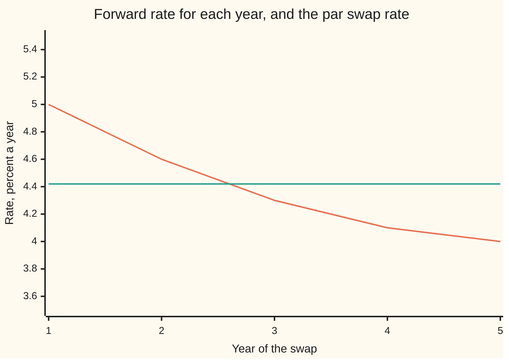
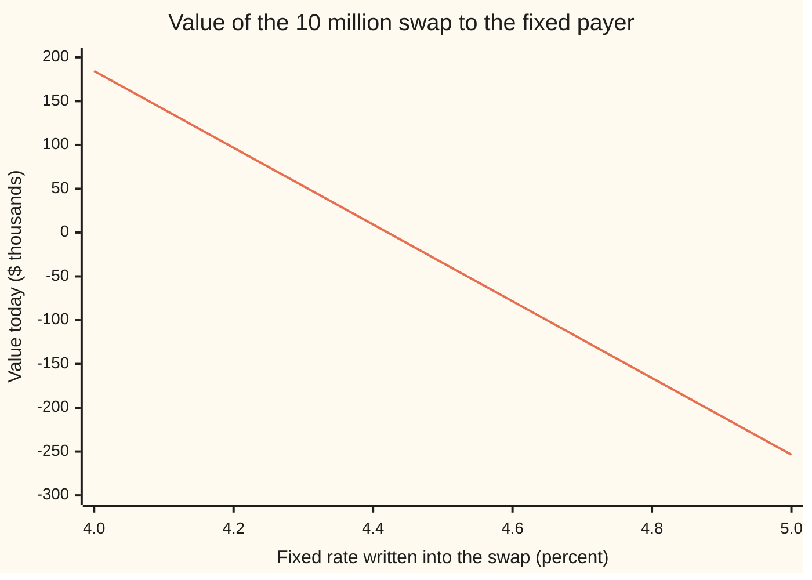

# The par swap rate: the fixed rate that makes a new swap worth zero, and the annuity it divides by

[Syllabus](../../../SYLLABUS.md) → [Financial mathematics](../../../SYLLABUS.md#w12) → [Swaps](../../../SYLLABUS.md#w12-s28) → The par swap rate

---

## General Overview

A company has borrowed 10 million dollars for five years at a floating rate: each year it pays whatever the one-year rate turns out to be. It wants a fixed bill instead. A bank will swap: the company pays the bank a fixed rate on 10 million each year, and the bank pays the company the floating rate, which the company passes to its lender. The company's cost is now fixed.

Nobody pays anything up front, so the fixed rate has to be fair on the day the swap is signed. On this card's curve, where rates are expected to fall, the fair rate is **4.42 percent**. (The shelf's other cards use a rising curve, on which the par rate is 4.65 percent: [Interest rate swaps](01-interest-rate-swaps.md).) At that rate the fixed payments and the floating payments are worth exactly the same today: 1,936,740.46 dollars each. The fair rate for a new swap is called the **par swap rate**, or simply the swap rate. It is the number quoted on every rates screen.

The par rate comes out of one division. The top is what the floating payments are worth. The bottom is what one unit of fixed rate, paid on every date of the swap, is worth: about 4.38 here (4.380745), called the **annuity**. Rewritten, the same division is an average of the market's forward rates (the rates fixed today for each future year), weighted by how much a dollar on each date is worth today.

**The par swap rate is the value of the floating leg divided by the annuity, and that ratio is an average of the forward rates weighted by the discount factors.**

**What kind of fact this is:** a theorem, proved on this card in Why it works, inside one assumption: the same curve both forecasts the floating payments and discounts them. The par rate itself is a definition.

### The picture: five forwards and the one rate that stands for them

The curve this morning is inverted: the rate fixed today for next year is 5.00 percent, and the rate fixed for the fifth year is 4.00 percent.



Falling line: the one-year forward rate for each year of the swap. Flat line: the par swap rate, 4.42 percent. The flat line sits inside the range of the falling one, as any average must, and above the plain average of 4.40 percent, because the early years carry more weight.

---

## The formula

Notation first, in words. The swap pays on dates $T_1$ to $T_n$, one per year here, with $n = 5$; $T_0$ is the start, today. A small letter set low, like the $i$ in $T_i$, names which date. $D(T)$ is the discount factor: what one dollar paid at time $T$ costs today, with D(0) = 1. The Greek capital sigma, $\sum$, means "add up the terms for $i = 1$ to $n$".

$$S = \frac{D(T_0) - D(T_n)}{A}, \qquad A = \sum_{i=1}^{n} \alpha_i \, D(T_i)$$

**Read it aloud:** the par rate is one dollar today less one dollar at the end, divided by the price of one unit of rate paid on every payment date.

The same number, written as an average:

$$S = \sum_{i=1}^{n} w_i \, F_i, \qquad w_i = \frac{\alpha_i \, D(T_i)}{A}, \qquad F_i = \frac{1}{\alpha_i}\left(\frac{D(T_{i-1})}{D(T_i)} - 1\right)$$

**Read it aloud:** the par rate is each year's forward rate times that year's share of the annuity, added up.

A swap already on the books at some other fixed rate is worth, to the side paying fixed:

$$V = N \, A \, (S - K)$$

| Symbol | Plain meaning | In our example | Push it up and the answer… |
| --- | --- | --- | --- |
| $S$ | the par swap rate: the fixed rate that makes a new swap worth zero | 4.421030 percent | — |
| $A$ | the annuity: what one unit of rate, paid on every fixed date, costs today, in years | 4.380745 | the par rate falls for the same floating leg |
| $D(T)$, $T$ | the discount factor: today's price of one dollar paid at time $T$; its reciprocal is the growth factor, what a dollar grows to | 0.952381 at one year, 0.806326 at five; growth 1.050000 to 1.240193 | that period's forward falls, the next one rises, and its weight rises |
| $T_i$, $T_0$, $T_1$, $T_n$ | payment dates in years; the start; the last date | 1 to 5; 0; 5 | a longer swap adds terms to both top and bottom |
| $i$, $n$, $\sum$ | the count of a payment date; the number of payments; add up over $i$ | 1 to 5; 5 | — |
| $\alpha_i$ | the accrual: the length of period $i$ as a fraction of a year | 1 every year | the payment for that period grows, and so does $A$ |
| $F_i$ | the forward rate for period $i$, fixed today from the curve | 5.00 down to 4.00 percent | the par rate rises by that year's weight times the rise |
| $w_i$ | the weight of year $i$: its share of the annuity | 21.7402 percent down to 18.4061 | — |
| $L_i$, $L_1$, $L_2$ | the floating rate that will actually be set for period $i$, unknown today | — | the floating payment grows |
| $N$ | the notional: the amount the interest is worked out on, never exchanged | 10,000,000 dollars | every value scales; the rate does not |
| $K$ | the fixed rate written into a particular swap | 4.50 percent for the house swap | the value to the fixed payer falls by $N A$ per unit |
| $V$ | the value today of a swap paying $K$ fixed and receiving floating | −34,594.64 dollars at 4.50 percent | — |

**Conventions verified 27 Sep 2026.** Every accrual here is set by hand to exactly one year, and both legs pay on the same dates, so the arithmetic stays visible. Real swaps compute each $\alpha_i$ from calendar dates under a day-count rule named in the contract, and the fixed and floating legs often use different rules and different frequencies; those rules are on [Day counts](../01-Money%2C%20Dates%20and%20Discounting/02-day-counts-and-dates.md). The formula does not change: $A$ always runs over the fixed leg's own dates and accruals.

### When it holds

- **One curve forecasts and discounts.** The floating leg collapses to D(0) − D(5) only if the rate the floating leg pays is the rate the discount factors are built from. Since 2008 the two are separate curves, the collapse fails, and the floating leg must be summed coupon by coupon: [Multi-curve](04-basis-swaps-and-the-multi-curve-framework.md).
- **No default.** Both sides are assumed to pay. A counterparty that can fail makes each leg worth less by its own credit charge, and collateral changes which rate discounts: [Collateral discounting](05-ois-discounting-and-collateral.md).
- **The floating rate is set at the start of each period and paid at its end.** A rate set late, paid early, or averaged over the period needs a small adjustment to its forward.
- **A new swap starts today.** For a swap starting later, $D(T_0)$ is below one and the same formula gives the forward swap rate.

---

## Why it works

### Step 0: a new swap costs nothing, so its two legs are worth the same

No money changes hands when a swap is signed. If one leg were worth more than the other, the side receiving it would be getting something for nothing, and the other side would refuse. So on the signing day, value of the fixed payments = value of the floating payments. The par rate is the fixed rate that makes this true. Everything below is working out the two sides.

### Step 1: the fixed leg is the rate times the annuity

In year $i$ the fixed payer hands over $N \alpha_i K$ dollars. That amount is known today, so its value today is $N \alpha_i K \, D(T_i)$. Add the five payments: $N K$ times the sum of $\alpha_i D(T_i)$, which is $N K A$.

So $A$ is the price of an annuity: one unit of rate (one dollar per dollar of notional per year) paid on every fixed date. Here it is 4.380745: five payments, each worth a little less than a dollar because each arrives later.

### Step 2: the floating leg is one dollar now less one dollar at the end

The floating payments are unknown today. Their value is not. Take one dollar today and put it on deposit for a year at the rate set today, $L_1$. At the end of the year it pays $L_1$ in interest and the dollar comes back. Put the dollar back on deposit at the new rate $L_2$. Repeat for five years, then take the dollar home.

That plan cost one dollar today. It delivers exactly the floating payments per dollar of notional, $\alpha_i L_i$ in each year, plus one dollar at the end. The dollar at the end costs D(5) today. So the floating payments alone are worth 1 − D(5), which is 0.193674 per dollar of notional: 1,936,740.46 dollars on 10 million.

Set the legs equal: $N K A = N(1 - D(5))$. The par rate is $S = (1 - D(5))/A$ = 0.193674 ÷ 4.380745 = 4.421030 percent.

<details>
<summary>Detailed proof: the floating leg, coupon by coupon, and the telescope</summary>

Hold a deposit of one dollar from $T_{i-1}$ to $T_i$. At $T_{i-1}$ the rate $L_i$ is set, and at $T_i$ the deposit returns $1 + \alpha_i L_i$. Its value at $T_{i-1}$ is one dollar, so its value today is $D(T_{i-1})$. The one dollar returned at $T_i$ is worth $D(T_i)$ today. So the coupon $\alpha_i L_i$ paid at $T_i$ is worth $D(T_{i-1}) - D(T_i)$ today, whatever $L_i$ turns out to be.

Write that value as $\alpha_i F_i D(T_i)$: this defines $F_i$ as the fixed rate that, paid in place of $L_i$, has the same value today. Solving gives $F_i = (D(T_{i-1})/D(T_i) - 1)/\alpha_i$, the forward rate of [Forward rate agreements](../02-Curves/02-forward-rate-agreements.md).

Add the five coupons. The middle terms cancel in pairs: $(D(T_0) - D(T_1)) + (D(T_1) - D(T_2)) + \dots + (D(T_4) - D(T_5)) = D(T_0) - D(T_5)$. A sum whose middle cancels like this is called telescoping. The fixed leg is $K A$ per dollar. Equal values give $K = (D(T_0) - D(T_n))/A$, and there is exactly one such $K$, because $A$ is positive: the fixed leg grows in a straight line with $K$ while the floating leg does not depend on it.

</details>

### Step 3: the same ratio is a weighted average of the forwards

The proof's middle line says each floating payment is worth $\alpha_i F_i D(T_i)$. So the floating leg is the sum of those, and dividing by $A$ gives

$$S = \frac{\sum \alpha_i F_i D(T_i)}{\sum \alpha_i D(T_i)} = \sum w_i F_i.$$

Each weight $w_i$ is year $i$'s share of the annuity. The weights are positive and add to 1.000000. An average with positive weights that add to one always lands between the smallest and largest of the things averaged. Here, between 4.00 and 5.00 percent.

```
weight of each year in the par rate, percent; one block = one percentage point
   year 1   ██████████████████████   21.7402
   year 2   █████████████████████    20.7841
   year 3   ████████████████████     19.9272
   year 4   ███████████████████      19.1424
   year 5   ██████████████████       18.4061
```

The weights fall because a dollar paid later is worth less today. The early forwards on this curve are the high ones, so the par rate lands 2.1030 basis points above the plain average of 4.40 percent. A basis point is one hundredth of a percentage point. On a rising curve the tilt runs the other way and the par rate sits below the plain average.

### Step 4: the annuity turns a rate gap into money

A swap written last month at $K$ = 4.50 percent is no longer at par. Its fixed leg is $N K A$; its floating leg is still $N S A$, since that is what par means. The difference, to the fixed payer, is $V = N A (S - K)$.

Take the house swap's terms: 4.50 percent fixed on 10 million. That is 7.8970 basis points above today's par. Each basis point of fixed rate is worth $N A$ times one basis point: 4,380.74 dollars. So the fixed payer is down 34,594.64 dollars. On the curve of [Interest rate swaps](01-interest-rate-swaps.md) the same contract is worth +65,736.36 dollars: there par is 4.65 percent and $A$ is 4.382424. Same terms, different curve, opposite sign. The annuity is the exchange rate between a rate gap and money, and it is also the slope of the swap's value against its fixed rate.



One line: the swap's value to the side paying fixed, by the fixed rate written into it. It is straight, falls by the same amount for every step in the fixed rate, and crosses zero at the par rate, just above 4.4 percent. The steepness of that line, per unit of rate, is $N A$.

<details>
<summary>The par bond view</summary>

Add the notional to both legs at the end. The floating side becomes the deposit plan of Step 2, worth exactly one dollar today. The fixed side becomes a bond paying coupon $K$ each year and one dollar at maturity. A new swap is worth zero, so this bond must be worth one dollar: it trades at par, its face value. The par swap rate is the coupon of a par bond on the same curve, the par rate of [Spot, forward and par rates](../02-Curves/01-spot-forward-and-par-rates.md). The code's third road solves for that coupon directly.

</details>

A different route to the same ratio values everything in units of the annuity itself rather than in dollars. The par rate is then the price of one traded portfolio (a dollar now less a dollar at the end) measured in another (the annuity), and in those units its expected change is zero: it has no drift. That is the route to option prices on the swap rate: [Swaptions](../29-Caps%2C%20Floors%20and%20Swaptions/04-swaptions-payer-and-receiver.md).

---

## Worked numbers, by hand

The curve is given by its five one-year forward rates: 5.00, 4.60, 4.30, 4.10 and 4.00 percent. Chain them into growth factors, invert to discount factors, add up.

| Step | Arithmetic | Value |
| --- | --- | --- |
| growth to year 1 | 1 + 5.00 percent | 1.050000 |
| growth to year 2 | 1.050000 × (1 + 4.60 percent) | 1.098300 |
| growth to year 3 | 1.098300 × (1 + 4.30 percent) | 1.145527 |
| growth to year 4 | 1.145527 × (1 + 4.10 percent) | 1.192494 |
| growth to year 5 | 1.192494 × (1 + 4.00 percent) | 1.240193 |
| discount factors | 1 ÷ each growth factor | 0.952381, 0.910498, 0.872961, 0.838579, 0.806326 |
| annuity $A$ | add the five | 4.380745 |
| floating leg per dollar | 1 − 0.806326 | 0.193674 |
| par rate, first road | 0.193674 ÷ 4.380745 | 4.421030 percent |
| weights $w_i$ | each D ÷ 4.380745 | 21.7402, 20.7841, 19.9272, 19.1424, 18.4061 percent |
| weight × forward | 1.087008 + 0.956068 + 0.856871 + 0.784838 + 0.736246 | 4.421030 percent |
| **par rate** | both roads agree | **4.42 percent** |

A company can swap its five-year floating loan into a fixed 4.42 percent at no cost today, and each basis point more or less on that fixed rate is worth 4,380.74 dollars on 10 million.

### What breaks if you drop a piece

| Mistake | Comes out at | What went wrong |
| --- | --- | --- |
| Average the forwards without weights | 4.400000 percent | Treats a dollar in year 5 as worth a dollar in year 1; 2.1030 basis points low on this curve |
| Use the five-year zero rate | 4.399369 percent | The zero rate prices one payment at the end; a swap pays every year |
| Set the annuity to 5, no discounting | 3.873481 percent | Divides discounted money by undiscounted time |
| Build the annuity from D(0) to D(4) | 4.233850 percent | Fixed payments fall at the end of each period, not the start |

---

## Code, from first principles, and it actually runs

The code builds the discount factors from the five forwards, then reaches the par rate by three independent roads: the telescoped ratio $(1 - D(T_n))/A$; the weighted average of forwards; and a bisection search for the coupon of a par bond valued backwards year by year, which never forms $A$. It finds the annuity twice, as a sum of discount factors and as the slope of the swap's value when the fixed rate is bumped, and values the 4.50 percent house swap twice, by backward recursion and by $N A (S - K)$. It then prints the wrong answers, the chart points and the experiments below, and last values the same 4.50 percent swap on the curve of interest-rate-swaps, whose par quote of 4.65 percent it recovers.

### Python

```python
# The par swap rate and its annuity on a five-year annual swap, by three roads.
# Standard library only: no imported finance, no imported root finder.

FWD = [0.050, 0.046, 0.043, 0.041, 0.040]   # one-year forward rates, years 1..5
N = 10_000_000.0                             # notional, dollars
K_HOUSE = 0.045                              # the house swap's fixed rate


def discount_factors(fwd):
    """D(i): chain the one-year growth factors and invert."""
    out, d = [], 1.0
    for f in fwd:
        d = d / (1.0 + f)
        out.append(d)
    return out


def payer_value_per_unit(fwd, k):
    """Pay k, receive the forward, valued backwards one year at a time.
    No discount factor and no annuity is formed: W(i-1) = (W(i) + f_i - k) / (1 + f_i)."""
    w = 0.0
    for f in reversed(fwd):
        w = (w + f - k) / (1.0 + f)
    return w


def par_bond_price(fwd, c):
    """A bond paying coupon c each year and 1 at the end, valued backwards."""
    v = 1.0 + c
    for i in range(len(fwd) - 1, 0, -1):
        v = v / (1.0 + fwd[i]) + c
    return v / (1.0 + fwd[0])


def bisect(g, lo, hi, tol=1e-15):
    glo = g(lo)
    for _ in range(200):
        mid = 0.5 * (lo + hi)
        gm = g(mid)
        if (gm > 0) == (glo > 0):
            lo, glo = mid, gm
        else:
            hi = mid
        if hi - lo < tol:
            break
    return 0.5 * (lo + hi)


def par_and_annuity(fwd):
    d = discount_factors(fwd)
    a = sum(d)
    return (1.0 - d[-1]) / a, a


D = discount_factors(FWD)
A = sum(D)
S1 = (1.0 - D[-1]) / A                                   # road 1: floating leg telescopes
W = [d / A for d in D]
S2 = sum(w * f for w, f in zip(W, FWD))                   # road 2: weighted forwards
S3 = bisect(lambda c: par_bond_price(FWD, c) - 1.0, 0.0, 0.2)   # road 3: par bond
h = 1e-4
A_bump = (payer_value_per_unit(FWD, S1 - h) - payer_value_per_unit(FWD, S1 + h)) / (2 * h)
V_house = N * payer_value_per_unit(FWD, K_HOUSE)          # pay 4.5%, by recursion
V_formula = N * A * (S1 - K_HOUSE)                        # pay 4.5%, by the annuity

print("year  forward %   growth G(i)      D(i)    weight %  weight x fwd %")
for i, (f, d, w) in enumerate(zip(FWD, D, W), 1):
    print(f"{i:>4}  {100*f:9.2f}  {1/d:12.6f}  {d:9.6f}  {100*w:9.4f}  {100*w*f:13.6f}")
print(f"weights add to                    {sum(W):.6f}")
print(f"1 - D(5), per dollar of notional  {1-D[-1]:.6f}")
print(f"annuity A = sum of D(i)           {A:.6f}")
print(f"annuity by bumping the fixed rate {A_bump:.6f}")
print(f"road 1 (1 - D(5)) / A, %          {100*S1:.6f}")
print(f"road 2 weighted forwards, %       {100*S2:.6f}")
print(f"road 3 par bond by bisection, %   {100*S3:.6f}")
print(f"par rate, 2 decimals, %           {100*S1:.2f}")
print(f"notional $, house fixed rate %    {N:.2f}  {100*K_HOUSE:.2f}")
print(f"floating leg on 10m, $            {N*(1-D[-1]):.2f}")
print(f"fixed leg at par on 10m, $        {N*S1*A:.2f}")
print(f"one bp of fixed rate on 10m, $    {N*A*1e-4:.2f}")
print(f"house swap, pay 4.50%, recursion  {V_house:.2f}")
print(f"house swap, pay 4.50%, N A (S-K)  {V_formula:.2f}")
print(f"house fixed above par, bp         {1e4*(K_HOUSE-S1):.4f}")

z5 = D[-1] ** (-1 / 5) - 1
print("what breaks")
print(f"  plain average of forwards, %    {100*sum(FWD)/5:.6f}")
print(f"  par above plain average, bp     {1e4*(S1-sum(FWD)/5):.4f}")
print(f"  five-year zero rate, %          {100*z5:.6f}")
print(f"  annuity = 5, no discounting, %  {100*(1-D[-1])/5:.6f}")
print(f"  annuity from D(0)..D(4), %      {100*(1-D[-1])/(1+sum(D[:4])):.6f}")

print("chart: payer value on 10m against the fixed rate, $ thousands")
for k in (0.040, 0.042, 0.044, 0.046, 0.048, 0.050):
    print(f"  fixed {100*k:4.1f}%   {N*payer_value_per_unit(FWD, k)/1000:9.2f}")

print("try changing")
up = [f + 0.01 for f in FWD]
s_up, a_up = par_and_annuity(up)
print(f"  every forward +1%: par %, A      {100*s_up:.6f}  {a_up:.6f}")
rev = list(reversed(FWD))
s_rev, a_rev = par_and_annuity(rev)
print(f"  forwards reversed: par %, A      {100*s_rev:.6f}  {a_rev:.6f}")
s_flat, a_flat = par_and_annuity([S1] * 5)
print(f"  flat at the par rate: par %, A   {100*s_flat:.6f}  {a_flat:.6f}")
s_two, a_two = par_and_annuity(FWD[:2])
print(f"  two-year swap: par %, A          {100*s_two:.6f}  {a_two:.6f}")

D_E = [1.0, 1.0 / 1.042]           # interest-rate-swaps' curve: 4.2% deposit, then par quotes
for n, q in ((2, 0.0440), (3, 0.0455), (4, 0.0462), (5, 0.0465)):
    D_E.append((1.0 - q * sum(D_E[1:n])) / (1.0 + q))
F_E = [D_E[i - 1] / D_E[i] - 1.0 for i in range(1, 6)]
S_E, A_E = par_and_annuity(F_E)
V_E = N * payer_value_per_unit(F_E, K_HOUSE)
print("same swap on the curve of interest-rate-swaps")
print(f"  par %, A                         {100*S_E:.6f}  {A_E:.6f}")
print(f"  pay 4.50%: recursion, N A (S-K)  {V_E:.2f}  {N*A_E*(S_E-K_HOUSE):.2f}")

assert abs(S_E - 0.0465) < 1e-12, "that curve was built so the five-year par rate is 4.65%"
assert abs(V_E - N * A_E * (S_E - K_HOUSE)) < 1e-6, "value = N A (S - K) on that curve too"
assert abs(S2 - S1) < 1e-12, "weighted forwards must equal the telescoped ratio"
assert abs(S3 - S1) < 1e-12, "the par bond coupon must equal the par swap rate"
assert abs(A_bump - A) < 1e-9, "slope of value in the fixed rate must be the annuity"
assert abs(V_house - V_formula) < 1e-6, "recursion and N A (S - K) must agree"
assert min(FWD) < S1 < max(FWD), "a weighted average sits inside its range"
assert abs(S1 - 0.0442) < 5e-5, "the card's quoted 4.42%"
assert abs(A - 4.38) < 5e-3, "the card's quoted 4.38"
print("ALL CHECKS PASS")
```

**Ran 2026-09-28 on macOS, Python 3.14.6, standard library only. All checks passed. Output, pasted from the run:**

```
year  forward %   growth G(i)      D(i)    weight %  weight x fwd %
   1       5.00      1.050000   0.952381    21.7402       1.087008
   2       4.60      1.098300   0.910498    20.7841       0.956068
   3       4.30      1.145527   0.872961    19.9272       0.856871
   4       4.10      1.192494   0.838579    19.1424       0.784838
   5       4.00      1.240193   0.806326    18.4061       0.736246
weights add to                    1.000000
1 - D(5), per dollar of notional  0.193674
annuity A = sum of D(i)           4.380745
annuity by bumping the fixed rate 4.380745
road 1 (1 - D(5)) / A, %          4.421030
road 2 weighted forwards, %       4.421030
road 3 par bond by bisection, %   4.421030
par rate, 2 decimals, %           4.42
notional $, house fixed rate %    10000000.00  4.50
floating leg on 10m, $            1936740.46
fixed leg at par on 10m, $        1936740.46
one bp of fixed rate on 10m, $    4380.74
house swap, pay 4.50%, recursion  -34594.64
house swap, pay 4.50%, N A (S-K)  -34594.64
house fixed above par, bp         7.8970
what breaks
  plain average of forwards, %    4.400000
  par above plain average, bp     2.1030
  five-year zero rate, %          4.399369
  annuity = 5, no discounting, %  3.873481
  annuity from D(0)..D(4), %      4.233850
chart: payer value on 10m against the fixed rate, $ thousands
  fixed  4.0%      184.44
  fixed  4.2%       96.83
  fixed  4.4%        9.21
  fixed  4.6%      -78.40
  fixed  4.8%     -166.02
  fixed  5.0%     -253.63
try changing
  every forward +1%: par %, A      5.425857  4.261193
  forwards reversed: par %, A      4.378039  4.423763
  flat at the par rate: par %, A   4.421030  4.399654
  two-year swap: par %, A          4.804497  1.862879
same swap on the curve of interest-rate-swaps
  par %, A                         4.650000  4.382424
  pay 4.50%: recursion, N A (S-K)  65736.36  65736.36
ALL CHECKS PASS
```

### Rust

```rust
// The par swap rate and its annuity on a five-year annual swap, by three roads.
// std only: no crates, no imported root finder.

const FWD: [f64; 5] = [0.050, 0.046, 0.043, 0.041, 0.040]; // one-year forwards, years 1..5
const N: f64 = 10_000_000.0; // notional, dollars
const K_HOUSE: f64 = 0.045; // the house swap's fixed rate

/// D(i): chain the one-year growth factors and invert.
fn discount_factors(fwd: &[f64]) -> Vec<f64> {
    let mut out = Vec::new();
    let mut d = 1.0;
    for f in fwd {
        d /= 1.0 + f;
        out.push(d);
    }
    out
}

/// Pay k, receive the forward, valued backwards: W(i-1) = (W(i) + f_i - k) / (1 + f_i).
fn payer_value_per_unit(fwd: &[f64], k: f64) -> f64 {
    let mut w = 0.0;
    for f in fwd.iter().rev() {
        w = (w + f - k) / (1.0 + f);
    }
    w
}

/// A bond paying coupon c each year and 1 at the end, valued backwards.
fn par_bond_price(fwd: &[f64], c: f64) -> f64 {
    let mut v = 1.0 + c;
    for i in (1..fwd.len()).rev() {
        v = v / (1.0 + fwd[i]) + c;
    }
    v / (1.0 + fwd[0])
}

fn bisect<F: Fn(f64) -> f64>(g: F, mut lo: f64, mut hi: f64) -> f64 {
    let mut glo = g(lo);
    for _ in 0..200 {
        let mid = 0.5 * (lo + hi);
        let gm = g(mid);
        if (gm > 0.0) == (glo > 0.0) {
            lo = mid;
            glo = gm;
        } else {
            hi = mid;
        }
        if hi - lo < 1e-15 {
            break;
        }
    }
    0.5 * (lo + hi)
}

fn par_and_annuity(fwd: &[f64]) -> (f64, f64) {
    let d = discount_factors(fwd);
    let a: f64 = d.iter().sum();
    ((1.0 - d[d.len() - 1]) / a, a)
}

fn main() {
    let d = discount_factors(&FWD);
    let a: f64 = d.iter().sum();
    let s1 = (1.0 - d[4]) / a; // road 1: floating leg telescopes
    let w: Vec<f64> = d.iter().map(|x| x / a).collect();
    let s2: f64 = w.iter().zip(FWD.iter()).map(|(wi, f)| wi * f).sum(); // road 2
    let s3 = bisect(|c| par_bond_price(&FWD, c) - 1.0, 0.0, 0.2); // road 3: par bond
    let h = 1e-4;
    let a_bump = (payer_value_per_unit(&FWD, s1 - h) - payer_value_per_unit(&FWD, s1 + h)) / (2.0 * h);
    let v_house = N * payer_value_per_unit(&FWD, K_HOUSE);
    let v_formula = N * a * (s1 - K_HOUSE);

    println!("year  forward %   growth G(i)      D(i)    weight %  weight x fwd %");
    for i in 0..5 {
        println!("{:>4}  {:9.2}  {:12.6}  {:9.6}  {:9.4}  {:13.6}", i + 1, 100.0 * FWD[i], 1.0 / d[i], d[i], 100.0 * w[i], 100.0 * w[i] * FWD[i]);
    }
    println!("weights add to                    {:.6}", w.iter().sum::<f64>());
    println!("1 - D(5), per dollar of notional  {:.6}", 1.0 - d[4]);
    println!("annuity A = sum of D(i)           {:.6}", a);
    println!("annuity by bumping the fixed rate {:.6}", a_bump);
    println!("road 1 (1 - D(5)) / A, %          {:.6}", 100.0 * s1);
    println!("road 2 weighted forwards, %       {:.6}", 100.0 * s2);
    println!("road 3 par bond by bisection, %   {:.6}", 100.0 * s3);
    println!("par rate, 2 decimals, %           {:.2}", 100.0 * s1);
    println!("notional $, house fixed rate %    {:.2}  {:.2}", N, 100.0 * K_HOUSE);
    println!("floating leg on 10m, $            {:.2}", N * (1.0 - d[4]));
    println!("fixed leg at par on 10m, $        {:.2}", N * s1 * a);
    println!("one bp of fixed rate on 10m, $    {:.2}", N * a * 1e-4);
    println!("house swap, pay 4.50%, recursion  {:.2}", v_house);
    println!("house swap, pay 4.50%, N A (S-K)  {:.2}", v_formula);
    println!("house fixed above par, bp         {:.4}", 1e4 * (K_HOUSE - s1));

    let z5 = d[4].powf(-1.0 / 5.0) - 1.0;
    println!("what breaks");
    println!("  plain average of forwards, %    {:.6}", 100.0 * FWD.iter().sum::<f64>() / 5.0);
    println!("  par above plain average, bp     {:.4}", 1e4 * (s1 - FWD.iter().sum::<f64>() / 5.0));
    println!("  five-year zero rate, %          {:.6}", 100.0 * z5);
    println!("  annuity = 5, no discounting, %  {:.6}", 100.0 * (1.0 - d[4]) / 5.0);
    println!("  annuity from D(0)..D(4), %      {:.6}", 100.0 * (1.0 - d[4]) / (1.0 + d[..4].iter().sum::<f64>()));

    println!("chart: payer value on 10m against the fixed rate, $ thousands");
    for k in [0.040, 0.042, 0.044, 0.046, 0.048, 0.050] {
        println!("  fixed {:4.1}%   {:9.2}", 100.0 * k, N * payer_value_per_unit(&FWD, k) / 1000.0);
    }

    println!("try changing");
    let up: Vec<f64> = FWD.iter().map(|f| f + 0.01).collect();
    let (s_up, a_up) = par_and_annuity(&up);
    println!("  every forward +1%: par %, A      {:.6}  {:.6}", 100.0 * s_up, a_up);
    let rev: Vec<f64> = FWD.iter().rev().cloned().collect();
    let (s_rev, a_rev) = par_and_annuity(&rev);
    println!("  forwards reversed: par %, A      {:.6}  {:.6}", 100.0 * s_rev, a_rev);
    let (s_flat, a_flat) = par_and_annuity(&[s1; 5]);
    println!("  flat at the par rate: par %, A   {:.6}  {:.6}", 100.0 * s_flat, a_flat);
    let (s_two, a_two) = par_and_annuity(&FWD[..2]);
    println!("  two-year swap: par %, A          {:.6}  {:.6}", 100.0 * s_two, a_two);

    let mut d_e = vec![1.0, 1.0 / 1.042]; // interest-rate-swaps' curve: 4.2% deposit, then par quotes
    for (n, q) in [(2, 0.0440), (3, 0.0455), (4, 0.0462), (5, 0.0465)] {
        let x = (1.0 - q * d_e[1..n].iter().sum::<f64>()) / (1.0 + q);
        d_e.push(x);
    }
    let f_e: Vec<f64> = (1..6).map(|i| d_e[i - 1] / d_e[i] - 1.0).collect();
    let (s_e, a_e) = par_and_annuity(&f_e);
    let v_e = N * payer_value_per_unit(&f_e, K_HOUSE);
    println!("same swap on the curve of interest-rate-swaps");
    println!("  par %, A                         {:.6}  {:.6}", 100.0 * s_e, a_e);
    println!("  pay 4.50%: recursion, N A (S-K)  {:.2}  {:.2}", v_e, N * a_e * (s_e - K_HOUSE));

    assert!((s_e - 0.0465).abs() < 1e-12, "that curve was built so the five-year par rate is 4.65%");
    assert!((v_e - N * a_e * (s_e - K_HOUSE)).abs() < 1e-6, "value = N A (S - K) on that curve too");
    let lo = FWD.iter().cloned().fold(f64::INFINITY, f64::min);
    let hi = FWD.iter().cloned().fold(f64::NEG_INFINITY, f64::max);
    assert!((s2 - s1).abs() < 1e-12, "weighted forwards must equal the telescoped ratio");
    assert!((s3 - s1).abs() < 1e-12, "the par bond coupon must equal the par swap rate");
    assert!((a_bump - a).abs() < 1e-9, "slope of value in the fixed rate must be the annuity");
    assert!((v_house - v_formula).abs() < 1e-6, "recursion and N A (S - K) must agree");
    assert!(lo < s1 && s1 < hi, "a weighted average sits inside its range");
    assert!((s1 - 0.0442).abs() < 5e-5, "the card's quoted 4.42%");
    assert!((a - 4.38).abs() < 5e-3, "the card's quoted 4.38");
    println!("ALL CHECKS PASS");
}
```

**Ran 2026-09-28 on macOS, rustc 1.98.1, no crates. All checks passed. Output, pasted from the run:**

```
year  forward %   growth G(i)      D(i)    weight %  weight x fwd %
   1       5.00      1.050000   0.952381    21.7402       1.087008
   2       4.60      1.098300   0.910498    20.7841       0.956068
   3       4.30      1.145527   0.872961    19.9272       0.856871
   4       4.10      1.192494   0.838579    19.1424       0.784838
   5       4.00      1.240193   0.806326    18.4061       0.736246
weights add to                    1.000000
1 - D(5), per dollar of notional  0.193674
annuity A = sum of D(i)           4.380745
annuity by bumping the fixed rate 4.380745
road 1 (1 - D(5)) / A, %          4.421030
road 2 weighted forwards, %       4.421030
road 3 par bond by bisection, %   4.421030
par rate, 2 decimals, %           4.42
notional $, house fixed rate %    10000000.00  4.50
floating leg on 10m, $            1936740.46
fixed leg at par on 10m, $        1936740.46
one bp of fixed rate on 10m, $    4380.74
house swap, pay 4.50%, recursion  -34594.64
house swap, pay 4.50%, N A (S-K)  -34594.64
house fixed above par, bp         7.8970
what breaks
  plain average of forwards, %    4.400000
  par above plain average, bp     2.1030
  five-year zero rate, %          4.399369
  annuity = 5, no discounting, %  3.873481
  annuity from D(0)..D(4), %      4.233850
chart: payer value on 10m against the fixed rate, $ thousands
  fixed  4.0%      184.44
  fixed  4.2%       96.83
  fixed  4.4%        9.21
  fixed  4.6%      -78.40
  fixed  4.8%     -166.02
  fixed  5.0%     -253.63
try changing
  every forward +1%: par %, A      5.425857  4.261193
  forwards reversed: par %, A      4.378039  4.423763
  flat at the par rate: par %, A   4.421030  4.399654
  two-year swap: par %, A          4.804497  1.862879
same swap on the curve of interest-rate-swaps
  par %, A                         4.650000  4.382424
  pay 4.50%: recursion, N A (S-K)  65736.36  65736.36
ALL CHECKS PASS
```

The two outputs agree line for line.

> [!TIP]
> **Try changing**
> - **Raise every forward by one percentage point.** Guess first: does the par rate rise by exactly one point? Change `FWD` so each entry is one percentage point higher. The par rate becomes 5.425857 percent and the annuity falls to 4.261193: a shade more than one point, because heavier discounting shifts weight toward the early years, which are the high ones.
> - **Reverse the curve.** Guess first: the same five forwards, 4.00 first and 5.00 last. Same par rate? The par rate is 4.378039 percent and the annuity 4.423763. The same five numbers give a different average, because the weights follow the dates, not the rates.
> - **Flatten the curve at the par rate.** Guess first: every forward at 4.421030 percent. The par rate stays at 4.421030, but the annuity becomes 4.399654, not 4.380745. The par rate alone does not pin the curve.
> - **Shorten to two years.** Keep only the first two forwards. The par rate is 4.804497 percent and the annuity 1.862879: a short swap averages only the high early forwards.

---

## The usual mistake

> [!warning]
> **Reading the par swap rate as a plain average of the forwards, or as the five-year rate.** The par rate is weighted by discount factors, so the early years count for more. On this inverted curve the plain average is 4.400000 percent and the five-year zero rate 4.399369 percent; the par rate is 4.421030. The 2.1030 basis points of difference are each worth 4,380.74 dollars on 10 million.
>
> - **Counting the annuity from the wrong end.** Discount factors from D(0) to D(4) put each fixed payment a year early and give 4.233850 percent.
> - **Leaving out the discounting.** An annuity of 5, one per year, gives 3.873481 percent. The top of the ratio is money today; the bottom must be too.
> - **Confusing the par rate with a swap's own fixed rate.** Once signed, $K$ never changes. The par rate moves with the curve every day, and the gap between them, times $N A$, is the swap's value: −34,594.64 dollars for the house swap at 4.50 percent.
> - **Using the floating leg's dates in the annuity.** When the fixed leg pays annually and the floating leg quarterly, $A$ runs over the annual fixed dates only.

---

## Where you meet it in real life

- **Every rates screen.** Swap dealers quote par rates for each maturity; the five-year swap rate is the fixed rate on a new five-year swap. A hedge is priced by reading it off.
- **Building the curve.** Par swap rates are the long-end inputs from which discount factors are solved one maturity at a time: [Bootstrapping](../02-Curves/04-bootstrapping-the-discount-curve.md). That is this card's formula run backwards.
- **Marking a swap already on the books.** The value is the notional times the annuity times the gap between today's par rate and the swap's own rate: [Interest rate swaps](01-interest-rate-swaps.md).
- **Risk per basis point.** $N A$ times one basis point is the first estimate of how much a swap moves when rates move one basis point, 4,380.74 dollars here: [Swap DV01](03-swap-dv01-and-hedging.md).
- **Credit default swaps.** The fair spread on a credit default swap is the same shape: the value of the protection leg divided by a risky annuity, whose discount factors include the chance the borrower survives: [The forward CDS](../44-Reduced-Form%20Models%20-%20Risky%20Bonds%2C%20Spreads%20and%20Random%20Hazards/04-forward-cds-and-the-forward-spread.md).

> **Say it back**
> A new swap costs nothing, so its fixed leg and its floating leg are worth the same. The fixed leg is the fixed rate times the annuity, the price of one unit of rate paid on every date. The floating leg is a dollar today less a dollar at the end, because rolling a deposit produces exactly those payments. Dividing gives the par rate, 4.42 percent here, and splitting the floating leg into its payments shows the same number is an average of the forward rates weighted by discount factors. A swap at any other fixed rate is worth the notional times the annuity times the gap.

---

## What this builds on

- [Interest rate swaps](01-interest-rate-swaps.md): what a swap is, its two legs, and why the floating leg is worth par at a reset date.
- [Spot, forward and par rates](../02-Curves/01-spot-forward-and-par-rates.md): discount factors, forward rates, and the par rate of a bond, which is this card's rate in another guise.
- [Forward rate agreements](../02-Curves/02-forward-rate-agreements.md): why a single floating payment is worth its forward rate, paid for certain.

## Where this goes next

- [Swap DV01](03-swap-dv01-and-hedging.md): how much the swap's value moves when the whole curve moves one basis point, and hedging one swap with another.
- [Solving a swap backwards](07-swap-inverses-rate-and-curve-from-price.md): the fixed rate from a given value, and a discount factor from a given par quote.
- [Swaptions](../29-Caps%2C%20Floors%20and%20Swaptions/04-swaptions-payer-and-receiver.md): options on the par rate, priced with the annuity as the unit of account.
- [The forward CDS](../44-Reduced-Form%20Models%20-%20Risky%20Bonds%2C%20Spreads%20and%20Random%20Hazards/04-forward-cds-and-the-forward-spread.md): the same ratio with a risky annuity, for credit.

The annuity here converts a change in the fixed rate into money, but a move in the curve changes the discount factors too, top and bottom of the ratio at once; how much the swap moves then, and how to hedge it, is [Swap DV01](03-swap-dv01-and-hedging.md).

---

## Sources

Verified 27 Sep 2026: every link below resolves to the publisher's page.

- Hull, John C. *Options, Futures, and Other Derivatives*. Pearson. [Publisher page](https://www.pearson.com/en-us/subject-catalog/p/options-futures-and-other-derivatives/P200000005938). Values a swap as two bonds and as a strip of forward rate agreements: the par bond view and Step 3 here.
- Tuckman, Bruce, and Angel Serrat. *Fixed Income Securities: Tools for Today's Markets*, 4th ed. Wiley, 2022. [Publisher page](https://www.wiley.com/en-us/Fixed+Income+Securities%3A+Tools+for+Today%27s+Markets%2C+4th+Edition-p-9781119835554). Swap rates, par rates and the annuity on real market curves.
- Brigo, Damiano, and Fabio Mercurio. *Interest Rate Models — Theory and Practice*, 2nd ed. Springer, 2006. [doi:10.1007/978-3-540-34604-3](https://doi.org/10.1007/978-3-540-34604-3). Derives the forward swap rate as the floating leg over the annuity and as a weighted average of forwards.
- Jamshidian, Farshid. "LIBOR and Swap Market Models and Measures." *Finance and Stochastics* 1 (1997): 293–330. [doi:10.1007/s007800050026](https://doi.org/10.1007/s007800050026). Prices in units of the annuity, the route that leads from the par rate to swaption prices.
