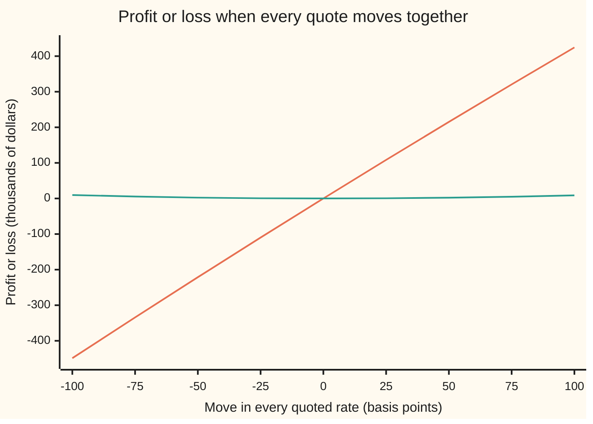

# Swap DV01: the value change for one basis point, and hedging one swap with another

[Syllabus](../../../SYLLABUS.md) → [Financial mathematics](../../../SYLLABUS.md#w12) → [Swaps](../../../SYLLABUS.md#w12-s28) → Swap DV01

---

## General Overview

A company has agreed to pay a fixed 4.5 percent a year on 10,000,000 dollars for five years. In return a bank pays it the floating rate: whatever one-year money costs at the start of each year. That contract is an interest rate swap ([Interest rate swaps](01-interest-rate-swaps.md)). The 10,000,000 dollars never changes hands. It only sizes the payments, and it is called the **notional**.

On this morning's **curve**, the market's quoted swap rates for each length from one to ten years, the five-year rate is 4.65 percent, so paying only 4.5 percent is a good deal. The swap is worth 65,736.36 dollars to the side paying fixed, called the **payer**. Tomorrow the curve moves and that value moves with it. The question every rates desk, a bank's interest-rate trading team, asks first is: by how much, per unit of move?

The unit is the **basis point**: one hundredth of a percentage point, 0.0001 as a decimal. Nudge every quoted rate up one basis point, rebuild the curve, and reprice. The payer gains 4,364.11 dollars. That number is the swap's **DV01**, short for "dollar value of 01", the value change for one basis point. A quick estimate, the notional times the annuity times one basis point, gives 4,382.42, about 4,380 dollars. The two agree, to a fraction of a cent, for a swap struck at the market rate, and this card shows why they part by 18.31 dollars here.

Once a position's DV01 is known it can be cancelled. A second swap going the other way, sized so its DV01 is equal and opposite, leaves a book that barely notices a parallel move in rates. Here the offset is a ten-year swap on which the desk receives fixed. It needs 5,558,765.46 dollars of notional, not 10,000,000, because each dollar of a ten-year swap carries almost twice the rate risk of a dollar of a five-year one.

**DV01 is the cash a position gains or loses when every quoted rate rises one basis point; two positions hedge each other when their DV01s are equal and opposite, which sets the ratio of their notionals.**

**What kind of fact this is:** a method, resting on a definition. DV01 is a chosen measure; the identity that makes it equal the notional times the annuity times one basis point for a swap struck at par is a theorem, proved on this card in Why it works.

### The picture: one swap alone, and the same swap hedged



The steep line is the five-year payer on its own: about 4.4 thousand dollars per basis point, up or down. The flat line is the same swap with the ten-year hedge beside it. A full percentage point either way moves the hedged book by less than 10 thousand dollars, and in its favour both times.

---

## The formula

Notation first, in words. A swap's fixed payments fall at the end of years 1 to $n$. $D(i)$ is the price today of one dollar paid at the end of year $i$, read off the discount curve. The **annuity** $A_n$ adds those prices up: it is what one dollar a year for $n$ years is worth today. The **par rate** $S$ is the fixed rate that makes a new $n$-year swap worth zero ([The par swap rate](02-par-swap-rate-and-annuity.md)).

The payer's value:

$$V = N\,(S - K)\,A_n, \qquad A_n = D(1) + D(2) + \dots + D(n)$$

**Read it aloud:** the swap is worth the gap between the market rate and the agreed rate, paid on the notional every year, valued at today's price of a dollar a year.

DV01, the definition, with every quote moved by $\delta$ and the curve rebuilt:

$$\text{DV01} = \frac{V(\text{quotes} + \delta) - V(\text{quotes} - \delta)}{2}, \qquad \delta = 0.0001$$

**Read it aloud:** move the market up one basis point and down one, reprice both times, and take half the difference.

The shortcut, called **PV01** (the value today of one basis point a year):

$$\text{PV01} = N \times A_n \times \delta, \qquad \text{DV01} = \text{PV01} \text{ when } K = S$$

**Read it aloud:** one basis point a year on the notional, for the life of the swap, valued today.

The hedge, a swap of $m$ years going the other way:

$$h = \frac{\text{DV01 of the position}}{\text{DV01 of one dollar of the hedge}}$$

**Read it aloud:** buy as many dollars of hedge as it takes for its rate risk to match the position's.

| Symbol | Plain meaning | In our example | Push it up and the answer… |
| --- | --- | --- | --- |
| $N$ | notional: the amount the payments are sized on | 10,000,000 | DV01 grows in proportion |
| $K$ | the fixed rate the payer agreed to | 4.5% | value falls; DV01 rises slightly |
| $S$ | par rate: the fixed rate a new swap would carry today | 4.65% for 5 years, 4.71% for 10 | value rises by $N A_n$ per unit |
| $D(i)$, $i$ | price today of one dollar paid at the end of year $i$, where $i$ counts the years | $D(5) = 0.79621728$ | — |
| $n$, $m$ | years to run on the position and on the hedge | 5 and 10 | DV01 grows, a little less than in step |
| $A_n$, $A_5$, $A_{10}$ | annuity: $D(1)$ to $D(n)$ added up | 4.382424 and 7.850863 | DV01 grows in step |
| $V$ | value to the payer | 65,736.36 dollars | — |
| $\delta$ | one basis point, 0.0001 | 0.0001 | — |
| $h$ | hedge notional | 5,558,765.46 dollars | — |
| $S_n$ | the quoted par rate for $n$ years | 4.20% to 4.71% | — |
| $B_n$ | $D(1)$ to $D(n-1)$ added up: the annuity before year $n$ | $B_5 = 3.586207$ | — |

### When it holds

- **One curve for forecasting and for discounting.** The floating payments and the discounting both come off the same curve. With two curves, as markets now use, the swap has a DV01 to each and the numbers split: [Multi-curve](04-basis-swaps-and-the-multi-curve-framework.md).
- **A parallel move in the quotes.** DV01 moves every quote by the same amount. A curve that twists is a different move, and a hedge sized on DV01 alone can lose on it: 43,535.84 dollars below, for a twist of at most ten basis points.
- **Small moves.** DV01 is a slope. Across a full percentage point the slope itself changes, and the hedged book drifts by 9.76 thousand dollars. That leftover is convexity, the bend in the value line.
- **What gets bumped is stated.** Bumping the par quotes and rebuilding is one DV01. Bumping continuously compounded zero rates is another, 4,554.26 here. Neither is wrong; mixing them is.
- **Conventions on this card.** Annual payments on both legs, each year's accrual exactly 1.0, the floating rate set at the start of each year and paid at its end, as on [Bootstrapping](../02-Curves/04-bootstrapping-the-discount-curve.md). Conventions verified 28 Sep 2026: dollar swaps now float on SOFR, an overnight rate compounded over each period, with day counts and calendars that shift every number slightly ([Money markets](../02-Curves/03-money-market-instruments-and-sofr.md)).

---

## Why it works

### Step 0: a swap's value is a straight line in the par rate

The payer receives the market rate and pays 4.5 percent. Its value is the rate gap times the annuity: $V = N(S - K)A_n$. Move the market up one basis point and $S$ moves up exactly one basis point, because the rebuilt curve must reprice its own five-year quote. If nothing else moved, the value would rise by $N \times A_n \times \delta$. Almost everything in DV01 is that one product. The rest of this section finds the small piece that is left over.

### Step 1: the floating leg collapses to two numbers

Each year the floating side pays the forward rate for that year, $D(i-1)/D(i) - 1$, with $D(0) = 1$. Discount it with $D(i)$ and the product is $D(i-1) - D(i)$. Add five of those and everything cancels except the ends:

$$\text{floating leg} = N\,\bigl(1 - D(n)\bigr)$$

On this curve that is 2,037,827.18 dollars, whether it is added up forward by forward or read off $D(5)$ directly. The fixed leg is $N K A_n$, 1,972,090.82 dollars. The par rate is the $K$ that makes the two legs equal, $S = (1 - D(n))/A_n$, so the floating leg is also $N S A_n$. Subtract the fixed leg: $V = N(S - K)A_n$, 65,736.36 dollars.

### Step 2: bump the quotes, and split the change in two

Raise every quote by $\delta$ and rebuild. The five-year par rate becomes $S + \delta$. The annuity becomes a slightly smaller $A_n'$, because every future dollar is now discounted a little harder. The change in value is

$$V' - V = N(S + \delta - K)A_n' - N(S - K)A_n = N\,\delta\,A_n' + N(S - K)(A_n' - A_n).$$

The first term is PV01, measured on the bumped annuity. The second is the swap's existing profit, $N(S - K)$ a year, revalued on the smaller annuity. Averaging the up-bump and the down-bump cancels the part of the first term that bends, so the central DV01 is PV01 plus the second term, to within cents.

### Step 3: at par the leftover vanishes

A swap struck at the market rate has $S = K$, so the second term is zero and $\text{DV01} = N A_n \delta$. That is the theorem behind the shortcut. The code checks it: struck at 4.65 percent, the five-year swap's DV01 by bumping is 4,382.42 dollars, the PV01 to the cent.

This swap is struck at 4.5 percent, off par, so the payer already holds a profit of $N(S - K)$ a year. A basis point up shrinks the annuity that values that profit, and the swap gives back 18.31 dollars of it. DV01 is 4,382.42 less 18.31: 4,364.11 dollars.

<details>
<summary>Detailed proof: the exact slope, carried through the bootstrap</summary>

The curve is built one year at a time from the quotes $S_1, \dots, S_{10}$ ([Bootstrapping](../02-Curves/04-bootstrapping-the-discount-curve.md)). With $B_n = D(1) + \dots + D(n-1)$, each rung reads
$$D(n) = \frac{1 - S_n B_n}{1 + S_n}.$$
Move every quote together by an amount $x$, so each $S_n$ grows at rate 1. Differentiate the rung with the quotient rule, writing $D'$ and $B'$ for the rates of change:
$$D'(n) = \frac{-(B_n + S_n B_n')(1 + S_n) - (1 - S_n B_n)}{(1 + S_n)^2}, \qquad B_{n+1}' = B_n' + D'(n),$$
starting from $B_1 = B_1' = 0$. One pass up the ladder gives every $D'(i)$ exactly, with no bump at all. Then $V = N\bigl(1 - D(n)\bigr) - N K A_n$ differentiates to
$$\frac{dV}{dx} = N\bigl(-D'(n) - K\,[D'(1) + \dots + D'(n)]\bigr),$$
and DV01 is that slope times $\delta$. The code runs this recursion as road 2. It lands on 4,364.11, the same as the bump to the cent. The bump's error is of order $\delta^2$, a few hundredths of a cent here. For the step 2 algebra at a general bump: the up-bump gives $N\delta A_n^+ + N(S - K)(A_n^+ - A_n)$, the down-bump gives $-N\delta A_n^- + N(S - K)(A_n^- - A_n)$. Half their difference is $N\delta (A_n^+ + A_n^-)/2 + N(S - K)(A_n^+ - A_n^-)/2$. The first average equals $A_n$ up to order $\delta^2$; the second term is $N(S - K)$ times the annuity's own slope times $\delta$. At $S = K$ it is zero.

</details>

### Step 4: two DV01s that cancel make a hedge

A ten-year swap struck at its par rate, 4.71 percent, has DV01 $A_{10} \times \delta$ per dollar of notional, by Step 3. That is 785.09 dollars per million. The desk receives fixed on it, so it loses when rates rise, while the five-year payer gains. Choose the notional $h$ so the two cancel:

$$h = \frac{4{,}364.11}{785.09 \text{ per million}} = 5{,}558{,}765.46 \text{ dollars (full precision in the code)}.$$

For small parallel moves the book's value now stands still: a 25 basis point move in either direction leaves 0.58 or 0.57 thousand dollars, against 109.87 or 108.35 thousand unhedged. What remains is second order. The ten-year value line bends more than the five-year one, and the desk is on the side that gains from bending, so the hedged book makes a little money whichever way rates go.

### The other road

DV01 treats the curve as one lever. A real curve has ten levers, one per quote, and moving them one at a time gives ten partial DV01s that add up to this card's number. That finer view is what protects against twists: [Key-rate durations](../33-Curves%20in%20Depth/02-key-rate-durations-and-curve-hedging.md).

---

## Worked numbers, by hand

The house curve: par quotes of 4.20, 4.40, 4.55, 4.62 and 4.65 percent for one to five years, from [Bootstrapping](../02-Curves/04-bootstrapping-the-discount-curve.md) (its six-month deposit plays no part, since nothing here pays at six months). The house curve stops at five years. For the ten-year hedge it is extended with quotes of 4.67, 4.68, 4.69, 4.70 and 4.71 percent: the par rates the curve's last forward rate implies if held flat, rounded to the basis point.

| Step | Arithmetic | Value |
| --- | --- | --- |
| $D(1)$ | $1 / 1.042$ | $0.95969290$ |
| $D(2)$ | $(1 - 0.044 \times 0.95969290) / 1.044$ | $0.91740758$ |
| $D(3)$ to $D(5)$ | the same rung, three more times | $0.87478903$, $0.83431725$, $0.79621728$ |
| $A_5$ | the five prices added | $4.382424$ |
| floating leg | $10{,}000{,}000 \times (1 - 0.79621728)$ | $2{,}037{,}827.18$ |
| fixed leg | $10{,}000{,}000 \times 0.045 \times 4.382424$ | $1{,}972{,}090.82$ |
| value to the payer | $2{,}037{,}827.18 - 1{,}972{,}090.82$ | $65{,}736.36$ |
| PV01 | $10{,}000{,}000 \times 4.382424 \times 0.0001$ | $4{,}382.42$ |
| DV01, bump and rebuild | PV01 less the off-par piece, $4{,}382.42 - 18.31$ | **$4{,}364.11$** |
| $A_{10}$ | ten prices added, the last $D(10) = 0.63022438$ | $7.850863$ |
| ten-year DV01 per million | at par: $1{,}000{,}000 \times A_{10} \times 0.0001$ | $785.09$ |
| hedge notional $h$ | $4{,}364.11 / 785.09$, in millions | **$5{,}558{,}765.46$** |

The payer gains about 4,364 dollars for every basis point the market rises. A ten-year receiver of 5.56 million dollars loses the same, and together they are flat.

### What breaks if you drop a piece

| Mistake | Comes out at | What went wrong |
| --- | --- | --- |
| Hedge with the same notional, 10,000,000 of the ten-year | net DV01 −3,486.75 per basis point | Notionals are not risk. A ten-year dollar carries 7.85 years of annuity, a five-year dollar 4.38. The book now loses when rates rise: the risk has flipped sign. |
| Pay fixed on the ten-year instead of receiving | net DV01 8,728.22 | The hedge adds to the risk. The book is twice as exposed as before. |
| Bump continuously compounded zero rates, not the quotes | DV01 4,554.26 | A different lever. A zero-rate basis point moves the annual par rates by more than one basis point, so the number is larger. Fine if the hedge is measured the same way; wrong if mixed. |
| Use PV01 for an off-par swap | 4,382.42 instead of 4,364.11 | Leaves out the 18.31 dollars the existing profit loses when the annuity shrinks. Small at 15 basis points off market; it grows with the gap. |

---

## How the hedge drifts

Nothing happened to the market. The quotes did not move for four years. The hedge still went wrong.

Each year one payment drops off each swap. The five-year swap loses a fifth of its remaining life; the ten-year loses only a tenth. So the five-year DV01 shrinks faster than the hedge's, and a book that was flat on day one ends up losing when rates rise.

| Time passed | 5-year leg DV01 | Hedge DV01 | Net |
| --- | --- | --- | --- |
| 0 years | 4,364.11 | 4,364.11 | 0.00 |
| 1 year | 3,576.13 | 4,015.59 | −439.45 |
| 2 years | 2,749.29 | 3,649.53 | −900.24 |
| 3 years | 1,879.78 | 3,265.28 | −1,385.50 |
| 4 years | 962.46 | 2,862.16 | −1,899.70 |

Each row reprices both swaps on the same quotes: the five-year leg with $5 - j$ payments left, the hedge with $10 - j$.

```
net DV01 of the hedged book, dollars lost per basis point rise, quotes unchanged
  time 0                                          0.00
  time 1   █████████                            439.45
  time 2   ███████████████████                  900.24
  time 3   █████████████████████████████      1,385.50
  time 4   ████████████████████████████████████████ 1,899.70
```

After one year the unhedged exposure is 439.45 dollars a basis point, a tenth of the original risk, back on the book with no market move at all. Desks re-measure DV01 every day and trim the hedge when the net drifts past a limit.

---

## Code, from first principles, and it actually runs

The script builds the curve from its ten quotes with the bootstrap written out, prices the swap with the floating leg as a strip of forwards, and reaches DV01 by two independent roads: bump every quote and rebuild, and carry the exact slope up the bootstrap ladder. It then checks the par-swap theorem (DV01 equals PV01 when $K = S$), sizes the hedge, runs the book through parallel moves and a twist, reproduces every "what breaks" number, and ages both swaps a year at a time. Six asserts, each against a number computed another way; breaking the bootstrap, dropping the factor of two in the bump, flipping the hedge's sign or mis-discounting a forward each makes one fail.

### Python

```python
# Swap DV01 and hedging -- the check behind the card.  Standard library only.
# The curve is rebuilt from its quotes by the bootstrap written out below;
# DV01 is reached by bumping and rebuilding, and separately by carrying the
# exact slope through the same bootstrap.  Nothing imported knows a swap.
from math import exp

QUOTES = [0.042, 0.044, 0.0455, 0.0462, 0.0465,      # the house curve, years 1 to 5
          0.0467, 0.0468, 0.0469, 0.0470, 0.0471]    # years 6 to 10, extended at its last forward
N, K, BP = 10_000_000.0, 0.045, 0.0001               # notional, fixed rate, one basis point

def boot(q):                                         # D(n) = (1 - S_n * sum of earlier D) / (1 + S_n)
    D, B = [], 0.0
    for s in q:
        d = (1.0 - s * B) / (1.0 + s)
        D.append(d); B += d
    return D

def boot_slope(q):                                   # the same recursion, carrying dD/dshift alongside
    D, dD, B, dB = [], [], 0.0, 0.0
    for s in q:
        d = (1.0 - s * B) / (1.0 + s)
        dd = (-(B + s * dB) * (1.0 + s) - (1.0 - s * B)) / (1.0 + s) ** 2
        D.append(d); dD.append(dd); B += d; dB += dd
    return D, dD

def payer(D, k, n, notional):                        # receive floating, pay k; floating as a strip of forwards
    prev, flt, fix = 1.0, 0.0, 0.0
    for i in range(n):
        flt += (prev / D[i] - 1.0) * D[i]           # forward rate for year i+1, paid then, discounted
        fix += k * D[i]
        prev = D[i]
    return notional * (flt - fix)

def value(q, k, n, notional, shift=0.0):
    return payer(boot([x + shift for x in q]), k, n, notional)

def dv01(q, k, n, notional, h=BP):                   # bump every quote up and down, rebuild, reprice
    return (value(q, k, n, notional, h) - value(q, k, n, notional, -h)) / (2.0 * h) * BP

D = boot(QUOTES)
A5, A10 = sum(D[:5]), sum(D)
par5, par10 = (1.0 - D[4]) / A5, (1.0 - D[9]) / A10
print("the house curve: par quotes with annual coupons, bootstrapped")
for i, (q, d) in enumerate(zip(QUOTES, D)):
    print(f"  year {i + 1:>2}   quote {100 * q:6.4f} %   D = {d:.8f}")
print(f"5-year annuity A5 {A5:>22.6f}    par rate {100 * par5:.4f} %")
print(f"10-year annuity A10 {A10:>20.6f}    par rate {100 * par10:.4f} %")

V5 = payer(D, K, 5, N)
flt_strip = V5 + N * K * A5
print("\nthe 5-year swap: pay 4.5% fixed on 10,000,000, receive floating")
print(f"  floating leg, strip of forwards {flt_strip:>16,.2f}")
print(f"  floating leg, N (1 - D(5))      {N * (1.0 - D[4]):>16,.2f}")
print(f"  fixed leg, N K A5               {N * K * A5:>16,.2f}")
print(f"  value to the payer              {V5:>16,.2f}")

dv_bump = dv01(QUOTES, K, 5, N)
Ds, dD = boot_slope(QUOTES)
dv_exact = N * (-dD[4] - K * sum(dD[:5])) * BP
pv01 = N * A5 * BP
dv_par = dv01(QUOTES, par5, 5, N)
print("\nDV01 of the 5-year payer, dollars per basis point")
print(f"  1 bump every quote, rebuild     {dv_bump:>16,.2f}")
print(f"  2 exact slope through bootstrap {dv_exact:>16,.2f}")
print(f"  PV01 shortcut N A5 x 0.0001     {pv01:>16,.2f}")
print(f"  gap, PV01 minus DV01            {pv01 - dv_bump:>16,.2f}")
print(f"  same swap struck at par 4.65%   {dv_par:>16,.2f}")

dv10_unit = dv01(QUOTES, par10, 10, 1.0)
hedge = dv_bump / dv10_unit
print("\nhedge: receive fixed on a 10-year swap at its par rate, 4.71%")
print(f"  10-year DV01 per million        {1e6 * dv10_unit:>16,.2f}")
print(f"  hedge notional                  {hedge:>16,.2f}")
print(f"  net DV01 of the pair            {dv_bump - hedge * dv10_unit:>16,.2f}")

def book(shifts, n5=N, n10=None):                    # P&L of 5y payer and 10y receiver after the quotes move
    n10 = hedge if n10 is None else n10
    q = [x + s for x, s in zip(QUOTES, shifts)]
    p5 = value(q, K, 5, n5) - V5
    p10 = -(value(q, par10, 10, n10) - value(QUOTES, par10, 10, n10))
    return p5, p10

moves = [-100, -75, -50, -25, 0, 25, 50, 75, 100]
pl = [book([m * BP] * 10) for m in moves]
print("\nparallel moves, P&L in thousands of dollars")
print("chart, move bp  " + " ".join(f"{m:>8d}" for m in moves))
print("chart, unhedged " + " ".join(f"{p5 / 1e3:>8.2f}" for p5, _ in pl))
print("chart, hedged   " + " ".join(f"{(p5 + p10) / 1e3:>8.2f}" for p5, p10 in pl))

tw5, tw10 = book([0.0] * 5 + [j * 2 * BP for j in range(1, 6)])
print(f"\nsteepener, years 6-10 up 2,4,6,8,10 bp: 5y {tw5:,.2f}  hedge {tw10:,.2f}  net {tw5 + tw10:,.2f}")

print("\nwhat breaks, net DV01 or DV01 in dollars per basis point")
print(f"  hedge with 10,000,000 of the 10-year  {dv_bump - N * dv10_unit:>12,.2f}")
print(f"  pay fixed on the 10-year instead      {dv_bump + hedge * dv10_unit:>12,.2f}")
zb = lambda h: payer([d * exp(-h * (i + 1)) for i, d in enumerate(D)], K, 5, N)
print(f"  bump zero rates, not the quotes       {(zb(BP) - zb(-BP)) / 2.0:>12,.2f}")

print("\na year at a time, quotes unchanged: DV01 of each leg and of the pair")
for j in range(5):
    a = dv01(QUOTES, K, 5 - j, N)
    b = hedge * dv01(QUOTES, par10, 10 - j, 1.0)
    print(f"  at time {j}   5y leg {a:>9,.2f}   hedge {b:>9,.2f}   net {a - b:>9,.2f}")

print("\ntry: hedge with the 7-year at par instead  "
      f"{dv_bump / dv01(QUOTES, (1.0 - D[6]) / sum(D[:7]), 7, 1.0):,.2f}")
print(f"try: bump by 10 bp and divide by 10        {dv01(QUOTES, K, 5, N, 10 * BP):,.2f}")

assert abs(D[4] - 0.79621728) < 5e-9,               "D(5) must match the bootstrapping card"
assert abs(par5 - QUOTES[4]) < 1e-12,               "the curve must reprice its own 5-year quote"
assert abs(flt_strip - N * (1.0 - D[4])) < 1e-6,    "strip of forwards vs N(1 - D(5))"
assert abs(dv_bump - dv_exact) < 0.01,              "bump road vs exact-slope road"
assert abs(dv_par - pv01) < 0.01,                   "at par, DV01 must equal N A5 x 1bp"
assert abs(sum(pl[5])) < 0.01 * abs(pl[5][0]),      "hedge must cut a 25bp parallel move by 99%"
print("ALL CHECKS PASS")
```

**Ran 2026-09-27 on macOS, Python 3.14.6, standard library only. All checks passed. Output, pasted from the run:**

```
the house curve: par quotes with annual coupons, bootstrapped
  year  1   quote 4.2000 %   D = 0.95969290
  year  2   quote 4.4000 %   D = 0.91740758
  year  3   quote 4.5500 %   D = 0.87478903
  year  4   quote 4.6200 %   D = 0.83431725
  year  5   quote 4.6500 %   D = 0.79621728
  year  6   quote 4.6700 %   D = 0.75985554
  year  7   quote 4.6800 %   D = 0.72539293
  year  8   quote 4.6900 %   D = 0.69233562
  year  9   quote 4.7000 %   D = 0.66063001
  year 10   quote 4.7100 %   D = 0.63022438
5-year annuity A5               4.382424    par rate 4.6500 %
10-year annuity A10             7.850863    par rate 4.7100 %

the 5-year swap: pay 4.5% fixed on 10,000,000, receive floating
  floating leg, strip of forwards     2,037,827.18
  floating leg, N (1 - D(5))          2,037,827.18
  fixed leg, N K A5                   1,972,090.82
  value to the payer                     65,736.36

DV01 of the 5-year payer, dollars per basis point
  1 bump every quote, rebuild             4,364.11
  2 exact slope through bootstrap         4,364.11
  PV01 shortcut N A5 x 0.0001             4,382.42
  gap, PV01 minus DV01                       18.31
  same swap struck at par 4.65%           4,382.42

hedge: receive fixed on a 10-year swap at its par rate, 4.71%
  10-year DV01 per million                  785.09
  hedge notional                      5,558,765.46
  net DV01 of the pair                        0.00

parallel moves, P&L in thousands of dollars
chart, move bp      -100      -75      -50      -25        0       25       50       75      100
chart, unhedged  -448.85  -334.27  -221.28  -109.87     0.00   108.35   215.20   320.57   424.51
chart, hedged       9.76     5.41     2.37     0.58     0.00     0.57     2.24     4.97     8.72

steepener, years 6-10 up 2,4,6,8,10 bp: 5y 0.00  hedge -43,535.84  net -43,535.84

what breaks, net DV01 or DV01 in dollars per basis point
  hedge with 10,000,000 of the 10-year     -3,486.75
  pay fixed on the 10-year instead          8,728.22
  bump zero rates, not the quotes           4,554.26

a year at a time, quotes unchanged: DV01 of each leg and of the pair
  at time 0   5y leg  4,364.11   hedge  4,364.11   net      0.00
  at time 1   5y leg  3,576.13   hedge  4,015.59   net   -439.45
  at time 2   5y leg  2,749.29   hedge  3,649.53   net   -900.24
  at time 3   5y leg  1,879.78   hedge  3,265.28   net -1,385.50
  at time 4   5y leg    962.46   hedge  2,862.16   net -1,899.70

try: hedge with the 7-year at par instead  7,437,549.85
try: bump by 10 bp and divide by 10        4,364.14
ALL CHECKS PASS
```

The two DV01 roads agree to the cent. The par swap's DV01 matches PV01 to the cent. A 25 basis point move shrinks from 108.35 thousand dollars to 0.57 thousand once hedged.

### Rust

Same curve, same roads. Rust's standard library has no thousands separator, so the program writes one to keep the rows identical.

```rust
// Swap DV01 and hedging -- the same check as swap_dv01_and_hedging_check.py, in Rust.
// Standard library only, no crates.  The bootstrap, the swap pricer, the bump
// and the exact slope are all written out here.
// Compile: rustc --edition 2021 -O swap_dv01_and_hedging_check.rs -o /tmp/swap_dv01_check

const QUOTES: [f64; 10] = [0.042, 0.044, 0.0455, 0.0462, 0.0465,   // the house curve, years 1 to 5
                           0.0467, 0.0468, 0.0469, 0.0470, 0.0471]; // years 6 to 10, extended at its last forward
const N: f64 = 10_000_000.0;
const K: f64 = 0.045;
const BP: f64 = 0.0001;

fn boot(q: &[f64]) -> Vec<f64> {                       // D(n) = (1 - S_n * sum of earlier D) / (1 + S_n)
    let mut d = Vec::new();
    let mut b = 0.0;
    for &s in q { let x = (1.0 - s * b) / (1.0 + s); d.push(x); b += x; }
    d
}

fn boot_slope(q: &[f64]) -> Vec<f64> {                 // the recursion's derivative when every quote moves together
    let (mut b, mut db, mut out) = (0.0, 0.0, Vec::new());
    for &s in q {
        let x = (1.0 - s * b) / (1.0 + s);
        let dx = (-(b + s * db) * (1.0 + s) - (1.0 - s * b)) / ((1.0 + s) * (1.0 + s));
        out.push(dx); b += x; db += dx;
    }
    out
}

fn payer(d: &[f64], k: f64, n: usize, notional: f64) -> f64 {   // receive floating as a strip of forwards, pay k
    let (mut prev, mut flt, mut fix) = (1.0, 0.0, 0.0);
    for i in 0..n {
        flt += (prev / d[i] - 1.0) * d[i];
        fix += k * d[i];
        prev = d[i];
    }
    notional * (flt - fix)
}

fn value(q: &[f64], k: f64, n: usize, notional: f64, shift: f64) -> f64 {
    let moved: Vec<f64> = q.iter().map(|x| x + shift).collect();
    payer(&boot(&moved), k, n, notional)
}

fn dv01(q: &[f64], k: f64, n: usize, notional: f64, h: f64) -> f64 {
    (value(q, k, n, notional, h) - value(q, k, n, notional, -h)) / (2.0 * h) * BP
}

fn money(x: f64) -> String {                           // 1234567.891 -> "1,234,567.89"
    let s = format!("{:.2}", x);
    let (sign, body) = if s.starts_with('-') { ("-", &s[1..]) } else { ("", &s[..]) };
    let (int, frac) = body.split_at(body.find('.').unwrap());
    let mut out = String::new();
    for (i, c) in int.chars().enumerate() {
        if i > 0 && (int.len() - i) % 3 == 0 { out.push(','); }
        out.push(c);
    }
    format!("{}{}{}", sign, out, frac)
}

fn book(shifts: &[f64], hedge: f64, v5: f64, par10: f64) -> (f64, f64) {
    let q: Vec<f64> = QUOTES.iter().zip(shifts).map(|(x, s)| x + s).collect();
    let p5 = payer(&boot(&q), K, 5, N) - v5;
    let p10 = -(payer(&boot(&q), par10, 10, hedge) - payer(&boot(&QUOTES), par10, 10, hedge));
    (p5, p10)
}

fn main() {
    let d = boot(&QUOTES);
    let a5: f64 = d[..5].iter().sum();
    let a10: f64 = d.iter().sum();
    let (par5, par10) = ((1.0 - d[4]) / a5, (1.0 - d[9]) / a10);
    println!("the house curve: par quotes with annual coupons, bootstrapped");
    for i in 0..10 { println!("  year {:>2}   quote {:6.4} %   D = {:.8}", i + 1, 100.0 * QUOTES[i], d[i]); }
    println!("5-year annuity A5 {:>22.6}    par rate {:.4} %", a5, 100.0 * par5);
    println!("10-year annuity A10 {:>20.6}    par rate {:.4} %", a10, 100.0 * par10);

    let v5 = payer(&d, K, 5, N);
    let flt_strip = v5 + N * K * a5;
    println!("\nthe 5-year swap: pay 4.5% fixed on 10,000,000, receive floating");
    println!("  floating leg, strip of forwards {:>16}", money(flt_strip));
    println!("  floating leg, N (1 - D(5))      {:>16}", money(N * (1.0 - d[4])));
    println!("  fixed leg, N K A5               {:>16}", money(N * K * a5));
    println!("  value to the payer              {:>16}", money(v5));

    let dv_bump = dv01(&QUOTES, K, 5, N, BP);
    let dd = boot_slope(&QUOTES);
    let dv_exact = N * (-dd[4] - K * dd[..5].iter().sum::<f64>()) * BP;
    let pv01 = N * a5 * BP;
    let dv_par = dv01(&QUOTES, par5, 5, N, BP);
    println!("\nDV01 of the 5-year payer, dollars per basis point");
    println!("  1 bump every quote, rebuild     {:>16}", money(dv_bump));
    println!("  2 exact slope through bootstrap {:>16}", money(dv_exact));
    println!("  PV01 shortcut N A5 x 0.0001     {:>16}", money(pv01));
    println!("  gap, PV01 minus DV01            {:>16}", money(pv01 - dv_bump));
    println!("  same swap struck at par 4.65%   {:>16}", money(dv_par));

    let dv10_unit = dv01(&QUOTES, par10, 10, 1.0, BP);
    let hedge = dv_bump / dv10_unit;
    println!("\nhedge: receive fixed on a 10-year swap at its par rate, 4.71%");
    println!("  10-year DV01 per million        {:>16}", money(1e6 * dv10_unit));
    println!("  hedge notional                  {:>16}", money(hedge));
    println!("  net DV01 of the pair            {:>16}", money(dv_bump - hedge * dv10_unit));

    let moves = [-100i32, -75, -50, -25, 0, 25, 50, 75, 100];
    let pl: Vec<(f64, f64)> = moves.iter().map(|&m| book(&[m as f64 * BP; 10], hedge, v5, par10)).collect();
    println!("\nparallel moves, P&L in thousands of dollars");
    let row = |label: &str, xs: Vec<String>| println!("{}{}", label, xs.join(" "));
    row("chart, move bp  ", moves.iter().map(|m| format!("{:>8}", m)).collect());
    row("chart, unhedged ", pl.iter().map(|p| format!("{:>8.2}", p.0 / 1e3)).collect());
    row("chart, hedged   ", pl.iter().map(|p| format!("{:>8.2}", (p.0 + p.1) / 1e3)).collect());

    let mut tw = [0.0; 10];
    for j in 1..=5 { tw[4 + j] = j as f64 * 2.0 * BP; }
    let (tw5, tw10) = book(&tw, hedge, v5, par10);
    println!("\nsteepener, years 6-10 up 2,4,6,8,10 bp: 5y {}  hedge {}  net {}", money(tw5), money(tw10), money(tw5 + tw10));

    println!("\nwhat breaks, net DV01 or DV01 in dollars per basis point");
    println!("  hedge with 10,000,000 of the 10-year  {:>12}", money(dv_bump - N * dv10_unit));
    println!("  pay fixed on the 10-year instead      {:>12}", money(dv_bump + hedge * dv10_unit));
    let zb = |h: f64| {
        let dz: Vec<f64> = d.iter().enumerate().map(|(i, x)| x * (-h * (i as f64 + 1.0)).exp()).collect();
        payer(&dz, K, 5, N)
    };
    println!("  bump zero rates, not the quotes       {:>12}", money((zb(BP) - zb(-BP)) / 2.0));

    println!("\na year at a time, quotes unchanged: DV01 of each leg and of the pair");
    for j in 0..5 {
        let a = dv01(&QUOTES, K, 5 - j, N, BP);
        let b = hedge * dv01(&QUOTES, par10, 10 - j, 1.0, BP);
        println!("  at time {}   5y leg {:>9}   hedge {:>9}   net {:>9}", j, money(a), money(b), money(a - b));
    }

    let a7: f64 = d[..7].iter().sum();
    println!("\ntry: hedge with the 7-year at par instead  {}", money(dv_bump / dv01(&QUOTES, (1.0 - d[6]) / a7, 7, 1.0, BP)));
    println!("try: bump by 10 bp and divide by 10        {}", money(dv01(&QUOTES, K, 5, N, 10.0 * BP)));

    assert!((d[4] - 0.79621728).abs() < 5e-9, "D(5) must match the bootstrapping card");
    assert!((par5 - QUOTES[4]).abs() < 1e-12, "the curve must reprice its own 5-year quote");
    assert!((flt_strip - N * (1.0 - d[4])).abs() < 1e-6, "strip of forwards vs N(1 - D(5))");
    assert!((dv_bump - dv_exact).abs() < 0.01, "bump road vs exact-slope road");
    assert!((dv_par - pv01).abs() < 0.01, "at par, DV01 must equal N A5 x 1bp");
    assert!((pl[5].0 + pl[5].1).abs() < 0.01 * pl[5].0.abs(), "hedge must cut a 25bp parallel move by 99%");
    println!("ALL CHECKS PASS");
}
```

**Ran 2026-09-27 on macOS, rustc 1.98.1, no crates. All checks passed. Output, pasted from the run:**

```
the house curve: par quotes with annual coupons, bootstrapped
  year  1   quote 4.2000 %   D = 0.95969290
  year  2   quote 4.4000 %   D = 0.91740758
  year  3   quote 4.5500 %   D = 0.87478903
  year  4   quote 4.6200 %   D = 0.83431725
  year  5   quote 4.6500 %   D = 0.79621728
  year  6   quote 4.6700 %   D = 0.75985554
  year  7   quote 4.6800 %   D = 0.72539293
  year  8   quote 4.6900 %   D = 0.69233562
  year  9   quote 4.7000 %   D = 0.66063001
  year 10   quote 4.7100 %   D = 0.63022438
5-year annuity A5               4.382424    par rate 4.6500 %
10-year annuity A10             7.850863    par rate 4.7100 %

the 5-year swap: pay 4.5% fixed on 10,000,000, receive floating
  floating leg, strip of forwards     2,037,827.18
  floating leg, N (1 - D(5))          2,037,827.18
  fixed leg, N K A5                   1,972,090.82
  value to the payer                     65,736.36

DV01 of the 5-year payer, dollars per basis point
  1 bump every quote, rebuild             4,364.11
  2 exact slope through bootstrap         4,364.11
  PV01 shortcut N A5 x 0.0001             4,382.42
  gap, PV01 minus DV01                       18.31
  same swap struck at par 4.65%           4,382.42

hedge: receive fixed on a 10-year swap at its par rate, 4.71%
  10-year DV01 per million                  785.09
  hedge notional                      5,558,765.46
  net DV01 of the pair                        0.00

parallel moves, P&L in thousands of dollars
chart, move bp      -100      -75      -50      -25        0       25       50       75      100
chart, unhedged  -448.85  -334.27  -221.28  -109.87     0.00   108.35   215.20   320.57   424.51
chart, hedged       9.76     5.41     2.37     0.58     0.00     0.57     2.24     4.97     8.72

steepener, years 6-10 up 2,4,6,8,10 bp: 5y 0.00  hedge -43,535.84  net -43,535.84

what breaks, net DV01 or DV01 in dollars per basis point
  hedge with 10,000,000 of the 10-year     -3,486.75
  pay fixed on the 10-year instead          8,728.22
  bump zero rates, not the quotes           4,554.26

a year at a time, quotes unchanged: DV01 of each leg and of the pair
  at time 0   5y leg  4,364.11   hedge  4,364.11   net      0.00
  at time 1   5y leg  3,576.13   hedge  4,015.59   net   -439.45
  at time 2   5y leg  2,749.29   hedge  3,649.53   net   -900.24
  at time 3   5y leg  1,879.78   hedge  3,265.28   net -1,385.50
  at time 4   5y leg    962.46   hedge  2,862.16   net -1,899.70

try: hedge with the 7-year at par instead  7,437,549.85
try: bump by 10 bp and divide by 10        4,364.14
ALL CHECKS PASS
```

The two outputs are identical, byte for byte.

> [!TIP]
> **Try changing**
> Guess the direction first. Then run it.
> - **Strike the five-year at par.** Set the fixed rate to the 4.65 percent par rate. DV01 rises from 4,364.11 to **4,382.42**, exactly PV01: the off-par piece is gone.
> - **Hedge with a seven-year instead.** A seven-year dollar carries less annuity than a ten-year one, so more of it is needed: **7,437,549.85** dollars of notional.
> - **Bump by ten basis points and divide by ten.** DV01 comes out at **4,364.14**, three cents from the one-basis-point figure. The value line is so nearly straight that the size of the bump hardly matters.

---

## The usual mistake

> [!warning]
> **Hedging notional for notional.** Ten million against ten million looks balanced and is not. Rate risk scales with the annuity, and a ten-year swap has 7.85 years of it against the five-year's 4.38. Hedging 10,000,000 of the five-year payer with 10,000,000 of the ten-year receiver leaves a net DV01 of −3,486.75 dollars per basis point: the book has swapped one exposure for a bigger one in the opposite direction. The ratio comes from DV01s, 5,558,765.46 dollars here.
>
> Smaller traps:
> - **Calling a DV01 hedge a full hedge.** It cancels parallel moves only. A twist that lifts the six- to ten-year quotes by up to ten basis points, leaving the first five alone, costs the hedged book 43,535.84 dollars while the five-year swap does not move.
> - **Comparing DV01s bumped different ways.** A zero-rate bump gives 4,554.26 for this swap, a par-quote bump 4,364.11. Size a hedge with one and the position with the other and the ratio is off by the gap.
> - **Setting the hedge once.** Four years on, with no market move, the book loses 1,899.70 dollars per basis point rise.
> - **Sign.** DV01 here is the payer's gain on a rise. A receiver's DV01 is the same size with the other sign. Paying fixed on the hedge instead of receiving doubles the exposure to 8,728.22.

---

## Where you meet it in real life

- **A rates desk's risk report.** The first line is DV01, per currency and per curve. Traders hold limits in dollars per basis point, not in notional.
- **A company hedging its loan.** A firm that borrows floating and pays fixed on a swap to lock its cost holds exactly the payer on this card. Its treasurer reads the swap's DV01 to know how much the hedge's market value will swing.
- **Bond portfolios.** A manager who owns bonds and wants less rate risk receives floating on a swap, sized so the swap's DV01 matches the bonds' DV01 ([Duration and convexity](../01-Money%2C%20Dates%20and%20Discounting/06-duration-and-convexity.md)).
- **Collateral and margin.** A clearing house, the middleman that guarantees both sides, sizes margin from what a position could lose in a stressed market, and for a plain swap that is roughly DV01 times the stressed move. Which curve discounts the swap changes that DV01: [Collateral discounting](05-ois-discounting-and-collateral.md).
- **Quoting a swap backwards.** Turning a price into the rate that produces it divides by the same annuity, which is why a swap's price moves by PV01 per basis point of rate: [Solving a swap backwards](07-swap-inverses-rate-and-curve-from-price.md).
- **Two currencies.** A swap that exchanges dollars for euros carries a DV01 to each currency's curve, and each is hedged in its own market: [Cross-currency swaps](06-cross-currency-swaps-and-basis.md).

> **Say it back**
> DV01 is the cash a position gains or loses when every quoted rate rises one basis point. For a swap it is almost exactly the notional times the annuity times one basis point, the PV01, and exactly that when the swap is struck at the market rate. Off market, the existing profit is revalued on a smaller annuity and DV01 differs by a little: 18.31 dollars for this swap. Two swaps hedge each other when their DV01s are equal and opposite, so a five-year payer on 10 million is offset by a ten-year receiver on about 5.56 million. The hedge holds for parallel moves, not twists, and drifts as the swaps age.

---

## What this builds on

- [The par swap rate](02-par-swap-rate-and-annuity.md): the par rate and the annuity it divides by. This card's value formula, $V = N(S - K)A_n$, and its whole DV01 come from that annuity.
- [Duration and convexity](../01-Money%2C%20Dates%20and%20Discounting/06-duration-and-convexity.md): DV01 for a bond, the slope of price against yield, and convexity, the bend that shows up here as the hedged book's small gain.

## Where this goes next

- [Multi-curve](04-basis-swaps-and-the-multi-curve-framework.md): the floating rate and the discounting on separate curves, so one DV01 becomes two and a hedge must match both.
- [Key-rate durations](../33-Curves%20in%20Depth/02-key-rate-durations-and-curve-hedging.md): DV01 split quote by quote, and hedges that survive twists.

A DV01 hedge leaves the book open to a twist that cost 43,535.84 dollars here; key rate durations measure that exposure one maturity at a time, so it can be hedged as well.

---

## Sources

Verified 28 Sep 2026: each link below opens the publisher's page naming the cited work.

- Tuckman, Bruce, and Angel Serrat. *Fixed Income Securities: Tools for Today's Markets*, 4th ed. Wiley, 2022. [Publisher page](https://www.wiley.com/en-us/Fixed+Income+Securities%3A+Tools+for+Today%27s+Markets%2C+4th+Edition-p-9781119835554). DV01 as the desk's measure of rate risk, hedge ratios from DV01s, and swaps valued off one curve.
- Hull, John C. *Options, Futures, and Other Derivatives*, 11th ed. Pearson. [Publisher page](https://www.pearson.com/en-us/subject-catalog/p/options-futures-and-other-derivatives/P200000005938). Swap valuation as two bonds or a strip of forwards, and hedging with duration and DV01.
