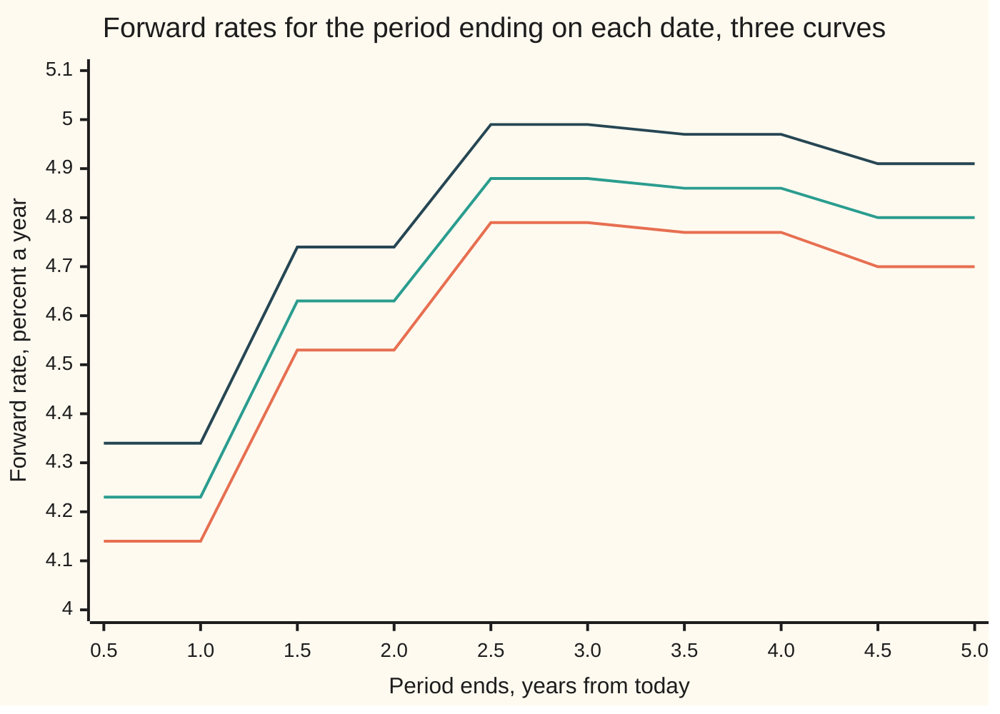

# Multi-curve: one curve to forecast, another to discount, and the basis between them

[Syllabus](../../../SYLLABUS.md) → [Financial mathematics](../README.md) → [Swaps](../README.md#s28) → Multi-curve

---

## General Overview

Two banks agree to swap interest for five years on 10,000,000 dollars. One side pays a rate that resets every three months, the other a rate that resets every six months. Both rates are published indices: the average a panel of banks charges for unsecured loans of that length, Euribor being the live example. On a trading screen this morning the deal is quoted at **8 basis points**, a basis point being a hundredth of a percentage point. The side that receives the 3-month rate also receives 0.08 percent a year on top, and the deal is then fair.

Why should anyone need paying to swap three-month money for six-month money? Lend for six months, or lend for three and roll it over once: an old argument says the two must come to the same thing, and then the 3-month leg and the 6-month leg are worth exactly the same. That argument runs the whole of one curve through both jobs a coupon has. It sizes each coupon (the **forecast**) and it prices each payment back to today (the **discount**). An 8 basis point quote says the argument has failed. A lender for six months carries more risk that the borrowing bank fails, or that cash cannot be had, than a lender who can walk away after three.

The fix is to give each job its own curve. One **discount curve**, built from overnight rates, prices a dollar paid on any date. One **forecast curve** per index, a 3-month curve and a 6-month curve, sizes the coupons that index will pay. That arrangement is the **multi-curve framework**, and the fair spread that balances two floating legs on different indices is the **tenor basis**.

**Each coupon is forecast off the curve of its own index and discounted off one shared curve for cash, and the tenor basis is the difference between the two forecast legs, paid out as a spread.**

**What kind of fact this is:** a model — a separate forecast curve per index is a modelling choice that fits markets since 2007, not a law — and, inside it, the leg and basis formulas are algebra proved on this card in Why it works.

### The picture: three curves where there used to be one



Bottom line, orange: the overnight curve's forward rate for the three months ending on each date, the rate cash itself earns. Middle line, green: the 3-month index forward for the same quarter, about 10 basis points higher. Top line, dark: the 6-month index forward for the half-year ending on each date, about 10 basis points higher again. The lines step because each year of the overnight curve carries one flat rate; the steps are the curve-builder's rule, not the market's.

---

## The formula

Notation first, in words. $D(t)$ is the **discount factor**: what one dollar paid at time $t$, in years, is worth today. $H_3(t)$ and $H_6(t)$ are the two **forecast curves**. They look like discount factors and fall like them, but nobody trades them as prices: they exist only to store forecasts, and a forecast is read off the ratio of two neighbouring points. A coupon period runs from a start date $t_{i-1}$ to an end date $t_i$, where it pays, and its length in years is the **accrual fraction** $\alpha$: 0.25 for a quarter, 0.5 for a half-year, 1 for a year.

The forecast of the index rate for one period is the growth the forecast curve implies across it:

$$F_i \;=\; \frac{1}{\alpha}\left(\frac{H(t_{i-1})}{H(t_i)} - 1\right)$$

A floating leg is its coupons, each forecast off its own index's curve and discounted off the shared one. Per dollar of notional:

$$C \;=\; \sum_i \alpha \, F_i \, D(t_i)$$

**Read it aloud:** for every period, size the coupon from the index's forecast curve, then price the payment from the discount curve, and add them up.

The tenor basis is the spread $s$, added to every 3-month coupon, that makes the two floating legs equal. Each basis point of $s$ is paid on every quarter, so it costs the quarterly **annuity** $A_3$, the discount factors weighted by accrual and added up:

$$\boxed{\;s \;=\; \frac{C_6 - C_3}{A_3}, \qquad A_3 \;=\; \sum_i 0.25\, D(t_i)\;}$$

**Read it aloud:** the basis is the gap between the two legs, spread over what one unit of quarterly coupon costs.

A fixed-for-floating swap uses the same parts. Paying a fixed rate $K$ once a year on notional $N$ and receiving the 3-month leg is worth

$$V \;=\; N\left(C_3 - K A_f\right), \qquad A_f \;=\; D(1) + D(2) + \dots + D(5).$$

This card's forecast curves take the simplest shape that one quote can pin down: the discount curve, pulled down by a constant **spread** $b$ a year.

$$H_3(t) = D(t)\,e^{-b_3 t}, \qquad H_6(t) = D(t)\,e^{-b_6 t}$$

| Symbol | Plain meaning | In our example | Push it up and the answer… |
| --- | --- | --- | --- |
| $D(t)$ | discount factor: today's value of a dollar paid at $t$ | 0.79621728 at five years | every leg and annuity is worth more |
| $H_3(t)$, $H_6(t)$, $H$ | forecast curves: store the index forecasts, not prices | $D(t)$ pulled down by $b_3$ or $b_6$ | a steeper fall means bigger coupons |
| $t_i$, $t_{i-1}$, $t$, $i$ | end and start of coupon period $i$; $t$ is any date, in years | quarters 0.25 to 5 | — |
| $\alpha$ | accrual fraction: the period's length in years | 0.25, 0.5 or 1 | more interest per coupon |
| $F_i$ | the index forecast for period $i$ | 4.23% for the first quarter | the floating leg is worth more |
| $b_3$, $b_6$, $b$ | the forecast curve's spread over the discount curve, a year | 9.717966 and 17.521490 bp | that index's coupons grow |
| $C_3$, $C_6$, $C$ | value today of a floating leg, per dollar | 0.208165 and 0.211732 | — |
| $A_f$, $A_3$, $A_6$ | annuities: yearly, quarterly, half-yearly | 4.382424, 4.458117, 4.432789 | each unit of spread or fixed rate costs more |
| $S_3$, $S_6$ | par rates: the fixed rate that makes a new swap against that index worth zero | 4.75% quoted; 4.8314% implied | — |
| $s$ | tenor basis: the spread on the 3-month leg that balances the two | 8 bp | the 3-month side receives more |
| $K$, $N$ | the house swap's fixed rate and notional | 4.5%, 10,000,000 dollars | the fixed payer loses |
| $V$ | the swap's value today to the side paying fixed | 109,560.60 dollars | — |
| $T$ | final payment date | 5 years | — |

### When it holds

- **One discount curve for all cash in the deal.** Both legs pay dollars under one collateral agreement, so a dollar on a date has one price. If the legs were collateralised differently, or not at all, each would need its own discount curve; which curve is right is taken up in [Collateral discounting](05-ois-discounting-and-collateral.md).
- **Each coupon is fixed at the start of its period and paid at the end.** Then the market's forward is the right forecast and no correction is needed. A coupon paid late, or fixed at the end of its own period, needs a small timing adjustment the formula above leaves out.
- **The curve between quotes is a choice.** One quote per curve buys one number, $b_3$ or $b_6$. The fair 1-year basis this curve set prints, 7.981845 bp, comes from the flat-spread shape, not from any market. More quotes buy more shape.
- **Accruals in exact quarters and years.** Real contracts count days, so a real quarter is 0.25 only by coincidence; the error is a few dollars in a thousand on each coupon, not a change of method.
- **Neither bank defaults.** A counterparty's failure is priced separately, as a valuation adjustment on top of this value.

**Conventions verified 28 Sep 2026.** Euribor is published at one week and one, three, six and twelve months; dollar LIBOR panel fixings ended on 30 June 2023. Tenor basis swaps are commonly quoted as a spread on the shorter-tenor leg, as here; euro screens often show the 3s6s basis as the gap between the two par rates against annual fixed instead.

---

## Why it works

### Step 0: a coupon has two jobs, and they need not share a curve

A floating coupon is a promise of an unknown amount on a known date. Valuing it needs two answers: how big it will be, and what a dollar on that date is worth now. The first depends on the index. The second depends only on the date and on how the deal is funded. Nothing forces one curve to answer both. Before 2007 one curve did, because an argument said it had to (Step 1). Once that argument's premise failed, the two answers came apart.

### Step 1: one curve forces the basis to zero

Suppose the index is the discount curve's own rate, so $H = D$. Then each discounted coupon collapses:

$$\alpha F_i D(t_i) \;=\; \left(\frac{D(t_{i-1})}{D(t_i)} - 1\right) D(t_i) \;=\; D(t_{i-1}) - D(t_i).$$

Summed over the periods, the middle terms cancel in pairs, a **telescope**, and the leg is worth $1 - D(T)$ whatever the period length. In the code the 3-month leg built with $b = 0$ comes to 0.203783, the same as $1 - D(5)$, and the single-curve basis prints 0.000000 bp. A 3-month leg and a 6-month leg ending on the same date are then worth the same, and the basis is zero.

The contrapositive is the point. A market that quotes 8 bp cannot be priced off one curve. The 3-month and 6-month indices are not the rate that collateralised cash earns, and each needs its own forecast curve.

### Step 2: a forecast curve stores forecasts, and discounting stays with the cash

Give each index a curve $H$ whose neighbouring ratios hold its forecasts, as in the $F_i$ formula. The coupon for period $i$ is $\alpha F_i$ per dollar, paid in cash at $t_i$. Cash at $t_i$ is worth $D(t_i)$ a dollar, whichever index sized it. So the discounted coupon is $\alpha F_i D(t_i)$. Now $D(t_i)$ and $H(t_i)$ are different numbers, the product no longer collapses, and the leg does not telescope.

<details>
<summary>Why the forward is the right forecast</summary>

The pricing rule of [Money markets](../02-Curves/03-money-market-instruments-and-sofr.md) and its neighbours values a payment as today's value of a dollar on the payment date, times the average payment taken under the probability that measures everything in units of that dated dollar. For a coupon fixed at $t_{i-1}$ and paid at $t_i$, that average is exactly the number the market's own swaps imply for the index over that period. It is not a prediction of where the index will fix. The forecast curve is a store for those market-implied averages, and $F_i$ reads one back.

</details>

### Step 3: with a flat spread, each leg is the overnight floater plus a spread annuity

Put $H(t) = D(t) e^{-bt}$ into the coupon. The ratio of neighbouring points becomes the discount curve's ratio times $e^{b\alpha}$, and the leg becomes

$$C \;=\; \bigl(1 - D(T)\bigr) \;+\; \bigl(e^{b\alpha} - 1\bigr) \sum_i D(t_{i-1}).$$

The first part is the overnight floater from Step 1. The second is an extra coupon of $e^{b\alpha} - 1$ each period, discounted from the period's start. That closed form is the code's second road: it prints 0.208165 for the 3-month leg, matching the coupon-by-coupon sum.

<details>
<summary>Detailed proof</summary>

With $H(t) = D(t)e^{-bt}$, the ratio across one period is
$$\frac{H(t_{i-1})}{H(t_i)} \;=\; \frac{D(t_{i-1})}{D(t_i)}\, e^{b(t_i - t_{i-1})} \;=\; \frac{D(t_{i-1})}{D(t_i)}\, e^{b\alpha}.$$
So $\alpha F_i D(t_i) = D(t_{i-1}) e^{b\alpha} - D(t_i)$. Write $e^{b\alpha} = 1 + (e^{b\alpha} - 1)$ and split:
$$\alpha F_i D(t_i) \;=\; \bigl(D(t_{i-1}) - D(t_i)\bigr) + \bigl(e^{b\alpha} - 1\bigr) D(t_{i-1}).$$
The first bracket telescopes over the periods to $D(0) - D(T) = 1 - D(T)$. The second adds up to the spread term. Nothing about the discount curve's shape was used, so the result holds for any discount curve with $D(0) = 1$.

**One quote, one spread.** Setting the leg equal to a quoted value $C$ gives $e^{b\alpha} - 1 = (C - 1 + D(T)) / \sum_i D(t_{i-1})$. The left side takes every value above −1 as $b$ runs over all real numbers, and it rises strictly with $b$, so every quote whose right side lies above −1 leaves exactly one spread: $b = \frac{1}{\alpha}\ln\!\bigl(1 + (C - 1 + D(T))/\sum_i D(t_{i-1})\bigr)$. A quote so low that the right side is −1 or below has no solution: it would need a coupon of minus 100 percent or worse.

</details>

### Step 4: build the three curves in order

The quotes are taken so each one leaves a single unknown.

1. **Discount curve.** The house curve's five par quotes, 4.20, 4.40, 4.55, 4.62 and 4.65 percent, read as overnight index swap (OIS) quotes: fixed once a year against compounded overnight rates. Bootstrapping them, as on [Bootstrapping](../02-Curves/04-bootstrapping-the-discount-curve.md), gives $D(1)$ to $D(5)$. Between those dates the log of $D$ runs in a straight line, a rule from [Between the pillars](../02-Curves/05-curve-interpolation-and-shape.md).
2. **3-month forecast curve.** A five-year swap, fixed once a year against the 3-month index, is quoted at par at $S_3 = 4.75$ percent. At par the legs match, so $C_3 = S_3 A_f$. One equation, one unknown: $b_3$.
3. **6-month forecast curve.** The five-year basis swap is quoted at 8 bp: 3-month plus 8 bp against 6-month is fair. So $C_6 = C_3 + 0.0008\,A_3$. One more equation, one more unknown: $b_6$.

The code solves steps 2 and 3 twice: by halving a bracket until the leg sum hits the quote, and by the closed form in the folded proof. Both give $b_3$ = 9.717966 bp and $b_6$ = 17.521490 bp.

### Step 5: price off the built curves

With all three curves in place, any swap on these indices has a value. Three results follow.

- **The house swap.** Pay 4.5 percent a year and receive 3-month on 10,000,000 dollars: $V = N(C_3 - K A_f)$ = 109,560.60 dollars. Since $C_3 = S_3 A_f$, this is also $N(S_3 - K)A_f$, which the code computes as a second road.
- **The 6-month par rate.** Divide $C_6 = C_3 + s A_3$ by $A_f$: $S_6 = S_3 + s\,A_3/A_f$. The annuity ratio is above 1, because quarterly payments arrive sooner, so the par rates sit a shade more than 8 bp apart. $S_6$ = 4.8314 percent.
- **A basis swap nobody quoted.** A basis swap struck last year at 10 bp, with five years left, is worth $N(0.0010 - 0.0008)A_3$ = 8,916.23 dollars to the side receiving the spread. Shorter basis swaps come straight off the curves: 7.989920 bp for two years, 7.998792 bp for four.

A second route builds each forecast curve pillar by pillar from a strip of quotes, one per maturity, exactly as the discount curve was built; that gives the basis a real term structure instead of this card's flat one. Running the build backwards, from values to rates and curve points, is the work of [Solving a swap backwards](07-swap-inverses-rate-and-curve-from-price.md).

---

## Worked numbers, by hand

The market: the house curve's par rates 4.20, 4.40, 4.55, 4.62, 4.65 percent at one to five years, read as OIS; the 3-month par swap at 4.75 percent; the 3s6s basis at 8 bp. The swap: pay 4.5 percent annually against 3-month, 10,000,000 dollars, five years.

| Step | Arithmetic | Value |
| --- | --- | --- |
| discount factors | bootstrap the five OIS quotes | 0.95969290, 0.91740758, 0.87478903, 0.83431725, 0.79621728 |
| yearly annuity $A_f$ | 0.95969290 + 0.91740758 + 0.87478903 + 0.83431725 + 0.79621728 | 4.382424 |
| overnight floater | 1 − 0.79621728 | 0.203783 |
| 3-month leg at par | 0.0475 × 4.382424 | 0.208165 |
| 3-month spread $b_3$ | 4 × ln(1 + (0.208165 − 0.203783) ÷ 18.036250) | 9.717966 bp |
| quarterly annuity $A_3$ | 0.25 × the twenty quarterly discount factors | 4.458117 |
| 6-month leg | 0.208165 + 0.0008 × 4.458117 | 0.211732 |
| 6-month spread $b_6$ | 2 × ln(1 + (0.211732 − 0.203783) ÷ 9.069361) | 17.521490 bp |
| house swap | 10,000,000 × (0.208165 − 0.045 × 4.382424) | **109,560.60 dollars** |

The sums 18.036250 and 9.069361 are the discount factors at the start of each quarter and each half-year, twenty and ten of them. The fixed payer is up 109,560.60 dollars: it pays 4.5 percent for a leg the market values at 4.75 percent, and 25 bp a year on 10,000,000 dollars, across an annuity of 4.382424, is that amount.

### What breaks if you drop a piece

| Mistake | Comes out at | What went wrong |
| --- | --- | --- |
| Forecast the 3-month coupons off the OIS curve | 65,736.36 dollars | the index is not the overnight rate; its 9.717966 bp spread is lost, and 40 percent of the value with it. This is the single-curve answer of [Interest rate swaps](01-interest-rate-swaps.md) |
| One 3-month curve both forecasts and discounts | 109,890.97 dollars | the pre-2007 method: the forecasts are right, but the cash is discounted at a bank-credit rate, 330 dollars too high |
| 6-month par rate taken as 4.75% + 8 bp | 4.8300%, not 4.8314% | the basis sits on quarterly coupons, the fixed rate on yearly ones; a swap struck there is off by 605.54 dollars |
| The 8 bp moved to the 6-month leg as −8 bp | fair spread is −8.045710 bp | the spread is paid on a different annuity, 4.432789 not 4.458117 |

The picture below puts the three valuations of the house swap side by side, one block for every 5,000 dollars.

```
House swap value, pay 4.5% vs 3-month, 10m, 5 years   (one block = $5,000)
multi-curve (right)       ██████████████████████  $109,560.60
one 3-month curve         ██████████████████████  $109,890.97
forecast off OIS          █████████████           $65,736.36
```

Forecasting is the error that matters: it cuts the answer by 40 percent. Discounting on the wrong curve moves it by 0.3 percent here, which is why the discount-curve question gets a card of its own.

---

## Code, from first principles, and it actually runs

The scripts bootstrap the discount curve, build both forecast curves, value the house swap and price basis swaps. They take three roads. Road one adds coupons one by one and finds each spread with a bisection root finder written out in the script. Road two uses the closed forms of Step 3 and the par identity $V = N(K - S_3)A_f$. Road three is the control: with the spread set to zero, the coupon sum must equal the telescope $1 - D(5)$. Seven asserts compare roads; an eighth ties $D(5)$ and the single-curve value to [Interest rate swaps](01-interest-rate-swaps.md). Each would fail if a formula were broken.

### Python

```python
# Multi-curve and the 3s6s basis -- the check behind the card.  Standard library only.
# One discount curve, two forecast curves, three roads: coupon-by-coupon sums with a
# bisection root finder, closed forms, and the single-curve telescope as a control.
from math import exp, log

N, K, T = 10_000_000.0, 0.0450, 5           # the house swap: 10 million, pay fixed 4.5% annual, 5 years
OIS = [0.0420, 0.0440, 0.0455, 0.0462, 0.0465]  # the house curve's par rates, read as OIS, 1 to 5 years
S3, BASIS = 0.0475, 0.0008                  # 5y par rate against the 3m index; 5y 3s6s basis quote

def bisect(f, lo, hi):                      # our own root finder: halve the bracket 200 times
    for _ in range(200):
        mid = 0.5 * (lo + hi)
        if f(lo) * f(mid) <= 0: hi = mid
        else: lo = mid
    return 0.5 * (lo + hi)

def market(ois, s3, basis):
    P, B = [1.0], 0.0                       # bootstrap: D_n = (1 - S_n B_n) / (1 + S_n)
    for s in ois:
        d = (1 - s * B) / (1 + s); P.append(d); B += d
    def D(t):                               # log-linear between pillars: flat overnight rate each year
        k = min(int(t), len(ois) - 1); w = t - k
        return exp((1 - w) * log(P[k]) + w * log(P[k + 1]))
    dates = lambda a, n: [a * i for i in range(1, round(n / a) + 1)]
    ann = lambda a, n: sum(a * D(t) for t in dates(a, n))
    def fwd(a, b, t):                       # index forward for (t - a, t) off H(u) = D(u) e^{-bu}
        H = lambda u: D(u) * exp(-b * u)
        return (H(t - a) / H(t) - 1) / a
    leg = lambda a, b, n: sum(a * fwd(a, b, t) * D(t) for t in dates(a, n))              # road 1
    starts = lambda a, n: sum(D(t - a) for t in dates(a, n))
    closed = lambda a, b, n: (1 - D(n)) + (exp(b * a) - 1) * starts(a, n)               # road 2
    m = dict(P=P, D=D, fwd=fwd, leg=leg, closed=closed, ann=ann)
    m["Af"], m["A3"], m["A6"] = ann(1.0, T), ann(0.25, T), ann(0.5, T)
    m["b3"] = bisect(lambda b: leg(0.25, b, T) - s3 * m["Af"], -0.05, 0.05)
    m["b3c"] = 4 * log(1 + (s3 * m["Af"] - (1 - D(T))) / starts(0.25, T))
    m["C3"] = leg(0.25, m["b3"], T)
    m["b6"] = bisect(lambda b: leg(0.5, b, T) - m["C3"] - basis * m["A3"], -0.05, 0.05)
    m["b6c"] = 2 * log(1 + (s3 * m["Af"] + basis * m["A3"] - (1 - D(T))) / starts(0.5, T))
    m["C6"] = leg(0.5, m["b6"], T)
    H3 = lambda u: D(u) * exp(-m["b3"] * u)
    m["V"] = N * (m["C3"] - K * m["Af"])                          # multi-curve value to the payer, road 1
    m["Vq"] = N * (s3 - K) * m["Af"]                              # road 2: straight off the quote
    m["Vois"] = N * ((1 - D(T)) - K * m["Af"])                  # forecast off the discount curve
    m["Vold"] = N * ((1 - H3(T)) - K * sum(H3(k) for k in range(1, T + 1)))   # one 3m curve does both
    m["S6"] = m["C6"] / m["Af"]
    return m

m = market(OIS, S3, BASIS)
D, P, leg, closed, ann, fwd = m["D"], m["P"], m["leg"], m["closed"], m["ann"], m["fwd"]
bp = 1e4
def row(label, v, fmt="{:.6f}"): print(f"{label:<44}" + fmt.format(v))

for n in range(1, T + 1): row(f"D({n}) discount factor", P[n], "{:.8f}")
for n in range(1, T + 1): row(f"  OIS {n}y par rate repriced, percent", 100 * (1 - P[n]) / sum(P[1:n + 1]), "{:.4f}")
row("annuity, annual fixed leg", m["Af"]); row("annuity, quarterly leg", m["A3"]); row("annuity, half-yearly leg", m["A6"])
row("sum of quarter-start discounts", sum(D(0.25 * (i - 1)) for i in range(1, 21)))
row("sum of half-year-start discounts", sum(D(0.5 * (i - 1)) for i in range(1, 11)))
row("b3 by bisection, bp", m["b3"] * bp); row("b3 closed form, bp", m["b3c"] * bp)
row("b6 by bisection, bp", m["b6"] * bp); row("b6 closed form, bp", m["b6c"] * bp)
row("3m leg, coupon by coupon", m["C3"]); row("3m leg, closed form", closed(0.25, m["b3"], T))
row("6m leg, coupon by coupon", m["C6"]); row("6m leg, closed form", closed(0.5, m["b6"], T))
row("OIS floater 1 - D(5)", 1 - D(T)); row("3m leg with b = 0 (telescope)", leg(0.25, 0.0, T))
row("fair 5y basis, sums, bp", (m["C6"] - m["C3"]) / m["A3"] * bp)
row("fair 5y basis, closed forms, bp", (closed(0.5, m["b6c"], T) - closed(0.25, m["b3c"], T)) / m["A3"] * bp)
row("single-curve basis (b = 0), bp", round((leg(0.5, 0.0, T) - leg(0.25, 0.0, T)) / m["A3"] * bp, 9) + 0.0)
for n in (1, 2, 3, 4):
    row(f"fair {n}y basis off the curves, bp", (leg(0.5, m["b6"], n) - leg(0.25, m["b3"], n)) / ann(0.25, n) * bp)
row("house swap, multi-curve, sums", m["V"], "{:.2f}"); row("house swap, off the 4.75% quote", m["Vq"], "{:.2f}")
row("wrong: forecast off OIS", m["Vois"], "{:.2f}"); row("wrong: one 3m curve does both", m["Vold"], "{:.2f}")
row("implied 5y par rate vs 6m, percent", 100 * m["S6"], "{:.4f}")
row("wrong: 4.75% + 8 bp, percent", 100 * (S3 + BASIS), "{:.4f}")
row("  cost of that slip on 10m, dollars", N * (m["S6"] - S3 - BASIS) * m["Af"], "{:.2f}")
row("wrong leg: fair spread on the 6m leg, bp", -(m["C6"] - m["C3"]) / m["A6"] * bp)
Vbs = N * (m["C3"] + 0.0010 * m["A3"] - m["C6"])
row("basis swap struck at 10 bp, sums", Vbs, "{:.2f}"); row("basis swap struck at 10 bp, 2 bp x A3", N * 0.0002 * m["A3"], "{:.2f}")
for label, mm in (("try: basis 15 bp, 6m par percent", market(OIS, S3, 0.0015)),
                  ("try: OIS all +10 bp, house swap", market([x + 0.001 for x in OIS], S3, BASIS)),
                  ("try: 3m par 4.65%, house swap", market(OIS, 0.0465, BASIS))):
    v = 100 * mm["S6"] if "6m" in label else mm["V"]
    row(label, v, "{:.4f}" if "6m" in label else "{:.2f}")
ends = [0.5 * i for i in range(1, 11)]
print(f"{'chart, period ends (years)':<44}" + " ".join(f"{t:.1f}" for t in ends))
for label, a, b in (("chart, OIS 3m forward %", 0.25, 0.0), ("chart, 3m index forward %", 0.25, m["b3"]),
                    ("chart, 6m index forward %", 0.5, m["b6"])):
    print(f"{label:<44}" + " ".join(f"{100 * fwd(a, b, t):.2f}" for t in ends))

assert abs(m["b3"] - m["b3c"]) < 1e-12, "3m spread: root finder vs closed form"
assert abs(m["b6"] - m["b6c"]) < 1e-12, "6m spread: root finder vs closed form"
assert abs(closed(0.5, m["b6"], T) - m["C6"]) < 1e-12, "6m leg: closed form vs coupon sum"
assert abs(m["V"] - m["Vq"]) < 1e-6, "coupon sums vs the quote identity (S3 - K) x annuity"
assert abs(leg(0.25, 0.0, T) - (1 - D(T))) < 1e-14, "single curve: the coupons must telescope"
assert all(abs((1 - P[n]) / sum(P[1:n + 1]) - OIS[n - 1]) < 1e-14 for n in range(1, T + 1)), "curve reprices OIS"
assert abs(Vbs - N * 0.0002 * m["A3"]) < 1e-6, "off-market basis swap: sums vs spread annuity"
assert abs(P[T] - 0.79621728) < 5e-9 and abs(m["Vois"] - 65736.36) < 0.005, "house curve: D(5), card 01 value"
print("ALL CHECKS PASS")
```

**Ran 2026-09-28 on macOS, Python 3.14.6, standard library only. All checks passed. Output, pasted from the run:**

```
D(1) discount factor                        0.95969290
D(2) discount factor                        0.91740758
D(3) discount factor                        0.87478903
D(4) discount factor                        0.83431725
D(5) discount factor                        0.79621728
  OIS 1y par rate repriced, percent         4.2000
  OIS 2y par rate repriced, percent         4.4000
  OIS 3y par rate repriced, percent         4.5500
  OIS 4y par rate repriced, percent         4.6200
  OIS 5y par rate repriced, percent         4.6500
annuity, annual fixed leg                   4.382424
annuity, quarterly leg                      4.458117
annuity, half-yearly leg                    4.432789
sum of quarter-start discounts              18.036250
sum of half-year-start discounts            9.069361
b3 by bisection, bp                         9.717966
b3 closed form, bp                          9.717966
b6 by bisection, bp                         17.521490
b6 closed form, bp                          17.521490
3m leg, coupon by coupon                    0.208165
3m leg, closed form                         0.208165
6m leg, coupon by coupon                    0.211732
6m leg, closed form                         0.211732
OIS floater 1 - D(5)                        0.203783
3m leg with b = 0 (telescope)               0.203783
fair 5y basis, sums, bp                     8.000000
fair 5y basis, closed forms, bp             8.000000
single-curve basis (b = 0), bp              0.000000
fair 1y basis off the curves, bp            7.981845
fair 2y basis off the curves, bp            7.989920
fair 3y basis off the curves, bp            7.995970
fair 4y basis off the curves, bp            7.998792
house swap, multi-curve, sums               109560.60
house swap, off the 4.75% quote             109560.60
wrong: forecast off OIS                     65736.36
wrong: one 3m curve does both               109890.97
implied 5y par rate vs 6m, percent          4.8314
wrong: 4.75% + 8 bp, percent                4.8300
  cost of that slip on 10m, dollars         605.54
wrong leg: fair spread on the 6m leg, bp    -8.045710
basis swap struck at 10 bp, sums            8916.23
basis swap struck at 10 bp, 2 bp x A3       8916.23
try: basis 15 bp, 6m par percent            4.9026
try: OIS all +10 bp, house swap             109256.05
try: 3m par 4.65%, house swap               65736.36
chart, period ends (years)                  0.5 1.0 1.5 2.0 2.5 3.0 3.5 4.0 4.5 5.0
chart, OIS 3m forward %                     4.14 4.14 4.53 4.53 4.79 4.79 4.77 4.77 4.70 4.70
chart, 3m index forward %                   4.23 4.23 4.63 4.63 4.88 4.88 4.86 4.86 4.80 4.80
chart, 6m index forward %                   4.34 4.34 4.74 4.74 4.99 4.99 4.97 4.97 4.91 4.91
ALL CHECKS PASS
```

### Rust

```rust
// Multi-curve and the 3s6s basis -- the check behind the card.  Rust std only.
// One discount curve, two forecast curves, three roads: coupon-by-coupon sums with a
// bisection root finder, closed forms, and the single-curve telescope as a control.
const N: f64 = 10_000_000.0; // the house swap: 10 million, pay fixed 4.5% annual, 5 years
const K: f64 = 0.0450;
const T: f64 = 5.0;
const OIS: [f64; 5] = [0.0420, 0.0440, 0.0455, 0.0462, 0.0465]; // house curve par rates, read as OIS
const S3: f64 = 0.0475; // 5y par rate against the 3m index
const BASIS: f64 = 0.0008; // 5y 3s6s basis quote

fn bisect<F: Fn(f64) -> f64>(f: F, mut lo: f64, mut hi: f64) -> f64 {
    for _ in 0..200 {
        let mid = 0.5 * (lo + hi);
        if f(lo) * f(mid) <= 0.0 { hi = mid; } else { lo = mid; }
    }
    0.5 * (lo + hi)
}

struct M { p: Vec<f64>, af: f64, a3: f64, a6: f64, b3: f64, b3c: f64, b6: f64, b6c: f64,
           c3: f64, c6: f64, v: f64, vq: f64, vois: f64, vold: f64, s6: f64 }

impl M {
    fn d(&self, t: f64) -> f64 { // log-linear between pillars: flat overnight rate each year
        let k = (t as usize).min(self.p.len() - 2);
        let w = t - k as f64;
        ((1.0 - w) * self.p[k].ln() + w * self.p[k + 1].ln()).exp()
    }
    fn dates(a: f64, n: f64) -> Vec<f64> { (1..=((n / a).round() as usize)).map(|i| a * i as f64).collect() }
    fn ann(&self, a: f64, n: f64) -> f64 { M::dates(a, n).iter().map(|&t| a * self.d(t)).sum() }
    fn fwd(&self, a: f64, b: f64, t: f64) -> f64 { // index forward off H(u) = D(u) e^{-bu}
        let h = |u: f64| self.d(u) * (-b * u).exp();
        (h(t - a) / h(t) - 1.0) / a
    }
    fn leg(&self, a: f64, b: f64, n: f64) -> f64 { // road 1
        M::dates(a, n).iter().map(|&t| a * self.fwd(a, b, t) * self.d(t)).sum()
    }
    fn starts(&self, a: f64, n: f64) -> f64 { M::dates(a, n).iter().map(|&t| self.d(t - a)).sum() }
    fn closed(&self, a: f64, b: f64, n: f64) -> f64 { // road 2
        (1.0 - self.d(n)) + ((b * a).exp() - 1.0) * self.starts(a, n)
    }
}

fn market(ois: &[f64], s3: f64, basis: f64) -> M {
    let (mut p, mut bb) = (vec![1.0], 0.0);
    for &s in ois { let d = (1.0 - s * bb) / (1.0 + s); p.push(d); bb += d; }
    let mut m = M { p, af: 0.0, a3: 0.0, a6: 0.0, b3: 0.0, b3c: 0.0, b6: 0.0, b6c: 0.0,
                    c3: 0.0, c6: 0.0, v: 0.0, vq: 0.0, vois: 0.0, vold: 0.0, s6: 0.0 };
    m.af = m.ann(1.0, T); m.a3 = m.ann(0.25, T); m.a6 = m.ann(0.5, T);
    m.b3 = bisect(|b| m.leg(0.25, b, T) - s3 * m.af, -0.05, 0.05);
    m.b3c = 4.0 * (1.0 + (s3 * m.af - (1.0 - m.d(T))) / m.starts(0.25, T)).ln();
    m.c3 = m.leg(0.25, m.b3, T);
    m.b6 = bisect(|b| m.leg(0.5, b, T) - m.c3 - basis * m.a3, -0.05, 0.05);
    m.b6c = 2.0 * (1.0 + (s3 * m.af + basis * m.a3 - (1.0 - m.d(T))) / m.starts(0.5, T)).ln();
    m.c6 = m.leg(0.5, m.b6, T);
    m.v = N * (m.c3 - K * m.af); // to the payer
    m.vq = N * (s3 - K) * m.af;
    m.vois = N * ((1.0 - m.d(T)) - K * m.af);
    let h3 = |u: f64| m.d(u) * (-m.b3 * u).exp();
    let fixed3: f64 = (1..=5).map(|k| h3(k as f64)).sum();
    m.vold = N * ((1.0 - h3(T)) - K * fixed3);
    m.s6 = m.c6 / m.af;
    m
}

fn row(label: &str, v: f64, dp: usize) { println!("{:<44}{:.*}", label, dp, v); }

fn main() {
    let m = market(&OIS, S3, BASIS);
    let bp = 1e4;
    let par = |n: usize| (1.0 - m.p[n]) / m.p[1..=n].iter().sum::<f64>();
    for n in 1..=5 { row(&format!("D({}) discount factor", n), m.p[n], 8); }
    for n in 1..=5 { row(&format!("  OIS {}y par rate repriced, percent", n), 100.0 * par(n), 4); }
    row("annuity, annual fixed leg", m.af, 6); row("annuity, quarterly leg", m.a3, 6); row("annuity, half-yearly leg", m.a6, 6);
    row("sum of quarter-start discounts", (1..=20).map(|i| m.d(0.25 * (i - 1) as f64)).sum(), 6);
    row("sum of half-year-start discounts", (1..=10).map(|i| m.d(0.5 * (i - 1) as f64)).sum(), 6);
    row("b3 by bisection, bp", m.b3 * bp, 6); row("b3 closed form, bp", m.b3c * bp, 6);
    row("b6 by bisection, bp", m.b6 * bp, 6); row("b6 closed form, bp", m.b6c * bp, 6);
    row("3m leg, coupon by coupon", m.c3, 6); row("3m leg, closed form", m.closed(0.25, m.b3, T), 6);
    row("6m leg, coupon by coupon", m.c6, 6); row("6m leg, closed form", m.closed(0.5, m.b6, T), 6);
    row("OIS floater 1 - D(5)", 1.0 - m.d(T), 6); row("3m leg with b = 0 (telescope)", m.leg(0.25, 0.0, T), 6);
    row("fair 5y basis, sums, bp", (m.c6 - m.c3) / m.a3 * bp, 6);
    row("fair 5y basis, closed forms, bp", (m.closed(0.5, m.b6c, T) - m.closed(0.25, m.b3c, T)) / m.a3 * bp, 6);
    row("single-curve basis (b = 0), bp", ((m.leg(0.5, 0.0, T) - m.leg(0.25, 0.0, T)) / m.a3 * bp * 1e9).round() / 1e9 + 0.0, 6);
    for n in 1..=4 {
        let nf = n as f64;
        row(&format!("fair {}y basis off the curves, bp", n), (m.leg(0.5, m.b6, nf) - m.leg(0.25, m.b3, nf)) / m.ann(0.25, nf) * bp, 6);
    }
    row("house swap, multi-curve, sums", m.v, 2); row("house swap, off the 4.75% quote", m.vq, 2);
    row("wrong: forecast off OIS", m.vois, 2); row("wrong: one 3m curve does both", m.vold, 2);
    row("implied 5y par rate vs 6m, percent", 100.0 * m.s6, 4);
    row("wrong: 4.75% + 8 bp, percent", 100.0 * (S3 + BASIS), 4);
    row("  cost of that slip on 10m, dollars", N * (m.s6 - S3 - BASIS) * m.af, 2);
    row("wrong leg: fair spread on the 6m leg, bp", -(m.c6 - m.c3) / m.a6 * bp, 6);
    let vbs = N * (m.c3 + 0.0010 * m.a3 - m.c6);
    row("basis swap struck at 10 bp, sums", vbs, 2); row("basis swap struck at 10 bp, 2 bp x A3", N * 0.0002 * m.a3, 2);
    let up: Vec<f64> = OIS.iter().map(|x| x + 0.001).collect();
    row("try: basis 15 bp, 6m par percent", 100.0 * market(&OIS, S3, 0.0015).s6, 4);
    row("try: OIS all +10 bp, house swap", market(&up, S3, BASIS).v, 2);
    row("try: 3m par 4.65%, house swap", market(&OIS, 0.0465, BASIS).v, 2);
    let ends: Vec<f64> = (1..=10).map(|i| 0.5 * i as f64).collect();
    let line = |v: Vec<String>| v.join(" ");
    println!("{:<44}{}", "chart, period ends (years)", line(ends.iter().map(|t| format!("{:.1}", t)).collect()));
    for (label, a, b) in [("chart, OIS 3m forward %", 0.25, 0.0), ("chart, 3m index forward %", 0.25, m.b3),
                          ("chart, 6m index forward %", 0.5, m.b6)] {
        println!("{:<44}{}", label, line(ends.iter().map(|&t| format!("{:.2}", 100.0 * m.fwd(a, b, t))).collect()));
    }

    assert!((m.b3 - m.b3c).abs() < 1e-12, "3m spread: root finder vs closed form");
    assert!((m.b6 - m.b6c).abs() < 1e-12, "6m spread: root finder vs closed form");
    assert!((m.closed(0.5, m.b6, T) - m.c6).abs() < 1e-12, "6m leg: closed form vs coupon sum");
    assert!((m.v - m.vq).abs() < 1e-6, "coupon sums vs the quote identity (S3 - K) x annuity");
    assert!((m.leg(0.25, 0.0, T) - (1.0 - m.d(T))).abs() < 1e-14, "single curve: the coupons must telescope");
    assert!((1..=5).all(|n| (par(n) - OIS[n - 1]).abs() < 1e-14), "curve reprices OIS");
    assert!((vbs - N * 0.0002 * m.a3).abs() < 1e-6, "off-market basis swap: sums vs spread annuity");
    assert!((m.p[5] - 0.79621728).abs() < 5e-9 && (m.vois - 65736.36).abs() < 0.005, "house curve: D(5), card 01 value");
    println!("ALL CHECKS PASS");
}
```

**Ran 2026-09-28 on macOS, rustc 1.98.1, no crates. All checks passed. Output, pasted from the run:**

```
D(1) discount factor                        0.95969290
D(2) discount factor                        0.91740758
D(3) discount factor                        0.87478903
D(4) discount factor                        0.83431725
D(5) discount factor                        0.79621728
  OIS 1y par rate repriced, percent         4.2000
  OIS 2y par rate repriced, percent         4.4000
  OIS 3y par rate repriced, percent         4.5500
  OIS 4y par rate repriced, percent         4.6200
  OIS 5y par rate repriced, percent         4.6500
annuity, annual fixed leg                   4.382424
annuity, quarterly leg                      4.458117
annuity, half-yearly leg                    4.432789
sum of quarter-start discounts              18.036250
sum of half-year-start discounts            9.069361
b3 by bisection, bp                         9.717966
b3 closed form, bp                          9.717966
b6 by bisection, bp                         17.521490
b6 closed form, bp                          17.521490
3m leg, coupon by coupon                    0.208165
3m leg, closed form                         0.208165
6m leg, coupon by coupon                    0.211732
6m leg, closed form                         0.211732
OIS floater 1 - D(5)                        0.203783
3m leg with b = 0 (telescope)               0.203783
fair 5y basis, sums, bp                     8.000000
fair 5y basis, closed forms, bp             8.000000
single-curve basis (b = 0), bp              0.000000
fair 1y basis off the curves, bp            7.981845
fair 2y basis off the curves, bp            7.989920
fair 3y basis off the curves, bp            7.995970
fair 4y basis off the curves, bp            7.998792
house swap, multi-curve, sums               109560.60
house swap, off the 4.75% quote             109560.60
wrong: forecast off OIS                     65736.36
wrong: one 3m curve does both               109890.97
implied 5y par rate vs 6m, percent          4.8314
wrong: 4.75% + 8 bp, percent                4.8300
  cost of that slip on 10m, dollars         605.54
wrong leg: fair spread on the 6m leg, bp    -8.045710
basis swap struck at 10 bp, sums            8916.23
basis swap struck at 10 bp, 2 bp x A3       8916.23
try: basis 15 bp, 6m par percent            4.9026
try: OIS all +10 bp, house swap             109256.05
try: 3m par 4.65%, house swap               65736.36
chart, period ends (years)                  0.5 1.0 1.5 2.0 2.5 3.0 3.5 4.0 4.5 5.0
chart, OIS 3m forward %                     4.14 4.14 4.53 4.53 4.79 4.79 4.77 4.77 4.70 4.70
chart, 3m index forward %                   4.23 4.23 4.63 4.63 4.88 4.88 4.86 4.86 4.80 4.80
chart, 6m index forward %                   4.34 4.34 4.74 4.74 4.99 4.99 4.97 4.97 4.91 4.91
ALL CHECKS PASS
```

The two outputs agree byte for byte.

> [!TIP]
> **Try changing**
> Guess the direction first. Then run it.
> - **Widen the basis to 15 bp.** Set `BASIS = 0.0015`. The house swap does not move, since it never touches the 6-month index. The implied 6-month par rate rises to **4.9026 percent**.
> - **Lift every OIS quote by 10 bp and keep the 4.75 percent quote.** Set `OIS` to each value plus 0.001. The house swap falls only to **109,256.05 dollars**: $b_3$ shrinks to hold the 3-month leg at its quote, and only the annuity changes.
> - **Quote the 3-month swap at the OIS rate, 4.65 percent.** Set `S3 = 0.0465`. Then $b_3$ is zero, the 3-month curve lands on the discount curve, and the house swap is worth **65,736.36 dollars**, the single-curve answer. One curve is the special case of two with no spread.
> - **Strike a basis swap at 10 bp.** The row "basis swap struck at 10 bp" prints **8,916.23 dollars**, by summing both legs and by 2 bp times $A_3$.

---

## The usual mistake

> [!warning]
> **Discounting with the forecast curve, or forecasting with the discount curve.** One curve cannot do both jobs once the index carries bank risk that collateralised cash does not. Forecasting the 3-month coupons off the overnight curve values the house swap at 65,736.36 dollars instead of 109,560.60: the 3-month index sits 9.717966 bp above overnight money, and that spread, paid every quarter for five years, is 40 percent of the swap's value.
>
> Smaller traps:
> - **Mixing the two ways a basis is quoted.** This card's 8 bp is a spread paid on the 3-month leg. The par rates against 3-month and 6-month are then 4.7500 and 4.8314 percent, a hair more than 8 bp apart, because the spread rides on quarterly coupons and the par rate on yearly ones. Some screens quote the basis as the gap between the two par rates instead. Read one convention as the other and a 10,000,000 dollar swap is mispriced by 605.54 dollars.
> - **Moving the spread to the other leg and flipping its sign.** On the 6-month leg the fair spread is −8.045710 bp, not −8. The quote only means something with the leg it is paid on named.
> - **Treating the forecast curve as prices.** $H_3(5)$ is not what a dollar in five years costs. Discount a cash flow with it and the pre-2007 answer returns: 109,890.97 dollars for the house swap.
> - **Trusting the curve between quotes.** The fair 1-year basis of 7.981845 bp comes from the flat-spread shape, not from any trade. Where no quote pins a point, the number there is the builder's assumption.

---

## Where you meet it in real life

- **Euro swap desks.** Euribor is still published at 3-month and 6-month tenors, and basis swaps between them trade every day. The desk's curve set has one discount curve and one forecast curve per tenor, built exactly in the order of Step 4.
- **Every swap's hedge.** A multi-curve swap has a sensitivity to each curve, not one DV01. Shift the discount curve and the forecast curve separately and the house swap moves by different amounts; the single-number hedge of [Swap DV01](03-swap-dv01-and-hedging.md) becomes one hedge per curve.
- **Plain swaps, valued properly.** The two-bond and forward-strip valuations of [Interest rate swaps](01-interest-rate-swaps.md) and the par rate of [The par swap rate](02-par-swap-rate-and-annuity.md) keep their shape; only the forecast inside each coupon changes curve.
- **Swaps between currencies.** A dollar leg against a euro leg adds a second discount curve and a second kind of basis: [Cross-currency swaps](06-cross-currency-swaps-and-basis.md).
- **SOFR swaps.** A dollar swap paying compounded SOFR, collateralised in cash that earns SOFR, forecasts and discounts off the same overnight curve. The telescope of Step 1 returns: the special case with no spread.

> **Say it back**
> A floating coupon needs a forecast of its size and a discount for its date, and since 2007 those come from different curves. The discount curve is built from overnight swaps and prices every dollar of cash, whatever index sized it. Each index gets its own forecast curve, built from swaps on that index, so a 3-month coupon and a 6-month coupon are sized differently even over the same stretch of time. With one curve the legs telescope and any two tenors are worth the same, so a nonzero basis quote proves the second curve is needed. The tenor basis is the gap between the two forecast legs divided by the annuity of the leg that pays it.

---

## What this builds on

- [Swap DV01](03-swap-dv01-and-hedging.md): the swap, its annuity and its one-number hedge, all of which this card splits across curves.
- [Money markets](../02-Curves/03-money-market-instruments-and-sofr.md): overnight rates, compounding in arrears and the term indices, the raw material of the discount curve and the forecast curves.

## Where this goes next

- [Collateral discounting](05-ois-discounting-and-collateral.md): why a collateralised swap's cash is discounted at the overnight rate, the choice this card took as given, and what the house swap loses when the discount curve changes.

This card used the overnight curve to discount without proving it the right one; why collateral makes it so is the question [Collateral discounting](05-ois-discounting-and-collateral.md) answers.

---

## Sources

Verified 28 Sep 2026: each DOI's title and first author checked on Crossref, the arXiv entry on arXiv.

- Henrard, Marc. "The Irony in the Derivatives Discounting." *Wilmott Magazine* (2007). [doi:10.2139/ssrn.970509](https://doi.org/10.2139/ssrn.970509). An early statement that the curve used to forecast a swap's index and the curve used to discount its cash need not be the same.
- Bianchetti, Marco. "Two Curves, One Price: Pricing & Hedging Interest Rate Derivatives Decoupling Forwarding and Discounting Yield Curves." 2009. [arXiv:0905.2770](https://arxiv.org/abs/0905.2770). The two-curve valuation of this card, with basis swaps and the no-arbitrage reading of the forecast curve.
- Ametrano, Ferdinando M., and Marco Bianchetti. "Everything You Always Wanted to Know About Multiple Interest Rate Curve Bootstrapping but Were Afraid to Ask." 2013. [doi:10.2139/ssrn.2219548](https://doi.org/10.2139/ssrn.2219548). How desks build one forecast curve per tenor from deposits, swaps and basis swaps, pillar by pillar.
- Henrard, Marc. *Interest Rate Modelling in the Multi-curve Framework: Foundations, Evolution and Implementation*. Palgrave Macmillan, 2014. [doi:10.1057/9781137374660](https://doi.org/10.1057/9781137374660). The book-length treatment: curve construction, basis spreads and per-curve sensitivities.
