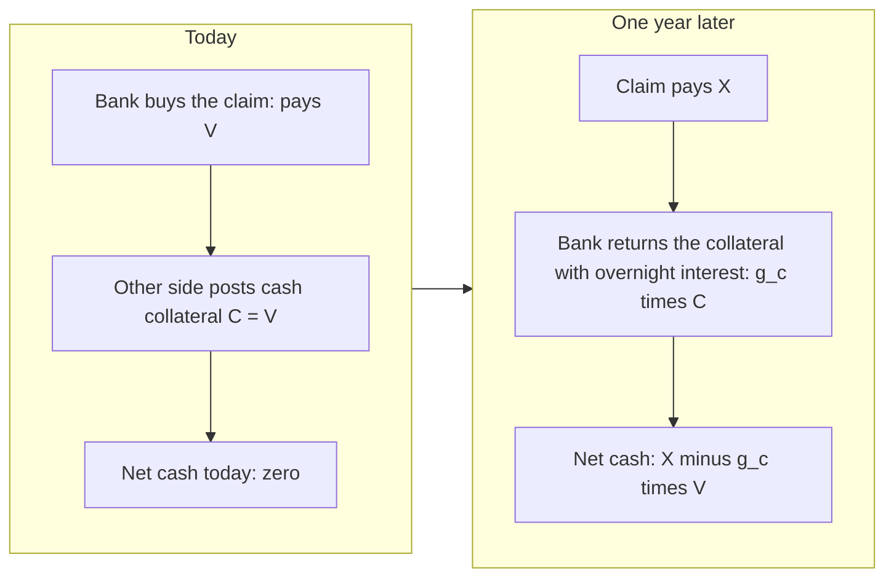
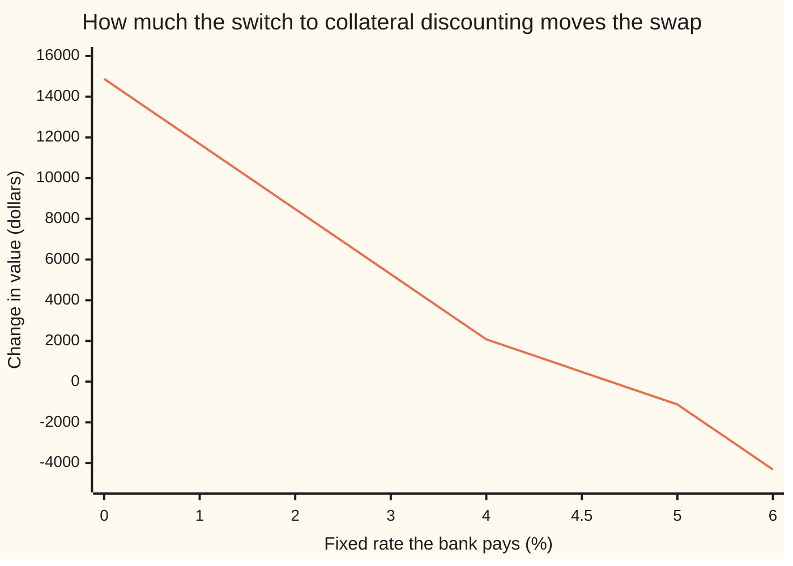

# Collateral discounting: why a collateralised swap discounts at the overnight rate

[Syllabus](../../../SYLLABUS.md) → [Financial mathematics](../../../SYLLABUS.md#w12) → [Swaps](../../../SYLLABUS.md#w12-s28) → Collateral discounting

---

## General Overview

In 2021 a bank agreed a five-year interest rate swap on 10,000,000 dollars. It pays a fixed 1.00 percent a year. In return it receives a floating rate, reset each year to the one-year lending rate. Rates have since climbed: this morning the one-year rate is 4.20 percent and the five-year par swap rate (the fixed rate that makes a new swap worth zero) is 4.65 percent. Five annual coupons are left, and every one of them now runs in the bank's favour. Priced the old way, the swap is worth 1,599,584.77 dollars to the bank.

That value is a debt owed by the other side. The two banks have signed a collateral agreement: whoever is behind posts cash equal to the swap's value, and the receiver pays interest on that cash at the **overnight rate** (the rate for lending cash for one day against good security, rolled every day). So the other bank has handed over about 1.6 million dollars in cash, and it earns the overnight rate on it.

That one contract term moves the price. Discount the same five coupons with the overnight curve instead of the term lending curve, and the swap is worth 1,611,259.86 dollars. The value moves by 11,675.09 dollars, about 12,000, with no change in any forecast rate or any quote on the screen. Vladimir Piterbarg set out the reason in 2010: collateral is a loan, and the loan's interest rate becomes the discount rate.

**When a trade is fully covered by cash collateral that earns the overnight rate, the funding rate cancels out of the price, and the trade's cash flows are discounted at the overnight rate.**

**What kind of fact this is:** a theorem inside a model. Given a market where money can be borrowed and lent at one rate and collateral is returned with interest at another, the result is proved on this card in Why it works. Whether a real contract meets those conditions is a matter of its terms.

### The picture: two cash movements, one year apart



Nothing is borrowed from the bank's own funding desk at any point. That is why the funding rate drops out.

---

## The formula

Notation first, in words. A **growth factor** is what one dollar grows to over one period: at 4.2 percent simple interest for a year it is 1.042. The pricing average $E_Q[X]$ is the average payoff under the market's **pricing probabilities** $Q$ (the weights that price every traded payoff, set out on [State prices](../03-Contracts%20and%20No-Arbitrage/07-state-prices-and-risk-neutral-pricing-in-one-period.md)). The summation sign in the formulas below, a capital sigma, means "add up over the listed years".

One period, any collateral amount $C$:

$$g_f\,(V - C) \;=\; E_Q[X] \;-\; g_c\,C$$

Full collateral, $C = V$:

$$\boxed{\;V \;=\; \frac{E_Q[X]}{g_c}\;}$$

**Read it aloud:** the money tied up after collateral, grown at the funding rate, must equal the average payoff less the collateral handed back with interest; when the collateral is the whole value, nothing is tied up and the payoff is discounted at the collateral rate.

Over five annual periods the collateral growth factors multiply into the collateral account's growth $B_j$; its reciprocal is the overnight discount factor $D_j = 1/B_j$, and the swap that receives floating and pays fixed is worth

$$V \;=\; N\sum_{j=1}^{5} D_j\,(F_j - K) \;=\; N\,(S_5 - K)\,A, \qquad A = \sum_{j=1}^{5} D_j .$$

| Symbol | Plain meaning | In our example | Push it up and the answer… |
| --- | --- | --- | --- |
| $X$, $Y$ | the payment the claim makes (Y: any year-end payoff) at the end of the period | 320,000 dollars, the first coupon | rises one for one, after discounting |
| $V$, $V_i$ | the claim's value today; $V_i$ is the swap's value just after year $i$'s coupon | 307,870.44 (one period); 1,611,259.86 (swap) | — |
| $C$, $\theta$ | cash collateral held against the claim; $\theta$ is the fraction of the value covered | $C = V$, $\theta = 1$ | rises when $g_c$ is below $g_f$ |
| $g_f$, $r_F$ | funding growth factor for one period: what a borrowed dollar costs to repay; $r_F$ is the rate inside it | 1.042 | falls, but only for the part not covered by collateral |
| $g_c$, $r_C$ | collateral growth factor: what a dollar of collateral must be repaid with; $r_C$ is the overnight rate inside it | 1.03939825 | falls |
| $Q$, $E_Q$ | the pricing probabilities, and the average taken with them | — | — |
| $N$ | the swap's notional: the amount the rates are paid on | 10,000,000 dollars | scales everything |
| $K$ | the swap's fixed rate | 1.00 percent | falls: more fixed to pay |
| $L_j$, $L_5$, $j$, $i$ | the term-curve discount factor for year $j$ (years are counted by $j$ or $i$, 1 to 5): the old single curve that forecast and discounted | 0.79621728 at $j = 5$ | — |
| $D_j$, $D_5$, $B_j$, $s$ | the overnight-curve discount factor for year $j$ ($B_j$ is its reciprocal, the collateral account's growth to year $j$); $s$ is the gap between the two curves' zero rates | 0.80623246 at $j = 5$; $s$ = 0.25 percent | rises with $s$, and so does the move |
| $F_j$ | the forecast of the floating rate for year $j$ | 4.2000 percent in year 1 | rises |
| $S_5$, $A$ | the five-year par swap rate; the annuity, the sum of the five discount factors | 4.65 percent; 4.41441058 | rises / rises |

In this card the overnight curve is built from the term curve: $D_j = L_j\,e^{s j}$, the overnight zero rate sitting 0.25 percent below the term zero rate at every date. The shortcut $N(S_5 - K)A$ holds because a new five-year swap at the par rate $S_5$ is worth zero; Step 5 shows why.

**Conventions verified 28 Sep 2026.** Every accrual is set to exactly one year and the floating rate is a stylised one-year term rate, known at the start of its year and paid at the end, so the arithmetic stays visible. In the dollar market the overnight rate is now SOFR, new swaps reference it compounded, and collateral agreements and clearing houses pay interest on dollar cash at a rate tied to it ([Money markets](../02-Curves/03-money-market-instruments-and-sofr.md)).

### When it holds

- **Cash collateral, reusable, returned with interest at a known rate each period.** If the collateral is a bond, or sits segregated with a custodian, the holder cannot spend it and the ledger in Why it works gains entries the formula does not have.
- **Full collateral, reset on every date the value is measured.** A threshold (a first slice of exposure left uncovered) or a margin lag leaves part of the value funded at $g_f$; the partial formula $V = E_Q[X]/((1-\theta)g_f + \theta g_c)$ then applies, and the uncovered part belongs to [FVA](../47-Collateral%2C%20Funding%20and%20the%20Rest%20of%20the%20XVAs/02-fva.md).
- **One funding rate for borrowing and lending.** If a desk borrows dearer than it lends, the funding rate stops cancelling on the uncollateralised side.
- **No default.** The loss if the other side fails is a separate adjustment.
- **Each collateral factor known at the start of its period.** The tree proof needs this; the continuous limit covers a rate that moves daily. With random rates each $F_j$ is an average weighted by the overnight curve, and the rebuild in Step 5 finds exactly that average.

---

## Why it works

### Step 0: collateral is a loan with its own interest rate

A bank that holds a claim worth $V$ and receives cash collateral $V$ has, in effect, borrowed $V$ from its counterparty. It must repay that loan, with interest at the collateral rate, when the claim settles. Buying the claim costs $V$; the loan brings in $V$. Nothing is left to fund. The bank's own borrowing rate never touches the trade. The only rate that does is the rate on the collateral loan, so that is the rate the payoff is discounted at.

### Step 1: in the funded market, every payoff has a price

Take one period, a year here. The bank can borrow or lend at growth factor $g_f$. The market prices every year-end payoff $Y$ at $E_Q[Y]/g_f$: its pricing average, discounted at the funding rate. This is the one-period pricing rule of the state-prices card, with $g_f$ as the bank account.

### Step 2: write the collateralised position as one payoff

Buy the claim and receive collateral $C$. The net cost today is $V - C$. At year-end the claim pays $X$ and the bank hands back $g_c C$. So the position is a payoff $X - g_c C$ bought for $V - C$. By Step 1 its price must be $(E_Q[X] - g_c C)/g_f$:

$$V - C = \frac{E_Q[X] - g_c\,C}{g_f} \quad\Longleftrightarrow\quad g_f V = E_Q[X] + (g_f - g_c)\,C .$$

The collateral enters twice: once as cash in today, once as principal plus interest out later. Counting only one of the two is the usual error.

### Step 3: full collateral makes the funding rate cancel

Set $C = V$. The left side of Step 2's first equation is zero, so $E_Q[X] = g_c V$, and $V = E_Q[X]/g_c$. The funding factor $g_f$ has gone. With a fraction $\theta$ covered, $C = \theta V$ and the same algebra gives $V = E_Q[X]/((1-\theta)g_f + \theta g_c)$: a blend of the two growth factors, weighted by how much is covered.

On the first coupon: $X$ = 320,000 dollars, $g_f$ = 1.042, $g_c$ = 1.03939825. Uncovered, the coupon is worth 307,101.73. Fully covered, 307,870.44. Half covered, 307,485.60.

### Step 4: many periods multiply the collateral factors

Let $V_i$ be the swap's value just after year $i$'s coupon. Across year $i+1$ the bank receives the coupon, returns last year's collateral with interest, and receives new collateral equal to the new value. Step 3 applied to that one year gives

$$V_i = \frac{E_Q[X_{i+1}] + V_{i+1}}{g_{c,i+1}} .$$

Start from $V_5 = 0$ and roll back. Each coupon ends up divided by the product of the collateral factors up to its date. That product's reciprocal is the discount factor of the overnight curve, $D_j$. So each coupon is discounted on the overnight curve. This is where the name comes from: an **overnight index swap** (OIS) is a swap whose floating side pays the overnight rate compounded, and its quotes give the curve $D_j$ ([Money markets](../02-Curves/03-money-market-instruments-and-sofr.md)).

### Step 5: rebuild the forecasts, then the annuity does the rest

The quotes on the screen are for collateralised swaps, and each is worth zero on the day it is struck. Once discounting moves to $D_j$, the forecasts $F_j$ must be solved again, shortest quote first, so that every quote still prices at zero. This is the same climb as [Bootstrapping](../02-Curves/04-bootstrapping-the-discount-curve.md), with the unknown now the forecast instead of the discount factor. Here the forecasts move by about a tenth of a basis point at most (a basis point is 0.01 percent): 4.8719 percent becomes 4.8707 percent in year 3.

A shortcut then gives the value without the forecasts at all. The new five-year par swap receives the same floating coupons and pays $S_5$; it is worth zero. Subtract it from the old swap. The floating sides cancel coupon by coupon, and what is left is $N(S_5 - K)$ each year, discounted: $N(S_5 - K)A$. Switching curves changes one thing, the annuity, from 4.38242404 to 4.41441058.

<details>
<summary>Detailed proof</summary>

**Step 1, the price rule.** Take finitely many year-end states, each with a positive price for a claim paying one dollar there, and suppose every such claim can be bought or sold. Then any payoff $Y$ is a bundle of them, and its cost is the sum of state price times payoff. Writing the state prices as $Q(\omega)/g_f$, with $Q$ adding to one because a sure dollar costs $1/g_f$, gives cost $E_Q[Y]/g_f$.

**Step 2, no arbitrage.** The collateralised claim with its collateral is a position costing $V - C$ that pays $X - g_c C$. The bundle of state claims paying $X - g_c C$ costs $(E_Q[X] - g_c C)/g_f$. If the position cost less, buy it and sell the bundle: cash today, nothing owed at year-end in any state. If it cost more, do the reverse. Either way a riskless profit, so the two costs agree. This needs the collateral terms to be the same whichever side of the trade the bank takes.

**Step 3, uniqueness.** With $C = \theta V$ and $0 \le \theta \le 1$, the coefficient of $V$ is $(1-\theta)g_f + \theta g_c$, positive because both factors are positive. One linear equation with a non-zero coefficient has exactly one root. At $\theta = 1$ it is $E_Q[X]/g_c$.

**Step 4, backward induction.** On a tree of years with known next-year factors at every node, Step 3 applies at each node with the payoff $X_{i+1} + V_{i+1}$. Starting from $V_5 = 0$, induction gives a value and a hedge at every node. Writing $B_j$ for the product of the first $j$ collateral factors, the tower rule of averages turns the recursion into $V_0 = E_Q[\sum_j X_j / B_j]$; with factors known today, $1/B_j = D_j$.

**The continuous limit.** Let a period last $\Delta t$ years, with $g_f = 1 + r_F\,\Delta t$ and $g_c = 1 + r_C\,\Delta t$. Step 2 then says the value's expected growth over the period is $r_F V - (r_F - r_C)\,C$ per unit of time. With $C = V$ that is $r_C V$: the value grows, on average under $Q$, at the overnight rate, so $V_0 = E_Q[e^{-\int_0^T r_C(u)\,du}\,V_T]$. This is Piterbarg's formula in its fully collateralised case.

**Step 5, the annuity.** Old swap minus new par swap: floating coupons identical, fixed coupons $K$ against $S_5$, so the difference pays $N(S_5 - K)$ on each of the five dates. The par swap is worth zero by the definition of $S_5$. Discount the difference on $D_j$ and sum.

</details>

### The other door

Piterbarg worked in continuous time: the value is a stochastic process, collateral enters as a cash account that drifts at the collateral rate, and Itô's lemma turns the hedge into a pricing equation whose discount rate is the collateral rate. The finite ledger above reaches the same place with growth factors and one line of algebra per year. The case where collateral is missing or partial, and the funding rate stays in, is taken up properly on [FVA](../47-Collateral%2C%20Funding%20and%20the%20Rest%20of%20the%20XVAs/02-fva.md).

---

## Worked numbers, by hand

The swap: 10,000,000 dollars notional, pay 1.00 percent fixed, receive the one-year rate, five annual coupons left. Quotes: one-year deposit 4.20 percent; par swaps 4.40, 4.55, 4.62 and 4.65 percent at two to five years. The overnight curve sits 0.25 percent below the term curve.

| Step | Arithmetic | Value |
| --- | --- | --- |
| term discount factor, five years, $L_5$ | bootstrapped from the quotes | 0.79621728 |
| overnight discount factor, five years, $D_5$ | $0.79621728 \times e^{0.0025 \times 5}$ | 0.80623246 |
| annuity on the term curve | $L_1 + L_2 + L_3 + L_4 + L_5$ | 4.38242404 |
| annuity on the overnight curve | $D_1 + D_2 + D_3 + D_4 + D_5$ | 4.41441058 |
| par minus fixed, $S_5 - K$ | $0.0465 - 0.01$ | 0.0365 |
| value, old single curve | $10{,}000{,}000 \times 0.0365 \times 4.38242404$ | 1,599,584.77 |
| value, collateral discounting | $10{,}000{,}000 \times 0.0365 \times 4.41441058$ | 1,611,259.86 |
| **the move** | $1{,}611{,}259.86 - 1{,}599{,}584.77$ | **11,675.09** |

The bank's swap is worth 11,675.09 dollars more than its old books said, 12,000.00 to the nearest thousand. The other bank's side is worth the same amount less. Nothing about future rates changed; only the rate the bank pays on the cash it holds.

The move builds up year by year. Each bar is that year's coupon, valued the new way minus the old way:

```
the move, by coupon year (dollars)
  year 1   ██████                                $768.71
  year 2   ██████████████                        $1,611.54
  year 3   █████████████████████                 $2,442.89
  year 4   ███████████████████████████           $3,130.48
  year 5   ████████████████████████████████      $3,721.45
```

Later coupons move more, because the 0.25 percent gap compounds for more years. The year 1 bar is the one-period example exactly: 307,870.44 against 307,101.73.

### What breaks if you drop a piece

Correct value: 1,611,259.86.

| Mistake | Comes out at | What went wrong |
| --- | --- | --- |
| Discount at the term curve, as before collateral | 1,599,584.77 | Treats the collateral as if the bank had to borrow at its own term rate |
| New discount curve, old forecasts kept | 1,611,582.89 | The quotes no longer price at zero; small here, but a real inconsistency |
| Forecast the floating rate off the overnight curve too | 1,496,234.31 | The overnight curve discounts; it does not forecast a one-year lending rate |
| Forget the interest on the collateral | 1,831,332.68 | Collateral returned without interest: coupons not discounted at all |
| One period, buy at $X/g_f$ with full collateral | surplus of 799.00 in a year | The price is too low: a riskless profit, so it cannot be the price |

---

## Code, from first principles, and it actually runs

The code rebuilds the term curve from the six quotes, builds the overnight curve 0.25 percent below it, and values the swap three independent ways: rebuilt forecasts discounted on the overnight curve; par minus fixed times the annuity, which uses no forecasts at all; and the collateral account rolled back one year at a time. It solves the half-collateral case with its own bisection root finder, prints the year-by-year collateral ledger from directly summed values, and reproduces every wrong number above. Mutation tests were run: shortening the annuity in the forecast rebuild, rolling back with the funding factor, and bisecting with the wrong collateral factor each make an assert fail.

### Python

```python
# OIS discounting and collateral -- the check behind the card.  Standard library only.
# Every number quoted on the card is printed here.  Three roads to the swap's value once
# discounting moves to the overnight curve: (1) rebuild the forecasts so every quote is
# still worth zero and add up the discounted coupons, (2) par rate minus fixed rate, times
# the annuity, (3) roll the collateral account back one year at a time.
from math import exp

N, K, S = 10_000_000.0, 0.01, 0.0025                 # notional, the old swap's fixed rate, term-minus-overnight gap
DEP1 = 0.042                                          # one-year deposit, simple rate
PAR = {2: 0.044, 3: 0.0455, 4: 0.0462, 5: 0.0465}     # par swap quotes, annual coupons

L = [1.0, 1.0 / (1.0 + DEP1)]                         # term curve: the old way, one curve does everything
for n in range(2, 6):
    L.append((1.0 - PAR[n] * sum(L[1:n])) / (1.0 + PAR[n]))
D = [L[j] * exp(S * j) for j in range(6)]             # overnight (collateral) curve, 0.25% lower at every date

def forecasts(disc):                                  # index rates that keep every quote at zero on `disc`
    F = [0.0, DEP1]
    for n in range(2, 6):
        F.append((PAR[n] * sum(disc[1:n + 1]) - sum(disc[j] * F[j] for j in range(1, n))) / disc[n])
    return F

def value(disc, F, k):                                # receive floating, pay fixed k, from today
    return N * sum(disc[j] * (F[j] - k) for j in range(1, 6))

F_old, F_new = forecasts(L), forecasts(D)
F_ois = [0.0] + [D[j - 1] / D[j] - 1.0 for j in range(1, 6)]
A_L, A_D = sum(L[1:]), sum(D[1:])
print("year   term L_j   overnight D_j   g_f      g_c      F old %   F new %")
for j in range(1, 6):
    print(f"{j:>4}   {L[j]:.8f}   {D[j]:.8f}   {L[j-1]/L[j]:.6f} {D[j-1]/D[j]:.6f} "
          f"{100*F_old[j]:8.4f}  {100*F_new[j]:8.4f}")
print(f"annuity on the term curve       {A_L:.8f}")
print(f"annuity on the overnight curve  {A_D:.8f}")

# ---- the one-period model: the first coupon alone, paid in one year ----
X = N * (DEP1 - K)
gf, gc = 1.0 + DEP1, D[0] / D[1]
V_none, V_full = X / gf, X / gc
V_half_formula = X / (0.5 * gf + 0.5 * gc)
lo, hi = 0.0, X                                       # bisection on g_f (V - C) = X - g_c C with C = V / 2
for _ in range(200):
    mid = 0.5 * (lo + hi)
    if gf * (mid - 0.5 * mid) - (X - gc * 0.5 * mid) < 0: lo = mid
    else: hi = mid
print()
print(f"one period: coupon X                   {X:14.2f}")
print(f"one period: g_f, g_c                   {gf:.8f}  {gc:.8f}")
print(f"one period: no collateral   X / g_f    {V_none:14.2f}")
print(f"one period: half collateral            {V_half_formula:14.2f}  bisection {0.5*(lo+hi):.2f}")
print(f"one period: full collateral X / g_c    {V_full:14.2f}")
print(f"one period: bought at X / g_f, surplus in a year {X - gc * V_none:10.2f}")

# ---- the seasoned swap: three roads to the new value ----
V_old = value(L, F_old, K)
V1 = value(D, F_new, K)
V2 = N * (PAR[5] - K) * A_D
V3 = 0.0
for j in range(5, 0, -1):                             # road 3: collateral account, rolled back a year at a time
    V3 = (N * (F_new[j] - K) + V3) / (D[j - 1] / D[j])
print()
print(f"swap, old single curve                 {V_old:14.2f}")
print(f"swap, old way by par-minus-fixed       {N * (PAR[5] - K) * A_L:14.2f}")
print(f"road 1: new forecasts, overnight disc  {V1:14.2f}")
print(f"road 2: (par - fixed) x N x annuity    {V2:14.2f}")
print(f"road 3: collateral rolled back         {V3:14.2f}")
print(f"the move when discounting switches     {V1 - V_old:14.2f}")
print(f"the move, to the nearest thousand      {1000.0 * round((V1 - V_old) / 1000.0):14.2f}")
print(f"par minus fixed, S_5 - K               {PAR[5] - K:14.4f}")

# ---- the collateral ledger, year by year, with values from direct sums ----
def value_at(i):                                      # value just after year i's coupon, summed directly
    return N * sum(D[j] / D[i] * (F_new[j] - K) for j in range(i + 1, 6))
print("year   coupon in      collateral+interest out   new collateral in   |net|")
worst = 0.0
for i in range(1, 6):
    cpn, back, new = N * (F_new[i] - K), D[i - 1] / D[i] * value_at(i - 1), value_at(i)
    worst = max(worst, abs(cpn - back + new))
    print(f"{i:>4}   {cpn:12.2f}   {back:24.2f}   {new:17.2f}   {abs(cpn - back + new):6.2f}")
bars = [N * (D[j] * (F_new[j] - K) - L[j] * (F_old[j] - K)) for j in range(1, 6)]
print("the move, year by year: " + "  ".join(f"{b:.2f}" for b in bars))

# ---- what breaks ----
print()
print(f"wrong: new discount, old forecasts     {value(D, F_old, K):14.2f}")
print(f"wrong: forecast off overnight curve    {value(D, F_ois, K):14.2f}")
print(f"wrong: collateral earns no interest    {N * sum(F_new[j] - K for j in range(1, 6)):14.2f}")
print(f"house swap at 4.50%: old {value(L, F_old, 0.045):.2f}  new {value(D, F_new, 0.045):.2f}"
      f"  move {value(D, F_new, 0.045) - value(L, F_old, 0.045):.2f}")
print(f"try: gap 0.50%, fixed 1.00%: move {N * (PAR[5] - K) * (sum(L[j] * exp(0.005 * j) for j in range(1, 6)) - A_L):.2f}")
print(f"try: fixed 8.00%: move {value(D, F_new, 0.08) - value(L, F_old, 0.08):.2f}")
ks = [0.0, 0.01, 0.02, 0.03, 0.04, 0.045, 0.05, 0.06]
print("chart, fixed rate %   " + " ".join(f"{100*k:8.2f}" for k in ks))
print("chart, move           " + " ".join(f"{value(D, F_new, k) - value(L, F_old, k):8.2f}" for k in ks))

assert abs(V1 - V2) < 1e-6,                           "rebuilt forecasts vs par-minus-fixed times annuity"
assert abs(V3 - V1) < 1e-6,                           "collateral roll-back vs discounted sum"
assert max(abs(F_old[j] - (L[j - 1] / L[j] - 1.0)) for j in range(1, 6)) < 1e-12, "single curve: forecasts are its own forwards"
assert abs(0.5 * (lo + hi) - V_half_formula) < 1e-6,  "bisection vs the partial-collateral formula"
assert worst < 1e-6,                                  "collateral ledger nets to zero every year"
assert abs((V1 - V_old) - 12000.0) < 500.0,           "the move is about 12,000"
print("ALL CHECKS PASS")
```

**Ran 2026-09-27 on macOS, Python 3.14.6, standard library only. All checks passed. Output, pasted from the run:**

```
year   term L_j   overnight D_j   g_f      g_c      F old %   F new %
   1   0.95969290   0.96209513   1.042000 1.039398   4.2000    4.2000
   2   0.91740758   0.92200610   1.046092 1.043480   4.6092    4.6087
   3   0.87478903   0.88137461   1.048719 1.046100   4.8719    4.8707
   4   0.83431725   0.84270228   1.048509 1.045891   4.8509    4.8497
   5   0.79621728   0.80623246   1.047851 1.045235   4.7851    4.7843
annuity on the term curve       4.38242404
annuity on the overnight curve  4.41441058

one period: coupon X                        320000.00
one period: g_f, g_c                   1.04200000  1.03939825
one period: no collateral   X / g_f         307101.73
one period: half collateral                 307485.60  bisection 307485.60
one period: full collateral X / g_c         307870.44
one period: bought at X / g_f, surplus in a year     799.00

swap, old single curve                     1599584.77
swap, old way by par-minus-fixed           1599584.77
road 1: new forecasts, overnight disc      1611259.86
road 2: (par - fixed) x N x annuity        1611259.86
road 3: collateral rolled back             1611259.86
the move when discounting switches           11675.09
the move, to the nearest thousand            12000.00
par minus fixed, S_5 - K                       0.0365
year   coupon in      collateral+interest out   new collateral in   |net|
   1      320000.00                 1674740.69          1354740.69     0.00
   2      360869.60                 1413645.11          1052775.51     0.00
   3      387065.27                 1101308.61           714243.33     0.00
   4      384971.73                  747020.57           362048.84     0.00
   5      378426.07                  378426.07                0.00     0.00
the move, year by year: 768.71  1611.54  2442.89  3130.48  3721.45

wrong: new discount, old forecasts         1611582.89
wrong: forecast off overnight curve        1496234.31
wrong: collateral earns no interest        1831332.68
house swap at 4.50%: old 65736.36  new 66216.16  move 479.80
try: gap 0.50%, fixed 1.00%: move 23455.62
try: fixed 8.00%: move -10715.49
chart, fixed rate %       0.00     1.00     2.00     3.00     4.00     4.50     5.00     6.00
chart, move           14873.75 11675.09  8476.44  5277.78  2079.13   479.80 -1119.53 -4318.18
ALL CHECKS PASS
```

The ledger rows show the mechanism: each year the coupon in, plus the new collateral in, exactly pays back last year's collateral with overnight interest. The bank never borrows a dollar.

### Rust

Same inputs, same rows. The annuity sums and the recursion are written out again; no crates.

```rust
// OIS discounting and collateral -- the same check as ois_discounting_and_collateral_check.py, in Rust.
// Standard library only, no crates.  Three roads to the swap's value once discounting moves
// to the overnight curve: rebuilt forecasts, par-minus-fixed times the annuity, and the
// collateral account rolled back one year at a time.
const N: f64 = 10_000_000.0;
const DEP1: f64 = 0.042;
const PAR: [f64; 6] = [0.0, 0.0, 0.044, 0.0455, 0.0462, 0.0465];   // par quotes by maturity in years

fn forecasts(disc: &[f64]) -> Vec<f64> {                           // index rates that keep every quote at zero
    let mut f = vec![0.0, DEP1];
    for n in 2..6 {
        let annuity: f64 = disc[1..=n].iter().sum();
        let known: f64 = (1..n).map(|j| disc[j] * f[j]).sum();
        f.push((PAR[n] * annuity - known) / disc[n]);
    }
    f
}

fn value(disc: &[f64], f: &[f64], k: f64) -> f64 {                // receive floating, pay fixed k
    N * (1..6).map(|j| disc[j] * (f[j] - k)).sum::<f64>()
}

fn main() {
    let (k, s) = (0.01_f64, 0.0025_f64);
    let mut l = vec![1.0, 1.0 / (1.0 + DEP1)];                      // term curve: one curve does everything
    for n in 2..6 {
        let b: f64 = l[1..n].iter().sum();
        l.push((1.0 - PAR[n] * b) / (1.0 + PAR[n]));
    }
    let d: Vec<f64> = (0..6).map(|j| l[j] * (s * j as f64).exp()).collect();   // overnight curve
    let (f_old, f_new) = (forecasts(&l), forecasts(&d));
    let mut f_ois = vec![0.0];
    for j in 1..6 { f_ois.push(d[j - 1] / d[j] - 1.0); }
    let (a_l, a_d): (f64, f64) = (l[1..].iter().sum(), d[1..].iter().sum());
    println!("year   term L_j   overnight D_j   g_f      g_c      F old %   F new %");
    for j in 1..6 {
        println!("{:>4}   {:.8}   {:.8}   {:.6} {:.6} {:8.4}  {:8.4}", j, l[j], d[j],
                 l[j - 1] / l[j], d[j - 1] / d[j], 100.0 * f_old[j], 100.0 * f_new[j]);
    }
    println!("annuity on the term curve       {:.8}", a_l);
    println!("annuity on the overnight curve  {:.8}", a_d);

    // ---- the one-period model: the first coupon alone, paid in one year ----
    let x = N * (DEP1 - k);
    let (gf, gc) = (1.0 + DEP1, d[0] / d[1]);
    let (v_none, v_full) = (x / gf, x / gc);
    let v_half = x / (0.5 * gf + 0.5 * gc);
    let (mut lo, mut hi) = (0.0_f64, x);                            // bisection with C = V / 2
    for _ in 0..200 {
        let mid = 0.5 * (lo + hi);
        if gf * (mid - 0.5 * mid) - (x - gc * 0.5 * mid) < 0.0 { lo = mid; } else { hi = mid; }
    }
    println!();
    println!("one period: coupon X                   {:14.2}", x);
    println!("one period: g_f, g_c                   {:.8}  {:.8}", gf, gc);
    println!("one period: no collateral   X / g_f    {:14.2}", v_none);
    println!("one period: half collateral            {:14.2}  bisection {:.2}", v_half, 0.5 * (lo + hi));
    println!("one period: full collateral X / g_c    {:14.2}", v_full);
    println!("one period: bought at X / g_f, surplus in a year {:10.2}", x - gc * v_none);

    // ---- the seasoned swap: three roads ----
    let v_old = value(&l, &f_old, k);
    let v1 = value(&d, &f_new, k);
    let v2 = N * (PAR[5] - k) * a_d;
    let mut v3 = 0.0_f64;
    for j in (1..6).rev() { v3 = (N * (f_new[j] - k) + v3) / (d[j - 1] / d[j]); }
    println!();
    println!("swap, old single curve                 {:14.2}", v_old);
    println!("swap, old way by par-minus-fixed       {:14.2}", N * (PAR[5] - k) * a_l);
    println!("road 1: new forecasts, overnight disc  {:14.2}", v1);
    println!("road 2: (par - fixed) x N x annuity    {:14.2}", v2);
    println!("road 3: collateral rolled back         {:14.2}", v3);
    println!("the move when discounting switches     {:14.2}", v1 - v_old);
    println!("the move, to the nearest thousand      {:14.2}", 1000.0 * ((v1 - v_old) / 1000.0).round());
    println!("par minus fixed, S_5 - K               {:14.4}", PAR[5] - k);

    // ---- the collateral ledger, with values from direct sums ----
    let value_at = |i: usize| N * ((i + 1)..6).map(|j| d[j] / d[i] * (f_new[j] - k)).sum::<f64>() + 0.0;
    println!("year   coupon in      collateral+interest out   new collateral in   |net|");
    let mut worst = 0.0_f64;
    for i in 1..6 {
        let (cpn, back, new) = (N * (f_new[i] - k), d[i - 1] / d[i] * value_at(i - 1), value_at(i));
        worst = worst.max((cpn - back + new).abs());
        println!("{:>4}   {:12.2}   {:24.2}   {:17.2}   {:6.2}", i, cpn, back, new, (cpn - back + new).abs());
    }
    let bars: Vec<String> = (1..6)
        .map(|j| format!("{:.2}", N * (d[j] * (f_new[j] - k) - l[j] * (f_old[j] - k)))).collect();
    println!("the move, year by year: {}", bars.join("  "));

    // ---- what breaks ----
    println!();
    println!("wrong: new discount, old forecasts     {:14.2}", value(&d, &f_old, k));
    println!("wrong: forecast off overnight curve    {:14.2}", value(&d, &f_ois, k));
    println!("wrong: collateral earns no interest    {:14.2}", N * (1..6).map(|j| f_new[j] - k).sum::<f64>());
    let (h_old, h_new) = (value(&l, &f_old, 0.045), value(&d, &f_new, 0.045));
    println!("house swap at 4.50%: old {:.2}  new {:.2}  move {:.2}", h_old, h_new, h_new - h_old);
    let a_wide: f64 = (1..6).map(|j| l[j] * (0.005 * j as f64).exp()).sum();
    println!("try: gap 0.50%, fixed 1.00%: move {:.2}", N * (PAR[5] - k) * (a_wide - a_l));
    println!("try: fixed 8.00%: move {:.2}", value(&d, &f_new, 0.08) - value(&l, &f_old, 0.08));
    let ks = [0.0, 0.01, 0.02, 0.03, 0.04, 0.045, 0.05, 0.06];
    let head: Vec<String> = ks.iter().map(|kk| format!("{:8.2}", 100.0 * kk)).collect();
    let moves: Vec<String> = ks.iter().map(|&kk| format!("{:8.2}", value(&d, &f_new, kk) - value(&l, &f_old, kk))).collect();
    println!("chart, fixed rate %   {}", head.join(" "));
    println!("chart, move           {}", moves.join(" "));

    assert!((v1 - v2).abs() < 1e-6, "rebuilt forecasts vs par-minus-fixed times annuity");
    assert!((v3 - v1).abs() < 1e-6, "collateral roll-back vs discounted sum");
    let gap = (1..6).map(|j| (f_old[j] - (l[j - 1] / l[j] - 1.0)).abs()).fold(0.0_f64, f64::max);
    assert!(gap < 1e-12, "single curve: forecasts are its own forwards");
    assert!((0.5 * (lo + hi) - v_half).abs() < 1e-6, "bisection vs the partial-collateral formula");
    assert!(worst < 1e-6, "collateral ledger nets to zero every year");
    assert!(((v1 - v_old) - 12000.0).abs() < 500.0, "the move is about 12,000");
    println!("ALL CHECKS PASS");
}
```

**Ran 2026-09-27 on macOS, rustc 1.98.1, no crates. All checks passed. Output, pasted from the run:**

```
year   term L_j   overnight D_j   g_f      g_c      F old %   F new %
   1   0.95969290   0.96209513   1.042000 1.039398   4.2000    4.2000
   2   0.91740758   0.92200610   1.046092 1.043480   4.6092    4.6087
   3   0.87478903   0.88137461   1.048719 1.046100   4.8719    4.8707
   4   0.83431725   0.84270228   1.048509 1.045891   4.8509    4.8497
   5   0.79621728   0.80623246   1.047851 1.045235   4.7851    4.7843
annuity on the term curve       4.38242404
annuity on the overnight curve  4.41441058

one period: coupon X                        320000.00
one period: g_f, g_c                   1.04200000  1.03939825
one period: no collateral   X / g_f         307101.73
one period: half collateral                 307485.60  bisection 307485.60
one period: full collateral X / g_c         307870.44
one period: bought at X / g_f, surplus in a year     799.00

swap, old single curve                     1599584.77
swap, old way by par-minus-fixed           1599584.77
road 1: new forecasts, overnight disc      1611259.86
road 2: (par - fixed) x N x annuity        1611259.86
road 3: collateral rolled back             1611259.86
the move when discounting switches           11675.09
the move, to the nearest thousand            12000.00
par minus fixed, S_5 - K                       0.0365
year   coupon in      collateral+interest out   new collateral in   |net|
   1      320000.00                 1674740.69          1354740.69     0.00
   2      360869.60                 1413645.11          1052775.51     0.00
   3      387065.27                 1101308.61           714243.33     0.00
   4      384971.73                  747020.57           362048.84     0.00
   5      378426.07                  378426.07                0.00     0.00
the move, year by year: 768.71  1611.54  2442.89  3130.48  3721.45

wrong: new discount, old forecasts         1611582.89
wrong: forecast off overnight curve        1496234.31
wrong: collateral earns no interest        1831332.68
house swap at 4.50%: old 65736.36  new 66216.16  move 479.80
try: gap 0.50%, fixed 1.00%: move 23455.62
try: fixed 8.00%: move -10715.49
chart, fixed rate %       0.00     1.00     2.00     3.00     4.00     4.50     5.00     6.00
chart, move           14873.75 11675.09  8476.44  5277.78  2079.13   479.80 -1119.53 -4318.18
ALL CHECKS PASS
```

The two outputs agree line for line. One detail: Rust's empty sum is minus zero, so the last ledger value adds 0.0 to print as 0.00, as Python does.



The one line is the move, new value minus old, for the same five-year swap at different fixed rates. It is straight, because the move is $N(S_5 - K)$ times the change in annuity, and it crosses zero at the par rate, 4.65 percent. A swap struck near today's rates barely moves: at 4.50 percent, the shelf's house swap, the move is 479.80. Old swaps far from par move the most.

> [!TIP]
> **Try changing**
> Guess the direction first. Then run it.
> - **Widen the gap between the curves.** Set the gap to 0.50 percent. The move roughly doubles, to **23,455.62**: it is close to proportional to the gap.
> - **Pay 8.00 percent fixed instead of 1.00.** Now the swap is worth less than nothing to the bank, and the bank posts the collateral. The move is **−10,715.49**: collateral discounting makes a liability larger too.
> - **Cover only half the first coupon.** The one-period value lands halfway, at **307,485.60**, between 307,101.73 uncovered and 307,870.44 covered.
> - **Price the house swap.** Set the fixed rate to 4.50 percent. The value goes from 65,736.36 to 66,216.16, a move of **479.80**.

---

## The usual mistake

> [!warning]
> **Believing the overnight rate is used because it is "the risk-free rate".** The reason is the contract. The collateral agreement says cash collateral earns the overnight rate, so the collateral is a loan at that rate, and that loan finances the trade. Change the agreement and the discount rate changes: collateral in another currency earns that currency's overnight rate, and an uncollateralised trade is financed at the bank's own funding rate.
>
> Four smaller traps:
> - **Switching the discount curve without rebuilding the forecasts.** The quotes then fail to price at zero. Here it gives 1,611,582.89 instead of 1,611,259.86: small on this swap, larger on long or steep curves.
> - **Forecasting the floating rate off the overnight curve.** The overnight curve prices money lent for one day; the swap pays a one-year rate. The value falls to 1,496,234.31, off by more than 100,000.
> - **Counting the collateral once.** Cash in today and cash plus interest out later are both entries. Leaving out the interest gives 1,831,332.68.
> - **Expecting every swap to jump.** The move is proportional to par minus fixed. A new swap at the par rate does not move at all; the house swap at 4.50 percent moves 479.80.

---

## Where you meet it in real life

- **Cleared swaps.** A clearing house (the central counterparty that stands between both sides of a trade) holds cash margin and pays interest on it at an overnight rate. Cleared swaps are therefore valued on the matching overnight curve.
- **Bilateral collateral agreements.** Between two banks the collateral terms sit in a signed annex to the master agreement, the contract that governs all their trades. Its collateral rate, its currency and its threshold decide which curve the trade is discounted on.
- **The move to OIS discounting.** After 2008 the gap between term lending rates and overnight rates widened sharply, and banks moved collateralised trades from the term curve to the overnight curve. Books of old swaps far from par, like the one on this card, were revalued by the move.
- **The multi-curve desk.** One curve forecasts each floating index; the overnight curve discounts. Keeping the two apart is the framework of [Multi-curve](04-basis-swaps-and-the-multi-curve-framework.md); this card says which curve discounts, and why.
- **Collateral in another currency.** A dollar swap collateralised in euros discounts at the euro overnight rate, carried over to dollars: [Cross-currency swaps](06-cross-currency-swaps-and-basis.md).
- **Uncollateralised trades.** A swap with a company that posts nothing is financed at the bank's funding rate, and the difference from the collateralised price is the funding adjustment: [FVA](../47-Collateral%2C%20Funding%20and%20the%20Rest%20of%20the%20XVAs/02-fva.md).
- **Risk figures.** A swap's sensitivity to rates, [Swap DV01](03-swap-dv01-and-hedging.md), is computed on the collateral curve too, since that curve sets the annuity.

> **Say it back**
> Cash collateral is a loan from the other side, repaid with interest at the collateral rate. Buying a fully collateralised trade costs nothing up front, so the bank's own funding rate never enters, and the payoff is discounted at the collateral rate. Over many years the collateral factors multiply into the overnight discount curve. The forecasts are rebuilt so every quote still prices at zero, and then the swap is par minus fixed times the new annuity. For this old 1.00 percent swap the switch adds 11,675.09 dollars.

---

## What this builds on

- [Multi-curve](04-basis-swaps-and-the-multi-curve-framework.md): one curve to forecast, another to discount. This card supplies the reason the discount curve is the overnight one.

## Where this goes next

- [Cross-currency swaps](06-cross-currency-swaps-and-basis.md): two currencies, two overnight rates, and collateral that can be posted in either.
- [FVA](../47-Collateral%2C%20Funding%20and%20the%20Rest%20of%20the%20XVAs/02-fva.md): the uncovered part of a trade, where the funding rate stays in the price.

This card assumed collateral in the swap's own currency; when the collateral can be posted in a second currency, the discount rate becomes that currency's overnight rate converted back, which is the question cross-currency swaps answer.

---

## Sources

Verified 28 Sep 2026: every link below resolves to the publisher's page.

- Piterbarg, Vladimir. "Funding beyond discounting: collateral agreements and derivatives pricing." *Risk*, February 2010. [Publisher page](https://www.risk.net/derivatives/1589992/funding-beyond-discounting-collateral-agreements-and-derivatives-pricing). The collateral-rate result in continuous time: collateralised trades discount at the collateral rate, and partial collateral blends it with the funding rate.
- Bianchetti, Marco. "Two Curves, One Price: Pricing & Hedging Interest Rate Derivatives Decoupling Forwarding and Discounting Yield Curves." 2009. [arXiv:0905.2770](https://arxiv.org/abs/0905.2770). The forecast curve and the discount curve kept apart, and the forecasts rebuilt so quotes price at zero.
- Hull, John C. *Options, Futures, and Other Derivatives*, 11th ed. Pearson. [Publisher page](https://www.pearson.com/en-us/subject-catalog/p/options-futures-and-other-derivatives/P200000005938). The textbook treatment of OIS discounting for collateralised swaps.
