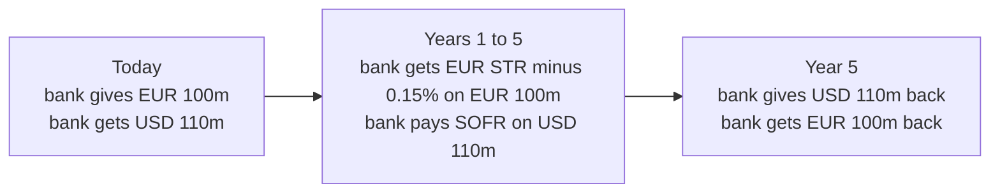
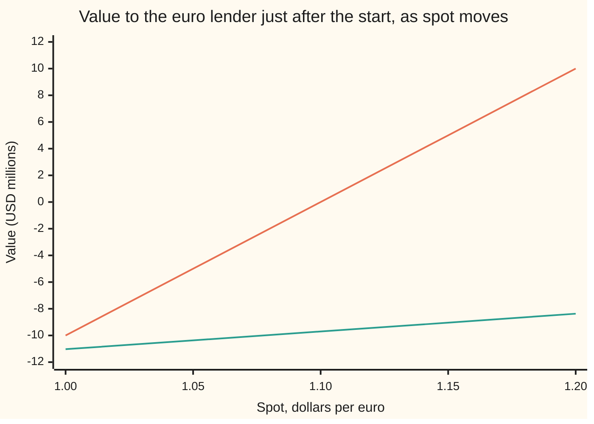

# Cross-currency swaps: exchanging notionals and the basis spread the market charges

[Syllabus](../../../SYLLABUS.md) → [Financial mathematics](../../../SYLLABUS.md#w12) → [Swaps](../../../SYLLABUS.md#w12-s28) → Cross-currency swaps

---

## General Overview

A bank in Frankfurt holds 100 million euros. Its customers want dollar loans for five years. One euro buys 1.10 dollars today, so the bank could sell its euros for 110 million dollars. But then it would carry five years of currency risk, and its balance sheet is in euros.

So it does a **cross-currency swap**. Today it hands over €100 million and receives $110 million. Every year for five years it receives euro interest on the €100 million and pays dollar interest on the $110 million. Both interest rates are **floating**: reset each year to that year's overnight rate, €STR for euros and SOFR for dollars. In five years the two principals go back the other way, at the same 1.10, whatever the exchange rate has done. The bank has borrowed dollars and lent euros, each against the other.

Each side lends at its own market rate, so the fair terms look like "euro rate flat against dollar rate flat". The market disagrees. On the screen, the five-year EUR against USD swap is quoted at **minus 15 basis points** (a basis point is a hundredth of a percent): the bank receives €STR minus 0.15 percent, not €STR. That 0.15 percent is the **cross-currency basis**. It is the price the market charges for getting dollars by swapping for them. This card prices the swap with it and reads what it says about funding.

**A cross-currency swap is two floating loans exchanged at spot, each worth its principal on its own curve. The basis is the spread that puts the euro leg back at its principal when euros are valued the way a dollar-funded market values them. It measures how much dearer dollars are through the swap than in the cash market.**

**What kind of fact this is:** a method: discount each currency's payments on the curve the collateral currency makes right, then solve for the spread. The basis itself is a market price, measured and not derived; that it has sat below zero for EUR against USD since 2007 is an observation.

### The picture: who pays what, and when



The principals move twice: once at the start and once at the end, both at 1.10. Everything in between is interest.

---

## The formula

Notation in words first. The bank is the **euro lender**: it gives euros now and receives the euro leg. A **discount factor** is today's price of one unit of a currency paid at a later date; $D_d(t)$ is that price for a dollar paid $t$ years from now, read off the dollar overnight curve. $P_f(t)$ is the same for a euro on the euro overnight curve. $D_x(t)$ is a third curve: what one euro paid in $t$ years is worth today, measured in euros, by a market that values everything in dollars. It is pinned by the foreign-exchange (FX) forward $F(t)$, the rate agreed today for swapping euros into dollars in $t$ years:

$$D_x(t) = \frac{F(t)\,D_d(t)}{S}$$

**Read it aloud:** a euro in $t$ years is worth the dollars it will fetch at the forward, discounted as dollars, then turned back into euros at today's spot.

The fair basis on a swap that pays once a year for $T$ years:

$$s = \frac{1 - D_x(T) - \sum_{i=1}^{T} f_i\, D_x(i)}{A_x}, \qquad A_x = \sum_{i=1}^{T} D_x(i)$$

**Read it aloud:** the spread is whatever is missing for the euro payments, valued on the dollar-funded euro curve, to add up to the euro principal, spread over the number of years that curve counts.

The value to the euro lender after the start, in dollars:

$$V = S N_f \Big[\sum_{i=1}^{T} (f_i + s) D_x(i) + D_x(T)\Big] - N_d \Big[\sum_{i=1}^{T} g_i D_d(i) + D_d(T)\Big]$$

And the funding difference the basis reveals: write $D_x(T) = e^{-yT}$, so $y$ is the euro rate the swap market implies, and compare it with the euro overnight rate $r_f$. The gap $y - r_f$ is in continuous-rate terms what the $-15$ basis points is in annual terms.

| Symbol | Plain meaning | In our example | Push it up and the answer… |
| --- | --- | --- | --- |
| $S$ | spot: dollars for one euro today | 1.10 | the euro leg is worth more dollars; the euro lender gains |
| $N_f$, $N_d$ | the two principals, euros and dollars | €100m and $110m | every value scales with them |
| $t$, $i$, $T$ | time in years, the year counter, and years to the end | 1 to 5, and 5 | a longer swap has a bigger annuity |
| $f_i$, $g_i$ | euro and dollar floating rate paid in year $i$ | 3.0455% and 5.1271% | fair basis falls as $f_i$ rises with $D_x$ fixed |
| $s$ | the basis: spread added to the euro rate | −0.15% | the euro lender receives more |
| $D_d(t)$ | today's price of a dollar paid at $t$ | 0.778801 at 5 years | dollar payments are worth more |
| $P_f(t)$ | today's price of a euro paid at $t$, euro curve | $e^{-0.03t}$ | the euro rates $f_i$ fall |
| $D_x(t)$ | today's price of a euro paid at $t$, in a dollar-valued market | 0.867000 at 5 years | the fair basis falls |
| $F(t)$ | FX forward: dollars per euro agreed today for year $t$ | 1.2246 at 5 years | $D_x$ rises, the basis falls |
| $A_x$, $A_d$ | annuities: sums of the yearly discount factors | 4.5934 and 4.3143 years | a basis point is worth more |
| $r_d$, $r_f$ | dollar and euro overnight rates, continuously compounded | 5% and 3% | $g_i$ or $f_i$ rises |
| $y$ | euro rate implied by the swap, continuously compounded | 2.8543% | euros through the swap earn more |

One line on each helper. The yearly floating rate from a flat continuous rate is $f_i = e^{0.03} - 1 = 3.0455\%$: overnight interest compounded over a year. The value splits into the euro leg, converted at spot because $D_x$ already carries the forward, minus the dollar leg.

### When it holds

- **Dollars are the collateral.** The curve $D_x$ belongs to a market that funds and posts collateral in dollars ([Collateral discounting](05-ois-discounting-and-collateral.md)). Collateralise in euros and the euro leg goes back on $P_f$, while the dollar leg is discounted on a dollar curve read through the forward; the same quote calibrates that curve instead.
- **Fixed principals.** Both principals stay at €100m and $110m. A variant resets the dollar principal to spot every year, paying the change in cash; that removes most of the currency exposure shown below and needs its own ledger.
- **Floating rates that fix at their forwards.** The curves here are flat and known. With random rates, a euro payment valued in dollars picks up a small correction from how the exchange rate and euro rates move together; the method stays, the number shifts.
- **No default and no bid–ask.** The −15 is a mid quote. Dealers charge a few basis points either side, and a counterparty that can fail is worth less than one that cannot.
- **Whole-year accruals.** Real legs count days (actual days over 360 for both overnight rates) and often pay quarterly. The algebra is the same with each year's accrual in front of each rate.

Conventions verified 2026-09-27 against Borio, McCauley, McGuire and Sushko (2016): the principals are exchanged back at the initial spot, the basis is added to one leg's reference rate, and the euro against dollar basis has been negative since 2007, so dollars cost more through the swap than in the cash market. The quote convention used here puts the basis on the euro leg against dollars flat. Interdealer quotes are mostly for the variant that resets the dollar principal; the fixed-principal swap here is the textbook and corporate form.

---

## Why it works

### Step 0: a floating loan is worth its principal

Lend €100 million at the overnight rate, rolled each year, and take the €100 million back at the end. Every year the borrower pays exactly the market rate for that year. There is nothing to win or lose, so the loan is worth €100 million today, on the curve that sets the rate.

A cross-currency swap is two such loans pointing opposite ways. The bank lends €100 million at €STR and borrows $110 million at SOFR. At spot, €100 million is $110 million. Each leg is worth its principal, so the swap is worth zero with no spread at all.

### Step 1: on its own curve, each leg is at par

Take the euro leg. The rate paid in year $i$ is set by the euro curve: $1 + f_i = P_f(i-1)/P_f(i)$. So the coupon plus the principal still owed, discounted one year, is exactly the principal one year earlier. Work backwards from year 5 and each year collapses into the one before, until only today's €100 million is left.

<details>
<summary>Detailed proof: the telescoping sum</summary>

Discount year $i$'s coupon on the euro curve: $f_i P_f(i) = P_f(i-1) - P_f(i)$, straight from the definition of $f_i$. Sum from 1 to $T$: every middle term cancels with its neighbour, leaving $P_f(0) - P_f(T) = 1 - P_f(T)$. Add the principal paid back at $T$, worth $P_f(T)$, and the total is 1 per euro of principal. The same steps with $D_d$ and $g_i$ put the dollar leg at par. Nothing in the argument used the rates being flat.

</details>

With both legs at par on their own curves, the fair basis is zero. The market says −15, so one of the curves is not the right one for valuing that leg.

### Step 2: in a dollar market, euros are valued through the FX forward

The dealers on the other side post and fund collateral in dollars: cash each side hands over to cover what it owes, earning the dollar overnight rate. They value every payment in dollars today. A euro paid in year $i$ is worth, to them, whatever dollars it fetches at the FX forward, discounted on the dollar curve: $F(i)\,D_d(i)$ dollars, or $F(i)\,D_d(i)/S$ euros at today's spot. That is $D_x(i)$.

If covered interest parity held ([Covered interest parity](../20-FX%20spot%2C%20forwards%20and%20interest%20parity/02-covered-interest-parity.md)), the forward would be $S\,P_f(i)/D_d(i)$ and $D_x$ would equal $P_f$. It does not hold. Since 2007 banks have paid up to borrow dollars through FX swaps, so forwards sit away from parity, and $D_x$ differs from $P_f$. The euro leg's rates still come from the euro curve, because €STR is what gets paid. But its payments are discounted on $D_x$. Projected on one curve, discounted on another: Step 1's telescoping no longer closes.

### Step 3: solve for the spread that restores par

The dollar leg is on its own curve, so by Step 1 it is still worth $110 million. The swap is fair when the euro leg is worth €100 million on $D_x$:

$$\sum_{i=1}^{T} (f_i + s)\,D_x(i) + D_x(T) = 1.$$

The spread enters once per year, so the left side rises by $A_x$ for each unit of $s$. Solving gives the formula above. It exists and is unique because $A_x$ is positive.

### Step 4: read the curve from the quotes, then read the funding gap

In practice the arrows run the other way. The market quotes the basis for each maturity, and $D_x$ is read out of the quotes, one year at a time. With the one-year quote, the one-year equation has one unknown, $D_x(1)$. With it known, the two-year equation has one unknown, $D_x(2)$. And so on. When every maturity is quoted at the same −15, each year's rate on the $D_x$ curve is exactly $f_i + s$:

$$D_x(i) = \frac{D_x(i-1)}{1 + f_i + s}.$$

<details>
<summary>Detailed proof: the bootstrap</summary>

Suppose $D_x(i-1)/D_x(i) = 1 + f_i + s$ for every year. Then $(f_i + s)D_x(i) = D_x(i-1) - D_x(i)$, and the sum in Step 3 telescopes exactly as in Step 1, to $1 - D_x(T)$. Adding $D_x(T)$ gives 1 at every $T$: every quote is matched. Conversely, the $T$-year equation minus the $(T-1)$-year one leaves $(f_T + s)D_x(T) + D_x(T) - D_x(T-1) = 0$, which is the same recursion. So the curve is unique.

</details>

So the dollar-funded euro curve earns 2.8955 percent a year where the euro deposit curve earns 3.0455. Written as a continuous rate, $y = \ln(1.028955) = 2.8543\%$, against $r_f = 3\%$. The **implied funding difference** is $y - r_f = -14.57$ basis points: euros delivered through the swap earn about 15 basis points less than euros in the bank. Equivalently, dollars obtained through the swap cost more than dollars borrowed directly.

### The other road: average over simulated exchange rates

Step 2 converts euros at the forward. A second road never uses the forward. Let the exchange rate wander at random, with 8 percent yearly volatility, drifting so that its average in each year sits at that year's forward. Convert every euro payment at the simulated rate, discount in dollars, and average over 100,000 paths and their mirror images. The code gets $110,001,577.61, with a standard error (the likely size of the averaging error) of $41,959.31, against the $110,000,000.00 the forwards give. The forward is the average exchange rate a dollar-funded market prices with, so converting at the forward is the same as averaging over the rates that might come.

---

## Worked numbers, by hand

The bank's swap: €100m against $110m, spot 1.10, five annual payments, dollar rate 5 percent and euro rate 3 percent (continuous), basis −15 basis points.

| Step | Arithmetic | Value |
| --- | --- | --- |
| euro floating rate $f_i$ | $e^{0.03} - 1$ | 3.0455% |
| dollar floating rate $g_i$ | $e^{0.05} - 1$ | 5.1271% |
| euro rate with basis | 3.0455% − 0.15% | 2.8955% |
| euro coupon received each year | 2.8955% × €100m | €2,895,453.40 |
| dollar coupon paid each year | 5.1271% × $110m | $5,639,820.60 |
| $D_x(1)$ | 1 / 1.028955 | 0.971860 |
| $D_x(5)$ | 1 / 1.028955^5 | 0.867000 |
| $A_x$ | sum of the five $D_x(i)$ | 4.5934 |
| fair basis check | (1 − 0.867000 − 3.0455% × 4.5934) / 4.5934 | −15.00 bp |
| implied euro rate $y$ | −ln(0.867000) / 5 | 2.8543% |
| **funding difference** $y - r_f$ | 2.8543% − 3% | **−14.57 bp** |
| five-year forward $F(5)$ | 1.10 × 0.867000 / 0.778801 | 1.2246 |
| the same forward if parity held | $1.10\,e^{0.10}$ | 1.2157 |
| value of 15 bp a year | 0.0015 × €100m × 4.5934 | €689,011.50 |
| in dollars | × 1.10 | $757,912.65 |
| **dollar-leg equivalent** | 757,912.65 / ($110m × 4.3143) | **15.97 bp** |

The basis costs the euro lender €689,011.50 in today's money over five years, $757,912.65 at spot. That is what a bank pays to turn euros into dollars through the swap instead of borrowing dollars directly: SOFR plus 15.97 basis points, not SOFR flat. A dealer who struck the same swap at €STR flat would be handing the bank $757,912.65 on day one.

The one-year forward shows the same thing at a shorter horizon: 1.123857 with the basis against 1.122221 at parity. The forward is higher, so buying euros back forward costs more dollars: borrowing dollars through an FX swap is dearer than parity says. That is the one-period reading done on [The interest rate a forward implies](../20-FX%20spot%2C%20forwards%20and%20interest%20parity/05-implied-yield-and-cross-currency-basis.md); the swap stretches it to five years with both principals.

### What breaks if you drop a piece

Correct answer: the −15 basis-point swap is worth zero at inception, and the fair basis is −15.00.

| Mistake | Comes out at | What went wrong |
| --- | --- | --- |
| Discount the euro leg on the euro overnight curve | fair basis 0.00 bp; the −15 swap shows −$754,671.99 | treats covered parity as holding, so the market quote looks like a loss |
| Drop the final exchange of principals | fair basis +177.01 bp | the dollar coupons are bigger than the euro coupons; only the principals' forward value pays for the gap |
| Read −15 bp as a shift to the continuous euro rate | the swap shows +$22,499.29 | −15 is an annual spread on the paid rate, worth −14.57 bp continuous |
| Move the 15 bp to the dollar leg unchanged | the euro lender is +$46,052.11 better off | a basis point is worth $A_x$ years on the euro side and $A_d$ on the dollar side; the dollar equivalent is 15.97 |
| Convert every euro payment at today's spot | −$10,590,853.58 | euros in five years fetch the forward, 1.2246, not 1.10 |

---

## How the value moves after the trade

The swap is worth zero on day one. A week later the rates have not moved, the basis has not moved, and the swap is worth millions. The exchange rate moved.

### Force one: the exchange rate

Right after the start, the euro leg is worth €100 million on its curve and the dollar leg $110 million. So the value to the euro lender is $100\text{m} \times \text{spot} - 110\text{m}$ dollars. The coupons alone carry little of that; the final principal carries almost all of it.



The steep line is the whole swap: $5 million for every five cents of spot. The shallow line is the coupons alone, without either principal: it runs only from −$11.03 million to −$8.37 million across the range, and sits at −$9.70 million at 1.10 because dollar coupons are dearer than euro coupons. The gap between the lines is the final principal exchange. That is why cross-currency swaps carry far larger collateral calls than interest-rate swaps.

### Force two: the basis

Hold spot at 1.10 and move the market basis. The bank locked in €STR − 15. If the market moves to −30, new dollar funding costs more and the bank's old swap is worth more.

```
market basis   value of the bank's -15 swap, USD thousands (bars left of | are losses)
  -30 bp                        |████████████████████  +761.2
  -20 bp                        |███████               +253.0
  -10 bp                 ███████|                      -252.3
    0 bp    ████████████████████|                      -754.7
```

Moving the market from −15 to −20 is worth +$253.0 thousand to the bank: about 5 basis points times the euro annuity times the principal times spot. That sensitivity is the swap's basis risk, the cross-currency cousin of [Swap DV01](03-swap-dv01-and-hedging.md).

---

## Code, from first principles, and it actually runs

The scripts build both overnight curves, bootstrap the dollar-funded euro curve from the −15 quote, and confirm the fair basis by three roads: the par formula (road 1), a dollar ledger with every euro payment converted at its forward and a bisection root finder (road 2), and 100,000 simulated exchange-rate paths plus their mirror images, with their own random number generator (road 3). They then price a swap struck at zero basis both ways, find the dollar-leg equivalent spread both ways, reproduce every row of the what-breaks table, and trace both forces. Eight asserts compare independent computations.

### Python

```python
# Cross-currency swap with a basis -- the check behind the card.  Standard library only.
# EUR against USD, 5 years, annual payments, EUR 100m against USD 110m at spot 1.10.
# Road 1: bootstrap the dollar-collateral euro curve from the quoted basis, then the par formula.
# Road 2: a ledger in dollars, every euro flow converted at its FX forward; bisection for the spread.
# Road 3: simulated spot paths, every euro flow converted at the simulated spot.
from math import exp, log, sqrt, cos, pi

S, NF, ND, RD, RF, Q, T = 1.10, 100e6, 110e6, 0.05, 0.03, -0.0015, 5
DD = [exp(-RD * i) for i in range(T + 1)]                # dollar discount factors
PF = [exp(-RF * i) for i in range(T + 1)]                # euro OIS curve, projects the euro fixings
FE = [PF[i - 1] / PF[i] - 1 for i in range(1, T + 1)]    # euro floating rate paid each year
FD = [DD[i - 1] / DD[i] - 1 for i in range(1, T + 1)]    # dollar floating rate paid each year

def bootstrap(q):                       # euro discount factors that make a q-basis swap fair at every maturity
    dx = [1.0]
    for i in range(1, T + 1):
        dx.append(dx[-1] / (1 + FE[i - 1] + q))
    return dx

def par_basis(dx, n=T):                 # road 1: spread that puts the euro leg at par
    return (1 - dx[n] - sum(FE[i - 1] * dx[i] for i in range(1, n + 1))) / sum(dx[1:n + 1])

def ledger(dx, s, x=S, dollar_spread=0.0, principal=True, fx=None):
    # road 2: value in dollars to the euro lender (receives euro leg, pays dollar leg)
    fwd = fx or [x * dx[i] / DD[i] for i in range(T + 1)]
    v = 0.0
    for i in range(1, T + 1):
        v += NF * (FE[i - 1] + s) * fwd[i] * DD[i] - ND * (FD[i - 1] + dollar_spread) * DD[i]
    if principal:
        v += NF * fwd[T] * DD[T] - ND * DD[T] + (ND - NF * S)   # final swap back, plus the start at 1.10
    return v

def bisect(f, lo, hi):
    for _ in range(200):
        mid = 0.5 * (lo + hi)
        if (f(lo) < 0) == (f(mid) < 0): lo = mid
        else: hi = mid
    return 0.5 * (lo + hi)

DX = bootstrap(Q)
AX, AD, AF = sum(DX[1:]), sum(DD[1:]), sum(PF[1:])
b1 = par_basis(DX)
b2 = bisect(lambda s: ledger(DX, s), -0.01, 0.01)
Y = -log(DX[T]) / T                                        # implied euro rate, continuously compounded
F5, F5CIP = S * DX[T] / DD[T], S * PF[T] / DD[T]
yf_from_fwd = RD - log(F5 / S) / T                          # the implied-yield card's formula
v0_closed = S * NF * (0 - Q) * AX
v0_ledger = ledger(DX, 0.0)
usd_eq_closed = -Q * S * NF * AX / (ND * AD)
usd_eq_bisect = bisect(lambda x: ledger(DX, 0.0, dollar_spread=x), -0.01, 0.01)

# road 3: spot follows a random walk in logs whose average matches the FX forwards (dollar pricing)
state = 20260927
def rnd():
    global state
    state = (state + 0x9E3779B97F4A7C15) & 0xFFFFFFFFFFFFFFFF
    z = state
    z = ((z ^ (z >> 30)) * 0xBF58476D1CE4E5B9) & 0xFFFFFFFFFFFFFFFF
    z = ((z ^ (z >> 27)) * 0x94D049BB133111EB) & 0xFFFFFFFFFFFFFFFF
    return ((z ^ (z >> 31)) >> 11) / 9007199254740992.0
VOL, PATHS = 0.08, 100000
tot = tot2 = 0.0
for _ in range(PATHS):
    u1, u2 = rnd(), rnd()
    zs = [sqrt(-2 * log(1 - u1)) * cos(2 * pi * u2)]
    for _ in range(T - 1):
        u1, u2 = rnd(), rnd()
        zs.append(sqrt(-2 * log(1 - u1)) * cos(2 * pi * u2))
    for sign in (1, -1):
        lx, leg = log(S), 0.0
        for i in range(1, T + 1):
            lx += (RD - Y - 0.5 * VOL * VOL) + VOL * sign * zs[i - 1]
            leg += NF * ((FE[i - 1] + Q) + (1 if i == T else 0)) * exp(lx) * DD[i]
        tot += leg; tot2 += leg * leg
n = 2 * PATHS
mc = tot / n
se = sqrt(tot2 / n - mc * mc) / sqrt(n)

leg_fwd = S * NF * (sum((FE[i - 1] + Q) * DX[i] for i in range(1, T + 1)) + DX[T])

# what breaks
wb_ois = ledger(PF, Q)                                      # euros discounted on the euro OIS curve
wb_ois_basis = par_basis(PF)
wb_noprin = bisect(lambda s: ledger(DX, s, principal=False), -0.1, 0.1)
DC = [exp(-(RF + Q) * i) for i in range(T + 1)]
wb_cc = ledger(DC, Q)                                       # -15bp read as a continuous-rate shift
wb_usd15 = ledger(DX, 0.0, dollar_spread=-Q)
wb_spot = ledger(DX, Q, fx=[S] * (T + 1))

print("curve by year: t, euro fixing, dollar fixing, D_d, D_x, FX forward, FX forward if CIP held")
for i in range(1, T + 1):
    print(f"  {i}  {FE[i-1]*100:.4f}%  {FD[i-1]*100:.4f}%  {DD[i]:.6f}  {DX[i]:.6f}  {S*DX[i]/DD[i]:.6f}  {S*PF[i]/DD[i]:.6f}")
rows = [
    ("euro coupon rate with basis, f + s (%)", (FE[0] + Q) * 100),
    ("euro coupon paid each year (EUR)", NF * (FE[0] + Q)),
    ("dollar coupon paid each year (USD)", ND * FD[0]),
    ("euro annuity A_x (years)", AX), ("dollar annuity A_d (years)", AD), ("euro OIS annuity (years)", AF),
    ("1 fair basis, par formula (bp)", b1 * 1e4), ("2 fair basis, ledger + bisection (bp)", b2 * 1e4),
    ("3 euro leg in USD, simulated (USD)", mc), ("  simulation standard error (USD)", se),
    ("  euro leg in USD, forwards (USD)", leg_fwd),
    ("implied euro rate y, continuous (%)", Y * 100), ("  y from the 5-year forward (%)", yf_from_fwd * 100),
    ("funding difference y - r_f (bp)", (Y - RF) * 1e4),
    ("5-year forward with basis", F5), ("5-year forward if CIP held", F5CIP), ("  gap (pips)", (F5 - F5CIP) * 1e4),
    ("PV of the basis per year, EUR 150,000 (EUR)", -Q * NF * AX),
    ("value of a zero-basis swap, closed (USD)", v0_closed), ("  same, ledger (USD)", v0_ledger),
    ("dollar-leg equivalent spread, closed (bp)", usd_eq_closed * 1e4),
    ("  same, bisection (bp)", usd_eq_bisect * 1e4),
    ("wrong: euro OIS discounting, swap value (USD)", wb_ois), ("  its fair basis (bp)", wb_ois_basis * 1e4),
    ("wrong: no final principal, fair basis (bp)", wb_noprin * 1e4),
    ("wrong: -15bp as continuous shift (USD)", wb_cc),
    ("wrong: 15bp moved to dollar leg (USD)", wb_usd15),
    ("wrong: euro flows at today's spot (USD)", wb_spot),
]
for name, v in rows:
    print(f"{name:<46} {v:>16.4f}")
print("spot moves (value to euro lender, USD m): spot, whole swap, coupons only")
for x in (1.00, 1.05, 1.10, 1.15, 1.20):
    coup = ledger(DX, Q, x=x, principal=False)
    print(f"  {x:.2f}  {ledger(DX, Q, x=x) / 1e6:8.2f}  {coup / 1e6:8.2f}")
print("basis moves (value of the -15bp swap to euro lender, USD k)")
for qn in (-0.0030, -0.0020, -0.0010, 0.0):
    print(f"  {qn*1e4:6.1f}bp  {ledger(bootstrap(qn), Q) / 1e3:10.1f}")

assert abs(b1 - Q) < 1e-12                                           # bootstrap reproduces the 5-year quote
assert abs(par_basis(DX, 3) - Q) < 1e-12                             # and the 3-year one
assert abs(b2 - b1) < 1e-10                                          # road 2 agrees with road 1
assert abs(mc - NF * S) < 4 * se                                     # road 3: euro leg worth its notional
assert abs(v0_closed - v0_ledger) < 1e-4                             # closed value vs ledger
assert abs(usd_eq_closed - usd_eq_bisect) < 1e-10
assert abs((Y - RF) - log(1 + Q / (1 + FE[0]))) < 1e-12              # funding gap = ln((1+f+s)/(1+f))
assert max(abs(a - b) for a, b in zip(bootstrap(0.0), PF)) < 1e-14   # zero basis gives back the euro curve
print("all checks passed")
```

**Ran 2026-09-28 on macOS, Python 3.14.6, standard library only. All checks passed. Output, pasted from the run:**

```
curve by year: t, euro fixing, dollar fixing, D_d, D_x, FX forward, FX forward if CIP held
  1  3.0455%  5.1271%  0.951229  0.971860  1.123857  1.122221
  2  3.0455%  5.1271%  0.904837  0.944512  1.148232  1.144892
  3  3.0455%  5.1271%  0.860708  0.917934  1.173136  1.168020
  4  3.0455%  5.1271%  0.818731  0.892104  1.198579  1.191616
  5  3.0455%  5.1271%  0.778801  0.867000  1.224575  1.215688
euro coupon rate with basis, f + s (%)                   2.8955
euro coupon paid each year (EUR)                   2895453.3954
dollar coupon paid each year (USD)                 5639820.6014
euro annuity A_x (years)                                 4.5934
dollar annuity A_d (years)                               4.3143
euro OIS annuity (years)                                 4.5738
1 fair basis, par formula (bp)                         -15.0000
2 fair basis, ledger + bisection (bp)                  -15.0000
3 euro leg in USD, simulated (USD)               110001577.6054
  simulation standard error (USD)                    41959.3061
  euro leg in USD, forwards (USD)                110000000.0000
implied euro rate y, continuous (%)                      2.8543
  y from the 5-year forward (%)                          2.8543
funding difference y - r_f (bp)                        -14.5673
5-year forward with basis                                1.2246
5-year forward if CIP held                               1.2157
  gap (pips)                                            88.8696
PV of the basis per year, EUR 150,000 (EUR)         689011.5040
value of a zero-basis swap, closed (USD)            757912.6544
  same, ledger (USD)                                757912.6544
dollar-leg equivalent spread, closed (bp)               15.9704
  same, bisection (bp)                                  15.9704
wrong: euro OIS discounting, swap value (USD)      -754671.9948
  its fair basis (bp)                                    0.0000
wrong: no final principal, fair basis (bp)             177.0124
wrong: -15bp as continuous shift (USD)               22499.2885
wrong: 15bp moved to dollar leg (USD)                46052.1058
wrong: euro flows at today's spot (USD)          -10590853.5792
spot moves (value to euro lender, USD m): spot, whole swap, coupons only
  1.00    -10.00    -11.03
  1.05     -5.00    -10.37
  1.10      0.00     -9.70
  1.15      5.00     -9.04
  1.20     10.00     -8.37
basis moves (value of the -15bp swap to euro lender, USD k)
   -30.0bp       761.2
   -20.0bp       253.0
   -10.0bp      -252.3
     0.0bp      -754.7
all checks passed
```

### Rust

```rust
// Cross-currency swap with a basis -- the check behind the card.  std only, no crates.
// EUR against USD, 5 years, annual payments, EUR 100m against USD 110m at spot 1.10.
// Road 1: bootstrap the dollar-collateral euro curve from the quoted basis, then the par formula.
// Road 2: a ledger in dollars, every euro flow converted at its FX forward; bisection for the spread.
// Road 3: simulated spot paths, every euro flow converted at the simulated spot.
const S: f64 = 1.10;
const NF: f64 = 100e6;
const ND: f64 = 110e6;
const RD: f64 = 0.05;
const RF: f64 = 0.03;
const Q: f64 = -0.0015;
const T: usize = 5;

struct M { dd: Vec<f64>, pf: Vec<f64>, fe: Vec<f64>, fd: Vec<f64> }

impl M {
    fn new() -> M {
        let dd: Vec<f64> = (0..=T).map(|i| (-RD * i as f64).exp()).collect(); // dollar discount factors
        let pf: Vec<f64> = (0..=T).map(|i| (-RF * i as f64).exp()).collect(); // euro OIS curve
        let fe = (1..=T).map(|i| pf[i - 1] / pf[i] - 1.0).collect();         // euro fixing each year
        let fd = (1..=T).map(|i| dd[i - 1] / dd[i] - 1.0).collect();         // dollar fixing each year
        M { dd, pf, fe, fd }
    }
    // euro discount factors that make a q-basis swap fair at every maturity
    fn bootstrap(&self, q: f64) -> Vec<f64> {
        let mut dx = vec![1.0];
        for i in 1..=T { let last = dx[i - 1]; dx.push(last / (1.0 + self.fe[i - 1] + q)); }
        dx
    }
    // road 1: the spread that puts the euro leg at par
    fn par_basis(&self, dx: &[f64], n: usize) -> f64 {
        let fl: f64 = (1..=n).map(|i| self.fe[i - 1] * dx[i]).sum();
        let a: f64 = dx[1..=n].iter().sum();
        (1.0 - dx[n] - fl) / a
    }
    // road 2: value in dollars to the euro lender (receives euro leg, pays dollar leg)
    fn ledger(&self, dx: &[f64], s: f64, x: f64, dsp: f64, principal: bool, fx: Option<&[f64]>) -> f64 {
        let fwd: Vec<f64> = match fx {
            Some(f) => f.to_vec(),
            None => (0..=T).map(|i| x * dx[i] / self.dd[i]).collect(),
        };
        let mut v = 0.0;
        for i in 1..=T {
            v += NF * (self.fe[i - 1] + s) * fwd[i] * self.dd[i] - ND * (self.fd[i - 1] + dsp) * self.dd[i];
        }
        if principal { v += NF * fwd[T] * self.dd[T] - ND * self.dd[T] + (ND - NF * S); }
        v
    }
}

fn bisect<F: Fn(f64) -> f64>(f: F, mut lo: f64, mut hi: f64) -> f64 {
    for _ in 0..200 {
        let mid = 0.5 * (lo + hi);
        if (f(lo) < 0.0) == (f(mid) < 0.0) { lo = mid; } else { hi = mid; }
    }
    0.5 * (lo + hi)
}

struct Rng(u64);
impl Rng {
    fn next(&mut self) -> f64 {
        self.0 = self.0.wrapping_add(0x9E3779B97F4A7C15);
        let mut z = self.0;
        z = (z ^ (z >> 30)).wrapping_mul(0xBF58476D1CE4E5B9);
        z = (z ^ (z >> 27)).wrapping_mul(0x94D049BB133111EB);
        ((z ^ (z >> 31)) >> 11) as f64 / 9007199254740992.0
    }
    fn normal(&mut self) -> f64 {
        let (u1, u2) = (self.next(), self.next());
        (-2.0 * (1.0 - u1).ln()).sqrt() * (2.0 * std::f64::consts::PI * u2).cos()
    }
}

fn main() {
    let m = M::new();
    let dx = m.bootstrap(Q);
    let ax: f64 = dx[1..].iter().sum();
    let ad: f64 = m.dd[1..].iter().sum();
    let af: f64 = m.pf[1..].iter().sum();
    let b1 = m.par_basis(&dx, T);
    let b2 = bisect(|s| m.ledger(&dx, s, S, 0.0, true, None), -0.01, 0.01);
    let y = -dx[T].ln() / T as f64; // implied euro rate, continuously compounded
    let (f5, f5cip) = (S * dx[T] / m.dd[T], S * m.pf[T] / m.dd[T]);
    let yf_from_fwd = RD - (f5 / S).ln() / T as f64; // the implied-yield card's formula
    let v0_closed = S * NF * (0.0 - Q) * ax;
    let v0_ledger = m.ledger(&dx, 0.0, S, 0.0, true, None);
    let usd_eq_closed = -Q * S * NF * ax / (ND * ad);
    let usd_eq_bisect = bisect(|x| m.ledger(&dx, 0.0, S, x, true, None), -0.01, 0.01);

    // road 3: spot follows a random walk in logs whose average matches the FX forwards
    let (vol, paths) = (0.08, 100000usize);
    let mut rng = Rng(20260927);
    let (mut tot, mut tot2) = (0.0f64, 0.0f64);
    for _ in 0..paths {
        let zs: Vec<f64> = (0..T).map(|_| rng.normal()).collect();
        for sign in [1.0, -1.0] {
            let (mut lx, mut leg) = (S.ln(), 0.0);
            for i in 1..=T {
                lx += (RD - y - 0.5 * vol * vol) + vol * sign * zs[i - 1];
                let last = if i == T { 1.0 } else { 0.0 };
                leg += NF * ((m.fe[i - 1] + Q) + last) * lx.exp() * m.dd[i];
            }
            tot += leg; tot2 += leg * leg;
        }
    }
    let n = (2 * paths) as f64;
    let mc = tot / n;
    let se = (tot2 / n - mc * mc).sqrt() / n.sqrt();
    let leg_fwd = S * NF * ((1..=T).map(|i| (m.fe[i - 1] + Q) * dx[i]).sum::<f64>() + dx[T]);

    // what breaks
    let wb_ois = m.ledger(&m.pf, Q, S, 0.0, true, None);
    let wb_ois_basis = m.par_basis(&m.pf, T);
    let wb_noprin = bisect(|s| m.ledger(&dx, s, S, 0.0, false, None), -0.1, 0.1);
    let dc: Vec<f64> = (0..=T).map(|i| (-(RF + Q) * i as f64).exp()).collect();
    let wb_cc = m.ledger(&dc, Q, S, 0.0, true, None);
    let wb_usd15 = m.ledger(&dx, 0.0, S, -Q, true, None);
    let spot = vec![S; T + 1];
    let wb_spot = m.ledger(&dx, Q, S, 0.0, true, Some(&spot));

    println!("curve by year: t, euro fixing, dollar fixing, D_d, D_x, FX forward, FX forward if CIP held");
    for i in 1..=T {
        println!("  {}  {:.4}%  {:.4}%  {:.6}  {:.6}  {:.6}  {:.6}", i, m.fe[i - 1] * 100.0, m.fd[i - 1] * 100.0,
                 m.dd[i], dx[i], S * dx[i] / m.dd[i], S * m.pf[i] / m.dd[i]);
    }
    let rows: Vec<(&str, f64)> = vec![
        ("euro coupon rate with basis, f + s (%)", (m.fe[0] + Q) * 100.0),
        ("euro coupon paid each year (EUR)", NF * (m.fe[0] + Q)),
        ("dollar coupon paid each year (USD)", ND * m.fd[0]),
        ("euro annuity A_x (years)", ax), ("dollar annuity A_d (years)", ad), ("euro OIS annuity (years)", af),
        ("1 fair basis, par formula (bp)", b1 * 1e4), ("2 fair basis, ledger + bisection (bp)", b2 * 1e4),
        ("3 euro leg in USD, simulated (USD)", mc), ("  simulation standard error (USD)", se),
        ("  euro leg in USD, forwards (USD)", leg_fwd),
        ("implied euro rate y, continuous (%)", y * 100.0), ("  y from the 5-year forward (%)", yf_from_fwd * 100.0),
        ("funding difference y - r_f (bp)", (y - RF) * 1e4),
        ("5-year forward with basis", f5), ("5-year forward if CIP held", f5cip), ("  gap (pips)", (f5 - f5cip) * 1e4),
        ("PV of the basis per year, EUR 150,000 (EUR)", -Q * NF * ax),
        ("value of a zero-basis swap, closed (USD)", v0_closed), ("  same, ledger (USD)", v0_ledger),
        ("dollar-leg equivalent spread, closed (bp)", usd_eq_closed * 1e4),
        ("  same, bisection (bp)", usd_eq_bisect * 1e4),
        ("wrong: euro OIS discounting, swap value (USD)", wb_ois), ("  its fair basis (bp)", wb_ois_basis * 1e4),
        ("wrong: no final principal, fair basis (bp)", wb_noprin * 1e4),
        ("wrong: -15bp as continuous shift (USD)", wb_cc),
        ("wrong: 15bp moved to dollar leg (USD)", wb_usd15),
        ("wrong: euro flows at today's spot (USD)", wb_spot),
    ];
    for (name, v) in &rows { println!("{:<46} {:>16.4}", name, v); }
    println!("spot moves (value to euro lender, USD m): spot, whole swap, coupons only");
    for x in [1.00, 1.05, 1.10, 1.15, 1.20] {
        let coup = m.ledger(&dx, Q, x, 0.0, false, None);
        println!("  {:.2}  {:8.2}  {:8.2}", x, m.ledger(&dx, Q, x, 0.0, true, None) / 1e6, coup / 1e6);
    }
    println!("basis moves (value of the -15bp swap to euro lender, USD k)");
    for qn in [-0.0030, -0.0020, -0.0010, 0.0] {
        println!("  {:6.1}bp  {:10.1}", qn * 1e4, m.ledger(&m.bootstrap(qn), Q, S, 0.0, true, None) / 1e3);
    }

    assert!((b1 - Q).abs() < 1e-12);                     // bootstrap reproduces the 5-year quote
    assert!((m.par_basis(&dx, 3) - Q).abs() < 1e-12);    // and the 3-year one
    assert!((b2 - b1).abs() < 1e-10);                    // road 2 agrees with road 1
    assert!((mc - NF * S).abs() < 4.0 * se);             // road 3: euro leg worth its notional
    assert!((v0_closed - v0_ledger).abs() < 1e-4);       // closed value vs ledger
    assert!((usd_eq_closed - usd_eq_bisect).abs() < 1e-10);
    assert!(((y - RF) - (1.0 + Q / (1.0 + m.fe[0])).ln()).abs() < 1e-12); // funding gap = ln((1+f+s)/(1+f))
    assert!(m.bootstrap(0.0).iter().zip(&m.pf).all(|(a, b)| (a - b).abs() < 1e-14)); // zero basis gives back the euro curve
    println!("all checks passed");
}
```

**Ran 2026-09-28 on macOS, rustc 1.98.1, no crates. All checks passed. Output, pasted from the run:**

```
curve by year: t, euro fixing, dollar fixing, D_d, D_x, FX forward, FX forward if CIP held
  1  3.0455%  5.1271%  0.951229  0.971860  1.123857  1.122221
  2  3.0455%  5.1271%  0.904837  0.944512  1.148232  1.144892
  3  3.0455%  5.1271%  0.860708  0.917934  1.173136  1.168020
  4  3.0455%  5.1271%  0.818731  0.892104  1.198579  1.191616
  5  3.0455%  5.1271%  0.778801  0.867000  1.224575  1.215688
euro coupon rate with basis, f + s (%)                   2.8955
euro coupon paid each year (EUR)                   2895453.3954
dollar coupon paid each year (USD)                 5639820.6014
euro annuity A_x (years)                                 4.5934
dollar annuity A_d (years)                               4.3143
euro OIS annuity (years)                                 4.5738
1 fair basis, par formula (bp)                         -15.0000
2 fair basis, ledger + bisection (bp)                  -15.0000
3 euro leg in USD, simulated (USD)               110001577.6054
  simulation standard error (USD)                    41959.3061
  euro leg in USD, forwards (USD)                110000000.0000
implied euro rate y, continuous (%)                      2.8543
  y from the 5-year forward (%)                          2.8543
funding difference y - r_f (bp)                        -14.5673
5-year forward with basis                                1.2246
5-year forward if CIP held                               1.2157
  gap (pips)                                            88.8696
PV of the basis per year, EUR 150,000 (EUR)         689011.5040
value of a zero-basis swap, closed (USD)            757912.6544
  same, ledger (USD)                                757912.6544
dollar-leg equivalent spread, closed (bp)               15.9704
  same, bisection (bp)                                  15.9704
wrong: euro OIS discounting, swap value (USD)      -754671.9948
  its fair basis (bp)                                    0.0000
wrong: no final principal, fair basis (bp)             177.0124
wrong: -15bp as continuous shift (USD)               22499.2885
wrong: 15bp moved to dollar leg (USD)                46052.1058
wrong: euro flows at today's spot (USD)          -10590853.5792
spot moves (value to euro lender, USD m): spot, whole swap, coupons only
  1.00    -10.00    -11.03
  1.05     -5.00    -10.37
  1.10      0.00     -9.70
  1.15      5.00     -9.04
  1.20     10.00     -8.37
basis moves (value of the -15bp swap to euro lender, USD k)
   -30.0bp       761.2
   -20.0bp       253.0
   -10.0bp      -252.3
     0.0bp      -754.7
all checks passed
```

The two outputs agree line for line.

> [!TIP]
> **Try changing**
> Guess the direction first, then run it.
> - **Set `Q = 0.0`.** The dollar-funded euro curve becomes the euro curve, the forwards become the parity forwards, and every value of a zero-basis swap drops to zero. The 5-year forward falls to 1.2157.
> - **Leave out the principals.** Pass `principal=False` to the ledger's bisection. The fair basis becomes **+177.01** basis points: the what-breaks row, and the reason the principals cannot be skipped.
> - **Set `VOL = 0.20`.** The simulated euro leg still averages $110 million; only the standard error grows. Volatility does not enter the price of a linear payment.

---

## The usual mistake

> [!warning]
> **Treating the basis as a small add-on to an interest-rate swap.** It is not a coupon tweak. It changes the curve on which every euro payment is discounted, including the €100 million principal at the end. Discount on the euro overnight curve and a fair −15 swap looks like a $754,671.99 loss; the error is in the curve, not the spread.
>
> Smaller traps:
> - **Forgetting the principals.** Without the final exchange the fair spread comes out at +177.01 basis points, the wrong sign and far too large. The principals are real cash flows.
> - **Moving the spread between legs one for one.** 15 basis points on the euro leg equals 15.97 on the dollar leg, because the two annuities differ. Getting it wrong costs $46,052.11 here.
> - **Mixing rate conventions.** The quote is an annual spread on a paid rate. As a continuous shift it is −14.57 basis points. Using −15 as a continuous rate misprices the swap by $22,499.29.
> - **Reading the basis as free money.** A negative basis looks like a covered arbitrage: borrow dollars cheaply in cash, lend them through the swap. It survives because the trade uses balance sheet, needs collateral, and carries credit risk on both sides, all of which cost banks capital.

---

## Where you meet it in real life

- **Banks funding in a second currency.** Euro and yen banks with dollar loans use cross-currency swaps to fund them. The basis is their extra cost; Borio and co-authors trace its persistence to this hedging demand meeting limited bank balance sheets.
- **Companies issuing bonds abroad.** A European company issues dollar bonds, swaps the proceeds into euros, and pays euro interest. With a negative basis, dollar funders pay extra and the other side gets cheap euros, so issuers compare the swapped cost with borrowing at home.
- **Investors hedging foreign bonds.** A Japanese pension fund holding US Treasuries hedges the dollars back to yen. The basis eats into the hedged yield, which is why hedged foreign bonds can yield less than home bonds.
- **Central bank swap lines.** In 2008 and 2020, when the basis blew out, the Federal Reserve lent dollars to other central banks against their currencies, a swap at a set price, and the basis narrowed.
- **Collateral agreements.** Which currency a swap's collateral is posted in decides which curve discounts it ([Collateral discounting](05-ois-discounting-and-collateral.md)); a desk with collateral in several currencies uses cross-currency curves to value all of it.

> **Say it back**
> A cross-currency swap exchanges principals at spot, pays floating interest in each currency, and exchanges the principals back at the same rate. Each leg is worth its principal on its own curve, so without frictions the fair spread is zero. A dollar-funded market values euros through the FX forward, which sits away from parity, and on that curve the euro leg is off par. The basis is the spread that restores par: −15 basis points here, which says euros through the swap earn 14.57 basis points less than euros in the bank, and dollars through the swap cost SOFR plus 15.97. After the trade, the exchange rate moves the value most, through the final principal.

---

## What this builds on

- [Collateral discounting](05-ois-discounting-and-collateral.md): why the collateral currency picks the discount curve. This card applies it with dollars as collateral and euros paid.
- [Covered interest parity](../20-FX%20spot%2C%20forwards%20and%20interest%20parity/02-covered-interest-parity.md): the forward that would hold without frictions, $F = S\,e^{(r_d - r_f)T}$. The basis is the swap market's measure of how far it fails.
- [Interest rate swaps](01-interest-rate-swaps.md): the one-currency swap and the floating leg valued at par.
- [Multi-curve](04-basis-swaps-and-the-multi-curve-framework.md): projecting on one curve and discounting on another, inside one currency. Here the two curves belong to two currencies.

---

## Where this goes next

- [Solving a swap backwards](07-swap-inverses-rate-and-curve-from-price.md): solving a swap backwards for its rate or its curve, of which Step 4's bootstrap is one case.
- [Swap DV01](03-swap-dv01-and-hedging.md): sensitivities and hedges; the $253.0 thousand per 5 basis points above is a basis DV01.
- [The interest rate a forward implies](../20-FX%20spot%2C%20forwards%20and%20interest%20parity/05-implied-yield-and-cross-currency-basis.md): the one-period basis read from a single forward, the short end of the curve built here.

This card priced the swap on curves it was handed and showed the basis moving its value; what remains open is how to solve backwards from a quoted price for the rate or the whole curve, with the existence and uniqueness that makes the answer trustworthy.

---

## Sources

Verified 2026-09-27: every link below resolves to the publisher's page.

- Borio, Claudio, Robert N. McCauley, Patrick McGuire and Vladyslav Sushko. "Covered interest parity lost: understanding the cross-currency basis." *BIS Quarterly Review*, September 2016. [BIS page](https://www.bis.org/publ/qtrpdf/r_qt1609e.htm). The swap's cash flows, the one-period basis formula, and why the dollar basis has been negative since 2007.
- Baba, Naohiko, Frank Packer and Teppei Nagano. "The spillover of money market turbulence to FX swap and cross-currency swap markets." *BIS Quarterly Review*, March 2008. [BIS page](https://www.bis.org/publ/qtrpdf/r_qt0803h.htm). How dollar funding shortages in 2007 pushed long cross-currency basis swaps away from zero.
- Du, Wenxin, Alexander Tepper and Adrien Verdelhan. "Deviations from Covered Interest Rate Parity." *Journal of Finance* 73, no. 3 (2018): 915–957. [doi:10.1111/jofi.12620](https://doi.org/10.1111/jofi.12620). The basis measured across currencies and maturities, and why balance-sheet costs stop arbitrage closing it.
- Hull, John C. *Options, Futures, and Other Derivatives*, 11th ed. Pearson. [Publisher page](https://www.pearson.com/en-us/subject-catalog/p/options-futures-and-other-derivatives/P200000005938). Currency swaps valued as bond pairs and as strips of forwards, the textbook route to Steps 1 and 2.
