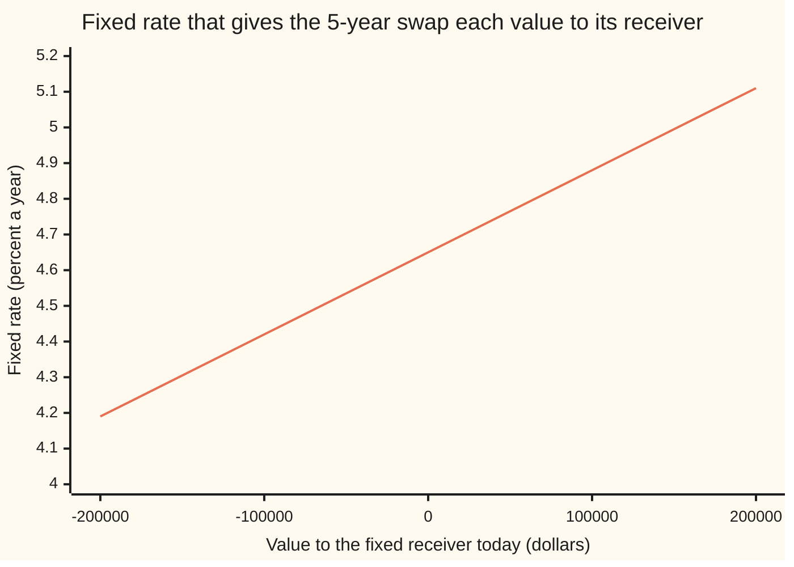
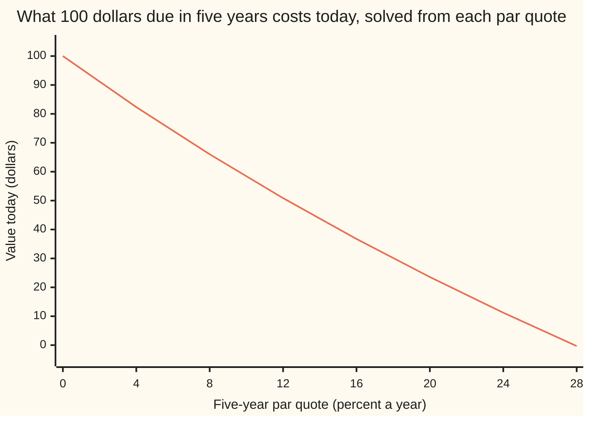

# Solving a swap backwards: the fixed rate from a value, and a curve point from a par quote

[Syllabus](../../../SYLLABUS.md) → [Financial mathematics](../../../SYLLABUS.md#w12) → [Swaps](../../../SYLLABUS.md#w12-s28) → Solving a swap backwards

---

## General Overview

A pension fund agrees a five-year interest rate swap with a dealer on 10,000,000 dollars. Once a year for five years the fund receives a fixed rate on that amount and pays a floating rate, reset each year to the going rate for one-year money. The screen says the fair fixed rate today is 4.65 percent: at that rate the swap is worth nothing to either side ([Interest rate swaps](01-interest-rate-swaps.md)).

The fund wants a bigger coupon, and offers to pay 100,000 dollars up front for it. What fixed rate does 100,000 dollars buy? Every pricer on the shelf runs the other way: rate in, value out. This question runs it backwards, value in, rate out. The answer is 4.8782 percent. Take the 100,000 dollars away and the same line runs back to 4.65 percent, the fair rate.

The 4.65 percent quote hides a second backwards question. The quote is one number, but the swap pays on five dates, so it mixes the prices of dollars due in years one to five. If the first four prices are already known, the quote holds exactly one unknown: the price of a dollar due in five years. Solved backwards, the quote gives up 0.79621728. That one step is how a curve is built, one quote at a time.

**A swap's value is a straight line in its fixed rate, so a value gives back exactly one rate; and a par quote, with the earlier dates already priced, is one equation in one new discount factor, so it gives back exactly one point on the curve.**

**What kind of fact this is:** a method: two exact inversions, each with its existence, uniqueness and edge cases proved on this card in Why it works.

### The picture: the fixed rate that each upfront value buys



One line: the fixed rate that makes the swap worth each value to whoever receives fixed. It is straight, and it crosses zero value at 4.65 percent. Each 100,000 dollars of value moves the rate by 0.2282 of a percentage point, in either direction. Straight means one answer for every value, found in one step.

---

## The formula

Notation first, in words. The swap pays once a year, so its dates are numbered by year: $i$ runs from 1 to 5. $D_i$ is the discount factor for year $i$: what one dollar paid at the end of year $i$ costs today. Each period is one year long, so its accrual fraction $\alpha$, the share of a year a rate is paid for, is 1. The swap's size is its notional $N$, and its fixed rate is $K$. The value $V$ is always the value to whoever receives fixed.

The fixed side pays $N K$ each year. The floating side, discounted, is worth $N(1 - D_5)$ today, whatever the floating rates turn out to be ([Interest rate swaps](01-interest-rate-swaps.md)). So

$$V = N\bigl(K A - (1 - D_5)\bigr), \qquad A = D_1 + D_2 + D_3 + D_4 + D_5$$

$A$ is the **annuity**: what one dollar a year for five years costs today ([The par swap rate](02-par-swap-rate-and-annuity.md)). The par rate $S_5$ is the $K$ that makes $V$ zero, $S_5 = (1 - D_5)/A$. The first inversion solves the line for $K$:

$$K = S_5 + \frac{V}{N A}$$

**Read it aloud:** the fixed rate is the fair rate plus the value spread across the annuity.

The second inversion reads the par equation $S_5 A = 1 - D_5$ with the first four discount factors known. Their sum is $B_5 = D_1 + D_2 + D_3 + D_4$, so $A = B_5 + D_5$. Gather the terms in $D_5$:

$$D_5 = \frac{1 - S_5 B_5}{1 + S_5}$$

**Read it aloud:** one dollar, less what the first four coupons cost, divided by one dollar plus the last coupon.

| Symbol | Plain meaning | In our example | Push it up and the answer… |
| --- | --- | --- | --- |
| $N$ | notional: the amount the rates are paid on | 10,000,000 dollars | a given value moves the rate less |
| $K$ | the swap's fixed rate, per year | 4.8782 percent | the value to the receiver rises |
| $V$ | value today to whoever receives fixed | 100,000 dollars | the fixed rate rises, one for one along the line |
| $D_i$ (so $D_4$, $D_5$) | discount factor: what a dollar due at the end of year $i$ costs today | 0.79621728 for year 5 | the fixed side is worth more |
| $A$ | annuity: $D_1 + \dots + D_5$, the cost today of one dollar a year | 4.38242404 | a given value moves the rate less |
| $S_5$ | the five-year par rate: the $K$ that makes $V$ zero | 4.65 percent | the solved $D_5$ falls |
| $B_5$ | the known part of the annuity, $D_1 + \dots + D_4$ | 3.58620675 | the solved $D_5$ falls |
| $f_i$ | forward rate: the one-year rate the curve implies for year $i$ | $D_{i-1}/D_i - 1$, with $D_0 = 1$ | that year's floating payment rises |
| $\alpha$ | accrual fraction: the share of a year a rate is paid for | 1 | every payment scales up |
| $i$ | the year a payment lands in | 1 to 5 | later payments are discounted more |

**Conventions verified 27 Sep 2026.** Accrual fractions are set to exactly 1 by hand, so every number can be rechecked with a calculator. Real swap legs carry day-count rules that move them by a day or two of interest; those rules are on [Money markets](../02-Curves/03-money-market-instruments-and-sofr.md). The sign convention here, value to the fixed receiver, is a choice; the payer's value is the same number with the sign flipped.

The discount factors are the five-year end of the curve built on [Bootstrapping](../02-Curves/04-bootstrapping-the-discount-curve.md): a one-year deposit at 4.20 percent and par swaps at 4.40, 4.55, 4.62 and 4.65 percent for two to five years.

### When it holds

- **The value is a straight line in the fixed rate.** True for a plain swap: the fixed side is $K$ times a fixed sum. Add an option, a cap on the floating rate or a right to cancel, and the value bends; the one-line inverse is then wrong and a search is needed ([Solving backwards](../07-Greeks%20by%20Numbers%20and%20Calibration/05-root-finding-for-inverses.md)).
- **One curve discounts and forecasts.** The floating side collapses to $N(1 - D_5)$ only when the same curve sets the floating rates and discounts them. With separate curves the line is still straight in $K$, but its intercept changes ([Multi-curve](04-basis-swaps-and-the-multi-curve-framework.md)).
- **The first four discount factors are already known.** Otherwise the five-year quote holds more than one unknown and no single answer exists: two curves can reprice it exactly.
- **The quote sits inside its range.** $D_5$ comes out positive only for $S_5$ between $-100$ percent and $1/B_5$, which is 27.88 percent here. Outside it there is no curve point, only a sign that a quote is wrong.

---

## Why it works

### Step 0: both backwards questions are linear

Solving backwards is usually a search: guess, price, compare, guess again. Here there is no search to do. The swap's value is a sum of payments, each a rate times a discount factor. Hold the curve still and the value is a straight line in the fixed rate. Hold the rate still and the par equation is a straight line in the one unknown discount factor. A straight line with a slope that is not zero crosses any level exactly once, and where it crosses can be written down.

### Step 1: the two sides of the swap, priced once

The fixed side pays $N K$ at the end of each year. Discount each payment and add: $N K (D_1 + \dots + D_5) = N K A$.

The floating side pays the one-year rate that is fixed at the start of year $i$, unknown today. Its value today is that of a payment of $N f_i$, where $f_i = D_{i-1}/D_i - 1$ is the forward rate the curve locks in for that year ([Forward rate agreements](../02-Curves/02-forward-rate-agreements.md)). Discounted, that is worth $N f_i D_i = N(D_{i-1} - D_i)$. Added over five years, the middle terms cancel in pairs and $N(D_0 - D_5) = N(1 - D_5)$ survives. On this curve that is 2,037,827.18 dollars. The code builds all five floating payments one at a time from their forward rates and gets the same number, so the cancelling is checked, not assumed.

The receiver's value is fixed side minus floating side: $V = N K A - N(1 - D_5)$.

### Step 2: the value to the fixed rate, one answer always

Rearranging needs one division, by $N A$. That is legitimate whenever $N A$ is not zero. The notional is positive and every discount factor is positive, so $N A$ is positive: 43,824,240.35 dollars per unit of rate (a rate of 1, that is 100 percent), or 4,382.42 dollars per basis point, a hundredth of a percentage point. That per-basis-point figure is the swap's sensitivity to its own fixed rate ([Swap DV01](03-swap-dv01-and-hedging.md)).

So the three questions every inverse must answer have short answers.

- **Existence.** Every value, positive or negative, has a fixed rate. A line with a positive slope reaches every height.
- **Uniqueness.** Two different rates give two different values, since the slope is never zero. One value, one rate.
- **Edges.** The line has no top or bottom. It does cross zero rate, at a value of $-N(1 - D_5)$, which is $-$2,037,827.18 dollars: any value below that asks for a negative fixed rate. The maths is untroubled; whether a contract can carry a negative coupon is a legal question, not a mathematical one.

For the fund, $V$ = 100,000 dollars. The rate shift is 100,000 ÷ 43,824,240.35 = 0.228184 percent, so $K$ = 4.65 + 0.2282 = 4.8782 percent.

### Step 3: why a search agrees, and why one step is enough

The code does not trust the rearrangement. It also searches: bisection, which halves a range known to hold the answer until the range is too small to matter, on the full payment-by-payment value. It starts from rates of $-100$ and $+100$ percent and lands on the same 4.8782 percent after 51 halvings.

A secant step does it in one. From any two trial rates, 1 and 9 percent, draw the straight line through their two values and read off where it hits 100,000. For a curve that bends, that is only a better guess. For a line, it is the answer, exactly. One step landing where the rearranged formula lands confirms the value really is straight in $K$.

The house swap on this shelf runs through the same machine: 10,000,000 dollars, paying fixed at 4.50 percent. Its value to the payer on this curve is 65,736.36 dollars. Feed that value into the payer's version of the line, $K = S_5 - V/(N A)$, and 4.50 percent comes back.

### Step 4: a par quote to one discount factor

Now hold the rate and free a curve point. The five-year par swap at $S_5$ = 4.65 percent is worth zero, so $S_5 A = 1 - D_5$. With the first four factors known, $A = B_5 + D_5$, and

$$S_5 B_5 + S_5 D_5 = 1 - D_5 \quad\Longrightarrow\quad (1 + S_5)\,D_5 = 1 - S_5 B_5.$$

One division by $1 + S_5$, and $D_5 = (1 - S_5 B_5)/(1 + S_5)$. For the screen's quote: 0.83324139 ÷ 1.0465 = 0.79621728, the same number the bootstrapping card reached.



One line: 100 times the discount factor each quote solves to, with the first four factors held at this curve's values. It falls as the quote rises, and at a quote of 28 percent it has gone below zero, past the edge at 27.88 percent where no curve point exists. At a quote of zero it is exactly 100 dollars: with no coupons, a dollar in five years costs a dollar today.

The slope is $-(1 + B_5)/(1 + S_5)^2$, which is $-4.1877$ here. A one-basis-point rise in the five-year quote lowers $D_5$ by 0.00041877. The code confirms it by bumping the quote up and down one basis point and dividing.

<details>
<summary>Detailed proof: existence, uniqueness and the edges of the curve inversion</summary>

Take $(1 + S_5) D_5 = 1 - S_5 B_5$ with $B_5 > 0$, the sum of four positive prices.

*The bottom edge.* At $S_5 = -1$ the left side is $0 \times D_5 = 0$ and the right side is $1 + B_5 > 0$. No number solves it. Below $-1$ the coefficient is negative and the right side positive, so the only root is negative: not a price.

*Inside the range.* For $S_5 > -1$ the coefficient is positive, so exactly one $D_5$ solves the equation. It is positive exactly when $1 - S_5 B_5 > 0$, that is when $S_5 < 1/B_5$. On this curve $1/B_5$ = 27.88 percent.

*The top edge.* At $S_5 = 1/B_5$ the root is zero: a dollar five years out costing nothing. Above it the root is negative. Neither is a price, so the quote itself is wrong.

*Monotone.* The derivative of $(1 - S_5 B_5)/(1 + S_5)$ in $S_5$ is $\bigl(-B_5(1 + S_5) - (1 - S_5 B_5)\bigr)/(1 + S_5)^2 = -(1 + B_5)/(1 + S_5)^2$, always negative. A higher quote always means a cheaper future dollar, and two different quotes never solve to the same point. Bisection on $D_5$ between 0 and 1 relies on exactly this: the par swap's value to the receiver rises with $D_5$, since the fixed side gains $S_5 D_5$ and the floating side $1 - D_5$ shrinks.

</details>

Another road reaches all five points at once. Write the five quotes as five linear equations in five unknowns and solve them together; ordered shortest first the system is a staircase, and the single-rung formula here is its last step ([Bootstrapping](../02-Curves/04-bootstrapping-the-discount-curve.md)).

---

## Worked numbers, by hand

The fund's swap: 10,000,000 dollars, five years, annual payments, value 100,000 dollars to the fund as fixed receiver.

| Step | Arithmetic | Value |
| --- | --- | --- |
| annuity $A$ | 0.95969290 + 0.91740758 + 0.87478903 + 0.83431725 + 0.79621728 | 4.38242404 |
| floating side per dollar | 1 − 0.79621728 | 0.20378272 |
| par rate $S_5$ | 0.20378272 ÷ 4.38242404 | 4.6500 percent |
| value per unit of rate, $N A$ | 10,000,000 × 4.38242404 | 43,824,240.35 |
| rate shift | 100,000 ÷ 43,824,240.35 | 0.2282 percent |
| **fixed rate $K$** | 4.6500 + 0.2282 | **4.8782 percent** |
| repriced | 10,000,000 × (0.04878184 × 4.38242404 − 0.20378272) | 100,000.00 dollars |

Paying 100,000 dollars today buys the fund 0.2282 of a percentage point more on its fixed coupon, every year for five years.

The curve point from the same quote:

| Step | Arithmetic | Value |
| --- | --- | --- |
| known part $B_5$ | 0.95969290 + 0.91740758 + 0.87478903 + 0.83431725 | 3.58620675 |
| top of the fraction | 1 − 0.0465 × 3.58620675 | 0.83324139 |
| bottom of the fraction | 1 + 0.0465 | 1.0465 |
| **$D_5$** | 0.83324139 ÷ 1.0465 | **0.79621728** |
| range for the quote | from −100 percent to 1 ÷ 3.58620675 | −100 to 27.88 percent |

A dollar due in five years costs a shade under 80 cents this morning, and the 4.65 percent quote is the only quote on the screen that says so.

### What breaks if you drop a piece

The right answers are a fixed rate of 4.8782 percent, repricing at 100,000.00 dollars, and a discount factor of 0.79621728.

| Mistake | Comes out at | What went wrong |
| --- | --- | --- |
| Value spread over 5 payments, not the annuity 4.38 | 4.8500 percent, repricing at 87,648.48 dollars | Later coupons are worth less today; dividing by 5 undercounts the shift |
| Payer's line used for a receiver | 4.4218 percent, repricing at −100,000.00 dollars | Right size, wrong side of par: the fund pays 100,000 and gets a worse coupon |
| Floating side left out | 0.2282 percent, repricing at −1,937,827.18 dollars | Only the shift was solved; the fair rate it shifts from went missing |
| Earlier coupons dropped from the rung | $D_5$ = 0.95556617 | The quote was read as a one-payment deposit; the four earlier coupons carry most of it |
| Par quote read as a yearly-compounded zero rate | $D_5$ = 0.79671655 | Close, and wrong: a par rate averages the curve, a zero rate does not |

The code prints every row.

---

## Code, from first principles, and it actually runs

The code bootstraps the curve from its six quotes, then answers both backwards questions by independent roads. Fixed rate from value: the rearranged line; bisection on the full payment-by-payment value, with every floating payment built from its own forward rate; and one secant step from two arbitrary rates. Curve point from quote: the one-rung formula, and bisection on the par swap's value with the trial discount factor inside every payment. It checks the par rate as the forward rates weighted by discount factors, inverts the house swap back to 4.50 percent, bumps the quote to check the slope, and prints every wrong answer in the table above.

### Python

```python
# Solving a swap backwards -- the check behind the card.  Standard library only.
# Nothing imported knows an answer: the curve is bootstrapped here, the floating leg is
# built payment by payment from forward rates, and bisection is written out.  Case one
# takes a value of 100,000 back to a fixed rate; case two takes the 4.65 percent
# five-year par quote back to the five-year discount factor.
N = 10_000_000.0                                   # notional, dollars
PAR = {2: 0.0440, 3: 0.0455, 4: 0.0462, 5: 0.0465} # the screen's par swap quotes
YEARS = (1, 2, 3, 4, 5)                            # annual payments, accrual 1 each

def bootstrap(par):                                # the rung formula, shortest first
    D = {0: 1.0, 1: 1.0 / (1.0 + 1.0 * 0.042)}     # one-year deposit at 4.20 percent
    for n in (2, 3, 4, 5):
        B = sum(D[i] for i in range(1, n))
        D[n] = (1.0 - par[n] * B) / (1.0 + par[n])
    return D

def legs(D, K):                                    # payment by payment, no telescoping
    fixed = sum(N * K * D[i] for i in YEARS)
    fwd = [D[i - 1] / D[i] - 1.0 for i in YEARS]   # forward rate for each year
    floating = sum(N * f * D[i] for f, i in zip(fwd, YEARS))
    return fixed, floating, fwd

def receiver(D, K):                                # value to whoever receives fixed
    fixed, floating, _ = legs(D, K)
    return fixed - floating

def bisect(g, lo, hi, tol=1e-15):                  # g(lo) < 0 < g(hi), g rising
    steps = 0
    while hi - lo > tol and steps < 200:
        mid = 0.5 * (lo + hi); steps += 1
        if g(mid) < 0.0: lo = mid
        else: hi = mid
    return 0.5 * (lo + hi), steps

D = bootstrap(PAR)
A = sum(D[i] for i in YEARS)                       # annuity: one dollar a year, today
V = 100_000.0                                      # target value to the fixed receiver
# ---- case one: value back to a fixed rate ----
K1 = (V / N + 1.0 - D[5]) / A                      # road 1: the line, solved by hand
K2, it = bisect(lambda k: receiver(D, k) - V, -1.0, 1.0)   # road 2: search on full legs
k0, k1 = 0.01, 0.09                                # road 3: one secant step from anywhere
K3 = k0 + (V - receiver(D, k0)) * (k1 - k0) / (receiver(D, k1) - receiver(D, k0))
K0 = (1.0 - D[5]) / A                              # the same line at value zero: par
_, fl, fwd = legs(D, 0.0)
S_fwd = sum(f * D[i] for f, i in zip(fwd, YEARS)) / A      # par as weighted forwards
V_house = -receiver(D, 0.045)                      # house swap: pay 4.50 percent fixed
K_house = K0 - V_house / (N * A)                   # payer's inverse, back to 4.50
# ---- case two: a par quote back to one discount factor ----
S5 = PAR[5]
B5 = sum(D[i] for i in (1, 2, 3, 4))
D5_1 = (1.0 - S5 * B5) / (1.0 + S5)                # road 1: the rung
def par_value(d5):                                 # a new 5y swap at S5, trial D5
    Dt = dict(D); Dt[5] = d5
    return receiver(Dt, S5) / N
D5_2, it2 = bisect(par_value, 1e-9, 1.0)           # road 2: search, legs from forwards
h = 1e-4
slope_fd = ((1 - (S5 + h) * B5) / (1 + S5 + h) - (1 - (S5 - h) * B5) / (1 + S5 - h)) / (2 * h)
slope_an = -(1.0 + B5) / (1.0 + S5) ** 2
# ---- what breaks ----
w_undisc = S5 + V / (N * 5.0)                      # annuity read as 5 payments
w_sign = K0 - V / (N * A)                          # payer's inverse used for a receiver
w_nofloat = V / (N * A)                            # floating leg forgotten
w_nocoup = 1.0 / (1.0 + S5)                        # earlier coupons forgotten
w_zero = 1.0 / (1.0 + S5) ** 5                     # par read as an annual zero rate

rows = [
    ("D1", D[1]), ("D2", D[2]), ("D3", D[3]), ("D4", D[4]), ("D5", D[5]),
    ("annuity A = D1+...+D5", A), ("N x A, dollars per unit rate", N * A),
    ("floating leg per dollar, 1 - D5", 1.0 - D[5]), ("floating leg, from forwards", fl), ("floating leg, N(1 - D5)", N * (1 - D[5])),
    ("par rate, (1 - D5)/A", K0), ("par rate, weighted forwards", S_fwd),
    ("1 fixed rate, the line", K1), ("2 fixed rate, bisection", K2),
    ("  bisection halvings", it), ("3 fixed rate, one secant step", K3),
    ("  value at that rate", receiver(D, K1)),
    ("  rate shift, V/(N A)", V / (N * A)), ("  value per 1bp of fixed rate", N * A * 1e-4),
    ("  value where fixed rate is 0", -N * (1 - D[5])),
    ("house: payer value at 4.50%", V_house), ("house: rate from that value", K_house),
    ("4 D5, the rung", D5_1), ("5 D5, bisection", D5_2), ("  bisection halvings", it2),
    ("  known part B5 = D1+...+D4", B5), ("  1 - S5 x B5", 1.0 - S5 * B5),
    ("  top edge of quote, 1/B5", 1 / B5), ("  bottom edge of quote, -1", -1.0),
    ("  dD5/dS by bump", slope_fd), ("  dD5/dS = -(1+B5)/(1+S)^2", slope_an),
    ("  D5 move for +1bp quote", slope_an * 1e-4),
    ("wrong: annuity read as 5", w_undisc), ("  reprices at", receiver(D, w_undisc)),
    ("wrong: payer sign", w_sign), ("  reprices at", receiver(D, w_sign)),
    ("wrong: floating leg dropped", w_nofloat), ("  reprices at", receiver(D, w_nofloat)),
    ("wrong: D5 without coupons", w_nocoup), ("wrong: par as annual zero", w_zero),
    ("try: 20m notional, rate", K0 + V / (2 * N * A)),
    ("try: 5y quote 4.66%, D5", (1 - 0.0466 * B5) / (1.0466)),
]
for name, v in rows:
    print(f"{name:<32} {v:>18d}" if "halvings" in name else f"{name:<32} {v:>18.8f}")
print()
print("chart, value target        " + " ".join(f"{t:>8.0f}" for t in (-200e3, -100e3, 0, 100e3, 200e3)))
print("chart, fixed rate %        " + " ".join(f"{100 * (K0 + t / (N * A)):>8.2f}" for t in (-200e3, -100e3, 0, 100e3, 200e3)))
qs = (0.0, 0.04, 0.08, 0.12, 0.16, 0.20, 0.24, 0.28)
print("chart, 5y quote %          " + " ".join(f"{100 * s:>7.0f}" for s in qs))
print("chart, $100 due in 5y      " + " ".join(f"{100 * (1 - s * B5) / (1 + s):>7.2f}" for s in qs))

assert abs(K2 - K1) < 1e-12, "bisection on full legs must land on the line"
assert abs(K3 - K1) < 1e-12, "a linear value: one secant step must land exactly"
assert abs(S_fwd - PAR[5]) < 1e-12, "weighted forwards must give back the 5y quote"
assert abs(D5_2 - D5_1) < 1e-12, "bisection on the par swap must land on the rung"
assert abs(D[5] - 0.79621728) < 5e-9, "five-year price from the bootstrapping card"
assert abs(K_house - 0.045) < 1e-12, "the house swap's value must invert to 4.50%"
assert abs(slope_fd - slope_an) < 1e-6, "bumped slope vs the derivative"
print("ALL CHECKS PASS")
```

**Ran 2026-09-27 on macOS, Python 3.14.6, standard library only. All checks passed. Output, pasted from the run:**

```
D1                                       0.95969290
D2                                       0.91740758
D3                                       0.87478903
D4                                       0.83431725
D5                                       0.79621728
annuity A = D1+...+D5                    4.38242404
N x A, dollars per unit rate      43824240.35187322
floating leg per dollar, 1 - D5          0.20378272
floating leg, from forwards        2037827.17636210
floating leg, N(1 - D5)            2037827.17636210
par rate, (1 - D5)/A                     0.04650000
par rate, weighted forwards              0.04650000
1 fixed rate, the line                   0.04878184
2 fixed rate, bisection                  0.04878184
  bisection halvings                             51
3 fixed rate, one secant step            0.04878184
  value at that rate                100000.00000000
  rate shift, V/(N A)                    0.00228184
  value per 1bp of fixed rate         4382.42403519
  value where fixed rate is 0     -2037827.17636210
house: payer value at 4.50%          65736.36052781
house: rate from that value              0.04500000
4 D5, the rung                           0.79621728
5 D5, bisection                          0.79621728
  bisection halvings                             50
  known part B5 = D1+...+D4              3.58620675
  1 - S5 x B5                            0.83324139
  top edge of quote, 1/B5                0.27884617
  bottom edge of quote, -1              -1.00000000
  dD5/dS by bump                        -4.18769620
  dD5/dS = -(1+B5)/(1+S)^2              -4.18769616
  D5 move for +1bp quote                -0.00041877
wrong: annuity read as 5                 0.04850000
  reprices at                        87648.48070375
wrong: payer sign                        0.04421816
  reprices at                      -100000.00000000
wrong: floating leg dropped              0.00228184
  reprices at                     -1937827.17636210
wrong: D5 without coupons                0.95556617
wrong: par as annual zero                0.79671655
try: 20m notional, rate                  0.04764092
try: 5y quote 4.66%, D5                  0.79579855

chart, value target         -200000  -100000        0   100000   200000
chart, fixed rate %            4.19     4.42     4.65     4.88     5.11
chart, 5y quote %                0       4       8      12      16      20      24      28
chart, $100 due in 5y       100.00   82.36   66.03   50.86   36.74   23.56   11.23   -0.32
ALL CHECKS PASS
```

Three roads to the fixed rate agree to eight decimals, and the secant step needs one move where bisection needs 51. Two roads to the discount factor agree, and both land on the bootstrapping card's 0.79621728.

### Rust

Same curve, same roads, same labels. No crates.

```rust
// Solving a swap backwards -- the same check as swap_inverses_rate_and_curve_from_price_check.py.
// Standard library only, no crates.  The curve is bootstrapped here, the floating leg is
// built payment by payment from forward rates, and bisection is written out.
// Compile: rustc --edition 2021 -O swap_inverses_rate_and_curve_from_price_check.rs
const N: f64 = 10_000_000.0;                      // notional, dollars
const PAR: [f64; 6] = [0.0, 0.0, 0.0440, 0.0455, 0.0462, 0.0465];   // par quotes by year

fn bootstrap() -> [f64; 6] {                      // the rung formula, shortest first
    let mut d = [0.0; 6];
    d[0] = 1.0;
    d[1] = 1.0 / (1.0 + 1.0 * 0.042);             // one-year deposit at 4.20 percent
    for n in 2..=5 {
        let b: f64 = (1..n).map(|i| d[i]).sum();
        d[n] = (1.0 - PAR[n] * b) / (1.0 + PAR[n]);
    }
    d
}

fn legs(d: &[f64; 6], k: f64) -> (f64, f64, Vec<f64>) {   // payment by payment
    let fixed: f64 = (1..=5).map(|i| N * k * d[i]).sum();
    let fwd: Vec<f64> = (1..=5).map(|i| d[i - 1] / d[i] - 1.0).collect();
    let floating: f64 = (1..=5).map(|i| N * fwd[i - 1] * d[i]).sum();
    (fixed, floating, fwd)
}

fn receiver(d: &[f64; 6], k: f64) -> f64 {        // value to whoever receives fixed
    let (fixed, floating, _) = legs(d, k);
    fixed - floating
}

fn bisect<G: Fn(f64) -> f64>(g: G, mut lo: f64, mut hi: f64) -> (f64, u32) {
    let mut steps = 0;                            // g(lo) < 0 < g(hi), g rising
    while hi - lo > 1e-15 && steps < 200 {
        let mid = 0.5 * (lo + hi);
        steps += 1;
        if g(mid) < 0.0 { lo = mid } else { hi = mid }
    }
    (0.5 * (lo + hi), steps)
}

fn main() {
    let d = bootstrap();
    let a: f64 = (1..=5).map(|i| d[i]).sum();     // annuity: one dollar a year, today
    let v = 100_000.0;                            // target value to the fixed receiver
    // ---- case one: value back to a fixed rate ----
    let k1 = (v / N + 1.0 - d[5]) / a;            // road 1: the line, solved by hand
    let (k2, it) = bisect(|k| receiver(&d, k) - v, -1.0, 1.0);    // road 2
    let (k0s, k1s) = (0.01, 0.09);                // road 3: one secant step from anywhere
    let k3 = k0s + (v - receiver(&d, k0s)) * (k1s - k0s) / (receiver(&d, k1s) - receiver(&d, k0s));
    let k0 = (1.0 - d[5]) / a;                    // the same line at value zero: par
    let (_, fl, fwd) = legs(&d, 0.0);
    let s_fwd: f64 = (1..=5).map(|i| fwd[i - 1] * d[i]).sum::<f64>() / a;
    let v_house = -receiver(&d, 0.045);           // house swap: pay 4.50 percent fixed
    let k_house = k0 - v_house / (N * a);
    // ---- case two: a par quote back to one discount factor ----
    let s5 = PAR[5];
    let b5: f64 = (1..=4).map(|i| d[i]).sum();
    let d5_1 = (1.0 - s5 * b5) / (1.0 + s5);      // road 1: the rung
    let par_value = |d5: f64| { let mut dt = d; dt[5] = d5; receiver(&dt, s5) / N };
    let (d5_2, it2) = bisect(par_value, 1e-9, 1.0);   // road 2: search, legs from forwards
    let h = 1e-4;
    let rung = |s: f64| (1.0 - s * b5) / (1.0 + s);
    let slope_fd = (rung(s5 + h) - rung(s5 - h)) / (2.0 * h);
    let slope_an = -(1.0 + b5) / (1.0 + s5).powi(2);
    // ---- what breaks ----
    let w_undisc = s5 + v / (N * 5.0);
    let w_sign = k0 - v / (N * a);
    let w_nofloat = v / (N * a);
    let w_nocoup = 1.0 / (1.0 + s5);
    let w_zero = 1.0 / (1.0 + s5).powi(5);

    let rows: Vec<(&str, f64)> = vec![
        ("D1", d[1]), ("D2", d[2]), ("D3", d[3]), ("D4", d[4]), ("D5", d[5]),
        ("annuity A = D1+...+D5", a), ("N x A, dollars per unit rate", N * a),
        ("floating leg per dollar, 1 - D5", 1.0 - d[5]), ("floating leg, from forwards", fl), ("floating leg, N(1 - D5)", N * (1.0 - d[5])),
        ("par rate, (1 - D5)/A", k0), ("par rate, weighted forwards", s_fwd),
        ("1 fixed rate, the line", k1), ("2 fixed rate, bisection", k2),
        ("  bisection halvings", it as f64), ("3 fixed rate, one secant step", k3),
        ("  value at that rate", receiver(&d, k1)),
        ("  rate shift, V/(N A)", v / (N * a)), ("  value per 1bp of fixed rate", N * a * 1e-4),
        ("  value where fixed rate is 0", -N * (1.0 - d[5])),
        ("house: payer value at 4.50%", v_house), ("house: rate from that value", k_house),
        ("4 D5, the rung", d5_1), ("5 D5, bisection", d5_2), ("  bisection halvings", it2 as f64),
        ("  known part B5 = D1+...+D4", b5), ("  1 - S5 x B5", 1.0 - s5 * b5),
        ("  top edge of quote, 1/B5", 1.0 / b5), ("  bottom edge of quote, -1", -1.0),
        ("  dD5/dS by bump", slope_fd), ("  dD5/dS = -(1+B5)/(1+S)^2", slope_an),
        ("  D5 move for +1bp quote", slope_an * 1e-4),
        ("wrong: annuity read as 5", w_undisc), ("  reprices at", receiver(&d, w_undisc)),
        ("wrong: payer sign", w_sign), ("  reprices at", receiver(&d, w_sign)),
        ("wrong: floating leg dropped", w_nofloat), ("  reprices at", receiver(&d, w_nofloat)),
        ("wrong: D5 without coupons", w_nocoup), ("wrong: par as annual zero", w_zero),
        ("try: 20m notional, rate", k0 + v / (2.0 * N * a)),
        ("try: 5y quote 4.66%, D5", rung(0.0466)),
    ];
    for (name, x) in &rows {
        if name.contains("halvings") { println!("{:<32} {:>18}", name, *x as u32); }
        else { println!("{:<32} {:>18.8}", name, x); }
    }
    println!();
    let ts = [-200e3, -100e3, 0.0, 100e3, 200e3];
    let row = |f: &dyn Fn(f64) -> String, xs: &[f64]| xs.iter().map(|x| f(*x)).collect::<Vec<_>>().join(" ");
    println!("chart, value target        {}", row(&|t| format!("{:>8.0}", t), &ts));
    println!("chart, fixed rate %        {}", row(&|t| format!("{:>8.2}", 100.0 * (k0 + t / (N * a))), &ts));
    let qs = [0.0, 0.04, 0.08, 0.12, 0.16, 0.20, 0.24, 0.28];
    println!("chart, 5y quote %          {}", row(&|s| format!("{:>7.0}", 100.0 * s), &qs));
    println!("chart, $100 due in 5y      {}", row(&|s| format!("{:>7.2}", 100.0 * rung(s)), &qs));

    assert!((k2 - k1).abs() < 1e-12, "bisection on full legs must land on the line");
    assert!((k3 - k1).abs() < 1e-12, "a linear value: one secant step must land exactly");
    assert!((s_fwd - PAR[5]).abs() < 1e-12, "weighted forwards must give back the 5y quote");
    assert!((d5_2 - d5_1).abs() < 1e-12, "bisection on the par swap must land on the rung");
    assert!((d[5] - 0.79621728).abs() < 5e-9, "five-year price from the bootstrapping card");
    assert!((k_house - 0.045).abs() < 1e-12, "the house swap's value must invert to 4.50%");
    assert!((slope_fd - slope_an).abs() < 1e-6, "bumped slope vs the derivative");
    println!("ALL CHECKS PASS");
}
```

**Ran 2026-09-27 on macOS, rustc 1.98.1, no crates. All checks passed. Output, pasted from the run:**

```
D1                                       0.95969290
D2                                       0.91740758
D3                                       0.87478903
D4                                       0.83431725
D5                                       0.79621728
annuity A = D1+...+D5                    4.38242404
N x A, dollars per unit rate      43824240.35187322
floating leg per dollar, 1 - D5          0.20378272
floating leg, from forwards        2037827.17636210
floating leg, N(1 - D5)            2037827.17636210
par rate, (1 - D5)/A                     0.04650000
par rate, weighted forwards              0.04650000
1 fixed rate, the line                   0.04878184
2 fixed rate, bisection                  0.04878184
  bisection halvings                             51
3 fixed rate, one secant step            0.04878184
  value at that rate                100000.00000000
  rate shift, V/(N A)                    0.00228184
  value per 1bp of fixed rate         4382.42403519
  value where fixed rate is 0     -2037827.17636210
house: payer value at 4.50%          65736.36052781
house: rate from that value              0.04500000
4 D5, the rung                           0.79621728
5 D5, bisection                          0.79621728
  bisection halvings                             50
  known part B5 = D1+...+D4              3.58620675
  1 - S5 x B5                            0.83324139
  top edge of quote, 1/B5                0.27884617
  bottom edge of quote, -1              -1.00000000
  dD5/dS by bump                        -4.18769620
  dD5/dS = -(1+B5)/(1+S)^2              -4.18769616
  D5 move for +1bp quote                -0.00041877
wrong: annuity read as 5                 0.04850000
  reprices at                        87648.48070375
wrong: payer sign                        0.04421816
  reprices at                      -100000.00000000
wrong: floating leg dropped              0.00228184
  reprices at                     -1937827.17636210
wrong: D5 without coupons                0.95556617
wrong: par as annual zero                0.79671655
try: 20m notional, rate                  0.04764092
try: 5y quote 4.66%, D5                  0.79579855

chart, value target         -200000  -100000        0   100000   200000
chart, fixed rate %            4.19     4.42     4.65     4.88     5.11
chart, 5y quote %                0       4       8      12      16      20      24      28
chart, $100 due in 5y       100.00   82.36   66.03   50.86   36.74   23.56   11.23   -0.32
ALL CHECKS PASS
```

The two outputs agree line for line.

> [!TIP]
> **Try changing**
> Guess the direction first. Then run it.
> - **Ask for no upfront.** Set `V = 0`. Every road returns 4.6500 percent: the par rate is the inverse at value zero.
> - **Double the swap.** Set `N = 20_000_000`. The same 100,000 dollars now moves the rate half as far: 4.7641 percent.
> - **Nudge the quote.** Set `PAR[5]` to 0.0466. $D_5$ falls to 0.79579855, down 0.00041873, within a hair of the slope's forecast of 0.00041877; the gap is the curve's slight bend.
> - **Ask for a negative coupon.** Set `V` to −2,037,827.18. The fixed rate comes back as zero to eight decimals: the edge where the whole floating side is given away for nothing.

---

## The usual mistake

> [!warning]
> **Searching when the answer is a line.** A swap's value in its own fixed rate is straight, so its inverse is one division. Reaching for a general root finder hides that fact, costs 51 pricings instead of one, and makes a failed search look like a hard market instead of a broken input. Keep the search as the check, not the method.
>
> - **Dividing by the number of payments.** The value spreads over the annuity, 4.38, not over 5. The fixed rate comes out at 4.8500 percent and the swap reprices at 87,648.48 dollars instead of 100,000.
> - **Losing track of whose value it is.** A value quoted to the payer, used in the receiver's line, gives 4.4218 percent: the right distance from par on the wrong side.
> - **Solving a long quote before the short ones.** With $D_4$ unknown the five-year quote holds two unknowns; any single number solved from it is a guess.
> - **Trusting a curve point outside the range.** A five-year quote above 27.88 percent on this curve solves to a negative price. The formula does not stop; the check on the range must.

---

## Where you meet it in real life

- **Off-market swaps.** A client pays or receives cash up front for a coupon away from par, to match a bond it holds or a loan it owes. Setting that coupon is this card's first inverse.
- **Unwinding a swap.** Ending a swap early means paying its value today. Quoting the unwind as a rate, so many basis points above or below par, is the same line read the other way.
- **Checking a counterparty's mark.** When two firms disagree about a swap's value for collateral, turning each value into an implied rate shows at once whether they disagree about the curve or about the trade ([Collateral discounting](05-ois-discounting-and-collateral.md)).
- **Building the curve every morning.** Each par quote gives up one discount factor, exactly as in Step 4, and a desk rebuilds its curve this way through the trading day ([Bootstrapping](../02-Curves/04-bootstrapping-the-discount-curve.md)).
- **Other currencies and other floating rates.** The same two inversions run on each curve of a multi-curve set-up and on cross-currency swaps, with the basis spread as one more unknown to solve for ([Cross-currency swaps](06-cross-currency-swaps-and-basis.md)).

> **Say it back**
> A plain swap's value is a straight line in its fixed rate, with slope the notional times the annuity. So a value turns back into exactly one fixed rate: the par rate plus the value divided by that slope, 4.8782 percent for 100,000 dollars on this swap. A par quote, with the earlier discount factors known, is one linear equation in the next discount factor, so it turns back into exactly one curve point: 0.79621728 from 4.65 percent. The first inverse works for every value; the second needs the quote between minus 100 percent and 27.88 percent. A search agrees with both, which is the check, not the method.

---

## What this builds on

- [The par swap rate](02-par-swap-rate-and-annuity.md): the annuity and the par rate, the two numbers both inversions are built from.
- [Solving backwards](../07-Greeks%20by%20Numbers%20and%20Calibration/05-root-finding-for-inverses.md): bisection and the secant idea used here as checks, and the existence-uniqueness-edges discipline every inverse follows.

## Where this goes next

- [Swaptions](../29-Caps%2C%20Floors%20and%20Swaptions/04-swaptions-payer-and-receiver.md): an option to enter this swap later; its value is no longer a line in the fixed rate.
- [Solving rate options backwards](../29-Caps%2C%20Floors%20and%20Swaptions/09-rate-option-inverses.md): running rate options backwards, where the straight line gives way to a search.

Both inversions here were exact because a plain swap is linear; the question left open is what to solve when an option bends the value, and the swaption cards answer it.

---

## Sources

Verified 28 Sep 2026: every link below resolves to the publisher's page.

- Hull, John C. *Options, Futures, and Other Derivatives*, 11th ed. Pearson. [Publisher page](https://www.pearson.com/en-us/subject-catalog/p/options-futures-and-other-derivatives/P200000005938). Swap valuation as fixed and floating legs, and the par swap rate, in the chapter on swaps.
- Brigo, Damiano, and Fabio Mercurio. *Interest Rate Models — Theory and Practice*, 2nd ed. Springer, 2006. [doi:10.1007/978-3-540-34604-3](https://doi.org/10.1007/978-3-540-34604-3). The forward swap rate as the floating side over the annuity, set out among the book's opening definitions.
- Hagan, Patrick S., and Graeme West. "Interpolation Methods for Curve Construction." *Applied Mathematical Finance* 13, no. 2 (2006): 89–129. [doi:10.1080/13504860500396032](https://doi.org/10.1080/13504860500396032). Bootstrapping a discount curve from swap quotes, and what happens between the quoted dates.
- Ametrano, Ferdinando M., and Marco Bianchetti. "Everything You Always Wanted to Know about Multiple Interest Rate Curve Bootstrapping but Were Afraid to Ask." SSRN, 2013. [doi:10.2139/ssrn.2219548](https://doi.org/10.2139/ssrn.2219548). The same one-quote-one-unknown step run on each curve of a multi-curve set-up.
