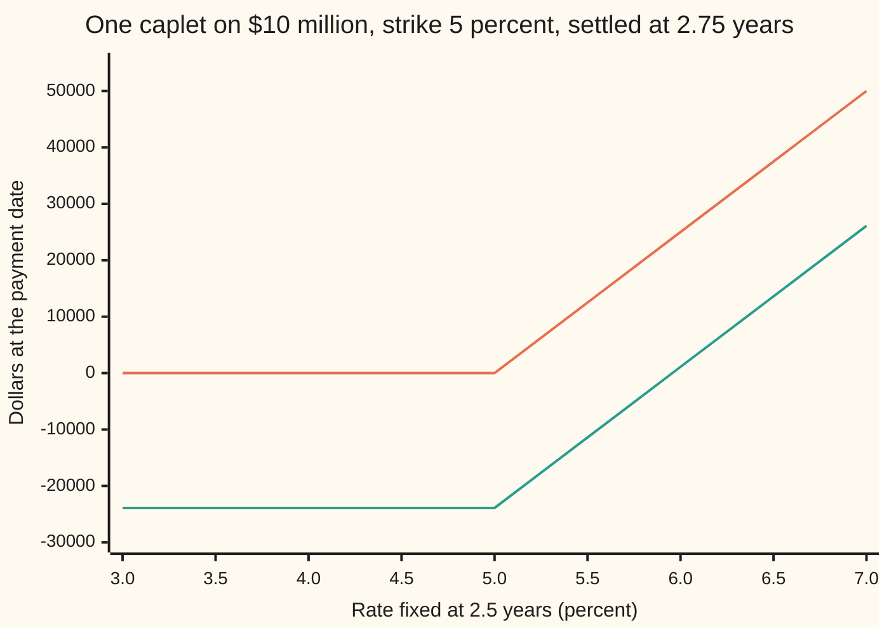
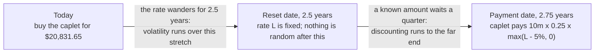

# Caplets and floorlets: a call or put on one forward rate, priced with Black-76 under the forward measure

[Syllabus](../../../SYLLABUS.md) → [Financial mathematics](../README.md) → [Caps, Floors and Swaptions](../README.md#s29) → Caplets and floorlets

---

## General Overview

A company has borrowed \$10 million at a floating rate. Every three months the loan looks up the market's 3-month interest rate and charges it for the coming quarter. One quarter worries the treasurer: the one that starts two and a half years from now. Its rate will be looked up on that day and the interest paid three months later, at 2.75 years. Nobody knows what the rate will be.

So the company buys insurance on that one quarter. If the rate is fixed above 5 percent, the insurer pays the excess on \$10 million for a quarter of a year. Fixed at 7 percent, the policy pays \$50,000. Fixed at 4 percent, it pays nothing. From here on the policy has its market name: a **caplet**, one period of an interest-rate cap, with **strike** 5 percent (the level above which it pays). The mirror policy, paying when the rate fixes *below* the strike, is a **floorlet**; a lender buys it.

The caplet costs **\$20,831.65 today, 0.21 percent of the notional** (the loan size the payment is measured on, never itself exchanged). The number comes from Black's 1976 formula for options on forwards, applied to the forward interest rate for that quarter. Two things make that legitimate. First, the forward rate is read off today's bond prices, not forecast. Second, when the caplet is priced in units of the bond that pays on the payment date, the forward rate is a fair bet: its average is itself. The payment date then does double duty. Volatility runs to the day the rate is fixed; discounting runs to the day the money moves.

**A caplet is a call option on one forward interest rate, paid at the end of its period; priced in units of the bond maturing on that payment date, the forward rate averages to itself, so Black's formula applies with volatility clocked to the fixing date and discounting to the payment date.**

**What kind of fact this is:** a model: the rate is *taken* to be lognormal with a stated volatility, a market convention rather than a law; inside it, a theorem: that the payment-date bond makes the forward rate a fair bet, proved on this card in Why it works.

### The picture: what the caplet pays, and what the buyer keeps



The upper line (orange) is the payment: nothing up to 5 percent, then \$12,500 for every half point above. The lower line (green) is the buyer's profit once the \$20,831.65 premium is grown to the payment date, where it is worth \$23,902. The profit crosses zero at a fixing of 5.9561 percent, the breakeven.

---

## The formula

Notation first, in words. $M$ is the notional in dollars. $\tau$ (tau) is the length of the interest period as a fraction of a year. $T_1$ is the **reset date**, when the rate is fixed; $T_2$ is the **payment date**, when the interest is paid. $L$ is the rate that will actually be fixed at $T_1$. $D(t)$ is the **discount factor**: today's price of a bond paying \$1 at a time t years away. $F$ is the **forward rate** for the period, read from two discount factors. $N(x)$ is the bell-curve area to the left of $x$.

$$\text{Caplet} = M\,\tau\,D(T_2)\,\bigl[\,F\,N(d_1) - K\,N(d_2)\,\bigr], \qquad \text{Floorlet} = M\,\tau\,D(T_2)\,\bigl[\,K\,N(-d_2) - F\,N(-d_1)\,\bigr]$$

**Read it aloud:** the forward rate the holder might collect, minus the strike given up, each weighted by its own chance, turned into dollars by the notional and the period's length, and discounted from the day the money moves.

$$d_1 = \frac{\ln(F/K) + \tfrac12\sigma^2 T_1}{\sigma\sqrt{T_1}}, \qquad d_2 = d_1 - \sigma\sqrt{T_1}, \qquad F = \frac{1}{\tau}\left(\frac{D(T_1)}{D(T_2)} - 1\right)$$

$d_1$ and $d_2$ are the distance from the forward to the strike, in standard deviations of the log rate up to the reset date; they are one such standard deviation apart. The forward rate is the simple interest rate that turns \$1 at the reset date into its value at the payment date.

| Symbol | Plain meaning | In our example | Push it up and the caplet… |
| --- | --- | --- | --- |
| $M$ | notional: the loan size the payment is measured on | \$10,000,000 | rises in proportion |
| $\tau$ | accrual: the period's length as a fraction of a year | 0.25 | rises in proportion: the excess is paid for longer |
| $T_1$ | reset date: the rate is fixed, the option expires | 2.5 years | rises: more time for the rate to wander |
| $T_2$ | payment date: the interest changes hands | 2.75 years | falls: the same dollars arrive later |
| $L$ | the rate fixed at $T_1$, unknown today | — | it is what the payoff depends on |
| $F$ | forward rate for the quarter from 2.5 to 2.75 years | 5.031381% | rises: more likely to clear the strike |
| $K$ | strike: the rate above which the caplet pays | 5% | falls: less is covered |
| $\sigma$ | volatility: yearly spread of the log of the rate | 30% | rises: the payoff cannot go below zero, so spread only helps |
| $D(t)$, $r$ | discount factor $e^{-rt}$ on a flat curve at rate $r$, continuously compounded | $r$ = 5%; $D(T_1)$ = 0.882497, $D(T_2)$ = 0.871534 | rises: less discounting |
| $d_1$, $d_2$ | standardised distances of forward from strike | 0.250361 and −0.223981 | — |
| $N(x)$ | normal CDF: chance a standard bell-curve draw lands below $x$ | $N(d_1)$ = 0.598846, $N(d_2)$ = 0.411386 | — |
| $X$ | price at the reset date of \$1 paid at the payment date, $1/(1+\tau L)$ | unknown today | — |

### When it holds

- **The rate is lognormal around its forward, with one volatility.** The market quotes each strike with its own volatility (a smile). With a single $\sigma$ the price is right at the quoted strike and off elsewhere, by roughly vega (the price change per point of volatility, in The Greeks below) times the volatility gap.
- **The rate is positive.** $\ln(F/K)$ needs a positive forward and strike. With rates near or below zero the market prices caplets with a shifted or a normal model instead ([Rate volatilities](06-normal-and-shifted-volatilities-for-rates.md)).
- **The rate is fixed at the start of the period and paid at the end.** That is the term-rate convention of LIBOR, the London interbank rate retired in 2023. Rates compounded from overnight fixings (SOFR, SONIA) are only known at the period's end, so the uncertainty runs past $T_1$ into the period; Lyashenko and Mercurio extend the formula for that case.
- **One curve gives both the forward and the discount.** Since 2008 the forward comes from a projection curve for the index and the discount factor from the overnight curve. The formula survives with each input read from its own curve; reading both from one curve misprices by the spread between them.
- **The seller pays.** No allowance is made for the insurer defaulting.

**Conventions verified 2026-09-28:** the example uses $\tau$ = 0.25 exactly and a flat continuously compounded curve. A real contract takes $\tau$ from its day count (actual days over 360 for dollar rates) and its discount factors from the overnight curve.

---

## Why it works

### Step 0: price the caplet in units of the bond that pays when the caplet pays

A caplet's payoff lands on the payment date. Count its value not in dollars but in units of the bond that pays \$1 on that same date. In those units the payment needs no discounting at all: a dollar on the payment date *is* one unit. What is left is an average of the payoff, and the one fact that makes Black's formula usable is that, under the weights these units impose, the forward rate averages to itself. That is the **forward measure**: the set of odds the payment-date bond defines ([Changing the unit of account](../05-Black-Scholes%20from%20the%20Ground%20Up/05-change-of-numeraire-in-pricing.md)).

### Step 1: the forward rate is a ratio of two bond prices

Buy a bond paying \$1 at 2.5 years, for $D(T_1)$ = 0.882497. On that date, lend the \$1 for a quarter at whatever rate is fixed; at 2.75 years it returns $1 + \tau L$. Now fix the rate in advance instead: an agreement to lend at rate $F$ costs nothing to enter only if $D(T_1) = (1 + \tau F)\,D(T_2)$. Solve:

$$F = \frac{1}{0.25}\left(\frac{0.882497}{0.871534} - 1\right) = 5.031381\%.$$

That contract, a **forward rate agreement** (FRA), is worth nothing today. The forward is not a forecast; it is arithmetic on two prices. It is also not the curve's 5 percent: the curve compounds continuously, and the forward is simple interest over one quarter.

### Step 2: two dates, two jobs



Once the rate is fixed, the amount owed is known. Nothing random happens between reset and payment. So the spread of outcomes is clocked to $T_1$: the log rate has $\sigma\sqrt{T_1}$ = 0.474342 of standard deviation. The money arrives at $T_2$, so the discount is $D(T_2)$. On the reset date, the payment is worth $X\,\tau\,(L - K)^+$ per dollar of notional, where $X = 1/(1+\tau L)$ is the price then of \$1 at the payment date and $(\,\cdot\,)^+$ means "the amount if positive, else zero".

### Step 3: which odds make the forward a fair bet? A two-state test

Shrink the future to two outcomes at the reset date: the rate fixes at 8 percent or at 3 percent. A **state price** is today's cost of \$1 delivered at the reset date in one outcome only. Two facts pin both state prices. Together they must cost $D(T_1)$. And a payment-date bond, worth $X$ in each outcome at the reset date, must cost $D(T_2)$. Solving gives 0.361165 for the 8 percent outcome and 0.521332 for the 3 percent one.

Now average the rate two ways.

- **With odds proportional to the state prices** (the reset-date bond's odds): the average rate is 5.046269 percent. Not the forward.
- **With odds proportional to state price times $X$** (the payment-date bond's odds): the average is 5.031381 percent. Exactly $F$.

The caplet in this toy world pays only in the 8 percent outcome. Its true price, each state price times the payment's value $X$ there, is \$26,556.27. Discount to the payment date and average with the payment-date odds: the same \$26,556.27. Use the payment-date discount with the reset-date odds and it comes out at \$26,750.91: too dear. The odds and the discount date belong together.

<details>
<summary>Detailed proof: under the payment-date bond's odds, the forward is a fair bet in any model</summary>

Let the outcomes at the reset date be numbered by an index s, as many as the model likes, with state prices $\pi_s > 0$ and bond values $X_s = 1/(1 + \tau L_s)$. No-arbitrage makes today's price of any claim the state-price-weighted sum of its value at the reset date. So
$$D(T_1) = \sum_s \pi_s, \qquad D(T_2) = \sum_s \pi_s X_s.$$
A payment at the payment date, of size V in outcome s, is worth $X_s V_s$ at the reset date, so today it costs
$$\sum_s \pi_s X_s V_s = D(T_2)\sum_s q_s V_s, \qquad q_s = \frac{\pi_s X_s}{D(T_2)}.$$
These weights are positive and add to 1: they are odds, the forward measure. Apply this to the payment $\tau L_s$. Since $X_s\,\tau L_s = 1 - X_s$,
$$D(T_2)\sum_s q_s\,\tau L_s = \sum_s \pi_s (1 - X_s) = D(T_1) - D(T_2),$$
so the average rate under these odds is $\bigl(D(T_1)/D(T_2) - 1\bigr)/\tau = F$. Nothing was assumed about how rates move. The caplet's price is therefore $M\,\tau\,D(T_2)$ times its average payoff under odds in which $L$ is centred on $F$.

</details>

### Step 4: add Black's assumption and integrate

The model's one assumption: under the payment-date odds, $L$ is lognormal, centred on $F$, with log standard deviation $\sigma\sqrt{T_1}$. That is exactly the setting of Black-76 with $F$ as the forward and no carry. The average of $(L - K)^+$ is $F\,N(d_1) - K\,N(d_2)$, derived on [Black-76](../05-Black-Scholes%20from%20the%20Ground%20Up/06-black-76-and-forward-level-pricing.md). Multiply by $M\,\tau\,D(T_2)$. That is the caplet formula. The floorlet is the same average of $(K - L)^+$.

<details>
<summary>The integral, in three lines</summary>

Write $L = F\,e^{-\sigma^2 T_1/2 + \sigma\sqrt{T_1}\,z}$ with $z$ a standard normal draw. The payoff is positive when $z > -d_2$, so the strike term is $K\,N(d_2)$. The rate term has $e^{\sigma\sqrt{T_1}z}$ times the bell curve, which completes the square into the bell curve slid right by $\sigma\sqrt{T_1}$; the stray $e^{\sigma^2 T_1/2}$ cancels the drift, and the lower limit becomes $-d_1$. So the rate term is $F\,N(d_1)$.

</details>

### Step 5: caplet minus floorlet is a forward rate agreement

For any fixing, $(L - K)^+ - (K - L)^+ = L - K$. So a caplet bought and a floorlet sold pay $M\tau(L - K)$ at the payment date whatever happens. By Step 3 that is worth $M\,\tau\,D(T_2)(F - K)$ = \$683.73, with no volatility in it. The caplet (\$20,831.65) exceeds the floorlet (\$20,147.92) by exactly that. The whole-cap version, cap minus floor equals a swap, is on [Caps and floors](02-caps-floors-and-parity.md).

### The other door: a caplet is a put on a bond

On the reset date the payment is worth $X\tau(L-K)^+$, and a line of algebra turns that into $(1 + \tau K)\,(1/(1+\tau K) - X)^+$: puts on the payment-date bond, struck at 0.98765432. High rates and low bond prices are the same event. Priced in units of the *reset-date* bond, with the odds reweighted accordingly, this route gives \$20,831.65 again (road 4 in the code). Short-rate models price caplets this way ([Bond options](../30-Short-Rate%20Models/05-bond-options-and-jamshidians-trick.md)).

---

## Worked numbers, by hand

Notional \$10,000,000; quarter from 2.5 to 2.75 years; strike 5%; volatility 30%; flat curve at 5% continuously compounded.

| Step | Arithmetic | Value |
| --- | --- | --- |
| $D(T_1)$, $D(T_2)$ | $e^{-0.05 \times 2.5}$, $e^{-0.05 \times 2.75}$ | 0.882497, 0.871534 |
| forward rate $F$ | $(0.882497 / 0.871534 - 1) / 0.25$ | 5.031381% |
| one standard deviation | $0.30 \times \sqrt{2.5}$ | 0.474342 |
| $d_1$ | $(\ln(5.031381/5) + \tfrac12 \times 0.474342^2) / 0.474342$ | 0.250361 |
| $d_2$ | $0.250361 - 0.474342$ | −0.223981 |
| $N(d_1)$, $N(d_2)$ | bell-curve table | 0.598846, 0.411386 |
| rate term | $0.05031381 \times 0.598846$ | 0.03013021 |
| strike term | $0.05 \times 0.411386$ | 0.02056930 |
| Black value per unit of rate | $0.03013021 - 0.02056930$ | 0.00956091 |
| dollars per unit of rate, $M\tau D(T_2)$ | $10{,}000{,}000 \times 0.25 \times 0.871534$ | \$2,178,835.87 |
| **caplet** | $2{,}178{,}835.87 \times 0.00956091$ | **\$20,831.65** |
| as a share of notional | $20{,}831.65 / 10{,}000{,}000$ | 0.2083% |
| floorlet, same inputs | $2{,}178{,}835.87 \times [0.05\,N(0.223981) - 0.05031381\,N(-0.250361)]$ | \$20,147.92 |
| breakeven fixing | $5\% + 20{,}831.65 / 2{,}178{,}835.87$ | 5.9561% |

About \$21,000 insures one quarter on \$10 million against rates above 5 percent, two and a half years out. The forward sits a hair above the strike, and 30 percent volatility over two and a half years spreads the fixing widely, so the Black value, 0.00956091, is close to one percentage point of annual interest, charged for one quarter and paid up front.

### The Greeks

Each Greek (a sensitivity of the price to one input) is computed by formula and checked by nudging the input.

| Greek | What it measures | Formula | Caplet | Floorlet |
| --- | --- | --- | --- | --- |
| delta | dollars per 1 basis point (0.01%) rise in $F$, discount held | $M\tau D(T_2)N(d_1) \times 0.0001$ | \$130.48 | −\$87.40 |
| vega | dollars per 1 point rise in $\sigma$ | $M\tau D(T_2)\,F\,\sqrt{T_1}\times$ bell height at $d_1$ $\times 0.01$ | \$670.16 | the same |

The two deltas differ by the FRA's delta, which has no volatility in it; the vegas are equal for the same reason.

### What breaks if you drop a piece

Same caplet, right answer \$20,831.65:

| Mistake | Comes out at | What went wrong |
| --- | --- | --- |
| Discount to the reset date, $D(T_1)$ | \$21,093.68 | The money moves a quarter later than the rate is fixed |
| Volatility clocked to the payment date, $T_2$ | \$21,811.58 | The rate is credited with a quarter of wandering it never does |
| The curve's 5% read as the forward | \$20,423.94 | A continuous zero rate is not the simple forward for one quarter |
| No accrual $\tau$ | \$83,326.60 | A rate is not a payment; a quarter's interest is a quarter of the rate |
| $N(d_2)$ on both terms | \$281.28 | The rate term must be weighted by where the rate is high |

---

## Code, from first principles, and it actually runs

The scripts price the caplet four independent ways: Black's formula; a brute-force average of the payoff over the lognormal rate by Simpson's rule, with no $d_1$, $d_2$ or $N$; a Monte Carlo of 200,000 fixings from a hand-written random number generator; and the bond-put route counted in reset-date bonds. They then check caplet minus floorlet against the FRA, run the two-state test of Step 3, bump the Greeks, and reproduce every wrong number above. Python builds $N$ from the Taylor series of the error function; Rust adds up thin slices under the bell curve.

### Python

```python
# Caplets and floorlets -- the check behind the card.  Standard library only.
# Nothing imported knows the answer: the normal CDF is the Taylor series of erf written out,
# the integrals are Simpson's rule, the random numbers come from a xorshift generator.
from math import log, sqrt, exp, pi, cos

def N(x):                                            # bell-curve area left of x (erf series)
    if abs(x) > 8.0: return 0.0 if x < 0 else 1.0
    y = x / sqrt(2.0); term = y; s = y; n = 0
    while abs(term) > 1e-17:
        n += 1; term *= -y * y / n; s += term / (2 * n + 1)
    return 0.5 + s / sqrt(pi)

def phi(x): return exp(-0.5 * x * x) / sqrt(2.0 * pi)

def black(F, K, sig, T, cp):                         # Black-76 per unit of rate; cp +1 caplet, -1 floorlet
    v = sig * sqrt(T); d1 = (log(F / K) + 0.5 * v * v) / v; d2 = d1 - v
    return cp * (F * N(cp * d1) - K * N(cp * d2))

def simpson(f, a, b, n=4000):
    h = (b - a) / n; s = f(a) + f(b)
    for i in range(1, n): s += (4 if i % 2 else 2) * f(a + i * h)
    return s * h / 3.0

def average(F, sig, T, g, kink):                     # E[g(L)] with L lognormal, centre F; no d1, d2 or N
    f = lambda z: g(F * exp(-0.5 * sig * sig * T + sig * sqrt(T) * z)) * phi(z)
    return simpson(f, -10.0, kink) + simpson(f, kink, 10.0)

# ---- the example: one quarter of a $10m loan, strike 5%, 30% vol, flat 5% continuous curve ----
M, tau, K, sig, r, T1, T2 = 10_000_000.0, 0.25, 0.05, 0.30, 0.05, 2.5, 2.75
D = lambda t: exp(-r * t)
D1, D2 = D(T1), D(T2)
F = (D1 / D2 - 1.0) / tau                             # the forward rate, read from two bond prices
v = sig * sqrt(T1); d1 = (log(F / K) + 0.5 * v * v) / v; d2 = d1 - v
cpl = M * tau * D2 * black(F, K, sig, T1, +1)
flr = M * tau * D2 * black(F, K, sig, T1, -1)
kz = (log(K / F) + 0.5 * v * v) / v                    # where the payoff bends, in z units
rows = [("D(T1) reset 2.5y", D1, 6), ("D(T2) payment 2.75y", D2, 6), ("forward rate F", F, 8),
        ("sigma sqrt(T1)", v, 6), ("d1", d1, 6), ("d2", d2, 6), ("N(d1)", N(d1), 6), ("N(d2)", N(d2), 6),
        ("F N(d1)", F * N(d1), 8), ("K N(d2)", K * N(d2), 8), ("Black value, rate units", F * N(d1) - K * N(d2), 8),
        ("M tau D(T2)", M * tau * D2, 2), ("1 CAPLET, formula", cpl, 2), ("  per cent of notional", 100 * cpl / M, 4),
        ("  breakeven fixing, per cent", 100 * (K + cpl / (M * tau * D2)), 4), ("FLOORLET, formula", flr, 2)]

# ---- road 2: Simpson average of the payoff under the payment-date odds ----
cpl_int = M * tau * D2 * average(F, sig, T1, lambda L: max(L - K, 0.0), kz)
flr_int = M * tau * D2 * average(F, sig, T1, lambda L: max(K - L, 0.0), kz)
mean_L = average(F, sig, T1, lambda L: L, kz)
rows += [("2 CAPLET, Simpson integral", cpl_int, 2), ("  FLOORLET, Simpson integral", flr_int, 2),
         ("  average fixing (must be F)", mean_L, 8)]

# ---- road 3: Monte Carlo, 200,000 fixings, own generator ----
state, MASK = 88172645463325252, (1 << 64) - 1
def uniform():
    global state
    state ^= (state << 13) & MASK; state ^= state >> 7; state ^= (state << 17) & MASK
    return ((state >> 11) + 0.5) / 9007199254740992.0
n_mc, s1, s2 = 200_000, 0.0, 0.0
for _ in range(n_mc):
    z = sqrt(-2.0 * log(uniform())) * cos(2.0 * pi * uniform())
    p = M * tau * D2 * max(F * exp(-0.5 * v * v + v * z) - K, 0.0)
    s1 += p; s2 += p * p
mc = s1 / n_mc; se = sqrt((s2 / n_mc - mc * mc) / n_mc)
rows += [("3 CAPLET, Monte Carlo 200k", mc, 2), ("  standard error", se, 2)]

# ---- road 4: the same caplet as bond puts, counted in reset-date bonds ----
X = lambda L: 1.0 / (1.0 + tau * L)                  # price at T1 of $1 paid at T2
w = lambda L: (D2 / D1) / X(L)                        # reweighting: payment-date odds -> reset-date odds
Kb = 1.0 / (1.0 + tau * K)
w_mean = average(F, sig, T1, w, kz)
bond_put = M * (1 + tau * K) * D1 * average(F, sig, T1, lambda L: w(L) * max(Kb - X(L), 0.0), kz)
rows += [("4 bond strike 1/(1+tau K)", Kb, 8), ("  average reweighting (must be 1)", w_mean, 10),
         ("  CAPLET as bond puts, reset-date odds", bond_put, 2)]

# ---- parity for one period: caplet - floorlet = forward rate agreement ----
fra = M * tau * D2 * (F - K)
rows += [("caplet - floorlet (floorlet by integral)", cpl - flr_int, 4), ("M tau D(T2) (F - K)", fra, 4)]

# ---- a two-state world: which odds make the forward a fair bet? ----
Lu, Ld = 0.08, 0.03
pu = (D2 - D1 * X(Ld)) / (X(Lu) - X(Ld)); pd = D1 - pu          # state prices at T1
bank = (pu * Lu + pd * Ld) / D1                                 # odds of the reset-date bond
fwd = (pu * X(Lu) * Lu + pd * X(Ld) * Ld) / D2                  # odds of the payment-date bond
true2 = M * tau * (pu * X(Lu) * max(Lu - K, 0) + pd * X(Ld) * max(Ld - K, 0))
wrong2 = M * tau * D2 * (pu * max(Lu - K, 0) + pd * max(Ld - K, 0)) / D1
rows += [("toy: state price, rate 8%", pu, 6), ("toy: state price, rate 3%", pd, 6),
         ("toy: average rate, reset-bond odds", bank, 8), ("toy: average rate, payment-bond odds", fwd, 8),
         ("toy: caplet, state prices", true2, 2), ("toy: caplet, wrong odds", wrong2, 2)]

# ---- Greeks by formula and by bumping ----
dlt = M * tau * D2 * N(d1) * 1e-4; vga = M * tau * D2 * F * phi(d1) * sqrt(T1) * 0.01
b = 1e-6
dlt_b = M * tau * D2 * (black(F + b, K, sig, T1, 1) - black(F - b, K, sig, T1, 1)) / (2 * b) * 1e-4
vga_b = M * tau * D2 * (black(F, K, sig + b, T1, 1) - black(F, K, sig - b, T1, 1)) / (2 * b) * 0.01
rows += [("delta per 1bp of F, formula", dlt, 4), ("delta per 1bp of F, bump", dlt_b, 4),
         ("floorlet delta per 1bp", -M * tau * D2 * N(-d1) * 1e-4, 4),
         ("vega per vol point, formula", vga, 4), ("vega per vol point, bump", vga_b, 4)]

# ---- what breaks, try changing, and the shelf's cross-check ----
c = lambda F_, K_, s_, T_, D_, t_=tau: M * t_ * D_ * black(F_, K_, s_, T_, 1)
Fq = lambda rr, a, bb: (exp(rr * (bb - a)) - 1.0) / (bb - a)
rows += [("wrong: discount to reset date", c(F, K, sig, T1, D1), 2), ("wrong: vol clock to payment date", c(F, K, sig, T2, D2), 2),
         ("wrong: curve's 5% read as F", c(0.05, K, sig, T1, D2), 2), ("wrong: no accrual tau", c(F, K, sig, T1, D2, 1.0), 2),
         ("wrong: N(d2) on both sides", M * tau * D2 * (F - K) * N(d2), 2),
         ("try: sigma = 0.20", c(F, K, 0.20, T1, D2), 2), ("try: K = 5.5%", c(F, 0.055, sig, T1, D2), 2),
         ("try: fixes 1y, pays 1.25y", c(F, K, sig, 1.0, D(1.25)), 2),
         ("try: curve at 4%", c(Fq(0.04, T1, T2), K, sig, T1, exp(-0.04 * T2)), 2)]
Dq = [1.0]
for i in range(8): Dq.append(Dq[-1] / (1 + 0.25 * (0.044 + 0.0005 * i)))
rows += [("shelf: caplet 7 of the 2-year cap", c(0.0475, K, sig, 1.75, Dq[8]), 2)]
for name, val, dp in rows: print(f"{name:<42}{val:>16.{dp}f}")

fix = [3.0 + 0.5 * i for i in range(9)]
print("chart, fixing %  " + " ".join(f"{x:.1f}" for x in fix))
print("chart, payoff    " + " ".join(f"{M * tau * max(x / 100 - K, 0):.0f}" for x in fix))
print("chart, profit    " + " ".join(f"{M * tau * max(x / 100 - K, 0) - cpl / D2:.0f}" for x in fix))

assert abs(cpl_int - cpl) < 1e-4, "Simpson road must land on the formula"
assert abs(mc - cpl) < 3 * se, "Monte Carlo within three standard errors"
assert abs(bond_put - cpl) < 1e-4, "bond-put road under reset-date odds must agree"
assert abs((cpl - flr_int) - fra) < 1e-4, "caplet - floorlet must equal the FRA"
assert abs(fwd - F) < 1e-12, "payment-date odds make the forward a fair bet"
assert abs(dlt_b - dlt) < 1e-4, "delta by bump matches N(d1)"
assert abs(vga_b - vga) < 1e-4, "vega by bump matches the formula"
assert abs(mean_L - F) < 1e-12, "under payment-date odds the fixing averages to F"
assert abs(w_mean - 1.0) < 1e-12, "the reweighting averages to 1"
print("ALL CHECKS PASS")
```

**Ran 2026-09-28 on macOS, Python 3.14.6, standard library only. All checks passed. Output, pasted from the run:**

```
D(T1) reset 2.5y                                  0.882497
D(T2) payment 2.75y                               0.871534
forward rate F                                  0.05031381
sigma sqrt(T1)                                    0.474342
d1                                                0.250361
d2                                               -0.223981
N(d1)                                             0.598846
N(d2)                                             0.411386
F N(d1)                                         0.03013021
K N(d2)                                         0.02056930
Black value, rate units                         0.00956091
M tau D(T2)                                     2178835.87
1 CAPLET, formula                                 20831.65
  per cent of notional                              0.2083
  breakeven fixing, per cent                        5.9561
FLOORLET, formula                                 20147.92
2 CAPLET, Simpson integral                        20831.65
  FLOORLET, Simpson integral                      20147.92
  average fixing (must be F)                    0.05031381
3 CAPLET, Monte Carlo 200k                        20709.30
  standard error                                     91.06
4 bond strike 1/(1+tau K)                       0.98765432
  average reweighting (must be 1)             1.0000000000
  CAPLET as bond puts, reset-date odds            20831.65
caplet - floorlet (floorlet by integral)          683.7321
M tau D(T2) (F - K)                               683.7321
toy: state price, rate 8%                         0.361165
toy: state price, rate 3%                         0.521332
toy: average rate, reset-bond odds              0.05046269
toy: average rate, payment-bond odds            0.05031381
toy: caplet, state prices                         26556.27
toy: caplet, wrong odds                           26750.91
delta per 1bp of F, formula                       130.4787
delta per 1bp of F, bump                          130.4787
floorlet delta per 1bp                            -87.4049
vega per vol point, formula                       670.1636
vega per vol point, bump                          670.1636
wrong: discount to reset date                     21093.68
wrong: vol clock to payment date                  21811.58
wrong: curve's 5% read as F                       20423.94
wrong: no accrual tau                             83326.60
wrong: N(d2) on both sides                          281.28
try: sigma = 0.20                                 14074.16
try: K = 5.5%                                     16774.63
try: fixes 1y, pays 1.25y                         14416.87
try: curve at 4%                                   9884.67
shelf: caplet 7 of the 2-year cap                 14793.71
chart, fixing %  3.0 3.5 4.0 4.5 5.0 5.5 6.0 6.5 7.0
chart, payoff    0 0 0 0 0 12500 25000 37500 50000
chart, profit    -23902 -23902 -23902 -23902 -23902 -11402 1098 13598 26098
ALL CHECKS PASS
```

Four roads, one price. Simpson and the bond-put route land on the formula to the cent. The Monte Carlo is \$20,709.30 with a standard error of \$91.06, inside the three-standard-error band the assert demands. The average fixing under the payment-date odds comes out at the forward, 0.05031381, and the reweighting to reset-date odds averages to 1, as any change of units must; asserts hold both, and the vega bump, to tight tolerances. The last line checks the shelf: caplet 7 of the two-year cap on [Caps and floors](02-caps-floors-and-parity.md) reproduces its \$14,793.71.

### Rust

```rust
// Caplets and floorlets -- the same check as caplets_and_floorlets_check.py, in Rust.
// Standard library only, no crates.  Rust has no erf, so the bell-curve area N(x) is
// built another way: add up thin slices under the curve (Simpson's rule).
use std::f64::consts::PI;

fn phi(x: f64) -> f64 { (-0.5 * x * x).exp() / (2.0 * PI).sqrt() }

fn simpson<G: Fn(f64) -> f64>(f: G, a: f64, b: f64, n: usize) -> f64 {
    let h = (b - a) / n as f64;
    let mut s = f(a) + f(b);
    for i in 1..n { s += if i % 2 == 1 { 4.0 } else { 2.0 } * f(a + i as f64 * h); }
    s * h / 3.0
}

fn ncdf(x: f64) -> f64 {                                 // area left of x: one half plus the slice 0..x
    if x.abs() > 8.0 { return if x < 0.0 { 0.0 } else { 1.0 }; }
    0.5 + simpson(phi, 0.0, x, 4000)
}

fn black(f: f64, k: f64, sig: f64, t: f64, cp: f64) -> f64 {   // Black-76 per unit of rate
    let v = sig * t.sqrt();
    let d1 = ((f / k).ln() + 0.5 * v * v) / v;
    cp * (f * ncdf(cp * d1) - k * ncdf(cp * (d1 - v)))
}

fn average<G: Fn(f64) -> f64>(f: f64, sig: f64, t: f64, g: G, kink: f64) -> f64 {  // E[g(L)], L lognormal
    let h = |z: f64| g(f * (-0.5 * sig * sig * t + sig * t.sqrt() * z).exp()) * phi(z);
    simpson(&h, -10.0, kink, 4000) + simpson(&h, kink, 10.0, 4000)
}

struct Rng(u64);
impl Rng {
    fn uniform(&mut self) -> f64 {
        self.0 ^= self.0 << 13; self.0 ^= self.0 >> 7; self.0 ^= self.0 << 17;
        ((self.0 >> 11) as f64 + 0.5) / 9007199254740992.0
    }
}

fn main() {
    let (m, tau, k, sig, r, t1, t2) = (10_000_000.0_f64, 0.25_f64, 0.05_f64, 0.30_f64, 0.05_f64, 2.5_f64, 2.75_f64);
    let d = |t: f64| (-r * t).exp();
    let (d1f, d2f) = (d(t1), d(t2));
    let f = (d1f / d2f - 1.0) / tau;                     // the forward rate, read from two bond prices
    let v = sig * t1.sqrt();
    let d1 = ((f / k).ln() + 0.5 * v * v) / v;
    let d2 = d1 - v;
    let cpl = m * tau * d2f * black(f, k, sig, t1, 1.0);
    let flr = m * tau * d2f * black(f, k, sig, t1, -1.0);
    let kz = ((k / f).ln() + 0.5 * v * v) / v;
    let mut rows: Vec<(&str, f64, usize)> = vec![
        ("D(T1) reset 2.5y", d1f, 6), ("D(T2) payment 2.75y", d2f, 6), ("forward rate F", f, 8),
        ("sigma sqrt(T1)", v, 6), ("d1", d1, 6), ("d2", d2, 6), ("N(d1)", ncdf(d1), 6), ("N(d2)", ncdf(d2), 6),
        ("F N(d1)", f * ncdf(d1), 8), ("K N(d2)", k * ncdf(d2), 8), ("Black value, rate units", f * ncdf(d1) - k * ncdf(d2), 8),
        ("M tau D(T2)", m * tau * d2f, 2), ("1 CAPLET, formula", cpl, 2), ("  per cent of notional", 100.0 * cpl / m, 4),
        ("  breakeven fixing, per cent", 100.0 * (k + cpl / (m * tau * d2f)), 4), ("FLOORLET, formula", flr, 2)];

    let cpl_int = m * tau * d2f * average(f, sig, t1, |l| (l - k).max(0.0), kz);
    let flr_int = m * tau * d2f * average(f, sig, t1, |l| (k - l).max(0.0), kz);
    let mean_l = average(f, sig, t1, |l| l, kz);
    rows.extend([("2 CAPLET, Simpson integral", cpl_int, 2), ("  FLOORLET, Simpson integral", flr_int, 2),
                 ("  average fixing (must be F)", mean_l, 8)]);

    let mut rng = Rng(88172645463325252);
    let (n_mc, mut s1, mut s2) = (200_000usize, 0.0_f64, 0.0_f64);
    for _ in 0..n_mc {
        let u1 = rng.uniform(); let u2 = rng.uniform();
        let z = (-2.0 * u1.ln()).sqrt() * (2.0 * PI * u2).cos();
        let p = m * tau * d2f * (f * (-0.5 * v * v + v * z).exp() - k).max(0.0);
        s1 += p; s2 += p * p;
    }
    let mc = s1 / n_mc as f64;
    let se = ((s2 / n_mc as f64 - mc * mc) / n_mc as f64).sqrt();
    rows.extend([("3 CAPLET, Monte Carlo 200k", mc, 2), ("  standard error", se, 2)]);

    let x = |l: f64| 1.0 / (1.0 + tau * l);              // price at T1 of $1 paid at T2
    let w = |l: f64| (d2f / d1f) / x(l);                  // payment-date odds -> reset-date odds
    let kb = 1.0 / (1.0 + tau * k);
    let w_mean = average(f, sig, t1, w, kz);
    let bond_put = m * (1.0 + tau * k) * d1f * average(f, sig, t1, |l| w(l) * (kb - x(l)).max(0.0), kz);
    rows.extend([("4 bond strike 1/(1+tau K)", kb, 8), ("  average reweighting (must be 1)", w_mean, 10),
                 ("  CAPLET as bond puts, reset-date odds", bond_put, 2)]);

    let fra = m * tau * d2f * (f - k);
    rows.extend([("caplet - floorlet (floorlet by integral)", cpl - flr_int, 4), ("M tau D(T2) (F - K)", fra, 4)]);

    let (lu, ld) = (0.08_f64, 0.03_f64);
    let pu = (d2f - d1f * x(ld)) / (x(lu) - x(ld));
    let pd = d1f - pu;                                    // state prices at T1
    let bank = (pu * lu + pd * ld) / d1f;
    let fwd = (pu * x(lu) * lu + pd * x(ld) * ld) / d2f;
    let true2 = m * tau * (pu * x(lu) * (lu - k).max(0.0) + pd * x(ld) * (ld - k).max(0.0));
    let wrong2 = m * tau * d2f * (pu * (lu - k).max(0.0) + pd * (ld - k).max(0.0)) / d1f;
    rows.extend([("toy: state price, rate 8%", pu, 6), ("toy: state price, rate 3%", pd, 6),
                 ("toy: average rate, reset-bond odds", bank, 8), ("toy: average rate, payment-bond odds", fwd, 8),
                 ("toy: caplet, state prices", true2, 2), ("toy: caplet, wrong odds", wrong2, 2)]);

    let dlt = m * tau * d2f * ncdf(d1) * 1e-4;
    let vga = m * tau * d2f * f * phi(d1) * t1.sqrt() * 0.01;
    let b = 1e-6;
    let dlt_b = m * tau * d2f * (black(f + b, k, sig, t1, 1.0) - black(f - b, k, sig, t1, 1.0)) / (2.0 * b) * 1e-4;
    let vga_b = m * tau * d2f * (black(f, k, sig + b, t1, 1.0) - black(f, k, sig - b, t1, 1.0)) / (2.0 * b) * 0.01;
    rows.extend([("delta per 1bp of F, formula", dlt, 4), ("delta per 1bp of F, bump", dlt_b, 4),
                 ("floorlet delta per 1bp", -m * tau * d2f * ncdf(-d1) * 1e-4, 4),
                 ("vega per vol point, formula", vga, 4), ("vega per vol point, bump", vga_b, 4)]);

    let c = |f_: f64, k_: f64, s_: f64, t_: f64, dd: f64, a: f64| m * a * dd * black(f_, k_, s_, t_, 1.0);
    let fq = |rr: f64, a: f64, bb: f64| ((rr * (bb - a)).exp() - 1.0) / (bb - a);
    rows.extend([("wrong: discount to reset date", c(f, k, sig, t1, d1f, tau), 2),
                 ("wrong: vol clock to payment date", c(f, k, sig, t2, d2f, tau), 2),
                 ("wrong: curve's 5% read as F", c(0.05, k, sig, t1, d2f, tau), 2),
                 ("wrong: no accrual tau", c(f, k, sig, t1, d2f, 1.0), 2),
                 ("wrong: N(d2) on both sides", m * tau * d2f * (f - k) * ncdf(d2), 2),
                 ("try: sigma = 0.20", c(f, k, 0.20, t1, d2f, tau), 2), ("try: K = 5.5%", c(f, 0.055, sig, t1, d2f, tau), 2),
                 ("try: fixes 1y, pays 1.25y", c(f, k, sig, 1.0, d(1.25), tau), 2),
                 ("try: curve at 4%", c(fq(0.04, t1, t2), k, sig, t1, (-0.04 * t2).exp(), tau), 2)]);
    let mut dq = vec![1.0_f64];
    for i in 0..8 { let last = dq[dq.len() - 1]; dq.push(last / (1.0 + 0.25 * (0.044 + 0.0005 * i as f64))); }
    rows.push(("shelf: caplet 7 of the 2-year cap", c(0.0475, k, sig, 1.75, dq[8], tau), 2));
    for (name, val, dp) in &rows { println!("{:<42}{:>16.*}", name, *dp, val); }

    let fix: Vec<f64> = (0..9).map(|i| 3.0 + 0.5 * i as f64).collect();
    let join = |g: &dyn Fn(f64) -> String| fix.iter().map(|&x| g(x)).collect::<Vec<_>>().join(" ");
    println!("chart, fixing %  {}", join(&|x| format!("{:.1}", x)));
    println!("chart, payoff    {}", join(&|x| format!("{:.0}", m * tau * (x / 100.0 - k).max(0.0))));
    println!("chart, profit    {}", join(&|x| format!("{:.0}", m * tau * (x / 100.0 - k).max(0.0) - cpl / d2f)));

    assert!((cpl_int - cpl).abs() < 1e-4, "Simpson road must land on the formula");
    assert!((mc - cpl).abs() < 3.0 * se, "Monte Carlo within three standard errors");
    assert!((bond_put - cpl).abs() < 1e-4, "bond-put road under reset-date odds must agree");
    assert!(((cpl - flr_int) - fra).abs() < 1e-4, "caplet - floorlet must equal the FRA");
    assert!((fwd - f).abs() < 1e-12, "payment-date odds make the forward a fair bet");
    assert!((dlt_b - dlt).abs() < 1e-4, "delta by bump matches N(d1)");
    assert!((vga_b - vga).abs() < 1e-4, "vega by bump matches the formula");
    assert!((mean_l - f).abs() < 1e-12, "under payment-date odds the fixing averages to F");
    assert!((w_mean - 1.0).abs() < 1e-12, "the reweighting averages to 1");
    println!("ALL CHECKS PASS");
}
```

**Ran 2026-09-28 on macOS, rustc 1.98.1, no crates. All checks passed. Output, pasted from the run:**

```
D(T1) reset 2.5y                                  0.882497
D(T2) payment 2.75y                               0.871534
forward rate F                                  0.05031381
sigma sqrt(T1)                                    0.474342
d1                                                0.250361
d2                                               -0.223981
N(d1)                                             0.598846
N(d2)                                             0.411386
F N(d1)                                         0.03013021
K N(d2)                                         0.02056930
Black value, rate units                         0.00956091
M tau D(T2)                                     2178835.87
1 CAPLET, formula                                 20831.65
  per cent of notional                              0.2083
  breakeven fixing, per cent                        5.9561
FLOORLET, formula                                 20147.92
2 CAPLET, Simpson integral                        20831.65
  FLOORLET, Simpson integral                      20147.92
  average fixing (must be F)                    0.05031381
3 CAPLET, Monte Carlo 200k                        20709.30
  standard error                                     91.06
4 bond strike 1/(1+tau K)                       0.98765432
  average reweighting (must be 1)             1.0000000000
  CAPLET as bond puts, reset-date odds            20831.65
caplet - floorlet (floorlet by integral)          683.7321
M tau D(T2) (F - K)                               683.7321
toy: state price, rate 8%                         0.361165
toy: state price, rate 3%                         0.521332
toy: average rate, reset-bond odds              0.05046269
toy: average rate, payment-bond odds            0.05031381
toy: caplet, state prices                         26556.27
toy: caplet, wrong odds                           26750.91
delta per 1bp of F, formula                       130.4787
delta per 1bp of F, bump                          130.4787
floorlet delta per 1bp                            -87.4049
vega per vol point, formula                       670.1636
vega per vol point, bump                          670.1636
wrong: discount to reset date                     21093.68
wrong: vol clock to payment date                  21811.58
wrong: curve's 5% read as F                       20423.94
wrong: no accrual tau                             83326.60
wrong: N(d2) on both sides                          281.28
try: sigma = 0.20                                 14074.16
try: K = 5.5%                                     16774.63
try: fixes 1y, pays 1.25y                         14416.87
try: curve at 4%                                   9884.67
shelf: caplet 7 of the 2-year cap                 14793.71
chart, fixing %  3.0 3.5 4.0 4.5 5.0 5.5 6.0 6.5 7.0
chart, payoff    0 0 0 0 0 12500 25000 37500 50000
chart, profit    -23902 -23902 -23902 -23902 -23902 -11402 1098 13598 26098
ALL CHECKS PASS
```

The two outputs agree line for line, although the bell-curve area was built two different ways.

> [!TIP]
> **Try changing**
> Guess the direction first, then run it.
> - **Less volatility.** Set `sig = 0.20` in the caplet call. The caplet falls from \$20,831.65 to **\$14,074.16**. Volatility is the one input no curve supplies.
> - **A higher strike.** Set `K = 0.055`. The caplet drops to **\$16,774.63**: a bigger excess, less cover.
> - **An earlier quarter.** Fix at 1 year and pay at 1.25 years. The caplet is **\$14,416.87**: less time for the rate to wander, only partly offset by lighter discounting.
> - **A lower curve.** Move the whole curve to 4 percent. The forward drops below the strike and the caplet falls to **\$9,884.67**.

---

## The usual mistake

> [!warning]
> **Discounting from the reset date because that is when the option "expires".** The rate is fixed at 2.5 years but the money moves at 2.75. Discounting from $T_1$ prices this caplet at \$21,093.68, too dear, and the error sits in every caplet of a cap, always in the same direction. The forward measure ties the discount to the payment date: those are the only odds under which the forward is a fair bet.
>
> Four smaller traps:
> - **Running the volatility clock to the payment date.** \$21,811.58 instead of \$20,831.65. Nothing is random after the fixing.
> - **Reading the curve's rate as the forward.** The curve's 5 percent, continuously compounded, is not the 5.031381 percent simple forward for the quarter; using it gives \$20,423.94.
> - **Forgetting that a rate is not a payment.** Dropping $\tau$ quadruples a quarterly caplet, to \$83,326.60. And $\tau$ comes from the contract's day count, not the calendar.
> - **Reading $N(d_2)$ as a forecast.** 0.411386 is the chance of a payout under the payment-date bond's odds, not the real-world chance that rates rise.

---

## Where you meet it in real life

- **Floating-rate borrowers.** Property loans and leveraged loans often oblige the borrower to buy a cap. Each quarter of it is a caplet like this one.
- **Loans with a rate floor.** A loan that never charges less than a minimum benchmark rate hands the lender a strip of floorlets, sold by the borrower, usually paid for through the loan's spread.
- **Adjustable-rate mortgages.** A periodic cap on the rate is a caplet the borrower owns, priced into the mortgage rather than paid separately.
- **The volatility market.** Dealers quote caps by a single flat volatility; turning those quotes into one volatility per caplet is [Caplet stripping](03-caplet-stripping.md), and fitting the smile across strikes is [SABR for rates](07-sabr-for-rates-and-the-volatility-cube.md).
- **Swaptions.** An option on a whole swap uses the annuity instead of one bond as its unit: [Swaptions](04-swaptions-payer-and-receiver.md) and [The annuity measure](05-the-annuity-measure.md).

> **Say it back**
> A caplet pays the notional times the period's length times the excess of the fixed rate over the strike, at the end of the period; a floorlet pays the shortfall. The forward rate comes from two discount factors, and in units of the bond that pays on the payment date it averages to itself. Black's formula then prices the caplet as the forward times one chance minus the strike times another, with volatility clocked to the fixing date and discounting to the payment date. Caplet minus floorlet is a forward rate agreement, whatever the volatility. The one-quarter caplet here costs \$20,831.65, 0.21 percent of \$10 million.

---

## What this builds on

- [Black-76](../05-Black-Scholes%20from%20the%20Ground%20Up/06-black-76-and-forward-level-pricing.md): the call on a forward, with no carry inside and one discount at the end. This card applies it with a forward rate as the forward.
- [Changing the unit of account](../05-Black-Scholes%20from%20the%20Ground%20Up/05-change-of-numeraire-in-pricing.md): pricing in units of any traded asset, with the odds reweighted. Here the unit is the payment-date bond.

## Where this goes next

- [Caps and floors](02-caps-floors-and-parity.md): a cap is a strip of caplets priced one by one and added, and cap minus floor is a swap.

One caplet covers one quarter; a borrower needs every quarter covered, and the question left open is what a whole strip costs and how it ties to a swap.

---

## Sources

Verified 2026-09-28: every link below resolves to the publisher's page.

- Black, Fischer. "The Pricing of Commodity Contracts." *Journal of Financial Economics* 3, no. 1–2 (1976): 167–179. [doi:10.1016/0304-405X(76)90024-6](https://doi.org/10.1016/0304-405X(76)90024-6). The formula for options on forwards that caplets are quoted with.
- Geman, Hélyette, Nicole El Karoui, and Jean-Charles Rochet. "Changes of Numéraire, Changes of Probability Measure and Option Pricing." *Journal of Applied Probability* 32, no. 2 (1995): 443–458. [doi:10.2307/3215299](https://doi.org/10.2307/3215299). The change of units behind the forward measure.
- Jamshidian, Farshid. "LIBOR and Swap Market Models and Measures." *Finance and Stochastics* 1 (1997): 293–330. [doi:10.1007/s007800050026](https://doi.org/10.1007/s007800050026). Forward rates as fair bets under their payment-date measures, making Black's caplet formula exact.
- Brigo, Damiano, and Fabio Mercurio. *Interest Rate Models: Theory and Practice*, 2nd ed. Springer, 2006. [Publisher page](https://doi.org/10.1007/978-3-540-34604-3). The standard treatment of caplets, floorlets and the market model.
- Lyashenko, Andrei, and Fabio Mercurio. "Looking Forward to Backward-Looking Rates: A Modeling Framework for Term Rates Replacing LIBOR." SSRN, 2019. [doi:10.2139/ssrn.3330240](https://doi.org/10.2139/ssrn.3330240). Caplets on compounded overnight rates, where the fixing is known only at the period's end.
