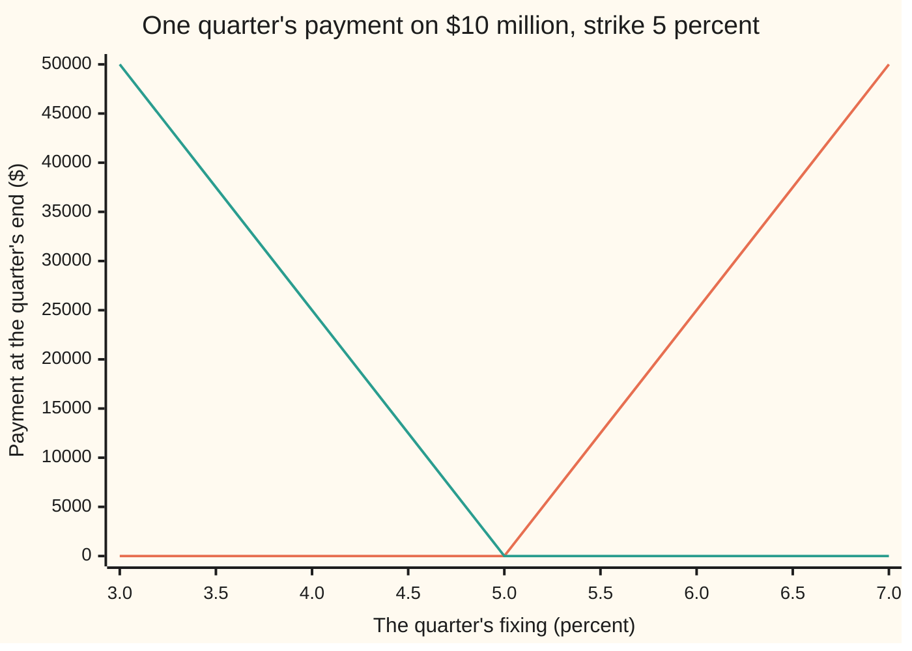
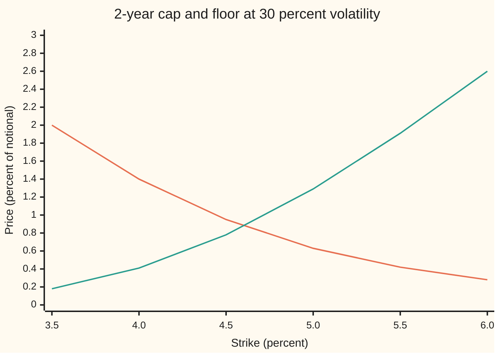

# Caps and floors: strips of caplets, and the parity that ties a cap, a floor and a swap

Financial mathematics → Caps, Floors and Swaptions → Strips of rate options → Caps and floors

---

## General Overview

A company borrows \$10 million for two years. The interest rate is not fixed. Every three months the loan looks up the market's 3-month rate and charges that for the next quarter. Today that rate is 4.40 percent. The rates the company could lock in today for each later quarter, called forward rates and read off today's curve, climb to 4.75 percent. Nobody knows where the rate will actually land.

The company's board says: whatever happens, we will not pay more than 5 percent. So the company buys insurance. Each quarter, if the rate fixes above 5 percent, the insurer pays the excess on \$10 million for that quarter. If the rate fixes below 5 percent, nothing happens. The policy covers the seven quarters whose rate is still unknown. From here on the policy is called by its market name: an **interest-rate cap**, strike 5 percent (the strike is the ceiling rate).

Each quarter's promise is one small option on one future rate, a **caplet** ([caplets-and-floorlets](01-caplets-and-floorlets.md)). The cap is the seven caplets held together. Its price is their prices added: **\$62,648.73, or 0.63 percent of the notional** (the notional is the loan size the payments are measured on, never itself exchanged). The mirror contract, a **floor**, pays when the rate falls below its strike; a lender buys it. Hold a cap and sell a floor at the same strike, and every quarter the two net to one fixed rule: receive the floating rate, pay 5 percent. That is an interest-rate swap, and its value comes from today's discount factors alone, with no model of how rates move.

**A cap is a strip of caplets priced one by one and added, a floor is a strip of floorlets, and cap minus floor at the same strike equals a swap that pays that strike and receives the floating rate, in every model.**

**What kind of fact this is:** the cap's price is a model price (each caplet is valued with Black's lognormal model, an assumption about how rates wander); the parity is a theorem, true in every model, proved on this card in Why it works.

### The picture: what one quarter pays

Each quarter the cap pays on its own, depending only on that quarter's fixing (the rate looked up on the reset date). The floor at the same strike pays the mirror image.



The orange line is the caplet's payment: flat at zero up to 5 percent, then \$12,500 for every half point above (half a percent of \$10 million for a quarter of a year). The green line is the floorlet's payment, the same shape reflected. Subtract green from orange and the result is a straight line through zero at 5 percent: the swap's payment.

---

## The formula

Notation first, in words. The quarters are numbered $i$ = 0 to 7. Quarter $i$ runs from its reset date $T_i$ to the next date, and its rate is fixed at the start and paid at the end. A symbol like $D_{i+1}$ means "the discount factor for the end of quarter $i$". A big sigma, Σ, means "add the terms for every $i$ in the range shown". $\tau$ = 0.25 is one quarter in years, $F_i$ is quarter $i$'s forward rate, $K$ is the strike, and $N$ is the normal CDF; the table below gives each one. Values are per \$1 of notional; multiply by \$10 million for dollars.

$$\text{Cap} = \sum_{i=1}^{7} \tau\, D_{i+1}\,\Big[F_i\,N(d_{1,i}) - K\,N(d_{2,i})\Big], \qquad \text{Floor} = \sum_{i=1}^{7} \tau\, D_{i+1}\,\Big[K\,N(-d_{2,i}) - F_i\,N(-d_{1,i})\Big]$$

**Read it aloud:** the cap is the sum over the seven unknown quarters of each caplet's Black price, and each caplet's price is a quarter of a year, discounted from its payment date, times the forward rate weighted by one chance minus the strike weighted by another.

$$d_{1,i} = \frac{\ln(F_i/K) + \tfrac12\sigma^2 T_i}{\sigma\sqrt{T_i}}, \qquad d_{2,i} = d_{1,i} - \sigma\sqrt{T_i}$$

These are the two standardised distances of the forward from the strike, exactly as on the Black caplet ([caplets-and-floorlets](01-caplets-and-floorlets.md)); $d_{2,i}$ is one standard deviation of the log rate below $d_{1,i}$.

The parity needs two more quantities, both read from discount factors alone:

$$A = \sum_{i=1}^{7}\tau\,D_{i+1}, \qquad S = \frac{D_1 - D_8}{A}, \qquad \text{Cap} - \text{Floor} = D_1 - D_8 - K\,A = A\,(S - K)$$

**Read it aloud:** cap minus floor is the annuity times the gap between the forward swap rate and the strike.

| Symbol | Plain meaning | In our example | Push it up and the answer… |
| --- | --- | --- | --- |
| $i$ | the quarter's number; quarter 0 is fixed today | 1 to 7 carry caplets | later quarters carry dearer caplets here |
| $T_i$ | reset date of quarter $i$, in years from today | 0.25, 0.50, …, 1.75 | more time to wander: dearer caplet |
| $\tau$ | length of one quarter as a fraction of a year | 0.25 | payments scale with it |
| $L_i$ | the rate that will actually fix at $T_i$ | unknown today | the cap pays more, the floor less |
| $F_i$ | forward rate for quarter $i$, read from today's curve | 4.45% to 4.75% | cap up, floor down |
| $K$ | the strike: the cap's ceiling, the floor's floor | 5% | cap down, floor up |
| $D_i$ (so $D_1$, $D_8$) | discount factor: today's price of \$1 paid at $T_i$ | 0.978237 down to 0.913036 for payment dates | every price scales with it |
| $\sigma$ | volatility: the yearly spread of the log of the rate | 30% | cap and floor both up, by the same amount |
| $d_1$, $d_2$ | standardised distances $d_{1,i}$, $d_{2,i}$ of forward from strike | 0.069184 and −0.327678 for quarter 7 | — |
| $N(x)$ | the normal CDF: the chance a standard bell-curve draw lands below $x$ | N(0.069184) = 0.527579 | — |
| $A$ | the annuity: today's value of 1 a year paid quarterly over quarters 1 to 7 | 1.654828 | parity gap scales with it |
| $S$ | the forward swap rate: the fixed rate that makes the swap worth zero | 4.597701% | cap up, floor down |

The forward rates come from a curve built for this shelf: $F_i$ = 4.40% + 0.05% × $i$, so 4.40% for the quarter already fixed and 4.45% to 4.75% for the seven with caplets. Each discount factor follows from the one before: $D_{i+1} = D_i / (1 + \tau F_i)$, starting from 1 for today.

### When it holds

- **The sum rule needs only that the payments are separate.** Each caplet pays on its own date on its own fixing, so the bundle's price is the sum of the pieces. It fails only if the cap has a feature that links quarters, such as a total payout limit; that contract is no longer a strip.
- **The parity needs only a curve that can be traded.** It uses discount factors and the fact that a deposit rolled for one quarter earns that quarter's rate. It fails if the rate the contract fixes on is not the rate the deposit earns, as when a cap references one index and the funding runs on another; the gap is the spread between the two.
- **The price needs Black's model for each caplet.** Each rate is taken as lognormal around its forward with a stated volatility. If the market prices each strike with its own volatility (a smile), a single $\sigma$ misprices away from the money; the parity survives unchanged.
- **Same strike, same dates, same notional on both sides.** Parity compares a cap and a floor with identical terms. Change any one and the difference is no longer a swap.

---

## Why it works

### Step 0: one quarter's cap minus floor is a fixed rule, whatever the rate

For any fixing $L_i$, one of the two payments is zero and the other is the gap: max(L_i − K, 0) − max(K − L_i, 0) = L_i − K. At a fixing of 6 percent the caplet pays \$25,000 on \$10 million and the floorlet pays nothing; at 4 percent the caplet pays nothing and the floorlet takes \$25,000 the other way. Both give the same rule: receive the rate, pay 5 percent. No probabilities enter: this is why the parity is model-free.

### Step 1: a bundle of separate payments is worth the sum of their prices

A cap is seven payments on seven dates, each settled by its own fixing. Suppose the cap sold for less than its seven caplets. Buy the cap, sell the seven caplets one by one, and keep the difference: every future payment cancels. Suppose it sold for more: do the reverse. Either way free money appears, so the price must equal the sum. The same holds for the floor. This is no-arbitrage (no riskless profit from nothing) applied to addition.

### Step 2: price each caplet with Black's formula

Each caplet is a call option on one forward rate, fixed at $T_i$, paid at $T_{i+1}$. Its Black price is $\tau D_{i+1}[F_i N(d_{1,i}) - K N(d_{2,i})]$, derived on [caplets-and-floorlets](01-caplets-and-floorlets.md). Two dates, two jobs: volatility runs to the reset date $T_i$, discounting to the payment date $T_{i+1}$. Seven prices, one sum: the cap formula above.

### Step 3: the floating payments are worth a difference of discount factors

Now value the swap from Step 0 without any model. Pay $D_i$ today for a bond that pays one dollar at $T_i$. Roll that dollar for one quarter at the rate then fixed, $L_i$. At $T_{i+1}$ it has become $(1 + \tau L_i)$ dollars. Now subtract the dollar of principal, whose value today is $D_{i+1}$. What is left is exactly $\tau L_i$ paid at $T_{i+1}$, and it cost $D_i - D_{i+1}$ today. So receiving quarter $i$'s floating interest is worth $D_i - D_{i+1}$, whatever $L_i$ turns out to be. Paying the fixed 5 percent for the quarter is worth $K \tau D_{i+1}$.

### Step 4: add the quarters; the floating side telescopes

Add $(D_i - D_{i+1})$ for $i$ = 1 to 7. Each middle factor appears once with a plus and once with a minus, so only the ends survive: $D_1 - D_8$. The fixed side adds to $K$ times the annuity $A$. Hence

$$\text{Cap} - \text{Floor} = D_1 - D_8 - K A = A(S - K).$$

The second form defines $S$: the one fixed rate at which the swap costs nothing to enter. Here $S$ = 4.597701%, below the 5 percent strike, so the swap that pays 5 percent is worth −\$66,573.49 on \$10 million, and the floor (\$129,222.22) is dearer than the cap (\$62,648.73) by exactly that amount.

<details>
<summary>Detailed proof: cap minus floor equals the payer swap, in any model</summary>

Fix a strike $K$ and quarters $i$ = 1 to 7. Portfolio P: long the cap, short the floor. Portfolio Q: for each $i$, hold $D_i$ worth of a bond paying \$1 at $T_i$, short one bond paying \$1 at $T_{i+1}$, and short $K\tau$ bonds paying \$1 at $T_{i+1}$.

Cash flows of Q for quarter $i$: at $T_i$ it receives \$1, which it deposits at the fixing $L_i$ for one quarter. At $T_{i+1}$ the deposit returns $(1 + \tau L_i)$ dollars; the two short bond positions take $(1 + K\tau)$ dollars. Net at $T_{i+1}$: $\tau(L_i - K)$. Q costs $\sum_i (D_i - D_{i+1} - K\tau D_{i+1})$ today.

Cash flows of P for quarter $i$, by Step 0: $\tau(\max(L_i - K,0) - \max(K - L_i,0)) = \tau(L_i - K)$ at $T_{i+1}$.

P and Q pay the same amount on the same date in every state of the world. If their prices differed, buying the cheaper and selling the dearer would lock in the difference today with nothing owed later. So they cost the same:
$$\text{Cap} - \text{Floor} = \sum_{i=1}^{7}(D_i - D_{i+1}) - K\sum_{i=1}^{7}\tau D_{i+1} = D_1 - D_8 - K A.$$
No step used a distribution for $L_i$. The only assumptions are that bonds for each date trade at $D_i$ and that the deposit earns the same rate the contracts fix on.

</details>

### Step 5: three consequences read straight off the parity

- **At strike $S$, cap equals floor.** Set $K$ = $S$ and the right side is zero. In the example both are \$87,300.19. An at-the-money cap (strike at the swap rate) costs the same as the at-the-money floor.
- **Their rate sensitivities differ by the annuity.** Raise every forward by one basis point (0.01 percent), holding discount factors fixed. The swap gains $A$ × 1bp × \$10 million = \$1,654.83, so the cap's change minus the floor's change (their deltas) must equal that, in any model.
- **Their volatility sensitivities are equal.** The swap does not depend on $\sigma$, so any rise in volatility adds the same dollars to the cap and to the floor.

### Step 6: the cap read as insurance

The company pays $L_i$ on its loan and receives max($L_i$ − 5%, 0) from the cap. The net is the smaller of $L_i$ and 5 percent: the rate is capped. The premium, \$62,648.73 paid today, can be turned into a running cost by dividing by the annuity, the value of 1 a year paid quarterly: 0.378582 percent a year. So the company's worst all-in borrowing rate over quarters 1 to 7 is 5.378582 percent, and when rates stay low it pays the market rate plus that running cost.

A second road reaches a lower number and shows why a cap is a strip. A **payer swaption** (sibling [swaptions-payer-and-receiver](04-swaptions-payer-and-receiver.md)) is one option, exercised once, to enter the whole swap. A cap is seven options, exercised quarter by quarter. In every quarter a caplet pays at least what the exercised swap would pay that quarter, and never less than zero, so the strip is worth at least the single option. At 30 percent volatility the swaption exercising at the first reset is worth \$21,407.39, about a third of the cap.

---

## Worked numbers, by hand

The last caplet, fixed at 1.75 years and paid at 2 years, then the sum.

| Step | Arithmetic | Value |
| --- | --- | --- |
| forward for quarter 7 | 4.40% + 0.05% × 7 | 4.75% |
| discount to payment date | $D_8$ | 0.913036 |
| spread to the reset date | 0.30 × √1.75 | 0.396863 |
| $d_{1,7}$ | (ln(4.75/5) + ½ × 0.396863^2) / 0.396863 | 0.069184 |
| $d_{2,7}$ | 0.069184 − 0.396863 | −0.327678 |
| the two chances | N(0.069184), N(−0.327678) | 0.527579, 0.371577 |
| bracket | 4.75% × 0.527579 − 5% × 0.371577 | 0.648111% |
| caplet 7 in dollars | \$10,000,000 × 0.25 × 0.913036 × 0.648111% | \$14,793.71 |
| the seven caplets | 2,162.54 + 4,824.48 + … + 14,793.71, added before rounding | **\$62,648.73** |
| as percent of notional | 62,648.73 / 10,000,000 | **0.63%** |
| the seven floorlets | 15,613.29 + … + 20,500.18, added before rounding | \$129,222.22 |
| annuity | 0.25 × (0.978237 + … + 0.913036) | 1.654828 |
| cap − floor | 62,648.73 − 129,222.22 | **−\$66,573.49** |
| payer swap at 5% | \$10,000,000 × ($D_1$ − $D_8$ − 5% × 1.654828) | **−\$66,573.49** |

Cap minus floor matches the swap to the cent, with the swap computed from discount factors alone.

Each caplet and floorlet on its own, \$10 million notional, each █ = \$1,000:

```
caplets, by reset date
0.25y  ██                   $2,162.54
0.50y  █████                $4,824.48
0.75y  ███████              $7,185.17
1.00y  █████████            $9,316.87
1.25y  ███████████          $11,274.08
1.50y  █████████████        $13,091.87
1.75y  ███████████████      $14,793.71

floorlets, by reset date
0.25y  ████████████████     $15,613.29
0.50y  █████████████████    $16,916.40
0.75y  ██████████████████   $17,945.51
1.00y  ███████████████████  $18,772.87
1.25y  ███████████████████  $19,453.00
1.50y  ████████████████████ $20,020.96
1.75y  ████████████████████ $20,500.18
```

Caplets grow along the strip: later forwards sit closer to 5 percent and have longer to wander. Floorlets grow too, because the extra time to wander outweighs the forwards rising toward the strike.

### Cap and floor across strikes



The orange line is the cap, falling as the ceiling rises; the green line is the floor, rising with its strike. They cross between 4.5 and 5.0 percent, at the forward swap rate 4.597701%, where both cost \$87,300.19. At every strike the vertical gap between them is the swap's value, $A(S - K)$.

### The Greeks

Sensitivities of the whole strip, \$10 million notional, from the check scripts:

| Greek | Cap | Floor | What parity says |
| --- | --- | --- | --- |
| delta: change for every forward up 1 basis point | \$696.52 | −\$958.31 | difference \$1,654.83 = annuity × 1bp × notional |
| vega: change for 1 point more volatility, around 30% | \$2,835.48 | \$2,835.48 | equal, since the swap has no volatility |

Cap delta by the formula (sum of $\tau D_{i+1} N(d_{1,i})$ per basis point) and by bumping the forwards both give \$696.52.

### What breaks if you drop a piece

| Mistake | Comes out at | What went wrong |
| --- | --- | --- |
| discount each caplet to its reset date $T_i$ | \$63,376.50 | the money arrives a quarter later than that; every caplet is too dear |
| run volatility to the payment date $T_{i+1}$ | \$73,991.43 | credits each rate with a quarter of wandering after it is already fixed |
| price the cap as one option on the swap rate | \$21,407.39 | one joint choice is worth less than seven separate ones |
| read cap minus floor as a receiver swap | +\$66,573.49 | wrong sign: long cap, short floor receives floating and pays fixed |

---

## Code, from first principles, and it actually runs

Both programs build the curve, then reach the cap four ways. Road 1 prices each caplet with Black's formula, using a normal CDF written from its series. Road 2 integrates each caplet's payoff against the lognormal spread of its rate with Simpson's rule, split at the kink where the fixing equals the strike. Road 3 simulates 200,000 fixings from a hand-written random number generator. Road 4 computes the swap from discount factors alone and checks it against the integrated cap minus the integrated floor. They also compute the Greeks and every number on this card.

### Python

```python
# Caps and floors: a 2-year cap at 5% on 3-month rates, 30% lognormal volatility.
# Roads: Black-76 per caplet; Simpson integral of each payoff; Monte Carlo; parity from discount factors.
from math import exp, log, sqrt, cos, pi

NOTIONAL, TAU, K, SIG = 10_000_000.0, 0.25, 0.05, 0.30
FWD = [0.044 + 0.0005 * i for i in range(8)]       # 3-month forward rates, today's curve
D = [1.0]                                           # D[i] = discount factor to T_i = 0.25 i
for f in FWD:
    D.append(D[-1] / (1.0 + TAU * f))
CAPLETS = range(1, 8)                               # period 0 fixes today at 4.40%: no option left

def ncdf(x):                                        # N(x) = 1/2 + phi(x) (x + x^3/3 + x^5/15 + ...)
    if x < -8.0: return 0.0
    if x > 8.0: return 1.0
    term, total, k = x, x, 1
    while abs(term) > 1e-17 * abs(total):
        term *= x * x / (2 * k + 1); total += term; k += 1
    return 0.5 + exp(-0.5 * x * x) / sqrt(2.0 * pi) * total

def black(F, strike, sig, T, call):                 # Black-76 per unit of rate, undiscounted
    v = sig * sqrt(T)
    d1 = (log(F / strike) + 0.5 * v * v) / v
    d2 = d1 - v
    return F * ncdf(d1) - strike * ncdf(d2) if call else strike * ncdf(-d2) - F * ncdf(-d1)

def strip(strike=K, sig=SIG, call=True, bump=0.0, pay_lag=1, vol_lag=0):
    return [NOTIONAL * TAU * D[i + pay_lag] * black(FWD[i] + bump, strike, sig, TAU * (i + vol_lag), call)
            for i in CAPLETS]

def simpson(f, a, b, n=2000):
    h = (b - a) / n
    return h / 3 * (f(a) + f(b) + sum((4 if j % 2 else 2) * f(a + j * h) for j in range(1, n)))

def by_integral(i, call):                           # E[payoff] with the fixing lognormal around F_i
    F, v = FWD[i], SIG * sqrt(TAU * i)
    rate = lambda z: F * exp(-0.5 * v * v + v * z)
    dens = lambda z: exp(-0.5 * z * z) / sqrt(2.0 * pi)
    zk = (log(K / F) + 0.5 * v * v) / v             # the kink: fixing equals the strike
    if call: val = simpson(lambda z: (rate(z) - K) * dens(z), zk, 10.0)
    else: val = simpson(lambda z: (K - rate(z)) * dens(z), -10.0, zk)
    return NOTIONAL * TAU * D[i + 1] * val

state = [20260928]
def uniform():                                      # 64-bit linear congruential generator
    state[0] = (6364136223846793005 * state[0] + 1442695040888963407) % 2**64
    return ((state[0] >> 11) + 0.5) / 2.0**53

def monte_carlo(paths=200_000):
    total = 0.0
    for _ in range(paths // 2):
        z = sqrt(-2.0 * log(uniform())) * cos(2.0 * pi * uniform())
        for i in CAPLETS:
            F, v = FWD[i], SIG * sqrt(TAU * i)
            for s in (z, -z):
                total += TAU * D[i + 1] * max(F * exp(-0.5 * v * v + v * s) - K, 0.0)
    return NOTIONAL * total / paths

cl, fl = strip(), strip(call=False)
cap, floor = sum(cl), sum(fl)
cap_int = sum(by_integral(i, True) for i in CAPLETS)
floor_int = sum(by_integral(i, False) for i in CAPLETS)
cap_mc = monte_carlo()
A = sum(TAU * D[i + 1] for i in CAPLETS)            # annuity: value of 1 per year paid quarterly
S = (D[1] - D[8]) / A                               # forward swap rate, periods 1 to 7
swap = NOTIONAL * ((D[1] - D[8]) - K * A)           # pay 5% fixed, receive floating, periods 1 to 7
cap_S, floor_S = sum(strip(strike=S)), sum(strip(strike=S, call=False))

bp = 0.0001
dcap = sum(NOTIONAL * TAU * D[i + 1] * ncdf((log(FWD[i] / K) + 0.5 * SIG**2 * TAU * i) / (SIG * sqrt(TAU * i))) * bp for i in CAPLETS)
dcap_b = (sum(strip(bump=bp / 2)) - sum(strip(bump=-bp / 2)))
dfl_b = (sum(strip(call=False, bump=bp / 2)) - sum(strip(call=False, bump=-bp / 2)))
vcap_b = (sum(strip(sig=SIG + 0.005)) - sum(strip(sig=SIG - 0.005)))
vfl_b = (sum(strip(sig=SIG + 0.005, call=False)) - sum(strip(sig=SIG - 0.005, call=False)))

p = lambda label, v: print(f"{label:<40}{v:>16.2f}")
q = lambda label, v: print(f"{label:<40}{v:>16.6f}")
for i in CAPLETS:
    print(f"caplet {i}  fix {TAU*i:.2f}y  F {100*FWD[i]:.2f}%  D {D[i+1]:.6f}{cl[i-1]:>11.2f}{fl[i-1]:>11.2f}")
v7 = SIG * sqrt(1.75); d1 = (log(FWD[7] / K) + 0.5 * v7 * v7) / v7
q("caplet 7: sigma sqrt(T)", v7); q("caplet 7: d1", d1); q("caplet 7: d2", d1 - v7)
q("caplet 7: N(d1)", ncdf(d1)); q("caplet 7: N(d2)", ncdf(d1 - v7))
q("caplet 7: F N(d1) - K N(d2), percent", 100 * black(FWD[7], K, SIG, 1.75, True))
p("1 cap, Black strip", cap); p("2 cap, Simpson integral", cap_int); p("3 cap, Monte Carlo 200000", cap_mc)
q("cap, percent of notional", 100 * cap / NOTIONAL)
p("floor, Black strip", floor); p("floor, Simpson integral", floor_int)
q("annuity A", A); q("forward swap rate S, percent", 100 * S)
p("cap - floor (integral road)", cap_int - floor_int); p("4 payer swap from D(T)", swap)
p("cap at strike S", cap_S); p("floor at strike S", floor_S)
q("running premium, percent a year", 100 * cap / NOTIONAL / A)
q("worst all-in rate, percent", 100 * (K + cap / NOTIONAL / A))
p("delta cap per 1bp, N(d1)", dcap); p("delta cap per 1bp, bump", dcap_b); p("delta floor per 1bp, bump", dfl_b)
p("  delta difference", dcap_b - dfl_b); p("  annuity x 1bp x notional", A * bp * NOTIONAL)
p("vega cap per vol point, bump", vcap_b); p("vega floor per vol point, bump", vfl_b)
p("wrong: discount to the reset date", sum(strip(pay_lag=0)))
p("wrong: volatility to the payment date", sum(strip(vol_lag=1)))
p("wrong: one option, swaption at 0.25y", NOTIONAL * A * black(S, K, SIG, 0.25, True))
p("wrong: parity read as receiver swap", -swap)
fix = (3.0, 3.5, 4.0, 4.5, 5.0, 5.5, 6.0, 6.5, 7.0)
print("chart fixing, %  " + "".join(f"{x:>9.1f}" for x in fix))
print("chart cap pays   " + "".join(f"{NOTIONAL * TAU * max(x / 100 - K, 0):>9.2f}" for x in fix))
print("chart floor pays " + "".join(f"{NOTIONAL * TAU * max(K - x / 100, 0):>9.2f}" for x in fix))
for ks in (3.5, 4.0, 4.5, 5.0, 5.5, 6.0):
    c, f = sum(strip(strike=ks / 100)), sum(strip(strike=ks / 100, call=False))
    print(f"chart strike {ks:.1f}%  cap {100*c/NOTIONAL:.2f}%  floor {100*f/NOTIONAL:.2f}%")
p("try: volatility 20%", sum(strip(sig=0.20))); p("try: strike 6%", sum(strip(strike=0.06)))
p("try: every forward up 1%", sum(strip(bump=0.01)))

assert abs(cap - cap_int) < 1e-4, "Black strip vs integral of the payoff"
assert abs(cap_mc - cap) < 0.01 * cap, "Monte Carlo within 1 percent"
assert abs((cap_int - floor_int) - swap) < 1e-4, "parity: integral cap minus floor vs swap from discount factors"
assert abs(cap_S - floor_S) < 1e-6, "cap equals floor at the swap rate"
assert abs((dcap_b - dfl_b) - A * bp * NOTIONAL) < 1e-3, "delta gap equals the annuity"
assert abs(dcap - dcap_b) < 1e-3, "N(d1) delta vs bump"
print("ALL CHECKS PASS")
```

**Ran 2026-09-28 on macOS, Python 3.14.6, standard library only. All checks passed. Output, pasted from the run:**

```
caplet 1  fix 0.25y  F 4.45%  D 0.978237    2162.54   15613.29
caplet 2  fix 0.50y  F 4.50%  D 0.967354    4824.48   16916.40
caplet 3  fix 0.75y  F 4.55%  D 0.956474    7185.17   17945.51
caplet 4  fix 1.00y  F 4.60%  D 0.945600    9316.87   18772.87
caplet 5  fix 1.25y  F 4.65%  D 0.934733   11274.08   19453.00
caplet 6  fix 1.50y  F 4.70%  D 0.923878   13091.87   20020.96
caplet 7  fix 1.75y  F 4.75%  D 0.913036   14793.71   20500.18
caplet 7: sigma sqrt(T)                         0.396863
caplet 7: d1                                    0.069184
caplet 7: d2                                   -0.327678
caplet 7: N(d1)                                 0.527579
caplet 7: N(d2)                                 0.371577
caplet 7: F N(d1) - K N(d2), percent            0.648111
1 cap, Black strip                              62648.73
2 cap, Simpson integral                         62648.73
3 cap, Monte Carlo 200000                       62693.60
cap, percent of notional                        0.626487
floor, Black strip                             129222.22
floor, Simpson integral                        129222.22
annuity A                                       1.654828
forward swap rate S, percent                    4.597701
cap - floor (integral road)                    -66573.49
4 payer swap from D(T)                         -66573.49
cap at strike S                                 87300.19
floor at strike S                               87300.19
running premium, percent a year                 0.378582
worst all-in rate, percent                      5.378582
delta cap per 1bp, N(d1)                          696.52
delta cap per 1bp, bump                           696.52
delta floor per 1bp, bump                        -958.31
  delta difference                               1654.83
  annuity x 1bp x notional                       1654.83
vega cap per vol point, bump                     2835.48
vega floor per vol point, bump                   2835.48
wrong: discount to the reset date               63376.50
wrong: volatility to the payment date           73991.43
wrong: one option, swaption at 0.25y            21407.39
wrong: parity read as receiver swap             66573.49
chart fixing, %        3.0      3.5      4.0      4.5      5.0      5.5      6.0      6.5      7.0
chart cap pays        0.00     0.00     0.00     0.00     0.00 12500.00 25000.00 37500.00 50000.00
chart floor pays  50000.00 37500.00 25000.00 12500.00     0.00     0.00     0.00     0.00     0.00
chart strike 3.5%  cap 2.00%  floor 0.18%
chart strike 4.0%  cap 1.40%  floor 0.41%
chart strike 4.5%  cap 0.95%  floor 0.78%
chart strike 5.0%  cap 0.63%  floor 1.29%
chart strike 5.5%  cap 0.42%  floor 1.91%
chart strike 6.0%  cap 0.28%  floor 2.60%
try: volatility 20%                             34899.68
try: strike 6%                                  27710.22
try: every forward up 1%                       157397.94
ALL CHECKS PASS
```

### Rust

```rust
// Caps and floors: a 2-year cap at 5% on 3-month rates, 30% lognormal volatility.
// Roads: Black-76 per caplet; Simpson integral of each payoff; Monte Carlo; parity from discount factors.
use std::f64::consts::PI;

const NOTIONAL: f64 = 10_000_000.0;
const TAU: f64 = 0.25;
const K: f64 = 0.05;
const SIG: f64 = 0.30;

fn ncdf(x: f64) -> f64 {
    // N(x) = 1/2 + phi(x) (x + x^3/3 + x^5/15 + ...)
    if x < -8.0 { return 0.0; }
    if x > 8.0 { return 1.0; }
    let (mut term, mut total, mut k) = (x, x, 1.0);
    while term.abs() > 1e-17 * total.abs() {
        term *= x * x / (2.0 * k + 1.0);
        total += term;
        k += 1.0;
    }
    0.5 + (-0.5 * x * x).exp() / (2.0 * PI).sqrt() * total
}

fn black(f: f64, strike: f64, sig: f64, t: f64, call: bool) -> f64 {
    let v = sig * t.sqrt();
    let d1 = ((f / strike).ln() + 0.5 * v * v) / v;
    let d2 = d1 - v;
    if call { f * ncdf(d1) - strike * ncdf(d2) } else { strike * ncdf(-d2) - f * ncdf(-d1) }
}

struct Curve { fwd: Vec<f64>, d: Vec<f64> }

impl Curve {
    fn strip(&self, strike: f64, sig: f64, call: bool, bump: f64, pay_lag: usize, vol_lag: f64) -> Vec<f64> {
        (1..8).map(|i| NOTIONAL * TAU * self.d[i + pay_lag]
            * black(self.fwd[i] + bump, strike, sig, TAU * (i as f64 + vol_lag), call)).collect()
    }
    fn total(&self, strike: f64, sig: f64, call: bool, bump: f64) -> f64 {
        self.strip(strike, sig, call, bump, 1, 0.0).iter().sum()
    }
    fn by_integral(&self, i: usize, call: bool) -> f64 {
        let (f, v) = (self.fwd[i], SIG * (TAU * i as f64).sqrt());
        let zk = ((K / f).ln() + 0.5 * v * v) / v;
        let payoff = |z: f64| {
            let rate = f * (-0.5 * v * v + v * z).exp();
            let dens = (-0.5 * z * z).exp() / (2.0 * PI).sqrt();
            (if call { rate - K } else { K - rate }) * dens
        };
        let val = if call { simpson(&payoff, zk, 10.0) } else { simpson(&payoff, -10.0, zk) };
        NOTIONAL * TAU * self.d[i + 1] * val
    }
}

fn simpson(f: &dyn Fn(f64) -> f64, a: f64, b: f64) -> f64 {
    let n = 2000;
    let h = (b - a) / n as f64;
    let mut s = f(a) + f(b);
    for j in 1..n { s += (if j % 2 == 1 { 4.0 } else { 2.0 }) * f(a + j as f64 * h); }
    h / 3.0 * s
}

struct Lcg(u64);
impl Lcg {
    fn uniform(&mut self) -> f64 {
        self.0 = self.0.wrapping_mul(6364136223846793005).wrapping_add(1442695040888963407);
        ((self.0 >> 11) as f64 + 0.5) / 2f64.powi(53)
    }
}

fn monte_carlo(c: &Curve, paths: usize) -> f64 {
    let mut rng = Lcg(20260928);
    let mut total = 0.0;
    for _ in 0..paths / 2 {
        let u1 = rng.uniform();
        let u2 = rng.uniform();
        let z = (-2.0 * u1.ln()).sqrt() * (2.0 * PI * u2).cos();
        for i in 1..8 {
            let (f, v) = (c.fwd[i], SIG * (TAU * i as f64).sqrt());
            for s in [z, -z] {
                total += TAU * c.d[i + 1] * (f * (-0.5 * v * v + v * s).exp() - K).max(0.0);
            }
        }
    }
    NOTIONAL * total / paths as f64
}

fn p(label: &str, v: f64) { println!("{:<40}{:>16.2}", label, v); }
fn q(label: &str, v: f64) { println!("{:<40}{:>16.6}", label, v); }

fn main() {
    let fwd: Vec<f64> = (0..8).map(|i| 0.044 + 0.0005 * i as f64).collect();
    let mut d = vec![1.0];
    for f in &fwd { let last = *d.last().unwrap(); d.push(last / (1.0 + TAU * f)); }
    let c = Curve { fwd, d };
    let (cl, fl) = (c.strip(K, SIG, true, 0.0, 1, 0.0), c.strip(K, SIG, false, 0.0, 1, 0.0));
    let (cap, floor): (f64, f64) = (cl.iter().sum(), fl.iter().sum());
    let cap_int: f64 = (1..8).map(|i| c.by_integral(i, true)).sum();
    let floor_int: f64 = (1..8).map(|i| c.by_integral(i, false)).sum();
    let cap_mc = monte_carlo(&c, 200_000);
    let a: f64 = (1..8).map(|i| TAU * c.d[i + 1]).sum();
    let s = (c.d[1] - c.d[8]) / a;
    let swap = NOTIONAL * ((c.d[1] - c.d[8]) - K * a);
    let (cap_s, floor_s) = (c.total(s, SIG, true, 0.0), c.total(s, SIG, false, 0.0));

    let bp = 0.0001;
    let dcap: f64 = (1..8).map(|i| {
        let t = TAU * i as f64;
        NOTIONAL * TAU * c.d[i + 1] * ncdf(((c.fwd[i] / K).ln() + 0.5 * SIG * SIG * t) / (SIG * t.sqrt())) * bp
    }).sum();
    let dcap_b = c.total(K, SIG, true, bp / 2.0) - c.total(K, SIG, true, -bp / 2.0);
    let dfl_b = c.total(K, SIG, false, bp / 2.0) - c.total(K, SIG, false, -bp / 2.0);
    let vcap_b = c.total(K, SIG + 0.005, true, 0.0) - c.total(K, SIG - 0.005, true, 0.0);
    let vfl_b = c.total(K, SIG + 0.005, false, 0.0) - c.total(K, SIG - 0.005, false, 0.0);

    for i in 1..8 {
        println!("caplet {}  fix {:.2}y  F {:.2}%  D {:.6}{:>11.2}{:>11.2}",
            i, TAU * i as f64, 100.0 * c.fwd[i], c.d[i + 1], cl[i - 1], fl[i - 1]);
    }
    let v7 = SIG * 1.75f64.sqrt();
    let d1 = ((c.fwd[7] / K).ln() + 0.5 * v7 * v7) / v7;
    q("caplet 7: sigma sqrt(T)", v7); q("caplet 7: d1", d1); q("caplet 7: d2", d1 - v7);
    q("caplet 7: N(d1)", ncdf(d1)); q("caplet 7: N(d2)", ncdf(d1 - v7));
    q("caplet 7: F N(d1) - K N(d2), percent", 100.0 * black(c.fwd[7], K, SIG, 1.75, true));
    p("1 cap, Black strip", cap); p("2 cap, Simpson integral", cap_int); p("3 cap, Monte Carlo 200000", cap_mc);
    q("cap, percent of notional", 100.0 * cap / NOTIONAL);
    p("floor, Black strip", floor); p("floor, Simpson integral", floor_int);
    q("annuity A", a); q("forward swap rate S, percent", 100.0 * s);
    p("cap - floor (integral road)", cap_int - floor_int); p("4 payer swap from D(T)", swap);
    p("cap at strike S", cap_s); p("floor at strike S", floor_s);
    q("running premium, percent a year", 100.0 * cap / NOTIONAL / a);
    q("worst all-in rate, percent", 100.0 * (K + cap / NOTIONAL / a));
    p("delta cap per 1bp, N(d1)", dcap); p("delta cap per 1bp, bump", dcap_b); p("delta floor per 1bp, bump", dfl_b);
    p("  delta difference", dcap_b - dfl_b); p("  annuity x 1bp x notional", a * bp * NOTIONAL);
    p("vega cap per vol point, bump", vcap_b); p("vega floor per vol point, bump", vfl_b);
    p("wrong: discount to the reset date", c.strip(K, SIG, true, 0.0, 0, 0.0).iter().sum());
    p("wrong: volatility to the payment date", c.strip(K, SIG, true, 0.0, 1, 1.0).iter().sum());
    p("wrong: one option, swaption at 0.25y", NOTIONAL * a * black(s, K, SIG, 0.25, true));
    p("wrong: parity read as receiver swap", -swap);
    let fix = [3.0, 3.5, 4.0, 4.5, 5.0, 5.5, 6.0, 6.5, 7.0];
    let row = |f: &dyn Fn(f64) -> f64| fix.iter().map(|&x| format!("{:>9.2}", f(x))).collect::<String>();
    println!("chart fixing, %  {}", fix.iter().map(|x| format!("{:>9.1}", x)).collect::<String>());
    println!("chart cap pays   {}", row(&|x| NOTIONAL * TAU * (x / 100.0 - K).max(0.0)));
    println!("chart floor pays {}", row(&|x| NOTIONAL * TAU * (K - x / 100.0).max(0.0)));
    for ks in [3.5, 4.0, 4.5, 5.0, 5.5, 6.0] {
        let (cs, fs) = (c.total(ks / 100.0, SIG, true, 0.0), c.total(ks / 100.0, SIG, false, 0.0));
        println!("chart strike {:.1}%  cap {:.2}%  floor {:.2}%", ks, 100.0 * cs / NOTIONAL, 100.0 * fs / NOTIONAL);
    }
    p("try: volatility 20%", c.total(K, 0.20, true, 0.0)); p("try: strike 6%", c.total(0.06, SIG, true, 0.0));
    p("try: every forward up 1%", c.total(K, SIG, true, 0.01));

    assert!((cap - cap_int).abs() < 1e-4, "Black strip vs integral of the payoff");
    assert!((cap_mc - cap).abs() < 0.01 * cap, "Monte Carlo within 1 percent");
    assert!(((cap_int - floor_int) - swap).abs() < 1e-4, "parity: integral cap minus floor vs swap");
    assert!((cap_s - floor_s).abs() < 1e-6, "cap equals floor at the swap rate");
    assert!(((dcap_b - dfl_b) - a * bp * NOTIONAL).abs() < 1e-3, "delta gap equals the annuity");
    assert!((dcap - dcap_b).abs() < 1e-3, "N(d1) delta vs bump");
    println!("ALL CHECKS PASS");
}
```

**Ran 2026-09-28 on macOS, rustc 1.98.1, no crates. All checks passed. Output, pasted from the run:**

```
caplet 1  fix 0.25y  F 4.45%  D 0.978237    2162.54   15613.29
caplet 2  fix 0.50y  F 4.50%  D 0.967354    4824.48   16916.40
caplet 3  fix 0.75y  F 4.55%  D 0.956474    7185.17   17945.51
caplet 4  fix 1.00y  F 4.60%  D 0.945600    9316.87   18772.87
caplet 5  fix 1.25y  F 4.65%  D 0.934733   11274.08   19453.00
caplet 6  fix 1.50y  F 4.70%  D 0.923878   13091.87   20020.96
caplet 7  fix 1.75y  F 4.75%  D 0.913036   14793.71   20500.18
caplet 7: sigma sqrt(T)                         0.396863
caplet 7: d1                                    0.069184
caplet 7: d2                                   -0.327678
caplet 7: N(d1)                                 0.527579
caplet 7: N(d2)                                 0.371577
caplet 7: F N(d1) - K N(d2), percent            0.648111
1 cap, Black strip                              62648.73
2 cap, Simpson integral                         62648.73
3 cap, Monte Carlo 200000                       62693.60
cap, percent of notional                        0.626487
floor, Black strip                             129222.22
floor, Simpson integral                        129222.22
annuity A                                       1.654828
forward swap rate S, percent                    4.597701
cap - floor (integral road)                    -66573.49
4 payer swap from D(T)                         -66573.49
cap at strike S                                 87300.19
floor at strike S                               87300.19
running premium, percent a year                 0.378582
worst all-in rate, percent                      5.378582
delta cap per 1bp, N(d1)                          696.52
delta cap per 1bp, bump                           696.52
delta floor per 1bp, bump                        -958.31
  delta difference                               1654.83
  annuity x 1bp x notional                       1654.83
vega cap per vol point, bump                     2835.48
vega floor per vol point, bump                   2835.48
wrong: discount to the reset date               63376.50
wrong: volatility to the payment date           73991.43
wrong: one option, swaption at 0.25y            21407.39
wrong: parity read as receiver swap             66573.49
chart fixing, %        3.0      3.5      4.0      4.5      5.0      5.5      6.0      6.5      7.0
chart cap pays        0.00     0.00     0.00     0.00     0.00 12500.00 25000.00 37500.00 50000.00
chart floor pays  50000.00 37500.00 25000.00 12500.00     0.00     0.00     0.00     0.00     0.00
chart strike 3.5%  cap 2.00%  floor 0.18%
chart strike 4.0%  cap 1.40%  floor 0.41%
chart strike 4.5%  cap 0.95%  floor 0.78%
chart strike 5.0%  cap 0.63%  floor 1.29%
chart strike 5.5%  cap 0.42%  floor 1.91%
chart strike 6.0%  cap 0.28%  floor 2.60%
try: volatility 20%                             34899.68
try: strike 6%                                  27710.22
try: every forward up 1%                       157397.94
ALL CHECKS PASS
```

The two outputs agree line for line.

> [!TIP]
> **Try changing**
> - **Volatility down to 20 percent.** Guess first: does the cap fall by a third? Set `SIG = 0.20`. Answer: \$34,899.68, a fall of almost half, since every caplet here is out of the money (forward below strike) and option value shrinks faster than volatility there.
> - **Strike up to 6 percent.** Guess first. Set `K = 0.06`. Answer: \$27,710.22, or 0.28 percent of notional: cheaper protection with a higher ceiling.
> - **Every forward up one percentage point.** Guess first: the cap's delta is \$696.52 per basis point, so a hundred basis points suggests a hundred times that. Answer: \$157,397.94, far more, because each caplet's delta grows as its forward passes the strike.
> - **Strike at the swap rate.** The scripts print it as `cap at strike S`. Answer: cap and floor both \$87,300.19; the swap between them is worth nothing.

---

## The usual mistake

> [!warning]
> **A cap is not one option on the two-year rate.** It is seven options, each on its own quarter's rate, each exercised on its own. Pricing it as a single option on the swap rate gives \$21,407.39 against the true \$62,648.73. A single option can only be exercised once for all quarters together; the strip lets the holder collect in a bad quarter even when the average quarter is fine. That extra freedom is worth money, so a cap always costs at least the matching swaption.
>
> - **Getting the parity's sign backwards.** Long cap, short floor receives floating and pays fixed: a payer swap. Reading it as a receiver swap gives +\$66,573.49 instead of −\$66,573.49.
> - **Discounting to the reset date.** The rate fixes at $T_i$; the cash moves at $T_{i+1}$. Discounting too early prices the cap at \$63,376.50, too dear in every caplet.
> - **Running volatility to the payment date.** The rate stops wandering when it fixes. Using $T_{i+1}$ gives \$73,991.43.
> - **Counting today's quarter as an option.** Its rate, 4.40 percent, is already known; a spot-starting cap leaves it out. If it were above the strike it would be a known payment, not an option.

---

## Where you meet it in real life

- **Floating-rate borrowers.** Property developers and companies with bank loans buy caps to put a ceiling on interest cost; lenders on floating-rate property loans often require one. The premium is paid once, and the borrower keeps the benefit when rates fall, unlike a swap.
- **Collars.** A borrower buys a cap at one strike and sells a floor at a lower strike to pay for it. At 30 percent volatility the 4 percent floor sells for 0.41 percent of notional, most of the 0.63 percent cap. The borrower's rate is then held between the two strikes.
- **Floating-rate notes with a minimum coupon.** A note that promises never to pay below some rate has a floor inside it; the investor has bought a floor from the issuer without a separate trade.
- **Rates desks.** Dealers quote caps by a single flat volatility across all caplets and then turn those quotes into one volatility per caplet: [caplet-stripping](03-caplet-stripping.md). Cap-floor parity is the first check on any new pricing model, since no model is allowed to break it.

**Conventions (dated 2026-09-28):** the card uses a quarter of exactly 0.25 years. Real contracts count the actual days in each period over 360 or 365, as the contract names, and each caplet's payment scales with that fraction. The parity holds under any day count, provided cap, floor and swap use the same one.

> **Say it back**
> A cap is a strip of caplets, one per quarter whose rate is not yet known, and its price is their Black prices added. A floor is the same strip of floorlets. In any single quarter, a caplet minus a floorlet at the same strike pays the floating rate minus the strike, whatever happens. Rolling a deposit shows the floating side is worth a difference of discount factors, and adding the quarters telescopes to one line: cap minus floor equals a swap paying the strike, worth the annuity times the swap rate minus the strike. The example's 2-year cap at 5 percent costs 0.63 percent of notional, and holds the borrower's rate at 5 percent plus a running premium.

---

## What this builds on

- [caplets-and-floorlets](01-caplets-and-floorlets.md): one caplet's payoff, its Black price with volatility to the reset date and discounting to the payment date, and the forward rate read from discount factors. This card adds them up and ties the sum to a swap.

---

## Where this goes next

- [caplet-stripping](03-caplet-stripping.md): the market quotes one flat volatility for the whole cap; that card turns a set of cap quotes into one volatility per caplet and shows when the answer is unique.
- [swaptions-payer-and-receiver](04-swaptions-payer-and-receiver.md): the single option on the whole swap, priced with the annuity as its unit, and its own parity with a forward swap.

---

## Sources

Verified 2026-09-28: every link below resolves to the publisher's page.

- Black, Fischer. "The pricing of commodity contracts." *Journal of Financial Economics* 3, no. 1–2 (1976): 167–179. [doi:10.1016/0304-405X(76)90024-6](https://doi.org/10.1016/0304-405X(76)90024-6). The formula applied to each caplet: an option on a forward, with no drift.
- Brigo, Damiano, and Fabio Mercurio. *Interest Rate Models — Theory and Practice*, 2nd ed. Springer Finance, 2006. [doi:10.1007/978-3-540-34604-3](https://link.springer.com/book/10.1007/978-3-540-34604-3). Caps and floors as sums of caplets, Black's formula for caps, and the market's cap volatility quotes.
