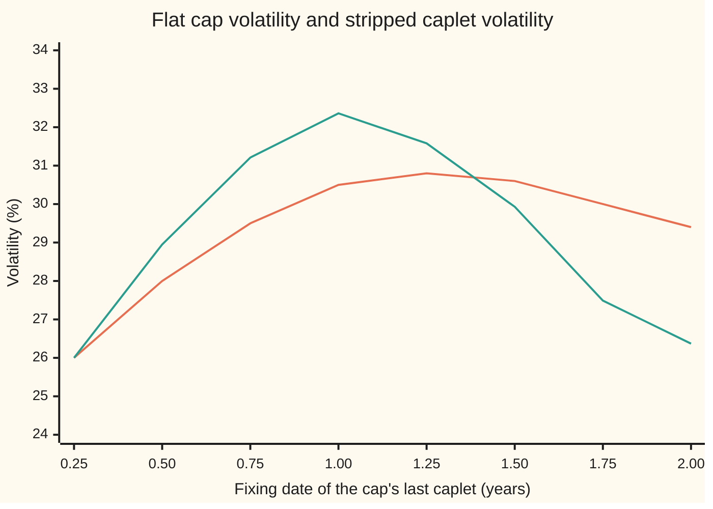
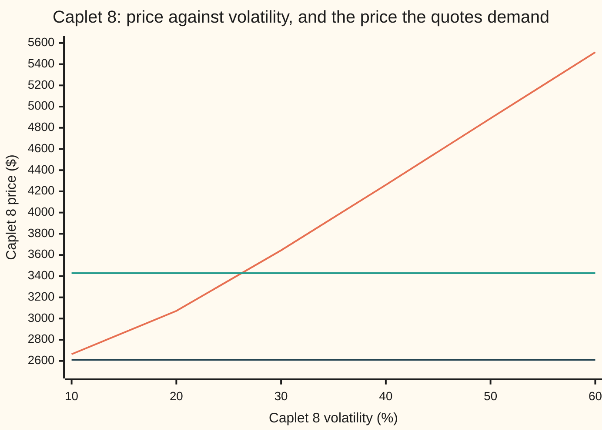

# Caplet stripping: recovering each caplet's volatility from cap quotes

[Syllabus](../../../SYLLABUS.md) → [Financial mathematics](../../../SYLLABUS.md#w12) → [Caps, Floors and Swaptions](../../../SYLLABUS.md#w12-s29) → Caplet stripping

---

## General Overview

A company borrows $1 million at a floating rate that resets every three months. It buys a cap: insurance that pays, at the end of each quarter, the amount by which that quarter's rate exceeded 5 percent. Each quarter's payment is a small option called a **caplet**. A cap is a bundle of caplets, one per reset ([Caplets and floorlets](01-caplets-and-floorlets.md)).

Brokers do not quote caps in dollars. They quote one volatility per cap, called the **flat volatility**: the single number that, fed into every caplet of that cap, reproduces the cap's price. Volatility here means how widely the future rate may spread, per square root of a year. On one screen sit eight such quotes, for caps holding one caplet, two caplets, and so on up to eight. The 2-year cap, which holds seven caplets, is quoted at 30 percent. The 2.25-year cap, which holds eight, at 29.4 percent.

The flat volatility is a bookkeeping number. It belongs to the whole cap, not to any caplet in it. The caplet that fixes in 1 year is shared by every cap from the fourth onward, yet each of those caps prices it at a different flat volatility. A single caplet can only have one volatility. Recovering that one number for each caplet, from the flat quotes, is **caplet stripping**. On this card's quotes, the eight flat volatilities rise from 26 to 30.8 percent and drift back to 29.4. The eight caplet volatilities behind them rise to 32.36 percent at the 1-year reset and fall to 26.37 percent at the last one.

The method is a relay. The difference between two neighbouring caps' prices is exactly one caplet's price. Each difference is then turned back into a volatility, one caplet at a time. The card also proves the answer is the only one the quotes allow, and names the quotes that allow none.

**Eight cap quotes become eight cap prices; neighbouring prices subtract to eight caplet prices; each caplet price has exactly one volatility, so the eight caplet volatilities are unique whenever each price difference lies strictly between that caplet's zero-volatility and infinite-volatility values.**

**What kind of fact this is:** a method, with the uniqueness of its answer a theorem proved on this card in Why it works.

### The picture: flat volatilities and the caplet volatilities under them



Orange: the quoted flat volatility of the cap whose last caplet fixes on that date. Green: the stripped volatility of that one caplet. The two agree at the first point, where the cap is a single caplet. After that the caplet line swings further than the flat line, both up and down. A flat volatility is an average over every caplet in its cap, so it moves slowly. To pull an average up, the newest member must sit well above it.

---

## The formula

Notation first, in words. Caplets are numbered 1 to 8 in date order; the letter *i* names one caplet and the letter *k* names the cap made of caplets 1 to *k*. A capital sigma, $\Sigma_k$, is the flat volatility quoted for cap *k*. A small sigma, $\sigma_i$, is the volatility of caplet *i* alone. A summation sign adds a term for each caplet from 1 to *k*.

The price of caplet *i* at a volatility $\sigma$ is Black's formula for rates ([Caplets and floorlets](01-caplets-and-floorlets.md)):

$$c_i(\sigma) = L\,\tau\,D(T_i+\tau)\,\big[F_i\,N(d_1) - K\,N(d_2)\big], \qquad d_{1,2} = \frac{\ln(F_i/K) \pm \tfrac12\sigma^2 T_i}{\sigma\sqrt{T_i}}$$

A flat quote is converted to a price by using one volatility for every caplet in the cap:

$$C_k = \sum_{i=1}^{k} c_i(\Sigma_k)$$

Stripping asks for caplet volatilities that reproduce every cap price at once:

$$\sum_{i=1}^{k} c_i(\sigma_i) = C_k \quad\text{for } k = 1,\dots,8 \qquad\Longrightarrow\qquad c_k(\sigma_k) = C_k - C_{k-1}$$

**Read it aloud:** price each cap at its own flat volatility; subtract the previous cap's price to isolate the newest caplet's price; find the one volatility that gives that caplet that price.

| Symbol | Plain meaning | In our example | Push it up and the answer… |
| --- | --- | --- | --- |
| $L$ | notional: the loan amount the rate is applied to | $1,000,000 | every price scales with it; the volatilities do not move |
| $K$ | strike: the capped rate | 5% | caplets cheapen; stripped volatilities shift because volatility depends on strike |
| $T_i$, $\tau$ | fixing date of caplet *i*, in years; accrual length, the quarter it pays for | 0.25 to 2.00; 0.25 | a later fix gives the rate longer to spread |
| $D(t)$ | discount factor: today's value of $1 paid at time *t* | 0.89109 at 2.25 years | caplet prices rise in proportion |
| $F_i$ | forward rate: today's fair fixed rate for caplet *i*'s quarter | 4.3990% to 6.1721% | caplet worth more |
| $\Sigma_k$ | flat volatility quoted for cap *k* | 29.40% for cap 8 | cap price rises |
| $\sigma_i$, $\sigma$ | caplet volatility: the one number for caplet *i* alone | 26.3744% for caplet 8 | that caplet's price rises |
| $C_k$ | price of cap *k*, from its flat quote | $14,908.96 for cap 8 | caplet *k* worth more, and caplet *k*+1 worth less |
| $c_i$ | price of caplet *i* at a given volatility | $3,427.96 for caplet 8 | — |
| $N(x)$, $\varphi$ | bell-curve area to the left of *x*, a probability; bell-curve height | — | — |
| $d_1$, $d_2$ | the forward's distance from the strike in units of $\sigma\sqrt{T_i}$, one half-unit either side | — | — |
| $\nu_i$ | vega of caplet *i*: its price rise per unit of volatility | used in Step 5 | that caplet weighs more in the flat volatility |

$D(T_i+\tau)$ discounts from the payment date, a quarter after the fixing: the rate is known at $T_i$ but the money moves at $T_i + \tau$.

### When it holds

The inverse first: when a caplet volatility exists, when it is unique, and what happens at the edges.

- **Existence.** Caplet *k*'s price must lie strictly between its **floor**, the value at zero volatility, $L\tau D(T_k+\tau)\max(F_k-K,0)$, and its **ceiling**, the value as volatility grows without limit, $L\tau D(T_k+\tau)F_k$. For caplet 8 that window is $2,611.19 to $13,749.78, and the quotes put it at $3,427.96. A difference below the floor has no volatility; exactly at the floor the answer is zero volatility; at or above the ceiling there is none.
- **Uniqueness.** Each caplet's price rises strictly with its volatility, because vega is positive. A strictly rising curve crosses a level once at most. Cap *k* depends only on caplets 1 to *k*, so the eight equations are solved in order and each has one answer.
- **Enough quotes.** One cap per caplet date. With quotes only at 1 year and 2 years, eight unknowns face two equations, and an interpolation rule (a choice, not a consequence) fills the gap. Different rules give different caplet volatilities.
- **One strike across the strip.** All eight caps here are struck at 5%. Market cap quotes are often at-the-money, each struck at its own swap rate; then neighbouring caps hold caplets at different strikes and the difference is no longer one caplet. The strike dimension needs a smile model ([SABR for rates](07-sabr-for-rates-and-the-volatility-cube.md)).
- **Lognormal quoting.** Black's formula needs positive forwards and strikes. Where rates sit near or below zero, quotes are in normal or shifted volatility ([Rate volatilities](06-normal-and-shifted-volatilities-for-rates.md)). The stripping logic is unchanged; only $c_i$ is swapped.

**Conventions, as of 28 Sep 2026.** This card takes each accrual as exactly 0.25 years and uses one curve for forwards and discounting. Market caps count days on the contract's basis, leave out the first period because its rate is already fixed, project forwards and discount on separate curves, and in US dollars now reference SOFR compounded over the period rather than a rate fixed at its start. None of these changes the stripping; each changes the inputs to $c_i$.

---

## Why it works

### Step 0: prices add, volatilities do not

A cap pays the sum of its caplets' payments, so its price is the sum of their prices. That is no-arbitrage bookkeeping, true in any model ([Caps and floors](02-caps-floors-and-parity.md)). Volatilities have no such rule: a caplet's price is a curved function of its volatility, so no average of volatilities is guaranteed to give the right sum of prices. The method therefore works in prices and converts to volatilities only at the last moment.

### Step 1: turn every quote into a price

Each flat quote $\Sigma_k$ is the market's shorthand for the price $C_k = \sum c_i(\Sigma_k)$. The 2-year cap at 30% is worth $11,481.00 on this curve and notional. The 2.25-year cap at 29.40% is worth $14,908.96. These two prices are market facts; the volatilities used to compute them are not facts about any caplet.

### Step 2: neighbouring caps differ by exactly one caplet

Cap 8 holds caplets 1 to 8. Cap 7 holds caplets 1 to 7. Whatever the true caplet volatilities, the first seven caplets are the same contracts in both caps, so their true prices cancel:

$$C_8 - C_7 = c_8(\sigma_8) = 14{,}908.96 - 11{,}481.00 = 3{,}427.96.$$

That subtraction is in dollars, and it is exact. It never asks what volatility the first seven caplets carry.

### Step 3: one price has exactly one volatility

Now solve $c_8(\sigma) = 3{,}427.96$. Three facts about the curve $c_8(\sigma)$ settle it.

- **It starts at the floor.** As $\sigma$ shrinks to zero, the forward stops spreading, and the caplet is worth its discounted intrinsic value, $2,611.19.
- **It climbs toward the ceiling.** As $\sigma$ grows without limit, the price approaches $L\tau D F_8$, $13,749.78: the value of receiving the whole floating payment.
- **It climbs strictly in between.** Its slope is vega, $\nu = L\tau D(T_i+\tau) F_i\sqrt{T_i}\,\varphi(d_1)$, where $\varphi$ is the bell curve's height, which is positive everywhere.

A continuous curve that runs from $2,611.19 to $13,749.78 crosses $3,427.96 at least once (the intermediate value theorem). A strictly rising curve crosses it at most once. So there is exactly one caplet 8 volatility. The chart shows the crossing between 20% and 30%; the root finder places it at 26.3744%.



Orange: caplet 8's Black price as its volatility runs from 10% to 60%. Green: the price the two cap quotes demand, $3,427.96. Dark: the zero-volatility floor, $2,611.19. The orange curve never falls, so it meets the green line once. A quote that puts the green line below the dark one leaves no crossing at all.

### Step 4: the eight equations are a staircase

Cap 1 involves only caplet 1. Cap 2 involves caplets 1 and 2. Cap *k* involves caplets 1 to *k*. Written as a system, each new equation adds one new unknown: a **triangular** system, solvable top to bottom. Step 3 gives each rung one answer, so the whole ladder of eight has one answer.

The staircase also says which quotes move which caplets. Raise cap 7's quote from 30.00% to 30.10% and hold the rest. Caplets 1 to 6 move by +0.0000 points: they never saw cap 7. Caplet 7 rises by +0.5214 points, because $C_7 - C_6$ grew. Caplet 8 falls by −0.5136 points, because $C_8 - C_7$ shrank by the same dollars. One quote, two caplets, opposite signs. That sawtooth is how a rates desk reads the volatility risk of a cap book, bucket by bucket.

<details>
<summary>Detailed proof: the caplet volatilities are unique</summary>

Claim: if, for every *k* from 1 to 8, the difference $C_k - C_{k-1}$ (with $C_0 = 0$) lies strictly between caplet *k*'s floor and ceiling, then exactly one list $\sigma_1, \dots, \sigma_8$ of positive numbers satisfies $\sum_{i \le k} c_i(\sigma_i) = C_k$ for all *k*.

**Each caplet curve.** Write $v = \sigma\sqrt{T_k}$. Black's bracket $F N(d_1) - K N(d_2)$ has derivative with respect to that product equal to $F\varphi(d_1)$, by the identity $F\varphi(d_1) = K\varphi(d_2)$ that follows from $d_1^2 - d_2^2 = 2\ln(F/K)$. That derivative is positive, so each caplet price is continuous and strictly increasing in $\sigma$. As $v \to 0$, $d_1$ and $d_2$ go to $+\infty$ together if $F > K$, to $-\infty$ together if $F < K$, and to 0 together if $F = K$, giving $\max(F-K,0)$ in every case. As $v \to \infty$, $d_1 \to +\infty$ and $d_2 \to -\infty$, giving the forward itself. By the intermediate value theorem each level strictly inside $(\text{floor}, \text{ceiling})$ is hit, and by strict increase it is hit once.

**Induction on *k*.** For $k = 1$ the equation is $c_1(\sigma_1) = C_1$: one unknown, one solution. Suppose $\sigma_1, \dots, \sigma_{k-1}$ are uniquely fixed by the first $k-1$ equations. Subtract equation $k-1$ from equation *k*: every term with $i < k$ cancels, leaving $c_k(\sigma_k) = C_k - C_{k-1}$, which has exactly one solution. Any list satisfying all eight equations must agree with this one at every rung, so it is the same list.

**Existence fails at the edges.** If some difference is at or below caplet *k*'s floor, no positive volatility reproduces it, whatever the other caplets do: buying cap *k*, selling cap *k*−1 and agreeing to receive the strike against the floating rate for that quarter then costs nothing or less up front and never pays out a negative amount. If a difference is at or above the ceiling, the reverse trade (sell cap *k*, buy cap *k*−1, receive the floating payment) does the same.

</details>

### Step 5: what a flat volatility is, roughly

For a small spread of caplet volatilities, the flat volatility is close to a vega-weighted average of them: $\Sigma_k \approx \sum \nu_i\sigma_i / \sum \nu_i$, with each vega taken at $\Sigma_k$. For cap 7 the weighted average of the stripped caplet volatilities is 29.9853%, against a quote of 30.0000%. Long-dated caplets have the largest vegas (more time, larger $\sqrt{T_i}$), so they dominate the average. That is why the caplet line in the first chart overshoots: a flat line that bends only a little needs its newest, heaviest member to bend a lot.

<details>
<summary>Why not strip by subtracting volatilities?</summary>

If flat volatility were a plain average, $8\Sigma_8 - 7\Sigma_7$ would be caplet 8's volatility. It gives 25.2000%, not 26.3744%. The weights are not equal, and prices are not straight lines in volatility. The approximation in Step 5 is for reading a quote, never for stripping one.

</details>

A second road reaches the same eight numbers without differencing: solve each whole cap directly for its last caplet's volatility, holding the earlier ones fixed, pricing every caplet by adding up its payoff over the bell curve instead of by Black's formula. When quotes are missing or noisy, the exact staircase gives way to fitting a smooth curve of caplet volatilities by least squares ([Calibration](../07-Greeks%20by%20Numbers%20and%20Calibration/06-calibration-as-least-squares.md)).

---

## Worked numbers, by hand

Stripping caplet 8. Curve: discount factor $D(t) = e^{-(0.04 + 0.005t)t}$. Notional $1,000,000, strike 5%, quarterly accrual 0.25.

| Step | Arithmetic | Value |
| --- | --- | --- |
| Caplet 8 fixes, pays | $T_8 = 2.00$, paid at $2.25$ | |
| Discount to payment | $D(2.25)$ | 0.89109 |
| Forward for the quarter | $(D(2.00)/D(2.25) - 1)/0.25$ | 6.1721% |
| Cap 8 price at its flat 29.40% | sum of 8 Black caplets at 29.40% | $14,908.96 |
| Cap 7 price at its flat 30.00% | sum of 7 Black caplets at 30.00% | $11,481.00 |
| Caplet 8 price | $14,908.96 − 11,481.00$ | $3,427.96 |
| Floor (zero volatility) | $1{,}000{,}000 \times 0.25 \times 0.89109 \times (6.1721\% - 5\%)$ | $2,611.19 |
| Ceiling (volatility without limit) | $1{,}000{,}000 \times 0.25 \times 0.89109 \times 6.1721\%$ | $13,749.78 |
| Inside the window? | $2,611.19 < 3,427.96 < 13,749.78$ | yes: one answer |
| Bracket | $c_8(20\%) = 3,071.94$, $c_8(30\%) = 3,643.68$ | root between 20% and 30% |
| Bisection | halve a 0% to 500% bracket 100 times | **26.3744%** |

Caplet 8 carries 26.37% volatility, three points below the 29.40% the 2.25-year cap is quoted at. Any other contract that depends on the rate for the quarter from 2.00 to 2.25 years, such as a single caplet or a cap starting later, is priced with 26.37%, not with 29.40%.

The other seven rows run the same way: the table in the code output lists each caplet's price, floor, ceiling and volatility. The house 2-year cap at 5% and 30% is cap 7, worth $11,481.00 on this curve.

### What breaks if you drop a piece

| Mistake | Comes out at | What went wrong |
| --- | --- | --- |
| Price caplet 7 on its own at the 2-year cap's flat 30% | $3,151.12 (right: $3,006.16) | The flat volatility belongs to the cap. Caplet 7's own volatility is 27.4919%. |
| Strip by subtracting volatilities, $8 \times 29.4 - 7 \times 30.0$ | 25.2000% (right: 26.3744%) | Volatilities are not prices. They do not add, and caplets carry unequal weights. |
| Quote cap 8 at 20% with cap 7 left at 30% | caplet 8 must be worth $148.99, below its floor of $2,611.19 | No volatility, even zero, gives that price. The two quotes contradict each other. |
| Quote cap 8 below 27.1140% | no caplet 8 volatility exists | 27.1140% is the lowest cap 8 quote that the cap 7 quote allows; there caplet 8's volatility is exactly zero. |

The last two rows are the boundary case in numbers. A term structure of flat volatilities may fall, but not too fast: a falling flat line forces the newest caplet's volatility down harder still, and there is a floor under it.

---

## Code, from first principles, and it actually runs

The code strips all eight caplets by two independent roads. Road 1 converts each quote to a cap price with Black's formula, differences neighbouring caps, and inverts each caplet by bisection. Road 2 never uses Black's formula or differences: it prices each caplet by integrating its payoff over the bell curve with Simpson's rule, and solves each whole cap for its last caplet's volatility by the secant method. Both write their own bell-curve area and root finders. The checks then test the staircase (a bumped quote moves only its own caplet and the next), the monotone price curve, the empty-window boundary, a rebuild of cap 8 from the road 1 volatilities through the road 2 pricer, and the vega-weighted reading of a flat volatility.

### Python

```python
# Caplet stripping -- the check behind the card.  Standard library only.
# Eight flat cap volatilities in, eight caplet volatilities out, by two roads:
# road 1 differences cap prices and inverts Black's formula by bisection;
# road 2 prices every caplet by integrating the payoff over the bell curve and
# solves each whole cap by the secant method.  Nothing imported knows the answer.
from math import log, sqrt, exp, pi

def phi(x): return exp(-0.5 * x * x) / sqrt(2.0 * pi)           # bell-curve height
def simpson(f, a, b, n):
    h = (b - a) / n; s = f(a) + f(b)
    for i in range(1, n): s += (4 if i % 2 else 2) * f(a + i * h)
    return s * h / 3.0
def N(x):                                                         # bell-curve area left of x
    x = max(-10.0, min(10.0, x)); return 0.5 + simpson(phi, 0.0, x, 2000)

L, TAU, K = 1_000_000.0, 0.25, 0.05                               # notional, accrual, strike
def D(t): return exp(-(0.04 + 0.005 * t) * t)                     # discount curve
T = [0.25 * (i + 1) for i in range(8)]                            # fixing dates
F = [(D(t) / D(t + TAU) - 1.0) / TAU for t in T]                  # simple forward rates
FLAT = [0.26, 0.28, 0.295, 0.305, 0.308, 0.306, 0.300, 0.294]     # quoted flat cap vols

def black(i, s, k=K):                                             # Black caplet price
    v = s * sqrt(T[i]); d1 = (log(F[i] / k) + 0.5 * v * v) / v
    return L * TAU * D(T[i] + TAU) * (F[i] * N(d1) - k * N(d1 - v))
def by_integral(i, s):                                            # road 2 caplet price
    v = s * sqrt(T[i]); zk = (log(K / F[i]) + 0.5 * v * v) / v    # below zk it pays nothing
    pay = lambda z: (F[i] * exp(-0.5 * v * v + v * z) - K) * phi(z)
    return L * TAU * D(T[i] + TAU) * simpson(pay, max(zk, -10.0), 10.0, 2000)
def floor_(i): return L * TAU * D(T[i] + TAU) * max(F[i] - K, 0.0)  # value at zero vol
def ceil_(i): return L * TAU * D(T[i] + TAU) * F[i]                 # value as vol -> infinity
def bisect(f, lo, hi):
    for _ in range(100):
        m = 0.5 * (lo + hi)
        if f(m) > 0: hi = m
        else: lo = m
    return 0.5 * (lo + hi)

def strip(flat):                                                  # road 1: bootstrap
    caps = [sum(black(i, flat[k]) for i in range(k + 1)) for k in range(8)]
    sig, parts = [], []
    for k in range(8):
        p = caps[k] - (caps[k - 1] if k else 0.0); parts.append(p)
        sig.append(bisect(lambda s: black(k, s) - p, 1e-6, 5.0) if p > floor_(k) else float("nan"))
    return caps, parts, sig

caps, parts, s1 = strip(FLAT)
s2 = []                                                           # road 2: whole cap, secant
for k in range(8):
    target = sum(by_integral(i, FLAT[k]) for i in range(k + 1))
    known = sum(by_integral(i, s2[i]) for i in range(k))
    g = lambda s: known + by_integral(k, s) - target
    a, b = 0.20, 0.40; ga, gb = g(a), g(b)
    while abs(b - a) > 1e-13:
        a, b, ga = b, b - gb * (b - a) / (gb - ga), gb; gb = g(b)
    s2.append(b)

print(" k  fix  pay  D(pay)     F %   flat %   cap price $  caplet $   floor $   ceiling $  road1 %  road2 %")
for k in range(8):
    print(f"{k+1:>2} {T[k]:4.2f} {T[k]+TAU:4.2f} {D(T[k]+TAU):.5f} {100*F[k]:.4f} {100*FLAT[k]:6.2f} "
          f"{caps[k]:12.2f} {parts[k]:9.2f} {floor_(k):9.2f} {ceil_(k):11.2f} {100*s1[k]:8.4f} {100*s2[k]:8.4f}")

scan = [black(7, 0.10 * j) for j in range(1, 7)]                 # uniqueness: price rises with vol
print("caplet 8 price at vol 10..60%: " + " ".join(f"{p:.2f}" for p in scan))
bumped = strip(FLAT[:6] + [0.301] + FLAT[7:])[2]                  # cap 7 quote up 0.1 vol point
print("cap 7 quote +0.10 pt, caplet vol change in pts: " + " ".join(f"{100*(b-a):+.4f}" for a, b in zip(s1, bumped)))
vg = [L * TAU * D(T[i] + TAU) * F[i] * sqrt(T[i]) * phi((log(F[i] / K) + 0.5 * FLAT[6] ** 2 * T[i]) / (FLAT[6] * sqrt(T[i]))) for i in range(7)]
approx = sum(v * s for v, s in zip(vg, s1)) / sum(vg)
print(f"cap 7: vega-weighted caplet vol {100*approx:.4f} % against flat {100*FLAT[6]:.4f} %")

lowest = bisect(lambda s: sum(black(i, s) for i in range(8)) - caps[6] - floor_(7), 0.01, FLAT[7])
low20 = sum(black(i, 0.20) for i in range(8)) - caps[6]
print(f"lowest cap 8 flat vol with a solution {100*lowest:.4f} %")
print(f"cap 8 quoted at 20%: caplet 8 must be worth {low20:.2f}, below its floor {floor_(7):.2f}")
rebuilt = sum(by_integral(i, s1[i]) for i in range(8))           # cap 8 rebuilt, road 2 pricer
print(f"cap 8 rebuilt from the eight caplet vols by integral {rebuilt:.2f}")
print(f"wrong: flat 30% on caplet 7 alone {black(6, 0.30):.2f}, right {parts[6]:.2f}")
print(f"wrong: vols subtracted, 8 x 29.4 - 7 x 30.0 = {100*(8*FLAT[7]-7*FLAT[6]):.4f} %")
print(f"try: all flat 30%, caplet vols {' '.join(f'{100*s:.2f}' for s in strip([0.30]*8)[2])}")
print(f"try: cap 8 at 31%, caplet 8 vol {100*strip(FLAT[:7] + [0.31])[2][7]:.4f} %")
print("chart, flat vol %   " + " ".join(f"{100*s:.2f}" for s in FLAT))
print("chart, caplet vol % " + " ".join(f"{100*s:.2f}" for s in s1))

assert max(abs(a - b) for a, b in zip(s1, s2)) < 1e-7, "two roads give the same eight vols"
assert abs(s1[0] - FLAT[0]) < 1e-9, "a one-caplet cap: its flat vol is its caplet vol"
assert max(abs(b - a) for a, b in zip(s1[:6], bumped[:6])) < 1e-12, "earlier caplets untouched"
assert bumped[6] - s1[6] > 1e-3, "the bumped cap's own caplet moves"
assert all(x < y for x, y in zip(scan, scan[1:])), "caplet price rises with vol: one root at most"
assert low20 < floor_(7), "a 20% quote leaves caplet 8 below its zero-vol floor"
assert abs(rebuilt - caps[7]) < 1e-6, "road 2 pricer rebuilds the quoted cap from road 1 vols"
assert abs(approx - FLAT[6]) < 0.005, "flat vol is close to the vega-weighted caplet vols"
print("ALL CHECKS PASS")
```

**Ran 2026-09-28 on macOS, Python 3.14.6, standard library only. All checks passed. Output, pasted from the run:**

```
 k  fix  pay  D(pay)     F %   flat %   cap price $  caplet $   floor $   ceiling $  road1 %  road2 %
 1 0.25 0.50 0.97897 4.3990  26.00       127.73    127.73      0.00    10766.30  26.0000  26.0000
 2 0.50 0.75 0.96772 4.6518  28.00       716.67    588.94      0.00    11254.20  28.9483  28.9483
 3 0.75 1.00 0.95600 4.9048  29.50      1878.55   1161.89      0.00    11722.51  31.2102  31.2102
 4 1.00 1.25 0.94383 5.1580  30.50      3612.17   1733.62    372.75    12170.58  32.3555  32.3555
 5 1.25 1.50 0.93123 5.4113  30.80      5830.96   2218.79    957.48    12597.84  31.5782  31.5782
 6 1.50 1.75 0.91823 5.6647  30.60      8474.84   2643.87   1525.95    13003.76  29.9278  29.9278
 7 1.75 2.00 0.90484 5.9184  30.00     11481.00   3006.16   2077.41    13387.88  27.4919  27.4919
 8 2.00 2.25 0.89109 6.1721  29.40     14908.96   3427.96   2611.19    13749.78  26.3744  26.3744
caplet 8 price at vol 10..60%: 2663.66 3071.94 3643.68 4260.97 4888.78 5512.53
cap 7 quote +0.10 pt, caplet vol change in pts: +0.0000 +0.0000 +0.0000 +0.0000 +0.0000 +0.0000 +0.5214 -0.5136
cap 7: vega-weighted caplet vol 29.9853 % against flat 30.0000 %
lowest cap 8 flat vol with a solution 27.1140 %
cap 8 quoted at 20%: caplet 8 must be worth 148.99, below its floor 2611.19
cap 8 rebuilt from the eight caplet vols by integral 14908.96
wrong: flat 30% on caplet 7 alone 3151.12, right 3006.16
wrong: vols subtracted, 8 x 29.4 - 7 x 30.0 = 25.2000 %
try: all flat 30%, caplet vols 30.00 30.00 30.00 30.00 30.00 30.00 30.00 30.00
try: cap 8 at 31%, caplet 8 vol 35.8823 %
chart, flat vol %   26.00 28.00 29.50 30.50 30.80 30.60 30.00 29.40
chart, caplet vol % 26.00 28.95 31.21 32.36 31.58 29.93 27.49 26.37
ALL CHECKS PASS
```

The two volatility columns agree to four decimals, and the asserts hold them within one ten-millionth. Caplets 1 to 3 have floors of $0.00: their forwards, 4.3990% to 4.9048%, sit below the 5% strike, so at zero volatility they would pay nothing.

### Rust

The same checks, the same inputs, std only. The bell-curve area is Simpson's rule in both languages.

```rust
// Caplet stripping -- the same check as caplet_stripping_check.py, in Rust, std only.
// Road 1 differences cap prices and inverts Black's formula by bisection; road 2
// prices each caplet by integrating its payoff over the bell curve and solves each
// whole cap by the secant method.  Rust has no erf: N(x) is Simpson's rule.
use std::f64::consts::PI;

const L: f64 = 1_000_000.0; // notional
const TAU: f64 = 0.25; // accrual, years
const K: f64 = 0.05; // strike
const FLAT: [f64; 8] = [0.26, 0.28, 0.295, 0.305, 0.308, 0.306, 0.300, 0.294];

fn phi(x: f64) -> f64 { (-0.5 * x * x).exp() / (2.0 * PI).sqrt() }
fn simpson<G: Fn(f64) -> f64>(f: G, a: f64, b: f64, n: usize) -> f64 {
    let h = (b - a) / n as f64;
    let mut s = f(a) + f(b);
    for i in 1..n { s += if i % 2 == 1 { 4.0 } else { 2.0 } * f(a + i as f64 * h); }
    s * h / 3.0
}
fn n_cdf(x: f64) -> f64 { 0.5 + simpson(phi, 0.0, x.max(-10.0).min(10.0), 2000) }
fn d(t: f64) -> f64 { (-(0.04 + 0.005 * t) * t).exp() } // discount curve
fn tfix(i: usize) -> f64 { 0.25 * (i + 1) as f64 } // fixing dates
fn fwd(i: usize) -> f64 { let t = tfix(i); (d(t) / d(t + TAU) - 1.0) / TAU }

fn black(i: usize, s: f64) -> f64 {
    let (t, f) = (tfix(i), fwd(i));
    let v = s * t.sqrt();
    let d1 = ((f / K).ln() + 0.5 * v * v) / v;
    L * TAU * d(t + TAU) * (f * n_cdf(d1) - K * n_cdf(d1 - v))
}
fn by_integral(i: usize, s: f64) -> f64 {
    let (t, f) = (tfix(i), fwd(i));
    let v = s * t.sqrt();
    let zk = ((K / f).ln() + 0.5 * v * v) / v; // below zk the caplet pays nothing
    let pay = |z: f64| (f * (-0.5 * v * v + v * z).exp() - K) * phi(z);
    L * TAU * d(t + TAU) * simpson(pay, zk.max(-10.0), 10.0, 2000)
}
fn floor_(i: usize) -> f64 { L * TAU * d(tfix(i) + TAU) * (fwd(i) - K).max(0.0) }
fn ceil_(i: usize) -> f64 { L * TAU * d(tfix(i) + TAU) * fwd(i) }
fn bisect<G: Fn(f64) -> f64>(f: G, mut lo: f64, mut hi: f64) -> f64 {
    for _ in 0..100 {
        let m = 0.5 * (lo + hi);
        if f(m) > 0.0 { hi = m } else { lo = m }
    }
    0.5 * (lo + hi)
}
fn strip(flat: &[f64; 8]) -> (Vec<f64>, Vec<f64>, Vec<f64>) {
    let caps: Vec<f64> = (0..8).map(|k| (0..=k).map(|i| black(i, flat[k])).sum()).collect();
    let (mut sig, mut parts) = (Vec::new(), Vec::new());
    for k in 0..8 {
        let p = caps[k] - if k > 0 { caps[k - 1] } else { 0.0 };
        parts.push(p);
        sig.push(if p > floor_(k) { bisect(|s| black(k, s) - p, 1e-6, 5.0) } else { f64::NAN });
    }
    (caps, parts, sig)
}
fn join(v: &[f64], f: impl Fn(f64) -> String) -> String { v.iter().map(|x| f(*x)).collect::<Vec<_>>().join(" ") }

fn main() {
    let (caps, parts, s1) = strip(&FLAT);
    let mut s2: Vec<f64> = Vec::new(); // road 2: whole cap, secant
    for k in 0..8 {
        let target: f64 = (0..=k).map(|i| by_integral(i, FLAT[k])).sum();
        let known: f64 = (0..k).map(|i| by_integral(i, s2[i])).sum();
        let g = |s: f64| known + by_integral(k, s) - target;
        let (mut a, mut b) = (0.20, 0.40);
        let (mut ga, mut gb) = (g(a), g(b));
        while (b - a).abs() > 1e-13 {
            let nb = b - gb * (b - a) / (gb - ga);
            a = b; ga = gb; b = nb; gb = g(b);
        }
        s2.push(b);
    }
    println!(" k  fix  pay  D(pay)     F %   flat %   cap price $  caplet $   floor $   ceiling $  road1 %  road2 %");
    for k in 0..8 {
        println!("{:>2} {:4.2} {:4.2} {:.5} {:.4} {:6.2} {:12.2} {:9.2} {:9.2} {:11.2} {:8.4} {:8.4}",
            k + 1, tfix(k), tfix(k) + TAU, d(tfix(k) + TAU), 100.0 * fwd(k), 100.0 * FLAT[k],
            caps[k], parts[k], floor_(k), ceil_(k), 100.0 * s1[k], 100.0 * s2[k]);
    }
    let scan: Vec<f64> = (1..7).map(|j| black(7, 0.10 * j as f64)).collect();
    println!("caplet 8 price at vol 10..60%: {}", join(&scan, |p| format!("{:.2}", p)));
    let mut fb = FLAT; fb[6] = 0.301; // cap 7 quote up 0.1 vol point
    let bumped = strip(&fb).2;
    let dv: Vec<f64> = (0..8).map(|i| 100.0 * (bumped[i] - s1[i])).collect();
    println!("cap 7 quote +0.10 pt, caplet vol change in pts: {}", join(&dv, |x| format!("{:+.4}", x)));
    let vg: Vec<f64> = (0..7).map(|i| {
        let (t, f) = (tfix(i), fwd(i));
        L * TAU * d(t + TAU) * f * t.sqrt() * phi(((f / K).ln() + 0.5 * FLAT[6].powi(2) * t) / (FLAT[6] * t.sqrt()))
    }).collect();
    let approx = (0..7).map(|i| vg[i] * s1[i]).sum::<f64>() / vg.iter().sum::<f64>();
    println!("cap 7: vega-weighted caplet vol {:.4} % against flat {:.4} %", 100.0 * approx, 100.0 * FLAT[6]);

    let cap8 = |s: f64| (0..8).map(|i| black(i, s)).sum::<f64>();
    let lowest = bisect(|s| cap8(s) - caps[6] - floor_(7), 0.01, FLAT[7]);
    let low20 = cap8(0.20) - caps[6];
    println!("lowest cap 8 flat vol with a solution {:.4} %", 100.0 * lowest);
    println!("cap 8 quoted at 20%: caplet 8 must be worth {:.2}, below its floor {:.2}", low20, floor_(7));
    let rebuilt: f64 = (0..8).map(|i| by_integral(i, s1[i])).sum(); // cap 8 rebuilt, road 2 pricer
    println!("cap 8 rebuilt from the eight caplet vols by integral {:.2}", rebuilt);
    println!("wrong: flat 30% on caplet 7 alone {:.2}, right {:.2}", black(6, 0.30), parts[6]);
    println!("wrong: vols subtracted, 8 x 29.4 - 7 x 30.0 = {:.4} %", 100.0 * (8.0 * FLAT[7] - 7.0 * FLAT[6]));
    println!("try: all flat 30%, caplet vols {}", join(&strip(&[0.30; 8]).2, |s| format!("{:.2}", 100.0 * s)));
    let mut f31 = FLAT; f31[7] = 0.31;
    println!("try: cap 8 at 31%, caplet 8 vol {:.4} %", 100.0 * strip(&f31).2[7]);
    println!("chart, flat vol %   {}", join(&FLAT, |s| format!("{:.2}", 100.0 * s)));
    println!("chart, caplet vol % {}", join(&s1, |s| format!("{:.2}", 100.0 * s)));

    assert!((0..8).all(|i| (s1[i] - s2[i]).abs() < 1e-7), "two roads give the same eight vols");
    assert!((s1[0] - FLAT[0]).abs() < 1e-9, "a one-caplet cap: its flat vol is its caplet vol");
    assert!((0..6).all(|i| (bumped[i] - s1[i]).abs() < 1e-12), "earlier caplets untouched");
    assert!(bumped[6] - s1[6] > 1e-3, "the bumped cap's own caplet moves");
    assert!(scan.windows(2).all(|w| w[0] < w[1]), "caplet price rises with vol: one root at most");
    assert!(low20 < floor_(7), "a 20% quote leaves caplet 8 below its zero-vol floor");
    assert!((rebuilt - caps[7]).abs() < 1e-6, "road 2 pricer rebuilds the quoted cap from road 1 vols");
    assert!((approx - FLAT[6]).abs() < 0.005, "flat vol is close to the vega-weighted caplet vols");
    println!("ALL CHECKS PASS");
}
```

**Ran 2026-09-28 on macOS, rustc 1.98.1, no crates. All checks passed. Output, pasted from the run:**

```
 k  fix  pay  D(pay)     F %   flat %   cap price $  caplet $   floor $   ceiling $  road1 %  road2 %
 1 0.25 0.50 0.97897 4.3990  26.00       127.73    127.73      0.00    10766.30  26.0000  26.0000
 2 0.50 0.75 0.96772 4.6518  28.00       716.67    588.94      0.00    11254.20  28.9483  28.9483
 3 0.75 1.00 0.95600 4.9048  29.50      1878.55   1161.89      0.00    11722.51  31.2102  31.2102
 4 1.00 1.25 0.94383 5.1580  30.50      3612.17   1733.62    372.75    12170.58  32.3555  32.3555
 5 1.25 1.50 0.93123 5.4113  30.80      5830.96   2218.79    957.48    12597.84  31.5782  31.5782
 6 1.50 1.75 0.91823 5.6647  30.60      8474.84   2643.87   1525.95    13003.76  29.9278  29.9278
 7 1.75 2.00 0.90484 5.9184  30.00     11481.00   3006.16   2077.41    13387.88  27.4919  27.4919
 8 2.00 2.25 0.89109 6.1721  29.40     14908.96   3427.96   2611.19    13749.78  26.3744  26.3744
caplet 8 price at vol 10..60%: 2663.66 3071.94 3643.68 4260.97 4888.78 5512.53
cap 7 quote +0.10 pt, caplet vol change in pts: +0.0000 +0.0000 +0.0000 +0.0000 +0.0000 +0.0000 +0.5214 -0.5136
cap 7: vega-weighted caplet vol 29.9853 % against flat 30.0000 %
lowest cap 8 flat vol with a solution 27.1140 %
cap 8 quoted at 20%: caplet 8 must be worth 148.99, below its floor 2611.19
cap 8 rebuilt from the eight caplet vols by integral 14908.96
wrong: flat 30% on caplet 7 alone 3151.12, right 3006.16
wrong: vols subtracted, 8 x 29.4 - 7 x 30.0 = 25.2000 %
try: all flat 30%, caplet vols 30.00 30.00 30.00 30.00 30.00 30.00 30.00 30.00
try: cap 8 at 31%, caplet 8 vol 35.8823 %
chart, flat vol %   26.00 28.00 29.50 30.50 30.80 30.60 30.00 29.40
chart, caplet vol % 26.00 28.95 31.21 32.36 31.58 29.93 27.49 26.37
ALL CHECKS PASS
```

The two outputs agree line for line.

> [!TIP]
> **Try changing**
> Guess first, then run.
> - **Make every quote 30%.** Set `FLAT = [0.30] * 8`. Every caplet strips to 30.00%. A flat line of flat volatilities means a flat line of caplet volatilities, and only then are the two the same thing.
> - **Raise the last quote one point.** Set cap 8's quote to `0.31`. Caplet 8 jumps from 26.3744% to 35.8823%: one point on the cap is nearly ten on the caplet. The one point raises all eight caplets' prices, about six times caplet 8's own vega in dollars, and caplet 8 alone must carry that rise.
> - **Bump the 2-year quote.** Set cap 7's quote to `0.301`. Caplets 1 to 6 do not move; caplet 7 rises 0.5214 points and caplet 8 falls 0.5136. The staircase in action.
> - **Walk cap 8 down.** Lower cap 8's quote toward 27.1140%. Caplet 8's volatility slides to zero; one step below, `strip` returns `nan` for it, the code's way of saying no volatility exists.

---

## The usual mistake

> [!warning]
> **Pricing a caplet at its cap's flat volatility.** The flat volatility is a device for quoting a whole cap in one number. Caplet 7 inside the 2-year cap is worth $3,006.16, not the $3,151.12 that 30% gives it. The error grows with the slope of the term structure and is largest for the newest caplet in a cap.
>
> Smaller traps:
> - **Stripping volatilities instead of prices.** $8\Sigma_8 - 7\Sigma_7$ gives 25.2000% instead of 26.3744%. Only dollar prices subtract.
> - **Differencing two caps at one volatility.** Pricing cap 8 and cap 7 both at 29.40% and subtracting returns caplet 8 at 29.40%, the flat quote again. Each cap must be priced at its own quote before the subtraction.
> - **Forcing a solution the quotes do not allow.** A root finder given a price below the floor either fails or returns garbage near zero. Check the window first: here caplet 8 needs between $2,611.19 and $13,749.78.
> - **Mixing strikes.** Differencing an at-the-money 2-year cap and an at-the-money 2.25-year cap subtracts caplets struck at different rates. The result is not a caplet price, and its volatility belongs to no strike.

---

## Where you meet it in real life

- **Rates desks, every morning.** Broker screens show flat cap volatilities. Pricing systems strip them into caplet volatilities before valuing any cap, floor or single caplet that does not match a quoted contract exactly.
- **Odd-dated and amortizing caps.** A 1.6-year cap, or a cap on a loan whose notional shrinks each quarter, is a different bag of caplets. Only caplet volatilities price it; no flat quote exists for it.
- **Volatility risk by bucket.** The sawtooth in Step 4 is how a book's exposure is split by expiry: one quote moves two caplets in opposite directions. Hedging a single caplet needs two neighbouring caps. See [Swaption Greeks](08-swaption-greeks-and-hedging.md) for the swaption side of the same bookkeeping.
- **Calibrating rate models.** Models of the whole curve, such as the LIBOR market model, take caplet volatilities as inputs: one per forward rate. Swaption volatilities add information about how forward rates move together ([Swaptions](04-swaptions-payer-and-receiver.md)).
- **The strike dimension.** Stripping at each strike on the screen gives a grid of caplet volatilities by date and strike, which a smile model then smooths ([SABR for rates](07-sabr-for-rates-and-the-volatility-cube.md)).
- **Quote checks.** A falling flat volatility term structure that leaves a caplet window empty is a stale or mistyped quote. Stripping is the test.

> **Say it back**
> A cap is quoted by one flat volatility, which belongs to the whole cap and to none of its caplets. Converting each quote to a price and subtracting neighbouring caps isolates one caplet's price, exactly, in any model. A caplet's price rises strictly with its volatility between a zero-volatility floor and a ceiling, so each price inside that window has exactly one volatility. The caps form a staircase, so the eight caplet volatilities are solved in order and are unique. A quote that pushes a caplet's price below its floor has no answer and signals inconsistent quotes.

---

## What this builds on

- [Caps and floors](02-caps-floors-and-parity.md): a cap is the sum of its caplets, and its price is the sum of their prices. Step 2 is that fact used as a subtraction.
- [Solving backwards](../07-Greeks%20by%20Numbers%20and%20Calibration/05-root-finding-for-inverses.md): bisection, the secant method, and the bracket-first discipline that Step 3 relies on.

## Where this goes next

- [Swaptions](04-swaptions-payer-and-receiver.md): the other vanilla rates option, one option on a whole swap rather than a strip of small options, so no stripping by subtraction is possible.
- [Rate volatilities](06-normal-and-shifted-volatilities-for-rates.md): the same stripping with the caplet formula swapped for a normal or shifted one, as markets quote today.
- [SABR for rates](07-sabr-for-rates-and-the-volatility-cube.md): caplet volatilities at many strikes, smoothed by one model per expiry.
- [Solving rate options backwards](09-rate-option-inverses.md): the full catalogue of solving rate options backwards, with their existence and boundary cases.

Stripping gives one volatility per caplet at one strike; what it cannot say is how the volatility changes with the strike, or how the eight forward rates move together, and those are the questions the smile and swaption cards answer.

---

## Sources

Verified 28 Sep 2026: every link below resolves to the publisher's page.

- Black, Fischer. "The Pricing of Commodity Contracts." *Journal of Financial Economics* 3, no. 1–2 (1976): 167–179. [doi:10.1016/0304-405X(76)90024-6](https://doi.org/10.1016/0304-405X(76)90024-6). The formula each caplet is priced with.
- Brigo, Damiano, and Fabio Mercurio. *Interest Rate Models — Theory and Practice: With Smile, Inflation and Credit*, 2nd ed. Springer, 2006. [Publisher page](https://link.springer.com/book/10.1007/978-3-540-34604-3). Caps, caplet volatilities and their stripping from market quotes, and the market model they feed.
- Hull, John C. *Options, Futures, and Other Derivatives*, 11th ed. Pearson. [Publisher page](https://www.pearson.com/en-us/subject-catalog/p/options-futures-and-other-derivatives/P200000005938). The chapter on standard market models for interest rate derivatives: flat volatilities against the volatilities of single caplets.
