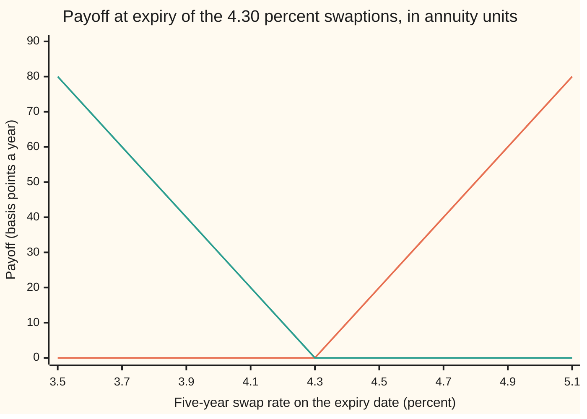
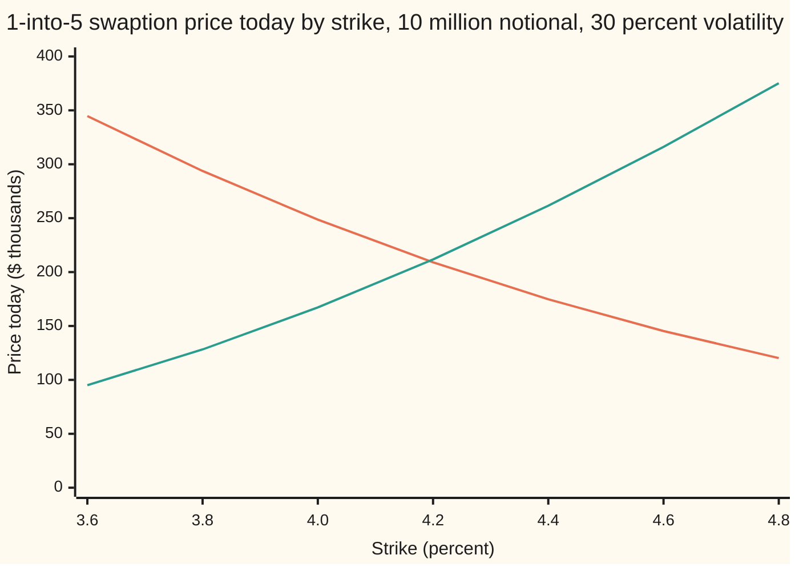

# Swaptions: the right to enter a swap, priced with Black on the forward swap rate

[Syllabus](../../../SYLLABUS.md) → [Financial mathematics](../../../SYLLABUS.md#w12) → [Caps, Floors and Swaptions](../../../SYLLABUS.md#w12-s29) → Swaptions

---

## General Overview

A company plans to borrow 10 million dollars in one year, for five years, at a floating rate. It fears rates will rise before then. Today it can buy a contract that says: *one year from now, the holder may enter a five-year swap paying a fixed 4.30 percent and receiving the floating rate.* The holder is not obliged to. If swap rates have risen above 4.30 percent by then, the company takes the swap and its borrowing cost is capped at 4.30 percent. If they have fallen, it walks away and borrows cheaply.

That contract is an option whose underlying is a swap. From here on it is called a **swaption**. The right to *pay* fixed is a **payer swaption**; the right to *receive* fixed is a **receiver swaption**. The fixed rate written in, 4.30 percent here, is the **strike**. This one is a "1-into-5": one year to the decision, five years of swap after it.

On this morning's curve, with swap rates moving 30 percent a year in the lognormal sense (explained below), the payer costs **191,292.21 dollars**, which is 1.91 percent of the notional (the amount the interest is worked out on, never exchanged). The receiver at the same strike costs 235,981.01 dollars.

The price is Black's option formula on the **forward swap rate**, the fair fixed rate today for the swap starting in a year (4.1937 percent here), multiplied by the **annuity**: the value today of one unit of rate paid on each of the swap's five payment dates. The annuity is the unit the option is counted in.

**A swaption is worth the annuity times Black's formula on the forward swap rate, and payer minus receiver is exactly the forward swap.**

**What kind of fact this is:** a model: the forward swap rate is *taken* to spread lognormally, an assumption that fits markets well enough near the money and fails away from it. Inside the model the price is a theorem, proved on this card in Why it works. Payer-minus-receiver parity is a theorem that needs no model at all, also proved there.

### The picture: what exercise is worth, counted in annuities

The holder exercises if the swap in hand beats the market's. Counted in units of the annuity on the expiry date, each option pays the gap between the two rates, in basis points a year (a basis point is one hundredth of a percentage point).



Rising line: the payer, which pays when the swap rate ends above 4.30 percent. Falling line: the receiver, which pays when it ends below. To turn basis points a year into dollars, multiply by the notional and by the annuity on the expiry date. That last factor is random today, and Why it works shows how it drops out.

---

## The formula

Notation first, in words. The underlying swap starts at $T_0$, the option's expiry, and pays fixed on dates $T_1$ to $T_n$; a small letter set low, like the $i$ in $T_i$, names which date. $D(t)$ is the discount factor: today's price of one dollar paid at time $t$. The Greek capital sigma, $\sum$, means "add up the terms for $i = 1$ to $n$". $N(x)$ is the area under the standard bell curve to the left of $x$ (see [Black–Scholes call](../08-The%20Black-Scholes%20call%20and%20put/01-black-scholes-call.md)).

$$V_{\text{pay}} = L\,A\,\big[F\,N(d_1) - K\,N(d_2)\big], \qquad V_{\text{rec}} = L\,A\,\big[K\,N(-d_2) - F\,N(-d_1)\big]$$

**Read it aloud:** the money value of one unit of rate on this swap, times the rate that might be received minus the rate that might be paid, each weighted by its own chance of exercise.

The two ingredients come from the curve, exactly as on [The par swap rate](../28-Swaps/02-par-swap-rate-and-annuity.md), only for a swap that starts later:

$$A = \sum_{i=1}^{n} \alpha_i\, D(T_i), \qquad F = \frac{D(T_0) - D(T_n)}{A}$$

The two cut-offs:

$$d_1 = \frac{\ln(F/K) + \tfrac12\sigma^2 T}{\sigma\sqrt{T}}, \qquad d_2 = d_1 - \sigma\sqrt{T}$$

In words: $d_2$ is how many standard deviations of the log swap rate separate the strike from the forward, after the lognormal drag; $d_1$ sits one standard deviation higher. No interest rate appears inside them. Every rate on the curve has already been spent building $A$ and $F$.

And the identity that needs no model:

$$V_{\text{pay}} - V_{\text{rec}} = L\,A\,(F - K)$$

| Symbol | Plain meaning | In our example | Push it up and the answer… |
| --- | --- | --- | --- |
| $V_{\text{pay}}$, $V_{\text{rec}}$ | today's price of the payer and of the receiver swaption | 191,292.21 and 235,981.01 dollars | — |
| $L$ | the notional: the amount the interest is worked out on, never exchanged | 10,000,000 dollars | both scale in proportion |
| $A$, $A_T$ | the annuity: today's value of one unit of rate paid on every fixed date of the future swap, in years; $A_T$ is the same thing valued on the expiry date, unknown today | 4.204423 | both rise: each basis point is worth more money |
| $F$ | the forward swap rate: the fixed rate that makes the swap starting at $T_0$ worth zero today | 4.1937 percent | payer rises, receiver falls |
| $S_T$ | the five-year swap rate as it actually fixes on the expiry date | unknown today | — |
| $K$ | the strike: the fixed rate written into the swaption | 4.30 percent | payer falls, receiver rises |
| $\sigma$ | volatility: the yearly spread of the log of the swap rate. Say "sigma". | 30 percent, as 0.30 | both rise: a wider spread helps, the downside is already capped |
| $T$, $T_0$ | time to expiry in years, which is also the swap's start date | 1 | both rise: more time for the rate to move |
| $T_i$, $T_1$, $T_n$, $i$, $n$, $\alpha_i$, $\sum$ | the fixed payment dates; the first; the last; the count of a date; the number of dates; the length of period $i$ as a fraction of a year; add up over $i$ | years 2 to 6; 2; 6; 1 to 5; 5; 1 each | a longer swap adds terms to $A$ |
| $D(t)$, $t$, $f_i$ | the discount factor at time $t$, a time in years; the one-year forward rate for year $i$, which builds it | D(1) = 0.952381 to D(6) = 0.776060; 5.00 down to 3.90 percent | — |
| $N(x)$ | the bell-curve area left of $x$: a probability between 0 and 1 | N(d1) = 0.526538, N(d2) = 0.407713 | — |
| $d_1$, $d_2$ | the rate-side and strike-side cut-offs, in standard deviations | 0.066569 and −0.233431 | — |

**Conventions verified 28 Sep 2026.** Every accrual here is set by hand to exactly one year and the fixed leg pays annually, so the arithmetic stays visible. Real contracts compute each $\alpha_i$ from calendar dates under a day-count rule named in the contract ([Day counts](../01-Money%2C%20Dates%20and%20Discounting/02-day-counts-and-dates.md)), and state whether exercise delivers the swap itself (physical settlement, assumed here) or a cash sum computed from a formula annuity (cash settlement). Premiums are quoted three ways: upfront as a percentage of notional (1.91 percent here), as basis points a year of annuity (45.50 here), or as a volatility.

### When it holds

- **The swap rate spreads lognormally with one volatility.** Markets quote a different $\sigma$ at each strike, the smile ([SABR for rates](07-sabr-for-rates-and-the-volatility-cube.md)). Using the wrong one is off by roughly vega times the error: 7,018.63 dollars per volatility point here.
- **Rates stay positive.** A lognormal rate can never touch zero, and the formula cannot even be evaluated at a negative forward. Since the 2010s desks quote in normal or shifted volatility instead ([Rate volatilities](06-normal-and-shifted-volatilities-for-rates.md)).
- **One exercise date.** This is a European swaption. A Bermudan swaption, exercisable on several dates, has no closed formula.
- **One curve, no default.** The shortcut $F = (D(T_0) - D(T_n))/A$ needs the same curve to forecast and discount, and both parties to pay; otherwise the floating leg is summed coupon by coupon on its own curve ([Multi-curve](../28-Swaps/04-basis-swaps-and-the-multi-curve-framework.md)).
- **Physical settlement.** A cash-settled swaption pays a formula annuity in place of $A_T$, so the random ratio does not cancel: the formula is then an approximation, and payer minus receiver need not equal the forward swap.
- **Parity needs none of the rest.** It is a statement about payoffs, true for any volatility and any smile.

---

## Why it works

### Step 0: count money in annuities, and the swap becomes one number

Exercise delivers not cash but a five-year stream of payments, worth whatever the whole curve on the expiry date says. The rescue: the stream's value is always *the annuity on that date times a rate gap*. Keep the books in units of the annuity instead of in dollars and the annuity cancels, leaving an option on one number, the swap rate, which Black's formula prices.

### Step 1: what exercise delivers

Write $D_T(t)$ for the discount factor as it will stand on the expiry date. On that date $T_0$, a swap paying $K$ fixed and receiving floating has, by the par-swap theorem applied then, a floating leg worth $1 - D_T(T_n)$ per dollar and a fixed leg worth $K A_T$. The market's five-year swap rate then is $S_T = (1 - D_T(T_n))/A_T$. So the swap is worth $L\,A_T\,(S_T - K)$ to the fixed payer.

The holder exercises only when that is positive. So the payer pays $L\,A_T \max(S_T - K, 0)$ on the expiry date and the receiver pays $L\,A_T \max(K - S_T, 0)$. The chart above is these payoffs divided by $L\,A_T$.

### Step 2: price in annuity units, and the random annuity cancels

Any payoff can be priced today by the rule of [State prices](../03-Contracts%20and%20No-Arbitrage/07-state-prices-and-risk-neutral-pricing-in-one-period.md): add up each outcome's payoff times the price today of a dollar in that outcome. Regroup that sum. Divide every payoff by the annuity it will face, and multiply every state price by the same annuity. Nothing has changed, but the new weights are positive and add to exactly one, so they are probabilities. They are called the **annuity measure**. In words, the rule becomes:

> **today's value = today's annuity × the average, under the annuity measure, of (payoff ÷ annuity on the expiry date).**

For the payer, payoff ÷ annuity is $L\max(S_T - K, 0)$. The random $A_T$ has gone. What remains is $L\,A$ times the average of a plain call payoff on $S_T$.

<details>
<summary>Detailed proof: the annuity weights are probabilities, and $F$ is the average swap rate</summary>

Give each possible outcome on the expiry date a state price $\pi(\omega)$: the price today of one dollar paid at $T$ in that outcome and nothing otherwise. A payoff $X(\omega)$ is worth $\sum_\omega \pi(\omega)X(\omega)$ today.

Write this as $A \sum_\omega q(\omega)\,X(\omega)/A_T(\omega)$, with weights $q(\omega) = \pi(\omega)A_T(\omega)/A$. Each weight is positive, since state prices and annuities are. Their sum is $\sum \pi A_T / A$. The top, $\sum \pi A_T$, is today's price of a claim worth $A_T$ at the expiry date. Holding the five zero-coupon bonds that make up the annuity from today to $T$ is such a claim, and it costs $A$. So the weights add to one.

Now take the payoff of a portfolio bought today: one zero-coupon bond maturing at $T_0$, less one maturing at $T_n$. At $T$ it is worth $1 - D_T(T_n) = S_T A_T$. Today it costs $D(T_0) - D(T_n) = F A$. The rule gives $F A = A \sum_\omega q(\omega)S_T(\omega)$, so the weighted average of $S_T$ is $F$. **Under the annuity measure the average future swap rate is today's forward swap rate**: the rate has no drift in these units.

</details>

### Step 3: the model: a lognormal swap rate centred on $F$

Step 2 fixes the average of $S_T$ at $F$ but not its spread. The model supplies it: $\ln S_T$ follows a bell curve of spread $\sigma\sqrt{T}$, centred at $\ln F - \tfrac12\sigma^2 T$. The $-\tfrac12\sigma^2 T$ is the lognormal drag that puts the average of $S_T$ itself back on $F$. This is the only assumption on the card, and the only place $\sigma$ enters.

### Step 4: the average is Black's bracket

The average of $\max(S_T - K, 0)$ splits in two, as for the Black-Scholes call. The strike half is $K$ times the chance $S_T$ ends above $K$, which is $N(d_2)$. The rate half is the average of $S_T$ over those same outcomes; weighting outcomes by the rate slides the bell curve up one standard deviation, so it is $F\,N(d_1)$. Their difference is the bracket. Multiply by $L\,A$ and the payer price is done; the receiver follows the same way with the inequalities turned round.

<details>
<summary>The algebra behind the bracket, if wanted</summary>

Write $S_T = F e^{-\frac12 v^2 + v z}$ with $v = \sigma\sqrt T$ and $z$ a standard bell-curve draw. Then $S_T > K$ exactly when $z > -d_2$, which has chance $N(d_2)$. For the rate half, $e^{vz}e^{-z^2/2} = e^{\frac12 v^2}e^{-(z - v)^2/2}$: the bell curve re-centred at $\sigma\sqrt T$. The $e^{\frac12 v^2}$ cancels the drag, and the lower limit $-d_2$ becomes $-d_1$. So the average of $S_T$ over $S_T > K$ is $F\,N(d_1)$.

</details>

The simulation in the code shows both chances. Of 200,000 simulated swap rates, 0.4072 end above the strike, against $N(d_2)$ = 0.4077. Weight each by $S_T/F$ and the share becomes 0.5255, against $N(d_1)$ = 0.5265.

### Step 5: payer minus receiver is the forward swap, in any model

For any number $x$, $\max(x - K, 0) - \max(K - x, 0) = x - K$. So holding the payer and having sold the receiver delivers $L\,A_T(S_T - K)$ on the expiry date whatever happens: exactly the forward swap paying $K$. Equal payoffs in every outcome force equal prices, or buying the cheap one and selling the dear one makes money for nothing. So $V_{\text{pay}} - V_{\text{rec}} = L\,A\,(F - K)$. No $\sigma$ appears, and no lognormal assumption was used. This is [Caps and floors](02-caps-floors-and-parity.md) for a swap instead of a strip of caplets.

Here $F$ is 10.63 basis points below the strike, so the forward swap is worth −44,688.80 dollars to the fixed payer: the receiver's extra cost. Struck at $F$ itself, payer and receiver cost the same: 210,237.41 dollars each.

A second route reaches the same formula through the hedge: hold the payer, enter an opposite forward swap sized so small rate moves cancel, and demand the pair earn nothing extra. That route and its daily arithmetic are on [Swaption Greeks](08-swaption-greeks-and-hedging.md); the measure behind Step 2 gets its full treatment on [The annuity measure](05-the-annuity-measure.md).

---

## Worked numbers, by hand

The curve is given by six one-year forward rates: 5.00, 4.60, 4.30, 4.10, 4.00 and 3.90 percent. The first five are the curve of par-swap-rate-and-annuity; the sixth extends it one year so a swap starting in a year can run five.

| Step | Arithmetic | Value |
| --- | --- | --- |
| discount factors D(1) to D(3) | 1 ÷ 1.05; then ÷ 1.046; then ÷ 1.043 | 0.952381, 0.910498, 0.872961 |
| discount factors D(4) to D(6) | then ÷ 1.041; ÷ 1.040; ÷ 1.039 | 0.838579, 0.806326, 0.776060 |
| annuity $A$, years 2 to 6 | 0.910498 + 0.872961 + 0.838579 + 0.806326 + 0.776060 | 4.204423 |
| forward swap rate $F$ | (0.952381 − 0.776060) ÷ 4.204423 | 4.1937 percent |
| $\ln(F/K)$ | ln(0.041937 ÷ 0.043) | −0.0250292 |
| half of $\sigma^2 T$ | 0.5 × 0.30 × 0.30 × 1 | 0.045000 |
| $d_1$ | (−0.0250292 + 0.045) ÷ 0.30 | 0.066569 |
| $d_2$ | 0.066569 − 0.30 | −0.233431 |
| $N(d_1)$, $N(d_2)$ | bell-curve table | 0.526538, 0.407713 |
| rate half, strike half, in basis points | 10,000 × 0.0419371 × 0.526538; 10,000 × 0.043 × 0.407713 | 220.8146, 175.3168 |
| bracket | 220.8146 − 175.3168 | 45.4978 basis points |
| money value of one basis point a year | 10,000,000 × 4.204423 × 0.0001 | 4,204.42 dollars |
| **payer** | 4,204.42 × 45.4978 | **191,292.21 dollars** (1.91 percent of notional) |
| receiver, same inputs | $L\,A\,[K\,N(-d_2) - F\,N(-d_1)]$ | 235,981.01 dollars |
| parity check | 191,292.21 − 235,981.01; and $L\,A\,(F - K)$ | −44,688.80 both |

The company pays 191,292.21 dollars today, 1.91 percent of the notional, for the right to fix its future five-year borrowing at 4.30 percent. The bracket itself, 45.50 basis points a year, is the premium in the form desks use to compare swaptions of different sizes.

### Greeks: how the price moves

| Greek | Payer | Receiver | What it says |
| --- | --- | --- | --- |
| delta, dollars per basis point of $F$ | 2,213.79 | −1,990.64 | the two differ by 4,204.42, the forward swap's own delta, as parity demands |
| hedge ratio, forward swap per unit of notional | 0.5265 | −0.4735 | $N(d_1)$ and $-N(-d_1)$ |
| vega, dollars per volatility point | 7,018.63 | 7,018.63 | equal, because parity has no $\sigma$ in it |

The code checks the payer delta by nudging $F$, and vega by nudging $\sigma$.

### What breaks if you drop a piece

Right answer for the payer: 191,292.21 dollars.

| Mistake | Comes out at | What went wrong |
| --- | --- | --- |
| Discount once by D(1) = 0.952381 in place of the annuity | 43,331.28 dollars | The option delivers five years of payments, not one; the annuity counts them |
| Use today's five-year swap rate, 4.4210 percent, as $F$ | 244,970.71 dollars | That swap starts today; the option is on the swap starting in a year |
| Sum the annuity over years 1 to 5, the fixing dates | 162,384.61 dollars | Fixed payments fall at the end of each period, years 2 to 6 |
| Use $N(d_2)$ on both halves | −18,220.23 dollars | A negative price for a right that can be thrown away: the rate half needs its own tilted chance |

---

## Code, from first principles, and it actually runs

The code builds the discount factors from the six forwards, finds the forward swap rate twice (the telescoped ratio, and the discount-weighted average of the forwards), then prices the payer by **three independent roads**: Black's formula with a hand-built bell-curve area; a Simpson's-rule average of the payoff over the bell curve that never forms $d_1$ or $d_2$; and a 200,000-path simulation with its own random-number generator. A fourth road checks parity: payer minus receiver, both by the integral, against the forward swap valued coupon by coupon from the forwards, with no $F$ in it. Delta and vega are checked by nudging. Then come the wrong answers, the experiments and the chart points.

### Python

```python
# Swaptions, payer and receiver -- the check behind the card.  Standard library only.
# The bell-curve area, the integrator and the random numbers are all written here;
# nothing imported already knows a swaption price.
from math import log, sqrt, exp, cos, pi

FWD = [0.050, 0.046, 0.043, 0.041, 0.040, 0.039]    # one-year forward rates, years 1..6
L, K, SIG, T = 10_000_000.0, 0.043, 0.30, 1.0        # notional, strike, volatility, expiry in years
MASK = (1 << 64) - 1

def phi(x): return exp(-0.5 * x * x) / sqrt(2.0 * pi)   # bell-curve height at x

def simpson(f, a, b, n):                                 # area under f from a to b, n even slices
    h = (b - a) / n
    s = f(a) + f(b)
    for i in range(1, n):
        s += (4 if i % 2 else 2) * f(a + i * h)
    return s * h / 3.0

def ncdf(x):                                             # N(x): bell-curve area left of x
    if x < -12.0: return 0.0
    if x > 12.0: return 1.0
    return 0.5 + simpson(phi, 0.0, x, 2000)

D = [1.0]                                                # D[i]: today's price of 1 dollar at year i
for f in FWD: D.append(D[-1] / (1.0 + f))
A = sum(D[2:7])                                          # annuity: 1 unit of rate paid at years 2..6
F = (D[1] - D[6]) / A                                    # forward swap rate, road 1: the telescope
F_avg = sum(D[i] * FWD[i - 1] for i in range(2, 7)) / A  # road 2: forwards weighted by discount

def black(f, k, sig, t, a):                              # the formula: payer, receiver, d1, d2
    v = sig * sqrt(t)
    d1 = (log(f / k) + 0.5 * v * v) / v
    d2 = d1 - v
    return a * (f * ncdf(d1) - k * ncdf(d2)), a * (k * ncdf(-d2) - f * ncdf(-d1)), d1, d2

pay, rec, d1, d2 = black(F, K, SIG, T, A)
pay, rec = L * pay, L * rec

def by_integral(payoff, n=40000):                        # road 2: average the payoff over the bell curve
    v = SIG * sqrt(T)
    return L * A * simpson(lambda z: payoff(F * exp(-0.5 * v * v + v * z)) * phi(z), -10.0, 10.0, n)

pay_int = by_integral(lambda s: max(s - K, 0.0))
rec_int = by_integral(lambda s: max(K - s, 0.0))
swap_cc = L * sum(D[i] * (FWD[i - 1] - K) for i in range(2, 7))   # forward swap, coupon by coupon

state = 20260928
def uniform():                                           # xorshift64*, then a number in (0, 1)
    global state
    state ^= state >> 12
    state ^= (state << 25) & MASK
    state ^= state >> 27
    return (((state * 0x2545F4914F6CDD1D) & MASK) >> 11) / 9007199254740992.0 + 1.0 / 18014398509481984.0

def by_simulation(paths):                                # road 3: draw swap rates, average the payoffs
    v = SIG * sqrt(T)
    tot = tot2 = ex = exw = 0.0
    for _ in range(paths):
        z = sqrt(-2.0 * log(uniform())) * cos(2.0 * pi * uniform())   # Box-Muller: one bell-curve draw
        s = F * exp(-0.5 * v * v + v * z)
        p = max(s - K, 0.0)
        tot += p; tot2 += p * p
        if s > K: ex += 1.0; exw += s / F
    m = tot / paths
    return L * A * m, L * A * sqrt((tot2 / paths - m * m) / paths), ex / paths, exw / paths

mc, se, ex_frac, ex_wfrac = by_simulation(200_000)

h = 1e-6                                                 # Greeks: formula and a nudge
delta_f = L * A * ncdf(d1) * 1e-4
delta_b = L * (black(F + h, K, SIG, T, A)[0] - black(F - h, K, SIG, T, A)[0]) / (2 * h) * 1e-4
vega_f = L * A * F * phi(d1) * sqrt(T) * 0.01
vega_b = L * (black(F, K, SIG + h, T, A)[0] - black(F, K, SIG - h, T, A)[0]) / (2 * h) * 0.01

A_early = sum(D[1:6])                                    # wrong: annuity over years 1..5
S_spot = (1.0 - D[5]) / sum(D[1:6])                      # wrong underlying: 5-year swap starting today
wrong = [
    ("wrong: D(1) in place of the annuity", L * D[1] * (F * ncdf(d1) - K * ncdf(d2))),
    ("wrong: spot 5-year swap rate as F", L * black(S_spot, K, SIG, T, A)[0]),
    ("wrong: annuity over years 1 to 5", L * black((D[1] - D[6]) / A_early, K, SIG, T, A_early)[0]),
    ("wrong: N(d2) on both halves", L * A * (F - K) * ncdf(d2)),
]
print("D(1) to D(6)" + "".join(f" {x:.6f}" for x in D[1:]))
rows = [("annuity A", A), ("F, telescope", F), ("F, weighted forwards", F_avg),
        ("F minus K, bp", 1e4 * (F - K)), ("ln(F/K)", log(F / K)), ("half sigma^2 T", 0.5 * SIG * SIG * T), ("d1", d1), ("d2", d2), ("N(d1)", ncdf(d1)), ("N(d2)", ncdf(d2)), ("N(-d1)", ncdf(-d1)),
        ("F N(d1), bp", 1e4 * F * ncdf(d1)), ("K N(d2), bp", 1e4 * K * ncdf(d2)), ("bracket, bp", 1e4 * (F * ncdf(d1) - K * ncdf(d2))),
        ("1 payer, formula", pay), ("2 payer, Simpson", pay_int), ("3 payer, simulation", mc),
        ("  simulation std error", se), ("  simulation gap, std errors", (pay - mc) / se), ("  payer, percent of notional", 100 * pay / L),
        ("  payer, bp a year of annuity", 1e4 * pay / (L * A)), ("L A times one bp", L * A * 1e-4),
        ("receiver, formula", rec), ("receiver, Simpson", rec_int),
        ("4 payer - receiver", pay_int - rec_int), ("  swap, coupon by coupon", swap_cc),
        ("  L A (F - K)", L * A * (F - K)),
        ("exercise share, simulated", ex_frac), ("rate-weighted share, sim.", ex_wfrac),
        ("5 payer delta per bp, formula", delta_f), ("  payer delta per bp, nudge", delta_b),
        ("  receiver delta per bp", -L * A * ncdf(-d1) * 1e-4),
        ("  vega per vol point, formula", vega_f), ("  vega per vol point, nudge", vega_b)] + wrong + [
        ("spot 5-year swap rate", S_spot),
        ("try: sigma 0.20 payer", L * black(F, K, 0.20, T, A)[0]),
        ("try: sigma 0.40 payer", L * black(F, K, 0.40, T, A)[0]),
        ("try: strike = F, payer", L * black(F, F, SIG, T, A)[0]),
        ("try: strike = F, receiver", L * black(F, F, SIG, T, A)[1])]
for name, v in rows:
    print(f"{name:<36} {v:>16.6f}")

print("\nchart, swap rate at expiry %   " + " ".join(f"{3.5 + 0.2 * i:6.1f}" for i in range(9)))
print("chart, payer payoff, bp a year " + " ".join(f"{max(3.5 + 0.2 * i - 4.3, 0) * 100:6.0f}" for i in range(9)))
print("chart, receiver payoff, bp     " + " ".join(f"{max(4.3 - 3.5 - 0.2 * i, 0) * 100:6.0f}" for i in range(9)))
ks = [0.036 + 0.002 * i for i in range(7)]
print("chart, strike %                " + " ".join(f"{100 * k:6.1f}" for k in ks))
print("chart, payer, $ thousands      " + " ".join(f"{L * black(F, k, SIG, T, A)[0] / 1e3:6.2f}" for k in ks))
print("chart, receiver, $ thousands   " + " ".join(f"{L * black(F, k, SIG, T, A)[1] / 1e3:6.2f}" for k in ks))

assert abs(pay - 191290.0) < 50.0,                  "the card's worked number, 1.9 percent of notional"
assert abs(pay_int - pay) < 0.01,                   "Simpson road lands on the formula to the cent"
assert abs(mc - pay) < 4.0 * se,                    "simulation road within four standard errors"
assert abs((pay_int - rec_int) - swap_cc) < 0.01,   "parity: payer - receiver = the forward swap"
assert abs(F - F_avg) < 1e-12,                      "forward swap rate: telescope = weighted forwards"
assert abs(delta_f - delta_b) < 1e-3,               "delta: formula = nudge"
assert abs(rec - rec_int) < 0.01,                   "receiver formula = Simpson road"
assert abs(vega_f - vega_b) < 1e-3,                 "vega: formula = nudge"
print("ALL CHECKS PASS")
```

**Ran 2026-09-28 on macOS, Python 3.14.6, standard library only. All checks passed. Output, pasted from the run:**

```
D(1) to D(6) 0.952381 0.910498 0.872961 0.838579 0.806326 0.776060
annuity A                                    4.204423
F, telescope                                 0.041937
F, weighted forwards                         0.041937
F minus K, bp                              -10.628997
ln(F/K)                                     -0.025029
half sigma^2 T                               0.045000
d1                                           0.066569
d2                                          -0.233431
N(d1)                                        0.526538
N(d2)                                        0.407713
N(-d1)                                       0.473462
F N(d1), bp                                220.814634
K N(d2), bp                                175.316788
bracket, bp                                 45.497846
1 payer, formula                        191292.207551
2 payer, Simpson                        191292.203133
3 payer, simulation                     190453.762272
  simulation std error                     792.685384
  simulation gap, std errors                 1.057728
  payer, percent of notional                 1.912922
  payer, bp a year of annuity               45.497846
L A times one bp                          4204.423349
receiver, formula                       235981.009894
receiver, Simpson                       235981.005475
4 payer - receiver                      -44688.802343
  swap, coupon by coupon                -44688.802343
  L A (F - K)                           -44688.802343
exercise share, simulated                    0.407165
rate-weighted share, sim.                    0.525500
5 payer delta per bp, formula             2213.787309
  payer delta per bp, nudge               2213.787308
  receiver delta per bp                  -1990.636040
  vega per vol point, formula             7018.634450
  vega per vol point, nudge               7018.634448
wrong: D(1) in place of the annuity      43331.282250
wrong: spot 5-year swap rate as F       244970.713212
wrong: annuity over years 1 to 5        162384.607315
wrong: N(d2) on both halves             -18220.226249
spot 5-year swap rate                        0.044210
try: sigma 0.20 payer                   120993.940837
try: sigma 0.40 payer                   261247.712092
try: strike = F, payer                  210237.408755
try: strike = F, receiver               210237.408755

chart, swap rate at expiry %      3.5    3.7    3.9    4.1    4.3    4.5    4.7    4.9    5.1
chart, payer payoff, bp a year      0      0      0      0      0     20     40     60     80
chart, receiver payoff, bp         80     60     40     20      0      0      0      0      0
chart, strike %                   3.6    3.8    4.0    4.2    4.4    4.6    4.8
chart, payer, $ thousands      344.68 293.77 248.63 209.08 174.77 145.31 120.23
chart, receiver, $ thousands    95.06 128.23 167.19 211.72 261.51 316.13 375.14
ALL CHECKS PASS
```

The integral lands within a cent of the formula; the simulation is 1.06 standard errors below it, an ordinary sampling miss. Parity holds to the cent against a swap valued without $F$.

### Rust

The same checks with the same inputs, std only. The random-number generator is the same algorithm written again, so the simulated numbers agree too.

```rust
// Swaptions, payer and receiver -- the same check as the Python, in Rust.  std only, no crates.
// The bell-curve area, the integrator and the random numbers are all written here.
use std::f64::consts::PI;

const FWD: [f64; 6] = [0.050, 0.046, 0.043, 0.041, 0.040, 0.039]; // one-year forwards, years 1..6
const L: f64 = 10_000_000.0; // notional, dollars
const K: f64 = 0.043; // strike
const SIG: f64 = 0.30; // volatility of the forward swap rate
const T: f64 = 1.0; // expiry, years

fn phi(x: f64) -> f64 { (-0.5 * x * x).exp() / (2.0 * PI).sqrt() }

fn simpson<G: Fn(f64) -> f64>(f: G, a: f64, b: f64, n: usize) -> f64 {
    let h = (b - a) / n as f64;
    let mut s = f(a) + f(b);
    for i in 1..n { s += if i % 2 == 1 { 4.0 } else { 2.0 } * f(a + i as f64 * h); }
    s * h / 3.0
}

fn ncdf(x: f64) -> f64 {
    if x < -12.0 { return 0.0; }
    if x > 12.0 { return 1.0; }
    0.5 + simpson(phi, 0.0, x, 2000)
}

// payer and receiver per unit notional, then d1 and d2
fn black(f: f64, k: f64, sig: f64, t: f64, a: f64) -> (f64, f64, f64, f64) {
    let v = sig * t.sqrt();
    let d1 = ((f / k).ln() + 0.5 * v * v) / v;
    let d2 = d1 - v;
    (a * (f * ncdf(d1) - k * ncdf(d2)), a * (k * ncdf(-d2) - f * ncdf(-d1)), d1, d2)
}

struct Rng(u64);
impl Rng {
    fn uniform(&mut self) -> f64 { // xorshift64*, then a number in (0, 1)
        self.0 ^= self.0 >> 12;
        self.0 ^= self.0 << 25;
        self.0 ^= self.0 >> 27;
        (self.0.wrapping_mul(0x2545F4914F6CDD1D) >> 11) as f64 / 9007199254740992.0 + 1.0 / 18014398509481984.0
    }
}

fn main() {
    let mut d = vec![1.0_f64]; // d[i]: today's price of 1 dollar at year i
    for f in FWD { let last = d[d.len() - 1]; d.push(last / (1.0 + f)); }
    let a: f64 = d[2..7].iter().sum();
    let fsw = (d[1] - d[6]) / a;
    let f_avg: f64 = (2..7).map(|i| d[i] * FWD[i - 1]).sum::<f64>() / a;
    let (p1, r1, d1, d2) = black(fsw, K, SIG, T, a);
    let (pay, rec) = (L * p1, L * r1);

    let v = SIG * T.sqrt();
    let by_integral = |payoff: &dyn Fn(f64) -> f64| {
        L * a * simpson(|z| payoff(fsw * (-0.5 * v * v + v * z).exp()) * phi(z), -10.0, 10.0, 40000)
    };
    let pay_int = by_integral(&|s| (s - K).max(0.0));
    let rec_int = by_integral(&|s| (K - s).max(0.0));
    let swap_cc = L * (2..7).map(|i| d[i] * (FWD[i - 1] - K)).sum::<f64>();

    let mut rng = Rng(20260928);
    let paths = 200_000usize;
    let (mut tot, mut tot2, mut ex, mut exw) = (0.0_f64, 0.0_f64, 0.0_f64, 0.0_f64);
    for _ in 0..paths {
        let u1 = rng.uniform();
        let u2 = rng.uniform();
        let z = (-2.0 * u1.ln()).sqrt() * (2.0 * PI * u2).cos();
        let s = fsw * (-0.5 * v * v + v * z).exp();
        let p = (s - K).max(0.0);
        tot += p; tot2 += p * p;
        if s > K { ex += 1.0; exw += s / fsw; }
    }
    let m = tot / paths as f64;
    let mc = L * a * m;
    let se = L * a * ((tot2 / paths as f64 - m * m) / paths as f64).sqrt();

    let h = 1e-6;
    let delta_f = L * a * ncdf(d1) * 1e-4;
    let delta_b = L * (black(fsw + h, K, SIG, T, a).0 - black(fsw - h, K, SIG, T, a).0) / (2.0 * h) * 1e-4;
    let vega_f = L * a * fsw * phi(d1) * T.sqrt() * 0.01;
    let vega_b = L * (black(fsw, K, SIG + h, T, a).0 - black(fsw, K, SIG - h, T, a).0) / (2.0 * h) * 0.01;

    let a_early: f64 = d[1..6].iter().sum();
    let s_spot = (1.0 - d[5]) / a_early;
    println!("D(1) to D(6){}", d[1..].iter().map(|x| format!(" {:.6}", x)).collect::<String>());
    let rows: Vec<(&str, f64)> = vec![
        ("annuity A", a), ("F, telescope", fsw), ("F, weighted forwards", f_avg),
        ("F minus K, bp", 1e4 * (fsw - K)), ("ln(F/K)", (fsw / K).ln()), ("half sigma^2 T", 0.5 * SIG * SIG * T), ("d1", d1), ("d2", d2), ("N(d1)", ncdf(d1)), ("N(d2)", ncdf(d2)), ("N(-d1)", ncdf(-d1)),
        ("F N(d1), bp", 1e4 * fsw * ncdf(d1)), ("K N(d2), bp", 1e4 * K * ncdf(d2)), ("bracket, bp", 1e4 * (fsw * ncdf(d1) - K * ncdf(d2))),
        ("1 payer, formula", pay), ("2 payer, Simpson", pay_int), ("3 payer, simulation", mc),
        ("  simulation std error", se), ("  simulation gap, std errors", (pay - mc) / se), ("  payer, percent of notional", 100.0 * pay / L),
        ("  payer, bp a year of annuity", 1e4 * pay / (L * a)), ("L A times one bp", L * a * 1e-4),
        ("receiver, formula", rec), ("receiver, Simpson", rec_int),
        ("4 payer - receiver", pay_int - rec_int), ("  swap, coupon by coupon", swap_cc),
        ("  L A (F - K)", L * a * (fsw - K)),
        ("exercise share, simulated", ex / paths as f64), ("rate-weighted share, sim.", exw / paths as f64),
        ("5 payer delta per bp, formula", delta_f), ("  payer delta per bp, nudge", delta_b),
        ("  receiver delta per bp", -L * a * ncdf(-d1) * 1e-4),
        ("  vega per vol point, formula", vega_f), ("  vega per vol point, nudge", vega_b),
        ("wrong: D(1) in place of the annuity", L * d[1] * (fsw * ncdf(d1) - K * ncdf(d2))),
        ("wrong: spot 5-year swap rate as F", L * black(s_spot, K, SIG, T, a).0),
        ("wrong: annuity over years 1 to 5", L * black((d[1] - d[6]) / a_early, K, SIG, T, a_early).0),
        ("wrong: N(d2) on both halves", L * a * (fsw - K) * ncdf(d2)),
        ("spot 5-year swap rate", s_spot),
        ("try: sigma 0.20 payer", L * black(fsw, K, 0.20, T, a).0),
        ("try: sigma 0.40 payer", L * black(fsw, K, 0.40, T, a).0),
        ("try: strike = F, payer", L * black(fsw, fsw, SIG, T, a).0),
        ("try: strike = F, receiver", L * black(fsw, fsw, SIG, T, a).1),
    ];
    for (name, x) in &rows { println!("{:<36} {:>16.6}", name, x); }

    let row = |label: &str, xs: Vec<String>| println!("{:<31}{}", label, xs.join(" "));
    println!();
    row("chart, swap rate at expiry %", (0..9).map(|i| format!("{:6.1}", 3.5 + 0.2 * i as f64)).collect());
    row("chart, payer payoff, bp a year", (0..9).map(|i| format!("{:6.0}", (3.5 + 0.2 * i as f64 - 4.3).max(0.0) * 100.0)).collect());
    row("chart, receiver payoff, bp", (0..9).map(|i| format!("{:6.0}", (4.3 - 3.5 - 0.2 * i as f64).max(0.0) * 100.0)).collect());
    let ks: Vec<f64> = (0..7).map(|i| 0.036 + 0.002 * i as f64).collect();
    row("chart, strike %", ks.iter().map(|k| format!("{:6.1}", 100.0 * k)).collect());
    row("chart, payer, $ thousands", ks.iter().map(|k| format!("{:6.2}", L * black(fsw, *k, SIG, T, a).0 / 1e3)).collect());
    row("chart, receiver, $ thousands", ks.iter().map(|k| format!("{:6.2}", L * black(fsw, *k, SIG, T, a).1 / 1e3)).collect());

    assert!((pay - 191290.0).abs() < 50.0, "the card's worked number, 1.9 percent of notional");
    assert!((pay_int - pay).abs() < 0.01, "Simpson road lands on the formula to the cent");
    assert!((mc - pay).abs() < 4.0 * se, "simulation road within four standard errors");
    assert!(((pay_int - rec_int) - swap_cc).abs() < 0.01, "parity: payer - receiver = the forward swap");
    assert!((fsw - f_avg).abs() < 1e-12, "forward swap rate: telescope = weighted forwards");
    assert!((delta_f - delta_b).abs() < 1e-3, "delta: formula = nudge");
    assert!((rec - rec_int).abs() < 0.01, "receiver formula = Simpson road");
    assert!((vega_f - vega_b).abs() < 1e-3, "vega: formula = nudge");
    println!("ALL CHECKS PASS");
}
```

**Ran 2026-09-28 on macOS, rustc 1.98.1, no crates. All checks passed. Output, pasted from the run:**

```
D(1) to D(6) 0.952381 0.910498 0.872961 0.838579 0.806326 0.776060
annuity A                                    4.204423
F, telescope                                 0.041937
F, weighted forwards                         0.041937
F minus K, bp                              -10.628997
ln(F/K)                                     -0.025029
half sigma^2 T                               0.045000
d1                                           0.066569
d2                                          -0.233431
N(d1)                                        0.526538
N(d2)                                        0.407713
N(-d1)                                       0.473462
F N(d1), bp                                220.814634
K N(d2), bp                                175.316788
bracket, bp                                 45.497846
1 payer, formula                        191292.207551
2 payer, Simpson                        191292.203133
3 payer, simulation                     190453.762272
  simulation std error                     792.685384
  simulation gap, std errors                 1.057728
  payer, percent of notional                 1.912922
  payer, bp a year of annuity               45.497846
L A times one bp                          4204.423349
receiver, formula                       235981.009894
receiver, Simpson                       235981.005475
4 payer - receiver                      -44688.802343
  swap, coupon by coupon                -44688.802343
  L A (F - K)                           -44688.802343
exercise share, simulated                    0.407165
rate-weighted share, sim.                    0.525500
5 payer delta per bp, formula             2213.787309
  payer delta per bp, nudge               2213.787308
  receiver delta per bp                  -1990.636040
  vega per vol point, formula             7018.634450
  vega per vol point, nudge               7018.634448
wrong: D(1) in place of the annuity      43331.282250
wrong: spot 5-year swap rate as F       244970.713212
wrong: annuity over years 1 to 5        162384.607315
wrong: N(d2) on both halves             -18220.226249
spot 5-year swap rate                        0.044210
try: sigma 0.20 payer                   120993.940837
try: sigma 0.40 payer                   261247.712092
try: strike = F, payer                  210237.408755
try: strike = F, receiver               210237.408755

chart, swap rate at expiry %      3.5    3.7    3.9    4.1    4.3    4.5    4.7    4.9    5.1
chart, payer payoff, bp a year      0      0      0      0      0     20     40     60     80
chart, receiver payoff, bp         80     60     40     20      0      0      0      0      0
chart, strike %                   3.6    3.8    4.0    4.2    4.4    4.6    4.8
chart, payer, $ thousands      344.68 293.77 248.63 209.08 174.77 145.31 120.23
chart, receiver, $ thousands    95.06 128.23 167.19 211.72 261.51 316.13 375.14
ALL CHECKS PASS
```

The two outputs agree line for line.

> [!TIP]
> **Try changing**
> Guess the direction first, then run it.
> - **Cut the volatility to 20 percent.** Set `SIG = 0.20`. The payer falls from 191,292.21 to **120,993.94** dollars. At 40 percent it is **261,247.71**. Volatility is the input that is argued over; everything else is read off the curve.
> - **Strike at the forward.** Set `K = F`. Payer and receiver both cost **210,237.41** dollars, since the forward swap they differ by is worth zero.
> - **Walk the strike.** The second chart below prints the payer and receiver at strikes from 3.6 to 4.8 percent. Guess where the two lines cross before looking.



Falling line: the payer, cheaper as the fixed rate it must pay goes up. Rising line: the receiver. They cross at the forward swap rate, 4.1937 percent, where parity makes them equal; at every strike the vertical gap between them is $L\,A\,(F - K)$.

---

## The usual mistake

> [!warning]
> **Treating the swaption as an option on one rate, discounted to one date.** The underlying is a five-year swap, and every basis point of swap rate on exercise is paid five times. The annuity carries that; replace it with the discount factor to expiry and the payer comes out at 43,331.28 dollars instead of 191,292.21. The annuity is not a discount factor bolted on; it is the unit the option is counted in.
>
> Smaller traps:
> - **Payer and receiver the wrong way round.** The payer gains when rates *rise*: the right to pay a fixed rate below the market's. A borrower buys payers; an investor who wants to lock in a yield buys receivers.
> - **Today's swap rate as the underlying.** The option is on the swap that starts at expiry. Today's five-year rate, 4.4210 percent, gives 244,970.71 dollars. On a flat curve the two rates coincide and the bug hides.
> - **The annuity over the wrong dates.** It runs over the fixed *payment* dates, years 2 to 6. Starting at year 1 gives 162,384.61 dollars.
> - **Volatility units.** $\sigma$ here is lognormal, 0.30, a proportion of the rate. A normal volatility quoted in basis points is a different number for the same price; feeding one into the other's formula is off by roughly a factor of the rate level.

---

## Where you meet it in real life

- **Borrowers hedging future debt.** A company with a bond to refinance buys a payer swaption: a ceiling on its future fixed rate, paid for up front.
- **Callable bonds and mortgages.** An issuer who may repay a fixed-rate bond early holds, in effect, a receiver swaption: when rates fall it refinances cheaper. Investors in such bonds and in mortgage pools are short that option.
- **Pension funds and insurers.** Long promises to pay make them lose when rates fall, so they buy receiver swaptions to protect the rate they can lock in.
- **The volatility market.** Swaptions are the most traded volatility instrument in rates. Their quoted volatilities, by expiry, swap length and strike, form the grid every rate model is fitted to ([SABR for rates](07-sabr-for-rates-and-the-volatility-cube.md)).
- **Caps versus swaptions.** A cap is a strip of options on single forward rates ([Caplets and floorlets](01-caplets-and-floorlets.md)); a swaption is one option on their weighted average. An option on an average is worth no more than the matching strip of options on its parts, and the gap measures how far the forward rates fail to move together.

> **Say it back**
> A swaption is the right to enter a swap on one future date at a fixed rate agreed now: a payer to pay fixed, a receiver to receive it. Exercise delivers a swap worth the annuity on that date times the rate gap. Counting money in annuities cancels that random annuity and leaves the forward swap rate with no drift. Assume it spreads lognormally and Black's formula prices the option, multiplied by today's annuity. Payer minus receiver is the forward swap, in any model.

---

## What this builds on

- [Caps and floors](02-caps-floors-and-parity.md): Black's formula applied to rates, and the parity argument that option minus mirror option is the underlying swap.
- [The par swap rate](../28-Swaps/02-par-swap-rate-and-annuity.md): the par rate as a ratio of floating leg to annuity, and the annuity as the exchange rate between a rate gap and money; this card applies both to a swap that starts later.

## Where this goes next

- [The annuity measure](05-the-annuity-measure.md): Step 2 in full: why dividing by a traded price makes every other price driftless, and what it changes in the model.
- [Rate volatilities](06-normal-and-shifted-volatilities-for-rates.md): the same swaption priced when rates can be zero or negative, and the conversion between the two volatility quotes.
- [Constant-maturity swaps](../32-Convexity%20and%20Exotics/02-cms-and-the-convexity-adjustment.md): a payment of the swap rate itself on one date, with no annuity attached, priced by a strip of these swaptions.

This card used the annuity measure in one step, on a short proof in a world of finitely many outcomes; the-annuity-measure shows why it works for any traded unit in continuous time, and what else it prices.

---

## Sources

Verified 28 Sep 2026: every link below resolves to the publisher's page.

- Black, Fischer. "The Pricing of Commodity Contracts." *Journal of Financial Economics* 3, no. 1–2 (1976): 167–179. [doi:10.1016/0304-405X(76)90024-6](https://doi.org/10.1016/0304-405X(76)90024-6). The formula for an option on a forward, which this card applies to the forward swap rate.
- Geman, Hélyette, Nicole El Karoui, and Jean-Charles Rochet. "Changes of Numéraire, Changes of Probability Measure and Option Pricing." *Journal of Applied Probability* 32, no. 2 (1995): 443–458. [doi:10.2307/3215299](https://doi.org/10.2307/3215299). Pricing in units of a traded asset: the general form of Step 2.
- Jamshidian, Farshid. "LIBOR and Swap Market Models and Measures." *Finance and Stochastics* 1 (1997): 293–330. [doi:10.1007/s007800050026](https://doi.org/10.1007/s007800050026). The annuity as unit, and the proof that the swap rate is driftless under it.
- Brigo, Damiano, and Fabio Mercurio. *Interest Rate Models: Theory and Practice*, 2nd ed. Springer, 2006. [doi:10.1007/978-3-540-34604-3](https://doi.org/10.1007/978-3-540-34604-3). Payer and receiver swaptions, the forward swap rate and Black's formula for swaptions, in the textbook treatment.
