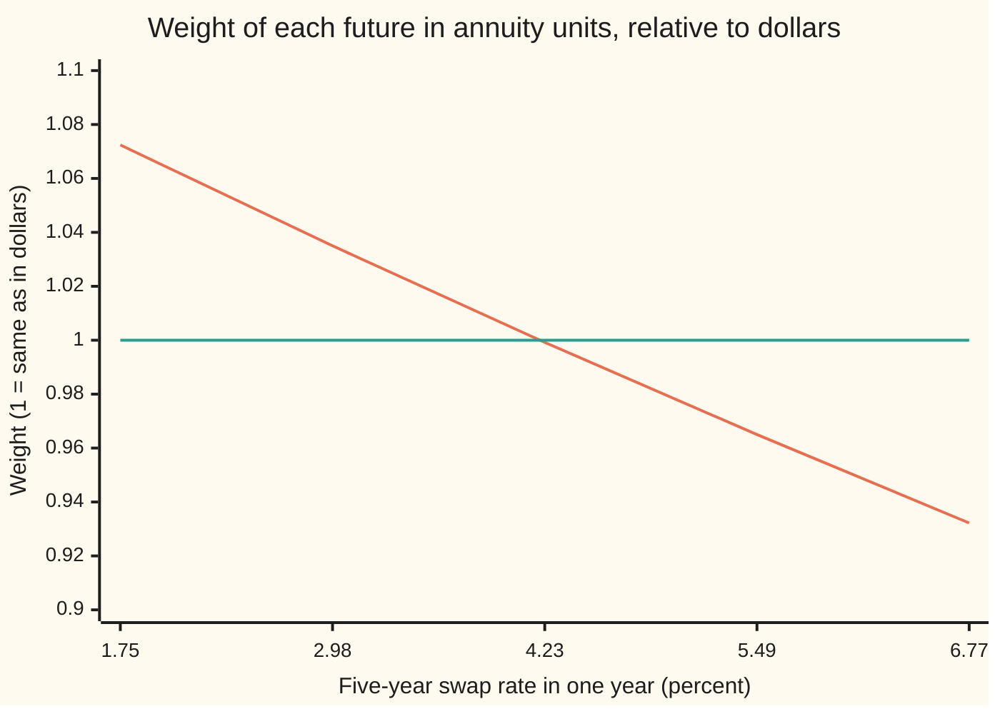

# The annuity measure: why the forward swap rate is a martingale when the annuity is the unit

[Syllabus](../../../SYLLABUS.md) → [Financial mathematics](../../../SYLLABUS.md#w12) → [Caps, Floors and Swaptions](../../../SYLLABUS.md#w12-s29) → The annuity measure

---

## General Overview

A company plans to borrow 10 million dollars in one year, for five years, at a floating rate. It buys a **payer swaption**: the right, in one year, to enter a five-year swap in which it pays a fixed rate of 4.1937 percent and receives the floating rate ([Swaptions](04-swaptions-payer-and-receiver.md)). Today's curve says the fair fixed rate for that future swap is 4.1937 percent. That rate is the **forward swap rate**.

Black's formula prices the swaption as if the forward swap rate were a stock with no drift: its average future value is today's value, and it wanders around that value. At 30 percent volatility the premium comes out at **$210,237.41**, about 2.10 percent of the notional.

That "no drift" is the doubtful part. Rates are not stocks. On a model of the curve checked on this card, the swap rate in one year averages 4.2377 percent when outcomes are counted in dollars paid at expiry: 4.40 basis points above today's forward (a basis point is a hundredth of a percent). So on what basis does Black treat it as driftless?

The answer is a change of unit. Count every price in **annuities**, where one annuity is a strip of five bonds paying one dollar on each of the swap's payment dates. In that unit the same swap rate averages exactly 4.1937 percent, and the swaption's awkward random multiplier cancels out. The probabilities that go with pricing in annuities are called the **annuity measure** (a measure here is a rule assigning weights to the possible futures), and the term carries the rest of the card.

**The forward swap rate is one traded price divided by another, the annuity; counted in annuities it has no drift, so a swaption is today's annuity times an average of a plain call payoff on that rate, and Black's formula is that average under one extra assumption.**

**What kind of fact this is:** a theorem, proved on this card in Why it works: the driftlessness is exact in any curve model without free money. Black's lognormal shape on top of it is a model: an assumption that fits markets well enough, not a law.

### The picture: how counting in annuities re-weights the futures

One random number moves the whole curve in the model below. Each point is one possible curve in a year, labelled by the five-year swap rate it produces. The line shows how much more (above 1) or less (below 1) that future counts in the annuity measure than in plain expiry-date dollars.



Falling line: the annuity measure's weight on each future. Flat line: no re-weighting. Low-rate futures count more, because there the annuity is worth more (4.7342 at a 1.75 percent swap rate against 4.1152 at 6.77 percent). Tilting weight toward low rates pulls the average swap rate down by exactly the 4.40 basis points of drift.

---

## The formula

Notation first, in words. $D(T)$ is today's price of one dollar paid at time $T$, in years. $D(t, T)$ is the same price as it will stand at a later date $t$. The swap starts at $T_0$, the swaption's expiry, and pays fixed on dates $T_1$ to $T_n$. Its **annuity** at date $t$ is $A_t$: the value then of one unit of rate paid on every fixed date. $\mathbb{E}^{A}[\,\cdot\,]$ is an average taken with the annuity measure's weights. The Greek capital sigma, Σ, means "add the terms for i = 1 to n".

$$\mathbb{E}^{A}\!\left[S_T\right] = F = \frac{D(T_0) - D(T_n)}{A_0}, \qquad A_0 = \sum_{i=1}^{n} \tau_i\, D(T_i)$$

**Read it aloud:** averaged with annuity weights, the swap rate on the expiry date equals today's forward swap rate, which is the floating leg's value divided by the annuity.

Behind it sits the pricing rule for the annuity unit, true for any payoff $X$ paid at $T_0$:

$$V_0 = A_0\,\mathbb{E}^{A}\!\left[\frac{X}{A_T}\right]$$

**Read it aloud:** a claim is worth today's annuity times the average number of annuities it pays.

A payer swaption pays $X = L\,A_T\,(S_T - K)^+$, where $(y)^+$ means y if positive and zero otherwise. The annuities cancel:

$$V_{\text{pay}} = L\,A_0\,\mathbb{E}^{A}\!\left[(S_T - K)^+\right] = L\,A_0\left[F\,N(d_1) - K\,N(d_2)\right]$$

The first equals sign is exact. The second assumes the rate is lognormal under the annuity measure. Switching units is done by a weight $w$ that tilts expiry-date dollars into annuities: $\mathbb{E}^{A}[Y] = \mathbb{E}^{T}[\,w\,Y\,]$, with $w = D(T_0)\,A_T / A_0$.

| Symbol | Plain meaning | In our example | Push it up and the answer… |
| --- | --- | --- | --- |
| $F$ | the forward swap rate today: the fixed rate that makes the future swap worth zero | 4.1937 percent | payer swaption rises |
| $S_T$, $S_t$ | the swap rate for the same five years, as it stands at expiry, or at any date $t$ | unknown today; 1.75 to 6.77 percent across the chart | payer pays more |
| $A_0$, $A_T$, $A_t$ | the annuity today, at expiry, and at date $t$ | 4.204423; 4.1152 to 4.7342 in the model | each basis point is worth more money |
| $D(T)$, $D(t, T)$ | discount factor: price of $1 paid at $T$, today or at date $t$ | 0.952381 at one year, 0.776060 at six | the forward swap rate moves |
| $T$, $T_0$, $T_1$, $T_i$, $T_n$, $n$, $t$ | expiry, which is the swap's start; the fixed payment dates; how many; any date up to expiry | 1 year; years 2 to 6; five; 0 to 1 | more time for the rate to wander |
| $\tau_i$ | accrual fraction: period i's length in years, by the day-count rule | 1 each | the annuity grows |
| $K$, $L$ | strike: the fixed rate the holder may pay; notional: the amount interest is worked on | 4.1937 percent; $10,000,000 | payer falls; everything scales |
| $\sigma$ | Black volatility of the swap rate: spread of its logarithm per root-year | 30 percent | both payer and receiver rise |
| $N(x)$, $\varphi$, $d_1$, $d_2$ | bell-curve area left of $x$; the bell curve's height; the two cut-offs of Black's formula | $d_1$ = 0.15, $d_2$ = −0.15 | — |
| $\mathbb{E}^{A}$, $\mathbb{E}^{T}$, $B_t$ | average with annuity-measure weights; average in dollars paid at expiry; the bank account, the risk-neutral unit | 4.1937 and 4.2377 percent for the swap rate | — |
| $w$ | the tilt from expiry dollars to annuities; averages to 1 | 0.9322 to 1.0724 | — |
| $V_0$, $V_t$, $X$ | price today, and at date $t$; payoff at expiry | $210,237.41 for the Black payer | — |

The two cut-offs, as on the pilot card with the carry term gone:

$$d_1 = \frac{\ln(F/K) + \tfrac12\sigma^2 T}{\sigma\sqrt{T}}, \qquad d_2 = d_1 - \sigma\sqrt{T}$$

In words: how many standard deviations of the log-rate separate the forward from the strike, shifted half a variance each way. No interest rate appears inside them; the curve was used up building $A_0$ and $F$.

### When it holds

- **The annuity is a positive traded portfolio.** It is five bonds, so it is. If the unit could be worth zero, dividing by it would fail.
- **No free money in the curve model.** Every bond's future price, counted in expiry dollars, must average to today's forward price. Break that and the forward swap rate picks up a drift in annuity units too; the check tests this gap at 0.000000.
- **The swaption settles into the physical swap.** Then the payoff really is $A_T (S_T - K)^+$ and the annuity cancels exactly. Cash-settled swaptions replace $A_T$ with a formula in $S_T$ alone; that formula is not a traded portfolio, so the cancellation holds only approximately.
- **Lognormal under the annuity measure, for Black only.** The driftlessness needs no shape. The Black formula needs a lognormal one. The model on this card is closer to normal, and its implied Black volatility falls from 34.17 to 27.03 percent across strikes 1 percent either side of the forward.

---

## Why it works

### Step 0: a price divided by the unit's price has no drift

Pick any traded asset with a positive price as the unit of account, and count every other price in it. There are then weights on the futures under which every such ratio is a fair game: its average future value is its value today. A process with that property is a **martingale**. Such weights exist exactly when the market offers no free money, meaning no strategy that costs nothing, can never lose and sometimes wins; this is the fundamental theorem of asset pricing, restated for a new unit. This is the change-of-numeraire theorem ([Change of numeraire](../../11-Stochastic%20processes%20and%20calculus/07-Changing%20Measure/05-change-of-numeraire.md)), where **numeraire** is the technical word for the unit. Counting in bank-account dollars gives the risk-neutral measure. Counting in the annuity gives the annuity measure.

### Step 1: the annuity qualifies as a unit

$A_t = \sum_i \tau_i D(t, T_i)$ is the value of a strip of zero-coupon bonds (bonds that pay one sum at maturity and nothing before): $\tau_i$ of the bond maturing at each $T_i$. It can be bought, and it is always positive. Step 0 applies.

### Step 2: the forward swap rate is a traded price over the annuity

A forward-starting swap has two legs. The floating leg is worth $D(t, T_0) - D(t, T_n)$ per dollar of notional at any date $t$ before it starts: a dollar placed at $T_0$ and rolled at the floating rate until $T_n$ grows into exactly what the floating leg pays, plus the returned dollar ([The par swap rate](../28-Swaps/02-par-swap-rate-and-annuity.md)). The fixed leg at rate $K$ is worth $K A_t$. The swap rate is the $K$ that makes them equal:

$$S_t = \frac{D(t, T_0) - D(t, T_n)}{A_t}.$$

The top is the price of a real portfolio, long one bond and short another. The bottom is the unit. By Step 0 the ratio is a martingale under the annuity measure. Its value today is $F$, so its average at expiry is $F$.

<details>
<summary>Detailed proof: the martingale property, from the pricing rule</summary>

Let $Q^{A}$ be the annuity measure, defined by the property that for every traded price $V_t$, the ratio $V_t / A_t$ is a martingale. Apply that to $V_t = D(t, T_0) - D(t, T_n)$, the price of the long-short bond pair. Then for any date $t$ before $T_0$:
$$\mathbb{E}^{A}\!\left[\frac{V_{T_0}}{A_{T_0}}\,\Big|\,\text{what is known at } t\right] = \frac{V_t}{A_t}, \quad\text{that is}\quad \mathbb{E}^{A}\!\left[S_{T_0} \mid t\right] = S_t.$$
At $t = 0$ this reads $\mathbb{E}^{A}[S_{T_0}] = F$.

Existence of $Q^{A}$: start from any pricing measure with numeraire $B_t$ (the bank account) and define the new weights by the ratio $w = (A_{T_0}/A_0) / (B_{T_0}/B_0)$. This $w$ is positive and averages to 1 because $A_t / B_t$ is itself a martingale. For any traded price $V_t$, $\mathbb{E}^{A}[V_{T_0}/A_{T_0}] = \mathbb{E}^{B}[w\,V_{T_0}/A_{T_0}] = \mathbb{E}^{B}[V_{T_0}/B_{T_0}] \cdot B_0 / A_0 = V_0/A_0$. With dollars at expiry as the starting unit, $B_t$ is replaced by $D(t, T_0)$, which equals 1 at $T_0$, and $w = D(T_0) A_{T_0} / A_0$: the tilt on this card.

</details>

### Step 3: the swaption's payoff is a whole number of annuities

At expiry the holder compares the market's swap rate $S_T$ with the strike. Entering the swap at $K$ when the market rate is $S_T$ is worth the floating leg minus the fixed leg: $L[(D(T, T_0) - D(T, T_n)) - K A_T] = L\,A_T\,(S_T - K)$. The holder enters only when that is positive. So the payoff is $L\,A_T\,(S_T - K)^+$.

Price it in annuities. The pricing rule divides the payoff by $A_T$:

$$V_{\text{pay}} = A_0\,\mathbb{E}^{A}\!\left[\frac{L\,A_T\,(S_T - K)^+}{A_T}\right] = L\,A_0\,\mathbb{E}^{A}\!\left[(S_T - K)^+\right].$$

The random annuity at expiry, which depends on the whole future curve, has gone. What remains is an ordinary call on one number whose average is known. Nothing was approximated.

### Step 4: add a lognormal shape and Black's formula drops out

Now assume $S_T$ is lognormal under the annuity measure with volatility $\sigma$. Its average must be $F$ by Step 2, which fixes the centre: $S_T = F e^{-\frac12\sigma^2 T + \sigma\sqrt{T}Z}$, with $Z$ a standard bell-curve draw. The call average is then the same integral as on the Black–Scholes call card ([Black–Scholes call](../08-The%20Black-Scholes%20call%20and%20put/01-black-scholes-call.md)) with the stock replaced by a driftless forward:

$$\mathbb{E}^{A}\!\left[(S_T - K)^+\right] = F\,N(d_1) - K\,N(d_2).$$

<details>
<summary>The algebra behind this</summary>

The payoff is positive when $Z > -d_2$. The strike piece is $K$ times the chance of that, $K\,N(d_2)$. The rate piece is $F\int_{-d_2}^{\infty} e^{-\frac12\sigma^2 T + \sigma\sqrt{T}z}\varphi(z)\,dz$, with $\varphi$ the bell-curve height. Completing the square gives $e^{-\frac12\sigma^2 T + \sigma\sqrt{T}z}\varphi(z) = \varphi(z - \sigma\sqrt{T})$. Substitute $u = z - \sigma\sqrt{T}$; the lower limit becomes $-d_1$ and the piece is $F\,N(d_1)$.

</details>

Multiply by $L\,A_0$ and the swaption's Black formula is complete. Step 2 supplied the centre, Step 3 removed the annuity, Step 4 supplied the shape.

### Step 5: the same rate drifts when counted in dollars

Why not skip all this and average in expiry dollars? Because there the rate is not a martingale. The product $S_T A_T = D(T, T_0) - D(T, T_n)$ is a traded price, so its dollar average is known: $F A_0 / D(T_0)$. The annuity's dollar average is $A_0 / D(T_0)$. The average of a product is the product of averages plus their covariance (how much they move together), so

$$\mathbb{E}^{T}[S_T] = F - \frac{\text{Cov}^{T}(S_T, A_T)}{A_0 / D(T_0)}.$$

When rates rise the annuity falls, so the covariance is negative and the dollar average sits above $F$. In the model it sits 4.40 basis points above. That gap is a **convexity adjustment**: the correction needed whenever a rate is averaged under a measure that is not its own.

The other road to the same formula is a hedge: hold the swaption, offset its sensitivity to the swap rate with forward swaps, and demand the hedged book earn nothing extra. That argument lives on [Swaption Greeks](08-swaption-greeks-and-hedging.md).

---

## Worked numbers, by hand

Today's one-year forward rates for years 1 to 6 are 5.00, 4.60, 4.30, 4.10, 4.00 and 3.90 percent, annual compounding: the curve of [Swaptions](04-swaptions-payer-and-receiver.md). Notional $10,000,000; expiry one year; fixed paid yearly in years 2 to 6; strike at the forward; volatility 30 percent.

| Step | Arithmetic | Value |
| --- | --- | --- |
| $D(1)$ | $1 / 1.05$ | 0.952381 |
| $D(2)$ to $D(6)$ | divide by 1.046, 1.043, 1.041, 1.040, 1.039 in turn | 0.910498, 0.872961, 0.838579, 0.806326, 0.776060 |
| annuity $A_0$ | $0.910498 + 0.872961 + 0.838579 + 0.806326 + 0.776060$ | 4.204423 |
| dollars per basis point | $10{,}000{,}000 \times 4.204423 \times 0.0001$ | $4,204.42 |
| forward swap rate $F$ | $(0.952381 - 0.776060) / 4.204423$ | 4.1937 percent |
| $d_1$, $d_2$ | $\ln 1 = 0$, so $\pm\tfrac12 \times 0.30$ | 0.15 and −0.15 |
| $N(d_1)$, $N(d_2)$ | bell-curve table | 0.559618, 0.440382 |
| Black bracket | $0.041937 \times (0.559618 - 0.440382)$ | 0.00500039 |
| **payer premium** | $10{,}000{,}000 \times 4.204423 \times 0.00500039$ | **$210,237.41** |

The company pays $210,237.41, which is 2.10 percent of the notional, or 50.00 basis points of rate at $4,204.42 a basis point. At the money the receiver costs the same.

The model on this card prices the same contract without any lognormal assumption at $210,379.75. Read backwards through Black, that is a volatility of 30.02 percent. The formula's shape is an assumption; its centre is not.

### What breaks if you drop a piece

Right answer: $210,237.41 for Black at 30 percent, and $210,379.75 in the curve model.

| Mistake | Comes out at | What went wrong |
| --- | --- | --- |
| Use the dollar average of the rate, 4.2377 percent, as Black's forward | $220,705.72 | That average carries the 4.40 basis-point convexity drift; only the annuity average is $F$ |
| Discount by $D(1)$ only, as if the swaption paid once | $47,622.73 | The payoff is a five-year stream: $A_0$ = 4.204423, not 0.952381 |
| Build the annuity over years 1 to 5 | $219,054.16 | The annuity runs over payment dates, 2 to 6, not fixing dates |
| Simulate the model and average the call payoff in dollars, no tilt | $219,762.96 (model right: $210,379.75) | The unit and the weights must match; dropping $w$ counts high-rate futures too heavily |

Every number in that table is printed by the code below.

---

## Code, from first principles, and it actually runs

The script builds today's curve, then a one-factor model of the curve in one year: one bell-curve draw $z$ shifts every rate together by 1.20 percent per standard deviation, and every bond's price, counted in expiry dollars, averages to today's forward price. It reaches the annuity-unit average of the swap rate by three roads: today's curve alone, a Simpson integral over $z$ (adding thin slices under a curve) with the tilt $w$, and a Monte Carlo average over 100,000 home-made random draws, each used with its mirror image. It prices the swaption in both units, checks Black's formula against a lognormal simulation, and solves for the model's Black volatility by bisection. The normal CDF, the integrator, the random numbers and the root finder are all written out.

### Python

```python
# The annuity measure -- the check behind the card.  Standard library only.
# Nothing imported knows the answer: the normal CDF, the integrator, the root
# finder and the random numbers are all written out below.
from math import exp, log, sqrt, cos, pi

def phi(x): return exp(-0.5 * x * x) / sqrt(2.0 * pi)              # bell-curve height at x

def simpson(f, a, b, n):                                             # area under f, thin slices
    h = (b - a) / n
    s = f(a) + f(b)
    for i in range(1, n):
        s += (4.0 if i % 2 else 2.0) * f(a + i * h)
    return s * h / 3.0

def N(x):                                                            # bell-curve area left of x
    if x < -12.0: return 0.0
    if x > 12.0: return 1.0
    return 0.5 + simpson(phi, 0.0, x, 2000)

def black(F, K, vol, T):                                             # Black's bracket, per unit annuity
    d1 = (log(F / K) + 0.5 * vol * vol * T) / (vol * sqrt(T))
    return F * N(d1) - K * N(d1 - vol * sqrt(T))

# ---- today's curve: one-year forward rates for years 1 to 6, annual compounding ----
fwd = [0.050, 0.046, 0.043, 0.041, 0.040, 0.039]
D = [1.0]
for f in fwd: D.append(D[-1] / (1.0 + f))                            # D[k]: today's price of $1 in year k
L, T0, pay = 10_000_000.0, 1, [2, 3, 4, 5, 6]                        # 1-into-5, fixed paid yearly
A0 = sum(D[k] for k in pay)                                          # the annuity today
F = (D[T0] - D[6]) / A0                                              # the forward swap rate today

# ---- a one-factor curve model at the expiry date: one random number z moves every rate ----
sr = 0.0120                                                          # size of the parallel shift, per year
def bond1(k, z, s=sr):                                               # price at year 1 of $1 paid in year k
    b = k - T0
    return D[k] / D[T0] * exp(-b * s * z - 0.5 * b * b * s * s)
def ann1(z, s=sr):   return sum(bond1(k, z, s) for k in pay)         # the annuity at year 1
def swap1(z, s=sr):  return (1.0 - bond1(6, z, s)) / ann1(z, s)      # the swap rate at year 1
def weight(z, s=sr): return D[T0] * ann1(z, s) / A0                  # tilt from expiry dollars to annuities

def E(g): return simpson(lambda z: g(z) * phi(z), -8.0, 8.0, 4000)   # average in expiry-date dollars
bond_gap = max(abs(E(lambda z, k=k: bond1(k, z)) - D[k] / D[T0]) for k in pay)
w_mean = E(weight)
S_dollar = E(swap1)                                                  # swap rate averaged in dollars
S_ann = E(lambda z: weight(z) * swap1(z))                            # swap rate averaged in annuities

# ---- road 2: Monte Carlo with home-made random numbers (64-bit LCG, Box-Muller) ----
state = 20260928
def unif():
    global state
    state = (6364136223846793005 * state + 1442695040888963407) % 2**64
    return ((state >> 11) + 0.5) / 2.0**53
def normal():
    u1, u2 = unif(), unif()
    return sqrt(-2.0 * log(u1)) * cos(2.0 * pi * u2)
n_mc, K, vol = 100_000, F, 0.30                                      # at-the-money strike, 30% vol
sums = [0.0] * 5
for _ in range(n_mc):
    z, y = normal(), normal()
    for z in (z, -z):                                                # each draw and its mirror image
        s, w = swap1(z), weight(z)
        lz = F * exp(-0.5 * vol * vol + vol * y)                     # a lognormal swap rate, annuity units
        y = -y
        for i, v in enumerate((s, w * s, w, w * max(s - K, 0.0), max(lz - K, 0.0))): sums[i] += v
mc = [v / (2 * n_mc) for v in sums]

# ---- the swaption: priced in expiry dollars (Simpson) and in annuities (Monte Carlo) ----
model_dollar = L * D[T0] * E(lambda z: ann1(z) * max(swap1(z) - K, 0.0))
model_ann_mc = L * A0 * mc[3]
black_30 = L * A0 * black(F, K, vol, 1.0)
black_mc = L * A0 * mc[4]
def implied(price, K):                                               # bisection: Black vol that fits
    lo, hi = 0.01, 1.00
    for _ in range(60):
        mid = 0.5 * (lo + hi)
        if L * A0 * black(F, K, mid, 1.0) < price: lo = mid
        else: hi = mid
    return 0.5 * (lo + hi)
smile = []
for Ks in (F - 0.01, F, F + 0.01):
    smile.append((Ks, implied(L * D[T0] * E(lambda z: ann1(z) * max(swap1(z) - Ks, 0.0)), Ks)))

d1 = (log(F / K) + 0.5 * vol * vol) / vol
rows = [(f"D({k})", D[k]) for k in range(1, 7)]
rows += [("annuity A0, years 2-6", A0), ("forward swap rate F", F),
        ("L x A0, dollars per basis point", L * A0 * 1e-4),
        ("worst bond gap, model vs forward", bond_gap), ("weight averages to", w_mean),
        ("mean S, dollar unit, Simpson", S_dollar), ("mean S, annuity unit, Simpson", S_ann),
        ("mean S, dollar unit, Monte Carlo", mc[0]), ("mean S, annuity unit, Monte Carlo", mc[1]),
        ("weight average, Monte Carlo", mc[2]), ("dollar-unit drift, basis points", (S_dollar - F) * 1e4),
        ("payer, model, dollar unit, Simpson", model_dollar), ("payer, model, annuity unit, MC", model_ann_mc),
        ("payer, Black 30%, formula", black_30), ("payer, Black 30%, Monte Carlo", black_mc),
        ("d1", d1), ("d2", d1 - vol), ("N(d1)", N(d1)), ("N(d2)", N(d1 - vol)),
        ("Black bracket F N(d1) - K N(d2)", black(F, K, vol, 1.0)),
        ("payer, Black 30%, % of notional", 100 * black_30 / L),
        ("payer, Black 30%, basis points of rate", black_30 / (L * A0 * 1e-4)),
        ("wrong: drifted mean as forward", L * A0 * black(S_dollar, K, vol, 1.0)),
        ("wrong: discount by D(1) only", L * D[1] * black(F, K, vol, 1.0)),
        ("wrong: annuity over years 1-5", L * sum(D[1:6]) * black(F, K, vol, 1.0)),
        ("wrong: model payoff, no weight", L * A0 * E(lambda z: max(swap1(z) - K, 0.0)))]
for Ks, iv in smile: rows.append((f"model Black vol at K = {100 * Ks:.4f}%", iv))
drifts = []
for s_try in (0.0, 0.024):
    drift = E(lambda z: swap1(z, s_try)) - E(lambda z: weight(z, s_try) * swap1(z, s_try))
    drifts.append(drift)
    rows.append((f"try: shift size {s_try:.3f}, drift in bp", abs(drift) * 1e4))
for name, v in rows: print(f"{name:<40} {v:>16.6f}")
print()
for z in (-2.0, -1.0, 0.0, 1.0, 2.0):
    print(f"chart, z {z:+.0f}   swap rate {100 * swap1(z):5.2f}%   annuity {ann1(z):.4f}   weight {weight(z):.4f}")

assert bond_gap < 1e-12,                        "the model prices every bond at today's forward price"
assert abs(w_mean - 1.0) < 1e-12,               "the tilt must average to one, or it is not a probability"
assert abs(S_ann - F) < 1e-10,                  "annuity-unit average must land on today's forward"
assert abs(mc[1] - F) < 1e-5,                   "Monte Carlo road, annuity unit, within sampling error"
assert S_dollar - F > 5e-5,                     "counted in expiry dollars the swap rate must drift up"
assert abs(model_ann_mc - model_dollar) < 0.01 * model_dollar, "two units, one swaption price"
assert abs(black_mc - black_30) < 0.01 * black_30,             "Black formula vs lognormal Monte Carlo"
assert smile[0][1] > smile[1][1] > smile[2][1],  "the model's Black volatility falls as the strike rises"
assert abs(drifts[0]) < 1e-12,                  "no randomness in rates, no drift"
assert abs(drifts[1] / (S_dollar - F) - 4.0) < 0.05, "double the shift size, four times the drift"
print("ALL CHECKS PASS")
```

**Ran 2026-09-28 on macOS, Python 3.14.6, standard library only. All checks passed. Output, pasted from the run:**

```
D(1)                                             0.952381
D(2)                                             0.910498
D(3)                                             0.872961
D(4)                                             0.838579
D(5)                                             0.806326
D(6)                                             0.776060
annuity A0, years 2-6                            4.204423
forward swap rate F                              0.041937
L x A0, dollars per basis point               4204.423349
worst bond gap, model vs forward                 0.000000
weight averages to                               1.000000
mean S, dollar unit, Simpson                     0.042377
mean S, annuity unit, Simpson                    0.041937
mean S, dollar unit, Monte Carlo                 0.042376
mean S, annuity unit, Monte Carlo                0.041939
weight average, Monte Carlo                      0.999996
dollar-unit drift, basis points                  4.395333
payer, model, dollar unit, Simpson          210379.747525
payer, model, annuity unit, MC              209962.314049
payer, Black 30%, formula                   210237.408755
payer, Black 30%, Monte Carlo               210692.009101
d1                                               0.150000
d2                                              -0.150000
N(d1)                                            0.559618
N(d2)                                            0.440382
Black bracket F N(d1) - K N(d2)                  0.005000
payer, Black 30%, % of notional                  2.102374
payer, Black 30%, basis points of rate          50.003863
wrong: drifted mean as forward              220705.718956
wrong: discount by D(1) only                 47622.726586
wrong: annuity over years 1-5               219054.156057
wrong: model payoff, no weight              219762.962676
model Black vol at K = 3.1937%                   0.341674
model Black vol at K = 4.1937%                   0.300205
model Black vol at K = 5.1937%                   0.270346
try: shift size 0.000, drift in bp               0.000000
try: shift size 0.024, drift in bp              17.574686

chart, z -2   swap rate  1.75%   annuity 4.7342   weight 1.0724
chart, z -1   swap rate  2.98%   annuity 4.5692   weight 1.0350
chart, z +0   swap rate  4.23%   annuity 4.4113   weight 0.9992
chart, z +1   swap rate  5.49%   annuity 4.2601   weight 0.9650
chart, z +2   swap rate  6.77%   annuity 4.1152   weight 0.9322
ALL CHECKS PASS
```

Three roads land on the forward: today's curve gives 0.041937, the tilted Simpson integral gives 0.041937, and the tilted Monte Carlo 0.041939, the last digit being sampling noise. Without the tilt the integral and the simulation give 0.042377 and 0.042376. The model's swaption, priced in dollars by Simpson and in annuities by Monte Carlo, agrees within the 1 percent the assert allows, as does Black's formula with its own simulation.

### Rust

Same checks, same inputs, the same random-number recipe, so the Monte Carlo lines match too. No crates.

```rust
// The annuity measure -- the same check as the_annuity_measure_check.py, in Rust.
// Standard library only, no crates.  The normal CDF, the integrator, the root
// finder and the random numbers are all written out below.
use std::f64::consts::PI;

fn phi(x: f64) -> f64 { (-0.5 * x * x).exp() / (2.0 * PI).sqrt() }   // bell-curve height at x

fn simpson<G: Fn(f64) -> f64>(f: G, a: f64, b: f64, n: usize) -> f64 {
    let h = (b - a) / n as f64;
    let mut s = f(a) + f(b);
    for i in 1..n { s += if i % 2 == 1 { 4.0 } else { 2.0 } * f(a + i as f64 * h); }
    s * h / 3.0
}

fn n_cdf(x: f64) -> f64 {                                              // bell-curve area left of x
    if x < -12.0 { return 0.0; }
    if x > 12.0 { return 1.0; }
    0.5 + simpson(phi, 0.0, x, 2000)
}

fn black(f: f64, k: f64, vol: f64, t: f64) -> f64 {                    // Black's bracket, per unit annuity
    let d1 = ((f / k).ln() + 0.5 * vol * vol * t) / (vol * t.sqrt());
    f * n_cdf(d1) - k * n_cdf(d1 - vol * t.sqrt())
}

struct Curve { d: Vec<f64>, a0: f64 }
const T0: usize = 1;
const PAY: [usize; 5] = [2, 3, 4, 5, 6];

impl Curve {
    fn bond1(&self, k: usize, z: f64, s: f64) -> f64 {                 // price at year 1 of $1 paid in year k
        let b = (k - T0) as f64;
        self.d[k] / self.d[T0] * (-b * s * z - 0.5 * b * b * s * s).exp()
    }
    fn ann1(&self, z: f64, s: f64) -> f64 { PAY.iter().map(|&k| self.bond1(k, z, s)).sum() }
    fn swap1(&self, z: f64, s: f64) -> f64 { (1.0 - self.bond1(6, z, s)) / self.ann1(z, s) }
    fn weight(&self, z: f64, s: f64) -> f64 { self.d[T0] * self.ann1(z, s) / self.a0 }
}

fn e<G: Fn(f64) -> f64>(g: G) -> f64 { simpson(|z| g(z) * phi(z), -8.0, 8.0, 4000) }   // expiry-dollar average

struct Rng(u64);
impl Rng {
    fn unif(&mut self) -> f64 {
        self.0 = self.0.wrapping_mul(6364136223846793005).wrapping_add(1442695040888963407);
        ((self.0 >> 11) as f64 + 0.5) / 2f64.powi(53)
    }
    fn normal(&mut self) -> f64 {
        let (u1, u2) = (self.unif(), self.unif());
        (-2.0 * u1.ln()).sqrt() * (2.0 * PI * u2).cos()
    }
}

fn main() {
    // ---- today's curve: one-year forward rates for years 1 to 6, annual compounding ----
    let fwd = [0.050, 0.046, 0.043, 0.041, 0.040, 0.039];
    let mut d = vec![1.0_f64];
    for f in fwd { let last = *d.last().unwrap(); d.push(last / (1.0 + f)); }
    let l = 10_000_000.0_f64;
    let a0: f64 = PAY.iter().map(|&k| d[k]).sum();
    let f = (d[T0] - d[6]) / a0;
    let c = Curve { d: d.clone(), a0 };
    let sr = 0.0120;

    let bond_gap = PAY.iter().map(|&k| (e(|z| c.bond1(k, z, sr)) - d[k] / d[T0]).abs()).fold(0.0, f64::max);
    let w_mean = e(|z| c.weight(z, sr));
    let s_dollar = e(|z| c.swap1(z, sr));
    let s_ann = e(|z| c.weight(z, sr) * c.swap1(z, sr));

    // ---- road 2: Monte Carlo with home-made random numbers (64-bit LCG, Box-Muller) ----
    let mut rng = Rng(20260928);
    let (n_mc, k, vol) = (100_000usize, f, 0.30);
    let mut sums = [0.0_f64; 5];
    for _ in 0..n_mc {
        let z0 = rng.normal();
        let mut y = rng.normal();
        for z in [z0, -z0] {                                           // each draw and its mirror image
            let (s, w) = (c.swap1(z, sr), c.weight(z, sr));
            let lz = f * (-0.5 * vol * vol + vol * y).exp();           // a lognormal swap rate, annuity units
            y = -y;
            let vals = [s, w * s, w, w * (s - k).max(0.0), (lz - k).max(0.0)];
            for i in 0..5 { sums[i] += vals[i]; }
        }
    }
    let mc: Vec<f64> = sums.iter().map(|v| v / (2 * n_mc) as f64).collect();

    // ---- the swaption: priced in expiry dollars (Simpson) and in annuities (Monte Carlo) ----
    let model_price = |ks: f64| l * d[T0] * e(|z| c.ann1(z, sr) * (c.swap1(z, sr) - ks).max(0.0));
    let model_dollar = model_price(k);
    let model_ann_mc = l * a0 * mc[3];
    let black_30 = l * a0 * black(f, k, vol, 1.0);
    let black_mc = l * a0 * mc[4];
    let implied = |price: f64, ks: f64| {                              // bisection: Black vol that fits
        let (mut lo, mut hi) = (0.01_f64, 1.00_f64);
        for _ in 0..60 {
            let mid = 0.5 * (lo + hi);
            if l * a0 * black(f, ks, mid, 1.0) < price { lo = mid; } else { hi = mid; }
        }
        0.5 * (lo + hi)
    };

    let d1 = ((f / k).ln() + 0.5 * vol * vol) / vol;
    let mut rows: Vec<(String, f64)> = (1..=6).map(|i| (format!("D({})", i), d[i])).collect();
    let more: Vec<(&str, f64)> = vec![
        ("annuity A0, years 2-6", a0), ("forward swap rate F", f),
        ("L x A0, dollars per basis point", l * a0 * 1e-4),
        ("worst bond gap, model vs forward", bond_gap), ("weight averages to", w_mean),
        ("mean S, dollar unit, Simpson", s_dollar), ("mean S, annuity unit, Simpson", s_ann),
        ("mean S, dollar unit, Monte Carlo", mc[0]), ("mean S, annuity unit, Monte Carlo", mc[1]),
        ("weight average, Monte Carlo", mc[2]), ("dollar-unit drift, basis points", (s_dollar - f) * 1e4),
        ("payer, model, dollar unit, Simpson", model_dollar), ("payer, model, annuity unit, MC", model_ann_mc),
        ("payer, Black 30%, formula", black_30), ("payer, Black 30%, Monte Carlo", black_mc),
        ("d1", d1), ("d2", d1 - vol), ("N(d1)", n_cdf(d1)), ("N(d2)", n_cdf(d1 - vol)),
        ("Black bracket F N(d1) - K N(d2)", black(f, k, vol, 1.0)),
        ("payer, Black 30%, % of notional", 100.0 * black_30 / l),
        ("payer, Black 30%, basis points of rate", black_30 / (l * a0 * 1e-4)),
        ("wrong: drifted mean as forward", l * a0 * black(s_dollar, k, vol, 1.0)),
        ("wrong: discount by D(1) only", l * d[1] * black(f, k, vol, 1.0)),
        ("wrong: annuity over years 1-5", l * d[1..6].iter().sum::<f64>() * black(f, k, vol, 1.0)),
        ("wrong: model payoff, no weight", l * a0 * e(|z| (c.swap1(z, sr) - k).max(0.0))),
    ];
    for (name, v) in more { rows.push((name.to_string(), v)); }
    let mut smile = Vec::new();
    for ks in [f - 0.01, f, f + 0.01] {
        let iv = implied(model_price(ks), ks);
        smile.push(iv);
        rows.push((format!("model Black vol at K = {:.4}%", 100.0 * ks), iv));
    }
    let mut drifts = Vec::new();
    for s_try in [0.0_f64, 0.024] {
        let drift = e(|z| c.swap1(z, s_try)) - e(|z| c.weight(z, s_try) * c.swap1(z, s_try));
        drifts.push(drift);
        rows.push((format!("try: shift size {:.3}, drift in bp", s_try), drift.abs() * 1e4));
    }
    for (name, v) in &rows { println!("{:<40} {:>16.6}", name, v); }
    println!();
    for z in [-2.0_f64, -1.0, 0.0, 1.0, 2.0] {
        println!("chart, z {:+.0}   swap rate {:5.2}%   annuity {:.4}   weight {:.4}",
                 z, 100.0 * c.swap1(z, sr), c.ann1(z, sr), c.weight(z, sr));
    }

    assert!(bond_gap < 1e-12, "the model prices every bond at today's forward price");
    assert!((w_mean - 1.0).abs() < 1e-12, "the tilt must average to one, or it is not a probability");
    assert!((s_ann - f).abs() < 1e-10, "annuity-unit average must land on today's forward");
    assert!((mc[1] - f).abs() < 1e-5, "Monte Carlo road, annuity unit, within sampling error");
    assert!(s_dollar - f > 5e-5, "counted in expiry dollars the swap rate must drift up");
    assert!((model_ann_mc - model_dollar).abs() < 0.01 * model_dollar, "two units, one swaption price");
    assert!((black_mc - black_30).abs() < 0.01 * black_30, "Black formula vs lognormal Monte Carlo");
    assert!(smile[0] > smile[1] && smile[1] > smile[2], "the model's Black volatility falls as the strike rises");
    assert!(drifts[0].abs() < 1e-12, "no randomness in rates, no drift");
    assert!((drifts[1] / (s_dollar - f) - 4.0).abs() < 0.05, "double the shift size, four times the drift");
    println!("ALL CHECKS PASS");
}
```

**Ran 2026-09-28 on macOS, rustc 1.98.1, no crates. All checks passed. Output, pasted from the run:**

```
D(1)                                             0.952381
D(2)                                             0.910498
D(3)                                             0.872961
D(4)                                             0.838579
D(5)                                             0.806326
D(6)                                             0.776060
annuity A0, years 2-6                            4.204423
forward swap rate F                              0.041937
L x A0, dollars per basis point               4204.423349
worst bond gap, model vs forward                 0.000000
weight averages to                               1.000000
mean S, dollar unit, Simpson                     0.042377
mean S, annuity unit, Simpson                    0.041937
mean S, dollar unit, Monte Carlo                 0.042376
mean S, annuity unit, Monte Carlo                0.041939
weight average, Monte Carlo                      0.999996
dollar-unit drift, basis points                  4.395333
payer, model, dollar unit, Simpson          210379.747525
payer, model, annuity unit, MC              209962.314049
payer, Black 30%, formula                   210237.408755
payer, Black 30%, Monte Carlo               210692.009101
d1                                               0.150000
d2                                              -0.150000
N(d1)                                            0.559618
N(d2)                                            0.440382
Black bracket F N(d1) - K N(d2)                  0.005000
payer, Black 30%, % of notional                  2.102374
payer, Black 30%, basis points of rate          50.003863
wrong: drifted mean as forward              220705.718956
wrong: discount by D(1) only                 47622.726586
wrong: annuity over years 1-5               219054.156057
wrong: model payoff, no weight              219762.962676
model Black vol at K = 3.1937%                   0.341674
model Black vol at K = 4.1937%                   0.300205
model Black vol at K = 5.1937%                   0.270346
try: shift size 0.000, drift in bp               0.000000
try: shift size 0.024, drift in bp              17.574686

chart, z -2   swap rate  1.75%   annuity 4.7342   weight 1.0724
chart, z -1   swap rate  2.98%   annuity 4.5692   weight 1.0350
chart, z +0   swap rate  4.23%   annuity 4.4113   weight 0.9992
chart, z +1   swap rate  5.49%   annuity 4.2601   weight 0.9650
chart, z +2   swap rate  6.77%   annuity 4.1152   weight 0.9322
ALL CHECKS PASS
```

The two outputs agree line for line.

> [!TIP]
> **Try changing**
> Guess first, then run.
> - **Switch the randomness off.** Set `sr = 0.0`. Guess the dollar-unit drift. It is **0.00** basis points: with one certain future, every unit gives the same average.
> - **Double the shift size.** Set `sr = 0.024`. The drift goes from 4.40 to **17.57** basis points, four times as much. The covariance behind it grows with the variance of rates, and doubling a standard deviation quadruples a variance.
> - **Move the strike.** Price the model's swaption 1 percent below and above the forward and read Black's volatility back out: **34.17** and **27.03** percent, against 30.02 at the money. The model's rates are closer to normal than lognormal, so one Black volatility cannot fit every strike ([Rate volatilities](06-normal-and-shifted-volatilities-for-rates.md)).

---

## The usual mistake

> [!warning]
> **Treating the forward swap rate as the expected future swap rate, full stop.** It is the expected future swap rate only when futures are weighted by the annuity. Counted in expiry-date dollars, or in the bank account, the same rate drifts: 4.40 basis points up in the model on this card, 17.57 at double the volatility of rates. Any product that pays the swap rate without the annuity attached, such as a constant-maturity swap that pays the five-year rate on one date, needs that convexity adjustment. Pricing it at $F$ is wrong by exactly the gap Step 5 computes.
>
> Smaller traps:
> - **Discounting a swaption with one discount factor.** It pays a stream, not a lump. $D(1)$ in place of $A_0$ gives $47,622.73 instead of $210,237.41.
> - **Dropping the tilt in a simulation.** Averaging the model's rates in dollars and then multiplying by $A_0$ mixes two units: $219,762.96 instead of $210,379.75.
> - **Using the annuity measure for a caplet.** One forward rate paid once has its own unit, the bond maturing on its payment date ([Caplets and floorlets](01-caplets-and-floorlets.md)). A cap and a swaption live under different measures, which is why a single model must be chosen to price both consistently.
> - **Reading "driftless" as "lognormal".** The martingale property is exact. The lognormal shape is Black's assumption, and the model on this card already shows Black volatility falling from 34.17 to 27.03 percent across strikes 1 percent either side of the forward.

---

## Where you meet it in real life

- **Swaption screens.** Every European swaption volatility quoted in Black terms is the $\sigma$ that makes $L\,A_0[F N(d_1) - K N(d_2)]$ match a traded price. The annuity measure is what makes that quote mean something.
- **Premium in basis points.** Dividing the premium by dollars-per-basis-point, $4,204.42 here, turns $210,237.41 into 50.00 basis points of rate: the swaption's price in annuity units, the natural currency of this measure.
- **The swap market model.** Jamshidian's framework models each forward swap rate as lognormal under its own annuity measure, giving Black's formula for a whole family of swaptions at once, such as all those ending on the same date; the price is that caplets are no longer exactly Black.
- **Constant-maturity swaps.** Coupons fixed on a swap rate but paid once need the Step 5 adjustment; desks compute it from a swaption smile across strikes ([SABR for rates](07-sabr-for-rates-and-the-volatility-cube.md)).
- **Options on credit default swaps.** The same trick with a risky annuity, one that stops paying on default, as the unit: [Options on a CDS](../44-Reduced-Form%20Models%20-%20Risky%20Bonds%2C%20Spreads%20and%20Random%20Hazards/05-cds-option-and-implied-spread-volatility.md).

> **Say it back**
> A swaption pays the annuity at expiry times the call payoff on the swap rate. The swap rate is a traded price, the floating leg, divided by the annuity, so counted in annuities it has no drift and averages to today's forward swap rate. Pricing in annuities divides the payoff by the annuity, which cancels the random one at expiry and leaves today's annuity times a plain call average. Add a lognormal shape and that average is Black's formula. Counted in dollars the same rate drifts, and that drift is the convexity adjustment.

---

## What this builds on

- [Swaptions](04-swaptions-payer-and-receiver.md): the contract, its payoff, the forward swap rate and Black's formula as a statement. This card supplies the reason the formula is legitimate.
- [Change of numeraire](../../11-Stochastic%20processes%20and%20calculus/07-Changing%20Measure/05-change-of-numeraire.md): the general theorem that any positive traded price can serve as the unit, with its own weights under which price ratios are martingales.

## Where this goes next

- [Swaption Greeks](08-swaption-greeks-and-hedging.md): the hedge road to the same price, and what happens to the hedge when the annuity itself moves with rates.
- [Options on a CDS](../44-Reduced-Form%20Models%20-%20Risky%20Bonds%2C%20Spreads%20and%20Random%20Hazards/05-cds-option-and-implied-spread-volatility.md): the annuity measure rebuilt on a risky annuity, which prices options on credit spreads with the same Black shape.

This card proves the forward swap rate is fair in annuity units but says nothing about how to hedge a swaption whose unit itself shifts with every rate move; the Greeks card answers that.

---

## Sources

Verified 2026-09-28: every link below resolves to the publisher's page.

- Geman, Hélyette, Nicole El Karoui, and Jean-Charles Rochet. "Changes of Numéraire, Changes of Probability Measure and Option Pricing." *Journal of Applied Probability* 32, no. 2 (1995): 443–458. [doi:10.2307/3215299](https://doi.org/10.2307/3215299). The theorem of Step 0: any positive traded price as the unit, with price ratios as martingales.
- Jamshidian, Farshid. "LIBOR and Swap Market Models and Measures." *Finance and Stochastics* 1 (1997): 293–330. [doi:10.1007/s007800050026](https://doi.org/10.1007/s007800050026). The swap measure made rigorous, and the swap market model built on it.
- Black, Fischer. "The Pricing of Commodity Contracts." *Journal of Financial Economics* 3 (1976): 167–179. [doi:10.1016/0304-405X(76)90024-6](https://doi.org/10.1016/0304-405X(76)90024-6). The formula for an option on a driftless forward that Step 4 recovers.
- Brigo, Damiano, and Fabio Mercurio. *Interest Rate Models: Theory and Practice*, 2nd ed. Springer, 2006. [doi:10.1007/978-3-540-34604-3](https://doi.org/10.1007/978-3-540-34604-3). The textbook treatment of numeraires, the swap measure and the swaption formula.
