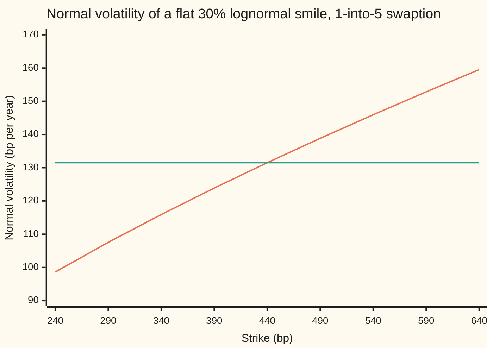
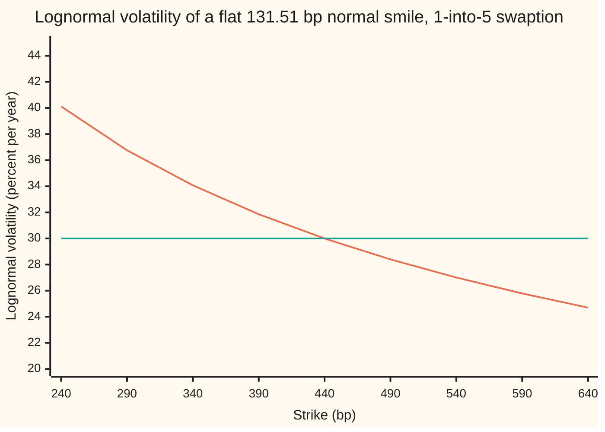

# Rate volatilities: lognormal, normal and shifted, and converting between them

Financial mathematics → Caps, Floors and Swaptions → Three quoting languages → Rate volatilities

---

## General Overview

A pension fund buys a **payer swaption** on $10 million: the right, one year from today, to enter a five-year swap in which it pays a fixed 4.40 percent a year and receives the floating rate ([swaptions-payer-and-receiver](04-swaptions-payer-and-receiver.md)). Today's forward swap rate for that start date is also 4.40 percent, so the option is struck **at the money**: strike equal to the forward. The fund pays $221,223.24.

Three dealers quote that premium, and none of them says the dollar figure. The first says "30 percent". The second says "131.5". The third says "20.58, shift 2 percent". All three mean the same $221,223.24. Each has run the price backwards through a different pricing model and read off that model's volatility dial. Volatility here is a language for a price, not a price.

The three languages differ in how they measure the rate's wobble. **Lognormal** volatility counts it as a percentage of the rate: 30 percent of 4.40 percent. **Normal** volatility counts it in **basis points**, hundredths of one percent, with no percentage anywhere: 131.5 bp a year. **Shifted** volatility counts it as a percentage of the rate plus a fixed slide: 20.58 percent of 4.40 + 2.00 percent. The rule of thumb on desks is that 30 percent lognormal is about 130 basis points normal at a 4.4 percent rate. The card makes that exact, and extends it to strikes away from the forward, where the rule of thumb breaks.

**A rate volatility is the premium translated through a chosen model; at the money the translation runs through the rate's level, and away from the money through the average level between the rate and the strike, so a smile (volatility plotted against strike) that is flat in one language is sloped in the others.**

**What kind of fact this is:** a convention — three ways the market writes one price — carrying an exact conversion at the money, proved on this card in Why it works, and an approximation away from it, with its error measured by the checks.

### The picture: one flat quote, read in another language

Take every strike from 2.40 to 6.40 percent and price each payer with the same 30 percent lognormal volatility. Then read each premium back in normal volatility.



The rising line is the normal volatility that reproduces each 30 percent lognormal premium: 98.62 bp at a 2.40 percent strike, 159.53 bp at 6.40 percent. The flat line is the at-the-money figure, 131.51 bp, used at every strike. The gap between them is what the rule of thumb gets wrong away from the money.

---

## The formula

Notation first, in words. $F$ is the **forward swap rate**, the fixed rate that makes the swap worth nothing today. $K$ is the strike. $T$ is the wait to expiry, in years. $M$ is the notional and $A$ the **annuity**: today's value of receiving one unit of rate on each fixed payment date, so $M A$ turns a rate into dollars. The premium is $V$ in dollars and $p = V/(MA)$ in rate units. Each model has one volatility dial: $\sigma$ (lognormal), $\sigma_N$ (normal), $\sigma_a$ (shifted by an amount $a$).

All three models price the payer the same way, as dollars-per-unit-of-rate times an average payoff:

$$V = M\,A\,p$$

and differ only in $p$:

$$\text{lognormal (Black):}\quad p = F\,N(d_1) - K\,N(d_2), \qquad d_1 = \frac{\ln(F/K) + \tfrac12\sigma^2 T}{\sigma\sqrt{T}}, \quad d_2 = d_1 - \sigma\sqrt{T}$$

$$\text{normal (Bachelier):}\quad p = (F - K)\,N(d) + \sigma_N\sqrt{T}\,\phi(d), \qquad d = \frac{F - K}{\sigma_N\sqrt{T}}$$

$$\text{shifted:}\quad p = \text{Black with } F + a,\ K + a \text{ and } \sigma_a$$

**Read it aloud:** one premium, three models, three dials; a quote is whichever dial setting reproduces the premium.

The conversions. At the money, $K = F$, exactly:

$$\sigma_N = F\,\sqrt{\frac{2\pi}{T}}\,\Bigl[\,2N\!\bigl(\tfrac{w}{2}\bigr) - 1\Bigr] \;\approx\; F\,\sigma\,\Bigl(1 - \frac{w^2}{24}\Bigr), \qquad w = \sigma\sqrt{T}$$

**Read it aloud:** normal volatility is the rate times its lognormal volatility, shrunk by a factor a little under one.

Away from the money, approximately:

$$\sigma_N \approx \sigma\,\ell(F, K)\,\Bigl(1 - \frac{w^2}{24}\Bigr), \qquad \sigma_a \approx \sigma\,\frac{\ell(F, K)}{\ell(F + a,\,K + a)}, \qquad \ell(x, y) = \frac{x - y}{\ln(x / y)}$$

**Read it aloud:** away from the money, replace the rate by its logarithmic average with the strike.

$\ell(x, y)$ is the **logarithmic mean** of two positive numbers. It always lies between them, a little below their plain average, and $\ell(x, x) = x$, so the away-from-the-money rule collapses to the at-the-money one when the strike meets the forward.

| Symbol | Plain meaning | In our example | Push it up and the answer… |
| --- | --- | --- | --- |
| $V$, $p$ | the premium in dollars, and in rate units | $221,223.24; 52.46 bp | — |
| $M$, $A$ | the notional, and the annuity (years of fixed payments, discounted) | $10 million; 4.216702 | scale the dollar premium, never the volatility |
| $F$ | the forward swap rate | 4.40 percent (440 bp) | raises normal volatility at a fixed lognormal one: 101.62 bp at 3.40 percent, 131.51 bp at 4.40 |
| $K$ | the strike | 440 bp; 240 to 640 bp on the strike table | at a fixed lognormal volatility, normal volatility rises with it |
| $T$ | the wait to expiry, in years | 1 | deepens the shrink factor: 127.21 bp at 10 years, not 132 |
| $\sigma$ | lognormal volatility: the wobble as a yearly fraction of the rate | 30 percent | dearer premium |
| $\sigma_N$ | normal volatility: the wobble in bp per year | 131.51 bp | dearer premium |
| $a$, $\sigma_a$ | the shift, and the volatility of the shifted rate | 200 bp; 20.58 percent | a larger shift needs a smaller $\sigma_a$ for the same premium: 17.79 percent at 300 bp |
| $w$ | one **wiggle unit**, $\sigma\sqrt{T}$: the lognormal wobble over the whole wait | 0.30 | — |
| $N(x)$, $\phi(x)$ | the bell-curve area left of $x$, and the curve's height at $x$ | $N(0.15) = 0.559618$ | — |
| $d_1$, $d_2$, $d$ | the cut-offs, in wiggle units, where the payer starts to pay | 0.15, −0.15; 0 | — |
| $\ell$ | the logarithmic mean of two positive numbers | $\ell(440, 540) = 488.29$ bp | — |

### When it holds

- **Same contract, same annuity.** A conversion compares two models of one swaption. $M$ and $A$ multiply every model's $p$ alike, so they cancel. Convert a swaption volatility using a cap's annuity, or a different expiry, and the numbers mean nothing.
- **The rate sits above the model's floor.** Lognormal needs $F$ and $K$ above zero; shifted needs them above $-a$; normal has no floor. Inside those limits every model's premium rises strictly with its dial, from the payoff already locked in at zero volatility towards a ceiling: $F$ for lognormal, $F + a$ for shifted, none for normal. So each translation has exactly one answer when the premium lies strictly between the payoff locked in and the target model's ceiling, and none outside. For a flat 131.51 bp normal smile the lognormal translation fails only for strikes below 0.014 bp, where the normal premium reaches the lognormal ceiling $F$.
- **The shift is part of the quote.** "20.58 percent" is a price only together with "shift 200 bp".
- **The rules are approximations.** The logarithmic-mean rule is off by at most 0.0027 bp across 240 to 640 bp here. The errors grow with $w$ and with the distance of the strike from the forward: at a 10-year expiry the plain rule $F\sigma$ gives 132 bp against an exact 127.21 bp.

**Conventions, dated 28 Sep 2026:** normal volatility is quoted in basis points per year (strictly, per square root of a year); lognormal and shifted volatility in percent per year; the shift travels with the quote. This card uses annual fixed payments, a flat curve at 4.40 percent annually compounded, and continuous time in years; a real swaption's fixed leg runs on its own day count, which enters through $A$ only.

---

## Why it works

### Step 0: a quote is a price run backwards through a model

A dealer's model takes a volatility and returns a premium. Every one of these models returns a higher premium for a higher volatility, with no plateaus. So the map runs backwards without ambiguity: give it the premium and exactly one volatility comes out. That is all a volatility quote is.

Translation between languages is therefore exact by construction: price in one model, invert in the other. The formulas on this card are shortcuts for that round trip, and the checks run the round trip itself, with a root finder (a routine that closes in on the one input giving a target output), to test them.

### Step 1: the three models share everything except the spread

In units of the annuity, the forward swap rate is a fair bet on its own future value: its average, taken that way, is today's $F$ ([the-annuity-measure](05-the-annuity-measure.md)). Every model therefore centres its spread of possible rates on the same 4.40 percent, and multiplies its average payoff by the same $M A$.

What is left is the shape of the spread:

- Lognormal: a move is proportional to the rate. At 4.40 percent a 30 percent volatility means a typical wobble of about 132 bp a year; at a lower rate, proportionally less.
- Normal: a move is the same size wherever the rate is. 131.51 bp a year at any level, including below zero.
- Shifted: a move is proportional to the rate's distance above $-a$. With $a = 200$ bp, a 20.58 percent volatility wobbles by almost the same number of basis points at 4.40 percent.

Near the forward, all three spreads have almost the same width. That is why their volatilities convert through the rate's level.

### Step 2: at the money the conversion is exact

Set $K = F$. The Black formula collapses: $d_1 = w/2$ and $d_2 = -w/2$, and $N(-x) = 1 - N(x)$, so

$$p = F\,\bigl[\,2N(w/2) - 1\,\bigr].$$

The Bachelier formula collapses too: $d = 0$, $N(0) = \tfrac12$, the first term vanishes and $\phi(0) = 1/\sqrt{2\pi}$, so

$$p = \sigma_N\,\sqrt{T/(2\pi)}.$$

Two expressions for one premium. Set them equal and solve for $\sigma_N$: that is the exact conversion in The formula. For the shifted model the same collapse gives $(F + a)\bigl[2N(w_a/2) - 1\bigr]$ with $w_a = \sigma_a\sqrt{T}$; set it equal to the Black premium and solve for $\sigma_a$ by the root finder, since $N$ has no closed-form reverse. The prerequisite card proves the same at-the-money identity for a floorlet ([shifted-lognormal-and-volatility-conversion](../05-Black-Scholes%20from%20the%20Ground%20Up/08-shifted-lognormal-and-volatility-conversion.md)); here it runs on a swaption, where the annuity replaces the discount factor.

<details>
<summary>Detailed proof: the shrink factor 1 − w^2/24</summary>

Near zero the bell curve's area grows as $N(x) - \tfrac12 = \phi(0)\,\bigl(x - x^3/6 + x^5/40 - \dots\bigr)$, found by integrating the series $e^{-t^2/2} = 1 - t^2/2 + t^4/8 - \dots$ term by term from 0 to $x$.

Put $x = w/2$ and double: $2N(w/2) - 1 = \phi(0)\,\bigl(w - w^3/24 + w^5/640 - \dots\bigr)$.

Multiply by $F\sqrt{2\pi/T} = F/(\phi(0)\sqrt{T})$ and use $w/\sqrt{T} = \sigma$:

$\sigma_N = F\,\sigma\,\bigl(1 - w^2/24 + w^4/640 - \dots\bigr)$.

The series alternates with shrinking terms, so stopping after $-w^2/24$ undershoots by less than $F\sigma\,w^4/640$. At $w = 0.30$ that bound is a tiny fraction of a basis point; the checks find the rule at 131.505 bp against an exact 131.506666 bp.

</details>

For the shifted model the same first-order match reads $(F + a)\,\sigma_a \approx F\,\sigma$: both models must wobble the same number of basis points at the forward. Hence $\sigma_a \approx \sigma F/(F + a)$: 20.625 percent by the rule, 20.584 percent exact.

### Step 3: away from the money, average the wobble along the way

The at-the-money rule uses the wobble at the forward. A 2.40 percent payer is the 2.40 percent receiver plus the fixed amount $F - K$, so both carry one volatility. The receiver pays only if the rate travels from 4.40 down to 2.40 percent, so the wobble that matters is the wobble along that road, and in the lognormal model it shrinks as the rate falls: $\sigma x$ bp a year when the rate is at $x$.

A car trip gives the right kind of average. Drive a road where the speed limit changes along the way. The average speed is the distance divided by the total time, and the slow stretches take most of the time, so they pull the average down more than their length suggests. That average is a **harmonic average**: total distance over the sum of distance-divided-by-speed. From here on the car is gone and the term stays.

Take the rate's travel from $F$ to $K$ as the road and the local wobble $\sigma x$ as the speed. The total "time" is $\int_K^F \mathrm{d}x/(\sigma x) = \ln(F/K)/\sigma$. The harmonic average wobble is the distance over that:

$$\sigma_N \approx \frac{F - K}{\ln(F/K)/\sigma} = \sigma\,\ell(F, K).$$

That this harmonic average is the right leading term for short expiries is a theorem: Berestycki, Busca and Florent (2002, in Sources) prove it for lognormal quotes, and the normal-quote version follows the same way. The checks measure what is left: with the shrink factor $1 - w^2/24$ from Step 2 applied, the rule matches the exact inversion within 0.0027 bp at every strike from 240 to 640 bp.

The shifted model has local wobble $\sigma_a(x + a)$, so the same road gives $\sigma_a\,\ell(F + a, K + a)$. Match the two harmonic averages and the shifted rule in The formula follows. It carries no shrink factor, so it is a few hundredths of a percentage point high: 18.55 against an exact 18.50 percent at 240 bp.

### Step 4: flat in one language is sloped in another

A single lognormal volatility across all strikes gives a normal volatility that rises with the strike, because $\ell(F, K)$ rises with $K$: the chart in the overview. The reverse holds too. A single normal volatility across strikes gives a lognormal volatility that falls with the strike:



The falling line is the lognormal volatility that reproduces a flat 131.51 bp normal premium at each strike: 40.12 percent at 2.40 percent, 24.70 percent at 6.40 percent. The flat line is 30 percent. So part of any quoted skew (volatility changing with strike) is the language, not the market. Before reading a smile as a view on rates, translate it into the language in which the model under test would be flat.

The other road to the whole smile is a model with a dial between the two languages. SABR has one, a power that runs from normal at 0 to lognormal at 1, and its formula prices every strike at once ([sabr-for-rates-and-the-volatility-cube](07-sabr-for-rates-and-the-volatility-cube.md)).

---

## Worked numbers, by hand

The 1-into-5 payer on $10 million, forward and strike at 4.40 percent, 30 percent lognormal, one year.

| Step | Arithmetic | Value |
| --- | --- | --- |
| wiggle unit $w$ | $0.30 \times \sqrt{1}$ | 0.30 |
| $N(w/2)$ | $N(0.15)$ | 0.559618 |
| bracket $2N(w/2) - 1$ | $2 \times 0.559618 - 1$ | 0.119235 |
| Black premium $p$ | $440 \times 0.119235$ | 52.46 bp |
| dollar premium $V$ | $10{,}000{,}000 \times 4.216702 \times 0.0052463569$ | $221,223.24 |
| $\sqrt{2\pi/T}$ | $\sqrt{2\pi}$, one year | 2.506628 |
| exact normal volatility | $440 \times 2.506628 \times 0.119235$ | 131.51 bp |
| rule of thumb | $440 \times 0.30$ | 132 bp |
| rule with shrink | $132 \times (1 - 0.30^2/24) = 132 \times 0.99625$ | 131.505 bp |
| shifted bracket, $a = 200$ bp | $52.463569 / 640$ | 0.081974 |
| shifted volatility | root finder: $2N(w_a/2) - 1 = 0.081974$ | 20.58 percent |
| shifted rule | $30 \times 440 / 640$ | 20.625 percent |
| away: $\ell(440, 540)$ | $100 / \ln(540/440)$ | 488.29 bp |
| away: normal rule at 540 bp | $0.30 \times 488.29 \times 0.99625$ | 145.94 bp |
| away: exact at 540 bp | root finder on the 21.38 bp premium | **145.94 bp** |

**At 4.40 percent, 30 percent lognormal is 131.51 bp normal and 20.58 percent at a 200 bp shift; at a 5.40 percent strike the same 30 percent is 145.94 bp.** The fund's $221,223.24 is one price whichever dealer quotes it; a dealer who quotes the 5.40 percent strike at 131.51 bp normal, copying the at-the-money figure, is quoting a cheaper option, not the same one.

### What breaks if you drop a piece

| Mistake | Comes out at | What went wrong |
| --- | --- | --- |
| At-the-money 132 bp used for a 2.40 percent receiver | $15,757.10 against $3,274.49 | the rule uses the wobble at the forward; the road down to 2.40 percent wobbles far less under 30 percent lognormal |
| A 2%-shift volatility, 20.58 percent, priced with a 1% shift | $186,657.11 against $221,223.24 | the shift is part of the quote; a smaller shift needs a larger volatility, 24.41 percent |
| 131.51 bp read as a lognormal 1.3151 percent | $9,733.75 against $221,223.24 | units: a normal volatility is an amount of rate, not a fraction of it |
| $F\sigma$ at a 10-year expiry | 132 bp against 127.21 bp | the shrink factor $1 - w^2/24$ is no longer small when $w$ is near 1 |

---

## Code, from first principles, and it actually runs

The code prices the fund's swaption in all three models and converts between them. It takes several independent roads. Road 1 is the closed forms. Road 2 is the same premiums as averages of the payoff over each model's spread of rates, computed by Simpson's rule (an integration method that fits parabolas through evenly spaced points). Road 3 is the exact at-the-money formula against a bisection root finder. Road 4 is the logarithmic-mean rule against exact inversion at nine strikes. It also prints the mistakes and the experiments below. The normal curve area, the root finder and the integrator are written from scratch.

### Python

```python
# Rate volatilities: one 1-into-5 payer swaption quoted lognormal, normal and shifted,
# converted at the money and away from it. Standard library only; N(x), the root
# finder and the integrator are written here.
from math import sqrt, exp, log, pi

def phi(x):                      # bell-curve height
    return exp(-0.5 * x * x) / sqrt(2.0 * pi)

def N(x):                        # bell-curve area left of x: 1/2 + phi(x) * sum x^(2n+1)/(1*3*...*(2n+1))
    if x < 0.0:
        return 1.0 - N(-x)
    if x > 9.0:
        return 1.0
    term, total, n = x, x, 0
    while abs(term) > 1e-17 * abs(total):
        n += 1
        term *= x * x / (2 * n + 1)
        total += term
    return 0.5 + phi(x) * total

def bisect(f, lo, hi):           # f rises from below zero to above zero on [lo, hi]
    for _ in range(200):
        mid = 0.5 * (lo + hi)
        if f(mid) < 0.0: lo = mid
        else: hi = mid
    return 0.5 * (lo + hi)

def simpson(g, a, b, n=4000):
    h = (b - a) / n
    s = g(a) + g(b) + sum((4 if i % 2 else 2) * g(a + i * h) for i in range(1, n))
    return s * h / 3.0

# Road 1: closed forms, payer premium in rate units (multiply by notional x annuity for dollars)
def black(F, K, s, T):
    w = s * sqrt(T); d1 = (log(F / K) + 0.5 * w * w) / w
    return F * N(d1) - K * N(d1 - w)
def bachelier(F, K, sn, T):
    v = sn * sqrt(T); d = (F - K) / v
    return (F - K) * N(d) + v * phi(d)
def shifted(F, K, s, T, a):
    return black(F + a, K + a, s, T)

# Road 2: the same premiums as averages of the payoff over each model's spread of outcomes
def black_int(F, K, s, T):
    w = s * sqrt(T); z0 = (log(K / F) + 0.5 * w * w) / w
    return simpson(lambda z: (F * exp(-0.5 * w * w + w * z) - K) * phi(z), z0, z0 + 16.0)
def bachelier_int(F, K, sn, T):
    v = sn * sqrt(T); z0 = (K - F) / v
    return simpson(lambda z: (F + v * z - K) * phi(z), z0, z0 + 16.0)

def implied_normal(F, K, p, T):    return bisect(lambda s: bachelier(F, K, s, T) - p, 1e-9, 0.5)
def implied_black(F, K, p, T):     return bisect(lambda s: black(F, K, s, T) - p, 1e-9, 20.0)
def implied_shifted(F, K, p, T, a): return bisect(lambda s: shifted(F, K, s, T, a) - p, 1e-9, 20.0)
def log_mean(x, y):
    return x if abs(x - y) < 1e-14 else (x - y) / log(x / y)

# The swaption: 1-year expiry into a 5-year swap, annual fixed payments, flat curve at 4.4% annual
T, sig, a, notional = 1.0, 0.30, 0.02, 10_000_000
D = [1.044 ** -t for t in range(7)]
A = sum(D[2:7])                                   # annuity: one unit of rate paid at years 2..6
F = (D[1] - D[6]) / A                             # forward swap rate, from the curve
bp = 1e4
def show(label, v, fmt="{:>14.6f}"): print(f"{label:<40}" + fmt.format(v))

show("annuity A, years", A)
show("forward swap rate F, bp", F * bp)
p = black(F, F, sig, T)
show("  N(w/2), w = sigma*sqrt(T) = 0.30", N(0.5 * sig * sqrt(T)))
show("  bracket 2N(w/2) - 1", 2 * N(0.5 * sig * sqrt(T)) - 1)
show("  sqrt(2 pi / T)", sqrt(2 * pi / T))
show("  shrink 1 - w^2/24", 1 - sig * sig * T / 24)
show("1 ATM premium, Black formula, bp", p * bp)
show("2 ATM premium, Black integral, bp", black_int(F, F, sig, T) * bp)
show("  premium, dollars", notional * A * p, "{:>14.2f}")
sn_root = implied_normal(F, F, p, T)
sn_exact = F * sqrt(2 * pi / T) * (2 * N(0.5 * sig * sqrt(T)) - 1)
show("3 normal vol, root finder, bp", sn_root * bp)
show("4 normal vol, exact ATM formula, bp", sn_exact * bp)
show("  rule F*sigma, bp", F * sig * bp)
show("  rule F*sigma*(1 - w^2/24), bp", F * sig * (1 - sig * sig * T / 24) * bp)
show("5 Bachelier integral at that vol, bp", bachelier_int(F, F, sn_root, T) * bp)
for sh in (0.01, 0.02, 0.03):
    show(f"  shifted vol, shift {sh * bp:.0f} bp, %", implied_shifted(F, F, p, T, sh) * 100)
    show(f"  rule sigma*F/(F+a), shift {sh * bp:.0f} bp, %", sig * F / (F + sh) * 100)
ss = implied_shifted(F, F, p, T, a)
show("  shifted bracket p/(F+a), 200 bp", p / (F + a))
show("  log mean of F and K = 540, bp", log_mean(F, 0.054) * bp)

print()
print("flat 30% lognormal, by strike (bp; vols: normal in bp, shifted 200 bp in %)")
print(f"{'K':>6}{'premium':>9}{'sN exact':>10}{'sN rule':>9}{'sS exact':>10}{'sS rule':>9}{'sB if sN flat':>15}")
sn_by_k, worst = [], 0.0
for i in range(9):
    K = 0.024 + 0.005 * i
    pk = black(F, K, sig, T)
    snk = implied_normal(F, K, pk, T)
    rule_n = sig * log_mean(F, K) * (1 - sig * sig * T / 24)
    ssk = implied_shifted(F, K, pk, T, a)
    rule_s = sig * log_mean(F, K) / log_mean(F + a, K + a)
    sbk = implied_black(F, K, bachelier(F, K, sn_root, T), T)
    worst = max(worst, abs(rule_n - snk))
    sn_by_k.append(snk)
    print(f"{K * bp:>6.0f}{pk * bp:>9.2f}{snk * bp:>10.2f}{rule_n * bp:>9.2f}{ssk * 100:>10.2f}{rule_s * 100:>9.2f}{sbk * 100:>15.2f}")
show("worst gap, log-mean rule vs exact, bp", worst * bp)

print()
K_lo = bisect(lambda k: F - bachelier(F, k, sn_root, T), 1e-9, F)
show("flat normal: no lognormal vol below K, bp", K_lo * bp)
r1 = notional * A * (bachelier(F, 0.024, F * sig, T) - (F - 0.024))     # receiver = payer - (F - K)
r0 = notional * A * (black(F, 0.024, sig, T) - (F - 0.024))
show("wrong: 132 bp receiver at K = 240, $", r1, "{:>14.2f}")
show("  right: 30% lognormal receiver, $", r0, "{:>14.2f}")
show("wrong: 2%-shift vol used with 1% shift, $", notional * A * shifted(F, F, ss, T, 0.01), "{:>14.2f}")
show("wrong: 1.3151% read as lognormal, $", notional * A * black(F, F, sn_root, T), "{:>14.2f}")
p10 = black(F, F, sig, 10.0)
show("wrong: F*sigma at 10 years, bp", F * sig * bp)
show("  right: exact at 10 years, bp", implied_normal(F, F, p10, 10.0) * bp)
show("try: F = 100 bp, 30% lognormal -> sN, bp", implied_normal(0.01, 0.01, black(0.01, 0.01, sig, T), T) * bp)
show("try: F = 340 bp, 30% lognormal -> sN, bp", implied_normal(0.034, 0.034, black(0.034, 0.034, sig, T), T) * bp)
show("try: sN held at 131.51, F = 340 -> sB, %", implied_black(0.034, 0.034, bachelier(0.034, 0.034, sn_root, T), T) * 100)

assert abs(F - 0.044) < 1e-15,                                  "the curve prices the forward at 4.4%"
assert abs(black_int(F, F, sig, T) - p) < 1e-12,                 "Black integral road meets the formula"
assert abs(sn_root - sn_exact) < 1e-12,                          "root finder meets the exact ATM conversion"
assert abs(bachelier_int(F, F, sn_root, T) - p) < 1e-12,         "normal model at the implied vol reprices by integral"
assert abs(black_int(F + a, F + a, ss, T) - p) < 1e-12,         "shifted model at the implied vol reprices by integral"
assert worst < 1e-6,                                             "log-mean rule within 0.01 bp, 240 to 640"
assert all(x < y for x, y in zip(sn_by_k, sn_by_k[1:])),          "flat lognormal means normal vol rising with strike"
print("ALL CHECKS PASS")
```

**Ran 2026-09-28 on macOS, Python 3.14.6, standard library only. All checks passed. Output, pasted from the run:**

```
annuity A, years                              4.216702
forward swap rate F, bp                     440.000000
  N(w/2), w = sigma*sqrt(T) = 0.30            0.559618
  bracket 2N(w/2) - 1                         0.119235
  sqrt(2 pi / T)                              2.506628
  shrink 1 - w^2/24                           0.996250
1 ATM premium, Black formula, bp             52.463569
2 ATM premium, Black integral, bp            52.463569
  premium, dollars                           221223.24
3 normal vol, root finder, bp               131.506666
4 normal vol, exact ATM formula, bp         131.506666
  rule F*sigma, bp                          132.000000
  rule F*sigma*(1 - w^2/24), bp             131.505000
5 Bachelier integral at that vol, bp         52.463569
  shifted vol, shift 100 bp, %               24.413580
  rule sigma*F/(F+a), shift 100 bp, %        24.444444
  shifted vol, shift 200 bp, %               20.584199
  rule sigma*F/(F+a), shift 200 bp, %        20.625000
  shifted vol, shift 300 bp, %               17.794621
  rule sigma*F/(F+a), shift 300 bp, %        17.837838
  shifted bracket p/(F+a), 200 bp             0.081974
  log mean of F and K = 540, bp             488.294572

flat 30% lognormal, by strike (bp; vols: normal in bp, shifted 200 bp in %)
     K  premium  sN exact  sN rule  sS exact  sS rule  sB if sN flat
   240   200.78     98.62    98.62     18.50    18.55          40.12
   290   153.99    107.54   107.54     19.18    19.22          36.76
   340   112.46    115.92   115.92     19.73    19.77          34.07
   390    78.39    123.88   123.88     20.19    20.23          31.86
   440    52.46    131.51   131.51     20.58    20.63          30.00
   490    33.94    138.84   138.84     20.93    20.97          28.40
   540    21.38    145.94   145.94     21.23    21.27          27.01
   590    13.19    152.83   152.83     21.49    21.53          25.79
   640     8.01    159.53   159.53     21.73    21.77          24.70
worst gap, log-mean rule vs exact, bp         0.002717

flat normal: no lognormal vol below K, bp      0.014055
wrong: 132 bp receiver at K = 240, $          15757.10
  right: 30% lognormal receiver, $             3274.49
wrong: 2%-shift vol used with 1% shift, $     186657.11
wrong: 1.3151% read as lognormal, $            9733.75
wrong: F*sigma at 10 years, bp              132.000000
  right: exact at 10 years, bp              127.212684
try: F = 100 bp, 30% lognormal -> sN, bp     29.887879
try: F = 340 bp, 30% lognormal -> sN, bp    101.618787
try: sN held at 131.51, F = 340 -> sB, %     38.922738
ALL CHECKS PASS
```

### Rust

```rust
// Rate volatilities: one 1-into-5 payer swaption quoted lognormal, normal and shifted,
// converted at the money and away from it. std only; N(x), the root finder and the
// integrator are written here.
use std::f64::consts::PI;

fn phi(x: f64) -> f64 { (-0.5 * x * x).exp() / (2.0 * PI).sqrt() }

// bell-curve area left of x: 1/2 + phi(x) * sum x^(2n+1)/(1*3*...*(2n+1))
fn n_cdf(x: f64) -> f64 {
    if x < 0.0 { return 1.0 - n_cdf(-x); }
    if x > 9.0 { return 1.0; }
    let (mut term, mut total, mut n) = (x, x, 0.0);
    while term.abs() > 1e-17 * total.abs() {
        n += 1.0;
        term *= x * x / (2.0 * n + 1.0);
        total += term;
    }
    0.5 + phi(x) * total
}

fn bisect<G: Fn(f64) -> f64>(f: G, mut lo: f64, mut hi: f64) -> f64 {
    for _ in 0..200 {
        let mid = 0.5 * (lo + hi);
        if f(mid) < 0.0 { lo = mid } else { hi = mid }
    }
    0.5 * (lo + hi)
}

fn simpson<G: Fn(f64) -> f64>(g: G, a: f64, b: f64) -> f64 {
    let n = 4000;
    let h = (b - a) / n as f64;
    let mut s = g(a) + g(b);
    for i in 1..n { s += (if i % 2 == 1 { 4.0 } else { 2.0 }) * g(a + i as f64 * h); }
    s * h / 3.0
}

// Road 1: closed forms, payer premium in rate units
fn black(f: f64, k: f64, s: f64, t: f64) -> f64 {
    let w = s * t.sqrt();
    let d1 = ((f / k).ln() + 0.5 * w * w) / w;
    f * n_cdf(d1) - k * n_cdf(d1 - w)
}
fn bachelier(f: f64, k: f64, sn: f64, t: f64) -> f64 {
    let v = sn * t.sqrt();
    let d = (f - k) / v;
    (f - k) * n_cdf(d) + v * phi(d)
}
fn shifted(f: f64, k: f64, s: f64, t: f64, a: f64) -> f64 { black(f + a, k + a, s, t) }

// Road 2: the same premiums as averages of the payoff over each model's spread of outcomes
fn black_int(f: f64, k: f64, s: f64, t: f64) -> f64 {
    let w = s * t.sqrt();
    let z0 = ((k / f).ln() + 0.5 * w * w) / w;
    simpson(|z| (f * (-0.5 * w * w + w * z).exp() - k) * phi(z), z0, z0 + 16.0)
}
fn bachelier_int(f: f64, k: f64, sn: f64, t: f64) -> f64 {
    let v = sn * t.sqrt();
    let z0 = (k - f) / v;
    simpson(|z| (f + v * z - k) * phi(z), z0, z0 + 16.0)
}

fn implied_normal(f: f64, k: f64, p: f64, t: f64) -> f64 { bisect(|s| bachelier(f, k, s, t) - p, 1e-9, 0.5) }
fn implied_black(f: f64, k: f64, p: f64, t: f64) -> f64 { bisect(|s| black(f, k, s, t) - p, 1e-9, 20.0) }
fn implied_shifted(f: f64, k: f64, p: f64, t: f64, a: f64) -> f64 { bisect(|s| shifted(f, k, s, t, a) - p, 1e-9, 20.0) }
fn log_mean(x: f64, y: f64) -> f64 { if (x - y).abs() < 1e-14 { x } else { (x - y) / (x / y).ln() } }

fn show(label: &str, v: f64) { println!("{:<40}{:>14.6}", label, v); }
fn show2(label: &str, v: f64) { println!("{:<40}{:>14.2}", label, v); }

fn main() {
    // 1-year expiry into a 5-year swap, annual fixed payments, flat curve at 4.4% annual
    let (t, sig, a, notional) = (1.0_f64, 0.30_f64, 0.02_f64, 10_000_000.0_f64);
    let d: Vec<f64> = (0..7).map(|i| 1.044_f64.powi(-i)).collect();
    let ann: f64 = d[2..7].iter().sum();
    let f = (d[1] - d[6]) / ann;
    let bp = 1e4;

    show("annuity A, years", ann);
    show("forward swap rate F, bp", f * bp);
    let p = black(f, f, sig, t);
    show("  N(w/2), w = sigma*sqrt(T) = 0.30", n_cdf(0.5 * sig * t.sqrt()));
    show("  bracket 2N(w/2) - 1", 2.0 * n_cdf(0.5 * sig * t.sqrt()) - 1.0);
    show("  sqrt(2 pi / T)", (2.0 * PI / t).sqrt());
    show("  shrink 1 - w^2/24", 1.0 - sig * sig * t / 24.0);
    show("1 ATM premium, Black formula, bp", p * bp);
    show("2 ATM premium, Black integral, bp", black_int(f, f, sig, t) * bp);
    show2("  premium, dollars", notional * ann * p);
    let sn_root = implied_normal(f, f, p, t);
    let sn_exact = f * (2.0 * PI / t).sqrt() * (2.0 * n_cdf(0.5 * sig * t.sqrt()) - 1.0);
    show("3 normal vol, root finder, bp", sn_root * bp);
    show("4 normal vol, exact ATM formula, bp", sn_exact * bp);
    show("  rule F*sigma, bp", f * sig * bp);
    show("  rule F*sigma*(1 - w^2/24), bp", f * sig * (1.0 - sig * sig * t / 24.0) * bp);
    show("5 Bachelier integral at that vol, bp", bachelier_int(f, f, sn_root, t) * bp);
    for sh in [0.01, 0.02, 0.03] {
        show(&format!("  shifted vol, shift {:.0} bp, %", sh * bp), implied_shifted(f, f, p, t, sh) * 100.0);
        show(&format!("  rule sigma*F/(F+a), shift {:.0} bp, %", sh * bp), sig * f / (f + sh) * 100.0);
    }
    let ss = implied_shifted(f, f, p, t, a);
    show("  shifted bracket p/(F+a), 200 bp", p / (f + a));
    show("  log mean of F and K = 540, bp", log_mean(f, 0.054) * bp);

    println!();
    println!("flat 30% lognormal, by strike (bp; vols: normal in bp, shifted 200 bp in %)");
    println!("{:>6}{:>9}{:>10}{:>9}{:>10}{:>9}{:>15}", "K", "premium", "sN exact", "sN rule", "sS exact", "sS rule", "sB if sN flat");
    let (mut sn_by_k, mut worst) = (Vec::new(), 0.0_f64);
    for i in 0..9 {
        let k = 0.024 + 0.005 * i as f64;
        let pk = black(f, k, sig, t);
        let snk = implied_normal(f, k, pk, t);
        let rule_n = sig * log_mean(f, k) * (1.0 - sig * sig * t / 24.0);
        let ssk = implied_shifted(f, k, pk, t, a);
        let rule_s = sig * log_mean(f, k) / log_mean(f + a, k + a);
        let sbk = implied_black(f, k, bachelier(f, k, sn_root, t), t);
        worst = worst.max((rule_n - snk).abs());
        sn_by_k.push(snk);
        println!("{:>6.0}{:>9.2}{:>10.2}{:>9.2}{:>10.2}{:>9.2}{:>15.2}", k * bp, pk * bp, snk * bp, rule_n * bp, ssk * 100.0, rule_s * 100.0, sbk * 100.0);
    }
    show("worst gap, log-mean rule vs exact, bp", worst * bp);

    println!();
    let k_lo = bisect(|k| f - bachelier(f, k, sn_root, t), 1e-9, f);
    show("flat normal: no lognormal vol below K, bp", k_lo * bp);
    let r1 = notional * ann * (bachelier(f, 0.024, f * sig, t) - (f - 0.024)); // receiver = payer - (F - K)
    let r0 = notional * ann * (black(f, 0.024, sig, t) - (f - 0.024));
    show2("wrong: 132 bp receiver at K = 240, $", r1);
    show2("  right: 30% lognormal receiver, $", r0);
    show2("wrong: 2%-shift vol used with 1% shift, $", notional * ann * shifted(f, f, ss, t, 0.01));
    show2("wrong: 1.3151% read as lognormal, $", notional * ann * black(f, f, sn_root, t));
    let p10 = black(f, f, sig, 10.0);
    show("wrong: F*sigma at 10 years, bp", f * sig * bp);
    show("  right: exact at 10 years, bp", implied_normal(f, f, p10, 10.0) * bp);
    show("try: F = 100 bp, 30% lognormal -> sN, bp", implied_normal(0.01, 0.01, black(0.01, 0.01, sig, t), t) * bp);
    show("try: F = 340 bp, 30% lognormal -> sN, bp", implied_normal(0.034, 0.034, black(0.034, 0.034, sig, t), t) * bp);
    show("try: sN held at 131.51, F = 340 -> sB, %", implied_black(0.034, 0.034, bachelier(0.034, 0.034, sn_root, t), t) * 100.0);

    assert!((f - 0.044).abs() < 1e-15, "the curve prices the forward at 4.4%");
    assert!((black_int(f, f, sig, t) - p).abs() < 1e-12, "Black integral road meets the formula");
    assert!((sn_root - sn_exact).abs() < 1e-12, "root finder meets the exact ATM conversion");
    assert!((bachelier_int(f, f, sn_root, t) - p).abs() < 1e-12, "normal model at the implied vol reprices by integral");
    assert!((black_int(f + a, f + a, ss, t) - p).abs() < 1e-12, "shifted model at the implied vol reprices by integral");
    assert!(worst < 1e-6, "log-mean rule within 0.01 bp, 240 to 640");
    assert!(sn_by_k.windows(2).all(|w| w[0] < w[1]), "flat lognormal means normal vol rising with strike");
    println!("ALL CHECKS PASS");
}
```

**Ran 2026-09-28 on macOS, rustc 1.98.1, no crates. All checks passed. Output, pasted from the run:**

```
annuity A, years                              4.216702
forward swap rate F, bp                     440.000000
  N(w/2), w = sigma*sqrt(T) = 0.30            0.559618
  bracket 2N(w/2) - 1                         0.119235
  sqrt(2 pi / T)                              2.506628
  shrink 1 - w^2/24                           0.996250
1 ATM premium, Black formula, bp             52.463569
2 ATM premium, Black integral, bp            52.463569
  premium, dollars                           221223.24
3 normal vol, root finder, bp               131.506666
4 normal vol, exact ATM formula, bp         131.506666
  rule F*sigma, bp                          132.000000
  rule F*sigma*(1 - w^2/24), bp             131.505000
5 Bachelier integral at that vol, bp         52.463569
  shifted vol, shift 100 bp, %               24.413580
  rule sigma*F/(F+a), shift 100 bp, %        24.444444
  shifted vol, shift 200 bp, %               20.584199
  rule sigma*F/(F+a), shift 200 bp, %        20.625000
  shifted vol, shift 300 bp, %               17.794621
  rule sigma*F/(F+a), shift 300 bp, %        17.837838
  shifted bracket p/(F+a), 200 bp             0.081974
  log mean of F and K = 540, bp             488.294572

flat 30% lognormal, by strike (bp; vols: normal in bp, shifted 200 bp in %)
     K  premium  sN exact  sN rule  sS exact  sS rule  sB if sN flat
   240   200.78     98.62    98.62     18.50    18.55          40.12
   290   153.99    107.54   107.54     19.18    19.22          36.76
   340   112.46    115.92   115.92     19.73    19.77          34.07
   390    78.39    123.88   123.88     20.19    20.23          31.86
   440    52.46    131.51   131.51     20.58    20.63          30.00
   490    33.94    138.84   138.84     20.93    20.97          28.40
   540    21.38    145.94   145.94     21.23    21.27          27.01
   590    13.19    152.83   152.83     21.49    21.53          25.79
   640     8.01    159.53   159.53     21.73    21.77          24.70
worst gap, log-mean rule vs exact, bp         0.002717

flat normal: no lognormal vol below K, bp      0.014055
wrong: 132 bp receiver at K = 240, $          15757.10
  right: 30% lognormal receiver, $             3274.49
wrong: 2%-shift vol used with 1% shift, $     186657.11
wrong: 1.3151% read as lognormal, $            9733.75
wrong: F*sigma at 10 years, bp              132.000000
  right: exact at 10 years, bp              127.212684
try: F = 100 bp, 30% lognormal -> sN, bp     29.887879
try: F = 340 bp, 30% lognormal -> sN, bp    101.618787
try: sN held at 131.51, F = 340 -> sB, %     38.922738
ALL CHECKS PASS
```

The two outputs agree line for line.

> [!TIP]
> **Try changing**
> - **Lower the rate to 1.00 percent, keep 30 percent lognormal.** Guess the normal volatility first. It is 29.89 bp: the same percentage of a smaller rate.
> - **Lower the rate to 3.40 percent, keep 30 percent lognormal.** Normal volatility falls to 101.62 bp. Hold the normal quote at 131.51 bp instead and the lognormal quote rises to 38.92 percent. Which of the two stays put when rates move is an empirical question, and the answer has changed over the decades.
> - **Raise the shift to 300 bp.** Guess first: larger or smaller than 20.58 percent? Smaller, 17.79 percent, against the rule's 17.84.
> - **Stretch the expiry to 10 years.** The exact normal volatility is 127.21 bp; the plain $F\sigma$ still says 132.

---

## The usual mistake

> [!warning]
> **Reading a volatility number without its language.** "30", "131.5" and "20.58" are the same price, and "20.58" alone is not a price at all without its 200 bp shift. Put a quote into the wrong model and the premium is off by a factor, not a rounding: 131.51 bp read as lognormal gives $9,733.75 for a $221,223.24 option.
> - **Carrying the at-the-money conversion to other strikes.** Pricing a 2.40 percent receiver at 132 bp charges $15,757.10 for a $3,274.49 option. Convert each strike through $\ell(F, K)$, or invert strike by strike.
> - **Dropping the shrink factor at long expiries.** Harmless at one year, 131.505 against 131.51 bp; at ten years $F\sigma$ is 132 against 127.21 bp.
> - **Reading skew as a market view.** A flat normal smile is a lognormal skew from 40.12 percent at 2.40 percent to 24.70 percent at 6.40 percent. Translate before interpreting.
> - **Assuming a conversion survives a move in rates.** Every conversion runs through $F$. At 3.40 percent the same 30 percent lognormal is 101.62 bp normal.

---

## Where you meet it in real life

- **Swaption screens.** Dollar and euro swaption volatility is widely shown in normal terms, in basis points, with lognormal or shifted lognormal alongside; converting between them is a daily desk task.
- **Negative rates.** When euro and Swiss franc rates went below zero, the lognormal language stopped working for those markets, since it needs a positive rate. Shifted and normal quotes carried on ([shifted-lognormal-and-volatility-conversion](../05-Black-Scholes%20from%20the%20Ground%20Up/08-shifted-lognormal-and-volatility-conversion.md)).
- **Caps and floors.** Caplet volatilities come in the same three languages, and stripping them from cap prices has to fix one language first ([caplet-stripping](03-caplet-stripping.md)).
- **Risk reports.** Vega, the premium's response to a one-unit change of volatility, depends on the unit: per basis point of normal volatility or per percentage point of lognormal ([swaption-greeks-and-hedging](08-swaption-greeks-and-hedging.md)).
- **Model validation.** Converting a quoted smile into the language of a candidate model shows whether that model can fit it flat, before any calibration is run ([rate-option-inverses](09-rate-option-inverses.md)).

> **Say it back**
> A volatility quote is the premium run backwards through a model, so one swaption has one price and several volatilities. Lognormal counts the wobble as a percentage of the rate, normal counts it in basis points, shifted counts it as a percentage of the rate plus a slide. At the money the exact link is through the rate's level: 30 percent of 4.40 percent is 131.51 bp after a small shrink. Away from the money the link runs through the logarithmic mean of rate and strike, because the wobble that matters is the average along the road to the strike. So a smile flat in one language is sloped in another, and every conversion has to be redone when rates move.

---

## What this builds on

- [swaptions-payer-and-receiver](04-swaptions-payer-and-receiver.md): the contract, its payoff and the annuity that turns rate into dollars.
- [shifted-lognormal-and-volatility-conversion](../05-Black-Scholes%20from%20the%20Ground%20Up/08-shifted-lognormal-and-volatility-conversion.md): the shifted model and the exact at-the-money conversion, which this card reuses on a swaption and extends to other strikes.

---

## Where this goes next

- [sabr-for-rates-and-the-volatility-cube](07-sabr-for-rates-and-the-volatility-cube.md): one model whose dial runs between the normal and lognormal languages, fitted to every strike and expiry at once.

This card translates a single quote; which language, or which blend of them, makes the market's whole smile flat and keeps it stable when rates move is the question SABR answers.

---

## Sources

Verified 2026-09-28: every link below resolves to the publisher's page.

- Fischer Black, "The pricing of commodity contracts", *Journal of Financial Economics* 3 (1976), 167–179. [doi:10.1016/0304-405X(76)90024-6](https://doi.org/10.1016/0304-405X(76)90024-6). The lognormal formula on a forward, the source of the lognormal quote.
- Louis Bachelier, "Théorie de la spéculation", *Annales scientifiques de l'École Normale Supérieure* 17 (1900), 21–86. [numdam.org](https://www.numdam.org/item/ASENS_1900_3_17__21_0/). The normal model, the source of the normal quote.
- Henri Berestycki, Jérôme Busca and Igor Florent, "Asymptotics and calibration of local volatility models", *Quantitative Finance* 2 (2002), 61–69. [doi:10.1088/1469-7688/2/1/305](https://doi.org/10.1088/1469-7688/2/1/305). Proves that lognormal implied volatility near expiry is a harmonic average of the local wobble between forward and strike; the logarithmic-mean rule is its normal-quote twin.
- Damiano Brigo and Fabio Mercurio, *Interest Rate Models — Theory and Practice*, 2nd ed., Springer (2006). [doi:10.1007/978-3-540-34604-3](https://doi.org/10.1007/978-3-540-34604-3). Swaptions under the annuity measure and the shifted lognormal model.
