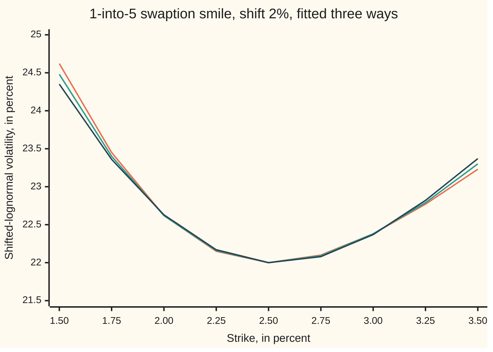
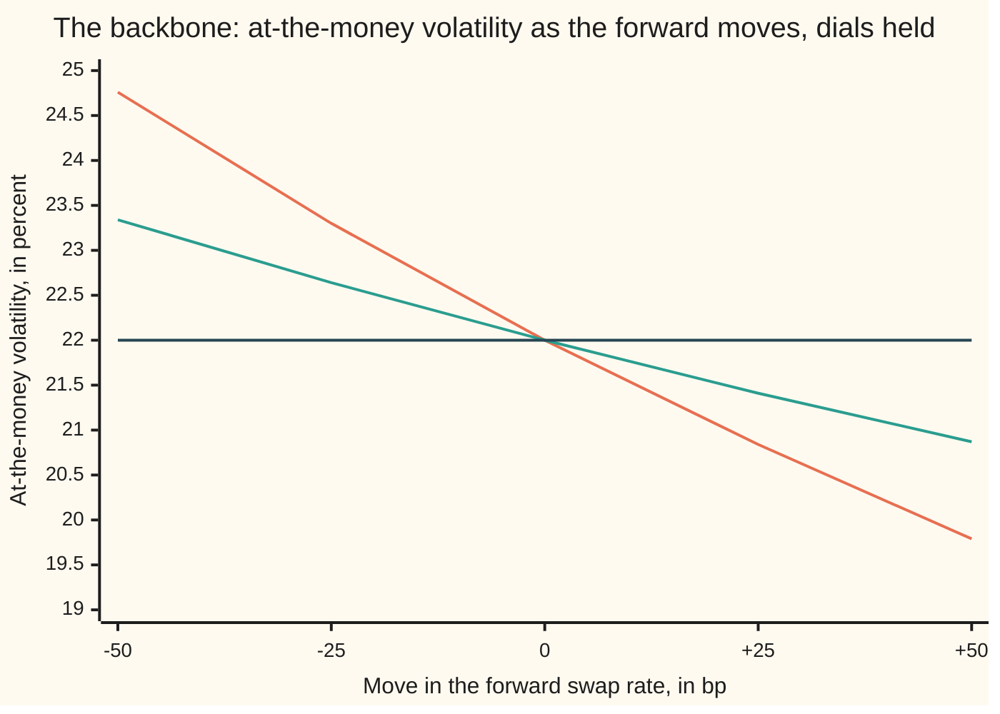

# SABR for rates: the smile across strikes, expiries and tenors

[Syllabus](../../../SYLLABUS.md) → [Financial mathematics](../../../SYLLABUS.md#w12) → [Caps, Floors and Swaptions](../../../SYLLABUS.md#w12-s29) → SABR for rates

---

## General Overview

A company has $1 million of floating-rate debt and wants the right, one year from today, to lock in a fixed rate for five years. It looks at a **1-into-5 payer swaption**: an option expiring in one year to enter a five-year swap paying a fixed rate ([Swaptions](04-swaptions-payer-and-receiver.md)). Today's forward swap rate for that swap is 2.50 percent. The dealer quotes three strikes, 50 basis points apart (a basis point, bp, is a hundredth of one percent): 2.00, 2.50 and 3.00 percent.

Each strike comes with its own volatility, quoted in the shifted-lognormal language with a 2 percent shift ([Rate volatilities](06-normal-and-shifted-volatilities-for-rates.md)): 22.625 percent, 22 percent and 22.375 percent. Two numbers summarise the shape. The **risk reversal** is the high-strike volatility minus the low-strike one: −25 vol bp, where a vol bp is a hundredth of a volatility point. The **butterfly** is the average of the two wings minus the middle: +50 vol bp. A negative risk reversal tilts the smile down to the right; a positive butterfly curls both ends up.

A desk needs a volatility at every strike, not three. It also needs one for every expiry and every swap length, because it trades them all. SABR, the model in which the rate and its volatility both move at random ([SABR and Hagan's formula](../14-Stochastic%20volatility%20-%20Heston%2C%20SABR%20and%20their%20mix/04-sabr-model-and-hagan-formula.md)), turns the three quotes into four dials. The **backbone exponent** beta is fixed in advance. The **level** alpha comes from the middle quote. The **correlation** rho comes mainly from the risk reversal, and the **vol of vol** nu mainly from the butterfly. For this smile: alpha 0.044702, rho 0.1353, nu 0.7114. The at-the-money payer costs $17,342.94.

**SABR for rates is fitted one node at a time: shift the rate so it is positive, fix beta from how the at-the-money volatility moves with the rate, solve alpha from the at-the-money quote, and read rho off the risk reversal and nu off the butterfly; one set of dials for each expiry and swap length, stacked, is the volatility cube.**

**What kind of fact this is:** a method: three quotes in, three dials out, solved two independent ways on this card. It runs on Hagan's formula, an approximation whose error [SABR and Hagan's formula](../14-Stochastic%20volatility%20-%20Heston%2C%20SABR%20and%20their%20mix/04-sabr-model-and-hagan-formula.md) measures; the reading of the dials is a second approximation, derived in Why it works, Step 2.

### The picture: three betas, one smile



Orange: beta 0. Green: beta one half, the card's choice. Dark: beta 1. All three pass through the three quotes at 2.00, 2.50 and 3.00 percent. Inside that range they agree to a few hundredths of a point; 100 bp out they part, 24.62% against 24.35% at 1.50%. One smile cannot tell the betas apart. Step 4 shows what can.

---

## The formula

Notation first. $F$ is the forward swap rate, $K$ the strike, $\delta$ the shift (written $a$ on the rate-volatilities card). The shifted rate $f = F + \delta$ and shifted strike $k = K + \delta$ are what the formulas see. $W_1$ and $W_2$ are Brownian motions, the random drivers of Itô calculus; $dW$ is one tiny random kick. Shifted SABR says:

$$df_t = \alpha_t\,f_t^{\beta}\,dW_1, \qquad d\alpha_t = \nu\,\alpha_t\,dW_2, \qquad dW_1\,dW_2 = \rho\,dt.$$

**Read it aloud:** the shifted rate takes random steps sized by the current volatility times the shifted rate to the power beta; the volatility takes random steps in proportion to itself; the two sets of steps lean together by rho.

Hagan's formula turns the dials into a volatility per strike. With $\beta = 1/2$, and $y = \ln(k/f)$ the log-distance from forward to strike, it reads

$$\sigma_B(K) = \frac{\alpha_k}{1 + \frac{y^2}{96} + \frac{y^4}{30720}}\cdot\frac{z}{\chi(z)}\cdot\Bigl[1 + \Bigl(\frac{\alpha_k^2}{96} + \frac{\rho\nu\alpha_k}{8} + \frac{(2-3\rho^2)\nu^2}{24}\Bigr)T\Bigr],$$

$$\alpha_k = \frac{\alpha}{(fk)^{1/4}}, \qquad z = -\frac{\nu\,y}{\alpha_k}, \qquad \chi(z) = \ln\frac{\sqrt{1-2\rho z+z^2}+z-\rho}{1-\rho}.$$

**Read it aloud:** the volatility at a strike is the level seen from that strike, bent by the vol of vol and the correlation, and lifted a little by time.

The premium of a payer swaption on notional $L$ with annuity $A$ is Black's formula on the shifted rate ([The annuity measure](05-the-annuity-measure.md)):

$$V = L\,A\,\bigl[f\,N(d_1) - k\,N(d_2)\bigr], \qquad d_1 = \frac{\ln(f/k) + \tfrac12\sigma_B^2T}{\sigma_B\sqrt T}, \qquad d_2 = d_1 - \sigma_B\sqrt T.$$

The card's own tool is the **reading**, Hagan's formula expanded near the money:

$$\frac{\sigma_B(K)}{\sigma_B(F)} \approx 1 - \tfrac12\,(1 - \beta - \rho\lambda)\,y + \tfrac1{12}\bigl[(1-\beta)^2 + (2-3\rho^2)\lambda^2\bigr]\,y^2, \qquad \lambda = \frac{\nu\,f^{1-\beta}}{\alpha}.$$

**Read it aloud:** relative to the middle, the smile tilts by the backbone's pull minus the correlation's push, and curls by the backbone's own bend plus the vol of vol squared.

| Symbol | Plain meaning | In our example | Push it up and the answer… |
| --- | --- | --- | --- |
| $F$, $K$ | forward swap rate; strike | 2.50%; 2.00%, 2.50%, 3.00% | payer dearer; payer cheaper |
| $\delta$, $a$, $f$, $k$, $f_t$ | the shift (the rate-volatilities card calls it a); shifted forward; shifted strike; shifted forward at time t | 2%; 4.50%; 4.00% at the low strike | a larger shift needs a smaller volatility for the same premium |
| $T$ | years to expiry | 1 | the time factor grows |
| $L$, $A$, $V$ | notional; annuity, the value of 1 a year paid on the swap's fixed dates; premium | $1,000,000; 4.40; $17,342.94 at the money | premium in proportion |
| $\sigma_B$ | shifted-lognormal (Black) volatility at a strike | 22.625%, 22%, 22.375% | premium rises |
| $\alpha$, $\alpha_t$, $\alpha_k$ | the level today; at time t; seen from strike k | 0.044702; 0.217023 at 2.00% | the whole smile rises |
| $\beta$ | backbone exponent: how a step's size scales with the rate | 1/2, fixed in advance | weaker downward tilt; the at-the-money volatility falls less as rates rise |
| $\rho$, $W_1$, $W_2$, $dW$ | correlation between the rate's and the volatility's drivers; the drivers; one tiny random kick | 0.1353 | tilts the smile up to the right |
| $\nu$ | vol of vol: how hard the volatility is kicked | 0.7114 | curls both wings up |
| $\lambda$, $s$, $c$ | vol of vol over the level, in the rate's own units; the smile's slope and curvature against log-strike, relative to the middle | 3.375896; −0.028491; 1.805926 | a larger lambda amplifies rho's tilt and nu's curl |
| $y$, $z$, $\chi$ | log-distance to the strike; minus that, times the vol of vol over the level; the curved length that replaces it | −0.117783; 0.386086; 0.386622 at 2.00% | — |
| $N$, $d_1$, $d_2$ | the bell-curve area to the left; the two cut-offs in Black's formula | — | — |

### When it holds

- **The shift is fixed and larger than any rate the node will see.** With $\delta$ = 2% the 2y-into-2y node below, at −0.50%, has a shifted forward of 1.50% and fits. A rate below −2% would put the logarithm out of range. Change the shift and every volatility changes with it, so the shift is part of the quote.
- **Beta is fixed before the fit.** Beta and rho both tilt the smile; three quotes cannot separate them (the picture above). Beta comes from the backbone, Step 4, or from house convention.
- **Hagan's formula is accurate.** It is an expansion for short expiries and strikes near the money; [SABR and Hagan's formula](../14-Stochastic%20volatility%20-%20Heston%2C%20SABR%20and%20their%20mix/04-sabr-model-and-hagan-formula.md) measures how it drifts from the model at long expiries and far strikes. Long expiries on the cube's far edge need the arbitrage-free repairs of Hagan and co-authors (2014).
- **The fitted smile has no negative butterfly.** A butterfly (long one low and one high strike, short two in the middle) never pays less than zero, so its price must be positive. Here the smallest 25 bp butterfly on the grid costs $660.52. Far wings at long expiries can fail this.
- **Each node stands alone.** Fitting one expiry and one swap length at a time says nothing about how neighbouring nodes relate. Nothing in the fit stops two nodes from implying an arbitrage between them.

**Conventions verified 28 Sep 2026** against Hagan et al. (2002), equation 2.17: the formula returns a Black volatility, annual, time in years, for use in Black's formula on the forward; here both forward and strike are shifted first. The risk reversal and butterfly on this card are volatility differences at fixed offsets of 50 bp either side of the forward. The 2 percent shift and all quotes are illustrative: a real shifted quote states its shift, which differs by currency and provider, and many swaption markets quote normal volatilities instead.

---

## Why it works

### Step 0: three features, three dials

A smile has three things the eye picks out: how high it sits, which way it tilts, how much it curls. Near the money these are the constant, the slope and the curvature of volatility against log-strike. With beta fixed, SABR has exactly three dials left, and each owns one feature: alpha the height, rho the tilt, nu the curl. The fit is three equations in three unknowns. The reading formula is what makes the ownership visible.

### Step 1: shift first, so the logarithm exists

Hagan's formula takes the logarithm of forward over strike and raises both to fractional powers. Both must be positive. Swap rates were negative in euros and Swiss francs for years after 2014. The fix is to model $f = F + \delta$ instead of $F$. The payoff does not change: $f - k = F - K$, so the payer still pays the rate minus the strike. Only the language of the volatility changes. The 22% quote at the money means 22% of 4.50%, not of 2.50%. In the normal language, basis points a year with no percentage of anything, the same premium is 98.80 bp ([Rate volatilities](06-normal-and-shifted-volatilities-for-rates.md)).

### Step 2: the reading, and why rho's sign is not the risk reversal's

Expand Hagan's formula in powers of $y$, keeping the square (Detailed proof, below). Relative to the middle quote the smile is $1 + s\,y + c\,y^2$, with slope and curvature

$$s = -\tfrac12\,(1 - \beta - \rho\lambda), \qquad c = \tfrac1{12}\bigl[(1-\beta)^2 + (2-3\rho^2)\lambda^2\bigr].$$

The slope has two parts. $-(1-\beta)/2$ is the **backbone's pull**: with beta below 1 a step's size grows more slowly than the rate, so in percentage terms low strikes see more volatility. $\rho\lambda/2$ is the correlation's push. At beta one half the pull alone would tilt the smile far more steeply than the quotes' slope, −0.028491. The backbone over-delivers the downward tilt, so rho must push back up: rho is positive, 0.1353, although the risk reversal is negative.

Run it backwards. Two wing ratios and two log-distances give $s$ and $c$ by solving two linear equations. Then $\rho\lambda = 2s + (1-\beta)$, and from $c$

$$\lambda^2 = \tfrac12\bigl[12c - (1-\beta)^2 + 3(\rho\lambda)^2\bigr].$$

Divide to get rho. Since $\alpha/f^{1-\beta}$, 0.210725 here, is close to the at-the-money volatility, nu is about lambda times that quote. The reading gives rho 0.133545 and nu 0.729822, close to the exact 0.135320 and 0.711387, and no solver was run. The curvature, 1.805926, is mostly vol of vol: the backbone's own bend, $(1-\beta)^2/12$, is a small part of it.

<details>
<summary>Detailed proof: the reading from Hagan's formula</summary>

Write $y = \ln(k/f)$ and $e = 1 - \beta$. Keep terms to $y^2$ and drop the time factor, which varies little across these strikes.

**The level seen from the strike.** $(fk)^{-e/2} = f^{-e}\,e^{-ey/2} \approx f^{-e}\bigl(1 - \tfrac e2 y + \tfrac{e^2}8 y^2\bigr)$. The divisor $1 + \tfrac{e^2}{24}y^2 + \dots$ contributes $-\tfrac{e^2}{24}y^2$.

**The bend.** $z = -\lambda\,y\,e^{ey/2} \approx -\lambda y\bigl(1 + \tfrac e2 y\bigr)$. The series $\chi(z) = z + \tfrac\rho2 z^2 + \dots$ gives $z/\chi(z) \approx 1 - \tfrac\rho2 z + \tfrac{2-3\rho^2}{12}z^2$, so the bend is $1 + \tfrac{\rho\lambda}2 y\bigl(1 + \tfrac e2 y\bigr) + \tfrac{(2-3\rho^2)\lambda^2}{12}y^2$.

**Multiply.** The $y$ terms: $-\tfrac e2 + \tfrac{\rho\lambda}2$. The $y^2$ terms: $\tfrac{e^2}8 - \tfrac{e^2}{24} = \tfrac{e^2}{12}$ from the level and divisor; $+\tfrac{\rho\lambda e}4$ from the bend's own $y^2$ term; $-\tfrac{\rho\lambda e}4$ from the cross product of $-\tfrac e2 y$ and $\tfrac{\rho\lambda}2 y$, which cancels it; and $\tfrac{(2-3\rho^2)\lambda^2}{12}$. So
$$\frac{\sigma_B(K)}{\sigma_B(F)} \approx 1 - \tfrac12(e - \rho\lambda)\,y + \tfrac1{12}\bigl[e^2 + (2-3\rho^2)\lambda^2\bigr]y^2,$$
which is Hagan et al. (2002), equation 3.1, divided through by its at-the-money value. At $\beta = 1$ it reduces to the reading on [SABR and Hagan's formula](../14-Stochastic%20volatility%20-%20Heston%2C%20SABR%20and%20their%20mix/04-sabr-model-and-hagan-formula.md), Step 4.

</details>

### Step 3: the exact fit, two ways

The reading is a first guess. The exact fit solves the full formula. For any trial rho and nu, alpha is set so the middle quote is met exactly: the at-the-money formula rises with alpha through the bracket searched, so bisection finds the one root there. The existence of that root, and which root to keep when there are two, is the business of [SABR from three quotes](../14-Stochastic%20volatility%20-%20Heston%2C%20SABR%20and%20their%20mix/05-sabr-calibration-from-three-quotes.md). What is left is two equations, one per wing, in rho and nu.

**Road 1** is Newton's method on both equations at once, started from the reading. **Road 2** uses the two features separately. At a fixed nu the risk reversal rises steadily with rho, so an inner bisection finds the rho that matches −25 vol bp. The butterfly then rises with nu, so an outer bisection finds the nu that matches +50. Both land on rho 0.135320 and nu 0.711387, agreeing to eight decimals, and alpha is 0.044702.

**Existence and uniqueness.** The bisections rely on the risk reversal rising with rho, across −0.99 to 0.99, and the butterfly rising with nu, across 0.05 to 2. Where that holds and each target lies between the values at its bracket's ends, each bracket holds exactly one root: the fit exists and is unique there. On these quotes Newton's method, started from the reading, lands on the same point. In general it can fail. A butterfly smaller than the backbone's own curl cannot be met by any nu; a risk reversal steeper than the model can tilt drives rho to ±1. A fit that lands on the edge of the bracket signals quotes the model cannot hold.

### Step 4: beta is read from the backbone, not from the smile

The three lines in the picture are three complete fits. Beta 0 needs rho 0.2811; beta 1 needs rho −0.0184. Nu barely moves, 0.7336 to 0.7094, because the curl is the vol of vol's job at every beta. Rho soaks up whatever tilt the backbone does not supply.

The betas differ in what happens when the forward moves. At the money, Hagan's formula is roughly $\alpha/f^{1-\beta}$. Hold the dials and move the rate: with beta 1 the at-the-money volatility stays at 22% whatever the rate does; with beta 0 it falls as the rate rises, so that the normal volatility, the percentage times the rate, stays nearly still. That path is the **backbone**. A desk picks beta by looking at history: when rates rose, did the at-the-money percentage volatility fall (beta near 0) or hold (beta near 1)? Rate desks have often landed at one half, or at 0 on a shifted rate. How the smile moves when rates move, below, traces the difference in dollars.

### Step 5: the cube is a grid of fits

A swaption has three coordinates: the option's expiry, the swap's length (its **tenor**), and the strike. Stack the smiles and the volatilities fill a cube: expiry by tenor by strike. Markets quote the at-the-money volatilities densely, a full expiry-by-tenor matrix, and the smile at fewer nodes. SABR organises it. Each expiry-tenor pair, a **node**, has its own forward swap rate and its own three quotes, and so its own alpha, rho and nu. Beta and the shift are shared across the cube.

| Node | Forward | At the money | Risk reversal | Butterfly | alpha | rho | nu |
| --- | --- | --- | --- | --- | --- | --- | --- |
| 1y into 2y | 1.50% | 20.00% | −350.0 vol bp | 75.0 vol bp | 0.03644 | −0.2262 | 0.6240 |
| 1y into 5y | 2.50% | 22.00% | −25.0 | 50.0 | 0.04470 | 0.1353 | 0.7114 |
| 2y into 2y | −0.50% | 24.00% | −500.0 | 100.0 | 0.02906 | −0.0616 | 0.2590 |
| 2y into 5y | 1.00% | 21.00% | −550.0 | 75.0 | 0.03543 | −0.4091 | 0.5454 |

Every node meets its three quotes: the largest miss prints as 0.000000 vol bp. The dials vary smoothly enough to interpolate. For a node between the grid points, a desk interpolates rho and nu across expiry and tenor, interpolates the at-the-money volatility, and solves alpha afresh so the at-the-money quote is met exactly. Interpolating alpha directly would miss it, because alpha's meaning depends on the forward. The swaption smile is the cube's strike axis; the caplet smiles, stripped from caps ([Caplet stripping](03-caplet-stripping.md)), are fitted the same way, one SABR per caplet expiry.

The other route to a whole cube is a single model of the entire curve with SABR-style volatilities. It ties the nodes together at the cost of a far slower fit.

---

## Worked numbers, by hand

The low strike, 2.00%, with the fitted dials.

| Step | Arithmetic | Value |
| --- | --- | --- |
| shifted forward $f$ | 2.50% + 2% | 0.045000 |
| shifted strike $k$ | 2.00% + 2% | 0.040 |
| log-distance $\ln(f/k)$, so $y$ = −0.117783 | ln(0.045 / 0.040) | 0.117783 |
| level at the strike $\alpha_k$ | 0.044702 / (0.045 × 0.040)^(1/4) | 0.217023 |
| $z$ | 0.711387 × 0.117783 / 0.217023 | 0.386086 |
| $\chi(z)$ | ln((√(1 − 2 × 0.135320 × 0.386086 + 0.386086^2) + 0.386086 − 0.135320) / (1 − 0.135320)) | 0.386622 |
| bend $z/\chi(z)$ | 0.386086 / 0.386622 | 0.998613 |
| divisor | 1 + 0.117783^2/96 + 0.117783^4/30720 | 1.000145 |
| time factor | 1 + (0.217023^2/96 + 0.135320 × 0.711387 × 0.217023/8 + (2 − 3 × 0.135320^2) × 0.711387^2/24) × 1 | 1.044116 |
| **volatility at 2.00%** | 0.217023 × 0.998613 × 1.044116 / 1.000145 | **0.226250, or 22.625%** |
| payer premium at 2.00% | Black's formula on 4.50% and 4.00%, times $1,000,000 × 4.40 | $30,062.24 |

The fitted smile reproduces the quote it was built from; that is the point of the fit. The payer struck at 2.00% costs $30,062.24, the at-the-money one $17,342.94, the one at 3.00% $9,633.14. The at-the-money premium is also reached by Simpson's rule on the payoff against the bell curve, with no normal-CDF call: the same $17,342.94.

### What breaks if you drop a piece

| Mistake | Comes out at | What went wrong |
| --- | --- | --- |
| Shift dropped: 22% fed to Black's formula on the raw 2.50% | $9,634.97 at the money, not $17,342.94 | 22% of 4.50% and 22% of 2.50% are different wobbles; the quote is only meaningful with its shift |
| Alpha set to the quote, 0.22 | 110.42% at the money, not 22% | At beta one half alpha is in units of the square root of a rate; 0.210725 is the level in percent terms |
| Rho read off the risk reversal's sign | rho −0.0184, the beta 1 answer | At beta one half the backbone already tilts too far down; rho is +0.1353 |
| Beta chosen to fit one smile | $17,343.36 or $18,306.44 after a 25 bp rise, for the same fit today | Three betas fit today's quotes; they disagree about tomorrow |

---

## How the smile moves when rates move

The quotes are the same today under all three betas. The difference shows up the day the rate moves. Hold every dial and push the forward up 25 bp, to 2.75%: a new at-the-money point.

| Beta | At-the-money volatility after +25 bp | At-the-money payer after +25 bp |
| --- | --- | --- |
| 0 | 20.84% | $17,343.36 |
| 1/2 | 21.41% | $17,818.51 |
| 1 | 22.00% | $18,306.44 |

Under beta 0 the premium barely changes from today's $17,342.94: the normal volatility, the one that sets an at-the-money premium, holds still, and the percentage volatility falls to make room. Under beta 1 the percentage holds at 22% and the premium rises to $18,306.44. A desk hedged under the wrong beta has the wrong delta, the sensitivity to the rate, and finds out when the rate moves ([Swaption Greeks](08-swaption-greeks-and-hedging.md)).



Orange: beta 0, falling steeply as rates rise. Green: beta one half, in between. Dark: beta 1, flat. All three cross at today's 22%.

---

## Code, from first principles, and it actually runs

The script fits the 1-into-5 smile three ways: road 3 reads the dials off the near-money expansion with no solving; road 1 runs Newton's method on both wing equations; road 2 runs nested bisection, rho for the risk reversal inside nu for the butterfly. It refits at betas 0 and 1, traces the backbone, prices payers by Black's formula and the at-the-money payer again by Simpson's rule, checks every 25 bp butterfly on the grid, and fits the four-node cube. The normal CDF is Marsaglia's power series; everything else is arithmetic.

### Python

```python
# SABR for rates -- the check behind the card.  Standard library only: the normal CDF, root finders,
# integrator and the solvers are written here.  A 1-into-5 swaption smile, shifted SABR, and a small cube.
from math import log, exp, sqrt, pi

NOTIONAL, ANN, T, SHIFT = 1e6, 4.40, 1.0, 0.02          # $1m, annuity 4.40 years, 1-year expiry, 2% shift
S, QL, QA, QH = 0.025, 0.22625, 0.22, 0.22375           # forward swap rate F; quotes at F - 50bp, F, F + 50bp

def ncdf(x):                     # Marsaglia: 1/2 + phi(x) (x + x^3/3 + x^5/15 + ...)
    if abs(x) > 9.0: return 0.0 if x < 0.0 else 1.0
    s, t, b, i = x, 0.0, x, 1.0
    while s != t:
        t, i = s, i + 2.0
        b *= x * x / i
        s = t + b
    return 0.5 + s * exp(-0.5 * x * x) / sqrt(2.0 * pi)
def payer(s, k, vol, t, ann=ANN):  # shifted Black: N A [f N(d1) - k N(d2)], f and k both shifted
    f, kk, v = s + SHIFT, k + SHIFT, vol * sqrt(t)
    d1 = (log(f / kk) + 0.5 * v * v) / v
    return NOTIONAL * ann * (f * ncdf(d1) - kk * ncdf(d1 - v))
def bisect(fn, lo, hi, n=100):   # root of an increasing function
    for _ in range(n):
        mid = 0.5 * (lo + hi)
        lo, hi = (mid, hi) if fn(mid) < 0.0 else (lo, mid)
    return 0.5 * (lo + hi)
def chi(z, rho): return log((sqrt(1.0 - 2.0 * rho * z + z * z) + z - rho) / (1.0 - rho))
def hagan(f, k, a, beta, rho, nu, t):   # Hagan et al. (2002), eq. 2.17, on shifted f and k
    e, lf = 1.0 - beta, log(f / k)
    fk = (f * k) ** (e / 2.0)
    z = nu / a * fk * lf
    zx = 1.0 if abs(z) < 1e-12 else z / chi(z, rho)
    back = fk * (1.0 + e * e / 24.0 * lf * lf + e * e * e * e / 1920.0 * (lf * lf * lf * lf))
    corr = e * e * a * a / (24.0 * fk * fk) + rho * beta * nu * a / (4.0 * fk) + (2.0 - 3.0 * rho * rho) * nu * nu / 24.0
    return a / back * zx * (1.0 + corr * t)
def smile(s, beta, rho, nu, atm, t):     # alpha retuned so the ATM quote is met; returns (alpha, vol at k)
    f = s + SHIFT
    a = bisect(lambda x: hagan(f, f, x, beta, rho, nu, t) - atm, 1e-6, 1.0)
    return a, (lambda k: hagan(f, k + SHIFT, a, beta, rho, nu, t))
def wings(s, beta, rho, nu, q, t):       # (vol at S - 50bp, vol at S + 50bp) with the ATM quote met
    v = smile(s, beta, rho, nu, q[1], t)[1]
    return v(s - 0.005), v(s + 0.005)
def read(s, beta, q):            # road 3: dials read off the near-money expansion, no solving
    f, yl, yh = s + SHIFT, log((s - 0.005 + SHIFT) / (s + SHIFT)), log((s + 0.005 + SHIFT) / (s + SHIFT))
    rl, rh = q[0] / q[1] - 1.0, q[2] / q[1] - 1.0            # ratio - 1 = slope y + curve y^2
    curve = (rl / yl - rh / yh) / (yl - yh)
    slope = rl / yl - curve * yl
    m = 2.0 * slope + (1.0 - beta)                            # rho * lambda
    lam = sqrt((12.0 * curve - (1.0 - beta) ** 2 + 3.0 * m * m) / 2.0)
    return slope, curve, m / lam, lam * q[1]                  # nu = lambda alpha / f^(1-beta) ~ lambda * ATM
def newton(s, beta, q, t, rho, nu):      # road 1: Newton on both wing equations at once
    for _ in range(40):
        lo, hi = wings(s, beta, rho, nu, q, t)
        r1, r2, h = lo - q[0], hi - q[2], 1e-6
        a1, a2 = wings(s, beta, rho + h, nu, q, t); b1, b2 = wings(s, beta, rho, nu + h, q, t)
        j11, j21, j12, j22 = (a1 - lo) / h, (a2 - hi) / h, (b1 - lo) / h, (b2 - hi) / h
        det = j11 * j22 - j12 * j21
        rho, nu = rho - (j22 * r1 - j12 * r2) / det, nu - (j11 * r2 - j21 * r1) / det
    return rho, nu
def nested(s, beta, q, t):       # road 2: outer bisection on nu for the butterfly, inner on rho for the RR
    rr, bf = q[2] - q[0], 0.5 * (q[0] + q[2]) - q[1]
    def rho_for(nu): return bisect(lambda r: (lambda w: w[1] - w[0])(wings(s, beta, r, nu, q, t)) - rr, -0.99, 0.99, 60)
    def fly(nu):
        w = wings(s, beta, rho_for(nu), nu, q, t)
        return 0.5 * (w[0] + w[1]) - q[1] - bf
    nu = bisect(fly, 0.05, 2.0, 60)
    return rho_for(nu), nu
def show(rows):
    for label, v in rows: print(f"{label:<44}{v:>14.6f}")

q = (QL, QA, QH)
f, rrbp, bfbp = S + SHIFT, 1e4 * (QH - QL), 1e4 * (0.5 * (QL + QH) - QA)
slope, curve, rho3, nu3 = read(S, 0.5, q)
rho1, nu1 = newton(S, 0.5, q, T, rho3, nu3)
rho2, nu2 = nested(S, 0.5, q, T)
al, vol = smile(S, 0.5, rho1, nu1, QA, T)
lf, akk = log(f / (S - 0.005 + SHIFT)), al / (f * (S - 0.005 + SHIFT)) ** 0.25
z = nu1 / akk * lf
corr = akk * akk / 96.0 + rho1 * nu1 * akk / 8.0 + (2.0 - 3.0 * rho1 * rho1) * nu1 * nu1 / 24.0
show((("shifted forward f = F + shift", f), ("risk reversal, vol bp (high - low)", rrbp),
      ("butterfly, vol bp (mean wing - ATM)", bfbp), ("road 3: slope of vol ratio in log-strike", slope),
      ("road 3: curvature of vol ratio", curve), ("road 3: rho, read", rho3), ("road 3: nu, read", nu3),
      ("road 1: rho, Newton", rho1), ("road 1: nu, Newton", nu1), ("road 2: rho, nested bisection", rho2),
      ("road 2: nu, nested bisection", nu2), ("alpha from the ATM quote", al), ("alpha / f^(1-beta)", al / sqrt(f)),
      ("lambda = nu f^(1-beta) / alpha", nu1 * sqrt(f) / al),
      ("K = 2.00%: ln(f / k)", lf), ("K = 2.00%: level alpha / (f k)^(1/4)", akk), ("K = 2.00%: z", z),
      ("K = 2.00%: chi(z)", chi(z, rho1)), ("K = 2.00%: z / chi(z)", z / chi(z, rho1)),
      ("K = 2.00%: divisor 1 + l^2/96 + l^4/30720", 1.0 + lf * lf / 96.0 + (lf * lf * lf * lf) / 30720.0),
      ("K = 2.00%: time factor", 1.0 + corr * T), ("K = 2.00%: fitted vol", vol(S - 0.005)),
      ("K = 3.00%: fitted vol", vol(S + 0.005))))
ks = [S + 0.0025 * i for i in range(-4, 5)]
fits = {b: newton(S, b, q, T, *read(S, b, q)[2:]) for b in (0.0, 0.5, 1.0)}
print("beta     rho       nu      alpha  " + "".join(f"{100 * k:7.2f}" for k in ks))
for b, (r, n) in fits.items():
    a, v = smile(S, b, r, n, QA, T)
    print(f"{b:4.1f}{r:9.4f}{n:9.4f}{a:11.6f}  " + "".join(f"{100 * v(k):7.2f}" for k in ks))
print("backbone: ATM vol % as F moves, dials held " + "".join(f"{1e4 * d:+7.0f}" for d in (-0.005, -0.0025, 0.0, 0.0025, 0.005)))
for b, (r, n) in fits.items():
    a = smile(S, b, r, n, QA, T)[0]
    print(f"  beta {b:3.1f}{'':34}" + "".join(f"{100 * hagan(S + d + SHIFT, S + d + SHIFT, a, b, r, n, T):7.2f}" for d in (-0.005, -0.0025, 0.0, 0.0025, 0.005)))
prem = [payer(S, k, vol(k), T) for k in ks]
v0, n_int = QA * sqrt(T), 4000
x0 = 0.5 * v0                             # at the money the payoff starts where x = v0 / 2
hh = (10.0 - x0) / n_int                  # second road for the premium: Simpson on E[(F_T - k)^+], x normal
g = [(f * exp(v0 * (x0 + i * hh) - 0.5 * v0 * v0) - f) * exp(-0.5 * (x0 + i * hh) ** 2) / sqrt(2 * pi) for i in range(n_int + 1)]
atm_int = NOTIONAL * ANN * hh / 3.0 * sum(y * (1 if i in (0, n_int) else 4 if i % 2 else 2) for i, y in enumerate(g))
flies = [prem[i - 1] - 2.0 * prem[i] + prem[i + 1] for i in range(1, 8)]
bb = {b: smile(S, b, *fits[b], QA, T)[0] for b in (0.0, 0.5, 1.0)}
up = [hagan(S + 0.0025 + SHIFT, S + 0.0025 + SHIFT, bb[b], b, *fits[b], T) for b in (0.0, 0.5, 1.0)]
show((("payer K = 2.00%, dollars", prem[2]), ("payer K = 2.50% (ATM), Black, dollars", prem[4]),
      ("payer K = 2.50% (ATM), Simpson integral", atm_int), ("payer K = 3.00%, dollars", prem[6]),
      ("ATM normal vol, bp, from the premium", 1e4 * prem[4] / (NOTIONAL * ANN) * sqrt(2 * pi / T)),
      ("smallest 25bp butterfly on the grid, dollars", min(flies)),
      ("wrong: shift dropped, ATM payer at 22%", NOTIONAL * ANN * S * (2.0 * ncdf(0.5 * QA * sqrt(T)) - 1.0)),
      ("wrong: alpha set to 0.22, ATM vol", hagan(f, f, 0.22, 0.5, rho1, nu1, T)),
      ("beta 0 fit: ATM vol after +25bp", up[0]), ("beta 1 fit: ATM vol after +25bp", up[2]),
      ("ATM payer after +25bp, beta 0, dollars", payer(S + 0.0025, S + 0.0025, up[0], T)),
      ("ATM payer after +25bp, beta 0.5, dollars", payer(S + 0.0025, S + 0.0025, up[1], T)),
      ("ATM payer after +25bp, beta 1, dollars", payer(S + 0.0025, S + 0.0025, up[2], T))))
cube = (("1y into 2y", 1.0, 0.015, (0.225, 0.200, 0.190)), ("1y into 5y", 1.0, 0.025, q),
        ("2y into 2y", 2.0, -0.005, (0.275, 0.240, 0.225)), ("2y into 5y", 2.0, 0.010, (0.245, 0.210, 0.190)))
print("cube node     F %   ATM %  RR bp  BF bp    alpha      rho       nu   miss bp")
miss = []
for name, t, s, qq in cube:
    r, n = newton(s, 0.5, qq, t, *read(s, 0.5, qq)[2:])
    w, a = wings(s, 0.5, r, n, qq, t), smile(s, 0.5, r, n, qq[1], t)[0]
    miss.append(1e4 * max(abs(w[0] - qq[0]), abs(w[1] - qq[2])))
    print(f"{name}{100 * s:7.2f}{100 * qq[1]:8.2f}{1e4 * (qq[2] - qq[0]):7.1f}{1e4 * (0.5 * (qq[0] + qq[2]) - qq[1]):7.1f}"
          f"{a:9.5f}{r:9.4f}{n:9.4f}{miss[-1]:10.6f}")
assert abs(rho1 - rho2) < 1e-8 and abs(nu1 - nu2) < 1e-8, "Newton and nested bisection land on the same dials"
assert abs(vol(S - 0.005) - QL) < 1e-10 and abs(vol(S + 0.005) - QH) < 1e-10, "fitted smile meets both wing quotes"
assert abs(akk * z / chi(z, rho1) * (1.0 + corr * T) / (1.0 + lf * lf / 96.0 + lf ** 4 / 30720.0) - vol(S - 0.005)) < 1e-12, "beta-1/2 hand formula = general Hagan"
assert abs(rho3 - rho1) < 0.05 and abs(nu3 / nu1 - 1.0) < 0.05, "the read-off dials sit near the exact fit"
assert abs(atm_int - prem[4]) < 1e-6 * prem[4], "Black formula vs Simpson integral at the money"
assert min(flies) > 0.0, "no negative butterfly on the grid"
assert up[0] < up[1] < up[2], "the lower the beta, the more the ATM vol falls as rates rise"
assert max(miss) < 1e-6, "every cube node fits its three quotes"
print("ALL CHECKS PASS")
```

**Ran 2026-09-28 on macOS, Python 3.14.6, standard library only. All checks passed. Output, pasted from the run:**

```
shifted forward f = F + shift                     0.045000
risk reversal, vol bp (high - low)              -25.000000
butterfly, vol bp (mean wing - ATM)              50.000000
road 3: slope of vol ratio in log-strike         -0.028491
road 3: curvature of vol ratio                    1.805926
road 3: rho, read                                 0.133545
road 3: nu, read                                  0.729822
road 1: rho, Newton                               0.135320
road 1: nu, Newton                                0.711387
road 2: rho, nested bisection                     0.135320
road 2: nu, nested bisection                      0.711387
alpha from the ATM quote                          0.044702
alpha / f^(1-beta)                                0.210725
lambda = nu f^(1-beta) / alpha                    3.375896
K = 2.00%: ln(f / k)                              0.117783
K = 2.00%: level alpha / (f k)^(1/4)              0.217023
K = 2.00%: z                                      0.386086
K = 2.00%: chi(z)                                 0.386622
K = 2.00%: z / chi(z)                             0.998613
K = 2.00%: divisor 1 + l^2/96 + l^4/30720         1.000145
K = 2.00%: time factor                            1.044116
K = 2.00%: fitted vol                             0.226250
K = 3.00%: fitted vol                             0.223750
beta     rho       nu      alpha     1.50   1.75   2.00   2.25   2.50   2.75   3.00   3.25   3.50
 0.0   0.2811   0.7336   0.009507    24.62  23.45  22.62  22.15  22.00  22.10  22.38  22.77  23.23
 0.5   0.1353   0.7114   0.044702    24.48  23.40  22.62  22.16  22.00  22.09  22.38  22.79  23.30
 1.0  -0.0184   0.7094   0.211291    24.35  23.36  22.63  22.17  22.00  22.08  22.37  22.82  23.37
backbone: ATM vol % as F moves, dials held     -50    -25     +0    +25    +50
  beta 0.0                                    24.76  23.30  22.00  20.84  19.79
  beta 0.5                                    23.34  22.64  22.00  21.41  20.87
  beta 1.0                                    22.00  22.00  22.00  22.00  22.00
payer K = 2.00%, dollars                      30062.235028
payer K = 2.50% (ATM), Black, dollars         17342.943767
payer K = 2.50% (ATM), Simpson integral       17342.943767
payer K = 3.00%, dollars                       9633.136892
ATM normal vol, bp, from the premium             98.800712
smallest 25bp butterfly on the grid, dollars    660.520365
wrong: shift dropped, ATM payer at 22%         9634.968759
wrong: alpha set to 0.22, ATM vol                 1.104187
beta 0 fit: ATM vol after +25bp                   0.208383
beta 1 fit: ATM vol after +25bp                   0.220000
ATM payer after +25bp, beta 0, dollars        17343.360101
ATM payer after +25bp, beta 0.5, dollars      17818.505337
ATM payer after +25bp, beta 1, dollars        18306.440643
cube node     F %   ATM %  RR bp  BF bp    alpha      rho       nu   miss bp
1y into 2y   1.50   20.00 -350.0   75.0  0.03644  -0.2262   0.6240  0.000000
1y into 5y   2.50   22.00  -25.0   50.0  0.04470   0.1353   0.7114  0.000000
2y into 2y  -0.50   24.00 -500.0  100.0  0.02906  -0.0616   0.2590  0.000000
2y into 5y   1.00   21.00 -550.0   75.0  0.03543  -0.4091   0.5454  0.000000
ALL CHECKS PASS
```

### Rust

Same rows, same labels, built with `rustc --edition 2021 -O`. The two outputs are identical.

```rust
// SABR for rates -- the same check as the Python, in Rust.  No crates: the normal CDF, root finders,
// integrator and the solvers are written here.  A 1-into-5 swaption smile, shifted SABR, and a small cube.
use std::f64::consts::PI;
const NOTIONAL: f64 = 1e6; const ANN: f64 = 4.40; const T: f64 = 1.0; const SHIFT: f64 = 0.02;
const S: f64 = 0.025; const QL: f64 = 0.22625; const QA: f64 = 0.22; const QH: f64 = 0.22375;

fn ncdf(x: f64) -> f64 {                   // Marsaglia: 1/2 + phi(x) (x + x^3/3 + x^5/15 + ...)
    if x.abs() > 9.0 { return if x < 0.0 { 0.0 } else { 1.0 }; }
    let (mut s, mut t, mut b, mut i) = (x, 0.0, x, 1.0);
    while s != t { t = s; i += 2.0; b *= x * x / i; s = t + b; }
    0.5 + s * (-0.5 * x * x).exp() / (2.0 * PI).sqrt()
}
fn payer(s: f64, k: f64, vol: f64, t: f64) -> f64 {   // shifted Black: N A [f N(d1) - k N(d2)]
    let (f, kk, v) = (s + SHIFT, k + SHIFT, vol * t.sqrt());
    let d1 = ((f / kk).ln() + 0.5 * v * v) / v;
    NOTIONAL * ANN * (f * ncdf(d1) - kk * ncdf(d1 - v))
}
fn bisect<G: Fn(f64) -> f64>(g: G, mut lo: f64, mut hi: f64, n: usize) -> f64 {   // increasing function
    for _ in 0..n { let mid = 0.5 * (lo + hi); if g(mid) < 0.0 { lo = mid } else { hi = mid } }
    0.5 * (lo + hi)
}
fn chi(z: f64, rho: f64) -> f64 { (((1.0 - 2.0 * rho * z + z * z).sqrt() + z - rho) / (1.0 - rho)).ln() }
fn hagan(f: f64, k: f64, a: f64, beta: f64, rho: f64, nu: f64, t: f64) -> f64 {   // Hagan et al. (2002)
    let (e, lf) = (1.0 - beta, (f / k).ln());
    let fk = (f * k).powf(e / 2.0);
    let z = nu / a * fk * lf;
    let zx = if z.abs() < 1e-12 { 1.0 } else { z / chi(z, rho) };
    let back = fk * (1.0 + e * e / 24.0 * lf * lf + e * e * e * e / 1920.0 * (lf * lf * lf * lf));
    let corr = e * e * a * a / (24.0 * fk * fk) + rho * beta * nu * a / (4.0 * fk) + (2.0 - 3.0 * rho * rho) * nu * nu / 24.0;
    a / back * zx * (1.0 + corr * t)
}
fn alpha(s: f64, beta: f64, rho: f64, nu: f64, atm: f64, t: f64) -> f64 {   // ATM quote met
    let f = s + SHIFT;
    bisect(|x| hagan(f, f, x, beta, rho, nu, t) - atm, 1e-6, 1.0, 100)
}
fn vol_at(s: f64, k: f64, a: f64, beta: f64, rho: f64, nu: f64, t: f64) -> f64 { hagan(s + SHIFT, k + SHIFT, a, beta, rho, nu, t) }
fn wings(s: f64, beta: f64, rho: f64, nu: f64, q: [f64; 3], t: f64) -> (f64, f64) {
    let a = alpha(s, beta, rho, nu, q[1], t);
    (vol_at(s, s - 0.005, a, beta, rho, nu, t), vol_at(s, s + 0.005, a, beta, rho, nu, t))
}
fn read(s: f64, beta: f64, q: [f64; 3]) -> (f64, f64, f64, f64) {   // road 3: near-money reading
    let (yl, yh) = (((s - 0.005 + SHIFT) / (s + SHIFT)).ln(), ((s + 0.005 + SHIFT) / (s + SHIFT)).ln());
    let (rl, rh) = (q[0] / q[1] - 1.0, q[2] / q[1] - 1.0);
    let curve = (rl / yl - rh / yh) / (yl - yh);
    let slope = rl / yl - curve * yl;
    let m = 2.0 * slope + (1.0 - beta);
    let lam = ((12.0 * curve - (1.0 - beta) * (1.0 - beta) + 3.0 * m * m) / 2.0).sqrt();
    (slope, curve, m / lam, lam * q[1])
}
fn newton(s: f64, beta: f64, q: [f64; 3], t: f64, mut rho: f64, mut nu: f64) -> (f64, f64) {   // road 1
    for _ in 0..40 {
        let (lo, hi) = wings(s, beta, rho, nu, q, t);
        let (r1, r2, h) = (lo - q[0], hi - q[2], 1e-6);
        let (a1, a2) = wings(s, beta, rho + h, nu, q, t); let (b1, b2) = wings(s, beta, rho, nu + h, q, t);
        let (j11, j21, j12, j22) = ((a1 - lo) / h, (a2 - hi) / h, (b1 - lo) / h, (b2 - hi) / h);
        let det = j11 * j22 - j12 * j21;
        let (nr, nn) = (rho - (j22 * r1 - j12 * r2) / det, nu - (j11 * r2 - j21 * r1) / det);
        rho = nr; nu = nn;
    }
    (rho, nu)
}
fn nested(s: f64, beta: f64, q: [f64; 3], t: f64) -> (f64, f64) {   // road 2: nu for the fly, rho for the RR
    let (rr, bf) = (q[2] - q[0], 0.5 * (q[0] + q[2]) - q[1]);
    let rho_for = |nu: f64| bisect(|r| { let w = wings(s, beta, r, nu, q, t); w.1 - w.0 - rr }, -0.99, 0.99, 60);
    let nu = bisect(|nu| { let w = wings(s, beta, rho_for(nu), nu, q, t); 0.5 * (w.0 + w.1) - q[1] - bf }, 0.05, 2.0, 60);
    (rho_for(nu), nu)
}
fn show(rows: &[(&str, f64)]) { for (label, v) in rows { println!("{:<44}{:>14.6}", label, v); } }
fn main() {
    let q = [QL, QA, QH];
    let (f, rrbp, bfbp) = (S + SHIFT, 1e4 * (QH - QL), 1e4 * (0.5 * (QL + QH) - QA));
    let (slope, curve, rho3, nu3) = read(S, 0.5, q);
    let (rho1, nu1) = newton(S, 0.5, q, T, rho3, nu3);
    let (rho2, nu2) = nested(S, 0.5, q, T);
    let al = alpha(S, 0.5, rho1, nu1, QA, T);
    let vol = |k: f64| vol_at(S, k, al, 0.5, rho1, nu1, T);
    let (lf, akk) = ((f / (S - 0.005 + SHIFT)).ln(), al / (f * (S - 0.005 + SHIFT)).powf(0.25));
    let z = nu1 / akk * lf;
    let corr = akk * akk / 96.0 + rho1 * nu1 * akk / 8.0 + (2.0 - 3.0 * rho1 * rho1) * nu1 * nu1 / 24.0;
    show(&[("shifted forward f = F + shift", f), ("risk reversal, vol bp (high - low)", rrbp),
        ("butterfly, vol bp (mean wing - ATM)", bfbp), ("road 3: slope of vol ratio in log-strike", slope),
        ("road 3: curvature of vol ratio", curve), ("road 3: rho, read", rho3), ("road 3: nu, read", nu3),
        ("road 1: rho, Newton", rho1), ("road 1: nu, Newton", nu1), ("road 2: rho, nested bisection", rho2),
        ("road 2: nu, nested bisection", nu2), ("alpha from the ATM quote", al), ("alpha / f^(1-beta)", al / f.sqrt()),
        ("lambda = nu f^(1-beta) / alpha", nu1 * f.sqrt() / al),
        ("K = 2.00%: ln(f / k)", lf), ("K = 2.00%: level alpha / (f k)^(1/4)", akk), ("K = 2.00%: z", z),
        ("K = 2.00%: chi(z)", chi(z, rho1)), ("K = 2.00%: z / chi(z)", z / chi(z, rho1)),
        ("K = 2.00%: divisor 1 + l^2/96 + l^4/30720", 1.0 + lf * lf / 96.0 + (lf * lf * lf * lf) / 30720.0),
        ("K = 2.00%: time factor", 1.0 + corr * T), ("K = 2.00%: fitted vol", vol(S - 0.005)),
        ("K = 3.00%: fitted vol", vol(S + 0.005))]);
    let ks: Vec<f64> = (-4..=4).map(|i| S + 0.0025 * i as f64).collect();
    let betas = [0.0, 0.5, 1.0];
    let fits: Vec<(f64, f64)> = betas.iter().map(|&b| { let r = read(S, b, q); newton(S, b, q, T, r.2, r.3) }).collect();
    let alphas: Vec<f64> = betas.iter().zip(&fits).map(|(&b, &(r, n))| alpha(S, b, r, n, QA, T)).collect();
    println!("beta     rho       nu      alpha  {}", ks.iter().map(|k| format!("{:7.2}", 100.0 * k)).collect::<String>());
    for i in 0..3 {
        let (b, (r, n), a) = (betas[i], fits[i], alphas[i]);
        println!("{:4.1}{:9.4}{:9.4}{:11.6}  {}", b, r, n, a, ks.iter().map(|&k| format!("{:7.2}", 100.0 * vol_at(S, k, a, b, r, n, T))).collect::<String>());
    }
    let ds = [-0.005, -0.0025, 0.0, 0.0025, 0.005];
    println!("backbone: ATM vol % as F moves, dials held {}", ds.iter().map(|d| format!("{:+7.0}", 1e4 * d)).collect::<String>());
    for i in 0..3 {
        let (b, (r, n), a) = (betas[i], fits[i], alphas[i]);
        println!("  beta {:3.1}{:34}{}", b, "", ds.iter().map(|d| format!("{:7.2}", 100.0 * hagan(S + d + SHIFT, S + d + SHIFT, a, b, r, n, T))).collect::<String>());
    }
    let prem: Vec<f64> = ks.iter().map(|&k| payer(S, k, vol(k), T)).collect();
    let (v0, n_int) = (QA * T.sqrt(), 4000);
    let x0 = 0.5 * v0;                          // at the money the payoff starts where x = v0 / 2
    let hh = (10.0 - x0) / n_int as f64;        // second road for the premium: Simpson on E[(F_T - k)^+], x normal
    let atm_int = NOTIONAL * ANN * hh / 3.0 * (0..=n_int).map(|i| {
        let x = x0 + i as f64 * hh;
        let y = (f * (v0 * x - 0.5 * v0 * v0).exp() - f) * (-0.5 * x * x).exp() / (2.0 * PI).sqrt();
        y * if i == 0 || i == n_int { 1.0 } else if i % 2 == 1 { 4.0 } else { 2.0 }
    }).sum::<f64>();
    let flies: Vec<f64> = (1..8).map(|i| prem[i - 1] - 2.0 * prem[i] + prem[i + 1]).collect();
    let min_fly = flies.iter().cloned().fold(f64::INFINITY, f64::min);
    let up: Vec<f64> = (0..3).map(|i| hagan(S + 0.0025 + SHIFT, S + 0.0025 + SHIFT, alphas[i], betas[i], fits[i].0, fits[i].1, T)).collect();
    show(&[("payer K = 2.00%, dollars", prem[2]), ("payer K = 2.50% (ATM), Black, dollars", prem[4]),
        ("payer K = 2.50% (ATM), Simpson integral", atm_int), ("payer K = 3.00%, dollars", prem[6]),
        ("ATM normal vol, bp, from the premium", 1e4 * prem[4] / (NOTIONAL * ANN) * (2.0 * PI / T).sqrt()),
        ("smallest 25bp butterfly on the grid, dollars", min_fly),
        ("wrong: shift dropped, ATM payer at 22%", NOTIONAL * ANN * S * (2.0 * ncdf(0.5 * QA * T.sqrt()) - 1.0)),
        ("wrong: alpha set to 0.22, ATM vol", hagan(f, f, 0.22, 0.5, rho1, nu1, T)),
        ("beta 0 fit: ATM vol after +25bp", up[0]), ("beta 1 fit: ATM vol after +25bp", up[2]),
        ("ATM payer after +25bp, beta 0, dollars", payer(S + 0.0025, S + 0.0025, up[0], T)),
        ("ATM payer after +25bp, beta 0.5, dollars", payer(S + 0.0025, S + 0.0025, up[1], T)),
        ("ATM payer after +25bp, beta 1, dollars", payer(S + 0.0025, S + 0.0025, up[2], T))]);
    let cube = [("1y into 2y", 1.0, 0.015, [0.225, 0.200, 0.190]), ("1y into 5y", 1.0, 0.025, q),
        ("2y into 2y", 2.0, -0.005, [0.275, 0.240, 0.225]), ("2y into 5y", 2.0, 0.010, [0.245, 0.210, 0.190])];
    println!("cube node     F %   ATM %  RR bp  BF bp    alpha      rho       nu   miss bp");
    let mut miss: Vec<f64> = Vec::new();
    for (name, t, s, qq) in cube {
        let rd = read(s, 0.5, qq);
        let (r, n) = newton(s, 0.5, qq, t, rd.2, rd.3);
        let (w, a) = (wings(s, 0.5, r, n, qq, t), alpha(s, 0.5, r, n, qq[1], t));
        miss.push(1e4 * (w.0 - qq[0]).abs().max((w.1 - qq[2]).abs()));
        println!("{}{:7.2}{:8.2}{:7.1}{:7.1}{:9.5}{:9.4}{:9.4}{:10.6}", name, 100.0 * s, 100.0 * qq[1], 1e4 * (qq[2] - qq[0]),
            1e4 * (0.5 * (qq[0] + qq[2]) - qq[1]), a, r, n, miss[miss.len() - 1]);
    }
    assert!((rho1 - rho2).abs() < 1e-8 && (nu1 - nu2).abs() < 1e-8, "Newton and nested bisection land on the same dials");
    assert!((vol(S - 0.005) - QL).abs() < 1e-10 && (vol(S + 0.005) - QH).abs() < 1e-10, "fitted smile meets both wing quotes");
    assert!((akk * z / chi(z, rho1) * (1.0 + corr * T) / (1.0 + lf * lf / 96.0 + lf.powi(4) / 30720.0) - vol(S - 0.005)).abs() < 1e-12, "beta-1/2 hand formula = general Hagan");
    assert!((rho3 - rho1).abs() < 0.05 && (nu3 / nu1 - 1.0).abs() < 0.05, "the read-off dials sit near the exact fit");
    assert!((atm_int - prem[4]).abs() < 1e-6 * prem[4], "Black formula vs Simpson integral at the money");
    assert!(min_fly > 0.0, "no negative butterfly on the grid");
    assert!(up[0] < up[1] && up[1] < up[2], "the lower the beta, the more the ATM vol falls as rates rise");
    assert!(miss.iter().cloned().fold(0.0, f64::max) < 1e-6, "every cube node fits its three quotes");
    println!("ALL CHECKS PASS");
}
```

**Ran 2026-09-28 on macOS, rustc 1.98.1, no crates. All checks passed. Output, pasted from the run:**

```
shifted forward f = F + shift                     0.045000
risk reversal, vol bp (high - low)              -25.000000
butterfly, vol bp (mean wing - ATM)              50.000000
road 3: slope of vol ratio in log-strike         -0.028491
road 3: curvature of vol ratio                    1.805926
road 3: rho, read                                 0.133545
road 3: nu, read                                  0.729822
road 1: rho, Newton                               0.135320
road 1: nu, Newton                                0.711387
road 2: rho, nested bisection                     0.135320
road 2: nu, nested bisection                      0.711387
alpha from the ATM quote                          0.044702
alpha / f^(1-beta)                                0.210725
lambda = nu f^(1-beta) / alpha                    3.375896
K = 2.00%: ln(f / k)                              0.117783
K = 2.00%: level alpha / (f k)^(1/4)              0.217023
K = 2.00%: z                                      0.386086
K = 2.00%: chi(z)                                 0.386622
K = 2.00%: z / chi(z)                             0.998613
K = 2.00%: divisor 1 + l^2/96 + l^4/30720         1.000145
K = 2.00%: time factor                            1.044116
K = 2.00%: fitted vol                             0.226250
K = 3.00%: fitted vol                             0.223750
beta     rho       nu      alpha     1.50   1.75   2.00   2.25   2.50   2.75   3.00   3.25   3.50
 0.0   0.2811   0.7336   0.009507    24.62  23.45  22.62  22.15  22.00  22.10  22.38  22.77  23.23
 0.5   0.1353   0.7114   0.044702    24.48  23.40  22.62  22.16  22.00  22.09  22.38  22.79  23.30
 1.0  -0.0184   0.7094   0.211291    24.35  23.36  22.63  22.17  22.00  22.08  22.37  22.82  23.37
backbone: ATM vol % as F moves, dials held     -50    -25     +0    +25    +50
  beta 0.0                                    24.76  23.30  22.00  20.84  19.79
  beta 0.5                                    23.34  22.64  22.00  21.41  20.87
  beta 1.0                                    22.00  22.00  22.00  22.00  22.00
payer K = 2.00%, dollars                      30062.235028
payer K = 2.50% (ATM), Black, dollars         17342.943767
payer K = 2.50% (ATM), Simpson integral       17342.943767
payer K = 3.00%, dollars                       9633.136892
ATM normal vol, bp, from the premium             98.800712
smallest 25bp butterfly on the grid, dollars    660.520365
wrong: shift dropped, ATM payer at 22%         9634.968759
wrong: alpha set to 0.22, ATM vol                 1.104187
beta 0 fit: ATM vol after +25bp                   0.208383
beta 1 fit: ATM vol after +25bp                   0.220000
ATM payer after +25bp, beta 0, dollars        17343.360101
ATM payer after +25bp, beta 0.5, dollars      17818.505337
ATM payer after +25bp, beta 1, dollars        18306.440643
cube node     F %   ATM %  RR bp  BF bp    alpha      rho       nu   miss bp
1y into 2y   1.50   20.00 -350.0   75.0  0.03644  -0.2262   0.6240  0.000000
1y into 5y   2.50   22.00  -25.0   50.0  0.04470   0.1353   0.7114  0.000000
2y into 2y  -0.50   24.00 -500.0  100.0  0.02906  -0.0616   0.2590  0.000000
2y into 5y   1.00   21.00 -550.0   75.0  0.03543  -0.4091   0.5454  0.000000
ALL CHECKS PASS
```

> [!TIP]
> **Try changing**
> - **Beta to 0.** Guess first: does rho go up or down? Up, to 0.2811: with a stronger backbone pull, the correlation must push harder the other way. Nu moves only to 0.7336.
> - **Beta to 1.** Guess first: does the at-the-money volatility move when the forward rises 25 bp? No: it stays at 22.00%, and the premium rises to $18,306.44.
> - **The shift to zero on the 2y-into-2y node.** Guess first: what happens at a forward of −0.50%? The logarithm of a negative number is undefined; the fit cannot start. With the 2% shift it fits: rho −0.0616, nu 0.2590.
> - **Drop the shift in pricing only.** Guess first: dearer or cheaper? Cheaper: $9,634.97 at the money against $17,342.94.

---

## The usual mistake

> [!warning]
> **Treating beta as a fourth number to fit.** Beta and rho tilt the smile in nearly the same way, so a fit over beta, rho and nu to one smile wanders along a ridge of near-equal answers: betas 0, one half and 1 all meet the three quotes. The fit then picks a beta by accident, and the accident sets the hedge: $17,343.36 or $18,306.44 after the same 25 bp move. Beta is chosen first, from the backbone.
>
> - **Reading rho as the risk reversal's sign.** A negative risk reversal gave rho +0.1353 at beta one half. The backbone's pull comes first.
> - **Quoting a shifted volatility without its shift.** Priced as unshifted, the 22% at-the-money quote gives $9,634.97, not $17,342.94.
> - **Taking alpha as the at-the-money volatility.** Alpha 0.22 at beta one half gives 110.42%.
> - **Interpolating alpha across the cube.** Alpha's meaning depends on the node's forward. Interpolate rho, nu and the at-the-money volatility, then solve alpha.

---

## Where you meet it in real life

- **Swaption desks.** Every day the cube is refitted: at-the-money volatilities from brokers, smiles at the quoted nodes, SABR dials per node. Risk is reported per node, and a trader's view on rho or nu is a view on risk reversals or butterflies.
- **Caps and floors.** Caplet volatilities, stripped from quoted caps ([Caplet stripping](03-caplet-stripping.md)), get one SABR smile per caplet expiry, on the same shifted scale.
- **Negative rates.** From 2014 euro and Swiss franc swap rates went below zero. Shifted SABR kept the existing models running; the shift became part of every quote.
- **Constant-maturity swaps.** A payment linked to a future swap rate is priced by replicating it with swaptions across all strikes, so it depends on the smile far into the wings. That is where Hagan's formula is least reliable and where the arbitrage-free versions earn their place.
- **Solving backwards.** A dealer who quotes a premium lets the other side solve for the volatility; [Solving rate options backwards](09-rate-option-inverses.md) does that inversion properly.

> **Say it back**
> A swaption smile is three quotes: the at-the-money volatility, a risk reversal and a butterfly. Shifted SABR, with beta fixed first, turns them into three dials: alpha from the middle, rho mainly from the tilt, nu mainly from the curl. Beta cannot be seen in one smile; it is chosen from how the at-the-money volatility has moved with the rate. Each expiry and swap length gets its own dials, and the stack of fitted smiles is the volatility cube.

---

## What this builds on

- [Rate volatilities](06-normal-and-shifted-volatilities-for-rates.md): the shifted and normal languages, and the at-the-money conversion that gives 98.80 bp here.
- [SABR and Hagan's formula](../14-Stochastic%20volatility%20-%20Heston%2C%20SABR%20and%20their%20mix/04-sabr-model-and-hagan-formula.md): the model, Hagan's formula, why it holds and how large its error is.

## Where this goes next

- [Swaption Greeks](08-swaption-greeks-and-hedging.md): card 08 on this shelf: the swaption's sensitivities, where the backbone chosen here decides the delta.
- [Solving rate options backwards](09-rate-option-inverses.md): running the pricing formulas backwards, with existence and uniqueness stated.

The fit leaves the dials fixed while the rate moves; how a swaption's value changes when the forward, the annuity and the smile all move together is what the Greeks card answers.

---

## Sources

Verified 2026-09-28: every link below resolves to the publisher's page.

- Patrick S. Hagan, Deep Kumar, Andrew S. Lesniewski and Diana E. Woodward, "Managing Smile Risk", *Wilmott Magazine*, September 2002, pp. 84–108. [Publisher page](https://www.wilmott.com/managing-smile-risk/). The model, the formula (2.17), the near-money form (3.1), the backbone, and the choice of beta for rates.
- Graeme West, "Calibration of the SABR Model in Illiquid Markets", *Applied Mathematical Finance* 12(4), 2005, pp. 371–385. [doi:10.1080/13504860500148672](https://doi.org/10.1080/13504860500148672). Fitting from few quotes, and fixing beta before fitting.
- Patrick S. Hagan, Deep Kumar, Andrew S. Lesniewski and Diana E. Woodward, "Arbitrage-Free SABR", *Wilmott* 2014(69), pp. 60–75. [doi:10.1002/wilm.10290](https://doi.org/10.1002/wilm.10290). Where the formula breaks at low strikes and long expiries, and the repair.
