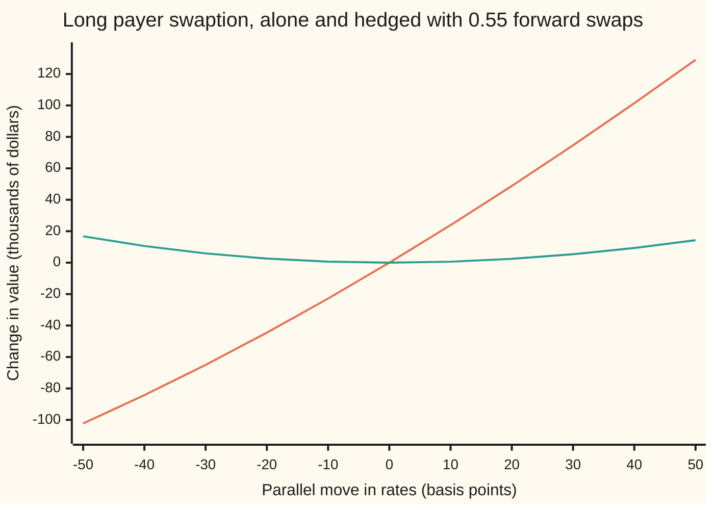
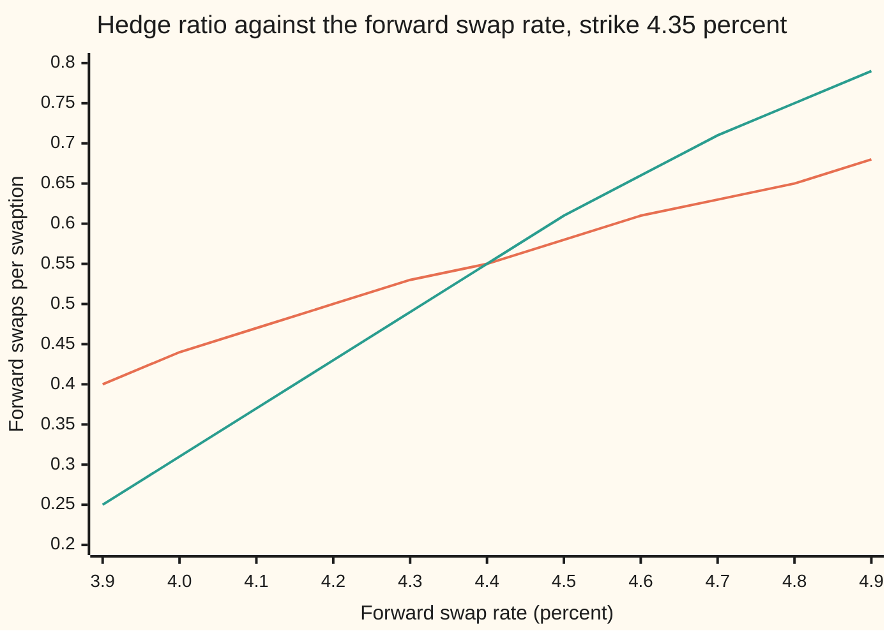

# Swaption Greeks: delta in swaps, vega in the cube, and the annuity's own sensitivity

[Syllabus](../../../SYLLABUS.md) → [Financial mathematics](../README.md) → [Caps, Floors and Swaptions](../README.md#s29) → Swaption Greeks

---

## General Overview

A pension fund has bought a one-year option from a bank. In one year the fund may enter a five-year swap on 10 million dollars in which it pays a fixed 4.35 percent a year and receives the floating rate. That contract is a **payer swaption**: the right, not the duty, to become the fixed payer ([Swaptions](04-swaptions-payer-and-receiver.md)). The rate a swap starting in one year would carry if agreed today, the **forward swap rate**, is 4.40 percent. At 30 percent volatility the bank charged 230,666.45 dollars, about 2.31 percent of the notional (the face amount the payments are computed on).

The bank now holds a short option and does not want a view on rates. Rates up means the fund's right is worth more, and the bank loses. So the bank takes the opposite exposure in the plain contract: it enters a forward swap in which it pays fixed 4.40 percent, starting in one year, on 5.54 million dollars. That is **0.55 of a forward swap per swaption**. After a small move in rates, either way, the swaption and the swap change by nearly the same amount.

This card derives that 0.55, and the three other sensitivities that come with it. Each sensitivity is called a **Greek**, after the letters traders use for them: delta (value per move in rates), gamma (how fast delta itself changes), vega (value per move in volatility) and theta (value per day that passes). The surprise is the first one. The standard option formula says the hedge is 0.57 swaps. The right answer is 0.55, because the **annuity**, the value today of 1 dollar paid on each of the swap's fixed dates, multiplies every swaption price and moves with rates too.

**A swaption's delta is N(d1) forward swaps (N(d1) is the bell-curve term of Black's formula, defined below) when value is counted in multiples of the annuity, and slightly less when counted in dollars, because the annuity falls as rates rise and the swaption's price carries it while an at-market swap does not.**

**What kind of fact this is:** a theorem inside a model: the formulas are proved on this card in Why it works, and hold as far as Black's lognormal model for the forward swap rate and a parallel move of the curve hold.

### The picture: the swaption alone, and the swaption with its hedge

Rates move by a parallel shift, left to right. Both lines are the holder's side: the long payer alone, and the long payer plus 0.55 forward swaps in which the holder receives fixed. The bank's hedged book is the mirror image.



Steep line: the swaption alone, which gains when rates rise and loses when they fall. Flat line: the swaption plus the short swaps. It sits at zero for small moves and bends upward both ways, a smile of profit for the swaption's holder. The bend is gamma. A basis point (bp) is one hundredth of a percent, 0.01 percent.

---

## The formula

Notation first, in words. Black's formula for a swaption prices it as the **annuity**, the value today of 1 dollar of fixed rate paid on each of the swap's dates, times a call on the forward swap rate ([The annuity measure](05-the-annuity-measure.md)). A small number set low, as in $d_1$, is a label. A prime, as in A′, means the slope: how fast a quantity changes as the curve's rate moves.

$$V = M\,A\,\big[F\,N(d_1) - K\,N(d_2)\big], \qquad d_1 = \frac{\ln(F/K) + \tfrac12\sigma^2 T}{\sigma\sqrt{T}}, \quad d_2 = d_1 - \sigma\sqrt{T}$$

**Read it aloud:** the swaption is the notional, times the annuity, times a Black call on the forward swap rate.

The four Greeks, and the hedge ratio the card is named for:

| Greek | Formula | Our swaption | In words |
| --- | --- | --- | --- |
| $\Delta$, delta in swaps | $N(d_1)$ | 0.574599 | forward swaps per swaption if the annuity held still |
| $h$, hedge ratio in dollars | $N(d_1) + \dfrac{A'}{A}\,\big[F N(d_1) - K N(d_2)\big]$ | 0.554091 | forward swaps per swaption once the annuity moves |
| $\Gamma$, gamma | $\dfrac{\varphi(d_1)}{F\,\sigma\sqrt{T}}$ per unit of rate | 0.029693 per 10 bp | how much $\Delta$ rises as the forward rises |
| $\nu$, vega | $M\,A\,F\,\varphi(d_1)\sqrt{T}$ | 7,271.99 dollars per vol point | value per 1 percentage point of volatility |
| $\Theta$, theta | $-\dfrac{M A F \varphi(d_1)\sigma}{2\sqrt{T}} + V\ln(1+y)$, per year | −271.64 dollars a day | decay of the option, less the carry of the annuity |

**Read it aloud:** delta in swaps is N(d1); the dollar hedge trims it by the annuity's percentage slope times the option's value per unit of annuity.

| Symbol | Plain meaning | In our example | Push it up and the answer… |
| --- | --- | --- | --- |
| $V$ | the swaption's value in dollars | 230,666.45 | — |
| $B$ | the value per unit of annuity: $F N(d_1) - K N(d_2)$, in rate points | 0.0054703 | — |
| $M$ | the notional: the face amount the swap's payments are computed on | 10,000,000 dollars | every Greek in dollars scales with it |
| $A$ | the annuity: value today of 1 per year paid on each fixed date, in years; A′ is its slope as the curve's rate rises | 4.216702; A′ = −15.808392 | the price rises in proportion |
| $D(t)$, $t$, $y$ | discount factor, today's price of 1 dollar due at time $t$ years, here (1 + y) to the power −t; $y$ is the flat curve's yearly rate | $y$ = 4.40 percent | a higher $y$ lowers every $D(t)$ and the annuity |
| $F$, $F_0$ | the forward swap rate: the fixed rate that makes the swap starting in one year worth zero today; $F_0$ is its value on the day a hedge swap is struck | 4.40 percent | the payer gains, since it pays a fixed rate below the market's |
| $K$ | the strike: the fixed rate the swaption lets its holder pay | 4.35 percent | the payer loses value |
| $\sigma$ | volatility: the yearly standard deviation of the log of the forward swap rate | 30 percent | the price rises; that rise is vega |
| $T$ | time to the option's expiry, in years | 1 | more time, more value; its passing is theta |
| $d_1$, $d_2$ | how far the forward sits above the strike, in units of $\sigma\sqrt{T}$, the second one unit lower | 0.188096, −0.111904 | — |
| $N(x)$, $\varphi(x)$ | the bell curve's area left of $x$, and its height at $x$ | $N(d_1)$ = 0.574599, $N(d_2)$ = 0.455450 | — |
| $h$ | hedge ratio: forward swaps per swaption that cancel a small parallel move | 0.554091 | — |

The formula for $d_1$ in words: the log distance from strike to forward, plus half a variance, over one standard deviation of the rate's log over the option's life.

### When it holds

- **The forward swap rate is lognormal with constant volatility.** If volatility moves, value changes by about vega times the move: 7,271.99 dollars per point here, unhedged by any swap.
- **Rates move in parallel.** The 0.554091 is for the whole curve shifting together. A twist, in which one-year rates rise and six-year rates fall, moves the annuity and the forward by different amounts, and the ratio changes.
- **The volatility does not move with the rate.** On a real smile it does, and the delta then picks up vega times the smile's slope ([SABR for rates](07-sabr-for-rates-and-the-volatility-cube.md)).
- **Hedging is continuous.** Rebalanced once a week, the hedge misses the payoff with a standard deviation of 25,906.98 dollars; the code measures it.
- **One curve both forecasts and discounts.** With separate curves, forward and annuity respond to different moves, and each gets its own delta.

**Conventions verified 2026-09-28:** the flat curve with yearly fixed payments is a teaching simplification. USD swaps on SOFR pay fixed yearly and forecast and discount off one SOFR curve; swaption volatility is quoted mainly as normal (basis-point) volatility, so the 30 percent lognormal volatility here is a Black-model input, not a screen quote.

---

## Why it works

### Step 0: count everything in annuity units and the swaption becomes a plain call

The swaption is $M\,A$ times a Black call on $F$. An at-market forward swap, paying fixed $F_0$ from year one, is worth $M\,A\,(F - F_0)$: the difference in rates, paid on each date, discounted, which is the annuity times the difference. Both carry the same factor $M\,A$.

Divide both by $M\,A$. Counted in these units the swaption is a call on the forward rate, and the swap is just $F - F_0$: one unit per unit of rate. The annuity measure makes $F$ driftless in those units, so the whole of Black–Scholes hedging applies with zero interest rate ([The annuity measure](05-the-annuity-measure.md)). The hedge ratio in those units is the call's slope, $N(d_1)$ = 0.574599.

### Step 1: the call's slope is N(d1)

Differentiate $F N(d_1) - K N(d_2)$ in $F$. Three terms appear: $N(d_1)$ from the first factor, plus $F \varphi(d_1)$ and $-K \varphi(d_2)$ times the slopes of $d_1$ and $d_2$, which are equal. The last two cancel because $F \varphi(d_1) = K \varphi(d_2)$ exactly. What remains is $N(d_1)$.

<details>
<summary>Detailed proof: why the two height terms cancel</summary>

Write $v = \sigma\sqrt{T}$, so $d_2 = d_1 - v$. Then
$$\frac{\varphi(d_2)}{\varphi(d_1)} = e^{-\frac12 (d_1 - v)^2 + \frac12 d_1^2} = e^{d_1 v - \frac12 v^2} = e^{\ln(F/K)} = \frac{F}{K},$$
using $d_1 v = \ln(F/K) + \tfrac12 v^2$ from the definition of $d_1$. So $K\varphi(d_2) = F\varphi(d_1)$.

Both $d_1$ and $d_2$ have slope $1/(F v)$ in $F$. The derivative of $F N(d_1) - K N(d_2)$ is therefore $N(d_1) + \big[F\varphi(d_1) - K\varphi(d_2)\big]/(F v) = N(d_1)$.

The same identity gives the others. Gamma is the slope of $N(d_1)$: $\varphi(d_1)/(F v)$. Vega is the slope in $\sigma$: the $N$ terms' slopes cancel the same way and leave $F\varphi(d_1)\sqrt{T}$. The decay part of theta is the slope in $T$ with a minus sign, since time passing shortens $T$: $-F\varphi(d_1)\sigma/(2\sqrt{T})$.

</details>

### Step 2: in dollars the annuity moves, and only the option feels it

A trader's risk is measured in dollars for a move of the curve. Move the flat rate $y$ by a small amount. Two things change: $F$ and $A$. On this flat curve with yearly payments, $F$ equals $y$ exactly, so $F$ moves one for one. The annuity falls, with slope $A'$ = −15.808392: every discount factor shrinks when rates rise.

By the product rule, the swaption's slope in $y$ is $M\,[A' B + A\,N(d_1)]$, where $B = F N(d_1) - K N(d_2)$ is its value per unit of annuity. The at-market swap's slope is $M\,[A' (F - F_0) + A]$, and $F - F_0$ is zero on the trade date. The annuity's slope multiplies the swaption's value but multiplies zero in the swap.

Divide one slope by the other:

$$h = N(d_1) + \frac{A'}{A}\,B.$$

$A'/A$ = −3.748994: the annuity loses about 3.75 percent of itself per percentage point of rates. Times $B$, the swaption's value per unit of annuity, that is −0.020508. So $h$ = 0.574599 − 0.020508 = 0.554091. On a curve that is not flat, divide the second term by $F$'s own slope in the curve move.

### Step 3: gamma is how fast the hedge goes stale

$N(d_1)$ rises as $F$ rises. Its slope, $\varphi(d_1)/(F\sigma\sqrt{T})$, is 0.029693 per 10 basis points. After rates rise 10 basis points the full hedge ratio is 0.581042; after they fall 10 it is 0.525939. A hedge set at 0.554091 is then too small or too large, and the profit and loss (P&L) it misses grows with the square of the move. The hedged book's value changes by about half the dollar gamma times the move squared, and the table in Worked numbers shows it: 634.94 dollars measured against 626.03 predicted at −10 basis points.

### Step 4: vega belongs to one cell of the cube

Vega is $M A F \varphi(d_1)\sqrt{T}$: 7,271.99 dollars for one percentage point of volatility. No swap hedges it, because a swap has no volatility in it. Only another option does.

Swaption volatilities are quoted on a grid with three sides: option expiry, the length of the swap underneath, and the strike. That grid is the **volatility cube** ([SABR for rates](07-sabr-for-rates-and-the-volatility-cube.md)). This swaption's vega sits in one cell: 1-year expiry, 5-year swap, strike 4.35 percent. A 2-into-5 swaption hedges it only as far as those two cells move together. Desks report vega cell by cell for that reason.

### Step 5: theta is decay less carry, and it pays for gamma

Let one day pass with the curve unchanged. Two things happen. The option has less time, which costs $M A F \varphi(d_1)\sigma/(2\sqrt{T})$ a year: 298.85 dollars a day. And every payment date is a day nearer, so each discount factor grows by the factor $(1+y)$ to the power one day: the annuity, and the swaption with it, grow at the rate $\ln(1+y)$. That carry is 27.21 dollars a day. Net theta: −271.64 dollars a day.

In annuity units the carry vanishes and the decay alone is exactly $\tfrac12 \sigma^2 F^2$ times gamma, with a minus sign. That is Black–Scholes' balance with no interest rate: the time a long option loses each day is the average profit its gamma earns on the day's moves. A hedged payer loses 298.85 dollars a day of decay and, on average, earns it back in the smile of the picture above.

<details>
<summary>Why a hedge ratio in forward swaps and not in dollars per basis point?</summary>

Desks do both. The swaption's DV01, its value change per basis point, is 2,336.43 dollars. The forward swap's DV01 is 4,216.70 dollars per 10 million. Their ratio is the same 0.554091. Counting in swaps says which instrument to trade and how much; counting in DV01 lets the swaption's risk be added to a whole book of swaps and bonds.

</details>

The other route runs through normal volatility: price with Bachelier's formula, where the rate moves by basis points rather than percentages, and delta becomes $N$ of a different $d$. The annuity correction is the same. That route is [Rate volatilities](06-normal-and-shifted-volatilities-for-rates.md).

---

## Worked numbers, by hand

A 1-into-5 payer on 10 million dollars, strike 4.35 percent, flat curve at 4.40 percent with yearly payments, volatility 30 percent.

| Step | Arithmetic | Value |
| --- | --- | --- |
| annuity $A$ | $D(2) + D(3) + D(4) + D(5) + D(6)$, each $1.044^{-t}$ | 4.216702 |
| forward $F$ | $(D(1) - D(6)) / A$ | 4.40 percent |
| $d_1$ | $(\ln(4.40/4.35) + 0.045) / 0.30$ | 0.188096 |
| $d_2$ | $0.188096 - 0.30$ | −0.111904 |
| $N(d_1)$, $N(d_2)$ | bell-curve table | 0.574599, 0.455450 |
| price | $10{,}000{,}000 \times 4.216702 \times (0.044 \times 0.574599 - 0.0435 \times 0.455450)$ | 230,666.45 dollars |
| annuity slope over annuity | $-15.808392 / 4.216702$ | −3.748994 |
| annuity term | $-3.748994 \times 0.0054703$ | −0.020508 |
| **hedge ratio** | $0.574599 - 0.020508$ | **0.554091** |
| hedge notional | $0.554091 \times 10{,}000{,}000$ | 5,540,910.24 dollars |

The bank pays fixed 4.40 percent on 5,540,910.24 dollars of a swap starting in one year. That leaves it with no first-order exposure to a parallel move of rates, and with 7,271.99 dollars of vega and a gamma it can only hedge with options.

### The hedge at work

Swaption holder's side: the long payer and a short 0.554091 forward swaps. The last column is half the dollar gamma times the move squared.

| Move | Swaption P&L | Hedge P&L | Net | Half-gamma guess |
| --- | --- | --- | --- | --- |
| −30 bp | −65,005.14 | 70,887.62 | 5,882.48 | 5,634.29 |
| −10 bp | −22,817.25 | 23,452.19 | 634.94 | 626.03 |
| +10 bp | 23,891.84 | −23,277.00 | 614.84 | 626.03 |
| +30 bp | 74,654.70 | −69,310.87 | 5,343.83 | 5,634.29 |

The net is small, positive both ways, and close to the gamma guess. The gap between −30 and +30 comes from the annuity's curvature and the third derivative, both smaller effects.

### What breaks if you drop a piece

| Mistake | Comes out at | What went wrong |
| --- | --- | --- |
| Hedge with $N(d_1)$ = 0.574599 swaps | net 8,506.19 at −30 bp, 2,778.48 at +30 bp (right: 5,882.48, 5,343.83) | over-hedged by the annuity term: a bet of 86.48 dollars a basis point that rates fall |
| Hedge with a spot-starting 5-year swap, 0.554091 of it | net 8,788.87 at −30 bp, 2,086.21 at +30 bp | a swap starting today has a larger annuity than one starting in a year, so it over-hedges |
| Theta without the annuity's carry | −298.85 dollars a day (right: −271.64) | payment dates get nearer each day; the discount factors grow |
| Price without the annuity | 54,703.05 dollars (right: 230,666.45) | Black's formula gives rate points; the annuity turns them into dollars |

The 86.48 dollars a basis point in the first row is the gap of 0.020508 swaps times the swap's 4,216.70 dollars per basis point. Over 30 basis points that is about 2,594 dollars, close to how far each wrong net sits from the right one.

---

## How the hedge moves

The hedge ratio is not a constant. It drifts with rates, and it drifts with time even when rates stand still.

### Force one: rates move

At twelve months to expiry:

| Forward rate | 4.30% | 4.40% | 4.50% |
| --- | --- | --- | --- |
| Hedge ratio | 0.525939 | 0.554091 | 0.581042 |

Ten basis points moves the hedge by about 0.03 swaps, or roughly 270,000 dollars of swap notional to buy or sell.

### Force two: time passes

Curve fixed at 4.40 percent, strike 4.35 percent. Value and daily theta:

```
months left   daily theta, dollars (one block = $50)
      12   █████                          $271.64   value $230,666.45
       6   ████████                       $413.87   value $170,223.62
       3   ████████████                   $606.43   value $125,129.92
       1   █████████████████████          $1,070.25 value $77,824.51
```

The option melts faster as expiry nears: a day with one month left costs almost four times a day with a year left.

### Both forces in one picture



Gentler line: twelve months left. Steeper line: three months left. Near the strike the two agree, about 0.55. Away from it the short-dated hedge swings harder: with little time left, the option is close to all or nothing, and its hedge follows. Steeper means more gamma, and more rebalancing per basis point.

---

## Code, from first principles, and it actually runs

The code prices the swaption and its Greeks by four roads. Road 1 is Black's formula with its closed-form Greeks. Road 2 averages the payoff over the bell curve by Simpson's rule, starting at an exercise boundary found by bisection, and bumps that integral for delta, gamma and vega. Road 3 revalues the whole curve after a bump, for the dollar hedge ratio and theta. Road 4 hedges 2,000 simulated years in annuity units and checks that the hedge costs the premium: rebalanced 52 times a year and then 260 times, with a random number generator written in the script.

### Python

```python
# Swaption Greeks and the forward-swap hedge -- the check behind the card.  Standard library only.
# Normal CDF, integrator and random numbers are written here; nothing imported knows a swaption.
from math import exp, log, sqrt, pi, cos

def phi(x): return exp(-0.5 * x * x) / sqrt(2.0 * pi)          # bell-curve height at x
def N(x):                                                       # bell-curve area left of x, by its series
    if x < -9.0: return 0.0
    if x > 9.0: return 1.0
    s, t, k = x, x, 1
    while abs(t) > 1e-17 * abs(s):
        t *= x * x / (2 * k + 1); s += t; k += 1
    return 0.5 + phi(x) * s

Y, K, SIG, TAU, NOT = 0.044, 0.0435, 0.30, 1.0, 1e7   # flat 4.4% curve, strike 4.35%, 30% vol, 1y expiry, $10m
BP = 1e-4

def curve(y, tau):                     # annuity and forward swap rate of the 5-year swap starting at tau
    D = lambda t: (1.0 + y) ** -t
    A = sum(D(tau + i) for i in range(1, 6))
    return A, (D(tau) - D(tau + 5)) / A

def black(F, s, tau):                  # swaption value per unit of annuity, and d1, d2
    v = s * sqrt(tau); d1 = (log(F / K) + 0.5 * v * v) / v
    return F * N(d1) - K * N(d1 - v), d1, d1 - v

def V(y, tau=TAU, s=SIG):              # dollars: full revaluation off the curve
    A, F = curve(y, tau); return NOT * A * black(F, s, tau)[0]

def swap(y, F0, tau=TAU):              # dollars: payer forward swap struck at F0, $10m
    A, F = curve(y, tau); return NOT * A * (F - F0)

def B_int(F, s=SIG, tau=TAU, n=4000): # road 2: Simpson's rule over the bell curve; no d1, no d2
    g = lambda z: F * exp(-0.5 * s * s * tau + s * sqrt(tau) * z) - K
    lo, hi = -10.0, 10.0                                # exercise boundary by bisection
    for _ in range(200):
        mid = 0.5 * (lo + hi); lo, hi = (lo, mid) if g(mid) > 0 else (mid, hi)
    a, h = lo, (10.0 - lo) / n
    tot = sum((1 if i in (0, n) else 4 if i % 2 else 2) * g(a + i * h) * phi(a + i * h) for i in range(n + 1))
    return tot * h / 3.0

def dh(y, tau):                        # full hedge ratio: N(d1) plus the annuity's own sensitivity
    A, F = curve(y, tau); b, d1, _ = black(F, SIG, tau)
    dA = -sum((tau + i) * (1.0 + y) ** (-(tau + i) - 1.0) for i in range(1, 6))
    return N(d1) + dA / A * b

def out(label, *vals, fmt="{:>14.6f}"): print(f"{label:<34}" + "".join(fmt.format(v) for v in vals))

A, F = curve(Y, TAU); B, d1, d2 = black(F, SIG, TAU)
fwd = [((1 + Y) ** -(TAU + i - 1) / (1 + Y) ** -(TAU + i) - 1.0) for i in range(1, 6)]
F_avg = sum((1 + Y) ** -(TAU + i) * fwd[i - 1] for i in range(1, 6)) / A
Bi = B_int(F)
out("annuity A, forward F (ratio)", A, F); out("forward F (weighted forwards)", F_avg)
out("d1, d2", d1, d2); out("N(d1), N(d2)", N(d1), N(d2))
out("1 Black price, dollars", NOT * A * B, fmt="{:>14.2f}"); out("2 Simpson price, dollars", NOT * A * Bi, fmt="{:>14.2f}")
out("price, percent of notional", 100 * A * B); out("value per unit of annuity B", B, fmt="{:>14.7f}")
# ---- delta: in forward swaps, then with the annuity moving too ----
e = 1e-6
nd1_int = (B_int(F + e) - B_int(F - e)) / (2 * e)
dA = -sum((TAU + i) * (1 + Y) ** (-(TAU + i) - 1) for i in range(1, 6))
h_cf = dh(Y, TAU)
h_fd = (V(Y + BP) - V(Y - BP)) / (swap(Y + BP, F) - swap(Y - BP, F))
out("N(d1) formula, by integral", N(d1), nd1_int)
out("annuity slope A', A'/A, (A'/A) B", dA, dA / A, dA / A * B)
out("hedge ratio: formula, bumped curve", h_cf, h_fd)
out("hedge: forward swap notional, $", NOT * h_cf, fmt="{:>14.2f}")
out("swaption DV01, swap DV01 ($/bp)", (V(Y + BP) - V(Y - BP)) / 2, (swap(Y + BP, F) - swap(Y - BP, F)) / 2, fmt="{:>14.2f}")
# ---- gamma, vega, theta ----
g_cf = phi(d1) / (F * SIG * sqrt(TAU)) * 10 * BP
g_int = (B_int(F + 1e-5) - 2 * Bi + B_int(F - 1e-5)) / 1e-10 * 10 * BP
out("gamma: N(d1) change per 10bp, x2", g_cf, g_int)
out("hedge ratio at -10bp, +10bp", dh(Y - 10 * BP, TAU), dh(Y + 10 * BP, TAU))
vg_cf = NOT * A * F * phi(d1) * sqrt(TAU) * 0.01
vg_int = NOT * A * (B_int(F, SIG + 1e-4) - B_int(F, SIG - 1e-4)) / 2e-4 * 0.01
out("vega per vol point: formula, integral", vg_cf, vg_int, fmt="{:>14.2f}")
decay = -NOT * A * F * phi(d1) * SIG / (2 * sqrt(TAU)) / 365
carry = V(Y) * log(1 + Y) / 365
th_fd = (V(Y, TAU - 1e-4) - V(Y, TAU + 1e-4)) / 2e-4 / 365
out("theta/day: decay, carry, sum", decay, carry, decay + carry, fmt="{:>14.2f}")
out("theta/day: rolled date; one day", th_fd, V(Y, TAU - 1 / 365) - V(Y), fmt="{:>14.2f}")
# ---- the hedge at work: short h forward swaps against the long payer ----
print("move bp   swaption P&L      hedge P&L    net P&L   half-gamma guess")
gam_d = 0.5 * NOT * A * phi(d1) / (F * SIG * sqrt(TAU))
chart_u, chart_n = [], []
for bp in range(-50, 51, 10):
    dy = bp * BP; pv = V(Y + dy) - V(Y); hv = h_cf * swap(Y + dy, F) + 0.0
    chart_u.append(pv / 1000); chart_n.append((pv - hv) / 1000)
    print(f"{bp:>7d}{pv:>15.2f}{0.0 - hv:>15.2f}{pv - hv:>11.2f}{gam_d * dy * dy:>12.2f}")
out("chart, $000 unhedged", *chart_u, fmt="{:>8.2f}"); out("chart, $000 hedged", *chart_n, fmt="{:>8.2f}")
# ---- what breaks ----
A5 = sum((1 + Y) ** -i for i in range(1, 6))
spot = lambda dy: NOT * sum((1 + Y + dy) ** -i for i in range(1, 6)) * dy   # spot 5y payer, at market today
for bp in (-30, 30):
    dy = bp * BP; pv = V(Y + dy) - V(Y)
    out(f"wrong at {bp:+d}bp: N(d1) hedge; spot swap", pv - N(d1) * swap(Y + dy, F), pv - h_cf * spot(dy), fmt="{:>14.2f}")
out("wrong: N(d1) hedge, bet in $ per bp", (N(d1) - h_cf) * NOT * A * BP, fmt="{:>14.2f}")
out("wrong: theta without carry", decay, fmt="{:>14.2f}")
out("wrong: price with no annuity", NOT * B, fmt="{:>14.2f}")
# ---- how the hedge moves ----
grid = [0.039 + 0.001 * i for i in range(11)]
out("chart, forward rate %", *[100 * g for g in grid], fmt="{:>7.1f}")
out("chart, hedge ratio 12m left", *[dh(g, 1.0) for g in grid], fmt="{:>7.2f}")
out("chart, hedge ratio 3m left", *[dh(g, 0.25) for g in grid], fmt="{:>7.2f}")
for m in (12, 6, 3, 1):
    t = m / 12; tl = (V(Y, t - 1e-4) - V(Y, t + 1e-4)) / 2e-4 / 365
    out(f"bars, {m:>2} months left: value, theta", V(Y, t), tl, fmt="{:>14.2f}")
# ---- road 4: replicate by hedging, counted in annuity units (F has no drift there) ----
st = [0x2545F4914F6CDD1D]
def U():
    st[0] = (st[0] + 0x9E3779B97F4A7C15) & 0xFFFFFFFFFFFFFFFF; z = st[0]
    z = ((z ^ (z >> 30)) * 0xBF58476D1CE4E5B9) & 0xFFFFFFFFFFFFFFFF
    z = ((z ^ (z >> 27)) * 0x94D049BB133111EB) & 0xFFFFFFFFFFFFFFFF
    return ((z ^ (z >> 31)) >> 11) * 2.0 ** -53 + 2.0 ** -54
sim = []
for steps in (52, 260):
    dt, errs = TAU / steps, []
    for p in range(2000):
        f, cash = F, B
        for i in range(steps):
            v = SIG * sqrt(TAU - i * dt)
            dlt = N((log(f / K) + 0.5 * v * v) / v)
            fn = f * exp(-0.5 * SIG * SIG * dt + SIG * sqrt(dt) * sqrt(-2 * log(U())) * cos(2 * pi * U()))
            cash += dlt * (fn - f); f = fn
        errs.append(NOT * A * (cash - max(f - K, 0.0)))
    m = sum(errs) / len(errs); sd = sqrt(sum((x - m) ** 2 for x in errs) / (len(errs) - 1))
    sim.append((m, sd)); out(f"hedge error, {steps} rebalances: mean, sd", m, sd, fmt="{:>14.2f}")
# ---- try changing ----
b20, d20, _ = black(F, 0.20, TAU)
out("try: vol 20%: price; hedge ratio", NOT * A * b20, N(d20) + dA / A * b20, fmt="{:>14.4f}")
out("try: 3 months left: hedge ratio", dh(Y, 0.25))
out("try: strike 4.40%: hedge ratio", N(0.15) + dA / A * (F * N(0.15) - F * N(-0.15)))
assert abs(F - F_avg) < 1e-12,                            "forward: ratio vs weighted forwards"
assert abs(Bi - B) < 1e-9,                                "Black formula vs Simpson integral"
assert abs(nd1_int - N(d1)) < 1e-6,                       "delta in swaps: N(d1) vs bumped integral"
assert abs(h_cf - h_fd) < 1e-5,                           "hedge ratio: formula vs full curve bump"
assert abs(g_cf - g_int) < 1e-5,                          "gamma: formula vs integral"
assert abs(vg_cf - vg_int) < 1e-3,                        "vega: formula vs integral"
assert abs((decay + carry) - th_fd) < 1e-3,               "theta formula vs rolled date"
assert abs(sim[1][0]) < 3 * sim[1][1] / sqrt(2000),       "hedging costs the premium on average"
assert sim[1][1] < 0.6 * sim[0][1],                       "five times the rebalancing, under 0.6 the spread"
print("ALL CHECKS PASS")
```

**Ran 2026-09-28 on macOS, Python 3.14.6, standard library only. All checks passed. Output, pasted from the run:**

```
annuity A, forward F (ratio)            4.216702      0.044000
forward F (weighted forwards)           0.044000
d1, d2                                  0.188096     -0.111904
N(d1), N(d2)                            0.574599      0.455450
1 Black price, dollars                 230666.45
2 Simpson price, dollars               230666.45
price, percent of notional              2.306664
value per unit of annuity B            0.0054703
N(d1) formula, by integral              0.574599      0.574599
annuity slope A', A'/A, (A'/A) B      -15.808392     -3.748994     -0.020508
hedge ratio: formula, bumped curve      0.554091      0.554089
hedge: forward swap notional, $       5540910.24
swaption DV01, swap DV01 ($/bp)          2336.43       4216.70
gamma: N(d1) change per 10bp, x2        0.029693      0.029693
hedge ratio at -10bp, +10bp             0.525939      0.581042
vega per vol point: formula, integral       7271.99       7271.99
theta/day: decay, carry, sum             -298.85         27.21       -271.64
theta/day: rolled date; one day          -271.64       -271.88
move bp   swaption P&L      hedge P&L    net P&L   half-gamma guess
    -50     -102281.32      119040.41   16759.09    15650.80
    -40      -84277.53       94873.65   10596.12    10016.51
    -30      -65005.14       70887.62    5882.48     5634.29
    -20      -44503.01       47080.94    2577.93     2504.13
    -10      -22817.25       23452.19     634.94      626.03
      0           0.00           0.00       0.00        0.00
     10       23891.84      -23277.00     614.84      626.03
     20       48797.75      -46380.18    2417.57     2504.13
     30       74654.70      -69310.87    5343.83     5634.29
     40      101398.11      -92070.42    9327.68    10016.51
     50      128962.75     -114660.15   14302.59    15650.80
chart, $000 unhedged               -102.28  -84.28  -65.01  -44.50  -22.82    0.00   23.89   48.80   74.65  101.40  128.96
chart, $000 hedged                   16.76   10.60    5.88    2.58    0.63    0.00    0.61    2.42    5.34    9.33   14.30
wrong at -30bp: N(d1) hedge; spot swap       8506.19       8788.87
wrong at +30bp: N(d1) hedge; spot swap       2778.48       2086.21
wrong: N(d1) hedge, bet in $ per bp         86.48
wrong: theta without carry               -298.85
wrong: price with no annuity            54703.05
chart, forward rate %                 3.9    4.0    4.1    4.2    4.3    4.4    4.5    4.6    4.7    4.8    4.9
chart, hedge ratio 12m left          0.40   0.44   0.47   0.50   0.53   0.55   0.58   0.61   0.63   0.65   0.68
chart, hedge ratio 3m left           0.25   0.31   0.37   0.43   0.49   0.55   0.61   0.66   0.71   0.75   0.79
bars, 12 months left: value, theta     230666.45       -271.64
bars,  6 months left: value, theta     170223.62       -413.87
bars,  3 months left: value, theta     125129.92       -606.43
bars,  1 months left: value, theta      77824.51      -1070.25
hedge error, 52 rebalances: mean, sd       -346.24      25906.98
hedge error, 260 rebalances: mean, sd       -286.84      11609.55
try: vol 20%: price; hedge ratio     157730.1703        0.5484
try: 3 months left: hedge ratio         0.551380
try: strike 4.40%: hedge ratio          0.539949
ALL CHECKS PASS
```

### Rust

```rust
// Swaption Greeks and the forward-swap hedge -- the check behind the card.  std only, no crates.
// Normal CDF, integrator and random numbers are written here; nothing imported knows a swaption.
use std::f64::consts::PI;

const Y: f64 = 0.044; const K: f64 = 0.0435; const SIG: f64 = 0.30; const TAU: f64 = 1.0;
const NOT: f64 = 1e7; const BP: f64 = 1e-4;

fn phi(x: f64) -> f64 { (-0.5 * x * x).exp() / (2.0 * PI).sqrt() }
fn n(x: f64) -> f64 {                          // bell-curve area left of x, by its series
    if x < -9.0 { return 0.0; }
    if x > 9.0 { return 1.0; }
    let (mut s, mut t, mut k) = (x, x, 1.0);
    while t.abs() > 1e-17 * s.abs() { t *= x * x / (2.0 * k + 1.0); s += t; k += 1.0; }
    0.5 + phi(x) * s
}
fn curve(y: f64, tau: f64) -> (f64, f64) {     // annuity and forward swap rate of the 5y swap starting at tau
    let d = |t: f64| (1.0 + y).powf(-t);
    let a: f64 = (1..6).map(|i| d(tau + i as f64)).fold(0.0, |s, v| s + v);
    (a, (d(tau) - d(tau + 5.0)) / a)
}
fn black(f: f64, s: f64, tau: f64) -> (f64, f64, f64) {
    let v = s * tau.sqrt(); let d1 = ((f / K).ln() + 0.5 * v * v) / v;
    (f * n(d1) - K * n(d1 - v), d1, d1 - v)
}
fn val(y: f64, tau: f64, s: f64) -> f64 { let (a, f) = curve(y, tau); NOT * a * black(f, s, tau).0 }
fn vv(y: f64) -> f64 { val(y, TAU, SIG) }
fn swap(y: f64, f0: f64) -> f64 { let (a, f) = curve(y, TAU); NOT * a * (f - f0) }
fn b_int(f: f64, s: f64, tau: f64) -> f64 {    // road 2: Simpson's rule over the bell curve; no d1, no d2
    let nn = 4000;
    let g = |z: f64| f * (-0.5 * s * s * tau + s * tau.sqrt() * z).exp() - K;
    let (mut lo, mut hi) = (-10.0, 10.0);      // exercise boundary by bisection
    for _ in 0..200 { let mid = 0.5 * (lo + hi); if g(mid) > 0.0 { hi = mid } else { lo = mid } }
    let (a, h) = (lo, (10.0 - lo) / nn as f64);
    let mut tot = 0.0;
    for i in 0..=nn {
        let w = if i == 0 || i == nn { 1.0 } else if i % 2 == 1 { 4.0 } else { 2.0 };
        let z = a + i as f64 * h; tot += w * g(z) * phi(z);
    }
    tot * h / 3.0
}
fn da(y: f64, tau: f64) -> f64 { -(1..6).map(|i| (tau + i as f64) * (1.0 + y).powf(-(tau + i as f64) - 1.0)).fold(0.0, |s, v| s + v) }
fn dh(y: f64, tau: f64) -> f64 {               // full hedge ratio: N(d1) plus the annuity's own sensitivity
    let (a, f) = curve(y, tau); let (b, d1, _) = black(f, SIG, tau);
    n(d1) + da(y, tau) / a * b
}
fn out(label: &str, vals: &[f64], w: usize, p: usize) {
    let mut s = format!("{:<34}", label);
    for v in vals { s += &format!("{:>w$.p$}", v, w = w, p = p); }
    println!("{}", s);
}
struct Rng(u64);
impl Rng {
    fn u(&mut self) -> f64 {
        self.0 = self.0.wrapping_add(0x9E3779B97F4A7C15); let mut z = self.0;
        z = (z ^ (z >> 30)).wrapping_mul(0xBF58476D1CE4E5B9);
        z = (z ^ (z >> 27)).wrapping_mul(0x94D049BB133111EB);
        ((z ^ (z >> 31)) >> 11) as f64 * 2f64.powi(-53) + 2f64.powi(-54)
    }
}
fn main() {
    let (a, f) = curve(Y, TAU); let (b, d1, d2) = black(f, SIG, TAU);
    let fwd: Vec<f64> = (1..6).map(|i| (1.0 + Y).powf(-(TAU + i as f64 - 1.0)) / (1.0 + Y).powf(-(TAU + i as f64)) - 1.0).collect();
    let f_avg = (1..6).map(|i| (1.0 + Y).powf(-(TAU + i as f64)) * fwd[i - 1]).fold(0.0, |s, v| s + v) / a;
    let bi = b_int(f, SIG, TAU);
    out("annuity A, forward F (ratio)", &[a, f], 14, 6); out("forward F (weighted forwards)", &[f_avg], 14, 6);
    out("d1, d2", &[d1, d2], 14, 6); out("N(d1), N(d2)", &[n(d1), n(d2)], 14, 6);
    out("1 Black price, dollars", &[NOT * a * b], 14, 2); out("2 Simpson price, dollars", &[NOT * a * bi], 14, 2);
    out("price, percent of notional", &[100.0 * a * b], 14, 6); out("value per unit of annuity B", &[b], 14, 7);
    // ---- delta: in forward swaps, then with the annuity moving too ----
    let e = 1e-6;
    let nd1_int = (b_int(f + e, SIG, TAU) - b_int(f - e, SIG, TAU)) / (2.0 * e);
    let d_a = da(Y, TAU);
    let h_cf = dh(Y, TAU);
    let h_fd = (vv(Y + BP) - vv(Y - BP)) / (swap(Y + BP, f) - swap(Y - BP, f));
    out("N(d1) formula, by integral", &[n(d1), nd1_int], 14, 6);
    out("annuity slope A', A'/A, (A'/A) B", &[d_a, d_a / a, d_a / a * b], 14, 6);
    out("hedge ratio: formula, bumped curve", &[h_cf, h_fd], 14, 6);
    out("hedge: forward swap notional, $", &[NOT * h_cf], 14, 2);
    out("swaption DV01, swap DV01 ($/bp)", &[(vv(Y + BP) - vv(Y - BP)) / 2.0, (swap(Y + BP, f) - swap(Y - BP, f)) / 2.0], 14, 2);
    // ---- gamma, vega, theta ----
    let g_cf = phi(d1) / (f * SIG * TAU.sqrt()) * 10.0 * BP;
    let g_int = (b_int(f + 1e-5, SIG, TAU) - 2.0 * bi + b_int(f - 1e-5, SIG, TAU)) / 1e-10 * 10.0 * BP;
    out("gamma: N(d1) change per 10bp, x2", &[g_cf, g_int], 14, 6);
    out("hedge ratio at -10bp, +10bp", &[dh(Y - 10.0 * BP, TAU), dh(Y + 10.0 * BP, TAU)], 14, 6);
    let vg_cf = NOT * a * f * phi(d1) * TAU.sqrt() * 0.01;
    let vg_int = NOT * a * (b_int(f, SIG + 1e-4, TAU) - b_int(f, SIG - 1e-4, TAU)) / 2e-4 * 0.01;
    out("vega per vol point: formula, integral", &[vg_cf, vg_int], 14, 2);
    let decay = -NOT * a * f * phi(d1) * SIG / (2.0 * TAU.sqrt()) / 365.0;
    let carry = vv(Y) * (1.0 + Y).ln() / 365.0;
    let th_fd = (val(Y, TAU - 1e-4, SIG) - val(Y, TAU + 1e-4, SIG)) / 2e-4 / 365.0;
    out("theta/day: decay, carry, sum", &[decay, carry, decay + carry], 14, 2);
    out("theta/day: rolled date; one day", &[th_fd, val(Y, TAU - 1.0 / 365.0, SIG) - vv(Y)], 14, 2);
    // ---- the hedge at work: short h forward swaps against the long payer ----
    println!("move bp   swaption P&L      hedge P&L    net P&L   half-gamma guess");
    let gam_d = 0.5 * NOT * a * phi(d1) / (f * SIG * TAU.sqrt());
    let (mut cu, mut cn) = (vec![], vec![]);
    for bp in (-50..=50).step_by(10) {
        let dy = bp as f64 * BP; let pv = vv(Y + dy) - vv(Y); let hv = h_cf * swap(Y + dy, f) + 0.0;
        cu.push(pv / 1000.0); cn.push((pv - hv) / 1000.0);
        println!("{:>7}{:>15.2}{:>15.2}{:>11.2}{:>12.2}", bp, pv, 0.0 - hv, pv - hv, gam_d * dy * dy);
    }
    out("chart, $000 unhedged", &cu, 8, 2); out("chart, $000 hedged", &cn, 8, 2);
    // ---- what breaks ----
    let spot = |dy: f64| NOT * (1..6).map(|i| (1.0 + Y + dy).powf(-(i as f64))).fold(0.0, |s, v| s + v) * dy;
    for bp in [-30i32, 30] {
        let dy = bp as f64 * BP; let pv = vv(Y + dy) - vv(Y);
        out(&format!("wrong at {:+}bp: N(d1) hedge; spot swap", bp), &[pv - n(d1) * swap(Y + dy, f), pv - h_cf * spot(dy)], 14, 2);
    }
    out("wrong: N(d1) hedge, bet in $ per bp", &[(n(d1) - h_cf) * NOT * a * BP], 14, 2);
    out("wrong: theta without carry", &[decay], 14, 2);
    out("wrong: price with no annuity", &[NOT * b], 14, 2);
    // ---- how the hedge moves ----
    let grid: Vec<f64> = (0..11).map(|i| 0.039 + 0.001 * i as f64).collect();
    out("chart, forward rate %", &grid.iter().map(|g| 100.0 * g).collect::<Vec<_>>(), 7, 1);
    out("chart, hedge ratio 12m left", &grid.iter().map(|&g| dh(g, 1.0)).collect::<Vec<_>>(), 7, 2);
    out("chart, hedge ratio 3m left", &grid.iter().map(|&g| dh(g, 0.25)).collect::<Vec<_>>(), 7, 2);
    for m in [12, 6, 3, 1] {
        let t = m as f64 / 12.0; let tl = (val(Y, t - 1e-4, SIG) - val(Y, t + 1e-4, SIG)) / 2e-4 / 365.0;
        out(&format!("bars, {:>2} months left: value, theta", m), &[val(Y, t, SIG), tl], 14, 2);
    }
    // ---- road 4: replicate by hedging, counted in annuity units (F has no drift there) ----
    let mut rng = Rng(0x2545F4914F6CDD1D);
    let mut sim = vec![];
    for steps in [52usize, 260] {
        let dt = TAU / steps as f64; let mut errs = vec![];
        for _ in 0..2000 {
            let (mut fp, mut cash) = (f, b);
            for i in 0..steps {
                let v = SIG * (TAU - i as f64 * dt).sqrt();
                let dlt = n(((fp / K).ln() + 0.5 * v * v) / v);
                let (u1, u2) = (rng.u(), rng.u());
                let fnew = fp * (-0.5 * SIG * SIG * dt + SIG * dt.sqrt() * (-2.0 * u1.ln()).sqrt() * (2.0 * PI * u2).cos()).exp();
                cash += dlt * (fnew - fp); fp = fnew;
            }
            errs.push(NOT * a * (cash - (fp - K).max(0.0)));
        }
        let m = errs.iter().sum::<f64>() / errs.len() as f64;
        let sd = (errs.iter().map(|x| (x - m) * (x - m)).sum::<f64>() / (errs.len() - 1) as f64).sqrt();
        sim.push((m, sd)); out(&format!("hedge error, {} rebalances: mean, sd", steps), &[m, sd], 14, 2);
    }
    // ---- try changing ----
    let (b20, d20, _) = black(f, 0.20, TAU);
    out("try: vol 20%: price; hedge ratio", &[NOT * a * b20, n(d20) + d_a / a * b20], 14, 4);
    out("try: 3 months left: hedge ratio", &[dh(Y, 0.25)], 14, 6);
    out("try: strike 4.40%: hedge ratio", &[n(0.15) + d_a / a * (f * n(0.15) - f * n(-0.15))], 14, 6);
    assert!((f - f_avg).abs() < 1e-12, "forward: ratio vs weighted forwards");
    assert!((bi - b).abs() < 1e-9, "Black formula vs Simpson integral");
    assert!((nd1_int - n(d1)).abs() < 1e-6, "delta in swaps: N(d1) vs bumped integral");
    assert!((h_cf - h_fd).abs() < 1e-5, "hedge ratio: formula vs full curve bump");
    assert!((g_cf - g_int).abs() < 1e-5, "gamma: formula vs integral");
    assert!((vg_cf - vg_int).abs() < 1e-3, "vega: formula vs integral");
    assert!(((decay + carry) - th_fd).abs() < 1e-3, "theta formula vs rolled date");
    assert!(sim[1].0.abs() < 3.0 * sim[1].1 / 2000f64.sqrt(), "hedging costs the premium on average");
    assert!(sim[1].1 < 0.6 * sim[0].1, "five times the rebalancing, under 0.6 the spread");
    println!("ALL CHECKS PASS");
}
```

**Ran 2026-09-28 on macOS, rustc 1.98.1, no crates. All checks passed. Output, pasted from the run:**

```
annuity A, forward F (ratio)            4.216702      0.044000
forward F (weighted forwards)           0.044000
d1, d2                                  0.188096     -0.111904
N(d1), N(d2)                            0.574599      0.455450
1 Black price, dollars                 230666.45
2 Simpson price, dollars               230666.45
price, percent of notional              2.306664
value per unit of annuity B            0.0054703
N(d1) formula, by integral              0.574599      0.574599
annuity slope A', A'/A, (A'/A) B      -15.808392     -3.748994     -0.020508
hedge ratio: formula, bumped curve      0.554091      0.554089
hedge: forward swap notional, $       5540910.24
swaption DV01, swap DV01 ($/bp)          2336.43       4216.70
gamma: N(d1) change per 10bp, x2        0.029693      0.029693
hedge ratio at -10bp, +10bp             0.525939      0.581042
vega per vol point: formula, integral       7271.99       7271.99
theta/day: decay, carry, sum             -298.85         27.21       -271.64
theta/day: rolled date; one day          -271.64       -271.88
move bp   swaption P&L      hedge P&L    net P&L   half-gamma guess
    -50     -102281.32      119040.41   16759.09    15650.80
    -40      -84277.53       94873.65   10596.12    10016.51
    -30      -65005.14       70887.62    5882.48     5634.29
    -20      -44503.01       47080.94    2577.93     2504.13
    -10      -22817.25       23452.19     634.94      626.03
      0           0.00           0.00       0.00        0.00
     10       23891.84      -23277.00     614.84      626.03
     20       48797.75      -46380.18    2417.57     2504.13
     30       74654.70      -69310.87    5343.83     5634.29
     40      101398.11      -92070.42    9327.68    10016.51
     50      128962.75     -114660.15   14302.59    15650.80
chart, $000 unhedged               -102.28  -84.28  -65.01  -44.50  -22.82    0.00   23.89   48.80   74.65  101.40  128.96
chart, $000 hedged                   16.76   10.60    5.88    2.58    0.63    0.00    0.61    2.42    5.34    9.33   14.30
wrong at -30bp: N(d1) hedge; spot swap       8506.19       8788.87
wrong at +30bp: N(d1) hedge; spot swap       2778.48       2086.21
wrong: N(d1) hedge, bet in $ per bp         86.48
wrong: theta without carry               -298.85
wrong: price with no annuity            54703.05
chart, forward rate %                 3.9    4.0    4.1    4.2    4.3    4.4    4.5    4.6    4.7    4.8    4.9
chart, hedge ratio 12m left          0.40   0.44   0.47   0.50   0.53   0.55   0.58   0.61   0.63   0.65   0.68
chart, hedge ratio 3m left           0.25   0.31   0.37   0.43   0.49   0.55   0.61   0.66   0.71   0.75   0.79
bars, 12 months left: value, theta     230666.45       -271.64
bars,  6 months left: value, theta     170223.62       -413.87
bars,  3 months left: value, theta     125129.92       -606.43
bars,  1 months left: value, theta      77824.51      -1070.25
hedge error, 52 rebalances: mean, sd       -346.24      25906.98
hedge error, 260 rebalances: mean, sd       -286.84      11609.55
try: vol 20%: price; hedge ratio     157730.1703        0.5484
try: 3 months left: hedge ratio         0.551380
try: strike 4.40%: hedge ratio          0.539949
ALL CHECKS PASS
```

The two outputs are identical. The simulated hedging errors average −286.84 dollars against a spread of 11,609.55 across paths: zero within the noise, so the premium is what the hedge costs. Five times the rebalancing takes the spread from 25,906.98 dollars to 11,609.55, a little under half, as the square root of five predicts.

> [!TIP]
> **Try changing**
> - **Volatility to 20 percent.** Guess first: does the hedge ratio rise or fall? It falls, to 0.5484, and the price drops to 157,730.17 dollars. Less volatility means a smaller option, so a smaller annuity term, but a lower $N(d_1)$ too.
> - **Strike to 4.40 percent, at the money.** Guess first. The hedge ratio falls to 0.539949: $N(d_1)$ drops to $N(0.15)$ = 0.559617, and the annuity term shrinks a little because a higher strike makes the option worth less per unit of annuity.
> - **Rates up 10 basis points.** The hedge ratio becomes 0.581042. The bank must pay fixed on about 0.027 more swaps: that purchase is gamma at work.
> - **Three months to expiry, rates unchanged.** The ratio is 0.551380, barely moved, while the daily theta has grown to 606.43 dollars.

---

## The usual mistake

> [!warning]
> **Hedging with N(d1) swaps.** $N(d_1)$ is the delta counted in annuity units, where the annuity is the unit of account and cannot move. A trader's P&L is in dollars, and in dollars the annuity falls when rates rise. The swaption's price carries that fall; an at-market swap, worth zero, does not. Hedging with 0.574599 instead of 0.554091 leaves a directional bet of 86.48 dollars per basis point on a 10 million dollar swaption.
>
> Smaller traps:
> - **Hedging with a swap that starts today.** The swaption's underlying starts in a year. A spot 5-year swap has a larger annuity, and covers the first year that the option does not; the net at +30 bp falls to 2,086.21 from 5,343.83.
> - **Theta without carry.** Quoting −298.85 dollars a day misses the 27.21 dollars a day that the annuity gains as payment dates approach.
> - **Vega per unit, not per point.** Vega per 1.00 of volatility is 727,199 dollars, a hundred times the per-point number. Books mix the two; the per-point number is the one desks quote.
> - **Assuming the smile holds still.** When rates rise, the volatility quoted at a fixed strike usually moves too. The delta then gains vega times that slope, and a hedge from this card misses it.

---

## Where you meet it in real life

- **Swaption desks.** Every morning the book's delta is summed in swap DV01 by maturity, and hedged with swaps and futures. Each swaption contributes its dollar delta, annuity term included.
- **Mortgage portfolios.** A home loan can be repaid early when rates fall, so a mortgage holder is short a receiver swaption. Mortgage investors buy swaptions and rebalance swap hedges daily, and in a sharp rally that rebalancing moves the swap market itself.
- **Callable bonds.** An issuer who may repay a bond early owns a swaption. Its treasury hedges the bond with swaps and needs the swaption's delta to size them.
- **Vega reports.** Risk systems report vega on the volatility cube, cell by cell, because a swaption's vega is hedged only by options in nearby cells ([SABR for rates](07-sabr-for-rates-and-the-volatility-cube.md)).
- **Caps.** A cap is a strip of caplets, each an option on one rate with its own discount factor. The same product rule applies to each caplet ([Caplets and floorlets](01-caplets-and-floorlets.md), [Caps and floors](02-caps-floors-and-parity.md)).

> **Say it back**
> A swaption is the notional times the annuity times a Black call on the forward swap rate. Counted in annuity units, its delta is N(d1) forward swaps. Counted in dollars, a rise in rates also shrinks the annuity, which the swaption's price carries and an at-market swap does not, so the hedge is N(d1) plus the annuity's percentage slope times the option's value per unit of annuity: 0.55 here, not 0.57. Gamma says how fast that ratio goes stale, vega is hedged only by other options in the same cell of the cube, and theta is the option's decay less the annuity's carry. Hedged often enough, the swap position costs exactly the premium.

---

## What this builds on

- [The annuity measure](05-the-annuity-measure.md): why the forward swap rate has no drift when counted in annuity units, which makes the swaption a plain Black call there and its delta N(d1).

## Where this goes next

- [Solving rate options backwards](09-rate-option-inverses.md): running the formulas backwards, from a quoted price to the volatility and from a target delta to the strike, with existence and uniqueness first.

---

## Sources

Verified 2026-09-28: every link below resolves to the publisher's page.

- Black, Fischer. "The Pricing of Commodity Contracts." *Journal of Financial Economics* 3, no. 1–2 (1976): 167–179. [doi:10.1016/0304-405X(76)90024-6](https://doi.org/10.1016/0304-405X(76)90024-6). The formula on a forward, which swaption desks apply to the forward swap rate.
- Jamshidian, Farshid. "LIBOR and Swap Market Models and Measures." *Finance and Stochastics* 1, no. 4 (1997): 293–330. [doi:10.1007/s007800050026](https://doi.org/10.1007/s007800050026). The annuity as unit of account, under which Black's swaption formula is exact.
- Brigo, Damiano, and Fabio Mercurio. *Interest Rate Models — Theory and Practice*, 2nd ed. Springer, 2006. [Publisher page](https://link.springer.com/book/10.1007/978-3-540-34604-3). Swaption pricing under the swap measure, and the market formulas' sensitivities.
- Hull, John C. *Options, Futures, and Other Derivatives*, 11th ed. Pearson. [Publisher page](https://www.pearson.com/en-us/subject-catalog/p/options-futures-and-other-derivatives/P200000005938). The chapters on Greeks and on standard interest-rate options.
