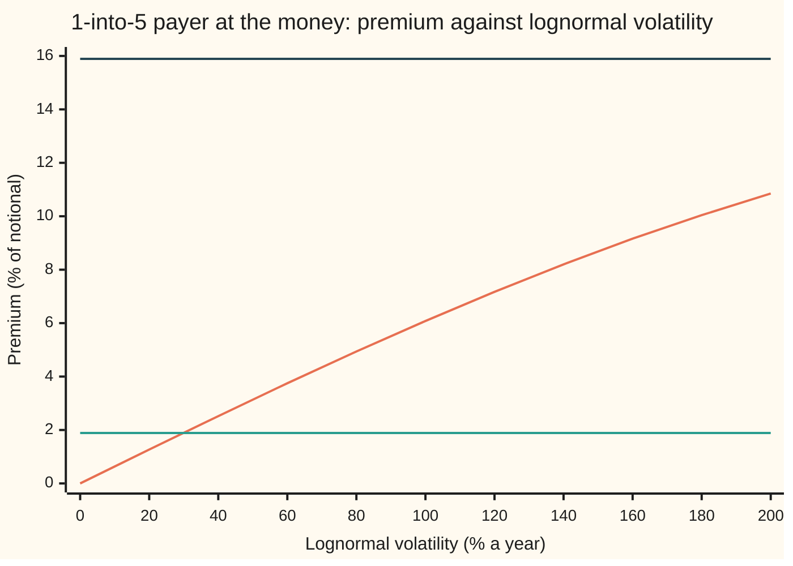
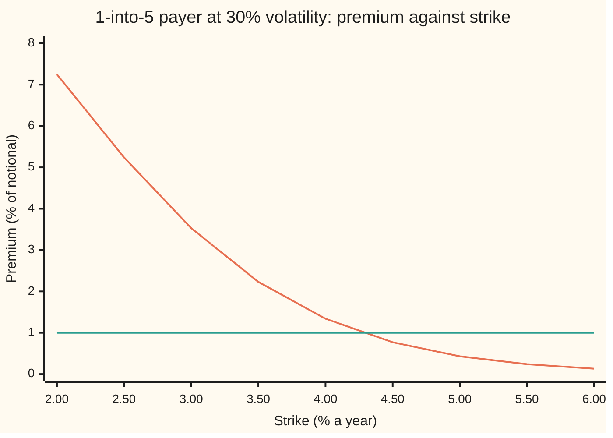

# Solving rate options backwards: implied volatility, strike from delta, and rate from price

[Syllabus](../../../SYLLABUS.md) → [Financial mathematics](../README.md) → [Caps, Floors and Swaptions](../README.md#s29) → Solving rate options backwards

---

## General Overview

A company will borrow 10 million dollars for five years, starting one year from now. It fears rates will rise before then. So it buys a payer swaption: the right, not the duty, to enter a swap in one year in which it pays a fixed rate of 3.6656 percent a year and receives the floating rate, the market rate reset each period. A swap is an exchange of interest payments on an agreed amount, the notional, which itself never changes hands. The curve is flat: money is discounted at 3.6 percent a year, continuously compounded.

The dealer quotes the swaption as "30.00 percent volatility". The invoice says $189,470.98, which is 1.89 percent of the notional. Desks agree prices in volatility and settle them in dollars. Both directions are needed. Forward is the Black formula for swaptions ([Swaptions](04-swaptions-payer-and-receiver.md)). Backward is this card: from 1.9 percent back to 30.00 percent.

Three backward questions come up every day. Which volatility reproduces a quoted premium? The same premium read in the other market convention, a normal volatility, is 109.56 basis points (a basis point is a hundredth of a percent). Which strike costs exactly a budget, say 1.00 percent of notional? It is 4.2683 percent. Which strike has a delta of 0.25, meaning the swaption moves like a quarter of a forward swap? It is 4.6942 percent. The strike is itself a rate, so the last two questions solve for a rate from a price.

Each question is one equation in one unknown. Before solving, a careful desk asks two things: does an answer exist, and is there only one? Here the answer to both is yes inside a fence, and the fence is different for the two conventions. The lognormal price can never exceed 15.89 percent of notional however large the volatility. The normal price has no ceiling at all.

**Every rate-option inverse is one equation whose price side moves in one direction only: up with volatility, down with strike. So a quote inside the fence has exactly one answer, which bisection always finds and a guarded Newton method finds fast; at the money two of the answers have closed forms.**

**What kind of fact this is:** a method, resting on a theorem (one quote, one answer) proved on this card in Why it works; Hagan's normal-volatility formula on it is an approximation, with its error stated.

### The picture: the premium climbs toward a ceiling



Rising curve: the Black premium. Low flat line: the quote, 1.89 percent; it crosses the curve once, at 30 percent. Top flat line: the ceiling, 15.89 percent, which the curve approaches and never reaches. A quote above the ceiling crosses nothing.

---

## The formula

The forward prices come first, as on [Swaptions](04-swaptions-payer-and-receiver.md) and [Rate volatilities](06-normal-and-shifted-volatilities-for-rates.md). Black treats the forward swap rate as lognormal (its logarithm is bell-shaped); Bachelier treats it as normal (the rate itself is bell-shaped):

$$P_{\text{B}}(\sigma, K) = A\,[\,F\,N(d_1) - K\,N(d_2)\,], \qquad P_{\text{N}}(\sigma_N, K) = A\,[\,(F-K)\,N(d) + \sigma_N\sqrt{T}\,\varphi(d)\,].$$

The backward problems are these four equations, each with its fence:

$$P_{\text{B}}(\sigma) = P_{\text{mkt}} \quad\text{has one root exactly when}\quad A\max(F-K,0) < P_{\text{mkt}} < A\,F,$$

$$P_{\text{N}}(\sigma_N) = P_{\text{mkt}} \quad\text{has one root exactly when}\quad A\max(F-K,0) < P_{\text{mkt}},$$

$$P_{\text{B}}(K) = P_{\text{mkt}} \quad\text{has one root exactly when}\quad 0 < P_{\text{mkt}} < A\,F,$$

$$N(d_1) = \Delta \quad\Longleftrightarrow\quad K = F\,e^{-\sigma\sqrt{T}\,N^{-1}(\Delta) + \sigma^2 T/2}, \qquad 0 < \Delta < 1.$$

**At the edges.** A quote exactly at intrinsic, $A\max(F-K,0)$, gives zero volatility: a limit, not a root. A Black quote at or above $A F$ has no volatility; that ceiling is the infinite-volatility limit. A strike solve for 0 or for $A F$ has no answer; those are the limits of an infinite and a zero strike.

**Read it aloud:** a quoted premium has one lognormal volatility if it sits above what the swaption is worth with no randomness and below $A F$, today's value of all the floating payments; it has one normal volatility if it only sits above the no-randomness value; it has one strike if it is positive and below the floating leg; and a delta strictly between 0 and 1 has one strike, in closed form.

At the money ($K = F$) two inverses need no search:

$$\sigma = \frac{2}{\sqrt{T}}\,N^{-1}\!\left(\frac{1 + P_{\text{mkt}}/(A F)}{2}\right), \qquad \sigma_N = \frac{P_{\text{mkt}}\sqrt{2\pi}}{A\sqrt{T}}.$$

In words: at the money the lognormal premium depends on volatility through one bell-curve area, which can be inverted; the normal premium is a straight line in volatility.

Hagan's expansion links the two volatilities without solving anything:

$$\sigma_N \approx \sigma\,\frac{F-K}{\ln(F/K)}\left(1 - \frac{\sigma^2 T}{24}\right), \qquad \frac{F-K}{\ln(F/K)} \to F \text{ as } K \to F.$$

| Symbol | Plain meaning | In our example | Push it up and the answer… |
| --- | --- | --- | --- |
| $P_{\text{mkt}}$, $P$ | the quoted premium, per 1 of notional; $P_{\text{B}}$, $P_{\text{N}}$ are the Black and Bachelier prices | 0.018947098, 1.89% | implied volatility rises; the strike for it falls |
| $L$ | notional: the amount the swap's interest is computed on | $10,000,000 | dollars scale; volatility unchanged |
| $D(t)$ | discount factor: today's value of 1 paid in t years, here $e^{-0.036t}$ | $D(1)$ 0.964640, $D(6)$ 0.805735 | |
| $A$ | annuity: today's value of 1 paid on each of the five fixed dates | 4.335052 | the same quote implies a lower volatility |
| $F$ | forward swap rate: the fixed rate that makes the forward swap worth zero, $(D(1) - D(6))/A$ | 3.6656% | the payer is worth more |
| $K$ | strike: the fixed rate the payer would pay | 3.6656% at the money | the payer is worth less |
| $T$ | time to expiry, years | 1 | the same quote implies a lower volatility |
| $\sigma$ | lognormal (Black) volatility: yearly spread of the log of the rate | 30.00% | premium rises, up to $A F$ |
| $\sigma_N$ | normal (Bachelier) volatility: yearly spread of the rate itself, in rate units | 0.010956 = 109.56 bp | premium rises, without limit |
| $d_1$, $d_2$, $d$, $w$ | standardised distances to the strike, with $w = \sigma\sqrt T$ the total swing: $d_1 = \ln(F/K)/(\sigma\sqrt T) + \sigma\sqrt T/2$, $d_2 = d_1 - \sigma\sqrt T$, $d = (F-K)/(\sigma_N\sqrt T)$ | 0.15, −0.15, 0 | |
| $N$, $\varphi$, $N^{-1}$ | bell-curve area left of $x$, bell-curve height at $x$, and the inverse area: the $x$ with a given area to its left | $N(0.15)$ = 0.559618, $N^{-1}(0.25)$ = −0.674490 | |
| $\Delta$, $\nu$ | delta: forward swaps the payer behaves like, $N(d_1)$, counted in annuity units; vega: premium gained per unit of $\sigma$, $A F \varphi(d_1)\sqrt T$ | 0.559618, 0.062685 | |

### When it holds

- **The quote is read in the model it was quoted in.** A normal volatility fed into Black, or the reverse, gives a wrong price with no warning. Divide the normal volatility by $F$ as a shortcut and 30.00% comes back as 29.89%.
- **The annuity and forward come from the same curve as the quote.** Change the curve and the same premium means a different volatility. Leave the annuity out altogether and 30.00% comes back as 140.26%.
- **Exercise is European, on one date.** A Bermudan swaption, exercisable on several dates, is worth at least each European swaption inside it, so no single Black formula prices it.
- **Black needs a positive forward and strike.** With negative rates the logarithm fails; the normal or shifted conventions on [Rate volatilities](06-normal-and-shifted-volatilities-for-rates.md) take over.
- **One volatility per strike.** Real markets show a smile, a different volatility at each strike; the strike-from-premium solve then needs the smile, as on [SABR for rates](07-sabr-for-rates-and-the-volatility-cube.md).

---

## Why it works

### Step 0: a price that moves one way hits each level once

If a price changes smoothly with a dial and always in the same direction, then every level between its two ends is reached, and reached at exactly one setting. The first half is the intermediate-value theorem; the second is what "always in the same direction" means. The same facts drive bisection: halve an interval whose ends straddle the quote, keep the half that still straddles it, repeat. So each inverse needs three facts: the slope has one sign, and the two ends are known. The equity version of this argument is on [Implied volatility](../11-Implied%20volatility%20and%20the%20vanilla%20inverses/01-implied-volatility.md); what changes here is the unit, the annuity, and the second convention.

### Step 1: the Black premium rises with volatility, from intrinsic to the floating leg

The slope is vega, $\nu = A F \varphi(d_1)\sqrt{T}$. Every factor is positive, so the premium always climbs. At our swaption vega is 0.062685 per unit of volatility.

At the low end, as $\sigma$ shrinks to zero, the rate stops being random and the payer is worth its intrinsic value, $A\max(F-K, 0)$: zero at the money.

At the high end, $d_1$ runs to plus infinity and $d_2$ to minus infinity, so $N(d_1) \to 1$, $N(d_2) \to 0$ and the premium approaches $A F$. That ceiling has a meaning. $A F = D(1) - D(6)$ is today's value of the floating leg: receiving floating rates for five years with nothing paid back. A payer can never be worth more than that, because it is that leg minus a fixed payment. Here $A F$ is 15.89 percent of notional.

### Step 2: the Bachelier premium rises with volatility, with no ceiling

The normal vega is $A\sqrt{T}\,\varphi(d) > 0$, so the normal premium also always climbs. At the low end it starts from the same intrinsic value. At the high end the term $\sigma_N\sqrt{T}\,\varphi(d)$ grows like $\sigma_N$ itself, so the premium grows without bound. A normal rate can wander to any height, including far below zero, so the payer's value is not capped by the floating leg.

This is where the two conventions part. A quote at 110 percent of the ceiling, 17.48 percent of notional, has no lognormal volatility: even at 500 percent volatility Black prices only 15.69 percent. It does have a normal volatility, 1,010.71 basis points. A bisection hunting for the lognormal answer between 0 and 500 percent does not complain; it returns 500 percent, the edge of its search. The fence must be tested first.

### Step 3: at the money, both volatilities have closed forms

Put $K = F$. Then $\ln(F/K) = 0$, so $d_1 = \sigma\sqrt{T}/2$ and $d_2 = -\sigma\sqrt{T}/2$. The bell curve is symmetric, $N(-x) = 1 - N(x)$, so

$$P_{\text{B}} = A F\,[\,N(\sigma\sqrt T/2) - N(-\sigma\sqrt T/2)\,] = A F\,[\,2N(\sigma\sqrt T/2) - 1\,].$$

Divide by $A F$, add 1, halve, apply $N^{-1}$, and multiply by $2/\sqrt{T}$: that is the closed form in The formula. For Bachelier, $K = F$ gives $d = 0$ and $\varphi(0) = 1/\sqrt{2\pi}$, so $P_{\text{N}} = A\sigma_N\sqrt{T}/\sqrt{2\pi}$, a straight line through zero. Dividing gives $\sigma_N$.

### Step 4: Hagan's expansion, and the first guess hiding inside it

Set the two at-the-money premiums equal: $\sigma_N = F\sqrt{2\pi/T}\,[\,2N(\sigma\sqrt T/2) - 1\,]$. Near zero, the bell-curve area grows like $N(x) \approx \tfrac12 + (x - x^3/6)/\sqrt{2\pi}$. Put $x = \sigma\sqrt{T}/2$:

$$\sigma_N \approx F\sqrt{\tfrac{2\pi}{T}}\cdot\frac{2}{\sqrt{2\pi}}\left(\frac{\sigma\sqrt T}{2} - \frac{\sigma^3 T^{3/2}}{48}\right) = F\sigma\left(1 - \frac{\sigma^2 T}{24}\right).$$

That is Hagan's at-the-money formula. At 30 percent it gives 0.010955516 against the exact 0.010955655: a gap of 0.0014 basis points. Away from the money, the leading terms of Hagan, Kumar, Lesniewski and Woodward's 2002 expansion replace $F$ by $(F-K)/\ln(F/K)$, a mean of $F$ and $K$ that lies between them. One percent out of the money, at a strike of 4.6656 percent, the exact normal volatility is 123.90 basis points and Hagan's is within 0.0018 basis points of it.

Drop the cubic term and the formula becomes $\sigma \approx \sqrt{2\pi/T}\,P_{\text{mkt}}/(AF)$. That is Brenner and Subrahmanyam's 1988 first guess, and it equals the normal volatility divided by $F$. It gives 29.89 percent: close enough to start a search, not close enough to trade.

<details>
<summary>Detailed proof: the fence is exact and the root is unique</summary>

Fix $K > 0$, $F > 0$, $T > 0$, $A > 0$ and write $w = \sigma\sqrt T$.
1. $P_{\text{B}}$ is continuous in $w > 0$, since $N$ and $\ln$ are.
2. $\partial P_{\text{B}}/\partial w = A F\varphi(d_1)$. To see it, differentiate: $A[F\varphi(d_1)\,\partial d_1/\partial w - K\varphi(d_2)\,\partial d_2/\partial w]$. The identity $F\varphi(d_1) = K\varphi(d_2)$ holds because $d_1^2 - d_2^2 = (d_1 - d_2)(d_1 + d_2) = w \cdot 2\ln(F/K)/w = 2\ln(F/K)$. With $\partial d_2/\partial w = \partial d_1/\partial w - 1$, everything cancels except $A F\varphi(d_1) > 0$. So $P_{\text{B}}$ is strictly increasing.
3. As $w \to 0$: if $F > K$, $d_1, d_2 \to +\infty$ and $P_{\text{B}} \to A(F-K)$; if $F < K$, both $\to -\infty$ and $P_{\text{B}} \to 0$; if $F = K$, $P_{\text{B}} = AF[2N(w/2) - 1] \to 0$. In all cases the limit is $A\max(F-K, 0)$.
4. As $w \to \infty$: $d_1 \to +\infty$, $d_2 \to -\infty$, so $P_{\text{B}} \to AF$.
5. A continuous, strictly increasing function on $(0, \infty)$ takes every value strictly between its two limits exactly once, and no value outside them. That is the first fence. The Bachelier case runs the same way with slope $A\sqrt T\varphi(d) > 0$, lower limit $A\max(F-K,0)$ and upper limit $+\infty$.
6. For the strike, $\partial P_{\text{B}}/\partial K = -A N(d_2) < 0$ by the same cancellation; $P_{\text{B}} \to AF$ as $K \to 0$ and $\to 0$ as $K \to \infty$. That is the third fence.

</details>

### Step 5: rate from price, the strike that costs a budget

Hold the volatility at 30 percent and let the strike move. The slope is $\partial P_{\text{B}}/\partial K = -A N(d_2)$: always negative, since raising the fixed rate the payer must pay can only make the right less valuable. At a strike near zero the payer is almost the whole floating leg, worth $A F$; at a very high strike it is worth nothing. So any budget strictly between 0 and 15.89 percent buys exactly one strike. A budget of 1.00 percent buys a strike of 4.2683 percent. Newton's method, stepping by the premium gap divided by $-AN(d_2)$, and bisection land on the same strike to 12 decimals.

### Step 6: strike from delta, in closed form

The payer's delta, in forward swaps, is $\Delta = N(d_1)$ ([Swaption Greeks](08-swaption-greeks-and-hedging.md)). $N$ is strictly increasing and $d_1$ falls as $K$ rises, so delta falls strictly from 1 to 0 across strikes. Invert in two moves: $d_1 = N^{-1}(\Delta)$, then solve $\ln(F/K)/w + w/2 = d_1$ for $K$:

$$K = F\,e^{-w N^{-1}(\Delta) + w^2/2}, \qquad w = \sigma\sqrt T.$$

At $\Delta = 0.25$, $N^{-1}(0.25) = -0.674490$, and the strike is 4.6942 percent. At the money the delta is 0.559618, above one half because $d_1$ carries the extra $w/2$.

### Step 7: why Newton needs a fence of its own

Newton's method steps from a guess $\sigma$ to $\sigma - (P_{\text{B}}(\sigma) - P_{\text{mkt}})/\nu$. Near the answer it doubles the correct digits each step. Far from it, vega can be tiny, and a tiny slope sends the step anywhere. Take the out-of-the-money payer at 4.6656 percent, quoted at 0.6376 percent of notional. One raw Newton step from 5 percent lands at 1,010,540.85 percent. One raw step from 200 percent lands at −22.59 percent. The guard is simple: keep a bracket that is known to hold the root, shrink it with each new price, and replace any step that leaves it by the midpoint. From 5 percent the guarded method lands on 30.00 percent. The same guard and a faster rational first guess are the subject of [Solving for implied volatility](../11-Implied%20volatility%20and%20the%20vanilla%20inverses/02-implied-volatility-by-newton-and-bisection.md); Jäckel's 2015 method makes the inversion exact to machine precision in two steps.

---

## Worked numbers, by hand

The lognormal volatility at the money, from the quote alone:

| Step | Arithmetic | Value |
| --- | --- | --- |
| 1 | $D(1) = e^{-0.036}$, $D(6) = e^{-0.216}$ | 0.964640, 0.805735 |
| 2 | $A = e^{-0.072} + e^{-0.108} + e^{-0.144} + e^{-0.18} + e^{-0.216}$ | 4.335052 |
| 3 | $F = (0.964640 - 0.805735)/4.335052$, equal to $e^{0.036} - 1$ as a flat curve must give | 0.036656 |
| 4 | ceiling $A F$ | 0.158905 |
| 5 | $P_{\text{mkt}}/(AF) = 0.018947098/0.158905$ | 0.119235 |
| 6 | $N^{-1}((1 + 0.119235)/2)$ | 0.150000 |
| 7 | $\sigma = 2 \times 0.150000/\sqrt{1}$ | **0.300000 = 30.00%** |

The other three answers, from the same inputs:

| Step | Arithmetic | Value |
| --- | --- | --- |
| Normal volatility | $0.018947098 \times \sqrt{2\pi}/(4.335052 \times 1)$ | **0.010956 = 109.56 bp** |
| Hagan check | $0.30 \times 0.036656 \times (1 - 0.09/24)$ | 0.010956 |
| Strike from delta 0.25 | $0.036656 \times e^{-0.3 \times (-0.674490) + 0.045}$ | **4.6942%** |
| Strike for a 1.00% budget | bisection on $P_{\text{B}}(K) = 0.01$ at 30% | **4.2683%** |

The company's dealer charged $189,470.98, and that sum is exactly what a 30.00 percent lognormal volatility, or a 109.56 basis-point normal volatility, costs for this swaption on this curve.

### What breaks if you drop a piece

| Mistake | Comes out at | What went wrong |
| --- | --- | --- |
| Annuity left out: quote matched to $F N(d_1) - K N(d_2)$ | 140.26% | the premium is per 1 of notional; the formula without $A$ is per unit of annuity, so the quote looks 4.3 times too big |
| $T = 6$, the swap's last date, used as expiry | 12.25% | the option decides at year 1; stretching the time spreads the same total uncertainty thinner |
| Normal volatility divided by $F$ taken as lognormal | 29.89% | the $\sigma^2 T/24$ correction dropped; also the Brenner-Subrahmanyam guess used as the answer |
| One unguarded Newton step from 5%, out of the money | 1,010,540.85% | vega nearly zero at the start, so the step is enormous |

---

## Code, from first principles, and it actually runs

Both programs build the curve, price the swaption at 30 percent, then run it backwards. The lognormal volatility is reached by three roads: bisection, a guarded Newton method, and the at-the-money closed form, which inverts the bell-curve area on its own. A fourth road reprices the answer by integrating the payoff against the lognormal density, independent of the Black formula. The normal volatility is reached by bisection and by its closed form, checked by a second integral and by Hagan's expansion at two strikes. The forward is checked against $e^{r} - 1$, which a flat curve forces. The strike for a budget comes from bisection and from Newton, and is repriced by integral; the strike for a delta comes from the closed form and from bisection. The normal curve's area, the root finders and the integrator are all written out; nothing imported knows the answer.

### Python

```python
# Solving a 1-into-5 payer swaption backwards: vol from price, strike from price, strike from delta.
from math import exp, log, sqrt, pi

def phi(x): return exp(-0.5 * x * x) / sqrt(2 * pi)           # bell-curve height
def N(x):                                                     # bell-curve area left of x, Simpson's rule from 0 to x
    if abs(x) > 12: return 0.0 if x < 0 else 1.0
    n, h = 400, x / 400
    s = phi(0.0) + phi(x) + sum((4 if i % 2 else 2) * phi(i * h) for i in range(1, n))
    return 0.5 + s * h / 3

r, T, L = 0.036, 1.0, 10_000_000                              # flat 3.6% curve (continuous), expiry 1 year, $10m notional
D = lambda t: exp(-r * t)
A = sum(D(t) for t in (2, 3, 4, 5, 6))                        # annuity: 1 paid at each of the five fixed dates
F = (D(1) - D(6)) / A                                         # forward swap rate
K = F                                                         # at the money

def black(sig, k=K, a=A, t=T):                                # payer swaption per unit notional, lognormal
    if sig <= 0: return a * max(F - k, 0.0)
    w = sig * sqrt(t); d1 = log(F / k) / w + 0.5 * w
    return a * (F * N(d1) - k * N(d1 - w))
def bach(sn, k=K):                                            # payer swaption per unit notional, normal
    w = sn * sqrt(T); d = (F - k) / w
    return A * ((F - k) * N(d) + w * phi(d))
def bisect(g, lo, hi):                                        # g(lo) and g(hi) of opposite signs
    glo = g(lo)
    for _ in range(100):
        mid = 0.5 * (lo + hi); gm = g(mid)
        if (gm < 0) == (glo < 0): lo, glo = mid, gm
        else: hi = mid
    return 0.5 * (lo + hi)
def newton(g, dg, x, lo, hi):                                 # Newton inside a bracket; a step that leaves it becomes the midpoint
    for _ in range(60):
        gx = g(x)
        if gx == 0: return x
        if (gx > 0) == (g(hi) > 0): hi = x
        else: lo = x
        x_new = x - gx / dg(x)
        x = x_new if lo < x_new < hi else 0.5 * (lo + hi)
    return x
def vega(s, k=K): return A * F * phi(log(F / k) / (s * sqrt(T)) + 0.5 * s * sqrt(T)) * sqrt(T)
def Ninv(p): return bisect(lambda x: N(x) - p, -10.0, 10.0)
def integral_price(rate_at, z_k, k, n=2000):                  # Simpson over z from the strike's z to 10: A * E[rate - k]
    h = (10.0 - z_k) / n; s = 0.0
    for i in range(n + 1):
        z = z_k + i * h; c = 1 if i in (0, n) else (4 if i % 2 else 2)
        s += c * phi(z) * (rate_at(z) - k)
    return A * s * h / 3
def lognormal_rate(sig): return lambda z: F * exp(-0.5 * sig * sig * T + sig * sqrt(T) * z)
def z_logn(sig, k): return (log(k / F) + 0.5 * sig * sig * T) / (sig * sqrt(T))
def normal_rate(sn): return lambda z: F + sn * sqrt(T) * z

sig0 = 0.30
P = black(sig0)                                               # the quote: 1.9% of notional
# ---- implied lognormal vol, three roads ----
guess = sqrt(2 * pi / T) * P / (A * F)                        # Brenner-Subrahmanyam first guess
v_bis = bisect(lambda s: black(s) - P, 1e-9, 5.0)
v_newt = newton(lambda s: black(s) - P, vega, guess, 1e-9, 5.0)
v_atm = 2 / sqrt(T) * Ninv((P / (A * F) + 1) / 2)             # exact at the money
P_int = integral_price(lognormal_rate(v_bis), z_logn(v_bis, K), K)
# ---- implied normal vol ----
hi = 1e-4
while bach(hi) < P: hi *= 2                                   # no ceiling: grow the bracket until it holds the quote
n_bis = bisect(lambda s: bach(s) - P, 1e-12, hi)
n_atm = P * sqrt(2 * pi) / (A * sqrt(T))                      # exact at the money
n_hagan = v_bis * F * (1 - v_bis ** 2 * T / 24)               # Hagan's expansion, leading terms
Pn_int = integral_price(normal_rate(n_bis), 0.0, K)
K2 = F + 0.01; P2 = black(sig0, K2)                           # one percent out of the money
n2_bis = bisect(lambda s: bach(s, K2) - P2, 1e-12, 0.1)
n2_hagan = sig0 * (F - K2) / log(F / K2) * (1 - sig0 ** 2 * T / 24)
v2_newt = newton(lambda s: black(s, K2) - P2, lambda s: vega(s, K2), 0.05, 1e-9, 5.0)
wild_low = 0.05 - (black(0.05, K2) - P2) / vega(0.05, K2)     # one Newton step with no bracket, from 5%
wild_high = 2.0 - (black(2.0, K2) - P2) / vega(2.0, K2)       # and from 200%
# ---- existence and its edges ----
ceiling = A * F
big_quote = 1.1 * ceiling
black_at_500 = black(5.0); v_fooled = bisect(lambda s: black(s) - big_quote, 1e-9, 5.0)
hi = 1e-4
while bach(hi) < big_quote: hi *= 2
n_big = bisect(lambda s: bach(s) - big_quote, 1e-12, hi)
# ---- strike from a target premium: 1.00% of notional ----
target = 0.01
k_bis = bisect(lambda k: black(sig0, k) - target, 1e-6, 0.5)
dPdK = lambda k: -A * N(log(F / k) / (sig0 * sqrt(T)) - 0.5 * sig0 * sqrt(T))
k_newt = newton(lambda k: black(sig0, k) - target, dPdK, F, 1e-6, 0.5)
Pk_int = integral_price(lognormal_rate(sig0), z_logn(sig0, k_bis), k_bis)
# ---- strike from delta: a 25-delta payer ----
w = sig0 * sqrt(T)
k_delta = F * exp(-w * Ninv(0.25) + 0.5 * w * w)
k_delta_bis = bisect(lambda k: N(log(F / k) / w + 0.5 * w) - 0.25, 1e-4, 0.5)
# ---- what breaks ----
v_no_annuity = bisect(lambda s: black(s, K, 1.0) - P, 1e-9, 5.0)
v_six_years = bisect(lambda s: black(s, K, A, 6.0) - P, 1e-9, 5.0)
# ---- try changing ----
P_vol20 = black(0.20)
v_quote25 = bisect(lambda s: black(s) - 0.025, 1e-9, 5.0)
k_half = bisect(lambda k: black(sig0, k) - 0.005, 1e-6, 0.5)

rows = [("D(1)", D(1)), ("D(6)", D(6)), ("annuity A", A), ("forward swap rate F", F), ("ceiling A*F", ceiling),
        ("quote P at 30%", P), ("  in dollars on $10m", P * L), ("P/(A*F)", P / (A * F)),
        ("N inverse of (1 + P/(A*F))/2", Ninv((P / (A * F) + 1) / 2)), ("vega at 30%", vega(sig0)),
        ("1 lognormal vol, bisection", v_bis), ("2 lognormal vol, guarded Newton", v_newt),
        ("3 lognormal vol, closed form at the money", v_atm), ("  first guess, Brenner-Subrahmanyam", guess),
        ("4 reprice by integral at vol 1", P_int),
        ("5 normal vol, bisection", n_bis), ("6 normal vol, closed form", n_atm),
        ("  Hagan expansion", n_hagan), ("  Hagan gap, basis points", 1e4 * (n_hagan - n_atm)), ("7 reprice by integral at vol 5", Pn_int),
        ("K2 = F + 1%", K2), ("  quote at K2", P2), ("  normal vol at K2, bisection", n2_bis),
        ("  normal vol at K2, Hagan", n2_hagan), ("  Hagan gap at K2, basis points", 1e4 * (n2_hagan - n2_bis)), ("  lognormal vol at K2, guarded Newton from 5%", v2_newt),
        ("quote 110% of ceiling", big_quote), ("  Black price at 500% vol", black_at_500), ("  bisection on (0, 500%) returns anyway", v_fooled),
        ("  normal vol for that quote", n_big),
        ("8 strike for 1.00%, bisection", k_bis), ("9 strike for 1.00%, Newton", k_newt),
        ("  reprice by integral at that strike", Pk_int),
        ("ATM delta N(d1)", N(0.5 * w)), ("N inverse of 0.25", Ninv(0.25)),
        ("10 strike for 25 delta, closed form", k_delta), ("11 strike for 25 delta, bisection", k_delta_bis),
        ("wrong: annuity left out", v_no_annuity), ("wrong: T = 6, the swap's end", v_six_years),
        ("wrong: normal vol / F, the first guess", n_bis / F),
        ("wrong: unguarded Newton step from 5%", wild_low), ("wrong: unguarded Newton step from 200%", wild_high),
        ("try: premium at 20% vol", P_vol20), ("try: vol for a 2.50% quote", v_quote25),
        ("try: strike for 0.50%", k_half)]
for name, v in rows:
    print(f"{name:<46} {v:>16.9f}")
print()
vols = [0.2 * i for i in range(11)]
print(f"{'chart, vol %':<16}" + " ".join(f"{100 * s:6.0f}" for s in vols))
print(f"{'chart, premium %':<16}" + " ".join(f"{100 * black(s):6.2f}" for s in vols))
strikes = [0.02 + 0.005 * i for i in range(9)]
print(f"{'chart, strike %':<16}" + " ".join(f"{100 * k:6.2f}" for k in strikes))
print(f"{'chart, premium %':<16}" + " ".join(f"{100 * black(sig0, k):6.2f}" for k in strikes))
print(f"chart lines, %: quote {100 * P:.2f}, ceiling {100 * ceiling:.2f}, target {100 * target:.2f}")

assert abs(F - (exp(r) - 1)) < 1e-15,            "flat curve: forward swap rate is one year of compounding, e^r - 1"
assert abs(v_bis - sig0) < 1e-10,                "bisection must return the 30% that made the quote"
assert abs(v_atm - v_newt) < 1e-9,               "closed form at the money vs guarded Newton"
assert abs(P_int - P) < 1e-9,                    "integral reprice at the solved vol vs the quote"
assert abs(n_bis - n_atm) < 1e-12 and abs(Pn_int - P) < 1e-9, "normal vol: bisection vs closed form, and integral reprice"
assert abs(n_hagan - n_atm) < 1e-6 and abs(n2_hagan - n2_bis) < 1e-6, "Hagan within 0.01 basis points, both strikes"
assert abs(v2_newt - sig0) < 1e-10,              "guarded Newton from a bad start still lands on 30%"
assert black_at_500 < big_quote,                 "no lognormal vol reaches a quote above the ceiling"
assert abs(k_bis - k_newt) < 1e-12 and abs(Pk_int - target) < 1e-9, "strike from premium: two roads and a reprice"
assert abs(k_delta - k_delta_bis) < 1e-10,       "strike from delta: closed form vs bisection"
print("ALL CHECKS PASS")
```

**Ran 2026-09-28 on macOS, Python 3.14.6, standard library only. All checks passed. Output, pasted from the run:**

```
D(1)                                                0.964640293
D(6)                                                0.805735302
annuity A                                           4.335051754
forward swap rate F                                 0.036655846
ceiling A*F                                         0.158904992
quote P at 30%                                      0.018947098
  in dollars on $10m                           189470.978117594
P/(A*F)                                             0.119235385
N inverse of (1 + P/(A*F))/2                        0.150000000
vega at 30%                                         0.062684735
1 lognormal vol, bisection                          0.300000000
2 lognormal vol, guarded Newton                     0.300000000
3 lognormal vol, closed form at the money           0.300000000
  first guess, Brenner-Subrahmanyam                 0.298878787
4 reprice by integral at vol 1                      0.018947098
5 normal vol, bisection                             0.010955655
6 normal vol, closed form                           0.010955655
  Hagan expansion                                   0.010955516
  Hagan gap, basis points                          -0.001388057
7 reprice by integral at vol 5                      0.018947098
K2 = F + 1%                                         0.046655846
  quote at K2                                       0.006376119
  normal vol at K2, bisection                       0.012390049
  normal vol at K2, Hagan                           0.012389869
  Hagan gap at K2, basis points                    -0.001794162
  lognormal vol at K2, guarded Newton from 5%       0.300000000
quote 110% of ceiling                               0.174795491
  Black price at 500% vol                           0.156931498
  bisection on (0, 500%) returns anyway             5.000000000
  normal vol for that quote                         0.101070839
8 strike for 1.00%, bisection                       0.042682885
9 strike for 1.00%, Newton                          0.042682885
  reprice by integral at that strike                0.010000000
ATM delta N(d1)                                     0.559617692
N inverse of 0.25                                  -0.674489750
10 strike for 25 delta, closed form                 0.046942332
11 strike for 25 delta, bisection                   0.046942332
wrong: annuity left out                             1.402623648
wrong: T = 6, the swap's end                        0.122474487
wrong: normal vol / F, the first guess              0.298878787
wrong: unguarded Newton step from 5%            10105.408457795
wrong: unguarded Newton step from 200%             -0.225943886
try: premium at 20% vol                             0.012657684
try: vol for a 2.50% quote                          0.396950398
try: strike for 0.50%                               0.048739900

chart, vol %         0     20     40     60     80    100    120    140    160    180    200
chart, premium %  0.00   1.27   2.52   3.75   4.94   6.08   7.17   8.20   9.16  10.04  10.85
chart, strike %   2.00   2.50   3.00   3.50   4.00   4.50   5.00   5.50   6.00
chart, premium %  7.25   5.24   3.53   2.23   1.34   0.77   0.43   0.24   0.13
chart lines, %: quote 1.89, ceiling 15.89, target 1.00
ALL CHECKS PASS
```

### Rust

```rust
// Solving a 1-into-5 payer swaption backwards: vol from price, strike from price, strike from delta.
use std::f64::consts::PI;

fn phi(x: f64) -> f64 { (-0.5 * x * x).exp() / (2.0 * PI).sqrt() } // bell-curve height
fn n_cdf(x: f64) -> f64 { // bell-curve area left of x, Simpson's rule from 0 to x
    if x.abs() > 12.0 { return if x < 0.0 { 0.0 } else { 1.0 }; }
    let n = 400; let h = x / n as f64;
    let mut s = phi(0.0) + phi(x);
    for i in 1..n { s += if i % 2 == 1 { 4.0 } else { 2.0 } * phi(i as f64 * h); }
    0.5 + s * h / 3.0
}
fn bisect(g: &dyn Fn(f64) -> f64, mut lo: f64, mut hi: f64) -> f64 { // g(lo), g(hi) of opposite signs
    let mut glo = g(lo);
    for _ in 0..100 {
        let mid = 0.5 * (lo + hi); let gm = g(mid);
        if (gm < 0.0) == (glo < 0.0) { lo = mid; glo = gm; } else { hi = mid; }
    }
    0.5 * (lo + hi)
}
// Newton inside a bracket; a step that leaves it is replaced by the midpoint
fn newton(g: &dyn Fn(f64) -> f64, dg: &dyn Fn(f64) -> f64, mut x: f64, mut lo: f64, mut hi: f64) -> f64 {
    for _ in 0..60 {
        let gx = g(x);
        if gx == 0.0 { return x; }
        if (gx > 0.0) == (g(hi) > 0.0) { hi = x; } else { lo = x; }
        let xn = x - gx / dg(x);
        x = if lo < xn && xn < hi { xn } else { 0.5 * (lo + hi) };
    }
    x
}
fn n_inv(p: f64) -> f64 { bisect(&|x| n_cdf(x) - p, -10.0, 10.0) }

struct Mkt { a: f64, f: f64, t: f64 }
impl Mkt {
    fn black(&self, sig: f64, k: f64, a: f64, t: f64) -> f64 { // payer per unit notional, lognormal
        if sig <= 0.0 { return a * (self.f - k).max(0.0); }
        let w = sig * t.sqrt(); let d1 = (self.f / k).ln() / w + 0.5 * w;
        a * (self.f * n_cdf(d1) - k * n_cdf(d1 - w))
    }
    fn bl(&self, sig: f64, k: f64) -> f64 { self.black(sig, k, self.a, self.t) }
    fn bach(&self, sn: f64, k: f64) -> f64 { // payer per unit notional, normal
        let w = sn * self.t.sqrt(); let d = (self.f - k) / w;
        self.a * ((self.f - k) * n_cdf(d) + w * phi(d))
    }
    fn vega(&self, s: f64, k: f64) -> f64 {
        let w = s * self.t.sqrt();
        self.a * self.f * phi((self.f / k).ln() / w + 0.5 * w) * self.t.sqrt()
    }
    // Simpson over z from the strike's z to 10: A * E[rate - k]
    fn integral(&self, rate_at: &dyn Fn(f64) -> f64, z_k: f64, k: f64) -> f64 {
        let n = 2000; let h = (10.0 - z_k) / n as f64; let mut s = 0.0;
        for i in 0..=n {
            let z = z_k + i as f64 * h;
            let c = if i == 0 || i == n { 1.0 } else if i % 2 == 1 { 4.0 } else { 2.0 };
            s += c * phi(z) * (rate_at(z) - k);
        }
        self.a * s * h / 3.0
    }
    fn normal_vol(&self, quote: f64, k: f64) -> f64 { // no ceiling: grow the bracket until it holds the quote
        let mut hi = 1e-4;
        while self.bach(hi, k) < quote { hi *= 2.0; }
        bisect(&|s| self.bach(s, k) - quote, 1e-12, hi)
    }
}

fn main() {
    let (r, t, notional) = (0.036_f64, 1.0_f64, 10_000_000.0_f64); // flat 3.6% curve, 1-year expiry, $10m
    let d = |x: f64| (-r * x).exp();
    let a: f64 = [2.0, 3.0, 4.0, 5.0, 6.0].iter().map(|&x| d(x)).sum(); // annuity
    let f = (d(1.0) - d(6.0)) / a; // forward swap rate
    let k = f; // at the money
    let m = Mkt { a, f, t };
    let logn = |sig: f64| move |z: f64| f * (-0.5 * sig * sig * t + sig * t.sqrt() * z).exp();
    let z_logn = |sig: f64, kk: f64| ((kk / f).ln() + 0.5 * sig * sig * t) / (sig * t.sqrt());

    let sig0 = 0.30;
    let p = m.bl(sig0, k); // the quote
    // implied lognormal vol, three roads
    let guess = (2.0 * PI / t).sqrt() * p / (a * f); // Brenner-Subrahmanyam first guess
    let v_bis = bisect(&|s| m.bl(s, k) - p, 1e-9, 5.0);
    let v_newt = newton(&|s| m.bl(s, k) - p, &|s| m.vega(s, k), guess, 1e-9, 5.0);
    let v_atm = 2.0 / t.sqrt() * n_inv((p / (a * f) + 1.0) / 2.0); // exact at the money
    let p_int = m.integral(&logn(v_bis), z_logn(v_bis, k), k);
    // implied normal vol
    let n_bis = m.normal_vol(p, k);
    let n_atm = p * (2.0 * PI).sqrt() / (a * t.sqrt());
    let n_hagan = v_bis * f * (1.0 - v_bis * v_bis * t / 24.0); // Hagan's expansion, leading terms
    let pn_int = m.integral(&|z| f + n_bis * t.sqrt() * z, 0.0, k);
    let k2 = f + 0.01; let p2 = m.bl(sig0, k2); // one percent out of the money
    let n2_bis = bisect(&|s| m.bach(s, k2) - p2, 1e-12, 0.1);
    let n2_hagan = sig0 * (f - k2) / (f / k2).ln() * (1.0 - sig0 * sig0 * t / 24.0);
    let v2_newt = newton(&|s| m.bl(s, k2) - p2, &|s| m.vega(s, k2), 0.05, 1e-9, 5.0);
    let wild_low = 0.05 - (m.bl(0.05, k2) - p2) / m.vega(0.05, k2); // one unbracketed Newton step
    let wild_high = 2.0 - (m.bl(2.0, k2) - p2) / m.vega(2.0, k2);
    // existence and its edges
    let ceiling = a * f;
    let big_quote = 1.1 * ceiling;
    let black_at_500 = m.bl(5.0, k); let v_fooled = bisect(&|s| m.bl(s, k) - big_quote, 1e-9, 5.0);
    let n_big = m.normal_vol(big_quote, k);
    // strike from a target premium: 1.00% of notional
    let target = 0.01;
    let k_bis = bisect(&|kk| m.bl(sig0, kk) - target, 1e-6, 0.5);
    let dpdk = |kk: f64| -a * n_cdf((f / kk).ln() / (sig0 * t.sqrt()) - 0.5 * sig0 * t.sqrt());
    let k_newt = newton(&|kk| m.bl(sig0, kk) - target, &dpdk, f, 1e-6, 0.5);
    let pk_int = m.integral(&logn(sig0), z_logn(sig0, k_bis), k_bis);
    // strike from delta: a 25-delta payer
    let w = sig0 * t.sqrt();
    let k_delta = f * (-w * n_inv(0.25) + 0.5 * w * w).exp();
    let k_delta_bis = bisect(&|kk| n_cdf((f / kk).ln() / w + 0.5 * w) - 0.25, 1e-4, 0.5);
    // what breaks
    let v_no_annuity = bisect(&|s| m.black(s, k, 1.0, t) - p, 1e-9, 5.0);
    let v_six_years = bisect(&|s| m.black(s, k, a, 6.0) - p, 1e-9, 5.0);
    // try changing
    let p_vol20 = m.bl(0.20, k);
    let v_quote25 = bisect(&|s| m.bl(s, k) - 0.025, 1e-9, 5.0);
    let k_half = bisect(&|kk| m.bl(sig0, kk) - 0.005, 1e-6, 0.5);

    let rows: Vec<(&str, f64)> = vec![("D(1)", d(1.0)), ("D(6)", d(6.0)), ("annuity A", a), ("forward swap rate F", f), ("ceiling A*F", ceiling),
        ("quote P at 30%", p), ("  in dollars on $10m", p * notional), ("P/(A*F)", p / (a * f)),
        ("N inverse of (1 + P/(A*F))/2", n_inv((p / (a * f) + 1.0) / 2.0)), ("vega at 30%", m.vega(sig0, k)),
        ("1 lognormal vol, bisection", v_bis), ("2 lognormal vol, guarded Newton", v_newt),
        ("3 lognormal vol, closed form at the money", v_atm), ("  first guess, Brenner-Subrahmanyam", guess),
        ("4 reprice by integral at vol 1", p_int),
        ("5 normal vol, bisection", n_bis), ("6 normal vol, closed form", n_atm),
        ("  Hagan expansion", n_hagan), ("  Hagan gap, basis points", 1e4 * (n_hagan - n_atm)), ("7 reprice by integral at vol 5", pn_int),
        ("K2 = F + 1%", k2), ("  quote at K2", p2), ("  normal vol at K2, bisection", n2_bis),
        ("  normal vol at K2, Hagan", n2_hagan), ("  Hagan gap at K2, basis points", 1e4 * (n2_hagan - n2_bis)), ("  lognormal vol at K2, guarded Newton from 5%", v2_newt),
        ("quote 110% of ceiling", big_quote), ("  Black price at 500% vol", black_at_500), ("  bisection on (0, 500%) returns anyway", v_fooled),
        ("  normal vol for that quote", n_big),
        ("8 strike for 1.00%, bisection", k_bis), ("9 strike for 1.00%, Newton", k_newt),
        ("  reprice by integral at that strike", pk_int),
        ("ATM delta N(d1)", n_cdf(0.5 * w)), ("N inverse of 0.25", n_inv(0.25)),
        ("10 strike for 25 delta, closed form", k_delta), ("11 strike for 25 delta, bisection", k_delta_bis),
        ("wrong: annuity left out", v_no_annuity), ("wrong: T = 6, the swap's end", v_six_years),
        ("wrong: normal vol / F, the first guess", n_bis / f),
        ("wrong: unguarded Newton step from 5%", wild_low), ("wrong: unguarded Newton step from 200%", wild_high),
        ("try: premium at 20% vol", p_vol20), ("try: vol for a 2.50% quote", v_quote25),
        ("try: strike for 0.50%", k_half)];
    for (name, v) in &rows { println!("{:<46} {:>16.9}", name, v); }
    println!();
    let vols: Vec<f64> = (0..11).map(|i| 0.2 * i as f64).collect();
    let line = |v: &Vec<f64>, fmt0: bool| v.iter().map(|x| if fmt0 { format!("{:6.0}", x) } else { format!("{:6.2}", x) }).collect::<Vec<_>>().join(" ");
    println!("{:<16}{}", "chart, vol %", line(&vols.iter().map(|s| 100.0 * s).collect(), true));
    println!("{:<16}{}", "chart, premium %", line(&vols.iter().map(|&s| 100.0 * m.bl(s, k)).collect(), false));
    let strikes: Vec<f64> = (0..9).map(|i| 0.02 + 0.005 * i as f64).collect();
    println!("{:<16}{}", "chart, strike %", line(&strikes.iter().map(|x| 100.0 * x).collect(), false));
    println!("{:<16}{}", "chart, premium %", line(&strikes.iter().map(|&kk| 100.0 * m.bl(sig0, kk)).collect(), false));
    println!("chart lines, %: quote {:.2}, ceiling {:.2}, target {:.2}", 100.0 * p, 100.0 * ceiling, 100.0 * target);

    assert!((f - (r.exp() - 1.0)).abs() < 1e-15, "flat curve: forward swap rate is one year of compounding, e^r - 1");
    assert!((v_bis - sig0).abs() < 1e-10, "bisection must return the 30% that made the quote");
    assert!((v_atm - v_newt).abs() < 1e-9, "closed form at the money vs guarded Newton");
    assert!((p_int - p).abs() < 1e-9, "integral reprice at the solved vol vs the quote");
    assert!((n_bis - n_atm).abs() < 1e-12, "normal vol: bisection vs closed form");
    assert!((pn_int - p).abs() < 1e-9, "normal vol: integral reprice");
    assert!((n_hagan - n_atm).abs() < 1e-6, "Hagan within 0.01 basis points at the money");
    assert!((n2_hagan - n2_bis).abs() < 1e-6, "Hagan within 0.01 basis points out of the money");
    assert!((v2_newt - sig0).abs() < 1e-10, "guarded Newton from a bad start still lands on 30%");
    assert!(black_at_500 < big_quote, "no lognormal vol reaches a quote above the ceiling");
    assert!((k_bis - k_newt).abs() < 1e-12, "strike from premium: bisection vs Newton");
    assert!((pk_int - target).abs() < 1e-9, "strike from premium: integral reprice");
    assert!((k_delta - k_delta_bis).abs() < 1e-10, "strike from delta: closed form vs bisection");
    println!("ALL CHECKS PASS");
}
```

**Ran 2026-09-28 on macOS, rustc 1.98.1, no crates. All checks passed. Output, pasted from the run:**

```
D(1)                                                0.964640293
D(6)                                                0.805735302
annuity A                                           4.335051754
forward swap rate F                                 0.036655846
ceiling A*F                                         0.158904992
quote P at 30%                                      0.018947098
  in dollars on $10m                           189470.978117594
P/(A*F)                                             0.119235385
N inverse of (1 + P/(A*F))/2                        0.150000000
vega at 30%                                         0.062684735
1 lognormal vol, bisection                          0.300000000
2 lognormal vol, guarded Newton                     0.300000000
3 lognormal vol, closed form at the money           0.300000000
  first guess, Brenner-Subrahmanyam                 0.298878787
4 reprice by integral at vol 1                      0.018947098
5 normal vol, bisection                             0.010955655
6 normal vol, closed form                           0.010955655
  Hagan expansion                                   0.010955516
  Hagan gap, basis points                          -0.001388057
7 reprice by integral at vol 5                      0.018947098
K2 = F + 1%                                         0.046655846
  quote at K2                                       0.006376119
  normal vol at K2, bisection                       0.012390049
  normal vol at K2, Hagan                           0.012389869
  Hagan gap at K2, basis points                    -0.001794162
  lognormal vol at K2, guarded Newton from 5%       0.300000000
quote 110% of ceiling                               0.174795491
  Black price at 500% vol                           0.156931498
  bisection on (0, 500%) returns anyway             5.000000000
  normal vol for that quote                         0.101070839
8 strike for 1.00%, bisection                       0.042682885
9 strike for 1.00%, Newton                          0.042682885
  reprice by integral at that strike                0.010000000
ATM delta N(d1)                                     0.559617692
N inverse of 0.25                                  -0.674489750
10 strike for 25 delta, closed form                 0.046942332
11 strike for 25 delta, bisection                   0.046942332
wrong: annuity left out                             1.402623648
wrong: T = 6, the swap's end                        0.122474487
wrong: normal vol / F, the first guess              0.298878787
wrong: unguarded Newton step from 5%            10105.408457795
wrong: unguarded Newton step from 200%             -0.225943886
try: premium at 20% vol                             0.012657684
try: vol for a 2.50% quote                          0.396950398
try: strike for 0.50%                               0.048739900

chart, vol %         0     20     40     60     80    100    120    140    160    180    200
chart, premium %  0.00   1.27   2.52   3.75   4.94   6.08   7.17   8.20   9.16  10.04  10.85
chart, strike %   2.00   2.50   3.00   3.50   4.00   4.50   5.00   5.50   6.00
chart, premium %  7.25   5.24   3.53   2.23   1.34   0.77   0.43   0.24   0.13
chart lines, %: quote 1.89, ceiling 15.89, target 1.00
ALL CHECKS PASS
```

The two outputs are identical line for line.

The second chart shows the strike solve: premium against strike at 30 percent volatility.



Falling curve: the premium as the strike rises. Flat line: the 1.00 percent budget; it crosses the curve once, between 4.00 and 4.50 percent, at 4.2683 percent.

> [!TIP]
> **Try changing**
> - **Lower the volatility to 20 percent.** Guess first: does the premium fall by a third? Set `black(0.20)`. It falls to 1.27 percent of notional, from 1.89: at the money the premium is nearly proportional to volatility.
> - **Quote 2.50 percent instead of 1.89.** Guess first: above or below 40 percent? The bisection returns 39.70 percent.
> - **Halve the budget to 0.50 percent.** Guess first: how far does the strike move? It rises to 4.8740 percent, from 4.2683.
> - **Quote 110 percent of the ceiling.** Black has no answer, and the bisection returns its edge, 500 percent. The normal volatility is 1,010.71 basis points.

---

## The usual mistake

> [!warning]
> **Solving before checking the fence.** A root finder returns a number whether or not a root exists. Feed Black a quote of 17.48 percent, above the 15.89 percent ceiling, and bisection on 0 to 500 percent returns 500 percent. Nothing in that number says it is wrong. The test is one line: the quote must lie strictly between $A\max(F-K,0)$ and $A F$ for a lognormal answer, and above $A\max(F-K,0)$ for a normal one.
>
> - **Leaving out the annuity.** The quote is per 1 of notional; Black without $A$ is per unit of annuity. The 1.89 percent quote then reads as 140.26 percent volatility.
> - **Using the swap's end as expiry.** The option expires at year 1, not year 6. The same quote then implies 12.25 percent.
> - **Converting normal to lognormal by dividing by the forward.** That drops Hagan's $\sigma^2T/24$ term and gives 29.89 percent. Small at one year, larger at long expiries and high volatility.
> - **Running Newton unguarded.** Out of the money, one step from 5 percent jumps to 1,010,540.85 percent, and one from 200 percent to a negative volatility, −22.59 percent.

---

## Where you meet it in real life

- **The swaption and cap screens.** Dealers quote volatility, not premium, and the premium on the confirmation is the forward formula applied to that quote. Since rates went negative in several currencies in the 2010s, the normal convention in basis points has been the common one, because it survives a negative forward.
- **Caplet stripping.** A cap's flat volatility is recovered from its price by exactly this inverse, then peeled into one volatility per caplet on [Caplet stripping](03-caplet-stripping.md).
- **Smiles quoted by delta.** Risk reversals and strangles are quoted at the 25-delta strikes, so a desk solves strike from delta before it can price anything off the smile ([SABR for rates](07-sabr-for-rates-and-the-volatility-cube.md)).
- **A hedging budget.** A treasurer with a fixed amount to spend on protection asks which cap or swaption strike it buys. That is the strike-from-premium solve, run on the smile rather than one flat volatility.
- **Model calibration.** Every calibration of a rate model to swaptions starts by turning quoted volatilities into premiums and ends by turning model premiums back into volatilities, so errors can be read in volatility points.

**Conventions verified 28 Sep 2026.** The example sets every fixed accrual to exactly one year, pays fixed annually and discounts on a flat continuously compounded curve. Real contracts take accruals from a day count and discount factors from the overnight curve. Dollar and euro swaptions are quoted mainly in normal volatility, basis points a year; lognormal and shifted quotes remain in use ([Rate volatilities](06-normal-and-shifted-volatilities-for-rates.md)).

> **Say it back**
> A swaption premium rises with volatility and falls with strike, and it never turns back. So a quote has one lognormal volatility if it sits between the intrinsic value and the floating leg's value, one normal volatility if it only sits above intrinsic, and one strike if it is positive and below the floating leg. At the money both volatilities come in closed form, and Hagan's expansion links them to a few thousandths of a basis point. Bisection always finds the answer; Newton finds it fast only inside a bracket. The 1.89 percent quote is 30.00 percent lognormal, 109.56 basis points normal.

---

## What this builds on

- [Swaption Greeks](08-swaption-greeks-and-hedging.md): delta as $N(d_1)$ in forward swaps and vega as the slope that makes each inverse unique.
- [Implied volatility](../11-Implied%20volatility%20and%20the%20vanilla%20inverses/01-implied-volatility.md): the existence-and-uniqueness argument on a share option, which this card carries to rates, the annuity and the normal convention.

---

## Where this goes next

- [Calibrating Hull-White](../30-Short-Rate%20Models/08-calibrating-a-short-rate-model.md): fits Hull-White's two parameters to six swaption quotes, each turned into a premium and back by these inverses.
- [Calibrating a market model](../31-Forward-Rate%20Models/04-calibrating-a-market-model.md): matches caplet volatilities exactly and swaption volatilities approximately, with the error read in volatility points.

Every inverse here assumes one volatility for all strikes; the question left open is how a model with a smile, fitted to many quotes at once, keeps each of those quotes inside its fence.

---

## Sources

Verified 2026-09-28: every link below resolves to the publisher's page.

- Black, F. (1976). "The pricing of commodity contracts." *Journal of Financial Economics* 3, 167–179. [doi:10.1016/0304-405X(76)90024-6](https://doi.org/10.1016/0304-405X(76)90024-6). The forward-price formula that the swaption formula is built on.
- Brenner, M. and Subrahmanyam, M. G. (1988). "A simple formula to compute the implied standard deviation." *Financial Analysts Journal* 44(5), 80–83. [doi:10.2469/faj.v44.n5.80](https://doi.org/10.2469/faj.v44.n5.80). The at-the-money first guess of Step 4.
- Hagan, P. S., Kumar, D., Lesniewski, A. S. and Woodward, D. E. (2002). "Managing smile risk." *Wilmott Magazine*, September 2002, 84–108. [Publisher page](https://www.wilmott.com/managing-smile-risk/). The normal-volatility expansion of Step 4.
- Jäckel, P. (2015). "Let's be rational." *Wilmott* 2015(75), 40–53. [doi:10.1002/wilm.10395](https://doi.org/10.1002/wilm.10395). Implied Black volatility to machine precision in two iterations, with the fence handled explicitly.
- Choi, J., Kwak, M., Tee, C. W. and Wang, Y. (2022). "A Black–Scholes user's guide to the Bachelier model." *Journal of Futures Markets* 42(5), 959–980. [doi:10.1002/fut.22315](https://doi.org/10.1002/fut.22315). The normal model's price, Greeks and implied normal volatility.
- Brigo, D. and Mercurio, F. (2006). *Interest Rate Models — Theory and Practice*, 2nd ed. Springer. [Publisher page](https://link.springer.com/book/10.1007/978-3-540-34604-3). Black's formula for caps and swaptions under the forward and annuity measures, and market quoting.
