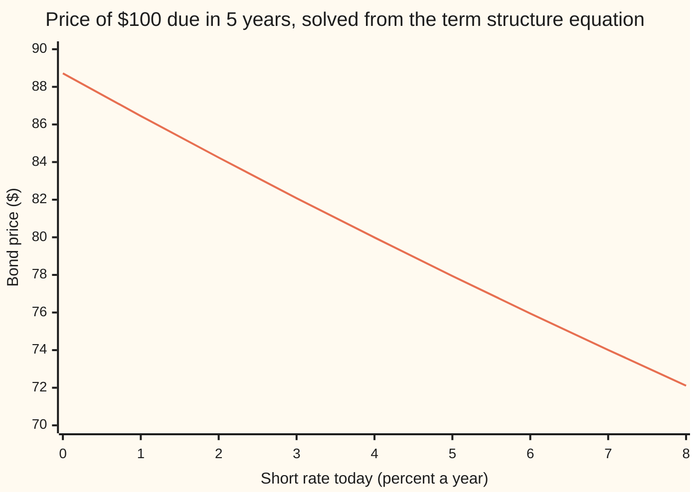
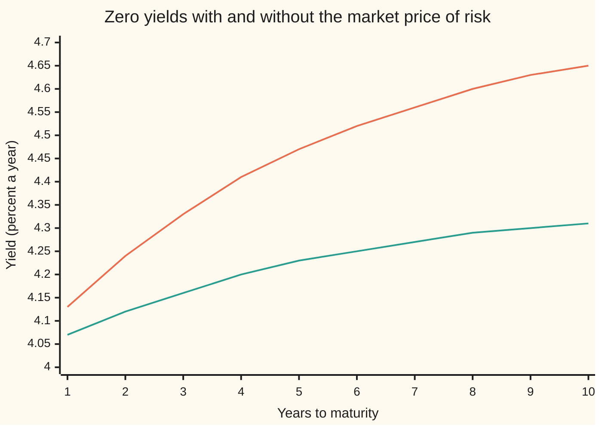

# A short-rate model: one random rate, and the equation every bond must satisfy

Financial mathematics → Short-Rate Models → Pricing every bond from one rate → A short-rate model

---

## General Overview

A government promises to pay $100 in five years' time and nothing before. That promise is a **zero-coupon bond**, a zero for short. Today cash lent overnight earns 4 percent a year. If that rate stayed at 4 percent for five years, the promise would be worth $100 × e^(−0.04 × 5) = $81.87 today.

It will not stay there. The rate for the next instant, the **short rate**, wanders. The description used throughout this card prices bonds as if the rate were pulled toward 5 percent at speed 0.3 a year, with a volatility of 1 percentage point a year. Each possible path of the rate over the five years gives its own discount: $100 times e raised to minus the area under that path. Average those discounts over all paths, in the right way, and the zero is worth **$79.99**.

"In the right way" carries the whole card. Every bond, of every maturity, rides on the same single random number. Two bonds on one coin can be combined so the coin cancels, and a position with no risk must earn the bank rate. That one demand forces every bond price to obey one equation, the **term structure equation**. It also forces every bond to pay the same extra return for each unit of rate risk it carries. That shared number is the **market price of risk**; here it is 0.15.

**If one random short rate drives every bond, then no-arbitrage makes each bond price a function of today's rate that satisfies one equation, and that price equals the average of e to the minus the area under the rate's path, taken with the rate's drift shifted by the market price of risk.**

**What kind of fact this is:** a model: one random rate driving every bond is an assumption, not a law. Inside the model, the equation and the averaging formula are a theorem, proved on this card in Why it works.

### The picture: the bond is a function of one number



The single line is the five-year zero's price as today's short rate runs from 0 to 8 percent. At 4 percent it reads $79.99. Nothing else about today's market enters: in a one-rate model, the rate and the clock are the whole state of the world.

---

## The formula

Notation first. The rate is written in the shorthand of Itô calculus ([itos-lemma](../../11-Stochastic%20processes%20and%20calculus/06-Ito%20Calculus/02-itos-lemma.md)): $dr_t$ is the change in the rate over a short step of time $dt$, and $dW_t$ is a random shock over that step, with average zero and variance $dt$. A price that depends on time and on the rate is written $p(t, r)$. A subscript marks a rate of change with the other input held still: $p_t$ is how fast the price moves as the clock runs, $p_r$ how fast it moves as the rate moves, and $p_{rr}$ how fast $p_r$ itself moves, the curvature.

The model, in the real world:

$$dr_t = \mu(t, r_t)\,dt + s(t, r_t)\,dW_t$$

**Read it aloud:** over each instant the short rate drifts by $\mu$ and is shaken by a random shock of size $s$.

The equation every zero must satisfy, for each maturity $T$:

$$\boxed{\;p_t + \bigl(\mu + \lambda s\bigr)\,p_r + \tfrac12 s^2\,p_{rr} - r\,p = 0, \qquad p(T, r) = 1\;}$$

**Read it aloud:** the price's change from the clock, from the rate's drift nudged by the market price of risk, and from the rate's randomness together pay exactly the bank rate on the price; and at maturity the zero is worth its $1.

Its solution, by the Feynman-Kac formula ([feynman-kac-formula](../../11-Stochastic%20processes%20and%20calculus/07-Changing%20Measure/06-feynman-kac-formula.md)):

$$P(t, T) = \mathbb{E}_Q\!\left[\,e^{-\int_t^T r_u\,du}\,\right], \qquad \text{with the rate drifting at } \mu + \lambda s \text{ under } Q.$$

**Read it aloud:** the bond price is the average of the path discount, taken in the pricing world where the rate's drift is shifted up by the market price of risk times the rate's volatility.

| Symbol | Plain meaning | In our example | Push it up and the answer… |
| --- | --- | --- | --- |
| $r_t$, $r$ | the **short rate**: the rate on a loan for the next instant, continuously compounded | 4% today | bond falls: \$72.12 at 8% |
| $t$, $T$, $\tau$, $T_1$, $T_2$ | now, the payment date, and the time left $\tau = T - t$, in years; $T_1$, $T_2$ are two maturities | 0, 5, 5 | more time left, lower price: \$23.39 at 30 years |
| $\mu$, $s$ | the rate's real-world **drift** and its **volatility**, both per year | $\mu = a(\theta_P - r)$, $s = \sigma$ | — |
| $a$, $\theta_P$, $\theta$, $\sigma$ | speed of the pull, real-world level, pricing-world level, rate volatility | 0.3, 4.5%, 5%, 1% | a higher $\sigma$ raises the price: \$80.17 at 2% |
| $W_t$, $dW_t$, $dt$, $dr_t$ | the single random shock, its step over a short time $dt$, and the rate's change over that step | one draw moves every bond | — |
| $D$ | the **path discount** $e^{-\int_t^T r_u du}$: what \$1 at $T$ is worth along one path of rates | random; average \$79.9856 per \$100 | — |
| $P(t,T)$, $p$ | the zero's price per \$1 due at $T$; as a function of time and rate, $p(t, r)$ | \$79.9856 per \$100 | — |
| $p_t$, $p_r$, $p_{rr}$ | rates of change of the price with the clock, with the rate, and its curvature | per \$100: 3.79 a year, then see Worked numbers | — |
| $Q$, $\mathbb{E}_Q$ | the **pricing world** (the risk-neutral measure) and an average taken in it: the rate drifts at $\mu + \lambda s$ | $a(\theta - r)$ | — |
| $\lambda$ | the **market price of risk**: extra expected return per unit of bond volatility, shared by every bond | 0.15 | pricing drift up, bond prices down |
| $\alpha_T$, $\beta_T$, $\alpha_{T_1}$, $\beta_{T_1}$, $\alpha_{T_2}$, $\beta_{T_2}$ | a zero's real-world expected return and its volatility, per year | 4.3884% and 2.5896% at 5 years | — |
| $I$, $m$, $v$ | the area under the rate's path, $I = \int_t^T r_u du$, and its mean and variance in the pricing world | 0.224104 and 0.00156062 | a larger $v$ raises the price |

In the example the pricing-world drift works out as $a(\theta_P - r) + \lambda\sigma = a(\theta - r)$, because $\theta = \theta_P + \lambda\sigma/a$: 4.5% plus 0.15 × 0.01 / 0.3 gives 5%. The real-world rate is pulled toward 4.5%; bonds are priced as if it were pulled toward 5%.

### When it holds

- **One random number drives every bond.** All maturities then move in lockstep: a rise in the two-year yield forces a rise in the ten-year. Real curves also twist, the short end up and the long end down. Two or more shocks are needed for that: [two-factor-and-lognormal-short-rate-models](07-two-factor-and-lognormal-short-rate-models.md).
- **The rate moves continuously.** Brownian shocks, no jumps. On a central-bank day the rate jumps by a quarter point, and a jump cannot be hedged away by a second bond in the same instant.
- **The market price of risk depends only on time and today's rate.** If investors' appetite for risk moves with something else, such as inflation news, that something is a second state variable and one rate no longer prices everything.
- **Frictionless borrowing at the short rate, no default.** The hedge in Step 2 borrows and lends at $r$. Government zeros fit; a corporate bond needs a credit spread on top.
- **The discounted price is a genuine fair bet.** Having no drift is not quite enough: Feynman-Kac also needs a bound on how wildly the price can swing, stated in Step 5's proof. Vasicek and Cox-Ingersoll-Ross meet it. Without it the equation can have several solutions, and only one of them is the average.

---

## Why it works

### Step 0: two bonds on one coin make a riskless position

Every zero's price moves only because the short rate moves. Hold one five-year zero and short a suitable amount of two-year zero. When the rate ticks up, both fall; with the right amounts the two losses offset exactly. For that instant the position carries no risk. A position with no risk must earn the bank rate: any more and everyone borrows to buy it, any less and everyone sells it. Everything below turns that one demand into an equation.

### Step 1: how a zero's price moves

Itô's lemma applied to $p(t, r_t)$ splits the price's change into a steady part and a random part:

$$dp = \bigl(p_t + \mu\,p_r + \tfrac12 s^2 p_{rr}\bigr)\,dt + s\,p_r\,dW_t.$$

The half-$s^2$ term is the curvature correction: the price is a bent function of the rate, and shaking the rate moves the average price. Divide by $p$ and name the parts. The zero's expected return per year is $\alpha_T = (p_t + \mu p_r + \tfrac12 s^2 p_{rr})/p$. Its volatility is $\beta_T = -s\,p_r/p$, positive because a zero falls when the rate rises. So each zero moves as $dp/p = \alpha_T\,dt - \beta_T\,dW_t$.

### Step 2: the hedge forces one ratio on every bond

Take two zeros, maturities $T_1$ and $T_2$. Put $\beta_{T_2}$ dollars in the first and $-\beta_{T_1}$ dollars in the second, a short sale. The random parts are $-\beta_{T_2}\beta_{T_1}\,dW$ and $+\beta_{T_1}\beta_{T_2}\,dW$: they cancel. The position is riskless, so its return must equal the bank rate on its value. Rearranged, that says

$$\frac{\alpha_{T_1} - r}{\beta_{T_1}} = \frac{\alpha_{T_2} - r}{\beta_{T_2}}.$$

<details>
<summary>The algebra behind this</summary>

The position is worth $\beta_{T_2} - \beta_{T_1}$ dollars. Its steady gain per unit time is $\beta_{T_2}\alpha_{T_1} - \beta_{T_1}\alpha_{T_2}$. No risk means this must equal $r(\beta_{T_2} - \beta_{T_1})$. Move terms: $\beta_{T_2}(\alpha_{T_1} - r) = \beta_{T_1}(\alpha_{T_2} - r)$. Divide both sides by $\beta_{T_1}\beta_{T_2}$, which is not zero because each zero does move with the rate.

</details>

### Step 3: name the shared ratio

The two maturities were arbitrary, so every zero has the same ratio of extra return to volatility. It can depend on time and today's rate, but not on the maturity. Call it $\lambda$, the market price of risk:

$$\alpha_T = r + \lambda\,\beta_T.$$

In the example, the code reads $\lambda$ back out of three bonds by computing each one's expected return and volatility from its price. The two-year zero expects 4.2256% a year with volatility 1.5040%. The five-year expects 4.3884% with 2.5896%. The ten-year expects 4.4751% with 3.1674%. Subtract the 4% short rate and divide: 0.150000 each time. A bond priced to give a different ratio would let the Step 2 hedge earn more than the bank with no risk.

A positive $\lambda$ means investors demand extra return for holding rate risk. The chart shows what that does to the yield curve, where the yield of a zero is $-\ln P / \tau$, its steady equivalent interest rate.



Orange, upper: the market's curve, priced with the drift toward 5%. Green, lower: the curve the same rate would give if investors charged nothing for rate risk, averaging with the real-world drift toward 4.5%. At five years they read 4.47% and 4.23%. The gap is the term premium: the extra yield paid for carrying rate risk, growing with maturity because longer zeros carry more of it.

### Step 4: substitute, and the equation appears

Put $\alpha_T$ from Step 1 into $\alpha_T = r + \lambda\beta_T$ and multiply through by $p$:

$$p_t + \mu\,p_r + \tfrac12 s^2 p_{rr} = r\,p - \lambda s\,p_r.$$

Move everything to the left and the term structure equation stands:

$$p_t + (\mu + \lambda s)\,p_r + \tfrac12 s^2 p_{rr} - r\,p = 0.$$

The final condition is the contract: at maturity the zero pays \$1 whatever the rate, so $p(T, r) = 1$. Every maturity solves the same equation; only the date of that final condition differs.

### Step 5: the equation's solution is an average

The equation is linear with a final condition, the shape the Feynman-Kac formula solves. Its answer: run the rate forward with drift $\mu + \lambda s$ instead of $\mu$, discount along each path at the short rate, and average. That is $P(t,T) = \mathbb{E}_Q[D]$.

The reason in words: along any path, the discounted price, $p$ multiplied by the discount accumulated so far, has no drift, because the equation cancels it. A quantity with no drift is a fair bet. A fair bet is worth today what it is worth on average at the end, and at maturity the discounted price is the path discount times \$1.

<details>
<summary>Detailed proof: from the equation to the average</summary>

Fix $t$ and let $D_u = e^{-\int_t^u r_v dv}$ for $u \ge t$, so $dD_u = -r_u D_u\,du$ with no random part. Let $X_u = D_u\,p(u, r_u)$, with the rate moving under $Q$ as $dr_u = (\mu + \lambda s)\,du + s\,dW^Q_u$.

The product rule for Itô processes gives $dX_u = D_u\,dp - r_u D_u p\,du$, since $D$ has no random part and so no cross term. Itô's lemma under $Q$ gives $dp = \bigl(p_t + (\mu + \lambda s)p_r + \tfrac12 s^2 p_{rr}\bigr)du + s\,p_r\,dW^Q_u$. Hence
$$dX_u = D_u\bigl(p_t + (\mu + \lambda s)p_r + \tfrac12 s^2 p_{rr} - r_u p\bigr)du + D_u\,s\,p_r\,dW^Q_u.$$
The bracket is zero by the equation. What is left has no drift. If $\mathbb{E}_Q\int_t^T (D_u s p_r)^2 du$ is finite, the remaining term is a true martingale (a fair bet), so $X_t = \mathbb{E}_Q[X_T]$. Now $X_t = p(t, r_t)$ because $D_t = 1$, and $X_T = D_T \cdot 1$ by the final condition. So $p(t, r_t) = \mathbb{E}_Q[e^{-\int_t^T r_u du}]$.

The finiteness condition is the "genuine fair bet" assumption in When it holds. It is met in Vasicek: $p_r = -Bp$ with $B$ bounded, and the discounted price has finite variance. For the reverse direction, that the average is smooth enough to satisfy the equation, see [feynman-kac-formula](../../11-Stochastic%20processes%20and%20calculus/07-Changing%20Measure/06-feynman-kac-formula.md).

</details>

### Step 6: in the example, the average has a closed form

Under $Q$ the example rate is a pulled random walk, an Ornstein-Uhlenbeck process ([ornstein-uhlenbeck-and-cir-processes](../../11-Stochastic%20processes%20and%20calculus/06-Ito%20Calculus/05-ornstein-uhlenbeck-and-cir-processes.md)). The area $I$ under its path is then normal. For a normal $I$ with mean $m$ and variance $v$, the average of $e^{-I}$ is $e^{-m + v/2}$. The mean follows from the rate's expected path, which still has a fraction $e^{-au}$ of today's gap to 5% left after $u$ years. The variance adds up each shock's effect on the rest of the path. Both come out in closed form; [vasicek-model](02-vasicek-model.md) derives them and the bond formula they give. This card only uses the result, as one road among four.

The other route runs the opposite way. Instead of choosing the short rate and solving for every bond, model the whole forward curve and let no-arbitrage fix its drift. That is the Heath-Jarrow-Morton framework, [hjm-framework-and-the-drift-condition](../31-Forward-Rate%20Models/01-hjm-framework-and-the-drift-condition.md), and every short-rate model is a special case of it.

---

## Worked numbers, by hand

The five-year zero, \$100 face: today's rate 4%, pricing-world level $\theta$ = 5%, speed $a$ = 0.3, volatility $\sigma$ = 1%. The mean of the path area is $m = \theta T + (r - \theta)B$ with $B = (1 - e^{-aT})/a$. Its variance is $v = (\sigma/a)^2\,\bigl(T - 2B + (1 - e^{-2aT})/(2a)\bigr)$.

| Step | Arithmetic | Value |
| --- | --- | --- |
| share of today's gap to 5% left after 5 years | $e^{-0.3 \times 5}$ | 0.223130 |
| $B$ | $(1 - 0.223130)/0.3$ | 2.589566 |
| mean area $m$ | $0.05 \times 5 + (0.04 - 0.05) \times 2.589566$ | 0.224104 |
| second-order piece | $(1 - e^{-3})/0.6$ | 1.583688 |
| bracket | $5 - 2 \times 2.589566 + 1.583688$ | 1.404556 |
| variance $v$ | $(0.01/0.3)^2 \times 1.404556$ | 0.00156062 |
| exponent | $-0.224104 + 0.00156062/2$ | −0.223324 |
| **price** | $100 \times e^{-0.223324}$ | **$79.99** (79.9856) |
| yield | $0.223324 / 5$ | 4.4665% |

The government's promise of $100 in five years sells for $79.99 in this model, a yield of 4.47% a year: more than today's 4% because the rate is expected, in the pricing world, to climb toward 5%.

### The equation, checked term by term

At today's rate and date, per $100 of face, the four terms of the equation (from the code's slopes of the price) are:

| Term | Meaning | Dollars a year |
| --- | --- | --- |
| $p_t$ | the clock: a zero gains value as maturity nears | +3.793988 |
| $(\mu + \lambda s)\,p_r$ | the pricing-world drift, $a(\theta - r)p_r$: the rate is expected to climb, which costs | −0.621384 |
| $\tfrac12 s^2 p_{rr}$ | the curvature: shaking a bent price function helps the holder | +0.026819 |
| $-r\,p$ | the bank's interest on \$79.99 at 4% | −3.199423 |
| **sum** | | **0 (below 1e-9)** |

Read as accounts: holding the zero for a year earns $3.79 from the clock and $0.03 from randomness, loses $0.62 to the expected rise in rates, and the net, $3.20, is exactly the bank's 4% on the price. In the pricing world a bond earns the bank rate, no more and no less.

### What breaks when a piece is dropped

| Mistake | Comes out at | What went wrong |
| --- | --- | --- |
| Average with the real-world drift toward 4.5% | $80.96 | forecasting drift used for pricing; the market price of risk left out |
| Freeze the rate at 4% | $81.87 | no drift and no randomness: the pull toward 5% is ignored |
| Discount the average path, $e^{-m}$ | \$79.92 | the average of $e^{-I}$ is not e to the minus the average of $I$; the $v/2$ is dropped |
| Drop the pull: rate wanders freely from 4% | \$82.04 | no mean reversion; variance grows like $T^3$ and the drift toward 5% is lost |

Every row is reproduced by both check scripts below.

---

## Code, from first principles, and it actually runs

The code prices the five-year zero four ways. Road 1 computes the path area's mean and variance by Simpson's rule, adding thin slices, and takes $e^{-m+v/2}$. Road 2 simulates 8,000 rate paths with its own random numbers and averages the path discount. Road 3 solves the term structure equation itself on a grid of rates, marching backward from $p = 1$ at maturity. Road 4 is the closed form from [vasicek-model](02-vasicek-model.md), used only as a cross-check. Then the closed form is plugged into the equation to confirm it solves it, and the market price of risk is read back from three bonds.

### Python

```python
# A short-rate model and the term structure equation -- the check behind the card.
# Standard library only.  Nothing imported knows the answer: the random numbers,
# the integrator and the equation solver are all written here.
from math import exp, log, sqrt, cos, pi

a, theta, sigma, r0, T = 0.3, 0.05, 0.01, 0.04, 5.0   # pricing-world rate model; $100 due in 5 years
lam = 0.15                                             # market price of risk
theta_P = theta - lam * sigma / a                      # real-world long-run level, 4.5%

def simpson(f, lo, hi, n=2000):
    h = (hi - lo) / n
    return (f(lo) + f(hi) + sum((4 if i % 2 else 2) * f(lo + i * h) for i in range(1, n))) * h / 3

def gauss_road(r, tau, th, sg=sigma):
    # Road 1: the integrated rate I is normal, so E[e^-I] = e^(-m + v/2); m and v by Simpson
    m = simpson(lambda s: th + (r - th) * exp(-a * s), 0.0, tau)
    v = simpson(lambda s: (sg * (1 - exp(-a * (tau - s))) / a) ** 2, 0.0, tau)
    return m, v, exp(-m + v / 2)

def closed(r, tau, th=theta):
    # Road 4: the formula the Vasicek card derives, used here only as a cross-check
    B = (1 - exp(-a * tau)) / a
    return exp((th - sigma ** 2 / (2 * a * a)) * (B - tau) - sigma ** 2 * B * B / (4 * a) - B * r)

state = 20260928
def u01():                                             # splitmix64 random numbers, 53 bits
    global state
    state = (state + 0x9E3779B97F4A7C15) & 0xFFFFFFFFFFFFFFFF
    z = ((state ^ (state >> 30)) * 0xBF58476D1CE4E5B9) & 0xFFFFFFFFFFFFFFFF
    z = ((z ^ (z >> 27)) * 0x94D049BB133111EB) & 0xFFFFFFFFFFFFFFFF
    return ((z ^ (z >> 31)) >> 11) / 9007199254740992.0

def mc_road(pairs=4000, steps=500):
    # Road 2: step the rate exactly, add up the rate along the path, average the discount factor
    dt = T / steps; e = exp(-a * dt); sd = sigma * sqrt((1 - e * e) / (2 * a))
    tot = tot2 = 0.0
    for _ in range(pairs):
        ra = rb = r0; ia = ib = 0.0
        for _ in range(steps):
            z = sqrt(-2 * log(1 - u01())) * cos(2 * pi * u01())
            na = theta + (ra - theta) * e + sd * z; nb = theta + (rb - theta) * e - sd * z
            ia += 0.5 * dt * (ra + na); ib += 0.5 * dt * (rb + nb); ra, rb = na, nb
        d = 0.5 * (exp(-ia) + exp(-ib)); tot += d; tot2 += d * d
    mean = tot / pairs
    return mean, sqrt((tot2 / pairs - mean * mean) / pairs)

def pde_road(lo=-0.08, hi=0.18, dr=0.001, dt=0.0005):
    # Road 3: march p_t + a(theta - r) p_r + sigma^2/2 p_rr - r p = 0 back from p = 1 at maturity
    n = int(round((hi - lo) / dr)); rs = [lo + i * dr for i in range(n + 1)]; p = [1.0] * (n + 1)
    for _ in range(int(round(T / dt))):
        q = p[:]
        for i in range(1, n):
            pr = (p[i + 1] - p[i - 1]) / (2 * dr); prr = (p[i + 1] - 2 * p[i] + p[i - 1]) / dr ** 2
            q[i] = p[i] + dt * (a * (theta - rs[i]) * pr + 0.5 * sigma ** 2 * prr - rs[i] * p[i])
        q[0] = 2 * q[1] - q[2]; q[n] = 2 * q[n - 1] - q[n - 2]; p = q
    return lambda r: p[int(round((r - lo) / dr))]

m, v, P_g = gauss_road(r0, T, theta)
P_mc, se = mc_road()
pde = pde_road(); P_pde = pde(r0)
P_cf = closed(r0, T)
def row(name, x, f="14.4f"): print(f"{name:<34}{x:>{f}}")
row("e^-aT, share of the gap left", exp(-a * T), "14.6f"); row("B = (1 - e^-aT)/a", (1 - exp(-a * T)) / a, "14.6f")
row("(1 - e^-2aT)/(2a)", (1 - exp(-2 * a * T)) / (2 * a), "14.6f")
row("bracket T - 2B + that", T - 2 * (1 - exp(-a * T)) / a + (1 - exp(-2 * a * T)) / (2 * a), "14.6f")
row("mean of integrated rate m", m, "14.6f"); row("variance of integrated rate v", v, "14.8f")
row("exponent -m + v/2", -m + v / 2, "14.6f")
row("1 Gaussian moments, $100 bond", 100 * P_g); row("2 Monte Carlo, 8000 paths", 100 * P_mc)
row("  its standard error", 100 * se); row("3 equation marched back", 100 * P_pde)
row("4 Vasicek closed form", 100 * P_cf); row("5-year yield, percent", -100 * log(P_g) / T)

def parts(tau, drift_level):
    # finite-difference slopes of the closed form: time, rate, curvature
    h = 1e-4; p = closed(r0, tau)
    pt = -(closed(r0, tau + h) - closed(r0, tau - h)) / (2 * h)       # time left shrinks as t grows
    pr = (closed(r0 + h, tau) - closed(r0 - h, tau)) / (2 * h)
    prr = (closed(r0 + h, tau) - 2 * p + closed(r0 - h, tau)) / h ** 2
    return p, pt, a * (drift_level - r0) * pr, 0.5 * sigma ** 2 * prr, pr
p, pt, drift_term, curve_term, pr = parts(T, theta)
row("term: p_t", 100 * pt, "14.6f"); row("term: a(theta - r) p_r", 100 * drift_term, "14.6f")
row("term: sigma^2/2 p_rr", 100 * curve_term, "14.6f"); row("term: -r p", -100 * r0 * p, "14.6f")
resid = pt + drift_term + curve_term - r0 * p
print(f"{'residual of the equation below 1e-9':<34}{'yes' if abs(resid) < 1e-9 else 'NO':>14}")

row("real-world long-run level", theta_P, "14.6f")
lams = []
for tau in (2.0, 5.0, 10.0):
    p, pt, dP, cP, pr = parts(tau, theta_P)
    mu, vol = (pt + dP + cP) / p, -sigma * pr / p                    # real-world drift and volatility
    lams.append((mu - r0) / vol)
    print(f"bond {tau:>4.0f}y  return {mu:.6f}  vol {vol:.6f}  lambda {lams[-1]:.6f}")

P_real = gauss_road(r0, T, theta_P)[2]
row("wrong: real-world drift", 100 * P_real); row("wrong: rate frozen at 4%", 100 * exp(-r0 * T))
row("wrong: e^-m, variance dropped", 100 * exp(-m))
row("wrong: no pull toward 5%", 100 * exp(-r0 * T + sigma ** 2 * T ** 3 / 6))
row("try: sigma = 0.02", 100 * gauss_road(r0, T, theta, 0.02)[2])
row("try: r = 0.08", 100 * gauss_road(0.08, T, theta)[2])
row("try: 30 years", 100 * gauss_road(r0, 30.0, theta)[2])
p, pt, dP, cP, pr = parts(5.0, theta + lam * sigma / a)             # lam = -0.15: level 5.5%
row("try: lam = -0.15, real level", theta + lam * sigma / a, "14.6f")
row("try: lam = -0.15, 5y lambda", ((pt + dP + cP) / p - r0) / (-sigma * pr / p), "14.6f")

print("chart, maturity (years)     " + " ".join(f"{t:>5d}" for t in range(1, 11)))
print("chart, yield pricing world  " + " ".join(f"{-100 * log(gauss_road(r0, t, theta)[2]) / t:5.2f}" for t in range(1, 11)))
print("chart, yield real-world     " + " ".join(f"{-100 * log(gauss_road(r0, t, theta_P)[2]) / t:5.2f}" for t in range(1, 11)))
print("chart, rate today (%)       " + " ".join(f"{j:>5d}" for j in range(0, 9)))
print("chart, 5y bond from the PDE " + " ".join(f"{100 * pde(j / 100):5.2f}" for j in range(0, 9)))

assert abs(P_mc - P_g) < 4 * se,           "Monte Carlo average must land on the Gaussian road"
assert abs(P_pde - P_g) < 5e-6,             "the marched equation must land on the Gaussian road"
assert abs(P_g - P_cf) < 1e-10,            "Simpson moments must reproduce the closed form"
assert abs(resid) < 1e-9,                  "the closed form must satisfy the equation"
assert max(abs(x - lam) for x in lams) < 1e-5, "every maturity must show the same market price of risk"
print("ALL CHECKS PASS")
```

**Ran 2026-09-28 on macOS, Python 3.14.6, standard library only. All checks passed. Output, pasted from the run:**

```
e^-aT, share of the gap left            0.223130
B = (1 - e^-aT)/a                       2.589566
(1 - e^-2aT)/(2a)                       1.583688
bracket T - 2B + that                   1.404556
mean of integrated rate m               0.224104
variance of integrated rate v         0.00156062
exponent -m + v/2                      -0.223324
1 Gaussian moments, $100 bond            79.9856
2 Monte Carlo, 8000 paths                79.9855
  its standard error                      0.0014
3 equation marched back                  79.9854
4 Vasicek closed form                    79.9856
5-year yield, percent                     4.4665
term: p_t                               3.793988
term: a(theta - r) p_r                 -0.621384
term: sigma^2/2 p_rr                    0.026819
term: -r p                             -3.199423
residual of the equation below 1e-9           yes
real-world long-run level               0.045000
bond    2y  return 0.042256  vol 0.015040  lambda 0.150000
bond    5y  return 0.043884  vol 0.025896  lambda 0.150000
bond   10y  return 0.044751  vol 0.031674  lambda 0.150000
wrong: real-world drift                  80.9554
wrong: rate frozen at 4%                 81.8731
wrong: e^-m, variance dropped            79.9232
wrong: no pull toward 5%                 82.0438
try: sigma = 0.02                        80.1730
try: r = 0.08                            72.1151
try: 30 years                            23.3919
try: lam = -0.15, real level            0.055000
try: lam = -0.15, 5y lambda            -0.150000
chart, maturity (years)         1     2     3     4     5     6     7     8     9    10
chart, yield pricing world   4.13  4.24  4.33  4.41  4.47  4.52  4.56  4.60  4.63  4.65
chart, yield real-world      4.07  4.12  4.16  4.20  4.23  4.25  4.27  4.29  4.30  4.31
chart, rate today (%)           0     1     2     3     4     5     6     7     8
chart, 5y bond from the PDE 88.72 86.45 84.24 82.08 79.99 77.94 75.95 74.01 72.11
ALL CHECKS PASS
```

Four roads, one price. The Simpson moments and the closed form agree to ten decimals. The simulation lands well within one standard error, 0.0014. The marched equation is off in the sixth decimal of the price per $1, the cost of a finite grid. The three bonds report the same market price of risk, 0.150000, although each has its own return and volatility.

### Rust

Same roads, same inputs, same random-number recipe, so the simulation draws the same shocks. No crates.

```rust
// A short-rate model and the term structure equation -- the same check in Rust.
// Standard library only, no crates.  Random numbers, integrator and equation solver written here.
// Compile: rustc --edition 2021 -O the_term_structure_equation_check.rs -o /tmp/tse_check
use std::f64::consts::PI;

const A: f64 = 0.3; const THETA: f64 = 0.05; const SIGMA: f64 = 0.01; const R0: f64 = 0.04; const T: f64 = 5.0;
const LAM: f64 = 0.15;                                       // market price of risk

fn simpson<F: Fn(f64) -> f64>(f: F, lo: f64, hi: f64, n: usize) -> f64 {
    let h = (hi - lo) / n as f64;
    let mut s = f(lo) + f(hi);
    for i in 1..n { s += if i % 2 == 1 { 4.0 } else { 2.0 } * f(lo + i as f64 * h); }
    s * h / 3.0
}

// Road 1: the integrated rate is normal, so E[e^-I] = e^(-m + v/2); m and v by Simpson
fn gauss_road(r: f64, tau: f64, th: f64, sg: f64) -> (f64, f64, f64) {
    let m = simpson(|s| th + (r - th) * (-A * s).exp(), 0.0, tau, 2000);
    let v = simpson(|s| (sg * (1.0 - (-A * (tau - s)).exp()) / A).powi(2), 0.0, tau, 2000);
    (m, v, (-m + v / 2.0).exp())
}

// Road 4: the formula the Vasicek card derives, used here only as a cross-check
fn closed(r: f64, tau: f64) -> f64 {
    let b = (1.0 - (-A * tau).exp()) / A;
    ((THETA - SIGMA * SIGMA / (2.0 * A * A)) * (b - tau) - SIGMA * SIGMA * b * b / (4.0 * A) - b * r).exp()
}

struct Rng(u64);
impl Rng {                                                   // splitmix64 random numbers, 53 bits
    fn u01(&mut self) -> f64 {
        self.0 = self.0.wrapping_add(0x9E3779B97F4A7C15);
        let mut z = (self.0 ^ (self.0 >> 30)).wrapping_mul(0xBF58476D1CE4E5B9);
        z = (z ^ (z >> 27)).wrapping_mul(0x94D049BB133111EB);
        ((z ^ (z >> 31)) >> 11) as f64 / 9007199254740992.0
    }
}

// Road 2: step the rate exactly, add up the rate along the path, average the discount factor
fn mc_road(pairs: usize, steps: usize) -> (f64, f64) {
    let mut rng = Rng(20260928);
    let dt = T / steps as f64; let e = (-A * dt).exp(); let sd = SIGMA * ((1.0 - e * e) / (2.0 * A)).sqrt();
    let (mut tot, mut tot2) = (0.0, 0.0);
    for _ in 0..pairs {
        let (mut ra, mut rb, mut ia, mut ib) = (R0, R0, 0.0, 0.0);
        for _ in 0..steps {
            let u1 = rng.u01(); let u2 = rng.u01();
            let z = (-2.0 * (1.0 - u1).ln()).sqrt() * (2.0 * PI * u2).cos();
            let na = THETA + (ra - THETA) * e + sd * z; let nb = THETA + (rb - THETA) * e - sd * z;
            ia += 0.5 * dt * (ra + na); ib += 0.5 * dt * (rb + nb); ra = na; rb = nb;
        }
        let d = 0.5 * ((-ia).exp() + (-ib).exp()); tot += d; tot2 += d * d;
    }
    let mean = tot / pairs as f64;
    (mean, ((tot2 / pairs as f64 - mean * mean) / pairs as f64).sqrt())
}

// Road 3: march p_t + a(theta - r) p_r + sigma^2/2 p_rr - r p = 0 back from p = 1 at maturity
fn pde_road(lo: f64, hi: f64, dr: f64, dt: f64) -> Vec<f64> {
    let n = ((hi - lo) / dr).round() as usize;
    let rs: Vec<f64> = (0..=n).map(|i| lo + i as f64 * dr).collect();
    let mut p = vec![1.0; n + 1];
    for _ in 0..(T / dt).round() as usize {
        let mut q = p.clone();
        for i in 1..n {
            let pr = (p[i + 1] - p[i - 1]) / (2.0 * dr); let prr = (p[i + 1] - 2.0 * p[i] + p[i - 1]) / (dr * dr);
            q[i] = p[i] + dt * (A * (THETA - rs[i]) * pr + 0.5 * SIGMA * SIGMA * prr - rs[i] * p[i]);
        }
        q[0] = 2.0 * q[1] - q[2]; q[n] = 2.0 * q[n - 1] - q[n - 2]; p = q;
    }
    p
}

// finite-difference slopes of the closed form: time, rate, curvature
fn parts(tau: f64, level: f64) -> (f64, f64, f64, f64, f64) {
    let h = 1e-4; let p = closed(R0, tau);
    let pt = -(closed(R0, tau + h) - closed(R0, tau - h)) / (2.0 * h);   // time left shrinks as t grows
    let pr = (closed(R0 + h, tau) - closed(R0 - h, tau)) / (2.0 * h);
    let prr = (closed(R0 + h, tau) - 2.0 * p + closed(R0 - h, tau)) / (h * h);
    (p, pt, A * (level - R0) * pr, 0.5 * SIGMA * SIGMA * prr, pr)
}

fn row(name: &str, x: f64, d: usize) { println!("{:<34}{:>14.*}", name, d, x); }

fn main() {
    let theta_p = THETA - LAM * SIGMA / A;                   // real-world long-run level, 4.5%
    let (m, v, p_g) = gauss_road(R0, T, THETA, SIGMA);
    let (p_mc, se) = mc_road(4000, 500);
    let (lo, dr) = (-0.08, 0.001);
    let grid = pde_road(lo, 0.18, dr, 0.0005);
    let pde = |r: f64| grid[((r - lo) / dr).round() as usize];
    let p_pde = pde(R0); let p_cf = closed(R0, T);
    let b = (1.0 - (-A * T).exp()) / A; let c2 = (1.0 - (-2.0 * A * T).exp()) / (2.0 * A);
    row("e^-aT, share of the gap left", (-A * T).exp(), 6); row("B = (1 - e^-aT)/a", b, 6);
    row("(1 - e^-2aT)/(2a)", c2, 6); row("bracket T - 2B + that", T - 2.0 * b + c2, 6);
    row("mean of integrated rate m", m, 6); row("variance of integrated rate v", v, 8);
    row("exponent -m + v/2", -m + v / 2.0, 6);
    row("1 Gaussian moments, $100 bond", 100.0 * p_g, 4); row("2 Monte Carlo, 8000 paths", 100.0 * p_mc, 4);
    row("  its standard error", 100.0 * se, 4); row("3 equation marched back", 100.0 * p_pde, 4);
    row("4 Vasicek closed form", 100.0 * p_cf, 4); row("5-year yield, percent", -100.0 * p_g.ln() / T, 4);

    let (p, pt, drift_term, curve_term, _) = parts(T, THETA);
    row("term: p_t", 100.0 * pt, 6); row("term: a(theta - r) p_r", 100.0 * drift_term, 6);
    row("term: sigma^2/2 p_rr", 100.0 * curve_term, 6); row("term: -r p", -100.0 * R0 * p, 6);
    let resid = pt + drift_term + curve_term - R0 * p;
    println!("{:<34}{:>14}", "residual of the equation below 1e-9", if resid.abs() < 1e-9 { "yes" } else { "NO" });

    row("real-world long-run level", theta_p, 6);
    let mut lams = Vec::new();
    for tau in [2.0_f64, 5.0, 10.0] {
        let (p, pt, dp, cp, pr) = parts(tau, theta_p);
        let (mu, vol) = ((pt + dp + cp) / p, -SIGMA * pr / p);   // real-world drift and volatility
        lams.push((mu - R0) / vol);
        println!("bond {:>4.0}y  return {:.6}  vol {:.6}  lambda {:.6}", tau, mu, vol, lams[lams.len() - 1]);
    }

    let p_real = gauss_road(R0, T, theta_p, SIGMA).2;
    row("wrong: real-world drift", 100.0 * p_real, 4); row("wrong: rate frozen at 4%", 100.0 * (-R0 * T).exp(), 4);
    row("wrong: e^-m, variance dropped", 100.0 * (-m).exp(), 4);
    row("wrong: no pull toward 5%", 100.0 * (-R0 * T + SIGMA * SIGMA * T.powi(3) / 6.0).exp(), 4);
    row("try: sigma = 0.02", 100.0 * gauss_road(R0, T, THETA, 0.02).2, 4);
    row("try: r = 0.08", 100.0 * gauss_road(0.08, T, THETA, SIGMA).2, 4);
    row("try: 30 years", 100.0 * gauss_road(R0, 30.0, THETA, SIGMA).2, 4);
    let (p, pt, dp, cp, pr) = parts(5.0, THETA + LAM * SIGMA / A);    // lam = -0.15: level 5.5%
    row("try: lam = -0.15, real level", THETA + LAM * SIGMA / A, 6);
    row("try: lam = -0.15, 5y lambda", ((pt + dp + cp) / p - R0) / (-SIGMA * pr / p), 6);

    let join = |v: Vec<String>| v.join(" ");
    println!("chart, maturity (years)     {}", join((1..=10).map(|t| format!("{:>5}", t)).collect()));
    println!("chart, yield pricing world  {}", join((1..=10).map(|t| format!("{:5.2}", -100.0 * gauss_road(R0, t as f64, THETA, SIGMA).2.ln() / t as f64)).collect()));
    println!("chart, yield real-world     {}", join((1..=10).map(|t| format!("{:5.2}", -100.0 * gauss_road(R0, t as f64, theta_p, SIGMA).2.ln() / t as f64)).collect()));
    println!("chart, rate today (%)       {}", join((0..=8).map(|j| format!("{:>5}", j)).collect()));
    println!("chart, 5y bond from the PDE {}", join((0..=8).map(|j| format!("{:5.2}", 100.0 * pde(j as f64 / 100.0))).collect()));

    assert!((p_mc - p_g).abs() < 4.0 * se, "Monte Carlo average must land on the Gaussian road");
    assert!((p_pde - p_g).abs() < 5e-6, "the marched equation must land on the Gaussian road");
    assert!((p_g - p_cf).abs() < 1e-10, "Simpson moments must reproduce the closed form");
    assert!(resid.abs() < 1e-9, "the closed form must satisfy the equation");
    assert!(lams.iter().all(|x| (x - LAM).abs() < 1e-5), "every maturity must show the same market price of risk");
    println!("ALL CHECKS PASS");
}
```

**Ran 2026-09-28 on macOS, rustc 1.98.1, no crates. All checks passed. Output, pasted from the run:**

```
e^-aT, share of the gap left            0.223130
B = (1 - e^-aT)/a                       2.589566
(1 - e^-2aT)/(2a)                       1.583688
bracket T - 2B + that                   1.404556
mean of integrated rate m               0.224104
variance of integrated rate v         0.00156062
exponent -m + v/2                      -0.223324
1 Gaussian moments, $100 bond            79.9856
2 Monte Carlo, 8000 paths                79.9855
  its standard error                      0.0014
3 equation marched back                  79.9854
4 Vasicek closed form                    79.9856
5-year yield, percent                     4.4665
term: p_t                               3.793988
term: a(theta - r) p_r                 -0.621384
term: sigma^2/2 p_rr                    0.026819
term: -r p                             -3.199423
residual of the equation below 1e-9           yes
real-world long-run level               0.045000
bond    2y  return 0.042256  vol 0.015040  lambda 0.150000
bond    5y  return 0.043884  vol 0.025896  lambda 0.150000
bond   10y  return 0.044751  vol 0.031674  lambda 0.150000
wrong: real-world drift                  80.9554
wrong: rate frozen at 4%                 81.8731
wrong: e^-m, variance dropped            79.9232
wrong: no pull toward 5%                 82.0438
try: sigma = 0.02                        80.1730
try: r = 0.08                            72.1151
try: 30 years                            23.3919
try: lam = -0.15, real level            0.055000
try: lam = -0.15, 5y lambda            -0.150000
chart, maturity (years)         1     2     3     4     5     6     7     8     9    10
chart, yield pricing world   4.13  4.24  4.33  4.41  4.47  4.52  4.56  4.60  4.63  4.65
chart, yield real-world      4.07  4.12  4.16  4.20  4.23  4.25  4.27  4.29  4.30  4.31
chart, rate today (%)           0     1     2     3     4     5     6     7     8
chart, 5y bond from the PDE 88.72 86.45 84.24 82.08 79.99 77.94 75.95 74.01 72.11
ALL CHECKS PASS
```

The two outputs agree line for line at the printed precision.

> [!TIP]
> **Try changing**
> Guess the direction first. Then run it.
> - **Double the rate's volatility.** Call `gauss_road(r0, T, theta, 0.02)`. The price rises, to **\$80.17**. The mean area is unchanged, and a wider spread raises the average of $e^{-I}$, since the discount is a bent function of $I$.
> - **Start at 8 percent.** Call `gauss_road(0.08, T, theta)`. The zero falls to **$72.12**; the equation's grid gives $72.11 at the same rate, the right end of the first chart.
> - **Wait thirty years.** Call `gauss_road(r0, 30.0, theta)`. The zero is worth **$23.39**. Over that span the rate spends most of its life near 5% and the start at 4% hardly matters.
> - **Flip the market price of risk.** The last two `try` rows keep the pricing world and set the risk price to −0.15. The real-world level becomes 5.5%, the five-year bond reports −0.150000, and its price, $79.99, does not move: today's curve cannot tell the level and the risk price apart.

---

## The usual mistake

> [!warning]
> **Averaging with the forecast.** The rate's real-world drift, estimated from history or from economists' forecasts, is the wrong drift for pricing. Averaging with it gives $80.96, not $79.99: too dear by nearly a dollar per $100. Bonds are priced with the drift shifted by the market price of risk times volatility, because investors charge for carrying rate risk. The pricing-world level is not a forecast of where rates will settle.
>
> Smaller traps:
> - **Discounting the average rate.** $e^{-m}$ gives \$79.92. The average of a discount is not the discount of the average; the $v/2$ is the correction, and it grows fast with maturity.
> - **The sign of $\lambda$.** On this card $\lambda$ is extra return per unit of bond volatility, so the pricing drift is $\mu + \lambda s$. Many books define it per unit of the rate's shock and write $\mu - \lambda s$. Both give the same prices; mixing them flips the term premium's sign.
> - **The sign of $p_t$.** The equation's $p_t$ holds the maturity date fixed and moves today's date. Code often works in time left, $\tau = T - t$, and the slope with respect to $\tau$ is minus $p_t$. The code's `parts` function carries that minus sign; drop it and the residual is no longer zero.
> - **Expecting today's curve to reveal $\lambda$.** Prices only fix the pricing drift $\mu + \lambda s$. A real-world level of 4.5% with $\lambda$ = 0.15, or 5.5% with $\lambda$ = −0.15, give the same curve. Separating them needs a history of bond returns.

---

## Where you meet it in real life

- **Term-premium estimates.** Central banks and research desks split long yields into expected future short rates and a term premium. The split is Step 3's chart: the gap between the pricing-world curve and the no-premium curve.
- **Pricing callable bonds and bond options.** A callable bond has no closed-form average, so desks solve this equation on a grid or a tree with the option's payoff as the final condition: [bond-options-and-jamshidians-trick](05-bond-options-and-jamshidians-trick.md) and [hull-white-trinomial-tree](06-hull-white-trinomial-tree.md).
- **Choosing the rate's volatility shape.** Swap $s = \sigma$ for $s = \sigma\sqrt{r}$ and the same equation gives rates that cannot go negative: [cox-ingersoll-ross-model](03-cox-ingersoll-ross-model.md).
- **Fitting today's curve exactly.** Let the level move with time and the equation reproduces every quoted zero: [hull-white-model](04-hull-white-model.md) and [calibrating-a-short-rate-model](08-calibrating-a-short-rate-model.md).
- **Pension and insurance liabilities.** A promise to pay pensions for decades is a stack of zeros. Valuing it under a random rate, rather than at one frozen rate, is this card's average applied to every payment date.

> **Say it back**
> A short-rate model lets one random rate, the rate for the next instant, drive every bond. Any two bonds can then be combined so the randomness cancels, and a riskless position must earn the bank rate. So every bond pays the same extra return per unit of volatility, the market price of risk. Putting that into Itô's lemma gives the term structure equation, which every zero solves with the final condition of $1 at maturity. Its solution is the average of the path discount, taken with the rate's drift shifted by the market price of risk: $79.99 for $100 in five years here.

---

## What this builds on

- [feynman-kac-formula](../../11-Stochastic%20processes%20and%20calculus/07-Changing%20Measure/06-feynman-kac-formula.md): the bridge between a linear equation with a final condition and an average over random paths; Step 5 is that bridge with the short rate as the discounting term.
- [ornstein-uhlenbeck-and-cir-processes](../../11-Stochastic%20processes%20and%20calculus/06-Ito%20Calculus/05-ornstein-uhlenbeck-and-cir-processes.md): the pulled random walk used as the example rate, and its square-root cousin; why the area under its path is normal.

## Where this goes next

- [vasicek-model](02-vasicek-model.md): solves this card's equation in closed form for the example rate, giving every maturity's price as an exponential of a straight line in today's rate.
- convection-diffusion-and-drift: the term structure equation seen as a physicist would, drift carrying the price along and volatility spreading it out, with the $-rp$ term as a steady leak.

The equation says what every bond price must satisfy but not what it is; solving it for a named rate model, and seeing how the level, speed and volatility shape the whole yield curve, is the work of [vasicek-model](02-vasicek-model.md).

---

## Sources

Verified 2026-09-28: every link below resolves to the publisher's page.

- Vasicek, Oldřich. "An equilibrium characterization of the term structure." *Journal of Financial Economics* 5, no. 2 (1977): 177–188. [doi:10.1016/0304-405X(77)90016-2](https://doi.org/10.1016/0304-405X(77)90016-2). The two-bond hedge, the shared market price of risk and the term structure equation, as in Steps 0 to 4.
- Cox, John C., Jonathan E. Ingersoll, and Stephen A. Ross. "A Theory of the Term Structure of Interest Rates." *Econometrica* 53, no. 2 (1985): 385–407. [doi:10.2307/1911242](https://doi.org/10.2307/1911242). Derives the market price of risk from investors' preferences instead of taking it as given.
- Brigo, Damiano, and Fabio Mercurio. *Interest Rate Models — Theory and Practice*, 2nd ed. Springer, 2006. [doi:10.1007/978-3-540-34604-3](https://doi.org/10.1007/978-3-540-34604-3). The short-rate models of this shelf, the pricing-world average and its link to the equation, in one reference.
