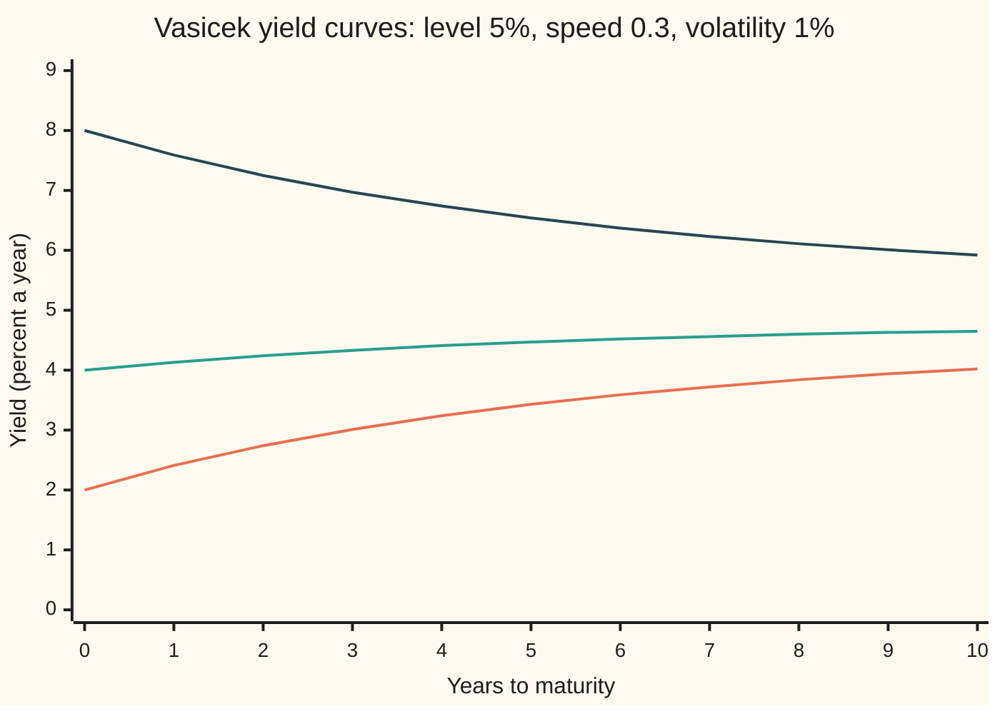
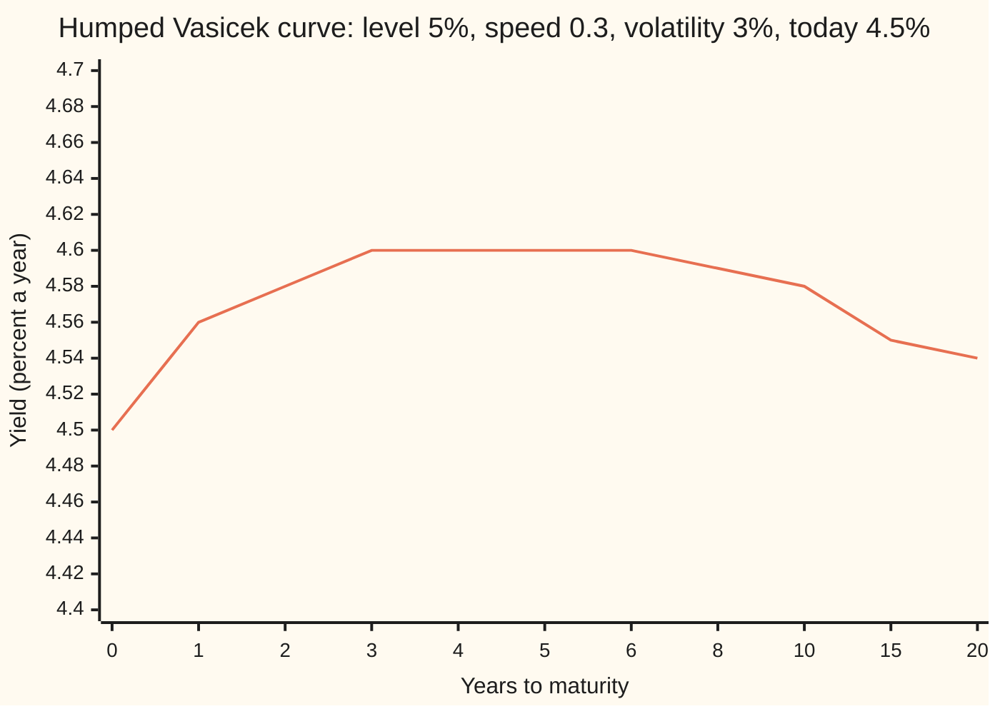

# Vasicek: a mean-reverting normal rate with closed-form bonds

[Syllabus](../../../SYLLABUS.md) → [Financial mathematics](../../../SYLLABUS.md#w12) → [Short-Rate Models](../../../SYLLABUS.md#w12-s30) → Vasicek

---

## General Overview

A bond that pays $1 in five years and nothing before is a **zero-coupon bond**, or a zero. Today the overnight rate, the interest earned on cash lent until tomorrow, is 4 percent a year. Over the next five years it will not stay there. It will also not wander off without limit: when rates run high, borrowing dries up and central banks cut; when they run low, the reverse. Rates are drawn back toward a usual level, here 5 percent.

A ball on a rubber band behaves this way. Pull it and it heads back, fast when far away, slowly when close, while being knocked about at random. Finance calls the pull **mean reversion**: a quantity drawn back toward a long-run level. From here on the target is the **level** and the strength of the pull is the **speed**.

In 1977 Oldřich Vasicek wrote the simplest model with that pull. The rate for the next instant, the **short rate**, is pulled toward 5 percent at speed 0.3 a year and knocked by normal shocks that, left alone for a year, would spread it by a standard deviation of 1 percentage point. Every zero, of every maturity, then has a price in closed form. The 5-year zero is worth $0.7999, about 80 cents on the dollar, a yield of 4.47 percent a year. The same formula prices every maturity at once, so it draws a whole yield curve from four numbers. It also allows the rate to fall below zero, which was a flaw in 1977 and a feature after 2014.

**Model the short rate as a random walk pulled toward a level; the area under its path is then normal, and a bond price, the average of e raised to minus that area, comes out as an exponential of a straight line in today's rate.**

**What kind of fact this is:** a model: normal, mean-reverting rate moves are an assumption that fits calm markets well enough, not a law. Inside the model, the bond formula is a theorem, proved on this card in Why it works.

### The picture: three curves from one formula



Bottom line: today's rate 2 percent, a steeply rising curve. Middle line: the house example, today's rate 4 percent, gently rising; at five years it reads 4.47. Top line: today's rate 8 percent, a falling curve. All three head for the same long yield, 4.94 percent, a little under the 5 percent level; Step 3 explains the gap.

---

## The formula

Notation first. The model is written in the shorthand of Itô calculus ([Ito's lemma](../../11-Stochastic%20processes%20and%20calculus/06-Ito%20Calculus/02-itos-lemma.md)): $dr_t$ is the change in the rate over a short step of time $dt$, and $dW_t$ is a random shock over that step, with average zero and variance $dt$. The model is an Ornstein-Uhlenbeck process, a random walk with a pull toward a level ([Mean reversion](../../11-Stochastic%20processes%20and%20calculus/06-Ito%20Calculus/05-ornstein-uhlenbeck-and-cir-processes.md)):

$$dr_t = a\,(\theta - r_t)\,dt + \sigma\,dW_t$$

**Read it aloud:** each instant the rate moves a fraction of the way toward the level, plus a normal shock of fixed size.

The price today of $1 paid at time $T$:

$$P(0,T) = e^{\,A(T) - B(T)\,r_0}, \qquad B(T) = \frac{1 - e^{-aT}}{a}, \qquad A(T) = \Big(\theta - \frac{\sigma^2}{2a^2}\Big)\big(B(T) - T\big) - \frac{\sigma^2 B(T)^2}{4a}$$

**Read it aloud:** the log of the bond price is a straight line in today's rate, with slope minus $B$ and intercept $A$.

| Symbol | Plain meaning | In our example | Push it up and the answer… |
| --- | --- | --- | --- |
| $r_t$, $r_0$, $r$, $dr_t$ | the short rate at time $t$; today's value; the rate as a variable; its change over one short step | 4% today | $r_0$ up: every bond cheaper, short ones most |
| $\theta$ | the level the rate is pulled toward (read "theta") | 5% | bonds cheaper, long ones most |
| $a$ | the speed of the pull, per year | 0.3 | the curve reaches the level sooner |
| $\sigma$ | the size of the shocks, per year (read "sigma") | 1% | bonds dearer: see Step 3 |
| $dW_t$ | a normal shock over one short step | — | — |
| $t$, $s$, $\tau$, $dt$ | a date; the date a shock lands; time left to maturity; a short step of time | — | — |
| $T$ | years until the $1 is paid | 5 | bond cheaper |
| $P(0,T)$ | today's price of $1 paid at $T$ | 0.7999 | — |
| $B(T)$ | how much a change in today's rate moves the log price; also the rate's remembered weight, in years | 2.5896 | — |
| $A(T)$ | the part of the log price that does not depend on today's rate | −0.1197 | — |
| $R(T)$, $R_\infty$ | the yield $-\ln P(0,T)/T$, the flat rate giving the same price; the yield of a very long bond, $\theta - \sigma^2/(2a^2)$ | 4.47%; 4.94% | — |
| $I_T$, $I$, $m$, $v$ | the area under the rate's path from now to $T$, whose $e^{-I_T}$ is that path's discount factor; its mean; its variance | mean 0.2241, variance 0.001561 | — |

### When it holds

- **Normal shocks of one size.** Real rate volatility changes with the rate's level. Near zero, normal shocks of fixed size put too much weight on deeply negative rates; [Cox-Ingersoll-Ross](03-cox-ingersoll-ross-model.md) scales the shocks with the rate.
- **One source of randomness.** Every yield moves with the same shock, so the 2-year and 30-year yields are perfectly correlated. Real curves also twist; [Beyond one factor](07-two-factor-and-lognormal-short-rate-models.md) adds a second shock.
- **A constant level.** Four numbers cannot reproduce the curve the market shows today, which has its own bends. Bonds priced off Vasicek disagree with quoted prices by basis points (hundredths of a percent) or more; [Hull-White](04-hull-white-model.md) lets the level move with time to fit it exactly.
- **The level is the pricing-world level.** $\theta$ is the level under the pricing weights set up on [A short-rate model](01-the-term-structure-equation.md), with the market price of risk (the extra return investors demand for carrying rate risk) folded in. It is not a forecast of where rates will settle.

---

## Why it works

### Step 0: a bond is an average of discount factors

From [A short-rate model](01-the-term-structure-equation.md): in the pricing world, a zero is worth the average, over all paths the rate might take, of $e^{-I_T}$, where $I_T$ is the area under the path from now to $T$. A path that stays at 4 percent for five years has area 0.2 and discounts $1 to $e^{-0.2}$.

The rest is one fact about normal variables. Vasicek's rate at every date is built from the same normal shocks, added with fixed weights. Any such weighted sum of shared normal shocks is normal, and an area is a sum. So $I_T$ is normal, and the average of $e^{-I}$ for a normal $I$ with mean $m$ and variance $v$ is $e^{-m + v/2}$, the mean of a lognormal variable ([Geometric Brownian motion](../../11-Stochastic%20processes%20and%20calculus/05-Brownian%20Motion/07-geometric-brownian-motion.md) uses the same fact). Only $m$ and $v$ are needed.

### Step 1: solve the rate

Write $x_t = r_t - \theta$, the distance above the level. The pull shrinks it at rate $a$, so without shocks $x_t = x_0 e^{-at}$. Each shock, once it lands, decays the same way. Summing them:

$$r_t = \theta + (r_0 - \theta)\,e^{-at} + \sigma \int_0^t e^{-a(t-s)}\,dW_s$$

The last term is a sum of normal shocks, so $r_t$ is normal. Its mean is $\theta + (r_0 - \theta)e^{-at}$: at five years, 4.78 percent, most of the way from 4 to 5. Its standard deviation at five years is 1.26 percent. The OU card derives both.

### Step 2: the area under the path

Integrate the mean from 0 to $T$. The level contributes $\theta T$. The starting gap $r_0 - \theta$ contributes that gap times

$$\int_0^T e^{-at}\,dt = \frac{1 - e^{-aT}}{a} = B(T).$$

So $B(T)$ is how many years' worth of today's gap the path remembers. A rate with no pull remembers all of it, and $B = T$. At speed 0.3 over five years the path remembers 2.59 years' worth. The mean area is $m = \theta T + (r_0 - \theta)B(T)$, which is 0.2241 here.

The variance of the area is

$$v = \frac{\sigma^2}{a^2}\Big(T - B(T) - \frac{a\,B(T)^2}{2}\Big),$$

0.001561 here. A shock that lands at time $s$ keeps pushing the rate until $T$, adding $B(T-s)$ to the area per unit of shock. Adding the squares of those weights over the whole life gives $v$.

<details>
<summary>The algebra behind the variance</summary>

Swap the order of integration: $\int_0^T \int_0^t e^{-a(t-s)}\,dW_s\,dt = \int_0^T B(T-s)\,dW_s$, since $\int_s^T e^{-a(t-s)}dt = B(T-s)$. The variance of $\int_0^T f(s)\,dW_s$ is $\int_0^T f(s)^2\,ds$ (the Itô isometry). So
$$v = \frac{\sigma^2}{a^2}\int_0^T \big(1 - 2e^{-a\tau} + e^{-2a\tau}\big)d\tau = \frac{\sigma^2}{a^2}\Big(T - 2B + \frac{1 - e^{-2aT}}{2a}\Big).$$
Write $e^{-aT} = 1 - aB$. Then $\frac{1 - e^{-2aT}}{2a} = \frac{(1 - e^{-aT})(1 + e^{-aT})}{2a} = \frac{B(2 - aB)}{2} = B - \frac{aB^2}{2}$, and $v = \frac{\sigma^2}{a^2}\big(T - B - \frac{aB^2}{2}\big)$.

</details>

### Step 3: collect the terms

The price is $e^{-m + v/2}$. Sort the exponent into the part that multiplies $r_0$ and the part that does not:

$$-m = \theta\,(B - T) - B\,r_0, \qquad \frac{v}{2} = -\frac{\sigma^2}{2a^2}(B - T) - \frac{\sigma^2 B^2}{4a}.$$

The terms without $r_0$ add to $A(T)$. The term with $r_0$ is $-B(T)\,r_0$. That is the formula.

The $+v/2$ is **convexity**: $e^{-I}$ bends upward, so spreading $I$ out raises its average (Jensen's inequality). Randomness makes bonds dearer, and more so the longer they run. It is why the long yield $R_\infty$ sits at 4.94 percent, below the 5 percent level: divide the exponent by $T$ and let $T$ grow, and only $\theta - \sigma^2/(2a^2)$ survives.

### Step 4: the same answer from the bond equation

[A short-rate model](01-the-term-structure-equation.md) says every bond price $P$, as a function of the rate $r$ and the time left $\tau$, satisfies

$$\frac{\partial P}{\partial \tau} = a(\theta - r)\frac{\partial P}{\partial r} + \tfrac12\sigma^2 \frac{\partial^2 P}{\partial r^2} - rP, \qquad P = 1 \text{ at } \tau = 0.$$

Guess $P = e^{A(\tau) - B(\tau) r}$. Each derivative brings down a factor: $\partial P/\partial r = -BP$, $\partial^2 P/\partial r^2 = B^2 P$. Divide by $P$ and the equation must hold for every $r$, so the terms in $r$ and the constant terms must each balance:

$$B' = 1 - aB, \qquad A' = -a\theta B + \tfrac12\sigma^2 B^2, \qquad A(0) = B(0) = 0.$$

The first is solved by $B = (1 - e^{-a\tau})/a$; integrating the second gives the same $A$ as Step 3. The code solves both by stepping them forward numerically, without the closed form, and lands on the same price.

A model whose log bond prices are straight lines in the rate is called **affine**. Duffie and Kan (1996) showed which rate models have this property: the drift and the variance of the shocks must both be straight lines in the rate. Vasicek has a straight-line drift and a constant variance; [Cox-Ingersoll-Ross](03-cox-ingersoll-ross-model.md) has a variance proportional to the rate. Both are affine.

---

## Worked numbers, by hand

Level $\theta$ = 5 percent, speed $a$ = 0.3, volatility $\sigma$ = 1 percent, today's rate $r_0$ = 4 percent, $T$ = 5 years.

| Step | Arithmetic | Value |
| --- | --- | --- |
| $e^{-aT}$ | $e^{-1.5}$ | 0.223130 |
| $B(5)$ | $(1 - 0.223130)/0.3$ | 2.589566 |
| level part | $(0.05 - 0.0001/0.18) \times (2.589566 - 5)$ | −0.119183 |
| spread part | $0.0001 \times 2.589566^2 / 1.2$ | 0.000559 |
| $A(5)$ | $-0.119183 - 0.000559$ | −0.119741 |
| rate part | $-2.589566 \times 0.04$ | −0.103583 |
| log of price | $-0.119741 - 0.103583$ | −0.223324 |
| **price** | $e^{-0.223324}$ | **0.7999** |
| yield | $0.223324/5$ | 4.47% |

A promise of $1 in five years costs $0.7999 today. The same $1 discounted at a flat 4 percent would cost $0.8187; the pull toward 5 percent makes the bond cheaper.

### What breaks if you drop a piece

Correct answer $0.7999 for the 5-year zero.

| Mistake | Comes out at | What went wrong |
| --- | --- | --- |
| Discount at today's 4% for all five years | 0.8187 | Ignores the pull toward 5% |
| Discount at the 5% level for all five years | 0.7788 | Ignores that the rate starts below the level |
| Discount along the expected path, no convexity | 0.7992; 30-year 0.2307 against 0.2339 | Average of discount factors taken as the discount factor of the average rate |
| Convexity sign flipped, $-v/2$ | 0.7986 | Spreading the area out raises the average of $e^{-I}$; it does not lower it |
| No pull, speed near 0 | 0.8204 | The path remembers all five years of today's rate, and the shocks pile up without limit |

The code prints every one.

---

## How the curve moves with today's rate

One number, today's short rate, sets the whole curve. The level, speed and volatility fix its shape; $r_0$ slides it.

### The 5-year zero, one rate at a time

```
today's rate   price of $1 in 5 years
    -1%   ████████████████████████████████████  0.9104
     0%   ███████████████████████████████████   0.8871
     2%   █████████████████████████████████     0.8424
     4%   ███████████████████████████████       0.7999
     6%   ██████████████████████████████        0.7595
     8%   ████████████████████████████          0.7212
```

From 2 to 4 percent the price falls from 0.8424 to 0.7999. A flat rate held for five years would fall much further, since the bond would feel all five years of the move. The pull prevents that: a move in today's rate is expected to fade, so the bond feels only $B(5)$ = 2.59 years of it. The 5-year yield moves 0.52 of a point for each point in $r_0$. The code confirms 2.59 by nudging $r_0$ and repricing.

### Negative rates are allowed

The rate at any date is normal, so it has some chance of being below zero. At five years the rate averages 4.78 percent with a standard deviation of 1.26 percent. The chance it is negative is 0.0074 percent at the house volatility, and 2.89 percent if the volatility is 2 percent; 200,000 simulated draws give 2.93 percent.

When today's rate is already negative, a short zero costs more than it pays. At $r_0$ = −0.5 percent, a 3-month zero costs $1.0007 per $1 back. Euro-area, Swiss and Japanese bonds traded like that for years in the decade after 2014. A model with no negative rates cannot price them at all.

### A hump

With larger shocks the long end bends back down, because convexity grows with maturity. Volatility 3 percent, today's rate 4.5 percent:



The one line: the yield climbs from 4.50 toward the level, peaks at 4.60 around four years, then sinks toward the long yield as convexity takes over. So Vasicek draws rising, falling and humped curves. It cannot draw a dip followed by a rise, or match an arbitrary market curve; that needs [Hull-White](04-hull-white-model.md).

---

## Code, from first principles, and it actually runs

The 5-year zero is priced four ways that share no code. First, the closed form. Second, the mean and variance of the area under the path, then the lognormal mean $e^{-m + v/2}$. Third, the bond equation's two ODEs for $A$ and $B$, stepped forward by fourth-order Runge-Kutta with no closed form in sight. Fourth, 8,000 simulated rate paths (4,000 mirrored pairs), each discounted along its own area. The random numbers come from a hand-written generator and the normal CDF from Simpson's rule. The rate sensitivity is checked by nudging $r_0$; the chance of a negative rate is checked by drawing 200,000 rates.

### Python

```python
# Vasicek model -- the check behind the card.  Standard library only.
# Short rate r pulled toward level th at speed a, with volatility s:
#   dr = a (th - r) dt + s dW.   House example: a = 0.3, th = 5%, s = 1%, r0 = 4%.
# The 5-year zero is priced four ways that share no code: the closed form,
# the Gaussian integral of the rate, the bond equation solved as two ODEs by
# Runge-Kutta, and simulated rate paths.  The normal CDF and the random
# numbers are written here.
from math import exp, log, sqrt, cos, pi

A_, TH, S_, R0, T = 0.3, 0.05, 0.01, 0.04, 5.0

def closed(r0, t, a=A_, th=TH, s=S_):                 # road 1: P = exp(lnA - B r0)
    b = (1 - exp(-a * t)) / a
    ln_a = (th - s * s / (2 * a * a)) * (b - t) - s * s * b * b / (4 * a)
    return exp(ln_a - b * r0)

def integral_moments(r0, t, a=A_, th=TH, s=S_):       # mean and variance of the area under r
    b = (1 - exp(-a * t)) / a
    return th * t + (r0 - th) * b, s * s / (a * a) * (t - b - a * b * b / 2)

def by_moments(r0, t):                                # road 2: E[exp(-I)] for a normal I
    m, v = integral_moments(r0, t)
    return exp(-m + v / 2)

def by_ode(r0, t, n=1000):                            # road 3: B' = 1 - aB, lnA' = -a th B + s^2 B^2 / 2
    f = lambda y: (1 - A_ * y[0], -A_ * TH * y[0] + S_ * S_ * y[0] * y[0] / 2)
    y, h = (0.0, 0.0), t / n
    for _ in range(n):
        k1 = f(y); k2 = f((y[0] + h / 2 * k1[0], y[1] + h / 2 * k1[1]))
        k3 = f((y[0] + h / 2 * k2[0], y[1] + h / 2 * k2[1])); k4 = f((y[0] + h * k3[0], y[1] + h * k3[1]))
        y = (y[0] + h / 6 * (k1[0] + 2 * k2[0] + 2 * k3[0] + k4[0]), y[1] + h / 6 * (k1[1] + 2 * k2[1] + 2 * k3[1] + k4[1]))
    return exp(y[1] - y[0] * r0), y[0]

M64 = (1 << 64) - 1
state = 20260928
def uniform():                                        # splitmix64, written out
    global state
    state = (state + 0x9E3779B97F4A7C15) & M64
    z = state
    z = ((z ^ (z >> 30)) * 0xBF58476D1CE4E5B9) & M64
    z = ((z ^ (z >> 27)) * 0x94D049BB133111EB) & M64
    return (((z ^ (z >> 31)) >> 11) + 1) / 9007199254740992.0

def normal():                                         # Box-Muller, cosine half
    u1, u2 = uniform(), uniform()
    return sqrt(-2 * log(u1)) * cos(2 * pi * u2)

def by_paths(r0, t, pairs=4000, steps=250):           # road 4: simulate, discount, average
    dt = t / steps
    decay, sd = exp(-A_ * dt), S_ * sqrt((1 - exp(-2 * A_ * dt)) / (2 * A_))
    vals = []
    for _ in range(pairs):
        rp = rm = r0; ip = im = 0.0
        for _ in range(steps):
            z = normal()
            np_ = TH + (rp - TH) * decay + sd * z; nm = TH + (rm - TH) * decay - sd * z
            ip += (rp + np_) / 2 * dt; im += (rm + nm) / 2 * dt; rp, rm = np_, nm
        vals.append((exp(-ip) + exp(-im)) / 2)
    mean = sum(vals) / pairs
    se = sqrt(sum((x - mean) ** 2 for x in vals) / (pairs - 1) / pairs)
    return mean, se

def ncdf(x, n=2000):                                  # bell-curve area left of x, Simpson
    h = x / n
    g = lambda u: exp(-u * u / 2) / sqrt(2 * pi)
    tot = g(0) + g(x) + sum((4 if i % 2 else 2) * g(i * h) for i in range(1, n))
    return 0.5 + tot * h / 3

def rate_at(t, r0=R0, s=S_):                          # mean and sd of r_t
    return TH + (r0 - TH) * exp(-A_ * t), s * sqrt((1 - exp(-2 * A_ * t)) / (2 * A_))

def yld(r0, t, s=S_): return 100 * (-log(closed(r0, t, s=s)) / t) if t > 0 else 100 * r0

p1 = closed(R0, T); p2 = by_moments(R0, T); p3, b_ode = by_ode(R0, T); p4, se = by_paths(R0, T)
b = (1 - exp(-A_ * T)) / A_
m, v = integral_moments(R0, T)
h = 1e-4
dur_bump = -(closed(R0 + h, T) - closed(R0 - h, T)) / (2 * h) / p1
mu5, sd5 = rate_at(T); mu5b, sd5b = rate_at(T, s=0.02)
neg_1 = ncdf(-mu5 / sd5); neg_2 = ncdf(-mu5b / sd5b)
draws = 200000
neg_count = sum(1 for _ in range(draws) if mu5b + sd5b * normal() < 0)

rows = [
    ("e^(-aT)", exp(-A_ * T)), ("B(5), rate sensitivity in years", b), ("B(5) from the ODE", b_ode),
    ("level part (th - s^2/2a^2)(B - T)", (TH - S_ * S_ / (2 * A_ * A_)) * (b - T)),
    ("spread part s^2 B^2 / 4a", S_ * S_ * b * b / (4 * A_)),
    ("A(5)", log(p1) + b * R0), ("-B(5) r0", -b * R0), ("log of price", log(p1)),
    ("mean of area under r, 0 to 5", m), ("variance of that area", v),
    ("1 closed form P(0,5)", p1), ("2 Gaussian integral", p2), ("3 Runge-Kutta ODE", p3),
    ("4 paths, 4000 antithetic pairs", p4), ("  standard error", se),
    ("5-year yield, percent", yld(R0, T)), ("long yield, percent", 100 * (TH - S_ * S_ / (2 * A_ * A_))),
    ("5-year yield move per point of r0", b / T), ("bumped rate sensitivity", dur_bump),
    ("expected r at 5y, percent", 100 * mu5), ("sd of r at 5y, percent", 100 * sd5),
    ("P(r5 < 0), s = 1%, percent", 100 * neg_1), ("P(r5 < 0), s = 2%, percent", 100 * neg_2),
    ("  simulated, 200000 draws, percent", 100 * neg_count / draws),
    ("3-month zero at r0 = -0.5%", closed(-0.005, 0.25)),
    ("wrong: flat at today's 4%", exp(-R0 * T)), ("wrong: flat at the 5% level", exp(-TH * T)),
    ("wrong: expected path, no convexity", exp(-m)), ("wrong: convexity sign flipped", exp(-m - v / 2)),
    ("wrong: no reversion, a -> 0", exp(-R0 * T + S_ * S_ * T ** 3 / 6)),
    ("30-year zero", closed(R0, 30.0)), ("  30-year, no convexity", exp(-integral_moments(R0, 30.0)[0])),
    ("try: a = 0.03", closed(R0, T, a=0.03)), ("try: s = 3%", closed(R0, T, s=0.03)),
    ("try: r0 = 8%", closed(0.08, T)), ("try: r0 = 0%", closed(0.0, T)),
]
for name, val in rows:
    print(f"{name:<36} {val:>12.6f}")
print()
print("5-year zero by today's rate, percent: price")
for r in (-1, 0, 2, 4, 6, 8):
    print(f"  r0 = {r:>2}%   {closed(r / 100, T):.4f}")
print()
mats = (0, 1, 2, 3, 4, 5, 6, 7, 8, 9, 10)
print("yield curve, percent" + "".join(f"{t:>6}" for t in mats))
for r in (2, 4, 8):
    print(f"  r0 = {r}%, s = 1%    " + "".join(f"{yld(r / 100, t):6.2f}" for t in mats))
humps = (0, 1, 2, 3, 4, 5, 6, 8, 10, 15, 20)
print("hump, maturities   " + "".join(f"{t:>6}" for t in humps))
print("  r0 = 4.5%, s = 3%" + "".join(f"{yld(0.045, t, s=0.03):6.2f}" for t in humps))

assert abs(p1 - p2) < 1e-12, "closed form vs Gaussian integral"
assert abs(p1 - p3) < 1e-10, "closed form vs Runge-Kutta on the bond equation"
assert abs(p4 - p1) < 4 * se, "simulated paths within four standard errors"
assert abs(dur_bump - b_ode) < 1e-6, "bumped sensitivity vs B from the ODE"
assert abs(neg_count / draws - neg_2) < 0.002, "simulated negative-rate share vs normal CDF"
print("ALL CHECKS PASS")
```

**Ran 2026-09-28 on macOS, Python 3.14.6, standard library only. All checks passed. Output, pasted from the run:**

```
e^(-aT)                                  0.223130
B(5), rate sensitivity in years          2.589566
B(5) from the ODE                        2.589566
level part (th - s^2/2a^2)(B - T)       -0.119183
spread part s^2 B^2 / 4a                 0.000559
A(5)                                    -0.119741
-B(5) r0                                -0.103583
log of price                            -0.223324
mean of area under r, 0 to 5             0.224104
variance of that area                    0.001561
1 closed form P(0,5)                     0.799856
2 Gaussian integral                      0.799856
3 Runge-Kutta ODE                        0.799856
4 paths, 4000 antithetic pairs           0.799848
  standard error                         0.000014
5-year yield, percent                    4.466481
long yield, percent                      4.944444
5-year yield move per point of r0        0.517913
bumped rate sensitivity                  2.589566
expected r at 5y, percent                4.776870
sd of r at 5y, percent                   1.258447
P(r5 < 0), s = 1%, percent               0.007357
P(r5 < 0), s = 2%, percent               2.885312
  simulated, 200000 draws, percent       2.928500
3-month zero at r0 = -0.5%               1.000748
wrong: flat at today's 4%                0.818731
wrong: flat at the 5% level              0.778801
wrong: expected path, no convexity       0.799232
wrong: convexity sign flipped            0.798608
wrong: no reversion, a -> 0              0.820438
30-year zero                             0.233919
  30-year, no convexity                  0.230692
try: a = 0.03                            0.817336
try: s = 3%                              0.804864
try: r0 = 8%                             0.721151
try: r0 = 0%                             0.887150

5-year zero by today's rate, percent: price
  r0 = -1%   0.9104
  r0 =  0%   0.8871
  r0 =  2%   0.8424
  r0 =  4%   0.7999
  r0 =  6%   0.7595
  r0 =  8%   0.7212

yield curve, percent     0     1     2     3     4     5     6     7     8     9    10
  r0 = 2%, s = 1%      2.00  2.41  2.74  3.01  3.24  3.43  3.59  3.72  3.84  3.94  4.02
  r0 = 4%, s = 1%      4.00  4.13  4.24  4.33  4.41  4.47  4.52  4.56  4.60  4.63  4.65
  r0 = 8%, s = 1%      8.00  7.59  7.25  6.97  6.74  6.54  6.37  6.23  6.11  6.01  5.92
hump, maturities        0     1     2     3     4     5     6     8    10    15    20
  r0 = 4.5%, s = 3%  4.50  4.56  4.58  4.60  4.60  4.60  4.60  4.59  4.58  4.55  4.54
ALL CHECKS PASS
```

Four roads, one price. The closed form, the Gaussian integral and Runge-Kutta agree to the last printed digit. The simulated paths land within one standard error, 0.000014, of them.

### Rust

Same roads, same generator seed, same labels; built with `rustc --edition 2021 -O`.

```rust
// Vasicek model -- the same check as vasicek_model_check.py, in Rust.  No crates.
// Short rate r pulled toward level th at speed a, with volatility s:
//   dr = a (th - r) dt + s dW.   House example: a = 0.3, th = 5%, s = 1%, r0 = 4%.
// The 5-year zero is priced four ways that share no code: the closed form,
// the Gaussian integral of the rate, the bond equation solved as two ODEs by
// Runge-Kutta, and simulated rate paths.  The normal CDF and the random
// numbers are written here.
use std::f64::consts::PI;

const A_: f64 = 0.3;
const TH: f64 = 0.05;
const S_: f64 = 0.01;
const R0: f64 = 0.04;
const T: f64 = 5.0;

fn closed_g(r0: f64, t: f64, a: f64, s: f64) -> f64 {  // road 1: P = exp(lnA - B r0)
    let b = (1.0 - (-a * t).exp()) / a;
    let ln_a = (TH - s * s / (2.0 * a * a)) * (b - t) - s * s * b * b / (4.0 * a);
    (ln_a - b * r0).exp()
}
fn closed(r0: f64, t: f64) -> f64 { closed_g(r0, t, A_, S_) }

fn integral_moments(r0: f64, t: f64) -> (f64, f64) {  // mean and variance of the area under r
    let b = (1.0 - (-A_ * t).exp()) / A_;
    (TH * t + (r0 - TH) * b, S_ * S_ / (A_ * A_) * (t - b - A_ * b * b / 2.0))
}

fn by_moments(r0: f64, t: f64) -> f64 {                // road 2: E[exp(-I)] for a normal I
    let (m, v) = integral_moments(r0, t);
    (-m + v / 2.0).exp()
}

fn by_ode(r0: f64, t: f64, n: usize) -> (f64, f64) {    // road 3: B' = 1 - aB, lnA' = -a th B + s^2 B^2 / 2
    let f = |y: (f64, f64)| (1.0 - A_ * y.0, -A_ * TH * y.0 + S_ * S_ * y.0 * y.0 / 2.0);
    let (mut y, h) = ((0.0f64, 0.0f64), t / n as f64);
    for _ in 0..n {
        let k1 = f(y);
        let k2 = f((y.0 + h / 2.0 * k1.0, y.1 + h / 2.0 * k1.1));
        let k3 = f((y.0 + h / 2.0 * k2.0, y.1 + h / 2.0 * k2.1));
        let k4 = f((y.0 + h * k3.0, y.1 + h * k3.1));
        y = (y.0 + h / 6.0 * (k1.0 + 2.0 * k2.0 + 2.0 * k3.0 + k4.0),
             y.1 + h / 6.0 * (k1.1 + 2.0 * k2.1 + 2.0 * k3.1 + k4.1));
    }
    ((y.1 - y.0 * r0).exp(), y.0)
}

struct Rng(u64);
impl Rng {
    fn uniform(&mut self) -> f64 {                      // splitmix64, written out
        self.0 = self.0.wrapping_add(0x9E3779B97F4A7C15);
        let mut z = self.0;
        z = (z ^ (z >> 30)).wrapping_mul(0xBF58476D1CE4E5B9);
        z = (z ^ (z >> 27)).wrapping_mul(0x94D049BB133111EB);
        (((z ^ (z >> 31)) >> 11) + 1) as f64 / 9007199254740992.0
    }
    fn normal(&mut self) -> f64 {                       // Box-Muller, cosine half
        let u1 = self.uniform();
        let u2 = self.uniform();
        (-2.0 * u1.ln()).sqrt() * (2.0 * PI * u2).cos()
    }
}

fn by_paths(rng: &mut Rng, r0: f64, t: f64, pairs: usize, steps: usize) -> (f64, f64) {  // road 4
    let dt = t / steps as f64;
    let (decay, sd) = ((-A_ * dt).exp(), S_ * ((1.0 - (-2.0 * A_ * dt).exp()) / (2.0 * A_)).sqrt());
    let mut vals = Vec::with_capacity(pairs);
    for _ in 0..pairs {
        let (mut rp, mut rm, mut ip, mut im) = (r0, r0, 0.0f64, 0.0f64);
        for _ in 0..steps {
            let z = rng.normal();
            let np = TH + (rp - TH) * decay + sd * z;
            let nm = TH + (rm - TH) * decay - sd * z;
            ip += (rp + np) / 2.0 * dt; im += (rm + nm) / 2.0 * dt; rp = np; rm = nm;
        }
        vals.push(((-ip).exp() + (-im).exp()) / 2.0);
    }
    let mut mean = 0.0; for x in &vals { mean += x; } mean /= pairs as f64;
    let mut ss = 0.0; for x in &vals { ss += (x - mean).powi(2); }
    (mean, (ss / (pairs - 1) as f64 / pairs as f64).sqrt())
}

fn ncdf(x: f64) -> f64 {                                // bell-curve area left of x, Simpson
    let n = 2000;
    let h = x / n as f64;
    let g = |u: f64| (-u * u / 2.0).exp() / (2.0 * PI).sqrt();
    let mut s = 0.0;
    for i in 1..n { s += (if i % 2 == 1 { 4.0 } else { 2.0 }) * g(i as f64 * h); }
    let tot = g(0.0) + g(x) + s;
    0.5 + tot * h / 3.0
}

fn rate_at(t: f64, s: f64) -> (f64, f64) {              // mean and sd of r_t
    (TH + (R0 - TH) * (-A_ * t).exp(), s * ((1.0 - (-2.0 * A_ * t).exp()) / (2.0 * A_)).sqrt())
}

fn yld(r0: f64, t: f64, s: f64) -> f64 {
    if t > 0.0 { 100.0 * (-closed_g(r0, t, A_, s).ln() / t) } else { 100.0 * r0 }
}

fn main() {
    let mut rng = Rng(20260928);
    let p1 = closed(R0, T); let p2 = by_moments(R0, T);
    let (p3, b_ode) = by_ode(R0, T, 1000); let (p4, se) = by_paths(&mut rng, R0, T, 4000, 250);
    let b = (1.0 - (-A_ * T).exp()) / A_;
    let (m, v) = integral_moments(R0, T);
    let h = 1e-4;
    let dur_bump = -(closed(R0 + h, T) - closed(R0 - h, T)) / (2.0 * h) / p1;
    let (mu5, sd5) = rate_at(T, S_); let (mu5b, sd5b) = rate_at(T, 0.02);
    let (neg_1, neg_2) = (ncdf(-mu5 / sd5), ncdf(-mu5b / sd5b));
    let draws = 200000;
    let mut neg_count = 0;
    for _ in 0..draws { if mu5b + sd5b * rng.normal() < 0.0 { neg_count += 1; } }
    let rows: Vec<(&str, f64)> = vec![
        ("e^(-aT)", (-A_ * T).exp()), ("B(5), rate sensitivity in years", b), ("B(5) from the ODE", b_ode),
        ("level part (th - s^2/2a^2)(B - T)", (TH - S_ * S_ / (2.0 * A_ * A_)) * (b - T)),
        ("spread part s^2 B^2 / 4a", S_ * S_ * b * b / (4.0 * A_)),
        ("A(5)", p1.ln() + b * R0), ("-B(5) r0", -b * R0), ("log of price", p1.ln()),
        ("mean of area under r, 0 to 5", m), ("variance of that area", v),
        ("1 closed form P(0,5)", p1), ("2 Gaussian integral", p2), ("3 Runge-Kutta ODE", p3),
        ("4 paths, 4000 antithetic pairs", p4), ("  standard error", se),
        ("5-year yield, percent", yld(R0, T, S_)), ("long yield, percent", 100.0 * (TH - S_ * S_ / (2.0 * A_ * A_))),
        ("5-year yield move per point of r0", b / T), ("bumped rate sensitivity", dur_bump),
        ("expected r at 5y, percent", 100.0 * mu5), ("sd of r at 5y, percent", 100.0 * sd5),
        ("P(r5 < 0), s = 1%, percent", 100.0 * neg_1), ("P(r5 < 0), s = 2%, percent", 100.0 * neg_2),
        ("  simulated, 200000 draws, percent", 100.0 * neg_count as f64 / draws as f64),
        ("3-month zero at r0 = -0.5%", closed(-0.005, 0.25)),
        ("wrong: flat at today's 4%", (-R0 * T).exp()), ("wrong: flat at the 5% level", (-TH * T).exp()),
        ("wrong: expected path, no convexity", (-m).exp()), ("wrong: convexity sign flipped", (-m - v / 2.0).exp()),
        ("wrong: no reversion, a -> 0", (-R0 * T + S_ * S_ * T.powi(3) / 6.0).exp()),
        ("30-year zero", closed(R0, 30.0)), ("  30-year, no convexity", (-integral_moments(R0, 30.0).0).exp()),
        ("try: a = 0.03", closed_g(R0, T, 0.03, S_)), ("try: s = 3%", closed_g(R0, T, A_, 0.03)),
        ("try: r0 = 8%", closed(0.08, T)), ("try: r0 = 0%", closed(0.0, T)),
    ];
    for (name, val) in &rows { println!("{:<36} {:>12.6}", name, val); }
    println!();
    println!("5-year zero by today's rate, percent: price");
    for r in [-1i32, 0, 2, 4, 6, 8] { println!("  r0 = {:>2}%   {:.4}", r, closed(r as f64 / 100.0, T)); }
    println!();
    let mats = [0, 1, 2, 3, 4, 5, 6, 7, 8, 9, 10];
    let head: String = mats.iter().map(|t| format!("{:>6}", t)).collect();
    println!("yield curve, percent{}", head);
    for r in [2, 4, 8] {
        let row: String = mats.iter().map(|&t| format!("{:6.2}", yld(r as f64 / 100.0, t as f64, S_))).collect();
        println!("  r0 = {}%, s = 1%    {}", r, row);
    }
    let humps = [0, 1, 2, 3, 4, 5, 6, 8, 10, 15, 20];
    let head: String = humps.iter().map(|t| format!("{:>6}", t)).collect();
    println!("hump, maturities   {}", head);
    let row: String = humps.iter().map(|&t| format!("{:6.2}", yld(0.045, t as f64, 0.03))).collect();
    println!("  r0 = 4.5%, s = 3%{}", row);

    assert!((p1 - p2).abs() < 1e-12, "closed form vs Gaussian integral");
    assert!((p1 - p3).abs() < 1e-10, "closed form vs Runge-Kutta on the bond equation");
    assert!((p4 - p1).abs() < 4.0 * se, "simulated paths within four standard errors");
    assert!((dur_bump - b_ode).abs() < 1e-6, "bumped sensitivity vs B from the ODE");
    assert!((neg_count as f64 / draws as f64 - neg_2).abs() < 0.002, "simulated negative-rate share vs normal CDF");
    println!("ALL CHECKS PASS");
}
```

**Ran 2026-09-28 on macOS, rustc 1.98.1, no crates. All checks passed. Output, pasted from the run:**

```
e^(-aT)                                  0.223130
B(5), rate sensitivity in years          2.589566
B(5) from the ODE                        2.589566
level part (th - s^2/2a^2)(B - T)       -0.119183
spread part s^2 B^2 / 4a                 0.000559
A(5)                                    -0.119741
-B(5) r0                                -0.103583
log of price                            -0.223324
mean of area under r, 0 to 5             0.224104
variance of that area                    0.001561
1 closed form P(0,5)                     0.799856
2 Gaussian integral                      0.799856
3 Runge-Kutta ODE                        0.799856
4 paths, 4000 antithetic pairs           0.799848
  standard error                         0.000014
5-year yield, percent                    4.466481
long yield, percent                      4.944444
5-year yield move per point of r0        0.517913
bumped rate sensitivity                  2.589566
expected r at 5y, percent                4.776870
sd of r at 5y, percent                   1.258447
P(r5 < 0), s = 1%, percent               0.007357
P(r5 < 0), s = 2%, percent               2.885312
  simulated, 200000 draws, percent       2.928500
3-month zero at r0 = -0.5%               1.000748
wrong: flat at today's 4%                0.818731
wrong: flat at the 5% level              0.778801
wrong: expected path, no convexity       0.799232
wrong: convexity sign flipped            0.798608
wrong: no reversion, a -> 0              0.820438
30-year zero                             0.233919
  30-year, no convexity                  0.230692
try: a = 0.03                            0.817336
try: s = 3%                              0.804864
try: r0 = 8%                             0.721151
try: r0 = 0%                             0.887150

5-year zero by today's rate, percent: price
  r0 = -1%   0.9104
  r0 =  0%   0.8871
  r0 =  2%   0.8424
  r0 =  4%   0.7999
  r0 =  6%   0.7595
  r0 =  8%   0.7212

yield curve, percent     0     1     2     3     4     5     6     7     8     9    10
  r0 = 2%, s = 1%      2.00  2.41  2.74  3.01  3.24  3.43  3.59  3.72  3.84  3.94  4.02
  r0 = 4%, s = 1%      4.00  4.13  4.24  4.33  4.41  4.47  4.52  4.56  4.60  4.63  4.65
  r0 = 8%, s = 1%      8.00  7.59  7.25  6.97  6.74  6.54  6.37  6.23  6.11  6.01  5.92
hump, maturities        0     1     2     3     4     5     6     8    10    15    20
  r0 = 4.5%, s = 3%  4.50  4.56  4.58  4.60  4.60  4.60  4.60  4.59  4.58  4.55  4.54
ALL CHECKS PASS
```

The two outputs match line for line, simulations included, since both use the same generator and seed.

> [!TIP]
> **Try changing**
> Guess first, then run it.
> - **A weak pull.** Speed $a$ from 0.3 to 0.03. The rate barely moves off 4 percent in five years, so the price nears the flat-4-percent $0.8187: it comes out at $0.8173.
> - **Bigger shocks.** $\sigma$ from 1 to 3 percent. More convexity, a dearer bond: $0.8049.
> - **A high start.** $r_0$ = 8 percent: $0.7212, and the curve falls, as in the first chart. At $r_0$ = 0: $0.8871.
> - **Longer.** $T$ = 30: $0.2339; without the convexity term, 0.2307.

---

## The usual mistake

> [!warning]
> **Discounting at the average rate.** The expected rate path gives an average area of 0.2241 and a discount factor of 0.7992. The bond is the average of discount factors, 0.7999. For five years the gap is small; for thirty years it is 0.2307 against 0.2339. The curve of $e^{-I}$ bends, so the average of the discount factors beats the discount factor of the average.
>
> - **Taking the maturity as the rate sensitivity.** A 1-point rise in today's rate cuts the 5-year zero's price by about $B(5)$ = 2.59 percent, not 5 percent. The pull means today's rate is remembered for 2.59 years only.
> - **Reading the level as the long yield.** The long yield is 4.94 percent, not 5, because convexity pulls it down by $\sigma^2/(2a^2)$.
> - **Reading the level as a forecast.** $\theta$ is fitted to bond prices, so it includes the premium investors charge for rate risk. A forecast of rates needs the real-world level, which differs by the market price of risk.
> - **Ruling out negative rates.** At 1 percent volatility the chance is small, 0.0074 percent at five years. At 2 percent it is 2.89 percent, enough to misprice an option that pays when rates are low.

---

## Where you meet it in real life

- **Bank and insurance balance sheets.** Asset-liability models project thousands of short-rate paths to value deposits and pension promises; Vasicek and its time-varying cousin are the usual first choice because every bond price along every path is closed-form.
- **Negative-rate markets.** Euro-area, Swiss and Japanese short rates sat below zero for years after 2014. A normal model prices those bonds without special handling; a model with rates kept positive cannot.
- **Bond options.** Because the log bond price is normal, a bond option has a Black-Scholes-style formula: [Bond options](05-bond-options-and-jamshidians-trick.md).
- **Credit portfolios.** The Basel capital formula carries Vasicek's name from a different paper, on loan defaults driven by one common factor. Same author, a different model.

> **Say it back**
> Vasicek models the short rate as a random walk pulled toward a level at a fixed speed, with normal shocks of fixed size. The rate is then normal at every date, and so is the area under its path. A zero is the average of e raised to minus that area, which for a normal area is a closed form: an exponential of a straight line in today's rate. The slope, $B(T)$, is how long today's rate is remembered, 2.59 years for the 5-year zero, which costs $0.7999. The price of the formula is normal rates: they can go negative, and one shock moves every yield together.

---

## What this builds on

- [A short-rate model](01-the-term-structure-equation.md): a bond as the pricing-world average of the path's discount factor, and the equation every bond price satisfies.

## Where this goes next

- [Cox-Ingersoll-Ross](03-cox-ingersoll-ross-model.md): shocks that shrink as the rate nears zero, keeping it positive, still with closed-form bonds.
- [Hull-White](04-hull-white-model.md): Vasicek with a level that moves over time, chosen to reproduce today's market curve exactly.

Vasicek's four numbers cannot reproduce the curve the market quotes today, so its bonds disagree with real prices; how to keep its closed forms and match that curve is [Hull-White](04-hull-white-model.md).

---

## Sources

Verified 2026-09-28: every link below resolves to the publisher's page.

- Vasicek, Oldřich. "An equilibrium characterization of the term structure." *Journal of Financial Economics* 5(2), 1977, 177–188. [DOI](https://doi.org/10.1016/0304-405X(77)90016-2). The original paper: the mean-reverting normal rate and the closed-form bond price.
- Brigo, Damiano, and Fabio Mercurio. *Interest Rate Models: Theory and Practice*, 2nd ed. Springer, 2006. [Publisher page](https://doi.org/10.1007/978-3-540-34604-3). Chapter 3 derives Vasicek's bond price, its curve shapes and its bond options.
- Duffie, Darrell, and Rui Kan. "A yield-factor model of interest rates." *Mathematical Finance* 6(4), 1996, 379–406. [DOI](https://doi.org/10.1111/j.1467-9965.1996.tb00123.x). Which short-rate models give log bond prices that are straight lines in the rate: the affine family.
